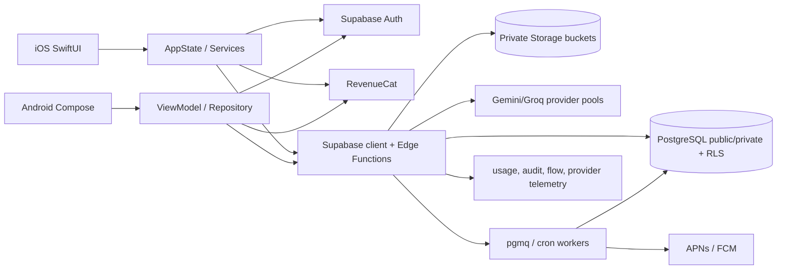
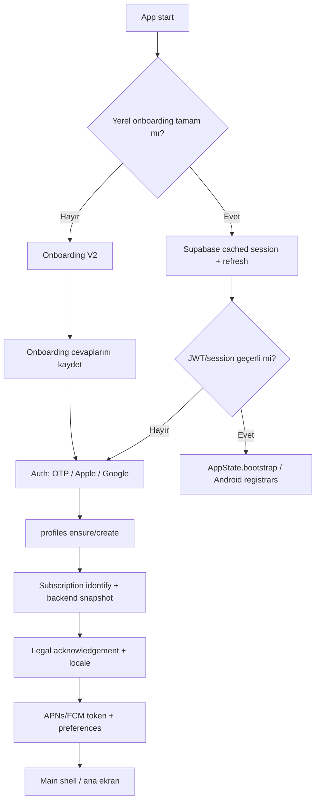
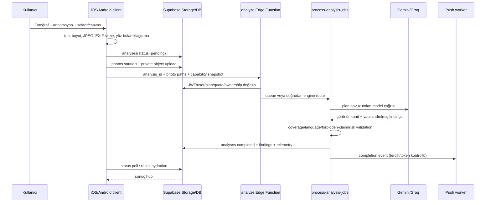
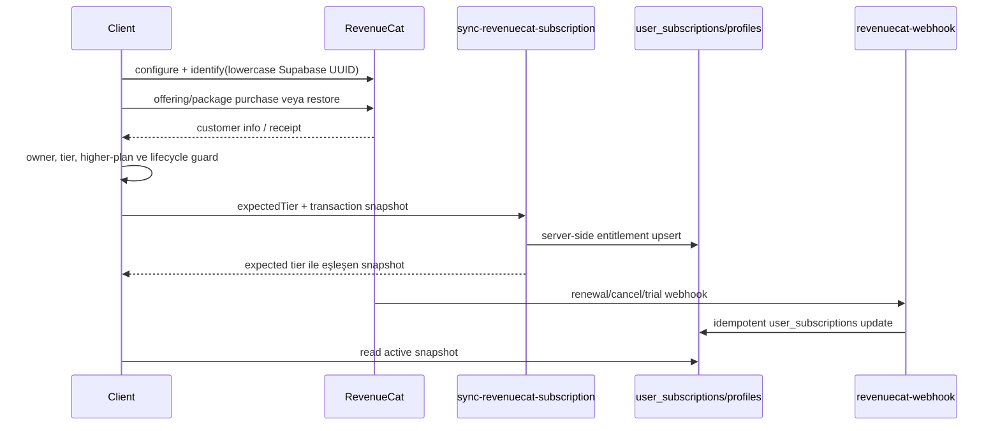
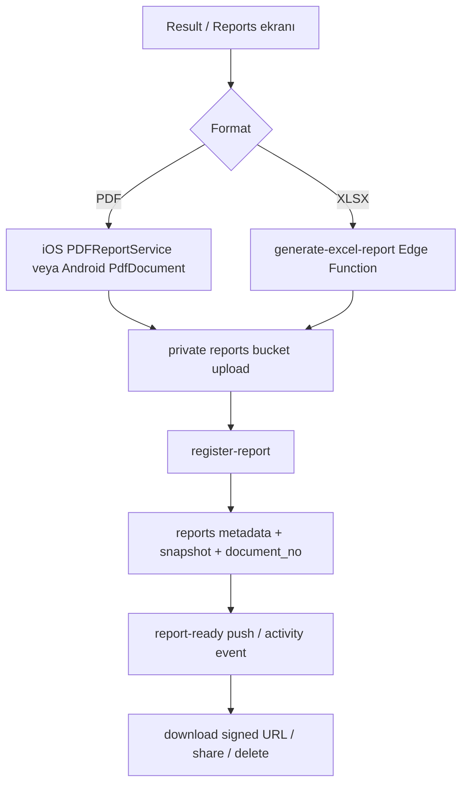
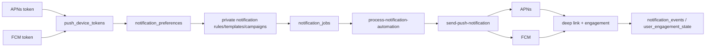
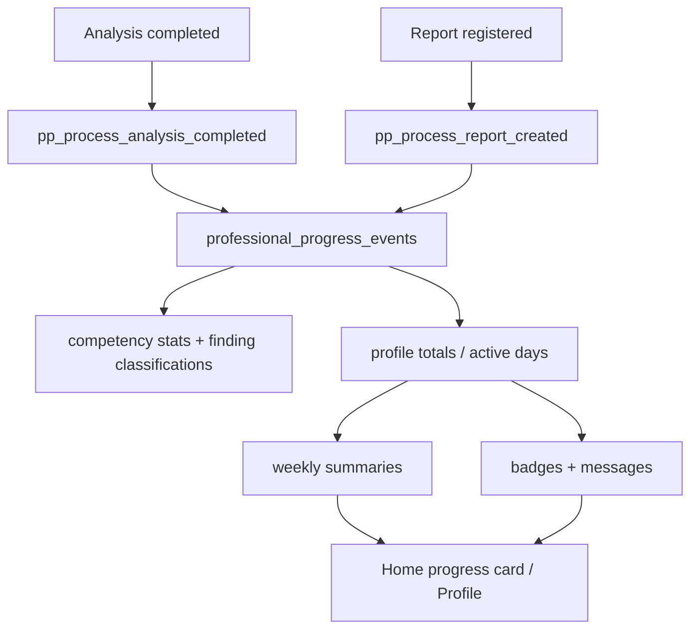
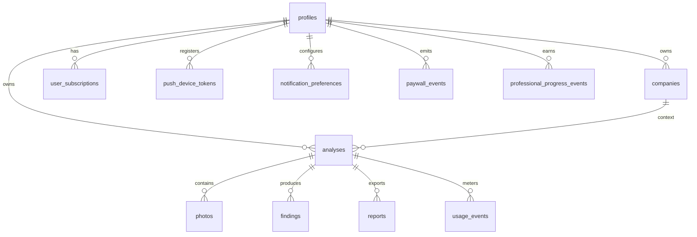
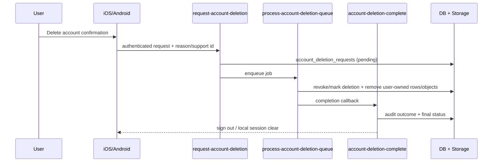

# RiskDetected — Sistem Omurgası ve Güncel Mimari

**Belge amacı:** Büyük bir değişiklik öncesinde iOS, Android, Supabase, veritabanı,
analiz motoru, abonelik, rapor, bildirim ve ölçüm sistemlerinin tek referansını
sağlamak.

**Kaynak / kapsam:** 12 Eylül 2026 tarihinde çalışma ağacındaki kaynak kodu,
Supabase migration/function dosyaları ve bağlı üretim şema metadatası üzerinden
hazırlanmıştır. Üretim değerleri zamanla değişebileceği için bu belge bir
"kod-gerçeği + şema anlık görüntüsü"dür; deploy öncesi yeniden doğrulanmalıdır.
Kullanıcı verisi, erişim token'ı, servis anahtarı, RevenueCat secret'ı veya
sertifika pin değeri bu dosyaya konulmamıştır.

## 1. Ürün ve sınırlar

RiskDetected (SafeScope AI), iş sağlığı ve güvenliği (İSG/HSE) profesyonelinin
fotoğraftan görülebilen riskleri yapılandırılmış bulgulara, risk skorlarına ve
denetlenebilir raporlara dönüştürmesini sağlar.

Ana ürün yolu:

1. Kullanıcı onboarding ve kimlik doğrulamadan geçer.
2. Fotoğraf(lar) seçer; isteğe bağlı işaretleme/annotasyon yapar.
3. Sektör, çalışma yargı alanı, güvenlik profili ve risk yöntemi seçilir.
4. Sunucu görünür kanıta dayalı Gemini/Groq analizi üretir.
5. Fine–Kinney veya 5x5 matris skorları, bulgular ve düzeltici aksiyonlar
   gösterilir.
6. Kullanıcı bulguları düzenleyebilir, PDF/XLSX raporu oluşturabilir, analiz ve
   profesyonel ilerleme geçmişini takip edebilir.

Metin analizi kullanıcı arayüzünden kaldırılmıştır. Veritabanındaki
`analyses.text_input` alanı eski kayıt/uyumluluk içindir; güncel `analyze`
fonksiyonu fotoğraf yolunu bekler ve legacy metin girişini kabul etmez.

## 2. Depo ve sürüm özeti

| Alan | Mevcut durum |
| --- | --- |
| iOS proje | `RiskDetected.xcodeproj`, SwiftUI; bundle `com.riskdetected.app`; marketing `2.0.3`, build `91` |
| Android proje | Gradle çok-modüllü yapı; uygulama `versionName 2.0.2`, `versionCode 14` |
| Backend | Supabase PostgreSQL + Auth + Storage + Edge Functions (Deno/TypeScript) |
| Migration | `supabase/migrations/` altında 463 SQL migration; repository doğrulama scriptleri mevcut |
| iOS üretim bağlantısı | Supabase URL ve publishable client key; PKCE; RevenueCat iOS public key |
| Android üretim bağlantısı | BuildConfig/local.properties/env üzerinden Supabase URL/key ve RevenueCat `goog_` public key |
| Temel analiz fonksiyonu | `supabase/functions/analyze/index.ts` (legacy/engine yönlendirmeleri ile) |
| Kuyruk/işleyici | `process-analysis-jobs`, `process-notification-automation`, `process-account-deletion-queue`; pgmq/pg_cron |
| Üretim şema anlık görüntüsü | 50 `public` + 51 `private` tablo; 100 tablo RLS etkin; 692 PK/FK/unique/check kısıtı; 38 trigger; 178 SQL routine |

Üretim şema ayrıntılarının tamamı belgenin **Ek A — Tam veritabanı sütun
envanteri** bölümündedir.

## 3. Teknoloji yığını

### iOS

- Swift 5 / SwiftUI; `RiskDetectedApp` giriş noktası, `RootView` akış yöneticisi.
- Supabase Swift (Auth, PostgREST, Storage, Edge Functions), PKCE oturum.
- RevenueCat Purchases + RevenueCatUI; StoreKit işlemleri RevenueCat üzerinden.
- Google Sign-In, Sign in with Apple, Meta App Events.
- APNs bildirimleri; PDF/XLSX dışa aktarma; `URLSession` 180 s istek / 600 s kaynak
  timeout.
- `ServerTrustPinningDelegate` ile Supabase host sertifika pinning.
- SwiftUI tasarım sistemi, Türkçe/İngilizce yerelleştirme, onboarding V2,
  legal belge/fallback ve tema tercihi.

### Android

- Kotlin 2.4.10, AGP 9.3.1, Java 17, compileSdk 37, minSdk 26.
- Jetpack Compose + Material 3, Navigation Compose 2.9.8, Hilt 2.60.1/KSP,
  Lifecycle, Coroutines/Flow.
- Supabase Kotlin 3.7.0 + Ktor 3.1.1; RevenueCat 10.16.1.
- CameraX 1.6.1, Android Photo Picker/system picker, Coil; WorkManager.
- Firebase BOM 34.17.0 (Messaging + Crashlytics), Facebook Android SDK 18.3.0,
  Google Credential Manager, Install Referrer.
- Android Keystore/Security Crypto, `FileProvider`, `allowBackup=false`.
- Android uygulamasında v1 sertifika pinning yoktur; HTTPS ve sistem CA zinciri
  kullanılır (bilinen sertifika-pinning farkı).

### Supabase ve veri katmanı

- PostgreSQL; `public` istemciye açık RLS tabloları, `private` servis/analiz
  denetim tabloları.
- Supabase Auth: e-posta OTP/magic link akışı, Apple ve Google provider'ları,
  refresh token rotation, TOTP, PKCE.
- Supabase Storage: `photos`, `reports`, `logos`, `avatars`, `legal-documents`
  bucket'ları; kullanıcı klasörü `{user_id}/...`.
- Edge Functions: JWT kapısı function bazında ayarlanır; public/worker
  endpoint'leri kendi JWT/service-role doğrulamasını ayrıca yapar.
- `pgmq`, `pg_cron`, `pg_net`, `pgcrypto`, `supabase_vault`, `uuid-ossp`,
  `pg_stat_statements` ve `plpgsql` etkin.

## 4. Ortamlar, CLI ve anahtar yönetimi

Operasyon komutlarının tek girişi `scripts/rd_ops_env.mjs`'dir. Komut, macOS
Keychain'den değerleri geçici process environment'a yükler ve işi bitince
kalıcı dosyaya yazmaz. Kullanılan kayıt adları (değerleri değil):

- `riskdetected_supabase_access_token`
- `riskdetected_supabase_db_password`
- `riskdetected_revenuecat_rest_api_key`

Örnek güvenli işlemler:

```bash
node scripts/rd_ops_env.mjs status
node scripts/rd_ops_env.mjs supabase db query --linked --output-format json "select ..."
node scripts/rd_ops_env.mjs revenuecat-delete-user --app-user-id <supabase-uuid>
```

`scripts/rd_store_secret.sh`, migration repository doğrulama/reconcile scriptleri,
AI localization canary ve Makefile yardımcıları bu katmanı kullanır. Android
üretim değerleri `local.properties` veya CI environment'tan gelir; secret/service
role anahtarı istemciye kabul edilmez. Yeni anahtar eklenirken `.gitignore`, CI
secret store ve release gate birlikte güncellenmelidir.

## 5. Katmanlar ve bağımlılık grafiği



### Bağımlılık kuralları

- UI hiçbir zaman servis role veya ham AI anahtarına erişmez.
- İstemci `public` RLS tablolara yalnız kendi `auth.uid()` satırlarını yazar/okur;
  kritik mutasyonlar Edge Function/RPC üzerinden yapılır.
- Abonelikte RevenueCat istemci durumu anlıktır; **backend `user_subscriptions`
  satırı tek entitlement otoritesidir**.
- AI sağlayıcı seçimi plan durumu ve remote route/allowlist kurallarından sonra
  yapılır; Free anahtar havuzu ücretli havuza düşemez.
- Rapor dosyası Storage'a, rapor metadata'sı `reports` tablosuna yazılmadan
  tamamlanmış kabul edilmez.
- Bildirim gönderimi tercih, token, locale ve rollout kontrollerinden geçer;
  istemci bildirimi yalnızca navigasyon olayı olarak işler.

### Statik bağımlılık denetimi

Graphify AST taraması generated/build çıktıları hariç 660 kod dosyasında yapıldı:
7.229 AST node, 14.673 ham edge; normalize graph'ta 6.948 node, 13.206 edge ve
226 community oluştu. 5.000+ node olduğu için HTML görselleştirme bilinçli olarak
çalıştırılmadı. Yüksek bağlantılı düğümler arasında iOS
`AnalysisResultHubView`/`PDFReportService`, plan/paywall tasarım kitleri ve
Android repository/view-model katmanı vardır; bu, değişikliklerin çapraz-platform
etkilenme noktalarını gösteren statik bir sinyaldir, runtime davranışı yerine
geçmez. Ham graph çıktısı geçici çalışma artifact'idir.

## 6. Uygulama açılışı, üyelik ve onboarding



### iOS açılış davranışı

`RiskDetectedApp` bildirim, network ve `AppState`'i başlatır. `RootView` flow'u
`splash → onboarding/auth → main` olarak seçer. `AppState.bootstrap()` paralel
olarak profil, bekleyen onboarding/welcome email, RevenueCat offering ve backend
abonelik snapshot'ını yeniler; hatalı/eksik abonelik okuması paid unlock üretmez.
Session değişince bildirim hazırlığı, legal kabulü, locale, RevenueCat identify,
plan capability ve welcome-email senkronu tetiklenir.

### Android açılış davranışı

`RiskDetectedApplication` Crashlytics/notification channel/Meta kurulumunu,
`MainActivity` ise edge-to-edge Compose shell'i kurar. `ReleaseGate` minimum
sürüm/kill-switch/policy kontrolü yapar. `PushTokenRegistrar`, platform telemetry,
engagement heartbeat, localization/legal/welcome registrars UI'dan bağımsız
başlar; `RdNavHost` typed route'larla shell, capture, result, reports, profile ve
paywall'a gider.

### Onboarding, üyelik ve legal

- `user_onboarding_answers` tek kullanıcı satırıdır; V2 cevapları sektör, tehlike
  sınıfı, sertifika ve denetim sıklığı olarak saklanır.
- `profiles` içinde `preferred_method`, `app_language`, `work_jurisdiction_*`,
  `safety_profile_id/version` analiz bağlamının varsayılanıdır.
- Legal belgeler bundled fallback + `legal-documents` public allowlist ile
  sunulur; kabul `legal_document_acknowledgements`/`consents` üzerinden tutulur.
- Eksik profil otomatik free tier ile oluşturulur; RLS ve server policy son sözü
  söyler.

## 7. Fotoğraf analizi omurgası



### İstemci adımları ve dayanıklılık

1. iOS `AnalysisService.runPhotoAnalysis`, Android `AnalysisRepository` boş
   canvas, izin, fotoğraf sayısı ve plan limitini kontrol eder.
2. JPEG hazırlığı EXIF/location/camera metadata'yı kaldırır; iOS client-side
   face blur uygular. Payload ve timeout sınırları aşılırsa sunucuya pending satırı
   bırakmadan hata verilir.
3. `analyses` satırı `client_submission_id` (Android upsert idempotency),
   `capability_snapshot`, `rollout_snapshot`, plan/build/locale snapshot'ı ile
   oluşturulur. iOS `InFlightAnalysis`, Android in-flight store kesinti sonrası
   resume sağlar.
4. Fotoğraflar `{user_id}/{analysis_id}/...` altında private bucket'a yüklenir.
   Yükleme hatasında cleanup yapılır.
5. `analyze` çağrısı ağda belirsiz biçimde kesilirse istemci 2/3/5 saniye status
   probe yapar; sunucu kabul ettiyse cleanup yapmaz, polling'e geçer.
6. Poll aralığı yaklaşık 2 saniyedir; tek fotoğraf timeout'u 300 s, çoklu fotoğraf
   timeout'u 420 s. `queued/pending/analyzing/completed/failed` durumları işlenir.
7. Tamamlanmada analiz, bulgular, fotoğraf özetleri okunur; eksik findings için
   bounded retry vardır. Tamamlanmış analiz status trigger ile korunur.

### Analiz Edge Function kuralları

- JWT function config'te public olsa bile handler `Authorization`/Supabase user
  doğrular; `analysis_id`, user ownership, company ownership ve input boyutları
  kontrol edilir.
- Modeller: Free `gemini-2.5-flash`; paid standard/policy'ye göre
  `gemini-3.1-flash-lite`/`gemini-2.5-pro`; Groq fallback plan başına ayrıdır.
- Free pool: `GEMINI_API_KEY_PRIMARY/SECONDARY/TERTIARY` (legacy alias dahil);
  paid pool: `GEMINI_API_KEY_PAID` (+ opsiyonel secondary). Raw key loglanmaz,
  yalnız alias/attempt telemetry tutulur.
- Retry yalnız 429/5xx/timeout gibi transient provider hatalarında ve aynı plan
  havuzunda yapılır; Free ücretli havuza geçirilemez.
- Bulgular yalnız fotoğrafta görülen delile dayanır; belirsizlikte
  `needs_field_verification`/"kontrol edilmeli" kullanılır. Sektör ve onboarding
  önceliği etkiler, gözlemi uydurmaz.
- Fine–Kinney: `R = O × F × S`; O `{0.2,0.5,1,3,6,10}`, F `{0.5,1,2,3,6,10}`,
  S `{1,3,7,15,40,100}`. 5x5: O/S `1..5`, `R = O × S`. Skor/band backend
  tarafından yeniden hesaplanır; client-generated skor güvenilmez.
- Coverage, atomic finding, inspection layer, process safety, localization,
  expert-depth ve forbidden-claim denetimleri feature flag/route snapshot'ına
  göre uygulanır. `raw_analysis_input`, `ai_usage_logs` ve private engine tabloları
  audit/kalite incelemesi içindir.

### Analiz API sözleşmesi (özet)

`analyze` isteğinin zorunlu omurgası `analysis_id`, `canvas` (ve çoklu akışta
`canvases`), `analysis_mode`, `photo_paths` veya bounded base64 parçalarıdır.
İsteğe bağlı alanlar `company_id`, `analysis_sector`, `request_id`, `support_id`,
`localization`, `output_language/locale`, `work_jurisdiction_*`,
`safety_profile_id/version`, `method`, client build/platform/capability ve
`client_submission_id`'dir. `text_input` legacy alanı reddedilir. Yanıt ilk
çağrıda kabul için HTTP 202/status `queued|pending`; tamamlanma istemci polling'i
ile `analyses.status=completed` ve ilişkili findings okumasıdır. Quota 429,
ownership/contract 4xx, transient provider 5xx/timeout ve persistence failure
ayrı hata kategorilerine ayrılır; hata sonrası pending satır ve Storage objesi
atomik cleanup/worker retry kurallarına tabidir.

### Motor yönlendirme ve özel engine tabloları

`analyze` ana girişidir. Remote/private konfigürasyonlar
`analysis_engine_routes`, `analysis_engine_configs`, allowlist/experiment
tabloları üzerinden v4/vnext/background/worker rotası seçebilir. Her çalışma
`analysis_engine_runs`, `analysis_provider_attempts`, `analysis_quality_trace_v4`,
`analysis_routing_ledger`, `analysis_job_state/events` ile izlenebilir. Pilot veya
deney rotası açık değilse varsayılan güvenli engine kullanılır.

### Edge Function katalogu

| Function | Sorumluluk |
| --- | --- |
| `analyze` | Fotoğraf analizi ana API'si, auth/plan/quota, AI çağrısı ve sonuç persist |
| `analyze-v4`, `analyze-vnext` | Allowlist/flag ile seçilen yeni motor ve pilot yollar |
| `process-analysis-jobs` | Kuyruktaki analizleri worker attempt/checkpoint ile çalıştırır |
| `analysis-result-sections` | Ücretli sonuç hub bölümlerini entitlement kontrollü sunar |
| `mutate-analysis-finding` | Bulgu edit/delete/manual mutation; optimistic version/audit |
| `generate-excel-report` | Entitlement kontrollü XLSX üretimi |
| `register-report` | Storage dosyasını doğrular, `reports` metadata/snapshot kaydı açar |
| `revenuecat-webhook` | RevenueCat event imzası/idempotency ve subscription snapshot güncellemesi |
| `sync-revenuecat-subscription` | İstemci satın alma/restore sonrasında beklenen tier doğrulaması |
| `sync-revenuecat-attribution` | RevenueCat → paywall/subscription attribution eşleme |
| `send-push-notification` | APNs/FCM gönderimi, preference/token/locale kontrolü |
| `send-report-ready-notification` | Hazır rapor bildirimini dedupe ederek kuyruğa/göndericiye verir |
| `send-trial-reminder-notifications` | Trial bitiş hatırlatma adaylarını üretir |
| `process-notification-automation` | Notification job queue worker'ı |
| `manage-notification-automation` | Admin notification rule/campaign yönetimi |
| `request-account-deletion` | Authenticated silme talebi ve queue başlangıcı |
| `process-account-deletion-queue` | Kullanıcı verisi/Storage silme worker'ı |
| `account-deletion-complete` | Silme sonucunu kapatır, audit/istemci kapanışını tetikler |
| `retention-cleanup` | Süresi dolan raw AI, fotoğraf ve rapor retention temizliği |
| `support-contact` | Rate-limit'li destek talebi, e-posta ve audit |
| `send-welcome-email` | Onboarding sonrası welcome mail idempotency/status akışı |
| `auth-send-email-hook` | Supabase Auth e-posta delivery hook ve attempt telemetry |
| `firebase-phone-bridge` | Firebase/telefon doğrulama köprü entegrasyonu |
| `app-release-policy` | Platform min-version/kill-switch/release policy dağıtımı |
| `notebook-advisory-backfill` | Analiz notebook/advisory private backfill işlemleri |
| `_shared` | Ortak auth, CORS, plan, AI, localization, storage ve güvenlik yardımcıları |

## 8. Planlar, kota ve paywall

### Sunucu plan kuralları

| Plan | Standard analiz/gün | Detailed analiz/gün | Fotoğraf (flag açıkken) | Rapor kotası |
| --- | ---: | ---: | ---: | ---: |
| Free | 1 | yok | 1 | Standard PDF sınırsız; tek seferlik risk-analysis trial ölçümlü |
| Plus | 10 | 2 | 3 | 150/ay |
| Pro | 40 | 10 | 3 | 750/ay |

Değerlerin kaynağı Edge Function plan limitleri, `plan_capability_rules`,
`app_feature_flags` ve özel quota override tablolarıdır. Remote flag okunamazsa
özellik **fail-closed** olur. Güncel varsayılanlar: multi-photo kapalı, Free 1,
paid 3; max 13 finding/photo ve 39 total; backend plan sınırları ayrıca 12–16
hedef bulgu aralığı uygular. Free/paid erişim istemcide gösterilse dahi server
yeniden doğrular.

### Abonelik yaşam döngüsü



- `RevenueCatSubscriptionManager`/Android `BillingRepository` App User ID'yi
  lowercase Supabase UUID ile eşler.
- Ürünler `riskdetected_plus_monthly/yearly` ve `riskdetected_pro_monthly/yearly`
  ailesindedir; package key `package.identifier::productIdentifier` şeklindedir.
- Satın alma öncesi mevcut entitlement, daha yüksek tier ve RevenueCat
  `originalAppUserId` sahipliği doğrulanır. Başka hesap receipt'i unlock edilmez.
- Purchase/restore sonrası sync retry'ları vardır; backend cevabı beklenen tier ile
  eşleşmezse işlem başarısız sayılır. Passive reconcile hiçbir zaman tek başına
  paid unlock üretmez.
- `user_subscriptions` aktif sayılmak için tier paid, status `active/trialing/
  grace_period` ve gelecekte `current_period_ends_at` gerektirir. Yok/expired/
  okuma hatası Free'e kapanır.
- Trial başlangıç/bitiş, renewal, store transaction, offer ve reminder alanları
  aynı satırda tutulur; event geçmişi `subscription_events`'tedir.

### Paywall varyantları ve A/B hazırlığı

- Aktif iOS renderer static ID: `claude_dark_paywall_v2`.
- Önceki turuncu iOS ekranı ve tüm asset/copy bileşenleri kodda korunuyor:
  `claude_design_paywall_v1`; Git'te commit `55ad7d73` ile geri alınabilir.
- Android static ID: `android_default_v1`; eski Android varyantı için runtime
  variant resolver yoktur (Git'te `414eb64e` eski ekran referansıdır).
- `paywall_events` + `paywall_conversion_attribution` event/attribution şemasını
  destekler; ancak mevcut üretim akışında otomatik kullanıcı A/B ataması ve
  remote paywall variant flag'i yoktur. A/B başlatmak için deterministic bucket,
  exposure event, variant config ve sonuç analitiği ayrıca eklenmelidir.

## 9. Bulgu düzenleme ve sonuç hub'ı

- Client sonuç ekranı `analyses`, `findings`, `analysis_photo_summaries` ve
  private result-hub katmanını hydrate eder; paid Result Hub bölümleri backend
  `result_hub_has_paid_access` ile korunur.
- Bulgu düzenleme/silme/manual bulgu ekleme `mutate-analysis-finding` Edge
  Function ve/veya `apply_finding_mutation_atomic` RPC'si üzerinden optimistic
  version guard ile yapılır. `finding_version`, `analysis_edit_version`,
  `finding_edit_events` audit izi bırakır.
- `is_scored`, `report_visibility`, `is_user_deleted`, source photo indices,
  bounding box ve field-verification alanları rapor ve UI görünürlüğünü ayırır.
- Completed analiz status'u trigger tarafından korunur; yalnız yetkili rapor
  finalize/edit snapshot akışları çalışabilir.

## 10. Rapor ve dışa aktarma



- PDF standard cihazda üretilir; iOS risk-analysis/Result Hub PDF hizmetleri,
  Android `PdfReportGenerator` kullanılır.
- XLSX sunucuda üretilir; entitlement, analysis ownership, selected item ve
  localization snapshot tekrar kontrol edilir.
- `register-report` Storage path, size, completed analysis, company ownership ve
  quota doğrulayıp `reports` satırını açar. Dosya yüklenip register edilmezse
  rapor hazır sayılmaz.
- `reports` tablo snapshot alanları (`findings_snapshot_json`,
  `photos_snapshot_json`, `content_snapshot_json`, `analysis_edit_version`)
  raporun sonradan değişmeyen içeriğini taşır.
- Free standard PDF limitsizdir; risk-analysis trial `usage_events` feature'ı
  ile bir kez ölçülür. Plus/Pro aylık sayaçlar `report_counters`,
  `report_year_counters`, `report_scope_year_counters` ile izlenir.

## 11. Bildirim sistemi



- iOS `NotificationService`: permission/register, 6 saatlik token sync cache,
  foreground route, analysis/report open callbacks, progress/reminder tercihleri.
- Android `RdFirebaseMessagingService`, `PushTokenRegistrar`, typed
  `NotificationDeepLink`, `NotificationEngagementRepository` kullanır.
- Tercihler: analysis complete, report ready, account updates, marketing,
  progress weekly/monthly/milestone, trial reminder, app reminder.
- Gönderici önce token platform/environment, user preference, locale, rollout ve
  deduplication kontrol eder; raw payload loglamaz. Open/heartbeat RPC'leri
  `notification_events` ve `user_engagement_state` yazabilir.

## 12. Üyelik, analiz, rapor ve ürün ölçümü

| Ölçüm alanı | Tablo/servis | Ne zaman yazılır |
| --- | --- | --- |
| İstemci akışı | `client_flow_events` / `ClientFlowEvents` | capture, upload, submit, poll, result, hata aşamaları |
| Kullanım/kota | `usage_events` | analiz, report trial ve özellik tüketimi |
| AI maliyet/kalite | `ai_usage_logs`, private provider/engine tabloları | her provider attempt, token, latency, route, persistence |
| Paywall funnel | `paywall_events`, `paywall_conversion_attribution` | exposure, select, purchase start/success, close |
| Abonelik | `subscription_events`, `subscription_conversion_attributions` | webhook/sync/renewal/cancel/trial |
| Rapor etkinliği | private `report_activity_events` | create/download/share/delete |
| Bildirim | `notification_events`, `user_engagement_state` | delivery/open/heartbeat |
| Platform/attribution | `user_platform_daily_activity`, `user_ad_attribution`, Meta ledger | günlük platform ve Meta olayları |
| Profesyonel ilerleme | `professional_progress_*` | analiz/rapor tamamlanması, bulgu sınıfı, rozet/özet |

Mevcut ölçüm açığı: fotoğraf butonuna basma, picker açılışı/iptali, permission
reddi, JPEG hazırlama ve analyze CTA öncesi kopuşlar iki platformda ortak,
kalıcı funnel olarak tam ayrıştırılmıyor. İlk analiz dönüşümü için bu olaylar
eklenmeden kullanıcı terk sebebi kesinleştirilmemelidir.

## 13. Profesyonel ilerleme ve takip

Tamamlanmış analiz trigger'ı `private.pp_process_analysis_completed`, rapor
trigger'ı `private.pp_process_report_created` ile profesyonel ilerleme sistemine
olay üretir. `professional_progress_profiles` toplam MDP, analiz/rapor/bulgu
sayısı, risk dağılımı, aktif gün ve unvanı; events günlük/işlemsel izi; competency
stats/finding classifications yetkinlik dağılımını; weekly summaries/messages/
badges kullanıcıya gösterilecek motivasyon katmanını tutar. Kullanıcı kendi
satırlarını RLS ile okur; rozet/puan hesapları server-side private routine'lerdir.



## 14. Veritabanı modeli ve kritik ilişkiler

### Ana ilişkiler



### Temel tablo semantiği

- `profiles`: kimlik sonrası kullanıcı profili, tier cache, dil/yargı alanı,
  güvenlik profili, platform attribution.
- `analyses`: yaşam döngüsü, input/canvas, plan-capability/rollout snapshot,
  worker durumu, localization, retention, bulgu sayıları ve edit sürümü.
- `photos`: Storage path, boyut/hash/sequence, annotasyon/thumbnail ve retention.
- `findings`: görünür kanıt, risk bileşenleri ve skorlar, aksiyon, sorumlu/tarih,
  kaynak fotoğraf, kullanıcı düzenlemesi ve rapor görünürlüğü.
- `user_subscriptions`: RevenueCat entitlement'ın backend snapshot'ı.
- `reports`: Storage dosyası ve değişmez içerik/entitlement snapshot'ı.
- `plan_capability_rules` + `app_feature_flags`: istemci UX'i değil, server'ın
  tekrar uyguladığı yetenek kapıları.
- `private.*`: engine routing, provider denemeleri, kalite, job, standard,
  notification ve report activity gibi son kullanıcıya kapalı denetim katmanı.

Tam sütun, tip, nullable ve default envanteri Ek A'dadır; canlı sorgu tarihi bu
belgenin üstündeki metadata'dır.

## 15. Güvenlik, gizlilik ve veri yaşam döngüsü

### Uygulama ve API

- İstemciye yalnız Supabase publishable key/public RevenueCat key gömülür; service
  role, DB password, AI ve RevenueCat REST secret istemcide yoktur.
- Auth PKCE, nonce (Apple), Google token doğrulama ve fresh-install marker ile
  eski Keychain oturumunun yanlış kullanıcıya taşınması engellenir.
- Supabase host pinning iOS'ta etkin; Android'de v1 pinning yokluğu açık risk/
  operasyon karar noktasıdır.
- Analiz fotoğrafı EXIF'siz sıkıştırılır, iOS yüz blur uygular; Storage path
  kullanıcı UUID'si ile başlar ve RLS object policy ile korunur.
- Request body, image count/size, timeout, retry ve status transition bounded'dır;
  completed analiz ve finding mutation version guard'a sahiptir.
- RLS etkinlik: 100 tablo; kullanıcı policy'leri çoğunlukla `auth.uid() = user_id`
  veya `id` eşleşmesidir. Storage legal public allowlist ile sınırlıdır; fotoğraf,
  rapor, avatar/logo kullanıcı klasörüyle kısıtlanır.
- Bazı read/delete policy'leri PostgreSQL'de `public` role üzerinde tanımlı olsa da
  `auth.uid() = user_id` veya Storage klasör predicate'i içerir; anonim isteklerde
  `auth.uid()` null olduğundan veri açılmaz. Ek E'deki policy metni değişiklik
  incelemesinin gerçek kaynağıdır.
- Edge Function paid erişimi DB snapshot olmadan açmaz; provider pool yanlış
  plana geçirilemez; loglarda ham anahtar ve ham push payload yoktur.

### Veri saklama ve silme

- Analiz/photo/report retention alanları ve `retention-cleanup`/account deletion
  queue işleyicileri vardır. `account_deletion_requests` talebi doğrulanır,
  queue'ya alınır, `account-deletion-complete` ile sonuçlanır.
- Rapor snapshot'ı dosya silinse bile metadata kalabilir; deletion politikası
  Storage + DB + audit kayıtlarının hangi sırada ve ne kadar tutulacağını migration
  ve operasyon runbook'uyla birlikte doğrulamalıdır.
- Legal kabul, destek ve audit kayıtları amaç sınırlı tutulur; kullanıcı verisi
  export/delete akışları iOS/Android profil ayarlarında bulunur.



### Bilinen güvenlik/operasyon boşlukları

1. Android sertifika pinning uygulanmıyor; HTTPS/system CA ile çalışıyor.
2. Paywall event şeması A/B'yi taşıyabilecek olsa da runtime deterministic variant
   ataması yok.
3. Üretim `analyze` rotalarının özel allowlist/flag kombinasyonu deploy'a göre
   değişebilir; release öncesi `analysis_engine_routes` snapshot alınmalı.
4. Custom SMTP, APNs/FCM credentials, RevenueCat webhook ve cron secrets dış
   servis bağımlılıklarıdır; kod mevcut olsa da dashboard/secret sağlığı ayrıca
   kontrol edilmelidir.
5. iOS 90/Android 12 yeni kullanıcı yolunda sunucuya ulaşmadan kopuşu ayıran
   capture/permission/pre-submit telemetry eksiktir.

## 16. Fonksiyon/trigger tetikleme matrisi

| Tetikleyen | Tetiklenen | Bağımlılık / sonuç |
| --- | --- | --- |
| Auth session change | AppState, profile ensure, locale, legal, notifications, RevenueCat identify | Oturum olmadan paid/report/analysis yok |
| Home capture CTA | AnalysisService/Repository | photo prep → Storage → analyses → `analyze` |
| `analyze` kabulü | job worker / engine route | queue veya doğrudan AI; status polling |
| Analiz `completed` | findings count/retention/localization trigger + professional progress | rapor ve bildirim için hazır |
| Finding edit | mutate Edge Function/RPC | optimistic version; audit event; report edit version artar |
| RevenueCat purchase/restore | backend sync + webhook | `user_subscriptions`; mismatch fail closed |
| Report create/register | Storage + `reports` + activity/progress | report-ready notification koşullu |
| APNs/FCM token | token row + notification preferences | automation için hedef cihaz |
| Notification open | deep link + engagement event | analysis/report/result route |
| Trial/cron zamanı | notification jobs → sender | preference, locale, rollout, dedupe |
| Account deletion request | deletion queue → complete function | Storage/DB cleanup ve audit |

Bağımsız çalışan parçalar: cihaz içi PDF üretimi (sunucu AI gerekmez), onboarding
ve auth ekranları (backend çağrıları hariç), Android/iOS tema/appearance, local
in-flight resume ve paywall UI rendering. Sunucuya bağımlı parçalar: analiz,
entitlement, XLSX, legal manifest güncellemesi, push gönderimi ve profesyonel
ilerleme server aggregation.

## 17. Test, release ve değişiklik öncesi kontrol listesi

- iOS: `RiskDetectedUITests`, snapshot, responsive/localization, flow/Meta event
  testleri; Xcode archive ve App Store preflight.
- Android: unit/instrumented/Robolectric/RoBorazzi, Home/Paywall/Reports/
  Telemetry androidTest; Gradle debug/qa/release gate.
- Supabase: migration repository verify/reconcile, SQL/policy/pgTAP ve Edge
  Function retry/routing/checkpoint testleri.
- Temiz Free hesap + Plus/Pro hesap ile fiziksel iOS ve Android E2E: onboarding,
  photo permission, single/multi photo, quota, purchase/restore, result, PDF,
  XLSX, notification open, deletion.
- Deploy öncesi: DB schema/policy/RLS/trigger snapshot, Edge Function env ve
  webhook imzaları, APNs/FCM credential, RevenueCat offerings/entitlements,
  plan capability/flag ve release minimum-version değerleri kaydedilmeli.
- Her kapsamlı değişiklikte `client_submission_id`, entitlement server authority,
  storage ownership, localization snapshot, audit/retention ve failure cleanup
  gerileme testi yapılmalı.

## 18. Kaynak dosya haritası

| Katman | Önemli yollar |
| --- | --- |
| iOS giriş/akış | `App/RiskDetectedApp.swift`, `App/RootView.swift`, `App/AppState.swift` |
| iOS servis | `App/Services/SupabaseService.swift`, `AuthService.swift`, `SubscriptionManager.swift`, `AnalysisService.swift`, `NotificationService.swift`, `PDFReportService.swift` |
| iOS ekran | `App/Views/Home`, `Analysis`, `Annotate`, `Analyzing`, `Result`, `Report`, `Paywall`, `Profile`, `Onboarding` |
| Android giriş/akış | `android/app/src/main/.../MainActivity.kt`, `RiskDetectedApplication.kt`, `RdNavHost.kt`, `MainShell.kt` |
| Android veri | `android/core/data/.../AnalysisRepository.kt`, `BillingRepository.kt`, `ReportsRepository.kt`, `AuthRepository.kt` |
| Android özellik | `android/feature/onboarding`, `capture`, `analysis`, `reports`, `profile`, `paywall` |
| Backend function | `supabase/functions/analyze`, `process-analysis-jobs`, `analyze-v4`, `analyze-vnext`, `generate-excel-report`, `register-report`, `mutate-analysis-finding`, `revenuecat-webhook`, `sync-revenuecat-subscription` |
| Bildirim/backend | `send-push-notification`, `send-report-ready-notification`, `send-trial-reminder-notifications`, `process-notification-automation` |
| Silme/retention | `request-account-deletion`, `process-account-deletion-queue`, `account-deletion-complete`, `retention-cleanup` |
| Şema/policy | `supabase/migrations/`, `supabase/config.toml`, `supabase/tests/` |
| Operasyon | `scripts/rd_ops_env.mjs`, migration verify/reconcile ve release gate scriptleri |

## 19. Son mobil akış gözlemi (8 Eylül 2026 denetimi)

Bu bölüm canlı log/console ve kaynak koduyla yapılan son read-only denetimin
özetidir; yeni analiz, ücretli istek veya kullanıcı verisi üretilmemiştir.

- Son beş yeni hesap örneğinde yalnız biri tamamlanmış analiz oluşturmuştur.
  Diğer dört hesapta `analyses` POST'u, fotoğraf upload'ı veya `analyze` çağrısı
  kanıtı yoktur; bu, motorun reddettiğini kanıtlamaz. Cihaz içi izin/picker/JPEG/UI
  kopuşu ve kullanıcının vazgeçmesi mevcut ölçümle ayrıştırılamamaktadır.
- Kuyrukta ve son 7 günlük tabloda pending/queued/analyzing birikimi yok; worker
  cron aktiftir. Başarılı örnek iOS 2.0.1/89 ve Android 2.0.0/11'de görülmüştür;
  iOS 2.0.3/91 ve Android 2.0.2/14 için fiziksel cihaz E2E kanıtı ayrıca gerekir.
- Bir Free provider 503/`provider_unavailable`, bir Pro çoklu fotoğraf
  finalizasyon hatası ve geçmiş bir Android ödeme Activity hatası görülmüştür;
  ödeme kaydı otomatik test eşleşmesi olabileceğinden gerçek müşteri checkout
  başarısızlığı olarak sınıflandırılmamalıdır.
- Öncelikli doğrulama: temiz Free hesapta iki platform gerçek cihaz analizi;
  capture/permission/JPEG/CTA öncesi kişisel verisiz `client_flow_events`;
  provider 503 retry politikası; finalizasyon/persistence checkpoint'leri.

Bu gözlem, dokümandaki “sunucuya ulaşmadan kopuş ölçüm açığı” bulgusunun nedenini
anlatır; kullanıcı terk sebebi olarak kesin yorumlanmamalıdır.

---

## Ek A — Tam veritabanı sütun envanteri

Bu bölüm bağlı üretim PostgreSQL `information_schema.columns` sorgusundan
otomatik üretilmiştir. Her satır `schema.table.column — type — NULL/NOT NULL —
default` biçimindedir. Enum ve domain tipleri üretimdeki `USER-DEFINED` adıyla
korunur; varsayılan SQL ifadeleri yorumlanmadan gösterilir. Şema değiştiğinde
bu ek yeniden üretilmelidir.

### `private.admin_analysis_population_overrides`

* `analysis_id` — `uuid` — NOT NULL
* `data_class` — `text` — NOT NULL
* `reason` — `text` — NOT NULL
* `created_at` — `timestamp with time zone` — NOT NULL — default `now()`

### `private.analysis_claim_candidates`

* `id` — `uuid` — NOT NULL
* `engine_run_id` — `uuid` — NOT NULL
* `analysis_id` — `uuid` — NOT NULL
* `user_id` — `uuid` — NOT NULL
* `photo_index` — `integer` — NOT NULL
* `candidate_key` — `text` — NOT NULL
* `module_id` — `text` — NOT NULL
* `raw_label` — `text` — NULL
* `normalized_condition_code` — `text` — NULL
* `evidence_level` — `text` — NOT NULL
* `criticality` — `text` — NOT NULL — default `'ordinary'::text`
* `evidence_region` — `jsonb` — NULL
* `affirmative_cues` — `jsonb` — NOT NULL — default `'[]'::jsonb`
* `counter_cues` — `jsonb` — NOT NULL — default `'[]'::jsonb`
* `event_path` — `jsonb` — NOT NULL — default `'{}'::jsonb`
* `resolvability` — `jsonb` — NOT NULL — default `'{}'::jsonb`
* `normalized_payload` — `jsonb` — NOT NULL — default `'{}'::jsonb`
* `created_at` — `timestamp with time zone` — NOT NULL — default `now()`

### `private.analysis_engine_allowlist`

* `user_id` — `uuid` — NOT NULL
* `enabled` — `boolean` — NOT NULL — default `true`
* `note` — `text` — NULL
* `created_at` — `timestamp with time zone` — NOT NULL — default `now()`
* `updated_at` — `timestamp with time zone` — NOT NULL — default `now()`

### `private.analysis_engine_configs`

* `id` — `uuid` — NOT NULL — default `gen_random_uuid()`
* `engine_version` — `text` — NOT NULL
* `schema_version` — `text` — NOT NULL
* `prompt_version` — `text` — NOT NULL
* `policy_version` — `text` — NOT NULL
* `control_catalog_version` — `text` — NOT NULL
* `config` — `jsonb` — NOT NULL — default `'{}'::jsonb`
* `is_active` — `boolean` — NOT NULL — default `false`
* `created_at` — `timestamp with time zone` — NOT NULL — default `now()`
* `updated_at` — `timestamp with time zone` — NOT NULL — default `now()`

### `private.analysis_engine_routes`

* `analysis_id` — `uuid` — NOT NULL
* `user_id` — `uuid` — NOT NULL
* `engine` — `text` — NOT NULL
* `rollout_mode` — `text` — NOT NULL
* `config_snapshot` — `jsonb` — NOT NULL — default `'{}'::jsonb`
* `pinned_at` — `timestamp with time zone` — NOT NULL — default `now()`

### `private.analysis_engine_runs`

* `id` — `uuid` — NOT NULL — default `gen_random_uuid()`
* `analysis_id` — `uuid` — NOT NULL
* `user_id` — `uuid` — NOT NULL
* `queue_msg_id` — `bigint` — NOT NULL
* `job_generation` — `integer` — NOT NULL
* `job_mode` — `text` — NOT NULL — default `'analysis'::text`
* `engine_version` — `text` — NOT NULL
* `schema_version` — `text` — NOT NULL
* `prompt_version` — `text` — NOT NULL
* `policy_version` — `text` — NOT NULL
* `control_catalog_version` — `text` — NOT NULL
* `visual_input_mode` — `text` — NOT NULL
* `provider` — `text` — NOT NULL
* `model` — `text` — NOT NULL
* `status` — `text` — NOT NULL — default `'running'::text`
* `config_snapshot` — `jsonb` — NOT NULL — default `'{}'::jsonb`
* `total_provider_requests` — `integer` — NOT NULL — default `0`
* `total_input_tokens` — `bigint` — NOT NULL — default `0`
* `total_output_tokens` — `bigint` — NOT NULL — default `0`
* `total_reasoning_tokens` — `bigint` — NOT NULL — default `0`
* `total_cost_usd` — `numeric` — NOT NULL — default `0`
* `duration_ms` — `bigint` — NULL
* `error_code` — `text` — NULL
* `started_at` — `timestamp with time zone` — NOT NULL — default `now()`
* `completed_at` — `timestamp with time zone` — NULL
* `updated_at` — `timestamp with time zone` — NOT NULL — default `now()`
* `ai_execution_route` — `text` — NULL
* `compute_profile` — `text` — NULL
* `compute_profile_version` — `text` — NULL
* `provider_pool` — `text` — NULL
* `requested_service_tier` — `text` — NULL
* `total_standard_equivalent_cost_usd` — `numeric` — NOT NULL — default `0`
* `engine_variant` — `text` — NULL

### `private.analysis_fact_lineage`

* `id` — `uuid` — NOT NULL — default `gen_random_uuid()`
* `engine_run_id` — `uuid` — NOT NULL
* `analysis_id` — `uuid` — NOT NULL
* `user_id` — `uuid` — NOT NULL
* `fact_trace_id` — `text` — NOT NULL
* `final_ordinal` — `integer` — NULL
* `final_finding_id` — `uuid` — NULL
* `source_photo_indices` — `ARRAY` — NOT NULL — default `'{}'::integer[]`
* `evidence_regions` — `jsonb` — NOT NULL — default `'[]'::jsonb`
* `semantic_inputs` — `jsonb` — NOT NULL — default `'{}'::jsonb`
* `score_output` — `jsonb` — NOT NULL — default `'{}'::jsonb`
* `mutations` — `jsonb` — NOT NULL — default `'[]'::jsonb`
* `reason_codes` — `ARRAY` — NOT NULL — default `'{}'::text[]`
* `created_at` — `timestamp with time zone` — NOT NULL — default `now()`

### `private.analysis_hard_rejection_ledger`

* `id` — `bigint` — NOT NULL
* `engine_run_id` — `uuid` — NOT NULL
* `analysis_id` — `uuid` — NOT NULL
* `candidate_id` — `uuid` — NULL
* `reason_code` — `text` — NOT NULL
* `criticality` — `text` — NOT NULL
* `evidence_snapshot` — `jsonb` — NOT NULL — default `'{}'::jsonb`
* `created_at` — `timestamp with time zone` — NOT NULL — default `now()`

### `private.analysis_human_reviews`

* `id` — `uuid` — NOT NULL — default `gen_random_uuid()`
* `engine_run_id` — `uuid` — NOT NULL
* `analysis_id` — `uuid` — NOT NULL
* `candidate_id` — `uuid` — NULL
* `item_id` — `uuid` — NULL
* `reviewer_user_id` — `uuid` — NULL
* `label` — `text` — NOT NULL
* `notes` — `text` — NULL
* `review_payload` — `jsonb` — NOT NULL — default `'{}'::jsonb`
* `created_at` — `timestamp with time zone` — NOT NULL — default `now()`

### `private.analysis_inspection_signals`

* `id` — `uuid` — NOT NULL — default `gen_random_uuid()`
* `engine_run_id` — `uuid` — NOT NULL
* `analysis_id` — `uuid` — NOT NULL
* `user_id` — `uuid` — NOT NULL
* `signal_id` — `text` — NOT NULL
* `photo_index` — `integer` — NOT NULL
* `evidence_region` — `jsonb` — NULL
* `affirmative_cues` — `jsonb` — NOT NULL — default `'[]'::jsonb`
* `potential_consequence_class` — `text` — NULL
* `reason_code` — `text` — NOT NULL
* `status` — `text` — NOT NULL
* `created_at` — `timestamp with time zone` — NOT NULL — default `now()`

<!-- DB_CHUNK_0 -->
### `private.analysis_item_feedback`

* `id` — `uuid` — NOT NULL — default `gen_random_uuid()`
* `user_id` — `uuid` — NOT NULL
* `analysis_id` — `uuid` — NOT NULL
* `target_kind` — `text` — NOT NULL
* `target_key` — `text` — NOT NULL
* `public_finding_id` — `uuid` — NULL
* `notebook_entry_id` — `uuid` — NULL
* `section` — `text` — NOT NULL
* `item_class` — `text` — NULL
* `rating` — `smallint` — NOT NULL
* `reason_code` — `text` — NULL
* `note` — `text` — NULL
* `content_snapshot` — `jsonb` — NOT NULL — default `'{}'::jsonb`
* `context_snapshot` — `jsonb` — NOT NULL — default `'{}'::jsonb`
* `created_at` — `timestamp with time zone` — NOT NULL — default `now()`
* `updated_at` — `timestamp with time zone` — NOT NULL — default `now()`

### `private.analysis_item_standard_links`

* `item_id` — `uuid` — NOT NULL
* `standard_id` — `text` — NOT NULL
* `standard_version_id` — `uuid` — NULL
* `applicability_rule_id` — `uuid` — NULL
* `reference_text` — `text` — NULL
* `created_at` — `timestamp with time zone` — NOT NULL — default `now()`

### `private.analysis_items_v4`

* `id` — `uuid` — NOT NULL
* `engine_run_id` — `uuid` — NOT NULL
* `analysis_id` — `uuid` — NOT NULL
* `user_id` — `uuid` — NOT NULL
* `candidate_id` — `uuid` — NULL
* `public_finding_id` — `uuid` — NULL
* `item_class` — `text` — NOT NULL
* `is_scored` — `boolean` — NOT NULL
* `criticality` — `text` — NOT NULL — default `'ordinary'::text`
* `title` — `text` — NOT NULL
* `description` — `text` — NULL
* `control_text` — `text` — NULL
* `root_cause_text` — `text` — NULL
* `references_text` — `text` — NULL
* `needs_field_verification` — `boolean` — NOT NULL — default `false`
* `source_photo_indices` — `ARRAY` — NOT NULL — default `'{}'::integer[]`
* `display_order` — `integer` — NOT NULL
* `score_payload` — `jsonb` — NULL
* `internal_priority` — `jsonb` — NOT NULL — default `'{}'::jsonb`
* `canonical_payload` — `jsonb` — NOT NULL — default `'{}'::jsonb`
* `created_at` — `timestamp with time zone` — NOT NULL — default `now()`

### `private.analysis_job_events`

* `id` — `bigint` — NOT NULL
* `analysis_id` — `uuid` — NOT NULL
* `user_id` — `uuid` — NOT NULL
* `msg_id` — `bigint` — NOT NULL
* `job_generation` — `integer` — NOT NULL
* `worker_attempt` — `integer` — NOT NULL
* `job_mode` — `text` — NOT NULL
* `event_type` — `text` — NOT NULL
* `http_status` — `integer` — NULL
* `response_code` — `text` — NULL
* `claim_action` — `text` — NULL
* `safe_error_text` — `character varying` — NULL
* `created_at` — `timestamp with time zone` — NOT NULL — default `now()`

### `private.analysis_job_state`

* `analysis_id` — `uuid` — NOT NULL
* `user_id` — `uuid` — NOT NULL
* `active_msg_id` — `bigint` — NULL
* `job_mode` — `text` — NOT NULL — default `'analysis'::text`
* `generation` — `integer` — NOT NULL — default `1`
* `claim_token` — `uuid` — NULL
* `claimed_at` — `timestamp with time zone` — NULL
* `lease_expires_at` — `timestamp with time zone` — NULL
* `worker_attempt_count` — `integer` — NOT NULL — default `0`
* `created_at` — `timestamp with time zone` — NOT NULL — default `now()`
* `updated_at` — `timestamp with time zone` — NOT NULL — default `now()`

### `private.analysis_module_audits`

* `id` — `uuid` — NOT NULL — default `gen_random_uuid()`
* `engine_run_id` — `uuid` — NOT NULL
* `analysis_id` — `uuid` — NOT NULL
* `user_id` — `uuid` — NOT NULL
* `photo_index` — `integer` — NOT NULL
* `module_id` — `text` — NOT NULL
* `entity_refs` — `ARRAY` — NOT NULL — default `'{}'::text[]`
* `status` — `text` — NOT NULL
* `created_at` — `timestamp with time zone` — NOT NULL — default `now()`

### `private.analysis_notebook_advisories`

* `analysis_id` — `uuid` — NOT NULL
* `user_id` — `uuid` — NOT NULL
* `source_finding_id` — `uuid` — NOT NULL
* `language` — `text` — NOT NULL
* `advisory_text` — `text` — NOT NULL
* `source_hash` — `text` — NOT NULL
* `generator_version` — `text` — NOT NULL
* `generator_kind` — `text` — NOT NULL
* `created_at` — `timestamp with time zone` — NOT NULL — default `now()`
* `updated_at` — `timestamp with time zone` — NOT NULL — default `now()`

### `private.analysis_notebook_entries`

* `id` — `uuid` — NOT NULL
* `analysis_id` — `uuid` — NOT NULL
* `user_id` — `uuid` — NOT NULL
* `language` — `text` — NOT NULL
* `projection_version` — `text` — NOT NULL
* `template_version` — `text` — NOT NULL
* `grouping_key` — `text` — NOT NULL
* `source_finding_ids` — `ARRAY` — NOT NULL — default `'{}'::uuid[]`
* `source_hash` — `text` — NOT NULL
* `finding_text_generated` — `text` — NOT NULL
* `recommendation_text_generated` — `text` — NOT NULL
* `reference_text_generated` — `text` — NULL
* `finding_text_override` — `text` — NULL
* `recommendation_text_override` — `text` — NULL
* `reference_text_override` — `text` — NULL
* `display_order` — `integer` — NOT NULL
* `is_suppressed` — `boolean` — NOT NULL — default `false`
* `is_projection_obsolete` — `boolean` — NOT NULL — default `false`
* `is_stale` — `boolean` — NOT NULL — default `false`
* `created_at` — `timestamp with time zone` — NOT NULL — default `now()`
* `updated_at` — `timestamp with time zone` — NOT NULL — default `now()`

### `private.analysis_notebook_entry_revisions`

* `id` — `bigint` — NOT NULL
* `entry_id` — `uuid` — NOT NULL
* `user_id` — `uuid` — NOT NULL
* `analysis_id` — `uuid` — NOT NULL
* `revision` — `integer` — NOT NULL
* `action` — `text` — NOT NULL
* `previous_snapshot` — `jsonb` — NOT NULL — default `'{}'::jsonb`
* `current_snapshot` — `jsonb` — NOT NULL — default `'{}'::jsonb`
* `created_at` — `timestamp with time zone` — NOT NULL — default `now()`

### `private.analysis_openai_background_responses`

* `id` — `uuid` — NOT NULL — default `gen_random_uuid()`
* `engine_run_id` — `uuid` — NOT NULL
* `photo_run_id` — `uuid` — NOT NULL
* `analysis_id` — `uuid` — NOT NULL
* `user_id` — `uuid` — NOT NULL
* `phase` — `text` — NOT NULL
* `logical_key` — `text` — NOT NULL
* `attempt_id` — `uuid` — NOT NULL — default `gen_random_uuid()`
* `attempt_kind` — `text` — NOT NULL
* `attempt_number` — `integer` — NOT NULL — default `1`
* `model` — `text` — NOT NULL
* `prompt_sha256` — `text` — NOT NULL
* `provider_request_id` — `text` — NULL
* `provider_status` — `text` — NOT NULL — default `'creating'::text`
* `poll_count` — `integer` — NOT NULL — default `0`
* `last_http_status` — `integer` — NULL
* `last_duration_ms` — `bigint` — NULL
* `error_code` — `text` — NULL
* `submitted_at` — `timestamp with time zone` — NULL
* `last_polled_at` — `timestamp with time zone` — NULL
* `expires_at` — `timestamp with time zone` — NULL
* `terminal_at` — `timestamp with time zone` — NULL
* `created_at` — `timestamp with time zone` — NOT NULL — default `now()`
* `updated_at` — `timestamp with time zone` — NOT NULL — default `now()`

<!-- DB_CHUNK_1 -->
### `private.analysis_photo_runs`

* `id` — `uuid` — NOT NULL — default `gen_random_uuid()`
* `engine_run_id` — `uuid` — NOT NULL
* `analysis_id` — `uuid` — NOT NULL
* `user_id` — `uuid` — NOT NULL
* `photo_id` — `uuid` — NULL
* `photo_index` — `integer` — NOT NULL
* `storage_path` — `text` — NOT NULL
* `provider` — `text` — NOT NULL
* `model` — `text` — NOT NULL
* `status` — `text` — NOT NULL — default `'pending'::text`
* `attempt_count` — `integer` — NOT NULL — default `0`
* `normalized_output` — `jsonb` — NULL
* `output_sha256` — `text` — NULL
* `input_tokens` — `bigint` — NOT NULL — default `0`
* `output_tokens` — `bigint` — NOT NULL — default `0`
* `reasoning_tokens` — `bigint` — NOT NULL — default `0`
* `cost_usd` — `numeric` — NOT NULL — default `0`
* `duration_ms` — `bigint` — NULL
* `error_code` — `text` — NULL
* `started_at` — `timestamp with time zone` — NULL
* `completed_at` — `timestamp with time zone` — NULL
* `updated_at` — `timestamp with time zone` — NOT NULL — default `now()`

### `private.analysis_provider_attempts`

* `id` — `uuid` — NOT NULL
* `engine_run_id` — `uuid` — NOT NULL
* `photo_run_id` — `uuid` — NULL
* `analysis_id` — `uuid` — NOT NULL
* `user_id` — `uuid` — NOT NULL
* `attempt_kind` — `text` — NOT NULL
* `attempt_number` — `integer` — NOT NULL
* `provider` — `text` — NOT NULL
* `model` — `text` — NOT NULL
* `state` — `text` — NOT NULL
* `provider_request_id` — `text` — NULL
* `input_tokens` — `bigint` — NOT NULL — default `0`
* `output_tokens` — `bigint` — NOT NULL — default `0`
* `reasoning_tokens` — `bigint` — NOT NULL — default `0`
* `cached_input_tokens` — `bigint` — NOT NULL — default `0`
* `cost_usd` — `numeric` — NOT NULL — default `0`
* `duration_ms` — `bigint` — NULL
* `http_status` — `integer` — NULL
* `error_code` — `text` — NULL
* `created_at` — `timestamp with time zone` — NOT NULL — default `now()`
* `updated_at` — `timestamp with time zone` — NOT NULL — default `now()`
* `compute_profile` — `text` — NULL
* `provider_pool` — `text` — NULL
* `requested_service_tier` — `text` — NULL
* `effective_service_tier` — `text` — NULL
* `standard_equivalent_cost_usd` — `numeric` — NOT NULL — default `0`
* `service_tier_fallback_reason` — `text` — NULL
* `prompt_sha256` — `text` — NULL
* `prompt_bundle_sha256` — `text` — NULL
* `max_output_tokens` — `integer` — NULL

### `private.analysis_provider_experiment_overrides`

* `experiment_id` — `uuid` — NOT NULL — default `gen_random_uuid()`
* `user_id` — `uuid` — NOT NULL
* `provider` — `text` — NOT NULL
* `model` — `text` — NOT NULL
* `reasoning_effort` — `text` — NOT NULL — default `'high'::text`
* `remaining_analyses` — `integer` — NOT NULL — default `1`
* `enabled` — `boolean` — NOT NULL — default `false`
* `experiment_label` — `text` — NOT NULL
* `expires_at` — `timestamp with time zone` — NOT NULL
* `last_consumed_analysis_id` — `uuid` — NULL
* `created_at` — `timestamp with time zone` — NOT NULL — default `now()`
* `updated_at` — `timestamp with time zone` — NOT NULL — default `now()`

### `private.analysis_quality_trace_v4`

* `engine_run_id` — `uuid` — NOT NULL
* `analysis_id` — `uuid` — NOT NULL
* `user_id` — `uuid` — NOT NULL
* `prompt_sha256` — `text` — NOT NULL
* `version_snapshot` — `jsonb` — NOT NULL
* `photo_coverage_matrix` — `jsonb` — NOT NULL — default `'[]'::jsonb`
* `candidate_counts` — `jsonb` — NOT NULL — default `'{}'::jsonb`
* `routing_counts` — `jsonb` — NOT NULL — default `'{}'::jsonb`
* `critical_silent_drop_count` — `integer` — NOT NULL — default `0`
* `targeted_queue` — `jsonb` — NOT NULL — default `'{}'::jsonb`
* `standards_trace` — `jsonb` — NOT NULL — default `'{}'::jsonb`
* `provider_usage` — `jsonb` — NOT NULL — default `'{}'::jsonb`
* `quality_flags` — `ARRAY` — NOT NULL — default `'{}'::text[]`
* `trace` — `jsonb` — NOT NULL — default `'{}'::jsonb`
* `created_at` — `timestamp with time zone` — NOT NULL — default `now()`
* `updated_at` — `timestamp with time zone` — NOT NULL — default `now()`

### `private.analysis_quota_overrides`

* `user_id` — `uuid` — NOT NULL
* `daily_standard_limit` — `integer` — NULL
* `daily_detailed_limit` — `integer` — NULL
* `enabled` — `boolean` — NOT NULL — default `true`
* `expires_at` — `timestamp with time zone` — NULL
* `reason` — `text` — NOT NULL
* `created_at` — `timestamp with time zone` — NOT NULL — default `now()`
* `updated_at` — `timestamp with time zone` — NOT NULL — default `now()`

### `private.analysis_result_events`

* `id` — `bigint` — NOT NULL
* `user_id` — `uuid` — NOT NULL
* `analysis_id` — `uuid` — NULL
* `client_event_id` — `uuid` — NOT NULL
* `funnel_session_id` — `uuid` — NULL
* `event_name` — `text` — NOT NULL
* `section` — `text` — NULL
* `target_kind` — `text` — NULL
* `target_key` — `text` — NULL
* `plan_snapshot` — `text` — NOT NULL — default `'free'::text`
* `client_platform` — `text` — NULL
* `client_app_version` — `text` — NULL
* `client_app_build` — `text` — NULL
* `metadata` — `jsonb` — NOT NULL — default `'{}'::jsonb`
* `created_at` — `timestamp with time zone` — NOT NULL — default `now()`

### `private.analysis_result_hub_allowlist`

* `user_id` — `uuid` — NOT NULL
* `enabled` — `boolean` — NOT NULL — default `false`
* `note` — `text` — NULL
* `created_at` — `timestamp with time zone` — NOT NULL — default `now()`
* `updated_at` — `timestamp with time zone` — NOT NULL — default `now()`

### `private.analysis_routing_ledger`

* `id` — `bigint` — NOT NULL
* `engine_run_id` — `uuid` — NOT NULL
* `analysis_id` — `uuid` — NOT NULL
* `candidate_id` — `uuid` — NULL
* `from_state` — `text` — NOT NULL
* `to_state` — `text` — NOT NULL
* `reason_code` — `text` — NOT NULL
* `evidence_level` — `text` — NULL
* `details` — `jsonb` — NOT NULL — default `'{}'::jsonb`
* `created_at` — `timestamp with time zone` — NOT NULL — default `now()`

### `private.analysis_targeted_runs`

* `id` — `uuid` — NOT NULL — default `gen_random_uuid()`
* `engine_run_id` — `uuid` — NOT NULL
* `analysis_id` — `uuid` — NOT NULL
* `user_id` — `uuid` — NOT NULL
* `photo_run_id` — `uuid` — NOT NULL
* `signal_id` — `text` — NOT NULL
* `photo_index` — `integer` — NOT NULL
* `provider` — `text` — NOT NULL
* `model` — `text` — NOT NULL
* `status` — `text` — NOT NULL
* `normalized_output` — `jsonb` — NULL
* `output_sha256` — `text` — NULL
* `error_code` — `text` — NULL
* `created_at` — `timestamp with time zone` — NOT NULL — default `now()`
* `completed_at` — `timestamp with time zone` — NOT NULL — default `now()`
* `updated_at` — `timestamp with time zone` — NOT NULL — default `now()`

### `private.analysis_targeted_runs_v4`

* `id` — `uuid` — NOT NULL — default `gen_random_uuid()`
* `engine_run_id` — `uuid` — NOT NULL
* `analysis_id` — `uuid` — NOT NULL
* `user_id` — `uuid` — NOT NULL
* `region_key` — `text` — NOT NULL
* `candidate_ids` — `ARRAY` — NOT NULL — default `'{}'::uuid[]`
* `photo_index` — `integer` — NOT NULL
* `status` — `text` — NOT NULL
* `provider_attempt_id` — `uuid` — NULL
* `result` — `jsonb` — NULL
* `created_at` — `timestamp with time zone` — NOT NULL — default `now()`
* `updated_at` — `timestamp with time zone` — NOT NULL — default `now()`

<!-- DB_CHUNK_2 -->
### `private.analysis_training_cards`

* `id` — `uuid` — NOT NULL
* `analysis_id` — `uuid` — NOT NULL
* `user_id` — `uuid` — NOT NULL
* `catalog_code` — `text` — NOT NULL
* `engine_version` — `text` — NOT NULL
* `catalog_version` — `text` — NOT NULL
* `recommendation_class` — `text` — NOT NULL
* `applicability` — `text` — NOT NULL
* `group_code` — `text` — NOT NULL
* `title` — `text` — NOT NULL
* `category_label` — `text` — NOT NULL
* `audience_label` — `text` — NOT NULL
* `recommendation_text` — `text` — NOT NULL
* `duration_label` — `text` — NULL
* `duration_value` — `text` — NULL
* `duration_note` — `text` — NULL
* `trigger_codes` — `jsonb` — NOT NULL — default `'[]'::jsonb`
* `source_finding_ids` — `jsonb` — NOT NULL — default `'[]'::jsonb`
* `display_order` — `integer` — NOT NULL — default `0`
* `generated_at` — `timestamp with time zone` — NOT NULL — default `now()`
* `updated_at` — `timestamp with time zone` — NOT NULL — default `now()`

### `private.analysis_v4_allowlist`

* `user_id` — `uuid` — NOT NULL
* `enabled` — `boolean` — NOT NULL — default `false`
* `note` — `text` — NULL
* `created_at` — `timestamp with time zone` — NOT NULL — default `now()`
* `updated_at` — `timestamp with time zone` — NOT NULL — default `now()`

### `private.analysis_v4_configs`

* `id` — `uuid` — NOT NULL — default `gen_random_uuid()`
* `engine_version` — `text` — NOT NULL
* `provider_contract_version` — `text` — NOT NULL
* `domain_schema_version` — `text` — NOT NULL
* `prompt_version` — `text` — NOT NULL
* `prompt_sha256` — `text` — NOT NULL
* `router_version` — `text` — NOT NULL
* `coverage_version` — `text` — NOT NULL
* `assurance_version` — `text` — NOT NULL
* `standards_version` — `text` — NOT NULL
* `quality_trace_version` — `text` — NOT NULL
* `report_projection_version` — `text` — NOT NULL
* `client_api_contract` — `integer` — NOT NULL
* `config` — `jsonb` — NOT NULL — default `'{}'::jsonb`
* `integrity_status` — `text` — NOT NULL — default `'valid'::text`
* `is_active` — `boolean` — NOT NULL — default `false`
* `created_at` — `timestamp with time zone` — NOT NULL — default `now()`
* `updated_at` — `timestamp with time zone` — NOT NULL — default `now()`

### `private.approved_legal_documents`

* `document_set_id` — `text` — NOT NULL
* `document_locale` — `text` — NOT NULL
* `document_kind` — `text` — NOT NULL
* `version` — `text` — NOT NULL
* `document_checksum` — `text` — NOT NULL
* `change_type` — `text` — NOT NULL
* `reviewer_name` — `text` — NOT NULL
* `reviewer_qualification` — `text` — NOT NULL
* `reviewed_at` — `timestamp with time zone` — NOT NULL
* `approval_record_sha256` — `text` — NOT NULL
* `created_at` — `timestamp with time zone` — NOT NULL — default `now()`

### `private.assurance_topics`

* `id` — `text` — NOT NULL
* `topic_family` — `text` — NOT NULL
* `asset_families` — `ARRAY` — NOT NULL — default `'{}'::text[]`
* `sectors` — `ARRAY` — NOT NULL — default `'{}'::text[]`
* `title_tr` — `text` — NOT NULL
* `description_template_tr` — `text` — NOT NULL
* `control_template_tr` — `text` — NOT NULL
* `applicability_rule` — `jsonb` — NOT NULL — default `'{}'::jsonb`
* `priority` — `integer` — NOT NULL — default `50`
* `version` — `text` — NOT NULL — default `'assurance-topic-v1'::text`
* `is_active` — `boolean` — NOT NULL — default `true`
* `updated_at` — `timestamp with time zone` — NOT NULL — default `now()`

### `private.auth_email_delivery_attempts`

* `webhook_id_sha256` — `text` — NOT NULL
* `delivery_index` — `smallint` — NOT NULL
* `request_body_sha256` — `text` — NOT NULL
* `state` — `text` — NOT NULL
* `lease_token` — `uuid` — NULL
* `lease_expires_at` — `timestamp with time zone` — NULL
* `provider_message_id` — `text` — NULL
* `attempt_count` — `integer` — NOT NULL — default `1`
* `created_at` — `timestamp with time zone` — NOT NULL — default `now()`
* `updated_at` — `timestamp with time zone` — NOT NULL — default `now()`
* `sent_at` — `timestamp with time zone` — NULL

### `private.jurisdiction_profiles`

* `id` — `text` — NOT NULL
* `country_code` — `text` — NOT NULL
* `region_code` — `text` — NULL
* `label` — `text` — NOT NULL
* `is_active` — `boolean` — NOT NULL — default `true`
* `metadata` — `jsonb` — NOT NULL — default `'{}'::jsonb`
* `updated_at` — `timestamp with time zone` — NOT NULL — default `now()`

### `private.notification_campaigns`

* `id` — `uuid` — NOT NULL — default `gen_random_uuid()`
* `name` — `text` — NOT NULL
* `status` — `text` — NOT NULL — default `'draft'::text`
* `template_id` — `uuid` — NULL
* `title` — `text` — NOT NULL
* `body` — `text` — NOT NULL
* `destination` — `text` — NOT NULL — default `'home'::text`
* `target_spec` — `jsonb` — NOT NULL — default `'{"audience": "allowlist", "user_hashes": []}'::jsonb`
* `scheduled_at` — `timestamp with time zone` — NULL
* `started_at` — `timestamp with time zone` — NULL
* `completed_at` — `timestamp with time zone` — NULL
* `created_by` — `uuid` — NULL
* `created_at` — `timestamp with time zone` — NOT NULL — default `now()`
* `updated_at` — `timestamp with time zone` — NOT NULL — default `now()`

### `private.notification_delivery_attempts`

* `id` — `bigint` — NOT NULL
* `notification_event_id` — `uuid` — NOT NULL
* `job_id` — `uuid` — NULL
* `push_device_token_id` — `uuid` — NULL
* `environment` — `text` — NOT NULL
* `attempt_number` — `integer` — NOT NULL
* `outcome` — `text` — NOT NULL
* `http_status` — `integer` — NULL
* `apns_id` — `text` — NULL
* `reason` — `text` — NULL
* `duration_ms` — `integer` — NULL
* `created_at` — `timestamp with time zone` — NOT NULL — default `now()`
* `provider` — `text` — NOT NULL — default `'apns'::text`
* `provider_message_id` — `text` — NULL

### `private.notification_jobs`

* `id` — `uuid` — NOT NULL — default `gen_random_uuid()`
* `user_id` — `uuid` — NOT NULL
* `rule_id` — `uuid` — NULL
* `rule_version_id` — `uuid` — NULL
* `campaign_id` — `uuid` — NULL
* `template_id` — `uuid` — NULL
* `kind` — `text` — NOT NULL
* `episode_key` — `text` — NOT NULL
* `dedupe_key` — `text` — NOT NULL
* `status` — `text` — NOT NULL — default `'pending'::text`
* `due_at` — `timestamp with time zone` — NOT NULL — default `now()`
* `timezone` — `text` — NOT NULL
* `title` — `text` — NOT NULL
* `body` — `text` — NOT NULL
* `destination` — `text` — NOT NULL
* `payload_data` — `jsonb` — NOT NULL — default `'{}'::jsonb`
* `eligibility_snapshot` — `jsonb` — NOT NULL — default `'{}'::jsonb`
* `attempt_count` — `integer` — NOT NULL — default `0`
* `claim_token` — `uuid` — NULL
* `claimed_at` — `timestamp with time zone` — NULL
* `lease_expires_at` — `timestamp with time zone` — NULL
* `notification_event_id` — `uuid` — NULL
* `last_error_code` — `text` — NULL
* `last_error_text` — `text` — NULL
* `completed_at` — `timestamp with time zone` — NULL
* `created_at` — `timestamp with time zone` — NOT NULL — default `now()`
* `updated_at` — `timestamp with time zone` — NOT NULL — default `now()`
* `language` — `text` — NULL
* `locale` — `text` — NULL
* `localization_snapshot` — `jsonb` — NULL
* `template_locale` — `text` — NULL
* `template_localization_id` — `uuid` — NULL

<!-- DB_CHUNK_3 -->
### `private.notification_localization_failures`

* `id` — `uuid` — NOT NULL — default `gen_random_uuid()`
* `user_id` — `uuid` — NOT NULL
* `job_id` — `uuid` — NULL
* `template_id` — `uuid` — NULL
* `requested_locale` — `text` — NOT NULL
* `error_code` — `text` — NOT NULL
* `context` — `jsonb` — NOT NULL — default `'{}'::jsonb`
* `created_at` — `timestamp with time zone` — NOT NULL — default `now()`

### `private.notification_rule_versions`

* `id` — `uuid` — NOT NULL — default `gen_random_uuid()`
* `rule_id` — `uuid` — NOT NULL
* `version` — `integer` — NOT NULL
* `conditions` — `jsonb` — NOT NULL
* `template_snapshot` — `jsonb` — NOT NULL
* `enabled_user_hashes` — `ARRAY` — NOT NULL — default `'{}'::text[]`
* `created_by` — `uuid` — NULL
* `created_at` — `timestamp with time zone` — NOT NULL — default `now()`
* `published_at` — `timestamp with time zone` — NULL

### `private.notification_rules`

* `id` — `uuid` — NOT NULL — default `gen_random_uuid()`
* `key` — `text` — NOT NULL
* `name` — `text` — NOT NULL
* `rule_type` — `text` — NOT NULL
* `status` — `text` — NOT NULL — default `'draft'::text`
* `template_id` — `uuid` — NOT NULL
* `current_version_id` — `uuid` — NULL
* `priority` — `integer` — NOT NULL — default `100`
* `created_by` — `uuid` — NULL
* `created_at` — `timestamp with time zone` — NOT NULL — default `now()`
* `updated_at` — `timestamp with time zone` — NOT NULL — default `now()`

### `private.notification_template_localizations`

* `id` — `uuid` — NOT NULL — default `gen_random_uuid()`
* `template_id` — `uuid` — NOT NULL
* `locale` — `text` — NOT NULL
* `title` — `text` — NOT NULL
* `body` — `text` — NOT NULL
* `review_status` — `text` — NOT NULL — default `'draft'::text`
* `checksum` — `text` — NOT NULL
* `created_by` — `uuid` — NULL
* `reviewed_by` — `uuid` — NULL
* `reviewer_name` — `text` — NULL
* `reviewer_qualification` — `text` — NULL
* `reviewed_copy_sha256` — `text` — NULL
* `review_evidence_sha256` — `text` — NULL
* `reviewed_at` — `timestamp with time zone` — NULL
* `created_at` — `timestamp with time zone` — NOT NULL — default `now()`
* `updated_at` — `timestamp with time zone` — NOT NULL — default `now()`

### `private.notification_templates`

* `id` — `uuid` — NOT NULL — default `gen_random_uuid()`
* `key` — `text` — NOT NULL
* `name` — `text` — NOT NULL
* `title` — `text` — NOT NULL
* `body` — `text` — NOT NULL
* `destination` — `text` — NOT NULL — default `'home'::text`
* `status` — `text` — NOT NULL — default `'draft'::text`
* `variables` — `jsonb` — NOT NULL — default `'[]'::jsonb`
* `created_by` — `uuid` — NULL
* `created_at` — `timestamp with time zone` — NOT NULL — default `now()`
* `updated_at` — `timestamp with time zone` — NOT NULL — default `now()`

### `private.report_activity_events`

* `id` — `bigint` — NOT NULL
* `client_event_id` — `uuid` — NULL
* `user_id` — `uuid` — NOT NULL
* `analysis_id` — `uuid` — NULL
* `report_id` — `uuid` — NULL
* `event_name` — `text` — NOT NULL
* `report_scope` — `text` — NOT NULL
* `report_format` — `text` — NOT NULL
* `report_kind` — `text` — NOT NULL
* `method` — `text` — NULL
* `title_snapshot` — `text` — NULL
* `company_id` — `uuid` — NULL
* `selected_item_count` — `integer` — NOT NULL — default `0`
* `plan_snapshot` — `text` — NULL
* `source_surface` — `text` — NOT NULL — default `'unknown'::text`
* `client_platform` — `text` — NULL
* `client_app_version` — `text` — NULL
* `client_app_build` — `text` — NULL
* `request_id` — `text` — NULL
* `support_id` — `text` — NULL
* `metadata` — `jsonb` — NOT NULL — default `'{}'::jsonb`
* `created_at` — `timestamp with time zone` — NOT NULL — default `now()`

### `private.report_export_intents`

* `id` — `uuid` — NOT NULL — default `gen_random_uuid()`
* `user_id` — `uuid` — NOT NULL
* `analysis_id` — `uuid` — NOT NULL
* `content_scope` — `text` — NOT NULL
* `format` — `text` — NOT NULL
* `selected_item_keys` — `ARRAY` — NOT NULL
* `content_snapshot` — `jsonb` — NOT NULL
* `source_edit_version` — `integer` — NOT NULL — default `0`
* `projection_version` — `text` — NULL
* `tier_snapshot` — `text` — NOT NULL
* `request_id` — `text` — NULL
* `status` — `text` — NOT NULL — default `'created'::text`
* `expires_at` — `timestamp with time zone` — NOT NULL — default `(now() + '00:30:00'::interval)`
* `created_at` — `timestamp with time zone` — NOT NULL — default `now()`
* `consumed_at` — `timestamp with time zone` — NULL

### `private.standard_applicability_rules`

* `id` — `uuid` — NOT NULL — default `gen_random_uuid()`
* `standard_id` — `text` — NOT NULL
* `sector_id` — `text` — NULL
* `module_id` — `text` — NULL
* `condition_codes` — `ARRAY` — NOT NULL — default `'{}'::text[]`
* `item_classes` — `ARRAY` — NOT NULL — default `'{}'::text[]`
* `rule` — `jsonb` — NOT NULL — default `'{}'::jsonb`
* `is_active` — `boolean` — NOT NULL — default `false`
* `created_at` — `timestamp with time zone` — NOT NULL — default `now()`

### `private.standard_versions`

* `id` — `uuid` — NOT NULL — default `gen_random_uuid()`
* `standard_id` — `text` — NOT NULL
* `edition` — `text` — NOT NULL
* `effective_from` — `date` — NULL
* `effective_to` — `date` — NULL
* `rights_verified` — `boolean` — NOT NULL — default `false`
* `allowed_summary` — `text` — NULL
* `metadata` — `jsonb` — NOT NULL — default `'{}'::jsonb`

### `private.standards_registry`

* `id` — `text` — NOT NULL
* `source_family` — `text` — NOT NULL
* `title` — `text` — NOT NULL
* `jurisdiction_profile_id` — `text` — NULL
* `official_url` — `text` — NULL
* `source_rights` — `text` — NOT NULL
* `status` — `text` — NOT NULL
* `last_verified_at` — `timestamp with time zone` — NULL
* `supersedes` — `text` — NULL
* `metadata` — `jsonb` — NOT NULL — default `'{}'::jsonb`
* `updated_at` — `timestamp with time zone` — NOT NULL — default `now()`

<!-- DB_CHUNK_4 -->
### `private.support_request_rate_limits`

* `user_id` — `uuid` — NOT NULL
* `hour_window_start` — `timestamp with time zone` — NOT NULL
* `hour_count` — `integer` — NOT NULL — default `0`
* `day_window_start` — `timestamp with time zone` — NOT NULL
* `day_count` — `integer` — NOT NULL — default `0`
* `updated_at` — `timestamp with time zone` — NOT NULL — default `now()`

### `public.account_deletion_requests`

* `id` — `uuid` — NOT NULL — default `gen_random_uuid()`
* `user_id` — `uuid` — NULL
* `email` — `text` — NULL
* `status` — `text` — NOT NULL — default `'pending'::text`
* `requested_scope` — `text` — NOT NULL — default `'account_and_data'::text`
* `note` — `text` — NULL
* `created_at` — `timestamp with time zone` — NOT NULL — default `now()`
* `updated_at` — `timestamp with time zone` — NOT NULL — default `now()`
* `processing_started_at` — `timestamp with time zone` — NULL
* `completed_at` — `timestamp with time zone` — NULL
* `processed_by` — `text` — NULL
* `completion_support_id` — `text` — NULL
* `completion_error` — `text` — NULL
* `target_user_id` — `uuid` — NULL
* `target_email` — `text` — NULL
* `target_user_hash` — `text` — NULL
* `deleted_photo_objects` — `integer` — NOT NULL — default `0`
* `deleted_report_objects` — `integer` — NOT NULL — default `0`
* `deleted_logo_objects` — `integer` — NOT NULL — default `0`
* `auth_user_deleted` — `boolean` — NOT NULL — default `false`
* `deleted_avatar_objects` — `integer` — NOT NULL — default `0`
* `requested_via` — `text` — NOT NULL — default `'legacy'::text`
* `completion_mode` — `text` — NOT NULL — default `'immediate'::text`
* `due_at` — `timestamp with time zone` — NOT NULL — default `now()`
* `attempt_count` — `integer` — NOT NULL — default `0`
* `last_attempt_at` — `timestamp with time zone` — NULL
* `next_attempt_at` — `timestamp with time zone` — NULL
* `last_error_code` — `text` — NULL

### `public.admin_alert_events`

* `id` — `uuid` — NOT NULL — default `gen_random_uuid()`
* `rule_id` — `uuid` — NOT NULL
* `rule_key` — `text` — NOT NULL
* `severity` — `text` — NOT NULL
* `title` — `text` — NOT NULL
* `message` — `text` — NOT NULL
* `metric_key` — `text` — NOT NULL
* `metric_value` — `numeric` — NOT NULL
* `threshold` — `numeric` — NOT NULL
* `status` — `text` — NOT NULL — default `'open'::text`
* `fingerprint` — `text` — NOT NULL
* `acknowledged_at` — `timestamp with time zone` — NULL
* `acknowledged_by` — `uuid` — NULL
* `resolved_at` — `timestamp with time zone` — NULL
* `created_at` — `timestamp with time zone` — NOT NULL — default `now()`
* `updated_at` — `timestamp with time zone` — NOT NULL — default `now()`

### `public.admin_alert_rules`

* `id` — `uuid` — NOT NULL — default `gen_random_uuid()`
* `rule_key` — `text` — NOT NULL
* `name` — `text` — NOT NULL
* `description` — `text` — NOT NULL — default `''::text`
* `metric_key` — `text` — NOT NULL
* `operator` — `text` — NOT NULL
* `threshold` — `numeric` — NOT NULL
* `severity` — `text` — NOT NULL — default `'warning'::text`
* `is_enabled` — `boolean` — NOT NULL — default `true`
* `cooldown_minutes` — `integer` — NOT NULL — default `60`
* `created_at` — `timestamp with time zone` — NOT NULL — default `now()`
* `updated_at` — `timestamp with time zone` — NOT NULL — default `now()`

### `public.admin_audit_logs`

* `id` — `uuid` — NOT NULL — default `gen_random_uuid()`
* `admin_user_id` — `uuid` — NULL
* `admin_email` — `text` — NULL
* `action` — `text` — NOT NULL
* `target_type` — `text` — NULL
* `target_id` — `text` — NULL
* `metadata` — `jsonb` — NOT NULL — default `'{}'::jsonb`
* `ip_hash` — `text` — NULL
* `user_agent_hash` — `text` — NULL
* `created_at` — `timestamp with time zone` — NOT NULL — default `now()`

### `public.admin_exports`

* `id` — `uuid` — NOT NULL — default `gen_random_uuid()`
* `admin_user_id` — `uuid` — NULL
* `admin_email` — `text` — NULL
* `resource` — `text` — NOT NULL
* `format` — `text` — NOT NULL
* `reason` — `text` — NOT NULL
* `filter_json` — `jsonb` — NOT NULL — default `'{}'::jsonb`
* `row_count` — `integer` — NOT NULL — default `0`
* `file_name` — `text` — NOT NULL
* `created_at` — `timestamp with time zone` — NOT NULL — default `now()`

### `public.admin_notes`

* `id` — `uuid` — NOT NULL — default `gen_random_uuid()`
* `admin_user_id` — `uuid` — NOT NULL
* `target_type` — `text` — NOT NULL
* `target_id` — `text` — NOT NULL
* `body` — `text` — NOT NULL
* `created_at` — `timestamp with time zone` — NOT NULL — default `now()`
* `updated_at` — `timestamp with time zone` — NOT NULL — default `now()`

### `public.admin_rate_limit_events`

* `id` — `uuid` — NOT NULL — default `gen_random_uuid()`
* `bucket` — `text` — NOT NULL
* `key_hash` — `text` — NOT NULL
* `created_at` — `timestamp with time zone` — NOT NULL — default `now()`

### `public.admin_saved_filters`

* `id` — `uuid` — NOT NULL — default `gen_random_uuid()`
* `admin_user_id` — `uuid` — NOT NULL
* `resource` — `text` — NOT NULL
* `name` — `text` — NOT NULL
* `filter_json` — `jsonb` — NOT NULL — default `'{}'::jsonb`
* `created_at` — `timestamp with time zone` — NOT NULL — default `now()`
* `updated_at` — `timestamp with time zone` — NOT NULL — default `now()`

### `public.admin_users`

* `id` — `uuid` — NOT NULL — default `gen_random_uuid()`
* `user_id` — `uuid` — NOT NULL
* `email` — `text` — NOT NULL
* `role` — `text` — NOT NULL — default `'owner'::text`
* `is_active` — `boolean` — NOT NULL — default `true`
* `mfa_required` — `boolean` — NOT NULL — default `true`
* `allowed_scopes` — `ARRAY` — NOT NULL — default `ARRAY['*'::text]`
* `created_at` — `timestamp with time zone` — NOT NULL — default `now()`
* `created_by` — `uuid` — NULL
* `last_login_at` — `timestamp with time zone` — NULL

<!-- DB_CHUNK_5 -->
### `public.ai_usage_logs`

* `id` — `uuid` — NOT NULL — default `gen_random_uuid()`
* `analysis_id` — `uuid` — NULL
* `user_id` — `uuid` — NOT NULL
* `provider` — `text` — NOT NULL — default `'gemini'::text`
* `model` — `text` — NOT NULL
* `tokens_in` — `integer` — NOT NULL — default `0`
* `tokens_out` — `integer` — NOT NULL — default `0`
* `duration_ms` — `integer` — NOT NULL — default `0`
* `error` — `text` — NULL
* `user_plan` — `text` — NOT NULL — default `'free'::text`
* `created_at` — `timestamp with time zone` — NOT NULL — default `now()`
* `request_id` — `text` — NULL
* `support_id` — `text` — NULL
* `error_code` — `text` — NULL
* `http_status` — `integer` — NULL
* `fallback_source` — `text` — NULL
* `api_key_alias` — `text` — NULL
* `attempt_count` — `integer` — NULL
* `prompt_version` — `text` — NULL
* `personalization_version` — `text` — NULL
* `context_hash` — `text` — NULL
* `cached_tokens` — `integer` — NULL
* `thoughts_tokens` — `integer` — NULL
* `total_tokens` — `integer` — NULL
* `quality_tier` — `text` — NULL
* `ai_execution_route` — `text` — NULL
* `job_mode` — `text` — NULL
* `job_generation` — `integer` — NULL
* `worker_attempt` — `integer` — NULL
* `persistence_outcome` — `text` — NOT NULL — default `'not_started'::text`
* `persistence_error_code` — `text` — NULL
* `persistence_updated_at` — `timestamp with time zone` — NULL
* `coverage_schema_version` — `integer` — NULL
* `coverage_contract_outcome` — `text` — NULL
* `coverage_expected_records` — `integer` — NULL
* `coverage_returned_records` — `integer` — NULL
* `coverage_schema_fallback_used` — `boolean` — NOT NULL — default `false`
* `provider_request_count` — `integer` — NOT NULL — default `0`
* `provider_attempt_total_tokens` — `bigint` — NOT NULL — default `0`
* `provider_attempts` — `jsonb` — NOT NULL — default `'[]'::jsonb`
* `output_language` — `text` — NULL
* `output_locale` — `text` — NULL
* `work_jurisdiction_country` — `text` — NULL
* `safety_profile_id` — `text` — NULL
* `language_validation_status` — `text` — NULL
* `language_validation_attempts` — `integer` — NULL
* `language_validation_code` — `text` — NULL
* `app_language` — `text` — NULL
* `safety_profile_version` — `integer` — NULL
* `prompt_profile_version` — `text` — NULL
* `client_build` — `text` — NULL
* `language_contract_repair_used` — `boolean` — NULL
* `forbidden_claim_validation_status` — `text` — NULL
* `client_platform` — `text` — NULL

### `public.analyses`

* `id` — `uuid` — NOT NULL — default `gen_random_uuid()`
* `user_id` — `uuid` — NOT NULL
* `title` — `text` — NOT NULL — default `'Adsız analiz'::text`
* `kind` — `USER-DEFINED` — NOT NULL
* `canvas` — `USER-DEFINED` — NOT NULL — default `'general'::canvas_id`
* `text_input` — `text` — NULL
* `status` — `USER-DEFINED` — NOT NULL — default `'pending'::analysis_status`
* `status_message` — `text` — NULL
* `started_at` — `timestamp with time zone` — NULL
* `completed_at` — `timestamp with time zone` — NULL
* `ai_models_used` — `ARRAY` — NULL
* `primary_method` — `USER-DEFINED` — NOT NULL — default `'fine_kinney'::risk_method`
* `ai_summary` — `text` — NULL
* `total_score_fk` — `numeric` — NULL
* `total_score_m5` — `integer` — NULL
* `highest_band_fk` — `USER-DEFINED` — NULL
* `highest_band_m5` — `USER-DEFINED` — NULL
* `finding_count` — `integer` — NOT NULL — default `0`
* `review_status` — `USER-DEFINED` — NOT NULL — default `'open'::analysis_review_status`
* `location` — `text` — NULL
* `raw_ai_response` — `jsonb` — NULL
* `created_at` — `timestamp with time zone` — NOT NULL — default `now()`
* `updated_at` — `timestamp with time zone` — NOT NULL — default `now()`
* `raw_ai_response_expires_at` — `timestamp with time zone` — NULL
* `analysis_mode` — `text` — NOT NULL — default `'standard'::text`
* `company_id` — `uuid` — NULL
* `queued_at` — `timestamp with time zone` — NULL
* `worker_started_at` — `timestamp with time zone` — NULL
* `last_worker_error` — `text` — NULL
* `worker_attempt_count` — `integer` — NOT NULL — default `0`
* `completion_push_sent_at` — `timestamp with time zone` — NULL
* `analysis_sector` — `text` — NULL
* `analysis_sector_source` — `text` — NULL
* `analysis_sector_prompt_version` — `text` — NULL
* `input_payload_version` — `text` — NOT NULL — default `'analysis-v1'::text`
* `photo_count` — `integer` — NOT NULL — default `0`
* `max_photos_allowed_at_creation` — `integer` — NULL
* `max_findings_per_photo` — `integer` — NOT NULL — default `12`
* `max_findings_total` — `integer` — NULL
* `generated_findings_count` — `integer` — NOT NULL — default `0`
* `visible_findings_count` — `integer` — NOT NULL — default `0`
* `hidden_or_rejected_findings_count` — `integer` — NOT NULL — default `0`
* `has_user_edits` — `boolean` — NOT NULL — default `false`
* `user_edit_count` — `integer` — NOT NULL — default `0`
* `analysis_edit_version` — `integer` — NOT NULL — default `0`
* `finalized_for_report_at` — `timestamp with time zone` — NULL
* `plan_at_creation` — `text` — NULL
* `capability_snapshot` — `jsonb` — NOT NULL — default `'{}'::jsonb`
* `rollout_snapshot` — `jsonb` — NOT NULL — default `'{}'::jsonb`
* `failure_category` — `text` — NULL
* `failure_code` — `text` — NULL
* `output_language` — `text` — NULL
* `output_locale` — `text` — NULL
* `work_jurisdiction_country` — `text` — NULL
* `work_jurisdiction_region` — `text` — NULL
* `safety_profile_id` — `text` — NULL
* `safety_profile_version` — `integer` — NULL
* `regulatory_reference_policy` — `text` — NULL
* `prompt_profile_version` — `text` — NULL
* `localization_snapshot` — `jsonb` — NULL
* `language_validation_status` — `text` — NULL
* `language_validation_attempts` — `integer` — NULL
* `language_validation_code` — `text` — NULL
* `app_language` — `text` — NULL
* `client_build` — `text` — NULL
* `language_contract_repair_used` — `boolean` — NULL
* `forbidden_claim_validation_status` — `text` — NULL
* `client_platform` — `text` — NULL
* `client_submission_id` — `uuid` — NULL
* `approved_book_observation_basis` — `text` — NULL

### `public.analysis_photo_summaries`

* `id` — `uuid` — NOT NULL — default `gen_random_uuid()`
* `analysis_id` — `uuid` — NOT NULL
* `photo_id` — `uuid` — NULL
* `user_id` — `uuid` — NOT NULL
* `photo_sequence_index` — `integer` — NOT NULL
* `scene_summary` — `text` — NULL
* `candidate_findings_count` — `integer` — NOT NULL — default `0`
* `generated_findings_count` — `integer` — NOT NULL — default `0`
* `highest_risk_level` — `text` — NULL
* `ai_confidence` — `numeric` — NULL
* `raw_summary` — `jsonb` — NULL
* `created_at` — `timestamp with time zone` — NOT NULL — default `now()`
* `coverage_status` — `text` — NULL
* `coverage_gap_reason` — `text` — NULL
* `target_findings_min` — `integer` — NULL
* `target_findings_max` — `integer` — NULL

### `public.app_feature_flags`

* `key` — `text` — NOT NULL
* `value` — `jsonb` — NOT NULL — default `'{}'::jsonb`
* `updated_at` — `timestamp with time zone` — NOT NULL — default `now()`

### `public.audit_logs`

* `id` — `uuid` — NOT NULL — default `gen_random_uuid()`
* `user_id` — `uuid` — NULL
* `action` — `text` — NOT NULL
* `entity_type` — `text` — NULL
* `entity_id` — `uuid` — NULL
* `metadata` — `jsonb` — NULL
* `created_at` — `timestamp with time zone` — NOT NULL — default `now()`

### `public.client_flow_events`

* `client_event_id` — `uuid` — NOT NULL
* `user_id` — `uuid` — NOT NULL
* `session_id` — `uuid` — NOT NULL
* `platform` — `text` — NOT NULL
* `app_version` — `text` — NOT NULL
* `app_build` — `text` — NOT NULL
* `stage` — `text` — NOT NULL
* `outcome` — `text` — NOT NULL
* `reason` — `text` — NOT NULL — default `'none'::text`
* `photo_count` — `integer` — NOT NULL — default `0`
* `client_occurred_at` — `timestamp with time zone` — NOT NULL
* `created_at` — `timestamp with time zone` — NOT NULL — default `now()`

### `public.companies`

* `id` — `uuid` — NOT NULL — default `gen_random_uuid()`
* `user_id` — `uuid` — NOT NULL
* `name` — `text` — NOT NULL
* `hazard_class` — `text` — NOT NULL
* `logo_path` — `text` — NULL
* `is_archived` — `boolean` — NOT NULL — default `false`
* `created_at` — `timestamp with time zone` — NOT NULL — default `now()`
* `updated_at` — `timestamp with time zone` — NOT NULL — default `now()`
* `address` — `text` — NULL
* `contact_person` — `text` — NULL
* `department` — `text` — NULL
* `default_responsible` — `text` — NULL
* `default_due_days` — `integer` — NULL

### `public.consents`

* `id` — `uuid` — NOT NULL — default `gen_random_uuid()`
* `user_id` — `uuid` — NOT NULL
* `kvkk_version` — `text` — NOT NULL
* `terms_version` — `text` — NOT NULL
* `explicit_consent_version` — `text` — NOT NULL — default `''::text`
* `accepted_at` — `timestamp with time zone` — NOT NULL — default `now()`
* `source` — `text` — NOT NULL — default `'first_analysis'::text`
* `app_version` — `text` — NULL
* `device_id` — `text` — NULL
* `created_at` — `timestamp with time zone` — NOT NULL — default `now()`
* `legal_document_set` — `text` — NULL
* `legal_locale` — `text` — NULL
* `legal_set_manifest_checksum` — `text` — NULL

### `public.finding_edit_events`

* `id` — `uuid` — NOT NULL — default `gen_random_uuid()`
* `analysis_id` — `uuid` — NOT NULL
* `finding_id` — `uuid` — NULL
* `actor_user_id` — `uuid` — NULL
* `event_type` — `text` — NOT NULL
* `before_snapshot` — `jsonb` — NULL
* `after_snapshot` — `jsonb` — NULL
* `changed_fields` — `ARRAY` — NOT NULL — default `'{}'::text[]`
* `finding_version_before` — `integer` — NULL
* `finding_version_after` — `integer` — NULL
* `client_app_version` — `text` — NULL
* `request_id` — `text` — NULL
* `support_id` — `text` — NULL
* `created_at` — `timestamp with time zone` — NOT NULL — default `now()`

### `public.findings`

* `id` — `uuid` — NOT NULL — default `gen_random_uuid()`
* `analysis_id` — `uuid` — NOT NULL
* `user_id` — `uuid` — NOT NULL
* `ordinal` — `integer` — NOT NULL
* `title` — `text` — NOT NULL
* `category` — `text` — NULL
* `description` — `text` — NULL
* `recommended_action` — `text` — NULL
* `references_text` — `text` — NULL
* `confidence` — `numeric` — NOT NULL — default `0`
* `fk_probability` — `numeric` — NULL
* `fk_frequency` — `numeric` — NULL
* `fk_severity` — `numeric` — NULL
* `fk_score` — `numeric` — NULL
* `fk_band` — `USER-DEFINED` — NOT NULL — default `'unknown'::risk_level`
* `m5_probability` — `integer` — NULL
* `m5_severity` — `integer` — NULL
* `m5_score` — `integer` — NULL
* `m5_band` — `USER-DEFINED` — NOT NULL — default `'unknown'::risk_level`
* `residual_fk_probability` — `numeric` — NULL
* `residual_fk_frequency` — `numeric` — NULL
* `residual_fk_severity` — `numeric` — NULL
* `residual_fk_score` — `numeric` — NULL
* `residual_m5_probability` — `integer` — NULL
* `residual_m5_severity` — `integer` — NULL
* `residual_m5_score` — `integer` — NULL
* `responsible` — `text` — NULL
* `deadline` — `text` — NULL
* `is_resolved` — `boolean` — NOT NULL — default `false`
* `resolved_at` — `timestamp with time zone` — NULL
* `photo_id` — `uuid` — NULL
* `bounding_box` — `jsonb` — NULL
* `created_at` — `timestamp with time zone` — NOT NULL — default `now()`
* `updated_at` — `timestamp with time zone` — NOT NULL — default `now()`
* `root_cause_text` — `text` — NULL
* `recommended_measures` — `jsonb` — NOT NULL — default `'[]'::jsonb`
* `origin` — `text` — NOT NULL — default `'ai'::text`
* `ai_original_snapshot` — `jsonb` — NULL
* `source_photo_indices` — `ARRAY` — NOT NULL — default `'{}'::integer[]`
* `source_photo_observations` — `jsonb` — NULL
* `finding_budget_policy` — `jsonb` — NULL
* `ai_confidence` — `numeric` — NULL
* `is_user_deleted` — `boolean` — NOT NULL — default `false`
* `user_deleted_at` — `timestamp with time zone` — NULL
* `user_deleted_by` — `uuid` — NULL
* `last_user_edit_at` — `timestamp with time zone` — NULL
* `last_user_edit_by` — `uuid` — NULL
* `user_edit_count` — `integer` — NOT NULL — default `0`
* `finding_version` — `integer` — NOT NULL — default `1`
* `report_visibility` — `text` — NOT NULL — default `'visible'::text`
* `display_group` — `text` — NULL
* `display_order` — `integer` — NULL
* `needs_field_verification` — `boolean` — NOT NULL — default `false`
* `item_class` — `text` — NOT NULL — default `'observed_finding'::text`
* `is_scored` — `boolean` — NOT NULL — default `true`

<!-- DB_CHUNK_6 -->
### `public.legal_document_acknowledgements`

* `id` — `uuid` — NOT NULL — default `gen_random_uuid()`
* `user_id` — `uuid` — NOT NULL
* `document_kind` — `text` — NOT NULL
* `version` — `text` — NOT NULL
* `change_type` — `text` — NOT NULL
* `seen_at` — `timestamp with time zone` — NULL
* `continued_use_accepted_at` — `timestamp with time zone` — NULL
* `explicitly_accepted_at` — `timestamp with time zone` — NULL
* `source` — `text` — NOT NULL — default `'legal_update_notice'::text`
* `app_version` — `text` — NULL
* `device_id` — `text` — NULL
* `created_at` — `timestamp with time zone` — NOT NULL — default `now()`
* `updated_at` — `timestamp with time zone` — NOT NULL — default `now()`
* `document_set_id` — `text` — NULL
* `document_locale` — `text` — NULL
* `document_checksum` — `text` — NULL

### `public.model_pricing_catalog`

* `id` — `uuid` — NOT NULL — default `gen_random_uuid()`
* `provider` — `text` — NOT NULL
* `model` — `text` — NOT NULL
* `effective_from` — `date` — NOT NULL — default `CURRENT_DATE`
* `input_price_per_million` — `numeric` — NOT NULL
* `output_price_per_million` — `numeric` — NOT NULL
* `cached_price_per_million` — `numeric` — NULL
* `thoughts_price_per_million` — `numeric` — NULL
* `currency` — `text` — NOT NULL — default `'USD'::text`
* `notes` — `text` — NULL
* `created_at` — `timestamp with time zone` — NOT NULL — default `now()`

### `public.notification_events`

* `id` — `uuid` — NOT NULL — default `gen_random_uuid()`
* `user_id` — `uuid` — NOT NULL
* `kind` — `text` — NOT NULL
* `title` — `text` — NOT NULL
* `body` — `text` — NOT NULL
* `data` — `jsonb` — NOT NULL — default `'{}'::jsonb`
* `status` — `text` — NOT NULL — default `'queued'::text`
* `sent_count` — `integer` — NOT NULL — default `0`
* `failure_count` — `integer` — NOT NULL — default `0`
* `last_error` — `text` — NULL
* `created_at` — `timestamp with time zone` — NOT NULL — default `now()`
* `sent_at` — `timestamp with time zone` — NULL
* `source` — `text` — NOT NULL — default `'transactional'::text`
* `job_id` — `uuid` — NULL
* `campaign_id` — `uuid` — NULL
* `template_id` — `uuid` — NULL
* `destination` — `text` — NULL
* `dedupe_key` — `text` — NULL
* `opened_at` — `timestamp with time zone` — NULL
* `open_count` — `integer` — NOT NULL — default `0`
* `language` — `text` — NULL
* `locale` — `text` — NULL
* `localization_snapshot` — `jsonb` — NULL
* `template_locale` — `text` — NULL
* `template_localization_id` — `uuid` — NULL

### `public.notification_preferences`

* `user_id` — `uuid` — NOT NULL
* `enabled` — `boolean` — NOT NULL — default `false`
* `analysis_complete` — `boolean` — NOT NULL — default `true`
* `report_ready` — `boolean` — NOT NULL — default `true`
* `account_updates` — `boolean` — NOT NULL — default `true`
* `marketing` — `boolean` — NOT NULL — default `false`
* `created_at` — `timestamp with time zone` — NOT NULL — default `now()`
* `updated_at` — `timestamp with time zone` — NOT NULL — default `now()`
* `progress_weekly_summary` — `boolean` — NOT NULL — default `true`
* `progress_monthly_summary` — `boolean` — NOT NULL — default `true`
* `progress_milestones` — `boolean` — NOT NULL — default `true`
* `trial_reminder` — `boolean` — NOT NULL — default `true`
* `app_reminders` — `boolean` — NOT NULL — default `true`

### `public.paywall_conversion_attribution`

* `purchase_event_id` — `uuid` — NULL
* `user_id` — `uuid` — NULL
* `funnel_session_id` — `uuid` — NULL
* `app_session_id` — `uuid` — NULL
* `entry_clicked_at` — `timestamp with time zone` — NULL
* `purchased_at` — `timestamp with time zone` — NULL
* `seconds_to_purchase` — `bigint` — NULL
* `entry_point` — `text` — NULL
* `entry_surface` — `text` — NULL
* `entry_component` — `text` — NULL
* `entry_target_tier` — `USER-DEFINED` — NULL
* `analysis_id` — `uuid` — NULL
* `result_section` — `text` — NULL
* `item_id` — `text` — NULL
* `purchased_tier` — `USER-DEFINED` — NULL
* `billing` — `text` — NULL
* `product_identifier` — `text` — NULL
* `variant_id` — `text` — NULL
* `source` — `text` — NULL
* `entry_context` — `jsonb` — NULL
* `metadata` — `jsonb` — NULL
* `recorded_at` — `timestamp with time zone` — NULL

### `public.paywall_events`

* `id` — `uuid` — NOT NULL — default `gen_random_uuid()`
* `user_id` — `uuid` — NOT NULL
* `funnel_session_id` — `uuid` — NOT NULL
* `source` — `text` — NOT NULL
* `variant_id` — `text` — NOT NULL
* `segment_key` — `text` — NULL
* `event_name` — `text` — NOT NULL
* `selected_tier` — `USER-DEFINED` — NULL
* `billing` — `text` — NULL
* `product_identifier` — `text` — NULL
* `metadata` — `jsonb` — NOT NULL — default `'{}'::jsonb`
* `created_at` — `timestamp with time zone` — NOT NULL — default `now()`
* `client_occurred_at` — `timestamp with time zone` — NOT NULL — default `now()`
* `app_session_id` — `uuid` — NULL
* `entry_point` — `text` — NULL
* `entry_surface` — `text` — NULL
* `entry_component` — `text` — NULL
* `entry_target_tier` — `USER-DEFINED` — NULL
* `analysis_id` — `uuid` — NULL
* `result_section` — `text` — NULL
* `item_id` — `text` — NULL
* `entry_context` — `jsonb` — NOT NULL — default `'{}'::jsonb`
* `client_event_id` — `uuid` — NOT NULL — default `gen_random_uuid()`

### `public.photos`

* `id` — `uuid` — NOT NULL — default `gen_random_uuid()`
* `analysis_id` — `uuid` — NOT NULL
* `user_id` — `uuid` — NOT NULL
* `storage_path` — `text` — NOT NULL
* `width` — `integer` — NULL
* `height` — `integer` — NULL
* `size_bytes` — `integer` — NULL
* `mime_type` — `text` — NOT NULL — default `'image/jpeg'::text`
* `annotations` — `jsonb` — NULL
* `exif` — `jsonb` — NULL
* `created_at` — `timestamp with time zone` — NOT NULL — default `now()`
* `retention_expires_at` — `timestamp with time zone` — NULL
* `retention_policy` — `text` — NOT NULL — default `'analysis_photo'::text`
* `sequence_index` — `integer` — NULL
* `client_photo_id` — `text` — NULL
* `is_primary` — `boolean` — NOT NULL — default `false`
* `original_filename` — `text` — NULL
* `byte_size` — `integer` — NULL
* `sha256` — `text` — NULL
* `thumbnail_storage_path` — `text` — NULL
* `annotation_storage_path` — `text` — NULL
* `user_caption` — `text` — NULL
* `upload_payload_version` — `text` — NOT NULL — default `'photo-single-v1'::text`
* `compression_metadata` — `jsonb` — NOT NULL — default `'{}'::jsonb`
* `ai_scene_summary` — `text` — NULL

### `public.plan_capability_rules`

* `plan` — `text` — NOT NULL
* `max_photos_per_analysis` — `integer` — NOT NULL
* `visible_photo_slots_in_ui` — `integer` — NOT NULL — default `5`
* `max_findings_per_photo` — `integer` — NOT NULL — default `12`
* `max_findings_per_analysis` — `integer` — NOT NULL
* `can_use_multi_photo_analysis` — `boolean` — NOT NULL — default `false`
* `can_edit_ai_findings` — `boolean` — NOT NULL — default `true`
* `can_add_manual_findings` — `boolean` — NOT NULL — default `false`
* `updated_at` — `timestamp with time zone` — NOT NULL — default `now()`

### `public.professional_progress_badges`

* `id` — `uuid` — NOT NULL — default `gen_random_uuid()`
* `user_id` — `uuid` — NOT NULL
* `badge_key` — `text` — NOT NULL
* `badge_type` — `text` — NOT NULL
* `title` — `text` — NOT NULL
* `subtitle` — `text` — NOT NULL
* `icon_name` — `text` — NOT NULL
* `unlocked_at` — `timestamp with time zone` — NOT NULL — default `now()`
* `seen_at` — `timestamp with time zone` — NULL
* `metadata` — `jsonb` — NOT NULL — default `'{}'::jsonb`

### `public.professional_progress_competency_stats`

* `user_id` — `uuid` — NOT NULL
* `competency_key` — `text` — NOT NULL
* `analysis_count` — `integer` — NOT NULL — default `0`
* `report_count` — `integer` — NOT NULL — default `0`
* `finding_count` — `integer` — NOT NULL — default `0`
* `critical_count` — `integer` — NOT NULL — default `0`
* `high_count` — `integer` — NOT NULL — default `0`
* `medium_count` — `integer` — NOT NULL — default `0`
* `low_count` — `integer` — NOT NULL — default `0`
* `unknown_count` — `integer` — NOT NULL — default `0`
* `onboarding_seed` — `boolean` — NOT NULL — default `false`
* `last_detected_at` — `timestamp with time zone` — NULL
* `updated_at` — `timestamp with time zone` — NOT NULL — default `now()`

<!-- DB_CHUNK_7 -->
### `public.professional_progress_events`

* `id` — `uuid` — NOT NULL — default `gen_random_uuid()`
* `user_id` — `uuid` — NOT NULL
* `event_key` — `text` — NOT NULL
* `event_type` — `text` — NOT NULL
* `mdp_delta` — `integer` — NOT NULL — default `0`
* `analysis_id` — `uuid` — NULL
* `report_id` — `uuid` — NULL
* `competency_key` — `text` — NULL
* `metadata` — `jsonb` — NOT NULL — default `'{}'::jsonb`
* `occurred_at` — `timestamp with time zone` — NOT NULL — default `now()`
* `created_at` — `timestamp with time zone` — NOT NULL — default `now()`

### `public.professional_progress_finding_classifications`

* `id` — `uuid` — NOT NULL — default `gen_random_uuid()`
* `user_id` — `uuid` — NOT NULL
* `analysis_id` — `uuid` — NOT NULL
* `finding_id` — `uuid` — NOT NULL
* `competency_key` — `text` — NOT NULL
* `risk_level` — `text` — NOT NULL
* `source_category_text` — `text` — NULL
* `matched_by` — `text` — NOT NULL
* `confidence` — `numeric` — NOT NULL — default `0`
* `classifier_version` — `text` — NOT NULL — default `'v1_keyword_2026_05_26'::text`
* `created_at` — `timestamp with time zone` — NOT NULL — default `now()`

### `public.professional_progress_messages`

* `id` — `uuid` — NOT NULL — default `gen_random_uuid()`
* `user_id` — `uuid` — NOT NULL
* `message_type` — `text` — NOT NULL
* `title` — `text` — NOT NULL
* `body` — `text` — NOT NULL
* `related_analysis_id` — `uuid` — NULL
* `related_report_id` — `uuid` — NULL
* `competency_key` — `text` — NULL
* `risk_level` — `text` — NULL
* `seen_at` — `timestamp with time zone` — NULL
* `metadata` — `jsonb` — NOT NULL — default `'{}'::jsonb`
* `created_at` — `timestamp with time zone` — NOT NULL — default `now()`

### `public.professional_progress_profiles`

* `user_id` — `uuid` — NOT NULL
* `total_mdp` — `integer` — NOT NULL — default `0`
* `current_title_key` — `text` — NOT NULL — default `'candidate'::text`
* `total_analyses` — `integer` — NOT NULL — default `0`
* `total_reports` — `integer` — NOT NULL — default `0`
* `total_findings` — `integer` — NOT NULL — default `0`
* `critical_findings` — `integer` — NOT NULL — default `0`
* `high_findings` — `integer` — NOT NULL — default `0`
* `medium_findings` — `integer` — NOT NULL — default `0`
* `low_findings` — `integer` — NOT NULL — default `0`
* `unknown_findings` — `integer` — NOT NULL — default `0`
* `active_days` — `integer` — NOT NULL — default `0`
* `last_event_at` — `timestamp with time zone` — NULL
* `last_title_change_at` — `timestamp with time zone` — NULL
* `created_at` — `timestamp with time zone` — NOT NULL — default `now()`
* `updated_at` — `timestamp with time zone` — NOT NULL — default `now()`

### `public.professional_progress_weekly_summaries`

* `id` — `uuid` — NOT NULL — default `gen_random_uuid()`
* `user_id` — `uuid` — NOT NULL
* `week_start` — `date` — NOT NULL
* `reports_count` — `integer` — NOT NULL — default `0`
* `analyses_count` — `integer` — NOT NULL — default `0`
* `findings_count` — `integer` — NOT NULL — default `0`
* `top_competency_key` — `text` — NULL
* `message_title` — `text` — NULL
* `message_body` — `text` — NULL
* `push_sent_at` — `timestamp with time zone` — NULL
* `created_at` — `timestamp with time zone` — NOT NULL — default `now()`

### `public.profiles`

* `id` — `uuid` — NOT NULL
* `email` — `text` — NULL
* `full_name` — `text` — NULL
* `initials` — `text` — NULL
* `title` — `text` — NULL
* `certificate_number` — `text` — NULL
* `company_name` — `text` — NULL
* `company_logo_url` — `text` — NULL
* `phone` — `text` — NULL
* `tier` — `USER-DEFINED` — NOT NULL — default `'free'::subscription_tier`
* `subscription_period` — `USER-DEFINED` — NULL
* `subscription_renewal_at` — `timestamp with time zone` — NULL
* `daily_quota_used` — `integer` — NOT NULL — default `0`
* `daily_quota_reset_at` — `date` — NOT NULL — default `CURRENT_DATE`
* `preferred_method` — `USER-DEFINED` — NOT NULL — default `'fine_kinney'::risk_method`
* `created_at` — `timestamp with time zone` — NOT NULL — default `now()`
* `updated_at` — `timestamp with time zone` — NOT NULL — default `now()`
* `welcome_email_sent_at` — `timestamp with time zone` — NULL
* `welcome_email_status` — `text` — NULL
* `welcome_email_error` — `text` — NULL
* `avatar_url` — `text` — NULL
* `app_language` — `text` — NULL
* `preferred_content_locale` — `text` — NULL
* `work_jurisdiction_country` — `text` — NULL
* `work_jurisdiction_region` — `text` — NULL
* `safety_profile_id` — `text` — NULL
* `safety_profile_version` — `integer` — NULL
* `legal_document_set` — `text` — NULL
* `first_seen_device_region_code` — `text` — NULL
* `first_seen_device_region_at` — `timestamp with time zone` — NULL
* `client_platform` — `text` — NULL
* `signup_platform` — `text` — NULL
* `signup_platform_source` — `text` — NOT NULL — default `'unknown'::text`
* `signup_platform_recorded_at` — `timestamp with time zone` — NULL
* `last_seen_platform` — `text` — NULL
* `last_seen_platform_at` — `timestamp with time zone` — NULL
* `platform_attribution_version` — `smallint` — NOT NULL — default `1`

### `public.push_device_tokens`

* `id` — `uuid` — NOT NULL — default `gen_random_uuid()`
* `user_id` — `uuid` — NOT NULL
* `token` — `text` — NOT NULL
* `platform` — `text` — NOT NULL — default `'ios'::text`
* `environment` — `text` — NOT NULL — default `'sandbox'::text`
* `app_version` — `text` — NULL
* `device_model` — `text` — NULL
* `notifications_enabled` — `boolean` — NOT NULL — default `true`
* `last_registered_at` — `timestamp with time zone` — NOT NULL — default `now()`
* `last_success_at` — `timestamp with time zone` — NULL
* `last_failure_at` — `timestamp with time zone` — NULL
* `last_failure_reason` — `text` — NULL
* `created_at` — `timestamp with time zone` — NOT NULL — default `now()`
* `updated_at` — `timestamp with time zone` — NOT NULL — default `now()`
* `provider` — `text` — NOT NULL — default `'apns'::text`
* `provider_environment` — `text` — NULL
* `application_id` — `text` — NULL
* `installation_id` — `uuid` — NULL
* `client_build` — `text` — NULL

### `public.report_counters`

* `user_id` — `uuid` — NOT NULL
* `year` — `integer` — NOT NULL
* `last_no` — `integer` — NOT NULL — default `0`

### `public.report_scope_year_counters`

* `scope_prefix` — `text` — NOT NULL
* `year` — `integer` — NOT NULL
* `last_no` — `integer` — NOT NULL — default `0`

### `public.report_year_counters`

* `year` — `integer` — NOT NULL
* `last_no` — `integer` — NOT NULL — default `0`

<!-- DB_CHUNK_8 -->
### `public.reports`

* `id` — `uuid` — NOT NULL — default `gen_random_uuid()`
* `analysis_id` — `uuid` — NOT NULL
* `user_id` — `uuid` — NOT NULL
* `document_no` — `text` — NOT NULL
* `format` — `text` — NOT NULL — default `'pdf'::text`
* `storage_path` — `text` — NOT NULL
* `size_bytes` — `integer` — NULL
* `page_count` — `integer` — NULL
* `method` — `USER-DEFINED` — NOT NULL
* `signed_url_expires_at` — `timestamp with time zone` — NULL
* `created_at` — `timestamp with time zone` — NOT NULL — default `now()`
* `kind` — `text` — NOT NULL — default `'standard'::text`
* `title` — `text` — NOT NULL — default `'RiskDetected Report'::text`
* `file_name` — `text` — NOT NULL
* `mime_type` — `text` — NOT NULL — default `'application/pdf'::text`
* `file_size` — `integer` — NULL
* `request_id` — `text` — NULL
* `support_id` — `text` — NULL
* `company_id` — `uuid` — NULL
* `company_snapshot` — `jsonb` — NULL
* `report_ready_push_sent_at` — `timestamp with time zone` — NULL
* `findings_snapshot_json` — `jsonb` — NULL
* `photos_snapshot_json` — `jsonb` — NULL
* `analysis_edit_version` — `integer` — NOT NULL — default `0`
* `generated_from_user_edited_findings` — `boolean` — NOT NULL — default `false`
* `source_photo_count` — `integer` — NULL
* `visible_findings_count` — `integer` — NULL
* `report_page_count` — `integer` — NULL
* `report_language` — `text` — NULL
* `report_locale` — `text` — NULL
* `safety_profile_id` — `text` — NULL
* `safety_profile_version` — `integer` — NULL
* `regulatory_sections_enabled` — `boolean` — NULL
* `localization_snapshot` — `jsonb` — NULL
* `client_platform` — `text` — NULL
* `content_scope` — `text` — NOT NULL — default `'legacy_combined'::text`
* `projection_version` — `text` — NULL
* `selected_item_keys` — `ARRAY` — NOT NULL — default `'{}'::text[]`
* `content_snapshot_json` — `jsonb` — NULL
* `entitlement_tier_snapshot` — `text` — NULL
* `selection_count` — `integer` — NOT NULL — default `0`
* `export_intent_id` — `uuid` — NULL

### `public.subscription_conversion_attributions`

* `revenuecat_event_id` — `text` — NOT NULL
* `user_id` — `uuid` — NOT NULL
* `event_type` — `text` — NOT NULL
* `product_identifier` — `text` — NULL
* `purchased_tier` — `USER-DEFINED` — NULL
* `purchased_at` — `timestamp with time zone` — NOT NULL
* `entry_event_id` — `uuid` — NULL
* `funnel_session_id` — `uuid` — NULL
* `entry_clicked_at` — `timestamp with time zone` — NULL
* `seconds_to_purchase` — `bigint` — NULL
* `entry_point` — `text` — NULL
* `entry_surface` — `text` — NULL
* `entry_component` — `text` — NULL
* `analysis_id` — `uuid` — NULL
* `result_section` — `text` — NULL
* `item_id` — `text` — NULL
* `entry_context` — `jsonb` — NOT NULL — default `'{}'::jsonb`
* `created_at` — `timestamp with time zone` — NOT NULL — default `now()`

### `public.subscription_events`

* `event_id` — `text` — NOT NULL
* `user_id` — `uuid` — NULL
* `app_user_id` — `text` — NULL
* `event_type` — `text` — NOT NULL
* `product_id` — `text` — NULL
* `entitlement_ids` — `ARRAY` — NOT NULL — default `'{}'::text[]`
* `environment` — `text` — NULL
* `raw_event` — `jsonb` — NOT NULL
* `received_at` — `timestamp with time zone` — NOT NULL — default `now()`
* `processed_at` — `timestamp with time zone` — NULL

### `public.subscription_test_overrides`

* `id` — `uuid` — NOT NULL — default `gen_random_uuid()`
* `user_id` — `uuid` — NOT NULL
* `tier` — `text` — NOT NULL
* `reason` — `text` — NOT NULL — default `'manual_test'::text`
* `starts_at` — `timestamp with time zone` — NOT NULL — default `now()`
* `expires_at` — `timestamp with time zone` — NOT NULL
* `revoked_at` — `timestamp with time zone` — NULL
* `created_by` — `text` — NOT NULL — default `CURRENT_USER`
* `created_at` — `timestamp with time zone` — NOT NULL — default `now()`
* `updated_at` — `timestamp with time zone` — NOT NULL — default `now()`

### `public.support_requests`

* `id` — `uuid` — NOT NULL — default `gen_random_uuid()`
* `user_id` — `uuid` — NULL
* `support_id` — `text` — NOT NULL
* `subject` — `text` — NOT NULL
* `message` — `text` — NOT NULL
* `sender_name` — `text` — NULL
* `sender_email` — `text` — NULL
* `sender_phone` — `text` — NULL
* `tier` — `text` — NULL
* `company_name` — `text` — NULL
* `title` — `text` — NULL
* `attachment_count` — `integer` — NOT NULL — default `0`
* `attachments` — `jsonb` — NOT NULL — default `'[]'::jsonb`
* `delivery_status` — `text` — NOT NULL — default `'stored'::text`
* `delivery_error` — `text` — NULL
* `created_at` — `timestamp with time zone` — NOT NULL — default `now()`
* `app_language` — `text` — NULL
* `content_locale` — `text` — NULL
* `user_message_language` — `text` — NULL
* `preferred_response_language` — `text` — NULL

### `public.usage_events`

* `id` — `uuid` — NOT NULL — default `gen_random_uuid()`
* `user_id` — `uuid` — NOT NULL
* `feature` — `text` — NOT NULL
* `event_type` — `text` — NOT NULL
* `source_id` — `uuid` — NULL
* `metadata` — `jsonb` — NOT NULL — default `'{}'::jsonb`
* `created_at` — `timestamp with time zone` — NOT NULL — default `now()`

### `public.user_ad_attribution`

* `id` — `uuid` — NOT NULL — default `gen_random_uuid()`
* `user_id` — `uuid` — NOT NULL
* `platform` — `text` — NOT NULL — default `'ios'::text`
* `provider` — `text` — NULL
* `media_source` — `text` — NULL
* `campaign_name` — `text` — NULL
* `campaign_id` — `text` — NULL
* `ad_group_name` — `text` — NULL
* `ad_group_id` — `text` — NULL
* `keyword_name` — `text` — NULL
* `keyword_id` — `text` — NULL
* `ad_id` — `text` — NULL
* `org_id` — `text` — NULL
* `claim_type` — `text` — NULL
* `conversion_type` — `text` — NULL
* `country_or_region` — `text` — NULL
* `supply_placement` — `text` — NULL
* `sync_status` — `text` — NOT NULL — default `'pending'::text`
* `source` — `text` — NOT NULL — default `'revenuecat_customer_attributes_v2'::text`
* `source_updated_at` — `timestamp with time zone` — NULL
* `first_fetched_at` — `timestamp with time zone` — NULL
* `last_fetched_at` — `timestamp with time zone` — NULL
* `attempt_count` — `integer` — NOT NULL — default `0`
* `next_attempt_at` — `timestamp with time zone` — NULL — default `now()`
* `last_http_status` — `integer` — NULL
* `last_error_code` — `text` — NULL
* `created_at` — `timestamp with time zone` — NOT NULL — default `now()`
* `updated_at` — `timestamp with time zone` — NOT NULL — default `now()`

### `public.user_engagement_state`

* `user_id` — `uuid` — NOT NULL
* `last_foreground_at` — `timestamp with time zone` — NOT NULL — default `now()`
* `timezone` — `text` — NOT NULL
* `locale` — `text` — NULL
* `authorization_status` — `text` — NOT NULL
* `authorization_synced_at` — `timestamp with time zone` — NOT NULL — default `now()`
* `app_version` — `text` — NULL
* `app_build` — `text` — NULL
* `created_at` — `timestamp with time zone` — NOT NULL — default `now()`
* `updated_at` — `timestamp with time zone` — NOT NULL — default `now()`
* `ios_authorization_status` — `text` — NULL
* `android_authorization_status` — `text` — NULL
* `ios_last_foreground_at` — `timestamp with time zone` — NULL
* `android_last_foreground_at` — `timestamp with time zone` — NULL

### `public.user_onboarding_answers`

* `user_id` — `uuid` — NOT NULL
* `onboarding_version` — `text` — NOT NULL — default `'v2'::text`
* `certificate_class` — `text` — NULL
* `hazard_classes` — `ARRAY` — NOT NULL — default `'{}'::text[]`
* `sectors` — `ARRAY` — NOT NULL — default `'{}'::text[]`
* `audit_frequency` — `text` — NULL
* `selected_plan` — `text` — NULL
* `raw_answers` — `jsonb` — NOT NULL — default `'{}'::jsonb`
* `completed_at` — `timestamp with time zone` — NOT NULL — default `now()`
* `created_at` — `timestamp with time zone` — NOT NULL — default `now()`
* `updated_at` — `timestamp with time zone` — NOT NULL — default `now()`

### `public.user_platform_daily_activity`

* `user_id` — `uuid` — NOT NULL
* `platform` — `text` — NOT NULL
* `activity_day` — `date` — NOT NULL
* `first_seen_at` — `timestamp with time zone` — NOT NULL
* `last_seen_at` — `timestamp with time zone` — NOT NULL
* `app_version` — `text` — NULL
* `app_build` — `text` — NULL
* `observation_count` — `integer` — NOT NULL — default `1`

<!-- DB_CHUNK_9 -->
### `public.user_subscriptions`

* `user_id` — `uuid` — NOT NULL
* `tier` — `text` — NOT NULL — default `'free'::text`
* `source` — `text` — NOT NULL — default `'revenuecat'::text`
* `status` — `text` — NOT NULL — default `'inactive'::text`
* `revenuecat_app_user_id` — `text` — NULL
* `product_id` — `text` — NULL
* `entitlement_id` — `text` — NULL
* `entitlement_ids` — `ARRAY` — NOT NULL — default `'{}'::text[]`
* `environment` — `text` — NULL
* `current_period_ends_at` — `timestamp with time zone` — NULL
* `last_event_id` — `text` — NULL
* `created_at` — `timestamp with time zone` — NOT NULL — default `now()`
* `updated_at` — `timestamp with time zone` — NOT NULL — default `now()`
* `trial_started_at` — `timestamp with time zone` — NULL
* `trial_ends_at` — `timestamp with time zone` — NULL
* `trial_product_id` — `text` — NULL
* `will_renew` — `boolean` — NULL
* `trial_reminder_sent_at` — `timestamp with time zone` — NULL
* `trial_reminder_last_attempt_at` — `timestamp with time zone` — NULL
* `trial_reminder_status` — `text` — NULL
* `trial_reminder_notification_event_id` — `uuid` — NULL
* `store` — `text` — NULL
* `base_plan_id` — `text` — NULL
* `offer_id` — `text` — NULL
* `store_transaction_id` — `text` — NULL
* `period_type` — `text` — NULL

<!-- DB_CHUNK_10 -->

## Ek B — PK/FK/unique/check kısıtları

Canlı katalog: 692 kayıt.
* `private.admin_analysis_population_overrides.admin_analysis_population_overrides_data_class_check` — CHECK — `CHECK ((data_class = ANY (ARRAY['production'::text, 'test'::text])))`
* `private.admin_analysis_population_overrides.admin_analysis_population_overrides_analysis_id_fkey` — FOREIGN KEY — `FOREIGN KEY (analysis_id) REFERENCES analyses(id) ON DELETE CASCADE`
* `private.admin_analysis_population_overrides.admin_analysis_population_overrides_pkey` — PRIMARY KEY — `PRIMARY KEY (analysis_id)`
* `private.analysis_claim_candidates.analysis_claim_candidates_criticality_check` — CHECK — `CHECK ((criticality = ANY (ARRAY['ordinary'::text, 'serious'::text, 'permanent'::text, 'fatal'::text])))`
* `private.analysis_claim_candidates.analysis_claim_candidates_evidence_level_check` — CHECK — `CHECK ((evidence_level = ANY (ARRAY['E0'::text, 'E1'::text, 'E2'::text, 'E3'::text, 'E4'::text, 'E5'::text])))`
* `private.analysis_claim_candidates.analysis_claim_candidates_photo_index_check` — CHECK — `CHECK (((photo_index >= 1) AND (photo_index <= 3)))`
* `private.analysis_claim_candidates.analysis_claim_candidates_analysis_id_fkey` — FOREIGN KEY — `FOREIGN KEY (analysis_id) REFERENCES analyses(id) ON DELETE CASCADE`
* `private.analysis_claim_candidates.analysis_claim_candidates_engine_run_id_fkey` — FOREIGN KEY — `FOREIGN KEY (engine_run_id) REFERENCES private.analysis_engine_runs(id) ON DELETE CASCADE`
* `private.analysis_claim_candidates.analysis_claim_candidates_user_id_fkey` — FOREIGN KEY — `FOREIGN KEY (user_id) REFERENCES profiles(id) ON DELETE CASCADE`
* `private.analysis_claim_candidates.analysis_claim_candidates_pkey` — PRIMARY KEY — `PRIMARY KEY (id)`
* `private.analysis_claim_candidates.analysis_claim_candidates_engine_run_id_candidate_key_key` — UNIQUE — `UNIQUE (engine_run_id, candidate_key)`
* `private.analysis_engine_allowlist.analysis_engine_allowlist_user_id_fkey` — FOREIGN KEY — `FOREIGN KEY (user_id) REFERENCES profiles(id) ON DELETE CASCADE`
* `private.analysis_engine_allowlist.analysis_engine_allowlist_pkey` — PRIMARY KEY — `PRIMARY KEY (user_id)`
* `private.analysis_engine_configs.analysis_engine_configs_pkey` — PRIMARY KEY — `PRIMARY KEY (id)`
* `private.analysis_engine_configs.analysis_engine_configs_engine_version_key` — UNIQUE — `UNIQUE (engine_version)`
* `private.analysis_engine_routes.analysis_engine_routes_engine_check` — CHECK — `CHECK ((engine = ANY (ARRAY['legacy'::text, 'vnext'::text])))`
* `private.analysis_engine_routes.analysis_engine_routes_analysis_id_fkey` — FOREIGN KEY — `FOREIGN KEY (analysis_id) REFERENCES analyses(id) ON DELETE CASCADE`
* `private.analysis_engine_routes.analysis_engine_routes_user_id_fkey` — FOREIGN KEY — `FOREIGN KEY (user_id) REFERENCES profiles(id) ON DELETE CASCADE`
* `private.analysis_engine_routes.analysis_engine_routes_pkey` — PRIMARY KEY — `PRIMARY KEY (analysis_id)`
* `private.analysis_engine_runs.analysis_engine_runs_job_generation_check` — CHECK — `CHECK ((job_generation > 0))`
* `private.analysis_engine_runs.analysis_engine_runs_job_mode_check` — CHECK — `CHECK ((job_mode = ANY (ARRAY['analysis'::text, 'repair'::text])))`
* `private.analysis_engine_runs.analysis_engine_runs_status_check` — CHECK — `CHECK ((status = ANY (ARRAY['running'::text, 'completed'::text, 'failed'::text, 'superseded'::text])))`
* `private.analysis_engine_runs.analysis_engine_runs_analysis_id_fkey` — FOREIGN KEY — `FOREIGN KEY (analysis_id) REFERENCES analyses(id) ON DELETE CASCADE`
* `private.analysis_engine_runs.analysis_engine_runs_user_id_fkey` — FOREIGN KEY — `FOREIGN KEY (user_id) REFERENCES profiles(id) ON DELETE CASCADE`
* `private.analysis_engine_runs.analysis_engine_runs_pkey` — PRIMARY KEY — `PRIMARY KEY (id)`
* `private.analysis_engine_runs.analysis_engine_runs_analysis_id_job_generation_job_mode_key` — UNIQUE — `UNIQUE (analysis_id, job_generation, job_mode)`
* `private.analysis_fact_lineage.analysis_fact_lineage_analysis_id_fkey` — FOREIGN KEY — `FOREIGN KEY (analysis_id) REFERENCES analyses(id) ON DELETE CASCADE`
* `private.analysis_fact_lineage.analysis_fact_lineage_engine_run_id_fkey` — FOREIGN KEY — `FOREIGN KEY (engine_run_id) REFERENCES private.analysis_engine_runs(id) ON DELETE CASCADE`
* `private.analysis_fact_lineage.analysis_fact_lineage_final_finding_id_fkey` — FOREIGN KEY — `FOREIGN KEY (final_finding_id) REFERENCES findings(id) ON DELETE SET NULL`
* `private.analysis_fact_lineage.analysis_fact_lineage_user_id_fkey` — FOREIGN KEY — `FOREIGN KEY (user_id) REFERENCES profiles(id) ON DELETE CASCADE`
* `private.analysis_fact_lineage.analysis_fact_lineage_pkey` — PRIMARY KEY — `PRIMARY KEY (id)`
* `private.analysis_fact_lineage.analysis_fact_lineage_engine_run_id_fact_trace_id_key` — UNIQUE — `UNIQUE (engine_run_id, fact_trace_id)`
* `private.analysis_hard_rejection_ledger.analysis_hard_rejection_ledger_analysis_id_fkey` — FOREIGN KEY — `FOREIGN KEY (analysis_id) REFERENCES analyses(id) ON DELETE CASCADE`
* `private.analysis_hard_rejection_ledger.analysis_hard_rejection_ledger_candidate_id_fkey` — FOREIGN KEY — `FOREIGN KEY (candidate_id) REFERENCES private.analysis_claim_candidates(id) ON DELETE CASCADE`
* `private.analysis_hard_rejection_ledger.analysis_hard_rejection_ledger_engine_run_id_fkey` — FOREIGN KEY — `FOREIGN KEY (engine_run_id) REFERENCES private.analysis_engine_runs(id) ON DELETE CASCADE`
* `private.analysis_hard_rejection_ledger.analysis_hard_rejection_ledger_pkey` — PRIMARY KEY — `PRIMARY KEY (id)`
* `private.analysis_human_reviews.analysis_human_reviews_analysis_id_fkey` — FOREIGN KEY — `FOREIGN KEY (analysis_id) REFERENCES analyses(id) ON DELETE CASCADE`
* `private.analysis_human_reviews.analysis_human_reviews_candidate_id_fkey` — FOREIGN KEY — `FOREIGN KEY (candidate_id) REFERENCES private.analysis_claim_candidates(id) ON DELETE SET NULL`
* `private.analysis_human_reviews.analysis_human_reviews_engine_run_id_fkey` — FOREIGN KEY — `FOREIGN KEY (engine_run_id) REFERENCES private.analysis_engine_runs(id) ON DELETE CASCADE`
* `private.analysis_human_reviews.analysis_human_reviews_item_id_fkey` — FOREIGN KEY — `FOREIGN KEY (item_id) REFERENCES private.analysis_items_v4(id) ON DELETE SET NULL`
* `private.analysis_human_reviews.analysis_human_reviews_reviewer_user_id_fkey` — FOREIGN KEY — `FOREIGN KEY (reviewer_user_id) REFERENCES profiles(id) ON DELETE SET NULL`
* `private.analysis_human_reviews.analysis_human_reviews_pkey` — PRIMARY KEY — `PRIMARY KEY (id)`
* `private.analysis_inspection_signals.analysis_inspection_signals_photo_index_check` — CHECK — `CHECK (((photo_index >= 1) AND (photo_index <= 3)))`
* `private.analysis_inspection_signals.analysis_inspection_signals_status_check` — CHECK — `CHECK ((status = ANY (ARRAY['internal'::text, 'targeted'::text, 'confirmed'::text, 'rejected'::text])))`
* `private.analysis_inspection_signals.analysis_inspection_signals_analysis_id_fkey` — FOREIGN KEY — `FOREIGN KEY (analysis_id) REFERENCES analyses(id) ON DELETE CASCADE`
* `private.analysis_inspection_signals.analysis_inspection_signals_engine_run_id_fkey` — FOREIGN KEY — `FOREIGN KEY (engine_run_id) REFERENCES private.analysis_engine_runs(id) ON DELETE CASCADE`
* `private.analysis_inspection_signals.analysis_inspection_signals_user_id_fkey` — FOREIGN KEY — `FOREIGN KEY (user_id) REFERENCES profiles(id) ON DELETE CASCADE`
* `private.analysis_inspection_signals.analysis_inspection_signals_pkey` — PRIMARY KEY — `PRIMARY KEY (id)`
* `private.analysis_inspection_signals.analysis_inspection_signals_engine_run_id_signal_id_key` — UNIQUE — `UNIQUE (engine_run_id, signal_id)`
* `private.analysis_item_feedback.analysis_item_feedback_rating_check` — CHECK — `CHECK ((rating = ANY (ARRAY['-1'::integer, 1])))`
* `private.analysis_item_feedback.analysis_item_feedback_section_check` — CHECK — `CHECK ((section = ANY (ARRAY['risk_analysis'::text, 'expert_recommendations'::text, 'training_recommendations'::text, 'approved_notebook'::text])))`
* `private.analysis_item_feedback.analysis_item_feedback_target_kind_check` — CHECK — `CHECK ((target_kind = ANY (ARRAY['finding'::text, 'notebook_entry'::text, 'training_card'::text])))`
* `private.analysis_item_feedback.analysis_item_feedback_target_reference_check` — CHECK — `CHECK ((((target_kind = 'finding'::text) AND (public_finding_id IS NOT NULL) AND (notebook_entry_id IS NULL)) OR ((target_kind = 'notebook_entry'::text) AND (public_finding_id IS NULL) AND (notebook_entry_id IS NOT NULL)) OR ((target_kind = 'training_card'::text) AND (public_finding_id IS NULL) AND (notebook_entry_id IS NULL))))`
* `private.analysis_item_feedback.analysis_item_feedback_analysis_id_fkey` — FOREIGN KEY — `FOREIGN KEY (analysis_id) REFERENCES analyses(id) ON DELETE CASCADE`
* `private.analysis_item_feedback.analysis_item_feedback_notebook_entry_id_fkey` — FOREIGN KEY — `FOREIGN KEY (notebook_entry_id) REFERENCES private.analysis_notebook_entries(id) ON DELETE SET NULL`
* `private.analysis_item_feedback.analysis_item_feedback_public_finding_id_fkey` — FOREIGN KEY — `FOREIGN KEY (public_finding_id) REFERENCES findings(id) ON DELETE SET NULL`
* `private.analysis_item_feedback.analysis_item_feedback_user_id_fkey` — FOREIGN KEY — `FOREIGN KEY (user_id) REFERENCES profiles(id) ON DELETE CASCADE`
* `private.analysis_item_feedback.analysis_item_feedback_pkey` — PRIMARY KEY — `PRIMARY KEY (id)`
* `private.analysis_item_feedback.analysis_item_feedback_user_id_analysis_id_target_kind_targ_key` — UNIQUE — `UNIQUE (user_id, analysis_id, target_kind, target_key)`
* `private.analysis_item_standard_links.analysis_item_standard_links_applicability_rule_id_fkey` — FOREIGN KEY — `FOREIGN KEY (applicability_rule_id) REFERENCES private.standard_applicability_rules(id)`
* `private.analysis_item_standard_links.analysis_item_standard_links_item_id_fkey` — FOREIGN KEY — `FOREIGN KEY (item_id) REFERENCES private.analysis_items_v4(id) ON DELETE CASCADE`
* `private.analysis_item_standard_links.analysis_item_standard_links_standard_id_fkey` — FOREIGN KEY — `FOREIGN KEY (standard_id) REFERENCES private.standards_registry(id)`
* `private.analysis_item_standard_links.analysis_item_standard_links_standard_version_id_fkey` — FOREIGN KEY — `FOREIGN KEY (standard_version_id) REFERENCES private.standard_versions(id)`
* `private.analysis_item_standard_links.analysis_item_standard_links_pkey` — PRIMARY KEY — `PRIMARY KEY (item_id, standard_id)`
* `private.analysis_items_v4.analysis_items_v4_check` — CHECK — `CHECK (((item_class = 'observed_finding'::text) = is_scored))`
* `private.analysis_items_v4.analysis_items_v4_criticality_check` — CHECK — `CHECK ((criticality = ANY (ARRAY['ordinary'::text, 'serious'::text, 'permanent'::text, 'fatal'::text])))`
* `private.analysis_items_v4.analysis_items_v4_item_class_check` — CHECK — `CHECK ((item_class = ANY (ARRAY['observed_finding'::text, 'assurance_requirement'::text, 'verification_request'::text, 'positive_control'::text, 'not_assessable'::text])))`
* `private.analysis_items_v4.analysis_items_v4_analysis_id_fkey` — FOREIGN KEY — `FOREIGN KEY (analysis_id) REFERENCES analyses(id) ON DELETE CASCADE`
* `private.analysis_items_v4.analysis_items_v4_candidate_id_fkey` — FOREIGN KEY — `FOREIGN KEY (candidate_id) REFERENCES private.analysis_claim_candidates(id) ON DELETE SET NULL`
* `private.analysis_items_v4.analysis_items_v4_engine_run_id_fkey` — FOREIGN KEY — `FOREIGN KEY (engine_run_id) REFERENCES private.analysis_engine_runs(id) ON DELETE CASCADE`
* `private.analysis_items_v4.analysis_items_v4_public_finding_id_fkey` — FOREIGN KEY — `FOREIGN KEY (public_finding_id) REFERENCES findings(id) ON DELETE SET NULL`
* `private.analysis_items_v4.analysis_items_v4_user_id_fkey` — FOREIGN KEY — `FOREIGN KEY (user_id) REFERENCES profiles(id) ON DELETE CASCADE`
* `private.analysis_items_v4.analysis_items_v4_pkey` — PRIMARY KEY — `PRIMARY KEY (id)`
* `private.analysis_job_events.analysis_job_events_event_type_check` — CHECK — `CHECK ((event_type = ANY (ARRAY['claim_acquired'::text, 'dispatch_success_response'::text, 'dispatch_application_error'::text, 'dispatch_ambiguous_transport'::text, 'claim_kept'::text, 'claim_released_for_retry'::text, 'terminal_failed'::text, 'repair_superseded'::text, 'finalized'::text, 'message_deleted_after_response_loss'::text, 'lease_expired_retry'::text, 'max_attempts'::text])))`
* `private.analysis_job_events.analysis_job_events_http_status_check` — CHECK — `CHECK (((http_status IS NULL) OR ((http_status >= 100) AND (http_status <= 599))))`
* `private.analysis_job_events.analysis_job_events_job_generation_check` — CHECK — `CHECK ((job_generation > 0))`
* `private.analysis_job_events.analysis_job_events_job_mode_check` — CHECK — `CHECK ((job_mode = ANY (ARRAY['analysis'::text, 'repair'::text])))`
* `private.analysis_job_events.analysis_job_events_worker_attempt_check` — CHECK — `CHECK ((worker_attempt > 0))`
* `private.analysis_job_events.analysis_job_events_analysis_id_fkey` — FOREIGN KEY — `FOREIGN KEY (analysis_id) REFERENCES analyses(id) ON DELETE CASCADE`
* `private.analysis_job_events.analysis_job_events_user_id_fkey` — FOREIGN KEY — `FOREIGN KEY (user_id) REFERENCES profiles(id) ON DELETE CASCADE`
<!-- META_constraints_0 -->
* `private.analysis_job_events.analysis_job_events_pkey` — PRIMARY KEY — `PRIMARY KEY (id)`
* `private.analysis_job_state.analysis_job_state_generation_check` — CHECK — `CHECK ((generation > 0))`
* `private.analysis_job_state.analysis_job_state_job_mode_check` — CHECK — `CHECK ((job_mode = ANY (ARRAY['analysis'::text, 'repair'::text])))`
* `private.analysis_job_state.analysis_job_state_worker_attempt_count_check` — CHECK — `CHECK ((worker_attempt_count >= 0))`
* `private.analysis_job_state.analysis_job_state_analysis_id_fkey` — FOREIGN KEY — `FOREIGN KEY (analysis_id) REFERENCES analyses(id) ON DELETE CASCADE`
* `private.analysis_job_state.analysis_job_state_user_id_fkey` — FOREIGN KEY — `FOREIGN KEY (user_id) REFERENCES profiles(id) ON DELETE CASCADE`
* `private.analysis_job_state.analysis_job_state_pkey` — PRIMARY KEY — `PRIMARY KEY (analysis_id)`
* `private.analysis_job_state.analysis_job_state_user_id_analysis_id_key` — UNIQUE — `UNIQUE (user_id, analysis_id)`
* `private.analysis_module_audits.analysis_module_audits_photo_index_check` — CHECK — `CHECK (((photo_index >= 1) AND (photo_index <= 3)))`
* `private.analysis_module_audits.analysis_module_audits_status_check` — CHECK — `CHECK ((status = ANY (ARRAY['not_applicable'::text, 'scanned_no_positive_evidence'::text, 'positive_evidence'::text])))`
* `private.analysis_module_audits.analysis_module_audits_analysis_id_fkey` — FOREIGN KEY — `FOREIGN KEY (analysis_id) REFERENCES analyses(id) ON DELETE CASCADE`
* `private.analysis_module_audits.analysis_module_audits_engine_run_id_fkey` — FOREIGN KEY — `FOREIGN KEY (engine_run_id) REFERENCES private.analysis_engine_runs(id) ON DELETE CASCADE`
* `private.analysis_module_audits.analysis_module_audits_user_id_fkey` — FOREIGN KEY — `FOREIGN KEY (user_id) REFERENCES profiles(id) ON DELETE CASCADE`
* `private.analysis_module_audits.analysis_module_audits_pkey` — PRIMARY KEY — `PRIMARY KEY (id)`
* `private.analysis_module_audits.analysis_module_audits_engine_run_id_photo_index_module_id_key` — UNIQUE — `UNIQUE (engine_run_id, photo_index, module_id)`
* `private.analysis_notebook_advisories.analysis_notebook_advisories_advisory_text_check` — CHECK — `CHECK (((length(btrim(advisory_text)) >= 20) AND (length(btrim(advisory_text)) <= 1000)))`
* `private.analysis_notebook_advisories.analysis_notebook_advisories_check` — CHECK — `CHECK (((language <> 'tr'::text) OR (btrim(advisory_text) ~* '(önerilmektedir\|tavsiye edilmektedir)\.$'::text)))`
* `private.analysis_notebook_advisories.analysis_notebook_advisories_generator_kind_check` — CHECK — `CHECK ((generator_kind = ANY (ARRAY['model'::text, 'fallback'::text])))`
* `private.analysis_notebook_advisories.analysis_notebook_advisories_generator_version_check` — CHECK — `CHECK (((length(btrim(generator_version)) >= 1) AND (length(btrim(generator_version)) <= 120)))`
* `private.analysis_notebook_advisories.analysis_notebook_advisories_language_check` — CHECK — `CHECK ((language = ANY (ARRAY['tr'::text, 'en'::text])))`
* `private.analysis_notebook_advisories.analysis_notebook_advisories_source_hash_check` — CHECK — `CHECK ((source_hash ~ '^[0-9a-f]{64}$'::text))`
* `private.analysis_notebook_advisories.analysis_notebook_advisories_analysis_id_fkey` — FOREIGN KEY — `FOREIGN KEY (analysis_id) REFERENCES analyses(id) ON DELETE CASCADE`
* `private.analysis_notebook_advisories.analysis_notebook_advisories_source_finding_id_fkey` — FOREIGN KEY — `FOREIGN KEY (source_finding_id) REFERENCES findings(id) ON DELETE CASCADE`
* `private.analysis_notebook_advisories.analysis_notebook_advisories_user_id_fkey` — FOREIGN KEY — `FOREIGN KEY (user_id) REFERENCES profiles(id) ON DELETE CASCADE`
* `private.analysis_notebook_advisories.analysis_notebook_advisories_pkey` — PRIMARY KEY — `PRIMARY KEY (source_finding_id, language)`
* `private.analysis_notebook_entries.analysis_notebook_entries_display_order_check` — CHECK — `CHECK ((display_order >= 0))`
* `private.analysis_notebook_entries.analysis_notebook_entries_language_check` — CHECK — `CHECK ((language = ANY (ARRAY['tr'::text, 'en'::text])))`
* `private.analysis_notebook_entries.analysis_notebook_entries_source_hash_check` — CHECK — `CHECK ((source_hash ~ '^[a-f0-9]{64}$'::text))`
* `private.analysis_notebook_entries.analysis_notebook_entries_analysis_id_fkey` — FOREIGN KEY — `FOREIGN KEY (analysis_id) REFERENCES analyses(id) ON DELETE CASCADE`
* `private.analysis_notebook_entries.analysis_notebook_entries_user_id_fkey` — FOREIGN KEY — `FOREIGN KEY (user_id) REFERENCES profiles(id) ON DELETE CASCADE`
* `private.analysis_notebook_entries.analysis_notebook_entries_pkey` — PRIMARY KEY — `PRIMARY KEY (id)`
* `private.analysis_notebook_entries.analysis_notebook_entries_analysis_id_language_projection_v_key` — UNIQUE — `UNIQUE (analysis_id, language, projection_version, grouping_key)`
* `private.analysis_notebook_entry_revisions.analysis_notebook_entry_revisions_action_check` — CHECK — `CHECK ((action = ANY (ARRAY['edit'::text, 'suppress'::text, 'restore'::text, 'reset'::text])))`
* `private.analysis_notebook_entry_revisions.analysis_notebook_entry_revisions_revision_check` — CHECK — `CHECK ((revision > 0))`
* `private.analysis_notebook_entry_revisions.analysis_notebook_entry_revisions_analysis_id_fkey` — FOREIGN KEY — `FOREIGN KEY (analysis_id) REFERENCES analyses(id) ON DELETE CASCADE`
* `private.analysis_notebook_entry_revisions.analysis_notebook_entry_revisions_entry_id_fkey` — FOREIGN KEY — `FOREIGN KEY (entry_id) REFERENCES private.analysis_notebook_entries(id) ON DELETE CASCADE`
* `private.analysis_notebook_entry_revisions.analysis_notebook_entry_revisions_user_id_fkey` — FOREIGN KEY — `FOREIGN KEY (user_id) REFERENCES profiles(id) ON DELETE CASCADE`
* `private.analysis_notebook_entry_revisions.analysis_notebook_entry_revisions_pkey` — PRIMARY KEY — `PRIMARY KEY (id)`
* `private.analysis_notebook_entry_revisions.analysis_notebook_entry_revisions_entry_id_revision_key` — UNIQUE — `UNIQUE (entry_id, revision)`
* `private.analysis_openai_background_responses.analysis_openai_background_responses_attempt_kind_check` — CHECK — `CHECK ((attempt_kind = ANY (ARRAY['primary'::text, 'technical_retry'::text, 'schema_repair'::text, 'provider_fallback'::text, 'targeted_reinspection'::text])))`
* `private.analysis_openai_background_responses.analysis_openai_background_responses_attempt_number_check` — CHECK — `CHECK ((attempt_number > 0))`
* `private.analysis_openai_background_responses.analysis_openai_background_responses_logical_key_check` — CHECK — `CHECK (((length(logical_key) >= 1) AND (length(logical_key) <= 240)))`
* `private.analysis_openai_background_responses.analysis_openai_background_responses_phase_check` — CHECK — `CHECK ((phase = ANY (ARRAY['primary'::text, 'targeted'::text])))`
* `private.analysis_openai_background_responses.analysis_openai_background_responses_poll_count_check` — CHECK — `CHECK ((poll_count >= 0))`
* `private.analysis_openai_background_responses.analysis_openai_background_responses_prompt_sha256_check` — CHECK — `CHECK ((length(prompt_sha256) = 64))`
* `private.analysis_openai_background_responses.analysis_openai_background_responses_provider_status_check` — CHECK — `CHECK ((provider_status = ANY (ARRAY['creating'::text, 'queued'::text, 'in_progress'::text, 'completed'::text, 'failed'::text, 'cancelled'::text, 'incomplete'::text, 'expired'::text])))`
* `private.analysis_openai_background_responses.analysis_openai_background_responses_analysis_id_fkey` — FOREIGN KEY — `FOREIGN KEY (analysis_id) REFERENCES analyses(id) ON DELETE CASCADE`
* `private.analysis_openai_background_responses.analysis_openai_background_responses_engine_run_id_fkey` — FOREIGN KEY — `FOREIGN KEY (engine_run_id) REFERENCES private.analysis_engine_runs(id) ON DELETE CASCADE`
* `private.analysis_openai_background_responses.analysis_openai_background_responses_photo_run_id_fkey` — FOREIGN KEY — `FOREIGN KEY (photo_run_id) REFERENCES private.analysis_photo_runs(id) ON DELETE CASCADE`
* `private.analysis_openai_background_responses.analysis_openai_background_responses_user_id_fkey` — FOREIGN KEY — `FOREIGN KEY (user_id) REFERENCES profiles(id) ON DELETE CASCADE`
* `private.analysis_openai_background_responses.analysis_openai_background_responses_pkey` — PRIMARY KEY — `PRIMARY KEY (id)`
* `private.analysis_openai_background_responses.analysis_openai_background_re_engine_run_id_phase_logical_k_key` — UNIQUE — `UNIQUE (engine_run_id, phase, logical_key)`
* `private.analysis_openai_background_responses.analysis_openai_background_responses_attempt_id_key` — UNIQUE — `UNIQUE (attempt_id)`
* `private.analysis_openai_background_responses.analysis_openai_background_responses_provider_request_id_key` — UNIQUE — `UNIQUE (provider_request_id)`
* `private.analysis_photo_runs.analysis_photo_runs_attempt_count_check` — CHECK — `CHECK ((attempt_count >= 0))`
* `private.analysis_photo_runs.analysis_photo_runs_photo_index_check` — CHECK — `CHECK (((photo_index >= 1) AND (photo_index <= 3)))`
* `private.analysis_photo_runs.analysis_photo_runs_status_check` — CHECK — `CHECK ((status = ANY (ARRAY['pending'::text, 'running'::text, 'completed'::text, 'failed'::text])))`
* `private.analysis_photo_runs.analysis_photo_runs_analysis_id_fkey` — FOREIGN KEY — `FOREIGN KEY (analysis_id) REFERENCES analyses(id) ON DELETE CASCADE`
* `private.analysis_photo_runs.analysis_photo_runs_engine_run_id_fkey` — FOREIGN KEY — `FOREIGN KEY (engine_run_id) REFERENCES private.analysis_engine_runs(id) ON DELETE CASCADE`
* `private.analysis_photo_runs.analysis_photo_runs_photo_id_fkey` — FOREIGN KEY — `FOREIGN KEY (photo_id) REFERENCES photos(id) ON DELETE SET NULL`
* `private.analysis_photo_runs.analysis_photo_runs_user_id_fkey` — FOREIGN KEY — `FOREIGN KEY (user_id) REFERENCES profiles(id) ON DELETE CASCADE`
* `private.analysis_photo_runs.analysis_photo_runs_pkey` — PRIMARY KEY — `PRIMARY KEY (id)`
* `private.analysis_photo_runs.analysis_photo_runs_engine_run_id_photo_index_key` — UNIQUE — `UNIQUE (engine_run_id, photo_index)`
* `private.analysis_provider_attempts.analysis_provider_attempts_attempt_kind_check` — CHECK — `CHECK ((attempt_kind = ANY (ARRAY['primary'::text, 'technical_retry'::text, 'schema_repair'::text, 'targeted_reinspection'::text, 'provider_fallback'::text, 'verification_pass'::text])))`
* `private.analysis_provider_attempts.analysis_provider_attempts_attempt_number_check` — CHECK — `CHECK ((attempt_number > 0))`
* `private.analysis_provider_attempts.analysis_provider_attempts_max_output_tokens_check` — CHECK — `CHECK (((max_output_tokens IS NULL) OR ((max_output_tokens >= 1024) AND (max_output_tokens <= 65536))))`
* `private.analysis_provider_attempts.analysis_provider_attempts_prompt_bundle_sha256_check` — CHECK — `CHECK (((prompt_bundle_sha256 IS NULL) OR (prompt_bundle_sha256 ~ '^[0-9a-f]{64}$'::text)))`
* `private.analysis_provider_attempts.analysis_provider_attempts_prompt_sha256_check` — CHECK — `CHECK (((prompt_sha256 IS NULL) OR (prompt_sha256 ~ '^[0-9a-f]{64}$'::text)))`
* `private.analysis_provider_attempts.analysis_provider_attempts_state_check` — CHECK — `CHECK ((state = ANY (ARRAY['started'::text, 'received'::text, 'persisted'::text, 'failed'::text, 'ambiguous'::text])))`
* `private.analysis_provider_attempts.analysis_provider_attempts_analysis_id_fkey` — FOREIGN KEY — `FOREIGN KEY (analysis_id) REFERENCES analyses(id) ON DELETE CASCADE`
* `private.analysis_provider_attempts.analysis_provider_attempts_engine_run_id_fkey` — FOREIGN KEY — `FOREIGN KEY (engine_run_id) REFERENCES private.analysis_engine_runs(id) ON DELETE CASCADE`
* `private.analysis_provider_attempts.analysis_provider_attempts_photo_run_id_fkey` — FOREIGN KEY — `FOREIGN KEY (photo_run_id) REFERENCES private.analysis_photo_runs(id) ON DELETE CASCADE`
* `private.analysis_provider_attempts.analysis_provider_attempts_user_id_fkey` — FOREIGN KEY — `FOREIGN KEY (user_id) REFERENCES profiles(id) ON DELETE CASCADE`
* `private.analysis_provider_attempts.analysis_provider_attempts_pkey` — PRIMARY KEY — `PRIMARY KEY (id)`
* `private.analysis_provider_experiment_overrides.analysis_provider_experiment_effort_check` — CHECK — `CHECK ((reasoning_effort = ANY (ARRAY['high'::text, 'xhigh'::text, 'max'::text])))`
* `private.analysis_provider_experiment_overrides.analysis_provider_experiment_label_check` — CHECK — `CHECK (((char_length(experiment_label) >= 1) AND (char_length(experiment_label) <= 80)))`
* `private.analysis_provider_experiment_overrides.analysis_provider_experiment_model_check` — CHECK — `CHECK ((model = 'gpt-5.6-luna'::text))`
* `private.analysis_provider_experiment_overrides.analysis_provider_experiment_provider_check` — CHECK — `CHECK ((provider = 'openai'::text))`
* `private.analysis_provider_experiment_overrides.analysis_provider_experiment_remaining_check` — CHECK — `CHECK (((remaining_analyses >= 0) AND (remaining_analyses <= 10)))`
* `private.analysis_provider_experiment_overrides.analysis_provider_experiment_ove_last_consumed_analysis_id_fkey` — FOREIGN KEY — `FOREIGN KEY (last_consumed_analysis_id) REFERENCES analyses(id) ON DELETE SET NULL`
<!-- META_constraints_1 -->
* `private.analysis_provider_experiment_overrides.analysis_provider_experiment_overrides_user_id_fkey` — FOREIGN KEY — `FOREIGN KEY (user_id) REFERENCES auth.users(id) ON DELETE CASCADE`
* `private.analysis_provider_experiment_overrides.analysis_provider_experiment_overrides_pkey` — PRIMARY KEY — `PRIMARY KEY (user_id)`
* `private.analysis_quality_trace_v4.analysis_quality_trace_v4_critical_silent_drop_count_check` — CHECK — `CHECK ((critical_silent_drop_count >= 0))`
* `private.analysis_quality_trace_v4.analysis_quality_trace_v4_analysis_id_fkey` — FOREIGN KEY — `FOREIGN KEY (analysis_id) REFERENCES analyses(id) ON DELETE CASCADE`
* `private.analysis_quality_trace_v4.analysis_quality_trace_v4_engine_run_id_fkey` — FOREIGN KEY — `FOREIGN KEY (engine_run_id) REFERENCES private.analysis_engine_runs(id) ON DELETE CASCADE`
* `private.analysis_quality_trace_v4.analysis_quality_trace_v4_user_id_fkey` — FOREIGN KEY — `FOREIGN KEY (user_id) REFERENCES profiles(id) ON DELETE CASCADE`
* `private.analysis_quality_trace_v4.analysis_quality_trace_v4_pkey` — PRIMARY KEY — `PRIMARY KEY (engine_run_id)`
* `private.analysis_quota_overrides.analysis_quota_overrides_detailed_limit_range` — CHECK — `CHECK (((daily_detailed_limit IS NULL) OR ((daily_detailed_limit >= 1) AND (daily_detailed_limit <= 100))))`
* `private.analysis_quota_overrides.analysis_quota_overrides_limit_present` — CHECK — `CHECK (((daily_standard_limit IS NOT NULL) OR (daily_detailed_limit IS NOT NULL)))`
* `private.analysis_quota_overrides.analysis_quota_overrides_reason_not_blank` — CHECK — `CHECK (((length(btrim(reason)) >= 3) AND (length(btrim(reason)) <= 500)))`
* `private.analysis_quota_overrides.analysis_quota_overrides_standard_limit_range` — CHECK — `CHECK (((daily_standard_limit IS NULL) OR ((daily_standard_limit >= 1) AND (daily_standard_limit <= 100))))`
* `private.analysis_quota_overrides.analysis_quota_overrides_user_id_fkey` — FOREIGN KEY — `FOREIGN KEY (user_id) REFERENCES auth.users(id) ON DELETE CASCADE`
* `private.analysis_quota_overrides.analysis_quota_overrides_pkey` — PRIMARY KEY — `PRIMARY KEY (user_id)`
* `private.analysis_result_events.analysis_result_events_event_name_check` — CHECK — `CHECK ((event_name = ANY (ARRAY['result_screen_viewed'::text, 'result_section_selected'::text, 'locked_teaser_impression'::text, 'locked_teaser_cta_tapped'::text, 'result_item_detail_opened'::text, 'result_feedback_set'::text, 'result_feedback_cleared'::text, 'report_selection_changed'::text, 'report_create_started'::text, 'report_create_completed'::text, 'report_create_failed'::text, 'paywall_viewed'::text, 'checkout_started'::text, 'purchase_completed'::text])))`
* `private.analysis_result_events.analysis_result_events_section_check` — CHECK — `CHECK (((section IS NULL) OR (section = ANY (ARRAY['risk_analysis'::text, 'expert_recommendations'::text, 'training_recommendations'::text, 'approved_notebook'::text]))))`
* `private.analysis_result_events.analysis_result_events_analysis_id_fkey` — FOREIGN KEY — `FOREIGN KEY (analysis_id) REFERENCES analyses(id) ON DELETE CASCADE`
* `private.analysis_result_events.analysis_result_events_user_id_fkey` — FOREIGN KEY — `FOREIGN KEY (user_id) REFERENCES profiles(id) ON DELETE CASCADE`
* `private.analysis_result_events.analysis_result_events_pkey` — PRIMARY KEY — `PRIMARY KEY (id)`
* `private.analysis_result_events.analysis_result_events_user_id_client_event_id_key` — UNIQUE — `UNIQUE (user_id, client_event_id)`
* `private.analysis_result_hub_allowlist.analysis_result_hub_allowlist_user_id_fkey` — FOREIGN KEY — `FOREIGN KEY (user_id) REFERENCES profiles(id) ON DELETE CASCADE`
* `private.analysis_result_hub_allowlist.analysis_result_hub_allowlist_pkey` — PRIMARY KEY — `PRIMARY KEY (user_id)`
* `private.analysis_routing_ledger.analysis_routing_ledger_analysis_id_fkey` — FOREIGN KEY — `FOREIGN KEY (analysis_id) REFERENCES analyses(id) ON DELETE CASCADE`
* `private.analysis_routing_ledger.analysis_routing_ledger_candidate_id_fkey` — FOREIGN KEY — `FOREIGN KEY (candidate_id) REFERENCES private.analysis_claim_candidates(id) ON DELETE CASCADE`
* `private.analysis_routing_ledger.analysis_routing_ledger_engine_run_id_fkey` — FOREIGN KEY — `FOREIGN KEY (engine_run_id) REFERENCES private.analysis_engine_runs(id) ON DELETE CASCADE`
* `private.analysis_routing_ledger.analysis_routing_ledger_pkey` — PRIMARY KEY — `PRIMARY KEY (id)`
* `private.analysis_targeted_runs.analysis_targeted_runs_photo_index_check` — CHECK — `CHECK (((photo_index >= 1) AND (photo_index <= 3)))`
* `private.analysis_targeted_runs.analysis_targeted_runs_status_check` — CHECK — `CHECK ((status = ANY (ARRAY['confirmed'::text, 'rejected'::text, 'failed'::text])))`
* `private.analysis_targeted_runs.analysis_targeted_runs_analysis_id_fkey` — FOREIGN KEY — `FOREIGN KEY (analysis_id) REFERENCES analyses(id) ON DELETE CASCADE`
* `private.analysis_targeted_runs.analysis_targeted_runs_engine_run_id_fkey` — FOREIGN KEY — `FOREIGN KEY (engine_run_id) REFERENCES private.analysis_engine_runs(id) ON DELETE CASCADE`
* `private.analysis_targeted_runs.analysis_targeted_runs_photo_run_id_fkey` — FOREIGN KEY — `FOREIGN KEY (photo_run_id) REFERENCES private.analysis_photo_runs(id) ON DELETE CASCADE`
* `private.analysis_targeted_runs.analysis_targeted_runs_user_id_fkey` — FOREIGN KEY — `FOREIGN KEY (user_id) REFERENCES profiles(id) ON DELETE CASCADE`
* `private.analysis_targeted_runs.analysis_targeted_runs_pkey` — PRIMARY KEY — `PRIMARY KEY (id)`
* `private.analysis_targeted_runs.analysis_targeted_runs_engine_run_id_key` — UNIQUE — `UNIQUE (engine_run_id)`
* `private.analysis_targeted_runs_v4.analysis_targeted_runs_v4_photo_index_check` — CHECK — `CHECK (((photo_index >= 1) AND (photo_index <= 3)))`
* `private.analysis_targeted_runs_v4.analysis_targeted_runs_v4_status_check` — CHECK — `CHECK ((status = ANY (ARRAY['queued'::text, 'running'::text, 'completed'::text, 'failed'::text, 'budget_excluded'::text])))`
* `private.analysis_targeted_runs_v4.analysis_targeted_runs_v4_analysis_id_fkey` — FOREIGN KEY — `FOREIGN KEY (analysis_id) REFERENCES analyses(id) ON DELETE CASCADE`
* `private.analysis_targeted_runs_v4.analysis_targeted_runs_v4_engine_run_id_fkey` — FOREIGN KEY — `FOREIGN KEY (engine_run_id) REFERENCES private.analysis_engine_runs(id) ON DELETE CASCADE`
* `private.analysis_targeted_runs_v4.analysis_targeted_runs_v4_provider_attempt_id_fkey` — FOREIGN KEY — `FOREIGN KEY (provider_attempt_id) REFERENCES private.analysis_provider_attempts(id) ON DELETE SET NULL`
* `private.analysis_targeted_runs_v4.analysis_targeted_runs_v4_user_id_fkey` — FOREIGN KEY — `FOREIGN KEY (user_id) REFERENCES profiles(id) ON DELETE CASCADE`
* `private.analysis_targeted_runs_v4.analysis_targeted_runs_v4_pkey` — PRIMARY KEY — `PRIMARY KEY (id)`
* `private.analysis_targeted_runs_v4.analysis_targeted_runs_v4_engine_run_id_region_key_key` — UNIQUE — `UNIQUE (engine_run_id, region_key)`
* `private.analysis_training_cards.analysis_training_cards_catalog_code_check` — CHECK — `CHECK (((length(btrim(catalog_code)) >= 1) AND (length(btrim(catalog_code)) <= 160)))`
* `private.analysis_training_cards.analysis_training_cards_source_ids_check` — CHECK — `CHECK ((jsonb_typeof(source_finding_ids) = 'array'::text))`
* `private.analysis_training_cards.analysis_training_cards_text_check` — CHECK — `CHECK (((length(btrim(recommendation_text)) >= 1) AND (length(btrim(recommendation_text)) <= 8000)))`
* `private.analysis_training_cards.analysis_training_cards_title_check` — CHECK — `CHECK (((length(btrim(title)) >= 1) AND (length(btrim(title)) <= 500)))`
* `private.analysis_training_cards.analysis_training_cards_trigger_codes_check` — CHECK — `CHECK ((jsonb_typeof(trigger_codes) = 'array'::text))`
* `private.analysis_training_cards.analysis_training_cards_versions_check` — CHECK — `CHECK ((((length(btrim(engine_version)) >= 1) AND (length(btrim(engine_version)) <= 160)) AND ((length(btrim(catalog_version)) >= 1) AND (length(btrim(catalog_version)) <= 160))))`
* `private.analysis_training_cards.analysis_training_cards_analysis_id_fkey` — FOREIGN KEY — `FOREIGN KEY (analysis_id) REFERENCES analyses(id) ON DELETE CASCADE`
* `private.analysis_training_cards.analysis_training_cards_user_id_fkey` — FOREIGN KEY — `FOREIGN KEY (user_id) REFERENCES auth.users(id) ON DELETE CASCADE`
* `private.analysis_training_cards.analysis_training_cards_pkey` — PRIMARY KEY — `PRIMARY KEY (id)`
* `private.analysis_training_cards.analysis_training_cards_analysis_catalog_key` — UNIQUE — `UNIQUE (analysis_id, catalog_code)`
* `private.analysis_v4_allowlist.analysis_v4_allowlist_user_id_fkey` — FOREIGN KEY — `FOREIGN KEY (user_id) REFERENCES profiles(id) ON DELETE CASCADE`
* `private.analysis_v4_allowlist.analysis_v4_allowlist_pkey` — PRIMARY KEY — `PRIMARY KEY (user_id)`
* `private.analysis_v4_configs.analysis_v4_configs_client_api_contract_check` — CHECK — `CHECK ((client_api_contract >= 3))`
* `private.analysis_v4_configs.analysis_v4_configs_engine_version_check` — CHECK — `CHECK ((engine_version = 'vnext-v4'::text))`
* `private.analysis_v4_configs.analysis_v4_configs_integrity_status_check` — CHECK — `CHECK ((integrity_status = ANY (ARRAY['valid'::text, 'invalid'::text, 'retired'::text])))`
* `private.analysis_v4_configs.analysis_v4_configs_prompt_sha256_check` — CHECK — `CHECK ((prompt_sha256 ~ '^[a-f0-9]{64}$'::text))`
* `private.analysis_v4_configs.analysis_v4_configs_pkey` — PRIMARY KEY — `PRIMARY KEY (id)`
* `private.approved_legal_documents.approved_legal_documents_approval_hash_check` — CHECK — `CHECK ((approval_record_sha256 ~ '^[0-9a-f]{64}$'::text))`
* `private.approved_legal_documents.approved_legal_documents_change_type_check` — CHECK — `CHECK ((change_type = ANY (ARRAY['info'::text, 'material_terms'::text, 'material_privacy'::text, 'explicit_consent'::text])))`
* `private.approved_legal_documents.approved_legal_documents_checksum_check` — CHECK — `CHECK ((document_checksum ~ '^[0-9a-f]{64}$'::text))`
* `private.approved_legal_documents.approved_legal_documents_kind_check` — CHECK — `CHECK ((document_kind = ANY (ARRAY['terms'::text, 'privacy'::text, 'kvkk'::text, 'consent'::text])))`
* `private.approved_legal_documents.approved_legal_documents_locale_check` — CHECK — `CHECK ((document_locale = ANY (ARRAY['tr'::text, 'en'::text])))`
* `private.approved_legal_documents.approved_legal_documents_set_check` — CHECK — `CHECK ((document_set_id = ANY (ARRAY['tr-current'::text, 'en-global-v1'::text, 'tr-android-v1'::text])))`
* `private.approved_legal_documents.approved_legal_documents_pkey` — PRIMARY KEY — `PRIMARY KEY (document_set_id, document_locale, document_kind, version)`
* `private.approved_legal_documents.approved_legal_documents_document_kind_version_key` — UNIQUE — `UNIQUE (document_kind, version)`
* `private.assurance_topics.assurance_topics_pkey` — PRIMARY KEY — `PRIMARY KEY (id)`
* `private.auth_email_delivery_attempts.auth_email_delivery_attempt_count_check` — CHECK — `CHECK (((attempt_count >= 1) AND (attempt_count <= 1000)))`
* `private.auth_email_delivery_attempts.auth_email_delivery_body_hash_check` — CHECK — `CHECK ((request_body_sha256 ~ '^[0-9a-f]{64}$'::text))`
* `private.auth_email_delivery_attempts.auth_email_delivery_index_check` — CHECK — `CHECK (((delivery_index >= 0) AND (delivery_index <= 1)))`
* `private.auth_email_delivery_attempts.auth_email_delivery_state_check` — CHECK — `CHECK ((state = ANY (ARRAY['processing'::text, 'retryable'::text, 'sent'::text])))`
* `private.auth_email_delivery_attempts.auth_email_delivery_webhook_hash_check` — CHECK — `CHECK ((webhook_id_sha256 ~ '^[0-9a-f]{64}$'::text))`
* `private.auth_email_delivery_attempts.auth_email_delivery_attempts_pkey` — PRIMARY KEY — `PRIMARY KEY (webhook_id_sha256, delivery_index)`
* `private.jurisdiction_profiles.jurisdiction_profiles_pkey` — PRIMARY KEY — `PRIMARY KEY (id)`
* `private.notification_campaigns.notification_campaigns_body_check` — CHECK — `CHECK (((char_length(body) >= 1) AND (char_length(body) <= 240)))`
* `private.notification_campaigns.notification_campaigns_destination_check` — CHECK — `CHECK ((destination = ANY (ARRAY['home'::text, 'new_analysis'::text, 'profile'::text])))`
* `private.notification_campaigns.notification_campaigns_status_check` — CHECK — `CHECK ((status = ANY (ARRAY['draft'::text, 'scheduled'::text, 'running'::text, 'paused'::text, 'cancelled'::text, 'completed'::text])))`
* `private.notification_campaigns.notification_campaigns_target_spec_check` — CHECK — `CHECK ((jsonb_typeof(target_spec) = 'object'::text))`
* `private.notification_campaigns.notification_campaigns_title_check` — CHECK — `CHECK (((char_length(title) >= 1) AND (char_length(title) <= 80)))`
* `private.notification_campaigns.notification_campaigns_created_by_fkey` — FOREIGN KEY — `FOREIGN KEY (created_by) REFERENCES auth.users(id) ON DELETE SET NULL`
<!-- META_constraints_2 -->
* `private.notification_campaigns.notification_campaigns_template_id_fkey` — FOREIGN KEY — `FOREIGN KEY (template_id) REFERENCES private.notification_templates(id) ON DELETE SET NULL`
* `private.notification_campaigns.notification_campaigns_pkey` — PRIMARY KEY — `PRIMARY KEY (id)`
* `private.notification_delivery_attempts.notification_delivery_attempt_check` — CHECK — `CHECK (((attempt_number >= 1) AND (attempt_number <= 3)))`
* `private.notification_delivery_attempts.notification_delivery_attempts_provider_check` — CHECK — `CHECK ((provider = ANY (ARRAY['apns'::text, 'fcm'::text])))`
* `private.notification_delivery_attempts.notification_delivery_duration_check` — CHECK — `CHECK (((duration_ms IS NULL) OR (duration_ms >= 0)))`
* `private.notification_delivery_attempts.notification_delivery_environment_check` — CHECK — `CHECK ((environment = ANY (ARRAY['sandbox'::text, 'production'::text])))`
* `private.notification_delivery_attempts.notification_delivery_http_status_check` — CHECK — `CHECK (((http_status IS NULL) OR ((http_status >= 100) AND (http_status <= 599))))`
* `private.notification_delivery_attempts.notification_delivery_outcome_check` — CHECK — `CHECK ((outcome = ANY (ARRAY['accepted'::text, 'transient'::text, 'permanent'::text, 'ambiguous'::text])))`
* `private.notification_delivery_attempts.notification_delivery_reason_length_check` — CHECK — `CHECK (((reason IS NULL) OR (char_length(reason) <= 500)))`
* `private.notification_delivery_attempts.notification_delivery_attempts_job_id_fkey` — FOREIGN KEY — `FOREIGN KEY (job_id) REFERENCES private.notification_jobs(id) ON DELETE SET NULL`
* `private.notification_delivery_attempts.notification_delivery_attempts_notification_event_id_fkey` — FOREIGN KEY — `FOREIGN KEY (notification_event_id) REFERENCES notification_events(id) ON DELETE CASCADE`
* `private.notification_delivery_attempts.notification_delivery_attempts_push_device_token_id_fkey` — FOREIGN KEY — `FOREIGN KEY (push_device_token_id) REFERENCES push_device_tokens(id) ON DELETE SET NULL`
* `private.notification_delivery_attempts.notification_delivery_attempts_pkey` — PRIMARY KEY — `PRIMARY KEY (id)`
* `private.notification_delivery_attempts.notification_delivery_attempt_notification_event_id_push_de_key` — UNIQUE — `UNIQUE (notification_event_id, push_device_token_id, attempt_number)`
* `private.notification_jobs.notification_jobs_attempt_count_check` — CHECK — `CHECK (((attempt_count >= 0) AND (attempt_count <= 3)))`
* `private.notification_jobs.notification_jobs_body_check` — CHECK — `CHECK (((char_length(body) >= 1) AND (char_length(body) <= 240)))`
* `private.notification_jobs.notification_jobs_destination_check` — CHECK — `CHECK ((destination = ANY (ARRAY['home'::text, 'new_analysis'::text, 'profile'::text])))`
* `private.notification_jobs.notification_jobs_kind_check` — CHECK — `CHECK ((kind = ANY (ARRAY['first_analysis_reminder'::text, 'inactivity_reminder'::text, 'manual_app_reminder'::text])))`
* `private.notification_jobs.notification_jobs_language_check` — CHECK — `CHECK (((language IS NULL) OR (language = ANY (ARRAY['tr'::text, 'en'::text])))) NOT VALID`
* `private.notification_jobs.notification_jobs_locale_check` — CHECK — `CHECK (((locale IS NULL) OR (locale = ANY (ARRAY['tr-TR'::text, 'en-001'::text, 'en-GB'::text, 'en-US'::text, 'en-AU'::text, 'en-CA'::text])))) NOT VALID`
* `private.notification_jobs.notification_jobs_owner_check` — CHECK — `CHECK (((((rule_id IS NOT NULL))::integer + ((campaign_id IS NOT NULL))::integer) = 1))`
* `private.notification_jobs.notification_jobs_payload_check` — CHECK — `CHECK ((jsonb_typeof(payload_data) = 'object'::text))`
* `private.notification_jobs.notification_jobs_snapshot_check` — CHECK — `CHECK ((jsonb_typeof(eligibility_snapshot) = 'object'::text))`
* `private.notification_jobs.notification_jobs_status_check` — CHECK — `CHECK ((status = ANY (ARRAY['shadow'::text, 'pending'::text, 'claimed'::text, 'sent'::text, 'skipped'::text, 'failed'::text, 'cancelled'::text, 'ambiguous'::text])))`
* `private.notification_jobs.notification_jobs_template_locale_check` — CHECK — `CHECK (((template_locale IS NULL) OR (template_locale = ANY (ARRAY['tr-TR'::text, 'en-001'::text, 'en-GB'::text, 'en-US'::text, 'en-AU'::text, 'en-CA'::text])))) NOT VALID`
* `private.notification_jobs.notification_jobs_title_check` — CHECK — `CHECK (((char_length(title) >= 1) AND (char_length(title) <= 80)))`
* `private.notification_jobs.notification_jobs_campaign_id_fkey` — FOREIGN KEY — `FOREIGN KEY (campaign_id) REFERENCES private.notification_campaigns(id) ON DELETE CASCADE`
* `private.notification_jobs.notification_jobs_notification_event_id_fkey` — FOREIGN KEY — `FOREIGN KEY (notification_event_id) REFERENCES notification_events(id) ON DELETE SET NULL`
* `private.notification_jobs.notification_jobs_rule_id_fkey` — FOREIGN KEY — `FOREIGN KEY (rule_id) REFERENCES private.notification_rules(id) ON DELETE CASCADE`
* `private.notification_jobs.notification_jobs_rule_version_id_fkey` — FOREIGN KEY — `FOREIGN KEY (rule_version_id) REFERENCES private.notification_rule_versions(id) ON DELETE CASCADE`
* `private.notification_jobs.notification_jobs_template_id_fkey` — FOREIGN KEY — `FOREIGN KEY (template_id) REFERENCES private.notification_templates(id) ON DELETE SET NULL`
* `private.notification_jobs.notification_jobs_template_localization_fk` — FOREIGN KEY — `FOREIGN KEY (template_localization_id) REFERENCES private.notification_template_localizations(id) ON DELETE SET NULL`
* `private.notification_jobs.notification_jobs_user_id_fkey` — FOREIGN KEY — `FOREIGN KEY (user_id) REFERENCES auth.users(id) ON DELETE CASCADE`
* `private.notification_jobs.notification_jobs_pkey` — PRIMARY KEY — `PRIMARY KEY (id)`
* `private.notification_jobs.notification_jobs_dedupe_key_key` — UNIQUE — `UNIQUE (dedupe_key)`
* `private.notification_localization_failures.notification_localization_failures_context_check` — CHECK — `CHECK ((jsonb_typeof(context) = 'object'::text))`
* `private.notification_localization_failures.notification_localization_failures_locale_check` — CHECK — `CHECK ((requested_locale = ANY (ARRAY['tr-TR'::text, 'en-001'::text, 'en-GB'::text, 'en-US'::text, 'en-AU'::text, 'en-CA'::text])))`
* `private.notification_localization_failures.notification_localization_failures_template_id_fkey` — FOREIGN KEY — `FOREIGN KEY (template_id) REFERENCES private.notification_templates(id) ON DELETE SET NULL`
* `private.notification_localization_failures.notification_localization_failures_user_id_fkey` — FOREIGN KEY — `FOREIGN KEY (user_id) REFERENCES auth.users(id) ON DELETE CASCADE`
* `private.notification_localization_failures.notification_localization_failures_pkey` — PRIMARY KEY — `PRIMARY KEY (id)`
* `private.notification_rule_versions.notification_rule_versions_conditions_check` — CHECK — `CHECK ((jsonb_typeof(conditions) = 'object'::text))`
* `private.notification_rule_versions.notification_rule_versions_hash_count_check` — CHECK — `CHECK ((cardinality(enabled_user_hashes) <= 1000))`
* `private.notification_rule_versions.notification_rule_versions_template_snapshot_check` — CHECK — `CHECK ((jsonb_typeof(template_snapshot) = 'object'::text))`
* `private.notification_rule_versions.notification_rule_versions_version_check` — CHECK — `CHECK ((version > 0))`
* `private.notification_rule_versions.notification_rule_versions_created_by_fkey` — FOREIGN KEY — `FOREIGN KEY (created_by) REFERENCES auth.users(id) ON DELETE SET NULL`
* `private.notification_rule_versions.notification_rule_versions_rule_id_fkey` — FOREIGN KEY — `FOREIGN KEY (rule_id) REFERENCES private.notification_rules(id) ON DELETE CASCADE`
* `private.notification_rule_versions.notification_rule_versions_pkey` — PRIMARY KEY — `PRIMARY KEY (id)`
* `private.notification_rule_versions.notification_rule_versions_rule_id_version_key` — UNIQUE — `UNIQUE (rule_id, version)`
* `private.notification_rules.notification_rules_key_check` — CHECK — `CHECK ((key ~ '^[a-z0-9][a-z0-9_]{2,79}$'::text))`
* `private.notification_rules.notification_rules_priority_check` — CHECK — `CHECK (((priority >= 1) AND (priority <= 1000)))`
* `private.notification_rules.notification_rules_status_check` — CHECK — `CHECK ((status = ANY (ARRAY['draft'::text, 'shadow'::text, 'allowlist'::text, 'active'::text, 'paused'::text, 'archived'::text])))`
* `private.notification_rules.notification_rules_type_check` — CHECK — `CHECK ((rule_type = ANY (ARRAY['first_analysis'::text, 'inactivity'::text])))`
* `private.notification_rules.notification_rules_created_by_fkey` — FOREIGN KEY — `FOREIGN KEY (created_by) REFERENCES auth.users(id) ON DELETE SET NULL`
* `private.notification_rules.notification_rules_current_version_fk` — FOREIGN KEY — `FOREIGN KEY (current_version_id) REFERENCES private.notification_rule_versions(id) ON DELETE SET NULL`
* `private.notification_rules.notification_rules_template_id_fkey` — FOREIGN KEY — `FOREIGN KEY (template_id) REFERENCES private.notification_templates(id)`
* `private.notification_rules.notification_rules_pkey` — PRIMARY KEY — `PRIMARY KEY (id)`
* `private.notification_rules.notification_rules_key_key` — UNIQUE — `UNIQUE (key)`
* `private.notification_template_localizations.notification_template_localizations_body_check` — CHECK — `CHECK (((char_length(body) >= 1) AND (char_length(body) <= 240)))`
* `private.notification_template_localizations.notification_template_localizations_checksum_check` — CHECK — `CHECK ((checksum ~ '^[0-9a-f]{64}$'::text))`
* `private.notification_template_localizations.notification_template_localizations_english_approval_evidence_c` — CHECK — `CHECK (((review_status <> 'approved'::text) OR (locale = 'tr-TR'::text) OR (((char_length(btrim(reviewer_name)) >= 1) AND (char_length(btrim(reviewer_name)) <= 120)) AND ((char_length(btrim(reviewer_qualification)) >= 1) AND (char_length(btrim(reviewer_qualification)) <= 240)) AND (reviewed_copy_sha256 ~ '^[0-9a-f]{64}$'::text) AND (review_evidence_sha256 ~ '^[0-9a-f]{64}$'::text) AND (reviewed_at IS NOT NULL))))`
* `private.notification_template_localizations.notification_template_localizations_locale_check` — CHECK — `CHECK ((locale = ANY (ARRAY['tr-TR'::text, 'en-001'::text, 'en-GB'::text, 'en-US'::text, 'en-AU'::text, 'en-CA'::text])))`
* `private.notification_template_localizations.notification_template_localizations_review_evidence_check` — CHECK — `CHECK (((review_evidence_sha256 IS NULL) OR (review_evidence_sha256 ~ '^[0-9a-f]{64}$'::text)))`
* `private.notification_template_localizations.notification_template_localizations_review_status_check` — CHECK — `CHECK ((review_status = ANY (ARRAY['draft'::text, 'in_review'::text, 'approved'::text, 'rejected'::text])))`
* `private.notification_template_localizations.notification_template_localizations_reviewed_copy_check` — CHECK — `CHECK (((reviewed_copy_sha256 IS NULL) OR (reviewed_copy_sha256 ~ '^[0-9a-f]{64}$'::text)))`
* `private.notification_template_localizations.notification_template_localizations_reviewer_name_check` — CHECK — `CHECK (((reviewer_name IS NULL) OR ((char_length(btrim(reviewer_name)) >= 1) AND (char_length(btrim(reviewer_name)) <= 120))))`
* `private.notification_template_localizations.notification_template_localizations_reviewer_qualification_chec` — CHECK — `CHECK (((reviewer_qualification IS NULL) OR ((char_length(btrim(reviewer_qualification)) >= 1) AND (char_length(btrim(reviewer_qualification)) <= 240))))`
* `private.notification_template_localizations.notification_template_localizations_title_check` — CHECK — `CHECK (((char_length(title) >= 1) AND (char_length(title) <= 80)))`
* `private.notification_template_localizations.notification_template_localizations_created_by_fkey` — FOREIGN KEY — `FOREIGN KEY (created_by) REFERENCES auth.users(id) ON DELETE SET NULL`
* `private.notification_template_localizations.notification_template_localizations_reviewed_by_fkey` — FOREIGN KEY — `FOREIGN KEY (reviewed_by) REFERENCES auth.users(id) ON DELETE SET NULL`
* `private.notification_template_localizations.notification_template_localizations_template_id_fkey` — FOREIGN KEY — `FOREIGN KEY (template_id) REFERENCES private.notification_templates(id) ON DELETE CASCADE`
* `private.notification_template_localizations.notification_template_localizations_pkey` — PRIMARY KEY — `PRIMARY KEY (id)`
* `private.notification_template_localizations.notification_template_localizations_template_id_locale_key` — UNIQUE — `UNIQUE (template_id, locale)`
* `private.notification_templates.notification_templates_body_check` — CHECK — `CHECK (((char_length(body) >= 1) AND (char_length(body) <= 240)))`
* `private.notification_templates.notification_templates_destination_check` — CHECK — `CHECK ((destination = ANY (ARRAY['home'::text, 'new_analysis'::text, 'profile'::text])))`
* `private.notification_templates.notification_templates_key_check` — CHECK — `CHECK ((key ~ '^[a-z0-9][a-z0-9_]{2,79}$'::text))`
* `private.notification_templates.notification_templates_status_check` — CHECK — `CHECK ((status = ANY (ARRAY['draft'::text, 'active'::text, 'archived'::text])))`
* `private.notification_templates.notification_templates_title_check` — CHECK — `CHECK (((char_length(title) >= 1) AND (char_length(title) <= 80)))`
* `private.notification_templates.notification_templates_variables_check` — CHECK — `CHECK ((jsonb_typeof(variables) = 'array'::text))`
* `private.notification_templates.notification_templates_created_by_fkey` — FOREIGN KEY — `FOREIGN KEY (created_by) REFERENCES auth.users(id) ON DELETE SET NULL`
* `private.notification_templates.notification_templates_pkey` — PRIMARY KEY — `PRIMARY KEY (id)`
<!-- META_constraints_3 -->
* `private.notification_templates.notification_templates_key_key` — UNIQUE — `UNIQUE (key)`
* `private.report_activity_events.report_activity_events_event_name_check` — CHECK — `CHECK ((event_name = ANY (ARRAY['report_created'::text, 'report_downloaded'::text, 'report_download_failed'::text])))`
* `private.report_activity_events.report_activity_events_metadata_check` — CHECK — `CHECK ((jsonb_typeof(metadata) = 'object'::text))`
* `private.report_activity_events.report_activity_events_report_format_check` — CHECK — `CHECK ((report_format = ANY (ARRAY['pdf'::text, 'xlsx'::text, 'unknown'::text])))`
* `private.report_activity_events.report_activity_events_report_scope_check` — CHECK — `CHECK ((report_scope = ANY (ARRAY['standard'::text, 'risk_analysis'::text, 'expert_recommendations'::text, 'approved_notebook'::text, 'legacy_combined'::text])))`
* `private.report_activity_events.report_activity_events_selected_item_count_check` — CHECK — `CHECK ((selected_item_count >= 0))`
* `private.report_activity_events.report_activity_events_source_surface_check` — CHECK — `CHECK ((source_surface = ANY (ARRAY['result_hub'::text, 'result_detail'::text, 'reports_archive'::text, 'home'::text, 'unknown'::text])))`
* `private.report_activity_events.report_activity_events_analysis_id_fkey` — FOREIGN KEY — `FOREIGN KEY (analysis_id) REFERENCES analyses(id) ON DELETE SET NULL`
* `private.report_activity_events.report_activity_events_company_id_fkey` — FOREIGN KEY — `FOREIGN KEY (company_id) REFERENCES companies(id) ON DELETE SET NULL`
* `private.report_activity_events.report_activity_events_report_id_fkey` — FOREIGN KEY — `FOREIGN KEY (report_id) REFERENCES reports(id) ON DELETE SET NULL`
* `private.report_activity_events.report_activity_events_user_id_fkey` — FOREIGN KEY — `FOREIGN KEY (user_id) REFERENCES auth.users(id) ON DELETE CASCADE`
* `private.report_activity_events.report_activity_events_pkey` — PRIMARY KEY — `PRIMARY KEY (id)`
* `private.report_export_intents.report_export_intents_content_scope_check` — CHECK — `CHECK ((content_scope = ANY (ARRAY['risk_analysis'::text, 'expert_recommendations'::text, 'approved_notebook'::text, 'training_recommendations'::text])))`
* `private.report_export_intents.report_export_intents_content_snapshot_check` — CHECK — `CHECK ((jsonb_typeof(content_snapshot) = 'object'::text))`
* `private.report_export_intents.report_export_intents_format_check` — CHECK — `CHECK ((format = ANY (ARRAY['pdf'::text, 'xlsx'::text])))`
* `private.report_export_intents.report_export_intents_selected_item_keys_check` — CHECK — `CHECK ((cardinality(selected_item_keys) > 0))`
* `private.report_export_intents.report_export_intents_status_check` — CHECK — `CHECK ((status = ANY (ARRAY['created'::text, 'uploaded'::text, 'consumed'::text, 'expired'::text])))`
* `private.report_export_intents.report_export_intents_tier_snapshot_check` — CHECK — `CHECK ((tier_snapshot = ANY (ARRAY['free'::text, 'plus'::text, 'pro'::text])))`
* `private.report_export_intents.report_export_intents_analysis_id_fkey` — FOREIGN KEY — `FOREIGN KEY (analysis_id) REFERENCES analyses(id) ON DELETE CASCADE`
* `private.report_export_intents.report_export_intents_user_id_fkey` — FOREIGN KEY — `FOREIGN KEY (user_id) REFERENCES profiles(id) ON DELETE CASCADE`
* `private.report_export_intents.report_export_intents_pkey` — PRIMARY KEY — `PRIMARY KEY (id)`
* `private.standard_applicability_rules.standard_applicability_rules_standard_id_fkey` — FOREIGN KEY — `FOREIGN KEY (standard_id) REFERENCES private.standards_registry(id) ON DELETE CASCADE`
* `private.standard_applicability_rules.standard_applicability_rules_pkey` — PRIMARY KEY — `PRIMARY KEY (id)`
* `private.standard_versions.standard_versions_standard_id_fkey` — FOREIGN KEY — `FOREIGN KEY (standard_id) REFERENCES private.standards_registry(id) ON DELETE CASCADE`
* `private.standard_versions.standard_versions_pkey` — PRIMARY KEY — `PRIMARY KEY (id)`
* `private.standard_versions.standard_versions_standard_id_edition_key` — UNIQUE — `UNIQUE (standard_id, edition)`
* `private.standards_registry.standards_registry_source_rights_check` — CHECK — `CHECK ((source_rights = ANY (ARRAY['official_metadata'::text, 'licensed_summary'::text, 'public_domain'::text, 'unverified'::text])))`
* `private.standards_registry.standards_registry_status_check` — CHECK — `CHECK ((status = ANY (ARRAY['draft'::text, 'active'::text, 'withdrawn'::text, 'superseded'::text])))`
* `private.standards_registry.standards_registry_jurisdiction_profile_id_fkey` — FOREIGN KEY — `FOREIGN KEY (jurisdiction_profile_id) REFERENCES private.jurisdiction_profiles(id)`
* `private.standards_registry.standards_registry_supersedes_fkey` — FOREIGN KEY — `FOREIGN KEY (supersedes) REFERENCES private.standards_registry(id)`
* `private.standards_registry.standards_registry_pkey` — PRIMARY KEY — `PRIMARY KEY (id)`
* `private.support_request_rate_limits.support_request_rate_limits_day_count_check` — CHECK — `CHECK ((day_count >= 0))`
* `private.support_request_rate_limits.support_request_rate_limits_hour_count_check` — CHECK — `CHECK ((hour_count >= 0))`
* `private.support_request_rate_limits.support_request_rate_limits_user_id_fkey` — FOREIGN KEY — `FOREIGN KEY (user_id) REFERENCES auth.users(id) ON DELETE CASCADE`
* `private.support_request_rate_limits.support_request_rate_limits_pkey` — PRIMARY KEY — `PRIMARY KEY (user_id)`
* `public.account_deletion_requests.account_deletion_requests_attempt_count_check` — CHECK — `CHECK (((attempt_count >= 0) AND (attempt_count <= 10)))`
* `public.account_deletion_requests.account_deletion_requests_completion_mode_check` — CHECK — `CHECK ((completion_mode = ANY (ARRAY['immediate'::text, 'request_only'::text])))`
* `public.account_deletion_requests.account_deletion_requests_requested_scope_check` — CHECK — `CHECK ((requested_scope = ANY (ARRAY['account_and_data'::text, 'data_only'::text])))`
* `public.account_deletion_requests.account_deletion_requests_requested_via_check` — CHECK — `CHECK ((requested_via = ANY (ARRAY['legacy'::text, 'ios'::text, 'android'::text, 'web'::text])))`
* `public.account_deletion_requests.account_deletion_requests_status_check` — CHECK — `CHECK ((status = ANY (ARRAY['pending'::text, 'processing'::text, 'completed'::text, 'cancelled'::text, 'rejected'::text])))`
* `public.account_deletion_requests.account_deletion_requests_target_self_check` — CHECK — `CHECK (((target_user_id IS NULL) OR (user_id IS NULL) OR (target_user_id = user_id))) NOT VALID`
* `public.account_deletion_requests.account_deletion_requests_user_id_fkey` — FOREIGN KEY — `FOREIGN KEY (user_id) REFERENCES auth.users(id) ON DELETE SET NULL`
* `public.account_deletion_requests.account_deletion_requests_pkey` — PRIMARY KEY — `PRIMARY KEY (id)`
* `public.admin_alert_events.admin_alert_events_severity_check` — CHECK — `CHECK ((severity = ANY (ARRAY['critical'::text, 'warning'::text, 'info'::text])))`
* `public.admin_alert_events.admin_alert_events_status_check` — CHECK — `CHECK ((status = ANY (ARRAY['open'::text, 'acknowledged'::text, 'resolved'::text])))`
* `public.admin_alert_events.admin_alert_events_acknowledged_by_fkey` — FOREIGN KEY — `FOREIGN KEY (acknowledged_by) REFERENCES auth.users(id) ON DELETE SET NULL`
* `public.admin_alert_events.admin_alert_events_rule_id_fkey` — FOREIGN KEY — `FOREIGN KEY (rule_id) REFERENCES admin_alert_rules(id) ON DELETE CASCADE`
* `public.admin_alert_events.admin_alert_events_pkey` — PRIMARY KEY — `PRIMARY KEY (id)`
* `public.admin_alert_rules.admin_alert_rules_cooldown_check` — CHECK — `CHECK (((cooldown_minutes >= 5) AND (cooldown_minutes <= 1440)))`
* `public.admin_alert_rules.admin_alert_rules_operator_check` — CHECK — `CHECK ((operator = ANY (ARRAY['gt'::text, 'gte'::text, 'lt'::text, 'lte'::text, 'eq'::text])))`
* `public.admin_alert_rules.admin_alert_rules_severity_check` — CHECK — `CHECK ((severity = ANY (ARRAY['critical'::text, 'warning'::text, 'info'::text])))`
* `public.admin_alert_rules.admin_alert_rules_pkey` — PRIMARY KEY — `PRIMARY KEY (id)`
* `public.admin_alert_rules.admin_alert_rules_rule_key_key` — UNIQUE — `UNIQUE (rule_key)`
* `public.admin_audit_logs.admin_audit_logs_admin_user_id_fkey` — FOREIGN KEY — `FOREIGN KEY (admin_user_id) REFERENCES auth.users(id) ON DELETE SET NULL`
* `public.admin_audit_logs.admin_audit_logs_pkey` — PRIMARY KEY — `PRIMARY KEY (id)`
* `public.admin_exports.admin_exports_format_check` — CHECK — `CHECK ((format = ANY (ARRAY['csv'::text, 'xlsx'::text])))`
* `public.admin_exports.admin_exports_resource_check` — CHECK — `CHECK ((resource = ANY (ARRAY['users'::text, 'analyses'::text, 'reports'::text, 'subscriptions'::text, 'support'::text, 'deletion'::text, 'audit-logs'::text])))`
* `public.admin_exports.admin_exports_admin_user_id_fkey` — FOREIGN KEY — `FOREIGN KEY (admin_user_id) REFERENCES auth.users(id) ON DELETE SET NULL`
* `public.admin_exports.admin_exports_pkey` — PRIMARY KEY — `PRIMARY KEY (id)`
* `public.admin_notes.admin_notes_body_check` — CHECK — `CHECK (((char_length(TRIM(BOTH FROM body)) > 0) AND (char_length(body) <= 2000)))`
* `public.admin_notes.admin_notes_target_type_check` — CHECK — `CHECK ((target_type = ANY (ARRAY['user'::text, 'analysis'::text, 'support'::text, 'deletion'::text])))`
* `public.admin_notes.admin_notes_admin_user_id_fkey` — FOREIGN KEY — `FOREIGN KEY (admin_user_id) REFERENCES auth.users(id) ON DELETE CASCADE`
* `public.admin_notes.admin_notes_pkey` — PRIMARY KEY — `PRIMARY KEY (id)`
* `public.admin_rate_limit_events.admin_rate_limit_events_pkey` — PRIMARY KEY — `PRIMARY KEY (id)`
* `public.admin_saved_filters.admin_saved_filters_resource_check` — CHECK — `CHECK ((resource = ANY (ARRAY['users'::text, 'analyses'::text, 'reports'::text, 'subscriptions'::text, 'support'::text, 'deletion'::text, 'audit-logs'::text])))`
* `public.admin_saved_filters.admin_saved_filters_admin_user_id_fkey` — FOREIGN KEY — `FOREIGN KEY (admin_user_id) REFERENCES auth.users(id) ON DELETE CASCADE`
* `public.admin_saved_filters.admin_saved_filters_pkey` — PRIMARY KEY — `PRIMARY KEY (id)`
* `public.admin_users.admin_users_role_check` — CHECK — `CHECK ((role = ANY (ARRAY['owner'::text, 'support'::text, 'finance'::text, 'analyst'::text, 'legal_ops'::text])))`
* `public.admin_users.admin_users_created_by_fkey` — FOREIGN KEY — `FOREIGN KEY (created_by) REFERENCES auth.users(id)`
* `public.admin_users.admin_users_user_id_fkey` — FOREIGN KEY — `FOREIGN KEY (user_id) REFERENCES auth.users(id) ON DELETE CASCADE`
* `public.admin_users.admin_users_pkey` — PRIMARY KEY — `PRIMARY KEY (id)`
* `public.admin_users.admin_users_email_key` — UNIQUE — `UNIQUE (email)`
* `public.ai_usage_logs.ai_usage_logs_ai_execution_route_check` — CHECK — `CHECK ((ai_execution_route = ANY (ARRAY['free_legacy'::text, 'free_paid_trial'::text, 'paid_plan'::text, 'cancelled_plus_trial_free'::text])))`
* `public.ai_usage_logs.ai_usage_logs_app_language_check` — CHECK — `CHECK (((app_language IS NULL) OR (app_language = ANY (ARRAY['tr'::text, 'en'::text])))) NOT VALID`
* `public.ai_usage_logs.ai_usage_logs_client_build_check` — CHECK — `CHECK (((client_build IS NULL) OR (((char_length(client_build) >= 1) AND (char_length(client_build) <= 40)) AND (client_build ~ '^[1-9][0-9]{0,8}$'::text)))) NOT VALID`
* `public.ai_usage_logs.ai_usage_logs_client_platform_check` — CHECK — `CHECK (((client_platform IS NULL) OR (client_platform = ANY (ARRAY['ios'::text, 'android'::text])))) NOT VALID`
* `public.ai_usage_logs.ai_usage_logs_coverage_contract_outcome_check` — CHECK — `CHECK (((coverage_contract_outcome IS NULL) OR (coverage_contract_outcome = ANY (ARRAY['not_applicable'::text, 'complete'::text, 'normalized_contract_violation'::text, 'missing_records'::text]))))`
* `public.ai_usage_logs.ai_usage_logs_coverage_expected_records_check` — CHECK — `CHECK (((coverage_expected_records IS NULL) OR (coverage_expected_records >= 0)))`
* `public.ai_usage_logs.ai_usage_logs_coverage_returned_records_check` — CHECK — `CHECK (((coverage_returned_records IS NULL) OR (coverage_returned_records >= 0)))`
* `public.ai_usage_logs.ai_usage_logs_coverage_schema_version_check` — CHECK — `CHECK (((coverage_schema_version IS NULL) OR (coverage_schema_version = ANY (ARRAY[1, 2]))))`
<!-- META_constraints_4 -->
* `public.ai_usage_logs.ai_usage_logs_forbidden_claim_validation_status_check` — CHECK — `CHECK (((forbidden_claim_validation_status IS NULL) OR (forbidden_claim_validation_status = ANY (ARRAY['not_evaluated'::text, 'passed'::text, 'repaired'::text, 'failed'::text])))) NOT VALID`
* `public.ai_usage_logs.ai_usage_logs_job_mode_check` — CHECK — `CHECK (((job_mode IS NULL) OR (job_mode = ANY (ARRAY['analysis'::text, 'repair'::text]))))`
* `public.ai_usage_logs.ai_usage_logs_language_validation_attempts_check` — CHECK — `CHECK (((language_validation_attempts IS NULL) OR ((language_validation_attempts >= 0) AND (language_validation_attempts <= 2)))) NOT VALID`
* `public.ai_usage_logs.ai_usage_logs_language_validation_status_check` — CHECK — `CHECK (((language_validation_status IS NULL) OR (language_validation_status = ANY (ARRAY['not_evaluated'::text, 'legacy_assumed'::text, 'passed'::text, 'repaired'::text, 'failed'::text])))) NOT VALID`
* `public.ai_usage_logs.ai_usage_logs_output_language_check` — CHECK — `CHECK (((output_language IS NULL) OR (output_language = ANY (ARRAY['tr'::text, 'en'::text])))) NOT VALID`
* `public.ai_usage_logs.ai_usage_logs_output_locale_check` — CHECK — `CHECK (((output_locale IS NULL) OR (output_locale = ANY (ARRAY['tr-TR'::text, 'en-001'::text, 'en-GB'::text, 'en-US'::text, 'en-AU'::text, 'en-CA'::text])))) NOT VALID`
* `public.ai_usage_logs.ai_usage_logs_persistence_outcome_check` — CHECK — `CHECK (((persistence_outcome IS NULL) OR (persistence_outcome = ANY (ARRAY['not_started'::text, 'pending'::text, 'persisted'::text, 'failed'::text, 'discarded'::text]))))`
* `public.ai_usage_logs.ai_usage_logs_provider_attempt_total_tokens_check` — CHECK — `CHECK ((provider_attempt_total_tokens >= 0))`
* `public.ai_usage_logs.ai_usage_logs_provider_attempts_check` — CHECK — `CHECK (((jsonb_typeof(provider_attempts) = 'array'::text) AND (jsonb_array_length(provider_attempts) <= 32)))`
* `public.ai_usage_logs.ai_usage_logs_provider_request_count_check` — CHECK — `CHECK ((provider_request_count >= 0))`
* `public.ai_usage_logs.ai_usage_logs_quality_tier_check` — CHECK — `CHECK ((quality_tier = ANY (ARRAY['free'::text, 'plus'::text, 'pro'::text])))`
* `public.ai_usage_logs.ai_usage_logs_safety_profile_version_check` — CHECK — `CHECK (((safety_profile_version IS NULL) OR (safety_profile_version > 0))) NOT VALID`
* `public.ai_usage_logs.ai_usage_logs_work_jurisdiction_country_check` — CHECK — `CHECK (((work_jurisdiction_country IS NULL) OR (work_jurisdiction_country = ANY (ARRAY['TR'::text, 'INTL'::text, 'GB'::text, 'US'::text, 'AU'::text, 'CA'::text])))) NOT VALID`
* `public.ai_usage_logs.ai_usage_logs_analysis_id_fkey` — FOREIGN KEY — `FOREIGN KEY (analysis_id) REFERENCES analyses(id) ON DELETE CASCADE`
* `public.ai_usage_logs.ai_usage_logs_user_id_fkey` — FOREIGN KEY — `FOREIGN KEY (user_id) REFERENCES auth.users(id) ON DELETE CASCADE`
* `public.ai_usage_logs.ai_usage_logs_pkey` — PRIMARY KEY — `PRIMARY KEY (id)`
* `public.analyses.analyses_analysis_mode_check` — CHECK — `CHECK ((analysis_mode = ANY (ARRAY['standard'::text, 'detailed'::text, 'emergency'::text, 'procedure'::text])))`
* `public.analyses.analyses_app_language_check` — CHECK — `CHECK (((app_language IS NULL) OR (app_language = ANY (ARRAY['tr'::text, 'en'::text])))) NOT VALID`
* `public.analyses.analyses_approved_book_observation_basis_check` — CHECK — `CHECK (((approved_book_observation_basis IS NULL) OR (approved_book_observation_basis = ANY (ARRAY['direct_site_observation'::text, 'employer_supplied_visual_record'::text, 'document_review'::text, 'follow_up_check'::text]))))`
* `public.analyses.analyses_client_build_check` — CHECK — `CHECK (((client_build IS NULL) OR (((char_length(client_build) >= 1) AND (char_length(client_build) <= 40)) AND (client_build ~ '^[1-9][0-9]{0,8}$'::text)))) NOT VALID`
* `public.analyses.analyses_client_platform_check` — CHECK — `CHECK (((client_platform IS NULL) OR (client_platform = ANY (ARRAY['ios'::text, 'android'::text])))) NOT VALID`
* `public.analyses.analyses_failure_category_check` — CHECK — `CHECK (((failure_category IS NULL) OR (failure_category = ANY (ARRAY['business'::text, 'technical'::text]))))`
* `public.analyses.analyses_forbidden_claim_validation_status_check` — CHECK — `CHECK (((forbidden_claim_validation_status IS NULL) OR (forbidden_claim_validation_status = ANY (ARRAY['not_evaluated'::text, 'passed'::text, 'repaired'::text, 'failed'::text])))) NOT VALID`
* `public.analyses.analyses_language_validation_attempts_check` — CHECK — `CHECK (((language_validation_attempts IS NULL) OR ((language_validation_attempts >= 0) AND (language_validation_attempts <= 2)))) NOT VALID`
* `public.analyses.analyses_language_validation_status_check` — CHECK — `CHECK (((language_validation_status IS NULL) OR (language_validation_status = ANY (ARRAY['not_evaluated'::text, 'legacy_assumed'::text, 'passed'::text, 'repaired'::text, 'failed'::text])))) NOT VALID`
* `public.analyses.analyses_localization_snapshot_shape_check` — CHECK — `CHECK (((localization_snapshot IS NULL) OR ((jsonb_typeof(localization_snapshot) = 'object'::text) AND ((localization_snapshot ->> 'schema_version'::text) = '1'::text) AND (localization_snapshot ?& ARRAY['output_language'::text, 'output_locale'::text, 'work_jurisdiction_country'::text, 'work_jurisdiction_region'::text, 'safety_profile_id'::text, 'safety_profile_version'::text, 'regulatory_reference_policy'::text, 'prompt_profile_version'::text, 'method'::text, 'legal_document_set'::text, 'manifest_version'::text, 'manifest_source_sha256'::text, 'source'::text])))) NOT VALID`
* `public.analyses.analyses_output_language_check` — CHECK — `CHECK (((output_language IS NULL) OR (output_language = ANY (ARRAY['tr'::text, 'en'::text])))) NOT VALID`
* `public.analyses.analyses_output_locale_check` — CHECK — `CHECK (((output_locale IS NULL) OR (output_locale = ANY (ARRAY['tr-TR'::text, 'en-001'::text, 'en-GB'::text, 'en-US'::text, 'en-AU'::text, 'en-CA'::text])))) NOT VALID`
* `public.analyses.analyses_photo_count_check` — CHECK — `CHECK ((photo_count >= 0))`
* `public.analyses.analyses_regulatory_reference_policy_check` — CHECK — `CHECK (((regulatory_reference_policy IS NULL) OR (regulatory_reference_policy = ANY (ARRAY['tr_current'::text, 'none'::text, 'explicit_question_only'::text])))) NOT VALID`
* `public.analyses.analyses_safety_profile_version_check` — CHECK — `CHECK (((safety_profile_version IS NULL) OR (safety_profile_version > 0))) NOT VALID`
* `public.analyses.analyses_work_jurisdiction_country_check` — CHECK — `CHECK (((work_jurisdiction_country IS NULL) OR (work_jurisdiction_country = ANY (ARRAY['TR'::text, 'INTL'::text, 'GB'::text, 'US'::text, 'AU'::text, 'CA'::text])))) NOT VALID`
* `public.analyses.analyses_company_id_fkey` — FOREIGN KEY — `FOREIGN KEY (company_id) REFERENCES companies(id) ON DELETE SET NULL`
* `public.analyses.analyses_user_id_fkey` — FOREIGN KEY — `FOREIGN KEY (user_id) REFERENCES profiles(id) ON DELETE CASCADE`
* `public.analyses.analyses_pkey` — PRIMARY KEY — `PRIMARY KEY (id)`
* `public.analysis_photo_summaries.analysis_photo_summaries_analysis_id_fkey` — FOREIGN KEY — `FOREIGN KEY (analysis_id) REFERENCES analyses(id) ON DELETE CASCADE`
* `public.analysis_photo_summaries.analysis_photo_summaries_photo_id_fkey` — FOREIGN KEY — `FOREIGN KEY (photo_id) REFERENCES photos(id) ON DELETE SET NULL`
* `public.analysis_photo_summaries.analysis_photo_summaries_user_id_fkey` — FOREIGN KEY — `FOREIGN KEY (user_id) REFERENCES profiles(id) ON DELETE CASCADE`
* `public.analysis_photo_summaries.analysis_photo_summaries_pkey` — PRIMARY KEY — `PRIMARY KEY (id)`
* `public.analysis_photo_summaries.analysis_photo_summaries_analysis_id_photo_sequence_index_key` — UNIQUE — `UNIQUE (analysis_id, photo_sequence_index)`
* `public.app_feature_flags.app_feature_flags_pkey` — PRIMARY KEY — `PRIMARY KEY (key)`
* `public.audit_logs.audit_logs_user_id_fkey` — FOREIGN KEY — `FOREIGN KEY (user_id) REFERENCES profiles(id) ON DELETE SET NULL`
* `public.audit_logs.audit_logs_pkey` — PRIMARY KEY — `PRIMARY KEY (id)`
* `public.client_flow_events.client_flow_events_app_build_check` — CHECK — `CHECK (((length(app_build) >= 1) AND (length(app_build) <= 16)))`
* `public.client_flow_events.client_flow_events_app_version_check` — CHECK — `CHECK (((length(app_version) >= 1) AND (length(app_version) <= 32)))`
* `public.client_flow_events.client_flow_events_outcome_check` — CHECK — `CHECK ((outcome = ANY (ARRAY['started'::text, 'completed'::text, 'cancelled'::text, 'blocked'::text, 'failed'::text, 'pending'::text])))`
* `public.client_flow_events.client_flow_events_photo_count_check` — CHECK — `CHECK (((photo_count >= 0) AND (photo_count <= 3)))`
* `public.client_flow_events.client_flow_events_platform_check` — CHECK — `CHECK ((platform = ANY (ARRAY['ios'::text, 'android'::text])))`
* `public.client_flow_events.client_flow_events_reason_check` — CHECK — `CHECK ((reason = ANY (ARRAY['none'::text, 'unknown'::text, 'auth'::text, 'quota'::text, 'safety_profile'::text, 'photo_limit'::text, 'no_photo'::text, 'permission'::text, 'io'::text, 'network'::text, 'timeout'::text, 'runtime_gate'::text, 'membership'::text, 'activity_inactive'::text, 'already_running'::text, 'store'::text, 'backend'::text])))`
* `public.client_flow_events.client_flow_events_stage_check` — CHECK — `CHECK ((stage = ANY (ARRAY['home'::text, 'photo_picker'::text, 'photo_import'::text, 'photo_ready'::text, 'analysis_cta'::text, 'analysis_validation'::text, 'analysis_prepare'::text, 'analysis_create'::text, 'analysis_upload'::text, 'analysis_submit'::text, 'analysis_result'::text, 'billing_launch'::text, 'billing_result'::text])))`
* `public.client_flow_events.client_flow_events_user_id_fkey` — FOREIGN KEY — `FOREIGN KEY (user_id) REFERENCES auth.users(id) ON DELETE CASCADE`
* `public.client_flow_events.client_flow_events_pkey` — PRIMARY KEY — `PRIMARY KEY (client_event_id)`
* `public.companies.companies_default_due_days_check` — CHECK — `CHECK (((default_due_days IS NULL) OR ((default_due_days >= 1) AND (default_due_days <= 365))))`
* `public.companies.companies_hazard_class_check` — CHECK — `CHECK ((hazard_class = ANY (ARRAY['low'::text, 'medium'::text, 'high'::text])))`
* `public.companies.companies_name_not_blank` — CHECK — `CHECK ((length(btrim(name)) > 0))`
* `public.companies.companies_user_id_fkey` — FOREIGN KEY — `FOREIGN KEY (user_id) REFERENCES profiles(id) ON DELETE CASCADE`
* `public.companies.companies_pkey` — PRIMARY KEY — `PRIMARY KEY (id)`
* `public.consents.consents_legal_document_set_check` — CHECK — `CHECK (((legal_document_set IS NULL) OR (legal_document_set = ANY (ARRAY['tr-current'::text, 'en-global-v1'::text, 'tr-android-v1'::text]))))`
* `public.consents.consents_legal_locale_check` — CHECK — `CHECK (((legal_locale IS NULL) OR (legal_locale = ANY (ARRAY['tr'::text, 'en'::text]))))`
* `public.consents.consents_legal_manifest_checksum_check` — CHECK — `CHECK (((legal_set_manifest_checksum IS NULL) OR (legal_set_manifest_checksum ~ '^[0-9a-f]{64}$'::text)))`
* `public.consents.consents_user_id_fkey` — FOREIGN KEY — `FOREIGN KEY (user_id) REFERENCES auth.users(id) ON DELETE CASCADE`
* `public.consents.consents_pkey` — PRIMARY KEY — `PRIMARY KEY (id)`
* `public.consents.consents_user_id_kvkk_version_terms_version_explicit_consen_key` — UNIQUE — `UNIQUE (user_id, kvkk_version, terms_version, explicit_consent_version)`
* `public.finding_edit_events.finding_edit_events_event_type_check` — CHECK — `CHECK ((event_type = ANY (ARRAY['update'::text, 'hard_delete'::text])))`
* `public.finding_edit_events.finding_edit_events_actor_user_id_fkey` — FOREIGN KEY — `FOREIGN KEY (actor_user_id) REFERENCES auth.users(id) ON DELETE SET NULL`
* `public.finding_edit_events.finding_edit_events_analysis_id_fkey` — FOREIGN KEY — `FOREIGN KEY (analysis_id) REFERENCES analyses(id) ON DELETE CASCADE`
* `public.finding_edit_events.finding_edit_events_finding_id_fkey` — FOREIGN KEY — `FOREIGN KEY (finding_id) REFERENCES findings(id) ON DELETE SET NULL`
* `public.finding_edit_events.finding_edit_events_pkey` — PRIMARY KEY — `PRIMARY KEY (id)`
* `public.findings.findings_fk_frequency_check` — CHECK — `CHECK ((fk_frequency = ANY (ARRAY[0.5, (1)::numeric, (2)::numeric, (3)::numeric, (6)::numeric, (10)::numeric])))`
* `public.findings.findings_fk_probability_check` — CHECK — `CHECK ((fk_probability = ANY (ARRAY[0.2, 0.5, (1)::numeric, (3)::numeric, (6)::numeric, (10)::numeric])))`
* `public.findings.findings_fk_severity_check` — CHECK — `CHECK ((fk_severity = ANY (ARRAY[(1)::numeric, (3)::numeric, (7)::numeric, (15)::numeric, (40)::numeric, (100)::numeric])))`
* `public.findings.findings_item_class_check` — CHECK — `CHECK ((item_class = ANY (ARRAY['observed_finding'::text, 'assurance_requirement'::text, 'verification_request'::text])))`
* `public.findings.findings_m5_probability_check` — CHECK — `CHECK (((m5_probability >= 1) AND (m5_probability <= 5)))`
* `public.findings.findings_m5_severity_check` — CHECK — `CHECK (((m5_severity >= 1) AND (m5_severity <= 5)))`
* `public.findings.findings_origin_check` — CHECK — `CHECK ((origin = ANY (ARRAY['ai'::text, 'user'::text])))`
* `public.findings.findings_recommended_measures_is_array` — CHECK — `CHECK ((jsonb_typeof(recommended_measures) = 'array'::text))`
* `public.findings.findings_report_visibility_check` — CHECK — `CHECK ((report_visibility = ANY (ARRAY['visible'::text, 'hidden'::text])))`
* `public.findings.findings_scoring_shape_check` — CHECK — `CHECK (((is_scored AND (item_class = 'observed_finding'::text) AND (fk_probability IS NOT NULL) AND (fk_frequency IS NOT NULL) AND (fk_severity IS NOT NULL) AND (m5_probability IS NOT NULL) AND (m5_severity IS NOT NULL)) OR ((NOT is_scored) AND (item_class = ANY (ARRAY['assurance_requirement'::text, 'verification_request'::text])) AND (fk_probability IS NULL) AND (fk_frequency IS NULL) AND (fk_severity IS NULL) AND (m5_probability IS NULL) AND (m5_severity IS NULL) AND (fk_band = 'unknown'::risk_level) AND (m5_band = 'unknown'::risk_level)))) NOT VALID`
* `public.findings.findings_analysis_id_fkey` — FOREIGN KEY — `FOREIGN KEY (analysis_id) REFERENCES analyses(id) ON DELETE CASCADE`
* `public.findings.findings_last_user_edit_by_fkey` — FOREIGN KEY — `FOREIGN KEY (last_user_edit_by) REFERENCES auth.users(id) ON DELETE SET NULL`
<!-- META_constraints_5 -->
* `public.findings.findings_photo_id_fkey` — FOREIGN KEY — `FOREIGN KEY (photo_id) REFERENCES photos(id) ON DELETE SET NULL`
* `public.findings.findings_user_deleted_by_fkey` — FOREIGN KEY — `FOREIGN KEY (user_deleted_by) REFERENCES auth.users(id) ON DELETE SET NULL`
* `public.findings.findings_user_id_fkey` — FOREIGN KEY — `FOREIGN KEY (user_id) REFERENCES profiles(id) ON DELETE CASCADE`
* `public.findings.findings_pkey` — PRIMARY KEY — `PRIMARY KEY (id)`
* `public.findings.findings_analysis_id_ordinal_key` — UNIQUE — `UNIQUE (analysis_id, ordinal)`
* `public.legal_document_acknowledgements.legal_ack_document_checksum_check` — CHECK — `CHECK (((document_checksum IS NULL) OR (document_checksum ~ '^[0-9a-f]{64}$'::text)))`
* `public.legal_document_acknowledgements.legal_ack_document_locale_check` — CHECK — `CHECK (((document_locale IS NULL) OR (document_locale = ANY (ARRAY['tr'::text, 'en'::text]))))`
* `public.legal_document_acknowledgements.legal_ack_document_set_check` — CHECK — `CHECK (((document_set_id IS NULL) OR (document_set_id = ANY (ARRAY['tr-current'::text, 'en-global-v1'::text]))))`
* `public.legal_document_acknowledgements.legal_document_acknowledgements_change_type_check` — CHECK — `CHECK ((change_type = ANY (ARRAY['info'::text, 'material_terms'::text, 'material_privacy'::text, 'explicit_consent'::text])))`
* `public.legal_document_acknowledgements.legal_document_acknowledgements_document_kind_check` — CHECK — `CHECK ((document_kind = ANY (ARRAY['terms'::text, 'privacy'::text, 'kvkk'::text, 'consent'::text])))`
* `public.legal_document_acknowledgements.legal_document_acknowledgements_user_id_fkey` — FOREIGN KEY — `FOREIGN KEY (user_id) REFERENCES auth.users(id) ON DELETE CASCADE`
* `public.legal_document_acknowledgements.legal_document_acknowledgements_pkey` — PRIMARY KEY — `PRIMARY KEY (id)`
* `public.legal_document_acknowledgements.legal_document_acknowledgemen_user_id_document_kind_version_key` — UNIQUE — `UNIQUE (user_id, document_kind, version)`
* `public.model_pricing_catalog.model_pricing_catalog_pkey` — PRIMARY KEY — `PRIMARY KEY (id)`
* `public.model_pricing_catalog.model_pricing_catalog_unique` — UNIQUE — `UNIQUE (provider, model, effective_from)`
* `public.notification_events.notification_events_destination_check` — CHECK — `CHECK (((destination IS NULL) OR (destination = ANY (ARRAY['home'::text, 'history'::text, 'new_analysis'::text, 'profile'::text, 'reports'::text]))))`
* `public.notification_events.notification_events_language_check` — CHECK — `CHECK (((language IS NULL) OR (language = ANY (ARRAY['tr'::text, 'en'::text])))) NOT VALID`
* `public.notification_events.notification_events_locale_check` — CHECK — `CHECK (((locale IS NULL) OR (locale = ANY (ARRAY['tr-TR'::text, 'en-001'::text, 'en-GB'::text, 'en-US'::text, 'en-AU'::text, 'en-CA'::text])))) NOT VALID`
* `public.notification_events.notification_events_open_count_check` — CHECK — `CHECK ((open_count >= 0))`
* `public.notification_events.notification_events_source_check` — CHECK — `CHECK ((source = ANY (ARRAY['transactional'::text, 'trial'::text, 'progress'::text, 'automation'::text, 'manual'::text])))`
* `public.notification_events.notification_events_status_check` — CHECK — `CHECK ((status = ANY (ARRAY['queued'::text, 'sent'::text, 'failed'::text, 'skipped'::text])))`
* `public.notification_events.notification_events_template_locale_check` — CHECK — `CHECK (((template_locale IS NULL) OR (template_locale = ANY (ARRAY['tr-TR'::text, 'en-001'::text, 'en-GB'::text, 'en-US'::text, 'en-AU'::text, 'en-CA'::text])))) NOT VALID`
* `public.notification_events.notification_events_campaign_fk` — FOREIGN KEY — `FOREIGN KEY (campaign_id) REFERENCES private.notification_campaigns(id) ON DELETE SET NULL`
* `public.notification_events.notification_events_job_fk` — FOREIGN KEY — `FOREIGN KEY (job_id) REFERENCES private.notification_jobs(id) ON DELETE SET NULL`
* `public.notification_events.notification_events_template_fk` — FOREIGN KEY — `FOREIGN KEY (template_id) REFERENCES private.notification_templates(id) ON DELETE SET NULL`
* `public.notification_events.notification_events_template_localization_fk` — FOREIGN KEY — `FOREIGN KEY (template_localization_id) REFERENCES private.notification_template_localizations(id) ON DELETE SET NULL`
* `public.notification_events.notification_events_user_id_fkey` — FOREIGN KEY — `FOREIGN KEY (user_id) REFERENCES auth.users(id) ON DELETE CASCADE`
* `public.notification_events.notification_events_pkey` — PRIMARY KEY — `PRIMARY KEY (id)`
* `public.notification_preferences.notification_preferences_user_id_fkey` — FOREIGN KEY — `FOREIGN KEY (user_id) REFERENCES auth.users(id) ON DELETE CASCADE`
* `public.notification_preferences.notification_preferences_pkey` — PRIMARY KEY — `PRIMARY KEY (user_id)`
* `public.paywall_events.paywall_events_billing_check` — CHECK — `CHECK (((billing IS NULL) OR (billing = ANY (ARRAY['yearly'::text, 'monthly'::text]))))`
* `public.paywall_events.paywall_events_entry_context_object_check` — CHECK — `CHECK ((jsonb_typeof(entry_context) = 'object'::text))`
* `public.paywall_events.paywall_events_event_name_check` — CHECK — `CHECK ((event_name = ANY (ARRAY['entry_tap'::text, 'view'::text, 'close'::text, 'cta_tap'::text, 'plan_select'::text, 'billing_select'::text, 'purchase_started'::text, 'purchase_succeeded'::text, 'purchase_failed'::text, 'purchase_cancelled'::text, 'payment_pending'::text, 'restore_tap'::text, 'personal_plan_view'::text, 'personal_plan_continue'::text, 'trial_invite_view'::text, 'trial_invite_cta_tap'::text])))`
* `public.paywall_events.paywall_events_metadata_object_check` — CHECK — `CHECK ((jsonb_typeof(metadata) = 'object'::text))`
* `public.paywall_events.paywall_events_result_section_check` — CHECK — `CHECK (((result_section IS NULL) OR (result_section = ANY (ARRAY['risk_analysis'::text, 'expert_recommendations'::text, 'training_recommendations'::text, 'approved_notebook'::text]))))`
* `public.paywall_events.paywall_events_segment_key_check` — CHECK — `CHECK (((segment_key IS NULL) OR (segment_key = ANY (ARRAY['construction'::text, 'industrial_high_risk'::text, 'osgb_high_volume'::text, 'office_service'::text, 'health_team'::text]))))`
* `public.paywall_events.paywall_events_source_check` — CHECK — `CHECK ((source = ANY (ARRAY['in_app'::text, 'onboarding_v2'::text])))`
* `public.paywall_events.paywall_events_user_id_fkey` — FOREIGN KEY — `FOREIGN KEY (user_id) REFERENCES auth.users(id) ON DELETE CASCADE`
* `public.paywall_events.paywall_events_pkey` — PRIMARY KEY — `PRIMARY KEY (id)`
* `public.photos.photos_analysis_id_fkey` — FOREIGN KEY — `FOREIGN KEY (analysis_id) REFERENCES analyses(id) ON DELETE CASCADE`
* `public.photos.photos_user_id_fkey` — FOREIGN KEY — `FOREIGN KEY (user_id) REFERENCES profiles(id) ON DELETE CASCADE`
* `public.photos.photos_pkey` — PRIMARY KEY — `PRIMARY KEY (id)`
* `public.plan_capability_rules.plan_capability_rules_max_findings_per_analysis_check` — CHECK — `CHECK ((max_findings_per_analysis >= 1))`
* `public.plan_capability_rules.plan_capability_rules_max_findings_per_photo_check` — CHECK — `CHECK ((max_findings_per_photo >= 1))`
* `public.plan_capability_rules.plan_capability_rules_max_photos_per_analysis_check` — CHECK — `CHECK ((max_photos_per_analysis >= 1))`
* `public.plan_capability_rules.plan_capability_rules_plan_check` — CHECK — `CHECK ((plan = ANY (ARRAY['free'::text, 'plus'::text, 'pro'::text])))`
* `public.plan_capability_rules.plan_capability_rules_visible_photo_slots_in_ui_check` — CHECK — `CHECK ((visible_photo_slots_in_ui >= 1))`
* `public.plan_capability_rules.plan_capability_rules_pkey` — PRIMARY KEY — `PRIMARY KEY (plan)`
* `public.professional_progress_badges.professional_progress_badges_metadata_object_check` — CHECK — `CHECK ((jsonb_typeof(metadata) = 'object'::text))`
* `public.professional_progress_badges.professional_progress_badges_type_check` — CHECK — `CHECK ((badge_type = ANY (ARRAY['report_count'::text, 'competency_diversity'::text, 'risk'::text, 'report_kind'::text, 'onboarding_area'::text, 'active_days'::text, 'title'::text])))`
* `public.professional_progress_badges.professional_progress_badges_user_id_fkey` — FOREIGN KEY — `FOREIGN KEY (user_id) REFERENCES auth.users(id) ON DELETE CASCADE`
* `public.professional_progress_badges.professional_progress_badges_pkey` — PRIMARY KEY — `PRIMARY KEY (id)`
* `public.professional_progress_badges.professional_progress_badges_user_id_badge_key_key` — UNIQUE — `UNIQUE (user_id, badge_key)`
* `public.professional_progress_competency_stats.professional_progress_competency_stats_analysis_count_check` — CHECK — `CHECK ((analysis_count >= 0))`
* `public.professional_progress_competency_stats.professional_progress_competency_stats_critical_count_check` — CHECK — `CHECK ((critical_count >= 0))`
* `public.professional_progress_competency_stats.professional_progress_competency_stats_finding_count_check` — CHECK — `CHECK ((finding_count >= 0))`
* `public.professional_progress_competency_stats.professional_progress_competency_stats_high_count_check` — CHECK — `CHECK ((high_count >= 0))`
* `public.professional_progress_competency_stats.professional_progress_competency_stats_key_check` — CHECK — `CHECK ((competency_key = ANY (ARRAY['fire'::text, 'chemical'::text, 'electrical'::text, 'mechanical'::text, 'ergonomics'::text, 'psychosocial'::text, 'working_at_height'::text, 'ppe'::text, 'mining'::text, 'construction'::text, 'factory'::text])))`
* `public.professional_progress_competency_stats.professional_progress_competency_stats_low_count_check` — CHECK — `CHECK ((low_count >= 0))`
* `public.professional_progress_competency_stats.professional_progress_competency_stats_medium_count_check` — CHECK — `CHECK ((medium_count >= 0))`
* `public.professional_progress_competency_stats.professional_progress_competency_stats_report_count_check` — CHECK — `CHECK ((report_count >= 0))`
* `public.professional_progress_competency_stats.professional_progress_competency_stats_unknown_count_check` — CHECK — `CHECK ((unknown_count >= 0))`
* `public.professional_progress_competency_stats.professional_progress_competency_stats_user_id_fkey` — FOREIGN KEY — `FOREIGN KEY (user_id) REFERENCES auth.users(id) ON DELETE CASCADE`
* `public.professional_progress_competency_stats.professional_progress_competency_stats_pkey` — PRIMARY KEY — `PRIMARY KEY (user_id, competency_key)`
* `public.professional_progress_events.professional_progress_events_mdp_delta_check` — CHECK — `CHECK ((mdp_delta >= 0))`
* `public.professional_progress_events.professional_progress_events_metadata_object_check` — CHECK — `CHECK ((jsonb_typeof(metadata) = 'object'::text))`
* `public.professional_progress_events.professional_progress_events_type_check` — CHECK — `CHECK ((event_type = ANY (ARRAY['analysis_completed'::text, 'report_created'::text, 'first_competency_used'::text, 'weekly_report_bonus'::text, 'badge_unlocked'::text, 'title_changed'::text, 'onboarding_competency_seeded'::text, 'backfill_seed'::text])))`
* `public.professional_progress_events.professional_progress_events_analysis_id_fkey` — FOREIGN KEY — `FOREIGN KEY (analysis_id) REFERENCES analyses(id) ON DELETE SET NULL`
* `public.professional_progress_events.professional_progress_events_report_id_fkey` — FOREIGN KEY — `FOREIGN KEY (report_id) REFERENCES reports(id) ON DELETE SET NULL`
* `public.professional_progress_events.professional_progress_events_user_id_fkey` — FOREIGN KEY — `FOREIGN KEY (user_id) REFERENCES auth.users(id) ON DELETE CASCADE`
* `public.professional_progress_events.professional_progress_events_pkey` — PRIMARY KEY — `PRIMARY KEY (id)`
* `public.professional_progress_events.professional_progress_events_user_id_event_key_key` — UNIQUE — `UNIQUE (user_id, event_key)`
* `public.professional_progress_finding_classifications.professional_progress_finding_classifications_confidence_check` — CHECK — `CHECK (((confidence >= (0)::numeric) AND (confidence <= (1)::numeric)))`
* `public.professional_progress_finding_classifications.professional_progress_finding_competency_check` — CHECK — `CHECK ((competency_key = ANY (ARRAY['fire'::text, 'chemical'::text, 'electrical'::text, 'mechanical'::text, 'ergonomics'::text, 'psychosocial'::text, 'working_at_height'::text, 'ppe'::text, 'mining'::text, 'construction'::text, 'factory'::text, 'unclassified'::text])))`
* `public.professional_progress_finding_classifications.professional_progress_finding_risk_check` — CHECK — `CHECK ((risk_level = ANY (ARRAY['critical'::text, 'high'::text, 'medium'::text, 'low'::text, 'unknown'::text])))`
* `public.professional_progress_finding_classifications.professional_progress_finding_classifications_analysis_id_fkey` — FOREIGN KEY — `FOREIGN KEY (analysis_id) REFERENCES analyses(id) ON DELETE CASCADE`
* `public.professional_progress_finding_classifications.professional_progress_finding_classifications_finding_id_fkey` — FOREIGN KEY — `FOREIGN KEY (finding_id) REFERENCES findings(id) ON DELETE CASCADE`
* `public.professional_progress_finding_classifications.professional_progress_finding_classifications_user_id_fkey` — FOREIGN KEY — `FOREIGN KEY (user_id) REFERENCES auth.users(id) ON DELETE CASCADE`
* `public.professional_progress_finding_classifications.professional_progress_finding_classifications_pkey` — PRIMARY KEY — `PRIMARY KEY (id)`
* `public.professional_progress_finding_classifications.professional_progress_finding_classifications_finding_id_key` — UNIQUE — `UNIQUE (finding_id)`
<!-- META_constraints_6 -->
* `public.professional_progress_messages.professional_progress_messages_metadata_object_check` — CHECK — `CHECK ((jsonb_typeof(metadata) = 'object'::text))`
* `public.professional_progress_messages.professional_progress_messages_type_check` — CHECK — `CHECK ((message_type = ANY (ARRAY['instant'::text, 'weekly_summary'::text, 'monthly_summary'::text, 'milestone'::text, 'title_change'::text])))`
* `public.professional_progress_messages.professional_progress_messages_related_analysis_id_fkey` — FOREIGN KEY — `FOREIGN KEY (related_analysis_id) REFERENCES analyses(id) ON DELETE SET NULL`
* `public.professional_progress_messages.professional_progress_messages_related_report_id_fkey` — FOREIGN KEY — `FOREIGN KEY (related_report_id) REFERENCES reports(id) ON DELETE SET NULL`
* `public.professional_progress_messages.professional_progress_messages_user_id_fkey` — FOREIGN KEY — `FOREIGN KEY (user_id) REFERENCES auth.users(id) ON DELETE CASCADE`
* `public.professional_progress_messages.professional_progress_messages_pkey` — PRIMARY KEY — `PRIMARY KEY (id)`
* `public.professional_progress_profiles.professional_progress_profiles_active_days_check` — CHECK — `CHECK ((active_days >= 0))`
* `public.professional_progress_profiles.professional_progress_profiles_critical_findings_check` — CHECK — `CHECK ((critical_findings >= 0))`
* `public.professional_progress_profiles.professional_progress_profiles_high_findings_check` — CHECK — `CHECK ((high_findings >= 0))`
* `public.professional_progress_profiles.professional_progress_profiles_low_findings_check` — CHECK — `CHECK ((low_findings >= 0))`
* `public.professional_progress_profiles.professional_progress_profiles_medium_findings_check` — CHECK — `CHECK ((medium_findings >= 0))`
* `public.professional_progress_profiles.professional_progress_profiles_title_check` — CHECK — `CHECK ((current_title_key = ANY (ARRAY['candidate'::text, 'field_observer'::text, 'risk_hunter'::text, 'hazard_analyst'::text, 'senior_risk_specialist'::text, 'safety_strategist'::text, 'master_hse_specialist'::text])))`
* `public.professional_progress_profiles.professional_progress_profiles_total_analyses_check` — CHECK — `CHECK ((total_analyses >= 0))`
* `public.professional_progress_profiles.professional_progress_profiles_total_findings_check` — CHECK — `CHECK ((total_findings >= 0))`
* `public.professional_progress_profiles.professional_progress_profiles_total_mdp_check` — CHECK — `CHECK ((total_mdp >= 0))`
* `public.professional_progress_profiles.professional_progress_profiles_total_reports_check` — CHECK — `CHECK ((total_reports >= 0))`
* `public.professional_progress_profiles.professional_progress_profiles_unknown_findings_check` — CHECK — `CHECK ((unknown_findings >= 0))`
* `public.professional_progress_profiles.professional_progress_profiles_user_id_fkey` — FOREIGN KEY — `FOREIGN KEY (user_id) REFERENCES auth.users(id) ON DELETE CASCADE`
* `public.professional_progress_profiles.professional_progress_profiles_pkey` — PRIMARY KEY — `PRIMARY KEY (user_id)`
* `public.professional_progress_weekly_summaries.professional_progress_weekly_summaries_analyses_count_check` — CHECK — `CHECK ((analyses_count >= 0))`
* `public.professional_progress_weekly_summaries.professional_progress_weekly_summaries_findings_count_check` — CHECK — `CHECK ((findings_count >= 0))`
* `public.professional_progress_weekly_summaries.professional_progress_weekly_summaries_reports_count_check` — CHECK — `CHECK ((reports_count >= 0))`
* `public.professional_progress_weekly_summaries.professional_progress_weekly_summaries_user_id_fkey` — FOREIGN KEY — `FOREIGN KEY (user_id) REFERENCES auth.users(id) ON DELETE CASCADE`
* `public.professional_progress_weekly_summaries.professional_progress_weekly_summaries_pkey` — PRIMARY KEY — `PRIMARY KEY (id)`
* `public.professional_progress_weekly_summaries.professional_progress_weekly_summaries_user_id_week_start_key` — UNIQUE — `UNIQUE (user_id, week_start)`
* `public.profiles.profiles_app_language_check` — CHECK — `CHECK (((app_language IS NULL) OR (app_language = ANY (ARRAY['tr'::text, 'en'::text])))) NOT VALID`
* `public.profiles.profiles_client_platform_check` — CHECK — `CHECK (((client_platform IS NULL) OR (client_platform = ANY (ARRAY['ios'::text, 'android'::text])))) NOT VALID`
* `public.profiles.profiles_first_seen_device_region_code_check` — CHECK — `CHECK (((first_seen_device_region_code IS NULL) OR (first_seen_device_region_code ~ '^[A-Z]{2}$'::text)))`
* `public.profiles.profiles_last_seen_platform_check` — CHECK — `CHECK (((last_seen_platform IS NULL) OR (last_seen_platform = ANY (ARRAY['ios'::text, 'android'::text]))))`
* `public.profiles.profiles_last_seen_platform_timestamp_check` — CHECK — `CHECK ((((last_seen_platform IS NULL) AND (last_seen_platform_at IS NULL)) OR ((last_seen_platform IS NOT NULL) AND (last_seen_platform_at IS NOT NULL))))`
* `public.profiles.profiles_legal_document_set_check` — CHECK — `CHECK (((legal_document_set IS NULL) OR (legal_document_set = ANY (ARRAY['tr-current'::text, 'en-global-v1'::text, 'tr-android-v1'::text]))))`
* `public.profiles.profiles_platform_attribution_version_check` — CHECK — `CHECK ((platform_attribution_version = ANY (ARRAY[0, 1])))`
* `public.profiles.profiles_preferred_content_locale_check` — CHECK — `CHECK (((preferred_content_locale IS NULL) OR (preferred_content_locale = ANY (ARRAY['tr-TR'::text, 'en-001'::text, 'en-GB'::text, 'en-US'::text, 'en-AU'::text, 'en-CA'::text])))) NOT VALID`
* `public.profiles.profiles_safety_profile_version_check` — CHECK — `CHECK (((safety_profile_version IS NULL) OR (safety_profile_version > 0))) NOT VALID`
* `public.profiles.profiles_signup_platform_check` — CHECK — `CHECK (((signup_platform IS NULL) OR (signup_platform = ANY (ARRAY['ios'::text, 'android'::text]))))`
* `public.profiles.profiles_signup_platform_source_check` — CHECK — `CHECK ((signup_platform_source = ANY (ARRAY['unknown'::text, 'first_authenticated_observation'::text, 'inferred_activity'::text])))`
* `public.profiles.profiles_signup_platform_timestamp_check` — CHECK — `CHECK ((((signup_platform IS NULL) AND (signup_platform_recorded_at IS NULL)) OR ((signup_platform IS NOT NULL) AND (signup_platform_recorded_at IS NOT NULL))))`
* `public.profiles.profiles_tier_check` — CHECK — `CHECK (((tier)::text = ANY (ARRAY['free'::text, 'plus'::text, 'pro'::text])))`
* `public.profiles.profiles_welcome_email_status_check` — CHECK — `CHECK (((welcome_email_status IS NULL) OR (welcome_email_status = ANY (ARRAY['sending'::text, 'sent'::text, 'email_failed'::text, 'localization_failed'::text]))))`
* `public.profiles.profiles_work_jurisdiction_country_check` — CHECK — `CHECK (((work_jurisdiction_country IS NULL) OR (work_jurisdiction_country = ANY (ARRAY['TR'::text, 'INTL'::text, 'GB'::text, 'US'::text, 'AU'::text, 'CA'::text])))) NOT VALID`
* `public.profiles.profiles_id_fkey` — FOREIGN KEY — `FOREIGN KEY (id) REFERENCES auth.users(id) ON DELETE CASCADE`
* `public.profiles.profiles_pkey` — PRIMARY KEY — `PRIMARY KEY (id)`
* `public.push_device_tokens.push_device_tokens_environment_check` — CHECK — `CHECK ((environment = ANY (ARRAY['sandbox'::text, 'production'::text])))`
* `public.push_device_tokens.push_device_tokens_platform_check` — CHECK — `CHECK ((platform = ANY (ARRAY['ios'::text, 'android'::text])))`
* `public.push_device_tokens.push_device_tokens_provider_check` — CHECK — `CHECK ((provider = ANY (ARRAY['apns'::text, 'fcm'::text])))`
* `public.push_device_tokens.push_device_tokens_user_id_fkey` — FOREIGN KEY — `FOREIGN KEY (user_id) REFERENCES auth.users(id) ON DELETE CASCADE`
* `public.push_device_tokens.push_device_tokens_pkey` — PRIMARY KEY — `PRIMARY KEY (id)`
* `public.push_device_tokens.push_device_tokens_user_id_token_key` — UNIQUE — `UNIQUE (user_id, token)`
* `public.report_counters.report_counters_user_id_fkey` — FOREIGN KEY — `FOREIGN KEY (user_id) REFERENCES profiles(id) ON DELETE CASCADE`
* `public.report_counters.report_counters_pkey` — PRIMARY KEY — `PRIMARY KEY (user_id, year)`
* `public.report_scope_year_counters.report_scope_year_counters_scope_prefix_check` — CHECK — `CHECK ((scope_prefix = ANY (ARRAY['RA'::text, 'UG'::text, 'OD'::text, 'EO'::text])))`
* `public.report_scope_year_counters.report_scope_year_counters_pkey` — PRIMARY KEY — `PRIMARY KEY (scope_prefix, year)`
* `public.report_year_counters.report_year_counters_pkey` — PRIMARY KEY — `PRIMARY KEY (year)`
* `public.reports.reports_client_platform_check` — CHECK — `CHECK (((client_platform IS NULL) OR (client_platform = ANY (ARRAY['ios'::text, 'android'::text]))))`
* `public.reports.reports_content_scope_check` — CHECK — `CHECK ((content_scope = ANY (ARRAY['legacy_combined'::text, 'risk_analysis'::text, 'expert_recommendations'::text, 'approved_notebook'::text, 'training_recommendations'::text])))`
* `public.reports.reports_content_snapshot_object_check` — CHECK — `CHECK (((content_snapshot_json IS NULL) OR (jsonb_typeof(content_snapshot_json) = 'object'::text)))`
* `public.reports.reports_format_check` — CHECK — `CHECK ((format = ANY (ARRAY['pdf'::text, 'xlsx'::text])))`
* `public.reports.reports_localization_snapshot_shape_check` — CHECK — `CHECK (((localization_snapshot IS NULL) OR ((jsonb_typeof(localization_snapshot) = 'object'::text) AND ((localization_snapshot ->> 'schema_version'::text) = '1'::text) AND (localization_snapshot ?& ARRAY['output_language'::text, 'output_locale'::text, 'work_jurisdiction_country'::text, 'work_jurisdiction_region'::text, 'safety_profile_id'::text, 'safety_profile_version'::text, 'regulatory_reference_policy'::text, 'prompt_profile_version'::text, 'method'::text, 'legal_document_set'::text, 'manifest_version'::text, 'manifest_source_sha256'::text, 'source'::text])))) NOT VALID`
* `public.reports.reports_report_language_check` — CHECK — `CHECK (((report_language IS NULL) OR (report_language = ANY (ARRAY['tr'::text, 'en'::text])))) NOT VALID`
* `public.reports.reports_report_locale_check` — CHECK — `CHECK (((report_locale IS NULL) OR (report_locale = ANY (ARRAY['tr-TR'::text, 'en-001'::text, 'en-GB'::text, 'en-US'::text, 'en-AU'::text, 'en-CA'::text])))) NOT VALID`
* `public.reports.reports_safety_profile_version_check` — CHECK — `CHECK (((safety_profile_version IS NULL) OR (safety_profile_version > 0))) NOT VALID`
* `public.reports.reports_selection_count_check` — CHECK — `CHECK ((selection_count >= 0))`
* `public.reports.reports_analysis_id_fkey` — FOREIGN KEY — `FOREIGN KEY (analysis_id) REFERENCES analyses(id) ON DELETE CASCADE`
* `public.reports.reports_company_id_fkey` — FOREIGN KEY — `FOREIGN KEY (company_id) REFERENCES companies(id) ON DELETE SET NULL`
* `public.reports.reports_user_id_fkey` — FOREIGN KEY — `FOREIGN KEY (user_id) REFERENCES profiles(id) ON DELETE CASCADE`
* `public.reports.reports_pkey` — PRIMARY KEY — `PRIMARY KEY (id)`
* `public.reports.reports_user_storage_path_key` — UNIQUE — `UNIQUE (user_id, storage_path)`
* `public.subscription_conversion_attributions.subscription_conversion_entry_context_object_check` — CHECK — `CHECK ((jsonb_typeof(entry_context) = 'object'::text))`
* `public.subscription_conversion_attributions.subscription_conversion_seconds_check` — CHECK — `CHECK (((seconds_to_purchase IS NULL) OR (seconds_to_purchase >= 0)))`
* `public.subscription_conversion_attributions.subscription_conversion_attributions_entry_event_id_fkey` — FOREIGN KEY — `FOREIGN KEY (entry_event_id) REFERENCES paywall_events(id) ON DELETE SET NULL`
* `public.subscription_conversion_attributions.subscription_conversion_attributions_revenuecat_event_id_fkey` — FOREIGN KEY — `FOREIGN KEY (revenuecat_event_id) REFERENCES subscription_events(event_id) ON DELETE CASCADE`
* `public.subscription_conversion_attributions.subscription_conversion_attributions_user_id_fkey` — FOREIGN KEY — `FOREIGN KEY (user_id) REFERENCES auth.users(id) ON DELETE CASCADE`
* `public.subscription_conversion_attributions.subscription_conversion_attributions_pkey` — PRIMARY KEY — `PRIMARY KEY (revenuecat_event_id)`
* `public.subscription_events.subscription_events_user_id_fkey` — FOREIGN KEY — `FOREIGN KEY (user_id) REFERENCES auth.users(id) ON DELETE SET NULL`
* `public.subscription_events.subscription_events_pkey` — PRIMARY KEY — `PRIMARY KEY (event_id)`
* `public.subscription_test_overrides.subscription_test_overrides_tier_check` — CHECK — `CHECK ((tier = ANY (ARRAY['plus'::text, 'pro'::text])))`
* `public.subscription_test_overrides.subscription_test_overrides_valid_window` — CHECK — `CHECK ((expires_at > starts_at))`
* `public.subscription_test_overrides.subscription_test_overrides_user_id_fkey` — FOREIGN KEY — `FOREIGN KEY (user_id) REFERENCES auth.users(id) ON DELETE CASCADE`
* `public.subscription_test_overrides.subscription_test_overrides_pkey` — PRIMARY KEY — `PRIMARY KEY (id)`
* `public.support_requests.support_requests_app_language_check` — CHECK — `CHECK (((app_language IS NULL) OR (app_language = ANY (ARRAY['tr'::text, 'en'::text])))) NOT VALID`
<!-- META_constraints_7 -->
* `public.support_requests.support_requests_content_locale_check` — CHECK — `CHECK (((content_locale IS NULL) OR (content_locale = ANY (ARRAY['tr-TR'::text, 'en-001'::text, 'en-GB'::text, 'en-US'::text, 'en-AU'::text, 'en-CA'::text])))) NOT VALID`
* `public.support_requests.support_requests_delivery_status_check` — CHECK — `CHECK ((delivery_status = ANY (ARRAY['sent'::text, 'stored'::text, 'email_failed'::text])))`
* `public.support_requests.support_requests_preferred_response_language_check` — CHECK — `CHECK (((preferred_response_language IS NULL) OR (preferred_response_language = ANY (ARRAY['tr'::text, 'en'::text])))) NOT VALID`
* `public.support_requests.support_requests_user_message_language_check` — CHECK — `CHECK (((user_message_language IS NULL) OR (user_message_language = ANY (ARRAY['tr'::text, 'en'::text, 'und'::text])))) NOT VALID`
* `public.support_requests.support_requests_user_id_fkey` — FOREIGN KEY — `FOREIGN KEY (user_id) REFERENCES profiles(id) ON DELETE SET NULL`
* `public.support_requests.support_requests_pkey` — PRIMARY KEY — `PRIMARY KEY (id)`
* `public.support_requests.support_requests_support_id_key` — UNIQUE — `UNIQUE (support_id)`
* `public.usage_events.usage_events_user_id_fkey` — FOREIGN KEY — `FOREIGN KEY (user_id) REFERENCES auth.users(id) ON DELETE CASCADE`
* `public.usage_events.usage_events_pkey` — PRIMARY KEY — `PRIMARY KEY (id)`
* `public.user_ad_attribution.user_ad_attribution_attempt_count_check` — CHECK — `CHECK (((attempt_count >= 0) AND (attempt_count <= 1000)))`
* `public.user_ad_attribution.user_ad_attribution_fetch_order_check` — CHECK — `CHECK (((first_fetched_at IS NULL) OR (last_fetched_at IS NULL) OR (first_fetched_at <= last_fetched_at)))`
* `public.user_ad_attribution.user_ad_attribution_http_status_check` — CHECK — `CHECK (((last_http_status IS NULL) OR ((last_http_status >= 100) AND (last_http_status <= 599))))`
* `public.user_ad_attribution.user_ad_attribution_platform_check` — CHECK — `CHECK ((platform = ANY (ARRAY['ios'::text, 'android'::text])))`
* `public.user_ad_attribution.user_ad_attribution_provider_check` — CHECK — `CHECK (((provider IS NULL) OR (provider = 'apple_ads'::text)))`
* `public.user_ad_attribution.user_ad_attribution_source_check` — CHECK — `CHECK ((source = 'revenuecat_customer_attributes_v2'::text))`
* `public.user_ad_attribution.user_ad_attribution_sync_status_check` — CHECK — `CHECK ((sync_status = ANY (ARRAY['pending'::text, 'attributed'::text, 'unavailable'::text, 'not_found'::text, 'error'::text])))`
* `public.user_ad_attribution.user_ad_attribution_text_lengths_check` — CHECK — `CHECK (((length(COALESCE(media_source, ''::text)) <= 120) AND (length(COALESCE(campaign_name, ''::text)) <= 256) AND (length(COALESCE(campaign_id, ''::text)) <= 128) AND (length(COALESCE(ad_group_name, ''::text)) <= 256) AND (length(COALESCE(ad_group_id, ''::text)) <= 128) AND (length(COALESCE(keyword_name, ''::text)) <= 256) AND (length(COALESCE(keyword_id, ''::text)) <= 128) AND (length(COALESCE(ad_id, ''::text)) <= 128) AND (length(COALESCE(org_id, ''::text)) <= 128) AND (length(COALESCE(claim_type, ''::text)) <= 80) AND (length(COALESCE(conversion_type, ''::text)) <= 80) AND (length(COALESCE(country_or_region, ''::text)) <= 32) AND (length(COALESCE(supply_placement, ''::text)) <= 80) AND (length(COALESCE(last_error_code, ''::text)) <= 120)))`
* `public.user_ad_attribution.user_ad_attribution_user_id_fkey` — FOREIGN KEY — `FOREIGN KEY (user_id) REFERENCES auth.users(id) ON DELETE CASCADE`
* `public.user_ad_attribution.user_ad_attribution_pkey` — PRIMARY KEY — `PRIMARY KEY (id)`
* `public.user_ad_attribution.user_ad_attribution_user_platform_key` — UNIQUE — `UNIQUE (user_id, platform)`
* `public.user_engagement_state.user_engagement_android_authorization_status_check` — CHECK — `CHECK (((android_authorization_status IS NULL) OR (android_authorization_status = ANY (ARRAY['not_determined'::text, 'denied'::text, 'authorized'::text, 'provisional'::text, 'ephemeral'::text]))))`
* `public.user_engagement_state.user_engagement_app_build_length_check` — CHECK — `CHECK (((app_build IS NULL) OR (char_length(app_build) <= 40)))`
* `public.user_engagement_state.user_engagement_app_version_length_check` — CHECK — `CHECK (((app_version IS NULL) OR (char_length(app_version) <= 40)))`
* `public.user_engagement_state.user_engagement_authorization_status_check` — CHECK — `CHECK ((authorization_status = ANY (ARRAY['not_determined'::text, 'denied'::text, 'authorized'::text, 'provisional'::text, 'ephemeral'::text])))`
* `public.user_engagement_state.user_engagement_ios_authorization_status_check` — CHECK — `CHECK (((ios_authorization_status IS NULL) OR (ios_authorization_status = ANY (ARRAY['not_determined'::text, 'denied'::text, 'authorized'::text, 'provisional'::text, 'ephemeral'::text]))))`
* `public.user_engagement_state.user_engagement_locale_length_check` — CHECK — `CHECK (((locale IS NULL) OR (char_length(locale) <= 35)))`
* `public.user_engagement_state.user_engagement_timezone_length_check` — CHECK — `CHECK (((char_length(timezone) >= 1) AND (char_length(timezone) <= 100)))`
* `public.user_engagement_state.user_engagement_state_user_id_fkey` — FOREIGN KEY — `FOREIGN KEY (user_id) REFERENCES auth.users(id) ON DELETE CASCADE`
* `public.user_engagement_state.user_engagement_state_pkey` — PRIMARY KEY — `PRIMARY KEY (user_id)`
* `public.user_onboarding_answers.user_onboarding_answers_certificate_check` — CHECK — `CHECK (((certificate_class IS NULL) OR (certificate_class = ANY (ARRAY['A'::text, 'B'::text, 'C'::text, 'doctor'::text, 'otherHealth'::text]))))`
* `public.user_onboarding_answers.user_onboarding_answers_frequency_check` — CHECK — `CHECK (((audit_frequency IS NULL) OR (audit_frequency = ANY (ARRAY['1'::text, '2-5'::text, '6-15'::text, '15+'::text]))))`
* `public.user_onboarding_answers.user_onboarding_answers_hazards_check` — CHECK — `CHECK (((hazard_classes <@ ARRAY['critical'::text, 'high'::text, 'low'::text]) AND (cardinality(hazard_classes) <= 3)))`
* `public.user_onboarding_answers.user_onboarding_answers_plan_check` — CHECK — `CHECK (((selected_plan IS NULL) OR (selected_plan = ANY (ARRAY['yearly'::text, 'monthly'::text]))))`
* `public.user_onboarding_answers.user_onboarding_answers_raw_object_check` — CHECK — `CHECK ((jsonb_typeof(raw_answers) = 'object'::text))`
* `public.user_onboarding_answers.user_onboarding_answers_sectors_check` — CHECK — `CHECK (((sectors <@ ARRAY['construction'::text, 'manufacturing'::text, 'energy'::text, 'mining'::text, 'office'::text, 'other'::text, 'logistics_warehouse'::text, 'chemical_laboratory'::text, 'healthcare'::text, 'food_production'::text, 'agriculture_livestock'::text, 'retail'::text, 'municipal_field_services'::text, 'education'::text, 'hospitality'::text]) AND (cardinality(sectors) <= 15)))`
* `public.user_onboarding_answers.user_onboarding_answers_version_check` — CHECK — `CHECK ((onboarding_version = 'v2'::text))`
* `public.user_onboarding_answers.user_onboarding_answers_user_id_fkey` — FOREIGN KEY — `FOREIGN KEY (user_id) REFERENCES auth.users(id) ON DELETE CASCADE`
* `public.user_onboarding_answers.user_onboarding_answers_pkey` — PRIMARY KEY — `PRIMARY KEY (user_id)`
* `public.user_platform_daily_activity.user_platform_daily_activity_app_build_check` — CHECK — `CHECK (((app_build IS NULL) OR (app_build ~ '^[0-9]{1,20}$'::text)))`
* `public.user_platform_daily_activity.user_platform_daily_activity_app_version_check` — CHECK — `CHECK (((app_version IS NULL) OR (app_version ~ '^[0-9A-Za-z][0-9A-Za-z._+\-]{0,39}$'::text)))`
* `public.user_platform_daily_activity.user_platform_daily_activity_observation_count_check` — CHECK — `CHECK ((observation_count > 0))`
* `public.user_platform_daily_activity.user_platform_daily_activity_platform_check` — CHECK — `CHECK ((platform = ANY (ARRAY['ios'::text, 'android'::text])))`
* `public.user_platform_daily_activity.user_platform_daily_activity_time_check` — CHECK — `CHECK ((last_seen_at >= first_seen_at))`
* `public.user_platform_daily_activity.user_platform_daily_activity_user_id_fkey` — FOREIGN KEY — `FOREIGN KEY (user_id) REFERENCES profiles(id) ON DELETE CASCADE`
* `public.user_platform_daily_activity.user_platform_daily_activity_pkey` — PRIMARY KEY — `PRIMARY KEY (user_id, platform, activity_day)`
* `public.user_subscriptions.user_subscriptions_tier_check` — CHECK — `CHECK ((tier = ANY (ARRAY['free'::text, 'plus'::text, 'pro'::text])))`
* `public.user_subscriptions.user_subscriptions_trial_dates_check` — CHECK — `CHECK (((trial_started_at IS NULL) OR (trial_ends_at IS NULL) OR (trial_ends_at > trial_started_at)))`
* `public.user_subscriptions.user_subscriptions_trial_product_check` — CHECK — `CHECK (((trial_product_id IS NULL) OR (trial_product_id = 'riskdetected_plus_yearly'::text)))`
* `public.user_subscriptions.user_subscriptions_trial_reminder_status_check` — CHECK — `CHECK (((trial_reminder_status IS NULL) OR (trial_reminder_status = ANY (ARRAY['pending'::text, 'sent'::text, 'skipped'::text, 'failed'::text, 'inactive'::text]))))`
* `public.user_subscriptions.user_subscriptions_trial_reminder_notification_event_id_fkey` — FOREIGN KEY — `FOREIGN KEY (trial_reminder_notification_event_id) REFERENCES notification_events(id) ON DELETE SET NULL`
* `public.user_subscriptions.user_subscriptions_user_id_fkey` — FOREIGN KEY — `FOREIGN KEY (user_id) REFERENCES auth.users(id) ON DELETE CASCADE`
* `public.user_subscriptions.user_subscriptions_pkey` — PRIMARY KEY — `PRIMARY KEY (user_id)`
<!-- META_constraints_8 -->

## Ek C — Trigger envanteri

Canlı katalog: 38 kayıt.
* `private.analysis_engine_runs.analysis_engine_runs_v4_standard_cost` — `CREATE TRIGGER analysis_engine_runs_v4_standard_cost BEFORE INSERT OR UPDATE OF status ON private.analysis_engine_runs FOR EACH ROW EXECUTE FUNCTION private.set_v4_standard_equivalent_cost()`
* `private.analysis_engine_runs.analysis_engine_runs_v4_usage_trace` — `CREATE TRIGGER analysis_engine_runs_v4_usage_trace AFTER INSERT OR UPDATE OF status, total_provider_requests, total_input_tokens, total_output_tokens, total_reasoning_tokens, total_cost_usd, total_standard_equivalent_cost_usd ON private.analysis_engine_runs FOR EACH ROW EXECUTE FUNCTION private.sync_v4_authoritative_usage_trace()`
* `private.analysis_engine_runs.analysis_run_provider_snapshot` — `CREATE TRIGGER analysis_run_provider_snapshot BEFORE INSERT ON private.analysis_engine_runs FOR EACH ROW EXECUTE FUNCTION private.apply_analysis_run_provider_snapshot_v1()`
* `private.analysis_provider_attempts.analysis_provider_attempts_standard_cost_refresh` — `CREATE TRIGGER analysis_provider_attempts_standard_cost_refresh AFTER INSERT OR UPDATE OF standard_equivalent_cost_usd ON private.analysis_provider_attempts FOR EACH ROW EXECUTE FUNCTION private.refresh_analysis_standard_cost_v1()`
* `private.notification_jobs.notification_jobs_localization_guard_v1` — `CREATE TRIGGER notification_jobs_localization_guard_v1 BEFORE INSERT OR UPDATE ON private.notification_jobs FOR EACH ROW EXECUTE FUNCTION private.localize_notification_job_v1()`
* `private.notification_template_localizations.notification_template_localizations_checksum_v1` — `CREATE TRIGGER notification_template_localizations_checksum_v1 BEFORE INSERT OR UPDATE ON private.notification_template_localizations FOR EACH ROW EXECUTE FUNCTION private.set_notification_localization_checksum_v1()`
* `public.analyses.analyses_authenticated_write_guard` — `CREATE TRIGGER analyses_authenticated_write_guard BEFORE INSERT OR UPDATE ON public.analyses FOR EACH ROW EXECUTE FUNCTION guard_authenticated_analysis_write()`
* `public.analyses.analyses_enforce_company_owner` — `CREATE TRIGGER analyses_enforce_company_owner BEFORE INSERT OR UPDATE OF user_id, company_id ON public.analyses FOR EACH ROW EXECUTE FUNCTION private.enforce_analysis_company_owner()`
* `public.analyses.analyses_keep_usage_on_delete` — `CREATE TRIGGER analyses_keep_usage_on_delete BEFORE DELETE ON public.analyses FOR EACH ROW EXECUTE FUNCTION ensure_analysis_usage_event_on_delete()`
* `public.analyses.analyses_localization_snapshot_guard_v1` — `CREATE TRIGGER analyses_localization_snapshot_guard_v1 BEFORE INSERT OR UPDATE ON public.analyses FOR EACH ROW EXECUTE FUNCTION private.enforce_analysis_localization_snapshot_v1()`
* `public.analyses.analyses_protect_completed_status` — `CREATE TRIGGER analyses_protect_completed_status BEFORE UPDATE OF status ON public.analyses FOR EACH ROW EXECUTE FUNCTION private.tg_protect_completed_analysis_status()`
* `public.analyses.analyses_set_retention_fields` — `CREATE TRIGGER analyses_set_retention_fields BEFORE INSERT OR UPDATE OF raw_ai_response, raw_ai_response_expires_at, completed_at, created_at ON public.analyses FOR EACH ROW EXECUTE FUNCTION set_analysis_retention_fields()`
* `public.analyses.analyses_set_updated_at` — `CREATE TRIGGER analyses_set_updated_at BEFORE UPDATE ON public.analyses FOR EACH ROW EXECUTE FUNCTION tg_set_updated_at()`
* `public.analyses.analyses_sync_localization_telemetry` — `CREATE TRIGGER analyses_sync_localization_telemetry BEFORE INSERT OR UPDATE OF raw_ai_response ON public.analyses FOR EACH ROW EXECUTE FUNCTION private.tg_sync_analysis_localization_telemetry()`
* `public.analyses.professional_progress_analysis_completed` — `CREATE TRIGGER professional_progress_analysis_completed AFTER INSERT OR UPDATE OF status ON public.analyses FOR EACH ROW EXECUTE FUNCTION private.pp_process_analysis_completed()`
* `public.companies.companies_enforce_write_rules` — `CREATE TRIGGER companies_enforce_write_rules BEFORE INSERT OR UPDATE ON public.companies FOR EACH ROW EXECUTE FUNCTION private.enforce_company_write_rules()`
* `public.findings.findings_after_change` — `CREATE TRIGGER findings_after_change AFTER INSERT OR DELETE ON public.findings FOR EACH ROW EXECUTE FUNCTION tg_recalc_finding_count()`
* `public.findings.findings_set_updated_at` — `CREATE TRIGGER findings_set_updated_at BEFORE UPDATE ON public.findings FOR EACH ROW EXECUTE FUNCTION tg_set_updated_at()`
* `public.legal_document_acknowledgements.legal_acknowledgement_integrity_v1` — `CREATE TRIGGER legal_acknowledgement_integrity_v1 BEFORE INSERT OR UPDATE ON public.legal_document_acknowledgements FOR EACH ROW EXECUTE FUNCTION private.enforce_legal_acknowledgement_integrity_v1()`
* `public.legal_document_acknowledgements.legal_document_acknowledgements_set_updated_at` — `CREATE TRIGGER legal_document_acknowledgements_set_updated_at BEFORE UPDATE ON public.legal_document_acknowledgements FOR EACH ROW EXECUTE FUNCTION tg_set_updated_at()`
<!-- META_triggers_0 -->
* `public.notification_preferences.notification_preferences_set_updated_at` — `CREATE TRIGGER notification_preferences_set_updated_at BEFORE UPDATE ON public.notification_preferences FOR EACH ROW EXECUTE FUNCTION set_updated_at()`
* `public.paywall_events.reconcile_paywall_conversion_from_client_event` — `CREATE TRIGGER reconcile_paywall_conversion_from_client_event AFTER INSERT ON public.paywall_events FOR EACH ROW WHEN (((new.event_name = ANY (ARRAY['purchase_started'::text, 'purchase_succeeded'::text])) AND (new.entry_point IS NOT NULL) AND (new.product_identifier IS NOT NULL))) EXECUTE FUNCTION reconcile_paywall_conversion_from_client_event()`
* `public.photos.photos_authenticated_write_guard` — `CREATE TRIGGER photos_authenticated_write_guard BEFORE INSERT OR UPDATE ON public.photos FOR EACH ROW EXECUTE FUNCTION guard_authenticated_photo_write()`
* `public.photos.photos_set_retention_fields` — `CREATE TRIGGER photos_set_retention_fields BEFORE INSERT OR UPDATE OF user_id, created_at, retention_expires_at, retention_policy ON public.photos FOR EACH ROW EXECUTE FUNCTION set_photo_retention_fields()`
* `public.profiles.profiles_authenticated_insert_guard` — `CREATE TRIGGER profiles_authenticated_insert_guard BEFORE INSERT ON public.profiles FOR EACH ROW EXECUTE FUNCTION force_authenticated_profile_free_tier()`
* `public.profiles.profiles_localization_pair_guard_v1` — `CREATE TRIGGER profiles_localization_pair_guard_v1 BEFORE INSERT OR UPDATE OF app_language, preferred_content_locale, work_jurisdiction_country, work_jurisdiction_region, safety_profile_id, safety_profile_version, legal_document_set, client_platform ON public.profiles FOR EACH ROW EXECUTE FUNCTION private.enforce_profile_localization_pair_v1()`
* `public.profiles.profiles_set_updated_at` — `CREATE TRIGGER profiles_set_updated_at BEFORE UPDATE ON public.profiles FOR EACH ROW EXECUTE FUNCTION tg_set_updated_at()`
* `public.push_device_tokens.push_device_tokens_set_updated_at` — `CREATE TRIGGER push_device_tokens_set_updated_at BEFORE UPDATE ON public.push_device_tokens FOR EACH ROW EXECUTE FUNCTION set_updated_at()`
* `public.reports.professional_progress_report_created` — `CREATE TRIGGER professional_progress_report_created AFTER INSERT ON public.reports FOR EACH ROW EXECUTE FUNCTION private.pp_process_report_created()`
* `public.reports.reports_capture_activity_created_v1` — `CREATE TRIGGER reports_capture_activity_created_v1 AFTER INSERT ON public.reports FOR EACH ROW EXECUTE FUNCTION private.capture_report_created_activity_v1()`
* `public.reports.reports_enforce_company_owner` — `CREATE TRIGGER reports_enforce_company_owner BEFORE INSERT OR UPDATE OF user_id, company_id ON public.reports FOR EACH ROW EXECUTE FUNCTION private.enforce_report_company_owner()`
* `public.reports.reports_enforce_plan_limits` — `CREATE TRIGGER reports_enforce_plan_limits BEFORE INSERT ON public.reports FOR EACH ROW EXECUTE FUNCTION enforce_report_plan_limits()`
* `public.reports.reports_keep_usage_on_delete` — `CREATE TRIGGER reports_keep_usage_on_delete BEFORE DELETE ON public.reports FOR EACH ROW EXECUTE FUNCTION ensure_report_usage_event_on_delete()`
* `public.reports.reports_localization_snapshot_guard_v1` — `CREATE TRIGGER reports_localization_snapshot_guard_v1 BEFORE INSERT OR UPDATE ON public.reports FOR EACH ROW EXECUTE FUNCTION private.enforce_report_localization_snapshot_v1()`
* `public.user_ad_attribution.user_ad_attribution_set_updated_at` — `CREATE TRIGGER user_ad_attribution_set_updated_at BEFORE UPDATE ON public.user_ad_attribution FOR EACH ROW EXECUTE FUNCTION tg_set_updated_at()`
* `public.user_onboarding_answers.normalize_localized_onboarding_answers` — `CREATE TRIGGER normalize_localized_onboarding_answers BEFORE INSERT OR UPDATE ON public.user_onboarding_answers FOR EACH ROW EXECUTE FUNCTION private.normalize_localized_onboarding_answers()`
* `public.user_onboarding_answers.professional_progress_seed_onboarding` — `CREATE TRIGGER professional_progress_seed_onboarding AFTER INSERT OR UPDATE OF sectors ON public.user_onboarding_answers FOR EACH ROW EXECUTE FUNCTION private.pp_seed_onboarding_competencies()`
* `public.user_onboarding_answers.user_onboarding_answers_set_updated_at` — `CREATE TRIGGER user_onboarding_answers_set_updated_at BEFORE UPDATE ON public.user_onboarding_answers FOR EACH ROW EXECUTE FUNCTION tg_set_updated_at()`
<!-- META_triggers_1 -->

## Ek D — SQL routine envanteri

Canlı katalog: 178 kayıt.
* `private.analysis_engine_window_v3` — FUNCTION → `jsonb`
* `private.analysis_population_v1` — FUNCTION → `record`
* `private.analysis_quality_window_pre_v4_v1` — FUNCTION → `jsonb`
* `private.analysis_quality_window_v1` — FUNCTION → `jsonb`
* `private.analysis_usage_rollup_v1` — FUNCTION → `record`
* `private.apply_analysis_run_provider_snapshot_v1` — FUNCTION → `trigger`
* `private.archive_retention_days` — FUNCTION → `integer`
* `private.capture_report_created_activity_v1` — FUNCTION → `trigger`
* `private.cleanup_expired_retention` — FUNCTION → `record`
* `private.company_limit_for_user` — FUNCTION → `integer`
* `private.enforce_analysis_company_owner` — FUNCTION → `trigger`
* `private.enforce_analysis_localization_snapshot_v1` — FUNCTION → `trigger`
* `private.enforce_company_write_rules` — FUNCTION → `trigger`
* `private.enforce_legal_acknowledgement_integrity_v1` — FUNCTION → `trigger`
* `private.enforce_profile_localization_pair_v1` — FUNCTION → `trigger`
* `private.enforce_report_company_owner` — FUNCTION → `trigger`
* `private.enforce_report_localization_snapshot_v1` — FUNCTION → `trigger`
* `private.evaluate_analysis_engine_regressions_v3` — FUNCTION → `jsonb`
* `private.evaluate_analysis_quality_regressions_v1` — FUNCTION → `jsonb`
* `private.localize_notification_job_v1` — FUNCTION → `trigger`
* `private.normalize_localized_onboarding_answers` — FUNCTION → `trigger`
* `private.notification_admin_has_scope` — FUNCTION → `boolean`
* `private.notification_conditions_valid` — FUNCTION → `boolean`
* `private.notification_feature_flag` — FUNCTION → `jsonb`
* `private.notification_rollout_allows` — FUNCTION → `boolean`
* `private.notification_user_bucket` — FUNCTION → `integer`
* `private.notification_user_hash` — FUNCTION → `text`
* `private.pp_competency_for_finding` — FUNCTION → `record`
* `private.pp_competency_label` — FUNCTION → `text`
* `private.pp_contains_any` — FUNCTION → `boolean`
* `private.pp_ensure_profile` — FUNCTION → `void`
* `private.pp_highest_risk_level` — FUNCTION → `text`
* `private.pp_insert_message` — FUNCTION → `void`
* `private.pp_process_analysis_completed` — FUNCTION → `trigger`
* `private.pp_process_report_created` — FUNCTION → `trigger`
* `private.pp_record_event` — FUNCTION → `boolean`
* `private.pp_refresh_active_days` — FUNCTION → `void`
* `private.pp_refresh_weekly_summaries_for_week` — FUNCTION → `integer`
* `private.pp_refresh_weekly_summary` — FUNCTION → `void`
* `private.pp_risk_rank` — FUNCTION → `integer`
<!-- META_routines_0 -->
* `private.pp_seed_competency` — FUNCTION → `void`
* `private.pp_seed_onboarding_competencies` — FUNCTION → `trigger`
* `private.pp_title_key_for_mdp` — FUNCTION → `text`
* `private.pp_title_label` — FUNCTION → `text`
* `private.pp_unlock_badge` — FUNCTION → `void`
* `private.pp_unlock_badges_for_user` — FUNCTION → `void`
* `private.record_analysis_quality_alert_v1` — FUNCTION → `boolean`
* `private.refresh_analysis_standard_cost_v1` — FUNCTION → `trigger`
* `private.report_activity_scope_v1` — FUNCTION → `text`
* `private.report_monthly_limit` — FUNCTION → `integer`
* `private.resolve_analysis_quality_alert_v1` — FUNCTION → `void`
* `private.result_hub_has_paid_access` — FUNCTION → `boolean`
* `private.set_notification_localization_checksum_v1` — FUNCTION → `trigger`
* `private.set_v4_standard_equivalent_cost` — FUNCTION → `trigger`
* `private.sync_v4_authoritative_usage_trace` — FUNCTION → `trigger`
* `private.tg_protect_completed_analysis_status` — FUNCTION → `trigger`
* `private.tg_sync_analysis_localization_telemetry` — FUNCTION → `trigger`
* `private.user_plan_tier` — FUNCTION → `text`
* `public.acknowledge_legal_document_v1` — FUNCTION → `USER-DEFINED`
* `public.admin_analysis_engine_metrics_v3` — FUNCTION → `jsonb`
* `public.admin_analysis_engine_metrics_v4` — FUNCTION → `jsonb`
* `public.admin_analysis_engine_metrics_v5` — FUNCTION → `jsonb`
* `public.admin_analysis_engine_run_v3` — FUNCTION → `jsonb`
* `public.admin_analysis_engine_usage_v1` — FUNCTION → `record`
* `public.admin_analysis_feedback_v1` — FUNCTION → `record`
* `public.admin_analysis_pipeline_metrics_v2` — FUNCTION → `jsonb`
* `public.admin_analysis_population_v1` — FUNCTION → `record`
* `public.admin_analysis_quality_metrics_v1` — FUNCTION → `jsonb`
* `public.admin_analysis_quality_run_v1` — FUNCTION → `jsonb`
* `public.admin_analysis_result_detail_v1` — FUNCTION → `jsonb`
* `public.admin_analysis_result_funnel_v1` — FUNCTION → `record`
* `public.admin_analysis_result_funnel_v2` — FUNCTION → `record`
* `public.admin_analysis_result_funnel_v3` — FUNCTION → `record`
* `public.admin_analysis_v4_pilot_report_v1` — FUNCTION → `jsonb`
* `public.admin_cohort_retention_matrix` — FUNCTION → `record`
* `public.admin_cohort_summary` — FUNCTION → `record`
* `public.admin_configure_analysis_engine_vnext_v1` — FUNCTION → `jsonb`
* `public.admin_dashboard_daily_series` — FUNCTION → `record`
* `public.admin_data_quality_scan` — FUNCTION → `record`
* `public.admin_findings_analytics` — FUNCTION → `jsonb`
<!-- META_routines_1 -->
* `public.admin_notification_mutation_v1` — FUNCTION → `jsonb`
* `public.admin_notification_preview_v1` — FUNCTION → `jsonb`
* `public.admin_notification_snapshot_v1` — FUNCTION → `jsonb`
* `public.admin_pgmq_queue_messages` — FUNCTION → `record`
* `public.admin_pgmq_queue_metrics` — FUNCTION → `record`
* `public.admin_platform_overview_pre_v4_v1` — FUNCTION → `jsonb`
* `public.admin_platform_overview_v1` — FUNCTION → `jsonb`
* `public.admin_recent_sign_ins` — FUNCTION → `record`
* `public.admin_report_activity_v1` — FUNCTION → `record`
* `public.admin_set_analysis_engine_rollout_v1` — FUNCTION → `jsonb`
* `public.admin_set_analysis_engine_vnext_user_v1` — FUNCTION → `jsonb`
* `public.admin_subscription_inconsistency_scan` — FUNCTION → `record`
* `public.admin_user_segments_list` — FUNCTION → `record`
* `public.admin_user_segments_summary` — FUNCTION → `record`
* `public.apply_finding_mutation_atomic` — FUNCTION → `jsonb`
* `public.arm_analysis_provider_experiment_v1` — FUNCTION → `jsonb`
* `public.begin_analysis_engine_run_v3` — FUNCTION → `jsonb`
* `public.begin_analysis_engine_run_v4` — FUNCTION → `jsonb`
* `public.begin_analysis_openai_background_v1` — FUNCTION → `jsonb`
* `public.check_and_consume_quota` — FUNCTION → `record`
* `public.check_report_quota_eligibility` — FUNCTION → `jsonb`
* `public.check_report_quota_eligibility_v2` — FUNCTION → `jsonb`
* `public.check_support_request_rate_limit` — FUNCTION → `jsonb`
* `public.checkpoint_analysis_openai_background_v1` — FUNCTION → `jsonb`
* `public.checkpoint_analysis_photo_run_v3` — FUNCTION → `jsonb`
* `public.checkpoint_analysis_targeted_run_v1` — FUNCTION → `jsonb`
* `public.checkpoint_analysis_targeted_run_v4` — FUNCTION → `jsonb`
* `public.claim_analysis_job_v2` — FUNCTION → `jsonb`
* `public.claim_auth_email_delivery_v1` — FUNCTION → `jsonb`
* `public.claim_notification_jobs_v1` — FUNCTION → `record`
* `public.complete_auth_email_delivery_v1` — FUNCTION → `boolean`
* `public.complete_notification_job_v1` — FUNCTION → `jsonb`
* `public.defer_analysis_job_message_v2` — FUNCTION → `boolean`
* `public.delete_analysis_job_message` — FUNCTION → `boolean`
* `public.enforce_report_plan_limits` — FUNCTION → `trigger`
* `public.enqueue_analysis_job_message` — FUNCTION → `bigint`
* `public.enqueue_notification_jobs_v1` — FUNCTION → `jsonb`
* `public.ensure_analysis_usage_event_on_delete` — FUNCTION → `trigger`
* `public.ensure_report_usage_event_on_delete` — FUNCTION → `trigger`
* `public.fail_analysis_engine_run_v3` — FUNCTION → `jsonb`
<!-- META_routines_2 -->
* `public.finalize_analysis_result_v2` — FUNCTION → `jsonb`
* `public.finalize_analysis_result_v3` — FUNCTION → `jsonb`
* `public.finalize_analysis_result_v4` — FUNCTION → `jsonb`
* `public.force_authenticated_profile_free_tier` — FUNCTION → `trigger`
* `public.get_analysis_targeted_run_v1` — FUNCTION → `jsonb`
* `public.guard_authenticated_analysis_write` — FUNCTION → `trigger`
* `public.guard_authenticated_photo_write` — FUNCTION → `trigger`
* `public.next_document_no` — FUNCTION → `text`
* `public.next_report_document_no_v2` — FUNCTION → `text`
* `public.notification_job_delivery_content_v1` — FUNCTION → `jsonb`
* `public.read_analysis_job_messages` — FUNCTION → `jsonb`
* `public.recalc_analysis_rollup` — FUNCTION → `void`
* `public.reconcile_paywall_conversion_from_client_event` — FUNCTION → `trigger`
* `public.record_analysis_job_event_v2` — FUNCTION → `jsonb`
* `public.record_analysis_job_failure_v2` — FUNCTION → `jsonb`
* `public.record_analysis_provider_attempt_v3` — FUNCTION → `jsonb`
* `public.record_analysis_provider_attempt_v4` — FUNCTION → `jsonb`
* `public.record_analysis_provider_attempt_v5` — FUNCTION → `jsonb`
* `public.record_android_user_engagement_state_v1` — FUNCTION → `USER-DEFINED`
* `public.record_client_platform_v1` — FUNCTION → `jsonb`
* `public.record_first_seen_device_region_v1` — FUNCTION → `text`
* `public.record_notification_delivery_attempt_v1` — FUNCTION → `bigint`
* `public.record_notification_delivery_attempt_v2` — FUNCTION → `bigint`
* `public.record_notification_open_v1` — FUNCTION → `jsonb`
* `public.record_report_activity_event_v1` — FUNCTION → `bigint`
* `public.record_user_engagement_state_v1` — FUNCTION → `USER-DEFINED`
* `public.release_analysis_job_background_wait_v1` — FUNCTION → `jsonb`
* `public.release_auth_email_delivery_v1` — FUNCTION → `boolean`
* `public.reserve_analysis_quota` — FUNCTION → `jsonb`
* `public.resolve_analysis_engine_route_v3` — FUNCTION → `jsonb`
* `public.resolve_analysis_engine_route_v4` — FUNCTION → `jsonb`
* `public.resolve_analysis_engine_route_v5` — FUNCTION → `jsonb`
* `public.result_hub_allowlist_decision` — FUNCTION → `boolean`
* `public.result_hub_consume_report_intent` — FUNCTION → `boolean`
* `public.result_hub_create_report_intent` — FUNCTION → `jsonb`
* `public.result_hub_feedback_for_analysis` — FUNCTION → `jsonb`
* `public.result_hub_get_report_intent` — FUNCTION → `jsonb`
* `public.result_hub_insert_event` — FUNCTION → `boolean`
* `public.result_hub_list_notebook_advisories_v1` — FUNCTION → `jsonb`
* `public.result_hub_list_notebook_entries` — FUNCTION → `jsonb`
<!-- META_routines_3 -->
* `public.result_hub_mutate_notebook_entry` — FUNCTION → `jsonb`
* `public.result_hub_replace_training_cards_v1` — FUNCTION → `jsonb`
* `public.result_hub_upsert_feedback` — FUNCTION → `jsonb`
* `public.result_hub_upsert_notebook_advisories_v1` — FUNCTION → `jsonb`
* `public.result_hub_upsert_notebook_entries` — FUNCTION → `jsonb`
* `public.result_hub_v4_metadata` — FUNCTION → `jsonb`
* `public.set_analysis_retention_fields` — FUNCTION → `trigger`
* `public.set_notification_master_preference_v1` — FUNCTION → `USER-DEFINED`
* `public.set_photo_retention_fields` — FUNCTION → `trigger`
* `public.set_updated_at` — FUNCTION → `trigger`
* `public.submit_analysis_job_v2` — FUNCTION → `jsonb`
* `public.tg_create_profile_for_new_user` — FUNCTION → `trigger`
* `public.tg_recalc_finding_count` — FUNCTION → `trigger`
* `public.tg_set_updated_at` — FUNCTION → `trigger`
* `public.transition_analysis_to_repair_v2` — FUNCTION → `jsonb`
* `public.upsert_onboarding_v2_answers` — FUNCTION → `USER-DEFINED`
* `public.validate_analysis_job_claim_v2` — FUNCTION → `jsonb`
* `public.validate_notification_job_v1` — FUNCTION → `jsonb`
<!-- META_routines_4 -->

## Ek E — RLS policy envanteri

Canlı katalog: 84 kayıt.
* `private.analysis_job_events` — `Deny anonymous job event access` — ALL — roles `{anon}` — using `false` — check `false`
* `private.analysis_job_events` — `Deny authenticated job event access` — ALL — roles `{authenticated}` — using `false` — check `false`
* `public.account_deletion_requests` — `Users create own deletion requests` — INSERT — roles `{public}` — using `` — check `((( SELECT auth.uid() AS uid) = user_id) AND ((target_user_id IS NULL) OR (target_user_id = ( SELECT auth.uid() AS uid))))`
* `public.account_deletion_requests` — `Users read own deletion requests` — SELECT — roles `{public}` — using `(( SELECT auth.uid() AS uid) = user_id)` — check ``
* `public.ai_usage_logs` — `Users read own logs` — SELECT — roles `{public}` — using `(( SELECT auth.uid() AS uid) = user_id)` — check ``
* `public.analyses` — `analyses_delete_own` — DELETE — roles `{authenticated}` — using `(( SELECT auth.uid() AS uid) = user_id)` — check ``
* `public.analyses` — `analyses_insert_own` — INSERT — roles `{authenticated}` — using `` — check `((( SELECT auth.uid() AS uid) = user_id) AND (status = 'pending'::analysis_status))`
* `public.analyses` — `analyses_select_own` — SELECT — roles `{authenticated}` — using `(( SELECT auth.uid() AS uid) = user_id)` — check ``
* `public.analyses` — `analyses_update_own_editable_fields` — UPDATE — roles `{authenticated}` — using `(( SELECT auth.uid() AS uid) = user_id)` — check `(( SELECT auth.uid() AS uid) = user_id)`
* `public.analysis_photo_summaries` — `analysis_photo_summaries_select_own` — SELECT — roles `{authenticated}` — using `(( SELECT auth.uid() AS uid) = user_id)` — check ``
* `public.app_feature_flags` — `app_feature_flags_select_authenticated` — SELECT — roles `{authenticated}` — using `true` — check ``
* `public.audit_logs` — `audit_logs_select_own` — SELECT — roles `{authenticated}` — using `(( SELECT auth.uid() AS uid) = user_id)` — check ``
* `public.client_flow_events` — `client_flow_insert_owner` — INSERT — roles `{authenticated}` — using `` — check `(( SELECT auth.uid() AS uid) = user_id)`
* `public.client_flow_events` — `client_flow_read_owner` — SELECT — roles `{authenticated}` — using `(( SELECT auth.uid() AS uid) = user_id)` — check ``
* `public.companies` — `companies_insert_paid_own` — INSERT — roles `{authenticated}` — using `` — check `((( SELECT auth.uid() AS uid) = user_id) AND (( SELECT COALESCE(private.company_limit_for_user(( SELECT auth.uid() AS uid)), 0) AS "coalesce") > 0))`
* `public.companies` — `companies_select_own` — SELECT — roles `{authenticated}` — using `(( SELECT auth.uid() AS uid) = user_id)` — check ``
* `public.companies` — `companies_update_paid_own` — UPDATE — roles `{authenticated}` — using `((( SELECT auth.uid() AS uid) = user_id) AND (( SELECT COALESCE(private.company_limit_for_user(( SELECT auth.uid() AS uid)), 0) AS "coalesce") > 0))` — check `((( SELECT auth.uid() AS uid) = user_id) AND (( SELECT COALESCE(private.company_limit_for_user(( SELECT auth.uid() AS uid)), 0) AS "coalesce") > 0))`
* `public.consents` — `Users insert own consents` — INSERT — roles `{authenticated}` — using `` — check `((( SELECT auth.uid() AS uid) IS NOT NULL) AND (( SELECT auth.uid() AS uid) = user_id))`
* `public.consents` — `Users read own consents` — SELECT — roles `{authenticated}` — using `((( SELECT auth.uid() AS uid) IS NOT NULL) AND (( SELECT auth.uid() AS uid) = user_id))` — check ``
* `public.findings` — `findings_select_own` — SELECT — roles `{authenticated}` — using `((( SELECT auth.uid() AS uid) = user_id) AND (is_scored OR ( SELECT private.result_hub_has_paid_access(( SELECT auth.uid() AS uid)) AS result_hub_has_paid_access)))` — check ``
* `public.legal_document_acknowledgements` — `Users insert own legal acknowledgements` — INSERT — roles `{authenticated}` — using `` — check `(( SELECT auth.uid() AS uid) = user_id)`
* `public.legal_document_acknowledgements` — `Users read own legal acknowledgements` — SELECT — roles `{authenticated}` — using `(( SELECT auth.uid() AS uid) = user_id)` — check ``
* `public.legal_document_acknowledgements` — `Users update own legal acknowledgements` — UPDATE — roles `{authenticated}` — using `(( SELECT auth.uid() AS uid) = user_id)` — check `(( SELECT auth.uid() AS uid) = user_id)`
* `public.notification_events` — `Users read own notification events` — SELECT — roles `{authenticated}` — using `(( SELECT auth.uid() AS uid) = user_id)` — check ``
* `public.notification_preferences` — `Users insert own notification preferences` — INSERT — roles `{authenticated}` — using `` — check `(( SELECT auth.uid() AS uid) = user_id)`
* `public.notification_preferences` — `Users read own notification preferences` — SELECT — roles `{authenticated}` — using `(( SELECT auth.uid() AS uid) = user_id)` — check ``
* `public.notification_preferences` — `Users update own notification preferences` — UPDATE — roles `{authenticated}` — using `(( SELECT auth.uid() AS uid) = user_id)` — check `(( SELECT auth.uid() AS uid) = user_id)`
* `public.paywall_events` — `paywall_events_insert_own` — INSERT — roles `{authenticated}` — using `` — check `(( SELECT auth.uid() AS uid) = user_id)`
* `public.paywall_events` — `paywall_events_select_own` — SELECT — roles `{authenticated}` — using `(( SELECT auth.uid() AS uid) = user_id)` — check ``
* `public.photos` — `photos_delete_own` — DELETE — roles `{authenticated}` — using `(( SELECT auth.uid() AS uid) = user_id)` — check ``
* `public.photos` — `photos_insert_own` — INSERT — roles `{authenticated}` — using `` — check `(( SELECT auth.uid() AS uid) = user_id)`
* `public.photos` — `photos_select_own` — SELECT — roles `{authenticated}` — using `(( SELECT auth.uid() AS uid) = user_id)` — check ``
* `public.photos` — `photos_update_own` — UPDATE — roles `{authenticated}` — using `(( SELECT auth.uid() AS uid) = user_id)` — check `(( SELECT auth.uid() AS uid) = user_id)`
* `public.plan_capability_rules` — `plan_capability_rules_select_authenticated` — SELECT — roles `{authenticated}` — using `true` — check ``
* `public.professional_progress_badges` — `professional_progress_badges_seen_own` — UPDATE — roles `{authenticated}` — using `(( SELECT auth.uid() AS uid) = user_id)` — check `(( SELECT auth.uid() AS uid) = user_id)`
* `public.professional_progress_badges` — `professional_progress_badges_select_own` — SELECT — roles `{authenticated}` — using `(( SELECT auth.uid() AS uid) = user_id)` — check ``
* `public.professional_progress_competency_stats` — `professional_progress_competency_select_own` — SELECT — roles `{authenticated}` — using `(( SELECT auth.uid() AS uid) = user_id)` — check ``
* `public.professional_progress_events` — `professional_progress_events_select_own` — SELECT — roles `{authenticated}` — using `(( SELECT auth.uid() AS uid) = user_id)` — check ``
* `public.professional_progress_finding_classifications` — `professional_progress_classifications_select_own` — SELECT — roles `{authenticated}` — using `(( SELECT auth.uid() AS uid) = user_id)` — check ``
* `public.professional_progress_messages` — `professional_progress_messages_seen_own` — UPDATE — roles `{authenticated}` — using `(( SELECT auth.uid() AS uid) = user_id)` — check `(( SELECT auth.uid() AS uid) = user_id)`
<!-- META_policies_0 -->
* `public.professional_progress_messages` — `professional_progress_messages_select_own` — SELECT — roles `{authenticated}` — using `(( SELECT auth.uid() AS uid) = user_id)` — check ``
* `public.professional_progress_profiles` — `professional_progress_profiles_select_own` — SELECT — roles `{authenticated}` — using `(( SELECT auth.uid() AS uid) = user_id)` — check ``
* `public.professional_progress_weekly_summaries` — `professional_progress_weekly_select_own` — SELECT — roles `{authenticated}` — using `(( SELECT auth.uid() AS uid) = user_id)` — check ``
* `public.profiles` — `profiles_insert_own` — INSERT — roles `{authenticated}` — using `` — check `(( SELECT auth.uid() AS uid) = id)`
* `public.profiles` — `profiles_select_own` — SELECT — roles `{authenticated}` — using `(( SELECT auth.uid() AS uid) = id)` — check ``
* `public.profiles` — `profiles_update_own` — UPDATE — roles `{authenticated}` — using `(( SELECT auth.uid() AS uid) = id)` — check `(( SELECT auth.uid() AS uid) = id)`
* `public.push_device_tokens` — `Users delete own push tokens` — DELETE — roles `{authenticated}` — using `(( SELECT auth.uid() AS uid) = user_id)` — check ``
* `public.push_device_tokens` — `Users insert own push tokens` — INSERT — roles `{authenticated}` — using `` — check `(( SELECT auth.uid() AS uid) = user_id)`
* `public.push_device_tokens` — `Users read own push tokens` — SELECT — roles `{authenticated}` — using `(( SELECT auth.uid() AS uid) = user_id)` — check ``
* `public.push_device_tokens` — `Users update own push tokens` — UPDATE — roles `{authenticated}` — using `(( SELECT auth.uid() AS uid) = user_id)` — check `(( SELECT auth.uid() AS uid) = user_id)`
* `public.report_counters` — `report_counters_select_own` — SELECT — roles `{authenticated}` — using `(( SELECT auth.uid() AS uid) = user_id)` — check ``
* `public.reports` — `Users delete own reports` — DELETE — roles `{public}` — using `(( SELECT auth.uid() AS uid) = user_id)` — check ``
* `public.reports` — `Users read own reports` — SELECT — roles `{public}` — using `(( SELECT auth.uid() AS uid) = user_id)` — check ``
* `public.subscription_conversion_attributions` — `subscription_conversion_service_only` — ALL — roles `{authenticated}` — using `false` — check `false`
* `public.usage_events` — `Users read own usage events` — SELECT — roles `{public}` — using `(( SELECT auth.uid() AS uid) = user_id)` — check ``
* `public.user_ad_attribution` — `user_ad_attribution_clients_deny_all` — ALL — roles `{anon,authenticated}` — using `false` — check `false`
* `public.user_onboarding_answers` — `user_onboarding_answers_insert_own` — INSERT — roles `{authenticated}` — using `` — check `(( SELECT auth.uid() AS uid) = user_id)`
* `public.user_onboarding_answers` — `user_onboarding_answers_select_own` — SELECT — roles `{authenticated}` — using `(( SELECT auth.uid() AS uid) = user_id)` — check ``
* `public.user_onboarding_answers` — `user_onboarding_answers_update_own` — UPDATE — roles `{authenticated}` — using `(( SELECT auth.uid() AS uid) = user_id)` — check `(( SELECT auth.uid() AS uid) = user_id)`
* `public.user_subscriptions` — `Users read own subscription` — SELECT — roles `{public}` — using `(( SELECT auth.uid() AS uid) = user_id)` — check ``
* `storage.objects` — `Public read legal documents` — SELECT — roles `{anon,authenticated}` — using `((bucket_id = 'legal-documents'::text) AND (name = ANY (ARRAY['manifest.json'::text, 'tr/Kullanim-Kosullari.md'::text, 'tr/Gizlilik-Politikasi.md'::text, 'tr/KVKK-Aydinlatma-ve-Acik-Riza-Metni.md'::text, 'tr/Acik-Riza-Beyani.md'::text])))` — check ``
* `storage.objects` — `Users delete own avatar files` — DELETE — roles `{authenticated}` — using `((bucket_id = 'avatars'::text) AND (lower((storage.foldername(name))[1]) = (( SELECT auth.uid() AS uid))::text))` — check ``
* `storage.objects` — `Users delete own logo files` — DELETE — roles `{public}` — using `((bucket_id = 'logos'::text) AND (auth.role() = 'authenticated'::text) AND (lower((storage.foldername(name))[1]) = (( SELECT auth.uid() AS uid))::text))` — check ``
* `storage.objects` — `Users delete own report files` — DELETE — roles `{public}` — using `((bucket_id = 'reports'::text) AND (auth.role() = 'authenticated'::text) AND (lower((storage.foldername(name))[1]) = (( SELECT auth.uid() AS uid))::text))` — check ``
* `storage.objects` — `Users insert own avatar files` — INSERT — roles `{authenticated}` — using `` — check `((bucket_id = 'avatars'::text) AND (lower((storage.foldername(name))[1]) = (( SELECT auth.uid() AS uid))::text))`
* `storage.objects` — `Users insert own logo files` — INSERT — roles `{public}` — using `` — check `((bucket_id = 'logos'::text) AND (auth.role() = 'authenticated'::text) AND (lower((storage.foldername(name))[1]) = (( SELECT auth.uid() AS uid))::text))`
* `storage.objects` — `Users insert own report files` — INSERT — roles `{public}` — using `` — check `((bucket_id = 'reports'::text) AND (auth.role() = 'authenticated'::text) AND (lower((storage.foldername(name))[1]) = (( SELECT auth.uid() AS uid))::text))`
* `storage.objects` — `Users read own avatar files` — SELECT — roles `{authenticated}` — using `((bucket_id = 'avatars'::text) AND (lower((storage.foldername(name))[1]) = (( SELECT auth.uid() AS uid))::text))` — check ``
* `storage.objects` — `Users read own logo files` — SELECT — roles `{public}` — using `((bucket_id = 'logos'::text) AND (auth.role() = 'authenticated'::text) AND (lower((storage.foldername(name))[1]) = (( SELECT auth.uid() AS uid))::text))` — check ``
* `storage.objects` — `Users read own report files` — SELECT — roles `{public}` — using `((bucket_id = 'reports'::text) AND (auth.role() = 'authenticated'::text) AND (lower((storage.foldername(name))[1]) = (( SELECT auth.uid() AS uid))::text))` — check ``
* `storage.objects` — `Users update own avatar files` — UPDATE — roles `{authenticated}` — using `((bucket_id = 'avatars'::text) AND (lower((storage.foldername(name))[1]) = (( SELECT auth.uid() AS uid))::text))` — check `((bucket_id = 'avatars'::text) AND (lower((storage.foldername(name))[1]) = (( SELECT auth.uid() AS uid))::text))`
* `storage.objects` — `Users update own logo files` — UPDATE — roles `{public}` — using `((bucket_id = 'logos'::text) AND (auth.role() = 'authenticated'::text) AND (lower((storage.foldername(name))[1]) = (( SELECT auth.uid() AS uid))::text))` — check `((bucket_id = 'logos'::text) AND (auth.role() = 'authenticated'::text) AND (lower((storage.foldername(name))[1]) = (( SELECT auth.uid() AS uid))::text))`
* `storage.objects` — `Users update own report files` — UPDATE — roles `{public}` — using `((bucket_id = 'reports'::text) AND (auth.role() = 'authenticated'::text) AND (lower((storage.foldername(name))[1]) = (( SELECT auth.uid() AS uid))::text))` — check `((bucket_id = 'reports'::text) AND (auth.role() = 'authenticated'::text) AND (lower((storage.foldername(name))[1]) = (( SELECT auth.uid() AS uid))::text))`
* `storage.objects` — `logos_delete_own` — DELETE — roles `{authenticated}` — using `((bucket_id = 'logos'::text) AND ((storage.foldername(name))[1] = (( SELECT auth.uid() AS uid))::text))` — check ``
* `storage.objects` — `logos_insert_own` — INSERT — roles `{authenticated}` — using `` — check `((bucket_id = 'logos'::text) AND ((storage.foldername(name))[1] = (( SELECT auth.uid() AS uid))::text))`
* `storage.objects` — `logos_select_own` — SELECT — roles `{authenticated}` — using `((bucket_id = 'logos'::text) AND ((storage.foldername(name))[1] = (( SELECT auth.uid() AS uid))::text))` — check ``
* `storage.objects` — `logos_update_own` — UPDATE — roles `{authenticated}` — using `((bucket_id = 'logos'::text) AND ((storage.foldername(name))[1] = (( SELECT auth.uid() AS uid))::text))` — check `((bucket_id = 'logos'::text) AND ((storage.foldername(name))[1] = (( SELECT auth.uid() AS uid))::text))`
* `storage.objects` — `photos_delete_own` — DELETE — roles `{authenticated}` — using `((bucket_id = 'photos'::text) AND ((storage.foldername(name))[1] = (( SELECT auth.uid() AS uid))::text))` — check ``
* `storage.objects` — `photos_insert_own` — INSERT — roles `{authenticated}` — using `` — check `((bucket_id = 'photos'::text) AND ((storage.foldername(name))[1] = (( SELECT auth.uid() AS uid))::text))`
* `storage.objects` — `photos_select_own` — SELECT — roles `{authenticated}` — using `((bucket_id = 'photos'::text) AND ((storage.foldername(name))[1] = (( SELECT auth.uid() AS uid))::text))` — check ``
<!-- META_policies_1 -->
* `storage.objects` — `photos_update_own` — UPDATE — roles `{authenticated}` — using `((bucket_id = 'photos'::text) AND ((storage.foldername(name))[1] = (( SELECT auth.uid() AS uid))::text))` — check `((bucket_id = 'photos'::text) AND ((storage.foldername(name))[1] = (( SELECT auth.uid() AS uid))::text))`
* `storage.objects` — `reports_delete_own` — DELETE — roles `{authenticated}` — using `((bucket_id = 'reports'::text) AND ((storage.foldername(name))[1] = (( SELECT auth.uid() AS uid))::text))` — check ``
* `storage.objects` — `reports_insert_own` — INSERT — roles `{authenticated}` — using `` — check `((bucket_id = 'reports'::text) AND ((storage.foldername(name))[1] = (( SELECT auth.uid() AS uid))::text))`
* `storage.objects` — `reports_select_own` — SELECT — roles `{authenticated}` — using `((bucket_id = 'reports'::text) AND ((storage.foldername(name))[1] = (( SELECT auth.uid() AS uid))::text))` — check ``
<!-- META_policies_2 -->

## Ek F — Index envanteri

Canlı katalog: 365 kayıt.
* `private.admin_analysis_population_overrides.admin_analysis_population_overrides_pkey` — `CREATE UNIQUE INDEX admin_analysis_population_overrides_pkey ON private.admin_analysis_population_overrides USING btree (analysis_id)`
* `private.analysis_claim_candidates.analysis_claim_candidates_analysis_idx` — `CREATE INDEX analysis_claim_candidates_analysis_idx ON private.analysis_claim_candidates USING btree (analysis_id)`
* `private.analysis_claim_candidates.analysis_claim_candidates_engine_run_id_candidate_key_key` — `CREATE UNIQUE INDEX analysis_claim_candidates_engine_run_id_candidate_key_key ON private.analysis_claim_candidates USING btree (engine_run_id, candidate_key)`
* `private.analysis_claim_candidates.analysis_claim_candidates_pkey` — `CREATE UNIQUE INDEX analysis_claim_candidates_pkey ON private.analysis_claim_candidates USING btree (id)`
* `private.analysis_claim_candidates.analysis_claim_candidates_user_idx` — `CREATE INDEX analysis_claim_candidates_user_idx ON private.analysis_claim_candidates USING btree (user_id)`
* `private.analysis_engine_allowlist.analysis_engine_allowlist_pkey` — `CREATE UNIQUE INDEX analysis_engine_allowlist_pkey ON private.analysis_engine_allowlist USING btree (user_id)`
* `private.analysis_engine_configs.analysis_engine_configs_engine_version_key` — `CREATE UNIQUE INDEX analysis_engine_configs_engine_version_key ON private.analysis_engine_configs USING btree (engine_version)`
* `private.analysis_engine_configs.analysis_engine_configs_one_active_idx` — `CREATE UNIQUE INDEX analysis_engine_configs_one_active_idx ON private.analysis_engine_configs USING btree (is_active) WHERE is_active`
* `private.analysis_engine_configs.analysis_engine_configs_pkey` — `CREATE UNIQUE INDEX analysis_engine_configs_pkey ON private.analysis_engine_configs USING btree (id)`
* `private.analysis_engine_routes.analysis_engine_routes_pkey` — `CREATE UNIQUE INDEX analysis_engine_routes_pkey ON private.analysis_engine_routes USING btree (analysis_id)`
* `private.analysis_engine_routes.analysis_engine_routes_user_pinned_idx` — `CREATE INDEX analysis_engine_routes_user_pinned_idx ON private.analysis_engine_routes USING btree (user_id, pinned_at DESC)`
* `private.analysis_engine_runs.analysis_engine_runs_analysis_id_job_generation_job_mode_key` — `CREATE UNIQUE INDEX analysis_engine_runs_analysis_id_job_generation_job_mode_key ON private.analysis_engine_runs USING btree (analysis_id, job_generation, job_mode)`
* `private.analysis_engine_runs.analysis_engine_runs_compute_profile_started_idx` — `CREATE INDEX analysis_engine_runs_compute_profile_started_idx ON private.analysis_engine_runs USING btree (compute_profile, started_at DESC)`
* `private.analysis_engine_runs.analysis_engine_runs_pkey` — `CREATE UNIQUE INDEX analysis_engine_runs_pkey ON private.analysis_engine_runs USING btree (id)`
* `private.analysis_engine_runs.analysis_engine_runs_status_started_idx` — `CREATE INDEX analysis_engine_runs_status_started_idx ON private.analysis_engine_runs USING btree (status, started_at DESC)`
* `private.analysis_engine_runs.analysis_engine_runs_user_started_idx` — `CREATE INDEX analysis_engine_runs_user_started_idx ON private.analysis_engine_runs USING btree (user_id, started_at DESC)`
* `private.analysis_fact_lineage.analysis_fact_lineage_engine_run_id_fact_trace_id_key` — `CREATE UNIQUE INDEX analysis_fact_lineage_engine_run_id_fact_trace_id_key ON private.analysis_fact_lineage USING btree (engine_run_id, fact_trace_id)`
* `private.analysis_fact_lineage.analysis_fact_lineage_finding_idx` — `CREATE INDEX analysis_fact_lineage_finding_idx ON private.analysis_fact_lineage USING btree (final_finding_id) WHERE (final_finding_id IS NOT NULL)`
* `private.analysis_fact_lineage.analysis_fact_lineage_pkey` — `CREATE UNIQUE INDEX analysis_fact_lineage_pkey ON private.analysis_fact_lineage USING btree (id)`
* `private.analysis_hard_rejection_ledger.analysis_hard_rejection_analysis_idx` — `CREATE INDEX analysis_hard_rejection_analysis_idx ON private.analysis_hard_rejection_ledger USING btree (analysis_id)`
* `private.analysis_hard_rejection_ledger.analysis_hard_rejection_candidate_idx` — `CREATE INDEX analysis_hard_rejection_candidate_idx ON private.analysis_hard_rejection_ledger USING btree (candidate_id)`
* `private.analysis_hard_rejection_ledger.analysis_hard_rejection_engine_run_idx` — `CREATE INDEX analysis_hard_rejection_engine_run_idx ON private.analysis_hard_rejection_ledger USING btree (engine_run_id)`
* `private.analysis_hard_rejection_ledger.analysis_hard_rejection_ledger_pkey` — `CREATE UNIQUE INDEX analysis_hard_rejection_ledger_pkey ON private.analysis_hard_rejection_ledger USING btree (id)`
* `private.analysis_human_reviews.analysis_human_reviews_analysis_idx` — `CREATE INDEX analysis_human_reviews_analysis_idx ON private.analysis_human_reviews USING btree (analysis_id)`
* `private.analysis_human_reviews.analysis_human_reviews_candidate_idx` — `CREATE INDEX analysis_human_reviews_candidate_idx ON private.analysis_human_reviews USING btree (candidate_id) WHERE (candidate_id IS NOT NULL)`
* `private.analysis_human_reviews.analysis_human_reviews_item_idx` — `CREATE INDEX analysis_human_reviews_item_idx ON private.analysis_human_reviews USING btree (item_id) WHERE (item_id IS NOT NULL)`
* `private.analysis_human_reviews.analysis_human_reviews_pkey` — `CREATE UNIQUE INDEX analysis_human_reviews_pkey ON private.analysis_human_reviews USING btree (id)`
* `private.analysis_human_reviews.analysis_human_reviews_reviewer_idx` — `CREATE INDEX analysis_human_reviews_reviewer_idx ON private.analysis_human_reviews USING btree (reviewer_user_id)`
* `private.analysis_human_reviews.analysis_human_reviews_run_idx` — `CREATE INDEX analysis_human_reviews_run_idx ON private.analysis_human_reviews USING btree (engine_run_id)`
* `private.analysis_inspection_signals.analysis_inspection_signals_engine_run_id_signal_id_key` — `CREATE UNIQUE INDEX analysis_inspection_signals_engine_run_id_signal_id_key ON private.analysis_inspection_signals USING btree (engine_run_id, signal_id)`
* `private.analysis_inspection_signals.analysis_inspection_signals_pkey` — `CREATE UNIQUE INDEX analysis_inspection_signals_pkey ON private.analysis_inspection_signals USING btree (id)`
* `private.analysis_item_feedback.analysis_item_feedback_admin_idx` — `CREATE INDEX analysis_item_feedback_admin_idx ON private.analysis_item_feedback USING btree (rating, section, updated_at DESC)`
* `private.analysis_item_feedback.analysis_item_feedback_analysis_idx` — `CREATE INDEX analysis_item_feedback_analysis_idx ON private.analysis_item_feedback USING btree (analysis_id)`
* `private.analysis_item_feedback.analysis_item_feedback_notebook_entry_idx` — `CREATE INDEX analysis_item_feedback_notebook_entry_idx ON private.analysis_item_feedback USING btree (notebook_entry_id) WHERE (notebook_entry_id IS NOT NULL)`
* `private.analysis_item_feedback.analysis_item_feedback_pkey` — `CREATE UNIQUE INDEX analysis_item_feedback_pkey ON private.analysis_item_feedback USING btree (id)`
* `private.analysis_item_feedback.analysis_item_feedback_public_finding_idx` — `CREATE INDEX analysis_item_feedback_public_finding_idx ON private.analysis_item_feedback USING btree (public_finding_id) WHERE (public_finding_id IS NOT NULL)`
* `private.analysis_item_feedback.analysis_item_feedback_user_id_analysis_id_target_kind_targ_key` — `CREATE UNIQUE INDEX analysis_item_feedback_user_id_analysis_id_target_kind_targ_key ON private.analysis_item_feedback USING btree (user_id, analysis_id, target_kind, target_key)`
* `private.analysis_item_standard_links.analysis_item_standard_links_pkey` — `CREATE UNIQUE INDEX analysis_item_standard_links_pkey ON private.analysis_item_standard_links USING btree (item_id, standard_id)`
* `private.analysis_item_standard_links.analysis_item_standard_links_rule_idx` — `CREATE INDEX analysis_item_standard_links_rule_idx ON private.analysis_item_standard_links USING btree (applicability_rule_id) WHERE (applicability_rule_id IS NOT NULL)`
* `private.analysis_item_standard_links.analysis_item_standard_links_standard_idx` — `CREATE INDEX analysis_item_standard_links_standard_idx ON private.analysis_item_standard_links USING btree (standard_id)`
* `private.analysis_item_standard_links.analysis_item_standard_links_version_idx` — `CREATE INDEX analysis_item_standard_links_version_idx ON private.analysis_item_standard_links USING btree (standard_version_id)`
* `private.analysis_items_v4.analysis_items_v4_analysis_display_idx` — `CREATE INDEX analysis_items_v4_analysis_display_idx ON private.analysis_items_v4 USING btree (analysis_id, display_order)`
* `private.analysis_items_v4.analysis_items_v4_candidate_idx` — `CREATE INDEX analysis_items_v4_candidate_idx ON private.analysis_items_v4 USING btree (candidate_id) WHERE (candidate_id IS NOT NULL)`
* `private.analysis_items_v4.analysis_items_v4_engine_run_idx` — `CREATE INDEX analysis_items_v4_engine_run_idx ON private.analysis_items_v4 USING btree (engine_run_id)`
* `private.analysis_items_v4.analysis_items_v4_pkey` — `CREATE UNIQUE INDEX analysis_items_v4_pkey ON private.analysis_items_v4 USING btree (id)`
* `private.analysis_items_v4.analysis_items_v4_public_finding_idx` — `CREATE INDEX analysis_items_v4_public_finding_idx ON private.analysis_items_v4 USING btree (public_finding_id) WHERE (public_finding_id IS NOT NULL)`
* `private.analysis_items_v4.analysis_items_v4_user_idx` — `CREATE INDEX analysis_items_v4_user_idx ON private.analysis_items_v4 USING btree (user_id)`
* `private.analysis_job_events.analysis_job_events_analysis_created_idx` — `CREATE INDEX analysis_job_events_analysis_created_idx ON private.analysis_job_events USING btree (analysis_id, created_at DESC)`
* `private.analysis_job_events.analysis_job_events_attempt_idx` — `CREATE INDEX analysis_job_events_attempt_idx ON private.analysis_job_events USING btree (analysis_id, job_generation, worker_attempt, created_at)`
* `private.analysis_job_events.analysis_job_events_pkey` — `CREATE UNIQUE INDEX analysis_job_events_pkey ON private.analysis_job_events USING btree (id)`
* `private.analysis_job_events.analysis_job_events_type_created_idx` — `CREATE INDEX analysis_job_events_type_created_idx ON private.analysis_job_events USING btree (event_type, created_at DESC)`
* `private.analysis_job_events.analysis_job_events_user_created_idx` — `CREATE INDEX analysis_job_events_user_created_idx ON private.analysis_job_events USING btree (user_id, created_at DESC)`
* `private.analysis_job_state.analysis_job_state_active_msg_idx` — `CREATE INDEX analysis_job_state_active_msg_idx ON private.analysis_job_state USING btree (active_msg_id, generation) WHERE (active_msg_id IS NOT NULL)`
* `private.analysis_job_state.analysis_job_state_lease_idx` — `CREATE INDEX analysis_job_state_lease_idx ON private.analysis_job_state USING btree (lease_expires_at) WHERE (claim_token IS NOT NULL)`
* `private.analysis_job_state.analysis_job_state_pkey` — `CREATE UNIQUE INDEX analysis_job_state_pkey ON private.analysis_job_state USING btree (analysis_id)`
* `private.analysis_job_state.analysis_job_state_user_id_analysis_id_key` — `CREATE UNIQUE INDEX analysis_job_state_user_id_analysis_id_key ON private.analysis_job_state USING btree (user_id, analysis_id)`
* `private.analysis_module_audits.analysis_module_audits_engine_run_id_photo_index_module_id_key` — `CREATE UNIQUE INDEX analysis_module_audits_engine_run_id_photo_index_module_id_key ON private.analysis_module_audits USING btree (engine_run_id, photo_index, module_id)`
* `private.analysis_module_audits.analysis_module_audits_pkey` — `CREATE UNIQUE INDEX analysis_module_audits_pkey ON private.analysis_module_audits USING btree (id)`
* `private.analysis_notebook_advisories.analysis_notebook_advisories_analysis_idx` — `CREATE INDEX analysis_notebook_advisories_analysis_idx ON private.analysis_notebook_advisories USING btree (user_id, analysis_id, language)`
* `private.analysis_notebook_advisories.analysis_notebook_advisories_pkey` — `CREATE UNIQUE INDEX analysis_notebook_advisories_pkey ON private.analysis_notebook_advisories USING btree (source_finding_id, language)`
* `private.analysis_notebook_entries.analysis_notebook_entries_analysis_id_language_projection_v_key` — `CREATE UNIQUE INDEX analysis_notebook_entries_analysis_id_language_projection_v_key ON private.analysis_notebook_entries USING btree (analysis_id, language, projection_version, grouping_key)`
* `private.analysis_notebook_entries.analysis_notebook_entries_pkey` — `CREATE UNIQUE INDEX analysis_notebook_entries_pkey ON private.analysis_notebook_entries USING btree (id)`
* `private.analysis_notebook_entries.analysis_notebook_entries_user_analysis_idx` — `CREATE INDEX analysis_notebook_entries_user_analysis_idx ON private.analysis_notebook_entries USING btree (user_id, analysis_id, language, display_order) WHERE (NOT is_projection_obsolete)`
* `private.analysis_notebook_entry_revisions.analysis_notebook_entry_revisions_analysis_idx` — `CREATE INDEX analysis_notebook_entry_revisions_analysis_idx ON private.analysis_notebook_entry_revisions USING btree (analysis_id)`
* `private.analysis_notebook_entry_revisions.analysis_notebook_entry_revisions_entry_id_revision_key` — `CREATE UNIQUE INDEX analysis_notebook_entry_revisions_entry_id_revision_key ON private.analysis_notebook_entry_revisions USING btree (entry_id, revision)`
* `private.analysis_notebook_entry_revisions.analysis_notebook_entry_revisions_pkey` — `CREATE UNIQUE INDEX analysis_notebook_entry_revisions_pkey ON private.analysis_notebook_entry_revisions USING btree (id)`
* `private.analysis_notebook_entry_revisions.analysis_notebook_entry_revisions_user_idx` — `CREATE INDEX analysis_notebook_entry_revisions_user_idx ON private.analysis_notebook_entry_revisions USING btree (user_id)`
* `private.analysis_openai_background_responses.analysis_openai_background_analysis_idx` — `CREATE INDEX analysis_openai_background_analysis_idx ON private.analysis_openai_background_responses USING btree (analysis_id)`
* `private.analysis_openai_background_responses.analysis_openai_background_pending_idx` — `CREATE INDEX analysis_openai_background_pending_idx ON private.analysis_openai_background_responses USING btree (provider_status, last_polled_at, created_at) WHERE (provider_status = ANY (ARRAY['creating'::text, 'queued'::text, 'in_progress'::text]))`
* `private.analysis_openai_background_responses.analysis_openai_background_photo_run_idx` — `CREATE INDEX analysis_openai_background_photo_run_idx ON private.analysis_openai_background_responses USING btree (photo_run_id)`
* `private.analysis_openai_background_responses.analysis_openai_background_re_engine_run_id_phase_logical_k_key` — `CREATE UNIQUE INDEX analysis_openai_background_re_engine_run_id_phase_logical_k_key ON private.analysis_openai_background_responses USING btree (engine_run_id, phase, logical_key)`
* `private.analysis_openai_background_responses.analysis_openai_background_responses_attempt_id_key` — `CREATE UNIQUE INDEX analysis_openai_background_responses_attempt_id_key ON private.analysis_openai_background_responses USING btree (attempt_id)`
* `private.analysis_openai_background_responses.analysis_openai_background_responses_pkey` — `CREATE UNIQUE INDEX analysis_openai_background_responses_pkey ON private.analysis_openai_background_responses USING btree (id)`
* `private.analysis_openai_background_responses.analysis_openai_background_responses_provider_request_id_key` — `CREATE UNIQUE INDEX analysis_openai_background_responses_provider_request_id_key ON private.analysis_openai_background_responses USING btree (provider_request_id)`
* `private.analysis_openai_background_responses.analysis_openai_background_user_idx` — `CREATE INDEX analysis_openai_background_user_idx ON private.analysis_openai_background_responses USING btree (user_id)`
* `private.analysis_photo_runs.analysis_photo_runs_analysis_idx` — `CREATE INDEX analysis_photo_runs_analysis_idx ON private.analysis_photo_runs USING btree (analysis_id, photo_index)`
* `private.analysis_photo_runs.analysis_photo_runs_engine_run_id_photo_index_key` — `CREATE UNIQUE INDEX analysis_photo_runs_engine_run_id_photo_index_key ON private.analysis_photo_runs USING btree (engine_run_id, photo_index)`
* `private.analysis_photo_runs.analysis_photo_runs_pkey` — `CREATE UNIQUE INDEX analysis_photo_runs_pkey ON private.analysis_photo_runs USING btree (id)`
* `private.analysis_provider_attempts.analysis_provider_attempts_pkey` — `CREATE UNIQUE INDEX analysis_provider_attempts_pkey ON private.analysis_provider_attempts USING btree (id)`
* `private.analysis_provider_attempts.analysis_provider_attempts_run_created_idx` — `CREATE INDEX analysis_provider_attempts_run_created_idx ON private.analysis_provider_attempts USING btree (engine_run_id, created_at)`
<!-- META_indexes_0 -->
* `private.analysis_provider_attempts.analysis_provider_attempts_service_tier_created_idx` — `CREATE INDEX analysis_provider_attempts_service_tier_created_idx ON private.analysis_provider_attempts USING btree (requested_service_tier, effective_service_tier, created_at DESC)`
* `private.analysis_provider_experiment_overrides.analysis_provider_experiment_active_idx` — `CREATE INDEX analysis_provider_experiment_active_idx ON private.analysis_provider_experiment_overrides USING btree (enabled, expires_at) WHERE (enabled AND (remaining_analyses > 0))`
* `private.analysis_provider_experiment_overrides.analysis_provider_experiment_id_idx` — `CREATE UNIQUE INDEX analysis_provider_experiment_id_idx ON private.analysis_provider_experiment_overrides USING btree (experiment_id)`
* `private.analysis_provider_experiment_overrides.analysis_provider_experiment_overrides_pkey` — `CREATE UNIQUE INDEX analysis_provider_experiment_overrides_pkey ON private.analysis_provider_experiment_overrides USING btree (user_id)`
* `private.analysis_quality_trace_v4.analysis_quality_trace_v4_analysis_idx` — `CREATE INDEX analysis_quality_trace_v4_analysis_idx ON private.analysis_quality_trace_v4 USING btree (analysis_id)`
* `private.analysis_quality_trace_v4.analysis_quality_trace_v4_pkey` — `CREATE UNIQUE INDEX analysis_quality_trace_v4_pkey ON private.analysis_quality_trace_v4 USING btree (engine_run_id)`
* `private.analysis_quality_trace_v4.analysis_quality_trace_v4_user_idx` — `CREATE INDEX analysis_quality_trace_v4_user_idx ON private.analysis_quality_trace_v4 USING btree (user_id)`
* `private.analysis_quota_overrides.analysis_quota_overrides_pkey` — `CREATE UNIQUE INDEX analysis_quota_overrides_pkey ON private.analysis_quota_overrides USING btree (user_id)`
* `private.analysis_result_events.analysis_result_events_admin_idx` — `CREATE INDEX analysis_result_events_admin_idx ON private.analysis_result_events USING btree (event_name, section, created_at DESC)`
* `private.analysis_result_events.analysis_result_events_analysis_idx` — `CREATE INDEX analysis_result_events_analysis_idx ON private.analysis_result_events USING btree (analysis_id) WHERE (analysis_id IS NOT NULL)`
* `private.analysis_result_events.analysis_result_events_funnel_idx` — `CREATE INDEX analysis_result_events_funnel_idx ON private.analysis_result_events USING btree (funnel_session_id, created_at) WHERE (funnel_session_id IS NOT NULL)`
* `private.analysis_result_events.analysis_result_events_pkey` — `CREATE UNIQUE INDEX analysis_result_events_pkey ON private.analysis_result_events USING btree (id)`
* `private.analysis_result_events.analysis_result_events_user_id_client_event_id_key` — `CREATE UNIQUE INDEX analysis_result_events_user_id_client_event_id_key ON private.analysis_result_events USING btree (user_id, client_event_id)`
* `private.analysis_result_hub_allowlist.analysis_result_hub_allowlist_pkey` — `CREATE UNIQUE INDEX analysis_result_hub_allowlist_pkey ON private.analysis_result_hub_allowlist USING btree (user_id)`
* `private.analysis_routing_ledger.analysis_routing_ledger_analysis_idx` — `CREATE INDEX analysis_routing_ledger_analysis_idx ON private.analysis_routing_ledger USING btree (analysis_id)`
* `private.analysis_routing_ledger.analysis_routing_ledger_candidate_idx` — `CREATE INDEX analysis_routing_ledger_candidate_idx ON private.analysis_routing_ledger USING btree (candidate_id) WHERE (candidate_id IS NOT NULL)`
* `private.analysis_routing_ledger.analysis_routing_ledger_engine_run_idx` — `CREATE INDEX analysis_routing_ledger_engine_run_idx ON private.analysis_routing_ledger USING btree (engine_run_id)`
* `private.analysis_routing_ledger.analysis_routing_ledger_pkey` — `CREATE UNIQUE INDEX analysis_routing_ledger_pkey ON private.analysis_routing_ledger USING btree (id)`
* `private.analysis_targeted_runs.analysis_targeted_runs_analysis_idx` — `CREATE INDEX analysis_targeted_runs_analysis_idx ON private.analysis_targeted_runs USING btree (analysis_id)`
* `private.analysis_targeted_runs.analysis_targeted_runs_engine_run_id_key` — `CREATE UNIQUE INDEX analysis_targeted_runs_engine_run_id_key ON private.analysis_targeted_runs USING btree (engine_run_id)`
* `private.analysis_targeted_runs.analysis_targeted_runs_photo_run_idx` — `CREATE INDEX analysis_targeted_runs_photo_run_idx ON private.analysis_targeted_runs USING btree (photo_run_id)`
* `private.analysis_targeted_runs.analysis_targeted_runs_pkey` — `CREATE UNIQUE INDEX analysis_targeted_runs_pkey ON private.analysis_targeted_runs USING btree (id)`
* `private.analysis_targeted_runs.analysis_targeted_runs_user_idx` — `CREATE INDEX analysis_targeted_runs_user_idx ON private.analysis_targeted_runs USING btree (user_id)`
* `private.analysis_targeted_runs_v4.analysis_targeted_runs_v4_analysis_idx` — `CREATE INDEX analysis_targeted_runs_v4_analysis_idx ON private.analysis_targeted_runs_v4 USING btree (analysis_id)`
* `private.analysis_targeted_runs_v4.analysis_targeted_runs_v4_attempt_idx` — `CREATE INDEX analysis_targeted_runs_v4_attempt_idx ON private.analysis_targeted_runs_v4 USING btree (provider_attempt_id) WHERE (provider_attempt_id IS NOT NULL)`
* `private.analysis_targeted_runs_v4.analysis_targeted_runs_v4_engine_run_id_region_key_key` — `CREATE UNIQUE INDEX analysis_targeted_runs_v4_engine_run_id_region_key_key ON private.analysis_targeted_runs_v4 USING btree (engine_run_id, region_key)`
* `private.analysis_targeted_runs_v4.analysis_targeted_runs_v4_pkey` — `CREATE UNIQUE INDEX analysis_targeted_runs_v4_pkey ON private.analysis_targeted_runs_v4 USING btree (id)`
* `private.analysis_targeted_runs_v4.analysis_targeted_runs_v4_user_idx` — `CREATE INDEX analysis_targeted_runs_v4_user_idx ON private.analysis_targeted_runs_v4 USING btree (user_id)`
* `private.analysis_training_cards.analysis_training_cards_analysis_catalog_key` — `CREATE UNIQUE INDEX analysis_training_cards_analysis_catalog_key ON private.analysis_training_cards USING btree (analysis_id, catalog_code)`
* `private.analysis_training_cards.analysis_training_cards_analysis_order_idx` — `CREATE INDEX analysis_training_cards_analysis_order_idx ON private.analysis_training_cards USING btree (analysis_id, display_order, catalog_code)`
* `private.analysis_training_cards.analysis_training_cards_pkey` — `CREATE UNIQUE INDEX analysis_training_cards_pkey ON private.analysis_training_cards USING btree (id)`
* `private.analysis_training_cards.analysis_training_cards_user_updated_idx` — `CREATE INDEX analysis_training_cards_user_updated_idx ON private.analysis_training_cards USING btree (user_id, updated_at DESC)`
* `private.analysis_v4_allowlist.analysis_v4_allowlist_pkey` — `CREATE UNIQUE INDEX analysis_v4_allowlist_pkey ON private.analysis_v4_allowlist USING btree (user_id)`
* `private.analysis_v4_configs.analysis_v4_configs_one_active_idx` — `CREATE UNIQUE INDEX analysis_v4_configs_one_active_idx ON private.analysis_v4_configs USING btree (is_active) WHERE is_active`
* `private.analysis_v4_configs.analysis_v4_configs_pkey` — `CREATE UNIQUE INDEX analysis_v4_configs_pkey ON private.analysis_v4_configs USING btree (id)`
* `private.approved_legal_documents.approved_legal_documents_document_kind_version_key` — `CREATE UNIQUE INDEX approved_legal_documents_document_kind_version_key ON private.approved_legal_documents USING btree (document_kind, version)`
* `private.approved_legal_documents.approved_legal_documents_pkey` — `CREATE UNIQUE INDEX approved_legal_documents_pkey ON private.approved_legal_documents USING btree (document_set_id, document_locale, document_kind, version)`
* `private.assurance_topics.assurance_topics_pkey` — `CREATE UNIQUE INDEX assurance_topics_pkey ON private.assurance_topics USING btree (id)`
* `private.auth_email_delivery_attempts.auth_email_delivery_attempts_cleanup_idx` — `CREATE INDEX auth_email_delivery_attempts_cleanup_idx ON private.auth_email_delivery_attempts USING btree (updated_at) WHERE (state = 'sent'::text)`
* `private.auth_email_delivery_attempts.auth_email_delivery_attempts_pkey` — `CREATE UNIQUE INDEX auth_email_delivery_attempts_pkey ON private.auth_email_delivery_attempts USING btree (webhook_id_sha256, delivery_index)`
* `private.jurisdiction_profiles.jurisdiction_profiles_pkey` — `CREATE UNIQUE INDEX jurisdiction_profiles_pkey ON private.jurisdiction_profiles USING btree (id)`
* `private.notification_campaigns.notification_campaigns_created_by_idx` — `CREATE INDEX notification_campaigns_created_by_idx ON private.notification_campaigns USING btree (created_by) WHERE (created_by IS NOT NULL)`
* `private.notification_campaigns.notification_campaigns_due_idx` — `CREATE INDEX notification_campaigns_due_idx ON private.notification_campaigns USING btree (status, scheduled_at) WHERE (status = ANY (ARRAY['scheduled'::text, 'running'::text]))`
* `private.notification_campaigns.notification_campaigns_pkey` — `CREATE UNIQUE INDEX notification_campaigns_pkey ON private.notification_campaigns USING btree (id)`
* `private.notification_campaigns.notification_campaigns_template_idx` — `CREATE INDEX notification_campaigns_template_idx ON private.notification_campaigns USING btree (template_id) WHERE (template_id IS NOT NULL)`
* `private.notification_delivery_attempts.notification_delivery_attempt_notification_event_id_push_de_key` — `CREATE UNIQUE INDEX notification_delivery_attempt_notification_event_id_push_de_key ON private.notification_delivery_attempts USING btree (notification_event_id, push_device_token_id, attempt_number)`
* `private.notification_delivery_attempts.notification_delivery_attempts_pkey` — `CREATE UNIQUE INDEX notification_delivery_attempts_pkey ON private.notification_delivery_attempts USING btree (id)`
* `private.notification_delivery_attempts.notification_delivery_event_idx` — `CREATE INDEX notification_delivery_event_idx ON private.notification_delivery_attempts USING btree (notification_event_id, created_at)`
* `private.notification_delivery_attempts.notification_delivery_job_idx` — `CREATE INDEX notification_delivery_job_idx ON private.notification_delivery_attempts USING btree (job_id) WHERE (job_id IS NOT NULL)`
* `private.notification_delivery_attempts.notification_delivery_outcome_idx` — `CREATE INDEX notification_delivery_outcome_idx ON private.notification_delivery_attempts USING btree (outcome, created_at DESC)`
* `private.notification_delivery_attempts.notification_delivery_token_idx` — `CREATE INDEX notification_delivery_token_idx ON private.notification_delivery_attempts USING btree (push_device_token_id) WHERE (push_device_token_id IS NOT NULL)`
* `private.notification_jobs.notification_jobs_active_episode_unique` — `CREATE UNIQUE INDEX notification_jobs_active_episode_unique ON private.notification_jobs USING btree (user_id, kind, episode_key) WHERE (status = ANY (ARRAY['pending'::text, 'claimed'::text, 'sent'::text, 'ambiguous'::text]))`
* `private.notification_jobs.notification_jobs_campaign_status_idx` — `CREATE INDEX notification_jobs_campaign_status_idx ON private.notification_jobs USING btree (campaign_id, status, created_at DESC) WHERE (campaign_id IS NOT NULL)`
* `private.notification_jobs.notification_jobs_dedupe_key_key` — `CREATE UNIQUE INDEX notification_jobs_dedupe_key_key ON private.notification_jobs USING btree (dedupe_key)`
* `private.notification_jobs.notification_jobs_due_idx` — `CREATE INDEX notification_jobs_due_idx ON private.notification_jobs USING btree (due_at, created_at) WHERE (status = ANY (ARRAY['pending'::text, 'claimed'::text]))`
* `private.notification_jobs.notification_jobs_event_idx` — `CREATE INDEX notification_jobs_event_idx ON private.notification_jobs USING btree (notification_event_id) WHERE (notification_event_id IS NOT NULL)`
* `private.notification_jobs.notification_jobs_pkey` — `CREATE UNIQUE INDEX notification_jobs_pkey ON private.notification_jobs USING btree (id)`
* `private.notification_jobs.notification_jobs_rule_status_idx` — `CREATE INDEX notification_jobs_rule_status_idx ON private.notification_jobs USING btree (rule_id, status, created_at DESC)`
* `private.notification_jobs.notification_jobs_rule_version_idx` — `CREATE INDEX notification_jobs_rule_version_idx ON private.notification_jobs USING btree (rule_version_id) WHERE (rule_version_id IS NOT NULL)`
* `private.notification_jobs.notification_jobs_template_idx` — `CREATE INDEX notification_jobs_template_idx ON private.notification_jobs USING btree (template_id) WHERE (template_id IS NOT NULL)`
* `private.notification_jobs.notification_jobs_user_created_idx` — `CREATE INDEX notification_jobs_user_created_idx ON private.notification_jobs USING btree (user_id, created_at DESC)`
* `private.notification_localization_failures.notification_localization_failures_created_idx` — `CREATE INDEX notification_localization_failures_created_idx ON private.notification_localization_failures USING btree (created_at DESC)`
* `private.notification_localization_failures.notification_localization_failures_pkey` — `CREATE UNIQUE INDEX notification_localization_failures_pkey ON private.notification_localization_failures USING btree (id)`
* `private.notification_rule_versions.notification_rule_versions_created_by_idx` — `CREATE INDEX notification_rule_versions_created_by_idx ON private.notification_rule_versions USING btree (created_by) WHERE (created_by IS NOT NULL)`
* `private.notification_rule_versions.notification_rule_versions_pkey` — `CREATE UNIQUE INDEX notification_rule_versions_pkey ON private.notification_rule_versions USING btree (id)`
* `private.notification_rule_versions.notification_rule_versions_rule_id_version_key` — `CREATE UNIQUE INDEX notification_rule_versions_rule_id_version_key ON private.notification_rule_versions USING btree (rule_id, version)`
* `private.notification_rules.notification_rules_created_by_idx` — `CREATE INDEX notification_rules_created_by_idx ON private.notification_rules USING btree (created_by) WHERE (created_by IS NOT NULL)`
* `private.notification_rules.notification_rules_current_version_idx` — `CREATE INDEX notification_rules_current_version_idx ON private.notification_rules USING btree (current_version_id) WHERE (current_version_id IS NOT NULL)`
* `private.notification_rules.notification_rules_key_key` — `CREATE UNIQUE INDEX notification_rules_key_key ON private.notification_rules USING btree (key)`
* `private.notification_rules.notification_rules_one_runtime_per_type` — `CREATE UNIQUE INDEX notification_rules_one_runtime_per_type ON private.notification_rules USING btree (rule_type) WHERE (status = ANY (ARRAY['shadow'::text, 'allowlist'::text, 'active'::text]))`
* `private.notification_rules.notification_rules_pkey` — `CREATE UNIQUE INDEX notification_rules_pkey ON private.notification_rules USING btree (id)`
* `private.notification_rules.notification_rules_runtime_idx` — `CREATE INDEX notification_rules_runtime_idx ON private.notification_rules USING btree (status, priority, updated_at)`
* `private.notification_rules.notification_rules_template_idx` — `CREATE INDEX notification_rules_template_idx ON private.notification_rules USING btree (template_id)`
* `private.notification_template_localizations.notification_template_localizations_pkey` — `CREATE UNIQUE INDEX notification_template_localizations_pkey ON private.notification_template_localizations USING btree (id)`
* `private.notification_template_localizations.notification_template_localizations_review_idx` — `CREATE INDEX notification_template_localizations_review_idx ON private.notification_template_localizations USING btree (locale, review_status, template_id)`
* `private.notification_template_localizations.notification_template_localizations_template_id_locale_key` — `CREATE UNIQUE INDEX notification_template_localizations_template_id_locale_key ON private.notification_template_localizations USING btree (template_id, locale)`
* `private.notification_templates.notification_templates_created_by_idx` — `CREATE INDEX notification_templates_created_by_idx ON private.notification_templates USING btree (created_by) WHERE (created_by IS NOT NULL)`
* `private.notification_templates.notification_templates_key_key` — `CREATE UNIQUE INDEX notification_templates_key_key ON private.notification_templates USING btree (key)`
* `private.notification_templates.notification_templates_pkey` — `CREATE UNIQUE INDEX notification_templates_pkey ON private.notification_templates USING btree (id)`
* `private.report_activity_events.report_activity_client_event_unique_idx` — `CREATE UNIQUE INDEX report_activity_client_event_unique_idx ON private.report_activity_events USING btree (user_id, client_event_id) WHERE (client_event_id IS NOT NULL)`
<!-- META_indexes_1 -->
* `private.report_activity_events.report_activity_created_once_idx` — `CREATE UNIQUE INDEX report_activity_created_once_idx ON private.report_activity_events USING btree (report_id) WHERE ((event_name = 'report_created'::text) AND (report_id IS NOT NULL))`
* `private.report_activity_events.report_activity_events_pkey` — `CREATE UNIQUE INDEX report_activity_events_pkey ON private.report_activity_events USING btree (id)`
* `private.report_activity_events.report_activity_report_created_idx` — `CREATE INDEX report_activity_report_created_idx ON private.report_activity_events USING btree (report_id, created_at DESC) WHERE (report_id IS NOT NULL)`
* `private.report_activity_events.report_activity_scope_event_created_idx` — `CREATE INDEX report_activity_scope_event_created_idx ON private.report_activity_events USING btree (report_scope, event_name, created_at DESC)`
* `private.report_activity_events.report_activity_user_created_idx` — `CREATE INDEX report_activity_user_created_idx ON private.report_activity_events USING btree (user_id, created_at DESC)`
* `private.report_export_intents.report_export_intents_analysis_idx` — `CREATE INDEX report_export_intents_analysis_idx ON private.report_export_intents USING btree (analysis_id)`
* `private.report_export_intents.report_export_intents_lookup_idx` — `CREATE INDEX report_export_intents_lookup_idx ON private.report_export_intents USING btree (user_id, analysis_id, status, created_at DESC)`
* `private.report_export_intents.report_export_intents_pkey` — `CREATE UNIQUE INDEX report_export_intents_pkey ON private.report_export_intents USING btree (id)`
* `private.report_export_intents.report_export_intents_request_unique_idx` — `CREATE UNIQUE INDEX report_export_intents_request_unique_idx ON private.report_export_intents USING btree (user_id, request_id) WHERE (request_id IS NOT NULL)`
* `private.standard_applicability_rules.standard_applicability_rules_pkey` — `CREATE UNIQUE INDEX standard_applicability_rules_pkey ON private.standard_applicability_rules USING btree (id)`
* `private.standard_versions.standard_versions_pkey` — `CREATE UNIQUE INDEX standard_versions_pkey ON private.standard_versions USING btree (id)`
* `private.standard_versions.standard_versions_standard_id_edition_key` — `CREATE UNIQUE INDEX standard_versions_standard_id_edition_key ON private.standard_versions USING btree (standard_id, edition)`
* `private.standards_registry.standards_registry_jurisdiction_idx` — `CREATE INDEX standards_registry_jurisdiction_idx ON private.standards_registry USING btree (jurisdiction_profile_id)`
* `private.standards_registry.standards_registry_pkey` — `CREATE UNIQUE INDEX standards_registry_pkey ON private.standards_registry USING btree (id)`
* `private.standards_registry.standards_registry_supersedes_idx` — `CREATE INDEX standards_registry_supersedes_idx ON private.standards_registry USING btree (supersedes) WHERE (supersedes IS NOT NULL)`
* `private.support_request_rate_limits.support_request_rate_limits_pkey` — `CREATE UNIQUE INDEX support_request_rate_limits_pkey ON private.support_request_rate_limits USING btree (user_id)`
* `public.account_deletion_requests.account_deletion_requests_completion_status_idx` — `CREATE INDEX account_deletion_requests_completion_status_idx ON public.account_deletion_requests USING btree (status, processing_started_at, completed_at)`
* `public.account_deletion_requests.account_deletion_requests_pkey` — `CREATE UNIQUE INDEX account_deletion_requests_pkey ON public.account_deletion_requests USING btree (id)`
* `public.account_deletion_requests.account_deletion_requests_status_created_idx` — `CREATE INDEX account_deletion_requests_status_created_idx ON public.account_deletion_requests USING btree (status, created_at DESC)`
* `public.account_deletion_requests.account_deletion_requests_target_user_idx` — `CREATE INDEX account_deletion_requests_target_user_idx ON public.account_deletion_requests USING btree (target_user_id, created_at DESC)`
* `public.account_deletion_requests.account_deletion_requests_user_created_idx` — `CREATE INDEX account_deletion_requests_user_created_idx ON public.account_deletion_requests USING btree (user_id, created_at DESC)`
* `public.account_deletion_requests.account_deletion_requests_web_queue_idx` — `CREATE INDEX account_deletion_requests_web_queue_idx ON public.account_deletion_requests USING btree (due_at, next_attempt_at, created_at) WHERE ((status = ANY (ARRAY['pending'::text, 'processing'::text])) AND (completion_mode = 'request_only'::text))`
* `public.admin_alert_events.admin_alert_events_fingerprint_open_idx` — `CREATE UNIQUE INDEX admin_alert_events_fingerprint_open_idx ON public.admin_alert_events USING btree (fingerprint) WHERE (status = 'open'::text)`
* `public.admin_alert_events.admin_alert_events_pkey` — `CREATE UNIQUE INDEX admin_alert_events_pkey ON public.admin_alert_events USING btree (id)`
* `public.admin_alert_events.admin_alert_events_rule_status_idx` — `CREATE INDEX admin_alert_events_rule_status_idx ON public.admin_alert_events USING btree (rule_id, status, created_at DESC)`
* `public.admin_alert_events.admin_alert_events_status_created_idx` — `CREATE INDEX admin_alert_events_status_created_idx ON public.admin_alert_events USING btree (status, created_at DESC)`
* `public.admin_alert_rules.admin_alert_rules_pkey` — `CREATE UNIQUE INDEX admin_alert_rules_pkey ON public.admin_alert_rules USING btree (id)`
* `public.admin_alert_rules.admin_alert_rules_rule_key_key` — `CREATE UNIQUE INDEX admin_alert_rules_rule_key_key ON public.admin_alert_rules USING btree (rule_key)`
* `public.admin_audit_logs.admin_audit_logs_action_idx` — `CREATE INDEX admin_audit_logs_action_idx ON public.admin_audit_logs USING btree (action)`
* `public.admin_audit_logs.admin_audit_logs_admin_user_id_idx` — `CREATE INDEX admin_audit_logs_admin_user_id_idx ON public.admin_audit_logs USING btree (admin_user_id)`
* `public.admin_audit_logs.admin_audit_logs_created_at_idx` — `CREATE INDEX admin_audit_logs_created_at_idx ON public.admin_audit_logs USING btree (created_at DESC)`
* `public.admin_audit_logs.admin_audit_logs_pkey` — `CREATE UNIQUE INDEX admin_audit_logs_pkey ON public.admin_audit_logs USING btree (id)`
* `public.admin_audit_logs.admin_audit_logs_target_idx` — `CREATE INDEX admin_audit_logs_target_idx ON public.admin_audit_logs USING btree (target_type, target_id)`
* `public.admin_exports.admin_exports_admin_user_id_idx` — `CREATE INDEX admin_exports_admin_user_id_idx ON public.admin_exports USING btree (admin_user_id)`
* `public.admin_exports.admin_exports_created_at_idx` — `CREATE INDEX admin_exports_created_at_idx ON public.admin_exports USING btree (created_at DESC)`
* `public.admin_exports.admin_exports_pkey` — `CREATE UNIQUE INDEX admin_exports_pkey ON public.admin_exports USING btree (id)`
* `public.admin_notes.admin_notes_created_at_idx` — `CREATE INDEX admin_notes_created_at_idx ON public.admin_notes USING btree (created_at DESC)`
* `public.admin_notes.admin_notes_pkey` — `CREATE UNIQUE INDEX admin_notes_pkey ON public.admin_notes USING btree (id)`
* `public.admin_notes.admin_notes_target_idx` — `CREATE INDEX admin_notes_target_idx ON public.admin_notes USING btree (target_type, target_id)`
* `public.admin_rate_limit_events.admin_rate_limit_events_bucket_key_created_idx` — `CREATE INDEX admin_rate_limit_events_bucket_key_created_idx ON public.admin_rate_limit_events USING btree (bucket, key_hash, created_at DESC)`
* `public.admin_rate_limit_events.admin_rate_limit_events_pkey` — `CREATE UNIQUE INDEX admin_rate_limit_events_pkey ON public.admin_rate_limit_events USING btree (id)`
* `public.admin_saved_filters.admin_saved_filters_admin_resource_idx` — `CREATE INDEX admin_saved_filters_admin_resource_idx ON public.admin_saved_filters USING btree (admin_user_id, resource)`
* `public.admin_saved_filters.admin_saved_filters_admin_resource_name_idx` — `CREATE UNIQUE INDEX admin_saved_filters_admin_resource_name_idx ON public.admin_saved_filters USING btree (admin_user_id, resource, name)`
* `public.admin_saved_filters.admin_saved_filters_pkey` — `CREATE UNIQUE INDEX admin_saved_filters_pkey ON public.admin_saved_filters USING btree (id)`
* `public.admin_users.admin_users_email_key` — `CREATE UNIQUE INDEX admin_users_email_key ON public.admin_users USING btree (email)`
* `public.admin_users.admin_users_pkey` — `CREATE UNIQUE INDEX admin_users_pkey ON public.admin_users USING btree (id)`
* `public.admin_users.admin_users_user_id_idx` — `CREATE UNIQUE INDEX admin_users_user_id_idx ON public.admin_users USING btree (user_id)`
* `public.ai_usage_logs.ai_usage_logs_ai_execution_route_created_idx` — `CREATE INDEX ai_usage_logs_ai_execution_route_created_idx ON public.ai_usage_logs USING btree (ai_execution_route, created_at DESC) WHERE (ai_execution_route IS NOT NULL)`
* `public.ai_usage_logs.ai_usage_logs_analysis` — `CREATE INDEX ai_usage_logs_analysis ON public.ai_usage_logs USING btree (analysis_id)`
* `public.ai_usage_logs.ai_usage_logs_api_key_alias` — `CREATE INDEX ai_usage_logs_api_key_alias ON public.ai_usage_logs USING btree (api_key_alias) WHERE (api_key_alias IS NOT NULL)`
* `public.ai_usage_logs.ai_usage_logs_context_hash_created_idx` — `CREATE INDEX ai_usage_logs_context_hash_created_idx ON public.ai_usage_logs USING btree (context_hash, created_at DESC) WHERE (context_hash IS NOT NULL)`
* `public.ai_usage_logs.ai_usage_logs_coverage_metrics_idx` — `CREATE INDEX ai_usage_logs_coverage_metrics_idx ON public.ai_usage_logs USING btree (created_at DESC, coverage_contract_outcome) WHERE (coverage_schema_version = 2)`
* `public.ai_usage_logs.ai_usage_logs_job_analysis_idx` — `CREATE INDEX ai_usage_logs_job_analysis_idx ON public.ai_usage_logs USING btree (analysis_id, job_generation, worker_attempt, created_at DESC)`
* `public.ai_usage_logs.ai_usage_logs_localization_release_metrics_idx` — `CREATE INDEX ai_usage_logs_localization_release_metrics_idx ON public.ai_usage_logs USING btree (output_language, safety_profile_id, client_build, created_at DESC)`
* `public.ai_usage_logs.ai_usage_logs_persistence_pending_idx` — `CREATE INDEX ai_usage_logs_persistence_pending_idx ON public.ai_usage_logs USING btree (persistence_updated_at, created_at) WHERE (persistence_outcome = 'pending'::text)`
* `public.ai_usage_logs.ai_usage_logs_pkey` — `CREATE UNIQUE INDEX ai_usage_logs_pkey ON public.ai_usage_logs USING btree (id)`
* `public.ai_usage_logs.ai_usage_logs_prompt_version_created_idx` — `CREATE INDEX ai_usage_logs_prompt_version_created_idx ON public.ai_usage_logs USING btree (prompt_version, created_at DESC)`
* `public.ai_usage_logs.ai_usage_logs_quality_tier_created_idx` — `CREATE INDEX ai_usage_logs_quality_tier_created_idx ON public.ai_usage_logs USING btree (quality_tier, created_at DESC) WHERE (quality_tier IS NOT NULL)`
* `public.ai_usage_logs.ai_usage_logs_request_id` — `CREATE INDEX ai_usage_logs_request_id ON public.ai_usage_logs USING btree (request_id) WHERE (request_id IS NOT NULL)`
* `public.ai_usage_logs.ai_usage_logs_support_id` — `CREATE INDEX ai_usage_logs_support_id ON public.ai_usage_logs USING btree (support_id) WHERE (support_id IS NOT NULL)`
* `public.ai_usage_logs.ai_usage_logs_user_created` — `CREATE INDEX ai_usage_logs_user_created ON public.ai_usage_logs USING btree (user_id, created_at DESC)`
* `public.analyses.analyses_async_status_idx` — `CREATE INDEX analyses_async_status_idx ON public.analyses USING btree (status, queued_at, worker_started_at)`
* `public.analyses.analyses_completion_push_pending_idx` — `CREATE INDEX analyses_completion_push_pending_idx ON public.analyses USING btree (status, completed_at, completion_push_sent_at)`
* `public.analyses.analyses_failure_category_created_idx` — `CREATE INDEX analyses_failure_category_created_idx ON public.analyses USING btree (failure_category, created_at DESC) WHERE (status = 'failed'::analysis_status)`
* `public.analyses.analyses_localization_release_metrics_idx` — `CREATE INDEX analyses_localization_release_metrics_idx ON public.analyses USING btree (output_language, safety_profile_id, client_build, created_at DESC)`
* `public.analyses.analyses_pkey` — `CREATE UNIQUE INDEX analyses_pkey ON public.analyses USING btree (id)`
* `public.analyses.analyses_raw_ai_response_expires_idx` — `CREATE INDEX analyses_raw_ai_response_expires_idx ON public.analyses USING btree (raw_ai_response_expires_at) WHERE (raw_ai_response IS NOT NULL)`
* `public.analyses.analyses_status_idx` — `CREATE INDEX analyses_status_idx ON public.analyses USING btree (status) WHERE (status <> 'completed'::analysis_status)`
* `public.analyses.analyses_user_client_submission_unique` — `CREATE UNIQUE INDEX analyses_user_client_submission_unique ON public.analyses USING btree (user_id, client_submission_id)`
* `public.analyses.analyses_user_company_created_idx` — `CREATE INDEX analyses_user_company_created_idx ON public.analyses USING btree (user_id, company_id, created_at DESC)`
* `public.analyses.analyses_user_id_idx` — `CREATE INDEX analyses_user_id_idx ON public.analyses USING btree (user_id, created_at DESC)`
* `public.analyses.analyses_user_mode_created` — `CREATE INDEX analyses_user_mode_created ON public.analyses USING btree (user_id, analysis_mode, created_at DESC)`
* `public.analyses.analyses_user_safety_profile_created_idx` — `CREATE INDEX analyses_user_safety_profile_created_idx ON public.analyses USING btree (user_id, safety_profile_id, created_at DESC)`
* `public.analyses.analyses_user_sector_created_idx` — `CREATE INDEX analyses_user_sector_created_idx ON public.analyses USING btree (user_id, analysis_sector, created_at DESC)`
* `public.analysis_photo_summaries.analysis_photo_summaries_analysis_id_photo_sequence_index_key` — `CREATE UNIQUE INDEX analysis_photo_summaries_analysis_id_photo_sequence_index_key ON public.analysis_photo_summaries USING btree (analysis_id, photo_sequence_index)`
* `public.analysis_photo_summaries.analysis_photo_summaries_pkey` — `CREATE UNIQUE INDEX analysis_photo_summaries_pkey ON public.analysis_photo_summaries USING btree (id)`
* `public.analysis_photo_summaries.analysis_photo_summaries_user_created_idx` — `CREATE INDEX analysis_photo_summaries_user_created_idx ON public.analysis_photo_summaries USING btree (user_id, created_at DESC)`
* `public.app_feature_flags.app_feature_flags_pkey` — `CREATE UNIQUE INDEX app_feature_flags_pkey ON public.app_feature_flags USING btree (key)`
* `public.audit_logs.audit_logs_pkey` — `CREATE UNIQUE INDEX audit_logs_pkey ON public.audit_logs USING btree (id)`
* `public.audit_logs.audit_logs_user_id_idx` — `CREATE INDEX audit_logs_user_id_idx ON public.audit_logs USING btree (user_id, created_at DESC)`
<!-- META_indexes_2 -->
* `public.client_flow_events.client_flow_events_pkey` — `CREATE UNIQUE INDEX client_flow_events_pkey ON public.client_flow_events USING btree (client_event_id)`
* `public.client_flow_events.client_flow_events_retention` — `CREATE INDEX client_flow_events_retention ON public.client_flow_events USING btree (created_at)`
* `public.client_flow_events.client_flow_events_user_time` — `CREATE INDEX client_flow_events_user_time ON public.client_flow_events USING btree (user_id, created_at DESC)`
* `public.companies.companies_pkey` — `CREATE UNIQUE INDEX companies_pkey ON public.companies USING btree (id)`
* `public.companies.companies_user_active_created_idx` — `CREATE INDEX companies_user_active_created_idx ON public.companies USING btree (user_id, is_archived, created_at DESC)`
* `public.companies.companies_user_active_name_idx` — `CREATE UNIQUE INDEX companies_user_active_name_idx ON public.companies USING btree (user_id, lower(btrim(name))) WHERE (is_archived = false)`
* `public.consents.consents_pkey` — `CREATE UNIQUE INDEX consents_pkey ON public.consents USING btree (id)`
* `public.consents.consents_user_accepted` — `CREATE INDEX consents_user_accepted ON public.consents USING btree (user_id, accepted_at DESC)`
* `public.consents.consents_user_id_kvkk_version_terms_version_explicit_consen_key` — `CREATE UNIQUE INDEX consents_user_id_kvkk_version_terms_version_explicit_consen_key ON public.consents USING btree (user_id, kvkk_version, terms_version, explicit_consent_version)`
* `public.finding_edit_events.finding_edit_events_actor_created_idx` — `CREATE INDEX finding_edit_events_actor_created_idx ON public.finding_edit_events USING btree (actor_user_id, created_at DESC)`
* `public.finding_edit_events.finding_edit_events_analysis_created_idx` — `CREATE INDEX finding_edit_events_analysis_created_idx ON public.finding_edit_events USING btree (analysis_id, created_at DESC)`
* `public.finding_edit_events.finding_edit_events_pkey` — `CREATE UNIQUE INDEX finding_edit_events_pkey ON public.finding_edit_events USING btree (id)`
* `public.findings.findings_analysis_display_order_idx` — `CREATE INDEX findings_analysis_display_order_idx ON public.findings USING btree (analysis_id, display_order)`
* `public.findings.findings_analysis_id_idx` — `CREATE INDEX findings_analysis_id_idx ON public.findings USING btree (analysis_id, ordinal)`
* `public.findings.findings_analysis_id_ordinal_key` — `CREATE UNIQUE INDEX findings_analysis_id_ordinal_key ON public.findings USING btree (analysis_id, ordinal)`
* `public.findings.findings_analysis_scored_display_idx` — `CREATE INDEX findings_analysis_scored_display_idx ON public.findings USING btree (analysis_id, is_scored DESC, display_order, ordinal) WHERE (COALESCE(is_user_deleted, false) = false)`
* `public.findings.findings_analysis_visible_idx` — `CREATE INDEX findings_analysis_visible_idx ON public.findings USING btree (analysis_id, ordinal) WHERE (is_user_deleted = false)`
* `public.findings.findings_pkey` — `CREATE UNIQUE INDEX findings_pkey ON public.findings USING btree (id)`
* `public.findings.findings_source_photo_indices_gin_idx` — `CREATE INDEX findings_source_photo_indices_gin_idx ON public.findings USING gin (source_photo_indices)`
* `public.findings.findings_unresolved_idx` — `CREATE INDEX findings_unresolved_idx ON public.findings USING btree (user_id) WHERE (is_resolved = false)`
* `public.findings.findings_user_id_idx` — `CREATE INDEX findings_user_id_idx ON public.findings USING btree (user_id, created_at DESC)`
* `public.legal_document_acknowledgements.legal_document_ack_user_seen` — `CREATE INDEX legal_document_ack_user_seen ON public.legal_document_acknowledgements USING btree (user_id, seen_at DESC)`
* `public.legal_document_acknowledgements.legal_document_ack_user_version` — `CREATE INDEX legal_document_ack_user_version ON public.legal_document_acknowledgements USING btree (user_id, document_kind, version)`
* `public.legal_document_acknowledgements.legal_document_acknowledgemen_user_id_document_kind_version_key` — `CREATE UNIQUE INDEX legal_document_acknowledgemen_user_id_document_kind_version_key ON public.legal_document_acknowledgements USING btree (user_id, document_kind, version)`
* `public.legal_document_acknowledgements.legal_document_acknowledgements_pkey` — `CREATE UNIQUE INDEX legal_document_acknowledgements_pkey ON public.legal_document_acknowledgements USING btree (id)`
* `public.model_pricing_catalog.model_pricing_catalog_lookup_idx` — `CREATE INDEX model_pricing_catalog_lookup_idx ON public.model_pricing_catalog USING btree (provider, model, effective_from DESC)`
* `public.model_pricing_catalog.model_pricing_catalog_pkey` — `CREATE UNIQUE INDEX model_pricing_catalog_pkey ON public.model_pricing_catalog USING btree (id)`
* `public.model_pricing_catalog.model_pricing_catalog_unique` — `CREATE UNIQUE INDEX model_pricing_catalog_unique ON public.model_pricing_catalog USING btree (provider, model, effective_from)`
* `public.notification_events.notification_events_campaign_idx` — `CREATE INDEX notification_events_campaign_idx ON public.notification_events USING btree (campaign_id) WHERE (campaign_id IS NOT NULL)`
* `public.notification_events.notification_events_dedupe_key_unique` — `CREATE UNIQUE INDEX notification_events_dedupe_key_unique ON public.notification_events USING btree (dedupe_key) WHERE (dedupe_key IS NOT NULL)`
* `public.notification_events.notification_events_job_idx` — `CREATE INDEX notification_events_job_idx ON public.notification_events USING btree (job_id) WHERE (job_id IS NOT NULL)`
* `public.notification_events.notification_events_kind_status_created_idx` — `CREATE INDEX notification_events_kind_status_created_idx ON public.notification_events USING btree (kind, status, created_at DESC)`
* `public.notification_events.notification_events_opened_idx` — `CREATE INDEX notification_events_opened_idx ON public.notification_events USING btree (opened_at DESC) WHERE (opened_at IS NOT NULL)`
* `public.notification_events.notification_events_pkey` — `CREATE UNIQUE INDEX notification_events_pkey ON public.notification_events USING btree (id)`
* `public.notification_events.notification_events_template_idx` — `CREATE INDEX notification_events_template_idx ON public.notification_events USING btree (template_id) WHERE (template_id IS NOT NULL)`
* `public.notification_events.notification_events_user_created_idx` — `CREATE INDEX notification_events_user_created_idx ON public.notification_events USING btree (user_id, created_at DESC)`
* `public.notification_preferences.notification_preferences_pkey` — `CREATE UNIQUE INDEX notification_preferences_pkey ON public.notification_preferences USING btree (user_id)`
* `public.paywall_events.paywall_events_app_session_time_idx` — `CREATE INDEX paywall_events_app_session_time_idx ON public.paywall_events USING btree (app_session_id, client_occurred_at) WHERE (app_session_id IS NOT NULL)`
* `public.paywall_events.paywall_events_client_event_id_uidx` — `CREATE UNIQUE INDEX paywall_events_client_event_id_uidx ON public.paywall_events USING btree (client_event_id)`
* `public.paywall_events.paywall_events_entry_point_time_idx` — `CREATE INDEX paywall_events_entry_point_time_idx ON public.paywall_events USING btree (entry_point, client_occurred_at DESC) WHERE (entry_point IS NOT NULL)`
* `public.paywall_events.paywall_events_funnel_session_idx` — `CREATE INDEX paywall_events_funnel_session_idx ON public.paywall_events USING btree (funnel_session_id, created_at)`
* `public.paywall_events.paywall_events_pkey` — `CREATE UNIQUE INDEX paywall_events_pkey ON public.paywall_events USING btree (id)`
* `public.paywall_events.paywall_events_purchase_attribution_idx` — `CREATE INDEX paywall_events_purchase_attribution_idx ON public.paywall_events USING btree (client_occurred_at DESC, entry_point, selected_tier) WHERE (event_name = 'purchase_succeeded'::text)`
* `public.paywall_events.paywall_events_user_created_idx` — `CREATE INDEX paywall_events_user_created_idx ON public.paywall_events USING btree (user_id, created_at DESC)`
* `public.paywall_events.paywall_events_user_event_time_idx` — `CREATE INDEX paywall_events_user_event_time_idx ON public.paywall_events USING btree (user_id, event_name, client_occurred_at DESC)`
* `public.paywall_events.paywall_events_variant_event_idx` — `CREATE INDEX paywall_events_variant_event_idx ON public.paywall_events USING btree (variant_id, event_name, created_at DESC)`
* `public.photos.photos_analysis_id_idx` — `CREATE INDEX photos_analysis_id_idx ON public.photos USING btree (analysis_id)`
* `public.photos.photos_analysis_order_idx` — `CREATE INDEX photos_analysis_order_idx ON public.photos USING btree (analysis_id, sequence_index)`
* `public.photos.photos_analysis_sequence_unique` — `CREATE UNIQUE INDEX photos_analysis_sequence_unique ON public.photos USING btree (analysis_id, sequence_index) WHERE (sequence_index IS NOT NULL)`
* `public.photos.photos_analysis_sequence_v2_unique` — `CREATE UNIQUE INDEX photos_analysis_sequence_v2_unique ON public.photos USING btree (analysis_id, sequence_index)`
* `public.photos.photos_analysis_sha256_idx` — `CREATE INDEX photos_analysis_sha256_idx ON public.photos USING btree (analysis_id, sha256) WHERE (sha256 IS NOT NULL)`
* `public.photos.photos_pkey` — `CREATE UNIQUE INDEX photos_pkey ON public.photos USING btree (id)`
* `public.photos.photos_retention_expires_idx` — `CREATE INDEX photos_retention_expires_idx ON public.photos USING btree (retention_expires_at) WHERE (retention_expires_at IS NOT NULL)`
* `public.plan_capability_rules.plan_capability_rules_pkey` — `CREATE UNIQUE INDEX plan_capability_rules_pkey ON public.plan_capability_rules USING btree (plan)`
* `public.professional_progress_badges.professional_progress_badges_pkey` — `CREATE UNIQUE INDEX professional_progress_badges_pkey ON public.professional_progress_badges USING btree (id)`
* `public.professional_progress_badges.professional_progress_badges_user_id_badge_key_key` — `CREATE UNIQUE INDEX professional_progress_badges_user_id_badge_key_key ON public.professional_progress_badges USING btree (user_id, badge_key)`
* `public.professional_progress_badges.professional_progress_badges_user_unlocked_idx` — `CREATE INDEX professional_progress_badges_user_unlocked_idx ON public.professional_progress_badges USING btree (user_id, unlocked_at DESC)`
* `public.professional_progress_competency_stats.professional_progress_competency_stats_pkey` — `CREATE UNIQUE INDEX professional_progress_competency_stats_pkey ON public.professional_progress_competency_stats USING btree (user_id, competency_key)`
* `public.professional_progress_events.professional_progress_events_analysis_idx` — `CREATE INDEX professional_progress_events_analysis_idx ON public.professional_progress_events USING btree (analysis_id)`
* `public.professional_progress_events.professional_progress_events_pkey` — `CREATE UNIQUE INDEX professional_progress_events_pkey ON public.professional_progress_events USING btree (id)`
* `public.professional_progress_events.professional_progress_events_report_idx` — `CREATE INDEX professional_progress_events_report_idx ON public.professional_progress_events USING btree (report_id)`
* `public.professional_progress_events.professional_progress_events_user_created_idx` — `CREATE INDEX professional_progress_events_user_created_idx ON public.professional_progress_events USING btree (user_id, created_at DESC)`
* `public.professional_progress_events.professional_progress_events_user_id_event_key_key` — `CREATE UNIQUE INDEX professional_progress_events_user_id_event_key_key ON public.professional_progress_events USING btree (user_id, event_key)`
* `public.professional_progress_finding_classifications.professional_progress_finding_classifications_finding_id_key` — `CREATE UNIQUE INDEX professional_progress_finding_classifications_finding_id_key ON public.professional_progress_finding_classifications USING btree (finding_id)`
* `public.professional_progress_finding_classifications.professional_progress_finding_classifications_pkey` — `CREATE UNIQUE INDEX professional_progress_finding_classifications_pkey ON public.professional_progress_finding_classifications USING btree (id)`
* `public.professional_progress_finding_classifications.professional_progress_finding_user_competency_idx` — `CREATE INDEX professional_progress_finding_user_competency_idx ON public.professional_progress_finding_classifications USING btree (user_id, competency_key, risk_level)`
* `public.professional_progress_messages.professional_progress_messages_pkey` — `CREATE UNIQUE INDEX professional_progress_messages_pkey ON public.professional_progress_messages USING btree (id)`
* `public.professional_progress_messages.professional_progress_messages_user_created_idx` — `CREATE INDEX professional_progress_messages_user_created_idx ON public.professional_progress_messages USING btree (user_id, created_at DESC)`
* `public.professional_progress_profiles.professional_progress_profiles_pkey` — `CREATE UNIQUE INDEX professional_progress_profiles_pkey ON public.professional_progress_profiles USING btree (user_id)`
* `public.professional_progress_weekly_summaries.professional_progress_weekly_summaries_pkey` — `CREATE UNIQUE INDEX professional_progress_weekly_summaries_pkey ON public.professional_progress_weekly_summaries USING btree (id)`
* `public.professional_progress_weekly_summaries.professional_progress_weekly_summaries_user_id_week_start_key` — `CREATE UNIQUE INDEX professional_progress_weekly_summaries_user_id_week_start_key ON public.professional_progress_weekly_summaries USING btree (user_id, week_start)`
* `public.profiles.profiles_last_seen_platform_at_idx` — `CREATE INDEX profiles_last_seen_platform_at_idx ON public.profiles USING btree (last_seen_platform, last_seen_platform_at DESC)`
* `public.profiles.profiles_pkey` — `CREATE UNIQUE INDEX profiles_pkey ON public.profiles USING btree (id)`
* `public.profiles.profiles_signup_platform_created_idx` — `CREATE INDEX profiles_signup_platform_created_idx ON public.profiles USING btree (signup_platform, created_at DESC)`
* `public.push_device_tokens.push_device_tokens_active_idx` — `CREATE INDEX push_device_tokens_active_idx ON public.push_device_tokens USING btree (user_id, environment) WHERE (notifications_enabled = true)`
* `public.push_device_tokens.push_device_tokens_android_installation_uidx` — `CREATE UNIQUE INDEX push_device_tokens_android_installation_uidx ON public.push_device_tokens USING btree (user_id, provider, application_id, installation_id)`
* `public.push_device_tokens.push_device_tokens_pkey` — `CREATE UNIQUE INDEX push_device_tokens_pkey ON public.push_device_tokens USING btree (id)`
* `public.push_device_tokens.push_device_tokens_user_id_token_key` — `CREATE UNIQUE INDEX push_device_tokens_user_id_token_key ON public.push_device_tokens USING btree (user_id, token)`
* `public.push_device_tokens.push_device_tokens_user_idx` — `CREATE INDEX push_device_tokens_user_idx ON public.push_device_tokens USING btree (user_id)`
* `public.report_counters.report_counters_pkey` — `CREATE UNIQUE INDEX report_counters_pkey ON public.report_counters USING btree (user_id, year)`
<!-- META_indexes_3 -->
* `public.report_scope_year_counters.report_scope_year_counters_pkey` — `CREATE UNIQUE INDEX report_scope_year_counters_pkey ON public.report_scope_year_counters USING btree (scope_prefix, year)`
* `public.report_year_counters.report_year_counters_pkey` — `CREATE UNIQUE INDEX report_year_counters_pkey ON public.report_year_counters USING btree (year)`
* `public.reports.reports_analysis_created` — `CREATE INDEX reports_analysis_created ON public.reports USING btree (analysis_id, created_at DESC)`
* `public.reports.reports_client_platform_created_idx` — `CREATE INDEX reports_client_platform_created_idx ON public.reports USING btree (client_platform, created_at DESC)`
* `public.reports.reports_document_no_idx` — `CREATE UNIQUE INDEX reports_document_no_idx ON public.reports USING btree (document_no)`
* `public.reports.reports_export_intent_unique_idx` — `CREATE UNIQUE INDEX reports_export_intent_unique_idx ON public.reports USING btree (export_intent_id) WHERE (export_intent_id IS NOT NULL)`
* `public.reports.reports_pkey` — `CREATE UNIQUE INDEX reports_pkey ON public.reports USING btree (id)`
* `public.reports.reports_ready_push_pending_idx` — `CREATE INDEX reports_ready_push_pending_idx ON public.reports USING btree (created_at DESC) WHERE (report_ready_push_sent_at IS NULL)`
* `public.reports.reports_request_id` — `CREATE INDEX reports_request_id ON public.reports USING btree (request_id) WHERE (request_id IS NOT NULL)`
* `public.reports.reports_support_id` — `CREATE INDEX reports_support_id ON public.reports USING btree (support_id) WHERE (support_id IS NOT NULL)`
* `public.reports.reports_user_company_created_idx` — `CREATE INDEX reports_user_company_created_idx ON public.reports USING btree (user_id, company_id, created_at DESC)`
* `public.reports.reports_user_created` — `CREATE INDEX reports_user_created ON public.reports USING btree (user_id, created_at DESC)`
* `public.reports.reports_user_format_created` — `CREATE INDEX reports_user_format_created ON public.reports USING btree (user_id, format, created_at DESC)`
* `public.reports.reports_user_safety_profile_created_idx` — `CREATE INDEX reports_user_safety_profile_created_idx ON public.reports USING btree (user_id, safety_profile_id, created_at DESC)`
* `public.reports.reports_user_scope_created_idx` — `CREATE INDEX reports_user_scope_created_idx ON public.reports USING btree (user_id, content_scope, created_at DESC)`
* `public.reports.reports_user_storage_path_key` — `CREATE UNIQUE INDEX reports_user_storage_path_key ON public.reports USING btree (user_id, storage_path)`
* `public.subscription_conversion_attributions.subscription_conversion_attributions_pkey` — `CREATE UNIQUE INDEX subscription_conversion_attributions_pkey ON public.subscription_conversion_attributions USING btree (revenuecat_event_id)`
* `public.subscription_conversion_attributions.subscription_conversion_entry_event_idx` — `CREATE INDEX subscription_conversion_entry_event_idx ON public.subscription_conversion_attributions USING btree (entry_event_id) WHERE (entry_event_id IS NOT NULL)`
* `public.subscription_conversion_attributions.subscription_conversion_entry_point_idx` — `CREATE INDEX subscription_conversion_entry_point_idx ON public.subscription_conversion_attributions USING btree (entry_point, purchased_at DESC) WHERE (entry_point IS NOT NULL)`
* `public.subscription_conversion_attributions.subscription_conversion_user_purchase_idx` — `CREATE INDEX subscription_conversion_user_purchase_idx ON public.subscription_conversion_attributions USING btree (user_id, purchased_at DESC)`
* `public.subscription_events.subscription_events_pkey` — `CREATE UNIQUE INDEX subscription_events_pkey ON public.subscription_events USING btree (event_id)`
* `public.subscription_events.subscription_events_user_received` — `CREATE INDEX subscription_events_user_received ON public.subscription_events USING btree (user_id, received_at DESC)`
* `public.subscription_test_overrides.subscription_test_overrides_pkey` — `CREATE UNIQUE INDEX subscription_test_overrides_pkey ON public.subscription_test_overrides USING btree (id)`
* `public.subscription_test_overrides.subscription_test_overrides_user_active` — `CREATE INDEX subscription_test_overrides_user_active ON public.subscription_test_overrides USING btree (user_id, expires_at DESC) WHERE (revoked_at IS NULL)`
* `public.support_requests.support_requests_pkey` — `CREATE UNIQUE INDEX support_requests_pkey ON public.support_requests USING btree (id)`
* `public.support_requests.support_requests_support_id` — `CREATE INDEX support_requests_support_id ON public.support_requests USING btree (support_id)`
* `public.support_requests.support_requests_support_id_key` — `CREATE UNIQUE INDEX support_requests_support_id_key ON public.support_requests USING btree (support_id)`
* `public.support_requests.support_requests_user_created_at` — `CREATE INDEX support_requests_user_created_at ON public.support_requests USING btree (user_id, created_at DESC)`
* `public.usage_events.usage_events_analysis_feature_unique` — `CREATE UNIQUE INDEX usage_events_analysis_feature_unique ON public.usage_events USING btree (user_id, feature, source_id) WHERE ((source_id IS NOT NULL) AND (feature = ANY (ARRAY['analysis_standard'::text, 'analysis_detailed'::text])))`
* `public.usage_events.usage_events_pkey` — `CREATE UNIQUE INDEX usage_events_pkey ON public.usage_events USING btree (id)`
* `public.usage_events.usage_events_report_feature_unique` — `CREATE UNIQUE INDEX usage_events_report_feature_unique ON public.usage_events USING btree (user_id, feature, source_id) WHERE ((source_id IS NOT NULL) AND (feature = ANY (ARRAY['report_standard'::text, 'report_risk_analysis_trial'::text])))`
* `public.usage_events.usage_events_user_feature_created` — `CREATE INDEX usage_events_user_feature_created ON public.usage_events USING btree (user_id, feature, created_at DESC)`
* `public.user_ad_attribution.user_ad_attribution_campaign_idx` — `CREATE INDEX user_ad_attribution_campaign_idx ON public.user_ad_attribution USING btree (platform, provider, campaign_id, ad_group_id, keyword_id)`
* `public.user_ad_attribution.user_ad_attribution_due_idx` — `CREATE INDEX user_ad_attribution_due_idx ON public.user_ad_attribution USING btree (platform, sync_status, next_attempt_at) WHERE (sync_status = ANY (ARRAY['pending'::text, 'not_found'::text, 'error'::text]))`
* `public.user_ad_attribution.user_ad_attribution_pkey` — `CREATE UNIQUE INDEX user_ad_attribution_pkey ON public.user_ad_attribution USING btree (id)`
* `public.user_ad_attribution.user_ad_attribution_user_platform_key` — `CREATE UNIQUE INDEX user_ad_attribution_user_platform_key ON public.user_ad_attribution USING btree (user_id, platform)`
* `public.user_engagement_state.user_engagement_last_foreground_idx` — `CREATE INDEX user_engagement_last_foreground_idx ON public.user_engagement_state USING btree (last_foreground_at)`
* `public.user_engagement_state.user_engagement_state_pkey` — `CREATE UNIQUE INDEX user_engagement_state_pkey ON public.user_engagement_state USING btree (user_id)`
* `public.user_onboarding_answers.user_onboarding_answers_pkey` — `CREATE UNIQUE INDEX user_onboarding_answers_pkey ON public.user_onboarding_answers USING btree (user_id)`
* `public.user_platform_daily_activity.user_platform_daily_activity_pkey` — `CREATE UNIQUE INDEX user_platform_daily_activity_pkey ON public.user_platform_daily_activity USING btree (user_id, platform, activity_day)`
* `public.user_platform_daily_activity.user_platform_daily_activity_platform_day_idx` — `CREATE INDEX user_platform_daily_activity_platform_day_idx ON public.user_platform_daily_activity USING btree (platform, activity_day DESC)`
* `public.user_subscriptions.user_subscriptions_pkey` — `CREATE UNIQUE INDEX user_subscriptions_pkey ON public.user_subscriptions USING btree (user_id)`
* `public.user_subscriptions.user_subscriptions_status_expires` — `CREATE INDEX user_subscriptions_status_expires ON public.user_subscriptions USING btree (status, current_period_ends_at)`
* `public.user_subscriptions.user_subscriptions_store_product_idx` — `CREATE INDEX user_subscriptions_store_product_idx ON public.user_subscriptions USING btree (store, product_id, base_plan_id) WHERE (tier = ANY (ARRAY['plus'::text, 'pro'::text]))`
* `public.user_subscriptions.user_subscriptions_trial_reminder_due_idx` — `CREATE INDEX user_subscriptions_trial_reminder_due_idx ON public.user_subscriptions USING btree (trial_ends_at, trial_reminder_last_attempt_at) WHERE ((trial_reminder_sent_at IS NULL) AND (trial_ends_at IS NOT NULL) AND (trial_product_id = 'riskdetected_plus_yearly'::text))`
<!-- META_indexes_4 -->

## Ek G — RLS etkinlik durumu

Canlı katalog: 100 kayıt.
* `private.admin_analysis_population_overrides` — rls_enabled=True, force_rls=False
* `private.analysis_claim_candidates` — rls_enabled=True, force_rls=False
* `private.analysis_engine_allowlist` — rls_enabled=True, force_rls=False
* `private.analysis_engine_configs` — rls_enabled=True, force_rls=False
* `private.analysis_engine_routes` — rls_enabled=True, force_rls=False
* `private.analysis_engine_runs` — rls_enabled=True, force_rls=False
* `private.analysis_fact_lineage` — rls_enabled=True, force_rls=False
* `private.analysis_hard_rejection_ledger` — rls_enabled=True, force_rls=False
* `private.analysis_human_reviews` — rls_enabled=True, force_rls=False
* `private.analysis_inspection_signals` — rls_enabled=True, force_rls=False
* `private.analysis_item_feedback` — rls_enabled=True, force_rls=False
* `private.analysis_item_standard_links` — rls_enabled=True, force_rls=False
* `private.analysis_items_v4` — rls_enabled=True, force_rls=False
* `private.analysis_job_events` — rls_enabled=True, force_rls=False
* `private.analysis_job_state` — rls_enabled=True, force_rls=False
* `private.analysis_module_audits` — rls_enabled=True, force_rls=False
* `private.analysis_notebook_advisories` — rls_enabled=True, force_rls=False
* `private.analysis_notebook_entries` — rls_enabled=True, force_rls=False
* `private.analysis_notebook_entry_revisions` — rls_enabled=True, force_rls=False
* `private.analysis_openai_background_responses` — rls_enabled=True, force_rls=False
* `private.analysis_photo_runs` — rls_enabled=True, force_rls=False
* `private.analysis_provider_attempts` — rls_enabled=True, force_rls=False
* `private.analysis_provider_experiment_overrides` — rls_enabled=True, force_rls=False
* `private.analysis_quality_trace_v4` — rls_enabled=True, force_rls=False
* `private.analysis_quota_overrides` — rls_enabled=True, force_rls=False
* `private.analysis_result_events` — rls_enabled=True, force_rls=False
* `private.analysis_result_hub_allowlist` — rls_enabled=True, force_rls=False
* `private.analysis_routing_ledger` — rls_enabled=True, force_rls=False
* `private.analysis_targeted_runs` — rls_enabled=True, force_rls=False
* `private.analysis_targeted_runs_v4` — rls_enabled=True, force_rls=False
* `private.analysis_training_cards` — rls_enabled=True, force_rls=False
* `private.analysis_v4_allowlist` — rls_enabled=True, force_rls=False
* `private.analysis_v4_configs` — rls_enabled=True, force_rls=False
* `private.approved_legal_documents` — rls_enabled=True, force_rls=False
* `private.assurance_topics` — rls_enabled=True, force_rls=False
* `private.auth_email_delivery_attempts` — rls_enabled=True, force_rls=False
* `private.jurisdiction_profiles` — rls_enabled=True, force_rls=False
* `private.notification_campaigns` — rls_enabled=True, force_rls=False
* `private.notification_delivery_attempts` — rls_enabled=True, force_rls=False
* `private.notification_jobs` — rls_enabled=True, force_rls=False
* `private.notification_localization_failures` — rls_enabled=True, force_rls=False
* `private.notification_rule_versions` — rls_enabled=True, force_rls=False
* `private.notification_rules` — rls_enabled=True, force_rls=False
* `private.notification_template_localizations` — rls_enabled=True, force_rls=False
* `private.notification_templates` — rls_enabled=True, force_rls=False
* `private.report_activity_events` — rls_enabled=True, force_rls=False
* `private.report_export_intents` — rls_enabled=True, force_rls=False
* `private.standard_applicability_rules` — rls_enabled=True, force_rls=False
* `private.standard_versions` — rls_enabled=True, force_rls=False
* `private.standards_registry` — rls_enabled=True, force_rls=False
<!-- META_rls_0 -->
* `private.support_request_rate_limits` — rls_enabled=True, force_rls=False
* `public.account_deletion_requests` — rls_enabled=True, force_rls=False
* `public.admin_alert_events` — rls_enabled=True, force_rls=False
* `public.admin_alert_rules` — rls_enabled=True, force_rls=False
* `public.admin_audit_logs` — rls_enabled=True, force_rls=False
* `public.admin_exports` — rls_enabled=True, force_rls=False
* `public.admin_notes` — rls_enabled=True, force_rls=False
* `public.admin_rate_limit_events` — rls_enabled=True, force_rls=False
* `public.admin_saved_filters` — rls_enabled=True, force_rls=False
* `public.admin_users` — rls_enabled=True, force_rls=False
* `public.ai_usage_logs` — rls_enabled=True, force_rls=False
* `public.analyses` — rls_enabled=True, force_rls=False
* `public.analysis_photo_summaries` — rls_enabled=True, force_rls=False
* `public.app_feature_flags` — rls_enabled=True, force_rls=False
* `public.audit_logs` — rls_enabled=True, force_rls=False
* `public.client_flow_events` — rls_enabled=True, force_rls=False
* `public.companies` — rls_enabled=True, force_rls=False
* `public.consents` — rls_enabled=True, force_rls=False
* `public.finding_edit_events` — rls_enabled=True, force_rls=False
* `public.findings` — rls_enabled=True, force_rls=False
* `public.legal_document_acknowledgements` — rls_enabled=True, force_rls=False
* `public.model_pricing_catalog` — rls_enabled=True, force_rls=False
* `public.notification_events` — rls_enabled=True, force_rls=False
* `public.notification_preferences` — rls_enabled=True, force_rls=False
* `public.paywall_events` — rls_enabled=True, force_rls=False
* `public.photos` — rls_enabled=True, force_rls=False
* `public.plan_capability_rules` — rls_enabled=True, force_rls=False
* `public.professional_progress_badges` — rls_enabled=True, force_rls=False
* `public.professional_progress_competency_stats` — rls_enabled=True, force_rls=False
* `public.professional_progress_events` — rls_enabled=True, force_rls=False
* `public.professional_progress_finding_classifications` — rls_enabled=True, force_rls=False
* `public.professional_progress_messages` — rls_enabled=True, force_rls=False
* `public.professional_progress_profiles` — rls_enabled=True, force_rls=False
* `public.professional_progress_weekly_summaries` — rls_enabled=True, force_rls=False
* `public.profiles` — rls_enabled=True, force_rls=False
* `public.push_device_tokens` — rls_enabled=True, force_rls=False
* `public.report_counters` — rls_enabled=True, force_rls=False
* `public.report_scope_year_counters` — rls_enabled=True, force_rls=False
* `public.report_year_counters` — rls_enabled=True, force_rls=False
* `public.reports` — rls_enabled=True, force_rls=False
* `public.subscription_conversion_attributions` — rls_enabled=True, force_rls=False
* `public.subscription_events` — rls_enabled=True, force_rls=False
* `public.subscription_test_overrides` — rls_enabled=True, force_rls=False
* `public.support_requests` — rls_enabled=True, force_rls=False
* `public.usage_events` — rls_enabled=True, force_rls=False
* `public.user_ad_attribution` — rls_enabled=True, force_rls=False
* `public.user_engagement_state` — rls_enabled=True, force_rls=False
* `public.user_onboarding_answers` — rls_enabled=True, force_rls=False
* `public.user_platform_daily_activity` — rls_enabled=True, force_rls=False
* `public.user_subscriptions` — rls_enabled=True, force_rls=False
<!-- META_rls_1 -->

## Ek H — View ve extension

Canlı katalog: 1 kayıt.
* `public.paywall_conversion_attribution`
<!-- META_views_0 -->
* PostgreSQL extensions (üretim): `pg_cron 1.6.4`, `pg_net 0.20.0`, `pg_stat_statements 1.11`, `pgcrypto 1.3`, `pgmq 1.5.1`, `plpgsql 1.0`, `supabase_vault 0.3.1`, `uuid-ossp 1.1`.

## Belgenin kullanımı

Bu belge mimari kararların başlangıç noktasıdır. Değişiklik yaparken ilgili
flowchart'taki giriş/çıkış sözleşmesini, RLS/trigger etkisini, iOS ve Android
eşdeğerini, entitlement server authority'sini, telemetry/audit izini ve
retention/deletion davranışını birlikte güncelleyin. Ek A–H üretim katalogları
kod/migration değişikliklerinden sonra yeniden alınmalıdır.
