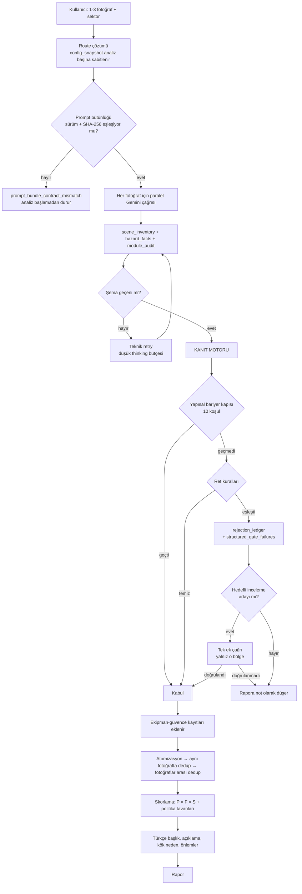

# Analiz Motoru — Bulgu Kural Seti ve Akış

**Sürüm:** `vnext-v3` · prompt `vnext-photo-expert-v31` · `semantic-risk-v29` · `controls-v19` · şema `hazard-fact-v3.5`
**Tarih:** 25.08.2026
**Kaynak:** `supabase/functions/analyze-vnext/` — `prompt.ts`, `engine.ts`, `sector-profile.ts`, `asset-assurance-catalog.ts`

Bu doküman, bir tehlikenin fotoğraftan rapora ulaşması için geçmesi gereken her kapıyı anlatır. Modelin ürettiği bir bulgunun neden silindiğini buradan izleyebilirsin.

---

## 1. Sistem nasıl çalışıyor

Analiz **üç katmandan** oluşur. Hangi katmanın ne ürettiğini ayırmak, kaliteyi tartışırken en önemli şey — çünkü "yapay zeka bulamadı" ile "sunucu sildi" tamamen farklı problemlerdir.

| Katman | Ne yapar | Nerede |
|---|---|---|
| **Model (Gemini)** | Fotoğrafı okur, envanter çıkarır, `hazard_facts` üretir. Skor üretmez. | Sağlayıcı çağrısı |
| **Kanıt motoru** | Fact'leri kurallara göre kabul/ret eder, birleştirir, güvence kayıtları ekler | `engine.ts` |
| **Skorlama** | P × F × S hesaplar, politika tavanlarını uygular | `engine.ts` |

Model **hiçbir zaman** skor üretmez ve rapordaki metinleri doğrudan yazmaz. Model yapısal alanlar üretir; sunucu bunları Türkçe rapora çevirir.

### Uçtan uca akış



### Boru hattının 11 aşaması

Her aşamanın sayısı `raw_ai_response._quality_trace_v3.stages` içinde tutulur. Bir bulgunun hangi aşamada kaybolduğu buradan okunur.

| # | Aşama | Ne yapar |
|---|---|---|
| 01 | `provider_parsed_fact` | Modelin ürettiği ham sayı |
| 02 | `schema_valid_fact` | Şema ihlali eler |
| 03 | `evidence_valid_fact` | **Kanıt kuralları eler — en çok kayıp burada** |
| 04 | `asset_assurance_added_fact` | Sunucu ekipman-güvence kaydı ekler |
| 05 | `atomic_fact` | Birleşik iddialar ayrıştırılır |
| 06 | `within_photo_dedup` | Aynı fotoğraftaki tekrarlar birleşir |
| 07 | `cross_photo_pre_dedup` | Fotoğraflar arası tekrar |
| 08 | `cross_photo_post_dedup` | Birleşme sonrası tekrar |
| 09 | `targeted_added_fact` | Hedefli inceleme kurtarabilir |
| 10 | `scored_fact` | P × F × S hesaplanır |
| 11 | `persistence_final` | Rapora yazılan sayı |

**Örnek — 25.08.2026, 3 fotoğraflı analiz `d9344ada`:**

```json
provider_parsed_fact    4   {"1":1, "2":3, "3":0}
schema_valid_fact       4
evidence_valid_fact     1   ← -3  (üçü kanıt kapısında öldü)
asset_assurance_added  10   ← +9  (sunucu jenerik kayıt ekledi)
within_photo_dedup      5   ← -5
cross_photo_post_dedup  4   ← -1
persistence_final       4
```

Okunuşu: model 3 fotoğraftan toplam **4 ham bulgu** üretti, üçü elendi, geriye **1 gerçek tehlike** kaldı; rapordaki diğer 3 kalem sunucunun eklediği kontrol listesi.

### Ret oranı alarmı

3. aşamada elenen oran **%50 veya üzerine** çıkarsa `evidence_rejection_ratio_above_threshold` tetiklenir.

> Eşik 25.08.2026'ya kadar "%50'nin üzeri" olarak okunuyordu. Üst üste üç koşu tam %50'de kalıp alarm hiç çalmadı; bu sırada her koşuda ölümcül düşme bulguları siliniyordu. Eşik artık kapsayıcı.

---

## 2. Modele verilen zorunluluklar

Bunlar prompt'taki *yapmalısın* kuralları. Bir tehlikenin **hiç üretilmemesinin** sebebi genelde buradaki bir tarama emrinin karşılanmamasıdır.

| Alan | Zorunluluk |
|---|---|
| **İnşaat sahnesi** | Her yükseltilmiş yüzeyin kenarı (kalıp, döşeme, boşluk), iskele bütünlüğü, kule vinç, zemin düzeni, elektrik hattı ve düşen malzeme yolu **birbirinden bağımsız** taranır |
| **Korkuluk katmanları** | Korkuluk tek parça sayılamaz. Küpeşte, ara korkuluk ve etek tahtası **ayrı ayrı** sonuçlandırılır |
| **Personel envanteri** | Yüksekte veya korumasız kenarda çalışan kişi `scene_inventory` içine ayrı kayıt olarak girer |
| **Kritik bileşen** | Görünen her pim, segman, mandal, kanca, hortum, boru, flanş, kaynak, koruyucu ve korkuluk için inceleme sonuçlandırılır: bulgu, temiz sonuç veya çözümsüz |
| **Modül taraması** | 20 modülün tamamı tek tek taranır. Kullanıcının odak seçimi öncelik verir, **kapsamı daraltmaz** |
| **Çıktı dili** | `equipment_family`, `component`, `identity_basis`, `control_intents[].target` kullanıcıya gösterilir; tam olarak çıktı dilinde, snake_case ve modül kimliği olmadan |

### Kapalı condition_code sözlüğü

Fiziksel emniyet bileşeni eksikliğinde model **bu listeden** seçmek zorundadır:

```
missing_guardrail          unguarded_open_edge
missing_mid_rail           missing_toeboard
missing_machine_guard      unguarded_moving_parts
missing_fall_arrest_system missing_fall_arrest_anchor
```

> **Neden önemli:** Bu sözlük sunucuda kapalı bir eşleşme tablosuydu ama prompt'ta hiç yayınlanmamıştı. Model her koşuda kendi eşanlamlısını uyduruyor, sunucu da tanımayıp siliyordu. Üç ardışık canlı analizde **her ölümcül düşme bulgusu** bu yüzden kayboldu.

---

## 3. Modele konan yasaklar

Prompt'taki *üretme* kuralları. Bunlar modelin kendini sansürlemesini sağlar; sunucuya hiç ulaşmazlar.

| Yasak | Kapsam |
|---|---|
| **Belge yokluğu** | "Ankraj var mı bilinmiyor", "kontrol belgesi görünmüyor", "NDT yapılmış mı bilinmiyor", "etiket okunmuyor" tek başına bulgu değildir |
| **Görünmeme** | Bir parçanın görünmemesi pozitif kanıt sayılmaz. Eksik pim/segman ancak boş yuva, açık delik veya doğrudan geometri görünüyorsa bulgu olur |
| **KKD yokluğu** | Yüz, el veya görev bağlamı net değilse KKD yokluğu üretilmez. Kapalı kabindeki operatörün baret takmaması tek başına bulgu değildir |
| **Normal geometri** | Mobil ekipmanın normal pim/mafsal geometrisi, teorik sıkışma aralığı, motorun görünmesi, ekskavatör kovasının olağan hareketi bulgu değildir |
| **Havalık ağzı** | Havalık veya taşma borusu ağzının açık olması kusur değildir |
| **Kanca mandalı** | Kanca ağzının doğal açıklığı mandal eksikliği kanıtı değildir. Boş mandal yatağı veya açık konum geometrisi gerekir |
| **Belirsiz alternatif** | "Eksik veya hasarlı", "gevşek ya da uygunsuz" gibi kanıtlanmamış alternatifler tek başlıkta birleştirilemez |
| **Uydurma veri** | Fotoğrafta olmayan çap, malzeme sınıfı, basınç, sıcaklık, marka, standart veya proses akışkanı yazılamaz |
| **Görüntü adresi** | Kullanıcıya gösterilen hiçbir metinde fotoğraf numarası, sağ-sol, üst-alt, ön-arka plan kullanılamaz |
| **Skor** | Model P/F/S veya 5×5 üretemez |
| **Frekans** | Tek durağan fotoğraftan `continuous_visible_work` veya `daily_repeated_workstation` seçilemez |
| **Ölüm sınıfı** | Belirsizlik veya görünmeyen kontrol yokluğu ölüm sınıfı gerekçesi değildir |

### Yüksekte çalışma istisnası

> Paraşüt tipi emniyet kemeri, lanyard, yaşam hattı ve ankraj **KKD yasağının dışındadır.** Toplu koruma yoksa bunlar geriye kalan **son** bariyerdir ve yanındaki korumasız kenarla aynı mesafeden okunur.
>
> Korumasız kenarda çalışan görünüyor ve gövdesinde kemer/halat seçilemiyorsa **bu bir bulgudur ve üretilmelidir.**
> `condition_code=missing_fall_arrest_system`, `mechanism_code=fall_from_height`, `barrier_state=absent_or_failed_event_active`, `consequence_class=single_fatality`
>
> İstisna yalnız düşme koruması içindir. Baret, gözlük ve eldiven için geçerli **değildir.**

---

## 4. Sunucunun ret gerekçeleri

Model bir fact üretse bile sunucu silebilir. 3. aşamada uygulanır, `rejection_ledger` içinde kayıt altına alınır. **Sıra önemlidir: ilk eşleşen gerekçe kazanır.**

### Yapısal elemeler

| Kod | Tetikleyen durum | Neyi korur |
|---|---|---|
| `evidence_unlinked` | `affirmative_cues` boş | Kanıtsız iddia |
| `evidence_non_actionable` | Varlık, koşul veya mekanizma güveni `low` | Modelin kendi belirsizliğini kabul ettiği bulgular |
| `process_link_invalid` | `credible_event_path` veya `hazard_mechanism` yok | Olay zinciri kurulamayan bulgu |

### Yokluk iddiaları

| Kod | Tetikleyen durum |
|---|---|
| `absence_only_claim` | **(a)** Belge/kayıt/sertifika/etiket görünmüyor kalıbı. **(b)** Görsel yokluk iddiası var ama ne pozitif geometri ne yapısal bariyer kanıtı var |
| `uncertain_condition_requires_confirmation` | Koşul çözümsüz; hedefli incelemeye yönlendirilir |

### Ekipmana özel elemeler

| Kod | Tetikleyen durum |
|---|---|
| `generic_guarding_hazard_rejected` | Koruyucu iddiası var, görünür kusur veya erişim yolu yok |
| `generic_hose_routing_rejected` | Hortum güzergâhı şikâyeti var, sürtünme izi/sızıntı/temas yok |
| `generic_articulation_hazard_rejected` | Mobil ekipman mafsalı normal geometride |
| `ambiguous_pipe_object_rejected` | Borudan ayrı, desteksiz nesne geometrisi seçilemiyor |
| `slope_instability_evidence_missing` | Şev/kaya düşmesi iddiası, olumlu instabilite kanıtı yok |
| `ordinary_excavation_material_handling_rejected` | Kazı malzemesinin amaçlanan alana olağan dökülmesi |
| `process_vent_opening_requires_design_basis` | Açık havalık ağzı, tasarım dayanağı olmadan kusur sayılmış |
| `generic_inherent_hazard_rejected` | Köprü vinç arabası sıkışma iddiası; ne fiziksel kusur ne doğrudan maruziyet |

### KKD elemeleri — üç ayrı yol

Üçü de `contextual_ppe_rejected` döner:

1. Kabindeki operatör için baret iddiası
2. KKD bağlamında görsel yokluk iddiası — **yüksekte çalışma istisnası hariç**
3. KKD iddiası var ama maruz kalan kişi tanımlanmamış

### Sektör negatif kuralları

| Kod | Tetikleyen durum |
|---|---|
| `sector_negative_missing_document_claim` | Belge/kayıt eksikliğinden uygunsuzluk çıkarımı |
| `sector_negative_photo_measurement_claim` | Fotoğraftan sayısal ölçüm: dB, lux, ppm, kV, bar, ton, km/h |
| `sector_negative_behavior_or_psychosocial_inference` | Psikososyal risk, stres seviyesi, "gözetim yetersiz" |
| `sector_negative_cab_occupant_ppe_claim` | Kabin içindeki kişi için KKD iddiası |

---

## 5. Yapısal bariyer kapısı

Yokluk iddialarının **meşru** geçebildiği tek yol. On koşulun tamamı karşılanırsa `absence_only_claim` uygulanmaz. Bir koşul bile eksikse fact düşer ve eksik koşul `structured_gate_failures` içine yazılır.

| Koşul | Gereklilik |
|---|---|
| `condition_code` | Kapalı sözlükte olmalı. Sözlük dışı kodlar anlamsal olarak da çözülür: yokluk kelimesi + bariyer öznesi |
| `mechanism` | Koda eşlenen mekanizmayla uyuşmalı. `missing_toeboard` için `falling_object` da kabul |
| `barrier_state` | `absent_or_failed_*` olmalı. Ara korkuluk ve etek tahtası için `partial_event_direct_or_conditional` da geçerli |
| `assessment_basis` | Ekipman-güvence temeli olamaz |
| `region` | Yerel kutu olmalı; `is_global` reddedilir |
| `confidence.entity` | `high` |
| `confidence.condition` | `high` |
| `confidence.localization` | `high` |
| `occlusion` | Bileşen örtülü/kadraj dışı olamaz. Düşme durdurma iddiaları muaf |
| `person exposure` | Maruz kalan kişi metinde doğrudan geçmeli |

### "Görünmüyor" ile "seçilemiyor" ayrımı

Türkçede *görünmüyor* en az "gizli kalmış" kadar sık **"yok"** demektir. Kapı bu ikisini ayırır:

- **Her zaman örtülülük:** `seçilemiyor`, `net değil`, `kadraj dışı`, `örtülü`, `kapalı kaldığı`, `occluded`, `obscured`, `out of frame`
- **Yanında boşluk geometrisi varsa gözlem:** `görünmüyor`, `not visible` — eğer cue'da `boşluk`, `açık kenar`, `iki direk arasında`, `kesinti` gibi pozitif geometri de varsa

---

## 6. Skorlama

**FK = P × F × S.** Model üç yapısal alan yazar, sunucu tabloya çevirir, sonra politika tavanları uygulanır.

| P — `barrier_state` | | F — `frequency_basis` | | S — `consequence_class` | |
|---|---|---|---|---|---|
| `absent_or_failed_event_active` | 10 | `continuous_visible_work` | 10 | çoklu ölüm / büyük çevresel | 100 |
| `absent_or_failed_event_direct` | 6 | `daily_repeated_workstation` | 6 | tek ölüm | 40 |
| `partial_event_direct_or_conditional` | 3 | `active_single_exposure` | 3 | kalıcı sakatlık | 15 |
| `visible_effective_event_conditional` | 1 | `sector_scene_proxy` | 2 | ciddi geri dönüşlü | 7 |
| `multiple_independent_visible_barriers` | 0,5 | `missing_invalid_fallback` | 1 | ilk yardım | 3 |
| | | `catalogued_rare` | 0,5 | ihmal edilebilir | 1 |

### Politika müdahaleleri

| Kod | Etki |
|---|---|
| `asset_assurance_probability_capped` | Ekipman-güvence kayıtlarında P = 1 |
| `inherent_hazard_probability_capped_by_evidence` | `visible_inherent_hazard` temelinde doğrudan maruziyet kanıtı yoksa P ≤ 1, varsa P ≤ 3 |
| `impalement_barrier_absence_probability` | Başlıksız donatı filizi + eksik bariyer: P tavandan muaf, `barrier_state`'i izler |
| `storage_stacking_probability_normalized` | Raf istifi, aktif düşme yoksa P ≤ 3 |
| `severity_capped_by_mechanism_policy` | Mekanizmaya göre S tavanı. Saplanma bağlamında `sharp_edge_contact` tavanı 7 yerine 40 |
| `incomplete_guardrail_severity_normalized` | Yalnız ara korkuluk/etek eksikse S ölüm sınıfına çıkamaz |
| `fk_frequency_missing_fallback` | Frekans dayanağı geçersizse F = 1 |

---

## 7. Saha teyidi işareti

Aşağıdakilerden **biri** bile geçerliyse bulgu `needs_field_verification` ile işaretlenir.

| Gerekçe | Anlamı |
|---|---|
| `equipment_integrity_verification` | Kayıt zaten bir doğrulama listesi; kusur iddiası içermiyor |
| `model_requested_verification` | Model kendi `verification.model_required` alanında istedi |
| `site_stability_requires_field_confirmation` | Devrilme, şev göçmesi veya kazıdaki düşen malzeme |
| `*_confidence_below_high` | Dört güven boyutundan biri `high` değil |
| `frequency_basis_missing` | Frekans dayanağı geçersiz |

> `sector_frequency_prior_unverified` **kaldırıldı.** Sektör önceliği neredeyse her bulguda devreye giriyor, bayrak her yerde açık kalıyordu — canlı bir koşuda beş bulgunun beşi de işaretliydi, üstelik modelin kendisi "Görsel kanıt yeterlidir" demişti. Artık yalnız skor gerekçesi olarak kayıtlı.

---

## 8. Kurtarma yolları

Reddedilen bir fact her zaman kaybolmaz. Hedefli inceleme **analiz başına bir kez** çalışır.

| Gerekçe | Ne zaman |
|---|---|
| `rejected_high_consequence_fact_requires_confirmation` | Kalıcı sakatlık veya üzeri sonuç sınıfı taşıyan bir fact reddedildi |
| `critical_hardware_absence_requires_geometry_confirmation` | Emniyet donanımı yokluğu iddiası pozitif geometri bekliyor |
| `critical_barrier_visibility_requires_confirmation` | Bariyer görünürlüğü çözümsüz |
| `high_hazard_guardrail_critical_coverage` | Yüksek tehlikeli sektörde korkuluk katmanı sonuçlandırılmamış |
| `high_consequence_rejection_guard` | Kurtarılamayan ölümcül adaylar rapora **not olarak** düşer; sessizce yok olmaz |

---

## 9. Örnekler — gerçek koşulardan

### Örnek 1 · Kelime dağarcığı yüzünden silinen ölümcül düşme

**Analiz `48e232c1`.** Model üç ayrı `fall_from_height` / `single_fatality` fact üretti. Üçü de silindi.

```json
"structured_gate_failures": ["condition_code_not_whitelisted:unguarded_edge_work"]
"structured_gate_failures": ["condition_code_not_whitelisted:unguarded_edge_work_distant"]
```

Sunucudaki liste `unguarded_open_edge` diyordu; model `unguarded_edge_work` yazmıştı — **aynı şey, farklı kelime sırası.** Şemada alan serbest metin, sunucuda kapalı sözlük, prompt'ta liste hiç yok.

**Sonuç:** Kod artık anlamsal olarak çözülüyor (yokluk kelimesi + bariyer öznesi) ve sözlük prompt'ta yayınlandı. Ret oranı %50 → %14,3.

---

### Örnek 2 · Kısmi bariyerin cezalandırılması

**Analiz `2c657962`.** Model iskele korkuluğunu doğru okudu:

```json
{
  "condition_code": "missing_mid_rail",
  "barrier_state": "partial_event_direct_or_conditional",
  "mechanism_code": "fall_from_height"
}
```

Ret: `barrier_state:partial_event_direct_or_conditional`

Kapı iki şeyi aynı anda istiyordu: kod beyaz listede (`missing_mid_rail` **vardı**) ve `barrier_state` "tamamen yok". Bu ikisi çelişir — üst korkuluk duruyorsa bariyer kısmidir. O iki kod, model kendi kendisiyle çelişmedikçe **hiç geçemiyordu.**

**Sonuç:** Ara korkuluk ve etek tahtası artık kısmi bariyer durumunu kabul ediyor.

---

### Örnek 3 · Son bariyerin KKD sayılması

**Analiz `2c657962`.** Envanterde 12 kayıt vardı, **hiçbiri insan değildi.** Kemer denetimi hiç başlamadı. Başlasaydı da sunucu silecekti — kemer, KKD sayılıyordu ve tek fotoğraftan KKD yokluğu yasaktı.

**Analiz `80e5e3e4` (düzeltmeden sonra):** envanterde **4 "Personel"** kaydı, ve:

```json
{
  "condition_code": "missing_fall_arrest_system",
  "consequence_class": "single_fatality",
  "barrier_state": "absent_or_failed_event_active",
  "cues": [
    "Çalışanın yakınında herhangi bir toplu düşme koruması veya kişisel düşme durdurma sistemi görünmüyor",
    "Çalışan, döşeme kenarına yakın konumda"
  ]
}
```

Kabul edildi. **FK 2400** (P10 × F6 × S40).

İstisna dar tutuldu: kanıt cümlesinin **kendisi** çalışanı kenarda konumlandırmalı ve gövdeyi tarif etmeli. "Kişisel düşüş durdurma ekipmanı görüntüde seçilemiyor" diyen bir fact hâlâ reddediliyor.

---

### Örnek 4 · Doğru çalışan ret

**Analiz `d9344ada`.** İki kanca mandalı bulgusu:

```
"mandalının eksik olduğu veya açık kaldığı görülmektedir"
```

Ret: `uncertain_condition_requires_confirmation` ×2

Bu **doğru bir ret.** Prompt kanıtlanmamış alternatifleri "veya" ile birleştirmeyi açıkça yasaklıyor; model kuralı çiğnedi, sunucu yakaladı. Hedefli inceleme ikisini de aday seçti (öncelik 183) ama 3 fotoğraf için tek çağrı hakkı vardı ve boş döndü.

---

### Örnek 5 · Skorun yanlış hesaplanması

**Analiz `fa88c0d4`.** Zeminde açıkta sivri donatı çubukları:

```
P=1  F=6  S=7  →  FK 42
```

İki tavan aynı anda bastırmıştı:
- `sharp_edge_contact` mekanizma tavanı S'yi **7'ye kırpıyordu** — saplanma ölümcüldür
- Model `visible_inherent_hazard` seçmişti; o dal insan yakınlığı kanıtı yoksa P'yi **1'e** indiriyor. Oysa aynı fact `barrier_state: absent_or_failed_event_direct` diyordu — yani bariyer yok iddiası. Çelişki.

**Sonuç:** dar bir istisna kondu, prompt'a başlıksız filiz demirinin `observed_nonconformity` olduğu yazıldı. Aynı bulgu bir sonraki koşuda **FK 540** (P6 × F6 × S15).

---

### Örnek 6 · Kanıtın reddettiğini iddia eden önlem

Su birikintisi içindeki kablo. Açıklama: "izolasyonunda meydana **gelebilecek** herhangi bir hasar" — görünür hasar yok. Önlem:

```
"Enerjiyi kes, gerilimsizliği doğrula ve açık iletken/mahfazayı ... düzelt"
```

Kanıtın reddettiği açık iletkeni önlem var sayıyordu. Artık o cümle yalnız kanıt gerçekten açık iletken gösterirse ekleniyor.

---

### Örnek 7 · Kimliği bilinmeyen kaptan kimyasal kaydı

Mavi bir varilden SDS ve kimyasal depolama kaydı üretilmişti. Kaydın kendi metni durumu itiraf ediyordu: *"Kimyasal **içerebilecek** kaplar"*.

Varil geometrisi içerik kanıtı sayılıyordu. Artık varil de **işaretleme** ister; IBC tank ve dökülme tavası kendini tanıtmaya devam eder.

---

## 10. Bilinen sınırlar

| Sınır | Durum |
|---|---|
| **Koşudan koşuya değişkenlik** | Aynı fotoğraf farklı sayıda bulgu üretebilir. Tek çağrıyla kapatılamaz; fan-out veya çift çağrı gerekir, ikisi de maliyet artırır |
| **Çoklu fotoğraf düşünme bütçesi** | Çoklu fotoğraf 2048, tek fotoğraf 3072. Fotoğraf sayısı artınca iş artıyor, bütçe azalıyor. 3 fotoğraflı bir koşuda üçüncü fotoğraf tavana çarpıp **sıfır** bulgu üretti |
| **Hedefli inceleme kapasitesi** | Analiz başına **1** çağrı. 3 fotoğraf ve 4 kritik aday varken tek çağrı yetmiyor |
| **Güvence kaydı ağırlığı** | Zayıf koşularda rapor jenerik kontrol listelerinden ibaret kalabiliyor |

---

## 11. Kural değişikliği nasıl yapılır

Prompt ve sunucu kuralları **iki taraflı bir sözleşmedir.** Kod tarafını değiştirip DB tarafını unutmak, ilk analizde `prompt_bundle_contract_mismatch` ile sistemi durdurur.

1. `prompt.ts` veya şema değişirse `contracts.ts` içinde `PROMPT_VERSION` artır
2. `deno test` çalıştır — `prompt_integrity_test.ts` yeni SHA-256'yı verir
3. `PROMPT_BUNDLE_SHA256` güncelle
4. Fonksiyonu deploy et
5. **Aynı anda** migration ile `private.analysis_engine_configs` içindeki `prompt_version` ve `prompt_bundle_sha256` güncelle
6. Migration bir doğrulama bloğu içermeli — yanlış uygulanırsa `raise exception`

> Route snapshot'ı **analiz başına sabitlenir.** Migration'dan önce başlamış bir analiz eski sürümü taşır; tekrar denemek yerine yeni analiz başlatılmalıdır.

Yalnız sunucu tarafı değişiyorsa prompt sürümü sabit kalır, ama migration bunu **açıkça doğrulamalıdır** — bundle hash'inin yanlışlıkla kaymadığından emin olmak için.
