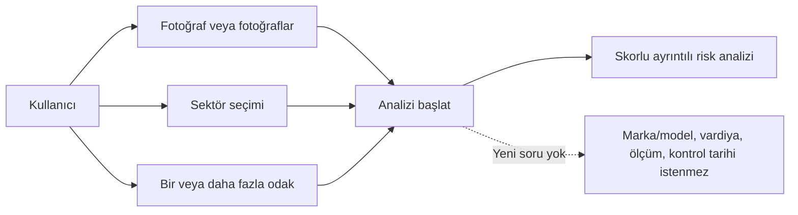
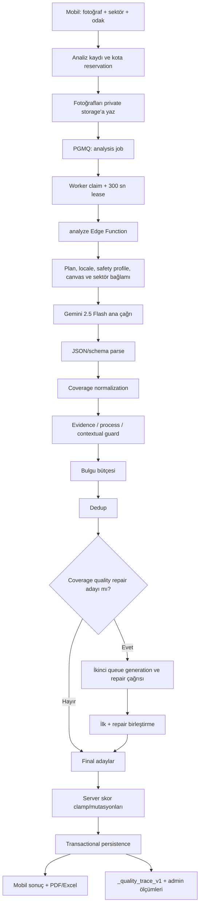
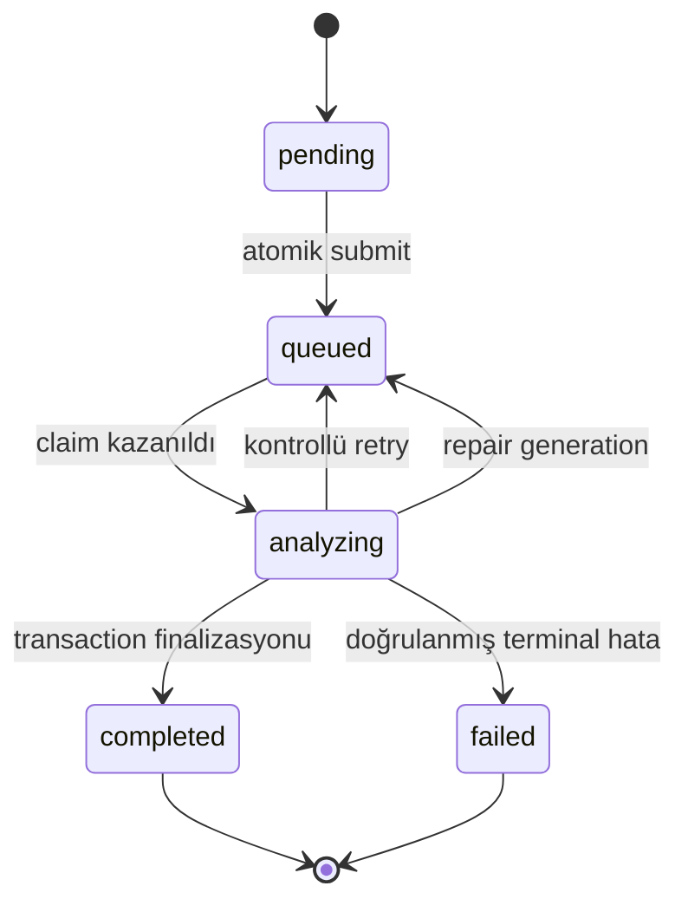
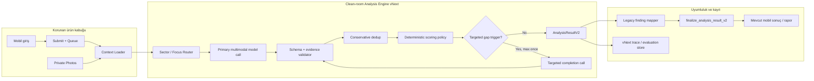
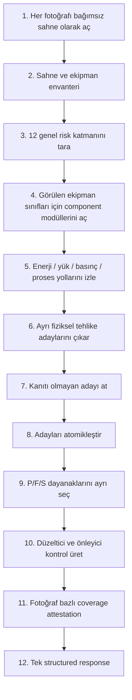

# RiskDetected Analiz Motoru — Mevcut Sistem Gerçeği, Kalite Kurtarma Stratejisi ve vNext Ana Planı

**Tarih:** 2026-08-23
**Belge sürümü:** 1.0
**Durum:** Tasarım ve uygulama ana planı; bu belge davranış değişikliği yapmaz
**Karar sahibi / uzman değerlendirme otoritesi:** Ürün sahibi ve İSG uzmanı
**Kapsam:** Fotoğraftan İSG risk analizi, skorlama, uzman derinliği, sağlayıcı seçimi, maliyet, gözlemlenebilirlik, entegrasyon ve rollout
**Ana hedef:** Üç tehlike açısından zengin fotoğrafta 4 zayıf bulgu yerine, uzman tarafından kabul edilen en az 10 ayrı ve kanıtlı bulgu üretebilen; buna rağmen temiz fotoğrafa zorla bulgu yazmayan, çoğu analizde tek model çağrısıyla çalışan bir motor

---

## 0. Belgenin kullanım biçimi ve doğruluk etiketleri

Bu belge, bundan sonraki analiz motoru çalışmalarında tek ana karar referansı olarak kullanılmak üzere hazırlanmıştır. Eski planlar tarihsel gerekçeleri açıklamaya devam eder; ancak bu belgeyle çeliştikleri yerde bu belgedeki kararlar geçerlidir.

Belgedeki ifadeler dört sınıfa ayrılır:

| Etiket | Anlam |
| --- | --- |
| **Doğrulanmış mevcut durum** | Koddan, canlı veriden veya canlı feature flag'den doğrulanmış gerçek |
| **Ölçüm** | Belirtilen tarih ve kohort için üretilmiş istatistik; genelleme sınırı vardır |
| **Tasarım kararı** | vNext için kabul edilen, uygulamada korunacak kural |
| **Hedef / yayın kapısı** | Uygulama sonrası ölçülmesi gereken başarı eşiği; henüz gerçekleşmiş sonuç değildir |

Bu ayrım önemlidir. Örneğin “son analizde fotoğraf başına 1,33 bulgu üretildi” bir ölçümdür; “tehlike açısından zengin sabit üçlü sette en az 10 uzman-kabul bulgu hedeflenecek” ise bir yayın kapısıdır. İkincisi her üç fotoğraflı analiz için kör minimum değildir.

---

## 1. Yönetici kararı

### 1.1 Ne yapacağız?

Mevcut mobil uygulamayı, kullanıcı hesaplarını, fotoğraf yükleme hattını, Supabase kuyruğunu, abonelik/kota sistemini, lokalizasyonu, raporları ve final veritabanı sözleşmesini çöpe atmayacağız. Bunlar ürünün çalışan dış kabuğudur.

Analiz kalitesini belirleyen iç motoru ise **clean-room vNext** olarak, legacy motorun yanında ve açık bir giriş/çıkış sınırıyla yeniden kuracağız. Yeni motor önce yalnız iç değerlendirmede, sonra kullanıcının kendi allowlist analizlerinde, daha sonra kontrollü canary'de çalışacaktır. Legacy motor, vNext kalite kapılarını geçene kadar geri dönüş seçeneği olarak korunacaktır.

Bu yaklaşım “mevcut karmaşık motoru sonsuza kadar yamamak” değildir. Aynı zamanda “çalışan bütün ürünü bir gecede yeniden yazmak” da değildir. Yeniden yazılan bölüm, görsel analiz ve bulgu üretim çekirdeğidir.

### 1.2 Legacy motorda vNext öncesi izin verilen son işler

Legacy motorun kalite davranışı dondurulacaktır. Yalnız şu iki doğruluk/gözlemlenebilirlik işi istisnadır:

1. **Pass-bazlı telemetri düzeltmesi:** İlk analiz ve repair ölçümleri birbirini ezmeyecek; her geçiş ayrı saklanacaktır.
2. **`absence_only_evidence_rejected` guard'ı:** Yalnız “görünmüyor, belirlenemiyor, belirsiz” gibi bilgi yokluğuna dayanan ve görünür olumlu bir uygunsuzluk kanıtı taşımayan kayıt, skorlu risk bulgusu olarak kullanıcıya gösterilmeyecektir.

İkinci kural bir şiddet düşürme kuralı değildir. Görünür bir tehlikenin sonucu ölümcül olabilir; sırf ayrıntılarından biri belirsiz diye şiddeti kör biçimde düşürmek doğru değildir. Reddedilen şey, görünmeyen bir kontrolün yokluğunu gerçek bir tehlikeymiş gibi raporlamaktır.

Bu iki işten sonra legacy motorda prompt, minimum baskısı, dedup, repair ve skor davranışı vNext karşılaştırması tamamlanana kadar dondurulacaktır.

### 1.3 Kullanıcıdan hangi bilgiler alınacak?

Yeni analiz için kullanıcının sağlayacağı semantik girdi yalnız şunlardır:

1. **Bir veya daha fazla fotoğraf**
2. **Sektör seçimi**
3. **Bir veya daha fazla analiz odağı** — mevcut plan/tier kuralları izin verdiği ölçüde

Kullanıcıya analiz sırasında veya sonrasında ek soru sorulmayacaktır. Marka/model, çalışma süresi, personel sayısı, periyodik kontrol tarihi, proses basıncı, kimyasal adı, vardiya sıklığı veya ek açıklama istenmeyecektir. Model, eksik bilgiyi uydurmayacak; kabul edilmiş her bulguyu fotoğraftaki olumlu kanıta dayandıracak ve sayısal risk skorunu mevcut sözleşmeye uygun üretecektir.

Teknik metadata — plan, dil, locale, safety profile, uygulama build'i, engine version ve trace ID — sistem tarafından taşınabilir. Bunlar yeni kullanıcı sorusu değildir ve tehlikenin varlığını kanıtlamak için kullanılamaz.

### 1.4 Çağrı ve maliyet kararı

- Normal yol: **tüm fotoğraflar için tek model çağrısı**.
- Aynı çağrıda fotoğraflar önce bağımsız taranır, sonra sonuçlar ortak sözleşmede döner.
- İkinci çağrı varsayılan değildir.
- İkinci çağrı, yalnız ölçülebilir kapsama/şema eksikliği varsa, sadece eksik fotoğraf veya domain için ve en fazla bir kez yapılır.
- İkinci çağrı hiçbir zaman yalnız “bulgu sayısı 10'un altında” diye tetiklenmez.
- İlk rollout hedefi: analizlerin en az `%85`'i tek çağrıda tamamlanmalı; hedefli ikinci çağrı oranı en fazla `%15` olmalıdır.

---

## 2. Ürün amacı ve kalite tanımı

RiskDetected'in amacı, fotoğraftaki herkesin fark edebileceği sivri uç, açık kenar veya dağınık zemin gibi bariz tehlikeleri yalnızca yeniden adlandırmak değildir. Bu bariz bulgular elbette kaçırılmamalıdır; fakat ürünün uzman değeri şu ayrıntılardan gelir:

- yük, enerji, basınç ve hareket yollarını anlamak;
- pim, kopilya, kilit, mandal, bağlantı ve ikincil emniyet elemanlarını incelemek;
- halat, kanca, makara, tambur, sapan ve kaldırma aksesuarlarının görünür bütünlüğünü değerlendirmek;
- hortum, boru, vana, flanş, kaplin, kelepçe, kablo ve hat güzergâhlarındaki görünür uygunsuzlukları ayırmak;
- ankraj, mesnet, çapraz, taban plakası, raf bağlantısı ve darbe korumasını incelemek;
- görünür kaynak dikişi, çatlak, deformasyon, korozyon, sızıntı ve yüzey süreksizliği ipuçlarını değerlendirmek;
- gerektiğinde VT, PT, MT, UT veya RT gibi uygun muayene/NDT yöntemini kontrol planı olarak önermek, fakat yapılmamış bir testi fotoğraftan yapılmamış kabul etmemek;
- proses güvenliği, izolasyon, basınç tahliye yolu, enstrümantasyon, statik/tutuşturma, sekonder muhafaza ve acil tahliye ilişkilerini taramak;
- periyodik kontrol veya bakım ihtiyacını ekipman ve görünür kanıtla ilişkilendirmek;
- aynı sahnedeki ayrı fiziksel tehlikeleri tek genel başlıkta ezmemek;
- her kabul edilmiş bulgu için tutarlı P/F/S ve uygulanabilir düzeltici/önleyici kontrol üretmek.

Kalite, “çok uzun metin” veya “çok yüksek toplam skor” değildir. Aşağıdaki bileşimdir:

```text
Kalite = kritik recall
        + genel hazard recall
        + görsel kanıt doğruluğu
        + atomik bulgu yapısı
        + risk skoru kalibrasyonu
        + uygulanabilir kontrol kalitesi
        + tekrarlar arası kararlılık
        - desteksiz/uydurma bulgu
        - yanlış birleştirme
        - gereksiz ikinci çağrı
```

---

## 3. Mevcut ürün giriş sözleşmesi

### 3.1 Fotoğraf

**Doğrulanmış mevcut durum:**

- Free: analiz başına en fazla 1 fotoğraf.
- Plus: analiz başına en fazla 3 fotoğraf.
- Pro: analiz başına en fazla 3 fotoğraf.
- İstemci JPEG/PNG/HEIC girdisini normalize eder, boyutu düşürür ve anotasyonu görsele uygular.
- Backend MIME, base64 ve toplam gövde boyutunu doğrular; görselleri private `photos` bucket'ına kalıcılaştırır.
- `photos` tablosunda sıra, `client_photo_id`, boyut, MIME, SHA-256, retention ve storage path tutulur.
- Yeni fotoğraf analizi fotoğrafsız kabul edilmez.
- `text_input` geriye uyumluluk alanıdır; vNext tehlike tespiti için kullanılmayacaktır.

### 3.2 Sektör

Sistem iki sektör sinyali taşır:

1. Onboarding profilinde birden fazla sektör tutulabilir.
2. Bir analiz için aktif `analysis_sector` bugün tek bir seçilmiş sektör olarak taşınır.

vNext, yeni kullanıcı sorusu oluşturmadan mevcut aktif sektör seçimini ve varsa profil sektörlerini alabilir. Tehlikenin varlığına karar veren ana sinyal aktif sektör + fotoğraftır; profil sektörleri yalnız modül önceliğine yardımcı olabilir. Sektör eksik olan legacy istemcide sistem içi fallback `general` olur.

Mevcut kanonik sektörler:

| ID | Kullanıcı etiketi / kapsam |
| --- | --- |
| `general` | Genel İSG; analiz fallback'i |
| `construction` | İnşaat, şantiye, yapı, hafriyat |
| `manufacturing` | İmalat, fabrika, atölye, üretim hattı |
| `mining` | Yeraltı, açık ocak, taş ocağı |
| `energy` | Santral, rafineri, enerji tesisleri |
| `office` | Ofis, banka, AVM, idari bina |
| `logistics_warehouse` | Depo, lojistik, yükleme alanları |
| `chemical_laboratory` | Kimyasal proses, laboratuvar |
| `healthcare` | Hastane, klinik, sağlık tesisi |
| `food_production` | Gıda üretimi, mutfak, hijyen alanları |
| `agriculture_livestock` | Tarım, hayvancılık, açık alan |
| `retail` | Mağaza, perakende, müşteri alanı |
| `municipal_field_services` | Belediye ve kamu saha işleri |
| `education` | Okul, üniversite, atölye |
| `hospitality` | Otel, konaklama, misafir alanları |

`general` onboarding seçeneği değil, analiz fallback'idir.

### 3.3 Analiz odağı / canvas

Paid kullanıcılarda bir veya birden fazla odak seçilebilir. Free kullanıcı mevcut ürün kuralıyla tek odak seçer. vNext bu mevcut seçimi doğrudan kullanır; yeni soru sormaz.

| ID | Odağın anlamı | Minimum plan |
| --- | --- | --- |
| `general` | Dengeli genel saha taraması | Free |
| `ppe` | KKD uygunluğu ve kullanımı | Free |
| `machine` | Makine koruyucuları, hareketli parçalar, sıkışma, bakım-kilit | Plus |
| `warning_signs` | Uyarı, yönlendirme, işaretleme ve görünürlük | Free |
| `electrical` | Pano, kablo, izolasyon, topraklama, elektrik riski | Free |
| `sector` | Seçilen sektöre özgü riskler | Plus |
| `fire` | Yangın, sıcak iş, kaçış ve söndürme erişimi | Free |
| `ergonomics` | UI adı “Özel Ekipman”; ekipman odaklı detay | Pro |
| `environment_measurement` | Gürültü, toz, gaz, aydınlatma, termal ve ölçüm ihtiyacı | Plus |
| `explosion` | Patlayıcı ortam, basınç, gaz/toz, statik ve ateşleme | Free |
| `environment` | Atık, sızıntı, dökülme ve çevresel etkiler | Free |
| `legislation` | Mevzuat ve denetim uyumu | Pro |
| `working_at_height` | Düşme, korkuluk, iskele, ankraj ve erişim | Free |
| `mobile_equipment` | Forklift, vinç, araç-yaya ve hareketli ekipman | Free |
| `general_premium` | Ayrıntılı ve denetim odaklı genel tarama | Pro |
| `construction_machinery` | Ekskavatör, yükleyici ve saha iş makineleri | Free |

Mevcut `ergonomics` promptunda “ek fotoğraf veya marka/model iste” ifadesi vardır. Bu, yeni ürün sözleşmesiyle çelişir ve vNext'e taşınmayacaktır.

### 3.4 vNext için kesin kullanıcı etkileşim kuralı



Model bir alanı fotoğraftan doğrulayamıyorsa kullanıcıya soru sormak veya kontrolün bulunmadığını iddia etmek yerine şunlardan birini yapar:

- görünür risk varsa bulguyu sayısal skorla üretir ve teyit gereksinimini aynı bulgunun kontrol planına bağlar;
- yalnız bilgi eksikliği varsa bunu risk bulgusu yapmaz;
- ekipmana özgü inceleme önerisini skorsuz “risk bulgusu” olarak değil, ilgili bulgunun kontrol/inceleme gereksinimi olarak taşır.

---

## 4. Mevcut sistem mimarisi

### 4.1 Korunacak ürün kabuğu

| Katman | Mevcut teknoloji / sorumluluk | vNext kararı |
| --- | --- | --- |
| iOS istemci | SwiftUI, fotoğraf seçimi, sektör/odak seçimi, sonuç görünümü | Korunacak |
| Android istemci | Mevcut API sözleşmesi ve aynı backend | Korunacak |
| Auth / profil | Supabase Auth, profil ve plan snapshot'ı | Korunacak |
| Storage | Private `photos` bucket ve metadata | Korunacak |
| Submit / queue | Atomik submit, PGMQ, worker claim/lease | Korunacak |
| Lokalizasyon | locale, output language, safety profile | Korunacak |
| Kota / abonelik | Free/Plus/Pro hakları ve idempotent reservation | Korunacak |
| Raporlama | PDF/Excel snapshot ve kayıt sistemi | Uyumluluk adaptörüyle korunacak |
| AI çekirdeği | Prompt, schema, normalization, guard, dedup, repair, scoring | vNext olarak yeniden kurulacak |
| Finalizasyon | `finalize_analysis_result_v2` transaction sınırı | İlk vNext sürümünde korunacak |
| Kalite telemetrisi | `_quality_trace_v1`, admin RPC, cron alarmı | Düzeltilip genişletilecek |

### 4.2 Uçtan uca mevcut akış



### 4.3 Kuyruk ve idempotency

Mevcut kuyruk mimarisi korunmaya değerdir:

- `pending → queued` ve `pgmq.send()` aynı transaction içindedir.
- Aynı analysis ID ikinci kez yeni mantıksal iş üretmez.
- Worker, AI çağrısından önce claim alır.
- Claim lease 300 saniyedir.
- Worker HTTP zaman bütçesi 135 saniyedir.
- Ana AI zaman aşımı 120 saniyedir.
- Maksimum gerçek worker attempt 3'tür.
- Kaybolan HTTP cevabı, analiz gerçekten devam ederken ikinci AI çağrısını başlatmamalıdır.
- Tamamlanmış analiz yeniden `queued`, `analyzing` veya `failed` yapılamaz.

Mevcut durum makinesi:



### 4.4 Mevcut provider ve route yapısı

Mevcut canlı analizlerin büyük çoğunluğu `gemini-2.5-flash` kullanmaktadır. Kodda ayrıca:

- `gemini-2.5-pro`,
- `gemini-3.1-flash-lite`,
- Groq üzerinde Llama tabanlı fallback,
- Free, paid, ilk Free paid-trial ve iptal edilmiş Plus trial için ayrı route'lar

bulunur.

Bir `ai_usage_logs` satırı mantıksal işi temsil eder; tek fiziksel HTTP isteği anlamına gelmez. API key fallback, model fallback, timeout, 429/5xx, `MAX_TOKENS`, şema fallback'i ve repair fiziksel istek sayısını artırabilir. Bu nedenle maliyet yalnız `tokens_in` ve `tokens_out` ile değil, `provider_request_count`, `thoughts_tokens`, `total_tokens` ve `provider_attempt_total_tokens` ile okunmalıdır.

### 4.5 Mevcut prompt katmanları

Bugünkü prompt yaklaşık şu katmanlardan oluşur:

1. Kıdemli İSG uzmanı rolü ve temel güvenlik talimatları
2. 12 katmanlı genel tarama
3. Önceliklendirme
4. Fine-Kinney ve 5×5 kuralları
5. Confidence ve saha teyidi kuralları
6. Atomik bulgu talimatı
7. Tam iki önlem üretme kuralı
8. Yüksek skorlu tek örnek bulgu
9. Plan ve kalite tier bağlamı
10. Analiz modu
11. Bir veya daha fazla canvas odağı
12. Aktif sektör
13. Onboarding ve firma bağlamı
14. Dil, locale ve safety profile
15. Fotoğraf marker'ları
16. Multi-photo exact coverage sözleşmesi
17. Response schema
18. Bazı rolloutlarda equipment-depth ve process-safety şeması

Bu yapı zaman içinde birbirine bağlı kuralların birikmesine yol açmıştır. Aynı amaç, prompt, schema, normalization ve server guard'da farklı biçimde tekrar edebilmektedir.

### 4.6 Mevcut 12 tarama katmanı

1. Zemin, saha düzeni ve düzen-tertip
2. Çalışanlar ve KKD
3. Yüksekte çalışma
4. Elektrik ve enerji
5. Makine, ekipman ve iş ekipmanı
6. Kaldırma, taşıma ve istifleme
7. Kimyasal ve tehlikeli madde
8. Yangın ve patlama
9. Fiziksel ortam etkenleri
10. Ergonomi ve elle taşıma
11. Kazı, kapalı alan ve özel işler
12. Çevre, acil durum, işaretleme ve yetkinlik

Bu taksonomi üst seviye kapsama için yararlıdır; fakat tek başına pim, kaynak, kanca mandalı, flanş, ankraj veya hortum bütünlüğü gibi uzman ayrıntısını garanti etmez.

### 4.7 Mevcut bulgu sözleşmesi

Modelden ve normalization'dan taşınan ana alanlar:

- başlık ve kategori;
- görünür kanıt / açıklama;
- kök neden;
- düzeltici eylem;
- önleyici kontrol;
- confidence;
- `needs_field_verification`;
- Fine-Kinney P/F/S;
- 5×5 P/S;
- kaynak fotoğraf indeksleri;
- fotoğraf bazlı gözlemler;
- uygun plan/safety profile'da mevzuat referansları;
- bazı rolloutlarda inspection layer ve process-safety bağlantıları.

Sunucu, `recommended_measures` alanını tam iki kullanıcı önlemine normalize eder: bir düzeltici eylem ve bir önleyici kontrol.

### 4.8 Mevcut bulgu bütçesi ve minimum davranışı

Kod sabitleri:

| Kural | Değer |
| --- | ---: |
| Tek fotoğraf hedef minimumu | 1 |
| Çoklu fotoğraf hedef minimumu | 1 |
| Tek fotoğraf hedef maksimumu | 14 |
| Çoklu fotoğraf fotoğraf başı maksimumu | 13 |
| Toplam hard ceiling | 65 |
| Plus/Pro etkin toplam capability | 39 |

DB feature flag içinde `target_findings_per_photo_min` bulunmasına rağmen production policy minimumu kod sabitinden alır. Bu nedenle flag'deki minimum değeri değiştirmek bugün prompt davranışını değiştirmez.

Minimumu doğrudan 10 veya fotoğraf başına 3 yapmak önerilmemektedir. Model görünür kanıt bulamadığında sırf kota doldurmak için “belirsizlik” ve varsayım üretmeye eğilimlidir. vNext kapsamı sayı baskısıyla değil, tamamlanmış uzman tarama matrisiyle yükseltecektir.

### 4.9 Mevcut thinking ve output bütçeleri

Canlı Build 80+ çoklu fotoğraf yolunda ilk geçiş için 6.144 thinking budget uygulanabilmektedir. Repair thinking budget 3.072'dir. `maxOutputTokens` değerleri üst sınırdır; kullanılmayan token için ödeme yapılmaz.

| Fotoğraf / plan | Maksimum çıktı tokenı |
| --- | ---: |
| Tek fotoğraf Free | 14.000 |
| Tek fotoğraf Plus | 16.000 |
| Tek fotoğraf Pro | 18.000 |
| Çoklu fotoğraf | `min(48.000, 8.000 + fotoğraf × plan katsayısı)` |

Kalite sorununun açıklaması “çıktı tavanı düşük” değildir. Son analiz `STOP` ile bitmiş ve tavanı doldurmamıştır. Sorun daha çok modelin hangi ayrıntıları taradığı, nasıl önceliklendirdiği ve katmanların birbirini nasıl etkilediğidir.

### 4.10 Mevcut schema, guard, dedup ve repair

**Schema:** Çoklu fotoğrafta `photo_findings` kaydı her fotoğraf indeksini temsil etmeye çalışır. 12 katmanın her fotoğraf altında katı şekilde sabitlenmesi Gemini'de “too many states for serving” hatasına neden olabildiği için schema fallback yolu vardır.

**Normalization:** Eksik/tekrarlı fotoğraf kayıtları, kaynak fotoğraf indeksleri, metin alanları ve aday sayıları normalize edilir.

**Guard'lar:** Düşük confidence, evidence link, process link, contextual PPE, marker, dil ve forbidden-claim kontrolleri uygulanır.

**Dedup:** Aynı fiziksel tehlikenin farklı ifadelerini birleştirmeye çalışır. Hatalı sıkı dedup, ayrı tehlikeleri sessizce kaybedebilir; gevşek dedup ise kullanıcıya tekrar gösterir.

**Repair:** Coverage quality eksikliği görülen fotoğraflar ikinci queue generation'a alınabilir. Repair mevcut bulguları tekrar üretmemeli; yalnız eksik, ayrı ve görsel olarak desteklenen tehlikeleri döndürmelidir. Bugünkü ölçümlerde repair çoğu zaman yeni bulgu eklememiştir.

### 4.11 Mevcut skorlama davranışı

Fine-Kinney:

```text
FK = P × F × S
P ∈ {0.2, 0.5, 1, 3, 6, 10}
F ∈ {0.5, 1, 2, 3, 6, 10}
S ∈ {1, 3, 7, 15, 40, 100}
```

5×5:

```text
M5 = Olasılık × Şiddet
Olasılık ∈ {1, 2, 3, 4, 5}
Şiddet ∈ {1, 2, 3, 4, 5}
```

Bugünkü server davranışı:

- Geçersiz P/F/S değerini izinli en yakın değere clamp eder.
- Görünür yükseklik-ölüm deseni ve confidence ≥ 0,70 ise FK şiddetini en az 40, 5×5 şiddetini 5 yapar.
- Modelin `needs_field_verification=true` değerini her zaman korumaz.
- Sıradan bulgularda final teyit bayrağını esas olarak `confidence ∈ [0,50, 0,70)` aralığından yeniden türetir.
- `ai_original_snapshot` içine final teyit değerini yeniden yazdığı için bu alan ham model boolean'ı için güvenilir değildir; ham/final ayrımı `_quality_trace_v1.score_traces` içinden okunmalıdır.

### 4.12 Finalizasyon, rapor ve gözlemlenebilirlik

`finalize_analysis_result_v2` tek transaction içinde:

1. claim ve generation'ı doğrular;
2. final finding satırlarını yazar;
3. analiz toplamlarını, summary ve raw response'u günceller;
4. fotoğraf özetlerini upsert eder;
5. kota reservation'ını tamamlar;
6. analizi `completed` yapar;
7. claim'i kapatır.

Faz 1 ile canlıya alınan kalite altyapısı:

- `raw_ai_response._quality_trace_v1`;
- `admin_analysis_quality_run_v1(analysis_id)`;
- `admin_analysis_quality_metrics_v1(current_days, baseline_days)`;
- günlük 06:15 İstanbul cron değerlendirmesi;
- `admin_alert_events` içine warning/critical olayları;
- service-role dışına kapalı yönetim RPC'leri.

Bu temel korunacaktır. Ancak ilk ve repair geçişlerinin stage/provider telemetrisini ezmesi nedeniyle trace şeması v1.1 veya v2'de pass-bazlı hâle getirilmelidir.

---

## 5. Canlı kalite ve istatistik fotoğrafı

### 5.1 Veri kesimi

Bu bölümdeki canlı veriler 2026-08-23 tarihinde production projesinden alınmıştır. Yeni tam trace yalnız bir analizde bulunduğu için tarihî `legacy_aggregate` ile `full_trace` aynı kohort gibi yorumlanmamıştır.

### 5.2 Haftalık final bulgu / fotoğraf serisi

Admin kalite RPC'sinin ayrıştırılmış tarihî serisi:

| Hafta başlangıcı | Analiz | Fotoğraf | Final bulgu | Bulgu / fotoğraf |
| --- | ---: | ---: | ---: | ---: |
| 2026-06-22 | 4 | 8 | 44 | **5,5000** |
| 2026-06-29 | 11 | 23 | 171 | **7,4348** |
| 2026-07-06 | 30 | 47 | 392 | **8,3404** |
| 2026-07-13 | 39 | 76 | 250 | **3,2895** |
| 2026-07-20 | 19 | 28 | 82 | **2,9286** |
| 2026-07-27 | 12 | 15 | 32 | **2,1333** |
| 2026-08-03 | 4 | 4 | 9 | **2,2500** |
| 2026-08-10 | 3 | 3 | 5 | **1,6667** |
| 2026-08-17 legacy | 30 | 53 | 107 | **2,0189** |
| 2026-08-17 full trace | 1 | 3 | 4 | **1,3333** |

Yorum:

- 2026-07-06 haftasındaki 8,3404 değerinden sonraki hafta 3,2895'e düşüş yaklaşık `%60,6`'dır.
- 2026-08-17 legacy oranı, 2026-07-06 seviyesinin yaklaşık `%75,8` altındadır.
- Bu seri değişimin varlığını gösterir; tek başına hangi commit veya kuralın ne kadar sorumlu olduğunu kanıtlamaz.
- Temmuz düşüşünün haftalarca görünmemesi, kalite kadar gözlemlenebilirlik problemidir.

### 5.3 Son üç fotoğraflı analizin tam izi

**Analysis ID:** `26e7aef0-1682-4c9e-a7c6-f3d86bb207ba`
**Plan / dil / canvas:** Plus / Türkçe / General
**Model:** `gemini-2.5-flash`
**Fotoğraf:** 3
**Durum:** Completed; kullanıcı düzenlemesi yok

| Aşama | Toplam | Fotoğraf 1 | Fotoğraf 2 | Fotoğraf 3 |
| --- | ---: | ---: | ---: | ---: |
| Provider parse ilk aday | 5 | 1 | 2 | 2 |
| Guard sonrası gerçek final set | 4 | 1 | 2 | 1 |
| Repair adayı | 3 fotoğraf | — | — | — |
| Repair'den eklenen | **0** | 0 | 0 | 0 |
| DB final | **4** | 1 | 2 | 1 |

Final bulgular:

| # | Başlık | P | F | S | FK | Teyit |
| ---: | --- | ---: | ---: | ---: | ---: | --- |
| 1 | Platform Korkuluklarında Yetersiz Koruma | 3 | 1 | 40 | 120 | false |
| 2 | Düzensiz Malzeme İstifleme ve Zemin Dağınıklığı | 6 | 3 | 7 | 126 | false |
| 3 | Depolama Raflarının Sabitlenmesinde Belirsizlik | 1 | 0,5 | 100 | 50 | false |
| 4 | Kazı Şev Stabilitesi ve Çalışma Alanı Güvenliği Belirsizliği | 3 | 1 | 100 | 300 | false |

İlk provider çıktısındaki bir operatör KKD iddiası contextual PPE guard tarafından doğru biçimde reddedilmiştir. Sorun finalde kalan dört bulgunun kapsam ve doğruluk kalitesidir.

### 5.4 Son analizin çağrı, süre ve maliyet ölçümü

| Metrik | Değer |
| --- | ---: |
| Logical usage satırı | 2 |
| Fiziksel provider request | 2 |
| Input token | 11.964 |
| Görünür output token | 5.312 |
| Thinking token | yaklaşık 9.212 |
| Toplam provider-attempt token | 26.488 |
| Toplam süre | 67.214 ms |
| Repair yield | 0 |
| Schema fallback | yok |
| Provider error | yok |

Google'ın Gemini Developer API standard tarifesine göre 2.5 Flash input `$0,30/M`, output ve thinking `$2,50/M`'dir. Bu analiz için yaklaşık provider maliyeti:

```text
input  = 11.964 × 0,30 / 1.000.000 = $0,00359
output + thinking = 14.524 × 2,50 / 1.000.000 = $0,03631
toplam ≈ $0,03990
```

Bu değer yalnız model token maliyetidir; kur, vergi, Supabase, storage, egress ve diğer işletim maliyetlerini içermez.

### 5.5 Son 30 günlük final P/F/S dağılımı

Kohort: son 30 gündeki 168 AI-origin final finding.

**Fine-Kinney olasılık P:**

| P | Adet | Pay |
| ---: | ---: | ---: |
| 0,2 | 0 | `%0,0` |
| 0,5 | 5 | `%3,0` |
| 1 | 19 | `%11,3` |
| 3 | 103 | **`%61,3`** |
| 6 | 40 | `%23,8` |
| 10 | 1 | `%0,6` |

**Fine-Kinney frekans F:**

| F | Adet | Pay |
| ---: | ---: | ---: |
| 0,5 | 4 | `%2,4` |
| 1 | 37 | `%22,0` |
| 2 | 42 | `%25,0` |
| 3 | 45 | `%26,8` |
| 6 | 34 | `%20,2` |
| 10 | 6 | `%3,6` |

**Fine-Kinney şiddet S:**

| S | Adet | Pay |
| ---: | ---: | ---: |
| 1 | 0 | `%0,0` |
| 3 | 4 | `%2,4` |
| 7 | 36 | `%21,4` |
| 15 | 44 | `%26,2` |
| 40 | 68 | `%40,5` |
| 100 | 16 | `%9,5` |

P'nin `%61,3` oranında tek değerde toplanması, P=3'ün tüm satırlarda yanlış olduğunu kanıtlamaz. Modelin olasılık parametresini ayırt etmekte zayıf kaldığı güçlü bir dejenerasyon sinyalidir. Şiddette final `S ≥ 40` payının `%50` olması da uzman karşılaştırması gerektirir; server yükseltmeleri ve gerçek riskli fotoğraf dağılımı ayrıştırılmalıdır.

### 5.6 “Belirsizlik” çelişkisi

Son 30 günde başlığında “belirsiz” geçen 7 finding:

| Metrik | Değer |
| --- | ---: |
| Toplam | 7 |
| S ≥ 40 | 5 |
| S = 100 | 3 |
| `needs_field_verification=false` | 5 |
| En yüksek FK | 300 |

Son analizde model, üç bulguda `needs_field_verification=true` üretmiş; server confidence bandı nedeniyle bunları `false` yapmıştır. Bu gerçek, `ai_original_snapshot` yerine `_quality_trace_v1.score_traces.model_raw` üzerinden doğrulanmıştır.

### 5.7 Aynı üç görselde tekrar varyansı

Aynı üç görsel setiyle daha önce doğrulanan sekiz tamamlanmış koşuda final bulgu sayıları:

```text
2, 4, 4, 4, 4, 5, 5, 6
ortalama = 4,25
popülasyon standart sapması = 1,09
değişim katsayısı ≈ %25,6
```

Fotoğraf temsil sıklığı:

- Fotoğraf 1: 8/8 koşu
- Fotoğraf 2: 8/8 koşu, toplam 18 finding instance
- Fotoğraf 3: 6/8 koşu

Bu sette uzman değerlendirmesi yaklaşık 10 veya daha fazla ayrı tehlikeyi rahatlıkla görebildiğini belirtmektedir. Dolayısıyla sorun yalnız final guard kaybı değildir; ilk model recall'ı ve tekrarlar arası kararlılık da yetersizdir.

### 5.8 Ölçümün sınırları

- Yeni full trace kohortu şu anda yalnız 1 analiz / 3 fotoğraftır.
- 7 günlük full-trace ile önceki 28 günlük legacy veri doğrudan karşılaştırılmaz.
- Finding satırları bağımsız örnek değildir; aynı analize kümelenmiştir.
- Güven aralığı ve model karşılaştırması analysis-level bootstrap veya paired fixture ile yapılmalıdır.
- Dağılım metrikleri drift alarmıdır; tek başına production kalite kapısı değildir.

---

## 6. Doğrulanmış kök sorunlar

### 6.1 Çoklu fotoğrafta model triyajı

Geçmiş ölçümde fotoğraf sayısı arttıkça fotoğraf başına finding düşmüştür:

| Fotoğraf sayısı | Analiz | Fotoğraf başına finding |
| ---: | ---: | ---: |
| 1 | 36 | 2,92 |
| 2 | 10 | 1,70 |
| 3 | 6 | 1,39 |

12 katmanlı denetimde üç fotoğraflı analizde actionable katman oranı `%11,7`, `not_visible` oranı `%43,9` ölçülmüştür. Tek çağrıda çok fotoğraf olması, modelin sahneleri eşit derinlikte taramak yerine önemli gördüklerini seçmesine neden olmaktadır.

### 6.2 Minimum baskısını 1'e düşürme ve kablosu kesilmiş flag

Kod sabitleri Temmuz değişiminde 12/9 seviyesinden 1/1'e düşürülmüştür. Aynı değişiklik, DB `target_findings_per_photo_min` değerinin gerçek policy'yi besleyen kablosunu da kesmiştir. Bugün flag snapshot'ta görünür, fakat analysis policy minimumunu değiştirmez.

Bu düşüş, kalite regresyonuyla aynı dönemdedir; tek başına nedensellik kanıtı değildir. Ablation ile ölçülmelidir. vNext'te minimum, ana recall mekanizması olmayacaktır.

### 6.3 Tek yüksek-risk örneğinin çapa etkisi

Mevcut prompttaki tek örnek `P=6, F=6, S=100` değerleri taşır. Bu örnek, modelin orta ve düşük değerleri ayırt etmesini zorlaştırabilecek güçlü bir çapa oluşturur. vNext'te tek maksimum örnek kaldırılacak; gerekirse düşük/orta/yüksek kontrastlı kısa örnekler kullanılacaktır.

### 6.4 P/F ayrımı zayıf

Mevcut prompt şiddeti ayrıntılı tarif ederken P ve F için yalnız izinli sayı listesini verir. Model, bariyer başarısızlığı olasılığı ile maruziyet sıklığını yeterince ayırmaz. P=3 yığılması bunun belirgin sinyalidir.

### 6.5 Expert-depth şemasının tehlike tespitini ezmesi

Equipment-depth ve process-safety şeması uzman ayrıntısı eklemek için tasarlanmış, fakat shadow ölçümünde ana hazard detection'ı zayıflatmıştır. Feature flag şu anda `kill_switch=true`, `rollout_mode=off` ve `halted_reason=shadow_measurement_degraded_hazard_detection` durumundadır.

Sorun uzman ayrıntısının gereksiz olması değildir. Sorun, modelden aynı response içinde ağır envanter/audit kayıtları zorunlu istenirken asıl bulgu üretiminin token ve dikkat bütçesinde geri plana düşmesidir.

### 6.6 Repair'in düşük beklenen değeri

Son analizde repair üç fotoğraf için çağrılmış ve 0 bulgu eklemiştir. Kod yorumundaki daha geniş örnekte 13 production repair'in toplam 4 bulgu ekleyip 17 duplicate reddettiği belirtilmiştir. Bu, repair'in varsayılan ikinci analiz gibi kullanılmaması gerektiğini gösterir.

### 6.7 Teyit bayrağının server tarafından tersine çevrilmesi

Modelin yüksek confidence ile birlikte `needs_field_verification=true` demesi mümkündür. Mevcut server ordinary finding için model boolean'ını göz ardı edip yalnız confidence bandından yeni değer türetir. Böylece “belirsizlik” taşıyan bulgu teyitsiz görünebilir.

vNext kuralı: server, modelin `true` değerini `false` yapamaz. Server yalnız ek doğruluk kuralıyla `false → true` yükseltmesi yapabilir.

### 6.8 Bilgi yokluğunun risk bulgusuna dönüşmesi

“Raf sabitlemesi görünmüyor” veya “şev stabilitesi belirlenemiyor” ifadesi, tek başına sabitlemenin bulunmadığını veya şevin güvensiz olduğunu kanıtlamaz. Buna rağmen mevcut motor bu tür başlıkları S=100 ve FK=300'e kadar çıkarabilmektedir.

Doğru ayrım:

- Görünür deformasyon, eksik ankraj, açık bağlantı, çatlak, uygunsuz pim veya stabilite belirtisi varsa: skorlu finding.
- Yalnız ankraj veya kayıt görünmüyorsa: risk finding değil.
- Görünür tehlike var, ayrıntısı bilinmiyorsa: finding kalır; sayısal skor ve teyit gereksinimi taşır.

### 6.9 Telemetri ezilmesi

Son trace'te `provider_parsed=5` sonrasında normalization/guard/budget aşamalarının 0 görünmesi, ardından dedup'ın 4'e çıkması gerçek bir akış değildir. Repair pass aynı stage anahtarlarını ezmiştir. Benzer biçimde provider süre/token alanları repair'i gösterirken request count iki çağrıyı temsil etmektedir.

Bu hata yalnız raporlama kusuru değildir; yanlış kök neden çıkarılmasına yol açar. Pass-bazlı trace vNext önkoşuludur.

### 6.10 Aşırı karmaşık ve tekrarlı kural yüzeyi

Aynı davranışın prompt, response schema, feature flag, normalization, repair promptu, server guard ve finalization katmanlarında farklı parçaları vardır. Bir katmanda yapılan iyileştirme başka bir katmanda etkisizleşebilmekte veya tersine çevrilebilmektedir.

Clean-room vNext'in asıl gerekçesi budur: aynı davranışı az sayıda açık sözleşme ve sürümlenmiş politika etrafında yeniden kurmak.

---

## 7. vNext tasarım ilkeleri

1. **Fotoğraf gerçeğin ana kaynağıdır.** Sektör ve odak tarama önceliğidir; görünür kanıtın yerine geçmez.
2. **Kullanıcıya soru sorulmaz.** Analiz fotoğraf + sektör + odakla tamamlanır.
3. **Varsayılan tek çağrıdır.** İkinci çağrı istisna ve ölçümlü olmalıdır.
4. **Her fotoğraf önce bağımsız taranır.** Çoklu fotoğrafta sahneler birbirinin dikkat bütçesini çalmaz.
5. **Bulgu atomiktir.** Ayrı kanıt ve ayrı düzeltme isteyen fiziksel koşullar ayrı bulgudur.
6. **Sayı baskısı yoktur.** Kapsama matrisi tamamlanır; zengin sabit sette hedef adet gold setle doğrulanır.
7. **Bilgi yokluğu tehlike değildir.** `absence_only_evidence_rejected` deterministik ve yüksek precision çalışır.
8. **Her kullanıcı finding'i skorludur.** P/F/S sayısaldır; `unknown` veya skorsuz finding yoktur.
9. **Skor açıklanabilir olmalıdır.** P, F ve S ayrı dayanak taşır.
10. **Modelin teyit bayrağı korunur.** Server yalnız teyit gereksinimini artırabilir.
11. **Server gizli kalite üretmez.** Clamp dışında skoru değiştiren her politika görünür, sürümlü ve reason-code'lu olmalıdır.
12. **Uzman derinliği envanter çıktısı değildir.** Ekipman taraması doğrudan finding recall'ını besler.
13. **Periyodik kontrol görünmedi diye eksik sayılmaz.** Görünür tetikleyici veya okunabilir kayıt yoksa ayrı risk iddiası kurulmaz.
14. **Planlar temel güvenlik kalitesini değiştirmez.** Abonelik; fotoğraf sayısı, rapor, referans ve ürün özelliklerini değiştirebilir, tehlike tespit doğruluğunu değil.
15. **Her karar ölçülebilir olmalıdır.** Prompt/policy/model değişiklikleri eval sonucu olmadan production'a çıkmaz.

---

## 8. vNext hedef mimarisi

### 8.1 Sınırlar



### 8.2 Kod yerleşimi önerisi

Legacy `analyze/index.ts` monolitine yeni kurallar eklemek yerine:

```text
supabase/functions/_shared/analysis-engine-v2/
  contracts.ts
  context-router.ts
  prompt-builder.ts
  provider-adapter.ts
  response-schema.ts
  evidence-validator.ts
  coverage-validator.ts
  deduplicator.ts
  scoring-policy.ts
  control-policy.ts
  result-mapper.ts
  quality-trace.ts
  fixtures/
```

Legacy orchestration yalnız şu işi yapar:

```text
AnalysisRequestV2 oluştur
→ engine flag'e göre legacy veya vNext çağır
→ AnalysisResultV2'yi mevcut finalization sözleşmesine map et
```

vNext modülü legacy normalization fonksiyonlarını içe aktarmamalıdır. Ortak kullanılacak parçalar yalnız doğrulanmış sınır sözleşmeleri — photo IDs, locale, safety profile ve final persistence DTO — olmalıdır.

### 8.3 Engine seçimi

Yeni feature flag:

```json
{
  "key": "analysis_engine_v2",
  "rollout_mode": "off | allowlist | canary | on",
  "kill_switch": false,
  "engine_version": "v2.0.0",
  "provider_variant": "gemini25 | luna | terra | sol",
  "enabled_user_hashes": [],
  "canary_percent": 0
}
```

Engine seçimi provider çağrısından önce ve bir analysis ID için idempotent yapılmalıdır. Retry sırasında motor veya model değişmemelidir.

---

## 9. vNext semantik giriş sözleşmesi

```text
AnalysisRequestV2
  analysis_id
  photos[]
    photo_index
    bytes/storage reference
    width/height/mime
    sha256
  active_sector_id
  selected_focus_ids[]
  output_language
  safety_profile_id/version
  engine_version
  provider_variant
```

Tehlike tespitine girmeyecek veya yalnız sunum/routing için kullanılacak alanlar:

- kullanıcının sertifika sınıfı;
- audit frequency;
- serbest kullanıcı açıklaması;
- firma adı;
- planın kaliteyi düşürücü prompt talimatları;
- tarihî finding'ler;
- modelin görselde okuyamadığı bakım/kontrol kayıtları.

Plan, yalnız fotoğraf sayısı, rapor özellikleri ve provider bütçe kararında kullanılabilir. Aynı fotoğraf + sektör + odak, plan farkı nedeniyle daha düşük güvenlik doğruluğu almamalıdır.

---

## 10. Tek çağrıda uzman derinliği akışı

Tek API çağrısı, modelin tek adım düşünmesi anlamına gelmez. Prompt ve response sözleşmesi, bir çağrı içinde şu sıralı işi yaptıracaktır:



Model kullanıcıya bu iç adımları anlatmaz. Yalnız şemayı döndürür.

### 10.1 Fotoğraf bağımsızlığı

Her fotoğraf için ayrı bir “attention partition” talimatı uygulanır:

- Fotoğraf 1 tamamlanmadan Fotoğraf 2'ye geçme.
- Bir fotoğraftaki baskın tehlike, başka fotoğrafın taramasını sonlandırmasın.
- Her fotoğrafta scene richness ve equipment instance sayısı ayrı kaydedilsin.
- Aynı ekipman farklı açılardan görünüyorsa aynı `equipment_instance_key` ile ilişkilendirilsin.
- Finding önce fotoğrafa yazılsın; fotoğraflar arası dedup daha sonra yapılsın.

### 10.2 Kompakt coverage attestation

Mevcut sistemde her fotoğraf altında 12 ayrıntılı layer objesi schema state patlamasına ve dikkat kaybına yol açabilmektedir. vNext, modelin 12 katmanı taramasını ister; fakat output'ta yalnız kompakt kanıt döndürür:

```text
coverage_attestation
  photo_index
  scanned_layer_keys[]
  applicable_equipment_modules[]
  candidate_count_before_filter
  accepted_finding_count
  rejected_absence_only_count
  low_visual_quality: boolean
```

Bu kayıt kullanıcı finding'i değildir; internal kalite kanıtıdır.

---

## 11. Uzman tarama ontolojisi

### 11.1 Genel 12 katman korunur

12 mevcut katman, üst seviye saha kapsaması için korunur. Ancak model bu katmanları bir çıktı listesi doldurmak için değil, aşağıdaki component modüllerini açmak için kullanır.

### 11.2 Kaldırma ekipmanı modülü

Görünür olduğunda ayrı ayrı incelenecek başlıklar:

- kanca gövdesi, deformasyon ve aşınma ipuçları;
- emniyet mandalı;
- alt/üst blok ve makara düzeni;
- halat/zincir görünür bütünlüğü;
- tambur sarımı ve uç bağlantıları;
- sapan, mapalar, kilitler ve bağlantı aksesuarları;
- SWL/WLL işareti yalnız okunabiliyorsa;
- limit, end-stop ve tamponların görünür durumu;
- askıda/park edilmiş kancanın temas yüksekliği;
- yük yolu, düşen cisim bölgesi ve yaya maruziyeti;
- kumanda/pendant kablosu ve operatör konumu;
- ray, kolon, bağlantı ve desteklerde görünür hasar.

“Periyodik kontrol yapılmamış” yalnız etiket okunmuyorsa yazılmaz. Okunabilir süresi geçmiş etiket veya görünür uygunsuzluk varsa finding olur.

### 11.3 Endüstriyel raf ve depolama modülü

- dikme deformasyonu ve darbe izi;
- kiriş-dikme bağlantısı;
- emniyet pimi/klipsi/beam lock;
- çapraz ve yatay bağlantılar;
- taban plakası ve görünür ankraj;
- kolon koruması / darbe bariyeri;
- raf yük levhası yalnız okunabilir alandaysa;
- palet ve yük bütünlüğü;
- taşma, düşen cisim ve devrilme;
- koridor açıklığı;
- zemin ve araç-yaya ilişkisi;
- ayrı malzeme gruplarının ayrı düzeltilebilir riskleri.

### 11.4 Tank, basınçlı kap ve proses ekipmanı modülü

- gövde, kapak, menhol ve muhafaza bütünlüğü;
- görünür korozyon, deformasyon, çatlak ve sızıntı;
- flanş, cıvata, conta bölgesi ve bağlantılar;
- boru/hortum hatları, kaplin, kelepçe ve aşınma;
- vana, körleme ve izolasyon erişimi;
- manometre/enstrüman görünür hasarı;
- emniyet ventili veya tahliye hattının görünür yönü;
- drenaj ve sekonder muhafaza;
- mesnet, saddle, ayak, base plate ve ankraj;
- darbe koruması;
- topraklama/bonding yalnız görünür bağlantı üzerinden;
- erişim platformu ve düşme koruması;
- sıcak yüzey veya hareketli parça teması.

İçerik, tasarım basıncı, ventil set değeri veya çalışma durumu fotoğraftan uydurulmaz.

### 11.5 İş makinesi ve mobil ekipman modülü

- ataşman, pim, burç, segman, kopilya ve ikincil tutucu;
- uygun olmayan tel/cıvata gibi doğaçlama bağlantı;
- hidrolik silindir, hortum, rekor ve görünür sızıntı;
- palet/lastik, zemin taşıma ve oturma;
- şev/kenar mesafesi ve devrilme mekanizması;
- dönüş/swing yarıçapı ve dışlama bölgesi;
- araç-yaya ayrımı;
- kabine erişim basamağı ve tutamak;
- görüş kör noktası ve geri hareket ilişkisi;
- ataşmanın park/enerji boşaltma durumu yalnız görünürse;
- kabin içindeki operatöre fotoğraftan otomatik KKD ihlali yazmama.

### 11.6 Boru, hortum ve hat bütünlüğü modülü

- ezilme, kesilme, çatlak, kabarma ve sızıntı;
- keskin kenara sürtünme;
- minimum bükülme yarıçapı hakkında yalnız belirgin kırılma/kıvrılma varsa bulgu;
- kelepçe, support ve güzergâh;
- sıcak yüzey veya hareketli parçaya yakınlık;
- geçiş yolunda takılma ve mekanik hasar;
- yanlış/gevşek bağlantı görünürse kaplin/rekor;
- basınçlı akışkan jet/enjeksiyon mekanizması;
- izolasyon ve enerji boşaltma ihtiyacı.

### 11.7 Yapısal ve mekanik bütünlük modülü

- çatlak, korozyon, kesit kaybı, deformasyon;
- gevşek/eksik cıvata veya bağlantı;
- çapraz, bracing ve rijitlik elemanları;
- taban plakası, ankraj ve mesnet;
- doğaçlama tamir;
- yük aktarım yolu;
- ikincil tutucu / fail-safe;
- darbe, titreşim ve hareketli yük ilişkisi.

### 11.8 Elektrik modülü

- açıkta iletken veya açık pano;
- kablo izolasyonu, ek ve gland;
- enclosure, kapak ve erişim;
- geçici tesisat ve mekanik koruma;
- su/nem ile elektrik ilişkisi;
- topraklama/bonding görünür bağlantısı;
- kablo güzergâhı, yük ve ezilme;
- LOTO/EKED erişimi yalnız görünür fiziksel koşulla;
- pano önü sabit fiziksel engel;
- ark/yangın ve temas mekanizması.

### 11.9 Kaynak, muayene ve NDT yaklaşımı

Fotoğraf, bir kaynağın iç bütünlüğünü veya radyografik filmin çekilip çekilmediğini çoğu durumda kanıtlayamaz. vNext şu kuralı uygular:

1. Görünür çatlak, undercut benzeri yüzey ipucu, porozite izi, ayrılma, deformasyon veya yoğun korozyon varsa skorlu finding üretilir.
2. Finding, yalnız görülen kusuru iddia eder.
3. Kontrol planında uygun muayene sırası belirtilir:
   - VT: genel görsel muayene;
   - PT: yüzeye açık süreksizlikler ve uygun malzeme;
   - MT: ferromanyetik malzemede yüzey/yüzeye yakın süreksizlik;
   - UT: iç süreksizlik/kalınlık ve geometri uygunsa;
   - RT/film veya dijital radyografi: hacimsel iç kusur ve uygun erişim/iş güvenliği koşulları.
4. Hangi NDT'nin zorunlu olduğu ekipman standardı, malzeme, bağlantı tipi, kritikiyet ve kabul kriterine göre yetkin kişi tarafından belirlenir.
5. Görünür kusur yoksa “NDT yapılmamış” diye risk finding üretilmez.

Bu yaklaşım kullanıcıya uzman ayrıntısı verirken yanlış belge/kontrol iddiasını engeller.

### 11.10 Proses güvenliği modülü

Proses ekipmanı görünürse motor şu 12 mekanizmayı içsel olarak tarar:

1. ekipman/proses kimliği;
2. containment bütünlüğü;
3. basınç/vakum bütünlüğü;
4. aşırı basınç tahliye yolu;
5. gösterge ve enstrümantasyon;
6. izolasyon ve enerji boşaltma;
7. transfer bağlantıları, hortumlar ve kaplinler;
8. tutuşturma, statik ve patlama kontrolleri;
9. sekonder muhafaza ve drenaj;
10. destek, ankraj ve darbe koruması;
11. malzeme uyumluluğu / reaksiyon;
12. acil erişim ve güvenli tahliye.

Bu 12 kaydın her biri response'a zorunlu obje olarak yazdırılmaz. Yalnız görsel kanıtla finding üreten mekanizmalar ve kompakt coverage attestation taşınır. Böylece ana hazard detection dikkat bütçesi korunur.

### 11.11 Periyodik kontroller

- Okunabilir süresi geçmiş/uygunsuz etiket, mühür veya kayıt işareti varsa skorlu finding olabilir.
- Yalnız etiket görünmüyor diye “periyodik kontrol yok” denmez.
- Tanınan ekipman için kontrol planı, ilgili görünür finding'in `verification_requirements` veya `preventive_control` alanında taşınabilir.
- Hiç görünür uygunsuzluk yoksa ekipmana özgü genel kontrol önerisi report appendix'te “inspection program recommendation” olabilir; risk finding sayılmaz ve toplam skoru değiştirmez.
- Kullanıcıya gösterilen her finding P/F/S taşımaya devam eder.

---

## 12. vNext finding sözleşmesi

### 12.1 İç sözleşme

```text
FindingV2
  finding_key
  photo_evidence[]
    photo_index
    evidence_text
    optional_region
  primary_layer_key
  hazard_type_key
  equipment_instance_key?
  title
  observed_condition
  hazard_mechanism
  exposed_entity
  credible_consequence
  current_controls_observed[]
  control_failure
  root_cause_hypothesis
  confidence
  needs_field_verification
  verification_requirements[]
  scoring
    fk_probability
    probability_basis
    fk_frequency
    frequency_basis
    fk_severity
    severity_basis
    fk_score
    fk_band
    m5_probability
    m5_severity
    m5_score
    m5_band
  controls
    immediate_corrective_action
    permanent_preventive_control
    stop_isolate_condition?
    inspection_or_test_plan[]
  reference_keys[]
  trace
    engine_version
    model_raw
    server_final
    mutations[]
```

### 12.2 Kullanıcıya gösterilecek çekirdek

Mevcut mobil build ile uyum için ilk sürümde şu alanlara map edilir:

| FindingV2 | Mevcut finding alanı |
| --- | --- |
| `title` | `title` |
| evidence + condition + mechanism + consequence | `description` |
| immediate action | `recommended_action` ve `recommended_measures[0]` |
| permanent control | `recommended_measures[1]` |
| root cause hypothesis | `root_cause_text` |
| reference catalog output | `references_text` |
| confidence | `confidence` / `ai_confidence` |
| verification boolean | `needs_field_verification` |
| photo indices | `source_photo_indices` |
| P/F/S ve 5×5 | mevcut skor kolonları |

Enriched alanlar ilk aşamada vNext raw trace veya özel JSON payload'da saklanabilir. Mobil build gerektirmeden mevcut sonuç görünümü çalışır. Daha sonra yeni UI/rapor sürümü bu alanları ayrı gösterebilir.

### 12.3 Atomik finding kuralı

Aşağıdaki testlerden biri “hayır” ise iki ayrı finding gerekir:

1. Aynı fiziksel koşul mu?
2. Aynı görsel kanıt mı?
3. Aynı zarar mekanizması mı?
4. Aynı anlık düzeltme mi?
5. Aynı kalıcı kontrol mü?

Örnek:

- Uygunsuz tel ile değiştirilmiş pim/kopilya: mekanik bütünlük finding'i.
- Aynı telin dışarı uzanan keskin ucu: temas/kesi finding'i.

Ortak kategori veya ekipman, bu iki tehlikeyi birleştirme nedeni değildir.

---

## 13. Kanıt, belirsizlik ve doğruluk politikası

### 13.1 Kabul edilebilir kanıt

Bir finding en az bir olumlu görsel koşul taşımalıdır:

- eksik/görünür biçimde açık koruma;
- deformasyon, çatlak, korozyon veya sızıntı;
- uygunsuz bağlantı veya doğaçlama parça;
- tehlikeli konum, mesafe, güzergâh veya maruziyet;
- sabit fiziksel engel;
- okunabilir uygunsuz etiket/kayıt;
- açıkta enerji, yük veya basınç yolu;
- görsel olarak desteklenen proses/çevre koşulu.

### 13.2 `absence_only_evidence_rejected`

Deterministik guard aşağıdaki iki şart birlikte oluştuğunda finding'i reddeder:

1. Finding'in ana kanıtı yalnız bilgi yokluğu veya görünmezliktir.
2. Ayrı ve olumlu bir unsafe condition yoktur.

Örnek reason code:

```text
absence_only_evidence_rejected
  evidence_terms: ["görünmüyor", "belirlenemiyor", "belirsiz"]
  affirmative_condition_found: false
```

Guard, doğrudan görünür tehlikeyi reddetmez. “Korkuluk var ama ara korkuluk eksik; ankraj detayı görünmüyor” kaydında görünür eksik ara korkuluk finding olarak kalabilir; ankraj belirsizliği ayrı finding yapılmaz.

### 13.3 Teyit bayrağı

```text
final_needs_field_verification =
  model_needs_field_verification
  OR policy_requires_verification
```

Server `true → false` dönüşümü yapamaz. Her dönüşüm reason code ile trace'e yazılır.

### 13.4 Confidence

- Confidence, ekipmanın/koşulun görsel olarak doğru tanınma güvenidir.
- Confidence riskin büyüklüğü değildir.
- Yüksek confidence, saha teyidini otomatik kaldırmaz.
- Düşük confidence `<0,50` finding olarak kullanıcıya çıkmaz.
- Orta confidence, kabul edilmiş olumlu kanıt varsa sayısal skor + teyit ile çıkabilir.

---

## 14. Risk skorlama vNext

### 14.1 P/F/S birbirinden ayrılacak

**P — olay olasılığı:** Tek bir maruziyet anında, mevcut görünür bariyerler altında olayın gerçekleşme ihtimali.

| P | Tanım |
| ---: | --- |
| 10 | Etkili bariyer yok; olay olağan koşulda beklenir |
| 6 | Bariyer yok/bozuk/kolay aşılır; olay oldukça mümkündür |
| 3 | Kısmi bariyer; tek hata veya ihlalle olay mümkündür |
| 1 | Etkili bariyer; olay için birden fazla olumsuz koşul gerekir |
| 0,5 | Birden fazla bağımsız ve görünür bariyer vardır |
| 0,2 | Ancak istisnai bir zincirle teorik olarak mümkündür |

**F — maruziyet frekansı:** Kişinin/kişilerin tehlikeli duruma ne sıklıkla maruz kaldığı.

| F | Tanım |
| ---: | --- |
| 10 | Sürekli / vardiyanın büyük bölümü |
| 6 | Günlük |
| 3 | Haftalık |
| 2 | Aylık |
| 1 | Yılda birkaç kez |
| 0,5 | Çok seyrek |

**S — şiddet:** Olay gerçekleşirse fotoğraftaki mekanizmanın makul en ağır sonucu.

| S | Tanım |
| ---: | --- |
| 100 | Aynı olayda birden fazla ölüm veya kalıcı büyük çevresel sonuç için somut mekanizma |
| 40 | Tek ölüm veya kalıcı iş göremezlik için somut mekanizma |
| 15 | Ağır yaralanma / uzun süreli iş göremezlik |
| 7 | Önemli yaralanma / kısa süreli iş göremezlik |
| 3 | Hafif yaralanma / ilk yardım |
| 1 | Çok hafif sonuç |

### 14.2 Frekans her durumda sayısal olacak

Kullanıcı `unknown` veya skorsuz finding görmeyecektir. Model her accepted finding için izinli F değerlerinden birini seçer ve `frequency_basis` yazar:

- `visible_active_exposure` — görünür aktif iş/maruziyet;
- `visible_repeated_workstation` — sahnenin tekrarlı kullanımına güçlü görsel işaret;
- `sector_scene_proxy` — sektör ve sahne tipine dayalı sürümlenmiş provisional politika;
- `policy_conservative_default` — fotoğraftan sıklık çıkmadığında sürümlü sayısal fallback.

Fallback kullanıcıya skor üretir, fakat trace'te `fk_frequency_missing_fallback` veya `frequency_policy_default_used` reason code'u taşır. Kullanıcıya soru sorulmaz.

### 14.3 5×5 modelden bağımsız türetilebilir

Tutarsızlığı azaltmak için vNext'te 5×5 girdileri, uzman onaylı mapping ile Fine-Kinney girdilerinden deterministik türetilebilir:

```text
FK P 0,2/0,5 → M5 P 1
FK P 1       → M5 P 2
FK P 3       → M5 P 3
FK P 6       → M5 P 4
FK P 10      → M5 P 5

FK S 1       → M5 S 1
FK S 3       → M5 S 2
FK S 7       → M5 S 3
FK S 15      → M5 S 4
FK S 40/100  → M5 S 5
```

Bu mapping uzman incelemesi ve mevcut rapor beklentisiyle doğrulanmadan production'a alınmaz.

### 14.4 Server skoru nasıl değiştirebilir?

İzin verilen server işlemleri:

- geçersiz sayıyı izinli scale'e clamp;
- eksik F için sürümlenmiş sayısal fallback;
- deterministik 5×5 mapping;
- P/F/S çarpımı ve band hesabı;
- teyit gereksinimini artırma.

İlk vNext sürümünde gizli kategori/yükseklik şiddet yükseltmesi önerilmez. Modelin S dayanağı yetersizse validator finding'i veya skoru reason code ile işaretler; uzman gold seti olmadan kör yükseltme/düşürme yapmaz.

Her mutasyon:

```text
field
before
after
reason_code
policy_version
```

olarak kaydedilir.

---

## 15. Kapsama ve bulgu adedi politikası

### 15.1 Hedef sayı nasıl yorumlanacak?

Kullanıcının üç fotoğraflı mevcut sabit set için uzman görüşü: en az 10 ayrı tehlike kolayca tespit edilebilir, ayrıntılı incelemede daha fazlası mümkündür.

Bu nedenle bu **belirli fixture** için vNext tanı kapısı:

- en az 10 uzman-kabul finding;
- kritik tehlikelerin tamamı;
- desteksiz finding 0;
- yanlış birleştirme 0;
- aynı finding'in tekrar kartı 0.

Ancak production genelinde “3 fotoğraf = en az 10 finding” kuralı yoktur. Üç temiz veya düşük kaliteli fotoğrafta 0–2 finding doğru olabilir. Zorunlu sayı hallucination üretir.

### 15.2 Evidence-derived coverage expectation

Motor sayı yerine sahne zenginliğinden kapsama beklentisi çıkarır:

```text
coverage expectation =
  görünür bağımsız ekipman sayısı
  + aktif enerji/yük/basınç yolu sayısı
  + ayrı maruziyet bölgeleri
  + uygulanabilir component modülleri
  + olumlu unsafe-condition adayları
```

Bir fotoğrafta iki vinç, iki asılı kanca, endüstriyel raflar, malzeme istifi ve yaya/zemin alanı varsa tek “genel depolama riski” finding'i kapsamı tamamlamaz. Buna karşılık boş bir ofis duvarı için sırf minimumu doldurmak amacıyla bulgu üretilmez.

### 15.3 Coverage validator

Validator şu soruları sorar:

- Her fotoğrafın kaydı var mı?
- Her tespit edilen kritik ekipman için ilgili module taranmış mı?
- Her olumlu unsafe condition ya finding'e ya açık rejection reason'a bağlanmış mı?
- Ayrı fiziksel koşullar yanlış birleştirilmiş mi?
- Bir finding yalnız bilgi yokluğuna mı dayanıyor?
- Kritik risk mekanizması skorsuz veya sourcesuz kalmış mı?
- Finding sayısı scene richness ile aşırı uyumsuz mu?

Bu validator doğrudan “10'a tamamla” demez.

---

## 16. Dedup ve çoklu fotoğraf birleştirme

### 16.1 Aynı tehlike ne zaman birleştirilir?

Yalnız şu öğeler uyumluysa:

- aynı `equipment_instance_key` veya aynı fiziksel kaynak;
- aynı `hazard_type_key`;
- aynı mekanizma;
- aynı düzeltici eylem;
- fotoğraflar aynı tehlikenin farklı açısıdır.

### 16.2 Ne zaman birleştirilmez?

- Aynı kategoride fakat farklı fiziksel koşul;
- aynı ekipmanda farklı arıza modu;
- aynı sonuç fakat farklı kaynak;
- aynı kök neden fakat farklı müdahale;
- mekanik bütünlük ve keskin uç gibi ayrı zarar mekanizmaları.

### 16.3 Precision-first kuralı

Yanlış birleştirme, tekrar bırakmaktan daha tehlikelidir; çünkü gerçek tehlikeyi sessizce kaybeder. Bu nedenle vNext dedup eşiği conservative başlayacak, her merge için:

```text
duplicate_exact
duplicate_fuzzy
merged_trace_ids
similarity_features
winning_finding_id
```

saklanacaktır.

---

## 17. Düzeltici ve önleyici kontrol kalitesi

Her finding en az iki farklı amaçlı kontrol taşır:

1. **Anlık düzeltici eylem:** mevcut tehlikeyi şimdi güvenli hâle getirir.
2. **Kalıcı önleyici kontrol:** tekrarını engeller.

High/critical mekanizmada gerektiğinde üçüncü semantik alan bulunur:

- `stop_isolate_condition`: işin ne zaman durdurulacağı veya enerjinin ne zaman izole edileceği.

Kontrol hiyerarşisi:

```text
ortadan kaldırma
→ ikame
→ mühendislik kontrolü
→ idari kontrol
→ KKD
```

KKD, daha üst kontrol uygulanabilirken tek kalıcı çözüm olamaz. “Eğitim verilmeli” tek başına yeterli değildir; hangi iş, ekipman, risk ve doğrulama yöntemi belirtilmelidir.

NDT, ölçüm veya periyodik kontrol önerisi:

- ilgili görünür finding'e bağlanır;
- uygun yöntem ve amaç belirtilir;
- fotoğraftan test sonucu uydurulmaz;
- yetkin kişi ve kabul kriteri gereksinimi yazılır;
- aynı anlık aksiyonun yerine geçmez.

---

## 18. Mevzuat ve referans politikası

Referans coverage bugün uygun Plus/TR kohortunda yaklaşık `%95,5`, Pro/TR'de `%100` olarak daha önce doğrulanmıştır. Bu nedenle ana kalite sorunu boş referans değildir.

vNext önceliği:

1. finding doğru olmalı;
2. hazard type doğru sınıflanmalı;
3. safety profile ilgili yargı alanına izin vermeli;
4. referans doğru ve ilgili olmalı;
5. emin olunmayan madde numarası yazılmamalı.

Uzun vadede modelin serbest referans yazması yerine:

```text
hazard_type_key
+ sector_id
+ safety_profile_id/version
→ uzman-onaylı referans kataloğu
```

kullanılması önerilir. Bu, vNext ilk yayınının önkoşulu değildir.

---

## 19. Koşullu ikinci çağrı

### 19.1 İlke

İkinci çağrı “analizi bir daha baştan yap” değildir. İlk cevabın eksik kısmını hedefleyen, önceki finding fingerprint'lerini immutable kabul eden bir **targeted completion** çağrısıdır.

### 19.2 Tetikleyiciler

İkinci çağrı en fazla bir kez ve yalnız aşağıdaki yüksek precision koşullardan biriyle açılır:

1. Provider cevabı parse edilemedi ve deterministik schema repair yeterli değil.
2. Bir fotoğraf için coverage kaydı hiç dönmedi.
3. Model, kritik ekipman sınıfını tanıdı fakat ilgili component module attestation'ı dönmedi.
4. Scene richness yüksek, accepted finding aşırı düşük ve tüm eksikler reason code ile açıklanamıyor.
5. Kritik unsafe-condition adayı var fakat finding'e veya açık rejection'a bağlanmamış.
6. Schema fallback zorunlu finding alanlarını kaybettirdi.
7. Evidence validator bir fotoğrafın tüm adaylarını reddetti, fakat olumlu tehlike sinyali kaldı.

### 19.3 Tetiklemeyecek koşullar

- yalnız final finding sayısının 10'dan az olması;
- skorların düşük olması;
- kullanıcı planının Pro olması;
- “daha ayrıntılı olsun” gibi genel kalite isteği;
- modelin bütün coverage attestation'ı tamamlamış olması;
- aynı sahneyi rastgele ikinci kez örnekleme arzusu.

### 19.4 İkinci çağrının girdisi

- yalnız eksik fotoğraf(lar);
- sector/focus;
- ilk çağrının scene/equipment özeti;
- mevcut accepted finding fingerprint'leri;
- eksik module/layer listesi;
- “mevcut finding'leri yeniden yazma, yalnız ayrı eksikleri ekle” talimatı.

### 19.5 Operasyonel kapılar

| KPI | İlk hedef |
| --- | ---: |
| Tek çağrıda tamamlanma | ≥ `%85` |
| İkinci çağrı oranı | ≤ `%15` |
| İkinci çağrı başına uzman-kabul ek finding | ≥ 2 |
| Repair duplicate oranı | ≤ `%20` |
| İkinci çağrı 0-yield oranı | ≤ `%25` |
| Maksimum completion çağrısı | 1 |

İkinci çağrı ortalama ana çağrının `%35` tokenını kullanır ve analizlerin `%15`'inde çalışırsa ortalama provider maliyet artışı yaklaşık `%5,25` olur:

```text
ortalama ek maliyet = 0,15 × 0,35 = 0,0525
```

Bu hedef doğrulanmalıdır; gerçek token ve çağrı oranı telemetry ile ölçülür.

---

## 20. Model ve sağlayıcı değerlendirmesi

### 20.1 Bugünkü model

`gemini-2.5-flash`, Google tarafından reasoning gerektiren düşük gecikme/yüksek hacim işleri için fiyat-performans modeli olarak tanımlanır. Görsel input, thinking budget ve 1M context desteği vardır. Mevcut sistem bu modelle düşük maliyet üretmektedir; sorun salt model adı değil, prompt/schema/pipeline bileşimidir.

### 20.2 OpenAI adayları

OpenAI'nin güncel resmi sınıflandırması:

| Model | Resmi konumlandırma | RiskDetected için hipotez |
| --- | --- | --- |
| `gpt-5.6-luna` | Maliyet duyarlı, yüksek hacim | Düşük maliyetli güçlü challenger; gerçek görsel recall ölçülmeli |
| `gpt-5.6-terra` | Zekâ ve maliyet dengesi | İlk dengeli production adayı |
| `gpt-5.6-sol` | Karmaşık profesyonel iş için frontier | Kalite tavanı ve zor fixture referansı |

Bu modeller text+image input, multilingual ve vision desteğine sahiptir; Responses API ve structured output ile kullanılabilir. Başlangıç reasoning effort `medium`, latency varyantı için `low` karşılaştırılmalıdır.

### 20.3 Liste fiyatları — 2026-08-23 snapshot

| Model | Input / 1M | Output / 1M | Resmi kaynak |
| --- | ---: | ---: | --- |
| Gemini 2.5 Flash | `$0,30` | `$2,50` — thinking dahil | [Google Gemini API pricing](https://ai.google.dev/gemini-api/docs/pricing) |
| GPT-5.6 Luna | `$0,20` | `$1,20` | [OpenAI model catalog](https://developers.openai.com/api/docs/models) |
| GPT-5.6 Terra | `$2,00` | `$12,00` | [OpenAI model catalog](https://developers.openai.com/api/docs/models) |
| GPT-5.6 Sol | `$4,00` | `$20,00` | [OpenAI model catalog](https://developers.openai.com/api/docs/models) |

Tarifeler servis katmanı, cache, batch/flex/priority ve uzun context koşullarına göre değişebilir. Uygulama canlıya alınırken fiyat kataloğu tekrar okunmalıdır.

### 20.4 Son analizin token zarfıyla yaklaşık karşılaştırma

Bu tablo yalnız 11.964 input + 14.524 ücretli output/reasoning tokenının her modelde aynı kalacağı varsayımıdır. Gerçekte görsel tokenizasyonu, reasoning kullanımı ve çıktı uzunluğu sağlayıcıya göre değişir.

| Model | Yaklaşık analiz maliyeti | Gemini mevcut analize oran | 1.000 analiz |
| --- | ---: | ---: | ---: |
| Gemini 2.5 Flash | `$0,0399` | `1,0×` | `$39,90` |
| GPT-5.6 Luna | `$0,0198` | `0,50×` | `$19,82` |
| GPT-5.6 Terra | `$0,1982` | `4,97×` | `$198,22` |
| GPT-5.6 Sol | `$0,3383` | `8,48×` | `$338,34` |

Önemli notlar:

- Bugünkü Gemini örneği iki provider çağrısını içerir. vNext tek çağrıda daha az toplam token kullanabilir.
- OpenAI modelleri aynı işi daha az veya daha fazla reasoning tokenıyla tamamlayabilir.
- Luna'nın liste fiyatı düşük olması, RiskDetected görevinde Terra/Sol kalitesini verdiğini kanıtlamaz.
- Terra veya Sol'un mutlak analiz maliyeti yine sent düzeyindedir; ürün fiyatı ve kullanıcı değeri açısından kabul edilebilir olabilir.
- Model seçimi genel benchmarkla değil, uygulamaya özgü uzman eval'iyle yapılacaktır.

### 20.5 Genel benchmarkların doğru kullanımı

Google'ın Gemini 2.5 teknik raporunda 2.5 Flash için örnek genel görsel/çok-modlu sinyaller MMMU `%79,7`, Vibe-Eval `%65,4`, BetterChartQA `%67,3` olarak raporlanmıştır. Bunlar endüstriyel İSG hazard recall, kaynak/pim bütünlüğü veya Fine-Kinney kalibrasyonu testi değildir.

OpenAI ve Google farklı benchmark ayarları, veri setleri ve raporlama yöntemleri kullanabilir. Doğrudan tablo puanlarını yan yana koyup “bu model İSG'de daha iyi” sonucu çıkarılmayacaktır. Resmi genel benchmarklar yalnız aday seçimine yardımcı sinyaldir; yayın otoritesi RiskDetected gold fixture'larıdır.

### 20.6 Önerilen provider benchmarkı

Aynı vNext sözleşmesiyle dört varyant:

1. Gemini 2.5 Flash — mevcut maliyet referansı
2. GPT-5.6 Luna — ekonomik challenger
3. GPT-5.6 Terra — dengeli ana aday
4. GPT-5.6 Sol — kalite tavanı

Her varyant:

- aynı fotoğraf byte'ları;
- aynı sektör ve odak;
- aynı çıktı dili;
- aynı safety profile;
- aynı finding contract;
- mümkün olduğunca eşdeğer reasoning seviyesi;
- en az 3 tekrar

ile değerlendirilir.

İlk model kararı:

- Terra, Sol'un kritik recall'ına 2 puan ve genel recall'ına 5 puan içinde kalırsa Terra tercih edilir.
- Luna, Terra'nın kritik recall'ına 3 puan içinde kalır ve precision/skor kapılarını geçerse Luna değerlendirilebilir.
- Sol, kritik recall'da en az 5 puan veya genel recall'da en az 10 puan anlamlı üstünlük sağlarsa artan maliyet kabul edilebilir.
- Gemini iyileştirilmiş vNext promptuyla aynı kapıları en düşük gecikme/maliyetle geçerse sağlayıcı değişikliği zorunlu değildir.

Bu eşikler karar hipotezidir; örnek büyüklüğü küçükse salt yüzde farkı değil, finding bazlı uzman incelemesi esas alınır.

---

## 21. Uygulamaya özel değerlendirme seti

### 21.1 Uzman otoritesi

Harici İSG uzmanı süreci yoktur. Ürün sahibi İSG uzmanı olarak gold değerlendirme otoritesidir. Codex/AI çıktıları analysis ID ve photo SHA-256 ile hazırlanır; kullanıcı finding'leri ve skorları denetleyip feedback verir.

### 21.2 İlk teşhis paketi

Mevcut Faz 1 protokolü korunur:

- aynı üç fotoğrafla 4 tekrar;
- 2 tek fotoğraflı farklı analiz;
- 2 üç fotoğraflı farklı analiz;
- plan, dil, sector, focus, build, model ve provider sabit;
- sonuç alınmadan kullanıcı düzenlemesi yok.

Bu sekiz analiz yayın kanıtı değil, hangi problem sınıfına yatırım yapılacağını belirleyen teşhis kapısıdır.

### 21.3 vNext model benchmark seti

Yayın için daha geniş fakat hâlâ yönetilebilir set:

- 12–20 analiz senaryosu;
- en az 30 fotoğraf;
- inşaat/hafriyat;
- üretim/makine;
- depo/kaldırma;
- tank/proses;
- elektrik;
- temiz/no-actionable;
- düşük kaliteli veya kısmi görünürlük;
- aynı ekipmanın farklı açıları;
- prompt injection içeren görsel fixture.

Her kritik fixture en az 3 kez çalıştırılır. Geliştirme seti ve holdout seti ayrılır. Prompt ayarı holdout sonucuna bakılarak yapılmaz.

### 21.4 Uzman değerlendirme alanları

Her analysis için:

- beklenen bağımsız fiziksel tehlikeler;
- kritik ve diğer kaçırılanlar;
- desteksiz finding'ler;
- yanlış birleştirmeler;
- tekrar finding'ler;
- accepted P/F/S;
- score exact veya adjacent-step kabulü;
- düzeltici eylem: uygun/revize/kullanılamaz;
- önleyici kontrol: uygun/revize/kullanılamaz;
- NDT/periyodik kontrol önerisinin doğruluğu;
- genel kullanılabilirlik;
- serbest uzman notu.

---

## 22. Kalite KPI'ları ve yayın kapıları

### 22.1 Ana kalite kapıları

| Metrik | vNext yayın hedefi |
| --- | ---: |
| Kritik hazard recall | ≥ `%95` |
| Genel hazard recall | ≥ `%85` |
| Finding precision | ≥ `%92` |
| Desteksiz finding oranı | ≤ `%5` |
| Atomik finding oranı | ≥ `%95` |
| Yanlış merge | `0` kritik; toplam ≤ `%2` |
| Kritik fixture tekrar yakalama | en az 3/4; yayın öncesi hedef 4/4 |
| Accepted finding'lerde kaynak fotoğraf doğruluğu | `%100` |
| Model `NFV=true` değerinin korunması | `%100` |
| Absence-only finding'in kullanıcıya çıkması | `0` |
| Düzeltici kontrol uygunluğu | ≥ `%85` |
| Önleyici kontrol uygunluğu | ≥ `%85` |

### 22.2 Skor kapıları

| Metrik | Hedef |
| --- | ---: |
| P exact agreement | ≥ `%75` |
| F exact agreement | ≥ `%70` |
| S exact agreement | ≥ `%85` |
| P/F/S adjacent-step agreement | ≥ `%90` |
| Ölüm sınıfı yanlış pozitif | ≤ `%3` |
| Kritik under-score | `0` holdoutta |
| P'nin tek değerde yığılması | drift sinyali; yayın kapısı tek başına değil |

### 22.3 Sabit üç fotoğraf fixture kapısı

- en az 10 uzman-kabul finding;
- tüm kritik hazard'lar;
- desteksiz finding 0;
- yanlış merge 0;
- her finding'de sayısal P/F/S;
- kritik finding'ler 4 tekrarın en az 3'ünde, hedef 4/4;
- finding sayısı koşularında aşırı varyans olmaması.

### 22.4 Operasyon kapıları

| Metrik | Hedef |
| --- | ---: |
| Tek çağrı oranı | ≥ `%85` |
| Targeted second-call oranı | ≤ `%15` |
| Primary p50 süre | ≤ 45 sn |
| Primary p95 süre | ≤ 75 sn |
| İkinci çağrılı toplam p95 | ≤ 100 sn |
| Schema fallback | ≤ `%1` |
| Provider error | ≤ `%1` |
| Trace ↔ DB finding sayısı eşleşmesi | `%100` |
| Kullanıcı analizini telemetry hatasının bozması | `0` |

Latency hedefleri model ve gerçek bağlantı koşullarında kalibre edilir; kalite kapılarını bozmak için kör token azaltımı yapılmaz.

---

## 23. Telemetri vNext

### 23.1 Pass izolasyonu

Önerilen trace:

```text
_quality_trace_v2
  version
  engine_version
  cohort
  passes
    primary
      provider
      stages[]
      rejections[]
      score_traces[]
    targeted_completion?
      trigger_reasons[]
      provider
      stages[]
      additions[]
      rejections[]
  merge
  persistence
  summary
```

Primary ve second pass hiçbir ortak scalar alanı ezmez. Aggregate değer ayrıca hesaplanır.

### 23.2 Stage'ler

Her pass için:

1. provider parsed candidate;
2. schema valid;
3. affirmative evidence accepted;
4. absence-only rejected;
5. atomic split/normalize;
6. budget/ceiling;
7. dedup;
8. score validated;
9. pass final;
10. merge final;
11. persistence submitted;
12. database final.

Stage sayıları mantıksal olarak açıklanabilir olmalıdır. Normalization 0'a düşüp dedup'ta tekrar 4'e çıkma gibi imkânsız delta, testte hata sayılır.

### 23.3 Reason code çekirdeği

Mevcut kodlara ek olarak:

- `absence_only_evidence_rejected`
- `affirmative_evidence_missing`
- `atomic_finding_split`
- `atomic_finding_merge_rejected`
- `equipment_module_not_completed`
- `coverage_gap_targeted_completion`
- `frequency_policy_default_used`
- `model_verification_preserved`
- `severity_basis_unsupported`
- `multi_fatality_mechanism_missing`
- `periodic_inspection_claim_unproven`
- `ndt_claim_unproven`
- `targeted_completion_zero_yield`

### 23.4 Regresyon alarmı

Mevcut alarm korunur ve motor kırılımı eklenir:

- `engine_version`;
- provider/model;
- sector/focus;
- tek/çok fotoğraf;
- primary/second call;
- accepted recall yalnız expert-eval cohortta;
- bulgu/fotoğraf, zero-finding, retention, guard ve schema fallback.

Legacy ve vNext aynı trend grafiğinde ayrı seri olmalıdır. Motorlar karıştırılarak tek ortalama üretilmez.

---

## 24. Uygulama ve entegrasyon fazları

### Faz 0 — Mevcut motoru doğru ölç ve dondur

**Amaç:** Yanlış telemetriyle yanlış karar almamak.

İşler:

- `_quality_trace_v1` primary ve repair overwrite hatasını düzelt;
- provider token/süre/request değerlerini pass-bazlı sakla;
- `initial_analysis_audit` ve repair audit'i ayrı tut;
- stage delta invariant testleri ekle;
- `absence_only_evidence_rejected` guard'ını uygula;
- model `needs_field_verification=true` değerini server'ın düşürmesini engelle veya en azından vNext öncesi doğruluk hotfix'i olarak düzelt;
- bu işlerden sonra legacy kalite değişikliklerini dondur.

Kabul:

- frozen provider output final JSON'u yalnız hedeflenen absence-only fixture dışında değişmez;
- pass trace gerçeği temsil eder;
- telemetry hatası fail-open çalışır;
- latest benzeri analizde primary 5, guard -1, final 4 zinciri net görünür.

### Faz 1 — Clean-room sözleşmeler

- `AnalysisRequestV2` ve `AnalysisResultV2`;
- `FindingV2`;
- hazard taxonomy v1;
- equipment module taxonomy v1;
- scoring policy v1;
- control policy v1;
- trace v2;
- legacy compatibility mapper.

Bu fazda provider çağrısı yoktur. Frozen JSON ve sentetik fixture testleriyle sözleşme doğrulanır.

### Faz 2 — Tek çağrılı vNext prototip

- lean prompt builder;
- sector/focus router;
- compact coverage attestation;
- provider abstraction;
- Gemini 2.5 Flash adapter;
- OpenAI Responses API adapter;
- evidence validator;
- conservative dedup;
- deterministic score layer;
- targeted completion kapalı.

İlk test yalnız internal runner'da yapılır; production finding yazmaz.

### Faz 3 — Model benchmarkı

- Gemini 2.5 Flash;
- GPT-5.6 Luna;
- GPT-5.6 Terra;
- GPT-5.6 Sol;
- aynı fixtures, aynı contract, üç tekrar;
- kör varyant isimleriyle uzman değerlendirmesi;
- maliyet, token, p50/p95 ve schema success ölçümü.

Çıktı: tek provider/model konfigürasyonu veya açık bir primary/fallback sırası.

### Faz 4 — Targeted completion

Yalnız primary motor quality gate'e yaklaştıktan sonra:

- yüksek precision trigger'lar;
- affected-photo only request;
- immutable existing finding fingerprints;
- maksimum bir second call;
- zero-yield ve duplicate ölçümü;
- kill switch.

### Faz 5 — Shadow ve allowlist

Shadow bütün production kullanıcılarına ikinci çağrı yapmak değildir.

- önce offline replay;
- sonra yalnız ürün sahibinin allowlist analizlerinde vNext primary;
- legacy sonucu veya vNext sonucu seçilen moda göre kullanıcıya gösterilir;
- karşılaştırma çıktısı private evaluation store'da tutulur;
- fotoğraflar açık istek olmadan repoya alınmaz.

### Faz 6 — Canary

Örnek sıra:

1. `%5` eligible paid analyses;
2. `%20`;
3. `%50`;
4. `%100` paid;
5. Free route, aynı kalite standardını geçtiğinde.

Her aşamada minimum örnek ve alarm eşiği dolmadan ilerlenmez. Kill switch tek flag ile legacy'ye döndürür.

### Faz 7 — Rapor zenginleştirme

İlk vNext mevcut mobil ve rapor alanlarına map edilir. Daha sonra:

- hazard mechanism;
- credible consequence;
- score rationale;
- inspection/NDT planı;
- verification requirements;
- residual risk

PDF/Excel ve yeni mobil build'de ayrı gösterilebilir. Residual risk için `finalize_analysis_result_v2`, report snapshot ve rapor jeneratörleri uçtan uca migration gerektirir.

### Faz 8 — Legacy emeklilik

Koşullar:

- vNext tüm kalite ve operasyon kapılarını geçer;
- en az 14 gün ve yeterli analiz hacmi boyunca regression alarmı yoktur;
- rollback iki release süresince denenmiştir;
- vNext trace/rapor/persistence bütünlüğü doğrulanmıştır.

Legacy önce read-only fallback, sonra archive olur. Tarihî kayıtlar silinmez.

---

## 25. Ablation planı

Ablation, vNext'in alternatifi değil tasarım girdisidir. Production kullanıcısında rastgele kural denemesi yapılmaz. İç evaluation config ile tek tek ölçülür.

Öncelikli değişkenler:

1. Minimum finding baskısı: 1 / evidence-derived / eski yüksek minimum
2. 12-layer output şeması: ağır / compact / internal-only
3. Expert equipment schema: zorunlu objeler / component instructions / kapalı
4. Dedup: legacy / conservative vNext / kapalı
5. Repair: kapalı / legacy / targeted completion
6. Thinking budget: 3.072 / 6.144 / model-uygun alternatif
7. Skor örneği: yüksek anchor / kontrastif örnek / örneksiz rubric

Her varyant için:

- same fixture;
- same model;
- en az 3 tekrar;
- raw candidate ve accepted finding ayrımı;
- expert recall/precision;
- token/süre;
- score distribution;
- schema fallback.

Bir deploy içinde internal flags ile konfigüre edilebilir; production behavior flag'e bağlanmaz.

---

## 26. Test stratejisi

### 26.1 Frozen-output testleri

- primary pass stage sayımları;
- second pass ayrı stage sayımları;
- pass değerlerinin birbirini ezmemesi;
- reason code ve lineage;
- trace ↔ final DB sayısı;
- schema fallback;
- provider failure/retry;
- deterministic fallback;
- zero finding;
- clean photo;
- multi-photo exact coverage;
- partial photo failure.

### 26.2 Evidence testleri

- yalnız “görünmüyor” → reject;
- görünür eksik korkuluk + görünmeyen ankraj → korkuluk finding kalır;
- okunamayan periyodik kontrol etiketi → ayrı missing-inspection finding yok;
- okunabilir süresi geçmiş etiket → finding mümkün;
- görünür kaynak çatlağı → finding + uygun NDT planı;
- görünür kusur yok → “film çekilmemiş” finding'i yok;
- kabin içi operatör → otomatik KKD ihlali yok;
- fiziksel sabit engel → erişim finding'i;
- yalnız geçici insan → erişim engeli finding'i yok.

### 26.3 Atomicity ve dedup testleri

- pim yerine tel + keskin tel ucu → iki finding;
- aynı korkuluk iki açı → tek finding, iki photo evidence;
- aynı kategoride iki farklı raf dikmesi → ayrı finding gerekirse korunur;
- aynı sonuç, farklı kaynak → birleşmez;
- fuzzy duplicate → trace ID'lerle birleştirilir.

### 26.4 Skor testleri

- geçersiz P/F/S clamp;
- eksik F sayısal fallback;
- P ve F double-count yok;
- S=100 için multi-fatality mekanizması;
- model NFV true korunur;
- 5×5 deterministic mapping;
- raw/final mutation ledger;
- skor her accepted finding'de var.

### 26.5 Sektör ve focus testleri

- her 15 sector ID;
- `general` fallback;
- tek ve çok focus;
- Free tek-focus policy;
- Plus/Pro multi-focus;
- conflict durumunda general safety invariants'ın üstünlüğü;
- hiçbir focus'un fotoğraf kanıtını zorla üretmemesi;
- kullanıcıya ek soru soran metin bulunmaması.

### 26.6 Provider contract testleri

- Gemini structured response;
- OpenAI Responses API structured output;
- aynı FindingV2 normalizasyonu;
- image ordering;
- locale/TR karakterleri;
- token ve reasoning telemetry;
- timeout ve retry;
- model downgrade'in açık trace'i;
- fallback modelinin kalite kapısını sağlamaması durumunda completed yazmama politikası.

### 26.7 SQL ve alarm testleri

- düşük örneklem `insufficient_sample`;
- warning/critical eşikleri;
- cooldown ve duplicate alert önleme;
- legacy/vNext cohort ayrımı;
- model/sector/focus kırılımı;
- primary/second pass cost;
- expert eval join'i;
- Temmuz düşüşünün tarihî seride yeniden görünmesi.

---

## 27. Rollback ve emniyet

### 27.1 Kill switch

`analysis_engine_v2.kill_switch=true` yeni analysis ID'leri legacy motora yönlendirir. Başlamış analysis aynı engine snapshot ile tamamlanır; ortada motor değiştirilmez.

### 27.2 Rollback tetikleyicileri

- kritik recall alarmı;
- precision veya desteksiz finding kapısının bozulması;
- schema fallback > `%3`;
- provider error > `%3`;
- p95 süre > 120 saniye;
- DB/trace mismatch;
- absence-only yüksek skorlu finding;
- model NFV true değerinin kaybı;
- kullanıcıya duplicate finding artışı;
- second-call oranı > `%25`.

### 27.3 Veri geri uyumluluğu

- Existing `findings`, `analysis_photo_summaries` ve `analyses` satırları authoritative kalır.
- vNext enriched payload ek alanda veya yeni private tabloda tutulur.
- Rollback eski uygulama build'lerini bozmaz.
- Tarihî vNext sonucu legacy formata map edilmiş hâliyle okunur.

---

## 28. Riskler ve azaltma planı

| Risk | Etki | Azaltma |
| --- | --- | --- |
| Yeni temiz kodda aynı model davranışı tekrarlar | Yüksek | App-specific paired benchmark, absence-only guard, evidence contract |
| Finding sayısı artarken hallucination artar | Çok yüksek | Count minimumu yerine coverage matrix, precision gate, expert review |
| Çoklu fotoğraf yine triyaj edilir | Yüksek | Fotoğraf-bağımsız iç sıra, per-photo attestation, targeted gap trigger |
| Heavy schema detection'ı ezer | Yüksek | Compact output, internal scan, lean schema |
| Dedup ayrı tehlikeyi siler | Çok yüksek | Conservative eşik, merge lineage, 0 yanlış merge kapısı |
| P/F/S hâlâ kararsız | Yüksek | Ayrı rubric, rationale, gold adjacent-step ölçümü |
| F fotoğraftan bilinemez | Orta | Sayısal sürümlü fallback + basis, kullanıcıya soru yok |
| NDT/periyodik kontrol uydurulur | Yüksek | Görünür tetikleyici şartı, recommendation/finding ayrımı |
| İkinci çağrı rutinleşir | Orta | ≤%15 gate, max 1, zero-yield alarmı |
| Daha pahalı model değer üretmez | Orta | Sol/Terra/Luna paired eval, absolute cost per accepted hazard |
| Provider fallback kalite düşürür | Yüksek | Engine/model snapshot, downgrade telemetry, aynı kalite gate |
| Yeni alanlar mobil build ister | Orta | Legacy mapper, önce raw/private enriched fields |
| Telemetri yine yanlış yönlendirir | Yüksek | Pass-isolated schema ve invariant testleri |

---

## 29. Karar matrisi

| Sonuç | Karar |
| --- | --- |
| Gemini + vNext contract kalite kapılarını geçer | Gemini kalır; model değişikliği gerekmez |
| Luna kapıları geçer ve Terra'ya yakın kalite verir | Luna düşük maliyetli primary adayı |
| Terra, Luna'dan anlamlı iyi; Sol'a yakın | Terra primary |
| Sol kritik recall'da belirgin üstün | Sol primary veya yüksek-risk sector route'u |
| Tek çağrı recall iyi, targeted completion düşük yield | İkinci çağrı kapalı kalır |
| Tek çağrı recall iyi, belirli module gap'leri tekrar ediyor | Hedefli second call açılır |
| Dört model de aynı kritik tehlikeleri kaçırır | Sorun provider değil; prompt, çözünürlük, ontology veya kanıt contractı revize edilir |
| Finding sayısı artar, precision düşer | Yayın yok; coverage baskısı geri alınır |
| vNext legacy'den iyi değil | Legacy fallback korunur, vNext production'a alınmaz |

---

## 30. Somut uygulama backlog'u

### P0 — vNext önkoşulu

- [ ] Primary/repair trace overwrite düzelt
- [ ] Pass-bazlı provider telemetry
- [ ] Stage invariant testleri
- [ ] `absence_only_evidence_rejected`
- [ ] Model NFV true değerini koruma kararı/testi
- [ ] Legacy quality freeze etiketi ve engine snapshot

### P1 — Sözleşme

- [ ] `AnalysisRequestV2`
- [ ] `AnalysisResultV2`
- [ ] `FindingV2`
- [ ] hazard taxonomy
- [ ] equipment taxonomy
- [ ] scoring policy
- [ ] control policy
- [ ] trace v2
- [ ] legacy mapper

### P2 — Primary engine

- [ ] context router
- [ ] single-call prompt builder
- [ ] compact response schema
- [ ] evidence validator
- [ ] atomicity normalizer
- [ ] conservative dedup
- [ ] deterministic score calculator
- [ ] Gemini adapter
- [ ] OpenAI adapter

### P3 — Eval

- [ ] Fixture manifest ve SHA-256 kayıtları
- [ ] 8 analizlik teşhis paketi
- [ ] 12–20 senaryoluk benchmark seti
- [ ] Gemini/Luna/Terra/Sol paired runs
- [ ] Uzman değerlendirme dosyaları
- [ ] Cost/latency/quality raporu
- [ ] Model kararı

### P4 — Conditional completion

- [ ] Trigger reason code'ları
- [ ] Affected-photo request
- [ ] Existing finding fingerprints
- [ ] Max-one-call guard
- [ ] Yield/duplicate/cost telemetry
- [ ] Kill switch

### P5 — Production integration

- [ ] `analysis_engine_v2` feature flag
- [ ] Idempotent engine selection
- [ ] Private evaluation store
- [ ] `finalize_analysis_result_v2` mapper testleri
- [ ] PDF/Excel regression
- [ ] Allowlist
- [ ] Canary
- [ ] Rollback drill

---

## 31. “Bitti” tanımı

Bu çalışma şu koşullar birlikte sağlanmadan tamamlanmış sayılmaz:

1. Kullanıcı yalnız fotoğraf, sektör ve odak seçerek analizi tamamlayabiliyor; ek soru yok.
2. Sabit üç fotoğraf fixture'ında en az 10 uzman-kabul finding var.
3. Bariz riskler ve uzman ayrıntıları birlikte yakalanıyor.
4. Pim, bağlantı, hat, kaynak, bütünlük, kaldırma, proses ve periyodik kontrol ihtiyaçları doğru görsel sınırlarla değerlendiriliyor.
5. Yalnız görünmeyen bilgi üzerinden skorlu risk üretilmiyor.
6. Her kullanıcı finding'i sayısal P/F/S ve toplam skor taşıyor.
7. Model NFV true değeri kaybolmuyor.
8. Kritik hazard recall ≥ `%95`, genel recall ≥ `%85`, precision ≥ `%92`.
9. Varsayılan akış tek çağrı; second call ≤ `%15` ve ölçülmüş katkı sağlıyor.
10. Maliyet, süre ve kalite engine/model/sector/focus kırılımında izlenebiliyor.
11. vNext mevcut mobil, auth, queue, storage, kota, finalization ve rapor yapısıyla uyumlu.
12. Kill switch ve rollback fiziksel olarak test edilmiş.
13. En az 14 günlük canary/production izleme döneminde kritik regresyon yok.

---

## 32. Kaynak haritası

### Repo içi kaynaklar

- Mevcut ana analiz motoru: `supabase/functions/analyze/index.ts`
- Fotoğraf kalite guard'ları: `supabase/functions/_shared/photo-finding-quality.ts`
- Confidence / teyit dönüşümü: `supabase/functions/_shared/finding-confidence.ts`
- Coverage sözleşmesi: `supabase/functions/analyze/photo-coverage-contract.ts`
- Inspection layer audit: `supabase/functions/analyze/inspection-layer-audit.ts`
- Process safety audit: `supabase/functions/analyze/process-safety-audit.ts`
- Faz 1 trace: `supabase/functions/analyze/analysis-quality-trace.ts`
- Faz 1 SQL/RPC/cron: `supabase/migrations/20260823120000_analysis_quality_observability_v1.sql`
- iOS sector kataloğu: `App/Models/AnalysisSector.swift`
- iOS focus/canvas kataloğu: `App/Models/AnalysisCanvas.swift`
- Focus seçimi: `App/Views/Home/CanvasSheet.swift`
- Analiz submit akışı: `App/Services/AnalysisService.swift`
- Uzman inceleme paketi: `docs/qa/ANALYSIS_QUALITY_EXPERT_REVIEW_V1.md`
- Önceki fan-out değerlendirmesi: `docs/FANOUT_PER_PHOTO_ANALYSIS_PLAN_2026-08-22.md`
- Önceki scoring/depth planı: `docs/ANALYSIS_DEPTH_AND_SCORING_PLAN_2026-08-22.md`
- Tarihsel sistem referansı: `docs/RISKDETECTED_SISTEM_MIMARI_VE_AKIS_REFERANSI_2026-08-06.md`

### Dış resmi kaynaklar — 2026-08-23

- [OpenAI model kataloğu](https://developers.openai.com/api/docs/models)
- [OpenAI GPT-5.6 model guidance](https://developers.openai.com/api/docs/guides/latest-model)
- [GPT-5.6 Sol model sayfası](https://developers.openai.com/api/docs/models/gpt-5.6-sol)
- [GPT-5.6 Terra model sayfası](https://developers.openai.com/api/docs/models/gpt-5.6-terra)
- [GPT-5.6 Luna model sayfası](https://developers.openai.com/api/docs/models/gpt-5.6-luna)
- [Google Gemini model kataloğu](https://ai.google.dev/gemini-api/docs/models)
- [Google Gemini Developer API pricing](https://ai.google.dev/gemini-api/docs/pricing)
- [Gemini 2.5 teknik raporu](https://storage.googleapis.com/deepmind-media/gemini/gemini_v2_5_report.pdf)

---

## 33. Sonuç

Mevcut sistemin dış mimarisi çalışmaktadır; kalite sorunu esas olarak yıllar değil haftalar içinde biriken AI çekirdeği kurallarının prompt, schema, normalization, guard, repair ve scoring katmanlarında birbirini etkilemesidir. Son canlı örnek bunu açık biçimde göstermiştir: üç fotoğraf, iki provider çağrısı, 67 saniye ve 26.488 token sonunda yalnız dört düşük kaliteli finding; repair katkısı sıfır.

Önerilen yön:

```text
çalışan ürün kabuğunu koru
→ legacy trace ve absence-only doğruluk hatasını düzelt
→ legacy kalite davranışını dondur
→ tek çağrılı clean-room vNext çekirdeğini kur
→ Gemini/Luna/Terra/Sol'u aynı İSG fixture'larında ölç
→ yalnız eksik kapsamada hedefli ikinci çağrı kullan
→ mevcut DB ve rapor sözleşmesine uyumluluk adaptörüyle bağla
→ uzman kabulü ve ölçülebilir kapılarla canary yayınla
```

Başarı, daha fazla metin üretmek değildir. Başarı; fotoğraftaki bariz sivri ucu kaçırmadan, onun yanında bağlantıyı, pimi, hattı, kaynağı, mekanik bütünlüğü, proses ilişkisini, uygun muayeneyi ve kalıcı kontrolü de yakalayan; bunları uydurmadan, ayrı ayrı, doğru skorla ve kullanıcıya ek soru sormadan sunan bir analizdir.
