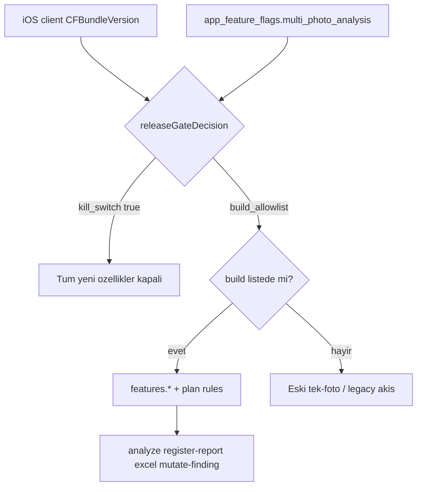

# Build-Gated iOS Feature Rollout Runbook

Son güncelleme: 2026-06-26
Repo: `/Users/keremkayalar/Documents/Kerem-APPler/RiskDetected`

Bu doküman RiskDetected'ın **kalıcı** iOS release stratejisidir: aynı Supabase prod backend üzerinde eski App Store build'leri eski davranışta kalırken, yeni build'lere kontrollü özellik açma. Her yeni iOS sürümünde bu runbook takip edilir.

İlgili teknik detaylar: [CURSOR_HANDOFF_APP_REVIEW_FLAGS_ANALYSIS_STUCK_2026-06-26.md](CURSOR_HANDOFF_APP_REVIEW_FLAGS_ANALYSIS_STUCK_2026-06-26.md)

---

## Temel prensip

**Environment ayrımı yok.** TestFlight, App Review ve App Store aynı Supabase projesini kullanır.

**Build numarası ayrımı var.** `CFBundleVersion` (Xcode `CURRENT_PROJECT_VERSION`) backend gate'in ana anahtarıdır.



**Sonuç:**
- Eski build kullanıcıları güncelleme alana kadar **eski davranışta** kalır.
- Yeni build (allowlist'te) **yeni özellikleri** alır.
- App Review build'i allowlist'teyse reviewer da yeni özellikleri test eder; canlıdaki eski kullanıcılar etkilenmez.

---

## Veri modeli

### Tablo: `public.app_feature_flags`

| `key` | Amaç |
|-------|------|
| `multi_photo_analysis` | Feature gate + özellik seti + acil kill switch |
| `ios_release_policy` | Soft/hard update uyarıları (feature gate değil) |

### `multi_photo_analysis` yapısı

| Alan | Rol |
|------|-----|
| `kill_switch` | `true` → tüm gated özellikler anında kapanır (acil rollback) |
| `rollout_mode` | `off` \| `build_allowlist` \| `min_build` \| `all` — **standart: `build_allowlist`** |
| `enabled_ios_builds` | String array; gate açık build numaraları |
| `min_ios_build` | `rollout_mode=min_build` iken kullanılır; şimdilik genelde `null` |
| `features.*` | Gerçek feature set (`multi_photo_analysis`, `coverage_v2`, `editable_findings`, `report_snapshot_v2`, …) |
| `enable_*` (legacy flat) | **Her zaman `false`** — eski backend kodunun gate'i bypass etmesini engeller |

### `ios_release_policy` yapısı

| Alan | Rol |
|------|-----|
| `latest_build` | Soft update banner için hedef build |
| `minimum_supported_build` | Hard update eşiği (genelde sabit tutulur) |
| `soft_update_enabled` | "Yeni sürüm mevcut" uyarısı |
| `hard_update_enabled` | Zorunlu güncelleme (genelde `false`) |
| `policy_version` | Operasyonel etiket (`build-72-appstore` vb.) |

### Plan kuralları: `public.plan_capability_rules`

Free / Plus / Pro foto limitleri buradan okunur. Build gate açık olsa bile free plan tek foto kalır.

---

## Gate mantığı (backend + iOS)

**iOS:** `App/AppState.swift` — `isReleaseGateOpenForCurrentBuild`
**Backend (canonical):** `supabase/functions/analyze/index.ts` — `releaseGateDecision()` + `applyReleaseGateToFlags()`

Aynı gate pattern'i kullanan edge function'lar:

- `supabase/functions/register-report/index.ts` → `report_snapshot_v2`
- `supabase/functions/generate-excel-report/index.ts` → `report_snapshot_v2`
- `supabase/functions/mutate-analysis-finding/index.ts` → `editable_findings`

Gate sırası:

1. `kill_switch === true` → kapalı
2. `rollout_mode`:
   - `build_allowlist` → `client_app_build` ∈ `enabled_ios_builds`
   - `min_build` → `client_app_build >= min_ios_build`
   - `all` → açık (**kullanma** — eski client uyumsuzluğu riski)
   - `off` → kapalı
3. `features.*` AND client `capabilities.*` AND `plan_capability_rules`

---

## Yeni build workflow (her release'te)

### 1. Xcode

- `RiskDetected.xcodeproj/project.pbxproj` → `CURRENT_PROJECT_VERSION = <N>`
- `App/AppState.swift` → `AppReleasePolicy.fallback.latestBuild = <N>`

### 2. Migration oluştur

```bash
SUPABASE_TELEMETRY_DISABLED=1 node scripts/rd_ops_env.mjs supabase migration new allow_multi_photo_build_<N>
```

Migration SQL şablonu (`supabase/migrations/20260625212844_allow_multi_photo_build_72.sql` referans):

```sql
update public.app_feature_flags
set value = jsonb_set(
    value,
    '{enabled_ios_builds}',
    (
      select jsonb_agg(distinct build order by build)
      from jsonb_array_elements_text(
        coalesce(value->'enabled_ios_builds', '[]'::jsonb) || '["<N>"]'::jsonb
      ) as build
    ),
    true
  ),
  updated_at = now()
where key = 'multi_photo_analysis';

update public.app_feature_flags
set value = jsonb_set(
    jsonb_set(value, '{latest_build}', '<N>'::jsonb, true),
    '{policy_version}',
    to_jsonb('build-<N>-testflight'::text),
    true
  ),
  updated_at = now()
where key = 'ios_release_policy';
```

### 3. Canlı DB'ye uygula (App Review / TestFlight öncesi)

```bash
node scripts/rd_ops_env.mjs status

SUPABASE_TELEMETRY_DISABLED=1 node scripts/rd_ops_env.mjs supabase db query --linked --file supabase/migrations/<file>.sql --output json
```

### 4. Flag doğrula (değiştirme yok, sadece oku)

```bash
SUPABASE_TELEMETRY_DISABLED=1 node scripts/rd_ops_env.mjs supabase db query --linked --output json "
select key, value
from public.app_feature_flags
where key in ('multi_photo_analysis','ios_release_policy')
order by key;
"
```

Beklenen: `kill_switch=false`, `rollout_mode=build_allowlist`, `"<N>"` allowlist'te, `features.*` doğru.

### 5. Release build + E2E

```bash
xcodebuild -project RiskDetected.xcodeproj -scheme RiskDetected \
  -configuration Release -destination 'generic/platform=iOS' -quiet build
```

5 foto E2E: `RiskDetectedUITests.testE2ERealFivePhotoAnalysisCompletes`

### 6. App Store Connect

- Binary upload → TestFlight / App Review
- **Manuel release** tercih edilirse onay sonrası "Release This Version"

### 7. App Store yayın sonrası smoke test

TestFlight değil, **App Store'dan indirilen** build ile Plus hesapta:
- 5 foto slotu, analiz tamamlanması, arka plan resume
- PDF / Excel export, bulgu düzenleme

### 8. DB kabul sorgusu

```bash
SUPABASE_TELEMETRY_DISABLED=1 node scripts/rd_ops_env.mjs supabase db query --linked --output json "
select id, title, status, photo_count, finding_count, last_worker_error,
       (select count(*) from public.photos p where p.analysis_id = a.id)::int as photos_count,
       (select count(*) from public.analysis_photo_summaries aps where aps.analysis_id = a.id)::int as summaries_count,
       coalesce((a.raw_ai_response->'_input_audit'->>'storage_photo_count')::int, 0)::int as audit_storage_photo_count,
       coalesce((a.raw_ai_response->'_input_audit'->>'inline_photo_count')::int, -1)::int as audit_inline_photo_count,
       coalesce((a.raw_ai_response->'_input_audit'->>'coverage_v2')::boolean, false) as audit_coverage_v2,
       created_at
from public.analyses a
where photo_count = 5
order by created_at desc
limit 3;
"
```

Minimum kabul:

| Alan | Beklenen |
|------|----------|
| `status` | `completed` |
| `photo_count` / `photos_count` / `summaries_count` | `5` |
| `finding_count` | `>= 25` |
| `audit_storage_photo_count` | `5` |
| `audit_inline_photo_count` | `0` |
| `audit_coverage_v2` | `true` |
| `last_worker_error` | `null` |

---

## App Review sürecinde kurallar

**Onay gelene kadar:**
- Flag'leri kontrolsüz değiştirme
- App Review build'i allowlist'te olmalı (reviewer yeni özellikleri test edebilsin)
- Eski canlı build allowlist'te değilse etkilenmez

**Onay + manuel release sonrası:**
- Flag değişikliği gerekmez (zaten hazırsa)
- App Store build smoke test + DB kabul
- 24–48 saat izleme; flag'lere dokunma

---

## Asla yapma (routine release)

- `rollout_mode = all` — eski client'lara uyumsuz özellik açabilir
- `enabled_ios_builds`'ten eski build silme
- `minimum_supported_build` veya `hard_update_enabled` kontrolsüz değiştirme
- Build migration'ında `kill_switch` değiştirme (operasyonel karar, migration değil)
- Legacy `enable_*` alanlarını `true` yapma

---

## Acil rollback (öncelik sırası)

1. **En geniş:** `multi_photo_analysis.kill_switch = true`
2. **Dar:** `features.multi_photo_analysis = false`
3. **Build-spesifik:** `enabled_ios_builds` içinden problemli build'i çıkar

DB schema geri alınmaz; sadece flag kapatılır.

---

## Gelecek genişleme: `min_build` modu

Tüm kullanıcılar belirli bir build'e geçtikten sonra (haftalar/aylar):

1. Dört endpoint'in `min_build` desteğini doğrula (static test'ler mevcut)
2. Migration: `rollout_mode = min_build`, `min_ios_build = <cutoff>`
3. **`rollout_mode = all` kullanma**

Cutoff build: ilk "yeni özellikleri destekleyen" App Store build (ör. 72).

---

## Ops araçları

| Araç | Dosya |
|------|-------|
| Keychain + Supabase CLI wrapper | `scripts/rd_ops_env.mjs` |
| iOS client gate | `App/AppState.swift` |
| Backend gate (canonical) | `supabase/functions/analyze/index.ts` |
| Release policy endpoint | `supabase/functions/app-release-policy/index.ts` |
| Seed migration | `supabase/migrations/20260622195418_multi_photo_editable_findings.sql` |
| Build allowlist örnekleri | `supabase/migrations/20260625*_allow_multi_photo_build_*.sql` |

Keychain service isimleri: `riskdetected_supabase_access_token`, `riskdetected_supabase_db_password`

---

## Referans: Build 72 canlı durumu (2026-06-26)

- Marketing: `1.2.0`, Build: `72`
- Onaylı commit: `3a1a755` (`Prepare build 72 for App Review`)
- Canlı smoke test analizi: `9d414bd3-17ef-48d0-b4fa-914a9d6a648c` (`finding_count=29`, `coverage_v2=true`)
- Release follow-up plan: [BUILD_72_RELEASE_FOLLOWUP_2026-06-26.md](BUILD_72_RELEASE_FOLLOWUP_2026-06-26.md)
