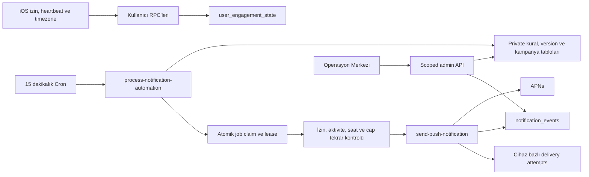

# Uygulama Bildirimleri Otomasyonu ve Operasyon Merkezi Entegrasyonu

Tarih: 25 Temmuz 2026
Durum: Uygulandı; production shadow değerlendirmesi aktif, gerçek gönderim kapalı
Feature flag: `engagement_notification_automation`

## Amaç

RiskDetected kullanıcılarına izinleri, yerel saatleri ve güncel aktiviteleri tekrar
doğrulanarak şu bildirimleri göndermek:

- Onboarding tamamlandıktan 24–72 saat sonra hâlâ analiz göndermeyen kullanıcıya
  yaşam boyu bir kez ilk analiz hatırlatması.
- En az bir tamamlanmış analizi olan ve beş gündür uygulama/ürün aktivitesi
  bulunmayan kullanıcıya her aktivitesizlik episode’unda en fazla bir bildirim.
- Operasyon Merkezi üzerinden yönetilen, aynı izin ve güvenlik sınırlarına tabi
  manuel uygulama bildirimleri.

Analiz kuyruğu, AI sağlayıcı yönlendirmesi, abonelik, trial reminder, rapor ve
transactional bildirim akışları kapsam dışıdır.

## Kullanıcı sözleşmesi

Onboarding metni:

> Deneme süresi ve uygulama hatırlatmaları için bildirimleri aç.

İki otomasyon tek `notification_preferences.app_reminders` alanına bağlıdır ve
uygulamada `Uygulama bildirimleri` olarak gösterilir.

- Migration anında `enabled=true` olan mevcut kullanıcılar için
  `app_reminders=true` olur.
- `enabled=false` kullanıcılar false kalır.
- Yeni ilk izin, tüm mevcut kategorileri ve `app_reminders` tercihini açar.
- Token yenilemesi kategori tercihlerini değiştirmez.
- Master tercih kapatılıp açıldığında kullanıcının kategori seçimleri korunur.
- Sistem izni denied olursa aktif tokenlar kapatılır; master ve kategori
  tercihleri değiştirilmez. İzin yeniden açıldığında aynı kullanıcı niyeti korunur.

## Mimari



## Veri modeli

Public:

- `notification_preferences.app_reminders`
- `user_engagement_state`
- `notification_events` üzerindeki source/job/campaign/template/destination,
  dedupe ve open alanları

Private ve service-role-only:

- `notification_templates`
- `notification_rules`
- `notification_rule_versions`
- `notification_campaigns`
- `notification_jobs`
- `notification_delivery_attempts`

Yeni public RPC’ler yalnız ihtiyaç duydukları role grant edilir. Public tablolarda
RLS açıktır. Private şema `PUBLIC`, `anon` ve `authenticated` rollerine kapalıdır.

## Kural koşulları

### İlk analiz

- Anchor: `coalesce(user_onboarding_answers.completed_at, auth.users.created_at)`
- `24 saat <= yaş < 72 saat`
- Submit edilmiş analiz yok
- Enqueue edilmemiş `pending` taslak submit sayılmaz
- `failed`, `queued`, `analyzing` veya `completed` analiz submit sayılır
- Aktif production token, geçerli timezone, master izin ve app reminder izni
- Yaşam boyu tek başarılı gönderim

### Aktivitesizlik

- En az bir `completed` analiz
- Son aktivite:
  `max(last_foreground_at, completed analysis update, report created_at)`
- Son aktivite en az beş gün önce
- Episode anahtarı son anlamlı aktivite zamanından türetilir
- Yeni foreground veya ürün aktivitesi job’ı gönderimden önce geçersiz kılar

### Ortak güvenlik

- `10:00 <= user local time < 20:00`
- Son 24 saatte başka başarılı push varsa job ilk uygun ana ertelenir
- Uygulama hatırlatması limiti: 1/7 gün ve 2/30 gün
- Her gönderimden hemen önce izin, token, timezone, kural ve aktivite tekrar okunur
- Unknown kind veya preference query hatası fail-closed

## Job ve retry sözleşmesi

- Analiz PGMQ kuyruğundan tamamen bağımsızdır.
- Dedupe key unique’tir.
- Claim `FOR UPDATE SKIP LOCKED`, UUID token ve 300 saniye lease kullanır.
- En fazla üç kontrollü job attempt vardır.
- APNs 429/5xx yalnız ilgili cihaz için en fazla üç kez retry edilir.
- APNs transport belirsizliği `ambiguous` kaydedilir ve otomatik retry edilmez.
- `410`, `BadDeviceToken`, `Unregistered` ve `DeviceTokenNotForTopic` tokenı
  pasif yapar.
- Sender dedupe event’i varsa APNs isteğini tekrarlamaz.

## Rollout

Migration flag’i şu değerle oluşturur:

```json
{
  "rollout_mode": "off",
  "enabled_user_hashes": [],
  "rollout_percentage": 0,
  "kill_switch": false
}
```

İlk migration bu kapalı değerlerle yayınlandı. 26 Temmuz 2026'da
`20260726153737_enable_notification_shadow_evaluation.sql` ile yalnız shadow
değerlendirmesi açıldı:

```json
{
  "rollout_mode": "on",
  "enabled_user_hashes": [],
  "rollout_percentage": 100,
  "kill_switch": false
}
```

Her iki başlangıç kuralı `shadow` kaldığı için cron adayları ölçebilir fakat APNs
gönderimi oluşturamaz.

Rollout sırası:

1. Migration ve functions deploy; flag `off`.
2. Minimum iOS build yayınla.
3. Kurallar `shadow` kalırken feature flag’i aç; gerçek adayları gönderimsiz ölç.
4. Yedi gün aday, timezone ve skip metriklerini değerlendir.
5. Internal production APNs smoke.
6. Kuralları allowlist/active yap.
7. Deterministik kullanıcı hash bucket’ıyla rollout `%5 → %25 → %100`.
8. Otomasyon stabil olmadan manuel kampanyaları schedule etme.

Rollback:

- Global `kill_switch=true` veya `rollout_mode=off`
- Kural `paused`
- Kampanya `paused/cancelled`

Pause, rollout-off ve kill switch pending/claimed otomasyon job’larını güvenli
şekilde park eder; yeniden açıldığında aynı dedupe/episode ile devam eder.
`archived` rule veya `cancelled` campaign terminal iptal uygular. Trial ve
transactional bildirimlere dokunulmaz.

## Zorunlu doğrulamalar

- Deno unit/static testleri ve type-check
- Migration lint ve temiz local/CI pgTAP
- RLS/grant testleri
- APNs 200/400/410/429/500/transport matris testleri
- Saat dilimi ve DST testleri
- Duplicate cron/claim/dedupe testleri
- iOS simulator build
- 3-foto fixture UI testi (`0/3`, slot 4 yok)
- Production deploy öncesi Supabase security/performance advisor

## Build ve deploy manifesti

Minimum iOS build:

- `NotificationService.swift`
- `RiskDetectedApp.swift`
- `AppState.swift`
- Onboarding bildirim ekranı
- Profil bildirim ekranı
- DEBUG 3-foto fixture düzeltmesi

Backend:

- `20260725192642_notification_automation_operations_center.sql`
- `20260726153737_enable_notification_shadow_evaluation.sql`
- `send-push-notification`
- `process-notification-automation`
- `manage-notification-automation`

Gerçek production gönderimi; shadow değerlendirmesi tamamlanmadan, internal
allowlist APNs smoke yapılmadan ve delivery metrikleri doğrulanmadan açılmaz.
