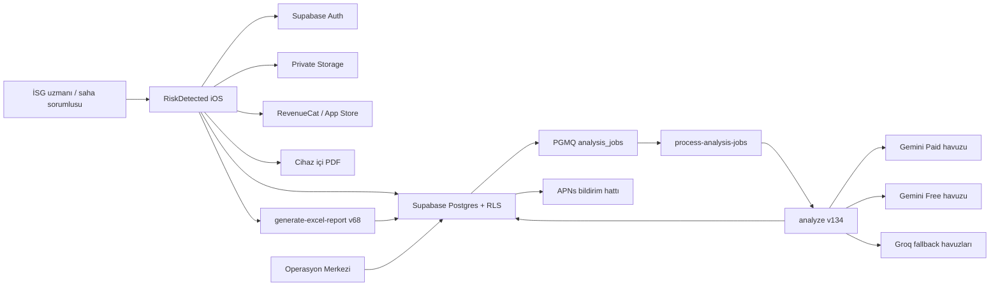
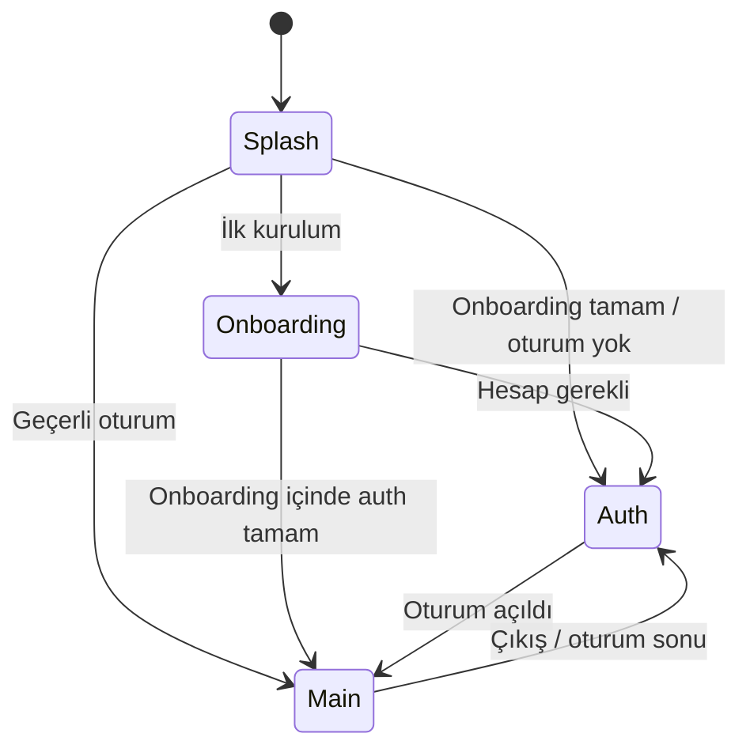
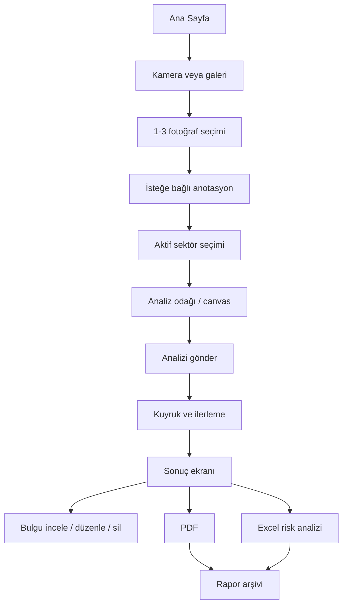
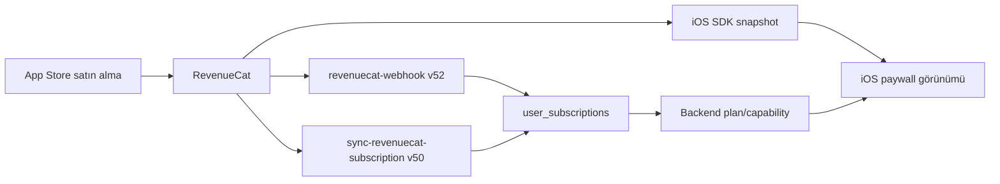
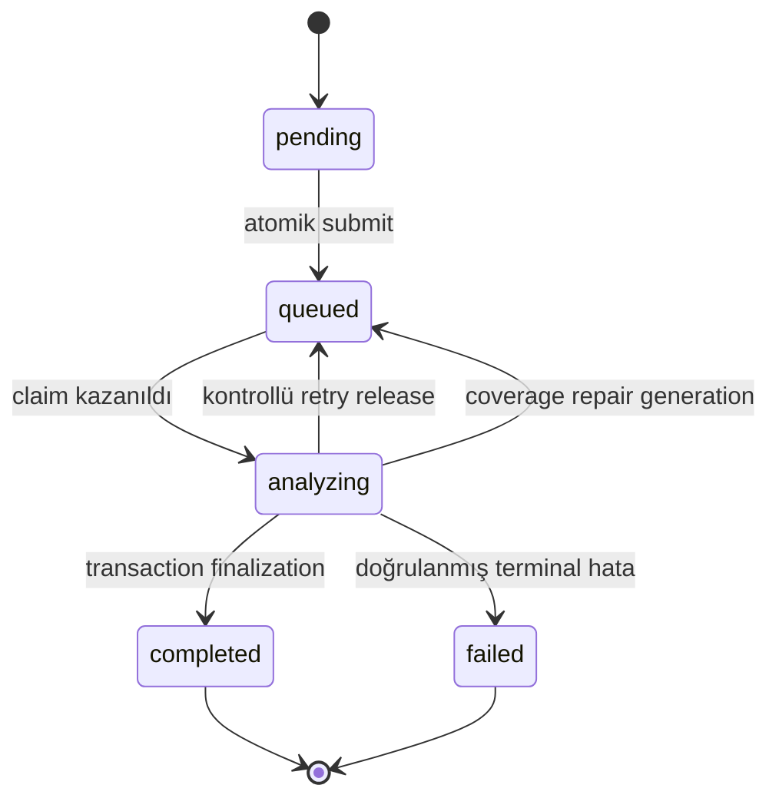
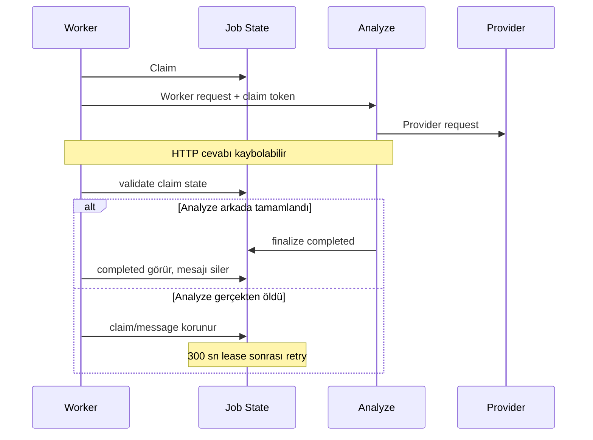
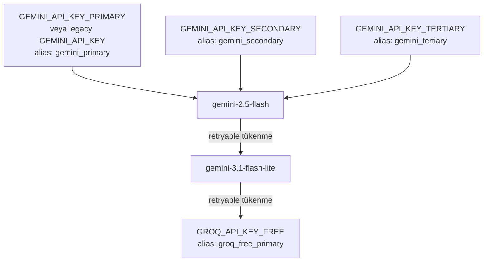
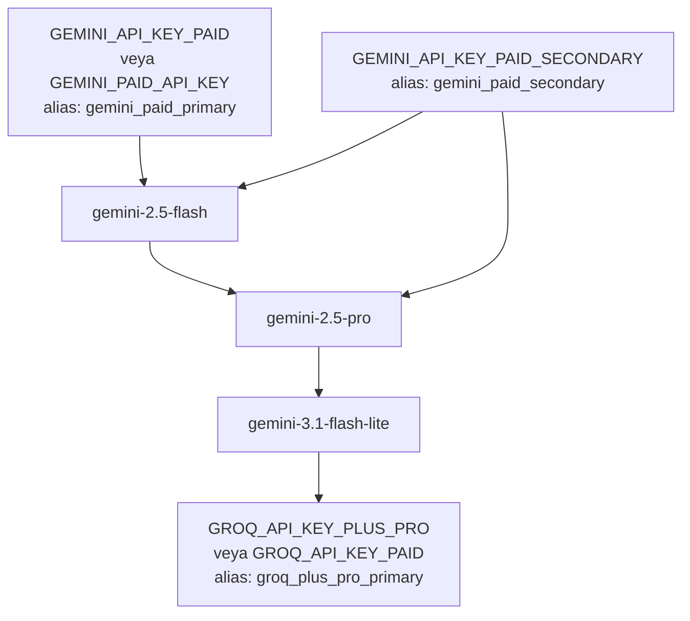
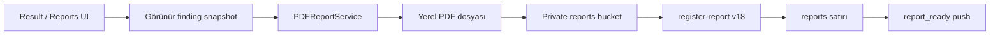
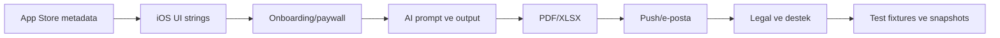

# RiskDetected Aktif Sistem Ana Referansı

Hazırlanma ve son doğrulama tarihi: **28 Temmuz 2026**

Uygulama: **RiskDetected 1.2.4 (77)**

Bundle ID: `com.riskdetected.app`

Production Supabase projesi: `riskdetected` / `ppcrzemgiztzcgddbins`

Belge türü: Ürün, mobil uygulama, backend, veri, abonelik, AI, rapor,
bildirim, güvenlik, lokalizasyon ve operasyon kapsamının birleşik kaynağı

## 1. Belgenin amacı ve kaynak önceliği

Bu belge RiskDetected'i ilk kez öğrenen bir ürün, iOS, backend, AI,
operasyon, destek veya lokalizasyon ekibinin sistemi tek dosyadan
anlayabilmesi için hazırlanmıştır.

Bu belge:

- Uygulamanın ne yaptığını ve ne yapmadığını açıklar.
- Kullanıcı akışlarını, ekranları ve servis sınırlarını gösterir.
- Free, Plus ve Pro planlarını ve istisna kurallarını ayırır.
- Analiz kuyruğu, AI yönlendirmesi, çoklu fotoğraf, repair ve finalizasyon
  güvenliklerini belgeler.
- PDF/Excel rapor üretimini ve saklama politikasını açıklar.
- Bildirim otomasyonunun bugünkü gerçek durumunu gösterir.
- App Store Connect'teki aktif metadata ve lokalizasyon durumunu kaydeder.
- Production flag, Edge Function, cron, bucket ve tablo envanterini özetler.
- Eski veya yanıltıcı alanları ve değiştirilmemesi gereken invariant'ları
  işaretler.

Kaynak çelişkisinde aşağıdaki sıra kullanılmalıdır:

1. Production veritabanı ve aktif Edge Function sürümü.
2. App Store Connect'teki aktif uygulama/sürüm kaydı.
3. Build 77'nin imzalanmış kaynak kodu ve Xcode ayarları.
4. En yeni migration ve release teslim belgeleri.
5. Eski proje belgeleri ve arşiv kayıtları.

Önemli: `docs/RISKDETECTED_FULL_PROJECT_REFERENCE_2026-06-29.md` tarihsel
olarak değerlidir, ancak 5 fotoğraf, eski worker davranışı ve eski sürüm
bilgileri gibi artık geçerli olmayan ayrıntılar içerir. Güncel operasyonlarda
bu dosya esas alınmalıdır.

## 2. Bir dakikalık zihinsel model

RiskDetected, kullanıcının saha fotoğraflarını iş sağlığı ve güvenliği
bağlamında analiz eder; görünür tehlikeleri kanıt, kök neden, düzeltici önlem,
önleyici kontrol ve risk skorlarıyla yapılandırır. Sonuç, uygulamada
incelenebilir ve düzenlenebilir; PDF veya Excel raporuna dönüştürülebilir.



En kritik ürün sınırı:

> RiskDetected karar destek ve dokümantasyon aracıdır. AI çıktısı profesyonel
> saha kontrolünün, yetkili uzman kararının veya mevzuat yorumunun yerine
> geçmez.

## 3. Ürün amacı, hedef kullanıcı ve değer önerisi

### 3.1 Amaç

RiskDetected'in amacı, saha fotoğrafından tehlike tespiti ile denetime hazır
rapor arasındaki manuel işi azaltmaktır.

Ana değer:

- Fotoğraftan görünür tehlike ve uygunsuzluk tespiti.
- Kanıt temelli risk açıklaması.
- Düzeltici ve önleyici kontrol önerileri.
- Fine-Kinney ve 5×5 L-Tipi risk önceliklendirmesi.
- PDF ve Excel raporlama.
- Firma, analiz ve rapor arşivi.
- Mesleki ilerleme ve bildirimlerle kullanım sürekliliği.

### 3.2 Hedef kullanıcılar

- İş güvenliği uzmanları.
- OSGB ekipleri.
- Saha mühendisleri ve saha sorumluları.
- Şantiye, üretim, depo ve operasyon denetimi yapan profesyoneller.
- Küçük ve orta ölçekli işletmelerde İSG sürecinden sorumlu kişiler.
- İşveren vekilleri ve denetim/dokümantasyon ekipleri.

### 3.3 Kapsam dışı beklentiler

- Uygulama resmi uygunluk belgesi vermez.
- Fotoğrafta görünmeyen koşulları kesin gerçek olarak kabul etmez.
- Ölçüm cihazı gerektiren gürültü, gaz, sıcaklık ve benzeri değerleri
  fotoğraftan ölçmez.
- Kullanıcının saha doğrulaması olmadan mevzuata tam uyum garantisi vermez.
- Mevcut sürümde ekip içi sosyal akış, kullanıcılar arası mesajlaşma veya
  herkese açık kullanıcı içeriği bulunmaz.

## 4. Aktif release ve App Store durumu

### 4.1 Teknik release

| Alan | Aktif değer |
| --- | --- |
| Pazarlama sürümü | `1.2.4` |
| Build | `77` |
| App Store state | `READY_FOR_SALE` / `READY_FOR_DISTRIBUTION` |
| Bundle ID | `com.riskdetected.app` |
| Minimum iOS | `16.0` |
| Hedef cihaz ailesi | iPhone (`TARGETED_DEVICE_FAMILY=1`) |
| App Store uygulama ID | `6769498181` |
| Ana dil | Türkçe (`tr`) |
| Development region | `tr` |
| App Store ana kategori | Business |
| App Store ikinci kategori | Productivity |
| Yaş sınırı | 4+ |
| Şifreleme beyanı | Non-exempt encryption kullanılmıyor |

Xcode projesinde iPad yönleri için üretilmiş orientation anahtarları bulunsa da
aktif target yalnız iPhone'dur. App Store da uygulamayı “yalnızca iPhone”
olarak gösterir.

### 4.2 Aktif App Store metadata

App Store Connect API'sinden 28 Temmuz 2026 tarihinde doğrulanan değerler:

| Metadata | Aktif Türkçe değer |
| --- | --- |
| Ad | `RiskDetected: İş Güvenliği İSG` |
| Subtitle | `Risk Analizi ve iş güvenliği` |
| Primary locale | `tr` |
| Keywords | `osgb,is güvenliği,is guvenligi,isg,değerlendirme,uzmanı,sağlığı,tehlike,tespit,5x5,matris` |
| Marketing URL | `https://riskdetected.com` |
| Support URL | `https://riskdetected.com` |
| Privacy Policy | `https://riskdetected.com/gizlilik` |
| Copyright | `© 2026 RiskDetected` |

Public App Store cache'i bir süre eski subtitle
`Risk Analizi ve Denetim Raporu` gösterebilir. Metadata için App Store Connect
kaydı otoritedir.

Aktif “Bu Sürümdeki Yenilikler” metni:

> • Bildirim tercihleri sadeleştirildi ve uygulama bildirimleri tek ayarda
> toplandı.
>
> • Analiz ve rapor oluşturma akışlarının güvenilirliği artırıldı.
>
> • Performans iyileştirmeleri ve hata düzeltmeleri yapıldı.

Aktif açıklamanın kapsamı:

- Fotoğraf ile İSG risk analizi.
- Fine-Kinney ve 5×5 Matris çıktıları.
- PDF ve Excel raporları.
- Tehlike, uygunsuzluk ve kontrol tedbiri önerileri.
- Rapor arşivi, indirme ve paylaşım.
- Firma, hazırlayan ve logo ile özelleştirme.
- OSGB ve uzmanlara yönelik saha denetim akışı.
- KVKK/gizlilik hassasiyeti.
- AI çıktısının profesyonel değerlendirme yerine geçmediği uyarısı.
- Aboneliklerin App Store üzerinden yönetildiği bilgisi.
- Kullanım Koşulları, Gizlilik Politikası ve Apple standart EULA bağlantıları.

### 4.3 App Store yaş derecelendirmesi

Aktif yaş derecelendirmesi 4+'tır. App Store Connect kaydında:

- Kullanıcı tarafından oluşturulan sosyal içerik: yok.
- Mesajlaşma/sohbet: yok.
- Sınırsız web erişimi: yok.
- Reklam: yok.
- Kumar, şiddet, yetişkin içerik ve tedavi bilgisi kategorileri: yok.
- “Made for Kids” override: yok.

### 4.4 Derecelendirme ve ASO anlık görüntüsü

28 Temmuz 2026 Applyra/public storefront görünümü:

- Sürüm: `1.2.4`.
- Ortalama puan: yaklaşık `4.6`.
- Değerlendirme sayısı: `10`.
- Applyra görünürlük skoru: `60`.
- İzlenen Türkçe keyword sayısı: `25`.
- Güçlü terimler arasında `is guvenligi`, `iş güvenliği`,
  `isg risk analizi`, `risk değerlendirme` ve `tehlike tespit` bulunur.

Bu sayılar zamanla değişir; ürün sözleşmesi değil, tarihli pazarlama
göstergesidir.

## 5. Teknoloji yığını

### 5.1 iOS

- Swift.
- SwiftUI.
- Structured concurrency (`async/await`).
- UIKit köprüleri: kamera, galeri, PDF, paylaşım ve haptic gibi alanlar.
- URLSession ve özel server trust pinning delegate'i.
- UserDefaults: cihaz tercihleri ve sınırlı cache.
- Keychain/Supabase Auth session altyapısı.
- APNs.
- Sign in with Apple.
- Google Sign-In.

Aktif SwiftPM bağımlılıkları:

| Paket | Sürüm | Amaç |
| --- | ---: | --- |
| `supabase-swift` | `2.46.0` | Auth, PostgREST, Storage, Functions |
| `purchases-ios-spm` | `5.72.0` | RevenueCat abonelikleri |
| `GoogleSignIn-iOS` | `9.1.0` | Google oturumu |
| `AppAuth-iOS` | `2.0.0` | OAuth altyapısı |
| `app-check` | `11.2.0` | Google App Check bağımlılığı |
| `swift-crypto` | `4.5.0` | Kriptografik yardımcılar |
| `SnapshotPreviews` | `0.15.0` | Görsel/snapshot test altyapısı |
| `FlyingFox` | `0.16.0` | Test yardımcı altyapısı |
| `SimpleDebugger` | `1.0.0` | Debug/test bağımlılığı |

### 5.2 Backend

- Supabase Auth.
- PostgreSQL 17.
- Row Level Security.
- Supabase Storage.
- Deno tabanlı Edge Functions.
- `pg_cron`.
- `pgmq` / `analysis_jobs` dayanıklı kuyruğu.
- RevenueCat webhook ve subscriber sync.
- APNs HTTP/2 gönderimi.
- Google Gemini API.
- Groq OpenAI-compatible API.

Production bölgesi: `eu-central-1`.

### 5.3 Dış servis sınırları

| Servis | Rol |
| --- | --- |
| Apple App Store | Dağıtım, abonelik tahsilatı, trial ve sistem push izni |
| RevenueCat | Offering, entitlement, purchase snapshot ve webhook |
| Supabase | Auth, DB, Storage, Edge Functions, cron ve queue |
| Google Gemini | Ana görsel analiz sağlayıcısı |
| Groq | Provider havuzuna göre süreklilik fallback'i |
| APNs | Transactional ve uygulama bildirimleri |
| RiskDetected web | Destek ve legal sayfalar |

## 6. Repo ve modül haritası

```text
App/
├── AppState.swift
├── RiskDetectedApp.swift
├── RootView.swift
├── DesignSystem/
├── Features/
│   └── ProfessionalProgress/
├── LegalDocuments/
├── Models/
├── Services/
└── Views/
    ├── Analysis/
    ├── Analyzing/
    ├── Annotate/
    ├── Auth/
    ├── Components/
    ├── History/
    ├── Home/
    ├── Legal/
    ├── Onboarding/
    ├── Paywall/
    ├── Profile/
    ├── Report/
    └── Result/

supabase/
├── functions/
├── migrations/
└── tests/

docs/
├── release ve review teslimleri
├── operasyon rehberleri
├── analiz/prompt belgeleri
└── lokalizasyon/pazar raporları
```

Repo anlık büyüklük göstergeleri:

- Yaklaşık 105 Swift kaynak/test dosyası.
- 126 migration SQL dosyası.
- 31 Deno test dosyası.
- 19 Edge Function kaynak klasörü.
- Production'da aktif 18 Edge Function.

`firebase-phone-bridge` kaynak klasörü production aktif function listesinde
değildir. Mevcut kullanıcı auth arayüzü Apple, Google ve e-posta OTP kullanır;
telefon auth'ı aktif ana giriş hattı kabul edilmemelidir.

## 7. Uygulama yaşam döngüsü ve navigasyon

### 7.1 Root flow



`AppState` şu temel sorumlulukları taşır:

- Auth session ve profile.
- Backend doğrulanmış subscription state.
- RevenueCat offering ve entitlement gözlemi.
- Plan capability çözümleme.
- App release policy.
- Aktif tab ve notification deep-link yönlendirmesi.
- Tema tercihi.
- Dil tercihi; bugün yalnız Türkçe normalize edilir.

Root seviyesinde ayrıca:

- Offline banner.
- Legal doküman güncelleme banner/karar ekranı.
- Soft update banner.
- Hard update blok ekranı.
- Notification route hazırlığı.

### 7.2 Ana tab'lar

| Tab | Görev |
| --- | --- |
| Ana Sayfa | Yeni analiz, son analizler, son raporlar, kota ve ilerleme özeti |
| Analizler | Geçmiş analizler ve tamamlanmış sonuçlara erişim |
| Raporlar | PDF/Excel arşivi, filtreleme, görüntüleme ve paylaşım |
| Profil | Profil, abonelik, firma, bildirim, tema, dil, legal, destek ve hesap işlemleri |

Tab bar'daki ayrı viewfinder düğmesi hızlı taramayı açar. Free günlük kota
dolmuşsa kullanıcı paywall'a yönlendirilir.

### 7.3 Ana kullanıcı akışı



## 8. Onboarding ve kimlik doğrulama

### 8.1 Onboarding kapsamı

Onboarding V2 içinde şu bağlamlar toplanabilir:

- Ağrı noktası / kullanım amacı.
- Sertifika veya rol sınıfı.
- Sektörler.
- Tehlike sınıfı.
- Denetim sıklığı.
- Kişiselleştirilmiş plan özeti.
- Abonelik/trial daveti.
- Bildirim izni.
- Apple, Google veya e-posta OTP ile hesap.

Onboarding cevapları, aktif analiz promptuna kontrollü kişiselleştirme sinyali
verir. Kullanıcının sertifika sınıfı, sektörleri, tehlike sınıfı ve denetim
sıklığı AI'ya “bağlam” olarak aktarılır; fotoğrafta görünmeyen tehlikeyi
uydurma yetkisi vermez.

Onboarding taslağı auth öncesinde cihazda tutulabilir ve oturum açıldığında
`user_onboarding_answers` tablosuna senkronize edilir.

### 8.2 Bildirim izin metni

Aktif onboarding metni:

> Deneme süresi ve uygulama hatırlatmaları için bildirimleri aç.

Tek Apple sistem izni alınır. Kullanıcı daha sonra Profil içindeki bildirim
ayarlarından kategorileri değiştirebilir.

### 8.3 Auth yöntemleri

- Sign in with Apple.
- Google Sign-In SDK ile ID token.
- E-posta adresine 6 haneli OTP.
- Supabase PKCE/deep-link dönüşü.

Kod içinde parola ile login gerçek E2E test desteği için bulunur; normal
kullanıcı arayüzünün ana yöntemi değildir.

Yeni kurulumda iOS Keychain'de kalmış eski Supabase session'ı otomatik kabul
edilmez. Fresh install marker ile eski session temizlenir.

### 8.4 Profil

Profil alanları arasında:

- Ad soyad ve baş harfler.
- E-posta ve telefon.
- Ünvan.
- Sertifika/belge numarası.
- Tercih edilen risk yöntemi.
- Profil fotoğrafı.
- Legacy firma adı/logosu.
- Plan ve abonelik bilgisi.

Aktif çoklu firma hattında firma verisi `companies` tablosundadır; legacy
profil firma alanları geriye uyumluluk/fallback işlevi görür.

## 9. Abonelik sistemi

### 9.1 Otoriteler

Abonelikte tek bir kaynak yoktur:

1. Apple işlemi ve StoreKit.
2. RevenueCat entitlement/subscriber snapshot.
3. `user_subscriptions` backend kaydı.
4. `profiles.tier` kullanıcı arayüzü/backfill alanı.

Backend güvenliği için `user_subscriptions` ve RevenueCat doğrulaması esastır.
İstemci tek başına ücretli plan açamaz.



### 9.2 Aktif ürünler

| Ürün | Product ID | Dönem | App Store durumu | Seviye |
| --- | --- | --- | --- | ---: |
| Plus Monthly | `riskdetected_plus_monthly` | 1 ay | Approved | 2 |
| Plus Yearly | `riskdetected_plus_yearly` | 1 yıl | Approved | 2 |
| Pro Monthly | `riskdetected_pro_monthly` | 1 ay | Approved | 1 |
| Pro Yearly | `riskdetected_pro_yearly` | 1 yıl | Approved | 1 |

RevenueCat entitlement ID'leri:

- `plus`
- `pro`

Pro, subscription group içinde daha yüksek seviye olan level 1'dir.

### 9.3 Aktif fiyat referansı

App Store Connect pricing summary baz fiyatları:

| Ürün | Baz fiyat |
| --- | ---: |
| Plus Monthly | USD 4.99 |
| Plus Yearly | USD 49.99 |
| Pro Monthly | USD 9.99 |
| Pro Yearly | USD 99.99 |

Public Türkiye Store'da 28 Temmuz 2026 civarında görünen fiyatlar:

| Ürün | Türkiye fiyatı |
| --- | ---: |
| Plus Monthly | ₺249,99 |
| Plus Yearly | ₺2.499,99 |
| Pro Monthly | ₺499,99 |
| Pro Yearly | ₺4.999,99 |

Fiyatlar Apple territory eşlemesine göre değişebilir. Uygulama sabit fiyat
yazmak yerine RevenueCat/StoreKit'ten gelen localized price kullanır.

### 9.4 7 günlük trial

Yalnız `riskdetected_plus_yearly` ürünü uygun kullanıcılar için 1 haftalık
ücretsiz deneme taşır.

28 Temmuz 2026 App Store Connect kaydında:

- Mod: `FREE_TRIAL`.
- Süre: `ONE_WEEK`.
- Period: 1.
- Territory kaydı: 175.
- Planlanan bitiş tarihi: 30 Eylül 2026.

Plus aylık ve Pro ürünlerinde aktif introductory offer yoktur.

Bu tarih operasyonel olarak takip edilmelidir. 30 Eylül sonrasında trial'ın
devam etmesi isteniyorsa App Store Connect teklif tarihleri ayrıca
güncellenmelidir.

### 9.5 Plan capability matrisi

| Kural | Free | Plus | Pro |
| --- | ---: | ---: | ---: |
| Standart analiz | 1/gün | 10/gün | 40/gün |
| Detaylı analiz | Yok | 2/gün | 10/gün |
| Fotoğraf/analiz | 1 | 3 | 3 |
| Bulgu/fotoğraf | 12 | 13 | 13 |
| Bulgu/analiz | 12 | 39 | 39 |
| Çoklu fotoğraf | Hayır | Evet | Evet |
| AI bulgusu düzenleme | Evet | Evet | Evet |
| Manuel bulgu ekleme | Hayır | Hayır | Hayır |
| Aylık standart rapor | 3 | 150 | 750 |
| Firma | 0 | 5 | 25 |
| Fotoğraf saklama | 7 gün | 30 gün | Süresiz |

Detaylı analiz, emergency/procedure ve ileri canvas erişimleri ayrıca tier
kontrolüne tabidir. Kullanıcıya gösterilen plan metni ile backend enforcement
aynı kavramı anlatmalı; güvenlik açısından backend limiti otoritedir.

### 9.6 İptal edilmiş Plus trial özel kuralı

Yıllık Plus trial'ı 7 gün dolmadan iptal eden kullanıcı:

- Trial bitimine kadar Plus haklarını korur.
- 3 fotoğraf, Plus promptu, Plus schema, rapor ve UI haklarını korur.
- İptalin backend tarafından doğrulanmasından sonraki analizlerde yalnız Free
  AI sağlayıcı havuzunu kullanır.
- Yenilemeyi tekrar açarsa Paid havuza döner.
- Trial süresi biterse normal Free politikası çalışır.

Kesin uygunluk koşulları:

- Tier `plus`.
- Status `active`, `trialing` veya `grace_period`.
- `product_id` ve `trial_product_id` tam olarak
  `riskdetected_plus_yearly`.
- `will_renew=false`.
- Geçerli, yaklaşık 7 günlük trial tarihleri.
- Trial ve current period henüz bitmemiş.
- Trial/current-period bitişleri en fazla 5 dakika farklı.
- `cancelled_plus_trial_free_routing` flag'i açık.

Eksik veya çelişkili metadata Paid route'ta kalır. Bu kaliteyi koruyan
fail-safe davranıştır.

## 10. Fotoğraf girdi hattı

### 10.1 Aktif ürün kuralı

Production fotoğraf limiti:

- Free: 1.
- Plus: 3.
- Pro: 3.

5 fotoğraf aktif bir ürün özelliği değildir.

### 10.2 Legacy alan tuzağı

Production `multi_photo_analysis` JSON'unda tarihsel
`plus_pro_5_photo_limit` isimli alanlar bulunur. Alan adı ürün gerçeğini
yansıtmaz; runtime `max_photo_count_plus=3` ve `max_photo_count_pro=3`
değerleriyle sınırlar.

`plan_capability_rules.free.visible_photo_slots_in_ui=5` legacy değeri de
bulunur. iOS `safeVisiblePhotoSlotsInUI` ile değeri en fazla 3'e clamp eder.
Build 77 UI testi 3 slotu esas alır.

Yeni geliştirmelerde:

- “5” isimli eski flag genişletilmemeli.
- Fotoğraf sınırı tek bir typed capability sözleşmesine taşınmalıdır.
- Backend ve istemci ikisi de 3 üst sınırını korumalıdır.

### 10.3 Fotoğraf hazırlama

iOS:

- Kamera veya galeriden görsel alır.
- JPEG/PNG/HEIC girişlerini yönetir.
- Görseli normalize eder, boyutu düşürür ve upload için hazırlar.
- Anotasyon katmanını görsele uygular.
- Fotoğrafları sıra ve client photo ID ile taşır.

Backend:

- MIME ve base64 boyutlarını doğrular.
- Fotoğraf sayısını plan snapshot'ıyla kontrol eder.
- Inline görseli private `photos` bucket'ına kalıcılaştırır.
- `photos` tablosuna metadata yazar.
- Sahiplik, analiz ve retention ilişkisini kurar.

Aktif uygulama kalite kararı gereği fotoğrafsız yeni analiz kabul etmez.
`text_input` ve eski metin kayıtları şemada geriye uyumluluk için kalır.

## 11. Analiz odağı, sektör ve prompt bağlamı

### 11.1 Aktif sektörler

Kanonik backend/iOS sektör ID'leri:

| ID | Türkçe etiket |
| --- | --- |
| `general` | Genel İSG |
| `construction` | İnşaat |
| `manufacturing` | İmalat / Fabrika |
| `mining` | Maden |
| `energy` | Enerji |
| `office` | Ofis |
| `logistics_warehouse` | Depo / Lojistik |
| `chemical_laboratory` | Kimya / Laboratuvar |
| `healthcare` | Sağlık / Hastane |
| `food_production` | Gıda Üretimi |
| `agriculture_livestock` | Tarım / Hayvancılık |
| `retail` | Perakende / Mağaza |
| `municipal_field_services` | Belediye / Kamu Saha İşleri |
| `education` | Eğitim Kurumu |
| `hospitality` | Otel / Konaklama |

`general` onboarding seçeneği değil, analiz fallback'idir. Onboarding sektörü,
son kullanılan sektör ve önerilen sektör picker sırasını etkiler.

### 11.2 Canvas'lar

| Canvas | ID | Minimum plan |
| --- | --- | --- |
| Genel | `general` | Free |
| KKD | `ppe` | Free |
| Makine | `machine` | Plus |
| Uyarı levhaları | `warning_signs` | Free |
| Elektrik | `electrical` | Free |
| Sektör | `sector` | Plus |
| Yangın | `fire` | Free |
| Özel Ekipman | `ergonomics` | Pro |
| Ortam Ölçümü | `environment_measurement` | Plus |
| Patlama | `explosion` | Free |
| Çevre | `environment` | Free |
| Mevzuat | `legislation` | Pro |
| Yüksekte Çalışma | `working_at_height` | Free |
| Hareketli Ekipman | `mobile_equipment` | Free |
| Genel Premium | `general_premium` | Pro |
| İş Makineleri | `construction_machinery` | Free |

Canvas ID'si legacy tek alan olarak `analyses.canvas` içinde tutulur.
İstemci birden çok seçim taşıyabilse de primary sorted ID legacy sözleşmeyi
korur; backend davranışında kanonik çözüm kontrol edilmeden çoklu canvas
varsayılmamalıdır.

### 11.3 Prompt bağlamı

AI promptu şu katmanlardan oluşur:

- Sistem güvenlik ve kalite talimatı.
- Plan/quality tier.
- Analiz modu.
- Canvas odağı.
- Aktif sektör.
- Onboarding kişiselleştirmesi.
- Firma ve tehlike sınıfı.
- Fotoğraf indeks marker'ları.
- Çoklu fotoğraf coverage sözleşmesi.
- Response schema.

Promptun temel ilkeleri:

- Yalnız görünür kanıta dayan.
- Varsayımı gerçek gibi yazma.
- Ölçüm gerektiren konuda saha doğrulaması iste.
- Aynı tehlikeyi tekrar üretme.
- Tehlike, kanıt, kök neden ve önlemi birbirinden ayır.
- Referansları kısa ve uygun bağlamda üret.
- Fotoğraf marker'larını kullanıcı metnine sızdırma.
- Her bulguyu ilgili fotoğraf indeksleriyle bağla.

## 12. Analiz queue ve worker mimarisi

### 12.1 Durum makinesi



Veritabanı guard'ı tamamlanmış analizin sonradan `queued`, `analyzing` veya
`failed` yapılmasını engeller.

### 12.2 Atomik submit

Pipeline V2'de:

- `pending → queued` ve `pgmq.send()` aynı transaction içindedir.
- Aynı `analysis_id` ile ikinci istemci isteği yeni mesaj üretmez.
- `queued/analyzing` idempotent kabul edilir.
- `completed` mevcut sonuç olarak döner.
- `failed` eski analizi yeniden açmaz; yeni analysis ID gerekir.

Kota reservation'ı `analysis_id` ile idempotent'tir.

### 12.3 Job state

`private.analysis_job_state` şunları tutar:

- Aktif queue message ID.
- Job mode: `analysis` veya `repair`.
- Generation.
- Claim token.
- Claim/lease zamanları.
- Gerçek worker attempt sayısı.
- Pipeline/guard bağlamı.

Aktif değerler:

- Queue visibility timeout: 180 saniye.
- Analyze worker HTTP timeout: 135 saniye.
- Claim lease: 300 saniye.
- En fazla gerçek worker attempt: 3.

### 12.4 Claim

Worker AI çağırmadan önce `claim_analysis_job_v2` kullanır.

- Yalnız aktif message ID + generation eşleşmesi claim alır.
- Duplicate mesaj AI çağırmadan superseded olur.
- Aktif lease varken ikinci okuma attempt tüketmez.
- Lease dolunca yeni token ve yeni gerçek attempt oluşur.
- Eski token yeni attempt'in sonucunu değiştiremez.

### 12.5 Belirsiz transport guard

Nested Edge Function HTTP cevabı gerçeğin tek kaynağı değildir.



HTTP timeout, 5xx, bağlantı kopması veya bozuk response durumunda worker V2
claim'ini kör biçimde bırakmaz. Önce `validate_analysis_job_claim_v2` ile
DB durumu okunur.

Bu kuralın amacı, ilk AI çağrısı arkada devam ederken ikinci Gemini isteğinin
başlamasını önlemektir.

### 12.6 Terminal yazımlar

V2 analizde:

- Finalization claim token ile doğrulanır.
- Failure kaydı claim token ile doğrulanır.
- Claim kaybeden eski worker sonucu `discarded` olur.
- Retryable provider hatasını `analyze` kontrollü biçimde serbest bırakır.
- Worker transport catch'i doğrudan terminal failure yazmaz.

## 13. AI yönlendirme ve anahtar havuzları

Secret değerleri bu belgede yer almaz. Yalnız environment variable adları ve
telemetri alias'ları gösterilir.

### 13.1 Modeller

| Rol | Model |
| --- | --- |
| Free ana model | `gemini-2.5-flash` |
| Free/model fallback | `gemini-3.1-flash-lite` |
| Paid hızlı model | `gemini-2.5-flash` |
| Paid kalite model | `gemini-2.5-pro` |
| Paid son Gemini fallback | `gemini-3.1-flash-lite` |
| Groq varsayılan vision | `meta-llama/llama-4-scout-17b-16e-instruct` |

### 13.2 Free Gemini havuzu



Free key sırası `GEMINI_FREE_PREFERRED_KEY_ALIAS` ile değiştirilebilir.
Primary, secondary ve tertiary aynı Google Cloud projesindeyse kota
birleşiktir; çok anahtar tek başına ekstra proje kotası anlamına gelmez.

### 13.3 Paid Gemini havuzu



### 13.4 Route matrisi

| Route | Kullanıcı | Output quality | Provider havuzu |
| --- | --- | --- | --- |
| `free_legacy` | Normal Free legacy route | Free | Free Gemini → Free Groq |
| `free_paid_trial` | Free standart continuity denemesi | Plus | Paid Gemini → Free Gemini → Free Groq |
| `paid_plan` | Plus/Pro | Plan tier | Paid Gemini → Paid Groq |
| `cancelled_plus_trial_free` | İptal edilmiş aktif Plus yıllık trial | Plus | Yalnız Free Gemini → Free Groq |

`cancelled_plus_trial_free` hiçbir koşulda paid alias'a geçmemelidir. Bu,
telemetri ve rollout için kritik invariant'tır.

### 13.5 Fiziksel istek ve logical çağrı farkı

Bir `ai_usage_logs` satırı logical job'ı temsil eder; tek fiziksel HTTP isteği
garantisi değildir.

Ek fiziksel provider isteği oluşturabilecek nedenler:

- 429 veya provider 5xx.
- Timeout.
- API key fallback.
- Model fallback.
- Gemini → Groq fallback.
- `MAX_TOKENS` retry.
- Invalid JSON fallback.
- Layer schema fallback.
- Exact coverage schema reddi.

`provider_request_count`, `provider_attempt_total_tokens` ve
`provider_attempts` fiziksel istekleri ayırmak için kullanılır.

## 14. Çoklu fotoğraf ve exact coverage

### 14.1 Hedef

Sağlıklı iki veya üç fotoğraf isteği:

- Tek analysis generation.
- Tek logical AI log.
- Tek fiziksel provider request.
- Her fotoğraf için tam bir coverage kaydı.
- Repair mesajı olmadan tamamlanma.

Provider hatasında availability fallback'leri ek istek oluşturabilir.

### 14.2 Schema V2

`multi_photo_exact_coverage_schema` açıkken Gemini response schema:

- `photo_findings.minItems=maxItems=photoCount`.
- `photo_index` geçerli indeks enum'uyla sınırlı.
- 2 fotoğrafta tam `[1,2]`.
- 3 fotoğrafta tam `[1,2,3]`.

Groq `json_object` kullandığından aynı sözleşme promptla zorlanır.

### 14.3 Normalizasyon

- Sırası farklı tam indeks listesi geçerlidir.
- Aynı indeksin duplicate kayıtları merge edilir.
- Duplicate bulgular kök neden/kanıt/kontrol kurallarıyla tekilleştirilir.
- Geçersiz indeksli kayıtlar final bulguya alınmaz.
- Tüm beklenen indeksler varsa yalnız duplicate/fazlalık nedeniyle repair yoktur.
- Eksik kayıt “temiz fotoğraf” kabul edilmez.
- `no_actionable_hazard` ve `low_quality` açık kayıtları repair edilmez.
- `actionable` fakat sıfır bulgulu kayıt repair adayıdır.

### 14.4 Repair

- Yalnız eksik/çelişkili fotoğraflar repair'e gider.
- Aynı analizde en fazla bir repair generation vardır.
- Repair ikinci kullanıcı kotası tüketmez.
- Repair hâlâ eksikse üçüncü repair oluşturulmaz.
- Güvenli ilk-pass sonuçlarıyla finalizasyon yapılır.
- Eski analysis generation yeni repair sonucunu değiştiremez.

Coverage audit'i `raw_ai_response._coverage_v2` ve AI usage alanlarında saklanır.

## 15. Bulgular ve risk hesabı

### 15.1 Bulgu yapısı

Bir bulgu temel olarak şunları taşır:

- Başlık.
- Kategori.
- Görünür kanıt/açıklama.
- Confidence.
- Kök neden.
- Düzeltici önlem.
- Önleyici kontrol.
- Referanslar.
- Saha doğrulaması gereksinimi.
- Kaynak fotoğraf indeksleri.
- Fine-Kinney girdileri.
- 5×5 girdileri.

### 15.2 Fine-Kinney

Formül:

```text
Risk = Olasılık × Frekans × Şiddet
```

Uygulama bandı:

| Skor | Etiket |
| ---: | --- |
| 401+ | Tolerans dışı |
| 201–400 | Yüksek risk |
| 71–200 | Önemli risk |
| 21–70 | Olası risk |
| 0–20 | Önemsiz |

### 15.3 5×5 L-Tipi

Formül:

```text
Risk = Olasılık × Şiddet
```

| Skor | Etiket |
| ---: | --- |
| 20+ | Tolerans dışı |
| 10–19 | Yüksek risk |
| 5–9 | Orta risk |
| 3–4 | Düşük risk |
| 1–2 | Önemsiz |

### 15.4 Kalite guard'ları

- Evidence guard.
- Layer audit.
- Duplicate bulgu temizliği.
- Fotoğraf başına ve toplam bulgu bütçesi.
- Unsupported/boş bulgu temizliği.
- Kaynak fotoğraf indeksi doğrulaması.
- Risk skor normalizasyonu.
- Kullanıcıya sızmaması gereken marker temizliği.
- Reference/root-cause contract.

### 15.5 Kullanıcı düzenlemeleri

Tüm planlarda AI bulgusu düzenleme açıktır. Kullanıcı:

- Bulguyu güncelleyebilir.
- Uygun olmayan bulguyu silebilir/gizleyebilir.
- Risk ayrıntılarını inceleyebilir.

`mutate-analysis-finding`:

- Owner kontrolü yapar.
- Edit version'ı artırır.
- `finding_edit_events` audit'i yazar.
- Rapor snapshot sürümünü etkiler.

Manuel sıfırdan bulgu ekleme aktif değildir.

## 16. Transactional finalizasyon ve telemetri

### 16.1 Finalizasyon

`finalize_analysis_result_v2` tek transaction içinde:

- Claim ve aktif generation'ı tekrar doğrular.
- Eski tamamlanmamış bulguları güvenli değiştirir.
- Yeni findings setini yazar.
- Analiz skor, sayı, özet ve raw response alanlarını yazar.
- Fotoğraf özetlerini idempotent upsert eder.
- Kota reservation'ını completed yapar.
- Analizi completed yapar.
- Claim'i kapatır.

Response kaybolursa sonraki worker analizin completed olduğunu görür ve AI
çağırmadan queue mesajını temizler.

### 16.2 Persistence telemetrisi

`persistence_outcome` değerleri:

| Değer | Anlam |
| --- | --- |
| `not_started` | Provider aşamasında sonuç alınmadı |
| `pending` | AI cevabı var, DB sonucu henüz tamamlanmadı |
| `persisted` | Sonuç başarıyla kaydedildi |
| `failed` | Persistence kesin başarısız |
| `discarded` | Claim kaybedildiği için sonuç uygulanmadı |

AI başarı logu provider cevabından hemen sonra yazılır; DB finalizasyonu
sonrasında `persisted` olur.

### 16.3 Job event'leri

`private.analysis_job_events` şu olayları ayırır:

- claim acquired.
- dispatch success/application error.
- ambiguous transport.
- claim kept/released.
- terminal failed.
- repair superseded.
- finalized.
- response loss sonrası message delete.
- lease-expired retry.
- max attempts.

Loglarda prompt, fotoğraf, secret veya tam provider response'u bulunmamalıdır.

## 17. Sonuç, geçmiş ve arşiv

### 17.1 Sonuç ekranı

Sonuç ekranı:

- Analiz özetini.
- Bulgu sayısı ve risk dağılımını.
- Canvas ve sektör bağlamını.
- Bulgu kartlarını.
- Fine-Kinney / 5×5 yöntem seçimini.
- Bulgu ayrıntılarını.
- Edit/delete işlemlerini.
- Rapor oluşturma girişini gösterir.

### 17.2 Geçmiş

Analizler tab'ı:

- Kullanıcının kendi analizlerini listeler.
- Tamamlanan sonucu açar.
- Kuyrukta/analizde olan işi yeniden takip edebilir.
- Owner bazlı RLS ile ayrılır.

Fotoğraf retention sonrası silinse bile finding ve rapor snapshot'ı korunabilir;
eski sonuç ekranının görsel bölümü boşalabilir.

## 18. Rapor sistemi

### 18.1 Rapor türleri

| Tür | Format | Üretim |
| --- | --- | --- |
| Standart saha raporu | PDF | iOS cihaz içinde |
| Detaylı risk analizi | PDF | iOS cihaz içinde |
| Risk analizi tablosu | XLSX | `generate-excel-report` Edge Function |

Risk yöntemleri:

- Fine-Kinney.
- 5×5 L-Tipi.

### 18.2 PDF hattı



PDF:

- Profil/hazırlayan bilgisi.
- Ünvan ve belge numarası.
- Firma adı, bilgisi ve logo.
- Analiz sektörü.
- Risk yöntemi.
- Bulgu tablosu/detayı.
- Risk dağılımı.
- Sayfa ve doküman numarası.

### 18.3 Excel hattı

`generate-excel-report v68`:

- JWT ve owner kontrolü yapar.
- Analiz, finding, profil ve firma verisini okur.
- Risk yöntemine göre workbook üretir.
- Gerekirse firma logosunu gömer.
- Private reports bucket'a yükler.
- Report satırı ve usage event yazar.
- Best-effort report-ready push gönderir.

### 18.4 Snapshot ve idempotency

Raporlar:

- `findings_snapshot_json`.
- `photos_snapshot_json`.
- `analysis_edit_version`.
- `company_snapshot`.
- Kaynak fotoğraf ve görünür bulgu sayısı.

taşır.

Bu sayede kullanıcı daha sonra bulguyu düzenlese veya firmayı arşivlese bile
üretilmiş raporun bağlamı korunur.

Request/support ID ve unique sözleşmeler duplicate rapor üretimini sınırlar.

### 18.5 Rapor kotası

- Free: günde 1 standart rapor.
- Plus: ayda 150.
- Pro: ayda 750.

Ay sınırı `Europe/Istanbul` iş zaman dilimine göre hesaplanır.

Free kullanıcı için ayrıca bir kez kullanılabilen risk analizi tablosu trial
hakkı bulunur. Bu hak standard monthly report quota'dan ayrı
`report_risk_analysis_trial` usage event'i ile takip edilir.

### 18.6 Rapor saklama

Raporlar kullanıcı silene kadar saklanır. Storage bucket private'tır; erişim
signed URL/owner kontrollü akışla yapılır.

## 19. Firma sistemi

Firma kaydı:

- Ad.
- Tehlike sınıfı.
- Adres.
- İlgili kişi.
- Departman.
- Varsayılan sorumlu.
- Varsayılan termin günü.
- Logo.
- Arşiv durumu.

Limitler:

- Free: 0.
- Plus: 5 aktif firma.
- Pro: 25 aktif firma.

Firma:

- Analize atanabilir.
- Rapor filtresi olarak kullanılabilir.
- Rapor snapshot'ına kopyalanır.
- Kullanıcı sahipliği dışında okunamaz/değiştirilemez.

Legacy profile company alanları, eski veriler ve fallback raporlar için
korunur.

## 20. Mesleki ilerleme

Mesleki ilerleme modülü aktif feature'dır.

### 20.1 MDP ve unvanlar

| Unvan | MDP eşiği |
| --- | ---: |
| Aday Uzman | 0 |
| Saha Gözlemcisi | 1.000 |
| Risk Avcısı | 5.000 |
| Tehlike Analisti | 15.000 |
| Kıdemli Risk Uzmanı | 40.000 |
| Güvenlik Stratejisti | 90.000 |
| Usta İSG Uzmanı | 180.000 |

Analysis/report workflow başına MDP artışı ekonomide sınırlandırılır; bir
workflow'un aşırı export ile hızlı rank atlaması engellenir.

### 20.2 Yetkinlikler

- Yangın.
- Kimyasal.
- Elektrik.
- Mekanik.
- Ergonomi.
- Psikososyal.
- Yüksekte çalışma.
- KKD.
- Maden.
- İnşaat.
- Fabrika.

Finding metni keyword/classifier ile yetkinliğe bağlanır. Güven düşükse
`unclassified` kalabilir.

### 20.3 Rozetler ve özetler

- Rapor sayısı kilometre taşları.
- Yetkinlik çeşitliliği.
- İlk yüksek/kritik risk.
- İlk detaylı risk analizi raporu.
- Aktif gün kilometre taşları.
- Onboarding alanıyla ilgili ilk rapor.
- Haftalık analiz/rapor/finding özeti.

Cron:

```text
30 6 * * 1
```

Her pazartesi haftalık professional progress tracking çalışır.

## 21. Bildirim sistemi

### 21.1 Katmanlar

Bildirim sistemi üç gruptur:

1. Transactional.
2. Mesleki ilerleme.
3. Uygulama hatırlatmaları/engagement.

Kullanıcı arayüzünde engagement otomasyonları tek
`Uygulama bildirimleri` tercihiyle yönetilir.

### 21.2 Kind → preference sözleşmesi

| Kind | Preference |
| --- | --- |
| `analysis_complete` | `analysis_complete` |
| `report_ready` | `report_ready` |
| `account_updates` | `account_updates` |
| `trial_reminder` | `trial_reminder` |
| Progress weekly | `progress_weekly_summary` |
| Progress monthly | `progress_monthly_summary` |
| Progress milestone | `progress_milestones` |
| `first_analysis_reminder` | `app_reminders` |
| `inactivity_reminder` | `app_reminders` |
| `manual_app_reminder` | `app_reminders` |

Bilinmeyen kind fail-closed'dur. Engagement/manual bildirimlerinde preference
satırı zorunludur.

`marketing` legacy preference alanı hâlâ DB/panelde bulunabilir; yeni
engagement otomasyonunun otoritesi `app_reminders` alanıdır. Operasyon Merkezi
“Pazarlama” etiketini yeni uygulama hatırlatmasıyla karıştırmamalıdır.

### 21.3 Token ve tercih

- APNs token kaydı kategori tercihlerini yeniden açmaz.
- İlk izin verildiğinde kategoriler açık oluşturulur.
- Token refresh, kullanıcının kapattığı tercihi değiştirmez.
- Sistem izni kapanırsa token pasifleşir; kategori seçimi korunur.
- Sistem izni açılırsa önceki kategori seçimi korunur.
- `BadDeviceToken`, `Unregistered` veya APNs 410 tokenı pasif yapar.

### 21.4 Transactional güvenilirlik

Analiz ve rapor push'larında:

- `completion_push_sent_at` / `report_ready_push_sent_at` idempotency guard'ı
  vardır.
- APNs 200 “Apple kabul etti” anlamına gelir; cihazın kesin gösterdiği anlamına
  gelmez.
- Open tracking `notification_event_id` ile kaydedilir.
- Allowed destinations: `home`, `new_analysis`, `profile`, ayrıca mevcut
  transactional rapor/analiz yönleri.

### 21.5 Engagement otomasyonu

Flag:

```json
{
  "rollout_mode": "on",
  "rollout_percentage": 100,
  "kill_switch": false
}
```

Ancak başlangıç kurallarının durumu hâlâ `shadow`:

| Kural | Durum |
| --- | --- |
| Onboarding sonrası 24–72 saatte ilk analiz yok | `shadow` |
| En az bir completed analiz + 5 gün inactivity | `shadow` |

Bu nedenle altyapı kullanıcıları değerlendirir, fakat başlangıç kuralları
aktif engagement push göndermemelidir. Flag'in `on` olması tek başına kuralın
`active` olduğu anlamına gelmez.

### 21.6 Kural şartları

İlk analiz:

- Onboarding anchor üzerinden 24 saat geçmiş, 72 saat geçmemiş.
- Submit edilmiş analiz yok.
- Fotoğrafsız/enqueue edilmemiş pending draft sayılmaz.
- Aktif token, timezone ve `app_reminders=true`.
- Lifetime bir kez.

Inactivity:

- En az bir completed analiz.
- Son foreground/anlamlı ürün hareketi en az 5 gün önce.
- Aynı inactivity episode'unda bir kez.
- Yeni foreground episode'u sıfırlar.

Ortak:

- Kullanıcının yerel saatinde `10:00 <= saat < 20:00`.
- En fazla 1 uygulama hatırlatması / 7 gün.
- En fazla 2 / 30 gün.
- Son 24 saatte başka push varsa ertele.
- Transactional/trial bildirimleri daha yüksek öncelikli.

### 21.7 Heartbeat

Build 77:

- En fazla 6 saatte bir foreground heartbeat.
- IANA timezone.
- Locale.
- App version/build.
- Notification authorization status.

`record_user_engagement_state_v1` server `now()` ve `auth.uid()` kullanır;
istemci kullanıcı ID veya aktivite zamanı seçemez.

### 21.8 Operasyon Merkezi

Server-only altyapı:

- Kural ve version.
- Template.
- Campaign.
- Job.
- Device delivery attempt.
- Preview.
- Shadow/allowlist/active.
- Pause/archive.
- Manual campaign.
- Kill switch.
- Admin audit.

Ayrıntılı rehber:

`docs/RISKDETECTED_NOTIFICATION_AUTOMATION_OPERATIONS_CENTER_GUIDE_2026-07-25.md`

## 22. Legal, izin ve hesap silme

Uygulama içinde paketlenen legal dokümanlar:

- Kullanım Koşulları.
- Gizlilik Politikası.
- KVKK Aydınlatma ve Açık Rıza Metni.
- Açık Rıza Beyanı.

`legal-documents` public bucket'ı yeni doküman sürümlerini dağıtır. Uygulama:

- Remote belgeyi kontrol eder.
- Değişiklik türüne göre banner veya karar ekranı gösterir.
- Görüldü/devam/explicit accept kaydı tutar.
- Kritik şart değişikliğini dismiss edilmeden gösterebilir.

Hesap silme:

- Kullanıcı uygulama içinden silme talebi açar.
- `request-account-deletion` talebi kaydeder.
- `account-deletion-complete` veri temizleme/kimlik silme hattını tamamlar.
- RevenueCat sahipliği ve durable usage tombstone'ları veri bütünlüğüne göre
  ele alınır.

Destek:

- Uygulama içi support formu.
- Rate limit.
- Support ID.
- `support-contact` Edge Function.
- Web support URL.

## 23. Veri saklama

Aktif DB fonksiyonunun otorite olduğu politika:

| Veri | Saklama |
| --- | --- |
| Free analiz fotoğrafı | 7 gün |
| Plus analiz fotoğrafı | 30 gün |
| Pro analiz fotoğrafı | Süresiz |
| Raw AI response | 30 gün |
| Rapor | Kullanıcı silene kadar |

`photos.retention_expires_at` fotoğraf oluşturulurken tier snapshot'ıyla
hesaplanır. Sonradan plan değişmesi eski nesnenin retention tarihini otomatik
olarak değiştirmez.

`retention-cleanup` her gün:

- Süresi dolmuş raw AI response'ları temizler.
- Süresi dolmuş fotoğraf storage objelerini siler.
- Finding'in `photo_id` bağını güvenli biçimde null yapar.
- Fotoğraf satırını kaldırır.

Cron:

```text
15 2 * * *
```

Not: `retention-cleanup/index.ts` üst yorumunda eski “Free 30 / Pro 365”
ifadesi bulunur. Gerçek runtime politika
`private.archive_retention_days()` ve satırdaki `retention_expires_at`
değeridir: 7 / 30 / null.

## 24. Storage

| Bucket | Public | Limit | MIME |
| --- | --- | ---: | --- |
| `avatars` | Hayır | 3 MB | JPEG |
| `logos` | Hayır | 5 MB | JPEG, PNG, WebP |
| `photos` | Hayır | 20 MB | JPEG, PNG, HEIC, HEIF, WebP |
| `reports` | Hayır | 30 MB | PDF, XLSX |
| `legal-documents` | Evet | 256 KB | JSON, Markdown, text |

Kullanıcı içeriği public URL ile dağıtılmaz. Signed URL/owner kontrolü gerekir.

## 25. Veritabanı envanteri

28 Temmuz 2026 production anlık görüntüsünde 42 public ve 9 private uygulama
tablosu bulunur.

### 25.1 Kullanıcı ve ürün

- `profiles`
- `user_onboarding_answers`
- `consents`
- `legal_document_acknowledgements`
- `account_deletion_requests`
- `support_requests`
- `user_engagement_state`

### 25.2 Analiz

- `analyses`
- `photos`
- `findings`
- `analysis_photo_summaries`
- `finding_edit_events`
- `ai_usage_logs`
- `usage_events`
- `private.analysis_job_state`
- `private.analysis_job_events`

### 25.3 Rapor ve firma

- `reports`
- `report_counters`
- `report_year_counters`
- `companies`

### 25.4 Abonelik

- `user_subscriptions`
- `subscription_events`
- `subscription_test_overrides`
- `paywall_events`

### 25.5 Bildirim

- `push_device_tokens`
- `notification_preferences`
- `notification_events`
- `private.notification_templates`
- `private.notification_rules`
- `private.notification_rule_versions`
- `private.notification_campaigns`
- `private.notification_jobs`
- `private.notification_delivery_attempts`

### 25.6 Mesleki ilerleme

- `professional_progress_profiles`
- `professional_progress_events`
- `professional_progress_finding_classifications`
- `professional_progress_competency_stats`
- `professional_progress_badges`
- `professional_progress_messages`
- `professional_progress_weekly_summaries`

### 25.7 Yönetim ve telemetri

- `admin_users`
- `admin_audit_logs`
- `admin_saved_filters`
- `admin_notes`
- `admin_alert_rules`
- `admin_alert_events`
- `admin_exports`
- `admin_rate_limit_events`
- `model_pricing_catalog`
- `app_feature_flags`
- `plan_capability_rules`
- `audit_logs`

Tüm ana public kullanıcı tablolarında RLS aktiftir. Server-only tablolarda
explicit grants/RPC sözleşmesi korunmalıdır.

## 26. Aktif Edge Functions

| Function | Production sürüm | Görev |
| --- | ---: | --- |
| `analyze` | 134 | Submit, AI analiz, repair ve finalizasyon |
| `process-analysis-jobs` | 24 | PGMQ worker |
| `generate-excel-report` | 68 | XLSX üretimi |
| `register-report` | 18 | PDF arşiv kaydı |
| `mutate-analysis-finding` | 3 | Finding edit/delete |
| `revenuecat-webhook` | 52 | RevenueCat event ve snapshot |
| `sync-revenuecat-subscription` | 50 | Güvenli pasif subscription sync |
| `send-push-notification` | 43 | Ortak APNs sender |
| `send-report-ready-notification` | 18 | Rapor hazır bildirimi |
| `send-trial-reminder-notifications` | 7 | Trial reminder cron hattı |
| `process-notification-automation` | 1 | Engagement evaluator/worker |
| `manage-notification-automation` | 1 | Operasyon Merkezi API |
| `app-release-policy` | 4 | Min/latest build politikası |
| `retention-cleanup` | 44 | Günlük retention |
| `support-contact` | 35 | Destek talebi |
| `send-welcome-email` | 23 | Hoş geldin e-postası |
| `request-account-deletion` | 17 | Hesap silme talebi |
| `account-deletion-complete` | 37 | Silme tamamlama |

Edge Function `verify_jwt=false` olması function'ın herkese güvenli olduğu
anlamına gelmez. Webhook, cron ve internal worker function'ları kendi secret,
service-role veya signature doğrulamasını uygular.

## 27. Cron ve zaman tabanı

| Job | Schedule | Görev |
| --- | --- | --- |
| `riskdetected-analysis-jobs-every-minute` | `* * * * *` | Analiz kuyruğu |
| `riskdetected-notification-automation-15m` | `*/15 * * * *` | Engagement otomasyonu |
| `riskdetected-trial-reminders-hourly` | `0 * * * *` | Trial reminder |
| `riskdetected-professional-progress-weekly-tracking` | `30 6 * * 1` | Haftalık ilerleme |
| `riskdetected-retention-cleanup-daily` | `15 2 * * *` | Retention |

Analiz ve rapor günlük/aylık kota hesabı `Europe/Istanbul` kullanır.
Engagement bildirim penceresi kullanıcının IANA timezone'una göre hesaplanır.

## 28. Aktif feature flag'ler

| Flag | Durum | Not |
| --- | --- | --- |
| `analysis_pipeline_v2` | `on` | Lease 300 sn, max attempt 3 |
| `analysis_ambiguous_dispatch_guard` | `on` | Response-loss duplicate koruması |
| `cancelled_plus_trial_free_routing` | `on` | Uygun Plus trial iptalini Free AI'ya taşır |
| `multi_photo_exact_coverage_schema` | `on` | Schema v2 |
| `multi_photo_analysis` | build allowlist | Build 63–77 dahil, kill switch false |
| `engagement_notification_automation` | yüzde 100/on | Başlangıç kuralları shadow |
| `ios_release_policy` | build 77 | Soft update açık, hard update kapalı |

### 28.1 iOS release policy

```text
latest_build = 77
minimum_supported_build = 62
soft_update_enabled = true
hard_update_enabled = false
```

Build 77 engellenmez.

### 28.2 Flag değişikliklerinde build gereksinimi

Backend flag'iyle yapılabilenler:

- Analiz rollout/kill switch.
- Provider route.
- Queue policy'nin desteklenen modu.
- Notification rule status.
- Engagement rollout.
- Release policy.

iOS build gerektirenler:

- Yeni ekran/metin.
- Yeni notification permission UX veya yeni destination.
- Yeni dil/localization resource.
- Yeni client capability.
- Fotoğraf UI slot/ürün değişikliği.
- Yeni binary entitlement.

Backend flag'i, istemcide hiç bulunmayan özelliği güvenli biçimde “yaratamaz”.

## 29. Güvenlik mimarisi

### 29.1 Temel kurallar

- Service-role key iOS binary'de bulunmaz.
- Gemini/Groq secret'ları yalnız Edge Functions'tadır.
- RevenueCat SDK key ve Supabase publishable key client-side public
  konfigürasyondur; yetki sağlamaz.
- Kullanıcı verisi owner ID + RLS ile ayrılır.
- Storage private bucket'larda tutulur.
- Backend RPC'leri auth/service-role kapsamına göre grant edilir.
- Prompt, fotoğraf ve secret telemetriye yazılmaz.
- Support ID kullanıcıya güvenli hata takibi sağlar.

### 29.2 iOS güvenlikleri

- Supabase host certificate pinning aktiftir.
- Stable GTS intermediate/root hash'leri pinlenir.
- Jailbreak/sandbox/dynamic injection sinyal kontrolü vardır.
- Fresh install'da eski Keychain session'ı temizlenir.
- Sign in with Apple entitlement aktiftir.
- Push entitlement aktiftir.
- RevenueCat Apple Ads AdServices attribution token collection aktiftir.

Certificate pinning bakım riski taşır. Supabase TLS chain değişirse uygulamanın
network erişimi kesilebilir; yeni chain release öncesi doğrulanmalıdır.

### 29.3 Production advisor notları

28 Temmuz 2026 salt-okunur kontrolünde:

- `private.analysis_job_state` ve
  `private.support_request_rate_limits` için RLS kapalı görünür.
- Mevcut table grants'te `analysis_job_state` yalnız `postgres` ve
  `service_role`; support rate-limit tablosu yalnız `postgres` tarafından
  erişilebilir.
- Local Supabase API exposed schema ayarı `public, graphql_public` şeklindedir;
  `private` Data API'ye açılmamalıdır.

Bu nedenle doğrulanan mevcut grant seti anon/authenticated doğrudan erişimi
göstermiyor; yine de Supabase tablo envanteri bunu savunma-derinliği bulgusu
olarak işaretledi. Private schema yanlışlıkla API'ye açılırsa RLS eksikliği
önem kazanır.

Önerilen inceleme, otomatik değişiklik değil:

- Production exposed schemas ayarını doğrula.
- `private` tabloların anon/authenticated/PUBLIC grant'lerini periyodik tara.
- Uyumlu testlerle RLS açmanın RPC/service-role davranışına etkisini test et.
- [Supabase RLS rehberi](https://supabase.com/docs/guides/database/postgres/row-level-security)
  üzerinden savunma derinliği kararı ver.

Security advisor ayrıca auth kullanıcılarının çağırması tasarlanmış bazı
`SECURITY DEFINER` RPC'leri için genel uyarı verir:

- `record_notification_open_v1`
- `record_user_engagement_state_v1`
- `set_notification_master_preference_v1`

Bu RPC'ler istemci işlevi için kasıtlıdır; güvenli kalmaları için daima
`auth.uid()`, owner kontrolü, server `now()` ve sınırlı argüman sözleşmesi
korunmalıdır.

Supabase Auth leaked-password protection kapalı görünür. Aktif kullanıcı UX'i
OTP/Apple/Google olduğundan risk parola ağırlıklı uygulamadan düşüktür; yine de
debug/gelecek parola akışları için açılması ayrıca değerlendirilebilir.

## 30. Operasyon Merkezi

Operasyon Merkezi backend sözleşmesi şu alanları kapsar:

- Kullanıcı ve plan görünümü.
- Analiz/job/AI telemetrisi.
- Report ve quota takibi.
- Subscription olayları ve uyumsuzluklar.
- Notification rules/templates/campaigns/jobs.
- Delivery/open metrics.
- Admin audit.
- Alert rules.
- Saved filters/notes/exports.

Admin scope örnekleri:

- `notifications.read`
- `notifications.rules.write`
- `notifications.campaigns.write`
- `notifications.publish`
- `notifications.kill_switch`

Service-role key browser'a verilmez. Admin Edge Function:

- JWT'yi doğrular.
- `admin_users.allowed_scopes` kontrol eder.
- Mutation'ı audit log'a yazar.
- Server-side service role ile işlemi gerçekleştirir.

Supabase'in eski `logs.all` API'si operasyon panelinin kalıcı kaynağı
olmamalıdır. Notification/analysis/admin için kalıcı tablolar ve güvenli
RPC'ler kullanılmalıdır.

## 31. Lokalizasyonun bugünkü gerçek durumu

### 31.1 Binary

Aktif uygulama içi dil yalnız Türkçedir:

```swift
enum RDLanguage {
    case turkish = "tr"
}
```

- `supportedCases = [.turkish]`.
- Xcode development region `tr`.
- `knownRegions`: `en`, `tr`, `Base`; bu liste tek başına İngilizce
  lokalizasyon olduğu anlamına gelmez.
- App Store/binary dil beyanı Türkçe.
- Kamera ve galeri usage descriptions Türkçe.
- UI string'lerinin önemli bölümü Swift dosyalarında hard-coded Türkçe.
- AI prompt ve sonuç dili Türkçe.
- PDF/XLSX Türkçe.
- Push ve e-posta Türkçe.
- Legal içerik Türkçe.

`RDLocalization` şu an rapor dil altyapısı için küçük bir Türkçe sözlük sunar.
Profilde dil tercihi bulunmasına rağmen desteklenmeyen değerler Türkçeye
normalize edilir.

### 31.2 App Store lokalizasyonu

App Store Connect'te yalnız `tr` app-info ve version localization kaydı vardır.
Yabancı storefront'larda uygulama indirilebilir, ancak Türkçe ad/metadata
fallback olarak görünür.

### 31.3 Planlanan lokalizasyon

İlk ürün dili: tam İngilizce.

İlk metadata setleri:

- English (U.K.).
- English (U.S.).
- English (Australia).
- English (Canada).

İngilizceden sonraki önerilen yerel dil sırası:

1. Almanca.
2. Fransızca / Fransızca Kanada.
3. Portekizce Brezilya.
4. İtalyanca.
5. İspanyolca İspanya/Meksika.
6. Hollandaca.

Tam pazar ve teknik plan:

`docs/RISKDETECTED_LOCALIZATION_MARKET_PRIORITIZATION_2026-07-28.md`

### 31.4 İngilizce için zorunlu katmanlar



Yalnız subtitle/description çevirmek tam lokalizasyon değildir.

AI ve rapor verisine `language/locale/jurisdiction` bağlamı eklenmeden global
rollout yapılmamalıdır. Türkiye mevzuatı yabancı kullanıcıya kendi mevzuatı
gibi sunulmamalıdır.

## 32. Gözlemlenebilirlik ve maliyet

### 32.1 Temel korelasyon alanları

- `analysis_id`
- `request_id`
- `support_id`
- `job_generation`
- `worker_attempt`
- `job_mode`
- `ai_execution_route`
- `api_key_alias`
- `provider_request_count`
- `persistence_outcome`

### 32.2 İzlenecek metrikler

- Queue depth ve oldest age.
- Queued/analyzing süreleri.
- Claim conflict/lost claim.
- Lease-expired retry.
- Analiz başına logical AI call.
- Analiz başına fiziksel provider request.
- Provider fallback ve schema fallback.
- Coverage violation/repair.
- Token in/out/thoughts/total.
- Provider attempt total tokens.
- Persistence pending/failed/discarded.
- Teknik ve business failure ayrımı.
- Plan/route/alias izolasyonu.
- Analiz, report ve push completion.

### 32.3 Maliyet okuması

Maliyet analizinde yalnız `tokens_in/out` yeterli değildir. Bir logical işteki
tüm fiziksel denemelerin toplamı
`provider_attempt_total_tokens` üzerinden okunmalıdır.

İptal edilmiş Plus trial için:

```text
user_plan = plus
quality_tier = plus
ai_execution_route = cancelled_plus_trial_free
api_key_alias = yalnız free alias
```

olmalıdır.

## 33. Test ve kalite kapıları

Build 77 release tesliminde:

- Deno: 173/173.
- pgTAP: 135/135.
- İzole notification UI: 3/3.
- Readiness: 23 pass, 0 fail.

### 33.1 iOS testleri

- Root/onboarding/auth/main flow.
- Free/Plus/Pro capability.
- 1 ve 3 fotoğraf UI.
- 4. slotun bulunmaması.
- Camera/gallery/anotasyon.
- Result/history/report/profile.
- Finding edit/delete.
- Notification preference ve deep-link.
- Türkçe metadata/permission copy.
- Release policy.

### 33.2 Deno testleri

- Subscription route matrisi.
- Cancelled Plus trial provider izolasyonu.
- Gemini key/model fallback.
- Groq fallback.
- 429/5xx/timeout/invalid JSON.
- Exact coverage ve duplicate index.
- Repair generation.
- Provider attempt tracker.
- Dispatch/claim policy.
- Notification kind/preference.
- APNs response sınıflandırması.

### 33.3 pgTAP

- RLS ve owner isolation.
- Quota idempotency.
- Submit/claim/lease concurrency.
- Transactional finalization.
- Completed regression guard.
- Repair transition.
- RPC grants.
- Notification job claim/dedupe.
- Admin scope/audit.

### 33.4 Release öncesi minimum

1. `deno check`.
2. `deno fmt --check`.
3. Deno testleri.
4. pgTAP.
5. Simulator build.
6. Kritik UI test paketi.
7. `git diff --check`.
8. Supabase security/performance advisor.
9. App Store metadata/age/privacy doğrulaması.
10. Free/Plus/Pro/cancelled-trial smoke.

## 34. Deploy ve release sorumlulukları

### 34.1 Backend-only değişiklik

Genellikle App Store build istemeyen:

- Additive migration.
- Edge Function değişikliği.
- Flag/kill switch.
- Notification rule shadow/active.
- Provider secret rotation.
- Release policy.

Yine de request/response sözleşmesi eski binary ile uyumlu kalmalıdır.

### 34.2 iOS build gerektiren

- Yeni kullanıcı metni.
- Yeni uygulama dili.
- Yeni ekran/ayar.
- Yeni entitlement/permission.
- Yeni client capability.
- Navigation/deep-link değişikliği.
- Fotoğraf slot veya plan UI değişikliği.

### 34.3 Güvenli deploy sırası

1. Kaynak ile production function sürümünü karşılaştır.
2. İlgisiz dirty worktree değişikliklerini deploy paketinden ayır.
3. Additive migration.
4. Backend dual-contract.
5. Flag off.
6. Smoke.
7. Allowlist/shadow.
8. Telemetri kontrolü.
9. Kademeli on.
10. Kill switch/rollback hazır.

Toplu `supabase db push`, bekleyen ilgisiz migration'lar varken
kullanılmamalıdır.

## 35. Kritik invariant'lar

Bu kurallar değiştirilirken açık karar ve test gerekir:

1. Kullanıcı yalnız kendi analiz, fotoğraf, bulgu, firma ve raporunu görür.
2. İstemci ücretli tier açamaz.
3. Free/Plus/Pro kotaları backend'de enforce edilir.
4. Production fotoğraf limiti 1/3/3'tür.
5. Completed analiz sonradan failed olmaz.
6. Aynı analysis ID iki queue mesajı/iki quota üretmez.
7. Claim kaybeden worker sonucu yazamaz.
8. Ambiguous transport aktif claim'i bırakmaz.
9. Finalization bulgu + analiz + quota için atomiktir.
10. Coverage repair en fazla bir generation'dır.
11. Repair ikinci kullanıcı kotası tüketmez.
12. Cancelled Plus trial hiçbir paid AI alias kullanmaz.
13. Normal Plus/Pro cancellation, entitlement süresi dolmadan Free AI'ya
    geçirilmez.
14. Rapor snapshot'ı sonradan editten etkilenmez.
15. Token refresh kullanıcı tercihlerini açmaz.
16. Bilinmeyen notification kind gönderilmez.
17. Engagement rule `shadow` iken gerçek push göndermez.
18. Secret, prompt ve fotoğraf telemetriye yazılmaz.
19. Kullanıcı UI'sında APNs accepted “kesin teslim” diye gösterilmez.
20. Yeni dil, UI + AI + rapor + legal birlikte düşünülür.

## 36. Bilinen borçlar ve dikkat noktaları

### 36.1 Eski isimler

- `plus_pro_5_photo_limit` adı artık 3 fotoğraf ürün kuralını taşıyor.
- Free `visible_photo_slots_in_ui=5` legacy satırı bulunuyor.
- Bazı eski App Store/public cache metinleri eski subtitle veya sürüm
  gösterebilir.
- `retention-cleanup` dosya yorumu eski; DB fonksiyonu doğru.
- `marketing` notification tercihi legacy; yeni engagement
  `app_reminders` kullanır.

### 36.2 Lokalizasyon borcu

- String Catalog yok/eksik; çok sayıda hard-coded Türkçe.
- Veri tablolarında output language alanı bütün akışlarda kanonik değil.
- PDF/XLSX ve AI tek dil.
- Türkiye mevzuatı ile global profile ayrımı yok.

### 36.3 Güvenlik/operasyon borcu

- Private tablolarda RLS savunma-derinliği kararı.
- Security-definer auth RPC'lerinin periyodik ownership testi.
- Leaked password protection değerlendirmesi.
- Certificate pin bakım runbook'u.
- Bazı foreign key'ler için advisor index önerileri.
- Admin/notification unused index uyarıları düşük trafik nedeniyle normal
  olabilir; kör biçimde silinmemelidir.

### 36.4 Ürün/metadata

- App Store accessibility declaration henüz yayınlanmış görünmüyor.
- Public store cache'inin metadata/sürüm gecikmesi vardır.
- Plus yıllık 7 günlük introductory offer'ın 30 Eylül 2026 bitiş tarihi
  operasyon takibi ister.

## 37. Operasyonel sorun çözme

### 37.1 Analiz iki kez AI çağırmış görünüyor

Önce logical ve fiziksel çağrıyı ayır:

1. Aynı `analysis_id + job_mode + generation` için kaç `ai_usage_logs`?
2. `provider_request_count` kaç?
3. `provider_attempts.reason` nedir?
4. `analysis_job_events` içinde ambiguous/lease retry var mı?
5. Coverage repair generation oluşmuş mu?
6. MAX_TOKENS/schema/key/model/provider fallback var mı?

İki fiziksel istek her zaman duplicate worker değildir.

### 37.2 Cancelled trial paid alias kullanmış

Kontrol:

- `user_subscriptions.will_renew`.
- Trial tarihleri.
- Product/trial product ID.
- Status.
- Bitiş uyumu.
- Flag.
- `ai_execution_route`.
- `quality_tier`.
- `api_key_alias`.
- Cancellation webhook/sync zamanı.

### 37.3 Analiz kuyrukta kaldı

- PGMQ depth/oldest.
- `analysis_job_state` active msg/generation.
- Lease.
- Worker cron.
- Job events.
- Analyze function status.
- Provider error.
- Persistence pending.

Fotoğrafsız ve hiç enqueue edilmemiş eski `pending` taslak teknik queue
backlog'una dahil edilmemelidir.

### 37.4 Push gitmedi

- iOS system authorization.
- Aktif production token.
- Master `enabled`.
- Kind preference.
- `app_reminders` veya ilgili transactional alan.
- Token environment.
- APNs response.
- Permanent token invalidation.
- Quiet hours/rate cap.
- Rule status: shadow/active.
- Kill switch/campaign pause.

### 37.5 Rapor oluşmadı

- Analiz completed mı?
- Görünür bulgu var mı?
- Report quota.
- Free risk-analysis trial.
- Analysis edit version/snapshot.
- Storage upload.
- `register-report` veya XLSX response.
- Request/support ID.

## 38. Kaynak dosya haritası

| Konu | Ana kaynak |
| --- | --- |
| Uygulama state/root | `App/AppState.swift`, `App/RootView.swift` |
| Ana navigasyon | `App/Views/Home/MainTabView.swift` |
| Planlar | `App/Models/UserProfile.swift` |
| RevenueCat | `App/Services/SubscriptionManager.swift` |
| Auth | `App/Services/AuthService.swift` |
| Fotoğraf/submit | `App/Services/AnalysisService.swift` |
| Analiz backend | `supabase/functions/analyze/index.ts` |
| Worker | `supabase/functions/process-analysis-jobs/index.ts` |
| Coverage | `supabase/functions/analyze/photo-coverage-contract.ts` |
| Cancelled trial | `supabase/functions/_shared/cancelled-plus-trial-routing.ts` |
| Findings | `App/Models/Finding.swift` |
| Canvas | `App/Models/AnalysisCanvas.swift` |
| Sektör | `App/Models/AnalysisSector.swift` |
| PDF | `App/Services/PDFReportService.swift` |
| Excel | `supabase/functions/generate-excel-report/index.ts` |
| Notifications iOS | `App/Services/NotificationService.swift` |
| Push sender | `supabase/functions/send-push-notification/index.ts` |
| Notification ops | `supabase/functions/manage-notification-automation/index.ts` |
| Engagement worker | `supabase/functions/process-notification-automation/index.ts` |
| Mesleki ilerleme | `App/Features/ProfessionalProgress/` |
| Lokalizasyon | `App/Services/RDLocalization.swift` |
| Legal | `App/LegalDocuments/` |
| Runtime config | `App/Services/RDConfig.swift` |
| Release teslimi | `docs/APP_REVIEW_BUILD_77_PREP_2026-07-25.md` |
| Notification rehberi | `docs/RISKDETECTED_NOTIFICATION_AUTOMATION_OPERATIONS_CENTER_GUIDE_2026-07-25.md` |
| Lokalizasyon raporu | `docs/RISKDETECTED_LOCALIZATION_MARKET_PRIORITIZATION_2026-07-28.md` |

## 39. Değişiklik karar kontrol listesi

Bir geliştirmeden önce:

- Bu değişiklik kullanıcı hakkını mı, yalnız provider maliyetini mi değiştirir?
- iOS binary sözleşmesi etkileniyor mu?
- Eski build aynı backend'i kullanabilir mi?
- Plan tier, capability ve output quality ayrı ele alındı mı?
- Queue generation/claim/finalization etkileniyor mu?
- Repair ikinci çağrı/kota yaratıyor mu?
- Rapor snapshot'ı etkileniyor mu?
- Notification preference veya izin yorumu değişiyor mu?
- Legal/privacy/metadata etkisi var mı?
- Lokalizasyon katmanlarından hangisi etkileniyor?
- Flag, allowlist ve kill switch var mı?
- Telemetride sonucu kanıtlayacak alan var mı?
- Rollback migration geri almadan yapılabilir mi?

## 40. Son özet

RiskDetected'in ana hattı:

```text
Onboarding + Auth
→ RevenueCat/Supabase plan doğrulaması
→ Fotoğraf + sektör + canvas
→ Atomik quota ve queue
→ Claim/lease korumalı AI
→ Coverage/repair
→ Transactional findings finalization
→ Sonuç ve kullanıcı düzenlemesi
→ PDF/XLSX snapshot raporu
→ Private arşiv + APNs
→ Mesleki ilerleme ve kontrollü engagement
```

Bugünkü ürün gerçeği:

- iPhone, iOS 16+.
- Türkçe.
- Free/Plus/Pro.
- 1/3/3 fotoğraf.
- Plus yıllık üründe 7 günlük trial.
- İptal edilmiş aktif trial Plus hakkını korur, AI maliyeti Free havuza geçer.
- Analiz pipeline V2 ve ambiguous dispatch guard aktiftir.
- Exact multi-photo coverage aktiftir.
- Notification otomasyonu altyapısı açıktır; başlangıç engagement kuralları
  shadow durumundadır.
- App Store sürümü 1.2.4 (77) satıştadır.
- İngilizce ürün/lokalizasyon henüz aktif değildir; ayrı tam kapsamlı rollout
  gerektirir.

Bu dosya yeni release, plan kuralı, provider route, notification activation
veya lokalizasyon yayını sonrasında tarih/sürüm etiketiyle güncellenmelidir.
