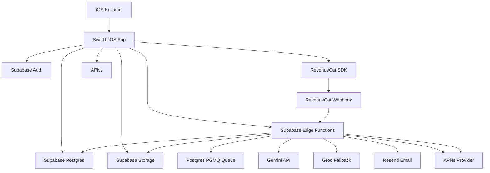
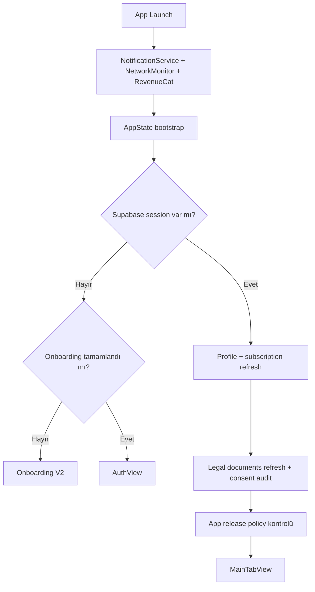
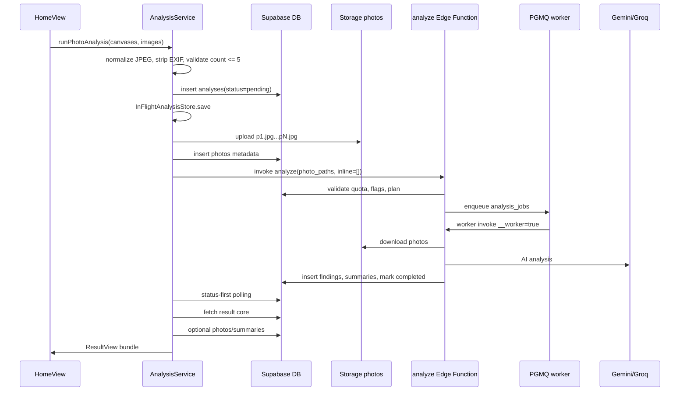
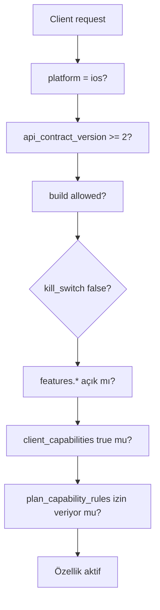

# RiskDetected Tam Proje Referansı

Tarih: 2026-06-29
Kaynak durumu: iOS `1.2.1 (73)`, bundle `com.riskdetected.app`, iOS minimum `16.0`
Amaç: Bu dosya RiskDetected projesini yeni devralan birinin ürün, mimari, veri modeli, analiz akışı, AI prompt yapısı, abonelik mantığı, onboarding, raporlama, bildirim, rollout flagleri ve mevcut operasyon durumunu tek dosyadan anlaması için hazırlanmıştır.

> Not: Bu belge secret içermez. Supabase URL, bucket adları, function adları ve public SDK anahtarlarının varlığı anlatılır; service role, AI API key, RevenueCat secret, APNs key gibi gizli değerler yazılmaz.

## 1. Ürün Özeti

RiskDetected, İSG uzmanları ve saha ekipleri için fotoğraf veya metinden iş sağlığı ve güvenliği risk analizi üreten iOS uygulamasıdır. Kullanıcı saha fotoğrafı veya kısa metin girer; sistem İSG uzmanı perspektifinde tehlikeleri bulur, Fine-Kinney ve 5x5 L-Tipi skorlarını hesaplar, aksiyon ve kontrol tedbirleri üretir, sonuçları uygulama içinde, PDF ve Excel raporu olarak sunar.

Ana değer önerisi:

- Fotoğraf veya metinden hızlı İSG risk analizi.
- Fine-Kinney ve 5x5 L-Tipi çift metodolojili skor.
- Plus/Pro kullanıcılar için 5 fotoğrafa kadar çoklu fotoğraf analizi.
- Fotoğraf bazlı coverage v2: 5 foto analizinde kanıt olan her fotoğraftan hedef en az 5 bulgu.
- PDF ve XLSX rapor üretimi.
- Firma, logo, belge numarası, rapor arşivi, kaynak fotoğraf ve bulgu düzenleme.
- Profesyonel ilerleme sistemi: analiz/bulgu aktivitelerinden MDP, rozet, yetkinlik ve haftalık özet.
- App Review döneminde canlı/test ayrımı için build-gated feature rollout.

## 2. Güncel Durum

### iOS Build

- Marketing version: `1.2.1`
- Build: `73`
- Bundle ID: `com.riskdetected.app`
- Deployment target: iOS `16.0`
- Xcode project: `RiskDetected.xcodeproj`
- Ana scheme: `RiskDetected`
- UI test target: `RiskDetectedUITests`
- Snapshot target: `RiskDetectedSnapshotTests`

### App Store / TestFlight Durumu

- `1.2.0 (72)` App Review onayı alıp yayına çıktı.
- Sonraki çalışma `1.2.1 (73)` buildinde çoklu fotoğraf picker/tray kapanma bug fix ve release policy güncellemesi çevresinde ilerledi.
- Apple upload hatası yaşandığında sebep `CFBundleShortVersionString` değerinin önceki onaylı versiyonla aynı kalmasıydı. Apple aynı versiyon trenine yeni build kabul etmediği için `1.2.1` yapıldı.

### Canlı Feature Flag Durumu

Supabase `public.app_feature_flags` içindeki iki ana flag:

`ios_release_policy`

- `latest_build`: `73`
- `minimum_supported_build`: `62`
- `hard_update_enabled`: `false`
- `soft_update_enabled`: `true`
- `policy_version`: `build-73-testflight`
- `app_store_url`: App Store sayfası

`multi_photo_analysis`

- `kill_switch`: `false`
- `rollout_mode`: `build_allowlist`
- `enabled_ios_builds`: `63` ile `73` arası buildler
- `features.multi_photo_analysis`: `true`
- `features.multi_photo_coverage_v2`: `true`
- `features.photo_limit_locked_slots_for_free`: `true`
- `features.plus_pro_5_photo_limit`: `true`
- `features.editable_findings`: `true`
- `features.manual_finding_add`: `false`
- `features.report_snapshot_v2`: `true`
- `max_photo_count_free`: `1`
- `max_photo_count_plus`: `5`
- `max_photo_count_pro`: `5`
- `target_findings_per_photo_min`: `5`
- `target_findings_per_photo_max`: `8`
- `target_findings_total_max`: `40`
- `coverage_repair_enabled`: `true`

Önemli: Eski `enable_*` flat flag alanları bilerek `false` kalır. Gerçek karar `features.*`, build gate, client capabilities ve plan kurallarının birleşiminden verilir.

## 3. Yüksek Seviye Mimari



Ana teknoloji seti:

- iOS: SwiftUI, Supabase Swift, RevenueCat SDK, GoogleSignIn, PhotosUI, UIKit PDF renderer.
- Backend: Supabase Auth, Postgres, Storage, Edge Functions, PGMQ.
- AI: Google Gemini primary, Groq fallback.
- Push: APNs, Supabase `push_device_tokens` ve `notification_events`.
- E-posta: Resend üzerinden welcome/support/trial reminder.
- Rapor: PDF iOS tarafında, XLSX Deno Edge Function tarafında.

## 4. Repository Yapısı

Önemli klasörler:

- `App/`: iOS uygulama kaynakları.
- `App/Services/`: Auth, analysis, subscription, notification, legal, company, PDF, support servisleri.
- `App/Views/`: SwiftUI ekranları.
- `App/Views/Onboarding/V2/`: güncel onboarding flow.
- `App/Views/Home/`: ana analiz giriş ekranı ve fotoğraf tray/picker.
- `App/Views/Analyzing/`: analiz loading/progress ekranı.
- `App/Views/Result/`: analiz sonucu, bulgu listesi, bulgu editörü.
- `App/Views/Report/`: rapor arşivi ve rapor oluşturma.
- `App/Features/ProfessionalProgress/`: MDP, rozet, yetkinlik ve haftalık özet.
- `App/Models/`: veri modelleri ve risk metodolojisi.
- `supabase/functions/`: Edge Function kaynakları.
- `supabase/migrations/`: DB migration dosyaları.
- `docs/`: handoff, release, runbook ve proje dokümantasyonu.
- `RiskDetectedUITests/`: UI testleri.
- `RiskDetectedSnapshotTests/`: snapshot/preview test altyapısı.

## 5. App Başlangıç Akışı

Ana giriş:

- `RiskDetectedApp.swift`: `@main`, AppDelegate, servis objectleri, URL callback, color scheme.
- `RootView.swift`: splash, onboarding, auth, main app switch.
- `AppState.swift`: auth, profile, subscription, feature flags, release policy, legal, notifications, routing.



Root katmanında ayrıca:

- Offline banner.
- Hard update ekranı.
- Soft update banner.
- Legal update banner veya zorunlu karar sheet.
- Push/deep link routing.
- Foreground olduğunda in-flight analysis resume.

## 6. Auth ve Profil

Servis: `App/Services/AuthService.swift`

Desteklenen girişler:

- Apple ID
- Google Sign-In SDK veya Supabase OAuth
- Email OTP
- Email/password test veya dahili akışlar

Önemli davranışlar:

- Fresh install tespiti yapılır. iOS Keychain uygulama silinse bile eski Supabase session tutabildiği için fresh install durumunda stale local session temizlenir.
- Giriş sonrası `profiles` satırı yoksa oluşturulur.
- Profil alanları: display name, full name, title, certificate number, company name, company logo path, avatar path, phone, preferred risk method, tier.
- Logo `logos` bucketına, avatar `avatars` bucketına yüklenir.
- Auth state değişimlerinde AppState profil, subscription, legal ve notification sync yapar.

## 7. Onboarding V2

Güncel onboarding: `App/Views/Onboarding/V2/`

State: `OnboardingV2State.swift`
Veri modeli: `OnboardingAnswers.swift`, `OnboardingPersonalPlan.swift`
Backend sync: `OnboardingAnswersService.upsert_onboarding_v2_answers`

Onboarding V2 adımları:

1. Splash
2. Pain point
3. Sertifika sınıfı
4. Tehlike sınıfı
5. Sektör
6. Analiz sıklığı
7. Loading / plan hazırlanıyor
8. Kişisel plan özeti
9. Auth
10. Trial invite
11. Push permission
12. Timeline paywall

Seçimler:

- Sertifika: `A`, `B`, `C`, `doctor`, `otherHealth`
- Tehlike: `critical`, `high`, `low`
- Sektörler: construction, manufacturing, energy, mining, office, logistics_warehouse, chemical_laboratory, healthcare, food_production, agriculture_livestock, retail, municipal_field_services, education, hospitality, other.
- Frekans: `1`, `2-5`, `6-15`, `15+`
- Plan: monthly/yearly

Kişiselleştirme segmentleri:

- `construction`
- `industrial_high_risk`
- `osgb_high_volume`
- `office_service`
- `health_team`

Segment karar mantığı:

- Yüksek analiz frekansı `osgb_high_volume`.
- Doktor veya sağlık seçimi `health_team`.
- Construction sektörü `construction`.
- Mining, energy, manufacturing veya critical hazard `industrial_high_risk`.
- Kalanlar `office_service`.

Onboarding verisi kullanıcı login olmadan UserDefaults içinde pending draft olarak tutulur. Auth sonrası backend `user_onboarding_answers` tablosuna sync edilir. Onboarding tamamlanmadan kullanıcı doğrudan main app deneyimine alınmaz.

## 8. Abonelik, Plus ve Pro

Ana servis: `App/Services/SubscriptionManager.swift`
Paywall: `App/Views/Paywall/InAppPaywallView.swift`, `PaywallV2View.swift`

RevenueCat:

- Client public SDK key `RDConfig` içindedir.
- Giriş sonrası RevenueCat appUserID Supabase user UUID olarak identify edilir.
- Purchase/restore sonrası RevenueCat state alınır ve `sync-revenuecat-subscription` Edge Function ile backend `user_subscriptions` tablosuna yazılır.
- Webhook source-of-truth için `revenuecat-webhook` function kullanılır.
- Apple Ads ölçümü için RevenueCat AdServices attribution token collection açıktır. ATT/IDFA kullanılmaz.

Plan sıralaması:

- free rank 0
- plus rank 1
- pro rank 2

Client fallback kabiliyetleri:

| Özellik | Free | Plus | Pro |
|---|---:|---:|---:|
| Standart analiz | günde 1 | günde 10 | günde 40 |
| Detaylı/risk analizi | yok veya tek trial | günde 2 | günde 10 |
| Rapor | günde 1 standart | ayda 150 | ayda 750 |
| Çoklu fotoğraf | hayır | 5 foto | 5 foto |
| Firma/logolu rapor | kısıtlı | var | var |
| Bulgu düzenleme | var | var | var |
| Manuel bulgu ekleme | kapalı | kapalı | kapalı |
| AI kalite route | free/promo | paid | paid |
| Arşiv | 7 gün | 30 gün | geniş/limitsiz |
| Destek | temel | email | email + WhatsApp |

Backend plan kuralları `public.plan_capability_rules` tablosundan gelir. Güncel canlı değerler:

| Plan | max_photos_per_analysis | visible slots | max_findings_per_photo | max_findings_per_analysis | multi-photo | edit AI findings | manual add |
|---|---:|---:|---:|---:|---|---|---|
| free | 1 | 5 | 12 | 12 | false | true | false |
| plus | 5 | 5 | 12 | 60 | true | true | false |
| pro | 5 | 5 | 12 | 60 | true | true | false |

Önemli: Backend hiçbir zaman yalnız client tier bilgisine güvenmez. Gerçek entitlement için `user_subscriptions`, test override ve DB fonksiyonları dikkate alınır.

## 9. Paywall Yapısı

In-app paywall varyantı:

- `claude_plus_pro_paywall_v1`

Plus mesajları:

- Yearly: "İlk haftanız bizden."
- Monthly: "Plus’a abone olun."
- Öne çıkan farklar: günlük analiz limiti, risk analizi, detaylı analiz, derin araştırma, firma yönetimi, çoklu fotoğraf analizi.

Pro mesajları:

- "Limitsiz Özellikler"
- Tüm Plus özellikleri dahil.
- Daha yüksek/lifte edilmiş limit algısı: günlük analiz, risk analizi, detaylı analiz.

Paywall eventleri:

- Servis: `PaywallEventService`
- Tablo: `paywall_events`
- Eventler: view, CTA tap, plan select, purchase started/succeeded/failed, restore, onboarding personal plan view/continue gibi funnel olayları.

## 10. Ana Ekran ve Analiz Girişi

Ana ekran: `App/Views/Home/HomeView.swift`

Kullanıcı iki moddan analiz başlatır:

- Fotoğraf
- Metin

Fotoğraf modunda:

- Free için en fazla 1 fotoğraf.
- Plus/Pro için 5 fotoğraf.
- UI’da free kullanıcılara locked slotlar gösterilebilir.
- Fotoğraflar kamera veya galeri ile seçilir.
- Fotoğraflar annotation editor üzerinden işaretlenebilir.
- Aktif analiz sektörü seçilebilir.
- Canvas seçimi yapılır.

Metin modunda:

- Minimum metin uzunluğu 10 karakter.
- Maksimum giriş 200 karakter civarında UI tarafından sınırlandırılır.
- Fotoğraf payload yoktur.

Analiz canvasları:

| ID | Başlık | Tier | Amaç |
|---|---|---|---|
| `general` | Genel | Free | Dengeli saha taraması |
| `ppe` | KKD | Free | Baret, gözlük, eldiven, emniyet kemeri |
| `machine` | Makine | Plus | Makine koruyucuları, döner parçalar |
| `warning_signs` | Uyarı levhaları | Free | İşaretleme, yönlendirme, görünürlük |
| `electrical` | Elektrik | Free | Pano, kablo, kaçak akım, izolasyon |
| `sector` | Sektör | Plus | Sektöre özgü riskler |
| `fire` | Yangın | Free | Yanıcı madde, söndürme, tahliye |
| `ergonomics` | Özel Ekipman | Pro | Ekipman tanıma ve kullanım güvenliği |
| `environment_measurement` | Ortam Ölçümü | Plus | Gürültü, toz, gaz, aydınlatma |
| `explosion` | Patlama | Free | Patlayıcı atmosfer ve basınçlı kap |
| `environment` | Çevre | Free | Atık, sızıntı, çevresel etki |
| `legislation` | Mevzuat | Pro | Yasal yükümlülük ve denetim uyumu |
| `working_at_height` | Yüksekte Çalışma | Free | Düşme, korkuluk, iskele, yaşam hattı |
| `mobile_equipment` | Hareketli Ekipman | Free | Forklift, transpalet, vinç, araç-yaya |
| `general_premium` | Genel Premium | Pro | Daha ayrıntılı denetim odaklı analiz |
| `construction_machinery` | İş Makineleri | Free | Ekskavatör, yükleyici, vinç vb. |

Aktif analiz sektörleri:

- general, construction, manufacturing, mining, energy, office, logistics_warehouse, chemical_laboratory, healthcare, food_production, agriculture_livestock, retail, municipal_field_services, education, hospitality.

Sektör seçimi prompta bağlam verir ve `analysis_sector`, `analysis_sector_source`, `analysis_sector_prompt_version` alanlarına yansır.

## 11. Fotoğraf Tray ve Picker Bug Fix

Çoklu fotoğraf ekranındaki bottom sheet `PhotoMediaTraySheet` kullanıcıya kamera, galeri, slotlar ve analiz CTA’sı gösterir.

Yaşanan bug:

- Kullanıcı tray içinden "Fotoğraf ekle", "Galeri" veya "Kamera" butonuna basınca iOS picker/kamera anlık açılıp kapanıyordu.
- Kök neden: Aynı anda bir sheet içinden başka fullScreenCover/sheet sunulması ve tray state resetlenmesi.

Mevcut çözüm:

- `PhotoTrayPickerRequest` ile pending camera/gallery request tutulur.
- Tray önce kapatılır.
- `.sheet(... onDismiss:)` içinde `presentPendingPhotoTrayPickerIfNeeded` çalışır.
- Sonra kamera veya galeri fullScreenCover açılır.
- Bu fix hem slot içi "Fotoğraf ekle" hem tray üstündeki "Kamera" ve "Galeri" butonlarını kapsar.

## 12. Analiz Client Akışı

Ana servis: `App/Services/AnalysisService.swift`

Progress fazları:

- `preparingInput`
- `creatingAnalysis`
- `uploadingPhotos`
- `submitting`
- `queued`
- `analyzing`
- `finalizingResult`
- `retryingNetwork`
- `retryingAI`
- `fallbackModel`

Photo analysis akışı:



Önemli client detayları:

- Fotoğraflar artık büyük base64 JSON içinde gönderilmez. Önce private `photos` bucketına yüklenir.
- Storage path formatı: `{user_id}/{analysis_id}/p{index}.jpg`
- Edge Function’a `photo_paths` gönderilir, `photo_base64_parts` boş kalır.
- Fotoğraf metadata `public.photos` tablosuna yazılır.
- Upload/metadata/submit hatasında yüklenen obje ve metadata cleanup denenir, analiz failed işaretlenir.
- Analiz kaydı oluştuktan sonra in-flight kayıt tutulur. App background/foreground veya view lifecycle bozulsa bile aynı analysis id resume edilebilir.

Timeoutlar ve dayanıklılık:

- Record oluşturma: 25s
- Photo upload: 45s
- Metadata: 15s
- Cleanup: 10s
- Submission: 45s
- Poll fetch: 12s
- Completed result bekleme: 300s deadline

## 13. %61 Takılma Problemi ve Çözümü

Yaşanan problem:

- 5 fotoğraf analizi backend’de tamamlanıyordu.
- DB’de `status=completed`, `photos=5`, `findings>=25`, queue boş görünüyordu.
- iOS analiz ekranı ise `%61` civarında kalıp sonucu açmıyordu.

Kök neden backend/AI değil, iOS tarafındaki üç birleşik sorundu:

1. Polling sonucu anlamak için önce ağır `fetchResult` çağırıyordu. Photos/summaries veya findings hydration gecikirse completed status görülmesine rağmen ekran ilerlemiyordu.
2. `AnalyzingView.onDisappear` task cancel davranışı navigation/lifecycle sırasında işi gereğinden erken iptal edebiliyordu.
3. Push notification sonucu görmenin ana garantisi gibi düşünülüyordu; oysa cihaz tokenı/izin/foreground davranışı push’u garanti etmez.

Yapılan çözüm:

- Status-first polling eklendi: her tur önce sadece `analyses` snapshot okunur.
- `completed` görülür görülmez UI `finalizingResult` fazına geçer.
- `fetchResultCore` zorunlu olarak analysis + findings çeker.
- `fetchPhotos` ve `fetchPhotoSummaries` opsiyonel oldu; hata olursa sonuç ekranını bloklamaz.
- `finding_count > 0` ama findings boş gelirse kısa retry yapılır.
- Sonuç yine gelmezse kullanıcı sonsuz loadingte bırakılmaz, destek kodlu net hata gösterilir.
- `AnalyzingView` task cleanup sadece terminal durumlarda yapılır.
- `InFlightAnalysisStore` eklendi; foreground resume aynı analysis id ile devam eder, yeni analiz yaratmaz.
- Push artık ana garanti değil; in-app resume ana garanti.

Kabul edilen davranış:

- Backend completed ise app foreground olduğunda sonuç ekranını açmalı.
- App background veya başka uygulamaya geçiş sonrası dönüşte in-flight analysis kontrol edilir.
- Push token yoksa `notification_events` içinde skipped/no active device token beklenen teşhis olabilir; bu sonuç açmayı engellemez.

## 14. AnalyzingView Progress UI

Ekran: `App/Views/Analyzing/AnalyzingView.swift`

UI hedefi:

- Kullanıcı analiz uzayınca "takıldı mı" hissine kapılmasın.
- Yüzde gerçek AI yüzdesi gibi davranmaz; gerçek sistem fazlarına bağlı tahmini, monotonic, smooth progress gösterir.
- `100%` sadece sonuç gerçekten döndüğünde gösterilir.

Progress davranışı:

- Başlangıç: `3%`
- Hazırlık: `8-18%`
- Upload/submit/queue: yaklaşık `52-76%`
- AI değerlendirme: `68-94%`
- Finalizing: `94-98%`
- Completion: `98 -> 100%`

Önemli UI kararları:

- Yüzde büyük ve `monospacedDigit`.
- Fotoğraf preview blur + koyu overlay üstünde gösterilir.
- Multi-photo badge: `5 fotoğraf`.
- Alt adımlar faza bağlıdır; döngüsel sahte animasyon değildir.
- Retry mesajları yüzdeyi geri düşürmez.
- Hızlı analizlerde de kısa 100% kapanış animasyonu korunur.

## 15. Backend Analiz Pipeline

Ana Edge Function: `supabase/functions/analyze/index.ts`

İki çalışma modu vardır:

1. Client submit modu: kullanıcıdan gelen request doğrulanır, analiz queue’ya alınır.
2. Worker modu: PGMQ job işlenir, AI çağrılır, DB tamamlanır.

Worker: `supabase/functions/process-analysis-jobs/index.ts`

- Queue adı: `analysis_jobs`
- PGMQ tabloları: `pgmq.q_analysis_jobs`, `pgmq.a_analysis_jobs`, `pgmq.meta`
- Read batch: 3
- Visibility timeout: 600s
- Max read count: 3
- Başarılı işlemde mesaj silinir.
- Başarısız işlemde `last_worker_error`, `worker_attempt_count` güncellenir.
- Max attempt sonrası analiz `failed` yapılır.

Backend status alanları:

- `pending`
- `queued`
- `analyzing`
- `completed`
- `failed`

Önemli timestamp alanları:

- `queued_at`
- `worker_started_at`
- `completed_at`
- `updated_at`

## 16. AI Model ve Fallback Stratejisi

Modeller:

- Free primary: `gemini-2.5-flash`
- Flash-lite: `gemini-3.1-flash-lite`
- Paid fast: `gemini-2.5-flash`
- Pro quality: `gemini-2.5-pro`
- Groq fallback: `meta-llama/llama-4-scout-17b-16e-instruct`

Provider stratejisi:

- Free legacy route: free Gemini pool, sonra Groq fallback.
- Paid route: paid Gemini pool, sonra Plus/Pro Groq continuity fallback.
- Free paid trial route: paid Gemini pool, sonra free Gemini continuity, sonra Groq fallback.

Token/response yaklaşımı:

- Coverage v2 aktifse Gemini max output token daha yüksek tutulur.
- JSON schema ile structured response istenir.
- Groq fallback schema instruction ile JSON üretmeye zorlanır.
- AI secretları yalnız Edge Function environment içindedir; client’a çıkmaz.

## 17. Prompt Mimarisi

Ana sistem promptu `CORE_ANALYSIS_PROMPT` içinde tutulur.

AI persona:

- 20 yıllık Türk A sınıfı İSG uzmanı.
- Fotoğraf/metin üzerinden saha tehlikelerini denetim ciddiyetiyle yorumlar.
- Hallucination yapmaması, emin değilse "sahada doğrulanmalı" yaklaşımı kullanması istenir.

12 ana tarama katmanı:

1. Zemin, düzen, housekeeping
2. Çalışanlar ve KKD
3. Yüksekte çalışma
4. Elektrik ve enerji
5. Makine ve iş ekipmanı
6. Kaldırma, taşıma, istifleme
7. Kimyasallar ve tehlikeli maddeler
8. Yangın ve patlama
9. Fiziksel çevre
10. Ergonomi ve elle taşıma
11. Kazı, kapalı alan, özel işler
12. Çevre, acil durum, işaretleme, yetkinlik

Prompt kalite kuralları:

- Ölümcül potansiyel taşıyan riskler önce.
- Aynı risk duplicate üretilmez.
- Her bulgu kanıta dayalı olmalı.
- Genel ve uygulanamaz tavsiyelerden kaçınılır.
- PPE tek başına ana kontrol gibi yazılmaz; mühendislik/idari kontroller önceliklidir.
- Her bulgu için iki ayrı measure istenir:
  - `corrective_action`
  - `preventive_control`
- Text alanları Türkçe, JSON keyleri İngilizce olmalıdır.
- Raw "FOTO_1" markerları kullanıcıya görünen metne yazılmaz; sadece `source_photo_indices` kullanılır.

Güven skoru:

- 0.90-0.98: net görsel kanıt.
- 0.70-0.89: güçlü kanıt.
- 0.50-0.69: ipucu var.
- 0.30-0.49: zayıf bağlam; genelde döndürülmemeli.
- 0.50 altı bulgular döndürülmez; gerekirse "sahada doğrulanmalı" eklenir.

Risk şiddet kalibrasyonu:

- Fine-Kinney severity 100: çoklu ölüm/felaket.
- 40: tek ölüm veya kalıcı sakatlık.
- 15: ağır yaralanma.
- 7: belirgin yaralanma.
- 3: ilk yardım.
- 1: çok hafif.

Özel kural:

- Korumasız 2m+ yüksekte çalışma varsa Fine-Kinney severity en az 40, 5x5 severity 5 olmalıdır.

## 18. Multi-Photo Coverage V2

Hedef: 5 fotoğraflı analizde tek büyük hazards listesi yerine fotoğraf bazlı coverage ve bulgu dağılımı almak.

Aktivasyon koşulları:

- `photoCount > 1`
- Build gate açık
- Client `api_contract_version >= 2`
- Client capabilities içinde `multi_photo_coverage_v2 = true`
- Plan/capability multi-photo destekli
- Server flag `features.multi_photo_coverage_v2 = true`

AI output contract:

- `photo_findings[]`
- Her item:
  - `photo_index`
  - `coverage_status`: `actionable`, `no_actionable_hazard`, `low_quality`
  - `scene_summary`
  - `candidate_findings_count`
  - `coverage_gap_reason`
  - `highest_risk_level`
  - `ai_confidence`
  - `findings[]`

Güncel policy:

- Risk kanıtı olan her fotoğraf için hedef minimum 5 bulgu.
- Fotoğraf başına üst hedef 8 bulgu.
- Toplam hard limit 40 bulgu.
- Temiz, ilgisiz veya düşük kaliteli fotoğrafta bulgu uydurulmaz; `coverage_gap_reason` zorunludur.

Repair pass:

- İlk pass sonrası actionable fotoğraf 5’in altında kalırsa repair candidate olur.
- Repair sadece eksik kalan fotoğraflar için kısa ikinci AI taraması yapar.
- Duplicate olmayan, kanıta dayalı bulgular eklenir.
- Repair başarısızsa analiz tamamen fail olmaz; ilk pass ile devam eder ve audit alanlarına repair error yazılır.

Consolidation:

- Aynı kök neden + aynı kontrol tedbiri + aynı görsel kanıt varsa merge edilir.
- Farklı fotoğraftaki farklı tehlikeler sadece sayıyı düşürmek için birleştirilmez.

DB ve rapor alanları:

- `analysis_photo_summaries`: fotoğraf bazlı scene summary, generated count, coverage status, gap reason.
- `findings.source_photo_indices`: bulgunun geldiği fotoğraf numaraları.
- `findings.source_photo_observations`: fotoğraf bazlı gözlem detayı.
- `raw_ai_response._input_audit.coverage_v2`: coverage aktiflik audit bilgisi.

## 19. Risk Skorları ve Bulgular

Model: `App/Models/Finding.swift`

Fine-Kinney:

- Olasılık: 0.2, 0.5, 1, 3, 6, 10
- Frekans: 0.5, 1, 2, 3, 6, 10
- Şiddet: 1, 3, 7, 15, 40, 100
- Skor: O x F x Ş

Fine-Kinney bantları:

- 401+: Kritik, tolerans dışı, çalışma derhal durdurulmalı.
- 201-400: Yüksek risk.
- 71-200: Önemli/orta risk.
- 21-70: Düşük/olası risk.
- Altı: önemsiz veya izleme.

5x5 L-Tipi:

- Olasılık: 1-5
- Şiddet: 1-5
- Skor: O x Ş

5x5 bantları:

- 20+: Kritik.
- 10-19: Yüksek.
- 5-9: Orta.
- 3-4: Düşük.
- Altı: önemsiz/izleme.

Finding alanları:

- title
- category
- confidence
- description
- recommended_action
- recommended_measures
- references_text
- root_cause_text
- Fine-Kinney parametreleri
- 5x5 parametreleri
- source_photo_indices
- source_photo_observations
- ai_confidence
- edit/version alanları

## 20. Sonuç Ekranı

Ekran: `App/Views/Result/ResultView.swift`

Gösterilenler:

- Analiz meta kartı: başlık, tarih, canvas, sektör, fotoğraf önizlemeleri.
- Toplam bulgu ve AI güveni.
- Çoklu fotoğraf dağılımı: kompakt `F1 5 · F2 6` formatı.
- Fine-Kinney ve 5x5 metod toggle.
- Risk metodoloji özeti.
- Bulgular severity/score/confidence sırasına göre listelenir.
- Bulgu detay sheet.
- Bulgu editor sheet.
- PDF/Excel rapor CTA.

Fotoğraf bazlı dağılım UI kararı:

- Önceki versiyonda `Foto 1 · 5` chipleri çok yer kaplıyordu.
- Güncel tasarım daha kompakt ve düşük dikkatli `F1 5` benzeri metinle gösterilir.
- Accessibility metni yine "Foto 1, 5 bulgu" gibi tam açıklama sağlar.

Bulgu düzenleme:

- Function: `mutate-analysis-finding`
- Client doğrudan `findings` write grant almaz.
- Backend ownership, build gate, expected version, audit event ve aggregate recalculation yapar.
- Edit conflict olursa 409 döner.
- Delete hard delete gibi çalışır ama `finding_edit_events` audit kaydı bırakır.

## 21. Raporlama

PDF:

- Servis: `PDFReportService.swift`
- Oluşturma iOS içinde UIKit `UIGraphicsPDFRenderer` ile yapılır.
- A4 landscape.
- Türler:
  - Standard report
  - Risk analysis table
- Fotoğraf preview, özet kartları, yöntem referansı, bulgu sayfaları ve risk tablosu üretir.
- PDF önce local temp dosya olur, sonra `reports` bucketına yüklenir.
- Ardından `register-report` Edge Function çağrılır.

Excel:

- Function: `generate-excel-report`
- Deno içinde `xlsx-js-style` ve `JSZip` kullanır.
- Completed analysis için XLSX workbook üretir.
- Private `reports` bucketına yazar.
- `public.reports` metadata kaydı oluşturur.
- Report ready push tetikleyebilir.
- Kolon genişliği, satır yüksekliği, text wrap ve profesyonel görünüm bu function tarafında kontrol edilir.

Report snapshot v2:

- Flag: `features.report_snapshot_v2`
- Build/capability gate ile açılır.
- PDF register ve Excel üretiminde server tarafı bulgu/foto snapshotını `reports` tablosuna yazar.
- Böylece kullanıcı sonradan bulgu düzenlese bile raporun üretildiği anın snapshotı saklanır.

Rapor limitleri:

- Free: günde 1 standart rapor
- Plus: ayda 150
- Pro: ayda 750
- Free risk analysis table için tek trial davranışı vardır.

## 22. Firma Yönetimi

Servis: `CompanyService.swift`
Model: `Company.swift`

Firma alanları:

- name
- hazard_class: low, medium, high
- logo_path
- address
- contact_person
- department
- default_responsible
- default_due_days
- is_archived

Davranış:

- Firma ekleme/düzenleme Supabase `companies` tablosuna yazılır.
- Logo `logos/{user_id}/companies/{company_id}/logo.jpg` yoluna yüklenir.
- Firma limiti ve paid plan şartı DB trigger/fonksiyonları ile enforce edilir.
- Rapor üretirken company snapshot rapora yazılır.
- Arşivleme soft archive olarak yapılır.

## 23. Bildirim Sistemi

Servis: `NotificationService.swift`

Client davranışı:

- Onboarding veya ayarlar içinde izin istenir.
- APNs token `push_device_tokens` tablosuna yazılır.
- `notification_preferences` kullanıcı tercihlerini tutar.
- Notification tap geldiğinde destination veya `analysis_id` okunur.

Routing:

- `report_ready` veya destination `reports`: reports tabına gider.
- `account_updates`, `trial_reminder`, `progress_*`, destination `profile`: profile tabına gider.
- `analysis_id` varsa ilgili analiz sonucu açılmak üzere `pendingAnalysisHistoryID` set edilir.

Önemli operasyon notu:

- Push sonuç görmenin ana garantisi değildir.
- Simülatör APNs almaz.
- Gerçek cihazda token yoksa veya izin kapalıysa backend `skipped/no_active_device_tokens` tarzı teşhis bırakabilir.
- Analiz completed sonucunu garanti eden mekanizma in-app resume’dur.

Backend push functions:

- `send-push-notification`
- `send-report-ready-notification`
- `send-trial-reminder-notifications`
- `revenuecat-webhook` içinden account update/trial push

## 24. Legal, KVKK ve Site Belgeleri

Servisler:

- `LegalDocumentService.swift`
- `LegalAcceptanceService.swift`

Legal doküman türleri:

- KVKK Aydınlatma Metni
- Açık Rıza Beyanı
- Kullanım Koşulları
- Gizlilik Politikası

Kaynak önceliği:

1. Website legal manifest: `https://riskdetected.com/legal-documents/manifest.json`
2. Supabase Storage `legal-documents/manifest.json`
3. Bundle içindeki fallback Markdown dosyaları

Güvenlik:

- Remote doküman pathleri `tr/*.md` olmalı.
- `..`, absolute path ve backslash kabul edilmez.
- Maksimum dosya boyutu 262 KB.
- Manifest hash SHA-256 ile doğrulanır.

Legal update davranışı:

- `baseline`, `info`, `material_terms`, `explicit_consent` change type vardır.
- Info banner olarak gösterilebilir.
- Material terms veya explicit consent karar sheet’i açar.
- User action `legal_document_acknowledgements` tablosuna yazılır.
- Login notice kabulü `consents` tablosuna yazılır.
- Legal audit login veya analiz akışını bloklamaz; hata olursa backoff ile sonra denenir.

## 25. Professional Progress

Feature flag: `RDConfig.Features.professionalProgressEnabled = true`
Servis: `ProfessionalProgressService.swift`
UI: `App/Features/ProfessionalProgress/`

Amaç:

- Kullanıcının İSG analiz aktivitesini oyunlaştırmadan profesyonel gelişim metriğine çevirmek.
- Profilde MDP, unvan, rozetler, yetkinlik haritası ve haftalık özet göstermek.

Tablolar:

- `professional_progress_profiles`
- `professional_progress_events`
- `professional_progress_finding_classifications`
- `professional_progress_competency_stats`
- `professional_progress_badges`
- `professional_progress_messages`
- `professional_progress_weekly_summaries`

Client fetch:

- Profil, competency stats, badge, message ve son weekly summary paralel çekilir.
- Fetch hatası profil ekranını kırmaz; nil döner.
- Badge/message seen state update edilir.

## 26. Supabase Veritabanı

Ana public tablolar:

Kimlik/profil:

- `profiles`
- `user_onboarding_answers`
- `consents`
- `legal_document_acknowledgements`

Analiz:

- `analyses`
- `photos`
- `analysis_photo_summaries`
- `findings`
- `finding_edit_events`
- `ai_usage_logs`
- `usage_events`

Abonelik/plan:

- `user_subscriptions`
- `subscription_events`
- `subscription_test_overrides`
- `plan_capability_rules`
- `paywall_events`

Rapor:

- `reports`
- `report_counters`
- `report_year_counters`

Firma:

- `companies`

Bildirim:

- `push_device_tokens`
- `notification_preferences`
- `notification_events`

Destek ve hesap:

- `support_requests`
- `account_deletion_requests`

Admin/ops:

- `admin_users`
- `admin_alert_events`
- `admin_alert_rules`
- `admin_audit_logs`
- `admin_exports`
- `admin_notes`
- `admin_rate_limit_events`
- `admin_saved_filters`

Professional progress:

- `professional_progress_*`

Feature flags:

- `app_feature_flags`

PGMQ:

- `pgmq.q_analysis_jobs`
- `pgmq.a_analysis_jobs`
- `pgmq.meta`

## 27. Storage Buckets

`RDConfig.Bucket`:

- `photos`: analiz fotoğrafları, private.
- `reports`: PDF/XLSX rapor dosyaları, private.
- `logos`: profil ve firma logoları.
- `avatars`: profil avatarları.
- `legal-documents`: legal manifest ve Markdown fallback source.

Path prensibi:

- Kullanıcıya ait dosyalar user id prefix altında tutulur.
- Reports path: `{user_id}/{analysis_id}/{file_name}`
- Photos path: `{user_id}/{analysis_id}/p{index}.jpg`
- Logo path: `{user_id}/profile-logo.jpg` veya `{user_id}/companies/{company_id}/logo.jpg`
- Avatar path: `{user_id}/avatar.jpg`

## 28. Edge Functions

| Function | Görev |
|---|---|
| `analyze` | Analiz submit, quota/plan/flag doğrulama, AI orchestration, bulgu yazımı |
| `process-analysis-jobs` | PGMQ queue worker, analyze worker mode invoke |
| `generate-excel-report` | XLSX rapor üretme, storage ve report metadata |
| `register-report` | iOS PDF upload sonrası metadata ve snapshot doğrulama |
| `mutate-analysis-finding` | Bulgu update/delete, audit, aggregate recalculation |
| `app-release-policy` | iOS min/latest build, hard/soft update policy |
| `sync-revenuecat-subscription` | Client sonrası RC subscription sync |
| `revenuecat-webhook` | RevenueCat webhook source-of-truth |
| `send-push-notification` | APNs merkezi gönderim |
| `send-report-ready-notification` | Rapor hazır push |
| `send-trial-reminder-notifications` | Trial reminder batch |
| `send-welcome-email` | İlk kullanıcı welcome email |
| `support-contact` | Destek talebi ve ekler |
| `request-account-deletion` | Hesap silme talebi |
| `account-deletion-complete` | Silme tamamlaması |
| `retention-cleanup` | Retention cleanup |

## 29. Release Flag ve Canlı/Test Ayrımı

Amaç:

- App Review onay süresince canlı uygulamayı kırmadan yeni özellikleri build bazlı açmak.
- Backend yeni kodu eski buildlere servis etse bile eski clientların beklemediği response/özelliği almamasını sağlamak.

Karar zinciri:



Rollout modları:

- `off`: kapalı.
- `build_allowlist`: sadece listedeki buildler.
- `min_build`: belirtilen minimum build ve üstü.
- `all`: tüm uygun clientlar.

Kritik prensip:

- Eski canlı buildler inline/base64 veya eski report behavior ile çalışmaya devam eder.
- Yeni buildler Storage photo path, coverage v2, editable findings, report snapshot v2 kullanır.
- `kill_switch` acil kapama için korunur.
- `minimum_supported_build` yalnız release policy içindir; feature rollout yerine geçmez.

## 30. Güvenlik ve KVKK

Güvenlik kararları:

- Supabase publishable key ve RevenueCat public SDK key client tarafında bulunabilir.
- Service role key, AI keys, APNs keys sadece Edge Function environment içindedir.
- Client doğrudan hassas write yetkisi almaz; report register, finding mutate gibi işlemler Edge Function üzerinden doğrulanır.
- RLS ve ownership kontrolleri user id üzerinden yapılır.
- Storage pathleri user id prefixlidir.
- Fotoğraflar ve raporlar private bucketlardadır.
- Certificate pinning Supabase host için `RDConfig` içinde etkin.
- Legal doküman remote hash doğrulamalıdır.
- App Tracking Transparency istenmez, IDFA/AdSupport kullanılmaz.

Veri hassasiyeti:

- Fotoğraflar, AI response, raporlar, profil, firma, telefon, legal consent ve destek mesajları KVKK açısından hassas kabul edilir.
- Admin/dashboard tarafında raw AI response ve signed URL gibi alanlar role-gated olmalıdır.

## 31. Test ve QA Altyapısı

iOS:

- `RiskDetectedUITests`
- `RiskDetectedSnapshotTests`
- Debug-only UI flags: `RD_UI_TEST_*`
- Gerçek E2E için debug-only env/fixture yaklaşımı kullanıldı, Release/TestFlight davranışına dahil edilmemeli.

Supabase function static tests:

- analyze multi-photo quality static test
- sector-context test
- app-release-policy static test
- generate-excel-report static test
- mutate-analysis-finding static test
- register-report static test
- RevenueCat shared helper tests
- welcome email template test

Önemli manuel E2E kabul:

- 5 fotoğraf analiz başlat.
- DB: `status=completed`
- `photo_count=5`
- `photos` satırı 5
- `analysis_photo_summaries` satırı 5
- `findings>=25` riskli fixture için
- `raw_ai_response._input_audit.storage_photo_count=5`
- `raw_ai_response._input_audit.inline_photo_count=0`
- `raw_ai_response._input_audit.coverage_v2=true`
- Queue depth 0
- `last_worker_error is null`
- App foreground/background dönüşte sonuç açılıyor.

Build komutu örneği:

```bash
xcodebuild -project RiskDetected.xcodeproj -scheme RiskDetected -destination 'platform=iOS Simulator,name=iPhone 16 Pro' build
```

Release preflight:

- Build number App Store’da kullanılmamış olmalı.
- Marketing version önceki onaylı versiyondan büyük olmalı.
- `ios_release_policy.latest_build` güncel buildi göstermeli.
- `multi_photo_analysis.enabled_ios_builds` yeni buildi içermeli.
- Kill switch kapalı mı kontrol edilmeli.
- Supabase migrationlar production’a uygulanmış olmalı.
- 5 foto gerçek E2E geçmeden TestFlight/App Review gönderilmemeli.

## 32. Operasyonel Runbook

Yeni build çıkarırken:

1. `MARKETING_VERSION` ve `CURRENT_PROJECT_VERSION` kontrol et.
2. App Store aynı versiyona yeni build kabul ediyor mu kontrol et. Onaylı versiyon train kapandıysa marketing version artır.
3. `ios_release_policy.latest_build` değerini yeni build yap.
4. Soft update gerekirse `soft_update_enabled=true`, hard update gerekirse ayrıca karar ver.
5. `multi_photo_analysis.enabled_ios_builds` içine yeni build ekle.
6. `features.*` alanlarını gereksiz değiştirme.
7. `kill_switch=false` olduğundan emin ol.
8. Canlı E2E analiz ve rapor export smoke yap.
9. Archive/Distribute ile TestFlight veya App Store’a gönder.

Çoklu fotoğraf sorununda kontrol sırası:

1. iOS build allowlist içinde mi?
2. Kullanıcı Plus/Pro veya test override aktif mi?
3. `plan_capability_rules` plus/pro max photo 5 mi?
4. `photos` bucket upload oldu mu?
5. `public.photos` metadata 5 satır mı?
6. `analyses.status` queued/analyzing/completed mi?
7. PGMQ queue depth kaldı mı?
8. `last_worker_error` var mı?
9. `raw_ai_response._input_audit` storage/inline/coverage değerleri doğru mu?
10. Client in-flight resume kayıtları temizlenmiş mi?

Analiz completed ama app loadingte kalırsa:

1. `analyses.status` snapshot completed mı?
2. `finding_count` ve `findings` tutarlı mı?
3. `fetchResultCore` hata veriyor mu?
4. Photos/summaries optional fetch hataları sonucu bloklamamalı.
5. `AnalyzingView` task cancel edildi mi?
6. App foreground resume aynı `analysis_id` ile çalışıyor mu?
7. Push token olup olmaması sadece teşhis olmalı, sonucu engellememeli.

## 33. Bilinen Riskler ve Dikkat Noktaları

- AI sonucu her zaman kanıta dayalı olmalı. Fotoğraf başına minimum bulgu hedefi temiz/kalitesiz fotoğrafta risk uydurma anlamına gelmez.
- Coverage repair maliyet ve latency artırabilir; audit alanlarından takip edilmeli.
- Excel/PDF raporları bulgu sayısı arttıkça layout riski taşır; uzun textlerde wrap/row height kontrolü kritiktir.
- App Review döneminde flag değişikliği eski canlı buildleri etkileyebilir; allowlist/min_build ayrımı bozulmamalı.
- Supabase Edge Function timeoutları ve provider latency durumlarında queue retry davranışı izlenmeli.
- Notification delivery garanti değildir; ürün deneyimi push’a bağımlı olmamalı.
- RevenueCat webhook source-of-truth olsa da client sync hemen UI güncellemesi için kullanılır; iki kaynak tutarsızlığında backend subscription tablosu esas alınmalı.
- Test override hesapları süreli olmalı ve production kullanıcılarını etkilememeli.

## 34. Ana Dosya Referansları

iOS:

- `App/RiskDetectedApp.swift`
- `App/AppState.swift`
- `App/RootView.swift`
- `App/Services/RDConfig.swift`
- `App/Services/AuthService.swift`
- `App/Services/SubscriptionManager.swift`
- `App/Services/AnalysisService.swift`
- `App/Services/NotificationService.swift`
- `App/Services/PDFReportService.swift`
- `App/Services/CompanyService.swift`
- `App/Services/LegalDocumentService.swift`
- `App/Views/Home/HomeView.swift`
- `App/Views/Analyzing/AnalyzingView.swift`
- `App/Views/Result/ResultView.swift`
- `App/Views/Report/ReportView.swift`
- `App/Views/Onboarding/V2/OnboardingViewV2.swift`
- `App/Views/Paywall/InAppPaywallView.swift`
- `App/Features/ProfessionalProgress/ProfessionalProgressService.swift`

Backend:

- `supabase/functions/analyze/index.ts`
- `supabase/functions/process-analysis-jobs/index.ts`
- `supabase/functions/generate-excel-report/index.ts`
- `supabase/functions/register-report/index.ts`
- `supabase/functions/mutate-analysis-finding/index.ts`
- `supabase/functions/app-release-policy/index.ts`
- `supabase/functions/revenuecat-webhook/index.ts`
- `supabase/functions/sync-revenuecat-subscription/index.ts`
- `supabase/functions/send-push-notification/index.ts`

Runbook/doküman:

- `docs/BUILD_GATED_IOS_ROLLOUT_RUNBOOK.md`
- `docs/CURSOR_HANDOFF_APP_REVIEW_FLAGS_ANALYSIS_STUCK_2026-06-26.md`
- `docs/RISKDETECTED_PROJECT_CONTEXT_2026-06-22.md`
- `docs/BUILD_72_RELEASE_FOLLOWUP_2026-06-26.md`

## 35. Kısa Mental Model

RiskDetected’i anlamanın en kısa yolu:

1. iOS uygulama kullanıcıyı onboarding/auth/paywall ile doğru plana yerleştirir.
2. Analiz başlatılırken client yalnız UX ve payload hazırlığından sorumludur.
3. Gerçek plan, quota, flag ve AI kararları backend tarafında doğrulanır.
4. Çoklu fotoğraf için fotoğraflar Storage’a gider, Edge Function’a path gider.
5. Edge Function job queue’ya yazar, worker AI çağırır ve DB’yi completed yapar.
6. Client status-first polling ve in-flight resume ile sonucu açar.
7. Sonuçlar kaynak fotoğraf, risk skorları, edit geçmişi ve rapor snapshotı ile saklanır.
8. PDF iOS’ta, Excel backend’de üretilir.
9. Release güvenliği build allowlist ve kill switch ile sağlanır.
10. Push yardımcıdır; sonuç teslim garantisi polling/resume’dur.
