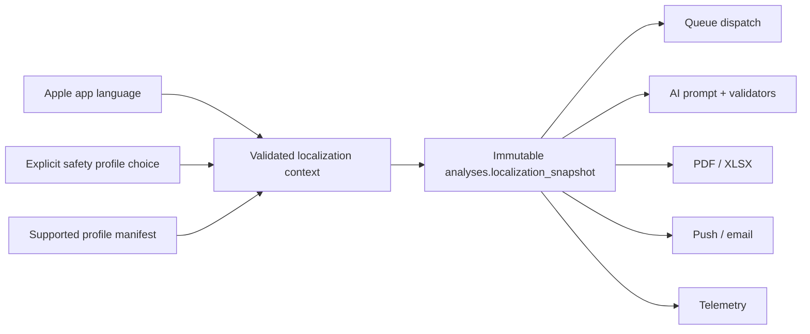
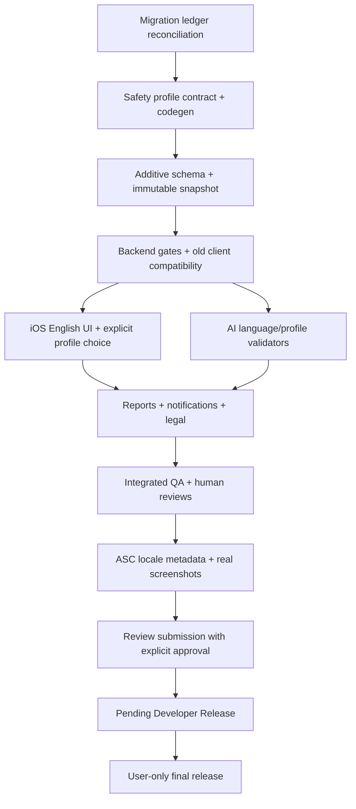

# RiskDetected Global Localization + Country Safety
## Sisteme Uyarlanmış Entegrasyon ve Yürütme Planı

- **Tarih:** 2026-07-28
- **Plan sürümü:** 1.1
- **Durum:** Uygulama devam ediyor — Faz 0–5 tamamlandı; Faz 6 teknik kapsamı
  tamamlandı ancak zorunlu dokuz aşamalı TestFlight rollout yürütülmedi; Faz 7
  tamamlandı; App Privacy yayın kanıtı kapatıldı; Faz 8 reviewer erişimi ve
  fiziksel cihaz smoke bekliyor
- **App Store Connect uygulama kimliği:** `6769498181`
- **Wave 1 ürün dilleri:** `tr`, `en`
- **Wave 1 güvenlik profilleri:** Türkiye, International, United Kingdom, United States, Australia, Canada
- **Wave 1 App Store metadata locale'leri:** `tr`, `en-GB`, `en-US`, `en-AU`, `en-CA`

---

## 1. Amaç ve belge statüsü

Bu belge,
`/Users/keremkayalar/Downloads/RISKDETECTED_GLOBAL_LOCALIZATION_COUNTRY_SAFETY_CODEX_IMPLEMENTATION_PLAN_2026-07-28.md`
dosyasındaki normatif uygulama sözleşmesini mevcut RiskDetected kodu, canlı Supabase
durumu ve App Store Connect kaydıyla eşleyen yürütme planıdır.

Kaynak belgenin incelenen kopyası:

- Satır sayısı: `3609`
- Boyut: yaklaşık `104 KB`
- SHA-256:
  `e0e382624e02e70d15c695baf9daff09742db7577f971e124e35e37b6ffb466f`

Uygulama kullanıcı talimatıyla başlatılmıştır. Faz 0–3 tamamlanmış, Faz 4
2026-07-30 tarihinde maliyet gerekçeli açık proje-sahibi istisnasıyla
kapatılmıştır. Faz 4 kanıtı:
`docs/localization/phase-4/PHASE_4_EXECUTION_AUDIT_2026-07-28.md`.
Faz 5 teknik kapsamı, auth e-posta, notification ve production English legal
yayın doğrulamaları tamamlanmıştır. Global localization canlı build 77'de
fail-closed build flag arkasındadır; final English legal set blue/green
production yayını ve exact canlı URL/hash doğrulamasını geçmiştir. iOS runtime
aktivasyonu yeni build + remote rollout kapısına bırakılmıştır. Faz 5 kanıtı:
`docs/localization/phase-5/PHASE_5_EXECUTION_AUDIT_2026-07-30.md`.

2026-08-01 durum güncellemesi:

- Build 78 `VALID` olarak yüklendi ve App Store 1.3.0 adayına bağlandı.
- Dört İngilizce App Store locale'i ve 20 light-theme screenshot read-after-
  write doğrulamasını geçti.
- Apple review doctor sıfır submission blocker bildiriyor; review state
  `NOT_SUBMITTED`, release type `MANUAL`.
- Türkçe App Store metadata/screenshot içeriği mutasyon hedefi olmadı.
- Global localization production flag'leri 13/13 `off`; build 77 canlı
  davranışı değişmedi.
- App Privacy beyanı authenticated browser read-back ile `Published` olarak
  doğrulandı; hiçbir privacy veya Türkçe metadata alanı değiştirilmedi.
- Dokuz aşamalı TestFlight rollout için aggregate-only, fail-closed collector
  ve sıralı kanıt doğrulayıcısı tamamlandı; 12/12 test geçti. Aşama 1,
  13/13 flag kapalı ve sıfır allowlist girdili baseline ile başlatıldı.
- Aşama 1 fiziksel cihaz örnekleri, aşamalar 2–9, reviewer-only runtime cohort
  ve build 78 fiziksel cihaz review-account smoke tamamlanmadığı için
  Definition of Done henüz sağlanmadı.
- Yetkili completion matrix:
  `docs/localization/phase-8/WAVE1_COMPLETION_MATRIX_2026-08-01.json`.

### 1.1 Yetki sırası

Uygulama sırasında bir çelişki oluşursa aşağıdaki sıra geçerlidir:

1. İmzalanmış/işlenmiş gerçek build ve canlı ürün davranışı
2. Canlı Supabase şeması, fonksiyon sürümleri ve feature flag değerleri
3. Canlı App Store Connect kaydı
4. Uygulanmış migration'lar
5. Bu yürütme planı ve ek normatif sözleşme
6. Aktif sistem ana referansı
7. Eski planlar, handoff'lar ve arşiv belgeleri

### 1.2 İlk planlama turunda yapılmayanlar

Aşağıdaki liste 2026-07-28 tarihli ilk planlama turunun tarihsel sınırını
kaydeder; sonraki yürütme durumunu ifade etmez:

- İlk turda iOS, backend veya migration kodu değiştirilmedi.
- İlk turda Supabase'e deploy/migration uygulanmadı.
- İlk turda App Store Connect metadata, sürüm, abonelik veya yayın ayarı
  değiştirilmedi.
- İlk turda yeni sürüm oluşturulmadı, build yüklenmedi veya review submission
  yapılmadı.
- Uygulama hâlâ yayınlanmadı; bu madde güncel olarak da geçerlidir.

---

## 2. Yönetici özeti

Wave 1, RiskDetected'i yalnızca İngilizceye çevirmeyecek; aşağıdaki kavramları
birbirinden ayıran, sürümlü ve denetlenebilir bir ürün sözleşmesi kuracaktır:

- Uygulamanın arayüz dili
- AI içeriğinin dili ve locale'i
- Kullanıcının App Store storefront'u
- Kullanıcının açıkça seçtiği çalışma yargı alanı
- Seçilen iş güvenliği terminoloji profili
- Analiz ve rapor dili
- Geçerli yasal belge seti

En kritik mimari karar, analiz anında bu bağlamın tek ve değişmez bir snapshot
olarak `analyses` kaydına yazılmasıdır. Kuyruk retry, repair, AI provider, PDF,
XLSX ve bildirim akışları daha sonra bu snapshot'ı kullanacaktır. Storefront,
IP, GPS, SIM veya ödeme bilgisi hiçbir zaman yargı alanı seçmek için
kullanılmayacaktır.

Wave 1'de:

- Türkçe ürün mevcut davranışını korur.
- İngilizce ürün tek dil olarak sunulur; ülke varyantları hassas terminoloji
  katmanında ayrılır.
- Türkiye dışı profillerde mevzuat bölümü hem istemcide hem backend'de kapalıdır.
- Türkiye dışı AI çıktısı yerel mevzuata uygunluk iddiası üretmez.
- Rapor dili analiz diliyle aynıdır.
- Eksik İngilizce sistem metni Türkçeye düşmez; yayın öncesi blocker olur.
- Eski Türkçe analizler çevrilmez; İngilizce arayüzde özgün dil etiketiyle gösterilir.
- App Store birincil dili ilk İngilizce sürümde `tr` olarak kalır.
- App Store release seçeneği yeni sürüm için manuel yapılır.
- Son yayın/publish kararı yalnızca kullanıcıya aittir.

---

## 3. Doğrulanmış mevcut durum

### 3.1 Git ve depo

- Çalışma dizini:
  `/Users/keremkayalar/Documents/Kerem-APPler/RiskDetected`
- Aktif branch: `codex/worktree-cleanup`
- Uzak branch'e göre durum: `ahead 15`
- Son commit: `740d551 Enable notification shadow evaluation`
- Tracked dosyalarda diff yok.
- Kullanıcıya ait mevcut untracked dosyalar korunacaktır:
  - `app-marketing-context.md`
  - `docs/RISKDETECTED_ACTIVE_SYSTEM_MASTER_REFERENCE_2026-07-28.md`
  - `docs/RISKDETECTED_LOCALIZATION_MARKET_PRIORITIZATION_2026-07-28.md`

Uygulama başladığında ayrı bir `codex/global-localization-wave1` branch'i
oluşturulması önerilir. Mevcut untracked dosyalar otomatik stage edilmeyecektir.

### 3.2 iOS

- Minimum platform: iPhone, iOS 16+
- Mevcut sürüm/build: `1.2.4 (77)`
- Swift dosyası: `104`
- Swift satırı: yaklaşık `41,898`
- Basit taramaya göre doğrudan UI string çağrısı: en az `434`
- String Catalog veya `.strings` kaynağı yok.
- `CFBundleLocalizations` yalnızca `tr`.
- Xcode `developmentRegion = tr`.
- `RDLanguage` yalnızca `.turkish`.
- Profilde dil tercihi iskeleti var, ancak yalnızca Türkçe destekleniyor.
- Kamera ve fotoğraf izin açıklamaları doğrudan Türkçe plist metni.
- Birçok formatter sabit `tr_TR` kullanıyor.
- En yoğun string yüzeyleri:
  - `ResultView.swift`
  - `ReportView.swift`
  - `HomeView.swift`
  - `ProfileView.swift`
  - `InAppPaywallView.swift`
  - `CompanyPickerSheet.swift`
  - `HistoryView.swift`
  - Auth ve onboarding ekranları

### 3.3 Analiz ve AI

- Aktif ürün yalnızca fotoğraf analizi yapıyor; legacy text input backend'de
  `410` ile reddediliyor.
- Free/Plus/Pro fotoğraf sınırları üretimde `1/3/3`.
- Queue v2, guarded dispatch, exact multi-photo coverage ve notification shadow
  mevcut sistemin korunacak parçalarıdır.
- `analyze/index.ts` içindeki sistem promptu Türkiye ve Türk mevzuatı odaklıdır.
- `legislation` canvas'ı Türkiye mevzuatı üretmeye doğrudan yönlendirir.
- Mevzuat, kök neden ve kullanıcıya gösterilen birçok AI alanı Türkçe
  varsayımlara bağlıdır.
- Mevcut kuyruk mesajı istek gövdesinin büyük bölümünü kopyalıyor; bağımsız bir
  localization snapshot otoritesi henüz yok.
- Retry/repair yolları mevcut pipeline sözleşmesine bağlıdır; yeniden
  tasarlanmayacaktır.

### 3.4 Raporlar

- iOS PDF üretimi `RDLanguage` parametresi alıyor ama yalnızca Türkçe sözlük var.
- iOS, XLSX isteğinde `report_language` gönderiyor.
- Canlı backend'deki `generate-excel-report` request tipi bu alanı kabul etmiyor
  ve içerik doğrudan Türkçe üretiliyor.
- XLSX içinde `Mevzuat`, `Ünvan / Belge`, `Tehlike Sınıfı` gibi Türkiye odaklı
  sabitler var.
- `reports` kaydında rapor dili, locale, güvenlik profili ve localization
  snapshot alanları yok.

### 3.5 Bildirim, e-posta ve destek

- iOS engagement senkronizasyonu `Locale.current.identifier` gönderiyor; bu
  bilgi henüz içerik dili sözleşmesi değil.
- Transactional push akışları Türkçe başlık/gövde gönderiyor.
- Notification Operations Center şeması locale bağımsız tek bir template
  metni taşıyor.
- Aktif ilk analiz ve inaktivite template'leri Türkçe.
- Welcome email Türkçe.
- Support request'lerinde kullanıcı ve cevap dili sözleşmesi yok.
- Kullanıcı destek metni otomatik çevrilmemelidir.

### 3.6 Yasal içerik

- Uygulama içi yasal belgeler yalnızca Türkçe:
  - KVKK
  - Açık Rıza
  - Kullanım Koşulları
  - Gizlilik Politikası
- English Terms, Privacy, AI processing notice ve consent seti yok.
- İngilizce URL'lerin gerçekten İngilizce içerik döndürdüğü doğrulanmadan
  English auth/paywall açılmayacaktır.

### 3.7 Supabase canlı durumu

- Proje ref: `ppcrzemgiztzcgddbins`
- Canlıda `18` aktif Edge Function doğrulandı.
- Önemli sürümler:
  - `analyze`: v134
  - `generate-excel-report`: v68
  - `process-analysis-jobs`: v24
  - `send-push-notification`: v43
  - `register-report`: v18
  - Notification Operations Center fonksiyonları: v1
- Yerel ve uzak migration defterinde eşleşmeyen tarih/sürüm kayıtları var.
  Bu durum yeni migration uygulanmadan önce uzlaştırılmalıdır.
- `supabase db push` veya benzeri toplu komut, migration defteri
  uzlaştırılmadan kullanılmayacaktır.

### 3.8 App Store Connect canlı durumu

- Uygulama adı: `RiskDetected: İş Güvenliği İSG`
- Bundle ID: `com.riskdetected.app`
- Primary locale: `tr`
- Canlı sürüm: `1.2.4`, `READY_FOR_DISTRIBUTION`
- Mevcut release type: `AFTER_APPROVAL`
- Sürüm metadata locale'i: yalnızca `tr`
- Subscription group ve dört abonelik lokalizasyonu: yalnızca `tr`
- Dört ürün de `APPROVED`.
- Türkçe 6.7-inch setinde `9` ekran görüntüsü var.
- Mevcut setin bir görseli açıkça mevzuat özelliğini öne çıkarıyor; bu görsel
  Türkiye dışı locale'lerde kullanılamaz.
- Yeni İngilizce sürüm kaydı henüz oluşturulmadı.

### 3.9 Başlangıç kalite tabanı

Son doğrulanmış aktif sistem tabanı:

- Deno: `173/173`
- pgTAP: `135/135`
- İzole notification UI: `3/3`
- Readiness: `23/23`
- 18 Edge Function için `deno check`: başarılı

Uygulama başlangıcında bu sayılar tekrar çalıştırılacak ve yeni testlerle
birlikte monoton olarak artırılacaktır.

### 3.10 Eski veya çelişkili bilgi kaynakları

Aşağıdaki içerikler localization envanterine doğrulanmadan alınmayacaktır:

- `app-marketing-context.md` içindeki text analysis ifadesi: aktif backend text
  analizini reddediyor.
- `RISKDETECTED_LOCALIZATION_MARKET_PRIORITIZATION_2026-07-28.md` içindeki text
  analysis test maddesi: aktif ürünle uyumsuz.
- `docs/analysis-prompts-and-limits.md` içindeki 5 fotoğraf anlatımı: üretim
  limiti 3.

---

## 4. Sabit ürün ve güvenlik kararları

### 4.1 Birbirinden ayrı tutulacak alanlar

| Alan | Anlam | Örnek | Otorite |
|---|---|---|---|
| `app_language` | Sistem UI dili | `tr`, `en` | Apple per-app language / bundle |
| `content_locale` | AI ve sistem içeriği locale'i | `en-GB` | Kullanıcı tercihi + desteklenen manifest |
| `storefront_country` | App Store ticari storefront'u | `GB` | StoreKit/Apple; yalnız analitik/ticari |
| `work_jurisdiction_country` | Çalışmanın açıkça seçilen ülkesi | `GB` | Kullanıcı |
| `work_jurisdiction_region` | Gelecekteki alt bölge | `null` | Wave 1'de kullanılmaz |
| `safety_profile_id` | Terminoloji ve safety davranış profili | `en-gb-hs` | Kullanıcı seçimi + manifest |
| `analysis_language` | Analiz çıktısının dili | `en` | Analiz snapshot |
| `report_language` | Rapor dili | `en` | Analiz snapshot ile aynı |
| `legal_document_set` | Gösterilecek yasal belge paketi | `en-global-v1` | Dil/yasal manifest |

### 4.2 Yasak çıkarımlar

Yargı alanı veya safety profile aşağıdakilerden çıkarılmayacaktır:

- IP
- GPS
- SIM
- Cihaz bölgesi
- Storefront
- Ödeme para birimi
- Apple ID ülkesi
- RevenueCat customer bilgisi

### 4.3 Wave 1 safety profile davranışı

| Profil | Terim seti | Mevzuat alanı | Yasak iddia örneği |
|---|---|---:|---|
| Türkiye | İSG, risk değerlendirmesi | TR + uygun plan için açık | “Kesin uyumluluk” |
| International | Genel occupational safety | Kapalı | “Global compliance” |
| UK | Health and safety, risk assessment | Kapalı | “HSE compliant” |
| US | Occupational safety and health, hazard assessment | Kapalı | “OSHA compliant”, “JHA/JSA completed” |
| AU | WHS terminology | Kapalı | “Australian law compliant” |
| CA | OHS terminology | Kapalı | “Canadian compliance” |

### 4.4 Değişmeyecek mevcut sistem sözleşmeleri

- Free/Plus/Pro planları ve limitleri
- Fotoğraf analizi
- Fine-Kinney ve 5×5 hesapları
- Queue v2
- Claim/finalization sözleşmesi
- Ambiguous dispatch guard
- Exact multi-photo coverage
- Cancelled Plus trial provider routing
- Mevcut provider seçimi
- Rapor quota zaman dilimi
- Notification Operations Center'ın rollout/kill-switch yaklaşımı

### 4.5 Wave 1 kapsam dışı

- Türkiye dışı mevzuat motoru, RAG veya compliance sertifikasyonu
- ABD eyaletleri
- Avustralya eyalet/territory ayrımı
- Kanada province/territory ayrımı
- Birleşik Krallık nation ayrımı
- JHA/JSA workflow
- Geçmiş analizleri otomatik çevirme
- Aynı analizden iki dilde rapor üretme
- Almanca veya başka yeni UI dili
- Plan, fiyat, limit veya teklif değişikliği
- Son App Store publish/release işlemi

---

## 5. Hedef mimari

### 5.1 Localization context akışı



Kuyruk, localization davranışı için istek gövdesine güvenmeyecek; analiz
snapshot'ı otorite olacaktır. Operasyonel queue kimlikleri ve mevcut guard
alanları korunur.

### 5.2 Tek kaynak safety profile repository

Önerilen yapı:

```text
localization/
  safety-profiles/
    schema.json
    manifest.yaml
    tr-tr-current.yaml
    en-001-international.yaml
    en-gb-health-safety.yaml
    en-us-osh.yaml
    en-au-whs.yaml
    en-ca-ohs.yaml
  glossary/
    core.yaml
    forbidden-claims.yaml
    do-not-translate.yaml
  content-inventory/
    app-content.csv
  generated/
    safety-profiles.manifest.json
```

Üretilecek dosyalar:

- `App/Generated/SafetyProfiles.generated.swift`
- `supabase/functions/_shared/generated/safety-profiles.generated.ts`

Codegen deterministik olacak; kaynak YAML değişip generated dosyalar
yenilenmezse CI hata verecektir.

### 5.3 Swift domain tipleri

Uygulama sırasında aşağıdaki kavramlar string dağınıklığı yerine typed model
olarak tanımlanacaktır:

- `RDAppLanguage`
- `RDContentLocale`
- `RDWorkJurisdictionCountry`
- `RDSafetyProfileID`
- `RDLegalDocumentSetID`
- `RDLocalizationContext`
- `RDLocalizationSnapshot`

`RDLanguage` rapor tercihi gibi davranmayacak; app language ve analysis language
ayrılacaktır.

### 5.4 Backend domain tipleri

Shared TypeScript modülleri:

- `localization-contract.ts`
- `safety-profile-manifest.ts`
- `localization-context-resolver.ts`
- `language-contract-validator.ts`
- `regulatory-reference-policy.ts`
- generated safety profile modülü

Tüm Edge Function'lar aynı normalizer ve stable error contract'ını
kullanacaktır.

---

## 6. Veri modeli ve migration stratejisi

### 6.1 Uygulama öncesi zorunlu migration defteri kapısı

Yeni migration oluşturulmadan önce:

1. `supabase migration list --linked` çıktısı saklanır.
2. Canlı `supabase_migrations.schema_migrations` defteri read-only alınır.
3. Yerelde olmayan uzak kayıtlar ve uzakta görünmeyen yerel kayıtlar tek tek
   sınıflandırılır.
4. Migration içerik checksum'ları ve canlı nesne varlığı karşılaştırılır.
5. Gerekirse yalnız kanıtlı kayıtlar için migration history repair planı
   hazırlanır.
6. Kullanıcı onayı olmadan history repair veya remote değişiklik yapılmaz.
7. Uzlaştırma tamamlanmadan yeni localization migration'ı deploy edilmez.

### 6.2 Additive alanlar

İlk migration nullable/additive olacaktır.

`profiles`:

- `app_language`
- `preferred_content_locale`
- `work_jurisdiction_country`
- `work_jurisdiction_region`
- `safety_profile_id`
- `safety_profile_version`
- `legal_document_set`

`analyses`:

- `output_language`
- `output_locale`
- `work_jurisdiction_country`
- `work_jurisdiction_region`
- `safety_profile_id`
- `safety_profile_version`
- `regulatory_reference_policy`
- `prompt_profile_version`
- `localization_snapshot jsonb`
- `language_validation_status`
- `language_validation_attempts`
- `language_validation_code`

`reports`:

- `report_language`
- `report_locale`
- `safety_profile_id`
- `safety_profile_version`
- `regulatory_sections_enabled`
- `localization_snapshot jsonb`

`ai_usage_logs`:

- `output_language`
- `output_locale`
- `work_jurisdiction_country`
- `safety_profile_id`
- `language_validation_status`
- `language_validation_attempts`
- `language_validation_code`

Notification/report/template iş kayıtlarına:

- `language`
- `locale`
- `localization_snapshot`
- `template_locale`
- gerektiğinde `template_localization_id`

Support request'lerine:

- `app_language`
- `content_locale`
- `user_message_language`
- `preferred_response_language`

### 6.3 Constraint stratejisi

- PostgreSQL enum yerine `text + check constraint + manifest` kullanılacaktır.
- İlk deploy'da alanlar nullable kalır.
- Backfill ve dual-read telemetry tamamlanınca `not null`/check sıkılaştırması
  ayrı migration olarak yapılır.
- Safety profile id/version çiftinin geçerliliği backend manifest resolver ile
  de doğrulanır.
- `localization_snapshot` için gerekli anahtarları doğrulayan pgTAP testleri
  yazılır.

### 6.4 Backfill

Mevcut kayıtlar içerik değiştirilmeden:

- `app_language = tr`
- `preferred_content_locale = tr-TR`
- `work_jurisdiction_country = TR`
- `safety_profile_id = tr-tr-current`
- `report_language = tr`
- `legal_document_set = tr-current`

olarak işaretlenir.

Backfill:

- idempotent,
- küçük batch'li,
- row count kontrollü,
- yeniden çalıştırılabilir,
- AI metni, rapor dosyası veya kullanıcı içeriği dönüştürmeyen

bir süreç olacaktır.

### 6.5 Eski build uyumluluğu

- Build 77 ve daha eski istemciler localization alanı göndermediğinde backend
  açıkça Türkçe/Türkiye context'i atar.
- Yeni istemci typed context gönderir.
- Backend manifest otoritedir; istemci profile sürümünü uyduramaz.
- Eski ve yeni istemci aynı backend sürümünde birlikte çalışır.
- Telemetry yeterli olmadan zorunlu constraint açılmaz.

---

## 7. Ayrıntılı uygulama fazları

## Faz 0 — Baseline, kaynak sabitleme ve güvenlik kapıları

### Amaç

Kod değişmeden önce tekrar üretilebilir başlangıç kanıtı oluşturmak.

### İşler

- Yeni feature branch oluştur.
- Kullanıcıya ait dirty/untracked dosyaları kaydet ve koru.
- Ek normatif belgeyi repo içi `docs/specs/` altında checksum ile arşivle.
- Canlı schema-only dump ve migration ledger al.
- Canlı Edge Function ad/sürüm/JWT doğrulama durumunu kaydet.
- Canlı feature flag değerlerini kaydet; secret değerlerini hiçbir çıktıya alma.
- App Store Connect discovery snapshot'ı üret.
- Canlı legal URL'leri dil ve redirect açısından kontrol et.
- Xcode build, UI smoke, Deno, pgTAP, readiness ve function check tabanını tekrar çalıştır.
- Release guard'a localization için secret/PII/string leak kontrolleri eklemek
  üzere task listesi çıkar.

### Çıktılar

- `docs/localization/baseline/`
- Migration reconciliation raporu
- ASC discovery snapshot
- Baseline test manifesti
- Uygulama öncesi blocker listesi

### Çıkış kriteri

- Migration defteri uzlaştırma yaklaşımı onaylı.
- Baseline testleri yeşil.
- Canlı/yerel farkları açıklanmış.
- Hiçbir production mutasyonu yapılmamış.

---

## Faz 1 — Domain contract, safety profile repository ve içerik envanteri

### Amaç

UI, backend, prompt ve raporların kullanacağı tek kaynaklı terminoloji ve context
sözleşmesini kurmak.

### İşler

- `localization/safety-profiles` şeması ve altı profil dosyasını oluştur.
- Core glossary, forbidden claims ve do-not-translate listelerini oluştur.
- Hierarchy of Controls sırasını tek kaynakta tanımla.
- Fine-Kinney ve 5×5 için “hukuki standart değildir” açıklamasını profile
  bağımsız ortak metin yap.
- Swift ve TypeScript codegen yaz.
- Generated checksum/manifest sürümü üret.
- UI, backend, PDF, XLSX, email, push, plist, yasal ve ASC yüzeylerini CSV
  envanterine çıkar.
- Her metin için:
  - semantic key
  - kaynak dosya/satır
  - context
  - placeholder
  - owner
  - screenshot id
  - language review
  - safety review
  - product approval
  alanlarını tanımla.
- Hard-coded string scanner yaz.

### Review durumları

- `extracted`
- `machine_draft`
- `language_reviewed`
- `safety_reviewed`
- `product_approved`
- `shipping`

Codex yalnızca draft ve teknik doğrulama durumlarını işaretleyebilir; insan
onaylarını kendiliğinden veremez.

### Çıkış kriteri

- Codegen iki platformda aynı manifest sürümünü üretir.
- Generated diff temizdir.
- Altı profile ait forbidden claim testleri vardır.
- İçerik envanterinde sahipsiz P0/P1 yüzey kalmaz.

---

## Faz 2 — Additive veri modeli ve dual backend contract

### Amaç

Localization context'i eski build'leri bozmadan veritabanında saklamak.

### İşler

- Migration defteri kapısından sonra nullable alanları ekle.
- Idempotent Türkçe backfill ekle.
- Context validate/resolve shared backend modüllerini oluştur.
- Feature flag'leri varsayılan kapalı ekle.
- Yeni istemci request alanlarını kabul et:
  - `output_language`
  - `output_locale`
  - `work_jurisdiction_country`
  - `work_jurisdiction_region`
  - `safety_profile_id`
  - `safety_profile_version`
  - `method`
- Eski istemci için açık Türkçe varsayılanı uygula.
- Snapshot'ı quota reservation ve queue enqueue işleminden önce atomik olarak
  analiz kaydına yaz.
- Request ile kalıcı snapshot uyuşmazlığını stable error ile reddet.
- Queue payload geçişini feature flag altında yap:
  - localization otoritesi yalnız `analyses.localization_snapshot`
  - queue'da yalnız gerekli operasyonel kimlik/guard alanları
  - retry ve repair aynı snapshot'ı yeniden yükler
- Mevcut claim, lease, ambiguous dispatch, coverage repair ve finalization
  mantığına dokunma.

### Türkiye dışı legislation gate

Non-TR profile + legislation canvas isteği:

1. AI çağrısından önce,
2. quota reservation'dan önce,
3. queue enqueue'dan önce

`CANVAS_NOT_AVAILABLE_FOR_SAFETY_PROFILE` koduyla reddedilir.

İstemci bu kodu kendi dilinde gösterir; backend kullanıcıya Türkçe hata metni
dayatmaz.

### Çıkış kriteri

- Eski build Türkçe analiz yapabilir.
- Yeni build altı profile ait snapshot oluşturabilir.
- Snapshot retry/repair boyunca değişmez.
- Non-TR legislation isteği quota tüketmez ve job oluşturmaz.
- pgTAP/RLS testleri geçer.

---

## Faz 3 — iOS localization altyapısı ve ülke güvenlik deneyimi

### Amaç

Apple'ın native localization davranışını kullanan, tam Türkçe/İngilizce UI ve
açık safety profile seçimi sunmak.

### 3.1 String Catalog yapısı

Önerilen kataloglar:

- `Localizable.xcstrings`
- `Auth.xcstrings`
- `Onboarding.xcstrings`
- `Paywall.xcstrings`
- `Analysis.xcstrings`
- `Reports.xcstrings`
- `Notifications.xcstrings`
- `ProfessionalProgress.xcstrings`
- `Legal.xcstrings`
- `SafetyTerminology.xcstrings`
- `InfoPlist.xcstrings`

Her semantic key context comment ve placeholder bilgisi taşıyacaktır.

### 3.2 Native uygulama dili

- `tr` ve `en` bundle localization olarak eklenir.
- Apple'ın Settings içindeki per-app language seçimi kullanılır.
- `AppleLanguages` yazılmaz.
- Bundle swizzle veya özel locale hack'i yapılmaz.
- UI dili `Bundle.main.preferredLocalizations` üzerinden backend profile'a
  senkronize edilir.
- Mevcut profil “Dil” seçicisi native Settings'e yönlendiren bir yüzeye
  dönüştürülür.
- Content/safety profile seçimi UI dilinden ayrı kalır.

### 3.3 Development region

- İngilizce parity oluşana kadar `developmentRegion = tr` kalır.
- English base geçişi ayrı commit ve ayrı acceptance gate olur.
- Eksik key debug'da görünür marker, release'te build blocker olur.

### 3.4 Onboarding ve profil

Türkçe:

- Mevcut A/B/C uzmanlık ve belge alanları korunur.
- Şirket tehlike sınıfı korunur.

İngilizce:

- A/B/C sınıfı ve OSGB terminolojisi gösterilmez.
- Role/job title ve optional credential alanları gösterilir.
- Safety terminology profile seçimi zorunludur.
- Ülke/profile otomatik çıkarılmaz.
- International, UK, US, AU ve CA açıklamaları iddiasız ve kısa sunulur.
- Şirket tehlike sınıfı gizlenir; uydurma eşdeğer eklenmez.

### 3.5 UI yüzeyleri

Öncelik sırası:

1. Root/update/error yüzeyleri
2. Auth ve onboarding
3. Home, fotoğraf seçimi, analiz akışı
4. Result ve finding detayları
5. Report ve paylaşım
6. Paywall/subscription
7. Profile/company/preferences
8. History/filter
9. Professional Progress
10. Legal/support/notifications

### 3.6 Formatlama

- Date, number, percentage, currency ve measurement locale-aware olur.
- StoreKit/RevenueCat localized price string'i korunur.
- Dosya adları güvenli, deterministik ve locale-aware olur.
- `tr_TR` sabitleri yalnız gerçekten Türkiye'ye özgü iş kuralında kalır.

### 3.7 Eski içerik

- İngilizce UI'da eski Türkçe analiz: `Original content: Turkish`.
- Sistem alanları çevrilmez.
- Kullanıcının kendi title/notu özgün haliyle kalır.
- Dil uyuşmazlığı düzenleme ekranında non-blocking uyarı üretir.
- İngilizce export seçeneği sunulmaz.
- Professional Progress title, badge ve competency adlarının İngilizce
  taslakları native language ve safety review olmadan `shipping` durumuna
  geçirilmez.

### Çıkış kriteri

- Türkçe ve İngilizce tüm P0/P1 UI yüzeyleri tamam.
- English UI sistem metinlerinde Türkçe leak yok.
- Dynamic Type ve VoiceOver ana akışları geçer.
- Native per-app language değişimi cold launch sonrası doğru context'i
  senkronize eder.

---

## Faz 4 — AI prompt contract, output doğrulama ve repair

### Amaç

Her profil için doğru dil ve terminolojide, yasak mevzuat/compliance iddialarını
üretmeyen AI çıktısı sağlamak.

### İşler

- Mevcut monolitik promptu provider akışını değiştirmeden katmanlara ayır:
  - schema contract
  - language contract
  - safety profile contract
  - regulatory reference contract
  - risk method contract
  - photo evidence contract
- JSON anahtarlarını dil bağımsız tut.
- Profile terminolojisini generated manifestten al.
- Türkiye dışı `references` alanını boş tut.
- English `root_cause` sunum etiketini “Likely contributing factors” olarak
  tanımla; JSON alan adı değişmez.
- Kanıt dili görünür fotoğrafa bağlı kalır; görünmeyen kesinlik üretilmez.

### Validator katmanları

1. JSON/schema
2. Beklenen output language
3. Safety profile terminoloji
4. Forbidden claim
5. Regulatory reference
6. Multi-photo coverage ve mevcut kalite denetimleri

### Repair sözleşmesi

- En fazla bir `language_contract_repair` provider isteği.
- Aynı provider ve aynı execution route korunur.
- Kullanıcı kotası ikinci kez tüketilmez.
- Cancelled trial routing değişmez.
- Repair de başarısızsa:
  `OUTPUT_LANGUAGE_CONTRACT_FAILED`.
- Türkçeye fallback yapılmaz.
- English-to-English model fallback ancak ayrı flag, telemetry ve aynı dil
  garantisiyle değerlendirilebilir.

### Fallback sözleşmesi

- Nötr sistem içeriği: exact locale → aynı dilin onaylı base locale'i → fail
  closed.
- Safety profile terminolojisi: exact profile/version → fail closed.
- AI output: aynı dilde tek repair → stable error.
- Rapor: analiz dili dışında fallback yok.
- Push/e-posta: aynı dilde onaylı template yoksa gönderim yok.
- Türkçe ve İngilizce birbirine fallback değildir.

### Testler

- Her profile karşı Golden prompt snapshot
- Türkçe leak
- UK/US/AU/CA cross-terminology leak
- Non-TR mevzuat/compliance iddiası
- Prompt injection
- Provider JSON bozulması
- İlk yanıt yanlış dil, repair başarılı
- Repair sonrası yanlış dil, fail closed
- Retry/repair snapshot değişmezliği
- Cancelled Plus trial route korunumu
- Native reviewer onaylı, sentetik workplace fotoğraflarından oluşan küçük bir
  live AI canary corpus; prompt veya gerçek kullanıcı içeriği loglanmadan

### Çıkış kriteri

- Altı profil için prompt/validator matrisi yeşil.
- Non-TR çıktıda structured legislation yok.
- Yanlış dil kullanıcıya yanlış dilde içerik olarak ulaşmıyor.
- Provider çağrı ve quota telemetry'si repair'i doğru ayırıyor.

---

## Faz 5 — Raporlar, bildirimler, e-posta, support, legal ve paywall

### 5.1 PDF ve XLSX

- Rapor dili istemci seçiminden değil analiz snapshot'ından alınır.
- Backend, gönderilen `report_language` alanını analizle uyuşmuyorsa reddeder.
- `reports.localization_snapshot` yazılır.
- Tüm başlık, tablo, footer, disclaimer, tarih, sayı ve dosya adı localize edilir.
- Non-TR raporda:
  - mevzuat bölümü yok
  - TR hazard class yok
  - OSGB yok
  - compliance iddiası yok
- Türkiye rapor davranışı korunur.
- PDF text extraction ve XLSX parser tabanlı leak testleri eklenir.

### 5.2 Notification Operations Center

Mevcut sistemi kırmamak için `private.notification_templates` yerine ikinci bir
otomasyon sistemi kurulmaz. Additive child localization kullanılır:

- `private.notification_template_localizations`
- `template_id`
- `locale`
- `title`
- `body`
- `review_status`
- `checksum`

Job oluşturulurken doğru locale çözülür ve immutable template snapshot'a
yazılır. Eksik aynı-dil template'i:

- başka dil fallback'i yapmaz,
- job'ı fail closed durumuna alır,
- telemetry üretir.

### 5.3 Transactional push

- `analysis_complete`
- `report_ready`
- `trial_reminder`
- progress bildirimleri
- account update

için stable event key + locale template sözleşmesi kurulur. Serbest title/body
gönderimi yalnız kontrollü admin/manual akışta kalır.

### 5.4 E-posta

- Welcome email İngilizce template alır.
- Auth email'leri built-in sistemle güvenli locale seçemiyorsa Supabase Send
  Email Hook kullanılır.
- Hook secret'ı repo/log içine girmez.
- Eksik locale template'i başka dilde gönderim yapmaz.

### 5.5 Support

- Ticket dil alanları saklanır.
- Kullanıcı metni otomatik çevrilmez.
- Destek ekibine tercih edilen cevap dili gösterilir.
- Sistem acknowledgement mesajı aynı dilde template'ten gelir.

### 5.6 Legal

English set:

- Terms of Use
- Privacy Policy
- AI/Data Processing Notice
- Gerekliyse açık consent metni

Şartlar:

- Gerçek İngilizce URL
- Türkçe sayfaya redirect yok
- Uygulama bundle fallback'i
- Sürüm/checksum
- Counsel review
- Legal acceptance audit kaydı doğru set/version ile

English legal set onaylanmadan English auth ve purchase akışı açılmaz.

### 5.7 Paywall ve abonelik

- Plan, ürün id, fiyat ve limit değişmez.
- RevenueCat/StoreKit localized fiyat kullanılır.
- Mevzuat ve Türkiye'ye özgü fayda iddiaları non-TR paywall'dan çıkarılır.
- Subscription group ve dört ürün için `en-GB`, `en-US`, `en-AU`, `en-CA`
  metadata draftları hazırlanır.
- Mevcut 7 günlük deneme/offer durumu release'e yakın canlı olarak tekrar
  kontrol edilir; localization release'i offer değişikliğiyle birleştirilmez.

### Çıkış kriteri

- PDF/XLSX/push/email/support/legal/paywall dil matrisi yeşil.
- Non-TR rapor ve paywall'da mevzuat iddiası yok.
- English legal URL'leri counsel-reviewed ve erişilebilir.
- Abonelik ürün/price/offer davranışı değişmemiş.

---

## Faz 6 — Entegre QA, güvenlik, telemetry ve TestFlight

### 6.1 Otomasyon matrisi

| Alan | Kimlik | Ana doğrulama |
|---|---|---|
| Localization | `L10N-*` | Key parity, placeholder, leak, layout |
| Jurisdiction | `JUR-*` | Açık seçim, inference yasağı, gating |
| AI | `AI-*` | Dil/profile/legal/repair |
| Reports | `RPT-*` | PDF/XLSX extraction ve snapshot |
| Notifications | `NTF-*` | Locale template, fail closed, tap route |
| App Store | `ASC-*` | Metadata/length/idempotency/manual release |
| Security | `SEC-*` | Log/secret/PII/prompt injection |
| Regression | `REG-*` | Türkçe ürün ve mevcut pipeline |

### 6.2 UI matrisi

- 6 safety profile
- Türkçe/İngilizce
- light/dark
- Dynamic Type: default + accessibility
- Free/Plus/Pro
- desteklenen iPhone boyutları
- fresh user + existing Turkish user
- online/offline/retry

Matris pairwise otomasyonla küçültülebilir; aşağıdaki akışlar tüm kombinasyonlarda
P0'dır:

- auth/onboarding
- profile selection
- analysis submit
- result
- report
- paywall
- legal acceptance

### 6.3 Güvenlik

- Fotoğraf, prompt, token, JWT, email, telefon ve kullanıcı mesajı loglanmaz.
- Localization snapshot yalnız gerekli bounded alanları taşır.
- `raw_ai_response` ve debug log politikası yeniden gözden geçirilir.
- Stable error kullanıcı metninden ayrılır.
- Prompt injection testleri profile/regulatory contract'ı atlatamaz.
- ASC automation secret'ları env/keychain'den alır.

### 6.4 Telemetry

Minimum alanlar:

- `app_language`
- `output_language`
- `output_locale`
- `work_jurisdiction_country`
- `safety_profile_id`
- `safety_profile_version`
- `language_validation_status`
- `language_validation_attempts`
- `language_contract_repair_used`
- `forbidden_claim_validation_status`
- `report_language`
- `notification_locale`
- `client_build`
- `prompt_profile_version`

Doğrudan kişisel iletişim bilgisi veya kullanıcı içeriği telemetry'ye girmez.

Ürün ve ASO değerlendirmesi için, uygun toplulaştırmayla:

- product page conversion
- install → onboarding completion
- onboarding → first analysis
- analysis completion/failure
- report creation
- paid conversion
- D1/D7/D30 retention
- profile bazında wrong-language/repair oranı
- locale bazında support temas oranı

izlenir. Storefront metriği yalnız ticari/ASO analizinde kullanılır; safety
profile veya yargı alanını değiştirmez.

### 6.5 TestFlight rollout

Sıra:

1. Internal Turkish regression, tüm localization flag'leri kapalı
2. Yeni contract ile Turkish-only dogfood
3. English International allowlist
4. UK allowlist
5. US allowlist
6. AU allowlist
7. CA allowlist
8. Tam internal group
9. External TestFlight, review-ready candidate

Her aşamada:

- başarısız analiz oranı
- wrong-language oranı
- repair oranı
- report failure
- notification template miss
- crash
- queue retry/ambiguous dispatch

eşikleri kontrol edilir.

### Çıkış kriteri

- Tüm P0/P1 testler yeşil.
- Türkçe regression yok.
- Profile bazlı native language ve safety review tamam.
- Release candidate blocker listesi boş.

---

## Faz 7 — ASO, gerçek ekran görüntüleri, ASC otomasyonu ve review

### 7.1 Pazar sırası

Aktif pilot:

1. UK
2. AU
3. US
4. CA

Organik halo; ayrı localization yatırımı yapılmadan:

- Ireland
- New Zealand
- UAE
- Saudi Arabia
- India

### 7.2 Metadata

Her locale için bağımsız çalışma:

- App name
- Subtitle
- Keyword set
- Description
- Promotional text
- What's New
- Support/marketing/privacy URL
- Subscription display name/description

Keyword'ler Türkçeden çevrilmeyecek; pazar bazlı araştırılacaktır.

Apple'ın canlı limitleri:

- Name: 30 karakter
- Subtitle: 30 karakter
- Promotional text: 170 karakter
- Description: 4000 karakter
- Keywords: 100 byte
- What's New: 4000 karakter

Forbidden claim scanner tüm metadata üzerinde çalışır.

### 7.3 Ekran görüntüsü pipeline'ı

Her İngilizce locale için beş ana mesaj:

1. Photo-based safety risk review
2. Evidence-grounded findings
3. Fine-Kinney / 5×5 prioritization
4. Professional PDF/XLSX reports
5. Profile-appropriate safety terminology

Kurallar:

- Gerçek uygulama UI'ı
- Sentetik fixture kullanıcı/şirket/veri
- Gerçek kullanıcı fotoğrafı yok
- Görsel model yalnız sentetik workplace photo üretebilir
- Görsel model UI veya caption üretmez
- Simulator state deterministik
- Caption programatik uygulanır
- Checksum ve manifest saklanır
- Mevzuat özelliği non-TR screenshot'ta gösterilmez

Mevcut 1290×2796 Türkçe set boyutu Apple'ın kabul ettiği 6.9-inch
boyutlarından biridir. İngilizce setler yine güncel Apple screenshot
specification'a göre validate edilir.

### 7.4 ASC otomasyon uyarlaması

Ek belgede tarif edilen güvenlik sözleşmesi korunacak, ancak mevcut projede
kurulu `asc 1.8.0` varken ikinci bir ham Python App Store Connect istemcisi
yazılmayacaktır. Bu uyarlama bir ADR ile kaydedilecektir.

Repo yapısı:

```text
appstore/
  app.json
  versions/<version>/
    tr.json
    en-GB.json
    en-US.json
    en-AU.json
    en-CA.json
  subscriptions/
  screenshots/
  review/
scripts/app_store_connect/
  discover.mjs
  plan.mjs
  apply.mjs
  verify.mjs
```

Wrapper'lar:

- `asc` CLI'ı çağırır.
- Diff-first çalışır.
- Idempotent olur.
- Read-after-write doğrular.
- 429/5xx retry uygular.
- Secret yazmaz.

Mutasyon flag'leri varsayılan kapalı:

- `ASC_ALLOW_MUTATIONS=0`
- `ASC_ALLOW_SCREENSHOT_UPLOAD=0`
- `ASC_ALLOW_BUILD_UPLOAD=0`
- `ASC_ALLOW_REVIEW_SUBMISSION=0`
- `ASC_ALLOW_RELEASE=0`

Repo'da veya wrapper'da `asc-release` komutu bulunmayacaktır. `asc versions
release` kullanıcıya ait son publish yetkisi olarak otomasyondan dışlanacaktır.

### 7.5 Release N ve N+1

Release N:

- Primary locale `tr`
- `en-GB`, `en-US`, `en-AU`, `en-CA` eklenir
- Yeni sürüm `MANUAL`/developer release olarak ayarlanır

Release N+1:

- English primary locale ancak Release N localization ve screenshot'ları Apple
  tarafından onaylandıktan sonra düşünülebilir.
- Değişiklik ayrı ADR ve açık kullanıcı onayı ister.

Apple, yeni bir dili primary yapmadan önce ilgili localization ve
screenshot'ların daha önce onaylanmış olmasını şart koşar; bu nedenle aynı ilk
English release içinde primary locale değiştirilmez.

### 7.6 Review ve yayın

Codex, açık flag ile:

- metadata apply
- screenshot upload
- build upload/attach
- readiness validation
- review submission

hazırlayabilir.

Codex:

- App Store'a final release/publish yapmaz.
- Manuel release düğmesine basmaz.
- Kullanıcının yayın kararını otomatikleştirmez.

Review kanıt paketi `appstore/review/localization-evidence.md` altında en az
şunları içerir:

- English language support
- Safety terminology seçim ekranı
- Non-TR legislation canvas yokluğu
- English tek fotoğraf ve üç fotoğraf akışı
- English PDF ve XLSX
- English push ve permission prompt
- Subscription/restore
- Account deletion
- Decision-support disclaimer
- Synthetic screenshot data beyanı
- Compliance iddiası bulunmadığına dair açıklama

Demo login secret'ı bu pakete veya repo'ya yazılmaz; yalnız App Store Connect
review notes alanına güvenli kanaldan girilir.

### Çıkış kriteri

- `asc validate` yeşil.
- Subscription validation yeşil.
- Tüm locale metadata ve screenshot'lar read-after-write doğrulanmış.
- Review notes doğru.
- Release seçeneği manual.
- Review submission ancak açık kullanıcı talimatıyla yapılmış.
- Sürüm yayınlanmamış.

---

## 8. Feature flag planı

Varsayılanlar kapalı:

- `localization_v2`
- `english_product_enabled`
- `safety_profile_international_enabled`
- `safety_profile_uk_enabled`
- `safety_profile_us_enabled`
- `safety_profile_au_enabled`
- `safety_profile_ca_enabled`
- `ai_language_contract_guard_enabled`
- `localized_reports_enabled`
- `localized_notifications_enabled`
- `english_legal_documents_enabled`

`non_tr_legislation_enabled` adlı bir flag oluşturulmayacaktır. Türkiye dışı
structured legislation Wave 1'de kod ve manifest seviyesinde kapalıdır.

Flag çözümleme:

- Backend otorite
- Build allowlist/percentage/kill switch desteği
- iOS yalnız capability gösterimi için okur
- Client flag manipülasyonu backend gate'i aşamaz

---

## 9. Test ve kabul kapıları

### 9.1 PR kapısı

- Swift build/test
- Deno test/check
- pgTAP
- Codegen clean diff
- String catalog parse
- Placeholder parity
- Hard-coded system string scanner
- Forbidden claim scanner
- Secret/PII scanner
- Migration lint

### 9.2 Release Candidate kapısı

- Tüm PR kontrolleri
- UI locale/profile matrisi
- PDF extraction
- XLSX parser
- Push/email template matrisi
- Old build compatibility
- Queue retry/repair/ambiguous dispatch regression
- Live TestFlight smoke
- Legal URL check
- ASC dry-run diff

### 9.3 Review submission kapısı

- Human language review
- Native safety review: UK/US/AU/CA
- Legal counsel approval
- Native ASO review
- Screenshot visual approval
- `asc validate`
- Subscription validation
- Manual release doğrulaması
- Review account fiziksel cihaz smoke

### 9.4 Sıfır tolerans blocker'ları

- English sistem yüzeyinde Türkçe leak
- Non-TR AI/report/paywall/screenshot'ta TR legislation
- Yargı alanının inferred edilmesi
- Yanlış dil fallback
- Eksik English legal belge veya Türkçe redirect
- Gerçek kullanıcı verili screenshot
- Secret/PII/prompt/photo log
- Eski build regression
- Queue snapshot değişmesi
- Otomatik release seçeneği

---

## 10. Human review ve sorumluluk matrisi

| Alan | Codex | Ürün sahibi | Native dil | Safety uzmanı | Legal |
|---|---:|---:|---:|---:|---:|
| Teknik contract/codegen | R | A | C | C | C |
| UI draft | R | A | C | C | C |
| Safety terminology | C | A | C | R | C |
| AI forbidden claims | R | A | C | R | C |
| Legal docs | C | A | C | C | R |
| ASO keywords/metadata | R | A | R | C | C |
| Screenshots | R | A | R | C | C |
| Review submit | R, açık talimatla | A |  |  |  |
| Final publish/release | Yok | A/R |  |  |  |

`R`: işi yapan, `A`: nihai onay, `C`: danışılan.

---

## 11. Risk kaydı

| Risk | Seviye | Kontrol |
|---|---:|---|
| Yerel/uzak migration ledger farkı | P0 | Faz 0 uzlaştırma; toplu push yasağı |
| Türkçe promptun English çıktıya sızması | P0 | Katmanlı prompt + language validator + fail closed |
| Non-TR mevzuat/compliance iddiası | P0 | UI + backend gate + forbidden claim validator |
| Rapor dilinin istemci parametresine güvenmesi | P0 | Analysis snapshot otoritesi + server enforce |
| Queue retry'da context değişmesi | P0 | Immutable DB snapshot + retry/repair tests |
| English legal içerik bulunmaması | P0 | English auth/paywall flag blocker |
| 434+ sabit UI stringi | P1 | Inventory + catalogs + scanner |
| Notification template'lerinin locale taşımaması | P1 | Additive child localizations + job snapshot |
| Human safety review gecikmesi | P1 | Review durumları; profile flag ayrı açılır |
| Repair çağrısının maliyet/latency artışı | P1 | Tek repair, telemetry, aynı route, ayrı quota yok |
| Eski build uyumluluğu | P0 | Dual contract + explicit Turkish defaults |
| ASC mevcut auto-release davranışının kopyalanması | P0 | Version plan validator + manual release blocker |
| Mevcut legislation screenshot'ının reuse edilmesi | P0 | Locale manifest + forbidden visual inventory |
| Yanlış/stale marketing bilgisinin çevrilmesi | P1 | Canlı ürün authority + inventory source state |
| Development region'ın erken değiştirilmesi | P1 | Ayrı commit ve parity gate |

---

## 12. Rollback yaklaşımı

Rollback destructive olmayacaktır:

- English ve profile flag'leri kapatılır.
- Yeni analiz oluşturma Türkçe/Türkiye context'ine geri döner.
- Mevcut English analizler kendi snapshot'ıyla görüntülenmeye devam eder.
- Veri kolonları veya geçmiş içerikler silinmez.
- Queue job'ları oluşturuldukları snapshot ile tamamlanır veya stable error ile
  sonlandırılır.
- Localization kaynakları binary içinde kalabilir; capability flag kapalı olur.
- ASC metadata apply geri alma ayrı diff olarak planlanır.
- App Store'da yayına çıkmış bir build geri alınamayacağı için manual release
  zorunludur.

---

## 13. Önerilen commit sınırları

1. Spec, ADR ve baseline
2. Safety profile schema/YAML/codegen
3. Content inventory ve scanners
4. Additive DB schema/backfill/pgTAP
5. Shared backend context ve gates
6. iOS typed context ve String Catalog altyapısı
7. Auth/onboarding/profile/paywall localization
8. Analysis/result/history localization
9. AI prompt/validator/repair
10. PDF/XLSX localization
11. Notification/email/support/legal
12. Test matrix, telemetry ve rollout flags
13. Screenshot fixtures/pipeline
14. ASC manifests/wrappers
15. Development region değişikliği, yalnız parity sonrası

Her commit kendi testlerini taşımalı; queue ve provider davranışıyla ilgisiz
geniş refactor yapılmamalıdır.

---

## 14. Uygulama sırasında önerilen komut yüzeyi

Yeni `Makefile` hedefleri:

```text
make localization-inventory
make localization-generate
make localization-check-generated
make localization-check-strings
make localization-check-placeholders
make localization-check-forbidden-claims
make localization-check-hardcoded
make localization-test-backend
make localization-test-db
make localization-test-ios
make localization-test-reports
make localization-test-notifications
make asc-discover
make asc-plan
make asc-verify
```

Mutation hedefleri açık flag ve kullanıcı talimatı olmadan çalışmamalıdır.
`make asc-release` hedefi oluşturulmayacaktır.

---

## 15. Kritik yol



Migration uzlaştırması, English legal set ve native safety review kritik
bağımlılıklardır. Bunlardan biri eksikse kod tamamlanmış olsa bile release
hazır kabul edilmez.

---

## 16. Definition of Done

Wave 1 yalnız aşağıdaki koşulların tamamı sağlandığında tamamlanır:

- `tr` ve `en` binary localization mevcut.
- International, UK, US, AU, CA safety profile'ları açık seçimle çalışıyor.
- Storefront hiçbir safety kararını vermiyor.
- Her analiz immutable localization snapshot taşıyor.
- Retry/repair/report/notification aynı snapshot'ı kullanıyor.
- Non-TR legislation UI ve backend'de kapalı.
- AI yanlış dilde çıktı teslim etmiyor.
- PDF ve XLSX analiz diliyle aynı dilde.
- Push, email ve support sistem metinleri doğru dilde.
- English legal set gerçek URL ve counsel review taşıyor.
- Türkçe mevcut ürün regression olmadan çalışıyor.
- Eski build uyumlu.
- App Store locale metadata ve subscription localizations hazır.
- Ekran görüntüleri gerçek UI ve sentetik fixture data ile üretilmiş.
- ASC otomasyonu idempotent ve read-after-write doğrulamalı.
- Release seçeneği manual.
- Review submission yalnız açık kullanıcı talimatıyla yapılmış.
- App Store final publish/release yapılmamış.

Uygulama tamamlandığında teslim notunun son doğrulama cümlesi tam olarak şu
olmalıdır:

> The App Store version is fully prepared, uses manual release, and has not been released.

---

## 17. Resmî teknik referanslar

- Apple String Catalog:
  https://developer.apple.com/documentation/xcode/localizing-and-varying-text-with-a-string-catalog
- Apple `Bundle.preferredLocalizations`:
  https://developer.apple.com/documentation/foundation/bundle/preferredlocalizations
- App Store metadata localization:
  https://developer.apple.com/help/app-store-connect/manage-app-information/localize-app-information
- App Store platform metadata limitleri:
  https://developer.apple.com/help/app-store-connect/reference/app-information/platform-version-information
- Screenshot specification:
  https://developer.apple.com/help/app-store-connect/reference/app-information/screenshot-specifications/
- Screenshot upload/localization:
  https://developer.apple.com/help/app-store-connect/manage-app-information/upload-app-previews-and-screenshots
- Build upload:
  https://developer.apple.com/help/app-store-connect/manage-builds/upload-builds/
- Manual release:
  https://developer.apple.com/help/app-store-connect/manage-your-apps-availability/select-an-app-store-version-release-option/
- Supabase Auth Hooks:
  https://supabase.com/docs/guides/auth/auth-hooks
- Supabase Send Email Hook:
  https://supabase.com/docs/guides/auth/auth-hooks/send-email-hook
- UK HSE risk assessment terminology:
  https://www.hse.gov.uk/cleaning/topics/risk-assessment.htm
- US OSHA hazard identification and assessment:
  https://www.osha.gov/safety-management/hazard-identification
- Safe Work Australia model WHS laws ve jurisdiction ayrımı:
  https://www.safeworkaustralia.gov.au/law-and-regulation/model-whs-laws
- CCOHS Canada OHS jurisdiction yapısı:
  https://www.ccohs.ca/oshanswers/legisl/legislation/intro.html

---

## 18. Uygulamaya başlama sırası

Kullanıcı uygulamayı başlatma talimatı verdiğinde ilk çalışma aşağıdaki dar
kapsamla başlamalıdır:

1. `codex/global-localization-wave1` branch'i
2. Faz 0 baseline snapshot
3. Migration ledger reconciliation raporu
4. Ek sözleşmenin repo içinde checksum'lı arşivi
5. Safety profile schema/YAML taslağı
6. İçerik envanteri ve hard-coded string scanner

İlk production mutasyonu ancak Faz 0 kapısı ve veri modeli diff'i kullanıcıya
sunulduktan sonra yapılmalıdır.

---

## 19. Stable error code sözleşmesi

Wave 1'in kullanıcı metninden bağımsız makine-okunur hata kodları:

```text
UNSUPPORTED_APP_LANGUAGE
UNSUPPORTED_CONTENT_LOCALE
UNSUPPORTED_SAFETY_PROFILE
PROFILE_LOCALE_MISMATCH
CANVAS_NOT_AVAILABLE_FOR_SAFETY_PROFILE
REGULATORY_REFERENCES_NOT_ALLOWED
OUTPUT_LANGUAGE_CONTRACT_FAILED
OUTPUT_PROFILE_CONTRACT_FAILED
REPORT_LANGUAGE_MISMATCH
REPORT_TEMPLATE_MISSING
NOTIFICATION_TEMPLATE_MISSING
EMAIL_TEMPLATE_MISSING
ASC_METADATA_VALIDATION_FAILED
ASC_SCREENSHOT_VALIDATION_FAILED
ASC_REVIEW_SUBMISSION_NOT_ALLOWED
ASC_RELEASE_OPERATION_FORBIDDEN
```

Backend response şekli en az:

- `code`
- `support_id`
- `retryable`
- güvenli/bounded `details`

taşır. Kullanıcıya gösterilecek metni iOS kendi app language'ında üretir.

---

## 20. Release blocker seviyeleri

| Seviye | Örnek | Sonuç |
|---|---|---|
| P0 | RLS/veri açığı, release API çağrısı | Çalışmayı ve rollout'u durdur |
| P1 | Yanlış dil AI/rapor, non-TR legislation, broken purchase | Review submission yok |
| P2 | UI truncation, yanlış ülke terimi, eksik notification template | Review submission yok |
| P3 | Küçük non-blocking görsel/copy sorunu | Ürün sahibi kararı |
| P4 | Gelecek geliştirme | Backlog |

Dil kaçağı ve yanlış ülke safety terminology'si kozmetik kabul edilmez.

---

## 21. Wave 1 sonrası bilinen sınırlar

- Country profile'ları yalnız terminoloji ve içerik davranışı profilleridir.
- Yerel hukuka uygunluk garanti edilmez.
- US State Plan, AU state/territory, CA province/territory ve UK nation-specific
  hukuk motoru yoktur.
- JHA/JSA workflow yoktur.
- Geçmiş analiz çevirisi yoktur.
- English rapor yalnız English analizden üretilir.
- `fr-CA` yoktur.
- English support kapasitesi rollout sırasında izlenmelidir.
- Rapor quota timezone mevcut backend politikasında kalır.
- Primary App Store locale değişikliği sonraki onaylı sürüm kararına kalır.
- Ayrı açık hukuk soru-cevap ürünü Wave 1'de yoktur.

---

## 22. Sonraki diller için genişleme sırası

Wave 1 kapıları yeniden kullanılmak şartıyla:

1. German
2. French / French Canada
3. Portuguese Brazil
4. Italian
5. Spanish Spain / Mexico
6. Dutch

Yeni dil yalnız metadata eklenerek “lokalize” sayılmaz. UI, AI, rapor,
communication, legal, native review ve gerçek UI screenshot kapılarının
tamamını geçmelidir.
