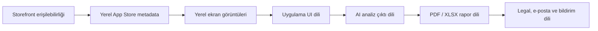

# RiskDetected Lokalizasyon ve Storefront Öncelik Raporu

Hazırlanma tarihi: 28 Temmuz 2026
Uygulama: RiskDetected 1.2.4 (77)
Bundle ID: `com.riskdetected.app`
Ana araştırma kaynağı: Applyra MCP
Amaç: İngilizce başlangıç paketi ile sonraki yerel dil/storefront yatırımlarını
önceliklendirmek

## 1. Yönetici kararı

RiskDetected için doğru ilk adım “uygulamayı yalnız ABD Store'a açmak” değildir.
Uygulama kontrol edilen ABD, Birleşik Krallık, Avustralya, Kanada, İrlanda, Yeni
Zelanda, Almanya, Fransa, İspanya, İtalya, Brezilya, Meksika, Hollanda, BAE,
Suudi Arabistan ve Hindistan storefront'larında zaten indirilebilir durumdadır.
Fakat mağaza başlığı ve ürün deneyimi Türkçedir.

Bu nedenle önerilen karar:

1. Tek bir tam İngilizce ürün paketi hazırlanmalı.
2. Aynı sürümde dört ayrı App Store metadata lokalizasyonu yayınlanmalı:
   `en-GB`, `en-US`, `en-AU`, `en-CA`.
3. Ticari erişim için ABD vazgeçilmezdir; ürün–arama niyeti pilotu için
   Birleşik Krallık ve Avustralya daha temiz sinyal verir.
4. İngilizceden sonraki ilk tam yerel dil Almanca olmalıdır.
5. Sonraki yatırım sırası, kaynak durumuna göre Fransızca ve Brezilya
   Portekizcesidir.
6. İtalyanca, İspanyolca ve Hollandaca ikinci genişleme dalgasında ele
   alınmalıdır.
7. Japonca, Korece, Çince ve Arapça ilk etapta ertelenmelidir.

Önerilen dalgalar:

| Dalga | Ürün dili / metadata | Hedef storefront'lar | Karar |
| --- | --- | --- | --- |
| 0 | Teknik temel | Türkiye + TestFlight | Dil sözleşmesi ve regresyon koruması |
| 1 | İngilizce ürün + `en-GB/en-US/en-AU/en-CA` | UK, US, AU, CA | Birlikte yayınla |
| 1B | İngilizce metadata erişimi | IE, NZ; ölçüm amaçlı AE, SA, IN | Reklam harcaması yapmadan izle |
| 2 | `de-DE` | Almanya, Avusturya | İngilizceden sonraki ilk dil |
| 3 | `fr-FR` + `fr-CA`, `pt-BR` | Fransa, Kanada, Brezilya | Ayrı doğrulama kapılarıyla |
| 4 | `it-IT`, `es-ES`, `es-MX`, `nl-NL` | İtalya, İspanya, Meksika, Hollanda | Veriye göre sırala |
| Bekleme | Japonca, Korece, Çince, Arapça | JP, KR, CN, Körfez | Yüksek adaptasyon / mevzuat maliyeti |

## 2. En önemli bulgu: Store erişimi ile lokalizasyon aynı şey değil

Apple, uygulamayı 175 ülke veya bölgede sunmaya izin verir. Mağaza erişilebilirliği
`Pricing and Availability` üzerinden; mağaza metadata dili App Store Connect;
uygulama içi dil ise Xcode/binary üzerinden ayrı yönetilir.

RiskDetected'in kontrol edilen yabancı storefront'larında iTunes lookup sonucu:

- `resultCount=1`
- sürüm `1.2.4`
- görünen ad `RiskDetected: İş Güvenliği İSG`

Yani uygulama bulunabilir, fakat yabancı kullanıcıya Türkçe konumlandırmayla
sunulmaktadır. Yeni pazar çalışmasının asıl işi:



Apple'ın resmi açıklamasına göre bir metadata lokalizasyonu eklemek, Xcode'daki
uygulama binary lokalizasyonundan farklıdır. Eşleşen lokalizasyon yoksa primary
language veya en uygun fallback gösterilir. Kaynak:
[Apple — Localize app information](https://developer.apple.com/help/app-store-connect/manage-app-information/localize-app-information).

Apple'ın ülke–varsayılan dil tablosu ayrı `English (Australia)`, `English
(Canada)`, `English (U.K.)` ve `English (U.S.)` lokalizasyonlarını destekler.
Kaynak:
[Apple — App Store localizations](https://developer.apple.com/help/app-store-connect/reference/app-information/app-store-localizations/).

Applyra araştırmasındaki `en-IE`, `en-NZ`, `en-AE`, `en-SA` ve `en-IN`
değerleri ülkeye özgü arama sonuçlarını sorgulamak için kullanılmıştır; bunlar
App Store Connect'te ayrı metadata lokalizasyonu açılacağı anlamına gelmez.
Apple'ın sunduğu dört İngilizce metadata locale'i `en-AU`, `en-CA`, `en-GB` ve
`en-US`'tir. İrlanda, Yeni Zelanda ve birçok uluslararası storefront Apple'ın
ülke–dil fallback eşlemesi üzerinden uygun İngilizce içeriği gösterir.

## 3. Applyra araştırma kapsamı

### 3.1 Mevcut RiskDetected profili

Applyra MCP anlık görüntüsü:

- Applyra internal app ID: `318921`
- Store: `ITUNES`
- Ülke/dil: `TR / tr-TR`
- Sürüm: `1.2.4`
- Puan: `4.6`
- Değerlendirme: `10`
- İzlenen anahtar kelime: `25`
- Görünürlük skoru: `60`
- Son 36 günlük görünürlük aralığı: `59–68`
- İzlenen Türkçe rakip: `5`

Mevcut Türkçe güçlü noktalar:

| Anahtar kelime | Trafik | Zorluk | Sıra |
| --- | ---: | ---: | ---: |
| `is guvenligi` | 52 | 16 | 5 |
| `iş güvenliği` | 25 | 15 | 10 |
| `isg risk analizi` | 8 | 19 | 2 |
| `risk değerlendirme` | 8 | 19 | 2 |
| `iş güvenliği uzmanı` | 8 | 9 | 3 |
| `tehlike tespit` | 8 | 5 | 1 |
| `osgb risk analizi` | 8 | 9 | 1 |
| `osgb` | 82 | 34 | 40 |

Bu tablo iki şeyi gösteriyor:

- RiskDetected çok niş ve satın alma niyeti yüksek uzun kelimelerde güçlü.
- Geniş `osgb` gibi terimlerde trafik yüksek olsa da alaka ve rekabet sorunu var.

Global ASO'da da aynı yaklaşım izlenmeli: geniş “safety” kelimesi yerine
`site risk assessment`, `safety inspection app`, `hazard assessment tool`,
`workplace safety audit` gibi ürünün gerçek işini anlatan terimler hedeflenmeli.

### 3.2 İngilizce ülke karşılaştırması

Applyra keyword inspection sonuçları:

| Store | Anahtar kelime | Trafik | Zorluk | KEI |
| --- | --- | ---: | ---: | --- |
| UK | `risk assessment` | 46 | 35 | 1.31 — excellent |
| UK | `safety inspection` | 36 | 30 | 1.20 — excellent |
| UK | `workplace safety` | 8 | 14 | 0.57 — moderate |
| US | `risk assessment` | 8 | 40 | 0.20 — low |
| US | `safety inspection` | 33 | 32 | 1.03 — excellent |
| US | `workplace safety` | 8 | 17 | 0.47 — moderate |
| AU | `risk assessment` | 8 | 28 | 0.29 — low |
| AU | `safety inspection` | 34 | 25 | 1.36 — excellent |
| AU | `workplace safety` | 8 | 17 | 0.47 — moderate |
| CA | `risk assessment` | 8 | 24 | 0.33 — low |
| CA | `safety inspection` | 36 | 30 | 1.20 — excellent |
| CA | `workplace safety` | 8 | 18 | 0.44 — moderate |
| IE | `risk assessment` | 8 | 35 | 0.23 — low |
| NZ | `risk assessment` | 8 | 46 | 0.17 — low |
| AE | `risk assessment` | 8 | 31 | 0.26 — low |
| SA | `risk assessment` | 8 | 44 | 0.18 — low |
| IN | `risk assessment` | 8 | 37 | 0.22 — low |

Applyra'daki `8` değeri birçok düşük hacimli niş terimde taban değer gibi
tekrarlanıyor. Bu nedenle `8` ile görünen pazarlar arasında küçük farklar kesin
talep farkı kabul edilmemelidir.

Ana sonuçlar:

- Birleşik Krallık `risk assessment` ifadesinde açık biçimde en güçlü İngilizce
  ürün–arama uyumuna sahip.
- `safety inspection`, UK/US/AU/CA'nın dördünde de daha güvenilir ortak edinim
  terimidir.
- ABD'nin büyük ticari değeri vardır, fakat generic `risk assessment` üzerinden
  organik büyüme beklemek doğru değildir.
- İrlanda ve Yeni Zelanda İngilizce paketin düşük ek maliyetli erişim alanlarıdır;
  ayrı ürün yatırımı için ilk dalga hacmi göstermez.
- BAE, Suudi Arabistan ve Hindistan İngilizce paketle erişilebilir; Applyra
  sinyali ilk aşamada ücretli edinim yatırımı önermiyor.

### 3.3 Applyra niş analizleri

Tamamlanan canlı niş analizleri:

| Store | Konu | Bulunan kelime | Küme | En yüksek fırsat |
| --- | --- | ---: | ---: | ---: |
| DE | `Gefährdungsbeurteilung Arbeitsschutz` | 56 | 10 | 65 |
| AU | `workplace safety inspection` | 50 | 9 | 61 |
| UK | `workplace safety risk assessment` | 55 | 10 | 59 |
| US | `safety inspection hazard assessment` | 57 | 10 | 57 |

Öne çıkan kümeler:

| Store | Küme | Fırsat | Ortalama trafik | Ortalama zorluk |
| --- | --- | ---: | ---: | ---: |
| DE | Incident & Accident Reporter | 65 | 14 | 9 |
| UK | Site Safety & Field Inspection | 59 | 10 | 10 |
| US | Hazard Analysis & Risk Assessment | 57 | 8 | 10 |
| US | Safety Audit & Reporting | 57 | 8 | 12 |
| AU | Digital Safety Inspection Tool | 43 | 8 | 8 |
| DE | Workplace Safety Auditor | 40 | 8 | 7 |

RiskDetected ile en doğrudan eşleşen öneri kelimeleri:

- UK: `site risk assessment`, `safety inspection app`, `workplace hazard report`,
  `construction safety app`.
- US: `job hazard analysis`, `hazard assessment tool`, `digital safety reports`,
  `safety inspection checklist`.
- AU: `workplace safety inspection`, `workplace inspection checklist`,
  `safety inspection app`.
- DE: `gefährdungsbeurteilung vor ort`, `begehungen und audits`,
  `sicherheitscheckliste`, `arbeitssicherheit app`.

Applyra niş analizindeki rakip sayısı bazı kümelerde `100` ile sınır değer
gösteriyor. Bu nedenle “tam 100 rakip” değil, “yoğun rekabet” olarak okunmalıdır.

## 4. Yerel dil fırsatları

Applyra karşılaştırması:

| Store | Anahtar kelime | Trafik | Zorluk | KEI |
| --- | --- | ---: | ---: | --- |
| DE | `gefährdungsbeurteilung` | 52 | 8 | 6.50 — excellent |
| DE | `arbeitsschutz` | 21 | 17 | 1.24 — excellent |
| DE | `sicherheitsinspektion` | 8 | 8 | 1.00 — excellent |
| FR | `évaluation des risques` | 8 | 9 | 0.89 — good |
| FR | `sécurité au travail` | 19 | 22 | 0.86 — good |
| FR | `inspection sécurité` | 8 | 7 | 1.14 — excellent |
| ES | `evaluación de riesgos` | 8 | 13 | 0.62 — good |
| ES | `seguridad laboral` | 8 | 10 | 0.80 — good |
| IT | `valutazione dei rischi` | 8 | 5 | 1.60 — excellent |
| IT | `sicurezza sul lavoro` | 8 | 5 | 1.60 — excellent |
| BR | `segurança do trabalho` | 25 | 9 | 2.78 — excellent |
| BR | `análise de risco` | 8 | 7 | 1.14 — excellent |
| MX | `evaluación de riesgos` | 8 | 5 | 1.60 — excellent |
| MX | `seguridad laboral` | 8 | 7 | 1.14 — excellent |
| NL | `risicobeoordeling` | 8 | 5 | 1.60 — excellent |
| NL | `arbeidsveiligheid` | 8 | 5 | 1.60 — excellent |

### Almanya neden ilk yerel dil?

- `Gefährdungsbeurteilung` en güçlü yerel arama sinyalidir: trafik 52, zorluk 8.
- Applyra niş analizinde en yüksek fırsat skoru 65'tir.
- Ürün fonksiyonları saha değerlendirme, önlem ve dokümantasyon akışıyla
  doğrudan örtüşür.
- BAuA, Gefährdungsbeurteilung'ı iş sağlığı ve güvenliğinde merkezi bir araç
  olarak tanımlar. Kaynak:
  [BAuA — Grundlagen und Prozessschritte](https://www.baua.de/DE/Themen/Arbeitsgestaltung/Gefaehrdungsbeurteilung/Handbuch-Gefaehrdungsbeurteilung/Grundlagenwissen).
- Almanya için yalnız dil çevirisi yeterli değildir; `ArbSchG`, risk
  dokümantasyonu ve Alman terminolojisi uzman incelemesinden geçmelidir.

### Fransa

- Trafik Almanya kadar güçlü görünmese de `sécurité au travail` sinyali vardır.
- Fransa için `DUERP` ve `évaluation des risques professionnels` dili ayrıca
  araştırılmalı; ilk üç seed kelime bütün niyeti temsil etmiyor olabilir.
- Fransızca yatırımı `fr-FR` ile sınırlı kalmaz; `fr-CA` için de yeniden
  kullanılabilir, ancak Kanada terminolojisi ayrı doğrulanmalıdır.

### Brezilya

- `segurança do trabalho` trafik 25, zorluk 9 ve KEI 2.78 ile güçlüdür.
- Portekizce (Brezilya) App Store'un desteklediği ayrı bir lokalizasyondur.
- Büyük kullanıcı tabanı avantajına karşı daha düşük abonelik geliri ve fiyat
  hassasiyeti beklenmelidir.
- Brezilya'da SST ve NR terminolojisi profesyonel inceleme gerektirir.

### İtalya, İspanya, Meksika ve Hollanda

- Rekabet zorluğu düşüktür; fakat Applyra trafik sinyalleri taban seviyededir.
- Tam dil yatırımı ancak English/DE/FR/PT-BR cohort verisi geldikten sonra
  yapılmalıdır.
- İspanya ve Meksika için aynı çeviri dosyası kullanılabilir, ancak Store
  metadata ve mevzuat terimleri ayrı olmalıdır.

## 5. Ağırlıklı pazar puanlaması

Puanlama modeli:

- iOS-adreslenebilir pazar büyüklüğü: `%30`
- Rekabet kolaylığı: `%25`
- Lokalizasyon eforu: `%20`
- Abonelik geliri potansiyeli: `%15`
- RiskDetected ürün uyumu: `%10`

`Toplam = pazar×0.30 + rekabet×0.25 + efor×0.20 + gelir×0.15 + uyum×0.10`

Pazar büyüklüğü ve gelir potansiyeli kesin gelir tahmini değildir. Applyra
talep/rekabet sinyali, Apple'ın ekosistem verileri ve abonelik uygulaması
benchmark'larıyla yönsel olarak normalize edilmiştir.

| Pazar | Pazar | Rekabet | Efor | Gelir | Uyum | Toplam | Karar |
| --- | ---: | ---: | ---: | ---: | ---: | ---: | --- |
| US | 100 | 70 | 90 | 100 | 82 | 88.7 | Dalga 1 |
| UK | 75 | 74 | 90 | 85 | 98 | 81.5 | Dalga 1 / pilot |
| DE | 80 | 89 | 55 | 82 | 95 | 79.0 | Dalga 2 |
| CA | 60 | 76 | 90 | 75 | 85 | 74.8 | Dalga 1 |
| AU | 55 | 77 | 90 | 78 | 90 | 74.5 | Dalga 1 / pilot |
| FR | 70 | 87 | 52 | 68 | 88 | 72.1 | Dalga 3 |
| BR | 75 | 93 | 55 | 45 | 85 | 72.0 | Dalga 3 |
| IT | 60 | 93 | 58 | 50 | 80 | 68.3 | Dalga 4 |
| MX | 65 | 94 | 58 | 38 | 75 | 67.8 | Dalga 4 |
| ES | 60 | 89 | 58 | 52 | 80 | 67.7 | Dalga 4 |
| NL | 40 | 95 | 50 | 65 | 78 | 63.3 | İzleme |
| AE | 35 | 69 | 80 | 65 | 80 | 61.5 | İngilizce izleme |
| IN | 55 | 63 | 85 | 30 | 68 | 60.5 | İngilizce izleme |
| IE | 25 | 76 | 90 | 50 | 80 | 60.0 | İngilizce halo |
| SA | 45 | 56 | 70 | 55 | 75 | 57.3 | İzleme |
| NZ | 20 | 69 | 90 | 45 | 75 | 55.5 | İngilizce halo |

Tablodaki `rekabet` değeri yükseldikçe pazara giriş kolaylaşır; Applyra
zorluk skorunun ters normalize edilmiş halidir. `Efor` değeri yükseldikçe mevcut
Türkçe üründen o pazara lokalizasyon daha kolaydır.

Puan tek başına rollout sırası değildir:

- ABD'nin toplamı pazar büyüklüğü nedeniyle yüksektir, fakat generic `risk
  assessment` sinyali UK'den zayıftır. Bu yüzden ABD ticari erişim pazarı, UK ise
  mesaj/organik niyet pilotudur.
- Almanya'nın puanı İngilizce pazarlarla aynı seviyede olsa da ayrı bir tam dil
  ve mevzuat paketi gerektirdiği için Dalga 2'dedir.
- Brezilya'nın organik fırsatı güçlüdür; daha düşük gelir puanı nedeniyle fiyat
  ve maliyet doğrulaması yapılmadan büyütülmemelidir.

Apple'ın 2024 Avrupa ekosistem çalışması dijital mal ve hizmetlerde UK'yi
Almanya, Fransa, İspanya ve İtalya'nın önünde gösterir; bu, ilk İngilizce paket
ve Almanca sıralamasını destekleyen yönsel bir göstergedir:
[Apple — The Global App Store](https://www.apple.com/newsroom/pdfs/2024-Apple-Global-Ecosystem-Report-June2025.pdf).

RevenueCat'in 2026 subscription benchmark'ı iOS'un download-to-paid dönüşümünde
avantajını ve yeni abonelik uygulamalarındaki yoğun rekabeti gösterir. Bu nedenle
geniş ülke açılımı yerine ölçümlü cohort rollout önerilir:
[RevenueCat — State of Subscription Apps 2026, Utilities](https://www.revenuecat.com/state-of-subscription-apps-2026-utilities).

## 6. İngilizce paket nasıl düzenlenmeli?

### 6.1 Tek uygulama dili, dört metadata varyantı

Uygulama içinde ilk etapta ortak bir İngilizce kaynak seti kullanılabilir.
Ancak App Store metadata ve ASO kelimeleri ayrılmalıdır.

| Locale | Önerilen Store başlığı | Karakter | Önerilen subtitle | Karakter |
| --- | --- | ---: | --- | ---: |
| `en-GB` | `RiskDetected: Risk Assessment` | 29 | `Hazard Checks & Risk Reports` | 28 |
| `en-US` | `RiskDetected: Safety Audit` | 26 | `Safety Inspection & Reports` | 27 |
| `en-AU` | `RiskDetected: Safety Audit` | 26 | `WHS Inspections & Risk Reports` | 30 |
| `en-CA` | `RiskDetected: Safety Audit` | 26 | `OHS Inspections & Risk Reports` | 30 |

Bu başlıklar son metadata değildir; App Store Connect'e girmeden önce her
locale'de marka/keyword çakışması ve native edit kontrolü yapılmalıdır.

Ana ASO eksenleri:

| Pazar | Birincil | İkincil |
| --- | --- | --- |
| UK | `risk assessment`, `site risk assessment` | `safety inspection`, `hazard report` |
| US | `safety inspection`, `job hazard analysis` | `safety audit`, `hazard assessment` |
| AU | `WHS inspection`, `workplace inspection` | `safety checklist`, `risk assessment` |
| CA | `OHS inspection`, `safety inspection` | `hazard assessment`, `risk report` |

Resmî terminoloji doğrulaması:

- UK HSE, risk assessment akışını hazard belirleme, olasılık/şiddet değerlendirme
  ve kontrol önlemi alma olarak tanımlar:
  [HSE — Managing risks and risk assessment at work](https://www.hse.gov.uk/risk/).
- ABD OSHA, “Job Hazard Analysis / Job Safety Analysis” ve hazard identification
  dilini kullanır:
  [OSHA — Hazard Identification and Assessment](https://www.osha.gov/safety-management/hazard-identification).
- Kanada kaynaklarında “hazard assessment” ifadesi yaygındır:
  [CCOHS — Hazard Assessment](https://wvhp.ccohs.ca/topics/assessment/).

### 6.2 Ekran görüntüleri

Her İngilizce locale için aynı görsel düzen kullanılabilir; üst metinler locale'e
göre değiştirilmelidir.

Önerilen ilk beş ekran:

1. `Spot workplace hazards from a photo`
2. `Turn findings into actionable controls`
3. `Prioritize risk with Fine-Kinney or 5x5`
4. `Create professional PDF & Excel reports`
5. `Keep every site assessment organized`

Kurallar:

- Ekranda Türkçe bulgu veya Türk mevzuat referansı kalmamalı.
- “Compliant with OSHA/HSE/WHS” iddiası doğrulanmadan kullanılmamalı.
- Üç fotoğraf özelliği yalnız Plus/Pro bağlamında doğru gösterilmeli.
- Screenshot içindeki örnek analiz sentetik ve kişisel verisiz olmalı.

## 7. Tam İngilizce lokalizasyonun teknik kapsamı

Güncel kod doğrulaması:

- `RDLanguage.supportedCases = [.turkish]`
- Xcode `developmentRegion = tr`
- App Store primary language Türkçe
- AI promptları Türkçe çıktı değerini zorluyor
- PDF/XLSX label'ları büyük ölçüde Türkçe
- Legal, e-posta, bildirim ve izin metinleri Türkçe

Bu nedenle tam İngilizce paket:

### iOS

- String Catalog veya eşdeğer merkezi localization sistemi.
- `RDLanguage`: Türkçe + İngilizce.
- Onboarding, auth, paywall, home, analiz, sonuç, rapor, profil ve support.
- Model label'ları: risk bandı, analiz tipi, plan adı, canvas, empty state.
- `InfoPlist.strings`: kamera, fotoğraf, bildirim izin metinleri.
- Tarih, sayı, para ve çoğul kuralları.
- Accessibility label ile görünür metni birbirinden ayırma.

### AI ve veri sözleşmesi

- Her analizde güvenilir `output_language`.
- Analiz satırında dil metadata'sı.
- Türkçe ve İngilizce prompt/sanitizer sözleşmesi.
- JSON key'leri aynı kalmalı; yalnız kullanıcıya dönük değer dili değişmeli.
- Historical analizler otomatik çevrilmemeli.
- Retry, repair, Gemini/Groq fallback ve mevcut provider routing değişmemeli.

### Raporlar

- PDF içindeki bütün başlık ve fallback metinleri.
- Excel sheet adı, kolonlar, risk seviyeleri ve referans tablosu.
- `report_language` backend tarafından gerçekten uygulanmalı.
- Tarih ve sayı formatları locale-aware olmalı.
- Aynı analizden Türkçe/İngilizce rapor üretilip üretilmeyeceği ürün kararı olarak
  açıkça tanımlanmalı.

### İletişim ve legal

- OTP/welcome e-postası.
- Transactional ve engagement push metinleri.
- Support formu ve otomatik yanıtlar.
- İngilizce privacy/terms metinleri ve remote manifest.
- Subscription display name/description localization.

## 8. En kritik ürün riski: mevzuat ve yargı alanı

Mevcut AI sistemi Türkiye bağlamını ve 6331 temelli referansları kullanır.
Türkçe cümleleri İngilizceye çevirmek, yabancı kullanıcıya geçerli yerel mevzuat
sunmak anlamına gelmez.

Güvenli seçenek:

```text
analysis_language: tr | en
analysis_jurisdiction: TR | INTERNATIONAL_GENERIC
report_language: tr | en
```

İlk İngilizce sürümde:

- Türkiye seçiliyse mevcut Türkiye referansları korunur.
- International Generic seçiliyse yalnız gözlenebilir hazard, risk seviyesi,
  hierarchy of controls ve genel iyi uygulama dili kullanılır.
- “Yerel mevzuat için yetkili profesyonel doğrulaması gerekir” notu korunur.
- UK/US/AU/CA mevzuat profilleri, ayrı uzman doğrulamasından sonra eklenir.

Yapılmaması gereken:

- 6331 referansını yalnız İngilizceye çevirip UK/US kullanıcısına sunmak.
- OSHA/HSE/WHS uyumu iddiasını yalnız AI promptuna yazarak pazarlamak.
- Store ülkesini kullanıcının çalışma yargı alanı kabul etmek.

## 9. Fiyat ve abonelik düzeni

Apple, 174 diğer storefront için kur ve vergi temelli otomatik fiyatlar üretebilir;
ülke bazında manuel fiyat da seçilebilir:
[Apple — Set a price](https://developer.apple.com/help/app-store-connect/manage-app-pricing/set-a-price).

Öneri:

1. İlk İngilizce rollout'ta fiyatları kör biçimde TRY karşılığına çevirmeyin.
2. App Store Connect'teki mevcut otomatik fiyatları US/UK/AU/CA için çıkarın.
3. Rakip aylık/yıllık fiyatlarını aynı özellik kapsamıyla karşılaştırın.
4. İlk 30 gün liste fiyatını sabit tutun; conversion verisi olmadan indirim
   yapmayın.
5. DE/FR/BR açılımında yerel satın alma gücü ve vergi dahil fiyat psikolojisini
   ayrı değerlendirin.
6. Plus/Pro display name ve subscription açıklamalarını locale bazında
   lokalize edin.

## 10. Rollout planı

### Dalga 0 — Teknik ve dil temeli

- Lokalizasyon branch'i.
- Dil sözleşmesi ADR'si.
- Merkezi string envanteri.
- UI, AI, PDF/XLSX, legal/push/email dil kapsamı.
- `TR` ve `INTERNATIONAL_GENERIC` jurisdiction ayrımı.
- İngilizce TestFlight.

Çıkış kriterleri:

- UI'da fallback Türkçe yok.
- 1 ve 3 fotoğraf analizi İngilizce.
- PDF ve Excel metin extraction testleri İngilizce.
- Subscription/notification/queue/claim testleri değişmeden geçiyor.

### Dalga 1 — Dört İngilizce metadata

- `en-GB`, `en-US`, `en-AU`, `en-CA`.
- Dört title/subtitle/keyword seti.
- Lokalize screenshot setleri.
- İngilizce support ve legal URL'leri.
- Bir App Review sürümü.

Store operasyon önceliği:

1. UK: organik ürün–terim pilotu.
2. AU: safety inspection / WHS pilotu.
3. US: ticari ölçek; farklı keyword seti.
4. CA: English OHS; sonra `fr-CA`.

### Dalga 1B — Düşük maliyetli English halo

- İrlanda ve Yeni Zelanda organik olarak izlenir.
- BAE, Suudi Arabistan ve Hindistan'da yalnız organik cohort ölçülür.
- Dil/terminoloji doğrulanmadan paid acquisition yapılmaz.

### Dalga 2 — Almanca

- Native iş güvenliği uzmanı terminoloji review'u.
- `Gefährdungsbeurteilung`, `Arbeitsschutz`, `Begehung`, `Maßnahme` sözlüğü.
- Almanca Store metadata ve screenshot.
- Almanca AI/PDF/XLSX/legal/push.
- Almanya pilotu; ardından Avusturya.

### Dalga 3 ve sonrası

- Fransızca: Fransa + ayrı `fr-CA`.
- Portekizce (Brezilya): fiyat hassasiyetiyle ayrı cohort.
- İtalyanca / İspanyolca / Hollandaca: App Store Connect verisine göre.

## 11. Ölçüm ve karar kapıları

Her storefront için:

- Impression.
- Product page view.
- Product page conversion.
- First-time download.
- Onboarding completion.
- İlk analiz oranı.
- Analiz completion ve provider hata oranı.
- PDF/XLSX oluşturma.
- Trial start.
- Trial cancellation.
- Trial → paid.
- D7/D30 retention.
- Refund ve support ticket.
- Analiz başına Gemini/Groq maliyeti.

Karar kapıları:

| Zaman | Kontrol | Karar |
| --- | --- | --- |
| 7 gün | Metadata indexlenmesi, crash/hata, Türkçe fallback | Teknik sorun varsa acquisition kapalı |
| 14 gün | Store conversion ve ilk analiz | Mesaj/screenshot iterasyonu |
| 30 gün | Trial, paid, AI maliyeti | Fiyat ve kanal kararı |
| 60 gün | D30 retention ve LTV sinyali | Sonraki dil yatırımı |

Önemli segmentler:

- `storefront_country`
- `app_language`
- `analysis_language`
- `analysis_jurisdiction`
- `subscription_plan`
- `acquisition_source`

Bu alanlar aynı değildir ve tek “country” alanında birleştirilmemelidir.

## 12. Test planı

### iOS

- Türkçe ve İngilizce launch.
- Dil değiştirip yeniden açma.
- Auth/onboarding/paywall/profile.
- 1 ve 3 fotoğraf.
- Text analysis.
- Dynamic type ve uzun İngilizce metin.
- İngilizce accessibility testleri.
- Türkçe regression UI paketi.

### AI

- `tr/TR` çıktısı mevcut davranışla aynı.
- `en/INTERNATIONAL_GENERIC` yalnız İngilizce.
- JSON schema ve finding limitleri aynı.
- Evidence guard, root cause, reference ve audit alanları aynı.
- Coverage repair, provider fallback ve cancelled-trial routing aynı.
- İngilizce sanitizer testleri.
- Türk mevzuatının generic profile'a sızmaması.

### PDF/XLSX

- Text extraction ile Türkçe ve İngilizce başlık assertion'ları.
- Sheet ve kolon isimleri.
- Fine-Kinney / 5x5 tabloları.
- Tarih, ondalık ve para formatları.
- Türkçe karakter ve İngilizce uzun satır taşması.

### Backend ve bildirim

- Push/e-posta locale seçimi.
- Locale yoksa güvenli fallback.
- Queue mesajı dil snapshot'ını koruyor.
- Retry/repair sırasında dil değişmiyor.
- Existing analysis pipeline, quota ve report testleri.

### App Store

- Her locale için 30 karakter title/subtitle kontrolü.
- 100 karakter keyword alanı.
- Screenshot'ta yalnız hedef dil.
- Privacy/support URL erişimi.
- Subscription localization.
- TestFlight native review.

## 13. Rollback

- Uygulama dil flag'i `off` ise Türkçe mevcut akış korunmalı.
- İngilizce metadata gerektiğinde App Store Connect'te kaldırılabilir; ülke
  erişilebilirliği ayrı kalır.
- Yeni dil alanları additive olmalı.
- Historical analizler dönüştürülmemeli.
- Queue'ya giren iş dil snapshot'ıyla tamamlanmalı.
- Türkçe AI promptu, provider routing, quota ve report finalization yolu
  yeniden yazılmamalı; dil-aware wrapper ile korunmalı.

## 14. Ertelenen pazarlar

### Japonya ve Kore

- Yüksek gelirli iOS pazarlarıdır.
- Applyra ile RiskDetected nişi bu çalışma kapsamında yerel dilde doğrulanmadı.
- Native UX, mevzuat, support ve rapor kalitesi gereksinimi yüksektir.
- İngilizce/Almanca PMF doğrulanmadan başlanmamalıdır.

### Çin ana karası

- Simplified Chinese metadata ve olası ICP/yerel belge gereksinimleri vardır.
- AI, veri transferi, erişilebilirlik ve legal operasyon ayrı projedir.
- İlk lokalizasyon dalgasına alınmamalıdır.

### Arapça pazarlar

- BAE ve Suudi Arabistan B2B saha güvenliği açısından stratejik olabilir.
- İlk Applyra `risk assessment` sinyali düşük hacimlidir.
- RTL UI, Arapça rapor, yerel terminoloji ve support gerektirir.
- İngilizce organik cohort sonucu gelmeden tam Arapça yatırım yapılmamalıdır.

## 15. Net uygulanabilir öneri

Bugün karar verilecekse:

1. Uygulamanın uluslararası erişimini kapatmayın; zaten açık.
2. İngilizceyi yalnız metadata değil, tam ürün dili olarak planlayın.
3. İlk release'e dört metadata locale ekleyin:
   `en-GB`, `en-US`, `en-AU`, `en-CA`.
4. UK ve AU'yu organik pilot; US'yi ticari ölçek; CA'yı düşük ek maliyetli
   dördüncü pazar olarak yönetin.
5. İlk sonraki dil için Almancayı seçin.
6. Fransızca ve Brezilya Portekizcesi arasında seçim yaparken 30–60 günlük
   İngilizce cohort verisini kullanın.
7. Store listing'i yayınlamadan önce `INTERNATIONAL_GENERIC` analiz profilini
   oluşturun; Türk mevzuatını yabancı kullanıcılara taşımayın.
8. App Store Connect, RevenueCat ve AI usage verilerini storefront/language
   bazında dashboard'a bağlamadan paid acquisition başlatmayın.

## 16. Kaynaklar ve sınırlamalar

### Birincil proje kaynakları

- `app-marketing-context.md`
- `docs/RISKDETECTED_PROJECT_DEEP_DIVE_FOR_ENGLISH_LOCALIZATION_2026-06-12.md`
- `docs/RISKDETECTED_FULL_PROJECT_REFERENCE_2026-06-29.md`
- `docs/APP_REVIEW_BUILD_77_PREP_2026-07-25.md`
- Güncel `App/Services/RDLocalization.swift`
- Güncel Xcode project localization ayarları

### Applyra MCP

- `list_applications`
- `list_keywords`
- `inspect_keyword`
- `run_niche_analysis`
- `list_competitors`
- `get_app_score_history`

Applyra verisi 28 Temmuz 2026 anlık görüntüsüdür. Trafik, zorluk, KEI ve
opportunity skorları yönsel ASO göstergeleridir; kesin indirme veya gelir tahmini
değildir.

### Apple ve sektör kaynakları

- [Apple — Manage availability](https://developer.apple.com/help/app-store-connect/manage-your-apps-availability/manage-availability-for-your-app-on-the-app-store)
- [Apple — Localize app information](https://developer.apple.com/help/app-store-connect/manage-app-information/localize-app-information)
- [Apple — App Store localizations](https://developer.apple.com/help/app-store-connect/reference/app-information/app-store-localizations/)
- [Apple — Set a price](https://developer.apple.com/help/app-store-connect/manage-app-pricing/set-a-price)
- [Apple — The Global App Store](https://www.apple.com/newsroom/pdfs/2024-Apple-Global-Ecosystem-Report-June2025.pdf)
- [RevenueCat — State of Subscription Apps 2026](https://www.revenuecat.com/state-of-subscription-apps-2026-utilities)

### Veri boşlukları

Bu rapora şu veriler dahil değildir:

- App Store Connect ülke bazlı impression/download/conversion.
- RevenueCat ülke bazlı trial/paid/LTV.
- Ülke bazlı support ve refund.
- Rakiplerin güncel abonelik fiyatları.
- Native uzman tarafından mevzuat uygunluk incelemesi.

Yayın yatırım kararı verilmeden önce bu veri boşlukları İngilizce cohort ile
tamamlanmalıdır.
