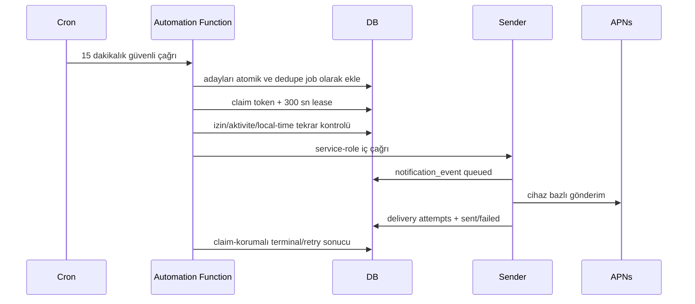

# RiskDetected Bildirim Otomasyonu — Operasyon Merkezi Teknik Rehberi

Bu belge Operasyon Merkezi ekibinin notification automation altyapısını güvenli
şekilde entegre etmesi, izlemesi ve yönetmesi içindir. Secret, gerçek token,
e-posta veya kullanıcı verisi içermez.

## 1. Sistem sınırı

Sistem yalnız şu kind’ları otomasyon kapsamında üretir:

- `first_analysis_reminder`
- `inactivity_reminder`
- `manual_app_reminder`

Mevcut `analysis_complete`, `report_ready`, `account_updates`,
`trial_reminder` ve progress kind’ları aynı sender’dan geçer ancak otomasyon
kuralları tarafından oluşturulmaz.



## 2. Veri sözlüğü

### `public.notification_preferences`

`app_reminders`, üç yeni kind’ın ortak tercihi. `enabled` master switch’tir;
ikisi de true değilse otomasyon ve manuel kampanya göndermez.

iOS aynı kullanıcı için normal foreground heartbeat’ini en fazla altı saatte bir
gönderir. RPC, aynı authorization durumundaki tekrarlı çağrıları ayrıca bir
dakika boyunca no-op yapar; authorization geçişleri ve özellikle `denied`
durumu geciktirilmez.

### `public.user_engagement_state`

| Alan | Anlam |
|---|---|
| `last_foreground_at` | Server saatli, en fazla 6 saatte bir ilerleyen foreground |
| `timezone` | Doğrulanmış IANA timezone |
| `locale` | Cihaz locale’i |
| `authorization_status` | Apple notification authorization durumu |
| `authorization_synced_at` | Son izin durumu senkronu |
| `app_version`, `app_build` | Rollout ve teşhis bağlamı |

Client `user_id` veya aktivite zamanı gönderemez.

### `private.notification_rules`

Kural kimliği ve yayın durumu. Durumlar:

- `draft`
- `shadow`
- `allowlist`
- `active`
- `paused`
- `archived`

Kural düzenlemek mevcut version’ı değiştirmez; yeni immutable version oluşturur.

### `private.notification_rule_versions`

Desteklenen condition sözleşmeleri:

```json
{"min_hours": 24, "max_hours": 72}
```

```json
{"inactivity_days": 5}
```

Ek/bilinmeyen key fail olur. Allowlist yalnız SHA-256 user hash’leri taşır.

### `private.notification_jobs`

| Alan | Anlam |
|---|---|
| `episode_key` | Lifetime veya son aktivite episode’u |
| `dedupe_key` | Global unique idempotency anahtarı |
| `status` | shadow/pending/claimed/sent/skipped/failed/cancelled/ambiguous |
| `claim_token` | Worker sahipliği |
| `lease_expires_at` | Claim lease sonu |
| `attempt_count` | En fazla 3 gerçek attempt |
| `eligibility_snapshot` | Aday seçildiği andaki güvenli teknik bağlam |

Son 24 saat suppression, 7/30 gün frequency cap veya yerel sessiz saat kontrolü
gönderim anında değişmişse job terminal `skipped` olmaz. `pending` durumuna
döner, attempt sayısı geri alınır ve hesaplanan ilk uygun ana ertelenir.

### `public.notification_events`

Mevcut status’lar değişmez: `queued`, `sent`, `failed`, `skipped`.

- `sent`: APNs en az bir cihaz isteğini kabul etti.
- `opened_at`: kullanıcı bildirime dokundu.
- Kesin ekranda gösterim/teslim garantisi değildir.

### `private.notification_delivery_attempts`

Her cihaz ve attempt için:

- `accepted`
- `transient`
- `permanent`
- `ambiguous`

Tokenın kendisi, payload body’si veya secret kaydedilmez.

## 3. Güvenlik

Operasyon Merkezi browser’ı yalnız kullanıcı JWT’siyle
`manage-notification-automation` Edge Function’ını çağırır. Service-role key
browser’a verilmez.

Scope’lar:

- `notifications.read`
- `notifications.rules.write`
- `notifications.campaigns.write`
- `notifications.publish`
- `notifications.kill_switch`

Database RPC aynı admin kullanıcı ve scope kontrolünü tekrar yapar. Her mutasyon
`admin_audit_logs` kaydı üretir. Private tablolarda anon/authenticated grant yoktur.
`rollout_mode=on` için opsiyonel `rollout_percentage` 0–100 aralığındadır ve
kullanıcı UUID’sinin deterministik SHA-256 bucket’ıyla uygulanır. Bozuk veya eksik
flag otomatik olarak kill-switch açık/off kabul edilir.

## 4. Admin API

Endpoint:

```text
POST /functions/v1/manage-notification-automation
GET  /functions/v1/manage-notification-automation
```

### Snapshot

`GET` kuralları, aktif version koşullarını, template’leri, son 180 günlük
kampanyaları ve temel metrikleri döndürür.

### Önizleme

```json
{
  "operation": "preview",
  "rule_id": "UUID"
}
```

veya:

```json
{
  "operation": "preview",
  "campaign_id": "UUID"
}
```

Preview gönderim yapmaz. Son send-time revalidation ve 24 saat erteleme etkisi
nedeniyle gerçek sent sayısı daha düşük olabilir.

### Kural oluşturma

Önce template:

```json
{
  "operation": "mutate",
  "action": "create_template",
  "payload": {
    "key": "custom_inactivity_v1",
    "name": "Özel aktivite mesajı",
    "title": "Sahadaki riskleri erteleme",
    "body": "Yeni bir saha fotoğrafıyla risk analizini güncelle.",
    "destination": "new_analysis",
    "status": "active"
  }
}
```

Sonra rule:

```json
{
  "operation": "mutate",
  "action": "create_rule",
  "payload": {
    "key": "custom_inactivity_7d",
    "name": "Yedi günlük aktivitesizlik",
    "rule_type": "inactivity",
    "template_id": "UUID",
    "conditions": {"inactivity_days": 7},
    "priority": 250,
    "enabled_user_hashes": []
  }
}
```

Kural doğrudan active olmaz. Sıra `draft → shadow → allowlist → active` olmalıdır.

```json
{
  "operation": "mutate",
  "action": "set_rule_status",
  "payload": {"rule_id": "UUID", "status": "shadow"}
}
```

Yüzdesel rollout yalnız `on` modunda kullanılır:

```json
{
  "operation": "mutate",
  "action": "set_rollout",
  "payload": {
    "rollout_mode": "on",
    "rollout_percentage": 5,
    "enabled_user_hashes": []
  }
}
```

### Yeni version

```json
{
  "operation": "mutate",
  "action": "create_rule_version",
  "payload": {
    "rule_id": "UUID",
    "template_id": "UUID",
    "conditions": {"inactivity_days": 5},
    "enabled_user_hashes": ["SHA256_USER_HASH"]
  }
}
```

Bu işlem rule’u tekrar `draft` yapar. Yayın için yeniden shadow/allowlist gerekir.

### Manuel kampanya

Allowlist ile başlayın:

```json
{
  "operation": "mutate",
  "action": "create_campaign",
  "payload": {
    "name": "Internal smoke",
    "title": "Bildirim testi",
    "body": "RiskDetected uygulama bildirimi testi.",
    "destination": "home",
    "target_spec": {
      "audience": "allowlist",
      "user_hashes": ["SHA256_USER_HASH"]
    }
  }
}
```

Schedule:

```json
{
  "operation": "mutate",
  "action": "set_campaign_status",
  "payload": {
    "campaign_id": "UUID",
    "status": "scheduled",
    "scheduled_at": "2026-07-25T12:00:00Z"
  }
}
```

Manuel kampanya izin, 10:00–20:00, 24 saat suppression ve frequency cap’i
atlayamaz.

Kampanya, bir batch içindeki son job bitti diye otomatik olarak `completed`
yapılmaz; sonraki cron’larda başka uygun kullanıcılar bulunabilir. Operasyon
Merkezi bütün job’ların terminal olduğunu doğruladıktan sonra aynı işlemle
`status=completed` gönderir. Pending veya claimed job varken bu geçiş veritabanı
tarafından reddedilir.

## 5. Operasyon Merkezi ekranları

Önerilen minimum ekranlar:

1. Genel durum: flag, kill switch, queue ve APNs metrikleri.
2. Kurallar: status, version, koşul, aday preview, publish/pause.
3. Template’ler: 80/240 sayaçları ve destination seçimi.
4. Kampanyalar: allowlist preview, schedule, pause/cancel.
5. Delivery explorer: event → cihaz attempt’ları → open bilgisi.
6. Audit: admin, action, target ve zaman.

PII veya device token hiçbir tabloda UI’a çıkarılmamalıdır.

## 6. Metrikler

- Candidate/shadow job sayısı
- Pending ve oldest due age
- Sent/skipped/failed/ambiguous job
- APNs accepted/transient/permanent/ambiguous
- Invalidated token sayısı
- Event open ve open rate
- Kural/kampanya bazında frequency-cap ve recent-push skip

`logs.all` kullanılmaz. Kaynak durable notification tablolarıdır.

## 7. Runbook

### Kural yayınlama

1. Template uzunluk/destination kontrolü.
2. Preview.
3. Shadow en az 7 gün.
4. Allowlist APNs smoke.
5. Sent event, delivery attempt ve open kaydını doğrula.
6. Active ve global yüzde rollout.

### Pause

Rule status `paused`. Pending ve claimed ilgili job’lar attempt tüketmeden
`pending` durumunda park edilir. Rule yeniden yayınlandığında aynı episode ve
dedupe ile devam eder. `archived` terminal iptaldir. Mevcut transactional/trial
bildirim etkilenmez.

### Global kill switch

`set_kill_switch` action’ıyla true yap. Bütün pending/claimed automation job’ları
claim’leri bırakılarak park edilir; hiçbir yeni claim alınmaz. Problem çözüldükten
sonra false, ardından allowlist. Terminal iptal gerektiğinde campaign `cancelled`
veya rule `archived` kullanılır.

### APNs 410/BadDeviceToken

Beklenen kalıcı sonuçtur; token otomatik pasif olur. Oran ani yükselirse bundle,
environment ve build dağılımını kontrol edin.

### APNs 429/5xx

İlgili cihaz request’i exponential backoff ile üç kez denenir. Süreklilik varsa
rollout’u düşürün; bütün job’ı yeniden göndererek kabul edilmiş diğer cihazları
tekrarlamayın. `ambiguous` ile `transient` durumunu karıştırmayın.

### Ambiguous

Otomatik retry yoktur. Dedupe event APNs tekrarını engeller. Önce event ve delivery
attempt kaydını inceleyin; toplu resend yapmayın. APNs kabulünden sonra worker
cevabı kaybolursa sonraki claim mevcut `sent` event’i görüp job’ı ikinci APNs
çağrısı yapmadan tamamlar.

### Queue backlog

Flag/kill switch, cron durumu, oldest due, expired lease ve function hata oranını
kontrol edin. Claim’i elle silmek yerine pause/kill switch kullanın.

## 8. Secret ve deploy manifesti

Gerekli Edge Function secret:

- `NOTIFICATION_AUTOMATION_SECRET`
- `OPERATIONS_CENTER_ALLOWED_ORIGINS`: virgülle ayrılmış tam web origin listesi;
  örneğin `https://operations.example.com`. Wildcard kullanılmaz.
- Mevcut APNs ve Supabase function secret’ları

Vault:

- `project_url`
- `notification_automation_secret` (Edge secret ile aynı)

Migration Vault secret’ları yoksa cron’u bilerek oluşturmaz. Secret’lar
tanımlandıktan sonra migration’daki güvenli cron schedule bloğu çalıştırılmalıdır.

Deploy:

1. Migration
2. `send-push-notification`
3. `process-notification-automation`
4. `manage-notification-automation`
5. Minimum iOS build
6. Shadow/allowlist/rollout

## 9. Kabul kontrolü

- Unknown kind gönderilemiyor.
- Preference query hatasında APNs çağrısı yok.
- Token refresh kategori seçimini değiştirmiyor.
- `app_reminders=false` otomatik ve manuel gönderimi engelliyor.
- Local time dışında job claim/send yok.
- Aynı dedupe key ikinci APNs isteği oluşturmuyor.
- 410 tokenı kapatıyor; 429/5xx retry; transport ambiguous retry yok.
- Notification open yalnız event sahibi tarafından kaydediliyor.
- Admin mutation scopesuz kullanıcıya kapalı ve audit üretiyor.
- Operasyon Merkezi preflight’ı yalnız tanımlı origin’lere CORS izni veriyor.
- Production fotoğraf fixture’ı 3 slot sözleşmesini kullanıyor.
