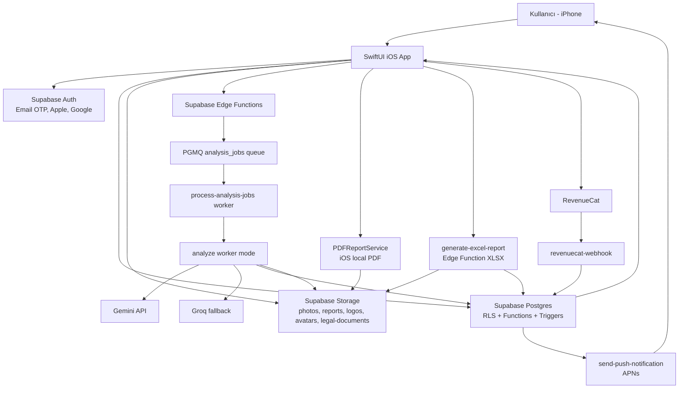
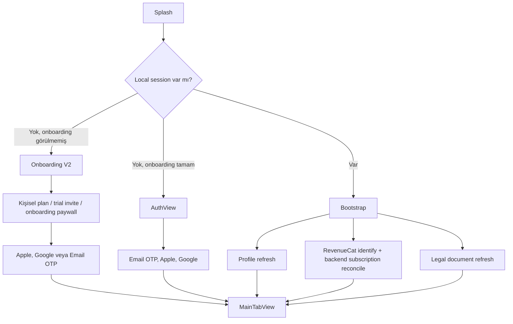
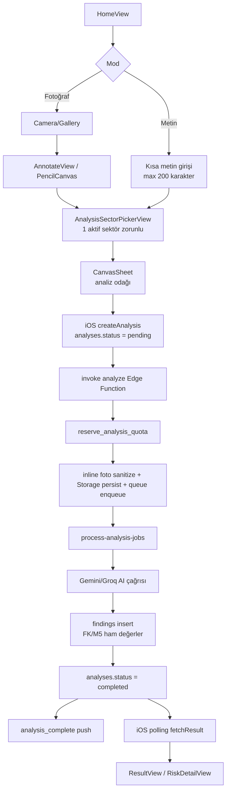
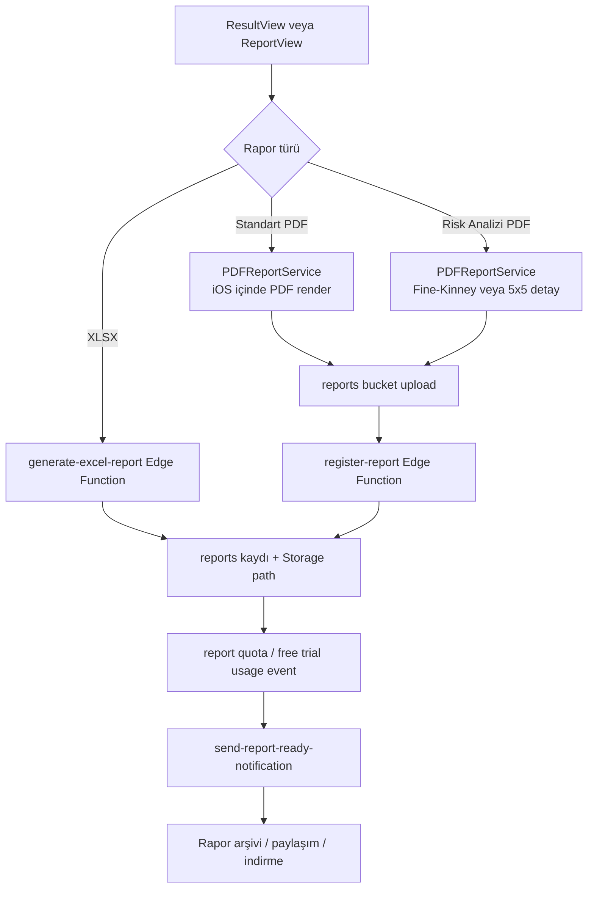
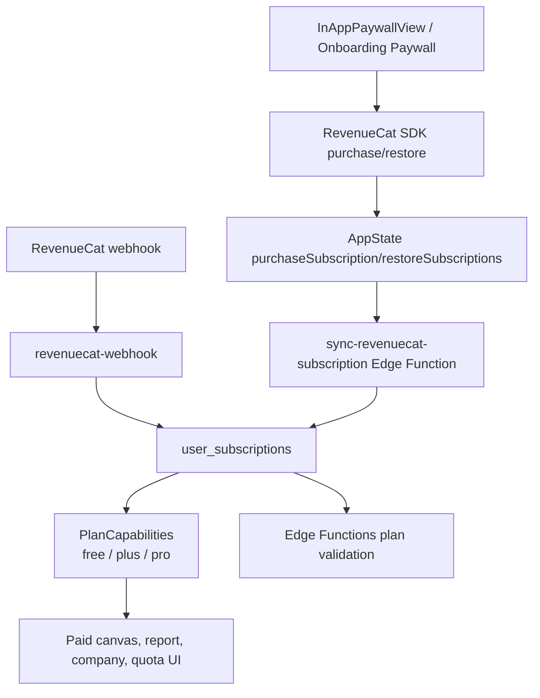

# RiskDetected Proje Bağlamı

Hazırlanma tarihi: 2026-06-22  
Repo: `/Users/keremkayalar/Documents/Kerem-APPler/RiskDetected`  
Aktif branch: `codex/worktree-cleanup`  
Aktif commit: `851fa84` - `Document App Review submission for build 62`  
Amaç: Yeni Codex/Cursor oturumları, teknik ekip ve ürün planlama için tek dosyalık proje hafızası.

## 1. Yönetici Özeti

RiskDetected, iPhone için geliştirilmiş SwiftUI tabanlı bir İSG risk analizi uygulamasıdır. Kullanıcı saha fotoğrafı veya kısa metin girer; sistem Türkiye İSG bağlamında AI destekli tehlike/uygunsuzluk analizi üretir, Fine-Kinney ve 5x5 L-Tipi Matris risk skorlaması uygular, sonuçları uygulama içinde gösterir ve PDF/XLSX rapor çıktısı oluşturur.

Ürün canlıdır. App Store sayfası 2026-06-22 itibarıyla `RiskDetected: İSG Risk Analizi` için public sürümü `1.1.1` olarak göstermektedir. Lokal Xcode ayarlarında uygulama `MARKETING_VERSION = 1.1.1`, `CURRENT_PROJECT_VERSION = 62`, bundle id `com.riskdetected.app`, deployment target `iOS 16.0`, hedef cihaz ailesi `iPhone` olarak duruyor.

Ana hedef kullanıcı bireysel İSG uzmanı, OSGB profesyoneli, işveren vekili veya saha güvenliği sürecinden sorumlu kişidir. Kurumsal/multi-tenant OSGB paneli ana iOS MVP'nin içinde değildir; repo içinde web admin/dashboard için ayrı migration ve brief hazırlığı vardır.

## 2. Ürün Kapsamı

### Ürünün yaptığı işler

- Fotoğraf veya metin ile İSG risk analizi başlatma.
- Analizden önce tek bir aktif analiz sektörü seçtirme.
- Analiz odağı/canvas seçimi: genel, KKD, elektrik, yangın, yüksekte çalışma, hareketli ekipman, mevzuat, ortam ölçümü, makine, premium odaklar vb.
- AI çıktısını Fine-Kinney ve 5x5 risk metodu ile normalize etme.
- Bulguları önem sırasına göre gösterme.
- Standart PDF raporu ve risk analizi PDF/XLSX çıktısı üretme.
- Rapor arşivi, indirme, paylaşma ve silme.
- Plus/Pro kullanıcılar için firma takibi ve firma bazlı analiz/rapor.
- Profil, tercih, dark mode, yasal metinler, veri dışa aktarma/silme.
- Mesleki ilerleme, rozet, MDP, haftalık takip ve yetkinlik haritası.
- Push bildirimleri: analiz tamamlandı, rapor hazır, hesap/abonelik güncellemeleri, trial reminder.

### MVP dışı / ayrı epic

- Tam web admin dashboard.
- Kurumsal çoklu kullanıcı/çoklu şirket tenant yapısı.
- İngilizce uygulama ve rapor lokalizasyonu.
- Gelişmiş Apple Ads raw attribution backend entegrasyonu.

## 3. Güncel Aşama

| Alan | Durum |
| --- | --- |
| App Store | Public sayfada `1.1.1` canlı görünüyor. |
| Lokal iOS kaynak | `1.1.1 (62)` kaynak durumu aktif. |
| İlk onaylı release | `1.0 (60)` App Store onayı: 2026-06-11. |
| Build 61 | `1.1 (61)` dil metadata ve UI/bugfix release hattı. |
| Build 62 | `1.1.1 (62)` Apple Ads/RevenueCat attribution ve stabilite release hattı. |
| Backend | Production Supabase projesi kullanılıyor: `ppcrzemgiztzcgddbins`. |
| AI akışı | Async queue + worker mimarisi canlı kodda mevcut. |
| Abonelik | RevenueCat + Supabase backend doğrulaması source-of-truth. |
| Admin dashboard | Migration/brief var, iOS MVP'den ayrı iş paketi. |
| Worktree notu | Bu dosya eklenmeden önce `TODO_NEXT_2026-05-25.md` modified, `supabase/migrations/20260616120110_skip_usage_tombstones_during_auth_delete.sql` untracked görünüyordu. |

## 4. Teknoloji Stack'i

### iOS

- SwiftUI, Swift 5.
- Minimum iOS: 16.0.
- Bundle id: `com.riskdetected.app`.
- SPM paketleri:
  - `supabase-swift` `2.24.0+`
  - `GoogleSignIn-iOS` `9.0.0+`
  - `RevenueCat/purchases-ios-spm` `5.0.0+`
  - `RevenueCatUI`
  - `SnapshotPreviews` `0.15.0+` test/snapshot için.
- App capability:
  - Sign in with Apple.
  - APNs push notifications.
- Privacy manifest:
  - `NSPrivacyTracking = false`.
  - UserDefaults accessed API reason `CA92.1`.

### Backend

- Supabase Auth, Postgres, Storage, Edge Functions.
- RLS tabanlı kullanıcı izolasyonu.
- Edge Functions: Deno/TypeScript.
- Queue: PGMQ tabanlı `analysis_jobs`, `process-analysis-jobs` worker.
- Cron/Vault kullanımı: retention cleanup, trial reminder, worker/secret bazlı backend işler.
- Service-role key sadece Edge Function/server ortamında; iOS client'a girmez.

### AI

- Ana provider: Google Gemini API.
- Fallback: Groq compatible chat completions.
- Üretimde plan bazlı ayrım:
  - Free legacy route: free Gemini pool, retryable hata sonrası Groq free fallback.
  - Free standard paid trial route: paid Gemini pool ile Plus kalitesinde standart analiz; paid pool retryable hata verirse free Gemini/Groq continuity fallback.
  - Plus/Pro: paid Gemini pool, retryable hata sonrası Plus/Pro Groq continuity fallback.
- Prompt dili ve çıktı dili şu an Türkçe.
- AI skor hesaplamaz; ham Fine-Kinney/5x5 girdilerini verir, skorlar DB/generated veya app hesaplarıyla oluşur.

### Abonelik, Ödeme, Attribution

- App Store IAP ve subscription yönetimi RevenueCat ile.
- iOS RevenueCat SDK public App Store key kullanır.
- Backend source-of-truth: `user_subscriptions` ve RevenueCat webhook/sync.
- Apple Ads P0 attribution: RevenueCat-managed Apple AdServices token collection.
- ATT prompt, IDFA, AdSupport framework yok.

### E-posta, Bildirim, Legal

- Resend: hoş geldin e-postası ve e-posta template altyapısı.
- APNs: cihaz token registry + Edge Function push gönderimi.
- Legal dokümanlar:
  - Bundle içindeki Markdown belgeleri.
  - Website `https://riskdetected.com/legal-documents/` manifest.
  - Supabase `legal-documents` bucket fallback.
  - Hash ve boyut kontrolüyle remote refresh.

## 5. Yüksek Seviye Mimari



## 6. Ana Kullanıcı Akışları

### 6.1 App açılış, onboarding ve auth



### 6.2 Fotoğraf/metin analizi



### 6.3 Rapor üretimi



### 6.4 Abonelik ve entitlement doğrulama



## 7. Planlar ve Kotalar

Kod/migration kaynak önceliğine göre güncel limitler:

| Özellik | Free | Plus | Pro |
| --- | --- | --- | --- |
| Standart analiz | 1/gün | 10/gün | 40/gün |
| Detaylı analiz | Yok | 2/gün | 10/gün |
| Standart rapor | 1/gün | 150/ay | 750/ay |
| Risk analizi tablosu/PDF/XLSX | 1 kez trial | Var | Var |
| Firma takibi | Yok | 5 firma | 25 firma |
| Çoklu/premium canvas | Kısıtlı | Plus canvas | Plus + Pro canvas |
| AI kalite route | Free paid trial veya free legacy | Paid plan | Paid plan |

Notlar:

- Free standart analiz route'u env flag ile `paid_trial` veya `free_legacy` olabilir. Güncel kod default olarak `paid_trial` davranışını seçer.
- Backend paid capability kararında iOS client'a güvenmez; `user_subscriptions` ve DB fonksiyonları source-of-truth olur.
- Free kullanıcı paid trial route'ta kalite olarak Plus seviyesinde analiz alabilir, ama gerçek plan/kota Free kalır.

## 8. AI ve Risk Metodolojisi

### Fine-Kinney

- Formül: `R = Olasılık x Frekans x Şiddet`
- Olasılık değerleri: `0.2`, `0.5`, `1`, `3`, `6`, `10`
- Frekans değerleri: `0.5`, `1`, `2`, `3`, `6`, `10`
- Şiddet değerleri: `1`, `3`, `7`, `15`, `40`, `100`
- DB'de `fk_score` generated column; Edge Function insert etmez.

### 5x5 L-Tipi Matris

- Formül: `R = Olasılık x Şiddet`
- Olasılık: `1...5`
- Şiddet: `1...5`
- DB'de `m5_score` generated column; Edge Function insert etmez.

### Prompt sözleşmesi

- Ana prompt 12 katmanlı saha taraması yapar: zemin/düzen, KKD, yüksekte çalışma, elektrik, makine/ekipman, kaldırma/istif, kimyasal, yangın/patlama, fiziksel ortam, ergonomi, özel işler, acil durum/işaretleme/yetkinlik.
- Her bulguda iki ayrı önlem zorunlu:
  - Düzeltici önlem.
  - Önleyici kontrol.
- Confidence `<0.30` bulgu döndürülmemeli.
- Text mode'da kullanıcı girdisi rapora alıntılanmaz; nesnel saha diliyle yeniden yazılır.
- Free çıktıda `references` ve `root_cause` kapalıdır.
- Plus kısa referans/kök neden, Pro daha kapsamlı referans/kök neden ister.

## 9. Aktif Analiz Sektörü

İki farklı sektör kavramı vardır:

| Kavram | Anlam |
| --- | --- |
| Onboarding sektörleri | Kullanıcının profil sinyali; çoklu seçim. |
| Aktif analiz sektörü | Her analiz için zorunlu tek sektör; prompt ve rapor metadata'sına girer. |

Aktif analiz sektörleri:

`general`, `construction`, `manufacturing`, `mining`, `energy`, `office`, `logistics_warehouse`, `chemical_laboratory`, `healthcare`, `food_production`, `agriculture_livestock`, `retail`, `municipal_field_services`, `education`, `hospitality`

Client -> Edge payload:

```json
{
  "analysis_sector": "construction",
  "analysis_sector_source": "user_selected",
  "analysis_sector_prompt_version": "active-sector-v1"
}
```

Backend dosyası: `supabase/functions/analyze/sector-context.ts`  
iOS model dosyası: `App/Models/AnalysisSector.swift`

## 10. Veri Modeli Özeti

### Çekirdek tablolar

- `profiles`: auth user genişletmesi, profil, plan, avatar/logo ve tercih alanları.
- `analyses`: her analiz kaydı; status, mode, sector, AI summary, skor özetleri, raw audit.
- `photos`: analiz fotoğrafları ve metadata.
- `findings`: analiz bulguları, risk ham girdileri, generated skorlar, önlemler, referans/kök neden.
- `reports`: PDF/XLSX arşivi, metadata, storage path, firma snapshot.
- `report_counters`: doküman numarası üretimi.
- `audit_logs`: önemli aksiyon audit geçmişi.

### Abonelik ve kullanım

- `user_subscriptions`: RevenueCat/Supabase plan durumu.
- `subscription_events`: RevenueCat webhook eventleri.
- `usage_events`: analiz/rapor quota ledger'ı.
- `paywall_events`: paywall funnel ve satın alma eventleri.
- `ai_usage_logs`: provider, model, token, context hash, route, key alias, support id.

### Firma, onboarding, legal, destek

- `companies`: Plus/Pro firma takibi.
- `user_onboarding_answers`: onboarding profil sinyalleri.
- `consents` ve legal acknowledgement alanları: KVKK, rıza, koşullar, gizlilik.
- `support_requests`: uygulama içi destek talepleri.
- `account_deletion_requests`: hesap silme akışı.

### Bildirim ve ilerleme

- `push_device_tokens`
- `notification_preferences`
- `notification_events`
- `professional_progress_profiles`
- `professional_progress_events`
- `professional_progress_finding_classifications`
- `professional_progress_competency_stats`
- `professional_progress_badges`
- `professional_progress_messages`
- `professional_progress_weekly_summaries`

### Admin dashboard hazırlığı

11 Haziran 2026 migration seti admin kullanıcıları, audit, dashboard series, model pricing, alerts, queue metrics, segmentation, cohort retention, exports ve findings analytics için altyapı ekler. Bu kısım iOS MVP runtime'ından ayrı tutulmalıdır.

## 11. Supabase Edge Functions

| Function | Rol |
| --- | --- |
| `analyze` | Analiz enqueue + worker-mode AI orchestration. |
| `process-analysis-jobs` | `analysis_jobs` kuyruğunu drain eder. |
| `generate-excel-report` | XLSX risk analizi raporu üretir. |
| `register-report` | iOS'ta üretilen PDF için reports metadata kaydı yazar. |
| `send-report-ready-notification` | Rapor hazır push tetikler. |
| `send-push-notification` | APNs gönderim merkezi. |
| `revenuecat-webhook` | RevenueCat eventlerini işler. |
| `sync-revenuecat-subscription` | Client sonrası backend subscription reconcile. |
| `send-welcome-email` | İlk üyelik hoş geldin e-postası. |
| `send-trial-reminder-notifications` | Plus yearly trial reminder. |
| `support-contact` | Destek mesajı kaydı/gönderimi. |
| `request-account-deletion` | Kullanıcı JWT'siyle hesap silme talebi. |
| `account-deletion-complete` | Backend account deletion worker. |
| `retention-cleanup` | Retention policy cleanup. |

Security notları:

- `analyze` gateway seviyesinde `verify_jwt = false`; function içinde kullanıcı JWT'si veya service-role worker invocation doğrulanır.
- Worker/admin functions service-role veya özel secret bekler.
- RLS client tarafı için açık, service-role server tarafı için kontrollü kullanılır.
- Supabase TLS için iOS'ta certificate pinning açık.

## 12. Storage Buckets

- `photos`: analiz fotoğrafları.
- `reports`: PDF/XLSX arşiv dosyaları.
- `logos`: profil/firma logoları.
- `avatars`: profil fotoğrafları.
- `legal-documents`: legal manifest ve Markdown belgeleri.

Fotoğraf analizlerinde client doğrudan Storage upload'a bağımlı değildir. iOS fotoğrafı sıkıştırır/base64 gönderir; Edge Function boyut/tip doğrular, metadata strip eder, service-role ile `photos` bucket'a yazar ve `photos` tablosuna metadata ekler.

## 13. iOS Modül Haritası

### Entry ve state

- `App/RiskDetectedApp.swift`: `@main`, root object'ler, URL callback, notification configure.
- `App/AppState.swift`: flow, auth, subscription, theme/language, tab routing, notification routing.
- `App/RootView.swift`: splash/onboarding/auth/main switch, legal banner/sheet.
- `App/Views/Home/MainTabView.swift`: ana tab shell.

### Servisler

- `SupabaseService`: tek Supabase client, pinned URLSession.
- `AuthService`: Email OTP, Apple, Google, profile, sign-out, avatar/logo.
- `AnalysisService`: analiz, polling, rapor arşivi, quota, data export/delete, account deletion request.
- `SubscriptionManager`: RevenueCat configure, offerings, purchase, restore, Apple Ads AdServices token collection.
- `NotificationService`: APNs permission, token save, preferences, notification routing.
- `CompanyService`: firma CRUD, logo upload.
- `PDFReportService`: PDF üretimi.
- `LegalDocumentService` / `LegalAcceptanceService`: legal doküman refresh ve kabul kayıtları.
- `PaywallEventService`: paywall funnel telemetry.
- `SupportService`: destek akışı.
- `WelcomeEmailService`: welcome email trigger.
- `ProfessionalProgressService`: MDP, rozet ve haftalık ilerleme.

### Görünümler

- Onboarding: `App/Views/Onboarding/V2/**`
- Auth: `App/Views/Auth/AuthView.swift`
- Home: `App/Views/Home/HomeView.swift`, `CanvasSheet.swift`
- Sector picker: `App/Views/Analysis/AnalysisSectorPickerView.swift`
- Analyze waiting: `App/Views/Analyzing/AnalyzingView.swift`
- Annotation: `App/Views/Annotate/**`
- Result: `App/Views/Result/**`
- History: `App/Views/History/**`
- Report: `App/Views/Report/ReportView.swift`
- Profile: `App/Views/Profile/**`
- Paywall: `App/Views/Paywall/**`
- Shared components: `App/Views/Components/**`

## 14. Altyapı Tercihleri ve Gerekçeleri

- Supabase seçimi: Auth + Postgres + Storage + Edge Functions tek platformda; RLS ile kullanıcı verisi izolasyonu.
- Edge Function AI orchestration: AI secret'ları client'a çıkmaz, plan/kota server tarafında doğrulanır.
- Async queue: analiz uygulama kapansa bile backend'de devam edebilir; iOS polling + push ile sonuç alır.
- RevenueCat source-of-truth bridge: App Store receipt/entitlement karmaşıklığı client yerine RevenueCat + backend tablosu üzerinden yönetilir.
- PGMQ/cron/vault: worker, trial reminder, retention cleanup gibi güvenilir backend işler için.
- PDF iOS'ta, XLSX backend'de: PDF native paylaşım/önizleme deneyimine yakın; XLSX server tarafında daha kontrollü.
- Active sector zorunluluğu: AI prompt'un sektörel bağlamı varsaymasını azaltır, rapor metadata'sını güçlendirir.
- Legal remote manifest: App Store sonrası legal metin güncellemelerini app update beklemeden gösterebilmek için.
- Certificate pinning: Supabase bağlantısında transport güvenliğini güçlendirmek için.
- Apple Ads P0 RevenueCat attribution: özel backend attribution karmaşıklığını erteleyip ilk kampanya ölçümünü hızlı başlatmak için.

## 15. Güvenlik ve KVKK Notları

- Client'ta service-role key yoktur.
- Supabase publishable key ve RevenueCat public SDK key client-side kullanım için tasarlanmıştır.
- RLS ana güvenlik sınırıdır; kullanıcı kendi kayıtlarını görür.
- Account deletion app içinden başlatılır, backend worker auth user ve ilişkili verileri temizler.
- Photos/reports/logos/avatars bucket path'leri kullanıcı id tabanlıdır.
- Raw AI response içinde input audit vardır; kullanıcı görselleri/metinleri cache'e alınmamalı.
- Future Gemini explicit cache düşünülürse sadece statik metodoloji/prompt/checklist blokları cache'e girmeli; kullanıcı fotoğrafı, metni, firma verisi, profil verisi cache'e girmemeli.
- App Privacy manifest tracking kapalıdır; Apple Ads için ATT/IDFA kullanılmaz.

## 16. Test ve Operasyon

### Test alanları

- `RiskDetectedUITests/RiskDetectedUITests.swift`: UI test akışları.
- `RiskDetectedSnapshotTests`: snapshot preview altyapısı.
- `supabase/functions/**/*_test.ts`: Deno unit testleri.
- `scripts/run_ui_tests.sh`: UI test runner.
- `scripts/run_snapshot_previews.sh`: snapshot preview üretimi.
- `scripts/apple_ads_attribution_preflight.mjs`: AdServices/RevenueCat attribution statik preflight.
- `scripts/app_review_preflight_collect.mjs`: App Review preflight evidence.
- `scripts/release_staging_guard.mjs`: release guard.
- `scripts/qa_*.mjs` arşiv altında: canlı QA senaryoları.

### Son bilinen doğrulamalar

- Build 62 checkpoint: `node scripts/apple_ads_attribution_preflight.mjs` sonucu `15 pass, 0 fail, 2 manual gate`.
- Build 62 checkpoint: XcodeBuildMCP simulator build succeeded.
- Aktif sektör Deno testleri geçmiş dokümana göre `sector-context_test.ts` 6/6 geçti.
- App Store public sayfası 2026-06-22 itibarıyla `1.1.1` canlı sürümü gösteriyor.

## 17. Açık İşler ve Riskler

- Apple Ads canlı kampanya doğrulaması: RevenueCat Charts'ta source/campaign/ad group/keyword ve trial/purchase/revenue kırılımı görülmeden bütçe büyütülmemeli.
- Admin dashboard: DB migration/brief var; frontend ve erişim modeli ayrı epic olarak ele alınmalı.
- İngilizce lokalizasyon: yalnız `Localizable.strings` işi değil; UI, backend prompt, rapor, e-posta, legal, push ve test assertion'ları birlikte ele alınmalı.
- Account deletion fallback UX: worker fail durumunda App Review riskini azaltacak deterministik kullanıcı mesajı/akış tekrar değerlendirilmeli.
- Rapor arşivi sektör filtresi geçmiş handoff'ta planlıydı; mevcut kapsamda tamamlandığı doğrulanmadan done sayılmamalı.
- App Store rating prompt geçmiş backlog'da planlı.
- `supabase/migrations/20260616120110_skip_usage_tombstones_during_auth_delete.sql` bu doküman yazılırken untracked görünüyor; gerçekten üretim düzeltmesiyse review + commit edilmeli.

## 18. Kaynak Dosyalar

Bu doküman hazırlanırken ana kaynaklar:

- `PROJECT_HANDOFF.md`
- `NEW_CHAT_HANDOFF_2026-05-25.md`
- `TODO_NEXT_2026-05-25.md`
- `docs/CODEX_HANDOFF_ACTIVE_ANALYSIS_SECTOR_AND_PROJECT_STATUS_2026-06-12.md`
- `docs/RISKDETECTED_PROJECT_DEEP_DIVE_FOR_ENGLISH_LOCALIZATION_2026-06-12.md`
- `docs/APP_STORE_APPROVAL_1.0_BUILD_60_2026-06-11.md`
- `docs/APP_REVIEW_BUILD_61_CHECKPOINT_2026-06-13.md`
- `docs/APP_REVIEW_BUILD_62_CHECKPOINT_2026-06-15.md`
- `docs/APPLE_ADS_REVENUECAT_ATTRIBUTION_RUNBOOK_2026-06-15.md`
- `App/**`
- `supabase/functions/**`
- `supabase/migrations/**`
- `RiskDetected.xcodeproj/project.pbxproj`
- Apple App Store public page/search result for `RiskDetected: İSG Risk Analizi`, app id `6769498181`: `https://apps.apple.com/tr/app/riskdetected-i-sg-risk-analizi/id6769498181`

## 19. Hızlı Başlangıç Notu

Yeni oturumda proje üzerinde çalışırken önerilen ilk komutlar:

```bash
cd /Users/keremkayalar/Documents/Kerem-APPler/RiskDetected
git status --short --branch
git log -5 --oneline --decorate
rg --files App supabase docs | sed -n '1,120p'
```

Kod değişikliği yaparken:

- Önce ilgili view/service/model dosyasını okuyun.
- Supabase işlerinde migration + function + iOS client contract'ını birlikte kontrol edin.
- Plan/kota/abonelik kararlarında client state'e değil backend source-of-truth'a güvenin.
- Mevcut dirty worktree değişikliklerini geri almayın; kullanıcı veya önceki agent değişikliği olabilir.
