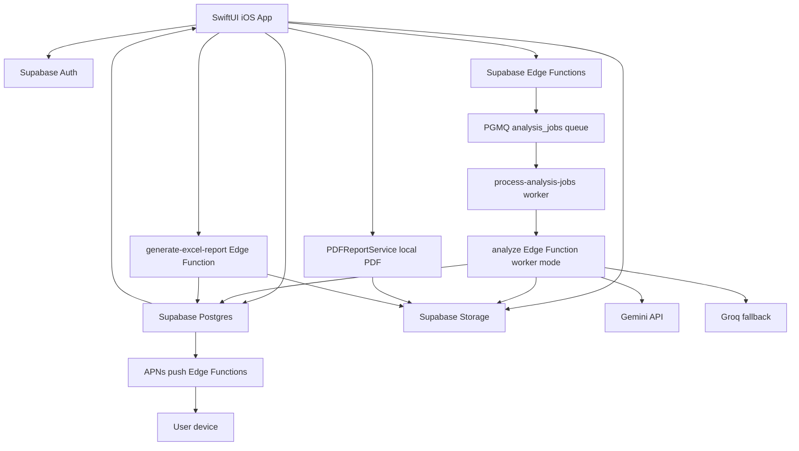

# RiskDetected Project Deep Dive

Hazirlanma tarihi: 2026-06-12
Hazirlayan: Codex
Repo yolu: `/Users/keremkayalar/Documents/Kerem-APPler/RiskDetected`
Kullanim amaci: Bu dosya Cursor'a veya yeni bir Codex oturumuna verilerek RiskDetected sistemine Ingilizce dil destegi ekleme calismasina baslangic dokumani olarak kullanilabilir.

## 1. Kapsam ve Okuma Notlari

Bu rapor aktif proje dosyalari, aktif handoff dokumanlari, git gecmisi, worktree durumu, iOS uygulama kodu, Supabase migration/Edge Function kodu, testler ve operasyon scriptleri incelenerek hazirlandi.

Kapsam disi birakilanlar:

- `docs/archive/qa-history/**`: Kullanici talebiyle arsivlenmis QA dosyalari incelenmedi ve rapora detay olarak alinmadi.
- `output/**`: Generated App Review, screenshot, snapshot, imagegen ve preflight ciktisi runtime mimarisi sayilmadi.
- `backups/**`: Gitignore ile dislanan yedekler runtime source-of-truth sayilmadi.
- Secret degerleri: Bu raporda gercek token/sifre/API key degerleri bilerek yazilmadi. Sadece secret adlari, saklandiklari yerler ve kullanim yollari listelendi.

Incelenen ana kaynaklar:

- Root handoff/status dosyalari: `PROJECT_HANDOFF.md`, `NEW_CHAT_HANDOFF_2026-05-25.md`, `PROJECT_STATUS_AND_NEXT_2026-05-12.md`, `IMPLEMENTATION_PLAN.md`, `TODO_NEXT_2026-05-25.md`, `WORKTREE_COMMITS_2026-05-25.md`, `AUTH_SETUP.md`, `AUTH_LIVE_VERIFICATION_2026-05-12.md`, `PROMPT_SYSTEM_REVAMP_PLAN_2026-05-11.md`.
- App Review ve onay belgeleri: `docs/APP_REVIEW_BUILD_57_CHECKPOINT_2026-06-07.md`, `docs/APP_REVIEW_BUILD_60_CHECKPOINT_2026-06-10.md`, `docs/APP_STORE_APPROVAL_1.0_BUILD_60_2026-06-11.md`, `docs/AppReview_5.1.1v_Legal_Web_Metinleri_2026-06-10.md`.
- Web admin brief: `docs/RISKDETECTED_WEB_ADMIN_DASHBOARD_BRIEF_2026-06-11.md`.
- iOS app: `App/**`, `Config/RiskDetectedInfo.plist`, `RiskDetected.xcodeproj/**`, `RiskDetectedUITests/**`, `RiskDetectedSnapshotTests/**`.
- Backend: `supabase/config.toml`, `supabase/migrations/**`, `supabase/functions/**`, `supabase/templates/**`.
- Operasyon: `scripts/**`, `.gitignore`, `.gitmodules`.

## 2. Executive Summary

RiskDetected, iOS icin yazilmis SwiftUI tabanli bir Is Sagligi ve Guvenligi asistanidir. Uygulama saha fotografi veya metin girdisi alir, Turkiye ISG baglaminda AI destekli risk analizi uretir, bulgulara Fine-Kinney ve 5x5 risk skorlamasi uygular, PDF/XLSX rapor uretebilir, raporlari arsivler, firma bazli analiz yapabilir ve kullanicinin mesleki ilerleme/profil surecini takip eder.

MVP hedef kullanicisi bireysel ISG uzmanidir. Kurumsal OSGB/multi-tenant platform ana app MVP kapsaminda degildir; buna karsilik repo icinde ayri web admin/dashboard icin brief ve yeni admin migration seti vardir.

Sistemin ana omurgasi:

- Frontend/runtime: SwiftUI iOS app.
- Backend: Supabase Auth, Postgres, Storage, Edge Functions, RLS, cron ve PGMQ tabanli queue.
- AI: Gemini-first Edge Function mimarisi, Groq fallback, plan bazli free/paid key pool ayrimi.
- Abonelik: RevenueCat SDK + Supabase backend subscription source-of-truth.
- Raporlama: iOS tarafinda PDF, Supabase Edge Function tarafinda XLSX.
- Bildirim: APNs token kaydi + Supabase Edge Function push gonderimi.
- Legal/KVKK: bundle legal dokumanlari, website/Supabase legal manifest refresh, consent/acknowledgement audit.

Ingilizce dil destegi acisindan kritik sonuc:

Mevcut uygulama sadece Turkceyi birinci sinif destekliyor. `RDLocalization` yapisi var, fakat kapsami rapor ayarlarindaki az sayida anahtarla sinirli ve `RDLanguage.supportedCases = [.turkish]`. UI metinlerinin buyuk kismi, PDF/XLSX sabitleri, AI promptlari, e-posta template'leri, legal dokumanlar, notification copy'leri ve test assertion'lari dogrudan Turkce yazilmis. Bu nedenle Ingilizce ekleme isi sadece `Localizable.strings` ekleme isi degil; iOS UI, backend AI output language contract, rapor motorlari, email/legal/push ve testler birlikte ele alinmali.

## 3. Git, Worktree ve Release Durumu

Aktif worktree:

- Path: `/Users/keremkayalar/Documents/Kerem-APPler/RiskDetected`
- Branch: `codex/worktree-cleanup`
- HEAD: `68363ec7b351b7644929b03a512773f5812644cd`
- HEAD commit: `Document App Store approval for build 60`
- Remote: `origin https://github.com/KeremDev/RiskDetected.git`
- Tek aktif git worktree gorunuyor.

Onayli App Store kaynak noktasi:

- App Store onayi: Version `1.0`, build `60`, onay tarihi `2026-06-11 23:10 Europe/Istanbul`.
- Approved source commit: `76ddd7184af707a10b6b2b541e1ea8c6661f1154`.
- Tag: `app-store-approved-1.0-build-60-2026-06-11`.
- App Review submission tag: `app-review-build-60-2026-06-10`.
- Restore branches: `codex/app-store-approved-1.0-build-60`, `codex/app-review-build-60`.

Son git akisi:

- `76ddd71`: App Review 5.1.1(v) hesabi uygulama icinden silme ve legal sync fixleri.
- `ac74b9b`, `b3e6038`, `e7b4680`: Build 60 checkpoint/restore ref dokumantasyonu.
- `68363ec`: Build 60 App Store onay dokumani.

Dirty worktree durumu:

- Modified: `Config/RiskDetectedInfo.plist`, `RiskDetected.xcodeproj/project.pbxproj`, `supabase/config.toml`.
- Untracked: `docs/RISKDETECTED_WEB_ADMIN_DASHBOARD_BRIEF_2026-06-11.md`, `output/**`, `supabase/migrations/20260611120000_admin_*.sql` seti.

Dirty diff anlamlari:

- `Config/RiskDetectedInfo.plist`: plist key siralamasi degismis; `CFBundleVersion`, RD public config keyleri ve `UIFileSharingEnabled` ayni semantiklerle duruyor gibi gorunuyor.
- `RiskDetected.xcodeproj/project.pbxproj`: `developmentRegion` `en` yerine `tr` yapilmis, `knownRegions` sirasi degismis. Ingilizce localization eklenirken bu ayar tekrar dikkatle ele alinmali.
- `supabase/config.toml`: local `site_url` localhost'tan `https://riskdetected.com`'a alinmis, admin dashboard redirect URL'leri eklenmis.
- `supabase/migrations/20260611120000-121400_admin_*.sql`: web admin/dashboard altyapisi icin yeni admin migration seti, henuz git tracked degil.

Submodule:

- `.agents/aso-skills` submodule olarak `https://github.com/eronred/aso-skills.git` adresine bagli. Runtime uygulama parcasi degil; ASO/App Store calisma araci.

## 4. Urun Ne Yapiyor?

RiskDetected kullanici yolculugu:

1. Kullanici onboardingden gecer.
2. Supabase Auth ile e-posta OTP, Apple veya Google ile giris yapar.
3. Saha fotografi ceker/yukler veya kisa metinle risk baglami girer.
4. Analiz odagi/canvas secer.
5. iOS app `analyses` satiri olusturur ve `analyze` Edge Function'a is gonderir.
6. Backend kuyruga alir, worker Gemini/Groq AI cagrisini yapar.
7. AI bulgulari normalize edilir, Fine-Kinney ve 5x5 skor girdileri DB'ye yazilir.
8. DB generated column/trigger/fonksiyonlari skor ve band bilgilerini hesaplar.
9. iOS poll ederek sonucu alir ve result screen'de gosterir.
10. Kullanici standart PDF veya Pro/deneme hakki ile risk analizi PDF/XLSX uretir.
11. Rapor metadata'si `reports` tablosuna, dosyalar `reports` storage bucket'ina yazilir.
12. Kullanici rapor arsivinden arama, filtre, paylasma, silme yapabilir.
13. Plus/Pro kullanicilar firma bazli analiz/rapor ve ek canvas ozelliklerini kullanabilir.
14. Mesleki ilerleme sistemi analiz/rapor/bulgu eventlerinden MDP, rozet ve yetkinlik istatistikleri uretir.

Ana hedef:

- ISG uzmaninin sahada riskleri hizlica tespit etmesi.
- Uygunsuzluklari skorlu ve aksiyonlanabilir hale getirmesi.
- Denetime hazir PDF/XLSX cikti uretmesi.
- Kullanicinin rapor/analiz gecmisini ve mesleki ilerlemesini tutmasi.

Hedeflenen dil ve mevzuat:

- Mevcut sistem Turkiye ISG baglamina ve Turkce rapor diline gore tasarlanmis.
- AI promptlari 6331, risk degerlendirmesi, KKD, is ekipmanlari, isaretler, acil durumlar, yapi isleri, is hijyeni ve patlayici ortamlar gibi Turkiye mevzuat basliklarini merkeze aliyor.

## 5. Planlar, Kotalar ve Kriterler

Plan yapisi `free`, `plus`, `pro`.

Kod ve backendde guncel limitlerin ana hali:

| Ozellik | Free | Plus | Pro |
| --- | --- | --- | --- |
| Standart analiz/gun | 1 | 10 | 40 |
| Detayli analiz/gun | Yok | 2 | 10 |
| Rapor/ay | 3 | 150 | 750 |
| Firma takibi | Yok | 5 firma | 25 firma |
| Paid canvas | Yok | Plus canvas'lari | Plus + Pro canvas'lari |
| Risk analizi PDF | Tek seferlik trial hakki | Var | Var |
| XLSX risk analizi | Paid ozellik | Var | Var |

Not: Eski handoff ve eski migration yorumlarinda retention/limitler icin farkli degerler gorulebiliyor. Ingilizce calismasinda kaynak onceligi su olmali: guncel Swift/Edge Function kodu + en son migration seti + App Store onayli commit dokumani.

Risk skorlama kriterleri:

- Fine-Kinney ham girdileri:
  - Olasilik: `0.2`, `0.5`, `1`, `3`, `6`, `10`
  - Frekans: `0.5`, `1`, `2`, `3`, `6`, `10`
  - Siddet: `1`, `3`, `7`, `15`, `40`, `100`
  - Skor: Olasilik * Frekans * Siddet.
  - Band: `<70 low`, `<200 medium`, `<400 high`, `>=400 critical`.
- 5x5 ham girdileri:
  - Probability: `1...5`
  - Severity: `1...5`
  - Skor: probability * severity.
  - Band: `<=4 low`, `<=9 medium`, `<=16 high`, `>=17 critical`.

AI kalite kriterleri:

- Sadece gorunen/ifade edilen kanita dayali bulgu uret.
- Confidence `<0.30` olan bulguyu dondurme.
- Confidence `<0.50` ise saha dogrulama tonunu kullan.
- Her bulgu icin iki ayri onlem zorunlu: duzeltici onlem + onleyici kontrol.
- FK/M5 skorlarini AI hesaplamaz; ham girdileri verir, sistem hesaplar.
- Text mode'da kullanici metni rapora alinti olarak tasinmaz; `text-report-language.ts` bunu ek olarak sanitize eder.

## 6. End-to-End Mimari

Core contract:

- iOS client public Supabase publishable key ile Supabase'e baglanir.
- Kullanici JWT'si Auth sonrasi Supabase SDK tarafindan tasinir.
- `verify_jwt = true` Edge Functions normal kullanici JWT'si ister.
- `analyze` ve bazi worker/admin fonksiyonlari `verify_jwt = false` olsa da kendi icinde JWT veya service-role kontrolu yapar.
- Service-role key iOS client'a hic girmez; sadece Edge Function secret ortaminda kullanilir.

## 7. iOS App Modul Haritasi

### 7.1 Entry, State ve Root Flow

Ana dosyalar:

- `App/RiskDetectedApp.swift`
- `App/AppState.swift`
- `App/RootView.swift`
- `App/Views/Home/MainTabView.swift`

`RiskDetectedApp`:

- `@main` entry point.
- `AppState`, `NetworkMonitor`, `NotificationService` olusturur.
- Google ve Supabase auth callback URL'lerini handle eder.
- Theme preference'i root seviyede uygular.

`AppState`:

- App flow: splash, onboarding, auth, main.
- Aktif tab, theme preference, language preference, profile, subscription state ve notification routing'i tutar.
- UserDefaults keyleri:
  - `rd.onboarding.completed`
  - `rd.theme.darkModeEnabled`
  - `rd.theme.preference`
  - `rd.language.preference`
- `languagePreference` simdilik sadece Turkceye normalize edilir.
- Auth session degisince legal acceptance, notification token sync, RevenueCat identify, onboarding answers sync, plan refresh ve welcome email tetikler.
- Subscription purchase/restore sonrasi RevenueCat local sonucu backend `user_subscriptions` ile dogrulanmadan paid capability kalici kabul edilmez.

`RootView`:

- App flow'a gore `SplashScreen`, `OnboardingViewV2`, `AuthView`, `MainTabView` gosterir.
- Offline banner, legal update banner/sheet ve legal decision flowlarini yonetir.
- Scene active oldukca legal dokuman refresh calisir.

### 7.2 Design System

Ana dosyalar:

- `App/DesignSystem/RDColor.swift`
- `App/DesignSystem/RDFont.swift`
- `App/DesignSystem/RDFontScale.swift`
- `App/DesignSystem/RDSpacing.swift`
- `App/DesignSystem/RDShadow.swift`
- `App/Views/Components/RDButton.swift`
- `App/Views/Components/RDCard.swift`
- `App/Views/Components/RDChip.swift`
- `App/Views/Components/RDTabBar.swift`
- `App/Views/Components/RDUpgradeCTA.swift`

Stil:

- Modern SwiftUI, yesil/siyah/beyaz agirlikli RiskDetected marka dili.
- App-wide font scale son commitlerde yumusatildi.
- Dark mode var, Profile preferences ile seciliyor.
- Kart ve component abstraction'lari mevcut, ama cok sayida view icinde dogrudan Turkce string ve yerel stil de var.

### 7.3 Auth

Ana dosyalar:

- `App/Views/Auth/AuthView.swift`
- `App/Services/AuthService.swift`
- `App/Services/SupabaseService.swift`
- `App/Services/AppleSignInService.swift`
- `App/Services/GoogleSignInService.swift`
- `Config/RiskDetectedInfo.plist`
- `AUTH_SETUP.md`

Desteklenen auth:

- Email OTP.
- Apple Sign In.
- Native Google Sign-In.

Kaldirilan/paused auth:

- Firebase/phone auth MVP'den kaldirilmis.

Supabase callback:

- iOS deep link: `io.supabase.riskdetected://login-callback`.
- `SupabaseService` callback scheme/host/path uyumunu kontrol eder.

Fresh install davranisi:

- `AuthService` iOS Keychain'de kalabilen stale Supabase session durumunu tespit edip temizleyebilir.

Profile bootstrap:

- Auth sonrasinda `profiles` satiri yoksa default free profile olusturulur.
- Profil logo upload: `logos/<userID>/profile-logo.jpg`.
- Avatar upload: `avatars/<userID>/avatar.jpg`.

### 7.4 Onboarding V2

Ana dosyalar:

- `App/Views/Onboarding/V2/**`
- `App/Models/OnboardingAnswers.swift`
- `App/Services/OnboardingAnswersService.swift`
- `supabase/migrations/20260520083317_add_onboarding_answers.sql`

Akis:

1. Splash
2. Pain point
3. Certificate
4. Hazard class
5. Sector
6. Frequency
7. Loading
8. Personal plan
9. Auth
10. Trial invite
11. Notification permission
12. Timeline paywall

Onboarding cevaplari:

- Certificate class: A/B/C/doctor/otherHealth gibi.
- Hazard classes: critical/high/low.
- Sectors: construction/manufacturing/energy/mining/office/other.
- Audit frequency.
- Selected plan.
- Local draft tutulur, auth sonrasi RPC `upsert_onboarding_v2_answers` ile DB'ye yazilir.

AI etkisi:

- `analyze` Edge Function onboarding cevaplarini prompt context olarak kullanir.
- Bu context tarama prosedurunu atlatmaz; sadece ton, oncelik ve aciklama derinligini etkiler.

### 7.5 Home, Analysis Input ve Canvas

Ana dosyalar:

- `App/Views/Home/HomeView.swift`
- `App/Views/Home/CanvasSheet.swift`
- `App/Views/Annotate/AnnotateView.swift`
- `App/Views/Analyzing/AnalyzingView.swift`
- `App/Services/AnalysisService.swift`
- `App/Models/AnalysisCanvas.swift`

Home ozellikleri:

- Fotograf cek/yukle.
- Metin analizi.
- Annotation.
- Odak/canvas secimi.
- Kota kartlari.
- Recent analyses/reports.

Text input:

- Minimum 10 karakter, maksimum 200 karakter.
- Text mode'da AI output'u sanitize edilir, kullanici metni rapora aynen tasinmaz.

Fotograf input:

- Client tarafinda orientation normalize edilir.
- EXIF/metadata temizlenir.
- Face blur Vision ile uygulanir.
- JPEG quality/downscale loop ile boyut sinirlari uygulanir.
- Storage RLS karmasikligi nedeniyle inline base64 Edge Function'a gonderilir; Edge Function service-role ile temiz fotografi Storage'a yazar.

Canvas listesi:

- `general`
- `ppe`
- `machine` Plus
- `warning_signs`
- `electrical`
- `sector` Plus
- `fire`
- `ergonomics` Pro, UI'da "Ozel Ekipman"
- `environment_measurement` Plus
- `explosion`
- `environment`
- `legislation` Pro
- `working_at_height`
- `mobile_equipment`
- `general_premium` Pro
- `construction_machinery`

Free kullanici tek canvas secebilir. Paid kullanici coklu canvas secebilir. DB'deki `analyses.canvas` ana alan olarak ilk/sorted canvas'i tasir; `raw_ai_response._input_audit.selected_canvas_ids` tum secimi tutar.

### 7.6 AnalysisService

Ana dosya: `App/Services/AnalysisService.swift`

Sorumluluklar:

- Analysis row insert.
- Photo/text validation.
- Inline photo hazirlama.
- `analyze` Edge Function invoke.
- Queued result polling.
- Completed bundle fetch.
- Report upload/register.
- Excel generation invoke.
- Report download/share/delete.
- Analysis delete.
- Export user data.
- Bulk delete reports/analyses.
- Account deletion request.
- Quota/support error normalization.

Onemli davranislar:

- `runPhotoAnalysis` ve `runTextAnalysis` pending analysis row olusturur.
- `invokeAnalyze` body alanlari: `analysis_id`, `canvas`, `canvases`, `analysis_mode`, `text_input`, `request_id`, `support_id`, `company_id`, `photo_paths`, `photo_base64_parts`.
- HTTP 429/500/502/503/504 gibi transient hatalarda sinirli retry vardir.
- `waitForCompletedResult` yaklasik 300 saniye deadline ve 2 saniye polling ile calisir.
- `storeReport` PDF'i `reports/<user>/<analysis>/<safeName>.pdf` altina yukler, `register-report` ile metadata yazar, metadata basarisizsa orphan file temizlemeye calisir.
- `generateExcelReport` iOS'tan `report_language` gonderir; backend XLSX fonksiyonu su anda bu alanla gercek lokalizasyon yapmiyor.

### 7.7 Result ve Report UI

Ana dosyalar:

- `App/Views/Result/ResultView.swift`
- `App/Views/Result/RiskDetailView.swift`
- `App/Views/Report/ReportView.swift`
- `App/Services/PDFReportService.swift`

Result screen:

- Analiz ozetini, risk skorlarini, risk band dagilimini ve finding kartlarini gosterir.
- Method switch: Fine-Kinney / 5x5.
- Rapor olusturma sheet'i.
- Firma backfill ve company logo/default alanlari.
- Free risk analysis trial kartlari.
- Paid/Pro locked preview kartlari.

Report screen:

- Stored reports listesi.
- Search, format/kind/company filter.
- Analiz kaynagindan rapor olusturma.
- PDF preview/share/delete.
- XLSX generation.
- Load more pagination.

PDF:

- iOS tarafinda `PDFReportService` ile local uretilir.
- `PDFReportOptions.language` var, ama gercek lokalizasyon cok sinirli.
- Standart PDF ve risk analysis PDF olmak uzere iki kind.
- Risk analysis PDF Fine-Kinney veya 5x5 referans sayfasi + tablo sayfalari uretir.
- Bir cok sabit metin dogrudan Turkcedir: "Sayfa", "Uygunsuzluk Ozeti", "Tehlikeli durum / davranis", "Onlem / kontrol tedbirleri", "Mevzuat", "Termin" vb.

XLSX:

- Backend `supabase/functions/generate-excel-report/index.ts` uretir.
- `report_language` request body iOS'ta var, ama backend `RequestBody` tipinde yok ve dosyada dil switch'i yok.
- Date format `tr-TR`, sheet adlari ve tum label'lar Turkce.
- Company logo private `logos` bucket'tan owner prefix kontrolu ile embed edilir.

### 7.8 Profile, Settings, Support ve Account Deletion

Ana dosyalar:

- `App/Views/Profile/ProfileView.swift`
- `App/Views/Profile/SupportContactSheet.swift`
- `App/Services/SupportService.swift`
- `App/Services/CompanyService.swift`
- `App/Services/LegalAcceptanceService.swift`
- `App/Services/LegalDocumentService.swift`

Profile:

- User hero/profile.
- Professional progress section.
- Account rows.
- Firmalarim.
- Notifications.
- Preferences: theme + language.
- Legal/data/support.
- Subscription management.
- Account deletion.

Language preference UI:

- "Dil" secimi var.
- Subtitle: uygulama metinleri simdilik Turkce kalir.
- `RDLanguagePreference.supportedCases` sadece Turkce oldugu icin pratikte dil degismez.

Support:

- `SupportService` `support-contact` Edge Function'a subject/message/attachments gonderir.
- Attachments base64 olarak gider.
- Function tarafinda Resend ile mail ve `support_requests` kaydi kullanilir.

Account deletion:

- App Review 5.1.1(v) icin kritik akistir.
- Profile'da "Hesabimi sil / Delete Account" butonu vardir.
- `AnalysisService.requestAccountDeletion` -> `request-account-deletion` Edge Function.
- `request-account-deletion` kullanici JWT'sini dogrular, `account_deletion_requests` kaydi olusturur veya acik kaydi kullanir, sonra service-role ile `account-deletion-complete` worker'ini cagirir.
- `account-deletion-complete` sadece service-role Authorization veya `ACCOUNT_DELETION_ADMIN_SECRET` ile calisir.
- Silinen storage bucket prefixleri: `photos`, `reports`, `logos`, `avatars`.
- Sonrasinda `supabase.auth.admin.deleteUser(targetUserID)` cagrilir.
- App'e service-role key donmez.

### 7.9 Notifications

Ana dosya: `App/Services/NotificationService.swift`

Ozellikler:

- APNs permission flow.
- Device token save: `push_device_tokens`.
- Preferences: `notification_preferences`.
- Progress weekly/monthly/milestone preferences.
- Notification tap routing:
  - `report_ready` veya destination `reports` -> Reports tab.
  - `account_updates` veya `progress_*` veya destination `profile` -> Profile tab.
  - analysis id varsa history/detail routing.

Backend:

- `send-push-notification`.
- `send-report-ready-notification`.
- `send-welcome-email` ve analysis complete push cagrilari `analyze`/worker tarafindan tetiklenebilir.

### 7.10 Professional Progress

Ana dosyalar:

- `App/Features/ProfessionalProgress/ProfessionalProgressService.swift`
- `App/Features/ProfessionalProgress/ProfessionalProgressModels.swift`
- `App/Features/ProfessionalProgress/*View.swift`
- `supabase/migrations/20260526093512_professional_progress_module.sql`
- `supabase/migrations/20260526161530_professional_progress_economy_v2.sql`
- `supabase/migrations/20260526163303_professional_progress_weekly_tracking.sql`

Ozellikler:

- MDP puani.
- Unvanlar: Aday Uzman, Saha Gozlemcisi, Risk Avcisi, Tehlike Analisti, Kidemli Risk Uzmani, Guvenlik Stratejisti, Usta ISG Uzmani.
- Yetkinlikler: yangin, kimyasal, elektrik, mekanik, ergonomi, psikososyal, yuksekte calisma, KKD, maden, insaat, fabrika.
- Badges, messages, weekly summaries.
- Service `professional_progress_profiles`, `competency_stats`, `badges`, `messages`, `weekly_summaries` tablolarini paralel fetch eder.
- Feature flag: `RDConfig.Features.professionalProgressEnabled = true`.

### 7.11 Legal Documents

Ana dosyalar:

- `App/LegalDocuments/*.md`
- `Legal/*.md`
- `App/Services/LegalDocumentService.swift`
- `App/Services/LegalAcceptanceService.swift`
- `docs/AppReview_5.1.1v_Legal_Web_Metinleri_2026-06-10.md`

Legal document kinds:

- KVKK.
- Acik riza.
- Kullanim kosullari.
- Gizlilik politikasi.

Versiyonlar:

- `kvkk-2026-06-10`
- `terms-2026-06-10`
- `consent-2026-06-10`
- `privacy-2026-06-10`

Remote refresh:

- Once website: `https://riskdetected.com/legal-documents/manifest.json`.
- Sonra Supabase bucket fallback: `legal-documents/manifest.json`.
- Manifest locale su anda `tr` bekleniyor.
- Path guvenligi: `tr/` prefix, `.md` suffix, `..` ve absolute path yok.
- Hash dogrulamasi var.
- Max document bytes: 262144.

Legal update UX:

- Info update: banner.
- Material terms veya explicit consent: decision sheet.
- Acknowledgement audit: `legal_document_acknowledgements`.

## 8. Supabase Backend

### 8.1 Config

Ana dosya: `supabase/config.toml`

Project:

- `project_id = ppcrzemgiztzcgddbins`
- Auth site URL: `https://riskdetected.com`
- iOS redirect: `io.supabase.riskdetected://login-callback`
- Admin dashboard redirect URL'leri production ve localhost icin ekli.
- JWT expiry: 3600 saniye.
- Refresh token rotation aktif.
- Email signup ve confirmation aktif.
- OTP length: 6.
- OTP expiry: 3600.
- Max email frequency: 1 dakika.
- TOTP MFA enroll/verify aktif.
- Apple ve Google external provider aktif.

Function JWT config:

| Function | verify_jwt | Not |
| --- | --- | --- |
| `analyze` | false | Kendi JWT/service-role worker kontrolu var. |
| `process-analysis-jobs` | false | Worker secret/service-role ile korunur. |
| `account-deletion-complete` | false | Service-role veya admin secret ister. |
| `retention-cleanup` | false | Cleanup secret ister. |
| `send-push-notification` | false | Service-role/APNs secrets gerekir. |
| `revenuecat-webhook` | false | Webhook authorization secret ister. |
| `support-contact` | true | User JWT gerekir. |
| `send-welcome-email` | true | User JWT gerekir. |
| `generate-excel-report` | true | User JWT gerekir. |
| `register-report` | true | User JWT gerekir. |
| `sync-revenuecat-subscription` | true | User JWT gerekir. |
| `send-report-ready-notification` | true | User JWT gerekir. |
| `request-account-deletion` | true | User JWT gerekir. |

### 8.2 Core Schema

Ana migrations:

- `20260503075828_01_extensions_and_enums.sql`
- `20260503075849_02_profiles.sql`
- `20260503075909_03_analyses_and_photos.sql`
- `20260503075933_04_findings.sql`
- `20260503075950_05_reports_and_audit.sql`
- `20260503080015_06_row_level_security.sql`
- `20260503080033_07_storage_buckets.sql`
- `20260503080049_08_quota_check_function.sql`

Onemli enumlar:

- `risk_level`: `critical`, `high`, `medium`, `low`, `unknown`.
- `risk_method`: `fine_kinney`, `matrix_5x5`.
- `analysis_status`: baslangicta `pending`, `analyzing`, `completed`, `failed`; sonradan queue alanlari/queued semantigi eklenmis.
- `analysis_kind`: `photo`, `text`.
- `subscription_tier`: `free`, `plus`, `pro`.

Core tablolar:

- `profiles`: auth user uzantisi, ad/soyad, unvan, sertifika, firma, logo, telefon, tier, preferred method, welcome email vb.
- `analyses`: analiz metadata, kind, canvas, status, mode, AI summary, total scores, highest bands, finding count, worker telemetry, raw AI response.
- `photos`: analysis photo metadata, storage path, size, mime, annotation, retention.
- `findings`: bulgu basligi, kategori, aciklama, aksiyon, references, confidence, FK/M5 ham girdileri, generated skorlar/bandler, root cause, recommended measures.
- `reports`: PDF/XLSX metadata, storage path, kind, format, method, document no, company snapshot, request/support id.
- `audit_logs`: ilk audit altyapisi.

### 8.3 Subscription, Quota ve Usage

Ana tablolar:

- `user_subscriptions`
- `subscription_events`
- `usage_events`
- `paywall_events`

Onemli migrations:

- `20260513101505_free_plus_pro_subscription_system.sql`
- `20260513154427_fix_subscription_quota_atomicity.sql`
- `20260513192631_free_daily_standard_analysis_limit.sql`
- `20260515160758_adjust_plus_pro_plan_limits.sql`
- `20260528021100_free_risk_analysis_trial.sql`
- `20260528062613_free_risk_analysis_trial_bypasses_monthly_quota.sql`
- `20260528065454_free_standard_report_quota_excludes_risk_trial.sql`
- `20260528072213_free_standard_report_daily_quota.sql`
- `20260606130000_durable_usage_events_for_deleted_content.sql`
- `20260606133000_free_quota_counts_prior_paid_usage.sql`

Kritik karar:

- Backend subscription state tek guvenilir kaynak sayilir.
- Client RevenueCat sonucunu gorur ama backend `user_subscriptions` sync/dogrulama olmadan paid entitlement kalici kabul edilmez.
- `usage_events` silinen content sonrasi kota gecmisini korumak icin durable hale getirildi.

### 8.4 Companies

Ana migration:

- `20260520154818_add_companies.sql`
- `20260520184832_grant_company_limit_for_rls.sql`
- `20260521202017_relax_company_select_policy.sql`
- `20260527212739_add_company_v2_fields.sql`

Tablo: `companies`

Alanlar:

- `user_id`
- `name`
- `hazard_class`: low/medium/high
- `logo_path`
- `is_archived`
- `address`
- `contact_person`
- `department`
- `default_responsible`
- `default_due_days`

Davranis:

- Free planda company ozelligi yok.
- Plus limit 5, Pro limit 25.
- Delete yerine archive.
- Aktif firma adinda user bazli unique constraint.
- Analyses/reports company_id owner triggerleri var.

### 8.5 Storage Buckets

Bucket'lar:

- `photos`: private, analiz fotograflari.
- `reports`: private, PDF/XLSX raporlari.
- `logos`: private, profil/firma logolari.
- `avatars`: private, profil avatarlar.
- `legal-documents`: public, legal manifest ve markdown dokumanlari.

RLS mantigi:

- Private bucket path'lerinin ilk folder'i user id olmalidir.
- Policy'ler owner prefix'e gore select/insert/update/delete sinirlar.
- Legal bucket public ama policy daraltilmis: manifest/json/md/plain, guvenli path.

Retention:

- Eski dokumanlarda Free 30/Pro 365 gun gibi notlar var.
- Guncel UI copy ve Profile tarafinda Free 7 gun, Plus 30 gun, Pro kullanici silene/hesap aktif kaldikca gibi bir anlatim bulunuyor.
- `retention-cleanup` Edge Function + cron var; gercek kaynak icin son migration ve function birlikte kontrol edilmeli.

### 8.6 Edge Functions

Functions listesi:

- `analyze`
- `process-analysis-jobs`
- `register-report`
- `generate-excel-report`
- `send-report-ready-notification`
- `send-welcome-email`
- `support-contact`
- `sync-revenuecat-subscription`
- `revenuecat-webhook`
- `request-account-deletion`
- `account-deletion-complete`
- `retention-cleanup`
- `send-push-notification`

Shared helper'lar:

- `_shared/text-report-language.ts`
- `_shared/revenuecat-event.ts`
- `_shared/revenuecat-owner-guard.ts`
- `_shared/subscription-tier.ts`

### 8.7 Analyze Edge Function

Ana dosya: `supabase/functions/analyze/index.ts`

Yaklasik boyut: 3540 satir.

Giris body:

- `analysis_id`
- `canvas`
- `canvases`
- `analysis_mode`
- `text_input`
- `company_id`
- `request_id`
- `support_id`
- `photo_paths`
- `photo_base64_parts`

Modlar:

- `standard`
- `detailed`
- `emergency`
- `procedure`

AI modelleri:

- Free legacy: Gemini free key/model pool.
- Paid/Plus/Pro: isolated paid Gemini key pool.
- Free standard trial route: varsayilan `paid_trial`; Free standart analiz Plus kalite tier ile paid pool'dan gecebilir.
- Groq fallback free ve paid icin ayri env ile kullanilabilir.

Telemetry:

- `user_plan`
- `quality_tier`
- `ai_execution_route`: `free_legacy`, `free_paid_trial`, `paid_plan`
- `prompt_version`
- `personalization_version`
- `context_hash`
- `api_key_alias`
- `fallback_source`
- token counts, cached/thoughts/total tokens
- support/request ID

Queue:

- Client invoke worker degilse once quota reserve edilir.
- `enqueueAnalysisJob` ile `analysis_jobs` queue'ya is koyulur.
- `process-analysis-jobs` tetiklenir.
- Worker mode body `__worker = true` ve service-role Authorization ile ayni function'i isler.

Company/onboarding context:

- `user_onboarding_answers` okunur.
- Paid user company_id gonderirse owner/archived kontrolu yapilir.
- Context AI promptuna eklenir ama kanita gore bulgu uretme kurali korunur.

Output:

- AI JSON schema: `hazards`, `ai_summary`, opsiyonel `limitations`.
- Hazard fields: `title`, `category`, `observed_evidence`, `description`, `corrective_action`, `preventive_control`, `confidence`, FK/M5 inputs.
- Plus/Pro: `references`, `root_cause`.
- Finding rows insert edilir; generated skorlar insert edilmez.

Kritik lokalizasyon noktasi:

- Core prompt su anda "Tum metin degerleri Turkce" diye zorunlu kural koyuyor.
- JSON key'leri Ingilizce kalir.
- Ingilizce destek icin sadece UI degil, `analyze` request body'ye `output_language`/`report_language` benzeri guvenilir bir alan ve prompt/schema/sanitize/fallback sozlesmesi eklenmeli.

### 8.8 Text Report Sanitizer

Ana dosya: `supabase/functions/_shared/text-report-language.ts`

Amac:

- Text analysis'te kullanicinin ham metnini rapora aynen tasimayi engellemek.
- "metinde", "kullanici", "ifadesi", quoted text, user n-gram ve numerik token tekrarlarini yakalamak.
- Risk bulgusu alanlarini fallback saha diliyle temizlemek.

Kritik lokalizasyon noktasi:

- Yasak kelime listesi ve fallback'ler Turkce.
- Ingilizce text mode icin ayrica English forbidden source-attribution phrases ve fallback cümleleri gerekir.

### 8.9 Excel Report Function

Ana dosya: `supabase/functions/generate-excel-report/index.ts`

Ozellikler:

- Authenticated user kendi completed analysis'i icin XLSX risk analysis workbook uretir.
- Dosya private `reports` bucket'a yazilir.
- `reports` metadata'si kaydedilir.
- Report ready push tetiklenebilir.
- Company logo indirip workbook'a embed eder.
- Monthly report limit: Free 3, Plus 150, Pro 750.

Kritik lokalizasyon noktasi:

- `RequestBody` icinde `report_language` yok.
- `Intl.DateTimeFormat("tr-TR")` kullaniliyor.
- Sheet title, column, method reference, risk labels, action labels tamamen Turkce.
- iOS `AnalysisService.generateExcelReport` `report_language` gonderse de backend bunu fiilen kullanmiyor.

### 8.10 RevenueCat

Ana dosyalar:

- `App/Services/SubscriptionManager.swift`
- `supabase/functions/revenuecat-webhook/index.ts`
- `supabase/functions/sync-revenuecat-subscription/index.ts`
- `_shared/revenuecat-*`

Product mapping:

- Plus monthly/yearly.
- Pro monthly/yearly.

Backend source-of-truth:

- RevenueCat webhook state `user_subscriptions` ve `subscription_events` tablolarina yansir.
- Client fallback sync `sync-revenuecat-subscription` RevenueCat REST API'den subscriber state ceker.
- Owner guard:
  - `original_app_user_id` mismatch kontrolu.
  - Aktif baska account subscription conflict kontrolu.
  - Plus'tan Pro'ya sessiz upgrade, fallback sync path'inde engellenir; upgrade explicit purchase/webhook ile gelmeli.

### 8.11 Email

Dosyalar:

- `supabase/templates/email-otp-confirmation.html`
- `supabase/templates/email-otp-magic-link.html`
- `supabase/functions/send-welcome-email/index.ts`
- `supabase/functions/send-welcome-email/template.ts`
- `supabase/functions/support-contact/index.ts`

Durum:

- OTP email template'leri Turkce ve `html lang="tr"`.
- Welcome email subject/body Turkce.
- Support delivery Resend kullanir.

Kritik lokalizasyon noktasi:

- Supabase Auth email template'leri ve Resend welcome/support copy'leri dil bazli ayrilmali.
- Auth OTP template'i kullanicinin tercih edilen dilini bilmeyebilir; ilk versiyon icin bilingual veya locale-aware Supabase template stratejisi gerekli.

## 9. Prompt Sistemi

Kaynaklar:

- `supabase/functions/analyze/index.ts`
- `PROMPT_SYSTEM_REVAMP_PLAN_2026-05-11.md`
- `NEW_CHAT_HANDOFF_2026-05-25.md`

Mevcut prompt yapisi:

- `CORE_ANALYSIS_PROMPT`: Turkce, 20 yillik saha deneyimli A sinifi ISG uzmani persona.
- 12 katmanli saha tarama proseduru:
  1. Zemin, saha duzeni, duzen-tertip.
  2. Calisanlar ve KKD.
  3. Yuksekte calisma.
  4. Elektrik ve enerji.
  5. Makine, ekipman ve is ekipmani.
  6. Kaldirma, tasima ve istifleme.
  7. Kimyasal ve tehlikeli madde.
  8. Yangin ve patlama.
  9. Fiziksel ortam etkenleri.
  10. Ergonomi ve elle tasima.
  11. Kazi, kapali alan ve ozel isler.
  12. Cevre, acil durum, isaretleme ve yetkinlik.
- Oncelik: olumcul potansiyel, sonra yuksek frekans, sonra mevzuat ihlalleri.
- Fine-Kinney ve 5x5 severity kalibrasyonu.
- Output JSON, key'ler Ingilizce, value'lar Turkce.
- Her finding icin iki onlem zorunlu.

Canvas focus promptlari:

- `CANVAS_FOCUS` map'i `analyze/index.ts` icinde.
- UI `AnalysisCanvas.swift` ile backend `CANVAS_FOCUS` senkron kalmali.
- Plus/Pro unlock mantigi hem client hem backendde var.

Prompt version:

- `PROMPT_VERSION = isg-photo-text-report-language-v2026-06-06-twelve-layer-two-measures`
- `PERSONALIZATION_VERSION = onboarding-v1`

Plan bazli prompt farklari:

- Free: references/root_cause yok; 10-13 civari bulgu.
- Plus: 12-16 bulgu, kisa references ve root cause.
- Pro: 12-16 bulgu, daha tam references ve teknik root cause.
- Free standard paid trial route quality tier'i Plus gibi davranabilir.

Ingilizce destek icin prompt gereksinimleri:

- Output language parametresi backend tarafinda dogrulanmali.
- Turk mevzuat baglami korunacaksa Ingilizce raporda mevzuat adlari nasil cevrilecek karar verilmeli.
- JSON schema key'leri ayni kalabilir; value'lar dil bazli olmalidir.
- Fallback/sanitize metinleri dil bazli olmalidir.
- `raw_ai_response._input_audit` icindeki prompt/context hassas oldugu icin admin ve privacy notlari korunmali.

## 10. Secret, Token ve Sifre Mimarisi

Bu bolumde gercek secret degerleri yoktur.

### 10.1 Client Public Config

Dosyalar:

- `App/Services/RDConfig.swift`
- `Config/RiskDetectedInfo.plist`
- `RiskDetected.xcodeproj/project.pbxproj`

Client tarafinda bulunanlar:

- Supabase URL.
- Supabase publishable key.
- RevenueCat public SDK key.
- RevenueCat offering identifier.
- Google iOS/web client id ve reversed URL scheme.

Bu degerler public client config olarak kullaniliyor. `RDConfig.swift` yorumlari explicit olarak service-role key'in client'ta olmadigini belirtiyor. Supabase guvenligi RLS + user JWT uzerinde kuruludur.

Kullanim:

- `SupabaseService` SupabaseClient'i public URL + publishable key ile kurar.
- Auth sonrasi kullanici JWT'si Supabase SDK tarafindan kullanilir.
- RevenueCat SDK public key ile configure edilir; subscription truth backend sync ile dogrulanir.

### 10.2 Server/Edge Function Secrets

Bu secretlar Supabase Edge Function environment/secrets olarak saklanmalidir, repo veya iOS client icinde olmamalidir.

Genel Supabase:

- `SUPABASE_URL`
- `SUPABASE_SERVICE_ROLE_KEY`

AI:

- `GEMINI_API_KEY_PRIMARY`
- `GEMINI_API_KEY`
- `GEMINI_API_KEY_SECONDARY`
- `GEMINI_API_KEY_TERTIARY`
- `GEMINI_FREE_PREFERRED_KEY_ALIAS`
- `GEMINI_PREFERRED_KEY_ALIAS`
- `GEMINI_API_KEY_PAID`
- `GEMINI_PAID_API_KEY`
- `GEMINI_API_KEY_PAID_SECONDARY`
- `GEMINI_PAID_PREFERRED_KEY_ALIAS`
- `GROQ_API_KEY_FREE`
- `GROQ_API_KEY`
- `GROQ_FREE_MODEL`
- `GROQ_API_KEY_PLUS_PRO`
- `GROQ_API_KEY_PAID`
- `GROQ_PLUS_PRO_MODEL`
- `GROQ_PAID_MODEL`
- `FREE_STANDARD_ANALYSIS_AI_ROUTE`
- `PROCESS_ANALYSIS_JOBS_SECRET`
- Test-only: `RISKDETECTED_ENABLE_TEST_SIMULATION`, `SIMULATE_AI_ERROR_CODE`, `SIMULATE_AI_ERROR_ONCE`

APNs:

- `APNS_KEY_ID`
- `APNS_TEAM_ID`
- `APNS_BUNDLE_ID`
- `APNS_PRIVATE_KEY`
- `APNS_ENV`

Email/support:

- `RESEND_API_KEY`
- `RESEND_FROM_EMAIL`
- `RESEND_REPLY_TO_EMAIL`
- `SUPPORT_TO_EMAIL`

RevenueCat:

- `REVENUECAT_WEBHOOK_AUTHORIZATION`
- `REVENUECAT_REST_API_KEY`
- `REVENUECAT_PUBLIC_API_KEY` fallback/public use

Account deletion / retention:

- `ACCOUNT_DELETION_ADMIN_SECRET`
- `RETENTION_CLEANUP_SECRET`

Kullanim notlari:

- `SUPABASE_SERVICE_ROLE_KEY` RLS'i bypass eder; sadece server/Edge Function tarafinda kullanilmali.
- `analyze` worker mode service-role Authorization ile calisir.
- `account-deletion-complete` service-role Authorization veya `x-account-deletion-secret` ister.
- `retention-cleanup` cleanup secret ister.
- `revenuecat-webhook` webhook authorization secret ile dogrulanir.

### 10.3 Local Ops Secrets

Dosyalar:

- `scripts/rd_ops_env.mjs`
- `scripts/rd_store_secret.sh`
- `scripts/cleanup_revenuecat_test_users.mjs`
- `scripts/analyze_readiness_check.mjs`

macOS Keychain service adlari:

- `riskdetected_supabase_access_token`
- `riskdetected_supabase_db_password`
- `riskdetected_revenuecat_rest_api_key`

Kullanim:

- `scripts/rd_store_secret.sh <service>` secret'i macOS Keychain'e yazar.
- `node scripts/rd_ops_env.mjs status` Keychain'de var/yok kontrol eder, deger basmaz.
- `node scripts/rd_ops_env.mjs supabase <args...>` Supabase CLI icin `SUPABASE_ACCESS_TOKEN` ve `SUPABASE_DB_PASSWORD` env'lerini process'e inject eder.
- `node scripts/rd_ops_env.mjs revenuecat-delete-user <app_user_id>` RevenueCat REST API key'i Keychain'den okur.

Gitignore:

- `*.env`, `.env*.local`, `*.p8`, `AuthKey_*.p8`, `App/GoogleService-Info.plist`, backups ve generated output ignore edilir.

### 10.4 Apple Client Secret Script

Dosya:

- `scripts/generate_apple_client_secret.mjs`

Amac:

- Apple OAuth/service client secret uretimi icin p8 private key path'i ve Apple team/key/client bilgilerini kullanir.
- `.p8` dosyalari gitignore kapsamindadir.

## 11. Admin Dashboard Durumu

Aktif dokuman:

- `docs/RISKDETECTED_WEB_ADMIN_DASHBOARD_BRIEF_2026-06-11.md`

Amac:

- iOS app'e dokunmadan, mevcut Supabase verisi ustunden guvenli web admin/dashboard tasarlamak.
- Ilk surum read-only oneriliyor.
- Service-role/secret browser'a asla gitmemeli.
- Admin auth normal kullanici auth'undan ayri kontrol edilmeli.

Untracked admin migration seti:

- `admin_users`
- `admin_audit_logs`
- `admin_saved_filters`
- `admin_dashboard_daily_series`
- `model_pricing_catalog`
- `admin_subscription_inconsistency_scan`
- `admin_notes`
- `admin_data_quality_scan`
- `admin_alert_rules`
- `admin_alert_events`
- `admin_pgmq_queue_metrics`
- `admin_pgmq_queue_messages`
- `admin_user_segments_summary`
- `admin_user_segments_list`
- `admin_cohort_summary`
- `admin_cohort_retention_matrix`
- `admin_exports`
- `admin_findings_analytics`
- `admin_rate_limit_events`

Bu katman iOS runtime'dan ayridir ama Ingilizce calismasinda onemlidir; cunku admin tarafinda da UI, filtreler, export basliklari ve audit metinleri lokalizasyon ihtiyaci dogurabilir.

## 12. Test, QA ve Operasyon Scriptleri

Aktif UI test dosyasi:

- `RiskDetectedUITests/RiskDetectedUITests.swift`

UI test kapsamindan ornekler:

- Free tier Plus purchase CTA.
- Onboarding personal plan/auth flow.
- Trial invite ve timeline paywall.
- Onboarding tum soru ekranlari.
- Main tabs/Profile/Dark mode.
- In-app paywall Plus/Pro.
- Company picker/add/edit/archive.
- Report archive search/filter/delete.
- Report creation from archive analysis.
- Notification settings sheet.
- Free risk analysis trial.
- Profile account deletion copy.
- Device integrity warning.
- Supabase pinned connection probe.

Kritik lokalizasyon noktasi:

- UI test assertion'larinin buyuk kismi Turkce metinlere dogrudan bagli.
- Ingilizce destek sonrasi testler locale-aware olmali veya accessibility id agirlikli hale getirilmeli.

Snapshot:

- `RiskDetectedSnapshotTests/RiskDetectedSnapshotTests.swift`
- SnapshotPreviews ile `InAppPaywallView`, `AnalyzingView`.
- Ingilizce icin snapshot setleri iki dilde genisletilmeli.

Backend testleri:

- `_shared/text-report-language_test.ts`
- `send-welcome-email/template_test.ts`
- `_shared/revenuecat-event_test.ts`
- `_shared/revenuecat-owner-guard_test.ts`
- `_shared/subscription-tier_test.ts`

Operasyon scriptleri:

- `scripts/analyze_readiness_check.mjs`: Supabase function/config/secrets readiness kontrolu.
- `scripts/app_review_preflight_collect.mjs`: App Review preflight evidence ve guard checks.
- `scripts/release_staging_guard.mjs`: staged/worktree forbidden generated/sensitive file kontrolu.
- `scripts/verify_supabase_pins.sh`: live Supabase cert chain pin match kontrolu.
- `scripts/run_snapshot_previews.sh`: snapshot previews.
- `scripts/purchase_error_classifier_tests/main.swift`: purchase error classifier unit-style CLI test.
- `scripts/cleanup_revenuecat_test_users.mjs`: test kullanicilarini temizleme.

## 13. Lokalizasyon / Ingilizce Destegi Hazirlik Analizi

### 13.1 Mevcut Dil Altyapisi

Dosya:

- `App/Services/RDLocalization.swift`

Mevcut durum:

- `RDLanguage` sadece `.turkish = "tr"`.
- `supportedCases = [.turkish]`.
- `title = "Turkce"`.
- `subtitle = "Uygulama metinleri Turkce kalir."`.
- `RDLocalizedKey` sadece rapor olusturma ve PDF basliklariyla sinirli.
- `RDReportLocalization` wrapper var ama genis kullanilmiyor.

Sonuc:

- Dil altyapisi iskelet olarak var, ama app genelinde lokalizasyon kapsami yok.

### 13.2 iOS UI Lokalizasyon Durumu

Dogru yaklasim:

- Tum user-facing stringler merkezi localization sistemine alinmali.
- SwiftUI `Text("...")`, `Button("...")`, `navigationTitle("...")`, alert copy, sheet title, empty state, paywall/onboarding/metinleri taranmali.
- Accessibility labels/test IDs ayrilmali.

Yuksek riskli alanlar:

- `App/Views/Onboarding/V2/**`
- `App/Views/Paywall/InAppPaywallView.swift`
- `App/Views/Home/HomeView.swift`
- `App/Views/Home/CanvasSheet.swift`
- `App/Views/Result/ResultView.swift`
- `App/Views/Report/ReportView.swift`
- `App/Views/Profile/ProfileView.swift`
- `App/Views/Auth/AuthView.swift`
- `App/Features/ProfessionalProgress/**`
- `App/Models/AnalysisCanvas.swift`
- `App/Models/Finding.swift`
- `App/Models/UserProfile.swift`

### 13.3 Backend AI Output Language

Mevcut risk:

- AI prompt cikti degerlerini Turkce zorunlu kiliyor.
- Text sanitizer Turkce forbidden phrase listesi kullaniyor.
- AI fallback error mesajlari Turkce.
- `ai_summary`, findings title/description/action/reference/root cause DB'de dil bilgisi olmadan saklaniyor.

Gerekli kararlar:

- Analiz sonucu dili kullanici app dili mi, rapor dili mi, yoksa analiz olusturma anindaki secim mi?
- Existing historical analyses otomatik cevrilmeyecekse yeni analysis rows icin `output_language`/`language` alanina ihtiyac var mi?
- Rapor dili analysis dilinden farkli secilebilecek mi?
- Turkiye mevzuati Ingilizce raporda nasil yazilacak? Orijinal Turkce kurum/mevzuat adi korunup parantezle aciklama mi eklenecek?

Minimum teknik ekler:

- iOS `invokeAnalyze` body'ye output/report language.
- `analyses` veya `reports` tablosunda language metadata.
- `analyze` prompt builder'da language-aware system/output rules.
- `text-report-language.ts` icin tr/en sanitizer.
- AI JSON schema ayni kalabilir, value language parametreli olmali.

### 13.4 PDF/XLSX

PDF:

- Kismi `RDLocalization` kullanimi var.
- Cok sayida hardcoded Turkce label kalmis.
- `RiskLevel.label`, `RiskMethod.label`, `AnalysisCanvas.title` gibi model-level label'lar dil bazli degil.
- `formattedDate` locale aliyor ama fallback metinleri Turkce.

XLSX:

- Tamamen Turkce label/date format.
- `report_language` backendde yok sayiliyor.
- Sheet adlari, column basliklari, method reference tablolar, risk labels, notification push body Turkce.

Gerekli karar:

- PDF ve XLSX rapor dili `PDFReportOptions.language` / `report_language` ile secilecekse backend ve local PDF ayni localization kaynaklarini veya uyumlu key setini kullanmali.

### 13.5 Legal, Email, Notification, Info.plist

Legal:

- Bundle ve website legal docs Turkce.
- Manifest locale `tr`.
- Ingilizce icin `en/` legal docs, manifest, versioning ve hash gerekir.
- KVKK/Turk legal gereklilikleri Ingilizceye cevrilecekse hukuki onayli metin gerekir.

Email:

- OTP templates Turkce.
- Welcome email Turkce.
- Support mail/admin copy Turkce.

Notification:

- iOS notification UI copy Turkce.
- Backend push title/body Turkce.
- APNs payload language strategy yok.

Info.plist:

- Permission strings Turkce.
- Ingilizce icin localized InfoPlist.strings veya equivalent Xcode localization gerekir.

App Store:

- Metadata/screenshot/localized listing repo icinde ASO tooling ile takip ediliyor olabilir; runtime disi ama launch icin ayrica ele alinmali.

### 13.6 Test Stratejisi

Gerekenler:

- Locale parametreli UI tests.
- Turkce + Ingilizce smoke tests.
- Onboarding, paywall, auth, main tabs, analysis result, report generation, profile/legal/account deletion testleri iki dilde.
- PDF text extraction veya snapshot diff ile report language QA.
- XLSX sheet/cell label assertions.
- Analyze function Deno tests: tr/en output language prompt contract, sanitizer, schema.
- Email template tests: tr/en subject/body escaping.

## 14. Dosya ve Klasor Envanteri

Top-level:

- `App/`: iOS runtime source.
- `Config/`: Info.plist.
- `RiskDetected.xcodeproj/`: Xcode project.
- `supabase/`: config, migrations, functions, templates.
- `scripts/`: release, readiness, keychain, App Review, pins, test scripts.
- `docs/`: aktif release/admin/legal dokumanlari; `docs/archive/qa-history` kapsam disi.
- `HANDOFF_2026-05-11_NEW_CHAT/`: eski handoff seti.
- `Legal/`: website/legal metin mirror'i.
- `Grafikler/`: logo/gorsel kaynaklari.
- `.agents/`: ASO/app store skills ve submodule; runtime degil.
- `output/`: generated evidence/screenshots; runtime degil.
- `backups/`: gitignored backup; runtime degil.

Swift dosya yogunlugu:

- App + tests yaklasik 37k Swift satiri.
- En buyuk dosyalar:
  - `App/Views/Result/ResultView.swift`
  - `App/Views/Report/ReportView.swift`
  - `App/Views/Profile/ProfileView.swift`
  - `App/Views/Home/HomeView.swift`
  - `App/Services/AnalysisService.swift`
  - `App/Views/Paywall/InAppPaywallView.swift`
  - `App/Views/Auth/AuthView.swift`
  - `App/Services/PDFReportService.swift`

Supabase:

- Edge Functions yaklasik 11k satir.
- Migrations yaklasik 9k+ satir.
- En buyuk functionlar:
  - `analyze/index.ts`
  - `generate-excel-report/index.ts`
  - `revenuecat-webhook/index.ts`
  - `support-contact/index.ts`
  - `sync-revenuecat-subscription/index.ts`

Bagimliliklar:

- Supabase Swift 2.46.0.
- RevenueCat purchases-ios-spm 5.72.0.
- GoogleSignIn-iOS 9.1.0.
- AppAuth, Swift Crypto, App Check, SnapshotPreviews ve iliskili paketler.

Build:

- Bundle id: `com.riskdetected.app`.
- Marketing version: `1.0`.
- Current project version/build: `60`.
- App Store approved build: 60.

## 15. Kritik Riskler ve Acik Noktalar

1. Dil preference var ama gercek UI lokalizasyonu yok.
2. Xcode `developmentRegion` dirty diff ile `tr` yapilmis. Ingilizce eklenirken Base/en/tr region ayarlari bilincli duzenlenmeli.
3. `report_language` iOS'tan XLSX backend'e gonderiliyor ama backendde kullanilmiyor.
4. AI prompt cikti degerlerini Turkce zorunlu kiliyor; Ingilizce icin backend sozlesmesi degismeli.
5. Text sanitizer Turkce odakli; Ingilizce icin dogrudan uygun degil.
6. Legal remote manifest sadece `tr` kabul ediyor; `en` legal dokuman seti ve hash/version modeli yok.
7. UI tests Turkce metinlere bagli; Ingilizce geciste cok sayida test kirilir.
8. PDFReportService kismen lokalize ama buyuk olcude hardcoded Turkce.
9. Plan/retention copy'lerinde eski docs ile guncel kod arasinda celiskiler var; Ingilizce copy yazmadan once kaynak truth netlestirilmeli.
10. App icinde `.DS_Store` dosyalari gorunuyor; `.gitignore` var ama release guard ile staged/worktree temizlik kontrolu surdurulmeli.
11. Admin migration seti untracked; localization calismasina baslamadan once bunlarin merge/ignore durumu netlestirilmeli.
12. Public client key degerleri repo/build setting icinde var; bunlar server secret degil ama rapor/dokumanlarda gereksiz yere tekrar edilmemeli.

## 16. Ingilizce Entegrasyonu Icin Onerilen Baslangic Plani

Bu bolum implementation plani degil; sonraki plana zemin olacak sirali teknik kesitlerdir.

1. Dil kontratini netlestir:
   - App UI dili.
   - Analiz output dili.
   - Rapor dili.
   - Legal/email/notification dili.
   - Existing data nasil ele alinacak?

2. Localization altyapisini genislet:
   - `RDLanguage` -> `turkish`, `english`.
   - `RDLocalization` veya iOS native `String Catalog`/`Localizable.strings` karari.
   - Model label'larini dil bazli yap: canvas, risk band, method, plan capabilities, professional progress.

3. UI string audit:
   - Once onboarding/paywall/auth/profile/home/result/report.
   - Sonra components, error messages, empty states, alerts.

4. Backend AI language contract:
   - `analyze` request body'ye language.
   - Prompt builder tr/en.
   - Sanitizer tr/en.
   - Store language metadata.
   - Tests.

5. PDF/XLSX:
   - PDFReportService tum hardcoded label'lari key'lere al.
   - XLSX function icin language-aware label dictionary.
   - `report_language` backendde gercekten kullanilsin.
   - Turkce/English PDF-XLSX QA.

6. Email/legal/push:
   - Welcome email tr/en.
   - OTP template stratejisi.
   - Push payload tr/en.
   - Legal docs `tr/` + `en/` manifest modeli.
   - InfoPlist permission strings localization.

7. Testleri guncelle:
   - Accessibility id agirligini artir.
   - tr/en UI smoke.
   - PDF/XLSX label tests.
   - Edge Function Deno tests.

8. Release guard:
   - Dirty admin migrations ve config diff netlestir.
   - `output/**` ve QA artifacts commitlenmesin.
   - App Store approved restore tag'i korunarak yeni localization branch ac.

## 17. Cursor/Codex Icin Pratik Kaynak Haritasi

Ingilizce calismasinda once bakilacak dosyalar:

- `App/Services/RDLocalization.swift`
- `App/AppState.swift`
- `App/Views/Profile/ProfileView.swift`
- `App/Views/Onboarding/V2/**`
- `App/Views/Paywall/InAppPaywallView.swift`
- `App/Views/Home/HomeView.swift`
- `App/Views/Home/CanvasSheet.swift`
- `App/Views/Result/ResultView.swift`
- `App/Views/Report/ReportView.swift`
- `App/Services/PDFReportService.swift`
- `App/Services/AnalysisService.swift`
- `App/Models/AnalysisCanvas.swift`
- `App/Models/Finding.swift`
- `App/Models/UserProfile.swift`
- `supabase/functions/analyze/index.ts`
- `supabase/functions/_shared/text-report-language.ts`
- `supabase/functions/generate-excel-report/index.ts`
- `supabase/functions/send-welcome-email/template.ts`
- `supabase/templates/email-otp-confirmation.html`
- `supabase/templates/email-otp-magic-link.html`
- `App/LegalDocuments/**`
- `Legal/**`
- `RiskDetectedUITests/RiskDetectedUITests.swift`

Mutlaka korunacak kurallar:

- Service-role key client'a konmaz.
- Backend subscription state tek truth source.
- AI prompt kanita dayali analiz kuralini korur.
- FK/M5 generated skor alanlari insert edilmez.
- Text input rapora ham alinti olarak tasinmaz.
- Account deletion app icinden tamamlanabilir kalmali.
- Legal version/audit kaydi login'i bloklamaz ama backoff ile tekrar dener.
- Private Storage dosyalari signed/authorized path disinda public acilmaz.

## 18. Sonuc

RiskDetected teknik olarak production/App Store onayli, Supabase-backed ve AI-heavy bir iOS uygulamasi. Ingilizce dil destegi eklemek icin en kritik is, dil secimini sadece UI katmanina degil, AI output sozlesmesine, rapor motorlarina, legal/email/notification altyapisina ve testlere de tasimaktir.

En guvenli baslangic, yeni bir localization branch'inde once dil modeli ve key altyapisini kurmak, sonra modulleri kademeli tasimak, en son AI/PDF/XLSX/backend sozlesmesini testlerle kilitlemektir.
