# RiskDetected — Sistem, Mimari ve Akış Referansı

**Hazırlanma tarihi:** 6 Ağustos 2026 (Europe/Istanbul)
**Kapsanan sürüm:** App Store'da canlı `1.3.1 (81)`
**Bundle ID:** `com.riskdetected.app` · **App Store ID:** `6769498181`
**Production Supabase:** `riskdetected` / `ppcrzemgiztzcgddbins` (eu-central-1)
**Repo:** `/Users/keremkayalar/Documents/Kerem-APPler/RiskDetected` · Branch: `codex/global-localization-wave1`

Bu belge, RiskDetected'i hiç bilmeyen bir ürün/iOS/backend/AI/operasyon kişisinin sistemi
tek dosyadan anlaması için hazırlandı. Ürün mantığı, mimari, veri modeli, akış şemaları,
teknoloji yığını, güvenlik, operasyon ve bilinen riskler burada.

---

## İçindekiler

1. [Belgenin kapsamı ve kaynak önceliği](#1-belgenin-kapsamı-ve-kaynak-önceliği)
2. [Bir bakışta sistem](#2-bir-bakışta-sistem)
3. [Ürün: amaç, kullanıcı, sınırlar](#3-ürün-amaç-kullanıcı-sınırlar)
4. [Aktif release durumu](#4-aktif-release-durumu)
5. [Teknoloji yığını](#5-teknoloji-yığını)
6. [Repo ve modül haritası](#6-repo-ve-modül-haritası)
7. [Uygulama yaşam döngüsü ve navigasyon](#7-uygulama-yaşam-döngüsü-ve-navigasyon)
8. [Onboarding ve kimlik doğrulama](#8-onboarding-ve-kimlik-doğrulama)
9. [Abonelik ve plan sistemi](#9-abonelik-ve-plan-sistemi)
10. [Fotoğraf girdi hattı](#10-fotoğraf-girdi-hattı)
11. [Sektör, canvas ve prompt bağlamı](#11-sektör-canvas-ve-prompt-bağlamı)
12. [Analiz kuyruğu ve worker mimarisi](#12-analiz-kuyruğu-ve-worker-mimarisi)
13. [AI yönlendirme ve sağlayıcı havuzları](#13-ai-yönlendirme-ve-sağlayıcı-havuzları)
14. [Çoklu fotoğraf ve exact coverage](#14-çoklu-fotoğraf-ve-exact-coverage)
15. [Bulgular ve risk hesabı](#15-bulgular-ve-risk-hesabı)
16. [Finalizasyon ve telemetri](#16-finalizasyon-ve-telemetri)
17. [Rapor sistemi](#17-rapor-sistemi)
18. [Firma sistemi](#18-firma-sistemi)
19. [Mesleki ilerleme](#19-mesleki-ilerleme)
20. [Bildirim sistemi](#20-bildirim-sistemi)
21. [Global lokalizasyon mimarisi](#21-global-lokalizasyon-mimarisi)
22. [Legal, izin ve hesap silme](#22-legal-izin-ve-hesap-silme)
23. [Veri saklama ve storage](#23-veri-saklama-ve-storage)
24. [Veritabanı envanteri](#24-veritabanı-envanteri)
25. [Edge Functions](#25-edge-functions)
26. [Cron ve zaman tabanı](#26-cron-ve-zaman-tabanı)
27. [Feature flag envanteri](#27-feature-flag-envanteri)
28. [Güvenlik mimarisi](#28-güvenlik-mimarisi)
29. [Gözlemlenebilirlik ve maliyet](#29-gözlemlenebilirlik-ve-maliyet)
30. [Test ve kalite kapıları](#30-test-ve-kalite-kapıları)
31. [Deploy ve release sorumlulukları](#31-deploy-ve-release-sorumlulukları)
32. [Kritik invariant'lar](#32-kritik-invariantlar)
33. [Bilinen borçlar ve açık riskler](#33-bilinen-borçlar-ve-açık-riskler)
34. [Operasyonel sorun çözme](#34-operasyonel-sorun-çözme)
35. [Kaynak dosya haritası](#35-kaynak-dosya-haritası)
36. [Sürüm geçmişi](#36-sürüm-geçmişi)

---

## 1. Belgenin kapsamı ve kaynak önceliği

Kaynaklar çeliştiğinde şu sıra geçerlidir:

1. Production veritabanı ve aktif Edge Function sürümü.
2. App Store Connect'teki aktif uygulama/sürüm kaydı.
3. Canlı build'in (`81`) imzalanmış kaynak kodu ve Xcode ayarları.
4. En yeni migration ve release teslim belgeleri.
5. Eski proje belgeleri ve arşiv kayıtları.

Bu belge şu iki dosyanın halefidir; ikisi tarihsel olarak değerli fakat artık
kısmen geçersiz bilgi içerir:

- `docs/RISKDETECTED_ACTIVE_SYSTEM_MASTER_REFERENCE_2026-07-28.md` (build 77 dönemi, tek dil Türkçe)
- `docs/RISKDETECTED_FULL_PROJECT_REFERENCE_2026-06-29.md` (5 fotoğraf gibi geçersiz kurallar içerir)

Bu belgede **gizli anahtar değeri yoktur**; yalnız environment değişkeni adları ve
telemetri alias'ları geçer.

---

## 2. Bir bakışta sistem

RiskDetected, saha fotoğraflarını iş sağlığı ve güvenliği bağlamında analiz eder;
görünür tehlikeleri kanıt, kök neden, düzeltici önlem, önleyici kontrol ve risk
skorlarıyla yapılandırır. Sonuç uygulamada incelenip düzenlenebilir, PDF veya Excel
raporuna dönüştürülebilir.

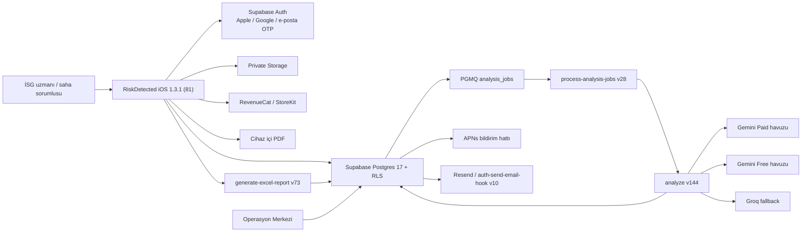

En kritik ürün sınırı:

> RiskDetected karar destek ve dokümantasyon aracıdır. AI çıktısı profesyonel saha
> kontrolünün, yetkili uzman kararının veya mevzuat yorumunun yerine geçmez.
> Türkiye dışı güvenlik profilleri yalnız **terminoloji rehberliğidir**, hukuki
> uygunluk sertifikası değildir.

---

## 3. Ürün: amaç, kullanıcı, sınırlar

### 3.1 Değer önerisi

- Fotoğraftan görünür tehlike ve uygunsuzluk tespiti.
- Kanıt temelli risk açıklaması.
- Düzeltici ve önleyici kontrol önerileri.
- Fine-Kinney ve 5×5 L-Tipi risk önceliklendirmesi.
- PDF ve Excel raporlama.
- Firma, analiz ve rapor arşivi.
- Mesleki ilerleme ve bildirimlerle kullanım sürekliliği.

### 3.2 Hedef kullanıcılar

İş güvenliği uzmanları, OSGB ekipleri, saha mühendisleri, şantiye/üretim/depo denetimi
yapan profesyoneller, KOBİ'lerde İSG sorumluları, işveren vekilleri.

### 3.3 Kapsam dışı

- Resmî uygunluk belgesi vermez.
- Fotoğrafta görünmeyen koşulu kesin gerçek kabul etmez.
- Ölçüm cihazı gerektiren gürültü/gaz/sıcaklık değerlerini fotoğraftan ölçmez.
- Saha doğrulaması olmadan mevzuat uyumu garanti etmez.
- Sosyal akış, kullanıcılar arası mesajlaşma, herkese açık kullanıcı içeriği yoktur.
- Çin anakarası bu AI destekli sürüm için kapsam dışıdır.

---

## 4. Aktif release durumu

| Alan | Değer |
| --- | --- |
| Canlı pazarlama sürümü | `1.3.1` |
| Canlı build | `81` |
| Canlı sürüm çıkış tarihi | 3 Ağustos 2026 18:00 UTC |
| Bir önceki sürüm | `1.3.0 (80)` — 2 Ağustos 2026 |
| Uzun süre canlı kalan legacy | `1.2.4 (77)` — hâlâ güncellemeyen cihazlar var |
| Version ID (1.3.1) | `9b304afe-4245-480d-8442-be03f9878407` |
| Build ID (81) | `4790ee2d-48df-4fe6-8fbf-6f5fa5591db2` |
| Review durumu | `COMPLETE`, blocker `0` |
| Version state | `READY_FOR_DISTRIBUTION` |
| Release tipi | `MANUAL` |
| Minimum iOS | `16.0` |
| Cihaz ailesi | iPhone (`TARGETED_DEVICE_FAMILY=1`) |
| Primary locale | `tr` |
| App Store kategorileri | Business (ana), Productivity (ikincil) |
| Yaş sınırı | 4+ |

### 4.1 App Store lokalizasyonları

| Locale | Durum |
| --- | --- |
| `tr` | Ana dil, korunuyor (ad: `RiskDetected: İş Güvenliği İSG`) |
| `en-US`, `en-GB`, `en-AU`, `en-CA` | Wave 1'de eklendi, İngilizce ad `RiskDetected: Risk Assessment` |

Türkçe keyword seti (değiştirilmemesi gereken):
`osgb,is güvenliği,is guvenligi,isg,değerlendirme,uzmanı,sağlığı,tehlike,tespit,5x5,matris`

İngilizce keyword setleri Applyra araştırması sonrası 1.3.1'de güncellendi
(`JSA`, `JHA`, `hazard assessment`, `risk matrix`, `Fine-Kinney` odaklı).

> **Not:** `itunes.apple.com/lookup` çağrısı `lang` parametresi verilmezse İngilizce
> metadata döndürür. Bu bir hata değildir; Türkçe cihaz Türkçe listeyi görür
> (`lang=tr_tr` ile doğrulanabilir).

---

## 5. Teknoloji yığını

### 5.1 iOS istemci

- **Swift + SwiftUI**, structured concurrency (`async/await`), `@MainActor` izolasyonu.
- UIKit köprüleri: kamera, galeri (PhotosUI), PDFKit, paylaşım sheet, haptic.
- `URLSession` + özel **server trust pinning** delegate'i (`ServerTrustPinningDelegate.swift`).
- `UserDefaults`: cihaz tercihleri ve sınırlı cache.
- Keychain üzerinden Supabase Auth session.
- APNs, Sign in with Apple, Google Sign-In.
- **String Catalog (`.xcstrings`)** tabanlı lokalizasyon — 11 katalog.
- Snapshot testleri (SnapshotPreviews) + XCUITest.

Aktif SwiftPM bağımlılıkları:

| Paket | Sürüm | Amaç |
| --- | ---: | --- |
| `supabase-swift` | 2.46.0 | Auth, PostgREST, Storage, Functions |
| `purchases-ios-spm` (RevenueCat) | 5.72.0 | Abonelik, entitlement, paywall |
| `GoogleSignIn-iOS` | 9.1.0 | Google oturumu |
| `AppAuth-iOS` | 2.0.0 | OAuth altyapısı |
| `app-check` | 11.2.0 | Google App Check bağımlılığı |
| `swift-crypto` | 4.5.0 | Kriptografik yardımcılar |
| `SnapshotPreviews` | 0.15.0 | Görsel/snapshot testi |
| `FlyingFox` | 0.16.0 | Test HTTP sunucusu |
| `SimpleDebugger` | 1.0.0 | Debug bağımlılığı |

### 5.2 Backend

- **Supabase Auth** (Apple/Google/e-posta OTP; PKCE deep-link dönüşü).
- **PostgreSQL 17** + Row Level Security.
- **Supabase Storage** (5 bucket, 4'ü private).
- **Deno tabanlı Edge Functions** — 19 aktif function.
- **`pg_cron`** — 5 zamanlanmış iş.
- **`pgmq`** — `analysis_jobs` dayanıklı kuyruğu.
- **pgTAP** — veritabanı testleri.

### 5.3 Dış servisler

| Servis | Rol |
| --- | --- |
| Apple App Store / StoreKit | Dağıtım, tahsilat, trial, sistem push izni |
| RevenueCat | Offering, entitlement, subscriber snapshot, webhook |
| Supabase | Auth, DB, Storage, Edge Functions, cron, queue |
| Google Gemini | Ana görsel analiz sağlayıcısı |
| Groq (OpenAI uyumlu API) | Süreklilik fallback'i |
| APNs | Transactional ve engagement bildirimleri |
| Resend | Transactional e-posta (OTP, hoş geldin, destek) |
| Applyra | ASO keyword takibi (116 keyword) |
| riskdetected.com | Legal ve destek sayfaları (TR + `/en/`) |

### 5.4 AI modelleri

| Rol | Model |
| --- | --- |
| Free ana model | `gemini-2.5-flash` |
| Free/model fallback | `gemini-3.1-flash-lite` |
| Paid hızlı model | `gemini-2.5-flash` |
| Paid kalite model | `gemini-2.5-pro` |
| Paid son Gemini fallback | `gemini-3.1-flash-lite` |
| Groq vision fallback | `meta-llama/llama-4-scout-17b-16e-instruct` |

Thinking budget: tek fotoğraf `6144`, çoklu fotoğraf Build 80+ için `6144`
(eski davranış `3072`; build allowlist ile yükseltildi).

---

## 6. Repo ve modül haritası

```text
App/                                  # iOS uygulaması (~110 Swift dosyası, ~45k satır)
├── RiskDetectedApp.swift             # @main giriş noktası
├── RootView.swift                    # Root state makinesi, banner katmanı
├── AppState.swift                    # Merkezî observable state (1510 satır)
├── DesignSystem/                     # RDColor, tipografi, spacing
├── Features/ProfessionalProgress/    # Mesleki ilerleme modülü
├── Generated/                        # Kod üretimi çıktıları
├── LegalDocuments/                   # Paketlenmiş TR + EN legal metinler
├── Localization/                     # *.xcstrings + lokalizasyon sözleşmeleri
│   ├── Analysis / Auth / Legal / Localizable / Notifications
│   ├── Onboarding / Paywall / ProfessionalProgress / Reports
│   ├── SafetyTerminology / InfoPlist
│   ├── RDAnalysisLocalizationRequest.swift
│   ├── RDGlobalLocalizationBuildGate.swift
│   └── RDSafetyProfilePresentation.swift
├── Models/                           # Finding, Analysis*, Company, UserProfile...
├── Services/                         # 24 servis (Auth, Analysis, Subscription...)
└── Views/
    ├── Analysis · Analyzing · Annotate · Auth · Common · Components
    ├── History · Home · Legal · Onboarding/V2 · Paywall
    └── Profile · Report · Result

supabase/
├── functions/         # 21 klasör, 19'u production'da aktif (~20k satır TS)
│   └── _shared/       # Ortak sözleşmeler, lokalizasyon, provider client
├── migrations/        # 127 aktif SQL migration
├── migrations_archive/# Arşivlenmiş local-only migration'lar
└── tests/             # pgTAP testleri

localization/
├── safety-profiles/   # 6 YAML profil + manifest + JSON schema
└── generated/         # SafetyProfiles.generated.swift + .ts

appstore/              # ASC metadata, screenshots, review notes (versiyonlanmış)
scripts/               # Release gate, doğrulama, ASC otomasyonu (Node)
docs/                  # Referans, runbook, release ve lokalizasyon belgeleri
```

En büyük dosyalar (bakım maliyeti sinyali):

| Dosya | Satır |
| --- | ---: |
| `supabase/functions/analyze/index.ts` | 9.047 |
| `App/Views/Result/ResultView.swift` | 3.603 |
| `supabase/functions/generate-excel-report/index.ts` | 3.359 |
| `App/Services/AnalysisService.swift` | 3.321 |
| `App/Views/Home/HomeView.swift` | 2.852 |

---

## 7. Uygulama yaşam döngüsü ve navigasyon

### 7.1 Root akışı

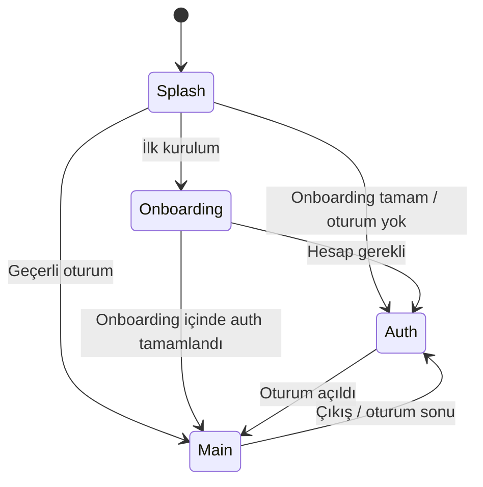

`AppState` sorumlulukları:

- Auth session ve profil.
- Backend doğrulanmış subscription state.
- RevenueCat offering ve entitlement gözlemi.
- Plan capability çözümleme.
- App release policy (soft/hard update).
- Aktif tab ve notification deep-link yönlendirmesi.
- Tema tercihi.
- Dil ve güvenlik profili bağlamı.

Root seviyesinde ayrıca: offline banner, legal doküman güncelleme banner/karar ekranı,
soft update banner, hard update blok ekranı, notification route hazırlığı.

### 7.2 Ana sekmeler

| Tab | Görev |
| --- | --- |
| Ana Sayfa | Yeni analiz, son analizler, son raporlar, kota ve ilerleme özeti |
| Analizler | Geçmiş analizler ve tamamlanmış sonuçlara erişim |
| Raporlar | PDF/Excel arşivi, filtreleme, görüntüleme, paylaşım |
| Profil | Profil, abonelik, firma, bildirim, tema, dil, legal, destek, hesap işlemleri |

Tab bar ortasındaki viewfinder düğmesi hızlı taramayı açar; Free günlük kota dolmuşsa
paywall'a yönlendirir.

### 7.3 Ana kullanıcı akışı

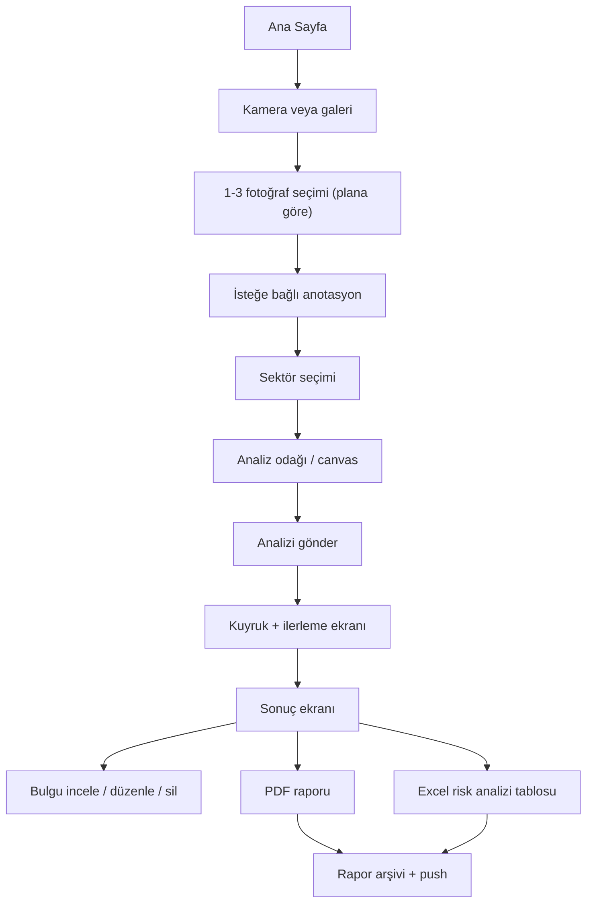

---

## 8. Onboarding ve kimlik doğrulama

### 8.1 Onboarding V2 adımları

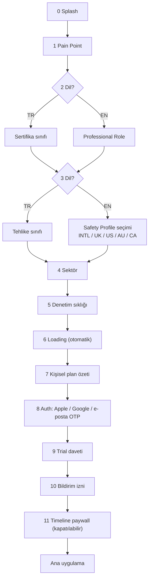

Dile göre dallanma kritiktir: Türkçe kullanıcı sertifika + tehlike sınıfı verirken,
İngilizce kullanıcı mesleki rol + **güvenlik terminoloji profili** seçer. Onboarding
atlanırsa varsayılan profil `en-intl-generic-v1` (International) olur.

**Storefront, IP adresi veya cihaz bölgesi güvenlik yargı alanı çıkarımı için
kullanılmaz.** Kullanıcı açıkça seçer.

Onboarding taslağı auth öncesi cihazda tutulur, oturum açılınca
`user_onboarding_answers` tablosuna senkronize edilir. Cevaplar AI promptuna kontrollü
kişiselleştirme sinyali verir; fotoğrafta görünmeyen tehlikeyi uydurma yetkisi vermez.

### 8.2 Auth yöntemleri

- Sign in with Apple (native).
- Google Sign-In SDK ile ID token.
- E-posta adresine 6 haneli OTP (Supabase Auth Hook → `auth-send-email-hook` → Resend).
- Supabase PKCE / deep-link dönüşü.

Parola ile login kodda yalnız E2E test desteği için vardır; ana kullanıcı yöntemi değildir.

Yeni kurulumda iOS Keychain'de kalmış eski Supabase session'ı otomatik kabul edilmez;
fresh install marker ile temizlenir.

**Auth e-posta hook sözleşmesi (kritik):** başarılı hook yanıtı `200` + JSON gövde +
`Content-Type: application/json` olmalıdır. Gövdesiz `200` Supabase tarafından
`hook_payload_invalid_content_type` ile reddedilir ve OTP akışı canlıda kırılır
(2 Ağustos 2026'da yaşandı, `auth-send-email-hook` v10 ile düzeltildi).

### 8.3 Profil alanları

Ad soyad, e-posta, telefon, ünvan, sertifika/belge numarası, tercih edilen risk yöntemi,
profil fotoğrafı, legacy firma adı/logosu, plan bilgisi, uygulama dili, içerik locale'i,
iş yargı alanı, ilk görülen cihaz bölgesi (`first_seen_device_region`, write-once RPC).

---

## 9. Abonelik ve plan sistemi

### 9.1 Otorite zinciri

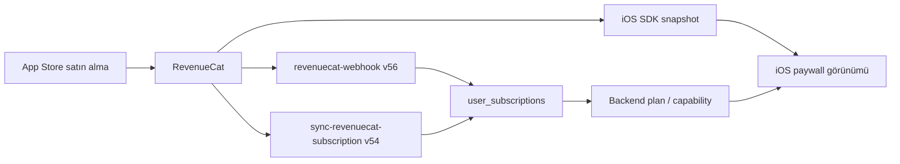

Backend güvenliği için `user_subscriptions` + RevenueCat doğrulaması esastır.
**İstemci tek başına ücretli plan açamaz.**

### 9.2 Ürünler

| Ürün | Product ID | Dönem | Seviye |
| --- | --- | --- | ---: |
| Plus Monthly | `riskdetected_plus_monthly` | 1 ay | 2 |
| Plus Yearly | `riskdetected_plus_yearly` | 1 yıl | 2 |
| Pro Monthly | `riskdetected_pro_monthly` | 1 ay | 1 |
| Pro Yearly | `riskdetected_pro_yearly` | 1 yıl | 1 |

RevenueCat entitlement ID'leri: `plus`, `pro`. Offering: `default`.

### 9.3 Fiyatlandırma

Fiyat **hiçbir yerde koda gömülü değildir**; RevenueCat/StoreKit'ten gelen localized
price string kullanılır. Para birimi ve fiyatı Apple storefront belirler.

| Storefront | Plus Aylık | Plus Yıllık | Pro Aylık | Pro Yıllık |
| --- | ---: | ---: | ---: | ---: |
| Türkiye | 249,99 TRY | 2.499,99 TRY | 499,99 TRY | 4.999,99 TRY |
| ABD | 4.99 USD | 49.99 USD | 9.99 USD | 99.99 USD |
| Birleşik Krallık | 4.99 GBP | 49.99 GBP | 9.99 GBP | 99.99 GBP |
| Kanada | 6.99 CAD | 69.99 CAD | 12.99 CAD | 129.99 CAD |
| Avustralya | 7.99 AUD | 79.99 AUD | 14.99 AUD | 149.99 AUD |

TR bölgesinde fail-closed guard vardır: StoreKit TR için USD döndürürse uygulama bunu
geçerli Türk fiyatı olarak göstermez.

### 9.4 7 günlük ücretsiz deneme

Yalnız `riskdetected_plus_yearly` ürününde: mod `FREE_TRIAL`, süre `ONE_WEEK`,
175 territory. **Planlanan bitiş: 30 Eylül 2026** — devam etmesi isteniyorsa ASC'de
teklif tarihi ayrıca uzatılmalıdır.

### 9.5 Plan capability matrisi

| Kural | Free | Plus | Pro |
| --- | ---: | ---: | ---: |
| Standart analiz | 1/gün | 10/gün | 40/gün |
| Detaylı analiz | Yok | 2/gün | 10/gün |
| Fotoğraf/analiz | 1 | 3 | 3 |
| Bulgu/fotoğraf | 12 | 13 | 13 |
| Bulgu/analiz | 12 | 39 | 39 |
| Çoklu fotoğraf | Hayır | Evet | Evet |
| AI bulgusu düzenleme | Evet | Evet | Evet |
| Manuel bulgu ekleme | Hayır | Hayır | Hayır |
| Aylık standart rapor | 3 | 150 | 750 |
| Firma | 0 | 5 | 25 |
| Fotoğraf saklama | 7 gün | 30 gün | Süresiz |

Kota penceresi `Europe/Istanbul` iş zaman dilimine göre hesaplanır.
Plan adları TR arayüzde de `FREE / PLUS / PRO` olarak gösterilir (çeviri yapılmaz).

### 9.6 İptal edilmiş Plus trial özel kuralı

Yıllık Plus trial'ını 7 gün dolmadan iptal eden kullanıcı Plus haklarını (3 fotoğraf,
Plus prompt/şema, rapor, UI) trial bitene kadar korur; ancak **AI maliyeti Free
sağlayıcı havuzuna taşınır**. Yenilemeyi tekrar açarsa Paid havuza döner.

Uygunluk koşulları (hepsi gerekli): tier `plus`; status `active`/`trialing`/`grace_period`;
`product_id` ve `trial_product_id` tam olarak `riskdetected_plus_yearly`;
`will_renew=false`; geçerli ~7 günlük trial tarihleri; trial ve current period henüz
bitmemiş; bitişler arasında en fazla 5 dakika fark; `cancelled_plus_trial_free_routing`
flag'i açık. Eksik veya çelişkili metadata Paid route'ta kalır (fail-safe).

---

## 10. Fotoğraf girdi hattı

### 10.1 Ürün kuralı

Production limiti: **Free 1 · Plus 3 · Pro 3**. "5 fotoğraf" aktif bir ürün özelliği
değildir.

### 10.2 Legacy alan tuzağı

`multi_photo_analysis` flag JSON'unda tarihsel `plus_pro_5_photo_limit` alanları vardır;
isim ürün gerçeğini yansıtmaz. Runtime `max_photo_count_plus=3` /
`max_photo_count_pro=3` ile sınırlar. `plan_capability_rules.free.visible_photo_slots_in_ui=5`
legacy değeri iOS'ta `safeVisiblePhotoSlotsInUI` ile 3'e clamp edilir.

### 10.3 Hazırlama

**iOS:** kamera/galeriden görsel alır; JPEG/PNG/HEIC yönetir; normalize eder, boyut
düşürür; anotasyon katmanını görsele uygular; sıra ve client photo ID ile taşır.

**Backend:** MIME ve base64 boyutunu doğrular; fotoğraf sayısını plan snapshot'ıyla
kontrol eder; inline görseli private `photos` bucket'ına kalıcılaştırır; `photos`
tablosuna metadata yazar; sahiplik/analiz/retention ilişkisini kurar.

Fotoğrafsız yeni analiz kabul edilmez. `text_input` alanı yalnız geriye uyumluluk içindir.

---

## 11. Sektör, canvas ve prompt bağlamı

### 11.1 Sektörler

`general` (fallback), `construction`, `manufacturing`, `mining`, `energy`, `office`,
`logistics_warehouse`, `chemical_laboratory`, `healthcare`, `food_production`,
`agriculture_livestock`, `retail`, `municipal_field_services`, `education`, `hospitality`.

`general` onboarding seçeneği değil, analiz fallback'idir.

### 11.2 Canvas'lar (analiz odağı)

| Canvas | ID | Min. plan |
| --- | --- | --- |
| Genel | `general` | Free |
| KKD | `ppe` | Free |
| Makine | `machine` | Plus |
| Uyarı levhaları | `warning_signs` | Free |
| Elektrik | `electrical` | Free |
| Sektör | `sector` | Plus |
| Yangın | `fire` | Free |
| Özel Ekipman | `ergonomics` | Pro |
| Ortam Ölçümü | `environment_measurement` | Plus |
| Patlama | `explosion` | Free |
| Çevre | `environment` | Free |
| Mevzuat | `legislation` | Pro |
| Yüksekte Çalışma | `working_at_height` | Free |
| Hareketli Ekipman | `mobile_equipment` | Free |
| Genel Premium | `general_premium` | Pro |
| İş Makineleri | `construction_machinery` | Free |

Canvas ID'si legacy tek alan olarak `analyses.canvas` içinde tutulur.

### 11.3 Prompt katmanları

Sistem güvenlik/kalite talimatı → plan & quality tier → analiz modu → canvas odağı →
aktif sektör → onboarding kişiselleştirmesi → firma ve tehlike sınıfı →
**dil/locale/güvenlik profili bağlamı** → fotoğraf indeks marker'ları → çoklu fotoğraf
coverage sözleşmesi → response schema.

Temel ilkeler: yalnız görünür kanıta dayan; varsayımı gerçek gibi yazma; ölçüm gerektiren
konuda saha doğrulaması iste; aynı tehlikeyi tekrar üretme; **farklı fiziksel tehlikeleri
tek bulguda birleştirme**; tehlike/kanıt/kök neden/önlemi ayır; referansları kısa ve
bağlama uygun üret; fotoğraf marker'larını kullanıcı metnine sızdırma; her bulguyu ilgili
fotoğraf indeksleriyle bağla.

---

## 12. Analiz kuyruğu ve worker mimarisi

### 12.1 Durum makinesi

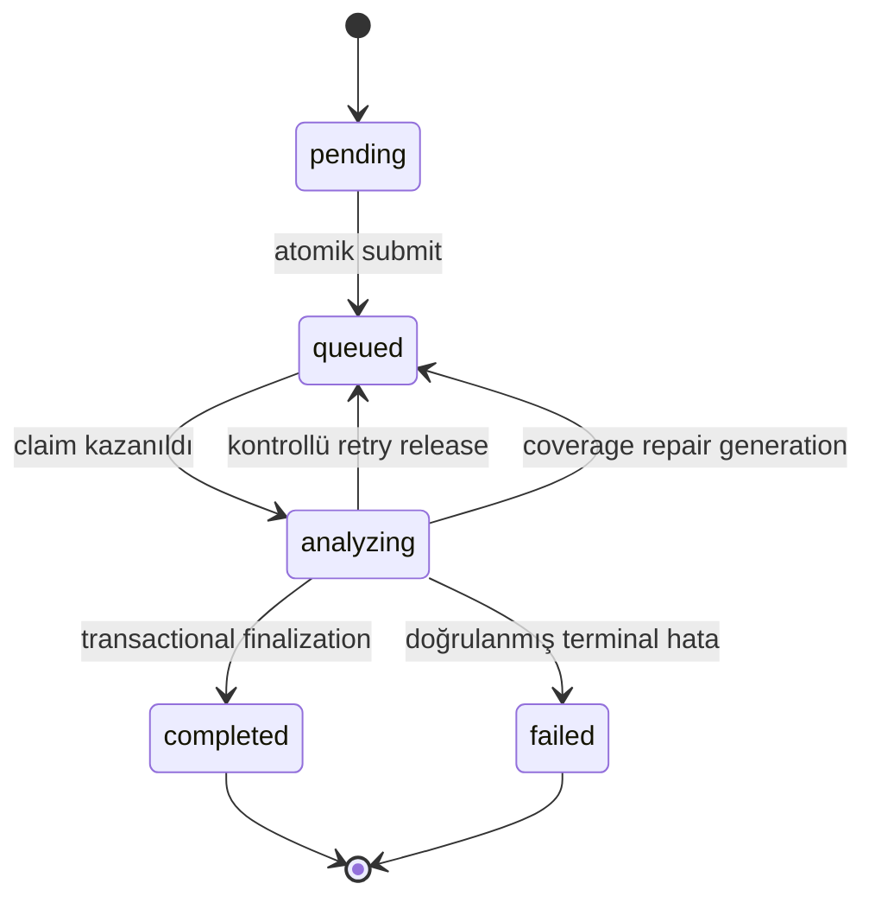

Veritabanı guard'ı tamamlanmış analizin sonradan `queued`/`analyzing`/`failed`
yapılmasını engeller.

### 12.2 Atomik submit

- `pending → queued` ve `pgmq.send()` **aynı transaction** içindedir.
- Aynı `analysis_id` ile ikinci istemci isteği yeni mesaj üretmez.
- `queued`/`analyzing` idempotent kabul edilir; `completed` mevcut sonucu döner;
  `failed` eski analizi yeniden açmaz (yeni analysis ID gerekir).
- Kota reservation'ı `analysis_id` ile idempotenttir.

### 12.3 Job state ve zamanlar

`private.analysis_job_state`: aktif queue message ID, job mode (`analysis` | `repair`),
generation, claim token, claim/lease zamanları, gerçek worker attempt sayısı, pipeline
guard bağlamı.

| Parametre | Değer |
| --- | ---: |
| Queue visibility timeout | 180 sn |
| Analyze worker HTTP timeout | 135 sn |
| Claim lease | 300 sn |
| Maksimum gerçek worker attempt | 3 |

### 12.4 Claim protokolü

Worker AI çağırmadan önce `claim_analysis_job_v2` kullanır. Yalnız aktif message ID +
generation eşleşmesi claim alır; duplicate mesaj AI çağırmadan superseded olur; aktif
lease varken ikinci okuma attempt tüketmez; lease dolunca yeni token ve yeni gerçek
attempt oluşur; eski token yeni attempt'in sonucunu değiştiremez.

### 12.5 Belirsiz transport guard'ı

Nested Edge Function HTTP cevabı gerçeğin tek kaynağı değildir:

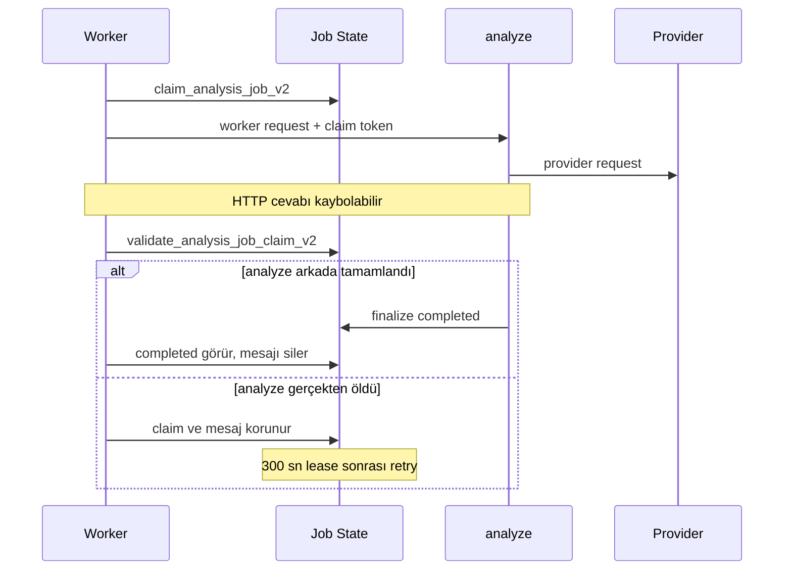

Amaç: ilk AI çağrısı arkada devam ederken ikinci Gemini isteğinin başlamasını önlemek.

### 12.6 Terminal yazımlar

Finalization ve failure kaydı claim token ile doğrulanır; claim kaybeden eski worker'ın
sonucu `discarded` olur; retryable provider hatasını `analyze` kontrollü serbest bırakır;
worker transport catch'i doğrudan terminal failure yazmaz.

---

## 13. AI yönlendirme ve sağlayıcı havuzları

### 13.1 Free havuz

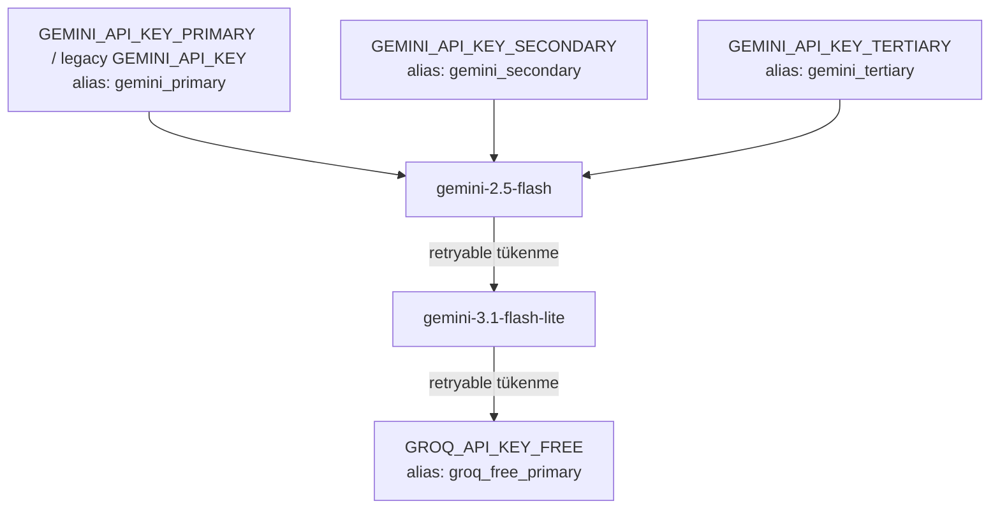

Free key sırası `GEMINI_FREE_PREFERRED_KEY_ALIAS` ile değiştirilebilir. Aynı Google Cloud
projesindeki anahtarlar kotayı paylaşır; çok anahtar tek başına ekstra kota anlamına gelmez.

### 13.2 Paid havuz

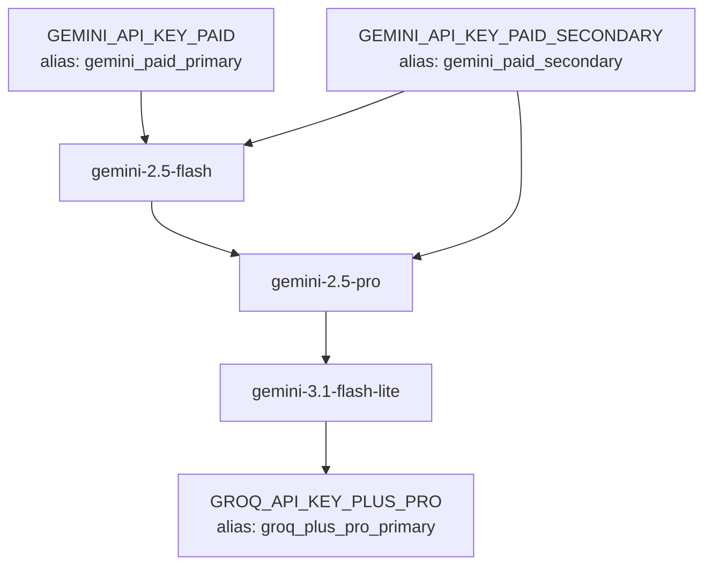

### 13.3 Route matrisi

| Route | Kullanıcı | Output quality | Havuz |
| --- | --- | --- | --- |
| `free_legacy` | Normal Free | Free | Free Gemini → Free Groq |
| `free_paid_trial` | Free süreklilik denemesi | Plus | Paid Gemini → Free Gemini → Free Groq |
| `paid_plan` | Plus / Pro | Plan tier | Paid Gemini → Paid Groq |
| `cancelled_plus_trial_free` | İptal edilmiş aktif Plus yıllık trial | Plus | **Yalnız** Free Gemini → Free Groq |

`cancelled_plus_trial_free` hiçbir koşulda paid alias'a geçmemelidir — kritik invariant.

### 13.4 Logical iş vs fiziksel istek

Bir `ai_usage_logs` satırı **logical** işi temsil eder, tek HTTP isteği garantisi değildir.
Ek fiziksel istek nedenleri: 429/5xx, timeout, API key fallback, model fallback,
Gemini→Groq fallback, `MAX_TOKENS` retry, geçersiz JSON fallback, layer schema fallback,
exact coverage schema reddi.

Ayrıştırma alanları: `provider_request_count`, `provider_attempt_total_tokens`,
`provider_attempts`.

---

## 14. Çoklu fotoğraf ve exact coverage

**Hedef:** sağlıklı 2–3 fotoğraflık istekte tek analysis generation, tek logical AI log,
tek fiziksel provider request, her fotoğraf için tam coverage kaydı, repair'siz tamamlanma.

**Schema V2** (`multi_photo_exact_coverage_schema` açık): `photo_findings` dizisi
`minItems = maxItems = photoCount`; `photo_index` geçerli indeks enum'uyla sınırlı
(2 fotoğrafta tam `[1,2]`, 3'te tam `[1,2,3]`). Groq `json_object` kullandığından aynı
sözleşme promptla zorlanır.

**Normalizasyon:** sırası farklı tam indeks listesi geçerlidir; duplicate indeksler merge
edilir; duplicate bulgular kök neden/kanıt/kontrol kurallarıyla tekilleştirilir; geçersiz
indeksli kayıtlar final bulguya alınmaz; eksik kayıt "temiz fotoğraf" sayılmaz;
`no_actionable_hazard` ve `low_quality` açık kayıtları repair edilmez; `actionable` ama
sıfır bulgulu kayıt repair adayıdır.

**Repair:** yalnız eksik/çelişkili fotoğraflar gider; analiz başına **en fazla bir**
repair generation; repair ikinci kullanıcı kotası tüketmez; hâlâ eksikse üçüncü repair
oluşturulmaz; eski generation yeni repair sonucunu değiştiremez.

**12 katmanlı denetim (Build 80+):** `inspection-layer-audit.ts` çoklu fotoğrafta katman
kapsamını denetler; dönen bulguları uygulanabilir katman/fotoğraf kapsamıyla karşılaştırır.
Build allowlist: `["80","81"]`.

---

## 15. Bulgular ve risk hesabı

### 15.1 Bulgu yapısı

Başlık · kategori · görünür kanıt/açıklama · confidence · kök neden · düzeltici önlem ·
önleyici kontrol · referanslar · saha doğrulaması gereksinimi · kaynak fotoğraf indeksleri ·
Fine-Kinney girdileri · 5×5 girdileri.

### 15.2 Fine-Kinney

```text
Risk = Olasılık × Frekans × Şiddet
```

| Skor | Etiket |
| ---: | --- |
| 401+ | Tolerans dışı |
| 201–400 | Yüksek risk |
| 71–200 | Önemli risk |
| 21–70 | Olası risk |
| 0–20 | Önemsiz |

### 15.3 5×5 L-Tipi

```text
Risk = Olasılık × Şiddet
```

| Skor | Etiket |
| ---: | --- |
| 20+ | Tolerans dışı |
| 10–19 | Yüksek risk |
| 5–9 | Orta risk |
| 3–4 | Düşük risk |
| 1–2 | Önemsiz |

### 15.4 Kalite guard'ları

Evidence guard · layer audit · duplicate temizliği · fotoğraf başına ve toplam bulgu
bütçesi · unsupported/boş bulgu temizliği · kaynak fotoğraf indeksi doğrulaması · risk
skor normalizasyonu · marker temizliği · reference/root-cause sözleşmesi ·
**dil doğrulaması** (`language_validation_status`) · **yasak iddia doğrulaması**
(`forbidden_claim_validation_status`).

### 15.5 Kullanıcı düzenlemeleri

Tüm planlarda AI bulgusu düzenleme açıktır. `mutate-analysis-finding` owner kontrolü yapar,
edit version'ı artırır, `finding_edit_events` audit'i yazar, rapor snapshot sürümünü
etkiler. Sıfırdan manuel bulgu ekleme aktif değildir.

---

## 16. Finalizasyon ve telemetri

`finalize_analysis_result_v2` **tek transaction** içinde: claim ve aktif generation'ı
doğrular → eski tamamlanmamış bulguları güvenli değiştirir → yeni findings setini yazar →
analiz skor/sayı/özet/raw response alanlarını yazar → fotoğraf özetlerini idempotent
upsert eder → kota reservation'ını completed yapar → analizi completed yapar → claim'i kapatır.

`persistence_outcome` değerleri:

| Değer | Anlam |
| --- | --- |
| `not_started` | Provider aşamasında sonuç alınmadı |
| `pending` | AI cevabı var, DB sonucu tamamlanmadı |
| `persisted` | Sonuç başarıyla kaydedildi |
| `failed` | Persistence kesin başarısız |
| `discarded` | Claim kaybedildiği için sonuç uygulanmadı |

`private.analysis_job_events` ayrı ayrı kaydeder: claim acquired, dispatch success/
application error, ambiguous transport, claim kept/released, terminal failed, repair
superseded, finalized, response loss sonrası message delete, lease-expired retry, max attempts.

Loglarda prompt, fotoğraf, secret veya tam provider response'u bulunmaz.

---

## 17. Rapor sistemi

| Tür | Format | Üretim yeri |
| --- | --- | --- |
| Standart saha raporu | PDF | iOS cihaz içinde |
| Detaylı risk analizi | PDF | iOS cihaz içinde |
| Risk analizi tablosu | XLSX | `generate-excel-report` Edge Function |

### 17.1 PDF hattı

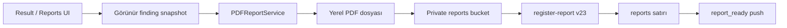

PDF içeriği: profil/hazırlayan, ünvan ve belge numarası, firma adı/bilgisi/logosu, analiz
sektörü, risk yöntemi, bulgu tablosu/detayı, risk dağılımı, sayfa ve doküman numarası.

### 17.2 Excel hattı

`generate-excel-report v73`: JWT + owner kontrolü → analiz/finding/profil/firma verisini
okur → risk yöntemine göre workbook üretir → gerekirse firma logosunu gömer → private
`reports` bucket'a yükler → report satırı ve usage event yazar → best-effort report-ready
push gönderir.

### 17.3 Snapshot ve idempotency

Raporlar `findings_snapshot_json`, `photos_snapshot_json`, `analysis_edit_version`,
`company_snapshot`, kaynak fotoğraf ve görünür bulgu sayısını taşır. Böylece kullanıcı
sonradan bulguyu düzenlese veya firmayı arşivlese bile üretilmiş raporun bağlamı korunur.
Request/support ID ve unique sözleşmeler duplicate rapor üretimini sınırlar.

### 17.4 Kota ve saklama

Free 3/ay · Plus 150/ay · Pro 750/ay (`Europe/Istanbul`). Free kullanıcı için bir kez
kullanılabilen risk analizi tablosu trial hakkı ayrıca `report_risk_analysis_trial`
usage event'i ile takip edilir. Raporlar kullanıcı silene kadar saklanır; bucket private,
erişim signed URL ile.

---

## 18. Firma sistemi

Firma kaydı: ad, tehlike sınıfı, adres, ilgili kişi, departman, varsayılan sorumlu,
varsayılan termin günü, logo, arşiv durumu.

Limit: Free 0 · Plus 5 aktif · Pro 25 aktif.

Firma analize atanabilir, rapor filtresi olarak kullanılabilir, rapor snapshot'ına
kopyalanır, kullanıcı sahipliği dışında okunamaz/değiştirilemez. Legacy profil firma
alanları eski veriler ve fallback raporlar için korunur.

---

## 19. Mesleki ilerleme

MDP (mesleki deneyim puanı) eşikleri:

| Unvan | MDP |
| --- | ---: |
| Aday Uzman | 0 |
| Saha Gözlemcisi | 1.000 |
| Risk Avcısı | 5.000 |
| Tehlike Analisti | 15.000 |
| Kıdemli Risk Uzmanı | 40.000 |
| Güvenlik Stratejisti | 90.000 |
| Usta İSG Uzmanı | 180.000 |

Workflow başına MDP artışı sınırlandırılır; aşırı export ile hızlı rank atlama engellenir.

Yetkinlikler: yangın, kimyasal, elektrik, mekanik, ergonomi, psikososyal, yüksekte çalışma,
KKD, maden, inşaat, fabrika. Finding metni keyword/classifier ile yetkinliğe bağlanır;
güven düşükse `unclassified` kalır.

Rozetler: rapor kilometre taşları, yetkinlik çeşitliliği, ilk yüksek/kritik risk, ilk
detaylı risk analizi raporu, aktif gün kilometre taşları, onboarding alanıyla ilgili ilk rapor.
Haftalık özet cron'u: `30 6 * * 1`.

---

## 20. Bildirim sistemi

### 20.1 Katmanlar

1. **Transactional** — analiz tamamlandı, rapor hazır, hesap güncellemeleri, trial hatırlatma.
2. **Mesleki ilerleme** — haftalık/aylık özet, kilometre taşı.
3. **Engagement / uygulama hatırlatmaları** — otomasyon kuralları.

### 20.2 Kind → preference sözleşmesi

| Kind | Preference |
| --- | --- |
| `analysis_complete` | `analysis_complete` |
| `report_ready` | `report_ready` |
| `account_updates` | `account_updates` |
| `trial_reminder` | `trial_reminder` |
| Progress weekly | `progress_weekly_summary` |
| Progress monthly | `progress_monthly_summary` |
| Progress milestone | `progress_milestones` |
| `first_analysis_reminder` | `app_reminders` |
| `inactivity_reminder` | `app_reminders` |
| `manual_app_reminder` | `app_reminders` |

Bilinmeyen kind **fail-closed**'dur. `marketing` legacy alandır; yeni engagement otoritesi
`app_reminders`'tır.

### 20.3 Token ve tercih kuralları

- APNs token kaydı kategori tercihlerini yeniden açmaz.
- İlk izin verildiğinde kategoriler açık oluşturulur.
- Token refresh, kullanıcının kapattığı tercihi değiştirmez.
- Sistem izni kapanırsa token pasifleşir; kategori seçimi korunur.
- `BadDeviceToken` / `Unregistered` / APNs 410 → token pasif.
- **2 Ağustos 2026 düzeltmesi:** ana tercih açıldığında analiz/rapor/hesap kategorileri
  otomatik geri açılır (migration `20260802205501`), 65 hesap backfill edildi.

### 20.4 Engagement otomasyonu

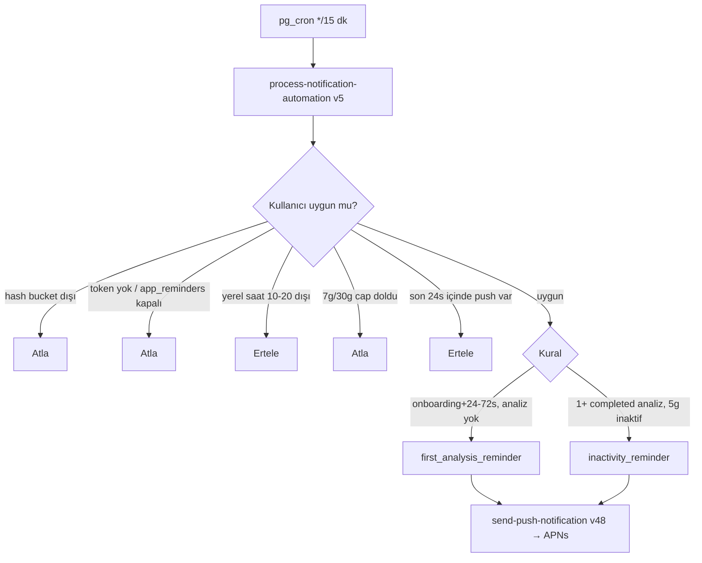

Aktif production değerleri (6 Ağustos 2026):

```json
{
  "rollout_mode": "on",
  "rollout_percentage": 5,
  "live_rollout_stage": "5_percent",
  "kill_switch": false,
  "live_rollout_started_at": "2026-08-02T19:22:04Z"
}
```

Her iki kural `active`. Sonraki aşamalar: `%5 → %25 → %100` (ayrı production kararı).
Bu sistem iOS build numarasına bağlı değildir.

### 20.5 Heartbeat

En fazla 6 saatte bir foreground heartbeat: IANA timezone, locale, app version/build,
notification authorization status. `record_user_engagement_state_v1` server `now()` ve
`auth.uid()` kullanır; istemci kullanıcı ID veya aktivite zamanı seçemez.

### 20.6 Operasyon Merkezi

Server-only altyapı: kural ve version, template, campaign, job, device delivery attempt,
preview, shadow/allowlist/active, pause/archive, manual campaign, kill switch, admin audit.
API: `manage-notification-automation v5`. Admin scope örnekleri: `notifications.read`,
`notifications.rules.write`, `notifications.campaigns.write`, `notifications.publish`,
`notifications.kill_switch`.

---

## 21. Global lokalizasyon mimarisi

Wave 1 (Build 80/81) ile İngilizce tam ürün dili oldu. Mimari beş katmandan oluşur.

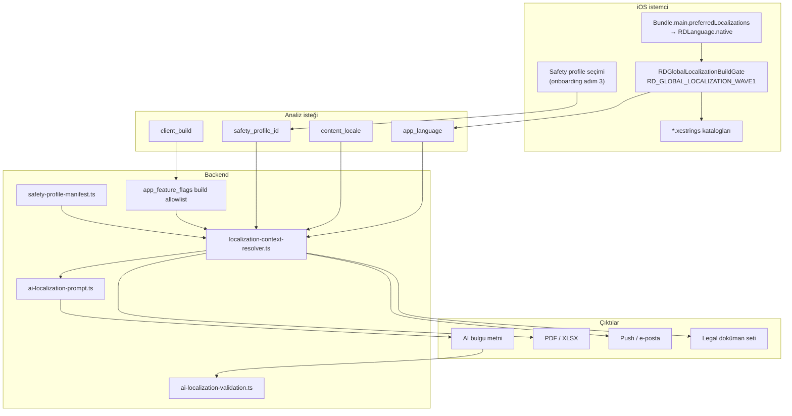

### 21.1 İstemci dil çözümü

```swift
enum RDLanguage: String { case turkish = "tr"; case english = "en" }
// RDLanguage.current → build gate kapalıysa daima .turkish
// RDLanguage.native  → Bundle.main.preferredLocalizations
```

Uygulama dili **iOS tarafından** belirlenir (cihaz dili veya uygulamaya özel dil tercihi).
Desteklenmeyen dilde fallback Türkçedir. Binary'de derleme gate'i:
`RD_GLOBAL_LOCALIZATION_WAVE1` compilation condition — derlenmiş olması tek başına
kullanıcıya açıldığı anlamına gelmez; sunucu tarafı rollout gate'i de gerekir.

### 21.2 Güvenlik terminoloji profilleri

| Profil ID | Kapsam |
| --- | --- |
| `tr-tr-current-v1` | Türkiye (varsayılan, korunuyor) |
| `en-intl-generic-v1` | International (İngilizce fallback) |
| `en-gb-generic-v1` | Birleşik Krallık |
| `en-us-generic-v1` | ABD |
| `en-au-generic-v1` | Avustralya WHS |
| `en-ca-generic-v1` | Kanada OHS |

Manifest sözleşmesi:

```json
{
  "default_profile_id": "tr-tr-current-v1",
  "english_fallback_profile_id": "en-intl-generic-v1",
  "app_languages": ["tr", "en"],
  "content_locales": ["tr-TR", "en-001", "en-GB", "en-US", "en-AU", "en-CA"],
  "jurisdiction_countries": ["TR", "INTL", "GB", "US", "AU", "CA"],
  "legal_document_set_ids": ["tr-current", "en-global-v1"]
}
```

Kaynak: `localization/safety-profiles/*.yaml` → codegen → `SafetyProfiles.generated.swift`
ve `safety-profiles.generated.ts`.

**Kurallar:**
- Profil seçimi kullanıcıya aittir; storefront/IP/cihaz bölgesinden çıkarılmaz.
- Profiller terminoloji rehberidir; hukuki sertifikasyon iddiası taşımaz.
- Uygulama dili ve çıktı dili, istek oluşturulduktan sonra **değişmez** analiz bağlamıdır.

### 21.3 Analiz kaydındaki lokalizasyon alanları

`analyses` tablosundaki ilgili kolonlar:

`app_language`, `output_language`, `output_locale`, `work_jurisdiction_country`,
`work_jurisdiction_region`, `safety_profile_id`, `safety_profile_version`,
`regulatory_reference_policy`, `prompt_profile_version`, `localization_snapshot`,
`language_validation_status`, `language_validation_attempts`, `language_validation_code`,
`language_contract_repair_used`, `forbidden_claim_validation_status`, `client_build`.

### 21.4 Rollout gate'leri

13 lokalizasyon flag'i `rollout_mode: allowlist` ile `enabled_ios_builds: ["80","81"]`
taşır: `localization_v2`, `english_product_enabled`, `global_localization_wave1`,
`safety_profile_en_intl_enabled`, `safety_profile_en_gb_enabled`,
`safety_profile_en_us_enabled`, `safety_profile_en_au_enabled`,
`safety_profile_en_ca_enabled`, `localization_queue_payload_v1`,
`ai_language_guard_enabled`, `ai_country_term_guard_enabled`, `english_report_enabled`,
`english_notifications_enabled`.

Eski build'ler (77 ve altı) bu flag'lerden etkilenmez — build-scope izolasyonu korunur.

### 21.5 Sonraki dil sırası (planlanan)

Almanca → Fransızca (FR/CA) → Portekizce (BR) → İtalyanca → İspanyolca (ES/MX) → Hollandaca.

Bir dil "tam" sayılmadan önce şu katmanların tamamı gerekir:
App Store metadata → iOS UI stringleri → onboarding/paywall → AI prompt ve çıktı →
PDF/XLSX → push/e-posta → legal ve destek → test fixture ve snapshot'lar.

---

## 22. Legal, izin ve hesap silme

Uygulamada paketlenen legal dokümanlar: Kullanım Koşulları, Gizlilik Politikası,
KVKK Aydınlatma ve Açık Rıza Metni, Açık Rıza Beyanı (TR) + `en-global-v1` seti (EN).

`legal-documents` public bucket'ı yeni doküman sürümlerini dağıtır. Uygulama remote
belgeyi kontrol eder; değişiklik türüne göre banner veya karar ekranı gösterir;
görüldü/devam/explicit accept kaydı tutar; kritik şart değişikliğini dismiss edilmeden
gösterebilir.

**Karşılaştırma sözleşmesi:** "görüldü" kontrolü belge `version + checksum` üzerinden
yapılır. `document_set_id` / `document_locale` alanları eski kayıtlarda boş olduğu için
2 Ağustos 2026'da 60 legacy kayıt backfill edildi (migration `20260802203947`); aksi
halde banner her açılışta tekrar görünüyordu.

Hesap silme: kullanıcı uygulama içinden talep açar → `request-account-deletion v21`
kaydeder → `account-deletion-complete v42` veri temizleme/kimlik silme hattını tamamlar.
RevenueCat sahipliği ve durable usage tombstone'ları veri bütünlüğüne göre ele alınır.

Destek: uygulama içi form + rate limit + support ID + `support-contact v39` + web support URL.

---

## 23. Veri saklama ve storage

| Veri | Saklama |
| --- | --- |
| Free analiz fotoğrafı | 7 gün |
| Plus analiz fotoğrafı | 30 gün |
| Pro analiz fotoğrafı | Süresiz |
| Raw AI response | 30 gün |
| Rapor | Kullanıcı silene kadar |

`photos.retention_expires_at` fotoğraf oluşturulurken tier snapshot'ıyla hesaplanır;
sonradan plan değişmesi eski nesnenin tarihini değiştirmez. `retention-cleanup v49`
her gün `15 2 * * *` çalışır: süresi dolmuş raw AI response'ları temizler, fotoğraf
storage objelerini siler, finding'in `photo_id` bağını güvenli null yapar, fotoğraf
satırını kaldırır.

> `retention-cleanup/index.ts` üst yorumundaki eski "Free 30 / Pro 365" ifadesi geçersizdir;
> otorite `private.archive_retention_days()` ve satırdaki `retention_expires_at` değeridir.

Storage bucket'ları:

| Bucket | Public | Limit | MIME |
| --- | --- | ---: | --- |
| `avatars` | Hayır | 3 MB | JPEG |
| `logos` | Hayır | 5 MB | JPEG, PNG, WebP |
| `photos` | Hayır | 20 MB | JPEG, PNG, HEIC, HEIF, WebP |
| `reports` | Hayır | 30 MB | PDF, XLSX |
| `legal-documents` | **Evet** | 256 KB | JSON, Markdown, text |

Kullanıcı içeriği public URL ile dağıtılmaz; signed URL / owner kontrolü gerekir.

---

## 24. Veritabanı envanteri

45 public + 9 private uygulama tablosu. Tüm ana public kullanıcı tablolarında RLS aktiftir.

### 24.1 Kullanıcı ve ürün
`profiles` · `user_onboarding_answers` · `consents` · `legal_document_acknowledgements` ·
`account_deletion_requests` · `support_requests` · `user_engagement_state`

### 24.2 Analiz
`analyses` · `photos` · `findings` · `analysis_photo_summaries` · `finding_edit_events` ·
`ai_usage_logs` · `usage_events` · `private.analysis_job_state` · `private.analysis_job_events`

### 24.3 Rapor ve firma
`reports` · `report_counters` · `report_year_counters` · `companies`

### 24.4 Abonelik
`user_subscriptions` · `subscription_events` · `subscription_test_overrides` · `paywall_events`

### 24.5 Bildirim
`push_device_tokens` · `notification_preferences` · `notification_events` ·
`private.notification_templates` · `private.notification_rules` ·
`private.notification_rule_versions` · `private.notification_campaigns` ·
`private.notification_jobs` · `private.notification_delivery_attempts`

### 24.6 Mesleki ilerleme
`professional_progress_profiles` · `professional_progress_events` ·
`professional_progress_finding_classifications` · `professional_progress_competency_stats` ·
`professional_progress_badges` · `professional_progress_messages` ·
`professional_progress_weekly_summaries`

### 24.7 Yönetim ve telemetri
`admin_users` · `admin_audit_logs` · `admin_saved_filters` · `admin_notes` ·
`admin_alert_rules` · `admin_alert_events` · `admin_exports` · `admin_rate_limit_events` ·
`model_pricing_catalog` · `app_feature_flags` · `plan_capability_rules` · `audit_logs`

### 24.8 Ana varlık ilişkileri

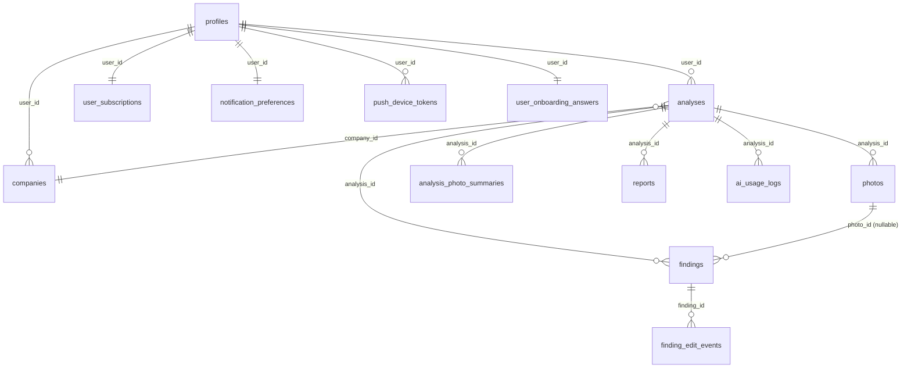

---

## 25. Edge Functions

19 aktif function (6 Ağustos 2026 production sürümleri):

| Function | Sürüm | JWT | Görev |
| --- | ---: | --- | --- |
| `analyze` | 144 | false | Submit, AI analiz, repair, finalizasyon |
| `process-analysis-jobs` | 28 | false | PGMQ worker |
| `generate-excel-report` | 73 | true | XLSX üretimi |
| `register-report` | 23 | true | PDF arşiv kaydı |
| `mutate-analysis-finding` | 8 | true | Finding edit/delete |
| `revenuecat-webhook` | 56 | false | RevenueCat event ve snapshot |
| `sync-revenuecat-subscription` | 54 | true | Güvenli pasif subscription sync |
| `send-push-notification` | 48 | false | Ortak APNs sender |
| `send-report-ready-notification` | 22 | true | Rapor hazır bildirimi |
| `send-trial-reminder-notifications` | 11 | false | Trial reminder cron hattı |
| `process-notification-automation` | 5 | false | Engagement evaluator/worker |
| `manage-notification-automation` | 5 | true | Operasyon Merkezi API |
| `app-release-policy` | 8 | false | Min/latest build politikası |
| `auth-send-email-hook` | 10 | false | Supabase Auth e-posta hook'u (OTP) |
| `retention-cleanup` | 49 | false | Günlük retention |
| `support-contact` | 39 | true | Destek talebi |
| `send-welcome-email` | 27 | true | Hoş geldin e-postası |
| `request-account-deletion` | 21 | true | Hesap silme talebi |
| `account-deletion-complete` | 42 | false | Silme tamamlama |

> `verify_jwt=false` olması function'ın herkese açık güvenli olduğu anlamına gelmez.
> Webhook, cron ve internal worker function'ları kendi secret / service-role / signature
> doğrulamasını uygular.

`firebase-phone-bridge` klasörü repoda vardır ama production'da **aktif değildir**.

---

## 26. Cron ve zaman tabanı

| Job | Schedule | Görev |
| --- | --- | --- |
| `riskdetected-analysis-jobs-every-minute` | `* * * * *` | Analiz kuyruğu |
| `riskdetected-notification-automation-15m` | `*/15 * * * *` | Engagement otomasyonu |
| `riskdetected-trial-reminders-hourly` | `0 * * * *` | Trial reminder |
| `riskdetected-professional-progress-weekly-tracking` | `30 6 * * 1` | Haftalık ilerleme |
| `riskdetected-retention-cleanup-daily` | `15 2 * * *` | Retention temizliği |

Analiz ve rapor kota hesabı `Europe/Istanbul`; engagement bildirim penceresi kullanıcının
kendi IANA timezone'una göre hesaplanır.

---

## 27. Feature flag envanteri

20 flag. Kritik olanların 6 Ağustos 2026 production durumu:

| Flag | Durum | Not |
| --- | --- | --- |
| `analysis_pipeline_v2` | `on` | Lease 300 sn, max attempt 3 |
| `analysis_ambiguous_dispatch_guard` | `on` | Response-loss duplicate koruması |
| `cancelled_plus_trial_free_routing` | `on` | Uygun Plus trial iptalini Free AI'ya taşır |
| `multi_photo_exact_coverage_schema` | `on` | Schema v2 |
| `multi_photo_analysis` | `build_allowlist` | Build 63–77, 80, 81; Free 1 / Plus 3 / Pro 3 |
| `engagement_notification_automation` | `on`, %5 | İki kural da `active` |
| `ios_release_policy` | build 77 | **Bayat** — canlı sürüm 81 |
| 13 lokalizasyon flag'i | `allowlist` | `enabled_ios_builds: ["80","81"]`, kill switch yok |

### 27.1 iOS release policy (mevcut değer)

```json
{
  "latest_build": 77,
  "minimum_supported_build": 62,
  "soft_update_enabled": true,
  "hard_update_enabled": false
}
```

Bu değer 26 Temmuz 2026'dan beri güncellenmemiştir. Sonuç: hâlâ Build 77'de olan
kullanıcılara güncelleme önerisi gösterilmiyor. Kimse bloke değil (hard update kapalı).

### 27.2 Flag ile yapılabilenler / yapılamayanlar

**Backend flag yeterli:** analiz rollout/kill switch, provider route, queue policy modu,
notification rule status, engagement rollout, release policy.

**iOS build gerekir:** yeni ekran/metin, yeni notification permission UX veya destination,
yeni dil/localization kaynağı, yeni client capability, fotoğraf UI slot değişikliği,
yeni binary entitlement.

Backend flag'i, istemcide hiç bulunmayan özelliği "yaratamaz".

---

## 28. Güvenlik mimarisi

### 28.1 Temel kurallar

- Service-role key iOS binary'de **bulunmaz**.
- Gemini/Groq secret'ları yalnız Edge Functions'tadır.
- RevenueCat SDK key ve Supabase publishable key client-side public konfigürasyondur;
  yetki sağlamaz.
- Kullanıcı verisi owner ID + RLS ile ayrılır.
- Storage private bucket'larda tutulur.
- Backend RPC'leri auth/service-role kapsamına göre grant edilir.
- Prompt, fotoğraf ve secret telemetriye yazılmaz.
- Support ID kullanıcıya güvenli hata takibi sağlar.

### 28.2 iOS güvenlikleri

- Supabase host **certificate pinning** aktif (stable GTS intermediate/root hash'leri).
- Jailbreak/sandbox/dynamic injection sinyal kontrolü (`DeviceIntegrityService`).
- Fresh install'da eski Keychain session'ı temizlenir.
- Sign in with Apple ve push entitlement'ları aktif.
- RevenueCat AdServices attribution token toplama aktif.

> Certificate pinning bakım riski taşır: Supabase TLS chain değişirse uygulamanın network
> erişimi kesilebilir. Yeni chain her release öncesi doğrulanmalıdır.

### 28.3 Secret envanteri (yalnız adlar)

Supabase runtime: `SUPABASE_URL`, `SUPABASE_SERVICE_ROLE_KEY`, `SUPABASE_ANON_KEY`
Gemini: `GEMINI_API_KEY`, `GEMINI_API_KEY_PAID`, `GEMINI_API_KEY_SECONDARY`, tercih alias'ları
Groq: free ve plus/pro key + model alias'ları
Resend: `RESEND_API_KEY`, `RESEND_FROM_EMAIL` (`RESEND_REPLY_TO_EMAIL` yok → kod
`info@riskdetected.com`'a düşer)
Auth hook: `SEND_EMAIL_HOOK_SECRET`
RevenueCat: `REVENUECAT_REST_API_KEY`, `REVENUECAT_WEBHOOK_AUTHORIZATION`
APNs: `APNS_KEY_ID`, `APNS_TEAM_ID`, `APNS_PRIVATE_KEY`, `APNS_BUNDLE_ID`, `APNS_ENV`
Job secret'ları: `PROCESS_ANALYSIS_JOBS_SECRET`, `NOTIFICATION_AUTOMATION_SECRET`,
`RETENTION_CLEANUP_SECRET`, `TRIAL_REMINDER_SECRET`
Destek: `SUPPORT_TO_EMAIL`

Yerel keychain servis adları (repo tooling): `riskdetected_supabase_access_token`,
`riskdetected_supabase_db_password`, `riskdetected_revenuecat_rest_api_key`.
Durum kontrolü: `node scripts/rd_ops_env.mjs status` (değer yazdırmaz).

### 28.4 Kabul edilmiş advisor uyarıları

- `private.analysis_job_state` ve `private.support_request_rate_limits` için RLS kapalı
  görünüyor; grant'ler yalnız `postgres`/`service_role`. `private` şeması Data API'ye
  açılmadığı sürece savunma-derinliği bulgusudur.
- `SECURITY DEFINER` auth RPC'leri (`record_notification_open_v1`,
  `record_user_engagement_state_v1`, `set_notification_master_preference_v1`) kasıtlıdır;
  `auth.uid()`, owner kontrolü, server `now()` ve sınırlı argüman sözleşmesi korunmalıdır.
- Supabase leaked-password protection **kapalı** (kabul edilmiş risk). Aktif UX
  OTP/Apple/Google olduğu için etki düşüktür; açılması canlı signup davranışını
  değiştirebilir, dikkatle değerlendirilmelidir.

---

## 29. Gözlemlenebilirlik ve maliyet

### 29.1 Korelasyon alanları

`analysis_id` · `request_id` · `support_id` · `job_generation` · `worker_attempt` ·
`job_mode` · `ai_execution_route` · `api_key_alias` · `provider_request_count` ·
`persistence_outcome` · `client_build` · `output_locale` · `language_validation_status`

### 29.2 İzlenecek metrikler

Queue depth ve oldest age · queued/analyzing süreleri · claim conflict/lost claim ·
lease-expired retry · analiz başına logical AI call · analiz başına fiziksel provider
request · provider ve schema fallback · coverage violation/repair · token in/out/thoughts/
total · persistence pending/failed/discarded · teknik ve business failure ayrımı ·
plan/route/alias izolasyonu · analiz, rapor ve push completion.

### 29.3 Hazır sorgular

```sql
-- Son 24 saatte AI sağlayıcı sağlığı
select provider, http_status, error_code, output_language, output_locale,
       language_validation_status, client_build, count(*)
from public.ai_usage_logs
where created_at > now() - interval '24 hours'
group by 1,2,3,4,5,6,7 order by count(*) desc;
```

```sql
-- Son 24 saatte analiz durumu
select status, app_language, output_language, output_locale, client_build, count(*)
from public.analyses
where created_at > now() - interval '24 hours'
group by 1,2,3,4,5 order by count(*) desc;
```

```sql
-- Onboarding hunisi
select date_trunc('day', created_at)::date as d, event_name, source,
       count(*) n, count(distinct user_id) users
from public.paywall_events
where created_at > now() - interval '21 days'
group by 1,2,3 order by 1 desc, n desc;
```

Kullanıcı içeriği, prompt, ham fotoğraf, rapor gövdesi veya PII sorgulanmaz — yalnız
sahibin açık yetkilendirdiği kapsamlı olay incelemesinde.

### 29.4 Maliyet okuması

Yalnız `tokens_in/out` yeterli değildir; bir logical işteki tüm fiziksel denemelerin
toplamı `provider_attempt_total_tokens` üzerinden okunmalıdır.

İptal edilmiş Plus trial için beklenen telemetri:

```text
user_plan = plus
quality_tier = plus
ai_execution_route = cancelled_plus_trial_free
api_key_alias = yalnız free alias
```

---

## 30. Test ve kalite kapıları

### 30.1 Test katmanları

**iOS:** root/onboarding/auth/main flow, Free/Plus/Pro capability, 1 ve 3 fotoğraf UI,
4. slotun bulunmaması, kamera/galeri/anotasyon, result/history/report/profile,
finding edit/delete, notification preference ve deep-link, metadata/permission copy,
release policy, snapshot testleri.

**Deno:** subscription route matrisi, cancelled Plus trial provider izolasyonu, Gemini
key/model fallback, Groq fallback, 429/5xx/timeout/invalid JSON, exact coverage ve
duplicate index, repair generation, provider attempt tracker, dispatch/claim policy,
notification kind/preference, APNs response sınıflandırması, lokalizasyon prompt/validation.

**pgTAP:** RLS ve owner isolation, quota idempotency, submit/claim/lease concurrency,
transactional finalization, completed regression guard, repair transition, RPC grants,
notification job claim/dedupe, admin scope/audit, first-seen device region.

### 30.2 Komutlar

```bash
make localization-wave1-audit
```

```bash
make localization-phase6-test
```

```bash
make localization-test
```

```bash
make localization-phase5-release-gate
```

```bash
bash scripts/localization_release_build_gate.sh
```

```bash
node scripts/app_store_connect/verify.mjs
```

```bash
asc review status --app 6769498181 --output markdown
```

```bash
asc validate subscriptions --app 6769498181 --output markdown
```

### 30.3 Son bilinen sonuçlar

| Kapı | Sonuç | Tarih |
| --- | --- | --- |
| `app_store_connect/verify` | 102/102 | 2 Ağu 2026 (build 80) |
| App Review preflight | 41 PASS / 0 FAIL | 3 Ağu 2026 (build 81) |
| `localization-wave1-audit` | 37/37 | 2 Ağu 2026 |
| `localization-phase6-test` | Node 35/35 · Deno 73/73 · pgTAP 45/45 | 2 Ağu 2026 |
| Bildirim düzeltmesi | pgTAP 52/52 · statik 4/4 | 2 Ağu 2026 |
| First-seen device region | pgTAP 19/19 · yetki 31/31 | 3 Ağu 2026 |

### 30.4 Release öncesi minimum

1. `deno check` · 2. `deno fmt --check` · 3. Deno testleri · 4. pgTAP · 5. Simulator build ·
6. Kritik UI test paketi · 7. `git diff --check` · 8. Supabase security/performance advisor ·
9. App Store metadata/age/privacy doğrulaması · 10. Free/Plus/Pro/cancelled-trial smoke.

---

## 31. Deploy ve release sorumlulukları

### 31.1 Backend-only değişiklikler

Additive migration · Edge Function değişikliği · flag/kill switch · notification rule
durumu · provider secret rotation · release policy. Request/response sözleşmesi eski
binary ile uyumlu kalmalıdır.

### 31.2 iOS build gerektirenler

Yeni kullanıcı metni · yeni dil · yeni ekran/ayar · yeni entitlement/permission ·
yeni client capability · navigation/deep-link değişikliği · fotoğraf slot veya plan UI değişikliği.

### 31.3 Güvenli deploy sırası

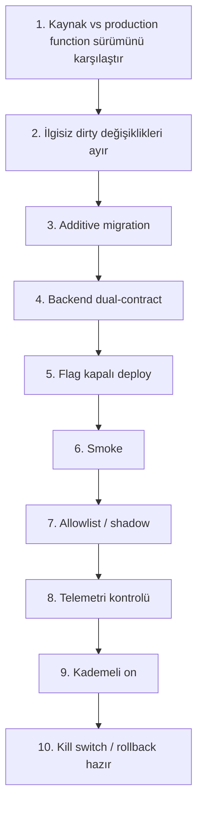

Toplu `supabase db push`, bekleyen ilgisiz migration'lar varken kullanılmamalıdır.

### 31.4 Sahip-özel işlemler

App Store'a gönderim (`Add for Review`), manuel release, production rollout flag
aktivasyonu ve canlı davranış değiştiren tüm operasyonlar yalnız proje sahibinin açık
talimatıyla yapılır.

---

## 32. Kritik invariant'lar

1. Kullanıcı yalnız kendi analiz, fotoğraf, bulgu, firma ve raporunu görür.
2. İstemci ücretli tier açamaz.
3. Free/Plus/Pro kotaları backend'de enforce edilir.
4. Production fotoğraf limiti 1/3/3'tür.
5. Completed analiz sonradan failed olmaz.
6. Aynı analysis ID iki queue mesajı veya iki kota üretmez.
7. Claim kaybeden worker sonuç yazamaz.
8. Ambiguous transport aktif claim'i bırakmaz.
9. Finalization; bulgu + analiz + kota için atomiktir.
10. Coverage repair en fazla bir generation'dır.
11. Repair ikinci kullanıcı kotası tüketmez.
12. Cancelled Plus trial hiçbir paid AI alias kullanmaz.
13. Normal Plus/Pro iptali, entitlement süresi dolmadan Free AI'ya geçirilmez.
14. Rapor snapshot'ı sonradan editten etkilenmez.
15. Token refresh kullanıcı tercihlerini açmaz.
16. Bilinmeyen notification kind gönderilmez.
17. Engagement rule `shadow` iken gerçek push göndermez.
18. Secret, prompt ve fotoğraf telemetriye yazılmaz.
19. Kullanıcı arayüzünde APNs accepted "kesin teslim" olarak gösterilmez.
20. Yeni dil; UI + AI + rapor + legal + test birlikte düşünülür.
21. Güvenlik yargı alanı storefront/IP/cihaz bölgesinden çıkarılmaz.
22. Uygulama dili ve çıktı dili, istek oluşturulduktan sonra değişmez.
23. Türkçe App Store metadata ve görselleri açık talimat olmadan değiştirilmez.

---

## 33. Bilinen borçlar ve açık riskler

### 33.1 Yüksek öncelik

| # | Konu | Etki |
| --- | --- | --- |
| 1 | **Canlı sürümün kaynağı commit'li değil.** HEAD `1.2.4 (77)`; App Store'da `1.3.1 (81)`. Build 78–81 için commit ve tag yok, kaynak yalnız dirty worktree'de. | Rollback ve yeniden üretilebilirlik yok |
| 2 | **`ios_release_policy` bayat** (`latest_build: 77`). | Build 77 kullanıcıları güncelleme uyarısı almıyor |
| 3 | **Onboarding adım 10 ve 11 ölçülmüyor.** `OBNotificationPermissionView` ve `OBTimelinePaywallView` hiç `paywall_events` basmıyor. | Trial/paywall dönüşüm hunisi kör |
| 4 | **`user_onboarding_answers.completed_at` yanıltıcı.** Adım 8'deki auth sync'inde yazılıyor (~30 sn), onboarding sonunda değil. | "Tamamlandı" metriği paywall'a ulaşımı kanıtlamıyor |
| 5 | **PLUS/PRO kullanıcı bildirim adımını atlıyor.** Ücretli hesap adım ≥9'da onboarding'i bitiriyor, bildirim izni adım 10'da. | Ücretli kullanıcı iOS bildirim izni hiç istemeden geçebiliyor |

### 33.2 Orta öncelik

- **Flag ikizleri:** `multi_photo_analysis` içinde `features.multi_photo_analysis=true`
  ama `enable_multi_photo_analysis=false` gibi çelişkili çiftler var. Kod `features.*`
  haritasını öncelikli okur (`analyze/index.ts:793`), davranış doğrudur; ancak `features`
  bloğu silinirse tüm multi-photo sessizce kapanır.
- **Engagement otomasyonu fiilen atıl:** %5 rollout × ~14 heartbeat gönderen kullanıcı ≈ 0.
  2 Ağustos'tan beri hiç engagement bildirimi gönderilmedi (cron sağlıklı).
- **Plus yıllık 7 günlük trial 30 Eylül 2026'da bitiyor** — ASC'de uzatma kararı gerekiyor.
- Legacy isimler: `plus_pro_5_photo_limit`, `visible_photo_slots_in_ui=5`, `marketing`
  notification tercihi, `retention-cleanup` dosya yorumu.
- `private` tablolarda RLS savunma-derinliği kararı beklemede.
- Certificate pin bakım runbook'u yok.
- App Store accessibility declaration yayınlanmamış görünüyor.

### 33.3 Ölçüm boşluğu

Sunucu tarafında **install/impression verisi yok**. 3–6 Ağustos arasında sıfır yeni kayıt
gözlendi; auth logunda hiç kayıt denemesi yok, yani kullanıcılar hata almıyor — trafik
gelmiyor. Reklamların durdurulmuş olması ve yeni sürümün ASO sıfırlaması bu tabloyu
açıklıyor, ancak kesinleştirmek için App Store Connect Analytics (impression / ürün sayfası
görüntüleme / indirme) verisi gerekir.

---

## 34. Operasyonel sorun çözme

### 34.1 Analiz iki kez AI çağırmış görünüyor
Aynı `analysis_id + job_mode + generation` için kaç `ai_usage_logs` satırı var?
`provider_request_count` kaç? `provider_attempts.reason` nedir? `analysis_job_events`
içinde ambiguous/lease retry var mı? Coverage repair generation oluşmuş mu?
MAX_TOKENS/schema/key/model/provider fallback var mı? — İki fiziksel istek her zaman
duplicate worker değildir.

### 34.2 Cancelled trial paid alias kullanmış
`user_subscriptions.will_renew` · trial tarihleri · product/trial product ID · status ·
bitiş uyumu · flag · `ai_execution_route` · `quality_tier` · `api_key_alias` ·
cancellation webhook/sync zamanı.

### 34.3 Analiz kuyrukta kaldı
PGMQ depth/oldest · `analysis_job_state` active msg/generation · lease · worker cron ·
job events · analyze function status · provider error · persistence pending.
Fotoğrafsız ve hiç enqueue edilmemiş eski `pending` taslak backlog sayılmaz.

### 34.4 Push gitmedi
iOS system authorization · aktif production token · master `enabled` · kind preference ·
`app_reminders` veya ilgili transactional alan · token environment · APNs response ·
kalıcı token invalidation · quiet hours / rate cap · rule status · kill switch / campaign pause.

### 34.5 Rapor oluşmadı
Analiz completed mı? · görünür bulgu var mı? · rapor kotası · Free risk-analysis trial ·
analysis edit version/snapshot · storage upload · `register-report` veya XLSX response ·
request/support ID.

### 34.6 OTP e-postası gelmiyor
`auth-send-email-hook` aktif sürümü · hook yanıtı JSON + `Content-Type` içeriyor mu ·
Resend API durumu · kullanıcı başına 60 sn ve proje geneli 30/saat rate limit ·
Supabase Auth logunda `/otp` hata kodu.

---

## 35. Kaynak dosya haritası

| Konu | Ana kaynak |
| --- | --- |
| Uygulama state / root | `App/AppState.swift`, `App/RootView.swift` |
| Onboarding koordinatörü | `App/Views/Onboarding/V2/OnboardingViewV2.swift` |
| Onboarding ekranları | `App/Views/Onboarding/V2/Screens/` |
| Planlar ve tier | `App/Models/UserProfile.swift` |
| RevenueCat | `App/Services/SubscriptionManager.swift` |
| Paywall telemetrisi | `App/Services/PaywallEventService.swift` |
| Auth | `App/Services/AuthService.swift` |
| Fotoğraf / submit | `App/Services/AnalysisService.swift` |
| Analiz backend | `supabase/functions/analyze/index.ts` |
| Worker | `supabase/functions/process-analysis-jobs/index.ts` |
| Coverage sözleşmesi | `supabase/functions/analyze/photo-coverage-contract.ts` |
| Katman denetimi | `supabase/functions/analyze/inspection-layer-audit.ts` |
| Cancelled trial route | `supabase/functions/_shared/cancelled-plus-trial-routing.ts` |
| Lokalizasyon çözümleyici | `supabase/functions/_shared/localization-context-resolver.ts` |
| AI lokalizasyon promptu | `supabase/functions/_shared/ai-localization-prompt.ts` |
| AI dil doğrulaması | `supabase/functions/_shared/ai-localization-validation.ts` |
| Güvenlik profili manifesti | `supabase/functions/_shared/safety-profile-manifest.ts` |
| Profil kaynakları | `localization/safety-profiles/*.yaml` |
| iOS dil altyapısı | `App/Services/RDLocalization.swift`, `App/Localization/` |
| Build gate | `App/Localization/RDGlobalLocalizationBuildGate.swift` |
| Findings | `App/Models/Finding.swift` |
| Canvas / sektör | `App/Models/AnalysisCanvas.swift`, `App/Models/AnalysisSector.swift` |
| PDF | `App/Services/PDFReportService.swift` |
| Excel | `supabase/functions/generate-excel-report/index.ts` |
| Bildirim (iOS) | `App/Services/NotificationService.swift` |
| Push sender | `supabase/functions/send-push-notification/index.ts` |
| Engagement worker | `supabase/functions/process-notification-automation/index.ts` |
| Notification ops API | `supabase/functions/manage-notification-automation/index.ts` |
| Auth e-posta hook | `supabase/functions/auth-send-email-hook/index.ts` |
| Mesleki ilerleme | `App/Features/ProfessionalProgress/` |
| Legal | `App/LegalDocuments/`, `App/Services/LegalDocumentService.swift` |
| Runtime config | `App/Services/RDConfig.swift` |
| Release kaydı (build 80) | `docs/BUILD_80_PRODUCTION_RELEASE_2026-08-02.md` |
| Handoff (build 80) | `docs/NEW_CHAT_HANDOFF_RISKDETECTED_BUILD80_LOCALIZATION_CONTEXT_2026-08-02.md` |
| ASO araştırması | `docs/ASO_IOS_ENGLISH_KEYWORD_RESEARCH_APPLYRA_2026-08-02.md` |
| Bildirim rehberi | `docs/RISKDETECTED_NOTIFICATION_AUTOMATION_OPERATIONS_CENTER_GUIDE_2026-07-25.md` |
| Eski ana referans | `docs/RISKDETECTED_ACTIVE_SYSTEM_MASTER_REFERENCE_2026-07-28.md` |

---

## 36. Sürüm geçmişi

| Sürüm | Build | Tarih | Öne çıkan |
| --- | ---: | --- | --- |
| 1.0 | 60 | 14 May 2026 | İlk yayın |
| 1.1 / 1.1.1 | 61–62 | Haz 2026 | İlk iyileştirme dalgası |
| 1.2.0 | 72 | 25 Haz 2026 | Analiz pipeline iyileştirmeleri |
| 1.2.1–1.2.3 | 73–76 | Haz–Tem 2026 | Çoklu fotoğraf runtime guard'ı, Plus/Pro 3 fotoğraf |
| 1.2.4 | 77 | 25 Tem 2026 | Bildirim tercihi sadeleştirme, güvenilirlik |
| 1.3.0 | 80 | 2 Ağu 2026 | **Global lokalizasyon Wave 1**: tam İngilizce, 5 güvenlik profili, 12 katmanlı çoklu fotoğraf denetimi, EN mağaza metadata'sı |
| 1.3.1 | 81 | 3 Ağu 2026 | Bildirim tercihi senkronizasyonu, legal bildirim düzeltmesi, EN keyword güncellemesi, onboarding metin düzeltmesi |

### 36.1 1.3.0 → 1.3.1 arası production müdahaleleri

| Tarih | İşlem |
| --- | --- |
| 2 Ağu | `auth-send-email-hook` v10 — OTP `hook_payload_invalid_content_type` düzeltmesi; e-posta kotası 2/saat → 30/saat |
| 2 Ağu | 13 lokalizasyon flag'ine Build 80 eklendi, manuel App Store release |
| 2 Ağu | Engagement otomasyonu shadow → active, %5 rollout |
| 2 Ağu | Legal "görüldü" backfill (60 kayıt) + version/checksum sözleşmesi |
| 2 Ağu | Bildirim kategorisi restore migration'ı + 65 hesap backfill |
| 2 Ağu | Build 81 flag'lere eklendi (`20260802214159`) |
| 3 Ağu | `first_seen_device_region` alanı + write-once RPC |
| 3 Ağu | Applyra keyword takibi 73 → 116 |
| 3 Ağu | 1.3.1 (81) App Store'da yayınlandı |

---

**Belge sonu.** Yeni release, plan kuralı, provider route, notification aktivasyonu veya
lokalizasyon yayını sonrasında bu dosya tarih/sürüm etiketiyle güncellenmelidir.
