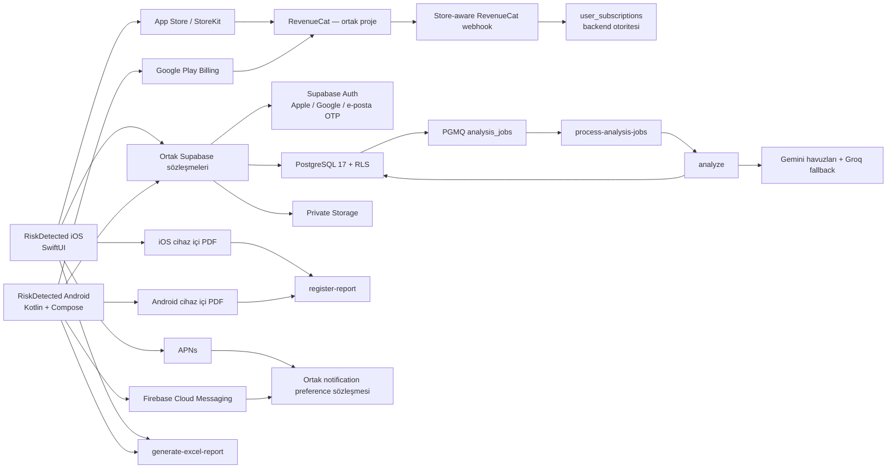
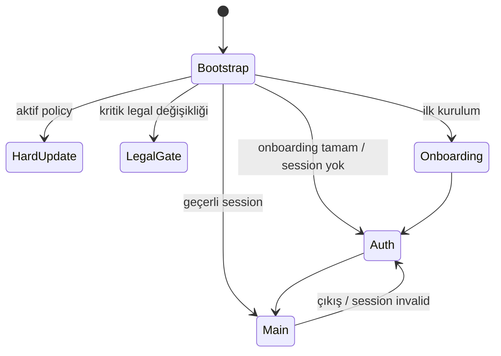
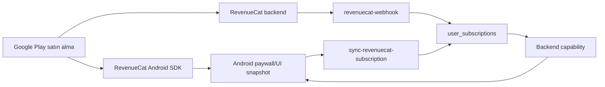
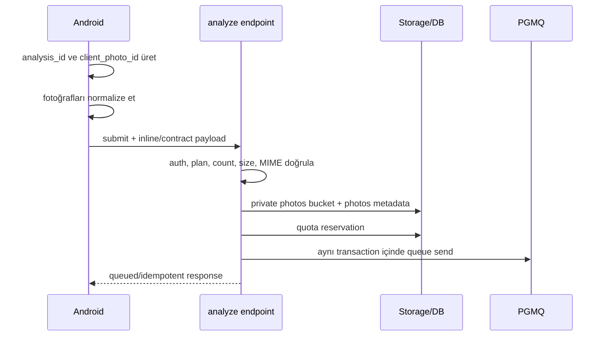
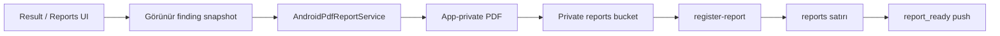

# RiskDetected Android — Güvenli Geçiş, Ortak Platform ve Google Play Yayın Master Planı

**Belge sürümü:** 1.0  
**Hazırlanma tarihi:** 6 Ağustos 2026 — Europe/Istanbul  
**Durum:** Uygulama geliştirmeye hazır ana plan; production deploy, mağaza gönderimi veya rollout yetkisi vermez  
**Kaynak temel:** `RISKDETECTED_SISTEM_MIMARI_VE_AKIS_REFERANSI_2026-08-06.md`  
**Mevcut canlı ürün:** RiskDetected iOS `1.3.1 (81)`  
**Hedef:** Aynı kullanıcı hesabı, aynı veri, aynı abonelik hakları ve aynı backend kurallarıyla çalışan güvenli bir Android istemcisi; Google Play üzerinden kontrollü dağıtım  
**Birincil hedef kitle:** Claude/Codex, Android/iOS/backend geliştiricileri, QA, güvenlik, operasyon ve ürün sahibi

---

## İçindekiler

- **Temel ve kararlar:** 0 Kullanım · 1 Kaynak otoritesi · 2 Mimari kararlar · 3 Başarı ölçütleri · 4 Kapsam dışı · 5 Ön koşul kapıları
- **Platform mimarisi:** 6 Hedef mimari · 7 Android yığını · 8 Repo/modüller · 9 Ortam izolasyonu · 10 Mobil sözleşme · 11 Backend platformlaştırma · 12 Auth
- **Ürün paritesi:** 13 Onboarding/profil · 14 Abonelik · 15 Fotoğraf · 16 Sektör/canvas · 17 Queue/retry · 18 AI/coverage · 19 Bulgular · 20 Rapor · 21 Firma/ilerleme · 22 Bildirim · 23 Lokalizasyon/legal
- **Kalite ve yayın:** 24 Erişilebilirlik · 25 Güvenlik · 26 Gözlemlenebilirlik · 27 Test · 28 CI/CD · 29 Play Console · 30 Rollout/rollback
- **Uygulama yönetimi:** 31 Fazlar · 32 Backlog · 33 Kabul kriterleri · 34 Agent protokolü · 35 Başlangıç prompt’u · 36 Karar defteri · 37 Invariant’lar · 38 Güncel gereksinimler · 39 Ana referans güncellemesi · 40 Yayın kararı

---

## 0. Bu belge nasıl kullanılmalı?

Bu belge bir “Android ekranlarını kopyala” talimatı değildir. Android istemcisinin mevcut iOS uygulamasıyla **aynı ürün** olarak çalışmasını; buna karşın platforma özgü kimlik doğrulama, satın alma, bildirim, izin, depolama ve dağıtım davranışlarının güvenli biçimde ayrılmasını tanımlar.

Belgede kullanılan işaretler:

- **[MEVCUT]**: Kaynak sistem referansında doğrulanmış canlı davranış veya sözleşme.
- **[KARAR]**: Android için önerilen hedef mimari kararı.
- **[GATE]**: Sonraki aşamaya geçmeden kapanması zorunlu yayın kapısı.
- **[OPS]**: Yalnız proje sahibinin açık talimatıyla yapılabilecek production/mağaza işlemi.
- **[DOĞRULA]**: Kaynak belgede bulunmayan ve repo, production veya yönetim konsolunda doğrulanması gereken alan.

Claude/Codex bu belgeyi aldığında:

1. Önce Bölüm 34’teki çalışma kurallarını uygulamalı.
2. Kod yazmadan önce repo ve production sözleşme farkı raporu üretmeli.
3. Mevcut iOS davranışını varsayım yoluyla yeniden tanımlamamalı; ilgili Swift, Edge Function ve migration kaynağını okumalı.
4. Production’a hiçbir şey deploy etmemeli, flag açmamalı, Play/App Store işlemi yapmamalı.
5. Her fazı ayrı ve geri alınabilir değişiklikler hâlinde teslim etmeli.

---

## 1. Kaynak otoritesi ve mevcut sistem temeli

### 1.1 Kaynak önceliği

Çelişki hâlinde şu sıra geçerlidir:

1. Production veritabanı ve aktif Edge Function sürümü.
2. App Store Connect’teki aktif uygulama/sürüm kaydı.
3. Canlı build `81`in imzalanmış kaynak kodu ve Xcode ayarları.
4. En yeni migration ve release teslim belgeleri.
5. Eski proje belgeleri ve arşiv kayıtları.
6. Bu Android planındaki öneriler.

Bu plan, production gerçeğini değiştiren bir otorite değildir. Repo ve production incelemesi sırasında farklılık bulunursa önce fark belgelenir; davranış sessizce “düzeltilmez”.

### 1.2 Canlı ürün özeti

**[MEVCUT]**

- Ürün, saha fotoğraflarından görünür iş sağlığı ve güvenliği tehlikelerini analiz eder.
- Bulgular kanıt, kök neden, düzeltici önlem, önleyici kontrol ve risk skorlarıyla yapılandırılır.
- Kullanıcı AI bulgularını düzenleyebilir veya silebilir.
- Raporlar PDF ve XLSX olarak üretilir.
- Backend Supabase Auth, PostgreSQL + RLS, private Storage, Deno Edge Functions, `pgmq` ve `pg_cron` kullanır.
- Ana AI sağlayıcısı Gemini; süreklilik fallback’i Groq’tur.
- Abonelik otoritesi backend’deki `user_subscriptions` ve RevenueCat doğrulamasıdır.
- Canlı fotoğraf limiti **Free 1 · Plus 3 · Pro 3**tür.
- Uygulama karar destek ve dokümantasyon aracıdır; profesyonel saha kontrolünün veya hukuki uygunluk değerlendirmesinin yerine geçmez.
- Uygulama dilleri Türkçe ve İngilizcedir.
- Türkiye dışı güvenlik profilleri terminoloji rehberidir; mevzuat uygunluk sertifikası değildir.
- Çin anakarası bu AI destekli sürüm için kapsam dışıdır.

### 1.3 Android geçişinde korunacak kullanıcı değeri

Android sürümü, ayrı veya sadeleştirilmiş bir ürün olmayacaktır. Kullanıcı:

- iOS’ta oluşturduğu hesabıyla Android’e girebilmeli;
- aynı analiz, bulgu, rapor, firma ve profil verisini görmeli;
- iOS veya Google Play üzerinden edindiği aktif hakları aynı Supabase kullanıcı kimliğiyle kullanabilmeli;
- bir platformda oluşturduğu server-side veriye diğer platformdan ulaşabilmeli;
- platform değiştirince kota, trial, plan veya retention kurallarını aşamamalı;
- dil ve güvenlik profili seçimlerini kontrollü biçimde sürdürebilmeli;
- Android’e geçerken yeni veya mükerrer kullanıcı hesabına düşmemeli.

---

## 2. Yönetici özeti: bağlayıcı mimari kararlar

### ADR-001 — İstemci teknolojisi

**[KARAR] Android istemcisi native Kotlin + Jetpack Compose olarak geliştirilecek.**

Gerekçe:

- Canlı iOS uygulaması Swift/SwiftUI ile olgunlaşmıştır; iOS’u Flutter/React Native/KMP’ye taşımak yeni ve gereksiz bir yeniden yazım riski oluşturur.
- Kamera, Photo Picker, Google Play Billing, FCM, Credential Manager, App Links, Play Integrity ve Android yaşam döngüsü native uygulamada daha doğrudan yönetilir.
- Ürün mantığının otoritesi zaten backend’dedir; en değerli paylaşım noktası UI kodu değil, API/veri/sözleşme/test katmanıdır.
- Android erişilebilirlik, process death, izin ve geniş ekran davranışlarının Android-native ele alınması gerekir.

**KMP bu ilk sürümün kapsamı dışındadır.** Parite ve production istikrarı sağlandıktan sonra yalnız saf model/validasyon kodları için ayrı ADR ile değerlendirilebilir.

### ADR-002 — Ortaklık modeli

**[KARAR] UI paylaşılmayacak; backend, veri sözleşmeleri, domain kuralları, feature-flag semantiği ve test fixture’ları paylaşılacak.**

- iOS SwiftUI istemcisi korunur.
- Android Compose istemcisi ayrı modüllerde geliştirilir.
- Supabase production projesi ortak kalır.
- RevenueCat projesi ortak, store uygulamaları ayrıdır.
- Push taşıyıcıları APNs ve FCM olarak ayrılır.
- Store katalogları Apple App Store ve Google Play olarak ayrılır.
- Sunucu hakları ve kotaları platformdan bağımsız kalır.

### ADR-003 — Android sürüm tabanı

**[KARAR]**

- `minSdk = 26`
- `compileSdk = 36`
- `targetSdk = 36`
- Java toolchain: JDK 17
- Çıktı: Android App Bundle (`.aab`)
- Dağıtım: Google Play App Signing
- İlk `versionCode`: `1`
- `versionName`: ortak ürün release planına göre belirlenir; backend ve flag’lerde hiçbir zaman platform belirtilmeden tek başına kullanılmaz.

`targetSdk 36`, 31 Ağustos 2026’da yürürlüğe girecek Google Play yeni uygulama/güncelleme şartını son anda yakalamak yerine başlangıçtan karşılar. `minSdk 26`, Supabase Kotlin istemci tabanıyla uyumludur ve güvenli modern Android API’lerine yeterli taban sağlar.

### ADR-004 — Paket adı

**[KARAR, DOĞRULA] Önerilen production `applicationId`: `com.riskdetected.app`.**

Bu değer:

- Google Play’de uygulama kaydı oluşturulmadan önce müsaitlik açısından doğrulanmalı;
- ilk bundle yüklenmeden önce kesinleştirilmeli;
- sonradan değiştirilemeyeceği kabul edilmeli;
- App Links, Firebase, RevenueCat, Play Console ve backend release policy kayıtlarının tamamında aynı kullanılmalı.

Müsait değilse ikinci tercih `com.riskdetected.android`dır. Karar verildikten sonra hiçbir ortamda farklı production kimliği kullanılmaz.

### ADR-005 — Production erişim modeli

**[KARAR] Android release binary’si aşağıdaki üç koşul aynı anda sağlanmadan production analiz submit edemez:**

1. `android_client_enabled = true`
2. İlgili `versionCode`, Android allowlist’indedir.
3. Kullanıcı rollout yüzdesi veya açık beta allowlist’i içindedir.

Buna ek olarak ödeme, push ve rapor için ayrı kill switch bulunur. Tek bir “Android açık” flag’i tüm riskleri aynı anda aktive etmez.

### ADR-006 — Mevcut iOS’a zarar vermeme

**[KARAR]**

- Backend değişiklikleri additive ve dual-contract olacaktır.
- Mevcut iOS request/response alanları kaldırılmayacak veya anlam değiştirmeyecektir.
- iOS build allowlist’leri ile Android `versionCode` allowlist’leri ayrı tutulacaktır.
- APNs hattı FCM eklenirken yeniden yazılıp riskli hâle getirilmeyecek; ortak dispatcher altında mevcut davranış korunacaktır.
- RevenueCat Apple webhook yorumlaması Android ürünleri eklenirken bozulmayacaktır.
- Android rollout başarısız olursa iOS davranışı feature flag veya migration geri dönüşünden etkilenmemelidir.

---

## 3. Başarı ölçütleri

Android public rollout’u ancak aşağıdaki sonuçlar kanıtlandığında başarılı sayılır.

### 3.1 Kimlik ve veri sürekliliği

- Mevcut Apple-only iOS kullanıcısı Android’de aynı Supabase `user_id` ile oturum açar.
- Google/e-posta kullanıcıları platformlar arasında aynı hesaba ulaşır.
- Aynı kullanıcı için yanlışlıkla ikinci `profiles` veya `user_subscriptions` kaydı oluşmaz.
- Android’den iOS verileri; iOS’tan Android verileri owner/RLS sınırları içinde görünür.
- Bir kullanıcının başka kullanıcı verisine erişebildiği tek bir test dahi yoktur.

### 3.2 Plan ve satın alma sürekliliği

- iOS’tan alınmış aktif Plus/Pro hakkı Android’de backend tarafından tanınır.
- Google Play’den alınmış aktif Plus/Pro hakkı iOS’ta backend tarafından tanınır.
- İstemci SDK snapshot’ı ücretli görünse bile backend doğrulamadan ücretli capability açılmaz.
- Free/Plus/Pro kota ve fotoğraf limitleri server-side 1/3/3 olarak korunur.
- Cancelled Plus yıllık trial hiçbir paid AI alias’ına yönlenmez.
- Mükerrer satın alma, mükerrer entitlement veya yanlış kullanıcıya entitlement toleransı sıfırdır.

### 3.3 Analiz ve rapor paritesi

- Android, aynı sektör/canvas/plan/lokalizasyon bağlamıyla aynı backend analiz hattını kullanır.
- Queue idempotency, claim, lease, retry ve transactional finalization invariant’ları değişmez.
- Çoklu fotoğraf exact coverage ve tek repair generation kuralları korunur.
- Android PDF’leri görünür finding snapshot’ına dayanır ve `register-report` üzerinden arşive girer.
- XLSX mevcut `generate-excel-report` fonksiyonundan üretilir.
- Rapor snapshot’ı sonraki finding editlerinden etkilenmez.

### 3.4 Operasyonel güvenlik

- Production loglarında secret, fotoğraf, prompt, tam AI response veya PII bulunmaz.
- Android crash, ANR, auth, analysis, billing ve push metrikleri platform ayrımıyla görülebilir.
- Rollout durdurma ve Android-only kill switch prova edilmiştir.
- iOS’ın auth, analiz, satın alma, rapor ve push smoke testleri Android backend değişikliklerinden sonra geçer.

---

## 4. Kapsam dışı işler

İlk Android public sürümüne aşağıdakiler eklenmeyecektir:

- iOS’un cross-platform framework’e taşınması.
- KMP/Flutter/React Native ortak UI.
- Yeni plan, fiyatlandırma veya kota.
- 5 fotoğraf desteği.
- Manuel sıfırdan bulgu ekleme.
- Sosyal akış, mesajlaşma veya herkese açık kullanıcı içeriği.
- Fotoğrafta görünmeyen koşulları kesin gerçek sayan yeni AI davranışı.
- Storefront/IP/cihaz bölgesinden güvenlik yargı alanı çıkarımı.
- Mevcut Türkçe App Store metadata’sının değiştirilmesi.
- Android’e özel yeni işlevin iOS paritesi olmadan production’a açılması.
- Offline AI analizi.
- Android uygulamasına Gemini, Groq veya Supabase service-role secret’ı gömme.
- Google Play dışı Android mağazalarında ilk yayın.
- Çin anakarası desteği.

---

## 5. Zorunlu ön koşul kapıları

### GATE-00 — Canlı iOS kaynağını yeniden üretilebilir hâle getir

Kaynak referansta canlı App Store sürümü `1.3.1 (81)` iken repo `HEAD`inin `1.2.4 (77)` olduğu; build 78–81 kaynaklarının yalnız dirty worktree’de bulunduğu belirtilmiştir.

Android branch’i açılmadan önce:

- build 81’e karşılık gelen kaynak farkı incelenmeli;
- ilgisiz veya gizli dosyalar ayrılmalı;
- tam kaynak commit’lenmeli;
- imzalı build ile eşleşen tag oluşturulmalı;
- tag’den tekrar build alınmalı;
- hash, Xcode ayarları ve release notu kaydedilmeli;
- rollback referansı oluşturulmalıdır.

**Exit:** Build 81 kaynak ve konfigürasyonu temiz checkout’tan yeniden üretilebiliyor.

### GATE-01 — Bayat iOS release policy’yi düzelt

`ios_release_policy.latest_build` kaynak referansta hâlâ `77`dir.

- Önce mevcut iOS istemci davranışı smoke test edilir.
- `latest_build` canlı build ile uyumlu hâle getirilir.
- `minimum_supported_build`, soft/hard update kararları ürün sahibi tarafından onaylanır.
- Android için aynı kaydı kullanmak yerine ayrı `android_release_policy` tanımlanır.

**Exit:** iOS build 77/80/81 davranışları test edilmiş ve policy production gerçeğini yansıtıyor.

### GATE-02 — Onboarding ölçüm ve bildirim akışı borçlarını kapat

Android onboarding’i kopyalanmadan önce:

- adım 10 bildirim izni ve adım 11 timeline paywall event’leri eklenir;
- `user_onboarding_answers.completed_at`, onboarding’in gerçek sonunu ifade edecek şekilde düzeltilir veya yeni açık bir alan eklenir;
- Plus/Pro kullanıcının adım 10’u atlaması düzeltilir;
- iOS davranışı ve backend event sözleşmesi test edilir.

**Exit:** TR/EN ve Free/Plus/Pro onboarding hunisi adım bazında ölçülüyor; notification permission adımı hiçbir planda yanlışlıkla atlanmıyor.

### GATE-03 — Staging ortamını kur veya doğrula

**[DOĞRULA]** Kaynak belgede ayrı staging Supabase/Firebase/RevenueCat ortamı doğrulanmamıştır.

Zorunlu ayrım:

- Supabase staging projesi;
- staging DB, Storage, Edge Functions, cron ve queue;
- fake veya düşük maliyetli test AI provider yönlendirmesi;
- RevenueCat test/staging app ve Google Play license test hesapları;
- Firebase staging projesi;
- staging domain/deep link;
- sentetik test kullanıcıları;
- production verisi içermeyen fixture’lar.

**Exit:** Android `debug` ve `qa` build’leri production endpoint/key kullanamıyor.

### GATE-04 — Cross-platform kimlik eşleşmesini kanıtla

Apple native iOS girişi ile Android web OAuth girişi aynı Apple/Supabase kimliğine bağlanmalıdır.

Test edilmesi zorunlu örnekler:

1. Mevcut Apple-only iOS hesabı → Android Sign in with Apple → aynı `auth.users.id`.
2. Apple Hide My Email hesabı → Android → aynı kullanıcı.
3. Aynı e-posta ile Google identity ekleme → kontrollü link.
4. Apple credential revoked → güvenli recovery.
5. Apple Services ID yanlış gruplu → duplicate hesabın engellenmesi.
6. E-posta OTP ile alternatif erişim.
7. Hesap linkleme sırasında aktif RevenueCat subscriber kimliğinin korunması.

Başarılı sonuç kanıtlanamazsa Android public launch öncesinde iOS companion build’i:

- kullanıcının e-posta/Google identity bağlamasını;
- mevcut hesabı doğrulamasını;
- duplicate hesap riskine karşı uyarı ve recovery akışını

sağlamalıdır.

**Exit:** Apple-only test kullanıcılarında yüzde 100 aynı Supabase kullanıcı kimliği.

### GATE-05 — Backend’i platform-aware yap

Android production’a bağlanmadan önce:

- `client_platform`;
- platforma özel build allowlist;
- platforma özel release policy;
- store-aware abonelik alanları;
- APNs/FCM token ayrımı;
- device installation modeli;
- platforma göre telemetri

additive migration’larla tamamlanmalıdır.

**Exit:** iOS ve Android istekleri aynı build numarasıyla dahi karışmıyor.

### GATE-06 — Google Play abonelik kataloğu ve webhook paritesi

- Google Play ürün/base plan/offer yapısı oluşturulur.
- RevenueCat aynı projeye Android app olarak eklenir.
- App User ID Supabase `auth.uid()` olur.
- Webhook PLAY_STORE olaylarını store-aware işler.
- trial/cancel/grace/hold/refund/expiration test edilir.
- iOS haklarının Android’de, Android haklarının iOS’ta görünmesi kanıtlanır.

**Exit:** Hiçbir plan hakkı istemci kararıyla veya yanlış store mapping’iyle açılmıyor.

### GATE-07 — Android push hattı

- Firebase/FCM yapılandırılır.
- FCM HTTP v1 server sender eklenir.
- token tablosu provider/platform ayrımına kavuşur.
- notification kind → preference mapping’i ortak kalır.
- Android 13+ runtime izin akışı tamamlanır.
- unknown kind fail-closed test edilir.

**Exit:** APNs ve FCM birbirini etkilemeden aynı tercih sözleşmesiyle çalışıyor.

### GATE-08 — Legal, Data Safety ve hesap silme

- Privacy Policy Android/Firebase/Google Play/RevenueCat veri akışlarını kapsar.
- Play Data Safety formu gerçek SDK ve veri akışına göre hazırlanır.
- Hesap silme uygulama içinde çalışır.
- Google Play’in istediği dış web hesap silme URL’si yayınlanır.
- Aktif Google Play aboneliğinde hesap silme/cancel açıklaması ve yönetim bağlantısı test edilir.
- Retention ve AI provider işleme açıklamaları doğrulanır.

**Exit:** Uygulama içi ve web silme akışı aynı hesabı güvenle işler; mağaza beyanı gerçek davranışla eşleşir.

### GATE-09 — Plus yıllık trial kararı

Mevcut Plus yıllık 7 günlük Apple trial teklifinin planlanan bitişi 30 Eylül 2026’dır.

Ürün sahibi şu seçeneklerden birini açıkça seçer:

- Her iki store’da 7 günlük trial’ı sürdür.
- Apple trial’ı uzat, Google Play’de eşdeğer offer oluştur.
- Trial’ı kontrollü biçimde kapat ve onboarding/paywall metinlerini güncelle.
- Platformlar arasında farklı trial uygula; bu farkı UX/legal/telemetride açıkça göster.

Karar verilmeden Google Play trial offer production’a açılmaz.

### GATE-10 — Certificate pinning runbook

Android’e pinning eklenmeden önce:

- mevcut Supabase TLS chain’i;
- stable SPKI pin seçimi;
- en az bir backup pin;
- expiration tarihi;
- chain değişimi izleme;
- acil binary release prosedürü;
- staging ve production doğrulama script’i

belgelenmelidir.

**Exit:** Tek sertifika rotasyonu uygulamayı ağdan koparmayacak şekilde test edilmiş runbook.

---

## 6. Hedef mimari



### 6.1 Ortak olanlar

- Supabase kullanıcı kimliği.
- `profiles`, onboarding, analyses, photos, findings, reports, companies.
- `user_subscriptions` ve plan capability kuralları.
- Kota ve retention.
- Sektör/canvas ID’leri.
- Risk yöntemleri ve skor eşikleri.
- AI prompt/coverage/finalization hattı.
- Rapor snapshot sözleşmesi.
- Notification kind/preference semantiği.
- Legal doküman seti kimliği.
- Safety profile manifesti.
- Feature flag ürün semantiği.
- Operasyon ve audit kayıtları.

### 6.2 Platforma özgü olanlar

| Alan | iOS | Android |
|---|---|---|
| UI | SwiftUI | Jetpack Compose |
| Kamera | AV/UIKit köprüleri | CameraX |
| Galeri | PhotosUI | Android Photo Picker |
| Satın alma | StoreKit | Google Play Billing |
| RevenueCat SDK | purchases-ios | purchases-android |
| Push | APNs | FCM HTTP v1 |
| Kimlik provider UI | Native Apple/Google | Credential Manager Google + Apple web OAuth |
| Deep link | iOS URL/Universal Link | Verified App Links + custom scheme fallback |
| Secure local store | Keychain | Android Keystore tabanlı encrypted storage |
| PDF renderer | `PDFReportService` | `AndroidPdfReportService` |
| Update hedefi | App Store | Google Play |
| Build kimliği | iOS build number | Android `versionCode` |
| Sistem izinleri | iOS permission modeli | Android API seviyesine göre runtime izin |

### 6.3 Paylaşılan ve cihaz-özel veriler

**Server-shared:**

- auth identity ve profil;
- plan/entitlement;
- analiz, fotoğraf metadata’sı ve bulgular;
- rapor arşivi;
- firmalar;
- onboarding cevapları;
- safety profile;
- notification kategori tercihleri;
- mesleki ilerleme;
- legal acknowledgement.

**Installation/device-local:**

- OS notification authorization;
- FCM/APNs token;
- tema tercihi;
- kamera/geçici fotoğraf dosyaları;
- tamamlanmamış yerel draft;
- sistem/app dili tercihi;
- secure session cache;
- app integrity sinyali;
- installation ID.

Bir cihazdaki sistem push izninin kapalı olması, server’daki kategori tercihlerini başka cihazlar için kapatmamalıdır.

---

## 7. Android teknoloji yığını

### 7.1 Temel yığın

| Katman | Karar |
|---|---|
| Dil | Kotlin |
| UI | Jetpack Compose + Material 3 |
| Mimari | UDF/MVI benzeri tek yönlü veri akışı; UI/Data ve gerektiğinde Domain katmanı |
| DI | Hilt |
| Asenkron | Kotlin Coroutines + Flow |
| Navigation | Release anındaki kararlı Navigation 3; GA değilse en güncel kararlı Navigation Compose |
| Network | Supabase Kotlin istemcisi, repository arkasında; gerektiğinde Ktor/OkHttp |
| JSON | kotlinx.serialization |
| Local preference | DataStore |
| Secure session | Android Keystore ile şifrelenmiş özel session store |
| Local cache/draft | Room; server otoritesi yerine geçmez |
| Background | WorkManager; yalnız idempotent bakım/registration işleri |
| Kamera | CameraX |
| Galeri | Android system Photo Picker |
| Görsel yükleme | Coil veya kontrollü bitmap pipeline; tam çözünürlük bitmap belleğe alınmaz |
| Abonelik | RevenueCat Android SDK; SDK’nın desteklediği Google Play Billing 8+ tabanı |
| Push | Firebase Cloud Messaging |
| Crash | Firebase Crashlytics — legal/Data Safety güncellemesi ve PII redaction ile |
| Integrity | Play Integrity API; önce shadow/telemetri, sonra risk bazlı enforcement |
| PDF | Android `PdfDocument` tabanlı özel renderer; üçüncü parti kütüphane ancak lisans/güvenlik incelemesiyle |
| Paylaşım | Android Sharesheet + dar path’li `FileProvider` |
| Test | JUnit, kotlinx-coroutines-test, Turbine, MockWebServer/Ktor mock, Compose UI Test, Macrobenchmark |
| Statik kalite | Android Lint, detekt, ktlint, dependency/license scan |

### 7.2 Sürüm politikası

- Release bağımlılıklarında alpha/beta kullanılmaz; zorunluysa ayrı ADR ve rollback gerekir.
- Compose bağımlılıkları BOM ile kilitlenir.
- RevenueCat sürümü uygulama başlangıcında resmi güncel kararlı sürüme pinlenir; başlangıç referansı `10.15.1`dir.
- Supabase Kotlin community-maintained olduğundan:
  - doğrudan ViewModel/UI içinde kullanılmaz;
  - tüm çağrılar interface/repository arkasında tutulur;
  - sürüm pinlenir;
  - auth, PostgREST, Storage ve Functions için contract testleri yazılır;
  - sürüm yükseltmeleri ayrı PR’dır.
- Google Play Billing doğrudan ayrıca eklenmez; RevenueCat’in transitive ve resmi desteklediği sürüm kullanılır. Billing API’ye doğrudan ihtiyaç çıkarsa sürüm çakışması dependency graph’ta test edilir.
- Native `.so` içeren her bağımlılık için 16 KB memory page uyumluluğu doğrulanır.

### 7.3 Android mimari ilkeleri

1. Compose ekranı Supabase/RevenueCat/FCM SDK’sına doğrudan erişmez.
2. ViewModel yalnız use case/repository ile konuşur.
3. Network modeli, domain modeli ve UI modeli gerektiğinde ayrılır.
4. Tüm ekran state’leri immutable `data class` olarak modellenir.
5. One-off event’ler yeniden tüketilmeyecek biçimde yönetilir.
6. Process death sonrası kritik route ve pending analysis ID geri yüklenir.
7. Server verisi için “offline cache” doğruluk otoritesi değildir.
8. Kota/plan/fotoğraf limiti UI’da gösterilse bile submit öncesi server doğrulaması esastır.
9. String literal kullanıcı metni yasaktır; tüm metin localization kaynağından gelir.
10. Debug logging release’te kapalı ve redacted olmalıdır.
11. Tasarım token’ları mevcut iOS `DesignSystem` dosyalarından belgelenerek Android theme’e taşınır; değerler tahmin edilmez.
12. Telefon odaklı olsa da ekranlar tablet/foldable üzerinde bozulmayacak adaptive layout kullanır.

---

## 8. Önerilen repo ve modül yapısı

Mevcut repo köküne aşağıdaki yapı eklenir:

```text
android/
├── app/
│   ├── src/main/
│   ├── src/debug/
│   ├── src/qa/
│   └── src/release/
├── build-logic/
├── core/
│   ├── common/
│   ├── model/
│   ├── designsystem/
│   ├── ui/
│   ├── network/
│   ├── database/
│   ├── auth/
│   ├── subscription/
│   ├── notifications/
│   ├── analytics/
│   ├── security/
│   ├── localization/
│   └── testing/
├── feature/
│   ├── splash/
│   ├── onboarding/
│   ├── auth/
│   ├── home/
│   ├── capture/
│   ├── annotation/
│   ├── analysis_setup/
│   ├── analyzing/
│   ├── result/
│   ├── history/
│   ├── reports/
│   ├── companies/
│   ├── professional_progress/
│   ├── paywall/
│   ├── profile/
│   ├── notification_settings/
│   ├── legal/
│   ├── support/
│   └── account_deletion/
├── benchmark/
├── gradle/
├── gradle/libs.versions.toml
├── settings.gradle.kts
├── build.gradle.kts
└── README.md

contracts/
├── mobile/
│   ├── api/
│   ├── models/
│   ├── errors/
│   ├── notification-routes/
│   └── fixtures/
└── design/
    └── riskdetected-tokens.json
```

### 8.1 Modül sınırları

- `core:model`: plan, analysis, finding, report, company, safety profile gibi saf modeller.
- `core:network`: Supabase wrapper, auth header/session, error mapping, retry policy.
- `core:database`: yalnız cache/draft; RLS veya server haklarının yerine geçmez.
- `core:auth`: provider orchestration, session lifecycle, account linking.
- `core:subscription`: RevenueCat SDK facade ve backend capability resolver.
- `core:notifications`: FCM token, channel, permission ve deep-link resolver.
- `core:security`: Keystore, integrity, redaction, environment guard.
- `core:analytics`: first-party event ve Crashlytics redaction.
- `feature:*`: bağımsız ekran/flow; birbirine doğrudan bağımlılık minimum.
- `contracts`: iOS/Android/backend’in aynı anlamı kullandığını doğrulayan şema/fixture.
- `app`: composition root, navigation, DI, environment config.

### 8.2 iOS kaynak eşleme tablosu

Android geliştirici ekranı kopyalamadan önce aşağıdaki otorite dosyalarını okumalıdır:

| Android alanı | Mevcut ana kaynak |
|---|---|
| Root state ve banner | `App/AppState.swift`, `App/RootView.swift` |
| Onboarding coordinator | `App/Views/Onboarding/V2/OnboardingViewV2.swift` |
| Onboarding ekranları | `App/Views/Onboarding/V2/Screens/` |
| Tier/capability | `App/Models/UserProfile.swift` |
| RevenueCat | `App/Services/SubscriptionManager.swift` |
| Auth | `App/Services/AuthService.swift` |
| Fotoğraf/submit | `App/Services/AnalysisService.swift` |
| Finding modeli | `App/Models/Finding.swift` |
| Canvas/sektör | `App/Models/AnalysisCanvas.swift`, `AnalysisSector.swift` |
| PDF | `App/Services/PDFReportService.swift` |
| Bildirim | `App/Services/NotificationService.swift` |
| Lokalizasyon | `App/Services/RDLocalization.swift`, `App/Localization/` |
| Legal | `App/LegalDocuments/`, `LegalDocumentService.swift` |
| Runtime config | `App/Services/RDConfig.swift` |
| Analiz backend | `supabase/functions/analyze/index.ts` |
| Worker | `supabase/functions/process-analysis-jobs/index.ts` |
| Coverage | `photo-coverage-contract.ts` |
| Layer audit | `inspection-layer-audit.ts` |
| Subscription özel route | `cancelled-plus-trial-routing.ts` |
| Excel | `generate-excel-report/index.ts` |
| Push | `send-push-notification/index.ts` |

---

## 9. Build varyantları ve ortam izolasyonu

### 9.1 Varyantlar

| Variant | Application ID | Backend | Store/Billing | Push | Amaç |
|---|---|---|---|---|---|
| `debug` | `com.riskdetected.app.debug` | local/staging | RevenueCat Test Store/fake | Firebase dev | Geliştirme |
| `qa` | `com.riskdetected.app.qa` | staging | Play internal test | Firebase staging | E2E/QA |
| `release` | `com.riskdetected.app` | production | Google Play production | Firebase production | Canlı |

Release binary’sinin staging endpoint’e veya debug binary’nin production endpoint’e bağlanması build-time assertion ile engellenir.

### 9.2 Konfigürasyon

Public istemci konfigürasyonu:

- Supabase URL ve publishable/anon key.
- RevenueCat public Android SDK key.
- Firebase uygulama config’i.
- App Link host.
- build/version.
- environment adı.

Secret olmayan bu değerler yine de ortam bazlı ayrılır. Aşağıdakiler hiçbir APK/AAB içinde bulunmaz:

- Supabase service-role key.
- Gemini/Groq key.
- RevenueCat REST API key/webhook secret.
- FCM service-account private key.
- Resend key.
- cron/job secret’ları.
- Play Integrity server credential.

### 9.3 İmzalama

- Google Play App Signing etkinleştirilir.
- Upload key ile app-signing key ayrılır.
- Upload key şifreli, erişim kontrollü ve yedekli tutulur.
- CI secret store dışında keystore bulunmaz.
- Debug/QA/release imzaları farklıdır.
- App Links `assetlinks.json` içinde production ve gerektiğinde QA fingerprint’leri açıkça ayrılır.
- Release bundle SHA-256 ve source commit/tag release manifestine yazılır.

---

## 10. Ortak mobil sözleşmenin platformlaştırılması

### 10.1 Geriye uyum ilkesi

Mevcut iOS payload’ları kırılmayacaktır. Android için yeni alanlar başlangıçta optional kabul edilir; backend normalize eder. Android production gate açıldıktan sonra Android isteklerinde zorunlu tutulur.

Önerilen additive alanlar:

```json
{
  "client_platform": "android",
  "client_version": "1.4.0",
  "client_build": "1",
  "client_installation_id": "uuid-v4",
  "client_locale": "tr-TR",
  "client_timezone": "Europe/Istanbul",
  "client_distribution": "google_play"
}
```

Mevcut `client_build` alanı korunur. Aynı string alan iOS build number veya Android `versionCode` taşıyabilir; anlam yalnız `client_platform` ile birlikte okunur.

### 10.2 Canonical platform değerleri

```text
ios
android
unknown
```

`web` ancak gerçek bir web istemcisi oluşursa eklenir. Sunucu/internal işler istemci gibi raporlanmaz; ayrı `source=server` alanı kullanılır.

### 10.3 Installation kimliği

Her kurulumda:

- kriptografik rastgele UUID üretilir;
- Android backup’tan geri yüklenmez;
- kullanıcı kimliği yerine geçmez;
- FCM token, heartbeat ve cihaz düzeyi telemetriyi korele eder;
- account deletion sırasında server kaydı temizlenir;
- reinstall sonrasında yeni installation oluşturur.

### 10.4 Ortak hata sözleşmesi

Claude/Codex önce mevcut Edge Function error code’larını kaynak koddan çıkarmalı ve registry oluşturmalıdır. UI string karşılaştırmasıyla karar verilmez.

Minimum typed kategoriler:

- auth/session expired;
- permission/owner;
- legal acceptance required;
- quota exceeded;
- plan/capability required;
- invalid photo count/format/size;
- analysis already submitted/completed;
- rate limited;
- provider temporary unavailable;
- terminal analysis failure;
- app update required;
- report quota/storage failure;
- purchase sync pending;
- unknown safe fallback.

Yeni error code eklenebilir; eski iOS’ın tanımadığı code için mevcut fallback korunmalıdır.

### 10.5 İdempotency anahtarları

- `analysis_id`: istemci tarafından UUID, tek workflow.
- `client_photo_id`: fotoğraf başına sabit UUID.
- report request/support ID: tekrar denemede korunur.
- token registration: installation + token bazında upsert.
- heartbeat: installation bazında rate-limited.
- billing sync: event/store transaction bazında idempotent.
- account deletion request: aktif talep varken mükerrer açılmaz.

---

## 11. Backend platformlaştırma planı

Bu bölümdeki SQL isimleri **öneridir**; gerçek migration uygulanmadan önce mevcut şema ve RPC’ler incelenmelidir.

### 11.1 `analyses` ve kullanım kayıtları

Additive alanlar:

- `client_platform text`
- `client_version text`
- mevcut `client_build` korunur
- `client_installation_id uuid`
- `client_distribution text`

Mevcut iOS kayıtları kontrollü backfill ile `ios` yapılır. Server-created/legacy belirsiz kayıtlar yanlışlıkla iOS sayılmamalı; backfill koşulu app release dönemine ve mevcut alanlara göre yazılmalıdır.

Aynı platform alanları gerektiği ölçüde:

- `ai_usage_logs`
- `usage_events`
- `paywall_events`
- `reports`
- `support_requests`
- `finding_edit_events`
- auth/heartbeat audit’leri

için eklenir.

### 11.2 Cihaz/kurulum tablosu

Önerilen yeni tablo:

```text
user_device_installations
- id uuid primary key
- user_id uuid references auth.users
- platform text
- application_id text
- installation_id uuid
- app_version text
- client_build text
- distribution text
- device_locale text
- timezone text
- os_version text
- device_model_class text
- notification_authorization text
- integrity_state text
- last_seen_at timestamptz
- created_at / updated_at
- unique(user_id, platform, application_id, installation_id)
```

Kurallar:

- RLS owner-only read/update.
- `last_seen_at` ve server zamanları RPC ile yazılır.
- İstemci başka kullanıcı ID gönderemez; `auth.uid()` kullanılır.
- Device modeli minimum ve PII’siz tutulur.
- Hassas hardware ID, Android ID, reklam ID veya konum toplanmaz.
- `user_engagement_state` mevcut iOS uyumluluğu için korunur; gerekirse installation verisinden user-level aggregate üretilir.

### 11.3 Push token şeması

`push_device_tokens` additive alanları:

- `provider`: `apns | fcm`
- `platform`: `ios | android`
- `application_id`
- `installation_id`
- `environment`: APNs için sandbox/production; FCM için firebase project alias
- `token_hash` operasyonel dedupe için
- `last_validated_at`
- `invalidated_reason`
- `app_version`, `client_build`

Token raw değeri gerekli server gönderimi dışında loglanmaz.

### 11.4 Abonelik şeması

`user_subscriptions` ve `subscription_events` için:

- `store`: `APP_STORE | PLAY_STORE | UNKNOWN`
- `store_product_id`
- `base_plan_id`
- `offer_id`
- `store_transaction_id` veya hash
- `environment`
- `original_app_user_id`
- RevenueCat canonical entitlement
- canonical tier/status/period

Mevcut Apple alanları kaldırılmaz. Canonical hak hesaplaması store-specific metadata’yı normalize eder.

### 11.5 Feature flags

Yeni flag’ler:

```text
android_client_enabled
android_auth_enabled
android_analysis_submit_enabled
android_payments_enabled
android_notifications_enabled
android_pdf_reports_enabled
android_integrity_enforcement
android_release_policy
```

Mevcut çoklu fotoğraf/lokalizasyon flag’lerinde:

```json
{
  "enabled_ios_builds": ["80", "81"],
  "enabled_android_version_codes": ["1"]
}
```

alanları ayrı tutulur.

Genel kural:

- Platform belirtilmeden build allowlist değerlendirmesi yapılmaz.
- Unknown platform varsayılan olarak kapalıdır.
- Flag parse hatası fail-closed olur.
- Android flag değişikliği iOS branch’ini etkilemez.
- Flag schema unit/pgTAP/Deno testleri vardır.

### 11.6 Release policy

Mevcut iOS kaydı korunur. Android için örnek:

```json
{
  "platform": "android",
  "latest_version_code": 1,
  "minimum_supported_version_code": 1,
  "soft_update_enabled": false,
  "hard_update_enabled": false,
  "store_url_kind": "google_play",
  "rollout_mode": "allowlist",
  "kill_switch": false
}
```

- Karşılaştırma `versionCode` ile yapılır.
- `versionName` yalnız görüntüleme/telemetri içindir.
- Policy response cache’lenebilir ancak hard update kararı açılışta refresh edilir.
- Endpoint erişilemezse uygulama mevcut oturumu gereksiz yere bloke etmez; yalnız daha önce güvenilir biçimde alınmış aktif hard block uygulanabilir.
- Hard update ancak kritik güvenlik/uyumsuzluk durumunda ürün sahibi talimatıyla açılır.

### 11.7 Edge Function dual-contract

Etkilenecek başlıca fonksiyonlar:

- `analyze`
- `process-analysis-jobs`
- `generate-excel-report`
- `register-report`
- `mutate-analysis-finding`
- `revenuecat-webhook`
- `sync-revenuecat-subscription`
- `send-push-notification`
- `send-report-ready-notification`
- `app-release-policy`
- `request-account-deletion`
- `account-deletion-complete`
- `support-contact`
- `process-notification-automation`

Her fonksiyon için:

1. Mevcut request/response fixture’ı dondur.
2. Android alanlarını additive ekle.
3. iOS fixture regression testi yaz.
4. Android fixture testi yaz.
5. Unknown platform fail-closed test et.
6. Telemetride platform alanını doğrula.
7. Rollback ve kill switch tanımla.

### 11.8 Production migration sırası

1. Mevcut production şema/function snapshot’ını al.
2. İlgisiz dirty migration’ları ayır.
3. Additive kolon/tablo migration’ı.
4. RLS/grant/pgTAP.
5. Backend dual-contract deploy.
6. Android flag’leri kapalı tut.
7. iOS smoke.
8. Android staging smoke.
9. Production user allowlist.
10. Telemetri.
11. Kademeli rollout.

Toplu `supabase db push`, bekleyen ilgisiz migration varken kullanılmaz.

---

## 12. Kimlik doğrulama ve hesap sürekliliği

### 12.1 Root state

Android root durum makinesi:



Bootstrap aynı anda:

- environment guard;
- encrypted session load;
- Supabase session refresh;
- fresh install marker;
- release policy;
- legal document state;
- profile/subscription snapshot;
- pending notification route

yükler. UI sonsuz splash’ta kalmamalı; typed recovery sunmalıdır.

### 12.2 Fresh install ve backup güvenliği

iOS’taki eski Keychain session temizliği semantiği Android’de korunur:

- `installation_id` ve fresh-install marker no-backup storage’da tutulur.
- Secure session, Android Auto Backup’a dâhil edilmez.
- Restore edilmiş ama install marker’sız session otomatik kabul edilmez.
- FCM token, installation ID ve auth token backup’tan taşınmaz.
- Fresh install’da eski encrypted preference bulunursa temizlenir.
- Kullanıcı yeniden login olur.

### 12.3 Google ile giriş

**[KARAR] Credential Manager + Sign in with Google kullanılacak.**

Akış:

1. Credential Manager Google ID token alır.
2. Nonce/state doğrulanır.
3. ID token Supabase’e verilir.
4. Supabase session encrypted store’a yazılır.
5. RevenueCat `logIn(auth.uid())`.
6. Profil, onboarding, subscription ve legal state yüklenir.
7. FCM token installation ile bağlanır.

Legacy GoogleSignIn API’si yeni uygulamanın ana yolu yapılmaz.

### 12.4 E-posta OTP

- 6 haneli OTP mevcut Supabase Auth hook/Resend hattını kullanır.
- Kullanıcı başına ve proje geneli rate limit UI’da doğru gösterilir.
- `auth-send-email-hook` başarı yanıtının `200 + JSON + application/json` sözleşmesi regression testidir.
- OTP ekranı app background/process death sonrası e-posta ve cooldown state’ini güvenli tutar.
- Kod loglanmaz.
- Clipboard otomatik okuma yapılmaz; kullanıcı açıkça paste edebilir.
- Android SMS permission istenmez.

### 12.5 Apple ile giriş — Android

Android’de Apple native SDK yerine Supabase OAuth + sistem tarayıcısı/Custom Tabs kullanılır.

Gerekli Apple yapılandırması:

- mevcut primary Apple App ID;
- buna bağlı bir Apple Services ID;
- doğru return URL;
- Services ID’nin primary App ID ile gruplanması;
- Supabase Apple provider ayarları;
- web client secret rotasyonu, en geç 6 aylık çevrim;
- rotasyon alarmı ve runbook.

Güvenlik:

- embedded WebView kullanılmaz;
- PKCE, state ve nonce doğrulanır;
- callback yalnız verified App Link veya kesin custom scheme ile kabul edilir;
- redirect host/path allowlist uygulanır;
- auth error query parametreleri loglanmaz;
- kullanıcı kimliği email metniyle değil provider identity ile eşlenir.

### 12.6 Identity linking ve duplicate hesap önleme

- Supabase `auth.uid()` tek canonical kullanıcı anahtarıdır.
- Email, RevenueCat App User ID veya cihaz ID kullanıcı anahtarı değildir.
- Otomatik same-email linking’e kör güvenilmez; provider subject ve mevcut identity listesi test edilir.
- Mevcut kullanıcıya yeni identity bağlama yalnız aktif session ve yeniden doğrulama ile yapılır.
- Başka kullanıcıya bağlı identity tespit edilirse otomatik merge yapılmaz; destek/recovery akışı açılır.
- İki kullanıcının analyses/reports/subscriptions kayıtları client tarafından merge edilmez.
- Server-side admin merge gerekiyorsa ayrı, audit’li ve owner-onaylı runbook gerekir.
- RevenueCat alias/transfer davranışı test edilmeden identity merge production’da yapılmaz.

### 12.7 Session yaşam döngüsü

- Access token loglanmaz.
- Refresh token yalnız encrypted store’da.
- 401’de sınırlı tek refresh denemesi; sonsuz retry yok.
- Session değişimi tüm repository’lere tek otoriteden yayınlanır.
- Logout:
  - Supabase signOut;
  - RevenueCat logOut;
  - local cache/draft policy’ye göre temizleme;
  - FCM token-user bağını pasifleştirme;
  - user-level preference’i değiştirmeme;
  - pending deep link’i temizleme.
- Hesap değişiminde eski kullanıcının Room cache’i görünmez.
- Multi-account cache namespace’i `user_id` ile ayrılır.

### 12.8 Auth kabul testleri

- Apple/Google/OTP ilk kayıt.
- Mevcut hesapla login.
- Hide My Email.
- Token expiry.
- Offline açılış.
- Process death OAuth callback.
- Redirect injection.
- Logout/login farklı kullanıcı.
- Fresh install + Android backup restore.
- Revoked Apple/Google access.
- Duplicate identity.
- RevenueCat App User ID değişimi.
- Account deletion sonrası eski token ile erişim.


---

## 13. Onboarding, profil ve ana navigasyon

### 13.1 Onboarding adımları

Android, mevcut V2 akışını korur:

| Adım | Ekran | Kritik davranış |
|---:|---|---|
| 0 | Splash | Marka, erişilebilir motion |
| 1 | Pain Point | Değer önerisi |
| 2 TR | Sertifika sınıfı | Türkçe branch |
| 2 EN | Professional Role | İngilizce branch |
| 3 TR | Tehlike sınıfı | Türkiye bağlamı |
| 3 EN | Safety Profile | INTL/UK/US/AU/CA, kullanıcı seçer |
| 4 | Sektör | `general` onboarding seçeneği değildir |
| 5 | Denetim sıklığı | Kişiselleştirme |
| 6 | Loading | Otomatik; yapay bekleme zorunlu değil |
| 7 | Kişisel plan özeti | Cevaplardan türetilen açıklama |
| 8 | Auth | Apple/Google/e-posta OTP |
| 9 | Trial daveti | Gerçek store offering’e göre |
| 10 | Bildirim izni | Plan fark etmeksizin ulaşılır |
| 11 | Timeline paywall | Kapatılabilir |
| Son | Main | Gerçek tamamlanma timestamp’i |

Kurallar:

- TR kullanıcı sertifika + tehlike sınıfı verir.
- EN kullanıcı professional role + safety profile seçer.
- EN onboarding atlanırsa `en-intl-generic-v1`.
- Store country, IP veya cihaz region güvenlik profili seçmez.
- Auth öncesi draft cihazda; auth sonrası `user_onboarding_answers`a idempotent sync.
- Onboarding cevapları fotoğrafta görünmeyen tehlikeyi uydurma yetkisi vermez.
- Kullanıcının back navigation ve process death davranışı test edilir.
- Legal rıza gerekiyorsa auth/ana uygulama arasında açık gate olur.

### 13.2 Onboarding telemetri sözleşmesi

Her adım için minimum:

```text
onboarding_step_viewed
onboarding_step_completed
onboarding_step_back
onboarding_step_skipped
onboarding_auth_started
onboarding_auth_completed
onboarding_trial_viewed
onboarding_trial_started
onboarding_notification_prompt_viewed
onboarding_notification_system_result
onboarding_paywall_viewed
onboarding_completed
```

Alanlar:

- `source`
- `step_id`
- `platform`
- `app_version`
- `client_build`
- `language`
- `plan_snapshot`
- `session_id`
- `user_id` yalnız auth sonrası
- timestamp server-side veya güvenilir event ingestion zamanı

Gönderilmeyecekler:

- ad/telefon/e-posta;
- certificate number;
- fotoğraf/prompt;
- serbest metin;
- tam provider token.

`completed_at`, auth sync anı değil gerçek onboarding finalidir. Geriye uyumluluk gerekiyorsa yeni `flow_completed_at` eklenir ve eski alanın anlamı değiştirilmeden deprecated edilir.

### 13.3 Ana sekmeler

Android bottom navigation:

1. **Ana Sayfa**
2. **Analizler**
3. Ortada hızlı tarama action
4. **Raporlar**
5. **Profil**

- Free günlük kota dolmuşsa hızlı tarama paywall’a yönlendirir.
- Ancak client kota snapshot’ı stale olabilir; server sonucu kesin otoritedir.
- Deep link uygun tabı ve nested destination’ı açar.
- Auth/owner doğrulanmadan entity ekranı çizilmez.
- Tablet/foldable’da bottom navigation, Navigation Rail’e adaptif dönüşebilir.

### 13.4 Profil alanları

Mevcut alanlar:

- ad soyad;
- e-posta;
- telefon;
- ünvan;
- sertifika/belge numarası;
- risk yöntemi;
- profil fotoğrafı;
- legacy firma alanları;
- plan;
- uygulama dili;
- content locale;
- work jurisdiction;
- first-seen device region.

Android:

- first-seen region write-once RPC’yi aynı şekilde kullanır;
- bu alan safety profile otomatik seçmez;
- profil fotoğrafında Photo Picker kullanır;
- broad media permission istemez;
- telefon/sertifika gibi PII loglanmaz;
- client validation server validation’ın yerine geçmez.

---

## 14. Abonelik, Google Play ve RevenueCat

### 14.1 Otorite zinciri



Bağlayıcı kurallar:

- Android SDK snapshot’ı kullanıcıya satın alma UI’sı göstermek için kullanılır.
- Analiz/fotoğraf/rapor/firma/canvas hakkını backend capability açar.
- Public RevenueCat SDK key yetki sağlamaz.
- RevenueCat REST key istemcide olmaz.
- Fiyat hiçbir yerde hardcode edilmez; localized store price gösterilir.
- Satın alma butonu gerçek package/store state’i hazır değilse disabled + retry olur; sahte fiyat gösterilmez.
- Satın alma başarı ekranı backend sync tamamlanmadan “haklar kesin açıldı” demez.
- Satın alma ve paid restore, beklenen tier/entitlement ile doğrulanmış sync yapar ve
  backend eşleşmezse fail-closed kalır.
- Uygulama girişinde pasif sync çalışır; iptal/yenileme niyetini onarabilir fakat istemci
  snapshot'ından paid capability açamaz. Sonraki `profiles.tier` okuması tek UI otoritesidir.

### 14.2 RevenueCat proje modeli

**[KARAR]**

- Mevcut RevenueCat projesine yeni Android app eklenir.
- iOS ve Android aynı entitlement’ları kullanır: `plus`, `pro`.
- Offering adı `default` korunur.
- Supabase `auth.uid()` RevenueCat `appUserID` olur.
- Anonymous purchase production’da bilinçsizce yapılmaz; auth onboarding içinde zaten zorunludur.
- App start’ta SDK configure edilir; auth sonrası `logIn(auth.uid())`.
- Logout’ta `logOut()` ve server session temizliği yapılır.
- Alias/transfer davranışı test fixture’larıyla doğrulanır.
- Test Store API key release variant’ta build-time check ile yasaktır.

### 14.3 Önerilen Google Play ürün kataloğu

İlk parite sürümünde backend riskini azaltmak için dört ayrı subscription product önerilir:

| Canonical ürün | Google Play product ID | Base plan ID | RC custom package | Entitlement |
|---|---|---|---|---|
| Plus Monthly | `riskdetected_plus_monthly` | `monthly` | `plus_monthly` | `plus` |
| Plus Yearly | `riskdetected_plus_yearly` | `yearly` | `plus_yearly` | `plus` |
| Pro Monthly | `riskdetected_pro_monthly` | `monthly` | `pro_monthly` | `pro` |
| Pro Yearly | `riskdetected_pro_yearly` | `yearly` | `pro_yearly` | `pro` |

Neden dört product:

- mevcut iOS product ID sözleşmesine yakındır;
- özel cancelled Plus yearly trial kuralını daha az kırar;
- telemetry ve support okumayı sadeleştirir;
- ilk Android sürümünde ürün/base plan kombinasyonu kaynaklı backend yeniden tasarımını azaltır.

Google Play daha konsolide product + çoklu base plan modeline izin verse de, bu optimizasyon ilk public parite sonrasına bırakılır.

**[DOĞRULA]** Product ID’ler Play Console’da müsaitlik ve RevenueCat package mapping açısından kesinleştirilmelidir.

### 14.4 Trial offer

Önerilen:

- Product: `riskdetected_plus_yearly`
- Base plan: `yearly`
- Offer ID: `trial-7d-v1`
- Eligibility: yeni uygun kullanıcılar
- Intro phase: 7 gün ücretsiz
- Sonrası: yıllık recurring ücret

Paywall:

- trial bitişi ve yenileme fiyatını store’dan alır;
- eligibility’yi tahmin etmez;
- “7 gün ücretsiz” metnini yalnız store package gerçekten eligible offer döndürürse gösterir;
- trial olmayan package’a trial etiketi koymaz;
- platform farkını legal/metinde gizlemez.

### 14.5 Store-aware canonical mapping

Backend normalize örneği:

```text
store_event
  -> RevenueCat app_user_id
  -> canonical Supabase user_id
  -> store
  -> product_id
  -> base_plan_id
  -> offer_id
  -> entitlement
  -> canonical tier/status/period/will_renew
  -> user_subscriptions snapshot
```

Aynı user için Apple ve Play entitlement birlikte bulunabilir. Canonical çözümleyici:

- aktif en yüksek tier’ı belirler;
- expiration/grace dönemini güvenli yorumlar;
- iki store’daki satın almayı yanlışlıkla birbirinin transaction’ı saymaz;
- downgrade/upgrade’i event sırasına göre işler;
- event timestamp ve received timestamp ayrımını korur;
- webhook retry’lerini idempotent işler;
- sandbox/test event’i production haklarına yazmaz.

### 14.6 Google Play durumları

RevenueCat event/snapshot üzerinden en az:

- purchase;
- trial;
- renewal;
- cancellation;
- expiration;
- billing issue;
- grace period;
- account hold;
- pause/resume;
- refund/revocation;
- product change;
- transfer/alias

test edilir.

Hak belirleme istemci `purchaseState` yorumuna bırakılmaz. Pending purchase UI’da beklemede gösterilir; backend aktif entitlement görmeden capability açılmaz.

### 14.7 Cancelled Plus trial özel kuralı

Mevcut kural korunur:

- tier `plus`;
- status aktif/trialing/grace;
- yıllık Plus trial;
- `will_renew=false`;
- trial/current period bitmemiş;
- tarih uyumu;
- flag açık;
- Plus kullanıcı deneyimi korunur;
- AI route yalnız Free havuz.

Android için kural store-aware genişletilir:

```text
Apple:
  product_id == riskdetected_plus_yearly
  mevcut trial metadata sözleşmesi

Google Play:
  product_id == riskdetected_plus_yearly
  base_plan_id == yearly
  store == PLAY_STORE
  period_type == TRIAL veya INTRO
  doğrulanmış yaklaşık 7 günlük trial tarihleri
```

`offer_id` (`trial-7d-v1`) mevcutsa audit için saklanır; RevenueCat snapshot'ında opsiyonel
olduğu için eligibility yalnız buna bağlanmaz. Eksik/çelişkili Google metadata’sı paid
route’ta kalır; yanlışlıkla Free route’a taşınmaz. Ancak paid alias kullanımını engelleyen
kritik testler hem Apple hem Play fixture’larıyla çalışır.

### 14.8 Paywall ekranı

- Plan isimleri `FREE / PLUS / PRO`; çevrilmez.
- Store localized price ve billing period gösterilir.
- Plus/Pro capability matrisi backend config’ten güvenli snapshot ile gelir.
- Product loading state, store unavailable, network error ayrı gösterilir.
- Restore purchases görünürdür.
- Manage subscription Google Play’e doğru product/package ile gider.
- Terms ve Privacy bağlantıları görünürdür.
- Trial/renewal/cancel metni Play politikasıyla uyumludur.
- Satın alma CTA’sı double-tap idempotency ile korunur.
- Activity `launchMode` RevenueCat dokümanına uygun `standard` veya `singleTop` tutulur.
- Purchase cancellation hata gibi korkutucu gösterilmez.
- Backend sync uzarsa kullanıcıya “satın alma alındı, haklar doğrulanıyor” state’i gösterilir.

### 14.9 Cross-platform satın alma test matrisi

| Senaryo | Beklenen |
|---|---|
| iOS Plus aktif → Android login | Plus capability |
| iOS Pro aktif → Android login | Pro capability |
| Play Plus aktif → iOS login | Plus capability |
| Play Pro aktif → iOS login | Pro capability |
| Apple ve Play Plus aynı user | Tek canonical Plus, iki store event korunur |
| Apple Plus + Play Pro | Pro capability |
| Play refund | Backend revoke; iki istemci refresh |
| Play grace | Canonical policy’ye göre hak korunur |
| Play account hold | RevenueCat/backend gerçeği |
| Cancelled yearly trial | Plus UI + Free AI route |
| Anonymous RC ID’den login | Doğru alias; duplicate subscriber yok |
| Farklı Supabase user’a restore | Transfer policy’ye göre fail-safe ve audit |
| Webhook gecikmesi | Client ücretli hakkı tek başına açmaz |
| Webhook duplicate/out-of-order | İdempotent canonical snapshot |

### 14.10 Hesap silme ve abonelik

- Hesap silme ekranı aktif store aboneliğini gösterir.
- Kullanıcıya Google Play aboneliğini ayrıca yönetmesi/iptal etmesi gerekebileceği açıkça anlatılır.
- “Hesabı sil” satın almayı gizlice başka kullanıcıya transfer etmez.
- RevenueCat ownership/tombstone davranışı mevcut backend silme hattıyla uyumlu ele alınır.
- Silme tamamlandıktan sonra eski App User ID ile entitlement kötüye kullanımı test edilir.
- Store transaction audit’i yasal/mali zorunluluklara göre kişisel veriden ayrıştırılır.

---

## 15. Fotoğraf girdi hattı

### 15.1 Ürün sözleşmesi

**Değişmez:**

| Plan | Maksimum fotoğraf |
|---|---:|
| Free | 1 |
| Plus | 3 |
| Pro | 3 |

- UI’da 4. veya 5. slot gösterilmez.
- Legacy `plus_pro_5_photo_limit` adı Android’e taşınmaz.
- Backend plan snapshot’ı son otoritedir.
- Fotoğrafsız yeni analiz kabul edilmez.
- `text_input` yeni Android flow’da kullanılmaz.

### 15.2 Kamera

CameraX:

- Preview + ImageCapture.
- App-private geçici dosya.
- EXIF orientation okunup normalize edilir.
- Yüksek çözünürlük doğrudan bitmap olarak tutulmaz.
- Lifecycle owner ile bağlanır.
- Kamera izni yalnız kullanıcı kamera seçtiğinde istenir.
- İzin reddinde Photo Picker alternatifi sunulur.
- Kalıcı “izin ver” baskısı veya settings döngüsü yapılmaz.
- Ön/arka kamera gereksinimi yoksa yalnız arka kamera varsayılan.
- Flash kontrolü erişilebilir.
- Orientation ve process death test edilir.

### 15.3 Galeri

Android Photo Picker:

- Geniş `READ_MEDIA_IMAGES` / `READ_EXTERNAL_STORAGE` izni istenmez.
- Çoklu seçim `maxItems = capability.maxPhotoCount`.
- Free için tek seçim.
- MIME `image/*`.
- Picker URI erişimi yalnız gerekli süre tutulur.
- Seçim anında app-private çalışma kopyası oluşturulur.
- Unsupported veya bozuk içerik typed error verir.
- Kullanıcı picker iptalinde draft bozulmaz.

### 15.4 Görsel normalizasyonu

Her fotoğraf için:

1. Kaynak MIME ve güvenli boyut kontrolü.
2. Decode bounds.
3. Bellek dostu downsample.
4. Orientation düzeltme.
5. Renk uzayı/alpha yönetimi.
6. Gereksiz metadata’nın temizlenmesi.
7. Annotasyon varsa flatten.
8. JPEG quality ve maksimum boyut hedefi.
9. SHA-256/yerel integrity hash.
10. Stable `client_photo_id`.
11. 1 tabanlı kullanıcı sırası.
12. Upload metadata’sı.

Backend JPEG/PNG/HEIC/HEIF/WebP kabul etmeye devam edebilir; Android ilk sürümde normalize edilmiş JPEG göndererek yüzey alanını azaltabilir. Bu davranış kalite testinde iOS ile karşılaştırılır.

### 15.5 Annotasyon

- Çizim katmanı kaynak fotoğrafı mutasyona uğratmaz; ayrı model tutulur.
- Undo/redo.
- Kalınlık ve renk mevcut iOS tasarımı incelenerek taşınır.
- Flatten edilen export tam fotoğraf boyutuyla doğru ölçeklenir.
- Rotation/crop sonrası koordinatlar güncellenir.
- Accessibility için annotasyon opsiyoneldir.
- Annotasyon modelinin kendisi backend’e gereksiz gönderilmez; yalnız flatten görsel yeterliyse böyle kalır.
- Orijinal ve annotasyonlu kopyanın retention/mahremiyet etkisi belgelenir.

### 15.6 Upload ve submit

Önerilen akış:



Mevcut backend inline fotoğrafı kalıcılaştırıyorsa Android aynı sözleşmeyi kullanır. Ayrı direct upload tasarımı ancak yeni versioned endpoint ve iOS regression testleriyle yapılır.

### 15.7 Offline ve kesinti davranışı

İlk sürüm:

- Offline analiz submit edilmez.
- Kullanıcının seçtiği/annotate ettiği fotoğraflar encrypted/app-private draft olarak kısa süre korunur.
- Online olunca kullanıcı aktif olarak tekrar submit eder.
- Otomatik sınırsız WorkManager analizi yoktur.
- Submit başladıktan ve server `queued` döndükten sonra Android yalnız status izler; ikinci submit oluşturmaz.
- Response kaybında aynı `analysis_id` ile idempotent tekrar yapılır.
- Draft retention kısa ve belgeli olur; logout/account delete’te temizlenir.
- Uygulama crash/process death sonrası pending `analysis_id` ile devam eder.

### 15.8 Fotoğraf güvenlik testleri

- 0, 1, 2, 3, 4 fotoğraf.
- Free 2 fotoğraf manipülasyonu.
- Plus/Pro 4 fotoğraf request’i.
- MIME spoof.
- Oversize base64/file.
- Bozuk JPEG/PNG.
- EXIF bomb/çok büyük dimensions.
- URI permission kaybı.
- HEIC/WEBP kaynak.
- Low-memory.
- Rotation/process death.
- Annotasyon flatten.
- RLS owner isolation.
- Signed URL expiration.
- Retention cleanup sonrası UI.
- Screenshot/share ile beklenmeyen public URL oluşmaması.

---

## 16. Sektör, canvas ve analiz bağlamı

### 16.1 Sektör ID’leri

Android hardcoded display metniyle backend ID üretmez. Canonical ID’ler:

```text
general
construction
manufacturing
mining
energy
office
logistics_warehouse
chemical_laboratory
healthcare
food_production
agriculture_livestock
retail
municipal_field_services
education
hospitality
```

`general` yalnız fallback; onboarding seçeneği değildir.

### 16.2 Canvas ID ve capability

| Canvas | ID | Minimum plan |
|---|---|---|
| Genel | `general` | Free |
| KKD | `ppe` | Free |
| Makine | `machine` | Plus |
| Uyarı levhaları | `warning_signs` | Free |
| Elektrik | `electrical` | Free |
| Sektör | `sector` | Plus |
| Yangın | `fire` | Free |
| Özel Ekipman | `ergonomics` | Pro |
| Ortam Ölçümü | `environment_measurement` | Plus |
| Patlama | `explosion` | Free |
| Çevre | `environment` | Free |
| Mevzuat | `legislation` | Pro |
| Yüksekte Çalışma | `working_at_height` | Free |
| Hareketli Ekipman | `mobile_equipment` | Free |
| Genel Premium | `general_premium` | Pro |
| İş Makineleri | `construction_machinery` | Free |

- UI capability snapshot’a göre lock/paywall gösterir.
- Manipüle edilmiş locked canvas submit’i backend reddeder.
- Canvas ID legacy tek `analyses.canvas` alanıyla uyumlu kalır.
- Android yeni ID icat etmez.
- Display adları resource’tan gelir.

### 16.3 Değişmez prompt bağlamı

Android request oluşturulduğunda:

- app language;
- output language/locale;
- work jurisdiction;
- safety profile ID/version;
- sector;
- canvas;
- plan/quality tier;
- company/hazard class;
- onboarding personalization;
- photo indices;
- client build/platform

snapshot olur. Analiz başladıktan sonra kullanıcı dili değiştirirse devam eden analiz değişmez.

---

## 17. Analiz kuyruğu, durum ve retry

### 17.1 Durum makinesi

Android UI aşağıdaki server durumlarını doğrudan anlamlandırır:

```text
pending
queued
analyzing
completed
failed
```

UI’ya özel state’ler ayrıca olabilir:

```text
preparing_upload
submitting
recovering_connection
loading_result
```

Bunlar server status değildir ve DB’ye yazılmaz.

### 17.2 Korunacak backend invariant’ları

- `pending → queued` ve `pgmq.send()` aynı transaction.
- Aynı `analysis_id` ikinci queue/kota üretmez.
- `queued/analyzing` idempotent response.
- `completed` mevcut sonucu döndürür.
- `failed` aynı analysis ID ile yeniden açılmaz.
- Completed analiz geriye dönmez.
- Claim active message ID + generation ile doğrulanır.
- Aktif lease ikinci attempt tüketmez.
- Claim kaybeden eski worker sonuç yazamaz.
- Ambiguous transport claim’i bırakmaz.
- Finalization bulgu + analiz + kota için atomik.
- Coverage repair en fazla bir generation.
- Repair ikinci kota tüketmez.

Android client worker attempt/claim mantığını taklit etmez; yalnız server status ve support ID gösterir.

### 17.3 Status izleme

Öneri:

1. Submit response’tan `analysis_id` ve status al.
2. Foreground’da bounded polling:
   - ilk kısa aralık;
   - giderek artan interval;
   - uygulama background’da polling durur.
3. Foreground dönüşünde tek refresh.
4. FCM `analysis_complete` gelirse entity ID doğrulayıp refresh.
5. Realtime kullanılacaksa yalnız hızlandırıcı; Postgres/API gerçeği otorite.
6. Timeout UI’da “başarısız” yazmaz; server state sorgulanır.
7. Terminal `failed` yalnız server doğrulamasıyla gösterilir.
8. Destek ID kopyalama butonu sunulur.

### 17.4 Duplicate submit koruması

- CTA ilk tıklamada local state ile kilitlenir.
- `analysis_id` submit öncesi üretilip draft’a yazılır.
- Network response kaybında aynı ID ile retry.
- Kullanıcı geri çıkıp tekrar açarsa aynı pending workflow devam eder.
- Yeni analiz ancak kullanıcı açıkça “Yeni analiz oluştur” dediğinde yeni ID alır.
- HTTP timeout ikinci fiziksel AI çağrısı anlamına gelmez; UI bunu duplicate olarak yorumlamaz.

### 17.5 Hata UX’i

| Kategori | UX |
|---|---|
| Offline/pre-submit | Draftı koru, tekrar dene |
| Rate limit | Bekleme ve açıklama |
| Quota | Plan/kota detayı, paywall |
| Invalid image | İlgili fotoğrafı değiştir |
| Provider retryable | Server retry’ını bekle |
| Server terminal | Support ID + yeni analiz |
| Session expired | Yeniden login; draftı güvenle koru |
| Legal required | Legal gate |
| Update required | Release policy ekranı |
| Unknown | Redacted support ID, güvenli fallback |

Ham backend mesajı doğrudan kullanıcıya gösterilmez.

### 17.6 Progress ekranı

- Gerçek server state’e dayalı.
- Sahte yüzde ile kesin ilerleme iddiası yapılmaz.
- “Fotoğraflar hazırlanıyor / sırada / analiz ediliyor / sonuç hazırlanıyor” aşamaları kullanılabilir.
- Uygulama kapanabilir; analiz server’da devam eder.
- Push izni yoksa foreground dönüşünde sonuç bulunur.
- Aynı analiz için birden fazla analyzing screen oluşturulmaz.
- Cancel işlevi backend’de gerçek cancel sözleşmesi yoksa gösterilmez.

---

## 18. AI yönlendirme ve çoklu fotoğraf

Android istemcisi AI provider/model seçmez. Yalnız plan, mode, canvas, locale ve fotoğraf payload’ını gönderir.

### 18.1 Route invariant’ları

| Route | Kullanıcı | Havuz |
|---|---|---|
| `free_legacy` | Normal Free | Free Gemini → Free Groq |
| `free_paid_trial` | Hesap ömründeki ilk Free standart analiz | Paid Gemini → Free Gemini → Free Groq |
| `paid_plan` | Plus/Pro | Paid Gemini → Paid Groq |
| `cancelled_plus_trial_free` | İptal edilmiş aktif Plus yıllık trial | Yalnız Free Gemini → Free Groq |

Android hiçbir API key alias/model parametresi göndermez. Gönderse bile backend yok sayar/reddeder.
İlk analiz kararı günlük kota rezervasyonuyla aynı atomik backend kilidinde verilir. İptal
edilmiş aktif Plus trial kuralı ilk analizden önceliklidir; bu durumda Android de iOS gibi
yalnız Free sağlayıcı havuzunu kullanır.

### 18.2 Exact coverage

2–3 fotoğraflı analizde:

- `photo_findings` tam fotoğraf sayısını kapsar;
- indeksler 1..N;
- duplicate indeks normalize edilir;
- geçersiz indeks final finding’e alınmaz;
- eksik kayıt temiz fotoğraf sayılmaz;
- `no_actionable_hazard` ve `low_quality` açık sonuçları repair edilmez;
- actionable + sıfır finding repair adayı;
- yalnız bir repair generation;
- repair kota tüketmez.

Android sonuç UI’sı:

- finding’in `source_photo_indices` alanını güvenle işler;
- retention sonrası fotoğraf yoksa finding’i göstermeye devam eder;
- indeks yok/invalid ise crash etmez;
- temiz/low-quality fotoğraf özetini ayrı gösterebilir;
- backend marker’larını kullanıcı metnine sızdırmaz.

### 18.3 12 katmanlı denetim

Mevcut Build 80/81 allowlist’i Android’e taşınmaz. Android versionCode için ayrı allowlist ile açılır. Android build 1 ancak tüm fixture ve staging sonuçları geçtikten sonra eklenir.

---

## 19. Bulgular, risk hesabı ve düzenleme

### 19.1 Finding modeli

Minimum alanlar:

- ID ve analysis ID;
- başlık;
- kategori;
- görünür kanıt/açıklama;
- confidence;
- kök neden;
- düzeltici önlem;
- önleyici kontrol;
- referanslar;
- saha doğrulaması gereksinimi;
- kaynak fotoğraf indeksleri/nullable photo ID;
- Fine-Kinney girdileri ve skor/etiket;
- 5×5 girdileri ve skor/etiket;
- edit version;
- visibility/deleted state.

Claude/Codex gerçek Swift/DB modelinden Kotlin DTO/domain mapping tablosu çıkarmalı; alan uydurmamalıdır.

### 19.2 Risk yöntemleri

Fine-Kinney:

```text
Risk = Olasılık × Frekans × Şiddet

401+     Tolerans dışı
201–400  Yüksek risk
71–200   Önemli risk
21–70    Olası risk
0–20     Önemsiz
```

5×5 L-Tipi:

```text
Risk = Olasılık × Şiddet

20+    Tolerans dışı
10–19  Yüksek risk
5–9    Orta risk
3–4    Düşük risk
1–2    Önemsiz
```

- Server sonucu gösterilir.
- Android lokal hesap yaparsa yalnız display consistency/test için; backend değerini override etmez.
- NaN/negative/out-of-range değer güvenli fallback ile işaretlenir ve telemetry’ye PII’siz error code gider.

### 19.3 Düzenleme

Tüm planlarda mevcut AI finding düzenleme açıktır:

- `mutate-analysis-finding` kullanılır.
- Owner check server-side.
- Optimistic UI yapılabilir ancak server edit version sonucu reconcile edilir.
- Concurrent edit conflict açıkça yönetilir.
- Delete confirmation.
- Edit event audit’i.
- Rapor snapshot sürümü etkisi UI’da açıklanır.
- Daha önce üretilmiş rapor değişmez.
- Sıfırdan manuel finding ekleme gösterilmez.

### 19.4 Result ekranı

- Summary/risk distribution.
- Fotoğraf/finding ilişkisi.
- Finding liste ve detay.
- Edit/delete.
- PDF/XLSX üretimi.
- Firma ve analysis metadata.
- Disclaimer.
- Retention sonrası kayıp fotoğraf state’i.
- Low-quality/no-hazard özetleri.
- Erişilebilir risk label’ları; yalnız renk kullanılmaz.

---

## 20. Rapor sistemi

### 20.1 Mimari karar

**İlk Android public sürümünde:**

- PDF Android cihazında üretilir.
- XLSX mevcut Edge Function’da üretilir.
- Her iki rapor private Storage ve `reports` tablosuna kaydolur.
- Rapor snapshot sözleşmesi iOS ile aynıdır.

Uzun vadede iki platformun birebir PDF tutarlılığı için server-side canonical PDF ayrı ADR ile değerlendirilebilir. İlk sürümde iOS PDF hattı taşınmaz veya kapatılmaz.

### 20.2 Android PDF hattı



`AndroidPdfReportService`:

- iOS PDF service’teki içerik sırasını kaynak alır;
- Türkçe karakter ve İngilizceyi destekler;
- sayfa kırılımını deterministik yapar;
- profil/hazırlayan, ünvan, belge no;
- firma bilgisi/logo;
- sektör/risk yöntemi;
- bulgu tabloları/detay;
- risk dağılımı;
- sayfa ve doküman numarası;
- disclaimer;
- snapshot metadata

üretir.

### 20.3 PDF teknik kuralları

- App-private temp path.
- `PdfDocument` sayfaları kontrollü kapatılır.
- Büyük logolar downsample edilir.
- Dosya adı path injection içermez.
- PDF paylaşımı yalnız `content://` FileProvider URI.
- `FLAG_GRANT_READ_URI_PERMISSION`.
- Public external storage’a sessiz yazılmaz.
- Paylaşım sonrası temp cleanup.
- Upload başarısızsa local retry; duplicate `register-report` yok.
- PDF body/logoya ait byte’lar loglanmaz.
- Üçüncü parti PDF library ancak lisans, CVE, font ve 16 KB uyumluluğu incelenirse.

### 20.4 PDF parite testleri

- Aynı fixture’dan iOS ve Android:
  - görünür finding sayısı;
  - risk skorları/etiketleri;
  - profil/firma metadata;
  - document number;
  - snapshot version;
  - fotoğraf sayısı;
  - TR/EN metinleri
  eşleşir.
- Pixel-perfect eşleşme zorunlu değildir; bilgi eşdeğerliği zorunludur.
- Text extraction golden.
- Page count ve overflow.
- Uzun başlık/kök neden.
- Logo yok/çok büyük/alpha.
- 1, 12, 39 finding.
- Fine-Kinney ve 5×5.
- Dark theme PDF’i etkilemez.
- RTL kapsam dışı, ancak layout crash etmez.

### 20.5 XLSX

Android:

- `generate-excel-report` çağırır.
- JWT + owner.
- Server quota.
- Request/support ID.
- Poll/result download.
- Private signed URL.
- Sharesheet.
- FileProvider veya DownloadManager yalnız bilinçli kullanıcı aksiyonuyla.
- Report ready push.
- Duplicate request idempotency.

### 20.6 Rapor arşivi

- Platformlar arası ortak.
- `generated_by_platform` telemetri/audit için eklenir; erişim kuralını değiştirmez.
- Snapshot JSON, edit version, company snapshot korunur.
- Kullanıcı raporu silerse storage + DB sözleşmesi server-side işler.
- Signed URL expiry sonrası otomatik refresh.
- Free 1 standart rapor/gün, Plus 150/ay, Pro 750/ay; Europe/Istanbul.
- Free risk-analysis trial hakkı aynı usage event ile izlenir.

---

## 21. Firma ve mesleki ilerleme

### 21.1 Firma

Android aynı alanları destekler:

- ad;
- tehlike sınıfı;
- adres;
- ilgili kişi;
- departman;
- varsayılan sorumlu;
- varsayılan termin;
- logo;
- arşiv durumu.

Limit:

| Plan | Aktif firma |
|---|---:|
| Free | 0 |
| Plus | 5 |
| Pro | 25 |

- Logo Photo Picker ile.
- Owner/RLS.
- Arşivleme ve report snapshot.
- Analiz atama.
- Filtreleme.
- Legacy profil firma fallback’i korunur.

### 21.2 Mesleki ilerleme

MDP eşikleri ve unvanlar server sözleşmesinden gösterilir. Android client keyword classifier üretmez; server verisini sunar.

- Profil/puan.
- Yetkinlik dağılımı.
- Rozetler.
- Haftalık özet.
- Kilometre taşı deep link.
- Offline cache yalnız görüntüleme.
- Aşırı export ile rank manipülasyonu server guard’ıyla engellenir.
- Local timestamp ile puan hesaplanmaz.

---

## 22. Bildirim sistemi: FCM + ortak tercih modeli

### 22.1 Ortak semantik

Notification kind → preference:

| Kind | Preference |
|---|---|
| `analysis_complete` | `analysis_complete` |
| `report_ready` | `report_ready` |
| `account_updates` | `account_updates` |
| `trial_reminder` | `trial_reminder` |
| progress weekly | `progress_weekly_summary` |
| progress monthly | `progress_monthly_summary` |
| progress milestone | `progress_milestones` |
| `first_analysis_reminder` | `app_reminders` |
| `inactivity_reminder` | `app_reminders` |
| `manual_app_reminder` | `app_reminders` |

- Bilinmeyen kind fail-closed.
- Legacy `marketing` Android UI’da yeni otorite olarak kullanılmaz.
- Token refresh kategori tercihini açmaz.
- Sistem izni kapanırsa token/device state pasifleşir; kategori tercihi korunur.
- APNs accepted veya FCM accepted kesin cihaz teslimi olarak gösterilmez.
- `shadow` rule gerçek push göndermez.

### 22.2 FCM istemci kurulumu

- `FirebaseMessagingService`.
- `onNewToken` idempotent registration.
- Token auth yokken local pending; login sonrası owner’a bağlanır.
- Logout’ta user association pasif; global token silme semantiği dikkatli.
- App reinstall yeni installation.
- FCM payload fotoğraf/finding/PII taşımaz.
- Yalnız entity ID, kind, route version, optional support/event ID.
- Notification tap owner kontrolünden sonra destination açar.
- Expired/deleted entity home’a güvenli fallback.

### 22.3 FCM server

Mevcut `send-push-notification` public interface korunarak provider dispatcher eklenir:

```text
notification job
  -> preference check
  -> active device installations
  -> token.provider
      -> apns sender
      -> fcm v1 sender
  -> provider response normalize
  -> delivery attempt
  -> invalid token handling
```

FCM HTTP v1:

- service account credential yalnız Edge Function secret store’da;
- OAuth2 kısa ömürlü access token;
- doğru Firebase project;
- exponential bounded retry;
- permanent `UNREGISTERED`/invalid token pasif;
- auth/config hatası token invalid sayılmaz;
- rate limit ve 5xx retry;
- message ID kabulü “teslim” değildir;
- response body redacted.

### 22.4 Android notification channel’ları

Önerilen immutable channel ID’leri:

```text
analysis_updates_v1
report_updates_v1
account_and_trial_v1
professional_progress_v1
app_reminders_v1
```

- Kullanıcı-visible ad/açıklama localized.
- Importance iş türüne uygun, abartısız.
- Sound/vibration platform normlarına uygun.
- Channel ID davranışı sonradan değişecekse yeni version ID.
- Notification content hassas bulgu detayı taşımaz; lock screen’de genel metin.
- Tıklama `PendingIntent` immutable ve unique.
- Duplicate notification event ID ile dedupe.

### 22.5 Android 13+ izin akışı

- `POST_NOTIFICATIONS` yalnız API 33+.
- Uygulama ilk açılışında otomatik istemez.
- Onboarding adım 10 veya kullanıcı analiz submit ettikten sonra bağlamsal açıklama.
- Sistem prompt sonucu telemetry.
- Reddedilirse ana ürün çalışır.
- “Bir daha sorma”/settings yönlendirmesi ancak kullanıcı bildirim ayarını açmak isterse.
- Ücretli kullanıcılar da adım 10’a ulaşır.
- API 26–32 channel oluşturma davranışı test edilir.

### 22.6 Tercih ve sistem izin ayrımı

Örnek:

- User preference `analysis_complete = true`
- Android installation system permission = false
- iPhone installation APNs active

Sonuç: Android’e push gönderilmez; iPhone’a gönderilebilir. User preference false olursa iki platforma da gönderilmez.

### 22.7 Heartbeat

Android foreground heartbeat en fazla 6 saatte bir:

- IANA timezone;
- locale;
- app version/versionCode;
- notification authorization;
- installation ID;
- platform;
- OS API;
- integrity shadow state.

Server `auth.uid()` ve `now()` kullanır. İstemci aktivite zamanını veya user ID’yi seçmez.

### 22.8 Deep link route sözleşmesi

Versioned payload örneği:

```json
{
  "route_version": 1,
  "kind": "analysis_complete",
  "destination": "analysis",
  "entity_id": "uuid"
}
```

Destinations:

- analysis result;
- report;
- professional progress;
- subscription/profile;
- notification settings;
- home fallback.

- Arbitrary URL açılmaz.
- UUID formatı doğrulanır.
- Auth yoksa route secure pending’de tutulur.
- Login sonrası owner fetch.
- Unknown route fail-closed.

### 22.9 Bildirim testleri

- API 26/32/33/36.
- İlk izin grant/deny.
- Token refresh.
- Logout/login farklı user.
- Aynı user iOS + Android.
- Preference kapalı.
- Master restore semantiği.
- Unknown kind.
- Shadow rule.
- Quiet hours.
- Engagement 7/30 günlük cap.
- FCM accepted ama cihaz offline.
- UNREGISTERED.
- Duplicate event.
- Deep link entity silinmiş.
- Lock screen privacy.
- Account deletion token cleanup.

---

## 23. Lokalizasyon, safety profile ve legal içerik

### 23.1 Android dil mimarisi

Destek:

- Türkçe `tr`
- İngilizce `en`

Kaynaklar:

```text
res/values/strings.xml
res/values-tr/strings.xml
res/values-en/strings.xml
res/xml/locales_config.xml
```

- Android 13 per-app language API desteklenir.
- Eski sürümlerde AppCompat locale.
- Varsayılan cihaz/app dilidir.
- Desteklenmeyen dil fallback’i Türkçe, mevcut ürün sözleşmesiyle uyumlu.
- Profilde language/content locale server snapshot’ı korunur.
- Uygulama dili değişince yeni analysis request’leri etkilenir; devam eden analysis etkilenmez.
- Plan isimleri `FREE / PLUS / PRO` kalır.
- String interpolation ve plurals doğru resource türleriyle yapılır.

### 23.2 Safety profile’lar

| ID | Kapsam |
|---|---|
| `tr-tr-current-v1` | Türkiye |
| `en-intl-generic-v1` | International |
| `en-gb-generic-v1` | Birleşik Krallık |
| `en-us-generic-v1` | ABD |
| `en-au-generic-v1` | Avustralya |
| `en-ca-generic-v1` | Kanada |

Android canonical manifest’i backend veya generated contract’tan okur. Swift generated source elle çevrilmez; YAML kaynaklarından Kotlin codegen veya ortak JSON artifact üretilir.

Kurallar:

- Kullanıcı seçer.
- Store country/IP/device region çıkarım yapmaz.
- Profile terminoloji rehberidir.
- Legal certification iddiası yoktur.
- ID/version request snapshot’ında dondurulur.
- Unknown/deprecated profile fallback + kullanıcı bilgilendirme.
- Android `versionCode` localization flag allowlist’ine ayrı eklenir.

### 23.3 Tam dil paritesi kapısı

Bir dil Android’de enabled sayılmadan:

- tüm UI;
- onboarding;
- auth;
- paywall;
- analysis progress/result;
- PDF/XLSX;
- push;
- e-posta backend çıktısı;
- legal;
- support;
- store metadata;
- screenshots;
- test fixture/snapshot

tamamlanmalıdır.

### 23.4 Legal dokümanlar

- TR current set.
- EN `en-global-v1`.
- Paketlenmiş fallback.
- Remote `legal-documents` public bucket.
- Version + checksum acknowledgement.
- Critical update dismiss edilmeden gate olabilir.
- Banner/decision ekranı aynı.
- Android `document_set_id`, locale ve checksum’ı doğru yazar.
- Legacy null alanlar tekrar banner döngüsüne yol açmamalı.

### 23.5 Disclaimer

Result, report ve store açıklamasında ürün sınırı korunur:

- karar destek/dokümantasyon;
- profesyonel saha kontrolünün yerine geçmez;
- ölçüm cihazı gerektiren değerleri fotoğraftan ölçmez;
- saha doğrulaması olmadan mevzuat uyumu garanti etmez;
- uluslararası profiller terminoloji rehberidir.

### 23.6 Hesap silme

Android profil içinde görünür:

1. Silme etkileri.
2. Aktif subscription bilgisi.
3. Store subscription management.
4. Yeniden auth.
5. `request-account-deletion`.
6. Pending state.
7. `account-deletion-complete`.
8. Local cache/session/token cleanup.
9. Web deletion URL ile aynı support/identity sözleşmesi.

### 23.7 Support

- Uygulama içi form.
- Rate limit.
- Support ID.
- `support-contact`.
- PII minimization.
- Screenshot/photo otomatik eklenmez.
- Kullanıcı açıkça attachment gönderecekse ayrı güvenlik ve retention kapsamı gerekir; ilk sürümde yok.
- `RESEND_REPLY_TO_EMAIL` eksik fallback davranışı backend kaynakta doğrulanır.

---

## 24. Erişilebilirlik ve Android-native UX

### 24.1 Minimum erişilebilirlik

- TalkBack label/role/state.
- 48dp minimum touch target.
- Renk dışında risk işareti/metin.
- Dynamic font en az %200.
- Contrast.
- Focus order.
- Switch/checkbox semantics.
- Progress announcements abartısız.
- Haptic’e bağımlı bilgi yok.
- Kamera kontrolleri labeled.
- Grafikler için text summary.
- PDF üretim CTA status announcement.
- Error metni yalnız snackbar’a gömülmez.
- Keyboard/D-pad temel navigation.
- Reduced motion tercihi.

### 24.2 Adaptive layout

- Compact phone: bottom navigation.
- Medium/expanded: navigation rail ve two-pane detail.
- Fold posture değişimi.
- Orientation lock yapılmaz; zorunluysa ayrı ADR.
- Edge-to-edge ve system insets.
- Kamera ekranı dışında rotation veri kaybetmez.
- Play pre-launch tablet/foldable sonuçları blocker olarak triage edilir.

### 24.3 Tasarım paritesi

Hedef pixel clone değil:

- aynı bilgi hiyerarşisi;
- aynı marka token’ları;
- aynı plan/capability;
- aynı disclaimer;
- aynı kullanıcı akışı;
- Android-native navigation/back/permission/payments.

Tasarım token extraction:

1. iOS `RDColor`, typography, spacing ve component radius’larını envanterle.
2. `contracts/design/riskdetected-tokens.json` oluştur.
3. Android Material theme’e map et.
4. TR/EN light/dark screenshot golden.
5. iOS’tan sapmaları ADR/UX notunda açıkla.

---

## 25. Güvenlik mimarisi ve tehdit modeli

### 25.1 Tehdit varlıkları

Korunacaklar:

- auth session;
- kişisel profil;
- saha fotoğrafları;
- analiz bulguları;
- firma verileri;
- raporlar;
- plan/entitlement;
- quota;
- provider ve server secret’ları;
- push token;
- account deletion bütünlüğü;
- audit ve support korelasyonu.

### 25.2 Ana saldırı yüzeyleri

- reverse engineered APK;
- rooted/emulated/tampered client;
- deep-link hijacking;
- OAuth callback injection;
- stolen session/backup restore;
- RLS bypass;
- signed URL sızıntısı;
- photo URI/path traversal;
- purchase spoof;
- RevenueCat user ID manipulation;
- FCM token takeover;
- malicious notification payload;
- report FileProvider exposure;
- log/Crashlytics PII leakage;
- dependency supply chain;
- TLS/pin expiry;
- duplicate submit/quota abuse;
- Play Integrity replay.

### 25.3 İstemci secret kuralları

AAB içinde yalnız public client config bulunabilir. Şunlar yasaktır:

- service-role;
- provider AI key;
- RevenueCat REST;
- FCM server key/service account;
- APNs key;
- Resend;
- cron secret;
- DB password;
- admin token.

Obfuscation secret saklama yöntemi değildir.

### 25.4 Session storage

- Android Keystore master key.
- Encrypted DataStore/özel serializer.
- Refresh token backup’tan hariç.
- Rooted cihazda mutlak güven varsayılmaz.
- Auth token Crashlytics custom key/breadcrumb olmaz.
- Screen capture veya clipboard’a token koyulmaz.
- Debug proxy bypass release’e sızmaz.

### 25.5 Network security

- `usesCleartextTraffic=false`.
- Network Security Config.
- Yalnız HTTPS.
- Debug CA yalnız debug source set.
- Release user CA güveni ürün kararına göre sınırlandırılır.
- Supabase pinning uygulanacaksa:
  - leaf certificate pinlenmez;
  - stable intermediate/root SPKI;
  - en az bir backup pin;
  - expiration;
  - staging/prod chain test;
  - remote kill switch tek başına yeterli değildir, çünkü pin kırılırsa config’e erişilemez;
  - acil release runbook.
- Android 16 Certificate Transparency opt-in uyumluluğu staging’de test edilir.
- `riskdetected.com` App Links/legal host TLS’i ayrıca kontrol edilir.

### 25.6 Play Integrity

İlk aşama:

- Standard request.
- Request hash: action + `analysis_id` + installation + nonce gibi server’ın doğrulayabileceği context.
- Token server’da doğrulanır.
- Verdict yalnız telemetry/shadow.
- Replay ve timeout testleri.
- Integrity unavailable ise normal kullanıcıyı ilk gün bloke etmez.

Sonraki enforcement:

- yüksek riskli abuse sinyalinde ek rate limit;
- satın alma veya RLS otoritesi yerine geçmez;
- rooted/custom ROM kullanıcıları için support/recovery;
- tek başına account ban vermez;
- flag ile kapatılabilir.

### 25.7 Device integrity

iOS `DeviceIntegrityService` davranışı Android’e birebir port edilmez. Root/hook/debugger sinyalleri:

- advisory;
- redacted telemetry;
- false-positive ölçümü;
- Play Integrity ile korelasyon;
- server abuse guard’larıyla birlikte

kullanılır. Gizli root listeleri veya saldırganı ayrıntılı yönlendiren hata mesajı gösterilmez.

### 25.8 Component/export güvenliği

- Launcher ve verified deep-link activity dışında `exported=false`.
- `FirebaseMessagingService` doğru permission/export.
- FileProvider `exported=false`, `grantUriPermissions=true`.
- Dar `<paths>`.
- PendingIntent immutable.
- Broadcast receiver minimum.
- WebView kullanılmaz; zorunluysa JS kapalı ve host allowlist.
- Custom Tabs auth.
- Deep link parametreleri doğrulanır.
- SQL/REST filter stringleri kullanıcı girdisiyle concat edilmez.

### 25.9 Local data

- Room DB kullanıcı namespace.
- Sensitive cached body minimum.
- Photos app-private.
- Temp files TTL.
- Logout/account delete cleanup.
- OS backup exclusion rules.
- External storage’a otomatik export yok.
- Screenshot cache thumbnail’larında sensitive report detayı risk değerlendirmesi; gerekirse yalnız belirli ekranlarda secure flag ayrı ADR ile.

### 25.10 Logging ve Crashlytics

İzin verilen custom keys:

- support ID;
- platform/version/build;
- screen/operation code;
- HTTP status/error code;
- analysis ID gerekirse UUID;
- persistence outcome;
- provider alias yalnız server logunda.

Yasak:

- token;
- e-posta/telefon/ad;
- fotoğraf URI/byte;
- prompt;
- finding metni;
- report body;
- company adı/adresi;
- provider raw response;
- signed URL;
- purchase token.

Crashlytics eklenirse Privacy/Data Safety güncellenir. Firebase Analytics otomatik eklenmez; first-party event sistemi korunur.

### 25.11 RLS ve backend

Android yeni client olduğundan güven modeli değişmez:

- owner ID + RLS;
- client-supplied user ID’ye güvenme;
- service role yalnız server;
- Security Definer RPC’de `auth.uid()`, server `now()`, dar argüman;
- private schema Data API dışı;
- storage path owner contract;
- signed URL kısa ömür;
- testte iki kullanıcı çapraz erişim.

### 25.12 Güvenlik kapıları

- Threat model dokümanı.
- MobSF/static scan.
- Dependency CVE/license.
- Secret scan.
- R8/minify release.
- Debuggable=false.
- Backup extraction testi.
- Deep link hijack testi.
- OAuth state/PKCE.
- Billing spoof.
- Play Integrity replay.
- RLS/Storage isolation.
- Pen-test odaklı smoke.
- Incident/kill switch runbook.

---

## 26. Gözlemlenebilirlik ve maliyet

### 26.1 Zorunlu korelasyon alanları

Mevcut alanlara ek:

```text
client_platform
client_version
client_build
client_distribution
client_installation_id
os_api_level
device_class
purchase_store
notification_provider
integrity_state
```

Mevcut kritik alanlar korunur:

```text
analysis_id
request_id
support_id
job_generation
worker_attempt
job_mode
ai_execution_route
api_key_alias
provider_request_count
persistence_outcome
output_locale
language_validation_status
```

### 26.2 Dashboard’lar

Ayrı platform kırılımıyla:

1. App launch/crash/ANR.
2. Auth provider başarı/başarısızlık.
3. Duplicate account/identity-link support.
4. Onboarding step funnel.
5. Paywall/product load/purchase/restore/backend sync.
6. Analiz submit/completion/failure süreleri.
7. Queue depth/oldest.
8. Provider request ve fallback.
9. Exact coverage/repair.
10. Report generation/upload/register.
11. FCM/APNs accepted/permanent invalid.
12. Notification open route.
13. Retention cleanup.
14. Account deletion.
15. Cost/token plan/route/store/platform.

### 26.3 Rollout karşılaştırması

Android beta öncesi iOS 7/14/30 günlük baseline çıkarılır:

- auth success;
- analysis completion;
- p50/p95 submit-to-complete;
- business vs technical failure;
- provider requests/logical job;
- report success;
- purchase sync;
- crash-free;
- push invalid ratio.

Android rollout gate’leri mutlak tahmine değil bu baseline’a göre belirlenir. Zero-tolerance invariant’lar ayrıca vardır.

### 26.4 Alarm koşulları

Anında Android rollout pause:

- RLS/owner isolation ihlali;
- yanlış user identity;
- istemcinin ücretli hak açması;
- paid alias isolation ihlali;
- duplicate charge/entitlement ciddi sinyali;
- aynı analysis için duplicate quota/queue;
- completed → failed;
- fotoğraf/public URL sızıntısı;
- notification preference bypass;
- account deletion veri kalıntısı;
- iOS regression.

İnceleme/pause eşiği:

- Android teknik failure iOS baseline’ını anlamlı aşar;
- crash/ANR hızla artar;
- auth provider belirli cihaz/ülkede bozulur;
- FCM invalid/config hatası;
- PDF register mismatch;
- provider request cost anomalisi;
- TLS pin failure.

### 26.5 Maliyet

- Logical `ai_usage_logs` ile fiziksel provider denemesi ayrılır.
- `provider_attempt_total_tokens` kullanılır.
- Android’in retry davranışı yeni logical iş üretmemeli.
- Fotoğraf normalize boyutu token/latency/Storage maliyetine karşı benchmark edilir.
- Crashlytics/FCM/Play Integrity/Supabase egress maliyetleri release notunda görünür.
- User-generated içerik dashboard’a çekilmez.

---

## 27. Test stratejisi

### 27.1 Test piramidi

**Unit**

- reducers/ViewModel;
- capability resolver;
- localization;
- risk label mapping;
- DTO-domain mapping;
- retry/idempotency;
- auth session;
- notification route;
- file/path sanitization;
- report pagination helpers.

**Contract**

- Supabase Auth.
- PostgREST/RLS.
- Storage.
- Edge Functions.
- RevenueCat facade/webhook fixture.
- FCM payload.
- legal manifest.
- feature flag/release policy.
- JSON backward compatibility.

**Integration**

- staging Supabase.
- Play internal billing.
- Firebase staging.
- Photo upload/analysis queue fake AI.
- PDF upload/register.
- account deletion.
- cross-platform user.

**UI**

- Compose screen states.
- Navigation/back.
- permission.
- onboarding.
- paywall.
- capture.
- result/edit/report.
- profile/legal.
- TalkBack semantics.
- screenshot golden.

**E2E**

- Gerçek staging stack.
- Internal/closed Play build.
- iOS companion smoke.
- provider fallback controlled fixture.
- webhook and push.

### 27.2 Android cihaz/API matrisi

| Sınıf | Örnek |
|---|---|
| Min SDK | API 26 |
| Legacy modern | API 28/29 |
| Notification boundary | API 32 ve 33 |
| Current | API 35 |
| Target | API 36 |
| Marka | Pixel, Samsung, Xiaomi/benzeri |
| Form | Küçük telefon, büyük telefon, tablet, foldable |
| Bellek | Low-RAM/emulator |
| Network | Wi-Fi, hücresel, offline, packet loss |
| Tema | Light/dark |
| Dil | TR/EN |
| Font | Default/%200 |
| Store | Internal test/license tester |

### 27.3 Plan matrisi

Her ana flow:

- Free;
- Plus monthly;
- Plus yearly trial;
- cancelled Plus yearly trial;
- Plus grace;
- Pro;
- expired;
- purchase pending;
- webhook gecikmiş;
- test override;
- two-store entitlement

ile test edilir.

### 27.4 Analiz matrisi

- 1 fotoğraf Free/Plus/Pro.
- 2/3 fotoğraf Plus/Pro.
- 4 fotoğraf reddi.
- standard/detailed.
- her canvas.
- TR/EN ve 6 safety profile.
- Fine-Kinney/5×5.
- no hazard.
- low quality.
- duplicate hazard.
- exact coverage.
- repair.
- provider timeout/fallback.
- response loss.
- claim lease.
- completed regression.
- finding edit/delete.
- photo retention expired.

### 27.5 Auth matrisi

- yeni Apple/Google/OTP;
- mevcut iOS Apple-only;
- Hide My Email;
- same email identities;
- revoked provider;
- account link;
- wrong callback;
- process death;
- offline;
- backup restore;
- logout/farklı user;
- deletion/re-register;
- RevenueCat alias.

### 27.6 Billing matrisi

- purchase success/cancel/pending.
- trial eligible/ineligible.
- upgrade/downgrade.
- grace/hold/pause/resume.
- refund/revoke.
- restore.
- same account two devices.
- iOS purchase on Android.
- Play purchase on iOS.
- duplicate/out-of-order webhook.
- backend unavailable after store success.
- manage subscription.
- account delete.

### 27.7 Notification matrisi

Bölüm 22.9’a ek:

- app foreground/background/killed;
- process recreation;
- multiple devices;
- localized payload;
- channel disabled;
- master/category combinations;
- quiet hours by IANA timezone;
- app reminder rollout bucket;
- report/analysis entity owner mismatch;
- FCM credential rotation.

### 27.8 Performans

- Cold/warm start.
- Home/history large list.
- 39 finding result.
- 3 high-resolution photo normalize.
- annotation.
- PDF 39 finding.
- low-memory kill.
- network/battery.
- baseline profile.
- Compose recomposition.
- ANR.
- native library 16 KB page.
- AAB size.

### 27.9 Güvenlik testleri

- APK secret scan.
- exported components.
- cleartext.
- SSL MITM/pin.
- App Link verification.
- OAuth redirect/state.
- RLS cross-user.
- Storage path traversal.
- signed URL.
- FileProvider.
- purchase spoof.
- integrity replay.
- backup extraction.
- logs/Crashlytics PII.
- root/emulator false positive.
- rate limits.
- delete residual.

### 27.10 iOS regression paketi

Her backend/platform migration sonrası minimum:

- Apple/Google/OTP auth.
- Free/Plus/Pro.
- cancelled trial route.
- 1/3 photo submit.
- analysis complete.
- finding edit.
- PDF/XLSX.
- APNs.
- legal acknowledgement.
- account deletion.
- localization TR/EN.
- release policy.

Android geliştirme “iOS testleri değişmedi” varsayımıyla merge edilemez.

---

## 28. CI/CD ve kalite kapıları

### 28.1 Her PR

```bash
./gradlew spotlessCheck   # veya ktlintCheck
./gradlew detekt
./gradlew lint
./gradlew test
./gradlew assembleDebug
./gradlew :app:dependencies
git diff --check
```

Projede seçilen formatter’a göre gerçek task adı standardize edilir.

Ek:

- secret scan;
- dependency/license scan;
- generated contract drift;
- localization missing/unused;
- screenshot golden;
- backend Deno/pgTAP ilgili testleri;
- iOS regression scope tespiti.

### 28.2 Merge gate

- Review.
- Unit/contract.
- Debug/QA build.
- No high-severity lint/security.
- Migration backward-compatible.
- RLS/grant tests.
- Release note.
- Rollback note.
- ADR gerekiyorsa mevcut.
- No unrelated dirty changes.

### 28.3 Release candidate

```bash
./gradlew clean
./gradlew bundleRelease
./gradlew connectedCheck
./gradlew :benchmark:connectedCheck
```

Ardından:

- `bundletool` validate.
- AAB signing certificate.
- Play Console pre-launch report.
- Android Vitals erken sonuçları.
- 16 KB alignment/native dependency test.
- ProGuard/R8 mapping güvenli arşiv.
- SBOM/dependency manifest.
- source commit/tag.
- environment manifest.
- smoke test evidence.
- store listing/Data Safety diff.
- owner sign-off.

### 28.4 Versioning

- `versionCode` monotonik ve asla tekrar kullanılmaz.
- CI üretmezse repo/release config’te açık artırılır.
- `versionName` kullanıcı-visible.
- Backend allowlist `platform + versionCode`.
- Crash/telemetry `platform + versionName + versionCode + commit`.
- Google Play track aynı versionCode’u farklı artifact için tekrar kullanmaz.
- iOS build number ile karşılaştırılmaz.

### 28.5 Release manifest

Her artifact:

```yaml
platform: android
application_id: com.riskdetected.app
version_name: ...
version_code: ...
git_commit: ...
git_tag: ...
aab_sha256: ...
signing_cert_sha256: ...
compile_sdk: 36
target_sdk: 36
min_sdk: 26
supabase_contract_version: ...
feature_flag_schema_version: ...
revenuecat_sdk_version: ...
firebase_project_alias: ...
tests:
  unit: ...
  instrumentation: ...
  contract: ...
  security: ...
known_risks: [...]
owner_approval: false
```

---

## 29. Google Play Console hazırlığı

### 29.1 Hesap ve uygulama kaydı

- Organizasyon developer account tercih edilir.
- Developer identity/organization doğrulaması tamamlanır.
- Yeni personal account ise production erişimi için Google’ın zorunlu closed testing şartı uygulanabilir: en az 12 opt-in tester’ın kesintisiz 14 gün koşulu önceden planlanır.
- Package name ilk artifact öncesi kesinleşir.
- Google Play App Signing.
- Upload key.
- Support e-posta/site/privacy URL.
- App category: Business; ikincil konumlandırma Productivite metninde.
- Mainland China dağıtımı hedeflenmez.

### 29.2 Store listing

TR ve EN:

- uygulama adı;
- short description;
- full description;
- phone screenshots;
- tablet screenshots gerekiyorsa;
- feature graphic;
- app icon;
- privacy policy;
- support;
- disclaimer;
- subscription/trial açıklaması.

Mevcut App Store metni kör kopyalanmaz; Google Play karakter/politika gereksinimine adapte edilir. Türkçe ürün konumlandırması korunur. İngilizce JSA/JHA/hazard assessment/risk matrix/Fine-Kinney odağı değerlendirilebilir; keyword stuffing yapılmaz.

### 29.3 İçerik ve hedef kitle

- Profesyonel iş güvenliği ürünü olduğu belirtilir.
- Target audience kararı ürün/legal tarafından verilir; App Store’daki `4+` değeri otomatik kopyalanmaz.
- Families programına yanlışlıkla girilmez.
- IARC içerik rating soruları gerçek user photo ve iş güvenliği bağlamına göre cevaplanır.
- Uygulamada public UGC/social yoktur.
- Reklam yoksa “contains ads” false.
- Advertising ID ihtiyacı yoksa `AD_ID` permission/declaration eklenmez.

### 29.4 Data Safety veri envanteri

Gerçek implementasyona göre en az değerlendirilir:

| Veri | Amaç/işleme |
|---|---|
| Account ID/e-posta | Auth, hesap |
| Ad/telefon/ünvan/sertifika | Profil/rapor |
| Kullanıcı fotoğrafları | AI analiz, private storage |
| Analiz/bulgular/rapor | Uygulama işlevi |
| Firma verisi | Uygulama işlevi |
| Purchase/subscription | Abonelik |
| Push token/installation ID | Bildirim/operasyon |
| App activity | Onboarding, quota, progress |
| Crash/diagnostics | Güvenilirlik |
| Locale/timezone | Dil, engagement |
| IP/network metadata | Servislerin standart işlemesi |

Toplanmayan/istenmemesi hedeflenen:

- precise/approximate location;
- contacts;
- microphone;
- SMS/call log;
- broad photo library;
- advertising ID;
- health data;
- public social content.

Form yanıtı, “service provider paylaşımı” ve encryption/deletion soruları legal/SDK davranışıyla doğrulanır; tahminle doldurulmaz.

### 29.5 İzin beyanları

Önerilen manifest:

- `INTERNET`
- `CAMERA`
- `POST_NOTIFICATIONS` API 33+
- gerekliyse network state
- FCM tarafından gerekenler

İstenmeyecek:

- broad media/photo permission;
- location;
- microphone;
- contacts;
- SMS;
- phone;
- storage write;
- advertising ID;
- foreground service (gerçek kullanım yoksa).

Photo Picker seçimi Play Photo/Video Permissions policy riskini azaltır.

### 29.6 Account deletion formu

Play Console:

- Uygulama içi delete path.
- Public web deletion URL.
- Kullanıcının hesabı ve ilişkili veriyi silme talebi.
- Retention istisnaları.
- Subscription yönetimi açıklaması.
- Support.
- URL auth/recovery güvenliği.

Web formu yalnız e-posta girerek hesabı sildirmemeli; doğrulanmış identity veya güvenli link/OTP kullanmalı.

### 29.7 Subscription Console

- Products/base plans/offers.
- TR/USD/GBP/CAD/AUD ve diğer territory fiyatları.
- Tax/merchant.
- Grace/account hold.
- Trial.
- License testers.
- Internal track.
- RevenueCat service account permissions.
- Webhook.
- Restore/manage link.
- Offer tags/canonical mapping.
- Deactivation planı.

Fiyatlar uygulama koduna kopyalanmaz.

### 29.8 App access/review

- Free akış reviewer’ın kendi Google hesabıyla kullanılabilir olmalı.
- Onboarding/paywall kapatılamaz blocker olmamalı.
- Premium inceleme gerekiyorsa Play App Access bölümünde güvenli test hesap/prosedür verilir.
- Release binary’de hardcoded fixed OTP, gizli reviewer bypass veya backdoor bulunmaz.
- Camera olmadan Photo Picker ile fixture seçimi mümkün.
- AI analizi reviewer ortamında güvenilir çalışmalı veya açık, gerçek test hesabı sağlanmalı.
- Support/legal URL’ler erişilebilir.

### 29.9 Policy checklist

- Privacy.
- Data Safety.
- Account deletion.
- Subscription disclosure.
- Target audience/content rating.
- Photo permissions.
- SDK data collection.
- Deceptive behavior yok.
- AI disclaimer.
- No unsupported medical/legal certification claim.
- No external digital payment yönlendirmesi.
- Accessibility/pre-launch findings.
- API 36.
- Billing supported version.
- 16 KB page support kontrolü.
- AAB/App Signing.

---

## 30. Rollout, geri dönüş ve kill switch

### 30.1 Track sırası

1. Local/debug.
2. QA staging.
3. Play Internal Testing.
4. Closed Testing — ekip.
5. Closed Testing — gerçek saha kullanıcıları.
6. Open test yalnız ürün kararıyla.
7. Production staged rollout:
   - %1
   - %5
   - %25
   - %50
   - %100

Her adım otomatik zamanla değil ölçüm + owner onayıyla ilerler.

### 30.2 Server rollout katmanları

Play staged rollout’a ek:

- user allowlist;
- deterministic percentage bucket;
- Android analysis kill switch;
- payment kill switch;
- FCM kill switch;
- PDF kill switch;
- integrity enforcement flag;
- per-version allowlist.

Play %5 ile server %5 birlikte kullanılırsa efektif kullanıcı oranının çok küçülebileceği unutulmaz; rollout matematiği dashboard’da açıkça gösterilir.

### 30.3 Her aşama giriş kapısı

- Önceki aşama smoke.
- Zero-tolerance invariant ihlali yok.
- Auth/account continuity.
- Billing webhook.
- Analysis completion.
- Crash/ANR.
- RLS.
- Push spam yok.
- iOS regression yok.
- Support hazır.
- Rollback prova.
- Owner onayı.

### 30.4 Android-only rollback

Sorun hâlinde:

1. Play rollout’u durdur.
2. `android_analysis_submit_enabled=false` gerekirse.
3. `android_payments_enabled=false` yeni satın almayı UI/backend’de durdur.
4. `android_notifications_enabled=false` FCM gönderimini durdur.
5. `android_pdf_reports_enabled=false` PDF üretimini durdur; XLSX/read-only kalabilir.
6. Release policy soft/hard update kararını owner verir.
7. Etkilenen versionCode allowlist’ten çıkarılır.
8. iOS flag ve yollarına dokunulmaz.
9. Mevcut queued server jobs güvenli biçimde tamamlanır; kör iptal edilmez.
10. Postmortem ve düzeltme build’i.

### 30.5 Migration rollback ilkesi

- Destructive rollback yerine forward fix tercih edilir.
- Additive kolon/tablo geri alınmak zorunda değildir.
- Yeni code eski kolon yok varsaymamalı.
- RLS/grant hatası acil kapatılır ama owner isolation gevşetilmez.
- RevenueCat event kaybı yaşamamak için webhook endpoint kör kapatılmaz; store-specific branch kill switch kullanılır.
- Push token schema geri dönüşü APNs kayıtlarını silmez.
- Veri backfill script’i idempotent ve audit’li.

### 30.6 Incident runbook minimumu

Her incident:

- zaman;
- platform/version;
- support/request/analysis IDs;
- feature flag snapshot;
- deploy/function version;
- impact;
- containment;
- data/security etkisi;
- iOS etkisi;
- store/billing etkisi;
- user communication;
- root cause;
- corrective action;
- regression test

ile kaydedilir.

---

## 31. Fazlı uygulama planı

Bu fazlar sıralıdır; bazı alt işler paralel yürüyebilir ancak exit kriteri atlanmaz.

### Faz 0 — Mevcut sistemi sabitle

**İşler**

- GATE-00…02.
- Build 81 commit/tag.
- iOS release policy.
- Onboarding telemetry/completed_at/paid notification.
- Production schema/function snapshot.
- Android ADR’leri.
- Staging planı.

**Çıktılar**

- Reproducible iOS tag.
- Current-state diff.
- ADR-001…006.
- Risk register.
- Test baseline.

**Exit**

- iOS source ve backend güvenilir başlangıç noktası.

### Faz 1 — Android iskeleti ve CI

**İşler**

- `android/` Gradle project.
- Version catalog/build-logic.
- Variants.
- Hilt/Compose/navigation.
- Design tokens.
- Core modules.
- Lint/detekt/ktlint.
- Unit test.
- CI.
- Environment assertion.
- App icon/splash.

**Exit**

- Debug/QA boş shell staging config ile açılır.
- Release production config olmadan lokal oluşturulamaz veya güvenli placeholder ile network kapalıdır.
- Static gates geçer.

### Faz 2 — Backend platformlaştırma

**İşler**

- `client_platform`.
- device installations.
- push provider schema.
- subscription store fields.
- Android feature flags.
- Android release policy.
- telemetry.
- RLS/pgTAP.
- dual-contract Edge Functions.

**Exit**

- iOS regression green.
- Android fixture unknown/allowlist tests.
- Tüm Android flags production’da off.

### Faz 3 — Auth, onboarding, profile, legal

**İşler**

- Secure session.
- Google Credential Manager.
- OTP.
- Apple web OAuth.
- identity linking/recovery.
- Root state.
- onboarding 0–11.
- profile.
- legal/doc acknowledgement.
- support/delete.
- TR/EN.
- App Links.

**Exit**

- Cross-platform auth gate.
- No duplicate account.
- account deletion staging.
- accessibility basic.

### Faz 4 — RevenueCat ve Play Billing

**İşler**

- RC Android app.
- product catalog.
- offering/packages.
- paywall.
- restore/manage.
- webhook store-awareness.
- trial/cancelled-trial.
- entitlement sync.
- cross-platform tests.

**Exit**

- All billing matrix.
- Backend authority.
- Production products inactive/not published until owner.

### Faz 5 — Fotoğraf, setup ve analiz

**İşler**

- CameraX.
- Photo Picker.
- normalize/annotation.
- sector/canvas.
- analysis request.
- status/pending recovery.
- result.
- exact coverage.
- finding edit/delete.
- quota/paywall.

**Exit**

- Free/Plus/Pro 1/3/3.
- Queue invariant regression.
- TR/EN output.
- no duplicate.

### Faz 6 — Reports, companies, progress

**İşler**

- Android PDF renderer.
- register/upload/share.
- XLSX.
- report archive.
- companies/logo.
- professional progress.
- retention states.

**Exit**

- PDF information parity.
- snapshot/idempotency.
- report quota.
- cross-platform archive.

### Faz 7 — FCM, security, observability

**İşler**

- Firebase.
- FCM token/channels/permission.
- sender HTTP v1.
- preference semantics.
- deep links.
- heartbeat.
- Crashlytics redaction.
- Network Security/pinning runbook.
- Play Integrity shadow.
- backup rules.
- R8/security scan.
- dashboards/alarms.

**Exit**

- APNs regression.
- FCM matrix.
- no PII logs.
- Android kill switch prova.

### Faz 8 — Store ve beta

**İşler**

- Play Console.
- App Signing.
- Internal/closed testing.
- store listing TR/EN.
- Data Safety.
- deletion URL.
- content rating.
- screenshots.
- pre-launch.
- field beta.
- support runbook.

**Exit**

- Closed beta exit checklist.
- owner-reviewed policy forms.
- no blocker.

### Faz 9 — Production rollout

**İşler**

- Production AAB.
- release manifest/tag.
- user allowlist.
- %1 → %5 → %25 → %50 → %100.
- dashboards.
- daily rollout decision.
- incident readiness.
- post-launch parity audit.

**Exit**

- %100 rollout ve stabilization review.
- Android version code/release policy güncel.
- Ana sistem referansı Android’i içerecek şekilde güncellenmiş.

---

## 32. Epic ve görev backlog’u

Aşağıdaki kimlikler issue/PR adlarında kullanılabilir.

### EPIC AND-000 — Program ve kararlar

- AND-001 Mevcut belge/repo/production fark analizi.
- AND-002 Build 81 reproducibility.
- AND-003 Android ADR seti.
- AND-004 Risk register.
- AND-005 Platform parity matrix.
- AND-006 Staging topology.
- AND-007 Release ownership/RACI.
- AND-008 Definition of Done.
- AND-009 Source map doğrulaması.

### EPIC AND-100 — Android foundation

- AND-101 Gradle project.
- AND-102 Version catalog.
- AND-103 Build variants.
- AND-104 Environment guard.
- AND-105 Hilt composition root.
- AND-106 Navigation.
- AND-107 Design system.
- AND-108 Localization base.
- AND-109 Error model.
- AND-110 Logging/redaction.
- AND-111 Test fixtures.
- AND-112 CI.
- AND-113 Baseline profile.
- AND-114 Adaptive layout shell.

### EPIC AND-200 — Backend platformization

- AND-201 Client platform migration.
- AND-202 Device installation table/RLS.
- AND-203 Push provider fields.
- AND-204 Subscription store fields.
- AND-205 Android feature flags.
- AND-206 Android release policy.
- AND-207 Analyze dual-contract.
- AND-208 Reports platform metadata.
- AND-209 Telemetry platform dimensions.
- AND-210 Account deletion cleanup.
- AND-211 Deno tests.
- AND-212 pgTAP.
- AND-213 iOS regression suite.

### EPIC AND-300 — Auth/onboarding/legal

- AND-301 Secure session/no-backup.
- AND-302 Bootstrap/root.
- AND-303 Google Credential Manager.
- AND-304 Email OTP.
- AND-305 Apple Services ID/OAuth.
- AND-306 App Links/PKCE.
- AND-307 Identity linking.
- AND-308 Duplicate recovery.
- AND-309 Onboarding screens.
- AND-310 Onboarding telemetry.
- AND-311 Profile.
- AND-312 Legal docs.
- AND-313 Support.
- AND-314 Account deletion.
- AND-315 Auth E2E.
- AND-316 Existing Apple-only migration test.

### EPIC AND-400 — Subscription/paywall

- AND-401 RC Android config.
- AND-402 Play products/base plans.
- AND-403 Offering/package mapping.
- AND-404 Paywall UI.
- AND-405 Purchase/restore/manage.
- AND-406 Backend capability refresh.
- AND-407 PLAY_STORE webhook.
- AND-408 Trial.
- AND-409 Cancelled trial route.
- AND-410 Grace/hold/refund.
- AND-411 Cross-platform entitlement.
- AND-412 Billing E2E.
- AND-413 Account deletion + subscription.

### EPIC AND-500 — Capture/analysis

- AND-501 CameraX.
- AND-502 Photo Picker.
- AND-503 Normalize/metadata.
- AND-504 Annotation.
- AND-505 Draft/process death.
- AND-506 Sector.
- AND-507 Canvas/capability.
- AND-508 Submit/idempotency.
- AND-509 Status observer.
- AND-510 Result.
- AND-511 Photo coverage.
- AND-512 Finding edit/delete.
- AND-513 Risk methods.
- AND-514 History.
- AND-515 Retention UX.
- AND-516 Analysis E2E.

### EPIC AND-600 — Reports/product modules

- AND-601 PDF contract extraction.
- AND-602 Android PDF renderer.
- AND-603 PDF upload/register.
- AND-604 XLSX.
- AND-605 Report archive.
- AND-606 Share/FileProvider.
- AND-607 Company CRUD/logo.
- AND-608 Progress.
- AND-609 Report parity.
- AND-610 Report quota/idempotency.

### EPIC AND-700 — Notifications/security/ops

- AND-701 Firebase projects.
- AND-702 FCM client.
- AND-703 FCM HTTP v1 sender.
- AND-704 Token schema/registration.
- AND-705 Permission/channel.
- AND-706 Preference semantics.
- AND-707 Deep links.
- AND-708 Heartbeat.
- AND-709 Engagement rules.
- AND-710 Crashlytics/redaction.
- AND-711 Network security.
- AND-712 Pinning runbook.
- AND-713 Play Integrity shadow.
- AND-714 Backup rules.
- AND-715 Security scan.
- AND-716 Dashboards/alarms.
- AND-717 Kill switch drill.

### EPIC AND-800 — Play release

- AND-801 Developer account verification.
- AND-802 Package/App Signing.
- AND-803 Internal track.
- AND-804 Closed testing.
- AND-805 Listing TR.
- AND-806 Listing EN.
- AND-807 Screenshots/feature graphic.
- AND-808 Data Safety.
- AND-809 Account deletion URL.
- AND-810 Content rating/target audience.
- AND-811 App access.
- AND-812 Subscription activation.
- AND-813 Pre-launch report.
- AND-814 Release manifest/tag.
- AND-815 Staged rollout.
- AND-816 Post-launch audit.

---

## 33. Definition of Done ve kabul kriterleri

### 33.1 Bir görev için DoD

- Kod ve test.
- TR/EN kullanıcı metni.
- Accessibility semantics.
- Error/loading/empty/offline states.
- Telemetry redaction.
- Security/permission etkisi.
- Backend/iOS regression etkisi.
- Documentation.
- Rollback/flag.
- No secret.
- No unrelated diff.
- Reviewer evidence.

### 33.2 Android public release kabul kriterleri

#### Kimlik

- [ ] Apple-only existing iOS account same `auth.uid()`.
- [ ] Google/OTP same account.
- [ ] Duplicate profile/subscription yok.
- [ ] Fresh install/backup güvenli.
- [ ] Logout/cache isolation.
- [ ] Account delete.

#### Plan

- [ ] Backend authoritative.
- [ ] Four products doğru.
- [ ] Localized price.
- [ ] Trial eligibility doğru.
- [ ] Cross-store entitlement.
- [ ] Cancelled trial Free AI route.
- [ ] Restore/manage.
- [ ] Refund/grace/hold.
- [ ] No test key production.

#### Analiz

- [ ] 1/3/3.
- [ ] No 4th slot.
- [ ] Camera/Picker.
- [ ] Annotation.
- [ ] Idempotent submit.
- [ ] Process death.
- [ ] Exact coverage.
- [ ] Max one repair.
- [ ] Finding edit/delete.
- [ ] TR/EN.
- [ ] All safety profiles.
- [ ] Queue invariants.

#### Rapor

- [ ] PDF info parity.
- [ ] XLSX.
- [ ] Snapshot.
- [ ] Quota.
- [ ] Private storage.
- [ ] FileProvider.
- [ ] Cross-platform archive.

#### Push

- [ ] FCM token.
- [ ] Permission context.
- [ ] Channels.
- [ ] Preference mapping.
- [ ] Unknown fail-closed.
- [ ] Token refresh no preference reopen.
- [ ] iOS APNs regression.
- [ ] Deep links.
- [ ] Quiet hours/caps.
- [ ] No sensitive payload.

#### Güvenlik

- [ ] RLS/Storage owner isolation.
- [ ] No secret in AAB.
- [ ] No PII logs.
- [ ] Cleartext off.
- [ ] OAuth PKCE/state.
- [ ] Backup excludes session/token.
- [ ] FileProvider narrow.
- [ ] Billing spoof test.
- [ ] Integrity shadow.
- [ ] Pin/runbook.
- [ ] Dependency scan.
- [ ] R8.
- [ ] Account deletion residual test.

#### Play

- [ ] API 36.
- [ ] Billing supported.
- [ ] AAB/App Signing.
- [ ] 16 KB check.
- [ ] Data Safety.
- [ ] Deletion URL.
- [ ] Privacy.
- [ ] Content rating.
- [ ] Target audience.
- [ ] Listing TR/EN.
- [ ] Internal/closed test.
- [ ] Pre-launch blockers closed.
- [ ] Rollback drill.
- [ ] Owner approval.

---

## 34. Claude/Codex çalışma protokolü

### 34.1 Değişmez kurallar

1. Production deploy yok.
2. App Store/Play Console submit/release yok.
3. Feature flag activation yok.
4. RevenueCat/Play product activation yok.
5. Bulk `supabase db push` yok.
6. Secret değeri yazdırma/loglama yok.
7. iOS davranışını tahmin ederek yeniden yazma yok.
8. Mevcut migration’ı değiştirmek yerine yeni additive migration.
9. RLS’yi test kolaylığı için gevşetme yok.
10. Service-role client’a koyma yok.
11. Plan/kota client authority yapma yok.
12. Unknown platform/notification/flag fail-closed.
13. Kullanıcı ID’lerini email/device ID ile birleştirme yok.
14. Mevcut Apple ürün ID/entitlement’ını açık karar olmadan değiştirme yok.
15. Türkçe metadata’yı açık owner talimatı olmadan değiştirme yok.
16. Dirty unrelated dosyaları commit’e katma yok.
17. Test başarısızken “tamamlandı” raporu yok.
18. Kullanıcı fotoğrafı/prompt/rapor içeriğini fixture/log’a kopyalama yok.
19. Public URL ile user content sunma yok.
20. Android sorununu çözmek için iOS invariant’ını bozma yok.

### 34.2 İlk çalışma çıktısı

Koddan önce `docs/android/ANDROID_PREFLIGHT_AUDIT_<DATE>.md` üret:

- Git status/branch/tag.
- Build 81 source farkı.
- Android klasörü var mı?
- Production migration listesi.
- Production active function version’ları.
- iOS request/response modelleri.
- Auth provider/redirect config dosyaları.
- RevenueCat package/entitlement kullanımı.
- Push token schema.
- Feature flag schema.
- PDF report contract.
- Error code registry.
- Test commands ve sonuçları.
- Belgeyle çelişkiler.
- Bilinmeyenler.
- Önerilen ilk küçük PR.

Production secret değerleri rapora girmez.

### 34.3 PR disiplini

Önerilen PR sırası:

1. Docs/ADR only.
2. Android scaffold/CI.
3. Additive DB platform columns/RLS.
4. Backend dual-contract.
5. Android core auth shell.
6. Provider auth.
7. Onboarding.
8. Billing backend.
9. Billing client.
10. Capture.
11. Analysis.
12. Results.
13. Reports.
14. Notifications.
15. Security/observability.
16. Store release config.

Her PR:

- tek ana amaç;
- migration rollback notu;
- test evidence;
- iOS impact;
- flag state;
- production action “not performed”;
- follow-up

içerir.

### 34.4 Bilinmeyenle karşılaşınca

- Önce repo/production kaynağını ara.
- Kaynaklar çelişirse otorite sırasını uygula.
- Veri yoksa varsayımı açık `[ASSUMPTION]` olarak yaz.
- Destructive karar alma.
- Güvenli default seç.
- Kod mümkünse interface/flag ile ilerlesin.
- Owner kararı gerektiren konuyu Bölüm 36 karar defterine ekle.
- Ancak küçük belirsizlikte tüm işi durdurma; production etkisi olmayan güvenli parçaları tamamla.

### 34.5 Test raporu formatı

```markdown
## Scope
## Source commit
## Changed contracts
## Migrations
## Tests run
## Results
## iOS regression
## Android variants
## Security/privacy impact
## Feature flags
## Rollback
## Production actions
None.
## Known gaps
```

---

## 35. Claude/Codex’e verilecek başlangıç prompt’u

Aşağıdaki metin bu belgeyle birlikte doğrudan kullanılabilir:

```text
Sen RiskDetected için kıdemli Android + Supabase + güvenlik mühendisisin.

Ana kaynak olarak:
1) RISKDETECTED_SISTEM_MIMARI_VE_AKIS_REFERANSI_2026-08-06.md
2) RISKDETECTED_ANDROID_GUVENLI_GECIS_MASTER_PLANI_2026-08-06.md
dosyalarını kullan.

Amaç:
Canlı iOS 1.3.1 (81) ile aynı Supabase hesabı, veri, plan hakları, analiz hattı,
rapor arşivi, notification tercihleri ve güvenlik invariant'larıyla çalışan native
Kotlin + Jetpack Compose Android uygulamasını fazlar hâlinde inşa etmek.

Önce kod yazma. Şunları yap:
- repo git status/branch/tag ve build 81 reproducibility durumunu denetle;
- production'a ait active migration/function gerçeklerini yalnız read-only biçimde doğrula;
- iOS request/response, auth, RevenueCat, notification, PDF ve localization
  sözleşmelerini kaynak dosyalardan çıkar;
- docs/android/ANDROID_PREFLIGHT_AUDIT_<DATE>.md oluştur;
- belge ile repo/production arasındaki çelişkileri listele;
- ilk uygulanabilir küçük PR planını yaz.

Değişmez kurallar:
- production deploy, flag activation, mağaza gönderimi, product activation yapma;
- secret değerlerini okuma/yazdırma/commit etme;
- bulk supabase db push yapma;
- additive ve backward-compatible değişiklikler kullan;
- iOS build allowlist ile Android versionCode allowlist'i karıştırma;
- Supabase auth.uid() canonical user ID'dir;
- RevenueCat appUserID auth.uid() olmalıdır;
- client ücretli tier/kota açamaz;
- Free/Plus/Pro fotoğraf limiti 1/3/3'tür;
- completed analiz geriye dönmez;
- duplicate analysis ID duplicate queue/kota üretmez;
- cancelled Plus yearly trial paid AI alias kullanmaz;
- unknown platform/notification kind fail-closed;
- fotoğraf, prompt, report body, PII ve token loglama;
- RLS veya private storage güvenliğini gevşetme.

Teknoloji yönü:
- minSdk 26, compile/target 36, JDK 17;
- Kotlin, Compose Material 3, Hilt, Coroutines/Flow, DataStore, Room yalnız cache/draft;
- CameraX + system Photo Picker;
- Supabase Kotlin repository abstraction;
- RevenueCat Android ve Google Play Billing 8+;
- Credential Manager Google, Apple web OAuth + PKCE;
- FCM HTTP v1;
- AAB + Play App Signing;
- TR/EN tam parite;
- Android platform/version aware feature flags ve release policy.

Her aşamada:
- önce test/fixture ve sözleşme;
- sonra küçük kod değişikliği;
- ilgili Android testleri;
- backend Deno/pgTAP;
- iOS regression;
- security/privacy değerlendirmesi;
- rollback;
- doküman güncellemesi.

İlk yanıtın yalnız:
1) audit yaklaşımı,
2) bulunan mevcut durum,
3) çelişkiler,
4) ilk PR kapsamı,
5) çalıştırılan testler/sonuçlar
olsun. Production aksiyonu gerçekleştirme.
```

---

## 36. Ürün sahibi karar defteri

Aşağıdaki alanlar kaynak dokümanda kesin değildir. Varsayılan öneri yazılmıştır; owner kararı kaydedilmelidir.

| ID | Karar | Varsayılan öneri | Son karar |
|---|---|---|---|
| DEC-01 | Production package ID | `com.riskdetected.app` | Bekliyor |
| DEC-02 | Android launch versionName | Ortak sonraki ürün release’i | Bekliyor |
| DEC-03 | Play developer account type | Organization | Bekliyor |
| DEC-04 | Plus yearly trial | İki store’da 7 gün, tarih eşgüdümlü | Bekliyor |
| DEC-05 | Google Play territory seti | Mevcut destek profilleri/iş planıyla uyumlu; China yok | Bekliyor |
| DEC-06 | Crashlytics | PII’siz, Privacy/Data Safety güncel | Bekliyor |
| DEC-07 | Pinning | Backup pin + expiration + runbook ile | Bekliyor |
| DEC-08 | Play Integrity enforcement | Launch’ta shadow | Bekliyor |
| DEC-09 | Android PDF | İlk sürüm cihaz içi | Bekliyor |
| DEC-10 | App target audience | Professional; legal/Play formuyla netleştir | Bekliyor |
| DEC-11 | Closed beta katılımcıları | İç ekip + gerçek saha uzmanları | Bekliyor |
| DEC-12 | Staging Supabase | Ayrı proje zorunlu | Bekliyor |
| DEC-13 | Apple identity recovery companion iOS build | Test başarısızsa zorunlu | Bekliyor |
| DEC-14 | Google ürün modeli | Dört ayrı product | Bekliyor |
| DEC-15 | Android ilk public rollout | %1 server + Play kontrollü | Bekliyor |

Karar kaydı tarih, karar sahibi, gerekçe ve etkilenen ADR/issue ile doldurulur.

---

## 37. Kritik invariant’lar — ortak iOS + Android

Mevcut invariant’lar aynen korunur ve Android maddeleri eklenir:

1. Kullanıcı yalnız kendi analiz, fotoğraf, bulgu, firma ve raporunu görür.
2. İstemci ücretli tier açamaz.
3. Free/Plus/Pro kotaları backend’de enforce edilir.
4. Production fotoğraf limiti 1/3/3.
5. Completed analiz sonradan failed olmaz.
6. Aynı analysis ID iki queue mesajı veya iki kota üretmez.
7. Claim kaybeden worker sonuç yazamaz.
8. Ambiguous transport aktif claim’i bırakmaz.
9. Finalization bulgu + analiz + kota için atomiktir.
10. Coverage repair en fazla bir generation.
11. Repair ikinci kullanıcı kotası tüketmez.
12. Cancelled Plus trial hiçbir paid AI alias kullanmaz.
13. Normal Plus/Pro iptali entitlement süresi dolmadan Free AI’ya geçirilmez.
14. Rapor snapshot’ı sonradan editten etkilenmez.
15. Token refresh kullanıcı tercihlerini açmaz.
16. Bilinmeyen notification kind gönderilmez.
17. Engagement rule shadow iken gerçek push göndermez.
18. Secret, prompt ve fotoğraf telemetriye yazılmaz.
19. APNs/FCM provider accepted kesin teslim olarak gösterilmez.
20. Yeni dil UI + AI + rapor + legal + test birlikte düşünülür.
21. Safety jurisdiction storefront/IP/cihaz bölgesinden çıkarılmaz.
22. Uygulama ve çıktı dili request sonrası değişmez.
23. Türkçe App Store metadata/görselleri açık talimat olmadan değişmez.
24. iOS build number ve Android versionCode aynı allowlist alanında değerlendirilmez.
25. Supabase `auth.uid()` cross-platform canonical kullanıcı kimliğidir.
26. RevenueCat App User ID e-posta veya device ID olamaz.
27. Google Play entitlement backend doğrulaması olmadan capability açmaz.
28. APNs ve FCM tokenları provider/platform ayrımı olmadan gönderilmez.
29. Bir cihazın OS push izni diğer cihazların kategori tercihini değiştirmez.
30. Android broad photo library permission istemez; system Photo Picker kullanır.
31. Release AAB içinde server secret bulunmaz.
32. Android backup auth/FCM/installation kimliğini taşımaz.
33. Verified deep link owner kontrolünü atlamaz.
34. Android rollout kapatıldığında iOS akışı etkilenmez.
35. Android PDF mevcut visible finding snapshot’ından üretilir.
36. Unknown client platform fail-closed.
37. Production action yalnız owner’ın açık talimatıyla.
38. Store country güvenlik profili seçmez.
39. Account deletion her iki platform token/cache ve server verisini sözleşmeye göre temizler.
40. App integrity sinyali RLS, auth veya purchase otoritesi yerine geçmez.

---

## 38. Resmî güncel platform gereksinimleri

Bu plan hazırlanırken doğrulanan resmi kaynak başlıkları:

1. Google Play target API level requirements — yeni uygulamalar/güncellemeler için 31 Ağustos 2026’dan itibaren Android 16 / API 36.
2. Google Play Billing Library deprecation schedule — Billing Library 7 desteği 31 Ağustos 2026’da sona erer; Billing 8+ tabanı gerekir.
3. Android App Bundle ve Play App Signing.
4. 16 KB page size desteği — target API 35+ uygulamalarda native bağımlılık uyumluluğu; 2027 enforcement hazırlığı.
5. Android Photo Picker ve Google Play photo/video permission policy.
6. Android 13 notification runtime permission.
7. Firebase Cloud Messaging Android client ve HTTP v1 server API.
8. Credential Manager ile Sign in with Google.
9. Android App Links ve `assetlinks.json`.
10. Android Network Security Configuration, certificate pin backup/expiration ve Android 16 Certificate Transparency.
11. Play Integrity API.
12. Android Auto Backup/data extraction rules.
13. Supabase Kotlin minimum Android SDK ve auth/deep-link/Apple OAuth dokümantasyonu.
14. RevenueCat Android SDK, project/app/product/entitlement ve webhook dokümantasyonu.
15. Google Play subscription products, base plans ve offers.
16. Google Play Data Safety ve account deletion requirements.
17. Yeni personal developer hesapları için closed testing production erişim şartları.

Uygulama geliştirme anında bu belgelerin güncel sürümü yeniden kontrol edilir. Özellikle API target, Billing SDK, Data Safety ve Play policy gereksinimleri release gününde tekrar doğrulanmalıdır.

---

## 39. Ana referans güncelleme şartı

Android public release sonrasında mevcut sistem referansı yalnız iOS odaklı kalmamalıdır. Yeni ana referans en az:

- Android app ID/versionCode/versionName;
- Play Console/RevenueCat/Firebase;
- Android teknoloji/repo yapısı;
- auth identity linking;
- store-aware subscription;
- APNs + FCM;
- platform feature flags/release policy;
- Android test/release;
- Data Safety;
- Android bilinen riskleri;
- cross-platform incident runbook;
- sürüm geçmişi

bölümlerini içermelidir.

Bu Android planı uygulama tamamlandığında tarihsel plan hâline gelir; production gerçeğinin otoritesi güncellenmiş ortak sistem referansı olur.

---

## 40. Son yayın kararı özeti

Android public yayınına geçmek için aşağıdaki tek cümle doğru olmalıdır:

> “Aynı Supabase kullanıcısı, aynı backend capability ve invariant’larla; platforma özgü auth, billing, push, izin ve release katmanları birbirinden izole edilmiş; iOS regression’ı olmayan; Google Play politika ve güvenlik kapıları tamamlanmış; Android-only kill switch ve rollback’i prova edilmiş bir build sahibin açık onayıyla kademeli dağıtıma hazırdır.”

Bu cümledeki herhangi bir bölüm kanıtsızsa production rollout yapılmaz.

---

**Belge sonu**
