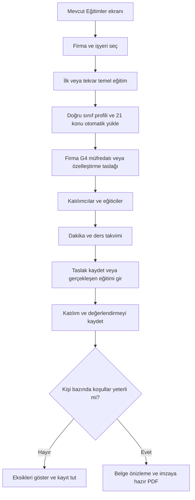
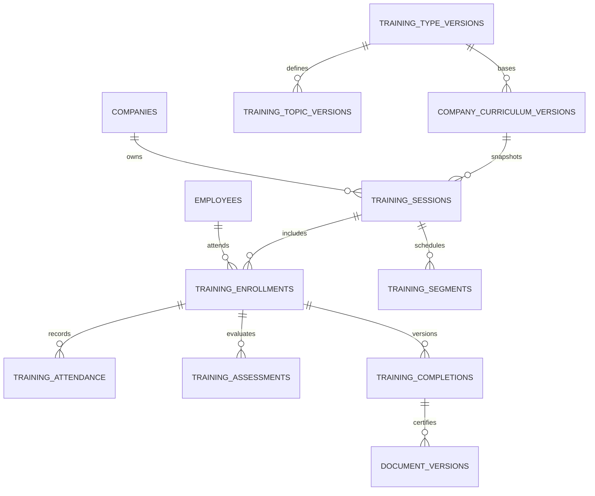
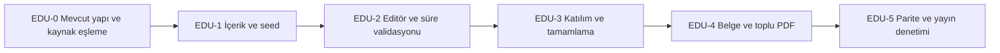

# İSG Adası — Eğitim İçeriği, Süre Motoru ve İmzaya Hazır Belge Üretimi

**Belge türü:** Yalnız eğitim modülüne yönelik Codex uygulama şartnamesi  
**Sürüm:** EDU-1.0  
**Hazırlanma tarihi:** 14 Eylül 2026  
**Ana içerik kaynağı:** Kullanıcının yüklediği *Çalışanların İş Sağlığı ve Güvenliği Eğitimleri Uygulama Rehberi*, Nisan 2026  
**Teknik dayanak:** `PROJECT_ARCHITECTURE.md` ve `ISG_ADASI_MASTER_INTEGRATION_PLAN_V5.md`  
**Teslim kapsamı:** Hazır içerik/seed, altı temel eğitim profili, dakika düzenleme kuralları, eğitim kayıt akışı, ön–arka yüz belge taslağı, değişkenler, toplu PDF üretimi ve mevcut sisteme entegrasyon.

> **Codex için ana talimat:** Mevcut eğitim, çalışan, firma ve belge altyapısını önce bul ve yeniden kullan. Bu dosyayı ikinci bir eğitim sistemi kurmak için değil, mevcut sistemi aşağıdaki içerik ve davranışlarla geliştirmek için uygula. Kaynak kodu/şema ile önceki plan arasında fark varsa bir eşleme raporu çıkar. Üretimdeki kayıtları, eski belgeleri, kullanıcı kimliklerini, abonelikleri ve fotoğraf analizini değiştirme. Yalnız yeni eğitim içerik sürümünü ve ilgili özellikleri kontrollü olarak ekle.

## İçindekiler

1. Kapsam, kaynaklar ve korunacak ürün kararları
2. Mevcut sistemle entegrasyon haritası
3. Eğitim türleri ve altı hazır temel eğitim profili
4. Tehlike sınıfı, ders saati, toplam süre ve yöntem kuralları
5. Ana başlıklar, alt başlıklar ve varsayılan dakika matrisi
6. Dördüncü başlık: işyerine özgü içerik
7. Eğitim seçme ve dakika düzenleme deneyimi
8. Ders, ara, takvim ve gerçekleşen süre motoru
9. Katılımcı, eğitici, sınav ve tamamlama
10. Belge değişkenleri ve kaynak alanları
11. Ön–arka yüz eğitim belgesi tasarımı
12. Eğitim katılım tutanağı ve diğer ayrı çıktılar
13. Toplu PDF, çift taraflı baskı ve imzalı nüsha akışı
14. İçerik paketi ve seed yükleme stratejisi
15. Veri modeli: mevcut tablolara uyarlama
16. API, olaylar, güvenlik ve hata sözleşmesi
17. Geçmiş kayıtlar, dış belge ve güncelleme
18. iOS ve Android entegrasyonu
19. Uygulama fazları ve yayın planı
20. Kabul testleri
21. Codex'e verilecek görev emri ve teslim ölçütleri
22. Ek A — Yüklenebilir içerik paketi (JSON)
23. Ek B — Ön/arka yüz HTML/CSS şablon taslağı
24. Ek C — Kaynak ve doğrulama kaydı

---

## 1. Kapsam, kaynaklar ve korunacak ürün kararları

### 1.1. Amaç

Uzman firma/işyeri ve eğitim türünü seçtiğinde ana başlıklar, alt başlıklar, düzenlenebilir dakika dağılımları ve ilgili süre/yöntem koşulları hazır gelmelidir. Eğitim gerçekleştikten sonra gerçek katılım ve değerlendirme bilgileri girilir. Gerekli şartları sağlayan her çalışan için kendine ait, değişkenleri doldurulmuş ve imza alanları boş bırakılmış temel eğitim belgesi üretilir. Uzman belgeleri tek bir toplu PDF olarak da alabilmelidir.

Bu çalışma sunum slaytları, ders videoları, dersin anlatım metinleri veya çevrimiçi sınav/LMS oluşturmaz. **Hazır içerik**, eğitim türü + müfredat başlıkları + dakika taslakları + kurallar anlamındadır; eğitimin fiilen verilmiş olduğunu göstermez.

### 1.2. Kaynak katmanları

- **[G1] Rehber:** Yüklenen 22 sayfalık Nisan 2026 rehberi. Bu belgedeki konu isimlerinin, eğitim türlerinin, sürelerin ve belge alanlarının ana kaynağıdır. PDF sayfa numarası ile sayfaya basılmış numara farklıdır.
- **[A0] Mimari:** İlk proje belgesinin sağladığı mevcut kod/şema anlık görüntüsü. Burada doğrulanabilen yapılara “mevcut” denir.
- **[P5] Master V5:** Önceki ürün/mimari planı. Planlanmış bir tablonun gerçekten uygulanmış olduğu varsayılmaz.
- **[W1] Ek resmî kontrol:** Bakanlık SSS 130, 134, 141 ve 143. Özellikle ders/ara ayrımı ve belge türlerinin ayrılığı kontrol edilmiştir. Rehberin yerine geçirilmez.
- **[T1–T2] Teknik kontrol:** Supabase RLS ve Edge Function sınırları. Önerilen entegrasyonun güvenlik/işleyici tasarımı için kullanılır.
- **[Ö] Ürün/tasarım önerisi:** Yenileme eğitimi için konu dakika dağılımları, arayüz, sayfa düzeni, teknik eşikler ve uygulama akışları. Bunlar mevzuat hükmü değildir.

**Kaynak konum haritası:**

| Konu | Rehber PDF sayfası | Basılı sayfa |
|---|---:|---:|
| Rehberin amacı ve kullanım notu | 2, 5 | numarasız, 1 |
| Ders saati tanımı | 6 | 2 |
| İşe başlama eğitimi | 7–8 | 3–4 |
| Temel eğitimin zamanı, kapsamı | 9 | 5 |
| Eğiticiler | 10–11 | 6–7 |
| Yüz yüze/uzaktan yöntemler | 11–13 | 7–9 |
| İlk eğitim, tekrar ve G4 süreleri | 12 | 8 |
| Ölçme/değerlendirme | 13 | 9 |
| Katılım tutanağı, temel eğitim belgesi | 14 | 10 |
| İlave eğitimler ve arşiv | 14–16 | 10–12 |
| Ek-1 konu tablosu | 17 | 13 |
| Ek-2 boş ön/arka yüz örneği | 18 | 14 |
| Az tehlikeli örnek | 19 | 15 |
| Tehlikeli örnek | 20 | 16 |
| Çok tehlikeli örnek | 21 | 17 |

### 1.3. Kaynağın sınırları ve ticari kullanım notu

Rehberdeki üç doldurulmuş belge **ilk temel eğitim örneğidir**. Her tehlike sınıfı için doldurulmuş tekrar eğitimi dakika çizelgesi verilmemiştir. Bu dosyadaki üç tekrar profili bu nedenle açıkça **ürün önerisi** olarak işaretlenir; Bakanlığın yayımladığı sabit tekrar müfredatı diye sunulmaz. Konu bazındaki örnek 5/10/20 dakika değerleri yasal konu alt sınırı değildir. [G1: PDF 12, 19–21]

Rehber, örnek belgelerin işyerine göre uyarlanmasını ve birebir kullanılmamasını belirtir. Ayrıca PDF 2'de ticari kullanım uyarısı bulunur. Uygulamaya rehberin sayfaları, çizimleri, Bakanlık logosu, filigranı veya örnekteki kişi/işyeri bilgileri kopyalanmaz. Kısa mevzuat başlıklarının/kural verilerinin ürünleştirilmesi ve içerik hakları yayından önce ayrıca incelenir; bu dosya rehberin ticari yeniden dağıtım izni değildir. Sertifika tasarımı özgün olacaktır. [G1: PDF 2, 14, 19–21]

### 1.4. Önceki kararlardan değiştirilmeyecekler

Sistemin son kullanıcı aktörü yalnız uzmandır. İşveren, işveren vekili, eğitici/hekim ve çalışan burada **belgeye yazılan kişi kaydıdır**, dış kullanıcı hesabı değildir. Giriş, portal, onay bağlantısı veya uygulama içi karşı taraf imzası yapılmaz. İşveren/eğitici isimlerini uzman kaydeder; imzalar çıktı üzerinde dışarıda alınır.

Çalışan sağlık gözetimi, muayene, tetkik, teşhis, sağlık raporu ve hekim randevusu modülü yoktur. Buna karşılık Ek-1'in **Sağlık konuları** grubu ve bu grubu veren eğiticinin adı/unvanı korunur. Eğitim içeriği ile çalışan sağlık verisi aynı şey değildir.

Plus ve Pro'da eğitim modülü ve temel eğitim belgesi üretimi ortaktır. Mevcut haklar ve etkin promosyon erişimi mevcut backend yetenek çözümleyicisi üzerinden değerlendirilir. Eğitim belgesi üretmek fotoğraf analizi veya eski analiz raporu sayacını tüketmez. Bu dosya fiyatlandırmayı, Auth akışını, kişisel not defterini veya genel yeniden markalamayı değiştirmez. [P5: §§6,15,27–28]

## 2. Mevcut sistemle entegrasyon haritası

**Önce envanter, sonra değişiklik.** Kullanıcının belirttiği yeni eğitim altyapısı depoda bulunabilir; yalnız ilk mimari anlık görüntüsünde görünmediği için yok sayılmaz. Aşağıdaki ailelerin gerçek karşılıkları Codex tarafından okunarak `docs/education/implementation-map.md` içinde kaydedilir.

| Katman | Belgede mevcut/planlı yapı | Bu görevde uygulanacak yaklaşım |
|---|---|---|
| Firma | [A0] `companies.id/user_id/name/hazard_class/logo_path/address/contact_person` | Mevcut firmayı kullan. İşyeri modeli uygulanmışsa sınıfı ilgili işyerinden al; yoksa firma değerini snapshot yap. `contact_person` kişinin işveren vekili olduğunu kendiliğinden kanıtlamaz. |
| Uzman profili | [A0] `profiles.full_name/title/certificate_number` | Eğitici alanları için öneri olarak doldur; uzman bütün başlıkları vermiş gibi otomatik kesinleştirme. |
| Çalışan/görev | [P5] `employees`, `employee_assignments`, `departments`, `job_roles` | Gerçek karşılıklarını yeniden kullan; belgeye eğitim tarihindeki ad/unvan/departman snapshot'ı yaz. |
| Eğitim | [P5] `training_types`, `training_type_versions`, `training_topic_versions`, `training_sessions` ailesi | Mevcutsa eklemeli genişlet; yoksa yalnız gereken parçaları oluştur. Eş anlamlı ikinci tablo ailesi kurma. |
| Firma müfredatı | [P5] `company_training_curriculum_versions/topics` | G4 özelleştirmesi ve firma varsayılanı bu aileye bağlanır. |
| PDF/XLSX | [A0] iOS `PDFReportService`, Android `PdfReportGenerator`, `generate-excel-report` | Font/görsel/indirme/paylaşma yardımcılarını kullan; analiz varsayan akışları genel eğitim endpoint'i gibi çağırma. |
| Eski raporlar | [A0] `reports.analysis_id` ve `method` zorunlu; `register-report` tamamlanmış analiz kontrol eder | Eğitim için sahte analiz üretme, `analysis_id=NULL` açma, eski rapor enum'larını kontrolsüz büyütme. |
| Yeni belgeler | [P5] `documents`, belge sürümleri, kontrollü `isg-documents` hattı | Uygulanmış belge motoruna `basic_training_certificate` ve diğer eğitim belge türlerini ekle. |
| AI önerileri | [A0] `private.analysis_training_cards` | Yalnız eğitim önerisidir; gerçekleşmiş eğitim/katılım/sertifika yerine kullanılmaz. İçe alma olursa uzman onaylı taslak konusu olur. |
| Yetki | [A0] kullanıcı sahipliği, RLS, backend `user_subscriptions` otoritesi | Aynı kullanıcı/firma sahipliği ve etkin yetenek kontrolü; kullanıcı/çalışan/işveren hesabı birleştirme yok. |
| Kuyruk | [A0] pgmq/cron ve işleyiciler | Eğitim PDF işleri mevcut genel belge kuyruğuna job kind olarak; yoksa ayrı eğitim işi. AI kuyruğunu aynı job varsayımlarıyla yeniden kullanma. |
| Bildirim | [A0] `notification_preferences`, token ve APNs/FCM göndericileri | İzin/tercih kontrollü “eğitim belgeleri hazır” ve süre takibi olayı. Mevcut dar `notification_jobs.kind/destination` sözleşmesini körlemesine kullanma. |
| Hata/izleme | [A0] `client_flow_events`, audit ve [P5] ortak hata merkezi | İçerik/kişi adı değil olay kodu, aşama, sürüm ve `support_id`; mevcut CHECK allowlist'leriyle uyumu doğrula. |

**Depo referansları:** iOS `App/Services/`, `App/Views/`, `App/AppState.swift`; Android `android/core/data/`, `android/feature/` ve `RdNavHost`; backend `supabase/functions/`, `supabase/migrations/`, `supabase/tests/`. Eğitim ekranlarının gerçek dosya adları sağlanan mimari belgede yoktur; keşif yapılmadan varmış gibi adlandırılmaz. [A0: §§10,17–18; Ek A]

## 3. Eğitim türleri ve altı hazır temel eğitim profili

### 3.1. Tek temel tür, iki ayrı döngü

Mantıksal tür: `TR-ISG-BASIC-2026`. Alt döngüler: `initial` ve `periodic_repeat`. UI'da **İlk Temel Eğitim** ve **Tekrar Temel Eğitimi** olarak gösterilir. Mevcut kod farklı enum kullanıyorsa alias/mapping oluştur; eski değerleri yeniden adlandırma.

| Profil kodu | Seçimde gösterilen ad | Alt konu seti |
|---|---|---|
| `initial_low` | İlk Temel Eğitim — Az Tehlikeli | G1–G3'ün 21 konusu + firma G4'ü |
| `initial_hazardous` | İlk Temel Eğitim — Tehlikeli | Aynı 21 konu + firma G4'ü |
| `initial_very_hazardous` | İlk Temel Eğitim — Çok Tehlikeli | Aynı 21 konu + firma G4'ü |
| `repeat_low` | Tekrar Temel Eğitimi — Az Tehlikeli | Aynı 21 konu + güncellenmiş firma G4'ü |
| `repeat_hazardous` | Tekrar Temel Eğitimi — Tehlikeli | Aynı 21 konu + güncellenmiş firma G4'ü |
| `repeat_very_hazardous` | Tekrar Temel Eğitimi — Çok Tehlikeli | Aynı 21 konu + güncellenmiş firma G4'ü |

Firma seçildiğinde doğru tehlike sınıfı kendiliğinden bulunur; kullanıcıya altı benzer seçim yapmak zorunda bırakılmaz. Pratik ekran: firma → ilk/tekrar → uygun profil. Katalog ekranında altı profil ayrı görülebilir. Tehlike sınıfı değiştirilecekse yalnız eğitimde yanlış sınıf seçilerek değil, işyeri sınıflandırma kaydı ve tarihçesi üzerinden gerekçeli değişiklik yapılır. [Ö]

### 3.2. Tekrar eğitimiyle karıştırılmayacak türler

| Tür | Kaynağın desteklediği ayrım | Bu pakette davranış |
|---|---|---|
| İşe başlama eğitimi | İş başlamadan önce; en az iki saat; yüz yüze/uygulamalı; temel eğitim süresine sayılmaz. | Ayrı kayıt ve tutanak; iki saati otomatik 2×45 dakika sayma. Bu dosyanın altı temel profilinden biri değildir. |
| Bilgi yenileme | Altı aydan fazla işten uzak kalma sonrası; G4 kapsamı. | Periyodik 8 ders saatlik tekrara otomatik eşleme yok; sağlık nedeni toplama yok. Rehberde ayrıca sayısal toplam süre verilmemişse yeni bir toplam uydurma. |
| Değişiklik nedeniyle ilave eğitim | İş/ekipman/çalışma yeri/yeni risk veya teknolojiye bağlı. | İlgili başlık ve kanıtla ayrı eğitim; tek başına tam temel eğitimin periyodunu sıfırlamaz. |
| Yeni işyerine geçişte G4 eğitimi | Önceki temel eğitim ve aynı iş bağlamı incelenir; yeni işyerinin riskleri ve ayrıca işe başlama eğitimi. | Önceki belgeyi sakla; yalnız yeni yükleme tarihinden tam temel eğitim üretme. |
| Uzman tanımlı özel eğitim | Ayrı başlık, dakika, süre/başarı/tekrar koşulları. | Mevcut özel eğitim özelliği korunur; iç belge kendiliğinden MYK/harici ilkyardım belgesi olmaz. |

Kaynak: [G1: PDF 7–9,13–16]. İlave türlerin bu tabloda görünmesi yeni hekim/çalışan portalı veya yeni dış eğitim mevzuatı geliştirme talimatı değildir.

## 4. Tehlike sınıfı, ders saati, toplam süre ve yöntem kuralları

### 4.1. Kaynak temelli süre matrisi

| Sınıf | İlk temel eğitim asgari | Tekrar temel eğitim asgari | Tekrar aralığı | G4 asgari — ilk ve tekrar |
|---|---:|---:|---|---:|
| Az tehlikeli | 8 ders saati | 8 ders saati | 3 yılda en az bir | 2 ders saati |
| Tehlikeli | 12 ders saati | 8 ders saati | 2 yılda en az bir | 3 ders saati |
| Çok tehlikeli | 16 ders saati | 8 ders saati | Yılda en az bir | 4 ders saati |

G4 toplamın **içindedir**. Örneğin tehlikeli ilk eğitim 12+3=15 ders saati değildir. Tekrar eğitimi tehlikeli/çok tehlikeli sınıfta körlemesine 12/16 saate zorlanmaz. Süre gerektiğinde artırılabilir. [G1: PDF 12/basılı 8]

### 4.2. Ders ve ara ayrımı

Rehber bir ders saatini **en az 45 dakika ders + bunu izleyen 15 dakika ara** olarak tanımlar. Konu editörünün birimi net **öğretim dakikasıdır**. Ara dakikaları konu satırlarına dağıtılmaz. Varsayılan 45+15 programının hesapları şöyledir: [G1: PDF 6/basılı 2]

| Profil | Öğretim toplamı | Ara toplamı | Standart takvim toplamı | G4 net öğretim bütçesi |
|---|---:|---:|---:|---:|
| İlk / az tehlikeli | 360 dk | 120 dk | 480 dk | 90 dk |
| İlk / tehlikeli | 540 dk | 180 dk | 720 dk | 135 dk |
| İlk / çok tehlikeli | 720 dk | 240 dk | 960 dk | 180 dk |
| Tekrar / az tehlikeli | 360 dk | 120 dk | 480 dk | 90 dk |
| Tekrar / tehlikeli | 360 dk | 120 dk | 480 dk | 135 dk |
| Tekrar / çok tehlikeli | 360 dk | 120 dk | 480 dk | 180 dk |

Bunlar örnek programın aritmetiğidir; tüm gerçek programların duvar saati süresi tam bu kadar olmak zorunda değildir. Ek öğretim, uzun öğle arası, sınav, farklı günler ve ek mola ayrıca gösterilir. Bakanlık SSS 143, rehberdeki örnek dakikaların araları içermediğini ayrıca açıklıyor. [W1: Soru 141,143]

### 4.3. Eğitim yöntemi

| Başlık | Az tehlikeli | Tehlikeli | Çok tehlikeli |
|---|---|---|---|
| G1 Genel | Yüz yüze / uzaktan / karma | Yüz yüze / uzaktan / karma | Yüz yüze / uzaktan / karma |
| G2 Sağlık | Yüz yüze / uzaktan / karma | Yüz yüze / uzaktan / karma | Yüz yüze / uzaktan / karma |
| G3 Teknik | Yüz yüze / uzaktan / karma | Yüz yüze / uzaktan / karma | Yüz yüze / uzaktan / karma |
| G4 İşyerine özgü | Yüz yüze / uzaktan / karma | **Yüz yüze** | **Yüz yüze** |

Aynı yöntem ayrımı tekrar eğitiminde de sürer. Hazır profilde yüz yüze seçimi yalnız ürün varsayılanıdır; ilk üç grubun uzaktan seçilmesini engellemez. “Karma” değerinin arkasında hangi konu/segmentin hangi yöntemle gerçekleştiği saklanır. [G1: PDF 11–13]

Uygulama dış uzaktan eğitimi kaydedebilir. Ancak bir video bağlantısı veya “tamamlandı” kutusu, giriş/çıkış, katılım süresi, tamamlama ve değerlendirme kanıtının yerine geçmez. Bu görev uygulamanın kendisine öğrenci hesabı veya LMS eklemez. [G1: PDF 11–14]

### 4.4. Ek resmî kontrolde görülen ayrıntı

Rehberin süre bölümü ilk üç grubun toplamına ayrıca 6/9/12 ders saati alt sınırı yazmıyor; Bakanlık SSS 135 tablosunda bu dağılım “en az” ifadesiyle yer alıyor. Hazır ilk eğitim profilleri zaten bu dağılıma uygundur. Bu kaynak ayrıntısı sessizce rehbere eklenmez: ilk eğitimde G1–G3 toplamı 270/405/540 net dakikanın altına indirilirse içerik/kural incelemesi istenir. G4 süresini artırmak için ortak konuları otomatik kısaltma. Yayınlanacak kural sürümü bu noktayı ayrıca belgelendirmelidir. [W1: Soru 135; inceleme kapısı: Ö]

## 5. Ana başlıklar, alt başlıklar ve varsayılan dakika matrisi

### 5.1. Resmî etiketler ve sabit kodlar

G1: **Genel konular**; G2: **Sağlık konuları**; G3: **Teknik konular**. İlk üç grupta toplam **21 zorunlu konu** vardır: 4 + 5 + 12. Aşağıdaki etiketler Ek-1'den alınmıştır. Kodlar [P5] ile aynı tutulmuştur; Türkçe `ç/ğ/ı/i` harfleri teknik kod üretmek için İngilizce alfabetik sıraya körlemesine çevrilmez. [G1: PDF 17]

**Kaynak varyantını koru:** Ek-1 / 3-c “Parlama ve patlama”, Ek-2 ve örnek belgelerde “Parlama, patlama” şeklindedir. Aynı `G3-C` koduna bağlı kaynak varyantıdır; iki ayrı konu açılmaz. Bu paket ana katalogda Ek-1 etiketini kullanır. G4'ün Ek-1 ile Ek-2'deki kısa etiket farkı da `source_label_variants`/şablon eşlemesiyle kaydedilir; sessizce yeni bir mevzuat başlığı icat edilmez.

### 5.2. Varsayılan dakikalar

**İA / İT / İÇ:** Rehberdeki az/tehlikeli/çok tehlikeli **ilk eğitim örneklerinin** G1–G3 dakikaları.  
**TA / TT / TÇ:** Bu dosyanın **tekrar eğitimi önerileri**. TA, rehberin az tehlikeli ilk eğitim dağılımını tekrar taslağına uyarlamaktadır; kaynaktaki bir tekrar örneği değildir.

Dakikalar düzenlenebilir önerilerdir. Kaynak, her bir alt konu için bağımsız yasal minimum dakika vermediğinden `minimum_legal_topic_minutes=null` olacaktır. `0` dakika veya konuyu silme, temel eğitim tamamlandı denebilmesi için ayrı kapsam kontrolünü geçmez. [G1: PDF 17,19–21; tekrar dağılımları: Ö]

| Kod / Ek-1 maddesi | Resmî konu başlığı | İA | İT | İÇ | TA | TT | TÇ |
|---|---|---:|---:|---:|---:|---:|---:|
| `G1-A` / 1-a | Çalışma mevzuatı ile ilgili bilgiler | 20 | 20 | 20 | 20 | 15 | 10 |
| `G1-B` / 1-b | Çalışanların yasal hak ve sorumlulukları | 20 | 20 | 20 | 20 | 15 | 10 |
| `G1-C` / 1-c | İşyeri temizliği ve düzeni | 20 | 20 | 20 | 20 | 15 | 10 |
| `G1-D` / 1-ç | İş kazası ve meslek hastalığından doğan hukuki sonuçlar | 20 | 20 | 20 | 20 | 15 | 15 |
| `G2-A` / 2-a | Meslek hastalıklarının sebepleri | 20 | 20 | 20 | 20 | 15 | 10 |
| `G2-B` / 2-b | Hastalıktan korunma prensipleri ve korunma tekniklerinin uygulanması | 20 | 20 | 20 | 20 | 15 | 10 |
| `G2-C` / 2-c | Biyolojik ve psikososyal risk etmenleri | 20 | 20 | 20 | 20 | 15 | 10 |
| `G2-D` / 2-ç | İlkyardım | 10 | 20 | 20 | 10 | 10 | 10 |
| `G2-E` / 2-d | Bağımlılık yapıcı maddelerin zararları ve teknoloji bağımlılığı | 10 | 10 | 10 | 10 | 5 | 5 |
| `G3-A` / 3-a | Kimyasal, fiziksel ve ergonomik risk etmenleri | 10 | 25 | 40 | 10 | 10 | 10 |
| `G3-B` / 3-b | Elle kaldırma ve taşıma | 10 | 20 | 20 | 10 | 10 | 5 |
| `G3-C` / 3-c | Parlama ve patlama | 10 | 20 | 30 | 10 | 10 | 10 |
| `G3-D` / 3-ç | Yangın ve yangından korunma | 10 | 30 | 40 | 10 | 10 | 10 |
| `G3-E` / 3-d | İş ekipmanlarının güvenli kullanımı | 10 | 30 | 40 | 10 | 10 | 10 |
| `G3-F` / 3-e | Ekranlı araçlarla çalışma | 10 | 10 | 20 | 10 | 5 | 5 |
| `G3-G` / 3-f | Elektrik, tehlikeleri, riskleri ve önlemleri | 10 | 20 | 30 | 10 | 10 | 10 |
| `G3-H` / 3-g | İş kazalarının sebepleri ve korunma prensipleri ile tekniklerinin uygulanması | 10 | 10 | 30 | 10 | 10 | 5 |
| `G3-I` / 3-ğ | Sağlık ve güvenlik işaretleri | 10 | 10 | 30 | 10 | 5 | 5 |
| `G3-J` / 3-h | Kişisel koruyucu donanım kullanımı | 5 | 40 | 40 | 5 | 10 | 10 |
| `G3-K` / 3-ı | İş sağlığı ve güvenliği genel kuralları ve güvenlik kültürü | 5 | 10 | 20 | 5 | 5 | 5 |
| `G3-L` / 3-i | Acil durumlar, tahliye ve kurtarma | 10 | 10 | 30 | 10 | 10 | 5 |

| Toplam | İA | İT | İÇ | TA | TT | TÇ |
|---|---:|---:|---:|---:|---:|---:|
| G1 | 80 | 80 | 80 | 80 | 60 | 45 |
| G2 | 80 | 90 | 90 | 80 | 60 | 45 |
| G3 | 110 | 235 | 370 | 110 | 105 | 90 |
| G4 | 90 | 135 | 180 | 90 | 135 | 180 |
| **Net öğretim** | **360** | **540** | **720** | **360** | **360** | **360** |

Özellikle çok tehlikeli tekrarda ilk üç grubun 180 dakikalık önerisi her gerçek işyerinin eğitim ihtiyacına yeterli olduğunun iddiası değildir. Uzman risk profiline göre konuları ve toplam süreyi artırabilir. “Varsayılanı kullan” mesleki içerik incelemesinin yerine geçmez.

### 5.3. Ana başlık ile alt başlığı iki kez sayma

Ana başlığın dakikası alt başlık toplamından türetilir, ayrıca toplanmaz. Bir konunun kullanıcı tarafından alt parçalara ayrılması halinde de yalnız yaprakların dakikası sayılır. Örneğin `G3-A=40` altında kimyasal 15, fiziksel 15, ergonomik 10 varsa toplam 40'tır; 80 değildir. Resmî `G3-A` kapsam işareti ve şablon etiketi korunur.

## 6. Dördüncü başlık: işyerine özgü içerik

### 6.1. Sınıfa göre üst başlık

**Tehlikeli / çok tehlikeli:** “İşe ve işyerine özgü riskler ve risk değerlendirmesine dayalı konular”; Ek-1 / 4-a.  
**Az tehlikeli:** “Faaliyetin Genel Tehlike ve Riskleri”; Ek-1 / 4-b.  
**Ortak UI kısa adı:** “İşyerine Özgü Riskler”.

G4, işin, faaliyetin ve çalışanın görevine göre belirlenen içeriktir. Ek-1'deki örnek alanlar, her işyerine toptan uygulanacak zorunlu bir liste değildir. İşyerinin acil durum planı, risk değerlendirmesi ve varsa diğer ilgili teknik dokümanlar içerik dayanağı olabilir. Rehber, aynı işyerinde görev gruplarına göre farklılaştırmayı da açıklar. [G1: PDF 9–10,17]

### 6.2. Yükleme önceliği

1. Aynı firma/işyeri + görev grubu + katalog sürümü için uzman tarafından uyarlanmış müfredat varsa onu öner.
2. Yoksa aynı firmanın uyumlu müfredatını **kopyalanabilir taslak** olarak öner; uygulanan sınıfı ve hedef çalışanları kontrol et.
3. O da yoksa aşağıdaki dört **ürün başlangıç satırını** getir. Bunlar gerçek işyerine uyarlanana kadar `requires_company_customization=true` durumundadır.

| Başlangıç satırı — yasal sabit alt başlık değil | Az tehlikeli dk | Tehlikeli dk | Çok tehlikeli dk |
|---|---:|---:|---:|
| İşyerinin risk değerlendirmesinde belirlenen öncelikli riskler ve alınacak önlemler | 25 | 40 | 50 |
| İşyerinin acil durum planı, tahliye yolları ve toplanma alanları | 25 | 35 | 50 |
| Göreve, departmana ve kullanılan ekipmana özgü güvenli çalışma uygulamaları | 20 | 30 | 40 |
| Faaliyete özgü talimatlar ve sahadaki uygulama örnekleri | 20 | 30 | 40 |
| **Toplam** | **90** | **135** | **180** |

Aynı G4 bütçeleri ilk ve tekrar eğitiminde kullanılabilir; tekrar eğitiminde içerik güncelliği ayrıca incelenir. Kullanıcı satırları yeniden adlandırabilir, silebilir, ekleyebilir ve dakikaları değiştirebilir. Tamamlama öncesi **firmaya özgü gerçek alt başlıklar**, bir bağlam açıklaması ve uzman içerik teyidi bulunmalıdır. “Örnek konu”, boş yer tutucu veya kaynaktaki X firması gerçek müfredat diye kaydedilmez. İlgili doküman uygulamaya yüklenmemişse manuel dayanak açıklaması mümkündür; diğer modüle belge yüklemeyi bu işin gereksiz ön şartı yapma. [Ö]

### 6.3. Rehberdeki örnek G4 sürelerinin anlamı

Kaynakta ofis örneğinin G4'ü 25+15+25+15+10=90 dakika; metal atölyesi örneğinin G4'ü 30+30+25+20+30=135 dakika; tünel şantiyesi örneğinin G4'ü 20+20+20+15+20+20+15+20+20+10=180 dakikadır. Örneklerin işyerine bağlı risk konuları bu toplamları doldurur. Bunlar tüm firmalara ofis/metal/tünel risklerini otomatik atamak için kullanılmaz. Bu dosyanın yukarıdaki G4 başlangıçları **bu örneklerin birebir kopyası değildir**. [G1: PDF 19–21]

### 6.4. Güncelleme ve görev grupları

Risk değerlendirmesi, iş/ekipman veya işyerinin sınıfı değiştiğinde önce inceleme önerisi üret. Tamamlanmış eğitimlerin G4'ünü veya belgelerini arkadan değiştirme. Başlamamış eğitimde yeni müfredatı seçmek kullanıcı onayı ister; başlayan eğitimde değişiklik yeni sürüm/ek eğitim gerektirir.

Aynı eğitimde birbirinden farklı G4 alan çalışanlar varsa her katılımcının belge arkasına **gerçekte aldığı içerik** basılır. İlk uygulamada bunu risk grubuna göre ayrı eğitim kaydı açarak yapmak kabul edilir; bütün personele aynı sahte içerik dağıtılmaz. İdari personel ile kaynakçı aynı başlık altında sırf aynı firmada oldukları için birleştirilmez. [G1: PDF 10; uygulama modeli: Ö]

## 7. Eğitim seçme ve dakika düzenleme deneyimi

### 7.1. Önerilen kısa akış



### 7.2. Ekran davranışları

**Eğitim türü kartı:** İlk/tekrar rozeti, sınıf, asgari toplam ders saati ve G4 alt sınırı. Daha önce kaydı olmayan çalışan için ilk eğitim öner; geçmiş kaydın bulunmaması, gerçekten hiç eğitim almadığının kesin kanıtı değildir. Uzman dış belge geçmişini belirtebilir.

**İçerik editörü:** Dört açılır ana başlık; her satırda kaynak etiketi, dakika alanı, yöntem ve ilgili eğitici. G1–G3 resmî konu isimleri rastgele değiştirilemez; açıklama ve ek alt konular eklenebilir. G4 başlıkları tamamen firma bağlamında düzenlenebilir. Arayüzde kısa etiket kullanılacaksa tam resmî metin ayrıntıda ve çıktı modelinde korunur.

**Sabit alt özet:** `Öğretim: 540 dk · Ara: 180 dk · Ders: 12 · G4: 135 dk / asgari 135 dk`. Program tarih/saat hesabı tamamlanmamışsa “Takvim henüz planlanmadı” de; yasal süreyi aşmış/sağlamış gibi yeşil etiket üretme.

**Dakika değiştirme:** Doğrudan sayı girişi + 5 dk artır/azalt düğmeleri. Beşer dakikalık düğme kolaylıktır; kullanıcı 12 dakika girebilir. Negatif, boş veya ondalık değerler için doğrulama yapılır; dakika bu sürümde tam sayıdır. Üst sınır varsa teknik veri kontrolü olarak açıkça tanımlanır, yasal sınır denmez.

**Kaydetme ayrımı:** Taslak kaydetme eksik sürede mümkündür. Tamamlama ve nihai belge üretme için ayrı sunucu doğrulaması gerekir. Kullanıcının emek verdiği kaydı geçersiz diye yok etme.

**Varsayılanlara dön:** Katalog sürümündeki değerlerle mevcut düzenlemeyi karşılaştır; yalnız bu taslağa uygula. İmzalı belgeyi, diğer eğitimleri veya diğer firmaları etkileme. “Firma varsayılanı olarak kaydet” ayrı açık işlemdir; global kataloğu değiştirmez.

**Süreyi dengele:** İsteğe bağlı ve önizlemeli yardımcı. Hangi satırın değişeceğini göster; G4 alt sınırını veya konu kapsamını aşındırma. G4'e 30 dakika eklenince diğerlerinden sessizce 30 dakika kesme. Varsayılan davranış ek süreyi korumak ve takvimi yeniden planlama uyarısıdır. [Ö]

## 8. Ders, ara, takvim ve gerçekleşen süre motoru

### 8.1. Temel değişmezler

- `topic.instruction_minutes`: anlatım/uygulama süresi; ara ve sınav değildir.
- `lesson`: en az 45 dakika öğretim ve onu izleyen 15 dakika ara ile planlanan ders birimi.
- `segment`: ders içindeki konu, yöntem ve eğitici dağılımı; tek konu birden fazla derse bölünebilir, bir ders birden fazla konu içerebilir.
- `break`: dersin arası; her alt konu sonrası 15 dakika eklenmez.
- `assessment`: ölçme/değerlendirme zaman aralığı. Bu uygulama tasarımında konu öğretimi yerine sayılmaz; kaynakta buna ayrıca dakika eklenmiş bir sınav süresi verilmediğinden bu ihtiyatlı ürün kuralıdır.
- `scheduled_span`: ilk başlangıç ile son bitiş arasındaki duvar saati; gece/öğle boşluğunu öğretim diye saymaz.
- `actual_attendance`: çalışan bazında gerçek katılım aralıkları; planlanan süreyi otomatik katılım sayma.

### 8.2. Kontrol sırası

```text
1. Profil/katalog/işyeri sınıfı snapshot'ını oku.
2. G1-G3'teki 21 zorunlu konunun kapsam ve pozitif öğretim kaydını kontrol et.
3. G4 başlığı, sınıf bendi, firma özelleştirmesi ve net süresini kontrol et.
4. Toplam net öğretim için asgari_ders × 45 alt sınırını kontrol et.
5. Gerçek ders bloklarını ve ara dağılımını doğrula; yalnız toplam/45 yeterli değildir.
6. Konu dağılımlarının ders bloklarıyla tam uzlaştığını kontrol et.
7. Yöntem kurallarını segment düzeyinde doğrula.
8. Her katılımcının bu kapsama katılımını ve sınav sonucunu ayrı değerlendir.
9. Sonucu gerekçelerle döndür; istemcideki yeşil rozet otorite değildir.
```

G4 için net 90/135/180 kontrolü standart 45 dakikalık öğretim karşılığını denetler; geçerli ders/takvim denetiminin yerini tutmaz. `ceil(toplam_dakika/45)` ile yukarı yuvarlayıp eksik süreyi tamamlamak yasaktır. Ana başlık, alt başlık ve ortak eğitici yüzünden aynı dakikayı iki kez sayma. İki eş zamanlı oturum tek çalışana çift süre kazandırmaz. [Ö: G1 ders tanımının teknik uygulaması]

### 8.3. Standart sekiz derslik takvim örneği

Aşağıdaki takvim yalnız ürün örneğidir; kurumun mesai/öğle düzeni ayrıca uyarlanır. Son dersten sonraki ara da tanıma uygun olarak açık gösterilir; kullanıcıya 360 net dakikayı 480 dakika anlatım gibi sunma.

| Ders | Öğretim | Ara |
|---|---|---|
| 1 | 09:00–09:45 | 09:45–10:00 |
| 2 | 10:00–10:45 | 10:45–11:00 |
| 3 | 11:00–11:45 | 11:45–12:00 |
| 4 | 12:00–12:45 | 12:45–13:00 |
| 5 | 13:00–13:45 | 13:45–14:00 |
| 6 | 14:00–14:45 | 14:45–15:00 |
| 7 | 15:00–15:45 | 15:45–16:00 |
| 8 | 16:00–16:45 | 16:45–17:00 |

Öğle arası uzunsa `gap`/uzatılmış ara olarak ayrıca planlanır. Değerlendirme 17:00–17:30 seçilirse programa 30 dakika daha eklenir; bu 30 dakika öğretim toplamına eklenmez. Günlük sekiz ders burada mevzuat maksimumu olarak tanımlanmamıştır. 12/16 derslik eğitimin günlere bölünmesini öneren ürün yardımı olabilir; sertifikada bütün gerçek tarihler gösterilir.

### 8.4. Dakika değişikliği sonrası

360 dakika, bir konuya 10 dakika eklenerek 370 olduysa örneğin yedi adet 45 dakikalık ve bir adet 55 dakikalık öğretim bloğu düzenlenebilir. Sekiz arayla toplam 490 dakika olur. Bu, dokuz ders saati değildir. Arayüz `8 ders birimi · 370 dk öğretim · 120 dk ara` gösterir; bu planı kullanıcı teyit eder. Her gerçek blok en az 45 öğretim + 15 ara tanımını sağlamalıdır.

G4=80 ve genel toplam=360 ise toplam yetse de G4 eksiktir. G4=180 ve toplam=350 olan çok tehlikeli tekrarda G4 yetse de toplam eksiktir. Doğru toplam, eksik konuyu veya yanlış yöntemi telafi etmez.

### 8.5. Hassas tarihler

Saatler zaman dilimiyle, tarihe bağlı hukuki takipler `date` olarak tutulur. Varsayılan saat dilimi `Europe/Istanbul`; cihaz saatini sunucu otoritesi yapma. `instruction_completed_on`, `assessment_passed_on`, `completion_effective_on`, `document_issued_on` ve `uploaded_at` ayrıdır.

Takip için uzman tarafından doğrulanan gerçek başarılı tamamlama tarihi ve kural sürümü kullanılır; belgeyi daha geç üretmek/yeniden yüklemek periyodu ileri atmaz. Tamamlama tarihi gerçek ders ve başarılı değerlendirmeden önce olamaz. 36/24/12 ay takvim hesabı yapılır; sabit 1095/730/365 gün eklemek yerine artık yıl/ay sonu kuralı test edilir. Gecikmiş eğitimin tamamlanması geçmiş gecikmeyi audit'ten silmez. [G1 tekrar aralıkları; tarih alanı/hesap yöntemi: Ö]

## 9. Katılımcı, eğitici, sınav ve tamamlama

### 9.1. Katılımcılar

Mevcut firma çalışan listesinden çoklu seçim, departman/görev filtresi ve arama kullanılır. Aynı kişiyi ikinci kez eklemek idempotenttir. Eğitim tarihindeki görevlendirme snapshot'ı korunur. İşten ayrılmış kişinin geçmiş eğitimini girmek mümkündür; bugün aktif olmaması geçmiş belgeyi silme nedeni değildir.

İlk eğitim ihtiyacı olanlarla tekrar eğitimi alacaklar aynı listede seçilirse uyarı ver. Başlangıç uygulamasında döngü/riske göre ayrı eğitim kayıtlarına böl. Daha uzun bir programa katılmak, herkesin belge türünün otomatik “ilk” veya “tekrar” olmasını haklı çıkarmaz. Her belge gerçek döngü bilgisini taşır.

### 9.2. Eğiticiler ve işveren

Kişi/kurum/kuruluş düzenleyici bilgisi ile eğitimi fiilen veren kişiler ayrıdır. Her eğiticinin adı, soyadı, unvanı; gerekiyorsa mesleki belge bilgisi ve verdiği konu kapsamı tutulur. Oturum başlığına tek uzman yazıp sağlık konuları dahil her konuyu ona otomatik atama. Rehber konu ile eğitici uzmanlığının uyumunu açıklar. Eğitici uygunluğu uzman tarafından kaydedilir; uygulama resmî yetki sorgusu yapmış gibi işaretlemez. [G1: PDF 10–11]

İşyeri hekimi bu modelde gerektiğinde **eğitici adı/unvanı** olarak yer alabilir; hesap açmaz, sağlık dosyası tutulmaz. İşveren/vekili de ad/unvan ve kağıt imza alanıdır. Uygulama operatörü otomatik işveren veya tek eğitici değildir.

### 9.3. Katılım ve değerlendirme

Yüz yüze eğitimde katılım tutanağı; uzaktan eğitimde dış sistemden yeterli katılım/ölçme kanıtı tutulur. Öğretim segmenti ve çalışan bazında gerçek katılım kaydı esastır. Başlangıçta herkesi “katıldı” işaretlemek yerine uzman çoklu seçime açıkça “Bu kişilerin katılımını kaydet” işlemi uygular. [G1: PDF 14]

Temel eğitim için ön bilgi düzeyi tespiti ve eğitim sonrası değerlendirme alanları bulunur. Rehberde başarı eşiği **60/100**, ilk sınav dışında **en çok iki ek sınav hakkı**dır. Üçüncü başarısız sonuçtan sonra aynı eğitim çevriminde sınırsız yeni deneme ekleyip başarılı sayma; yeniden eğitim yolu göster. Puan 0–100 arasında olmalı; sınav tarihi, deneme numarası, değerlendirme yöntemi ve kaynağı tutulmalıdır. Sınavın uygulama içinde yapılması gerekmez. [G1: PDF 13]

### 9.4. Üç farklı durum ekseni

| Eksen | Örnek durumlar | Neyi ifade etmez? |
|---|---|---|
| Eğitim kaydı | `draft`, `planned`, `in_progress`, `completed`, `cancelled` | Toplu eğitim tamamlandı diye bütün kişiler başarılı değildir. |
| Katılımcı uygunluğu | `missing_attendance`, `insufficient_duration`, `assessment_pending`, `failed`, `completed_verified` | Bir PDF indirilmiş olması eğitim kanıtı değildir. |
| Belge | `draft_preview`, `prepared_for_signature`, `signed_copy_uploaded`, `superseded`, `voided` | İmzaya hazır PDF imzalı belge değildir. |

**Belge önizleme** planlama aşamasında yapılabilir; açık TASLAK işareti ve “gerçekleşmiş eğitim belgesi değildir” notu bulunur. **İmzaya hazır temel eğitim belgesi** gerçek katılımı, kapsamı, yöntemleri ve başarı şartları tamamlanan kişi için düzenlenir. Kağıt imza beklemek uygulamada işveren onay portalı kurma nedeni değildir.

Eğitim kaydının kapanması, imzalı arşiv eksikliğinin tamamlandığı anlamına gelmez. İmzalı katılım tutanağı daha sonra taranabilir; uygulama uygun hazırlanmış çıktı ile arşiv/kanıt tamlığını ayrı gösterir. Uzmanın imza/katılımı doğrulaması da sahada doğrulama yapıldığına ilişkin uygulama beyanıdır, bağımsız resmî teyit değildir.

## 10. Belge değişkenleri ve kaynak alanları

### 10.1. Kaynağın istediği alanlar ile tasarım eklerini ayır

Ek-2 ön yüzde çalışanın adı/soyadı/unvanı, eğitimi veren kişi/kurum/kuruluş, eğitim tarihi, düzenleme tarihi, süre, ilk/tekrar türü, yöntem ve ilgili başlıklar, eğiticilerin ad/unvan/imzaları, işyeri unvanı ve işveren/vekilinin ad/imzası bulunur. Arka yüzde başlıklar ve süre sütunu vardır. Bunlar görsel iyileştirme uğruna kaldırılmaz. [G1: PDF 18/basılı 14]

Belge numarası, firma logosu, oturum saatleri, departman, düzen sürümü ve sayfa bağlantı bilgisi bu taslağın **ürün ekleridir**. Rehberde özel bir font, renk, amblem veya her çalışan için T.C. kimlik numarası zorunluluğu verilmez; bu bilgileri zorunluymuş gibi ekleme.

### 10.2. Değişken sözlüğü

| Şablon değişkeni | Kaynağı | İmzaya hazır belgede davranış |
|---|---|---|
| `document.number` | Sunucu belge numaralandırıcısı | Benzersiz iç belge numarası; Bakanlık kayıt numarası değildir. |
| `document.revision` | Belge içerik sürümü | Düzeltmelerde artar; eski dosya değişmez. |
| `document.issued_on` | Uzmanın seçtiği gerçek düzenleme tarihi | Eğitim/başarı tarihinden önce olamaz. |
| `document.template_version` | Yayımlı şablon | İç denetim alanı; son kullanıcıya küçük footer olarak gösterilebilir. |
| `document.page_label` | Katılımcı içi sayfalama | `1 / 2`, `2 / 2`; uzun belgede gerçek toplam. |
| `company.legal_name` | Firma/işyeri kayıt ve snapshot | Yasal işyeri unvanı; yalnız kısa marka adı yeterli sayılmaz. |
| `company.logo_asset_version_id` | Güvenlik kontrolünden geçmiş logo | İsteğe bağlı; yoksa düzen bozulmaz. Sonradan logo değişimi eski belgeyi etkilemez. |
| `workplace.name` | İlgili işyeri | Varsa işyeri/şube ayrımı. |
| `workplace.address` | İşyeri snapshot | İsteğe bağlı ayrıntı; uzun metin taşma kontrolünden geçer. |
| `workplace.hazard_class_label` | Eğitim tarihi sınıf snapshot'ı | Doğru profil ve G4 etiketinin kaynağı. |
| `participant.full_name` | Seçilen çalışan snapshot'ı | Zorunlu; katılımcı alanı boş nihai sertifika üretilemez. |
| `participant.job_title` | Eğitim tarihindeki görev/unvan | Zorunlu Ek-2 alanı; güncel görev değişince eski PDF değişmez. |
| `participant.department` | Eğitim tarihi görevlendirmesi | İsteğe bağlı yardımcı alan. |
| `participant.employee_code` | Firma personel kodu | Benzer isimleri ayırt etmek için isteğe bağlı; T.C. kimlik no yerine yeterli ürün tanımlayıcı olabilir. |
| `training.provider_name` | Eğitimi veren kişi/kurum/kuruluş | Zorunlu; uygulama adı kendiliğinden eğitim sağlayıcısı olmaz. |
| `training.date_label` | Gerçek eğitim günleri | Tek gün, tarih aralığı veya ayrık gün listesi; yapılmayan ara günleri yapılmış gibi gösterme. |
| `training.time_label` | Gerçek günlük oturumlar | Ürün eki; çok günlü programda gün-saat eşlemesi. |
| `training.location_label` | Gerçek eğitim yeri / dış platform | Yer ve yönteme uygun metin. |
| `training.cycle_label` | `initial` / `periodic_repeat` | “İlk defa verilen temel eğitim” veya “Tekrar verilen temel eğitim”. |
| `training.credited_lesson_units` | Doğrulanmış ders yapısı | `8`, `12`, `16` veya gerçek geçerli ders adedi; kullanıcı metninden alınmaz. |
| `training.instruction_minutes` | Kişiye ait gerçek kapsam toplamı | Ara hariç; arka yüz toplamıyla aynı olmalı. |
| `training.break_minutes` | Doğrulanmış ders araları | Ayrı açıklama; konu dk sütununa katılmaz. |
| `training.delivery_face_topics` | Yüz yüze gerçekleşen konu/segmentler | `1,2,3,4-a` gibi; karma grup varsa alt konu kodlarıyla ayrıntı. |
| `training.delivery_distance_topics` | Uzaktan gerçekleşen konu/segmentler | Boşsa “Yok”; gerçekleşmemiş yöntemin kutusu işaretlenmez. |
| `trainers[]` | Fiilen veren kişiler snapshot'ı | Her biri için ad-soyad, unvan ve ayrı boş imza alanı. |
| `trainers[].topic_scope` | Konu-eğitici dağılımı | Örn. `G1,G3,G4`; sağlık konuları kim tarafından verildiyse o bilgi. |
| `trainers[].credential_label` | Uzmanın kaydettiği mesleki belge bilgisi | İsteğe bağlı ürün eki; doğrulanmamışsa resmî doğrulama ibaresi yok. |
| `employer.name` | Uzmanın teyit ettiği işveren/vekili | Zorunlu; `contact_person` yalnız ön doldurma adayıdır. |
| `employer.capacity_label` | İşveren / İşveren vekili | Gerçek sıfat; firma yetkilisi girişine dönüşmez. |
| `groups[].title` | Resmî konu etiketi ve doğru G4 varyantı | G1–G4 sıra korunur. |
| `groups[].topics[]` | Kişi bazında tamamlanmış müfredat snapshot'ı | Konu metni, sıra ve net dk; sonradan global seed okunarak değiştirilmez. |
| `groups[].instruction_minutes` | Alt konu toplamı | Başlık toplamı; genel toplama iki kez katılmaz. |
| `group4.branch_label` | Tehlike sınıfı | “4-a / Tehlikeli ve çok tehlikeli” veya “4-b / Az tehlikeli”. |
| `group4.context_note` | Firma/göreve özgü açıklama | Boş taslak yer tutucular yerine gerçek bağlam. |
| `signatures.*` | Kağıt üzerinde imzalanacak alanlar | Üretilirken **boş**; örnekteki imza/baş harfler basılmaz. |

**İsteğe bağlı çalışan imzası:** Ek-2 ön yüzünde çalışan imzası alanı sayılmıyor; katılım tutanağında ise çalışan imzası var. Temel belgeye ek çalışan imzası istenirse tasarım tercihi olarak eklenebilir. Varsayılan şablon eğitici(ler) + işveren/vekili imzalarını korur, çalışan imzasını ayrı katılım tutanağına koyar. [G1: PDF 14,18]

### 10.3. Tam doldurma ilkesi

İmzaya hazır PDF'de yalnız imza/kaşe alanları bilinçli olarak boş bırakılır. Ad, unvan, tarih, süre, yöntem, firma veya eğitici adı gibi zorunlu değişkenler için `........` veya `{{placeholder}}` kalamaz. Eksik alanlar aynı önizleme ekranında topluca listelenir; kullanıcı onları tamamlayınca yeniden önizler.

Belgeye zorunlu olmayan özel veri ekleme: T.C. kimlik no, doğum tarihi, telefon, e-posta, sağlık bilgisi varsayılan PDF'ye yazılmaz. Puan ve sınav deneme geçmişi ayrı değerlendirme raporundadır; sertifikada ayrıntılı başarısızlık geçmişi basılmaz. Gerekli haklı amaç/şablon onayı olmadan genişletme yapma. [Ö]

## 11. Ön–arka yüz eğitim belgesi tasarımı

### 11.1. Tasarım yönü

**Önerilen ana format:** A4 dikey, bir kişi için standart iki sayfa. İlk sayfa ön, ikinci sayfa arka yüzdür. Rehberde iki yüzün tek yatay sayfada yan yana gösterilmesi, çıktının tek sayfaya iki küçük belge olarak basılması gerektiği anlamına gelmez. Burada iki yüz gerçek çift taraflı baskıya uygun hazırlanır. [G1: PDF 18 görseli; sayfa seçimi: Ö]

Beyaz zemin, koyu lacivert başlık, ince petrol/teal vurgular, hafif çizgiler ve geniş imza boşlukları önerilir. Büyük resmî mühür, Bakanlık logosu, onay rozeti veya devlet belgesi izlenimi verecek süs kullanılmaz. Kullanıcı kendi marka/tasarım dosyalarını daha sonra sağlayacaktır; şablon içeriği ile tema ayrı sürümlenir.

| Tasarım öğesi | Taslak önerisi |
|---|---|
| Sayfa | A4 dikey, 210×297 mm |
| Güvenli kenar | Her yönde 12 mm; baskıda kesim gerektirmez |
| Firma logosu | Sol üst, en çok 44×17 mm; oranı korunur |
| Eğitim ikonu | Sağ üstte küçük, nötr eğitim/tamamlanma ikonu; isteğe bağlı |
| Başlık | 24–26 pt; “TEMEL EĞİTİM BELGESİ” aynen korunur |
| Katılımcı adı | 21–23 pt; uzun isim ikinci satıra geçebilir |
| Gövde | Yaklaşık 10–11 pt; Türkçe karakterleri tam destekleyen font |
| Arka yüz tablo | Yaklaşık 9–10 pt; normal boyda okunabilir, gerekirse devam sayfası |
| İmza alanı | Her kişi için en az yaklaşık 20–25 mm yazılabilir yükseklik |
| Renk | Siyah-beyaz baskıda da hiyerarşi ve imza çizgileri görünür |
| Footer | Belge no + katılımcı + sürüm + bu kişiye ait sayfa no |

Font önerisi `Noto Sans` (gövde/tablo) ve isteğe bağlı `Noto Serif` (ön yüz başlığı). Üretim fontu proje asset/lisans incelemesiyle sabitlenir; sistemde font yoksa karakter kaybı yaratacak rastgele fallback'e güvenilmez. Yazdırma fontunu uzaktaki bir internet adresinden çekme. Emoji eğitim ikonu olarak kullanılmaz; baskı/renk/font tutarsızlığına yol açabilir. [Ö]

### 11.2. Ön yüz yerleşim taslağı

```text
┌─────────────────────────────────────────────────────────────┐
│ [FİRMA LOGOSU]       İŞYERİNİN YASAL UNVANI     [EĞİTİM İKONU]│
│                                                             │
│          İŞ SAĞLIĞI VE GÜVENLİĞİ                             │
│          TEMEL EĞİTİM BELGESİ                                │
│          Belge No: EG-2026-000123 / Rev. 1                   │
│                                                             │
│                      DENİZ YILMAZ                           │
│                   Bakım Teknisyeni                          │
│                                                             │
│ [Gerçek eğitimi ve düzenleyeni açıklayan belge metni]         │
│                                                             │
│ Eğitim tarih(ler)i      | Günlük saatler / yer                │
│ Düzenlenme tarihi      | Tehlike sınıfı                       │
│ Eğitim türü            | İlk / Tekrar                        │
│ Süre                   | Ders + net öğretim + ara            │
│ Yüz yüze başlıklar     | Uzaktan başlıklar                    │
│                                                             │
│ EĞİTİCİ                      EĞİTİCİ                        │
│ Ad Soyad / Unvan             Ad Soyad / Unvan                │
│ [Konu kapsamı]               [Konu kapsamı]                  │
│ [Boş imza alanı]             [Boş imza alanı]                │
│                                                             │
│ İŞVEREN / İŞVEREN VEKİLİ                                     │
│ Ad Soyad / Sıfat                                            │
│ [Boş imza ve kaşe alanı]                                     │
│                                                             │
│ Belge no · Katılımcı · İmza için hazırlanmıştır · Sayfa 1/2   │
└─────────────────────────────────────────────────────────────┘
```

**Dinamik gövde metni taslağı:**

> Bu belge, {{participant.full_name}} — {{participant.job_title}} adına; Çalışanların İş Sağlığı ve Güvenliği Eğitimlerinin Usul ve Esasları Hakkında Yönetmelik kapsamında {{training.provider_name}} tarafından {{training.date_label}} tarihinde/tarihlerinde gerçekleştirilen {{training.cycle_sentence_label}} başarıyla tamamlaması üzerine düzenlenmiştir.

Bu metin yalnız tamamlaması doğrulanmış kişi için kullanılır. Taslak önizlemede “başarıyla tamamladı” sonucu verilmez. Dilbilgisi yardımcıları tek/çok tarih, ilk/tekrar ve unvanın boş olmaması için ayrı test edilir. Kurum adı eğitici kişilerin yerine geçmez; kişiler aşağıda ayrıca listelenir.

### 11.3. Arka yüz yerleşim taslağı

```text
┌─────────────────────────────────────────────────────────────┐
│ EĞİTİM KONULARI VE SÜRELER                                   │
│ Deniz Yılmaz · Bakım Teknisyeni · Belge EG-2026-000123         │
├──────────────────────────────────────────────────┬──────────┤
│ 1. Genel konular                                │ Toplam dk│
│ a) Çalışma mevzuatı ile ilgili bilgiler          │  ... dk  │
│ ... bütün G1 konuları                            │          │
│ 2. Sağlık konuları                              │ Toplam dk│
│ ... bütün G2 konuları                            │          │
│ 3. Teknik konular                               │ Toplam dk│
│ ... bütün G3 konuları                            │          │
│ 4. [Sınıfa uygun resmî G4 üst başlığı]           │ Toplam dk│
│ Seçilen kapsam: [4-a / 4-b]                                 │
│ 4.1. [Gerçek firma/görev alt konusu]             │  ... dk  │
│ 4.2. [...]                                      │  ... dk  │
├──────────────────────────────────────────────────┴──────────┤
│ Net öğretim: ... dk | Ara: ... dk | Ders birimi: ...          │
│ Konu süreleri ara dinlenmelerini içermez.                    │
│ G4 içeriği bu işyeri ve katılımcının görevi için düzenlenmiştir│
│ Belge no · Katılımcı · Sürüm · Sayfa 2/2                      │
└─────────────────────────────────────────────────────────────┘
```

G1–G3 bütün alt başlıkları, yalnız bu katılımcının tamamladığı G4 alt konuları ve gerçek dakikaları basılır. G4 kapsam seçimi Ek-2'nin 4-a/4-b ayrımını kaybetmez. Sınıfa uygun bendin adı açıkça gösterilir; diğer sınıfın içeriklerini bu kişiye verilmiş gibi işaretleme. [G1: PDF 18]

Rehberdeki boş formun uzun açıklamaları/kapsam metinleri şablon uyumluluk kontrolünde ayrıca saklanabilir. Kullanıcının gerçek alt konularını bu uzun genel paragrafla ikame etme. Şablonun alan ve düzen uygunluğu içerik sorumlusu tarafından Ek-2 ile karşılaştırılır; bu taslak otomatik hukuki uygunluk sertifikası değildir.

### 11.4. Uzun içerik ve yeniden tasarım

İki sayfa **standart hedef**, bilgi kaybı pahasına mutlak limit değildir. Uzun firma adı, çok eğitici veya çok sayıda G4 konusu varsa metni kesmek, görünmez taşırmak, üç noktayla silmek veya tablo fontunu 6 puntoya düşürmek yasaktır. Okunabilir devam sayfası oluştur; her devam sayfası aynı katılımcı ve belge numarasını taşır. Çift taraflı paketleme algoritması bu kişinin toplam sayfasını çift sayıya tamamlar.

Gelecek logo/ikon/font değişikliği `theme_version` ve `template_version` ile uygulanır; eski düzenlenmiş belgeler yeni temayla otomatik yeniden üretilmez. Yeniden tasarımda alan sözleşmesi değişmez; yeni önizleme ve baskı testleri gerekir.

## 12. Eğitim katılım tutanağı ve diğer ayrı çıktılar

**Temel eğitim belgesi, katılım tutanağı ve sınav evrakı ayrı belge türleridir.** Aynı eğitim merkezinden birlikte üretilebilirler; fakat bir tane hibrit kağıt bunların hepsinin yerine geçmez. Bakanlık SSS 134 bu ayrımı açıkça vurgular. [W1: Soru 134]

| Çıktı | Ne zaman? | İçerik |
|---|---|---|
| `basic_training_certificate` | Kişi başarıyla tamamladıktan sonra | Bir çalışana ait ön/arka yüz belge, eğitici ve işveren imza alanları. |
| `training_attendance_sheet` | Eğitim öncesi boş imza çizelgesi veya gerçek eğitim kaydı için | Yer, tarih/saat, süre, konu başlıkları, katılımcı ad/soyad/imzaları, eğitici ad/soyad/imzası; gerektiğinde unvan. |
| `training_assessment_record` | Değerlendirme sonucu kaydedildiğinde | Kişi, deneme, puan, tarih, yöntem, değerlendirici ve kanıt referansı. |
| `training_program_schedule` | Plan veya gerçekleşen program | Ders/ara/sınav saatleri, konular ve eğiticiler. Plan olduğu açık etiketlenir. |
| `training_roster_export` | Yetkili talepte | Katılımcılar, durumlar ve eğitim metadata'sı; PDF/XLSX. |

Katılım tutanağında satır yüksekliği imza atılabilecek boyutta tutulur; kişi başına tek dar çizgiye sıkıştırma. Çok günlük/karma programda gün veya eğitim segmenti bazında katılım kanıtı ilişkilendirilebilir. Konular ve gün bilgileri tutanak sayfalarında veya açık bağlı program ekinde bulunur. Tutanaktaki boş imza hücresi veri tabanında “imzaladı” değildir. [G1: PDF 14]

Bu görev standart sınav soruları veya cevap anahtarı uydurmaz. Mevcut sınav/sonuç kayıt altyapısına alan ekler; sınav evrakı gerekiyorsa gerçek kullanılan evrak bağlanır. Kullanıcının sadece skor kaydetmesi, uygulamanın sınavı bizzat uyguladığı anlamına gelmez.

## 13. Toplu PDF, çift taraflı baskı ve imzalı nüsha akışı

### 13.1. Kullanıcının tek işlemle alacağı dosya

Eğitim ayrıntısında **“Katılımcı belgelerini hazırla”** bulunur. Varsayılan seçim o eğitimde tamamlaması doğrulanmış bütün kişilerdir. Ön kontrolde her kişi için eksikler gösterilir. 20 kişiden 18'i uygunsa ekran bunu açıkça belirtir; iki kişinin eksikliğini gizleyerek “20 belge hazır” denmez. Uzmanın seçimiyle 18 kişinin paketi oluşturulur; eksiklere ilişkin özet ayrı UI/iş manifest'inde kalır.

Standart örnek: **20 uygun katılımcı = 40 sayfalık sertifika PDF'si.** Sıra: 1. kişinin ön/arka yüzü, 2. kişinin ön/arka yüzü ... Katılım tutanağı ve sınav dosyaları bu dosyanın arasına eklenmez.

Dosya adı örneği: `firma-egitim-2026-09-14-katilimci-belgeleri.pdf`. Dosya adını saldırıya açık serbest path olarak kullanma; Storage nesne adı UUID tabanlı olsun. İnsan dostu ad yalnız indirme metadata'sıdır.

### 13.2. Çift taraflı baskı değişmezleri

```text
Kişi A: ön (tek sayfa) → arka (çift sayfa)
Kişi B: ön (tek sayfa) → arka (çift sayfa)
...
```

- Her kişinin ilk sayfası paket içinde tek numaralı sayfaya denk gelir.
- Her kişinin içerik sayfa sayısı tekse sonuna o kişi için açık “çift taraflı baskı için ayrılmış boş sayfa” eklenir.
- Kapak/dizin varsayılan sertifika paketinde bulunmaz. Eklenirse çift sayfa sayısı korunmadan öne koyulmaz.
- Sıralama eğitim önizlemesinde seçilen deterministik sıra ile dondurulur; aynı soyadda çalışan ID'si kararlı bağlayıcıdır.
- Her sayfada kişi ve belge numarası bulunur; yalnız dosya adından kimlik kurulmaz.
- Normal öneri A4 dikey, çift taraflı, **uzun kenardan çevir**, %100 ölçek. Fiziksel iOS AirPrint ve Android yazdırma testinde doğru yön doğrulanır.
- Bir kişiye ait uzun müfredat başka kişinin arka yüzüne sarkamaz.

### 13.3. Sunucu işi ve işlem bütünlüğü

```mermaid
sequenceDiagram
  participant U as Uzman iOS/Android
  participant A as Eğitim API
  participant D as DB ve belge motoru
  participant W as PDF işleyici
  participant S as Private dosya deposu
  U->>A: Katılımcıları seç / belge paketi iste / idempotency key
  A->>D: Sahiplik, etkin yetki ve kayıt sürümlerini kontrol et
  A->>D: Kişi bazında tamamlama + değişmez belge snapshot'ları
  A-->>U: Job ID ve hazırlık durumu
  W->>D: Yetkili job lease al / snapshot'ı oku
  W->>W: Kişisel PDF, taşma ve çift taraflı sayfa denetimi
  W->>S: Yeni path'e PDF yükle / hash ve boyut doğrula
  W->>D: Belge sürümleri + paket manifest'ini kesinleştir
  D-->>U: Hazır; indirme ve izin varsa tek bildirim
```

Başlangıç teknik önerisi: PDF worker kişi bazında küçük parçalarla çalışır; mobil uygulama 100 kişinin PDF'sini RAM'de üretmeye zorlanmaz. Aynı iş tekrar denendiğinde aynı belgeler/sayaçlar çoğalmaz. Bir katılımcının render hatası job sonucunda isim yerine güvenli kişi referansıyla belirtilir; eksik pakete `ready` denmez. Bilinçli kısmi teslim ayrı durum ve kullanıcı seçimi ister.

Uzun PDF işini mevcut Edge Function isteği içinde süresiz çalıştırma. Mevcut genel belge worker'ı varsa onu kullan; yoksa kuyrukla çalışan izole render servisi öner. Platformun çalışma sınırları dağıtım öncesi doğrulanır. [T2]

**İki aşamalı görünürlük:** Dosyanın Storage'a çıkması yeterli değildir. Metadata, hash, byte size, sayfa manifest'i ve belge kaydı tamamlanmadan “hazır” sayılmaz. Yetki her indirme talebinde yeniden kontrol edilir; kısa ömürlü signed URL uygulamanın kendi indirmesi içindir, halka açık doğrulama portalı değildir.

### 13.4. İmzalı nüsha

İşveren/eğitici imzaları kağıtta alınır. Uzman sonra PDF/fotoğraf olarak imzalı nüsha yükleyebilir; mevcut güvenli dosya hattı kullanılır. İmzalı dosya `document_version` ile ilgili belgeye bağlanır; imzasız PDF'nin byte'ları değiştirilmez. Tarama güvenliği, imzanın hukuken sahihliğini doğrulamak demek değildir.

Yeni imzaya hazır PDF'ye otomatik imza resmi basılmaz. Çizilmiş veya taranmış imza ile güvenli elektronik imza aynı özellik değildir. Bu görev e-imza entegrasyonu yapmaz. Belge paylaşım ekranının açılması da “alıcı gördü/imzaladı” olayı üretmez. [G1: PDF 16; ürün sınırı: P5]

## 14. İçerik paketi ve seed yükleme stratejisi

### 14.1. Ek A nasıl kullanılacak?

Ek A'daki JSON, dosyadan ayrıştırılabilir bir içerik paketidir. İçinde tek temel eğitim türü, iki döngü, dört ana grup, 21 resmî konu, altı profil ve firma özelleştirmesi isteyen G4 başlangıçları vardır. Doğrudan production SQL değildir.

`status=review_required` yeni paketin içerik incelemesi gerektirdiğini gösterir. İçerik sorumlusu inceleyip yayımlayınca feature flag açık yeni eğitimlerde varsayılan olur. Kullanıcıya önemsiz kurulum işi yüklenmez; onaylanmış paket sunucu katalogundan otomatik gelir.

### 14.2. Üç katmanlı sürümleme

```text
Sistem kataloğu / değişmez sürüm
   ↓ eğitim oluştururken kopya / referans
Firma müfredatı ve dakika varsayılanı / değişmez yayımlı sürüm
   ↓ bu eğitime özel snapshot
Eğitim kaydı + kişi bazında gerçek tamamlama + belge snapshot'ı
```

Aynı katalog sürümündeki dakika önerisi kullanıcıya ait eğitim satırlarını güncellemez. Şirket müfredatında değişiklik sonraki eğitimler için yeni sürümdür. Eski sertifikanın arka yüzü canlı tablo join'iyle yeniden hesaplanmaz.

### 14.3. İdempotent yükleyici

1. `package_key + content_version` ile paket kayıt anahtarını bul.
2. JSON'u doğrula: tekil kodlar, 4/5/12 konu sayıları, sınıf/döngü eşlemesi, pozitif dakika ve G4/toplam aritmetiği.
3. Canonical JSON checksum üret; aynı sürümde aynı checksum varsa işlem no-op.
4. Aynı sürümde başka checksum varsa **hata ver**; sessiz `ON CONFLICT DO UPDATE` ile yayımlı içeriği değiştirme.
5. Kaynak işaretleri ve paket sürümüyle katalog tablolarına transaction içinde yaz; kimlikler deterministik mapping veya kayıtlı UUID'ler ile kararlı olsun.
6. Firma/çalışan/eğitim oluşturan side effect, SMS/e-posta/push veya kullanım kotası olayı üretme.
7. İnceleme sonrası aktif sürüm pointer'ını değiştir; önce staging/allowlist.
8. İkinci seed koşusunun sayı/checksum/sıralama sonuçlarını test et.

Yeni sürüm geldiğinde eski paketi silmek yerine `superseded` yap. Eski sürüme referans veren eğitimler okunmaya ve çıktılanmış belgeler indirilmeye devam eder. Mobil çevrimdışı cache paket versiyonu/checksum ile anahtarlanır; cache eksikliğinde başka sınıf profilini otomatik kullanma.

### 14.4. G4 paket sınırı

Global JSON'daki G4 önerileri yalnız başlangıçtır. Belge üretiminde `requires_company_customization=false` olan doğrulanmış **firma** müfredatı snapshot'ı gerekir. Kullanıcı global seed'i değil kendi şirket kopyasını düzenler. Katalogdaki sağlık konularını gizlemek veya G4'ü başka firmadan fark edilmeden taşımak mümkün olmamalı.

## 15. Veri modeli: mevcut tablolara uyarlama

Tablo adları [P5]'in mantıksal karşılıklarıdır. Gerçek depoda aynı işlev başka isimle varsa onu genişlet; bütün listeyi otomatik yeni migration olarak oluşturma.

| Mantıksal kayıt | Kullanılacak mevcut aile / gereken ek alan |
|---|---|
| İçerik paketi | Genel içerik/kural paket ailesi; yoksa `training_content_packages`: key, version, status, source hash, checksum, reviewed_at, published_at. |
| Tür ve tür sürümü | `training_types`, `training_type_versions`: `legal_profile_code`, kaynak, cycle kuralları, lesson/assessment policy. |
| Resmî konu | `training_topic_versions`: sabit code, group, legal_item, label, aliases, sort_order, source_ref. |
| Hazır profil | Tür sürümü altında profil tablosu veya doğrulanmış JSON: sınıf, döngü, dk haritası, köken, G4/yöntem koşulları. |
| Firma müfredatı | `company_training_curriculum_versions/topics`: company/workplace, hedef görevler, catalog version, context note, review durumu, immutable topic/duration snapshot. |
| Eğitim ana kaydı | `training_sessions`: şirket/işyeri, cycle, profil, müfredat sürümü, planned/actual tarihler, version, durum. |
| Ders ve segment | `training_session_segments`; gerekiyorsa `training_lessons`: konu kodu, lesson_id, öğretim/ara/sınav türü, dakika, tarih/saat, delivery, trainer bağlantısı. |
| Eğitici kayıtları | Genel kişi/iletişim modeli veya eğitim eğitici ilişkisi: kişi metadata'sı ve verilen kapsam; **auth_user_id zorunluluğu yok**. |
| Katılımcı | `training_enrollments`: çalışan ve eğitim tarihi görevlendirme snapshot'ı; session + employee unique. |
| Katılım | `training_attendance`: enrollment + segment, gerçek zaman/dk, kanıt kaynağı, recording actor. |
| Değerlendirme | `training_assessments`: enrollment, assessment type, attempt_no, score, method, occurred_on, evidence. |
| Tamamlama | `training_completions`: enrollment, canonical content hash, verified duration, completion date, rule snapshot, validation report, supersedes_id. |
| Belge ve sürümler | Genel `documents` ailesi: certificate type, source completion, person/company/logo snapshot, template version, storage metadata, signature status. |
| Paket işi | Genel document job ve item manifest: enrollment/completion revisions, order, pages, offset, checksum, retry status. |

### 15.1. İlişki ilkeleri



`company_id` kapsamındaki referanslar mümkün olduğunda `(company_id,id)` unique ve bileşik FK ile doğrulanır. Eğitim A şirketinde, çalışan B şirketinde olamaz. Worker'ın `service_role` ile çalışması bu kontrolleri atlama gerekçesi değildir. Kullanıcı sahipliğini istemciden gelen `user_id` değerine güvenerek kurma.

### 15.2. Sürüm ve tekillik

Önerilen tekillikler: paket key/version; topic package/code; profil package/code; session/employee enrollment; assessment enrollment/type/attempt; attendance enrollment/segment/source-event-id; belge source completion revision/type/template/content hash. Belge numarası sunucu transaction'ında alınır; istemci `max(no)+1` hesaplamaz.

Belge çıktısını yeniden indirmek yeni belge numarası üretmez. İçerik/kişisel bilgi düzeltmesi yeni revizyon oluşturur. “Aynı içeriği farklı tema ile yeniden düzenle” de açık belge sürümü işlemidir; imzalı eski nüshayı değiştirmez.

### 15.3. İndeksler ve saklama

Sorgulara göre şirket + tarih/durum, session + employee, enrollment + segment, completion + document revision ve job + status indeksleri gerekir. Gerçek hacim/sorgu planı incelenmeden gereksiz bütün kolon indeksleri eklenmez. Eğitim belgeleri eski AI fotoğraf/raw-response retention süresine bağlanmaz; mevcut doküman saklama politikasıyla eşlenir. Hesap silme ve legal hold politikaları eğitim tablo/dosya ailesini de kapsar; operatörün hesabı silinirken sahipsiz kişisel belge bırakılmaz.

## 16. API, olaylar, güvenlik ve hata sözleşmesi

### 16.1. İşlem sınırları

| Mantıksal işlem | İstek omurgası | Sunucu sonucu |
|---|---|---|
| Katalog getir | ülke/dil, package version, ETag | İncelenmiş paket, altı profil, checksum; müşteri verisi içermez. |
| Eğitim taslağı oluştur | company/workplace, cycle, preset_code, client_submission_id | Firmaya özel kopya, G4 hazırlık durumu ve draft version. |
| Konu sürelerini düzenle | session_id, expected_version, leaf topic minute changes | Yeni draft revision + yeniden hesaplanmış doğrulama. |
| Takvim düzenle | lessons/segments, yöntemler, eğiticiler, expected_version | Çakışma/ara/kapsam kontrolü. |
| Katılım/değerlendirme kaydet | enrollment IDs, gerçek veriler, kanıt IDs, idempotency key | Kişi bazında durum; yetkisiz başka firma kaydı reddedilir. |
| Tamamlama değerlendir | session/enrollment IDs, expected versions | Validasyon raporu ve uygunsa immutable completion. |
| Belge önizle | draft veya completion + template version | Watermarked preview veya nihai önizleme; taslak final gibi dağıtılmaz. |
| Toplu belge üret | selected completion revisions, template version, idempotency key | 202 + job_id; bitince belge manifest'i. |
| Dosyayı indir | document version veya bundle ID | Güncel yetki doğrulaması sonrası kısa ömürlü URL. |

İsimler depo eşlemesinde netleşir. Örnek adaylar `education-catalog`, `mutate-training`, `validate-training-completion`, `create-training-document-job`, `process-training-document-jobs`; aynı işlevde servis varsa yeni paralel function kurulmaz.

### 16.2. Örnek doğrulama sonucu

```json
{
  "contract": "training-validation-v1",
  "session_id": "uuid",
  "revision": 4,
  "preset_code": "repeat_hazardous",
  "valid_for_draft_save": true,
  "valid_for_completion": false,
  "instruction_minutes": 360,
  "group4_instruction_minutes": 120,
  "required_group4_instruction_minutes": 135,
  "violations": [
    {
      "code": "TRN_GROUP4_TOO_SHORT",
      "path": "groups.G4.instruction_minutes",
      "severity": "blocking_completion",
      "message_key": "training.validation.group4_too_short",
      "args": {"missing_minutes": 15}
    }
  ],
  "support_id": "opaque-support-reference"
}
```

Bu örnekte toplamın 360 olması yeterli değildir. Eksik G4'ü başka konuya verilen dakika kapatmaz. HTTP veya domain hata kodu ile UI tercüme anahtarı ayrıdır; worker log'una katılımcı adı, firma adı veya tam belge gövdesi yazılmaz.

### 16.3. Olay ve ölçüm

Olaylar: `training_preset_selected`, `training_topic_minutes_changed`, `training_context_confirmed`, `training_validation_failed`, `training_completion_recorded`, `training_certificate_job_started`, `training_certificate_job_completed`, `training_certificate_job_failed`, `training_certificate_downloaded`, `training_signed_copy_attached`.

Metadata allowlist'i: platform/build, step, template/catalog version, sayı, süre toplamı, violation codes, job_id, support_id. Serbest konu metni, çalışan adı, unvan, not, belge içeriği ve imza metadata'sı genel analitik kanalına gönderilmez. Bu görev ATT takip altyapısı veya reklam kimliği eklemez. Belge dosyası paylaşımı alıcının okuduğunu kanıtlamaz.

### 16.4. Güvenlik

Yeni client erişimli tablolar için RLS ve gerekli GRANT'ler birlikte tanımlanır; view/API birleştirme katmanında RLS'nin atlanmadığı kontrol edilir. Kullanıcıya yalnız kendi eğitim/firma/çalışan/belgesi gösterilir; katalog yazma yalnız yetkili içerik yayınlama yolundadır. `SECURITY DEFINER` yalnız gerekçeli ve dar izinle kullanılabilir; yetki hatasının hızlı çözümü diye eklenmez. [T1]

HTML renderer her kullanıcı metnini escape eder. Logo/ek dosya için kullanıcı tarafından sağlanan URL'ye sunucunun sınırsız HTTP isteği yapması yasaktır; SSRF riski nedeniyle yalnız doğrulanmış asset referansı alınır. Uzak font/script yoktur. Makro/aktif içerik, taranmamış imzalı dosya veya karantina nesnesi sertifika işine eklenmez. Güvenli renderer çıktı doğrulaması ve upload taraması ayrı işlerdir.

## 17. Geçmiş kayıtlar, dış belge ve güncelleme

2026 öncesi veya başka profille tamamlanmış eğitimleri yeni altı profile zorla dönüştürme. Dış belge yalnız firma/kişi/tarih ve toplam süre içeriyorsa bilinmeyen alt konu dakikalarını bu paketin varsayılanlarıyla doldurma. Böyle bir kayıt `external_record`/eksik ayrıntı olarak korunur; kaynak PDF kanıtı bağlanır.

Eski belgeler yeni kurallara göre geriye dönük “başarısız” yapılmaz. Geçiş değerlendirmesi ayrı katalog/politika gerektirir; yüklenen rehber bütün tarihî eğitim senaryolarının kapsamlı geçiş kuralını vermemektedir. Bu görevde çözümlenmemiş geçişler insan incelemesine bırakılır.

Düzeltme ile yeniden eğitim ayrıdır: yazım düzeltmesi/new scan → belge revizyonu, eğitim tarihi aynı; yeni gerçek tekrar eğitimi → yeni eğitim/tamamlama; sadece birkaç risk konusu için ilave eğitim → bağlı ek eğitim, tüm periyot otomatik sıfırlanmaz. İlk veya tekrar seçiminin sertifikada değişmesi kullanıcı açıklaması ve audit gerektirir; yanlış seçim eski veri üstüne sessizce yazılmaz.

İçeri aktarma yapılırsa satır önizlemesi, doğru firma çalışan eşlemesi, aynı kişi/satır tekrarının engellenmesi, dakika/saat/ders saati birimi ve ilk/tekrar ayrımı zorunludur. Dosyadaki formüller çalıştırılmaz; hücre metninden makro/script yürütülmez. Görsel veya PDF'ye ilişkin otomatik çıkarım yalnız doğrulanacak öneridir, gerçek katılım kaydı değildir.

## 18. iOS ve Android entegrasyonu

Mevcut SwiftUI servis/state yapısı ve Compose ViewModel/Repository yapısı korunur. Aynı backend profil/katalog/validasyon sözleşmesini tüketirler; iki platformda farklı sabit dakika listesi tutulmaz. Çevrimdışı taslak cache mümkündür, nihai tamamlama ve belge numarası sunucudadır.

| Ekran / parça | Her iki platform için aynı davranış |
|---|---|
| Eğitim listesi | Firma, ilk/tekrar, tarih, durum, eksik katılımcılar ve belgelere erişim. |
| Hazır eğitim seçimi | Firma sınıfı snapshot'ı + iki döngü + otomatik profil. |
| Konu editörü | 4 grup, 21 sabit konu, G4 firma satırları, dakika ve yöntem. |
| Katılımcılar | Firma çalışanlarından seçim, görev/departman filtreleri, kişi bazında eksikler. |
| Eğiticiler/işveren | Operatörden bağımsız metadata; dış kullanıcı rolü yok. |
| Takvim | Ders + ara + sınav ayrımı; çok günlük tarih/saat gösterimi. |
| Değerlendirme | Puan, deneme, yöntem ve kanıt; mevcut arayüzden kayıt. |
| Önizleme | Ön/arka yüz ve kişi değiştirici; eksik alanlar ile sayfa taşma uyarıları. |
| Toplu üretim | Aynı job ID, ilerleme, yeniden dene, hazır bildirim, indirme/paylaşma. |
| İmzalı arşiv | Geçerli upload formatları, güvenlik durumu, doğru belge sürümüne ilişki. |

UI ana tasarım dosyaları kullanıcıdan gelecektir. Bu görev mevcut tasarım sistemi üzerinde içerik ve iş akışını uygular; tüm uygulamayı baştan tasarlamaz. Yeni marka logosu veya store screenshot üretimi bu paketin kapsamı değildir.

## 19. Uygulama fazları ve yayın planı



| Faz | Çalışma paketi | Çıkış kriteri |
|---|---|---|
| EDU-0 | Gerçek repo/şema/renderer/çalışan modeli eşleme; mevcut seed ve eğitim verisi envanteri; kaynak etiket farkları | Hangi dosya/tabloya dokunulacağı yazılı; örnekler gerçek kullanıcı verisi içermiyor; mükerrer altyapı yok. |
| EDU-1 | Ek A'yı doğrula; 21 konu, 6 profil, G4 taslakları; içerik versiyonu ve yayın mekanizması | Seed iki kez çalışınca kayıt çoğalmıyor; bütün toplamlar testli; kaynak ve öneri etiketleri korunmuş. |
| EDU-2 | Mevcut eğitim seçimi, dakika editörü, yöntem ve ders/ara takvimi | iOS/Android aynı profil ve validasyon sonucunu gösteriyor; taslak kaydı çalışıyor. |
| EDU-3 | Gerçek katılım, ön/son değerlendirme, 60/100 + üç deneme, immutable completion | Eksik katılımcı için nihai başarı belgesi yok; eski kayıtlar korunmuş. |
| EDU-4 | Ek-2 alanlarını koruyan tema, HTML veya mevcut eşdeğer renderer, toplu job ve imzalı nüsha | Altı profil, uzun metin ve çift taraflı çıktı örnekleri görsel testten geçmiş; numara/hash tekil. |
| EDU-5 | Staging + fiziksel cihaz + eski sürüm regresyonu; sınırlı açılış | Eski analiz/rapor/Auth/abonelik sorunsuz; katalog ve eğitim job flag'leri kontrollü açılmış. |

**Üretim koruması:** Var olan migration dosyalarını yeniden yazma; additive değişiklik, yeni kolonlar için güvenli default/null ve uygun backfill kullan. Mevcut eğitim kayıtlarına otomatik dakika ekleyen toplu backfill yapma. Yeni içerik flag'i örneğin `education.catalog_2026_v1`, yeni renderer flag'i `education.certificate_v1` olabilir; isimleri mevcut flag registry'ye göre eşleştir.

İçerik geri dönüşü aktif katalog pointer'ını önceki sürüme almakla yapılır. Oluşturulmuş yeni eğitim/sertifika snapshot'larını silme. Yeni job üretimini durdurmak, kullanıcıların eski PDF'lerini indirmesini kapatmak değildir. Üretim migration/deploy ancak proje sahibinin ayrıca onayıyla yapılır.

## 20. Kabul testleri

Aşağıdaki senaryolar yalnız bir kontrol listesi değil, uygulama teslimindeki otomatik/görsel test girdileridir. `EDU-*` kodları destek ve CI raporlarında kullanılabilir.

### 20.1. İçerik ve süre

| ID | Senaryo | Beklenen |
|---|---|---|
| EDU-001 | Kataloğu yükle | 4 ana grup; G1=4, G2=5, G3=12 sabit konu. |
| EDU-002 | Türkçe madde kodları | ç/ğ/ı/i sıraları ve sabit teknik kodlar doğru. |
| EDU-003 | İlk/az tehlikeli | 360 net, 120 ara, 8 ders; G4=90. |
| EDU-004 | İlk/tehlikeli | 540 net, 180 ara, 12 ders; G4=135. |
| EDU-005 | İlk/çok tehlikeli | 720 net, 240 ara, 16 ders; G4=180. |
| EDU-006 | Üç tekrar profili | Her biri 360 net, 120 ara, 8 ders; G4=90/135/180. |
| EDU-007 | Konu bazlı süre kökeni | İlk örnek ile ürün tekrar önerisi ayrı işaretli; yasal konu minimumu uydurulmamış. |
| EDU-008 | Tehlikeli tekrar toplam360, G4=120 | Taslak kaydedilir; tamamlama engellenir. |
| EDU-009 | Çok tehlikeli tekrar G4=180, toplam350 | Toplam eksikliği engelleyici. |
| EDU-010 | Bir G1 konusu=0, başka konuya ek süre | Kapsam eksikliği engelleyici. |
| EDU-011 | G4'te risk konuları değiştirilir | Sadece firma müfredatı/draft değişir; global seed aynı. |
| EDU-012 | G4 özelleştirilmemiş | Nihai belgeye hazır değil. |
| EDU-013 | Parlama etiket varyantı | Tek G3-C kaydı, iki kaynak etiket bilgisi. |
| EDU-014 | Çok tehlikeli G4 uzaktan | Yöntem ihlali; ilk ve tekrar için aynı sonuç. |
| EDU-015 | G1–G3 uzaktan + G4 yüz yüze | Kanıt uygunsa karma eğitim mümkün; çıktı kapsamı doğru. |
| EDU-016 | Her alt konuya mola ekleme hatası | Toplam şişirmesi tespit edilir. |
| EDU-017 | 360 dk anlatım, ara yok | 8 geçerli ders otomatik kabul edilmez. |
| EDU-018 | 370 dk anlatım / 8 uygun blok | 9 ders diye yukarı yuvarlama yok; gerçek süre basılır. |
| EDU-019 | Grup ve çocuk toplamı | Parent dakikası iki kez sayılmaz. |
| EDU-020 | 12 dk kullanıcı girdisi | 5'e yuvarlamadan tam sayı dakika saklanır. |
| EDU-021 | Sınav aralığı eklenir | Öğretim dakikası büyümez. |
| EDU-022 | Seed ikinci kez çalışır | Aynı sayılar/checksum; side effect yok. |
| EDU-023 | Aynı sürüm, farklı checksum | Yayınlanmış içerik üzerine yazmak yerine hata. |
| EDU-024 | Eski eğitim açılır | Yeni paket eski snapshot'ı değiştirmez. |

### 20.2. Katılım ve belgeler

| ID | Senaryo | Beklenen |
|---|---|---|
| EDU-025 | Çalışan seçmek | Katılım ve başarı otomatik oluşmaz. |
| EDU-026 | Aynı kişi iki kez eklenir | Tek enrollment. |
| EDU-027 | Yanlış firma çalışanı | Sunucuda/FK'de reddedilir. |
| EDU-028 | Eş zamanlı iki eğitim | Aynı kişinin süresi iki kez sayılmaz. |
| EDU-029 | Eksik gerçek katılım | Başarı belgesi yok; eksik listesi görünür. |
| EDU-030 | 59 ve 60 puan | 59 başarısız, 60 başarılı; süre/kapsam ayrıca aranır. |
| EDU-031 | Üç başarısız sınav | Dördüncü aynı çevrim denemesiyle bypass yok; yeniden eğitim gerekir. |
| EDU-032 | Başarı tarihi eğitimden önce | Tarih uyumsuzluğu. |
| EDU-033 | İşyeri hekimi eğitici metadata'sı | Belgeye yazılır; hekim hesabı/sağlık modülü yaratılmaz. |
| EDU-034 | Farklı G4 grupları | Her kişinin kendi gerçek içeriği basılır. |
| EDU-035 | Eğitimden sonra görev değişir | Eski belgede eski görev/unvan kalır. |
| EDU-036 | İşveren adı eksik | Nihai PDF'de noktalı boşluk değil eksik alan uyarısı. |
| EDU-037 | Eğitici sayısı iki | İki gerçek kişi/unvan ve iki ayrı boş imza alanı. |
| EDU-038 | Taslak önizleme | Belirgin TASLAK; başarı sonucunu taklit etmez. |
| EDU-039 | Logo yok veya çok yatay/dikey | Boş alan düzeni veya oran koruma; taşma yok. |
| EDU-040 | Türkçe adlar: I/İ/ı/ş/ğ/ç | PDF fontunda bozuk karakter yok. |
| EDU-041 | Ek-2 alan denetimi | Ön yüzde bütün gerekli alanlar; arkada 21 konu + gerçek G4 ve süre. |
| EDU-042 | Öğretim/ara toplamı | Ön yüz, arka yüz ve DB toplamları aynı. |
| EDU-043 | 20 uygun kişi | Standartta 40 sayfa; kişi ön/arka sırası doğru. |
| EDU-044 | 20 kişiden 18 uygun | Kullanıcı açıkça 18'i seçerse 36 sayfa; iki eksik gizlenmez. |
| EDU-045 | Uzun G4 / uzun firma unvanı | Metin kesilmez; okunabilir devam sayfası. |
| EDU-046 | Kişisel belge üç sayfa | O kişiye bir boş sayfa eklenir; sonraki kişi tek sayfadan başlar. |
| EDU-047 | İki ayrı cihaz aynı job isteği | Tek job/numara; idempotency çalışır. |
| EDU-048 | Upload başarılı, finalize başarısız | Ready değil; yeniden deneme güvenli. |
| EDU-049 | İmzalı nüsha yüklenir | Yeni ilişki/asset; orijinal imzasız PDF değişmez. |
| EDU-050 | PDF üretildi | İmza atıldı olayı üretilmez. |
| EDU-051 | Sertifika / tutanak / sınav | Ayrı belge türleri ve dosyalar. |
| EDU-052 | Belgeyi tekrar indir | Yeni numara, yeni eğitim veya tarih uzaması yok. |
| EDU-053 | HTML/script içerikli kişi/konu adı | Escape edilir; renderer kod çalıştırmaz. |
| EDU-054 | Harici URL ile logo isteği | SSRF önlenir; yalnız asset referansı. |
| EDU-055 | İmza alanı görsel testi | 20–25 mm civarı boş alan; çizgiler siyah-beyazda görünür. |
| EDU-056 | T.C. kimlik no yok | Rehber bunu bu belge alanı olarak zorunlu kılmadığı için üretim sırf bundan engellenmez. |

### 20.3. Parite, geçmiş ve üretim

| ID | Senaryo | Beklenen |
|---|---|---|
| EDU-057 | iOS/Android aynı örnek eğitim | Aynı konu sırası, dk, yöntem, kişi/sınıf snapshot'ı ve belge içeriği. |
| EDU-058 | Ağ kesilmesi / yeniden açma | Taslak korunur; job durumu tekrar bulunur. |
| EDU-059 | 2026 öncesi dış eğitim | Varsayılan dk ile geçmiş uydurulmaz. |
| EDU-060 | Daha iyi tarama yükleme | Orijinal tamamlama/takip tarihi değişmez. |
| EDU-061 | 29 Şubat tamamlanma / ay sonu | Takvim ayı kuralı kararlı; 365 gün hatası yok. |
| EDU-062 | Eğitim belgesi üretimi | AI analiz/legacy report kotası azalmaz. |
| EDU-063 | Plus/Pro/etkin haklı eski abone | Mevcut yetenek otoritesiyle erişim; paket revizyonu hak kaybettirmez. |
| EDU-064 | Bildirim kapalı | Job UI'da hazır; push gönderilmez. |
| EDU-065 | Yeni katalog flag'i kapatılır | Eski veriler ve dosya indirme devam eder. |
| EDU-066 | Eski mobil sürüm | Auth, analiz, ödeme/restore ve analiz PDF akışı bozulmaz. |
| EDU-067 | Hesap silme | Yeni eğitim dosya/tablo bağlantıları da saklama politikasına göre işlenir. |
| EDU-068 | Kişisel not defteri | Bu modülle firma/not ilişkisi kurulmamıştır. |
| EDU-069 | Fiziksel çift taraflı baskı | Ön/arka yönleri doğru; sayfa kayması ve imza alanı kesilmesi yok. |
| EDU-070 | Yetkisiz signed URL talebi | Başka kullanıcının belge/katılımcı metadata'sı açılmaz. |
| EDU-071 | İlk eğitimde G1–G3 bütçesi referansın altına iner | §4.4 kaynak incelemesi işaretlenir; G4 artışı için otomatik süre kesilmez. |

**Görsel altın örnekler:** Altı profil × kısa/uzun isim; logosuz/yatay/dikey logo; tek/iki/çok eğitici; G4 4/10/30 satır; siyah-beyaz; ayrı günler; karma yöntem. Gerçek çalışan verileri test fixture'ı olarak depoya konulmaz.

## 21. Codex'e verilecek görev emri ve teslim ölçütleri

### 21.1. Beklenen depo çıktıları

Aşağıdaki yollar öneridir; depo standardına eşleştir:

```text
 docs/education/implementation-map.md
 docs/education/source-review.md
 docs/education/certificate-fields.md
 content/education/tr-isg-2026-v1.json
 [mevcut seed/import yordamına ek paket tanımı]
 [gerekiyorsa yeni additive migration dosyaları]
 [mevcut eğitim servisleri ve iOS/Android ekranlarındaki değişiklikler]
 templates/education/basic-training-v1.html veya mevcut renderer eşdeğeri
 tests/education/content-and-duration.*
 tests/education/completion-and-ownership.*
 tests/education/certificate-and-duplex.*
 docs/education/release-checklist.md
```

### 21.2. Doğrudan görev metni

```text
Bu EDU-1.0 dosyasını, PROJECT_ARCHITECTURE.md ve mevcut depodaki uygulanmış
İSG Adası eğitim altyapısı ile birlikte kullan. Master V5 genel ürün sınırlarını
korur; bu dosya yalnız eğitim içeriği ve belge üretimi detayını tamamlar.

İlk iş, gerçek eğitim/çalışan/firma/belge tablosu, API, seed ve mobil ekranları
bulup bir mevcut→gereken eşleme raporu oluştur. Aynı işi yapan ikinci sistem
kurma. İlk mimari belgede görülmeyen yeni eğitim altyapısını yok varsayma.

Sonra Ek A'yı içerik paketine dönüştür: 4 grup, 21 resmî konu, ilk/tekrar için
6 profil, kaynak kökeni, net dakika ve ara ayrımı. İlk eğitim dakikalarının
rehber örneği, tekrar dakikalarının ürün önerisi olduğunu metadata/UI'da koru.
G4'ü firma/göreve uyarlanan müfredat olarak getir; genel şablonu gerçek
saha içeriği veya verilmiş eğitim gibi işaretleme.

Kullanıcı eğitim türünü seçtiğinde konular ve varsayılan dakikalar otomatik
gelsin. Dakikalar düzenlenebilsin; alt sınırlar, kapsam, yöntem ve ders/ara
kuralları sunucuda doğrulansın. Eksik kayıt taslak olarak kaydedilebilsin;
katılım ve 60/100 başarı koşulu sağlanmadan nihai belge üretilemesin.

Ek-2'nin ön/arka yüz alanlarını koruyan, firma logosuna uygun özgün şablon
uygula. Her çalışanın adı/unvanı, işyeri, eğitim gün/saatleri, süre, tür,
yöntem kapsamı, gerçek eğiticiler ve işveren/vekilinin adı doldurulsun.
Sadece kağıtta imzalanacak alanlar boş kalsın. Firma yetkilisi, çalışan veya
hekim için hesap/giriş/onay akışı kurma. Klinik sağlık verisi toplama.

Uygun tüm katılımcılar için ön/arka sayfaları art arda gelen toplu PDF üret.
Normal durumda kişi başı 2 sayfa; uzun içerikte okunabilir devam sayfası
ve kişi bazında çift taraflı baskı tamamlama uygula. Tutanak ve sınav
belgeleri ayrı kalsın. İmzalı nüsha sonradan mevcut güvenli dosya hattına
bağlanabilsin. PDF hazır demeden metadata/hash/manifest kesinleşsin.

Mevcut analyses/reports/register-report sözleşmesini bozma; sahte analiz
üretme; eski analize ait report/AI kotasını eğitim için tüketme. Yeni
eğitim çıktısını mevcut genel documents ailesine bağla. İşleyiciyi,
RLS'yi, iOS/Android paritesini, error telemetry ve kullanıcı tercihlerini
birlikte test et. Üretime deploy/migration yapmak için ayrıca onay bekle.

Her faz sonunda değişen dosyaları, migration etkisini, test sonuçlarını,
görsel çıktı örneklerini, açık riskleri ve sonraki küçük paketi raporla.
Kaynakta olmayan yasal süre, günlük ders limiti, kimlik alanı veya geçiş
kuralı icat etme. Uygulama önerilerini yasal hüküm gibi sunma.
```

### 21.3. Definition of Done

İçerik ve dakika toplamları doğrulanmış; kaynak/proposal ayrımı görünür; seed tekrar çalıştırılabilir; firma G4 uyarlaması çalışır; iki platform aynı sonucu üretir; hatalı katılımcıya final belge çıkmaz; bütün zorunlu değişkenler doldurulur; normal katılımcı için iki yüz imzaya hazırdır; uzun içerik kaybolmaz; toplu PDF çift taraflı baskıda kaymaz; eski eğitim/analiz/abonelik verileri korunur; yetki, güvenlik ve fiziksel baskı testleri tamamlanır.

**Bu dosyanın sınırı:** Burada hazırlanan içerik ve tasarım bir geliştirme girdisidir. Mevcut kaynak kodu veya canlı veritabanı bu çalışma sırasında değiştirilmemiştir. Gerçek eğitim yapılmış, katılım/sınav doğrulanmış veya belge imzalanmış sayılmaz.


---

## 22. Ek A — Yüklenebilir içerik paketi (JSON)

Bu blok `content/education/tr-isg-2026-v1.json` dosyasına çıkarılabilir. Teknik `low/hazardous/very_hazardous` değerleri gerçek deponun tehlike sınıfı kodlarına açık bir adapter ile eşlenir. Mevcut kayıtların sınıf enum'u bu paket uğruna yeniden adlandırılmaz.

Alan açıklamaları: `minimum_*` toplam/G4 kaynak eşiği; `default_*` başlangıç dağılımı; `minutes_origin` örnek/ürün kökeni; `minimum_legal_topic_minutes=null` bağımsız yasal konu dakikasının kaynakta verilmediği anlamındadır. `common_groups_review_guard`, §4.4'teki ayrı kaynak incelemesini taşır; yeni bir konu minimumu değildir. Paket status'u içerik incelemesi tamamlandıktan sonra kontrollü biçimde yayımlanır.

```json
{
  "schema_version": "training-content-package-v1",
  "package_key": "tr_isg_basic_2026_education_v1",
  "content_version": 1,
  "status": "review_required",
  "locale": "tr-TR",
  "jurisdiction": "TR",
  "source": {
    "id": "G1",
    "title": "Çalışanların İş Sağlığı ve Güvenliği Eğitimleri Uygulama Rehberi",
    "edition": "Nisan 2026",
    "sha256": "7cdb9ffcbeff806b81e2682cb38d67171ed0170712eaef25370ea49a409aba2e",
    "topic_pdf_page": 17,
    "certificate_pdf_page": 18,
    "example_pdf_pages": [
      19,
      20,
      21
    ]
  },
  "training_type_code": "TR-ISG-BASIC-2026",
  "training_cycles": [
    "initial",
    "periodic_repeat"
  ],
  "lesson_policy": {
    "minimum_instruction_minutes": 45,
    "break_minutes": 15,
    "topic_minutes_exclude_breaks": true,
    "round_up_credits": false,
    "exam_minutes_count_as_instruction": false
  },
  "assessment_policy": {
    "minimum_score": 60,
    "score_scale": 100,
    "maximum_attempts_per_course": 3,
    "source": "G1 PDF 13 / basılı 9"
  },
  "first_training_due": {
    "unit": "calendar_month",
    "value": 3,
    "anchor": "employment_start_date",
    "source": "G1 PDF 9 / basılı 5"
  },
  "groups": [
    {
      "code": "G1",
      "order": 1,
      "legal_label": "Genel konular",
      "source": "Ek-1 / 1"
    },
    {
      "code": "G2",
      "order": 2,
      "legal_label": "Sağlık konuları",
      "source": "Ek-1 / 2"
    },
    {
      "code": "G3",
      "order": 3,
      "legal_label": "Teknik konular",
      "source": "Ek-1 / 3"
    },
    {
      "code": "G4",
      "order": 4,
      "ui_label": "İşyerine Özgü Riskler",
      "source": "Ek-1 / 4",
      "custom_topics_required": true,
      "legal_label_by_hazard": {
        "low": "Faaliyetin Genel Tehlike ve Riskleri",
        "hazardous": "İşe ve işyerine özgü riskler ve risk değerlendirmesine dayalı konular",
        "very_hazardous": "İşe ve işyerine özgü riskler ve risk değerlendirmesine dayalı konular"
      },
      "branch_by_hazard": {
        "low": "4-b",
        "hazardous": "4-a",
        "very_hazardous": "4-a"
      },
      "source_label_variants": [
        {
          "location": "Ek-2 / G4 düşük sınıf etiketi",
          "label": "Faaliyetin Genel Riskleri"
        },
        {
          "location": "Ek-2 / G4 birleşik üst başlık",
          "label": "İşe ve işyerine özgü riskler ve risk değerlendirmesine dayalı konular (Tehlikeli ve Çok Tehlikeli Sınıf)/ Faaliyetin Genel Riskleri (Az Tehlikeli Sınıf)"
        }
      ]
    }
  ],
  "topics": [
    {
      "code": "G1-A",
      "group_code": "G1",
      "sort_order": 1,
      "legal_item": "a",
      "legal_label": "Çalışma mevzuatı ile ilgili bilgiler",
      "source_ref": "Ek-1 / 1-a",
      "required": true,
      "default_duration_origin": "preset",
      "minimum_legal_topic_minutes": null
    },
    {
      "code": "G1-B",
      "group_code": "G1",
      "sort_order": 2,
      "legal_item": "b",
      "legal_label": "Çalışanların yasal hak ve sorumlulukları",
      "source_ref": "Ek-1 / 1-b",
      "required": true,
      "default_duration_origin": "preset",
      "minimum_legal_topic_minutes": null
    },
    {
      "code": "G1-C",
      "group_code": "G1",
      "sort_order": 3,
      "legal_item": "c",
      "legal_label": "İşyeri temizliği ve düzeni",
      "source_ref": "Ek-1 / 1-c",
      "required": true,
      "default_duration_origin": "preset",
      "minimum_legal_topic_minutes": null
    },
    {
      "code": "G1-D",
      "group_code": "G1",
      "sort_order": 4,
      "legal_item": "ç",
      "legal_label": "İş kazası ve meslek hastalığından doğan hukuki sonuçlar",
      "source_ref": "Ek-1 / 1-ç",
      "required": true,
      "default_duration_origin": "preset",
      "minimum_legal_topic_minutes": null
    },
    {
      "code": "G2-A",
      "group_code": "G2",
      "sort_order": 5,
      "legal_item": "a",
      "legal_label": "Meslek hastalıklarının sebepleri",
      "source_ref": "Ek-1 / 2-a",
      "required": true,
      "default_duration_origin": "preset",
      "minimum_legal_topic_minutes": null
    },
    {
      "code": "G2-B",
      "group_code": "G2",
      "sort_order": 6,
      "legal_item": "b",
      "legal_label": "Hastalıktan korunma prensipleri ve korunma tekniklerinin uygulanması",
      "source_ref": "Ek-1 / 2-b",
      "required": true,
      "default_duration_origin": "preset",
      "minimum_legal_topic_minutes": null
    },
    {
      "code": "G2-C",
      "group_code": "G2",
      "sort_order": 7,
      "legal_item": "c",
      "legal_label": "Biyolojik ve psikososyal risk etmenleri",
      "source_ref": "Ek-1 / 2-c",
      "required": true,
      "default_duration_origin": "preset",
      "minimum_legal_topic_minutes": null
    },
    {
      "code": "G2-D",
      "group_code": "G2",
      "sort_order": 8,
      "legal_item": "ç",
      "legal_label": "İlkyardım",
      "source_ref": "Ek-1 / 2-ç",
      "required": true,
      "default_duration_origin": "preset",
      "minimum_legal_topic_minutes": null
    },
    {
      "code": "G2-E",
      "group_code": "G2",
      "sort_order": 9,
      "legal_item": "d",
      "legal_label": "Bağımlılık yapıcı maddelerin zararları ve teknoloji bağımlılığı",
      "source_ref": "Ek-1 / 2-d",
      "required": true,
      "default_duration_origin": "preset",
      "minimum_legal_topic_minutes": null
    },
    {
      "code": "G3-A",
      "group_code": "G3",
      "sort_order": 10,
      "legal_item": "a",
      "legal_label": "Kimyasal, fiziksel ve ergonomik risk etmenleri",
      "source_ref": "Ek-1 / 3-a",
      "required": true,
      "default_duration_origin": "preset",
      "minimum_legal_topic_minutes": null
    },
    {
      "code": "G3-B",
      "group_code": "G3",
      "sort_order": 11,
      "legal_item": "b",
      "legal_label": "Elle kaldırma ve taşıma",
      "source_ref": "Ek-1 / 3-b",
      "required": true,
      "default_duration_origin": "preset",
      "minimum_legal_topic_minutes": null
    },
    {
      "code": "G3-C",
      "group_code": "G3",
      "sort_order": 12,
      "legal_item": "c",
      "legal_label": "Parlama ve patlama",
      "source_ref": "Ek-1 / 3-c",
      "required": true,
      "default_duration_origin": "preset",
      "minimum_legal_topic_minutes": null,
      "source_label_variants": [
        {
          "location": "Ek-2 / 3-c",
          "label": "Parlama, patlama"
        }
      ]
    },
    {
      "code": "G3-D",
      "group_code": "G3",
      "sort_order": 13,
      "legal_item": "ç",
      "legal_label": "Yangın ve yangından korunma",
      "source_ref": "Ek-1 / 3-ç",
      "required": true,
      "default_duration_origin": "preset",
      "minimum_legal_topic_minutes": null
    },
    {
      "code": "G3-E",
      "group_code": "G3",
      "sort_order": 14,
      "legal_item": "d",
      "legal_label": "İş ekipmanlarının güvenli kullanımı",
      "source_ref": "Ek-1 / 3-d",
      "required": true,
      "default_duration_origin": "preset",
      "minimum_legal_topic_minutes": null
    },
    {
      "code": "G3-F",
      "group_code": "G3",
      "sort_order": 15,
      "legal_item": "e",
      "legal_label": "Ekranlı araçlarla çalışma",
      "source_ref": "Ek-1 / 3-e",
      "required": true,
      "default_duration_origin": "preset",
      "minimum_legal_topic_minutes": null
    },
    {
      "code": "G3-G",
      "group_code": "G3",
      "sort_order": 16,
      "legal_item": "f",
      "legal_label": "Elektrik, tehlikeleri, riskleri ve önlemleri",
      "source_ref": "Ek-1 / 3-f",
      "required": true,
      "default_duration_origin": "preset",
      "minimum_legal_topic_minutes": null
    },
    {
      "code": "G3-H",
      "group_code": "G3",
      "sort_order": 17,
      "legal_item": "g",
      "legal_label": "İş kazalarının sebepleri ve korunma prensipleri ile tekniklerinin uygulanması",
      "source_ref": "Ek-1 / 3-g",
      "required": true,
      "default_duration_origin": "preset",
      "minimum_legal_topic_minutes": null
    },
    {
      "code": "G3-I",
      "group_code": "G3",
      "sort_order": 18,
      "legal_item": "ğ",
      "legal_label": "Sağlık ve güvenlik işaretleri",
      "source_ref": "Ek-1 / 3-ğ",
      "required": true,
      "default_duration_origin": "preset",
      "minimum_legal_topic_minutes": null
    },
    {
      "code": "G3-J",
      "group_code": "G3",
      "sort_order": 19,
      "legal_item": "h",
      "legal_label": "Kişisel koruyucu donanım kullanımı",
      "source_ref": "Ek-1 / 3-h",
      "required": true,
      "default_duration_origin": "preset",
      "minimum_legal_topic_minutes": null
    },
    {
      "code": "G3-K",
      "group_code": "G3",
      "sort_order": 20,
      "legal_item": "ı",
      "legal_label": "İş sağlığı ve güvenliği genel kuralları ve güvenlik kültürü",
      "source_ref": "Ek-1 / 3-ı",
      "required": true,
      "default_duration_origin": "preset",
      "minimum_legal_topic_minutes": null
    },
    {
      "code": "G3-L",
      "group_code": "G3",
      "sort_order": 21,
      "legal_item": "i",
      "legal_label": "Acil durumlar, tahliye ve kurtarma",
      "source_ref": "Ek-1 / 3-i",
      "required": true,
      "default_duration_origin": "preset",
      "minimum_legal_topic_minutes": null
    }
  ],
  "presets": [
    {
      "code": "initial_low",
      "label": "İlk Temel Eğitim — Az Tehlikeli",
      "cycle": "initial",
      "hazard_class": "low",
      "minimum_lesson_units": 8,
      "minimum_group4_lesson_units": 2,
      "renewal_interval_months": 36,
      "default_instruction_minutes": 360,
      "default_break_minutes": 120,
      "default_scheduled_minutes": 480,
      "default_minutes_by_group": {
        "G1": 80,
        "G2": 80,
        "G3": 110,
        "G4": 90
      },
      "minutes_origin": "guide_example_first_training",
      "source_example_page": 19,
      "default_delivery": "face_to_face",
      "allowed_delivery_groups_1_to_3": [
        "face_to_face",
        "external_distance",
        "hybrid"
      ],
      "allowed_delivery_group4": [
        "face_to_face",
        "external_distance",
        "hybrid"
      ],
      "topic_instruction_minutes": {
        "G1-A": 20,
        "G1-B": 20,
        "G1-C": 20,
        "G1-D": 20,
        "G2-A": 20,
        "G2-B": 20,
        "G2-C": 20,
        "G2-D": 10,
        "G2-E": 10,
        "G3-A": 10,
        "G3-B": 10,
        "G3-C": 10,
        "G3-D": 10,
        "G3-E": 10,
        "G3-F": 10,
        "G3-G": 10,
        "G3-H": 10,
        "G3-I": 10,
        "G3-J": 5,
        "G3-K": 5,
        "G3-L": 10
      },
      "group4": {
        "budget_instruction_minutes": 90,
        "origin": "product_contextualization_starter_not_legal_list",
        "requires_company_customization": true,
        "topics": [
          {
            "local_key": "G4-S1",
            "title": "İşyerinin risk değerlendirmesinde belirlenen öncelikli riskler ve alınacak önlemler",
            "instruction_minutes": 25,
            "requires_context": true
          },
          {
            "local_key": "G4-S2",
            "title": "İşyerinin acil durum planı, tahliye yolları ve toplanma alanları",
            "instruction_minutes": 25,
            "requires_context": true
          },
          {
            "local_key": "G4-S3",
            "title": "Göreve, departmana ve kullanılan ekipmana özgü güvenli çalışma uygulamaları",
            "instruction_minutes": 20,
            "requires_context": true
          },
          {
            "local_key": "G4-S4",
            "title": "Faaliyete özgü talimatlar ve sahadaki uygulama örnekleri",
            "instruction_minutes": 20,
            "requires_context": true
          }
        ]
      },
      "ready_for_completion_without_review": false,
      "common_groups_review_guard": {
        "reference_instruction_minutes": 270,
        "when_below": "requires_content_rule_review",
        "source": "W1 SSS 135; separate supplementary check",
        "do_not_silently_reduce_when_increasing_g4": true
      }
    },
    {
      "code": "initial_hazardous",
      "label": "İlk Temel Eğitim — Tehlikeli",
      "cycle": "initial",
      "hazard_class": "hazardous",
      "minimum_lesson_units": 12,
      "minimum_group4_lesson_units": 3,
      "renewal_interval_months": 24,
      "default_instruction_minutes": 540,
      "default_break_minutes": 180,
      "default_scheduled_minutes": 720,
      "default_minutes_by_group": {
        "G1": 80,
        "G2": 90,
        "G3": 235,
        "G4": 135
      },
      "minutes_origin": "guide_example_first_training",
      "source_example_page": 20,
      "default_delivery": "face_to_face",
      "allowed_delivery_groups_1_to_3": [
        "face_to_face",
        "external_distance",
        "hybrid"
      ],
      "allowed_delivery_group4": [
        "face_to_face"
      ],
      "topic_instruction_minutes": {
        "G1-A": 20,
        "G1-B": 20,
        "G1-C": 20,
        "G1-D": 20,
        "G2-A": 20,
        "G2-B": 20,
        "G2-C": 20,
        "G2-D": 20,
        "G2-E": 10,
        "G3-A": 25,
        "G3-B": 20,
        "G3-C": 20,
        "G3-D": 30,
        "G3-E": 30,
        "G3-F": 10,
        "G3-G": 20,
        "G3-H": 10,
        "G3-I": 10,
        "G3-J": 40,
        "G3-K": 10,
        "G3-L": 10
      },
      "group4": {
        "budget_instruction_minutes": 135,
        "origin": "product_contextualization_starter_not_legal_list",
        "requires_company_customization": true,
        "topics": [
          {
            "local_key": "G4-S1",
            "title": "İşyerinin risk değerlendirmesinde belirlenen öncelikli riskler ve alınacak önlemler",
            "instruction_minutes": 40,
            "requires_context": true
          },
          {
            "local_key": "G4-S2",
            "title": "İşyerinin acil durum planı, tahliye yolları ve toplanma alanları",
            "instruction_minutes": 35,
            "requires_context": true
          },
          {
            "local_key": "G4-S3",
            "title": "Göreve, departmana ve kullanılan ekipmana özgü güvenli çalışma uygulamaları",
            "instruction_minutes": 30,
            "requires_context": true
          },
          {
            "local_key": "G4-S4",
            "title": "Faaliyete özgü talimatlar ve sahadaki uygulama örnekleri",
            "instruction_minutes": 30,
            "requires_context": true
          }
        ]
      },
      "ready_for_completion_without_review": false,
      "common_groups_review_guard": {
        "reference_instruction_minutes": 405,
        "when_below": "requires_content_rule_review",
        "source": "W1 SSS 135; separate supplementary check",
        "do_not_silently_reduce_when_increasing_g4": true
      }
    },
    {
      "code": "initial_very_hazardous",
      "label": "İlk Temel Eğitim — Çok Tehlikeli",
      "cycle": "initial",
      "hazard_class": "very_hazardous",
      "minimum_lesson_units": 16,
      "minimum_group4_lesson_units": 4,
      "renewal_interval_months": 12,
      "default_instruction_minutes": 720,
      "default_break_minutes": 240,
      "default_scheduled_minutes": 960,
      "default_minutes_by_group": {
        "G1": 80,
        "G2": 90,
        "G3": 370,
        "G4": 180
      },
      "minutes_origin": "guide_example_first_training",
      "source_example_page": 21,
      "default_delivery": "face_to_face",
      "allowed_delivery_groups_1_to_3": [
        "face_to_face",
        "external_distance",
        "hybrid"
      ],
      "allowed_delivery_group4": [
        "face_to_face"
      ],
      "topic_instruction_minutes": {
        "G1-A": 20,
        "G1-B": 20,
        "G1-C": 20,
        "G1-D": 20,
        "G2-A": 20,
        "G2-B": 20,
        "G2-C": 20,
        "G2-D": 20,
        "G2-E": 10,
        "G3-A": 40,
        "G3-B": 20,
        "G3-C": 30,
        "G3-D": 40,
        "G3-E": 40,
        "G3-F": 20,
        "G3-G": 30,
        "G3-H": 30,
        "G3-I": 30,
        "G3-J": 40,
        "G3-K": 20,
        "G3-L": 30
      },
      "group4": {
        "budget_instruction_minutes": 180,
        "origin": "product_contextualization_starter_not_legal_list",
        "requires_company_customization": true,
        "topics": [
          {
            "local_key": "G4-S1",
            "title": "İşyerinin risk değerlendirmesinde belirlenen öncelikli riskler ve alınacak önlemler",
            "instruction_minutes": 50,
            "requires_context": true
          },
          {
            "local_key": "G4-S2",
            "title": "İşyerinin acil durum planı, tahliye yolları ve toplanma alanları",
            "instruction_minutes": 50,
            "requires_context": true
          },
          {
            "local_key": "G4-S3",
            "title": "Göreve, departmana ve kullanılan ekipmana özgü güvenli çalışma uygulamaları",
            "instruction_minutes": 40,
            "requires_context": true
          },
          {
            "local_key": "G4-S4",
            "title": "Faaliyete özgü talimatlar ve sahadaki uygulama örnekleri",
            "instruction_minutes": 40,
            "requires_context": true
          }
        ]
      },
      "ready_for_completion_without_review": false,
      "common_groups_review_guard": {
        "reference_instruction_minutes": 540,
        "when_below": "requires_content_rule_review",
        "source": "W1 SSS 135; separate supplementary check",
        "do_not_silently_reduce_when_increasing_g4": true
      }
    },
    {
      "code": "repeat_low",
      "label": "Tekrar Temel Eğitimi — Az Tehlikeli",
      "cycle": "periodic_repeat",
      "hazard_class": "low",
      "minimum_lesson_units": 8,
      "minimum_group4_lesson_units": 2,
      "renewal_interval_months": 36,
      "default_instruction_minutes": 360,
      "default_break_minutes": 120,
      "default_scheduled_minutes": 480,
      "default_minutes_by_group": {
        "G1": 80,
        "G2": 80,
        "G3": 110,
        "G4": 90
      },
      "minutes_origin": "product_proposal_repeat_training",
      "source_example_page": null,
      "default_delivery": "face_to_face",
      "allowed_delivery_groups_1_to_3": [
        "face_to_face",
        "external_distance",
        "hybrid"
      ],
      "allowed_delivery_group4": [
        "face_to_face",
        "external_distance",
        "hybrid"
      ],
      "topic_instruction_minutes": {
        "G1-A": 20,
        "G1-B": 20,
        "G1-C": 20,
        "G1-D": 20,
        "G2-A": 20,
        "G2-B": 20,
        "G2-C": 20,
        "G2-D": 10,
        "G2-E": 10,
        "G3-A": 10,
        "G3-B": 10,
        "G3-C": 10,
        "G3-D": 10,
        "G3-E": 10,
        "G3-F": 10,
        "G3-G": 10,
        "G3-H": 10,
        "G3-I": 10,
        "G3-J": 5,
        "G3-K": 5,
        "G3-L": 10
      },
      "group4": {
        "budget_instruction_minutes": 90,
        "origin": "product_contextualization_starter_not_legal_list",
        "requires_company_customization": true,
        "topics": [
          {
            "local_key": "G4-S1",
            "title": "İşyerinin risk değerlendirmesinde belirlenen öncelikli riskler ve alınacak önlemler",
            "instruction_minutes": 25,
            "requires_context": true
          },
          {
            "local_key": "G4-S2",
            "title": "İşyerinin acil durum planı, tahliye yolları ve toplanma alanları",
            "instruction_minutes": 25,
            "requires_context": true
          },
          {
            "local_key": "G4-S3",
            "title": "Göreve, departmana ve kullanılan ekipmana özgü güvenli çalışma uygulamaları",
            "instruction_minutes": 20,
            "requires_context": true
          },
          {
            "local_key": "G4-S4",
            "title": "Faaliyete özgü talimatlar ve sahadaki uygulama örnekleri",
            "instruction_minutes": 20,
            "requires_context": true
          }
        ]
      },
      "ready_for_completion_without_review": false
    },
    {
      "code": "repeat_hazardous",
      "label": "Tekrar Temel Eğitimi — Tehlikeli",
      "cycle": "periodic_repeat",
      "hazard_class": "hazardous",
      "minimum_lesson_units": 8,
      "minimum_group4_lesson_units": 3,
      "renewal_interval_months": 24,
      "default_instruction_minutes": 360,
      "default_break_minutes": 120,
      "default_scheduled_minutes": 480,
      "default_minutes_by_group": {
        "G1": 60,
        "G2": 60,
        "G3": 105,
        "G4": 135
      },
      "minutes_origin": "product_proposal_repeat_training",
      "source_example_page": null,
      "default_delivery": "face_to_face",
      "allowed_delivery_groups_1_to_3": [
        "face_to_face",
        "external_distance",
        "hybrid"
      ],
      "allowed_delivery_group4": [
        "face_to_face"
      ],
      "topic_instruction_minutes": {
        "G1-A": 15,
        "G1-B": 15,
        "G1-C": 15,
        "G1-D": 15,
        "G2-A": 15,
        "G2-B": 15,
        "G2-C": 15,
        "G2-D": 10,
        "G2-E": 5,
        "G3-A": 10,
        "G3-B": 10,
        "G3-C": 10,
        "G3-D": 10,
        "G3-E": 10,
        "G3-F": 5,
        "G3-G": 10,
        "G3-H": 10,
        "G3-I": 5,
        "G3-J": 10,
        "G3-K": 5,
        "G3-L": 10
      },
      "group4": {
        "budget_instruction_minutes": 135,
        "origin": "product_contextualization_starter_not_legal_list",
        "requires_company_customization": true,
        "topics": [
          {
            "local_key": "G4-S1",
            "title": "İşyerinin risk değerlendirmesinde belirlenen öncelikli riskler ve alınacak önlemler",
            "instruction_minutes": 40,
            "requires_context": true
          },
          {
            "local_key": "G4-S2",
            "title": "İşyerinin acil durum planı, tahliye yolları ve toplanma alanları",
            "instruction_minutes": 35,
            "requires_context": true
          },
          {
            "local_key": "G4-S3",
            "title": "Göreve, departmana ve kullanılan ekipmana özgü güvenli çalışma uygulamaları",
            "instruction_minutes": 30,
            "requires_context": true
          },
          {
            "local_key": "G4-S4",
            "title": "Faaliyete özgü talimatlar ve sahadaki uygulama örnekleri",
            "instruction_minutes": 30,
            "requires_context": true
          }
        ]
      },
      "ready_for_completion_without_review": false
    },
    {
      "code": "repeat_very_hazardous",
      "label": "Tekrar Temel Eğitimi — Çok Tehlikeli",
      "cycle": "periodic_repeat",
      "hazard_class": "very_hazardous",
      "minimum_lesson_units": 8,
      "minimum_group4_lesson_units": 4,
      "renewal_interval_months": 12,
      "default_instruction_minutes": 360,
      "default_break_minutes": 120,
      "default_scheduled_minutes": 480,
      "default_minutes_by_group": {
        "G1": 45,
        "G2": 45,
        "G3": 90,
        "G4": 180
      },
      "minutes_origin": "product_proposal_repeat_training",
      "source_example_page": null,
      "default_delivery": "face_to_face",
      "allowed_delivery_groups_1_to_3": [
        "face_to_face",
        "external_distance",
        "hybrid"
      ],
      "allowed_delivery_group4": [
        "face_to_face"
      ],
      "topic_instruction_minutes": {
        "G1-A": 10,
        "G1-B": 10,
        "G1-C": 10,
        "G1-D": 15,
        "G2-A": 10,
        "G2-B": 10,
        "G2-C": 10,
        "G2-D": 10,
        "G2-E": 5,
        "G3-A": 10,
        "G3-B": 5,
        "G3-C": 10,
        "G3-D": 10,
        "G3-E": 10,
        "G3-F": 5,
        "G3-G": 10,
        "G3-H": 5,
        "G3-I": 5,
        "G3-J": 10,
        "G3-K": 5,
        "G3-L": 5
      },
      "group4": {
        "budget_instruction_minutes": 180,
        "origin": "product_contextualization_starter_not_legal_list",
        "requires_company_customization": true,
        "topics": [
          {
            "local_key": "G4-S1",
            "title": "İşyerinin risk değerlendirmesinde belirlenen öncelikli riskler ve alınacak önlemler",
            "instruction_minutes": 50,
            "requires_context": true
          },
          {
            "local_key": "G4-S2",
            "title": "İşyerinin acil durum planı, tahliye yolları ve toplanma alanları",
            "instruction_minutes": 50,
            "requires_context": true
          },
          {
            "local_key": "G4-S3",
            "title": "Göreve, departmana ve kullanılan ekipmana özgü güvenli çalışma uygulamaları",
            "instruction_minutes": 40,
            "requires_context": true
          },
          {
            "local_key": "G4-S4",
            "title": "Faaliyete özgü talimatlar ve sahadaki uygulama örnekleri",
            "instruction_minutes": 40,
            "requires_context": true
          }
        ]
      },
      "ready_for_completion_without_review": false
    }
  ]
}
```

## 23. Ek B — Ön/arka yüz HTML/CSS şablon taslağı

**Kullanım amacı:** Standart iki yüzlü belge için alanları ve özgün görsel düzeni somutlaştırmak. Şablon sözdizimi Jinja/Nunjucks tarzı `{{ ... }}` ve `` yer tutucularıdır. Gerçek projede mevcut renderer/template motoruna bu alan sözleşmesi uyarlanır; bu dosya yeni bir Python backend kurma talimatı değildir. Bütün kullanıcı metinleri otomatik HTML-escape edilmelidir. `logo_data_uri` kullanıcı metni değil, güvenli asset servisinin ürettiği doğrulanmış PNG/JPEG türevidir.

**Önemli:** Şablon normal uzunlukta içerik ve iki eğiticiyle iki sayfalık taslaktır. Çok eğitici/uzun içerik için §11.4 ve §13.2'deki gerçek sayfalama/preflight zorunludur. HTML'deki `1/2`, `2/2` işaretleri standart varyanta aittir; devam sayfası olduğunda renderer gerçek sayfa modelini üretmelidir. Sabit yükseklik aşılırsa CSS ile metni gizlemek değil, sayfa düzenini genişletmek gerekir. Ön/arka görünüm bir HTML ekran görüntüsü değil, metni seçilebilir vektör PDF olarak oluşturulur.

### 23.1. Şablonun girdi adaptörü

§10'daki kalıcı snapshot, renderer için aşağıdaki **türetilmiş görünüm modeline** çevrilir:

| Kalıcı alan | HTML değişkeni |
|---|---|
| document.number/revision/template_version | certificate.number/revision/template_version |
| company.legal_name ve güvenli logo türevi | certificate.company_legal_name/logo_data_uri |
| participant.full_name/job_title | certificate.participant_name/participant_job_title |
| eğitim ve düzenleme tarihleri | date_time_label, issued_on_label |
| source tür/süre/yöntem | cycle_label, duration_label, face_topics_label, distance_topics_label |
| dinamik, durumuna uygun gövde cümlesi | statement |
| gerçek eğitici(ler) | trainers[].full_name/title/scope_label |
| işveren/vekilinin bilgileri | employer_name/employer_capacity_label |
| değişmez konu listeleri | groups[].order/title/instruction_minutes/branch_label/topics[] |
| alt konu | topics[].display_item/title/instruction_minutes |
| doğrulanmış süreler | instruction_minutes/break_minutes/lesson_units |
| taslak/nihai önizleme modu | is_draft |

`statement` sunucunun şablon metni ve escape edilen alanlarıyla üretilir; kullanıcıdan serbest HTML alınmaz. `duration_label` örneği: “8 ders saati · 360 dk öğretim + 120 dk ara”. Boş yöntem için “Yok” kullanılır; bilinmeyen yöntem “Yok” diye örtülmez. Henüz veri yoksa yalnız taslak üretilebilir.

### 23.2. Şablon

```html
<!doctype html>
<html lang="tr">
<head>
<meta charset="utf-8">
<title>Temel Eğitim Belgesi — {{ certificate.number }}</title>
<style>
  @page { size: A4 portrait; margin: 12mm; }
  * { box-sizing: border-box; }
  html, body { margin: 0; padding: 0; }
  body { color: #172b3a; font-family: "Noto Sans", "DejaVu Sans", sans-serif;
         font-size: 10pt; line-height: 1.4; }
  .sheet { position: relative; height: 272mm; width: 186mm;
           padding: 0 2mm 12mm; break-after: page; page-break-after: always; }
  .sheet:last-child { break-after: auto; page-break-after: auto; }
  .masthead { width: 100%; border-collapse: collapse; margin-bottom: 5mm; }
  .masthead td { padding: 0; vertical-align: middle; }
  .company-name { font-size: 10pt; font-weight: 700; max-width: 125mm; }
  .eyebrow, .label { text-transform: uppercase; letter-spacing: .7pt;
                    font-size: 8pt; color: #536672; }
  .logo { max-width: 44mm; max-height: 17mm; object-fit: contain; }
  .logo-cell { width: 49mm; }
  .icon-cell { text-align: right; width: 18mm; }
  .kicker { color: #176d72; font-size: 9pt; font-weight: 700;
            letter-spacing: 1.1pt; margin: 0 0 3mm; }
  h1 { font-size: 25pt; line-height: 1.13; margin: 0 0 4mm; font-weight: 700; }
  .document-id { margin: 0; color: #536672; font-size: 8.5pt; }
  .hero { border-top: 1.5pt solid #176d72; border-bottom: .7pt solid #c5d1d5;
          margin-top: 5mm; padding: 4mm 3mm; text-align: center; }
  .participant { font-size: 22pt; line-height: 1.2; font-weight: 700;
                 margin: 0 0 2mm; overflow-wrap: anywhere; }
  .job { margin: 0; font-size: 11pt; }
  .statement { margin: 4mm 0; font-size: 10pt; line-height: 1.45; }
  .facts { border-collapse: collapse; width: 100%; margin-bottom: 4mm; }
  .facts th, .facts td { border-bottom: .5pt solid #d9e1e4; padding: 1.35mm 0;
                        vertical-align: top; text-align: left; }
  .facts th { width: 43mm; font-size: 8.7pt; font-weight: 600; color: #536672; }
  .facts td { font-size: 9.6pt; padding-left: 3mm; }
  .signatures { display: table; width: 100%; table-layout: fixed;
                border-spacing: 4mm 0; margin: 4mm -4mm 0; }
  .signature { display: table-cell; vertical-align: top; }
  .signature .name { font-weight: 700; margin: 1.5mm 0 0; }
  .signature .role, .signature .scope { font-size: 8.5pt; margin: 0; }
  .signature .space { min-height: 23mm; border-bottom: .6pt solid #8da0aa; }
  .sign-hint { font-size: 7.5pt; margin: 1mm 0 0; color: #536672; }
  .employer { margin-top: 5mm; width: 100%; }
  .employer .space { height: 22mm; border-bottom: .6pt solid #8da0aa; }
  .employer .name { margin: 1.5mm 0 0; font-weight: 700; }
  .footer { position: absolute; left: 2mm; right: 2mm; bottom: 0;
            border-top: .5pt solid #b9c7cd; padding-top: 2mm;
            font-size: 7.1pt; color: #536672; }
  .footer-row { width: 100%; border-collapse: collapse; }
  .footer-row td { padding: 0; }
  .page-number { text-align: right; white-space: nowrap; }
  .back h2 { font-size: 16pt; margin: 0 0 2mm; line-height: 1.2; }
  .back-identity { font-size: 8.8pt; margin: 0 0 4mm; }
  .topic-table { width: 100%; border-collapse: collapse; font-size: 9.1pt;
                 line-height: 1.25; }
  .topic-table th, .topic-table td { border-bottom: .45pt solid #cbd5da;
                                   padding: 1.25mm 2mm; vertical-align: top; }
  .topic-table thead th { background: #172b3a; color: white; text-align: left;
                          font-weight: 600; padding: 2mm; }
  .topic-table .group th { background: #eaf1f2; color: #172b3a;
                          text-align: left; font-weight: 700; padding-top: 1.7mm;
                          padding-bottom: 1.7mm; }
  .topic-table .minutes { width: 23mm; text-align: right; white-space: nowrap; }
  .topic-table .group .minutes { text-align: right; }
  .topic-table tr { break-inside: avoid; page-break-inside: avoid; }
  .topic-table .branch td { font-size: 7.8pt; color: #536672; }
  .totals { margin: 4mm 0 2mm; padding: 3mm; border: .7pt solid #b8cdcf;
            font-size: 9pt; }
  .notes { font-size: 8pt; color: #536672; margin: 2mm 0; }
  .draft { color: #a23b32; font-size: 9pt; font-weight: 700; margin-top: 3mm; }
  @media print { * { -webkit-print-color-adjust: exact; print-color-adjust: exact; } }
</style>
</head>
<body>
<article class="sheet front" data-certificate-id="{{ certificate.number }}">
  <table class="masthead"><tr>
    
    <td class="logo-cell"></td>
    
    <td><div class="eyebrow">İşyeri</div>
        <div class="company-name">{{ certificate.company_legal_name }}</div></td>
    <td class="icon-cell">
      <!-- Statik, özgün kitap ikonu. Kullanıcı SVG/HTML kodu buraya eklenmez. -->
      <svg width="42" height="42" viewBox="0 0 48 48" aria-hidden="true">
        <path d="M5 9h12c4 0 7 3 7 6v25c0-4-3-7-7-7H5V9zm38 0H31c-4 0-7 3-7 6v25c0-4 3-7 7-7h12V9z"
          fill="none" stroke="#176d72" stroke-width="2" stroke-linejoin="round"/>
        <path d="M10 16h7m-7 6h7m14-6h7m-7 6h7" fill="none"
          stroke="#176d72" stroke-width="1.6"/>
      </svg>
    </td>
  </tr></table>
  <p class="kicker">İŞ SAĞLIĞI VE GÜVENLİĞİ</p>
  <h1>TEMEL EĞİTİM BELGESİ</h1>
  <p class="document-id">Belge No: {{ certificate.number }} · Revizyon {{ certificate.revision }}</p>
  
  <p class="draft">TASLAK — Gerçekleşmiş eğitim veya başarı belgesi değildir.</p>
  
  <div class="hero">
    <p class="participant">{{ certificate.participant_name }}</p>
    <p class="job">{{ certificate.participant_job_title }}</p>
  </div>
  <p class="statement">{{ certificate.statement }}</p>
  <table class="facts">
    <tr><th>Eğitimi veren</th><td>{{ certificate.provider_name }}</td></tr>
    <tr><th>Eğitim tarih ve saatleri</th><td>{{ certificate.date_time_label }}</td></tr>
    <tr><th>Eğitimin yeri</th><td>{{ certificate.location_label }}</td></tr>
    <tr><th>Düzenlenme tarihi</th><td>{{ certificate.issued_on_label }}</td></tr>
    <tr><th>Tehlike sınıfı</th><td>{{ certificate.hazard_label }}</td></tr>
    <tr><th>Eğitimin türü</th><td>{{ certificate.cycle_label }}</td></tr>
    <tr><th>Eğitimin süresi</th><td>{{ certificate.duration_label }}</td></tr>
    <tr><th>Yüz yüze / başlıklar</th><td>{{ certificate.face_topics_label }}</td></tr>
    <tr><th>Uzaktan / başlıklar</th><td>{{ certificate.distance_topics_label }}</td></tr>
  </table>
  <div class="signatures">
    
    <div class="signature">
      <div class="label">Eğitici</div>
      <p class="name">{{ trainer.full_name }}</p>
      <p class="role">{{ trainer.title }}</p>
      <p class="scope">{{ trainer.scope_label }}</p>
      <div class="space"></div>
      <p class="sign-hint">İmza</p>
    </div>
    
  </div>
  <div class="employer">
    <div class="label">{{ certificate.employer_capacity_label }}</div>
    <p class="name">{{ certificate.employer_name }}</p>
    <div class="space"></div>
    <p class="sign-hint">İmza / kaşe</p>
  </div>
  <div class="footer"><table class="footer-row"><tr>
    <td>{{ certificate.number }} · {{ certificate.participant_name }}<br>
        Taslak önizlemeİmza için hazırlanmıştır · {{ certificate.template_version }}</td>
    <td class="page-number">Ön yüz · 1 / 2</td>
  </tr></table></div>
</article>
<article class="sheet back" data-certificate-id="{{ certificate.number }}">
  <h2>EĞİTİM KONULARI VE SÜRELER</h2>
  <p class="back-identity">{{ certificate.participant_name }} · {{ certificate.participant_job_title }}<br>
    {{ certificate.company_legal_name }} · {{ certificate.number }}</p>
  <table class="topic-table">
    <thead><tr><th>Eğitim konusu</th><th class="minutes">Öğretim</th></tr></thead>
    <tbody>
    
      <tr class="group"><th>{{ group.order }}. {{ group.title }}</th>
          <th class="minutes">{{ group.instruction_minutes }} dk</th></tr>
      
      <tr class="branch"><td colspan="2">Seçilen kapsam: {{ group.branch_label }}</td></tr>
      
      
      <tr><td>{{ topic.display_item }} {{ topic.title }}</td>
          <td class="minutes">{{ topic.instruction_minutes }} dk</td></tr>
      
    
    </tbody>
  </table>
  <div class="totals">
    <strong>Net öğretim: {{ certificate.instruction_minutes }} dk</strong> ·
    Ara: {{ certificate.break_minutes }} dk ·
    Ders saati: {{ certificate.lesson_units }}
  </div>
  <p class="notes">Konu süreleri yalnızca öğretim süresidir; ara dinlenmelerini ve sınav süresini içermez.
    Dördüncü başlık bu işyerine ve katılımcının görevine göre düzenlenmiştir.</p>
  <div class="footer"><table class="footer-row"><tr>
    <td>{{ certificate.number }} · {{ certificate.participant_name }}<br>
      Ön yüzdeki temel eğitim belgesinin ayrılmaz içeriğidir · Rev. {{ certificate.revision }}</td>
    <td class="page-number">Arka yüz · 2 / 2</td>
  </tr></table></div>
</article>
</body>
</html>

```

### 23.3. Renderer denetim algoritması

```text
for each selected completion snapshot:
    validate required fields and curriculum consistency
    render personal certificate with trusted assets and escaped text
    measure text/table/footer bounds (no hidden overflow)
    if standard layout overflows:
        build continuation layout; keep all mandatory text at readable size
        render again using actual personal page labels
    assert every personal page repeats document number and participant identity
    assert front/back totals and source snapshot agree
    if personal page count is odd:
        append clearly marked duplex padding page for this person
    write item manifest with page count, content hash and page checksum data

merge completed items in immutable participant order
assert each participant starts on an odd physical page
assert output page count equals sum(item page counts)
finalize document metadata and bundle only after file validation succeeds
```

Bu algoritma taranmış PDF'yi OCR ile belgeye çevirmeyi gerektirmez. Yeni belgeler yapılandırılmış kayıttan üretilir. İmzalı nüshayı sonradan yüklemek ayrı arşiv işidir.

## 24. Ek C — Kaynak ve doğrulama kaydı

### 24.1. Sağlanan dosyalar

**[G1] çalışanların-iş-sağlığı-ve-güvenliği-eğitimleri-uygulama-rehberi.pdf** — Eğitim içeriği, süreler ve Ek-1/Ek-2 örnekleri.  
SHA-256: `7cdb9ffcbeff806b81e2682cb38d67171ed0170712eaef25370ea49a409aba2e`

**[A0] PROJECT_ARCHITECTURE.md** — İlk mimari anlık görüntüsü; mevcut teknik yapı.  
SHA-256: `5881633cc8c404f8b89ab131236e27d546260e8626dc094d0ffe8d0ddcb7565a`

**[P5] ISG_ADASI_MASTER_INTEGRATION_PLAN_V5.md** — Önceki master plan; ürün sınırları ve önerilen eğitim/belge aileleri.  
SHA-256: `1577618e9e32e496708705928647a4f4ab0b8ebe627ece92cf6a32dfe1f89409`


[G1]'in tamamı ve özellikle PDF 17–21'deki konu/ön-arka yüz görselleri incelenmiştir. [A0]'ın eğitimle ilişkili firma, profil, rapor, Storage, kuyruk, yetki ve kaynak dosya bölümleri; [P5]'in özellikle §§6,12.3,15,27–28 ve 39 eğitim/belge entegrasyon kararları kullanılmıştır. Bu dosyalar canlı çalışma ortamının yerine geçmez; mevcut uygulama kodu bu oturumda açılmamıştır.

### 24.2. Sınırlı ek resmî ve teknik doğrulama

**[W1] Çalışma ve Sosyal Güvenlik Bakanlığı / İSGGM Sıkça Sorulan Sorular.** İncelenen eğitim soruları özellikle 130 (süre), 134 (belge ayrımı), 135 (yöntem/dağılım), 141 ve143 (ders ve ara). Çevrimiçi kontrol: 14.09.2026. Temel içerik yine [G1]'dir.

```text
https://www.csgb.gov.tr/tr/sikca-sorulan-sorular/is-sagligi-ve-guvenligi-genel-mudurlugu/
```

**Resmî rehber yayın bağlantısı:** Bakanlık yayın listesinden aynı başlıklı 22 sayfalık rehbere erişilmiş ve belge örnekleri görüntülenmiştir. Uygulama kapsamı için yüklenen dosyanın SHA'sı ana referanstır; internet sürümü zamanla değişebilir.

```text
https://www.csgb.gov.tr/isggm/yayinlar-ve-afisler/
https://www.csgb.gov.tr/Media/5cgjmjgo/çalışanların-iş-sağlığı-ve-güvenliği-eğitimleri-uygulama-rehberi.pdf
```

**Resmî Gazete kontrol sınırı:** 02.04.2026 tarihli yönetmeliğin aşağıdaki birincil yayın bağlantısı açılmaya çalışılmış, bu oturumda teknik erişim hatası alınmıştır. Bu nedenle burada yönetmeliğin tüm maddelerinin bağımsız satır satır doğrulandığı iddia edilmez. Yayın öncesi madde/ek ve varsa değişiklik kontrolü içerik sorumlusunun release gate'idir; rehber ve Bakanlık SSS'den desteklenen kurallar ile ürün önerileri yukarıda ayrılmıştır.

```text
https://www.resmigazete.gov.tr/eskiler/2026/04/20260402-2.htm
```

**[T1] Supabase — Row Level Security.** API/RLS/GRANT ve kullanıcı verisi izolasyonu için teknik kontrol.

```text
https://supabase.com/docs/guides/database/postgres/row-level-security
```

**[T2] Supabase — Edge Function Limits.** Uzun toplu PDF işlerini istek ömrüne bağımlı tasarlamama ve worker kapasitesini doğrulama için teknik kontrol.

```text
https://supabase.com/docs/guides/functions/limits
```

### 24.3. Bu teslimde yapılan yerel kontroller

Altı profilin G1/G2/G3/G4 toplamları ve net öğretim/ara süreleri programatik olarak kontrol edilmiştir. JSON kodları/sınıf-döngü eşleşmeleri ve 21 konu sayısı doğrulanmıştır. Ek B taslağı, gerçek kişilere ait olmayan örnek girdilerle altı profil için render edilerek standart durumda iki sayfa oluştuğu ve 21 konu metninin arka yüzde yer aldığı kontrol edilmiştir; ön ve arka yüz görsel olarak incelenmiştir.

Bu kontroller uygulamanın production testleri veya bütün uzun metin/cihaz/baskı senaryolarının yerine geçmez. Codex §20'deki testleri gerçek altyapıda tamamlamalı; özellikle çok eğitici/uzun G4 sayfalaması ve fiziksel çift taraflı baskı ayrıca kanıtlanmalıdır. Burada verilen tek kullanıcı teslimi bu Markdown şartnamesidir; çalışan bir backend veya imzalanmış belge teslim edildiği iddia edilmez.
