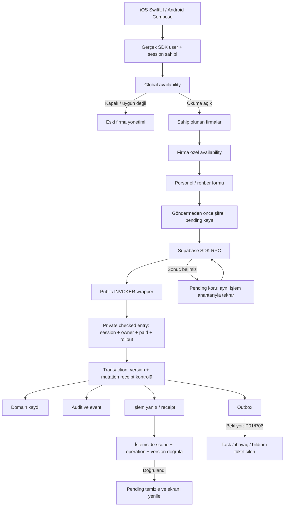

# İSG Adası / RiskDetected — güncel geliştirme durumu

Tarih: **13 Eylül 2026** · Geliştirme dalı: `codex/isg-transition-foundation`
Kapsam: V5 geçiş planı, bu tarihe kadar mevcut kaynak kodu ve yerel doğrulama kanıtları.

## 1. Kısa ve açık sonuç

**P05'in firma/personel altyapısı, iki native yönetim bağlantısı, basit personel formu, tarihli rehber API'leri ve arşivden yeniden etkinleştirme kodu hazır. Ancak P05'in bütün kabul kapıları kapanmış değil.** Gerçek mobil yönetim sahibi + SDK + izole veritabanı üzerinden uçtan uca kabul ve tarihli/hiyerarşik ekran matrisinin tamamı hâlâ bekliyor. Bu nedenle P05'i “tamamlandı/yayına hazır” olarak işaretlemiyoruz.

Bu tur iki önemli eski açığı kapattık: tam legacy veritabanı kopyasında P05 migration/backfill provası ve iOS Keychain/Android Keystore üzerinde uygulama yeniden başlatma doğrulaması. Ayrıca arşivden dönüşü ekledik ve iOS'ta önceki form durumunun yeni forma taşınması hatasını düzelttik.

**Canlı Supabase'e bu geçiş migration'ları uygulanmadı, rollout açılmadı, mağazaya yeni sürüm gönderilmedi.** Kaynakta geliştirilmiş bir özellik, şu an mağazadaki uygulamada aktif demek değildir. Geçiş sırasında teknik iOS bundle/Android package kimlikleri, mevcut abonelik ürünleri, fiyatlar ve kazanılmış haklar değiştirilmedi.

Yüzde vermiyoruz: bir altyapı testi ile son kullanıcı kabul testi aynı şey değil; fazların büyüklükleri de eşit değil.

## 2. Durumları nasıl okumalısın?

| Durum | Anlamı |
|---|---|
| Hazır dilim | Belirtilen sınırlı kod/test teslimi mevcut; tüm fazın bittiği anlamına gelmez |
| Kısmi | Fazın bazı çıktıları var, kalan uygulama veya kabul işleri var |
| Bekliyor | Bu geçişe ait yeni modül henüz uygulanmadı |
| Yerel doğrulandı | Belirtilen test ortamında geçti; canlıya açılma veya fiziksel cihaz kanıtı değil |
| Canlı kapalı | Mevcut kullanıcılar için yeni davranış devreye alınmadı |

Önceki yürütme günlüğündeki sayılar tarihsel test turlarıdır; toplanarak “tüm varyasyonlar geçti” sonucu çıkarılamaz. Yeni özet için bu belgeyi; ayrıntılı tarihçe için [yürütme kaydını](EXECUTION_STATUS.md) kullan.

## 3. P00–P21: yaptıklarımız ve bekleyenler

| Faz | Güncel durum | Yapılanlar | Kalan işler / kapanış koşulu |
|---|---|---|---|
| P00 Başlangıç/yedek/envanter | Kısmi; ana yedek ve servis restore hazır | Kaynak checkpoint, Git bundle, DB/Auth/Storage kapsamı, 588 dosya doğrulaması, Masaüstü şifreli kopya, read-only mağaza/RevenueCat envanteri; bu tur P05 upgrade provası | Aynı disk dışı yedek; bütün imzalı mobil güncelleme/geri kazanım provası, ortam farkları ve SLO/RPO/RTO kararları |
| P01 Contract/test/işlem omurgası | Kısmi | Ortak mutation/error/state sözleşmeleri; operation/mutation ID, retry, audit/outbox transaction, session freshness ve fault testleri; yerel CI altyapısı | Bütün yeni domain'lerin fonksiyon/kabul eşlemesi; gerçek consumer/worker'lar ve uçtan uca bağlantılar |
| P02 Üyelik/Auth | Kısmi | Mevcut iOS parola yolu korunuyor; Android parola servisi, iki platform signup/recovery ve parola kuralları; izole GoTrue testleri | Yeni giriş ekranlarının tam aktivasyonu, OTP/recovery amaç koordinatörü, hesap bağlama/MFA varyasyonları ve gerçek provider teslimi |
| P03 Abonelik/legacy/kota | Kısmi | Mevcut SQL hak otoritesi envanteri; Plus 5 hak koruma/floor shadow hesabı; downgrade/read-only ayrımı; eski kota matrisi | Yeni policy/floor geçişi, bütün atomic rezervasyon/settlement tüketicileri, hak koruma cutover'ı; ticari karar gerektiren yeni limitler |
| P04 Güvenli dosya/belge çekirdeği | Bekliyor; tasarım/spike işleri tanımlı | Amaç/izolasyon/scan ve belge snapshot gereksinimleri planlandı | Quarantine, upload intent, scan, immutable asset, güvenli render/parse worker ve iki mobil bağlantı |
| **P05 Firma/işyeri/personel** | **İleri kısmi; kabul açık** | D05 migration/API; default workplace backfill/catch-up; iki native liste/form/detail ve çalışma alanı bağlantısı; personel, rehber, tarihçe, şifreli pending; arşiv/yeniden etkinleştirme | **Gerçek native UI→SDK→izole DB E2E; tüm tarihli/hiyerarşik ekran varyasyonlarının kabulü; ilgili kabul ID'lerinin katman bazlı kapatılması** |
| P06 Kural/süre/task | Bekliyor | P05 tarihli context ve event üreticisi önkoşulları var | Mevzuat kaynak kayıtları, sürümlü kural motoru, applicability, task/schedule, daily reconcile ve rule publish |
| P07 Eğitim | Bekliyor | Personel ve görev geçmişi önkoşulu var; menü/sunum hedefi var | Katalog, eğitim planı/oturumu, katılım, ölçme, tamamlama, dış sertifika, iki format belge ve native domain akışları |
| P08 Risk sürümleme | Bekliyor | Mevcut legacy analiz sistemi korunuyor | Dört revision türü, açık AI bulgu aktarımı, impact/review ve tarihli schedule; eski analiz, yeni risk motoru değildir |
| P09 Uygunsuzluk/checklist | Bekliyor | NOVA ekran/menü referansı ve mevcut eski bulgu davranışı korunuyor | Yeni state/action/verification, checklist template/run, finding adapter ve gerçek saha akışları |
| P10 Diğer İSG modülleri | Bekliyor | Modül sınırları ve menü hedefleri planlandı | Plan §7.5'teki her modülün model/API/native/task/belge/izin dilimi ayrı uygulanacak |
| P11 Import/evrak merkezi | Bekliyor | Ortak belge/import sözleşmesi planda | Güvenli parser, preview/commit/resume, domain şablonları, PDF/XLSX, arama/filtre ve legacy rapor adaptörü |
| P12 Bildirim | Bekliyor; mevcut taşıyıcı korunuyor | Bildirim paneli sunum katmanı, mevcut bildirim sisteminin envanteri | Consent provenance, producer ownership, jobs, send-time izin, shadow/canary, duplicate önleme ve gerçek cihaz teslimi |
| P13 Kişisel not/reminder | Bekliyor | Bağımsız owner/şirket dışı kapsam tanımlı | Note/item/tag, offline conflict/tombstone, occurrence ve installation-owner, Free UX |
| P14 Abonelik lifecycle/store | Kısmi | Store/RC ürün-offering envanteri; Android explicit offering bulunamadığında hatalı current fallback kaldırıldı | Canonical lifecycle, gift/discount ayrımı, quote/intent/settlement, store teklif spike/kabul ve yenileme kanıtı |
| P15 Referral/winback | Bekliyor | V5 kampanya kararları ve bağımlılıklar kayıtlı | Qualification, anti-abuse/budget, ödül, suppression ve kanal politikaları; ticari onaylar |
| P16 İzleme/admin | Kısmi temel | Trace/redaction/teknik sözleşme hazırlığı ve eski panel kapsamı | Her domain için izleme, pre-submit funnel, scope'lu admin sayfaları, simulate/review/publish/audit |
| P17 Skor/portföy | Bekliyor | Sürüm/unknown/provisional yaklaşımı planda | Versioned score policy, açıklanabilir katkılar, bağımsız oracle, read model ve gerçek firma/portföy UI |
| P18 Marka/native kabuk | Kısmi | OSGB NOVA kaynakları, font/token/ikonlar; beş referans ekran; gri tuval-beyaz kart; popup/drawer/tab; firma yönetimi bağlantısı | Tüm ana uygulamanın yeni köke geçişi, diğer modüllerin gerçek servisleri, tüm ekran TR/EN/accessibility kabulü, final marka/asset |
| P19 Bütünleşik prova | Kısmi test altyapısı | İzole DB/Auth/Storage, fault ve backup provası; native component/SDK/unit testleri | 203 kaynak + 60 geçiş kabulünün tam eşleme/koşumu; old/new binary, fiziksel cihaz, security/load, hesap silme ve tüm ürün restore |
| P20 Yayın | Bekliyor | Teknik kimlikler ve rollout sırası korunuyor | P19 ve insan onayları; aynı mağaza kayıtlarına imzalı update, internal/pilot/canary/genel açılış |
| P21 Stabilizasyon | Bekliyor | Gözlem/geri dönüş kuralları tanımlı | Yayın sonrası queue/drift/maliyet/destek gözlemi; kanıtlı düzeltmeler; sonraki cleanup için ayrı karar |

P04, P06 ve devamının eksik olması P05'te yapılmış işi yok saymaz; fakat eğitim/rapor/bildirim gibi son kullanıcı sonuçlarını henüz çalışır hâle getirmez. Aynı şekilde menüde bir hedef bulunması o domain'in tamamlandığını kanıtlamaz.

## 4. P05'te şu an mevcut işlevler

### Firma ve çalışma alanı

- iOS Profil → Firmalarım ve Android mevcut firma yönetimi girişleri gerçek oturum ve availability kontrolüne bağlandı.
- Global erişim, ardından seçilen firma için erişim kontrol edilir. Eski hesabın/firmanın cevabı yeni ekrana yazılmaz.
- Rollout/endpoint/erişim uygun değilse eski firma yönetimine dönüş vardır.
- Mevcut firma oluşturma/düzenleme/arşiv, limit ve paywall sözleşmeleri korunur.
- İşyeri, departman, görev/unvan, dış firma, tarihli işyeri context'i, personel görevlendirme ve işveren ilişkisi için yeni katalog/API/native bileşenleri vardır.
- Arşivlenmiş firma veya paid hakkı bitmiş hesapta yeni yazma ve bekleyen işlemi yeniden gönderme engellenir; izin verilen okuma korunur.

### Personel — kullanıcının istediği sade giriş

1. Firma zaten seçilidir.
2. **Ad soyad yeterlidir.**
3. Başlangıç/bitiş tarihi, görev/unvan, işyeri ve personel kodu temel ekleme formunda istenmez.
4. Departman isteğe bağlıdır: boş bırakılabilir, listeden seçilebilir, yeni ad yazılabilir.
5. Yeni departman ve personel aynı transaction içinde ilgili firmaya kaydedilir; biri başarısızsa yarım kayıt kalmaz.
6. Aynı normalize adla birden fazla uygun departman varsa sunucu açık seçim ister; yanlış departman tahmin edilmez.
7. Sistem personel kodunu üretir. Kayıt zamanı işe başlangıç tarihi yerine yazılmaz; işe giriş/çıkış NULL kalabilir.
8. Düzenleme, arama, liste/sayfalama, detay, arşiv ve arşivden yeniden etkinleştirme vardır.
9. Yeniden etkinleştirme kimliği/kodu/adı/departmanı/tarihçeyi değiştirmez; aktiflik ve kayıt sürümünü günceller. Yeni görevlendirme gerekiyorsa ayrıca girilir.

### Tarihçe ve veri sınırları

- Ana görevlendirme için tarih aralıkları `[başlangıç, bitiş)` kullanılır; aynı çalışan için çakışan ana görevlendirme engellenir.
- Departman/unvan/işveren snapshot'ları geçmiş kayıtta korunur.
- İşyeri context'i tarih aralığına göre okunur; bilinmeyen legacy context “onaylı bilgi” olarak uydurulmaz.
- Composite foreign key'ler owner/firma/işyeri karışmasını engeller; yalnız istemci filtresine güvenilmez.
- Ad aynı diye iki personel birleştirilmez.
- Bu personel modülünde sağlık muayenesi veya kişisel sağlık uygunluğu formu yoktur.

## 5. P05 veri omurgası

`public.companies` eski şirket otoritesi olarak kalır. Yeni alanlar `private_isg` içindedir; toplam **15 tablo**, bütününde RLS açık ve istemciye doğrudan tablo yetkisi kapalıdır.

| Tablo | Temel alan / sorumluluk |
|---|---|
| rollout | feature, read_enabled, write_enabled; varsayılan kapalı |
| workplaces | company_id, owner_id, code/name/address, legacy_company_id, needs_review, is_archived, version/context_version |
| workplace_initializations | workplace_id, created_at; tekrar backfill'in tekilliği |
| departments | company/owner/workplace, code/name, parent_id, is_archived, version |
| job_roles | company/owner, code/title/description, is_archived, version |
| employees | company/owner, employee_code/full_name, intake_department_id, hired_on/employment_ends_before, registered_at, record_version, is_archived, employer_org_id/employer_version/assignment_version |
| contractor_organizations | company/owner, code/name, relationship, is_archived, version |
| contractor_engagements | organization/workplace, starts_on/ends_before/effective_dates, description, version |
| workplace_context_versions | workplace, tarih aralığı, timezone/jurisdiction/hazard_class/industry_code, evidence_note |
| employee_assignments | employee/workplace/department/job_role, tarih aralığı, unvan/departman/işveren snapshot'ı, reason |
| personnel_receipts | actor/mutation/company/operation, request_hash, response; aynı işlemin tekrarı |
| personnel_audit | employee/version/operation/action/event, actor/company, created_at |
| personnel_outbox | event_id/type/schema_version/created_at; create/update/archive/restore olayları |
| directory_events | company/owner/operation/entity_kind/entity_id/version, created_at |
| directory_outbox | event_id, schema_version; rehber olayları |

Bu tablo özetidir; tam SQL tip, nullability, CHECK/FK/index ve fonksiyon gövdeleri şu dört migration'da sürümlenir:

- [Personel ve owner RPC](../../supabase/migrations/20260913074153_isg_personnel_owner_rpc.sql)
- [İşyeri context, hiyerarşi ve görevlendirme](../../supabase/migrations/20260913081536_isg_workplace_context_assignments.sql)
- [Çalışma alanı availability](../../supabase/migrations/20260913084736_isg_workspace_availability.sql)
- [Personeli yeniden etkinleştirme](../../supabase/migrations/20260913092642_isg_personnel_reactivation.sql)

## 6. Uçtan uca tasarlanan işlem akışı ve mevcut bağlantılar

Akışın kod bağlantıları vardır; bütün bu zincirin gerçek native ekrandan tek koşuda doğrulandığı henüz iddia edilmiyor. Mevcut kanıtlar katman bazlıdır.

Ana iOS sahipleri: `NovaWorkspaceController`, `NovaPersonnelService` / live adapter, `NovaDirectoryService`; Android: `NovaWorkspaceViewModel`, `PersonnelRepository` ve `NovaPersonnelRepositoryAdapter` / `NovaDirectoryRepositoryAdapter` profil adaptörleri. Sunucuda availability yalnız sunum ipucudur; her yazma kendi yetkisini yeniden kontrol eder.

### Neler bağımsız, neler başka faza bağlı?

| Mevcut işlem | Bugünkü sonucu | Henüz tetiklemediği yeni sonuç |
|---|---|---|
| Personel oluştur/düzenle/arşiv/restore | Personel + receipt + audit/outbox atomik | Yeni eğitim ihtiyacı/task/bildirim consumer'ı |
| Görevlendirme/context değiştir | Tarihli domain kayıt ve event | P06 kural hesaplama, P07 ihtiyaç/sertifika iş akışı |
| Firma listesi/erişim | Eski şirket otoritesi + yeni feature gate | Tüm ana uygulamanın NOVA köküne geçişi |
| Referans bildirim popup'ı | Onaylı görsel bileşen/sentetik ekran QA | Yeni notification producer ve gerçek push teslimi |
| Mevcut analiz/rapor/abonelik | Legacy akış korunur | Yeni eğitim/risk/task/skor sisteminin tamamı |

## 7. Bu tur kapatılan geliştirme ve test işleri

- Personel `restore` action'ı iki platform, DTO, sunucu transaction, audit ve outbox'a eklendi.
- Restore sırasında ad/departman değişikliği gönderilmez; sunucu böyle bir payload'ı reddeder.
- Aynı restore tekrarının yeni olay üretmemesi; yanlış firma, eski sürüm, aktif kayda restore ve kapalı yazma reddi gerçek HTTP üzerinden test edildi.
- iOS'ta arşivden dönüş formunun eski “committed” durumunu koruyarak pasif kalması hatası, form kimliğini personel+sürüme bağlayarak düzeltildi. SwiftUI UI Patterns rehberi bu yerel durum sahipliği düzeltmesini yönlendirdi.
- iOS'un gerçek Keychain implementasyonu ayrı Simulator QA uygulamasında çalıştırıldı. Aynı service namespace'in varsayılanı üretimde değişmedi; test için farklı namespace enjekte edildi.
- QA uygulamasının ilk Keychain denemesi eksik entitlement ile `-34018` verdi. Yalnız Simulator QA hedefi ad-hoc imza ve QA access group ile düzeltildi; üretim entitlement'ı değiştirilmedi. [Apple Keychain access-group açıklaması](https://developer.apple.com/documentation/security/sharing-access-to-keychain-items-among-a-collection-of-apps).
- Android'in gerçek üretim journal kaynağı Gradle tarafından ayrı QA uygulamasına derleniyor; el yazısı kopya/mock değil. Ayrı app UID ile çalışır, ağ izni yoktur.
- Tam legacy yedek kopyasına dört P05 migration uygulandı; orijinal kaynak kopya ve legacy satırlar/helper gövdeleri korunarak tekrar backfill doğrulandı.
- CI tetik yolları ve iOS journal koşumu eklendi; Android CI'ya journal APK derlemesi eklendi. **Uzak CI koşumu yapılmadı; Android restart runner'ı bu tur yerelde çalıştırıldı.**

## 8. Kanıt tablosu ve sınırları

| Doğrulama | Sonuç | Ne kanıtlamaz? |
|---|---|---|
| Gerçek izole GoTrue + PostgREST + PostgreSQL/Advisor | **300 kontrol PASS**; 299 tekil kontrol ID'si, önceki bir tekrarlı ID korunuyor | Native ekran→DB E2E veya canlı proje durumu |
| Tam legacy schema kopyasına P05 upgrade | **26 kontrol PASS**, 9'u yeni P05 upgrade kontrolü | Fiziksel cihaz, mağaza update veya bu koşuda Storage byte restore |
| Legacy veri korunumu | public/private/auth/storage satır fingerprint'leri ve eski public/private fonksiyon gövdeleri değişmedi; backfill 2 tekrar aynı sonuç | Kaynak zamanından sonra oluşan canlı verinin yedeği |
| Android toplu test | **991 PASS**: design 365 + data 615 + profile 11; 0 fail/error/skip | Hepsinin emülatör UI testi olduğu anlamına gelmez; JVM/Robolectric/SDK katman testleri |
| Android ana Debug APK | Build PASS | İmzalı release/store update |
| Android gerçek Keystore | API33 emülatörde 2 faz PASS: write → force-stop → read | Fiziksel cihaz/diğer API sürümlerindeki bu özel journal testi |
| iOS gerçek Keychain | Simulator'da 1 XCTest PASS: write → terminate → relaunch → pending reconcile/clear | Fiziksel cihaz veya gerçek sunucu commit'i; commit yanıtı testte enjekte edilir |
| iOS hosted UI | Form-durum düzeltmesi sonrası **19/19 PASS**; son font/ikon uyarlaması sonrası restore testi ayrıca **1/1 PASS** | Gerçek SDK/Auth/DB; bu UI harness sentetik repository kullanır |
| iOS ana uygulama | Debug Simulator build PASS | İmzalı release/store/Keychain continuity |
| Node / foundation | **206/206**, foundation alt kümesi **163/163 PASS** | 369 bağımsız test veya tüm V5 kabulü; foundation bu toplamla örtüşür |
| Kimlik kontrolü | Bundle/package/namespace/callback/entitlement kaynak kontrolü PASS | İmzalı uygulama üzerine güncelleme kurulumu |
| Fonksiyon-test manifest | Mevcut transport kapsamı doğrulandı | Tüm yeni/eski fonksiyonların eksiksiz eşlendiği anlamına gelmez |

Swift gerçek personel servisi + enjekte edilmiş bellek journal testi ayrıca **17/17** kontrolü geçti. Advisor kapısı, sıfır bulgu demek değildir: sentetik şemada 77 toplam bulgu kaydı vardır; P05 ile ilgili kayıtlar INFO düzeyinde, private/RPC tasarımındaki policy'siz kapalı tablolar ve yeni test DB'sinde henüz kullanılmamış indeksler olarak değerlendirilmiştir. Üretim performans kabulü değildir.

Ayrıntılı çalıştırma yolları, hash'ler, test düzeltmeleri ve son iOS sonuçları: [P05 güncel kanıt](evidence/P05_CURRENT_2026-09-13.json).

İlk iOS filtreli test çağrısı **0 test** çalıştırdığı için kanıt sayılmadı. Tam sınıf koşumu yeni testte hatayı gösterdi; toggle hedefi düzeltildikten sonra gerçek form-durum hatası ortaya çıktı ve düzeltildi. Başarısız koşular sonuçlardan gizlenmedi.

### Journal kapsamı

iOS: `WhenUnlockedThisDeviceOnly`, synchronizable=false, boyut sınırı, farklı hesap izolasyonu; uygulama yeniden açılınca aynı operation/mutation ile yeni session scope'a bağlama ve doğrulanmış sonuçta temizleme.

Android: şifreli dosyada plaintext bulunmaması, rastgele IV, authenticated associated data ile yanlış hesabın ciphertext'ini reddetme, boyut sınırı, ayrı directory namespace, force-stop sonrası okuma, ciphertext bozma reddi ve yalnız ilgili test kaydını temizleme.

## 9. P05'i gerçekten kapatmak için kalan kabul listesi

Bu liste fazı daha kolay “bitti” saymak amacıyla başka faza taşınmış değildir.

| Açık kabul | Yapılacak doğrulama | Mevcut kısmi kanıt |
|---|---|---|
| Gerçek native yönetim→SDK→izole DB | İki platformda oturum aç, firma seç, personel/departman ekle, düzenle, arşivle/geri aç; DB sonucu ve tek receipt/event doğrula | Gerçek SDK adaptörleri ve ayrı sunucu/ekran testleri |
| Oturum/foreground/bağlantı kaybı E2E | Aynı native zincirde hesap değişimi, foreground paid/rollout kaybı, commit sonrası yanıt kaybı ve yeniden başlatma | Host/scope reducer, RPC, journal ve fault testleri ayrı ayrı mevcut |
| Bütün tarihli/hiyerarşik ekran varyasyonları | İki firma/iki işyeri, hiyerarşi cycle/reparent, tarih sınırları, çakışma, geçmiş/gelecek, işveren ve archived/read-only ekran matrisi | Backend constraint/API testleri ve sınırlı native rehber testleri |
| Katmanlı kabul eşlemesi | REV01/21/23, DAT04/05, X07/12/13 için hangi alt koşulun geçtiğini, hangi bağımlılığın beklediğini runner kanıtına bağla | V5 registry başlangıç kaydı, önceki dilim raporları ve yeni kanıtlar |

REV-21 “yeni ihtiyaç önerilir; eski sertifikadaki unvan değişmez” koşulunun tarih/snapshot altyapısı P05'te, ihtiyaç motoru P06/P07'dedir. REV-23'ün tek personel ve işveren bağı P05'te; eğitim/izin formu bağlantısı P07/P10'dadır. Bu bileşik testler bugün **tam PASS değildir**.

DAT04/05 ve X07 için sentetik backfill/catch-up/fault kanıtı ile bu tur gerçek legacy kopya upgrade kanıtı vardır. X12 owner/composite guard'ları gerçek HTTP/DB'de denenmiştir. X13'ün gelecekteki import parçası P11'i bekler. Bir alt katmanın geçmesi bütün kabul ID'sini otomatik kapatmaz.

## 10. Önerilen devam sırası

1. **P05 kabul açığını kapat:** iki platform gerçek native E2E fixture/runner ve tarihli ekran matrisi; sorun çıkarsa düzelt, tek faz sonu regresyonu yap.
2. P01/P03'te sonraki domain'lerin ihtiyaç duyduğu consumer/rezervasyon sözleşmelerini tamamla.
3. **P04 güvenli dosya çekirdeği** ve **P06 kural/task çekirdeği** önkoşullarını uygula.
4. P07 eğitim, P08 risk, P09 uygunsuzluk ve P10 diğer modülleri bu çekirdeklere bağla.
5. P11 evrak/import, P12 bildirim, P13 not; P14–P17 ticari/izleme/skor akışlarını kendi bağımlılıklarıyla tamamla.
6. P18 tam native kök/marka kabulü → P19 bütünleşik prova → insan onaylı P20 update.

Her küçük düzenleme sonrasında tüm testleri çalıştırmak yerine uygulama işleri topluca yapılır; faz sonunda ilgili toplu test paketi çalıştırılır. Gerçek hata bulunduğunda dar düzeltme testi, sonra gerekli regresyon uygulanır.

## 11. Yedek, geri dönüş ve canlı güvenlik

- Eski değişim noktası: `riskdetected-change-point-20260912`, kaynak commit `dbcc979d`; etiket değiştirilmedi.
- Masaüstündeki ikinci kopya şifreli ve doğrulanmış durumda; **aynı fiziksel disk** üzerinde olduğundan disk arızasına karşı harici yedek değildir.
- Bu tur restore runner'ı eski izole yedeği yeni disposable container'a klonladı; kaynak container üzerinde migration çalıştırmadı. Geçici test container'ları temizlendi.
- Yeni şema canlıya çıkarken additive migration, read/write kapalı başlangıç ve kontrollü açılış kullanılacak.
- Olağan geri dönüş: yeni yazmayı/producer'ı kapat, eski uyumlu okuma yolunu koru, yeni veriyi silmeden düzelt.
- Git etiketine dönmek veritabanını/mağaza durumunu geri almaz. Canlı DB'ye 12 Eylül yedeğini doğrudan basmak sonraki verileri kaybettirebilir; olağan rollback değildir.
- Bu belgedeki hiçbir test, yeni üretim flag'i, push/e-posta gönderimi, ödeme işlemi veya store gönderimi yapılmış olduğu anlamına gelmez.

## 12. Başvurulacak dosyalar

- [Ana V5 geçiş planı](ISG_ADASI_TRANSITION_PLAN_2026-09-12.md)
- [Tarihsel yürütme kaydı](EXECUTION_STATUS.md)
- [P05 gerçek yönetim bağlantısı](P05_WORKSPACE_CONNECTION_2026-09-13.md)
- [P05 rehber ve native servis paketi](P05_DIRECTORY_AND_NATIVE_SERVICES_2026-09-13.md)
- [Personel sade giriş kararı](P05_SIMPLE_EMPLOYEE_INTAKE_2026-09-13.md)
- [P18 referans tasarım standardı](P18_REFERENCE_DESIGN_2026-09-13.md)
- [V5 kaynak kabul envanteri](V5_ACCEPTANCE_TEST_REGISTRY.csv)
- [Bu turun çalıştırılabilir kanıtı](evidence/P05_CURRENT_2026-09-13.json)

Kaynak kabul CSV'si başlangıç uygulama/koşum durumlarını içerir; henüz tüm yeni runner sonuçlarıyla güncellenmiş bir canlı coverage tablosu değildir. Güncel tamamlandı/bekliyor değerlendirmesi bu belgede ve bağlantılı kanıtlarda katmanlarıyla belirtilmiştir.
