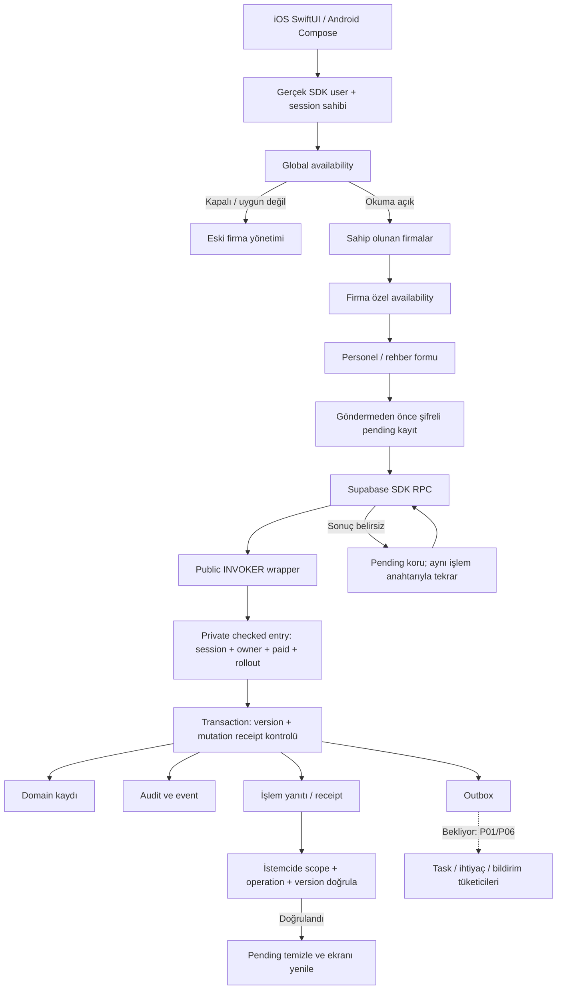

- **15 Eylül Atama ve Temsilciler (P10 istemci dilimi):** [Atama istemci sınırı](P10_APPOINTMENTS_2026-09-15.md). Sol menüdeki **Atama ve Temsilciler** artık gerçek bir sayfa. Çekirdekte iki boşluk vardı: sahiplik kontrolü ve plan §10'un saydığı **"seçim/atama dayanağı"** alanı. (`end_appointment` çekirdekte zaten vardı; ilk taramamda kaçırmıştım — bu dilim onu yeniden tanımlamıyor.) Yeni migration `20260915190000`. Beş şey yapısal olarak imkânsız: başka sahibin atamasına ulaşmak; **aynı kişinin aynı görevi aynı kapsamda çakışan tarihlerde üstlenmesi** — kural dışlama kısıtının kendisinde, bu dilim ikinci bir kontrol yazmıyor ve bitiş düzeltmesi de aynı kısıttan geçiyor; **kimseye yeterli etiketi konması** (alan yok, şemada yer yok, her okuma söylüyor, payload'da olsa reddediliyor); **ürünün kaç kişi gerektiğini söylemesi** (onaylı sayı kataloğu yok, okuma "bilinmiyor" diyor); ve atamanın başlamadan bitmesi. Görevin neden verildiğini söylemek **zorunlu** (`BASIS_REQUIRED`). Disposable PostgreSQL 17'de **39 kontrol PASS** — yanlış bitişin düzeltilebildiği ve düzeltmenin sonraki atamanın üstüne uzatılamadığı dahil. Guard 14/14, design 13/13; nova-design 159/157, foundation 637/636; iOS Debug SUCCEEDED; 63 katalog anahtarı tr+en. **Ayrıca `scripts/isg/module_slice_fixture.sql` eklendi**: önceki beş dilimin kontrolleri scratch fixture'larla koşulmuştu ve yeniden koşulamıyordu; artık hepsi tek dosyayla koşuyor ve aynı sayıları veriyor (49/49/43/38/39/39). **Atama yazısı eklenemiyor**, atamanın kendisi düzeltilemiyor, göreve bağlı eğitim ilişkisi ve canlı pilot bundle'ı açık.

- **15 Eylül KKD Zimmetleri (P10 istemci dilimi):** [KKD zimmet istemci sınırı](P10_PPE_HANDOVERS_2026-09-15.md). Sol menüdeki **KKD Zimmetleri** artık gerçek bir sayfa. Çekirdekte üç boşluk vardı: sahiplik kontrolü yoktu (`record_ppe_return` bir zimmet kimliği alıp tamamen ona güveniyordu); **yanlış girilen iade geri alınamıyordu** ve kişinin hâlâ neyi taşıdığını kalıcı olarak bozuyordu; ve `signed_copy` saklanmış dosya istediği için **bayrak ancak reddedilebilirdi** — uzmanın elindeki imzalı formun nerede olduğunu yazacak yer yoktu. Yeni migration `20260915170000`; kendi rollout satırını eklemiyor. Beş şey yapısal olarak imkânsız: başka sahibin zimmetine ulaşmak; verilenden fazlasının veya verilmeden öncesinin geri gelmesi (iki kural çekirdekte); **ürünün imzalı form tuttuğunu iddia etmesi** (`signed_copy` hiçbir allowlist'te yok, her okuma dosyanın saklanmadığını söylüyor, yalnız yeri not ediliyor); **hâlâ zimmette olanın saklanması** (okuma anında iadelerden sayılıyor, yanlış iadeyi geri almak anında düzeltiyor); ve yarın tarihli zimmet/iade. Üç durum var ve **her biri kendi sayacı** — gruplanacak bir şey olmadığı için grup katmanı yok. Disposable PostgreSQL 17'de **39 kontrol PASS**. Guard 13/13, design 13/13; nova-design 146/144, foundation 623/622 (hatalar eşzamanlı oturumun dosyaları); iOS Debug SUCCEEDED; 71 katalog anahtarı tr+en. **Zimmet düzeltilemiyor** (yalnız iade geri alınabiliyor), ekipman kataloğu ve ömür takibi yok, sentetik harness aşaması ile canlı pilot bundle'ı açık.

- **15 Eylül Tatbikatlar (P10 istemci dilimi):** [Tatbikat istemci sınırı](P10_DRILLS_2026-09-15.md). Sol menüdeki **Tatbikatlar** artık gerçek bir sayfa. Çekirdekte üç boşluk vardı: istemci sınırı ve **sahiplik kontrolü** yoktu; **hiçbir şey tatbikatı iptal edemiyordu** (durum ve zorunlu gerekçesi şemada, yazan fonksiyon yok); ve **katılımcılar yalnız kimlik olarak saklanıyordu** — kişi sonradan yeniden adlandırılsa yapılmış tatbikatın kimlerle yapıldığı değişirdi. Yeni migration `20260915150000`; kendi rollout satırını eklemiyor, `modules` + `drill` anahtarlarına biniyor. Beş şey yapısal olarak imkânsız: başka sahibin tatbikatına ulaşmak ve başka işyerinin planını prova etmek (işyeri payload'dan değil **planın kendisinden** geliyor); **planlamanın yapmak sayılması** (tarihi geçen `overdue` okur, `performed` kayıttan gelir); yapılmış tatbikatı yeniden yazmak veya iptal etmek; **katılımcı adlarının sonradan değişmesi** (anlık görüntü donuyor); ve tatbikatı başka bir plan sürümüne taşımak — istemci sürüm adlandıramıyor, sınır yürürlüktekini kendisi çözüyor. Disposable PostgreSQL 17'de **38 kontrol PASS** — kişiyi yeniden adlandırıp arşivlemenin anlık görüntüyü bit bit değiştirmediği ve yeni plan sürümünün tatbikatı taşımadığı dahil. Guard 13/13, design 13/13; nova-design 133/131, foundation 610/609 (hatalar eşzamanlı oturumun dosyaları); iOS Debug SUCCEEDED; 67 katalog anahtarı tr+en. **Kanıt dosyası eklenemiyor**, tatbikat bulgusundan uygunsuzluk açılamıyor, sentetik harness aşaması ve canlı pilot bundle'ı açık.

- **15 Eylül Acil Durum Planları (P10 istemci dilimi):** [Acil durum planı istemci sınırı](P10_EMERGENCY_PLANS_2026-09-15.md). Sol menüdeki **Acil Durum Planları** artık gerçek bir sayfa. Çekirdek sürümlü planı kurmuştu; eksik olan istemci sınırı ve **sahiplik kontrolüydü** — `module_scope` işyerinin firmaya ait olduğunu kanıtlıyor, firmanın çağırana ait olduğunu değil. Yeni migration `20260915130000`; kendi rollout satırını eklemiyor, `modules` + `emergency_plan` anahtarlarına biniyor ve ikisi **farklı hata veriyor**. Beş şey yapısal olarak imkânsız: başka sahibin planına ulaşmak; yenilemenin öncekini yeniden yazması (her sürüm kendi ekibi/tarihi/kapsamıyla kalıyor, okuma bunu gösteriyor); tarihin mevzuat süresi gibi sunulması (`period_source: expert`, katalog `period_defaults_offered: false`, tarihsiz plan `period_unknown` okur); **dayanağı yazılmamış planın gözden geçirme işaretinden kurtulması** (payload'da böyle bir alan yok, yayımlanmışı düzenleyen işlem de yok); ve **ekip anlık görüntüsünün serbest JSON olması** — her giriş ad ve şemadaki sabit rol kümesi için denetleniyor, yalnız üç anahtara izin var. **Yayımlama tek yazma işlemi**: düzeltme yok, düzeltmek bir sonraki sürümü yayımlamaktır. Disposable PostgreSQL 17'de **43 kontrol PASS** — yenilemenin öncekini bit bit değiştirmediği, eskisinin kendi 2 kişilik ekibini koruduğu ve plan başına tek satır düştüğü dahil. Guard 13/13, design 13/13; nova-design 121/119, foundation 596/595 (hatalar eşzamanlı oturumun dosyaları); iOS Debug SUCCEEDED; 75 katalog anahtarı tr+en. **Plan dosyası eklenemiyor** (istemcinin `file_assets` yolu yok); tatbikat bağlantısı, sentetik harness aşaması ve canlı pilot bundle'ı açık.

- **15 Eylül Kontrol Listeleri (P09 istemci dilimi):** [Kontrol listesi istemci sınırı](P09_CHECKLISTS_2026-09-15.md). Sol menüdeki **Kontrol Listeleri** artık gerçek bir sayfa. Burada iki boşluk vardı: **şablon yazma yolu hiç yoktu** (yayımlanacak taslağı üreten fonksiyon yok, seed de yok — modül tek kontrol başlatamıyordu) ve **şablon tablosu sahipsizdi** (uzmanın listesi her hesabın okuduğu tabloya düşerdi). Yeni migration `20260915110000`; kendi rollout satırını eklemiyor. **Ürün hazır liste göndermiyor** — kutudan çıkan soru listesi mevzuat iddiası gibi okunur, öyle bir onaylı katalog yok; ekran bunu boş kalarak değil yazarak söylüyor. Beş şey yapısal olarak imkânsız: başka hesabın şablonuna ulaşmak ve ad çakıştırmak (kod sahipten türetiliyor); **olumsuz yanıtın kendiliğinden uygunsuzluk açması** (ayrı alan, varsayılan false, her okuma `auto_nonconformity: false` der, kutu işaretsiz gelir); yayımlanmış sürümü düzenlemek; yanıtsız soruyla tamamlamak ya da tamamlanmışı değiştirmek; ve listenin izin vermediği soruda "Uygulanamaz" demek. **Onaylayanı istemci seçemez**; yayımlamak uzmanın kendi onayı, mevzuat onayı değil ve okuma bunu söylüyor. Disposable PostgreSQL 17'de **49 kontrol PASS**; guard 13/13, design 13/13; nova-design 108/106, foundation 583/582 (hatalar eşzamanlı oturumun dosyaları); iOS Debug SUCCEEDED; 76 katalog anahtarı tr+en. **Kanıt dosyası eklenemiyor** (istemcinin `file_assets` yolu yok, ölü yüzey bırakmamak için allowlist'e de konmadı); sentetik harness aşaması ve canlı pilot bundle'ı açık.

- **15 Eylül Risk Değerlendirmesi (P08 istemci dilimi):** [Risk sürümleme istemci sınırı](P08_RISK_VERSIONS_2026-09-15.md). Sol menüdeki **Risk Değerlendirmesi** artık gerçek bir sayfa. P08'in ilk dilimi dört revizyon türünü ve tarih kurallarını kurmuştu; eksik olan istemci sınırı ve **sahiplik kontrolüydü**. Yeni migration `20260915090000`; **kendi rollout satırını eklemiyor ve hiçbir anahtarı açmıyor**. Beş şey yapısal olarak imkânsız: başkasının kaydına ulaşmak; süresi olmayan belgenin `valid` okuması (`period_unknown` okur); uzmanın kendi süresinin mevzuat gereği gibi sunulması (`unapproved_fixture` + zorunlu gözden geçirme, katalog `period_defaults_offered: false` der); yasal değerlendirme tarihinin düzeltmeyle oynatılması (yalnız tam yenileme tarih taşır, form diğerlerinde alanı hiç açmaz); ve analizden kendiliğinden kopyalama — sonradan değişen kaynak yalnızca **sapma bayrağı** kaldırır, belge asla yeniden yazılmaz. **Doğrulayanı istemci seçemez**: `verified_by` allowlist'te yok, sınır oturum açmış uzmanı kendisi geçirir. Filtreler yan yana, liste altta açılıyor. Disposable PostgreSQL 17'de **49 kontrol PASS**; guard 12/12, design 11/11; nova-design 95/94, foundation 570/569 (tek hatalar eşzamanlı oturumun dosyaları); iOS Debug SUCCEEDED; 99 katalog anahtarı tr+en eklendi, mevcut hiçbir anahtar değişmedi. **Sentetik harness aşaması, analiz bulgusu seçme ekranı, rescan dosya varyantı ve canlı pilot bundle'ı açık.**

- **14 Eylül Evrak Takibi · canlı pilotta AÇILDI:** [Canlı pilot kaydı](NOVA_DOCUMENT_TRACKING_PILOT_2026-09-14.md). Ledger `20260914193516_isg_pilot_document_tracking`, önceki head `20260914192452`. Ekipman bundle'ının aksine **hiçbir şey kırpılmadı** — bu dilim zaten `file_assets`'e hiç dokunmuyordu. İki sapma var, ikisi de daraltma: `require_document_tracking_company` P05 pilot kapılarını taşıyor ve `read_document_portfolio` hesap düzeyi pilot kapısını kazandı. Üç yapısal garanti aynen duruyor: **sağlık kaydı buraya giremez** (tür kataloğu şemada sabit), **durum saklanmıyor** (okuma anında hesaplanıyor), **dosya eklenmiyor** (asset kolonu yok, her okuma `file_storage_available: false` diyor). Disposable PostgreSQL 17 üzerinde mirror tek transaction'da uygulanıp **42 kontrol PASS** — dört durumun sınır günleri, `legal` dayanağın referans zorunluluğu, sürüm çakışması, arşivlenene kopya işlenememesi, sayacın listeyle çelişememesi dahil. Canlıda pilot hesabın claim'leriyle 16 tür / 1 işyeri okundu; pilot dışı hesap `FEATURE_UNAVAILABLE` aldı. `require_company` MD5 değişmedi, sıfır tablo grant'i, üç INVOKER wrapper, advisor'da yeni uyarı yok. **Canlıda yazma probu koşulmadı ve iOS build'i telefona kurulmadı.** Bildirim, şablon, skor katkısı ve Android karşılığı açık.

- **14 Eylül Periyodik Kontroller · canlı pilotta AÇILDI:** [Canlı pilot kaydı](NOVA_EQUIPMENT_PILOT_2026-09-14.md). Modül canlı projede (`ppcrzemgiztzcgddbins`) açıldı; ledger `20260914192452_isg_pilot_equipment_checks`, önceki head `20260914170954`. Canlı proje ana migration zincirini taşımadığı için bu, geliştirme dilimlerinin **kırpılmış tek bir pilot bundle'ı**: yalnız `equipment` modülü kuruldu, `evidence_asset_id` kolonu yok (arşiv pilotta değil; null olmayan referans `VALIDATION_ERROR` ile reddediliyor) ve `require_equipment_company` P05 pilot kapılarını taşıyor. Üç sapmanın üçü de daraltma yönünde. **Kimin ulaştığını P05 allowlist'i belirliyor**: pilot listesinde olmayan gerçek bir hesapla canlıda denendi, `FEATURE_UNAVAILABLE` aldı. Pilot hesabın claim'leriyle katalog 20 tür / 1 işyeri / `notice_days=30` döndü. Disposable PostgreSQL 17 üzerinde mirror dosyası tek transaction'da uygulanıp **41 kontrol PASS**; `require_company` MD5 önce/sonra aynı (`f9de5f41…`), sıfır tablo grant'i, iki INVOKER wrapper, advisor'da yeni uyarı yok. **Canlıda yazma probu koşulmadı ve iOS build'i telefona kurulmadı — gerçek kullanıcı kabulü bekliyor.** Bildirim, onaylanmış süre kataloğu, skor katkısı ve Android karşılığı hâlâ açık. Pilot süresi 20 Eylül 2026'da doluyor.

- **15 Eylül Periyodik Kontroller · kaydedilmiş raporun düzeltilmesi:** [Ekipman envanteri ve kontrol kayıtları](P10_EQUIPMENT_CHECKS_2026-09-15.md). Üçüncü migration `20260915070000`. Sonraki tarihi artık **sonradan da** değiştirebiliyorsunuz: geçmişteki rapora dokunmak düzeltme popup'ını açıyor (tarih, kontrolü yapan, rapor no, arşiv raporu, KATİP işareti ve notu). **Kontrol tarihi ve sonucu değiştirilemiyor** — raporun kendisi onlar; sunucunun allowlist'inde de yoklar, ekran da doğru raporun ayrıca kaydedilmesi gerektiğini yazıyor. Düzeltilen tarih girişteki gibi sınıflandırılıyor; sürenin ürettiğine geri çekilirse tekrar "Süreden hesaplandı" oluyor. **İSG-KATİP işareti yalnızca bilgi amaçlı**: hiçbir duruma, sayaca veya filtreye dokunmuyor — probe işareti değiştirip sayımların bit bit aynı kaldığını doğruluyor; mühür yerine konuşma balonu ikonu kullanılıyor ve detay kartında "uzman beyanı" olarak görünüyor. İşareti geri almak notunu da alıyor. Sentetik koşu **1305 kontrol / 0 hata**, bunun 57'si bu modülün.

- **15 Eylül Periyodik Kontroller · varsayılan süreler, otomatik tarih ve İSG-KATİP beyanı:** [Ekipman envanteri ve kontrol kayıtları](P10_EQUIPMENT_CHECKS_2026-09-15.md). İkinci migration `20260915050000`. **Sahibin kararıyla değişti:** modül artık her tür için bir süreyle geliyor. Varsayılan `equipment_default_periods` tablosundan geliyor, her satırda **zorunlu gerekçe notu** var, `regulation_default` etiketiyle **"Mevzuat eki genel süresi · ürün varsayılanı"** olarak gösteriliyor ve şema onay bayrağını **zorluyor**. Uzman bu etiketi kendisi seçemiyor — seçebildikleri üretici / mevzuat / kendi kararı. Varsayılan, ekipman kaydedilirken **görünür ve düzenlenebilir bir firma kuralı** olarak yazılıyor; ürünün varsayılanı olmayan tür hâlâ hiç tarih üretmiyor. **Sonraki tarih rapor tarihinden otomatik hesaplanıp forma doldu, uzman değiştirebiliyor**; kaydedilen tarihin ne anlama geldiği sunucunun kararı (`due_source` period/expert) ve ekranda yazıyor. Rapordan önceki tarih ve olumsuz sonuca elle tarih reddediliyor. Kontrol kaydına opsiyonel **İSG-KATİP ataması yapıldı** işareti ve notu eklendi — bu bir **doğrulama değil**: `katip_official_verification` kolonu yalnız false olabiliyor, ekran da uygulamanın İSG-KATİP üzerinde sorgulama yapmadığını yazıyor. Sentetik koşu **1298 kontrol / 0 hata**, bunun 50'si bu modülün. Onaylanmış tür bazlı süre kataloğu hâlâ açık; şu anki varsayılan tek bir genel süre (12 ay).

- **15 Eylül Periyodik Kontroller (P10 istemci dilimi):** [Ekipman envanteri ve kontrol kayıtları](P10_EQUIPMENT_CHECKS_2026-09-15.md). Sol menüdeki **Periyodik Kontroller** artık gerçek bir sayfa; firma detay sayfasındaki başlık ve **ana sayfadaki özet kartı** bağlandı. P10'un ilk dilimi envanteri, tür bazlı süreyi ve kontrol kaydını kurmuştu; eksik olan istemci sınırı ve **sahiplik kontrolüydü** — domain fonksiyonları ekipmanın kime ait olduğuna hiç bakmıyordu, kontrollü giriş tam olarak bunu ekliyor. **Tarih uydurulmuyor:** tür için süre yoksa satır `period_unknown` okur, `valid` değil; olumsuz sonuç da tarih üretmez. Süre hiçbir yerde kaynağı söylenmeden gösterilmiyor; doğrulanmamış kaynak `needs_review`'u zorluyor ve ekran **"Uzman tarafından belirlenen"** yazıyor. Tür öneri kataloğunda period kolonu **yok** — ad seçmek süre atamak değil. Sonradan tanımlanan süre eski raporu **yeniden yazmıyor**, satır bunu söylüyor. Altı durum okuma anında hesaplanıyor, beş sayaç var ve bir sayaca dokunmak tam olarak onun saydığı satırları filtreliyor. Kontrol kaydederken **Diğer Dosyalar** arşivindeki temizlenmiş kontrol raporları seçilebiliyor. Yeni migration `20260915030000`; **kendi rollout satırını eklemiyor** ve açmak `modules` + `equipment` anahtarlarının ikisini birden istiyor. Sentetik koşu **1287 kontrol / 0 hata**, bunun 39'u bu dilimin. Onaylanmış süre kataloğu ve yaklaşan tarih bildirimi hâlâ açık. **Uyarı: çalışma ağacında eşzamanlı olarak eğitim modülü yazılıyor; commit yalnız bu dilimin yollarını içerir.**

- **14 Eylül Diğer Dosyalar (P04 ikinci dilim):** [Firma dosya arşivi](P04_FILE_LIBRARY_2026-09-14.md). Sol menüdeki **Diğer Dosyalar** artık gerçek bir sayfa ve firma detay sayfasındaki **Dosya Ekle** butonu açıldı. P04'ün ilk dilimi karantina durum makinesini kurmuş, kendi başlığında bucket/policy/tarayıcı/istemci yüzeyi olmadığını yazmıştı; bu dilim tam olarak o dördünü ekliyor: `isg-quarantine` + `isg-documents` (ikisi de private, istemci karantinaya **yalnız yazar**, arşivden **yalnız okur**), `isg-file-inspect` Edge Function'ı ve biçim denetçisi, `public.isg_file_library_read_v1` / `..._mutate_v1` sınırı ve NOVA ekranları. **Verdikti dosyayı yükleyen hesap veremez**: denetim girişi yalnız `service_role`'a açık ve aktör argümanı almıyor, sahibini intent satırından okuyor. **Denetçi antivirüs değildir** — gerçek tür, boyut, özet, makro/çalışan içerik, arşiv bombası, XXE ve yol traversal kontrol eder; kendini `format_inspection` olarak kaydeder ve her satır `malware_scanned: false` döner, ekran da bunu yazar. Durum saklanmıyor, okuma anında hesaplanıyor. Nihai yol içerik adresli, aynı belge ikinci kez dosyalanınca **yeni nesne yazılmıyor**. Firma sayfasındaki başlık eşlemesi sunucudan geliyor. Yeni migration `20260915010000`; rollout **açılmadı** ve açmak **iki** anahtar gerektiriyor (`file_core` + `file_library`). Sentetik koşu **1248 kontrol / 0 hata**, bunun 48'i bu dilimin; denetçinin 37 birim testi ayrıca geçti. **Dağıtılmış Edge Function gerçek Storage'a karşı koşulmadı** ve antivirüs yok, yani planın §31.6 geniş format yayın kapısı açık. **Uyarı: çalışma ağacında eşzamanlı olarak eğitim modülü yazılıyor; commit yalnız bu dilimin yollarını içerir.**

- **14 Eylül Evrak Takibi · önce firma (üçüncü tur):** [Firma seçimi ve sakin istatistik kartları](P11_DOCUMENT_TRACKING_2026-09-14.md). Sayfa artık firma seçimiyle açılıyor: aramalı kutu, **yazmadan önce de listelenen firmalar**, her firmanın kendi sayımı, ve ampullü *İlk önce firma seçimi yapın* bilgisi. Firma seçilince o firmanın evrak kontrolü altında açılıyor. Siyah çipli blok kaldırıldı; yerine **ana sayfadaki özet kartlarının aynı biçiminde** dört beyaz kart (Eksik · Yaklaşıyor · Süresi doldu · Güncel) ve olgusal alt satırlar. Bilgi kartındaki ikinci başlık kaldırıldı. Sayımlar ekranda gösterilen kapsamı takip ediyor. Sunucu değişmedi. 52 nova-design PASS; rollout hâlâ **kapalı**.

- **14 Eylül Evrak Takibi portföyü (ikinci dilim):** [Portföy okuması ve firma sayfası bağlantısı](P11_DOCUMENT_TRACKING_2026-09-14.md). Evrak Takibi artık tek firma değil **hesabın tamamını** açıyor: kaç kayıt ilgi bekliyor, Eksik / Süresi doldu / Yaklaşıyor sayaçları, firma ve durum filtreleri, aramada firma adı. İlk açılışta **10 kayıt**, altında `n / m kayıt` ve Daha fazla göster. Filtre başlıktaki sayımı küçültmüyor. Sıralama en kötüden başlıyor. Kayıt popup'ı kompaktlaştı ve **kopya kaydetme aynı popup'ın içinde**; boş bitiş tarihi "Belirtilmedi" diye görünüyor. Firma detay sayfasındaki yedi başlık aynı takip kaydını `kind_counts` ile **tek çağrıda** okuyor. Plan gereği otuz firmaya N+1 sorgu yapılmadı: sayım, firma özeti ve sayfa aynı CTE'den geliyor. Yeni migration `20260914230000`; rollout **açılmadı**. Sentetik koşu **1200 kontrol / 0 hata**, bunun 42'si bu dilimin.

- **14 Eylül Evrak Takibi (P11 ilk istemci dilimi):** [Evrak yükümlülüğü takibi](P11_DOCUMENT_TRACKING_2026-09-14.md). Sol menüdeki **Evrak Takibi** artık gerçek bir sayfa: firma bazında takip edilen evraklar, dosyadaki kopyalar, **Eksik / Yaklaşıyor / Süresi doldu / Güncel** durumları. Durum hiçbir yerde saklanmıyor, sunucu okuma anında tarihlerden hesaplıyor. **Sağlık evrakı şema düzeyinde tutulamıyor**, **dosyanın kendisi saklanmıyor** (P04 kapısı), **uygunluk kararı üretilmiyor** ve `legal` dayanak uzmanın kendi mevzuat referansı olmadan kabul edilmiyor. Yeni migration `20260914210000`; rollout **açılmadı**. Sentetik koşu **1189 kontrol / 0 hata**, bunun 31'i bu dilimin. **Uyarı: çalışma ağacında eşzamanlı olarak eğitim modülü yazılıyor; commit yalnız bu dilimin yollarını içerir, eğitim çalışması ağaçta bırakıldı.**

- **14 Eylül analiz sonuç ekranları (dördüncü tur):** [Analizlerim, Analiz Raporları, bölüm tasarımları ve bulgu popup'ı](P09_ANALYSIS_RESULT_REDESIGN_2026-09-14.md). Analizlerim ve yeni Analiz Raporları sayfası istatistik kartı + arama/filtre + kompakt kartlarla kuruldu. Analiz Sonucu sayfası kabuğun üstünde açılıyor: alt sekme çubuğu yok, **Geri Dön** ve **Rapor oluştur** sabit barda. Risk Analizi'nde istatistik kartı, metot toggle'ı ve ayrı bulgu kartları; Uzman Görüşü/Eğitim skorsuz kartlar; Onaylı Defter çizgili defter zemininde. Bulgu detayı fotoğraf kapaklı popup, skor kartında `O × F × Ş` çarpanlarıyla. **Üç eski kırık L10N kapısı onarıldı** (L10N-001 427 kayıtta yer tutucu bilgisi yoktu ve dosya ilk testte duruyordu, L10N-004, L10N-013). 470 foundation, 41 nova-design PASS. **L10N-018 katalog kilidi 699 Türkçe birim geride ve yeniden mühürlenmedi — sahibin kararı.** Rollout hâlâ kapalı.

- **14 Eylül menü ayrımı ve pano (üçüncü tur):** [Dört menü girişi, açılır filtreler, popup kayıt detayı ve klasör sekmeleri](P09_MENU_AND_BOARD_2026-09-14.md). Uygunsuzluklar / Analizlerim / Analiz Yap / Uygunsuzluk Ekle artık ayrı destination ve her biri tek sayfaya iniyor. Pano filtreleri yan yana açılır liste, kartlar fotoğraflı ve ikon ağırlıklı, kayıt detayı popup. Analiz detayında klasör sekmeleri. Elle giriş fotoğrafla başlıyor, ikinci adım Firma. **P18'den beri kırık dört izole swiftc sözleşme testi onarıldı** ve üç navigasyon kayması giderildi. 470 foundation, 36 nova-design PASS. Rollout hâlâ kapalı.

- **14 Eylül uygunsuzluk panosu ve analiz detayı (ikinci tur):** [Pano, kayıt ekranı, fotoğraf akışı ve analiz detayı](P09_RECORD_BOARD_2026-09-14.md). Uygunsuzluklar artık firma/durum/tür/termin filtreli, aramalı, çok firmalı bir pano; satıra dokununca kayıt ekranı ve sunucunun izin verdiği durum geçişleri açılıyor. Fotoğraf akışı resimle başlıyor (kamera/galeri), firma-sektör-odak popup'ta soruluyor. Analiz detayında fotoğraf küçük görsel, dört bölüm ikon menüsü, bulgu popup'ında Faydalı/Faydasız/düzenle/sil. Elle girişte fotoğraf adımı var ama **kayda eklenmiyor**: P04 temiz tarama olmadan dosya kalıcı yapmıyor. 470 foundation, 35 nova-design PASS. Rollout hâlâ kapalı.

# İSG Adası / RiskDetected — güncel geliştirme durumu

- **14 Eylül fotoğraf analizi akışı:** [Firma/sektör/odak, analiz detayı ve elle giriş](P09_ANALYSIS_FLOW_2026-09-14.md) ile [uygunsuzluk detayı sunucu dilimi](P09_NONCONFORMITY_DETAIL_2026-09-14.md). Fotoğraf seçimi artık firma (firmasız seçeneğiyle), sektör (firmadan otomatik, tanınmazsa boş) ve odak soruyor; analiz detayı dört bölümüyle NOVA'da, skorsuz uzman görüşü maddeleri geliştirme önerisi olarak da kaydedilebiliyor; elle giriş akordiyonu ilerleme çubuğuyla çalışıyor. 1158 sentetik, 33 upgrade, 470 foundation, 32 nova-design PASS. **Rollout hâlâ kapalı**; elle girişte kanıt fotoğrafı adımı yok.

Tarih: **13 Eylül 2026** · Geliştirme dalı: `codex/isg-transition-foundation`
Kapsam: V5 geçiş planı, bu tarihe kadar mevcut kaynak kodu ve yerel doğrulama kanıtları.

## 1. Kısa ve açık sonuç

**14 Eylül — canlı pilot ilerleme yöntemi:** [NOVA firma akışı rollout kaydı](NOVA_LIVE_PILOT_ROLLOUT_2026-09-14.md). İlk doğrulama yüzeyi fiziksel iOS cihazındaki dar pilot firma akışı; mevcut firmalar korunuyor ve gerçek yeni firma mutation kabulü ayrı kullanıcı denemesi olarak bekletiliyor.

**14 Eylül — güncel cihaz teslimi:** [NOVA 2.0.3 (98)](NOVA_DEVICE_BUILD_98_2026-09-14.md) ana akordeon yüksekliği, üst seviye koyu gri çerçeve ve popup başlık/X hizası düzeltmeleriyle iPhone Kerem'e kuruldu ve açıldı. Test koşusu kullanıcı isteğiyle çalıştırılmadı; canlı veriler değiştirilmedi.

**14 Eylül — güncel cihaz teslimi:** [NOVA 2.0.3 (97)](NOVA_DEVICE_BUILD_97_2026-09-14.md) yeni tasarım düzeltmeleriyle iPhone Kerem'e kuruldu ve açıldı. Test koşusu kullanıcı isteğiyle çalıştırılmadı; canlı mevcut veriler değiştirilmedi.

**14 Eylül — güncel cihaz teslimi:** [NOVA 2.0.3 (96)](NOVA_DEVICE_BUILD_96_2026-09-14.md) yeni `NOVA_PILOT_BUILD` kaynağından üretildi, iPhone Kerem'e kuruldu ve açıldı. Açık tema zorlaması aktif; canlı mevcut veriler değiştirilmedi. Tam UI test koşusu onboarding'e takıldığı için çalıştırılmadı.

**14 Eylül — tek sayfa firma workspace, yerel:** [Yeni uygulama ve açık entegrasyonlar](COMPANY_WORKSPACE_SPEC_2026-09-14.md#mevcut-durumla-fark). Başlık sayısına göre skor modeli, dinamik halka, 12 accordion bölümü, aramalı personel listesi/doğrudan ekleme ve dizin sheet girişleri eklendi. 25 Node PASS. Dosya/Evrak düğmeleri henüz devre dışı; diğer modüllerin kayıt servisleri ve canlı skor bağlantısı tamamlanmadı. Telefona kurulmadı; telefon build 92, canlı backend değişmedi.

**14 Eylül — ilk kompakt UI paketi (henüz telefona kurulmadı):** [Uygulananlar ve açık işler](UI_ITERATION_2026-09-14.md). Kod gizleme, ampullü dizin açıklamaları, arama/arşiv filtresi, renkli kompakt firma özeti, tek-placeholder firma formu, personel sheet, yeşil doğrulamalı kaydet, klavye kapatma ve doğrulanmış başarı kutlaması eklendi. Geçici inactive/active ekran sıfırlaması düzeltildi. **24 Node / 5 XCUI PASS.** Firma düzenleme, logo/kırpma, sorumlu iletişim alanları, görev ve toplu import tamamlanmadı. Canlı backend değişmedi; telefon hâlâ build 92. [Kalıcı tasarım ilkeleri](NOVA_UI_PRINCIPLES.md).

**En güncel — ekran geri bildirimleri / build 92:** [UI değişiklikleri, testler ve kalan entegrasyonlar](P05_UI_REVIEW_BUILD_92_2026-09-13.md). Yeni form ve firma özeti, ortak geri düğmeleri, açık tema, kart altına taşınan firma ekleme ve personel arşivleme hazır. V2 profil + gerçek P05 özet RPC canlıya eklendi; eski kayıt/izin/kota hash'leri aynı, tek hesap sınırı değişmedi. **1115 sentetik / 31 upgrade / 23 Node / 3 XCUI PASS**, telefon **2.0.3 (92)** olarak güncellendi. Eğitim/evrak/uygunsuzluk/skor bağlantıları hâlâ açık; bu alanlarda sahte sayılar yok. Aşağıdaki build 91 ve önceki dağıtım bilgileri tarihsel checkpoint'tir.

**En güncel — canlı pilot açıldı:** Tek hesabın 7 günlük P05 read/write erişimi açıldı; bitiş **20 Eylül 23:11 TR**. Mevcut firmalar taşınmadı/değişmedi. Telefondaki NOVA build’i **Firmalar → Yeni pilot firma** yolunu kullanabilir; başarılı telefon create kabulü kullanıcı denemesini bekliyor. Yeni checkpoint, 29 klon kontrolü, migration SQL hash’i ve canlı kapsam kontrolleri doğrulandı. [Canlı teslim ve yapılacaklar](P05_LIVE_ACTIVATION_2026-09-13.md). Aşağıdaki kapalı/deploy yapılmadı notları tarihsel teslimlerdir.

**En güncel — yeni NOVA tasarımı telefonda:** Özel hesap-seçimli pilot root, firma formu, yalnız pilot firma listesi ve kalıcı aynı-mutation retry bağlandı. **2.0.3 (91)** iPhone Kerem’e kuruldu ve açıldı; 23 native kontrol / ilgili 22 script / 2 XCUI PASS. Normal dağıtım ve pilot dışı hesap eski root’ta kalır. **Canlı backend deploy/allowlist açılmadı; telefonda tasarım görülebilir ama firma/personel denemesi henüz canlıda kullanılamaz.** [Kurulum kanıtı ve sıradaki adımlar](P05_NOVA_DEVICE_BUILD_2026-09-13.md). Aşağıdaki build/kurulum yapılmadı ifadeleri kendi teslim anlarının tarihsel kaydıdır.

**En güncel — hesap bazlı pilot / firmayı uygulamadan oluşturma:** Kullanıcının hesabı read-only Auth kontrolüyle doğrulandı; firma adları önceden seçilmeyecek. Yeni pilot create RPC'si yalnız kendi oluşturduğu firmayı atomik kaynak kaydı/izin/işyeriyle açar; mevcut firmalara erişim vermez. Global başlangıç backfill'i dışlanmış altı kaynaklı tek transaction P05 paketi klonda geçti. **1096 tekil sentetik, 33 tam upgrade, 27 P05-only upgrade, 451 foundation, 497 script PASS; cleanup PASS.** Canlı allowlist/deploy/build/telefon kurulumu yapılmadı; native RPC/root bağlantısı ve canlı onay kapıları açık. [Son paket ve kalan işler](P05_ACCOUNT_PILOT_CREATION_2026-09-13.md). Aşağıdaki salt-okunur öneri tarihsel checkpoint'tir.

**En güncel — P05 canlı pilot hazırlığı:** Canlıda yalnız metadata/toplam okundu; İSG şeması/API'leri henüz yok. Yerelde süreli kullanıcı+firma allowlist'i, güncel oturum/sahiplik ve zorunlu salt-okunur P05 kapısı eklendi. **1071 tekil sentetik (25 pilot), 33 upgrade, 442 foundation, 488 script PASS; cleanup PASS.** Canlı deploy/flag açma/telefon kurulumu yapılmadı. Hesap-firma seçimi, scoped bootstrap, P05-only kurulum provası ve native pilot bağlantısı bekliyor. [Hazırlık, engeller ve onaya sunulacak kapsam](P05_LIVE_PILOT_PREPARATION_2026-09-13.md). Aşağıdaki denetimler tarihsel checkpoint'tir.

**En güncel — P00'dan P19 paketine denetim:** Planın P00–P21 satırları karşılaştırıldı; P01 test izolasyonu/kanıt bütünlüğü, P04 upload TTL, P07 yoklama yarışı/tarih/kapalı plan, P11 import–export kapsamı ve P16 NULL yetki kontrolünde **A01–A10 düzeltmeleri** uygulandı. **1046 tekil sentetik PASS, 33 legacy upgrade PASS, 135 DB PASS, 436 foundation PASS, 482 script PASS, 24 NOVA PASS; cleanup PASS.** Test kümeleri örtüşür. P05 yerel kabulü korunur; UI iterasyonda, rollout kapalı. [Faz tablosu, hatalar, kanıt ve öncelikli yapılacaklar](PHASE_ZERO_AUDIT_2026-09-13.md). Aşağıdaki teslim özetleri kendi tarihlerinin tarihsel kanıtıdır.

**Güncel teslim — inceleme düzeltmeleri, UI iterasyonu açık:** R1–R3 kampanya kontrolleri, R4 senaryo bazlı kabul kanıtı doğrulaması ve R5 katalog koruyan writer uygulandı. **1025 sentetik PASS (1024 tekil), 433 foundation PASS, 24 NOVA PASS; cleanup PASS.** UI tasarımı/ana kök değiştirilmedi veya final kabul sayılmadı. Yıllık/review ödül çözümü, gerçek katalog/provider/store bağlantıları ve cihaz kabulleri açık; rollout kapalı. [Yapılanlar, sınırlar ve devam sırası](REVIEW_FIXES_UI_ITERATION_2026-09-13.md). Aşağıdaki inceleme/P13/P19 paket açıklamaları tarihsel kayıttır.

**Son inceleme — Claude'un P14–P19 paketleri kontrol edildi (`69a20166`).** Sunucu çekirdekleri ve iOS yerelleştirmesi ilerledi; fazlar/yayın kapanmadı. Bu tur **1007 sentetik PASS (1006 tekil), 424 foundation PASS, 24 NOVA PASS**, cleanup PASS. Kampanya ödülünde sürüm–kampanya bağı, qualification anında ödül sabitleme ve winback temasında güncel uygunluk sorunları bulundu. Kabul defterinin kanıt eşlemesi ve yıkıcı katalog aracı da açık. **Öncelik bunları negatif testlerle düzeltmek, sonra gerçek tüketici/store/native/worker bağlantılarını tamamlamak.** [İnceleme, düzeltmeler, plan farkları ve sıralı yapılacaklar](CLAUDE_REVIEW_2026-09-13.md). Aşağıdaki P13 aktif geliştirme açıklaması tarihsel checkpoint'tir; güncel paket sınırı P19'dur. `covered=0` P05'in yapılmış native kabulünü veya not kuyruğunu geçersiz kılmaz.

**Aktif geliştirme P13'te; server-push reminder dilimi tamamlandı, faz kapanmadı.** Authenticated/Free not API'si ve şifreli native not kuyruğuna ek olarak iOS/Android reminder ekranları, owner-only create/complete/snooze/cancel API'si ve occurrence→P12 dispatch bağı hazır. Varsayılan yalnız `server_push`; local alarm fallback'i yok. Geçmiş tarih ve kapalı `app_reminders` tercihi sunucuda da reddediliyor. Son kabul **858/858 sentetik PASS (857 tekil; 20 yeni reminder), 32/32 legacy upgrade / 22 migration, 363/363 foundation, Swift 6/6, Android notebook 23/23 + app compile ve iOS Debug build PASS**. Gerçek provider/worker çalışma ortamı, fiziksel cihaz kabulü, deep-link, offline reminder mutation kuyruğu ve canlı rollout bekliyor. [Son paket ve yapılacaklar](P13_SERVER_PUSH_REMINDERS_2026-09-13.md). Aşağıdaki önceki paket açıklamaları tarihsel kanıttır.

**Son paket — P19 kabul defteri ve bütünleşik prova:** 203 kaynak + 60 geçiş kabulünün tamamı tek bir fail-closed deftere bağlandı. Bir senaryo ancak gerektirdiği **her** katman `full` ise ve bir kanıt dosyası onu adıyla talep ediyorsa `covered` sayılıyor. Bugünkü cevap: **covered 0, partial 20, blocked 166, unclaimed 77; `release_ready=false`.** Ayrıca bütün faz probe'larından sonra çalışan kill switch provası eklendi: 17 özellik kapalıyken hepsi reddediyor, eski plan helper'ı ve firma kuralı çalışmaya devam ediyor, legacy satır ve fonksiyon gövdeleri P01–P17'den sonra **değişmemiş**. Son kabul **1007/1007 sentetik PASS, 32/32 upgrade, 424/424 foundation**. [Defter, prova ve kalanlar](P19_INTEGRATED_REHEARSAL_2026-09-14.md).

**Son paket — P18 NOVA dil ve erişilebilirlik kataloğu:** yeni native yüzeydeki **261** kullanıcı metni TR/EN kataloğuna bağlandı, 7 interpolasyon format dizgesine çevrildi, ikon-only kontrollere konuşulan ad verildi. Zaten kırmızı olan yerelleştirme kapısı 230 ek bulgudan 15'e indi (kalan 14'ü hukuk dokümanı eski borcu). **Migration aracının mevcut çevirileri silen P0 hatası bulundu** (300 anahtar, 216'sı hâlâ kullanımda) ve kayıp önlendi; araç düzeltilmedi, kalıcı guard eklendi. iOS Debug build PASS, foundation **412/412**, nova-design 24/24. Android strings, dil incelemesi ve gerçek cihazda EN turu bekliyor. [Son paket ve yapılacaklar](P18_NOVA_LOCALIZATION_2026-09-14.md).

**Son paket — P17 skor ve portföy çekirdeği:** sürümlü skor politikası ve insan onaylı yayın kapısı, süreç başına katkı tavanı, bilinmeyenin paydada kalması, doğrulanmış muafiyet, gönüllü kaydın nötrlüğü, verisiz firmada sayı gösterilmemesi, gizlenemeyen kritik uyarı, **elle hesaplanmış bağımsız oracle**, snapshot yazmayan simülasyon ve firma başına eşit ağırlıklı portföy eklendi. 10 tablo, 10 fonksiyon. SCO, REV04–REV06 ve X20'nin sunucu tarafı karşılandı. Son kabul **997/997 sentetik PASS (996 tekil; 31 yeni kontrol, hepsi ilk koşuda), 32/32 legacy upgrade / 26 migration, 408/408 foundation**. Ağırlık onayı (K15), domain üreticileri ve ekranlar bekliyor. [Son paket ve yapılacaklar](P17_SCORE_PORTFOLIO_2026-09-14.md).

**Son paket — P16 izleme ve admin çekirdeği:** yasak yük taşıyamayan teknik olay zarfı, analiz satırından önce başlayan on aşamalı teşhis zinciri, görülmeyen sonucun başarı sayılmaması, engellemeyen telemetri, izinsiz atıf yasağı ve MFA/scope/simulate/audit ile fail-closed admin publish'i eklendi. 13 tablo, 13 fonksiyon. X53–X55 ve E14'ün sunucu tarafı karşılandı. Son kabul **966/966 sentetik PASS (965 tekil; 34 yeni kontrol), 32/32 legacy upgrade / 25 migration, 397/397 foundation**. Ayrı repodaki operasyon paneli bu turda değişmedi; istemci telemetri üreticisi, ATT ekranı ve panel kabulleri bekliyor. [Son paket ve yapılacaklar](P16_OBSERVABILITY_ADMIN_2026-09-14.md).

**Son paket — P15 davet ve geri kazanım çekirdeği:** insan onaylı kampanya yayını, kanonik hesap anti-abuse'u (self/cycle/repeat), yalnız sunucu mutation'ıyla qualification, bütçe rezervasyonu, aile başına ömür boyu tek winback episode'u, gönderim-anı yeniden doğrulaması ve saat sıfırlamayan suppression eklendi. 11 tablo, 14 fonksiyon; ödüller P14 `grant_benefit` defterinden geçiyor. X42–X46'nın sunucu tarafı karşılandı. Son kabul **932/932 sentetik PASS (931 tekil; 38 yeni kontrol), 32/32 legacy upgrade / 24 migration, 386/386 foundation**. Ticari onaylar, gerçek qualification üreticisi, gönderim işçisi ve operasyon yüzeyi bekliyor. [Son paket ve yapılacaklar](P15_CAMPAIGN_CORE_2026-09-14.md).

**Son paket — P14 abonelik lifecycle çekirdeği:** kanonik lifecycle defteri, hediye/indirim yapısal ayrımı, mağaza fiyatına dayalı quote → tek canlı checkout → family'siz tek settlement zinciri ve günlük mutabakat eklendi. 11 tablo, 13 fonksiyon, 18 satırlık geçiş tablosu; projeksiyon `access_authority='legacy'` kilidinde, rollout kapalı. X32–X41 kabul senaryolarının sunucu tarafı karşılandı. Son kabul **894/894 sentetik PASS (893 tekil; 36 yeni kontrol), 32/32 legacy upgrade / 23 migration, 375/375 foundation**. Gerçek mağaza kanıtı, RevenueCat/webhook adaptörü, onaylı ticari sayılar ve cutover bekliyor. [Son paket ve yapılacaklar](P14_BILLING_LIFECYCLE_2026-09-14.md).

**Son paket — P12 gerçek SQL bağlantısı:** worker'ın claim/complete repository adaptörü ve sağlayıcı bekleme süresi kalıcılaştırıldı. Taklit sağlayıcıyla gerçek izole PostgreSQL zinciri geçti: **768 kontrol (767 tekil), 32 upgrade / 18 migration, 331 foundation, 84 ağsız Deno testi**. Cihaz/token read model'i ve gerçek worker/credential bağlaması henüz yok; canlı gönderim kapalı. [Güncel teslim ve bekleyenler](P12_REPOSITORY_WAIT_2026-09-13.md).

**Son paket — P12 işçi/adaptör:** APNs/FCM için tek istekli adaptör ve claim/sonuç-kaydı koordinatörü eklendi; foundation **298 PASS**, yeni **53** davranış testi ağ/env izni kapalı Deno koşusunda da geçti. Bu katman henüz gerçek repository/credential ve canlı kuyruğa bağlı değildir. SQL ve mobil uygulamalar bu pakette değişmedi. [Yapılanlar ve sıradaki bağlantılar](P12_WORKER_TRANSPORT_2026-09-13.md).

**Son devir kontrolü:** Claude'un P01/P03–P13 sunucu dilimleri kod ve izole koşularla kontrol edildi; bunlar tam mobil faz kapanışı değildir. P12'de dört gönderim sorunu eski kodda yeniden üretilip düzeltildi: erken gönderim, yanlış sessiz saat zamanı, aynı işe paralel gönderim hakkı ve rıza iptalinden sonra retry. Son toplu kabul **754 PASS (753 tekil kimlik)**, legacy upgrade **31 PASS / 17 migration**, foundation **245 PASS**. Yeni güvenlik paketi tamamlandı; gerçek sağlayıcı/işçi ve native rıza yüzeyi açık. [Devir sonrası güncel teslim ve sınırlar](P12_DISPATCH_SAFETY_2026-09-13.md).

**P05'in kendisine ait geliştirme ve katmanlı yerel kabulü tamamlandı. Canlıya açılmadı.** Gerçek iOS/Android ekranları → üretim çalışma alanı yöneticisi → SDK → izole Auth/DB zinciri, sekiz rehber formu, süreç yeniden başlatma, foreground yetki kaybı ve tarihli/hiyerarşik ekran kabulleri tamamlandı. [Faz kapanışı, test ayrıntıları ve açık bağımlılıklar](P05_CLOSURE_2026-09-13.md).

Önceki paketlerde tamamlanan legacy upgrade/backfill, sade personel girişi, arşivden dönüş ve Keychain/Keystore altyapısı korundu. Kapanışta gerçek native kurtarma, kayıtların bağımsız SQL ile doğrulanması ve ikinci sayfadan üst departman seçerek ilişki değiştirme kabulü eklendi.

**Kapanış testi:** iOS gerçek native 5 senaryo; Android 7 başarılı aşama ve belgelenmiş görevlendirme düzeltme izi; iki platform bağımsız SQL oracle PASS. İzole servisler 301 kontrol, Swift 46, Node 209; Android 374 tasarım testi çalıştırıldı, 615 data + 11 profile UP-TO-DATE. iOS ekran katmanında 6 tekil senaryonun son sonucu ve iki ana Debug build PASS. Başarısız ilk denemeler/düzeltmeler kanıtta korunuyor; sayılar eski koşularla toplanmaz. [Kapanış kanıtı](evidence/P05_NATIVE_ACCEPTANCE_2026-09-13.json).

**Canlı Supabase'e bu geçiş migration'ları uygulanmadı, rollout açılmadı, mağazaya yeni sürüm gönderilmedi.** Kaynakta geliştirilmiş bir özellik, şu an mağazadaki uygulamada aktif demek değildir. Geçiş sırasında teknik iOS bundle/Android package kimlikleri, mevcut abonelik ürünleri, fiyatlar ve kazanılmış haklar değiştirilmedi.

Yüzde vermiyoruz: bir altyapı testi ile son kullanıcı kabul testi aynı şey değil; fazların büyüklükleri de eşit değil.

## 2. Durumları nasıl okumalısın?

| Durum | Anlamı |
|---|---|
| Hazır dilim | Belirtilen sınırlı kod/test teslimi mevcut; tüm fazın bittiği anlamına gelmez |
| Kısmi | Fazın bazı çıktıları var, kalan uygulama veya kabul işleri var |
| Bekliyor | Bu geçişe ait yeni modül henüz uygulanmadı |
| Yerel doğrulandı | Belirtilen test ortamında geçti; canlıya açılma veya fiziksel cihaz kanıtı değil |
| Canlı kapalı | Mevcut kullanıcılar için yeni davranış devreye alınmadı |

Önceki yürütme günlüğündeki sayılar tarihsel test turlarıdır; toplanarak “tüm varyasyonlar geçti” sonucu çıkarılamaz. Yeni özet için bu belgeyi; ayrıntılı tarihçe için [yürütme kaydını](EXECUTION_STATUS.md) kullan.

## 3. P00–P21: yaptıklarımız ve bekleyenler

| Faz | Güncel durum | Yapılanlar | Kalan işler / kapanış koşulu |
|---|---|---|---|
| P00 Başlangıç/yedek/envanter | Kısmi; ana yedek ve servis restore hazır | Kaynak checkpoint, Git bundle, DB/Auth/Storage kapsamı, 588 dosya doğrulaması, Masaüstü şifreli kopya, read-only mağaza/RevenueCat envanteri; bu tur P05 upgrade provası | Aynı disk dışı yedek; bütün imzalı mobil güncelleme/geri kazanım provası, ortam farkları ve SLO/RPO/RTO kararları |
| P01 Contract/test/işlem omurgası | Kısmi | Ortak mutation/error/state sözleşmeleri; operation/mutation ID, retry, audit/outbox transaction, session freshness ve fault testleri; yerel CI altyapısı; **13 Eylül: gerçek şemada tüketici defteri** — producer registry, teslim satırı, consumer receipt, lease/backoff, dead-letter, incelemeli replay ve günlük mutabakat | Gerçek tüketici projection'ları (P06/P07/P12/P17), worker kimliği/rol bağlaması ve DB dışı sağlayıcı idempotency'si; bütün yeni domain'lerin fonksiyon/kabul eşlemesi |
| P02 Üyelik/Auth | Kısmi | Mevcut iOS parola yolu korunuyor; Android parola servisi, iki platform signup/recovery ve parola kuralları; izole GoTrue testleri | Yeni giriş ekranlarının tam aktivasyonu, OTP/recovery amaç koordinatörü, hesap bağlama/MFA varyasyonları ve gerçek provider teslimi |
| P03 Abonelik/legacy/kota | Kısmi | Mevcut SQL hak otoritesi envanteri; Plus 5 hak koruma/floor shadow hesabı; downgrade/read-only ayrımı; eski kota matrisi; **13 Eylül: gölge rezervasyon defteri** — atomik reserve/settle/release/expire, ölçülmüş hak tabanı ve legacy sayaç karşılaştırması | Onaylı plan kataloğu/limitler, eligibility cutoff'u, P14 gift/indirim çekirdeğinin gerçek store bağlantısı, gerçek floor backfill'i ve cutover; defter `authority='shadow'` kilidinde kaldığı sürece otorite legacy'dir |
| P04 Güvenli dosya/belge çekirdeği | Kısmi; kabul ve yaşam döngüsü dilimi yerel olarak tamamlandı | **13 Eylül:** amaç bazlı 13 format kabul matrisi, upload intent/karantina, tarayıcı sonucu ayrımı (hata ≠ temiz), anti-TOCTOU immutable promotion, türev/önizleme ayrımı ve gölge depolama rezervasyonu | Gerçek AV/parser sandbox'ı ve DOC/XLS güvenlik fixture'ları, bucket/storage policy/signed URL, belge üretimi ve import dilimleri, iki mobil bağlantı |
| **P05 Firma/işyeri/personel** | **Yerel geliştirme/kabul tamamlandı; canlı kapalı** | D05 migration/API/backfill; iki native yönetim bağlantısı; sade personel, sekiz rehber formu, tarihçe, arşiv/geri açma; gerçek SDK→DB kabulü, restart/foreground ve hiyerarşi/sayfalama | P05'e ait kapanış işleri tamamlandı. REV21 tüketicileri P06/P07, REV23 tüketicileri P07/P10, X13 import P11; fiziksel cihaz/gateway ve imzalı update P19/P20 kapsamında bekler |
| P06 Kural/süre/task | Kısmi; çekirdek dilim yerel olarak tamamlandı | **13 Eylül:** mevzuat kaynağı doğrulaması, sürümlü kural + insan onaylı yayın kapısı, sınırlı uygulanabilirlik dili, jurisdiction kapısı, takvim aritmetiği, dönem başına tek yükümlülük, schedule sürümleme ve günlük mutabakat | Gerçek mevzuat içeriği ve 2026 doğrulaması, görev/bildirim tüketicileri, domain bağlantıları (P07–P09), istemci yüzeyi ve canlı rollout |
| P07 Eğitim | Kısmi; çekirdek dilim yerel olarak tamamlandı | **13 Eylül:** sürümlü katalog + insan onaylı yayın, işyerine özgü G4 curriculum sürümü, plan/oturum/kayıt, yoklama birleşimi, değerlendirme eşiği/deneme sınırı, değişmez tamamlanma, dış sertifika ayrımı ve P06 yükümlülüğünün kapatılması | Resmî 2026 içeriği ve onayı, iki format belge/sertifika üretimi, skor katkısı, bildirim, eğitmen/imza ve native akışlar |
| P08 Risk sürümleme | Kısmi; sürümleme çekirdeği yerel olarak tamamlandı | **13 Eylül:** dört revizyon türü ve tarih etkileri, gelecek/çok eski tarih kuralları, açık bulgu aktarımı, etki listesi, kaynak drift işareti, tek kazananlı finalize ve gönderim sürüm kapısı | Risk maddesi/matris içeriği, belge üretimi, skor katkısı, uygunsuzluk bağlantısı, G4 review tetikleyicisi ve native yüzey |
| P09 Uygunsuzluk/checklist | Kısmi; yaşam döngüsü çekirdeği yerel olarak tamamlandı | **13 Eylül:** veritabanında tanımlı 16 kenarlı durum makinesi, sürüm/gerekçe/atama kuralları, uzman doğrulamasına bağlı kapanış, yeniden açma döngüsü, kaynak başına tek kayıt, düzeltici aksiyonlar ve sürümünü sabitleyen checklist run'ı | Saha ekranları ve kanıt akışı, bildirim, skor katkısı, tutanak/PDF üretimi, risk sürümünden otomatik türetme |
| P10 Diğer İSG modülleri | Kısmi; §7.5'in on iki başlığı yerel olarak tamamlandı | **13–14 Eylül:** acil durum planı, tatbikat, ekipman/periyodik kontrol, görevlendirme, KKD; ardından ISG-KATİP, yıllık çalışma planı, yıllık eğitim planı, kurul/karar, çalışma izni formu, saha ziyareti ve onaylı defter arşivi. Modül başına ayrı açma/salt-okunur anahtarı; resmî entegrasyon, iş yetkilendirme ve AI metnin resmî kayıt olması CHECK ile imkânsız | Evrak merkezi (P11), taşeron paketi, portföy (P17), ürün rehberliği (P18); belge üretimi, task/bildirim, skor ve native yüzey |
| P11 Import/evrak merkezi | Kısmi; numara/snapshot/export defteri ve import zinciri yerel olarak tamamlandı | **14 Eylül:** sürümlü şablon, eşzamanlılık güvenli numara tahsisi, değişmez snapshot + hash, PDF/XLSX parite defteri, hücre kuralları (formül, TR ondalık, Excel 1900/1904, sağlık sütunu), önizleme/commit/telafi | Render worker'ı ve görsel kabuller, güvenli ayrıştırıcı ve satır ölçeği, ortak arama/filtre, legacy rapor adaptörü, `equipment` import hedefi, native yüzey |
| P12 Bildirim | Kısmi; güvenlik, worker ve SQL repository yerel doğrulandı | Dört amaç/rıza, üretici sahipliği ve tekil dispatch güvenliği; APNs/FCM tek istekli worker; parametre bağlı SQL repository ve kalıcı Retry-After. Worker→gerçek izole PostgreSQL→taklit sağlayıcı→SQL zinciri doğrulandı; cihaz kayıt/read model ve kalıcı gönderim journal uygulaması da mevcut. | Cihaz read model’inin claim/prepare son bağlantısı ve çok-cihaz stratejisi; production pool/rol/credential, üretime uygun kalıcı journal backend’i, e-posta/P01 tüketicisi, schedule güncelliği, native izin/deep-link, gerçek sağlayıcı ve onaylı canary/cutover |
| P13 Kişisel not/reminder | Kısmi; not senkronu, native ekranlar ve server-push reminder bağı yerel tamamlandı | Firma domaininden bağımsız Free defter; şifreli native not kuyruğu, iki metinli conflict/tombstone/checklist/tag ekranları; owner-only reminder read/create/complete/snooze/cancel; tek installation sahibi; occurrence→P12 job ve gönderim-anı yeniden doğrulaması. Local alarm fallback'i yok | P12 production worker/rol/credential/scheduler; fiziksel cihaz APNs/FCM + izin/token/timezone/reboot/Focus kabulü; reminder deep-link ve teslim gözlemi; offline reminder mutation kuyruğu; tag yönetimi, retention/redaksiyon ve canlı rollout |
| P14 Abonelik lifecycle/store | Kısmi; sunucu çekirdeği yerel olarak tamamlandı | Store/RC ürün-offering envanteri; Android hatalı current fallback kaldırıldı; **14 Eylül:** kanonik lifecycle kanıt/projeksiyon defteri, sıra dışı webhook koruması, bilinmeyen≠Free, sandbox/production ayrımı, hediye ile indirimin CHECK ile ayrılması, sunucu quote'u ve avantaz yoksa yazılı ret, quote başına tek checkout, mağaza kanıtından okunan ödeme kimliği, family'siz tek settlement anahtarı, iade/adjusted ve günlük mutabakat | Gerçek Apple/Google teklif kanıtı ve iki store spike'ı, RevenueCat/webhook adaptörü, onaylı plan/fiyat katalogu ve eligibility cutoff'u, `access_authority` cutover'ı, paywall/admin yüzeyi |
| P15 Referral/winback | Kısmi; sunucu çekirdeği yerel olarak tamamlandı | V5 kampanya kararları ve bağımlılıklar kayıtlı; **14 Eylül:** sürümlü kampanya + insan onaylı yayın kapısı, kanonik hesap anti-abuse'u, yalnız `server_mutation` kanıtıyla farklı-gün qualification'ı, dönem bütçesi rezervasyonu, davetçi dal tablosu (annual/unknown ödülsüz), winback uygunluk tablosu ve ret kodları, aile başına tek episode, iki temas sınırı, gönderim-anı rıza/lifecycle yeniden okuması, TTL sıfırlamayan suppression ve duraklatma | Ticari onaylar (K06–K10), qualification olaylarını üreten domain köprüsü, gerçek push/e-posta gönderimi, mağaza teklifi kabulü (P14), operasyon/fraud yüzeyi (P16) ve native davet/winback ekranları (P18) |
| P16 İzleme/admin | Kısmi; sunucu çekirdeği yerel olarak tamamlandı | Trace/redaction/teknik sözleşme hazırlığı ve eski panel kapsamı; **14 Eylül:** aşama başına typed metadata allowlist'i ve redaction taraması, analiz satırından önce açılan support zinciri, on aşamalı pre-submit funnel, `rendered` dışında başarı sayılmaması, dolu/ölü telemetri kuyruğunun domain'i etkilememesi, izinsiz atıfın `unknown` kalması, sunucu tarafı MFA/scope kontrolü, simulate→audit→publish fail-closed zinciri, maskeli export ve denetimi durdurmayan admin yazma duraklatması | İstemci telemetri üreticisi ve ATT ekranı, ayrı repodaki panel sayfaları ve Playwright kabulleri (K22), domain mutation'larının olay yazması, retention/silme kararı (K16), Supabase `logs.all` adaptörü |
| P17 Skor/portföy | Kısmi; sunucu çekirdeği yerel olarak tamamlandı | Sürüm/unknown/provisional yaklaşımı planda; **14 Eylül:** sürümlü politika + insan onaylı yayın, süreç başına ağırlık ve katkı tavanı, dört uygulanabilirlik durumu, bilinmeyenin paydada kalıp cevabı provisional yapması, doğrulanmış gerekçesiz muafiyetin imkânsızlığı, gönüllü kaydın nötrlüğü, verisiz firmada `NULL` (100 değil), gizlenemeyen kritik uyarı, süreç başına açıklanabilir katkı satırı, elle hesaplanmış üç altın fixture ile bağımsız oracle, snapshot yazmayan ağırlık simülasyonu ve firma başına eşit ağırlıklı portföy | Ağırlık/tavan onayı (K15), P06–P10 üreticilerinin `score_subject_states` yazması, kritik uyarı üreticisi, firma/portföy ekranları ve admin explainability sayfası, gerçek veri üzerinde shadow projection |
| P18 Marka/native kabuk | Kısmi | OSGB NOVA kaynakları, font/token/ikonlar; beş referans ekran; gri tuval-beyaz kart; popup/drawer/tab; firma yönetimi bağlantısı; **14 Eylül:** iOS yüzeyinin tamamı TR/EN kataloğuna bağlandı (261 anahtar, hepsi tr+en), interpolasyonlar format dizgesine çevrildi, ikon-only kontrollere konuşulan ad verildi, kalıcı NOVA dil/erişilebilirlik guard'ı eklendi | Tüm ana uygulamanın yeni köke geçişi, diğer modüllerin gerçek servisleri, **Android strings.xml TR/EN**, 261 anahtarın dil incelemesi, gerçek cihazda EN turu + VoiceOver/Dynamic Type kabulü, final marka/asset |
| P19 Bütünleşik prova | Kısmi; kabul defteri ve kill switch provası kuruldu | İzole DB/Auth/Storage, fault ve backup provası; native component/SDK/unit testleri; **14 Eylül:** 263 kabulün katman bazlı fail-closed defteri (`covered 0 / partial 20 / blocked 166 / unclaimed 77`, `release_ready=false`), 26 katmanın kanıt durumu, ve bütün fazlardan sonra koşan bütünleşik kill switch provası (17 özellik, legacy satır/fonksiyon korunumu, şema duruşu, DEFINER sınırı) | 263 senaryonun `covered` hâle gelmesi: cross-layer kullanıcı yolculuğu, mağaza QA, 16 eski binary kombinasyonu (X03), hesap silme (X56), RPO/RTO ölçülmüş restore (X57), operasyon/admin yüzeyi, güvenlik ve yük koşusu |
| P20 Yayın | Bekliyor | Teknik kimlikler ve rollout sırası korunuyor | P19 ve insan onayları; aynı mağaza kayıtlarına imzalı update, internal/pilot/canary/genel açılış |
| P21 Stabilizasyon | Bekliyor | Gözlem/geri dönüş kuralları tanımlı | Yayın sonrası queue/drift/maliyet/destek gözlemi; kanıtlı düzeltmeler; sonraki cleanup için ayrı karar |

P04, P06 ve devamının eksik olması P05'te yapılmış işi yok saymaz; fakat eğitim/rapor/bildirim gibi son kullanıcı sonuçlarını henüz çalışır hâle getirmez. Aynı şekilde menüde bir hedef bulunması o domain'in tamamlandığını kanıtlamaz.

## 4. P05'te şu an mevcut işlevler

### Firma ve çalışma alanı

- iOS Profil → Firmalarım ve Android mevcut firma yönetimi girişleri gerçek oturum ve availability kontrolüne bağlandı.
- Global erişim, ardından seçilen firma için erişim kontrol edilir. Eski hesabın/firmanın cevabı yeni ekrana yazılmaz.
- Rollout/endpoint/erişim uygun değilse eski firma yönetimine dönüş vardır.
- Mevcut firma oluşturma/düzenleme/arşiv, limit ve paywall sözleşmeleri korunur.
- İşyeri, departman, görev/unvan, dış firma, tarihli işyeri context'i, personel görevlendirme ve işveren ilişkisi için yeni katalog/API/native bileşenleri vardır.
- Arşivlenmiş firma veya paid hakkı bitmiş hesapta yeni yazma ve bekleyen işlemi yeniden gönderme engellenir; izin verilen okuma korunur.

### Personel — kullanıcının istediği sade giriş

1. Firma zaten seçilidir.
2. **Ad soyad yeterlidir.**
3. Başlangıç/bitiş tarihi, görev/unvan, işyeri ve personel kodu temel ekleme formunda istenmez.
4. Departman isteğe bağlıdır: boş bırakılabilir, listeden seçilebilir, yeni ad yazılabilir.
5. Yeni departman ve personel aynı transaction içinde ilgili firmaya kaydedilir; biri başarısızsa yarım kayıt kalmaz.
6. Aynı normalize adla birden fazla uygun departman varsa sunucu açık seçim ister; yanlış departman tahmin edilmez.
7. Sistem personel kodunu üretir. Kayıt zamanı işe başlangıç tarihi yerine yazılmaz; işe giriş/çıkış NULL kalabilir.
8. Düzenleme, arama, liste/sayfalama, detay, arşiv ve arşivden yeniden etkinleştirme vardır.
9. Yeniden etkinleştirme kimliği/kodu/adı/departmanı/tarihçeyi değiştirmez; aktiflik ve kayıt sürümünü günceller. Yeni görevlendirme gerekiyorsa ayrıca girilir.

### Tarihçe ve veri sınırları

- Ana görevlendirme için tarih aralıkları `[başlangıç, bitiş)` kullanılır; aynı çalışan için çakışan ana görevlendirme engellenir.
- Departman/unvan/işveren snapshot'ları geçmiş kayıtta korunur.
- İşyeri context'i tarih aralığına göre okunur; bilinmeyen legacy context “onaylı bilgi” olarak uydurulmaz.
- Composite foreign key'ler owner/firma/işyeri karışmasını engeller; yalnız istemci filtresine güvenilmez.
- Ad aynı diye iki personel birleştirilmez.
- Bu personel modülünde sağlık muayenesi veya kişisel sağlık uygunluğu formu yoktur.

## 5. P05 veri omurgası

`public.companies` eski şirket otoritesi olarak kalır. Yeni alanlar `private_isg` içindedir; toplam **15 tablo**, bütününde RLS açık ve istemciye doğrudan tablo yetkisi kapalıdır.

| Tablo | Temel alan / sorumluluk |
|---|---|
| rollout | feature, read_enabled, write_enabled; varsayılan kapalı |
| workplaces | company_id, owner_id, code/name/address, legacy_company_id, needs_review, is_archived, version/context_version |
| workplace_initializations | workplace_id, created_at; tekrar backfill'in tekilliği |
| departments | company/owner/workplace, code/name, parent_id, is_archived, version |
| job_roles | company/owner, code/title/description, is_archived, version |
| employees | company/owner, employee_code/full_name, intake_department_id, hired_on/employment_ends_before, registered_at, record_version, is_archived, employer_org_id/employer_version/assignment_version |
| contractor_organizations | company/owner, code/name, relationship, is_archived, version |
| contractor_engagements | organization/workplace, starts_on/ends_before/effective_dates, description, version |
| workplace_context_versions | workplace, tarih aralığı, timezone/jurisdiction/hazard_class/industry_code, evidence_note |
| employee_assignments | employee/workplace/department/job_role, tarih aralığı, unvan/departman/işveren snapshot'ı, reason |
| personnel_receipts | actor/mutation/company/operation, request_hash, response; aynı işlemin tekrarı |
| personnel_audit | employee/version/operation/action/event, actor/company, created_at |
| personnel_outbox | event_id/type/schema_version/created_at; create/update/archive/restore olayları |
| directory_events | company/owner/operation/entity_kind/entity_id/version, created_at |
| directory_outbox | event_id, schema_version; rehber olayları |

Bu tablo özetidir; tam SQL tip, nullability, CHECK/FK/index ve fonksiyon gövdeleri şu dört migration'da sürümlenir:

- [Personel ve owner RPC](../../supabase/migrations/20260913074153_isg_personnel_owner_rpc.sql)
- [İşyeri context, hiyerarşi ve görevlendirme](../../supabase/migrations/20260913081536_isg_workplace_context_assignments.sql)
- [Çalışma alanı availability](../../supabase/migrations/20260913084736_isg_workspace_availability.sql)
- [Personeli yeniden etkinleştirme](../../supabase/migrations/20260913092642_isg_personnel_reactivation.sql)

## 6. Uçtan uca tasarlanan işlem akışı ve mevcut bağlantılar

Akışın kod bağlantıları vardır; bütün bu zincirin gerçek native ekrandan tek koşuda doğrulandığı henüz iddia edilmiyor. Mevcut kanıtlar katman bazlıdır.

Ana iOS sahipleri: `NovaWorkspaceController`, `NovaPersonnelService` / live adapter, `NovaDirectoryService`; Android: `NovaWorkspaceViewModel`, `PersonnelRepository` ve `NovaPersonnelRepositoryAdapter` / `NovaDirectoryRepositoryAdapter` profil adaptörleri. Sunucuda availability yalnız sunum ipucudur; her yazma kendi yetkisini yeniden kontrol eder.

### Neler bağımsız, neler başka faza bağlı?

| Mevcut işlem | Bugünkü sonucu | Henüz tetiklemediği yeni sonuç |
|---|---|---|
| Personel oluştur/düzenle/arşiv/restore | Personel + receipt + audit/outbox atomik | Yeni eğitim ihtiyacı/task/bildirim consumer'ı |
| Görevlendirme/context değiştir | Tarihli domain kayıt ve event | P06 kural hesaplama, P07 ihtiyaç/sertifika iş akışı |
| Firma listesi/erişim | Eski şirket otoritesi + yeni feature gate | Tüm ana uygulamanın NOVA köküne geçişi |
| Referans bildirim popup'ı | Onaylı görsel bileşen/sentetik ekran QA | Yeni notification producer ve gerçek push teslimi |
| Mevcut analiz/rapor/abonelik | Legacy akış korunur | Yeni eğitim/risk/task/skor sisteminin tamamı |

## 7. Bu tur kapatılan geliştirme ve test işleri

- Personel `restore` action'ı iki platform, DTO, sunucu transaction, audit ve outbox'a eklendi.
- Restore sırasında ad/departman değişikliği gönderilmez; sunucu böyle bir payload'ı reddeder.
- Aynı restore tekrarının yeni olay üretmemesi; yanlış firma, eski sürüm, aktif kayda restore ve kapalı yazma reddi gerçek HTTP üzerinden test edildi.
- iOS'ta arşivden dönüş formunun eski “committed” durumunu koruyarak pasif kalması hatası, form kimliğini personel+sürüme bağlayarak düzeltildi. SwiftUI UI Patterns rehberi bu yerel durum sahipliği düzeltmesini yönlendirdi.
- iOS'un gerçek Keychain implementasyonu ayrı Simulator QA uygulamasında çalıştırıldı. Aynı service namespace'in varsayılanı üretimde değişmedi; test için farklı namespace enjekte edildi.
- QA uygulamasının ilk Keychain denemesi eksik entitlement ile `-34018` verdi. Yalnız Simulator QA hedefi ad-hoc imza ve QA access group ile düzeltildi; üretim entitlement'ı değiştirilmedi. [Apple Keychain access-group açıklaması](https://developer.apple.com/documentation/security/sharing-access-to-keychain-items-among-a-collection-of-apps).
- Android'in gerçek üretim journal kaynağı Gradle tarafından ayrı QA uygulamasına derleniyor; el yazısı kopya/mock değil. Ayrı app UID ile çalışır, ağ izni yoktur.
- Tam legacy yedek kopyasına dört P05 migration uygulandı; orijinal kaynak kopya ve legacy satırlar/helper gövdeleri korunarak tekrar backfill doğrulandı.
- CI tetik yolları ve iOS journal koşumu eklendi; Android CI'ya journal APK derlemesi eklendi. **Uzak CI koşumu yapılmadı; Android restart runner'ı bu tur yerelde çalıştırıldı.**

## 8. Kanıt tablosu ve sınırları

| Doğrulama | Sonuç | Ne kanıtlamaz? |
|---|---|---|
| Gerçek izole GoTrue + PostgREST + PostgreSQL/Advisor | **300 kontrol PASS**; 299 tekil kontrol ID'si, önceki bir tekrarlı ID korunuyor | Native ekran→DB E2E veya canlı proje durumu |
| Tam legacy schema kopyasına P05 upgrade | **26 kontrol PASS**, 9'u yeni P05 upgrade kontrolü | Fiziksel cihaz, mağaza update veya bu koşuda Storage byte restore |
| Legacy veri korunumu | public/private/auth/storage satır fingerprint'leri ve eski public/private fonksiyon gövdeleri değişmedi; backfill 2 tekrar aynı sonuç | Kaynak zamanından sonra oluşan canlı verinin yedeği |
| Android toplu test | **991 PASS**: design 365 + data 615 + profile 11; 0 fail/error/skip | Hepsinin emülatör UI testi olduğu anlamına gelmez; JVM/Robolectric/SDK katman testleri |
| Android ana Debug APK | Build PASS | İmzalı release/store update |
| Android gerçek Keystore | API33 emülatörde 2 faz PASS: write → force-stop → read | Fiziksel cihaz/diğer API sürümlerindeki bu özel journal testi |
| iOS gerçek Keychain | Simulator'da 1 XCTest PASS: write → terminate → relaunch → pending reconcile/clear | Fiziksel cihaz veya gerçek sunucu commit'i; commit yanıtı testte enjekte edilir |
| iOS hosted UI | Form-durum düzeltmesi sonrası **19/19 PASS**; son font/ikon uyarlaması sonrası restore testi ayrıca **1/1 PASS** | Gerçek SDK/Auth/DB; bu UI harness sentetik repository kullanır |
| iOS ana uygulama | Debug Simulator build PASS | İmzalı release/store/Keychain continuity |
| Node / foundation | **206/206**, foundation alt kümesi **163/163 PASS** | 369 bağımsız test veya tüm V5 kabulü; foundation bu toplamla örtüşür |
| Kimlik kontrolü | Bundle/package/namespace/callback/entitlement kaynak kontrolü PASS | İmzalı uygulama üzerine güncelleme kurulumu |
| Fonksiyon-test manifest | Mevcut transport kapsamı doğrulandı | Tüm yeni/eski fonksiyonların eksiksiz eşlendiği anlamına gelmez |

Swift gerçek personel servisi + enjekte edilmiş bellek journal testi ayrıca **17/17** kontrolü geçti. Advisor kapısı, sıfır bulgu demek değildir: sentetik şemada 77 toplam bulgu kaydı vardır; P05 ile ilgili kayıtlar INFO düzeyinde, private/RPC tasarımındaki policy'siz kapalı tablolar ve yeni test DB'sinde henüz kullanılmamış indeksler olarak değerlendirilmiştir. Üretim performans kabulü değildir.

Ayrıntılı çalıştırma yolları, hash'ler, test düzeltmeleri ve son iOS sonuçları: [P05 güncel kanıt](evidence/P05_CURRENT_2026-09-13.json).

İlk iOS filtreli test çağrısı **0 test** çalıştırdığı için kanıt sayılmadı. Tam sınıf koşumu yeni testte hatayı gösterdi; toggle hedefi düzeltildikten sonra gerçek form-durum hatası ortaya çıktı ve düzeltildi. Başarısız koşular sonuçlardan gizlenmedi.

### Journal kapsamı

iOS: `WhenUnlockedThisDeviceOnly`, synchronizable=false, boyut sınırı, farklı hesap izolasyonu; uygulama yeniden açılınca aynı operation/mutation ile yeni session scope'a bağlama ve doğrulanmış sonuçta temizleme.

Android: şifreli dosyada plaintext bulunmaması, rastgele IV, authenticated associated data ile yanlış hesabın ciphertext'ini reddetme, boyut sınırı, ayrı directory namespace, force-stop sonrası okuma, ciphertext bozma reddi ve yalnız ilgili test kaydını temizleme.

## 9. P05 kapanış kabulü ve fazlar arası sınırlar

Önceki dört açık kalem aşağıdaki katmanlarda kapatıldı. Sonraki domain tüketicileri geliştirilmiş veya bileşik kabul ID'leri bütünüyle geçmiş sayılmadı.

| Kabul | Sonuç | Kanıt |
|---|---|---|
| Gerçek native yönetim→SDK→izole DB | İki platformda personel/departman CRUD, arşiv/geri açma; tek kayıt ve dört receipt/audit/outbox PASS | Native QA hedefleri ve bağımsız SQL oracle |
| Oturum/foreground/bağlantı kaybı E2E | Hesap/firma değişimi, arka planda paid/rollout kaybı, commit sonrası yanıt kaybı ve gerçek süreç yeniden açılışı PASS | Aynı SDK zinciri; Keychain/Keystore pending |
| Tarihli/hiyerarşik ekran matrisi | Sekiz tür gerçek form; tarih sınırları/önceki dönem; hiyerarşi ikinci sayfa/reparent/cycle; immutable alan/retry/read-only PASS | Native E2E + altı iOS ekran senaryosu + Android Compose kuralları/ekranları; server overlap/composite testleri ayrı katman |
| Katmanlı kabul eşlemesi | REV01, DAT04/05, X07/12 ve REV21/23/X13'ün P05 parçaları kanıta bağlandı | [Kapanıştaki ID tablosu](P05_CLOSURE_2026-09-13.md); downstream parçalar açık |

REV-21 “yeni ihtiyaç önerilir; eski sertifikadaki unvan değişmez” koşulunun tarih/snapshot altyapısı P05'te, ihtiyaç motoru P06/P07'dedir. REV-23'ün tek personel ve işveren bağı P05'te; eğitim/izin formu bağlantısı P07/P10'dadır. Bu bileşik testler bugün **tam PASS değildir**.

DAT04/05 ve X07 için sentetik backfill/catch-up/fault kanıtı ile bu tur gerçek legacy kopya upgrade kanıtı vardır. X12 owner/composite guard'ları gerçek HTTP/DB'de denenmiştir. X13'ün gelecekteki import parçası P11'i bekler. Bir alt katmanın geçmesi bütün kabul ID'sini otomatik kapatmaz.

## 10. Önerilen devam sırası

1. **P05 kapandı:** yerel kabul kanıtı ve kapalı rollout korunacak; sonraki fazlar bu veri/API omurgasını kullanacak.
2. **P01/P03 sözleşme dilimi tamamlandı (13 Eylül):** olay dağıtımı ve gölge kota defteri gerçek şemada; [kapsam ve açık kalemler](P01_P03_DISPATCH_AND_QUOTA_2026-09-13.md). Gerçek tüketici ve ticari kapılar sonraki fazlarda.
3. **P04 kabul/karantina, P06 kural ve P07 eğitim çekirdekleri uygulandı (13 Eylül):** [dosya](P04_FILE_CORE_2026-09-13.md), [kural](P06_RULE_CORE_2026-09-13.md), [eğitim](P07_TRAINING_CORE_2026-09-13.md). P04'ün tarayıcı/belge dilimleri ve mevzuat/eğitim içeriği kendi teknoloji/onay kararlarıyla ilerler.
4. **P13 sıradaki kapı:** P12 production worker/rol/credential/scheduler'ı kapalı rollout üzerinde bağla; ardından gerçek APNs/FCM cihaz kabulü, deep-link ve offline reminder mutation kuyruğunu tamamla. [Sıralı liste](P13_SERVER_PUSH_REMINDERS_2026-09-13.md#kalan-işler--uygulanma-sırası).
5. P07–P10 domain'lerinin açık native/belge/bildirim tüketicilerini ve P11 render/parser kalemlerini kendi bağımlılıklarıyla tamamla.
6. P14–P17 ticari/izleme/skor akışları → P18 tam native kök/marka kabulü → P19 bütünleşik prova → insan onaylı P20 update.

Her küçük düzenleme sonrasında tüm testleri çalıştırmak yerine uygulama işleri topluca yapılır; faz sonunda ilgili toplu test paketi çalıştırılır. Gerçek hata bulunduğunda dar düzeltme testi, sonra gerekli regresyon uygulanır.

## 11. Yedek, geri dönüş ve canlı güvenlik

- Eski değişim noktası: `riskdetected-change-point-20260912`, kaynak commit `dbcc979d`; etiket değiştirilmedi.
- Masaüstündeki ikinci kopya şifreli ve doğrulanmış durumda; **aynı fiziksel disk** üzerinde olduğundan disk arızasına karşı harici yedek değildir.
- Bu tur restore runner'ı eski izole yedeği yeni disposable container'a klonladı; kaynak container üzerinde migration çalıştırmadı. Geçici test container'ları temizlendi.
- Yeni şema canlıya çıkarken additive migration, read/write kapalı başlangıç ve kontrollü açılış kullanılacak.
- Olağan geri dönüş: yeni yazmayı/producer'ı kapat, eski uyumlu okuma yolunu koru, yeni veriyi silmeden düzelt.
- Git etiketine dönmek veritabanını/mağaza durumunu geri almaz. Canlı DB'ye 12 Eylül yedeğini doğrudan basmak sonraki verileri kaybettirebilir; olağan rollback değildir.
- Bu belgedeki hiçbir test, yeni üretim flag'i, push/e-posta gönderimi, ödeme işlemi veya store gönderimi yapılmış olduğu anlamına gelmez.

## 12. Başvurulacak dosyalar

- [Ana V5 geçiş planı](ISG_ADASI_TRANSITION_PLAN_2026-09-12.md)
- [Tarihsel yürütme kaydı](EXECUTION_STATUS.md)
- [P05 gerçek yönetim bağlantısı](P05_WORKSPACE_CONNECTION_2026-09-13.md)
- [P05 rehber ve native servis paketi](P05_DIRECTORY_AND_NATIVE_SERVICES_2026-09-13.md)
- [Personel sade giriş kararı](P05_SIMPLE_EMPLOYEE_INTAKE_2026-09-13.md)
- [P18 referans tasarım standardı](P18_REFERENCE_DESIGN_2026-09-13.md)
- [V5 kaynak kabul envanteri](V5_ACCEPTANCE_TEST_REGISTRY.csv)
- [Bu turun çalıştırılabilir kanıtı](evidence/P05_CURRENT_2026-09-13.json)
- [P01/P03 tüketici ve kota dilimi](P01_P03_DISPATCH_AND_QUOTA_2026-09-13.md)
- [P04 dosya kabul ve karantina dilimi](P04_FILE_CORE_2026-09-13.md)
- [P06 kural ve yükümlülük çekirdeği](P06_RULE_CORE_2026-09-13.md)
- [P07 eğitim çekirdeği](P07_TRAINING_CORE_2026-09-13.md)
- [P08 risk sürümleme çekirdeği](P08_RISK_VERSIONING_2026-09-13.md)
- [P09 uygunsuzluk çekirdeği](P09_NONCONFORMITY_CORE_2026-09-13.md)
- [P10 modül paketi ilk dilimi](P10_MODULE_CORE_2026-09-13.md)
- [P10 modül paketi ikinci dilimi](P10_MODULE_SECOND_2026-09-14.md)
- [P11 belge ve import çekirdeği](P11_DOCUMENT_IMPORT_CORE_2026-09-14.md)
- [P12 bildirim omurgası](P12_NOTIFICATION_CORE_2026-09-14.md)
- [P13 kişisel not defteri](P13_PERSONAL_NOTES_2026-09-14.md)
- [P14 abonelik lifecycle çekirdeği](P14_BILLING_LIFECYCLE_2026-09-14.md)
- [P15 davet ve geri kazanım çekirdeği](P15_CAMPAIGN_CORE_2026-09-14.md)
- [P16 izleme ve admin çekirdeği](P16_OBSERVABILITY_ADMIN_2026-09-14.md)
- [P17 skor ve portföy çekirdeği](P17_SCORE_PORTFOLIO_2026-09-14.md)
- [P18 NOVA dil ve erişilebilirlik kataloğu](P18_NOVA_LOCALIZATION_2026-09-14.md)
- [P19 kabul defteri ve bütünleşik prova](P19_INTEGRATED_REHEARSAL_2026-09-14.md)
- [P13 server-push reminder API, native istemci ve yapılacaklar](P13_SERVER_PUSH_REMINDERS_2026-09-13.md)
- [Devir notu (sonraki geliştirici için)](HANDOVER_CODEX_2026-09-14.md)

Kaynak kabul CSV'si başlangıç uygulama/koşum durumlarını içerir; henüz tüm yeni runner sonuçlarıyla güncellenmiş bir canlı coverage tablosu değildir. Güncel tamamlandı/bekliyor değerlendirmesi bu belgede ve bağlantılı kanıtlarda katmanlarıyla belirtilmiştir.
