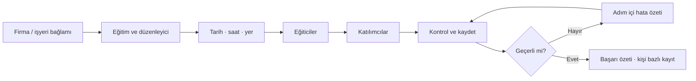
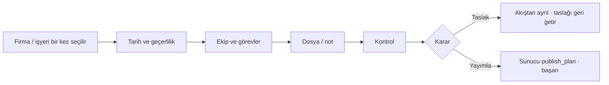
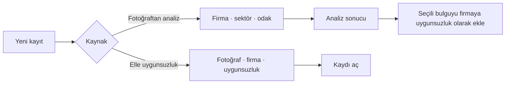

# İSGADA ek ekranlar — uygulama durumu ve kabul planı

Bu belge, `ISGADA_Ek_Ekranlar_UX_UI_Duzeltme_Raporu_2026.md` içindeki kontrol listesi dışındaki ekran önerilerinin kod karşılığını ve kabul kriterlerini tek yerde tutar. Menü, ana sayfa ve alt navigasyon önerileri bu kapsamın dışındadır.

## Kapsam

| Alan | Uygulama karşılığı |
|---|---|
| Eğitimler | `NovaTrainingScreens`, `NovaEducationEditor`, `NovaEducationModels` |
| Uygunsuzluklar | `NovaNonconformityListScreen`, `NovaManualNonconformityScreen` |
| Analizler | `NovaAnalysisListScreen`, `NovaAnalysisReportsScreen`, `NovaExpertShell` |
| Acil durum planı | `NovaEmergencyPlanSheet`, `NovaEmergencyPlanScreens`, `IsgWorkspaceEmergencyPlanCreateFlow` |
| Ortak akış bileşenleri | `NovaTaskFlowComponents` |
| Ekipman / periyodik kontrol | `NovaEquipmentCheckSheets`, `NovaEquipmentCheckScreens` |

## Akış şemaları

### Eğitim oluşturma

### Acil durum planı

### Uygunsuzluk / analiz kaydı

## Ortak bileşen sözleşmesi

- `NovaTaskHeader`: tam ekran görev akışlarında adım numarası, ilerleme ve kapatma.
- `NovaTaskStickyActions`: geri/ileri veya son aksiyonu güvenli alanın üzerinde sabitler.
- `NovaTaskErrorSummary`: hatayı alanın içine dağılmadan tek özet halinde gösterir.
- `NovaTaskSuccessView`: başarılı yazma sonrası bir sonraki öneriyi ve dönüş aksiyonunu gösterir.
- `NovaMetricStrip`: KPI kartlarını yatay, düşük yoğunluklu şeritlere indirir.
- `NovaWhyDisclosure`: uzun mevzuat/açıklama metnini `Neden?` altında isteğe bağlı açar.
- `NovaEmptyState`: ilk kullanım ve filtrelenmiş sonuç yok durumlarını ayırır.

## P0–P3 önceliği

### P0 — güvenli kayıt ve bağlam

- [x] Firma/işyeri/ekipman seçimi bir kez yapılır; sonraki adımlar bağlamı taşır.
- [x] Tam ekran görev akışları geri/çıkış onayı ve sticky aksiyon kullanır.
- [x] Yazma hatası, bekleyen işlem ve başarı sonucu görünürdür.
- [x] Acil durum ekibi seçimi ve görev ataması zorunlu kontrol içerir.

### P1 — eğitim ve acil durum akışları

- [x] Eğitim listesinde kompakt KPI, arama ve kısa filtreler.
- [x] Eğitimde çok günlük tarih/saat modeli ve toplam süre hesabı.
- [x] Eğitici ekleme, `Kendimi ekle`, kişi bazlı katılımcı seçimi.
- [x] Eğitimde beşinci kontrol/kaydet adımı.
- [x] Acil durum planında `Taslak olarak kaydet` / `Yayımla` ayrımı.

### P2 — liste yoğunluğu ve progressive disclosure

- [x] Analiz KPI’ları kompakt metric strip’e indirildi.
- [x] Uygunsuzluk filtreleri arama + üç kısa filtre düğmesine indirildi.
- [x] Analiz ve uygunsuzluk girişleri eşit görsel hiyerarşide sunulur.
- [x] Uzun açıklamalar `Neden?` / DisclosureGroup içine taşınır.
- [x] Liste, yükleniyor, hata, boş ve filtrelenmiş boş durumları ayrıdır.

### P3 — yaygınlaştırma ve ölçüm

- [ ] Aynı bileşen sözleşmesi diğer modüllerde de kullanılır.
- [ ] Pilot kullanımda adım terk oranı, yeniden deneme ve filtre temizleme oranı ölçülür.
- [ ] Erişilebilirlik büyük yazı ve VoiceOver senaryoları release öncesi tekrar edilir.

## Kabul kontrol listesi

### Eğitimler

- [ ] Firma/işyeri seçimi bir kez yapıldığında beş adımın özetinde aynı bağlam görünür.
- [ ] İki veya daha fazla gün eklenebiliyor; her günün başlangıcı ve ders aralığı ayrıştırılabiliyor.
- [ ] Konu dakikaları + molalar toplam süreyi doğru üretiyor.
- [ ] `Eğitici ekle` ve `Kendimi ekle` aynı seviyede çalışıyor; yinelenen eğitici eklenmiyor.
- [ ] Eksik katılımcı/eğitici/tarih bilgisi kaydetmeyi engelliyor ve hata özeti gösteriyor.
- [ ] Kaydetme sonrası başarı ekranı ve tekrar deneme yolu mevcut.

### Uygunsuzluklar ve analizler

- [ ] Arama, firma, durum/tür filtreleri aynı yüzeyde ve tek dokunuşla temizlenebiliyor.
- [ ] KPI’lar büyük kartlar yerine yatay kompakt şerit olarak okunuyor.
- [ ] Fotoğraftan analiz ve elle uygunsuzluk aksiyonları aynı ağırlıkta.
- [ ] Analizden uygunsuzluğa geçerken firma bağlamı yeniden sorulmuyor.
- [ ] Sonuç yok, filtreli sonuç yok ve yükleme hatası ayrı mesaj veriyor.

### Acil durum planı

- [ ] Ekip üyesi seçimi, rol seçimi ve ekip sayısı kontrol özetinde görünür.
- [ ] `Taslak olarak kaydet` planı yayımlamıyor; sonraki ekleme akışı taslağı geri getiriyor.
- [ ] `Yayımla` tek gerçek publish mutasyonunu çağırıyor ve başarı ekranına gidiyor.
- [ ] Görev akışı tam ekran; uzun form popup içinde sıkışmıyor.

