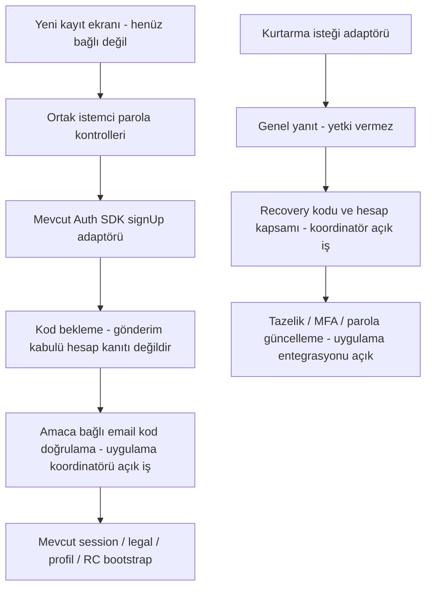

# P02 — Parolalı üyelik ve kurtarma servis dilimi

Tarih: 13 Eylül 2026 (Europe/Istanbul). Durum: **servis adaptörleri ve izole testler hazır; P02 ve kullanıcı arayüzü aktivasyonu tamamlanmadı.**

## Uygulanan kapsam

- iOS mevcut parola girişi/`finishSignIn` korundu. `AuthService` içine kayıt ve kurtarma isteği eklendi; mevcut legal gate, dil metadata'sı ve callback kullanılıyor.
- Android `AuthRepository` içine parola girişi, kayıt ve kurtarma isteği eklendi. Giriş aynı SDK session deposunu ve mevcut provider backfill yolunu kullanıyor. Çağıran UI mevcut legal/release gate'i uygulamalı; yeni metotları çağıran UI bu dilimde eklenmedi.
- Swift/Kotlin aynı 20 sentetik parola fixture'ını kullanıyor. Yeni parola için en az 8 Unicode scalar/code point, ASCII A–Z/a–z/0–9, en fazla 72 UTF-8 byte kontrolü var. Bu sayım bir grapheme-cluster garantisi değildir. Şifre boşlukları/Unicode içeriği değiştirilmez; eski parola girişine yeni güç kuralı uygulanmaz.
- Kayıt gönderimi başarısı yalnız isteğin kabulüdür; yeni hesap açıldığının veya mevcut OAuth hesabına şifre eklendiğinin kanıtı değildir. Kurtarma isteği doğrulanmış recovery/fresh-auth yetkisi üretmez.
- Android adaptörleri ham SDK hata gövdesini/cause'u dışarı vermez; iptal ayrı korunur. SDK'nın kendi Auth hata tanılarının response/session içerebilmesine karşı yalnız Auth modülünde `LogLevel.NONE` uygulandı. Diğer servis logger'ları değiştirilmedi.
- Swift parola kuralları `App/Services/Auth` altında: yalnız transport için olan altı dosyalı `App/Services/ISG` fonksiyon eşleme kapısı genişletilmedi veya gevşetilmedi.
- OTP/Apple/Google kodu, gerçek hesaplar, profiles, RevenueCat kimliği, bundle/package/callback, Supabase üretim ayarları ve mağaza kayıtları değiştirilmedi. P18 gri zemin/beyaz yuvarlak kart çalışması korunuyor.

## Akış ve gerçek entegrasyon sınırı

Adaptörler mevcut singleton Auth deposunu kullanır; ikinci kullanıcı tabanı/token deposu yoktur. Bekleyen kod amacı, hesap değişimi, uygulamanın kapanması ve PKCE callback yarışlarını yöneten mobil koordinatör henüz bu adaptörlere bağlı değildir. NOVA host modelinin mevcut account/session kapsamı bu entegrasyonda kullanılacak; aynı işi yapan ikinci shell state modeli oluşturulmadı.

## Gerçek SDK ve sunucuda bulunan iki kritik ayrım

### 1. Sunucu minimumu karakter değil byte

Digest ile sabitlenmiş GoTrue **v2.195.0** üzerinde, yalnız sentetik ortamda minimum 8 ve gerekli ASCII sınıfları ayarlandı. 72 UTF-8 byte kabul, 73/74 byte ret; trim ve NFC normalizasyonunun farklı parola olduğu gerçek login ile ölçüldü.

`Ab1🔐🔐` yalnız 5 Unicode scalar, fakat 11 UTF-8 byte olduğu için sunucu tarafından kabul edildi. İstemcide reddediliyor. Dolayısıyla **ürünün 8 karakter kuralı sunucuda henüz tam uygulanmış değildir**. Bu boşluk salt istemci kontrolüyle kapanmış sayılmaz. Minimumu sessizce 15'e yükseltme, Unicode'u yasaklama veya parolayı kesme yapılmadı. Yönetilen Auth'ta aynı kuralı tüm kayıt/değişiklik yollarında uygulama seçeneği ve Unicode sayım sözleşmesi staging'de çözülmeden yeni UI açılmamalı.

### 2. Android autoconfirm yanıtı null olmak zorunda değil

Supabase-Kt **3.7.0** gerçek transport testinde, autoconfirm response'u SDK session'ını içeri alırken non-null `UserInfo` da döndürdü. İlk `response == null` varsayımı yeni negatif testte başarısız oldu; kontrol `response == null || currentSession != null` olarak düzeltildi ve tekrar geçti.

Bu kontrol yalnız hata işaretidir: SDK listener'ı zaten session olayını almış olabilir. Oturumu silerek veya kullanıcıyı logout ederek bu durum maskelenmedi. Swift SDK da session döndürebilir; iki platformda sunucu confirmation ayarı ve amaç koordinatörü yayın kapısıdır. Bir hata dönüşünün session import'unu engellediği iddia edilmez.

## Çalıştırılan testler

| Katman | Sonuç | Sınır |
|---|---|---|
| Sıfırdan gerçek GoTrue + PostgreSQL | 132/132 kontrol, cleanup PASS | Network-none; müşteri yedeği okunmadı |
| Yeni parola server sınırları | 13 varyasyon + her adımda aynı UUID login | Unicode minimum açığı da ölçülen sonuç |
| Signup/recovery kodları | Onaysız login ret, yanlış kod/amaç/e-posta ret, tek kullanım, aynı UUID, eski parola ret | Gerçek GoTrue, yalnız test SMTP |
| Recovery enumeration | Mevcut/olmayan adres HTTP status+body eşit | Timing eşitliği test edilmedi |
| Android core:data | 487/487, sıfır fail/error/skip | 456 önceki + 20 ortak parola + 11 gerçek SDK/loopback testi; cihaz E2E değil |
| Android Debug APK | PASS | Kurulum/yayın veya canlı login yok |
| Swift ortak parola corpus | 20/20 | Saf Swift kuralları; iOS SDK transport E2E değil |
| iOS ana proje | Simulator Debug/no-signing build PASS | AuthService gerçek SDK ile derlendi; login çalıştırılmadı |
| Foundation | 111/111 | Mevcut kimlik/izolasyon/transport regresyonu |
| Parola test izolasyonu | 7/7 Node | Kaynak/guard testleri, provider teslimi değil |
| E-posta katalog/hook regresyonu | 13/13 Deno | Gerçek renderer + hook source guard; hook HTTP/Resend entegrasyonu değil |
| Android kaynak taraması | PASS | Secret/PII-log/AD_ID statik taraması |
| CI YAML / kimlik / function-map | PASS | Uzak CI henüz çalıştırılmadı |

Android varyasyonları: zayıf eski parola, Unicode ve boşluk korunumu, bozuk e-posta/ağ isteği yok, 400/401/403/422/429/500 güvenli hata eşlemesi, session UUID, mevcut hesap gibi obfuscated signup response, PKCE challenge/callback, signed-in signup reddi, beklenmeyen autoconfirm, coroutine iptali. Tüm olası ağ/zamanlama/MFA durumları veya V5'in 263 kabul satırı tamamlandı denmiyor.

İlk Android URL testi, SDK'nın mevcut `redirect_to` parametresini eklemesi nedeniyle düştü; URL path/grant/callback ayrı doğrulanarak düzeltildi. Yanlış klasör konumu nedeniyle function-map bir kez düştü; Auth dosyası Auth klasörüne taşındı. Bunlar nihai başarılı sonuçlardan önceki turlardır. iOS'ta mevcut paywall dosyasındaki 11 actor uyarısı devam ediyor; bu dosya değiştirilmedi.

## Test ortamının e-posta güvenliği

`run_auth_restore.mjs --synthetic-session`, digest kontrollü üç disposable container kullanır. Test SMTP 127.0.0.1:2525, şablon/posta okuma 127.0.0.1:10000; namespace dış ağı yok, host port/mount yok. Postalar yalnız container belleğinde (32 adet/128 KiB sınırı), OTP/password/token çıktı veya kanıt dosyasına yazılmıyor. Container'lar sona erince bellek kaybolur. Gerçek veriden restore yolu bu posta programını, açık signup ayarlarını veya ek parola probe'larını kullanmaz.

Kanıt: [132 kontrol ve kaynak hash'leri](evidence/P02_SYNTHETIC_PASSWORD_AUTH_2026-09-13.json), [native test/derleme ve kaynak hash'leri](evidence/P02_NATIVE_PASSWORD_ADAPTERS_2026-09-13.json). Orijinal yerel çıktı `output/isg/runs/synthetic-auth-AglRSi/REPORT.json`. Ana iOS build log zamanı `2026-09-12T23-25-58-196Z`; 37,2 saniye, başarı.

## CI ve devam sırası

`isg-foundation.yml` artık Auth dosyaları, e-posta hook/catalog değişikliklerinde tetiklenir; offline parola guard'ları, Swift corpus ve e-posta regresyonu koşar. Mevcut sentetik Auth CI job'u 132 kontrolü çalıştırır. Android fixture klasörü zaten Gradle task input'u; yalnız JSON değiştiğinde eski yeşil sonuç yeniden kullanılmaz. CI'a gerçek yedek, SMTP anahtarı veya customer token verilmedi.

1. Sunucu Unicode minimumu ve güvenlik ayarlarının staging çözümü; doğrudan Auth signup/update negatifleri.
2. Signup/email/recovery amaç koordinatörü; cold/warm start, PKCE, expired/resend, hesap değişimi, eski istek completion'ının iptali. iOS gerçek SDK transport/Android gerçek cihaz karşılığı.
3. Gerçek hook + controlled provider teslimi: TR/EN metadata, signup/magiclink/recovery ayrımı, idempotency/retry, Apple relay. Bu tur yalnız mevcut şablon renderer'ını sınadı; gönderici/marka değiştirmedi.
4. Etkin TOTP/MFA ve secure-password-change/fresh-auth kontrolleri; mevcut OTP/OAuth/RC bootstrap regresyonu.
5. Bu kapılar geçtikten sonra yeni gri tuval/beyaz kart standardındaki kayıt/kurtarma UI'ını bağla; sonra presentation coordinator ve alias gateway. Apple/Google ile girenlere parola önerisi yapılmaz (karar 2026-09-25).

Bu kayıt P02'nin tamamlandığını veya P18 sentetik hedeflerinin gerçek domain ekranına dönüştüğünü söylemez. Canlı DB/şablon/SMTP değişikliği, deploy, push veya store yayını yapılmadı. Rollback gerçek hesap/parola silmez; mevcut checkpoint korunur.

## Doğrulanan birincil kaynaklar

- [Supabase parola güvenliği](https://supabase.com/docs/guides/auth/password-security)
- [GoTrue v2.195.0 parola uygulaması](https://github.com/supabase/auth/blob/v2.195.0/internal/api/password.go)
- [Supabase-Kt 3.7.0 signup/session uygulaması](https://github.com/supabase-community/supabase-kt/blob/3.7.0/Auth/src/commonMain/kotlin/io/github/jan/supabase/auth/providers/builtin/DefaultAuthProvider.kt)
- [Kotlin parola girişi](https://supabase.com/docs/reference/kotlin/auth-signinwithpassword), [kayıt](https://supabase.com/docs/reference/kotlin/auth-signup), [kurtarma](https://supabase.com/docs/reference/kotlin/auth-resetpasswordforemail)

SDK sürümleri yükseltilmedi. Swift 2.46.0 kaynakları mevcut SwiftPM checkout'undan, Kotlin 3.7.0 gerçek bağımlılığı derleme ve loopback testinden doğrulandı; genel dokümandan alınan varsayım gerçek SDK sonucuna tercih edilmedi.
