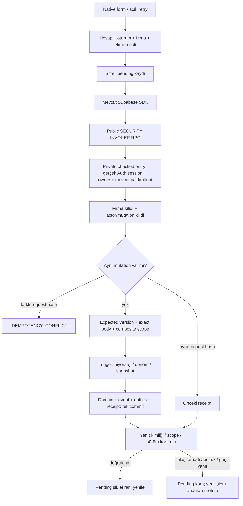

# P05 — tarihli firma rehberi ve native servis paketi

Tarih: 13 Eylül 2026. Önceki checkpoint: `01089ffb`. Bu paket **P05'in tamamı veya canlı açılış değildir**. Kullanıcının hızlandırma talebiyle servisler, iki platformun ekranları ve migration birlikte geliştirildi; her dosya sonrası test yerine paket sonunda toplu doğrulama ve hata düzeltme yapıldı.

## Teslim edilen kapsam

- İşyeri, departman hiyerarşisi, görev/unvan, dış firma, işyeri ilişkisi, personel işvereni, tarihli görevlendirme ve işyeri bağlamı için gerçek PostgreSQL migration/API.
- iOS/Android SDK adaptörleri; hesap + oturum + firma + ekran nesli kontrolü; sayfalı okuma ve sürüm kontrollü yazma.
- Sonucu belirsiz personel/rehber işlemlerini uygulama yeniden açıldığında aynı işlem anahtarıyla kurtarma. Otomatik arka plan tekrar yok; kullanıcı açıkça “Bekleyen işlemi tamamla” seçer.
- İki platformda katalog liste/form/düzenleme/arşiv, tarihli geçmiş liste/yeni dönem, dış firma işyeri ilişkisi ve işveren seçim bileşenleri.
- Ortak `NovaPageSurface` gri zemin, beyaz yuvarlak kart, ayrı renkli ikon kutusu olmayan çizim ikonları. Yeni tarihli akışlar basit personel formuna tarih zorunluluğu getirmez.

**Aktivasyon sınırı:** Bileşenler ana uygulamada derleniyor fakat eski yönetim ekranları/yeni NOVA production kökü henüz bu servislerle birleştirilmedi. Görevlendirme ve işveren hedeflerinin personel detayından gerçek yönlendirmesi açık. Ekran dosyasının bulunması, özelliğin kullanıcının mevcut uygulamasında açıldığı anlamına gelmez. Yeni migration canlı Supabase'e uygulanmadı; mevcut rollout varsayılanı kapalı kaldı.

## Veri modeli

Yeni migration: `supabase/migrations/20260913081536_isg_workplace_context_assignments.sql`. Önceki `20260913074153` migration üzerine eklenir. Mevcut `public.companies`, eski abonelik tabloları ve kimlikler yeniden adlandırılmaz.

| Tablo | Yeni/önemli alanlar | İlişki ve koruma |
|---|---|---|
| workplaces | code:text, context_version:bigint | Firma içinde kod tekil; eski binary catch-up kodu trigger ile tamamlanır; legacy timezone/jurisdiction bilinmiyorsa NULL kalır |
| departments | parent_id, version; company/workplace/id tekilliği | Üst departman aynı firma/işyerinde; kendine bağlanma ve döngü yasak; işyeri kapsamı değişmez |
| job_roles | code, title, description, is_archived, version | Firma sahibi composite FK; kod firma içinde tekil |
| contractor_organizations | code, name, relationship, is_archived, version | subcontractor/contractor/supplier/other; yeni Auth hesabı değil, firmaya ait rehber kaydı |
| contractor_engagements | organization_id, workplace_id, starts_on, ends_before, description, version | Aynı organizasyon/işyeri için çakışan dönem yasak; başlangıç ve taraflar editte değişmez |
| employees | employer_org_id, employer_version, assignment_version | İşveren bağımsız sürümle değişir; basit ad/departman CRUD record_version kullanmaya devam eder |
| workplace_context_versions | workplace_id, starts_on, ends_before, timezone, jurisdiction, hazard_class, industry_code, evidence_note | Dönemler çakışmaz; eski kayıt yalnız yeni dönemle bölünebilir; mevcut tarihe göre sessiz varsayım yok |
| employee_assignments | employee/workplace/department/job, starts_on, ends_before, primary, reason, department/job/employer snapshot | Çalışan başına ana görevlendirme çakışmaz; scope composite FK; snapshot isimleri katalog değişikliğinde korunur |
| directory_events | operation_id, entity_kind/id, version, owner/company, created_at | Her başarılı domain değişikliğinin olayı; entity/kind/version tekil |
| directory_outbox | event_id, schema_version | Aynı transaction içinde olayın outbox bağlantısı; henüz consumer çalıştırılmıyor |

Tarih aralıkları **[başlangıç, bitiş)** şeklindedir: bitiş tarihi önceki döneme dahil değildir. Geçiş gününün kendisi yeni dönemdedir. Tarih metinleri `YYYY-MM-DD`; `today`, infinity, geçersiz takvim günü, 0000 ve sınır dışı tarihler reddedilir. İşe giriş/çıkış bilinmiyorsa basit personel oluşturma bunları doldurmaz.

Eski `employees.intake_department_id` tarihli görevlendirme değildir. Bir çalışanın tarihli görevlendirmesi varsa bu alanı basit formdan değiştirerek geçmişin üstüne yazmak `ASSIGNMENT_CHANGE_REQUIRED` ile reddedilir. Kullanıcıyı tarihli görevlendirmeye götüren production detay bağlantısı henüz tamamlanmalıdır.

## API ve tetik sırası

| Public RPC | İşlev |
|---|---|
| isg_personnel_read_v1 / mutate_v1 | Önceki ad-soyad + isteğe bağlı departman CRUD; yeni native adaptörler bu gerçek endpointleri kullanır |
| isg_directory_read_v1(company, kind, parent, after, archived) | Sekiz rehber türü; UUID keyset, 50 satır; contexts/assignments için parent_version |
| isg_directory_mutate_v1(company, kind, operation, mutation, id, expected, body) | Katalog CRUD/arşiv; işveren atama; tarihli yeni dönem ve ilişki işlemleri |
| isg_context_at_v1(company, workplace, on) | Belirtilen tarihin bağlamını döndürür; dönem yoksa context=NULL ve status=needs_review |

İşyeri bağlamı çözümlemesi bugünün tehlike sınıfını eski tarihli kayda kopyalamaz. Yeni/future dönem, önceki dönemin başlangıcından sonra ve varsa bitişinden önce olmalıdır; önceki kayıt bölünür, yeni kaydın sonu önceki son olarak korunur. Aynı yapı görevlendirmede uygulanır. Snapshot'lar istemciden kabul edilmez, trigger gerçek departman/unvan/işveren satırlarından alır.

## Native pending sistemi

iOS: `NovaPersonnelService` gerçek işlem/yanıt doğrulama çekirdeğidir; `NovaPersonnelLiveAdapter` mevcut Supabase SDK'ya bağlar. `NovaDirectoryService` rehber endpointlerini çağırır. `KeychainPersonnelPendingStorage` generic-password, `WhenUnlockedThisDeviceOnly`, synchronizable=false, 16 KiB sınırı kullanır. Secret/token journal'a yazılmaz. Testler gerçek kullanıcı Keychain'ini okumadı.

Android: `PersonnelRepository` mevcut SupabaseClient üzerinden iki API grubunu çağırır. Feature/profile adaptörleri typed NOVA modellerine çevirir. `PersonnelPendingStorage`, Android Keystore AES-GCM, rastgele IV, account-bound AAD ve `noBackupFilesDir` altında AtomicFile kullanır. İki journal namespace'i ayrıdır. Bozuk şifreli dosya başarısız olur; başarılı mutation gibi sayılmaz. Gerçek Keystore reboot/key-loss testi henüz yapılmadı.

İki platformda ağ/yanıt belirsizliğinde journal korunur. Bilinen kesin transaction reddi düzenlemeye izin verir; bilinmeyen hata, ID reuse çatışması veya kapalı rollout yeni anahtar üretimine sebep olmaz. Aynı kullanıcı/firma yeni session ile açılırsa eski intent yeni scope'a bağlanır, operation/mutation UUID'leri korunur. Başka hesap eski pending kaydını yükleyemez. SDK local JWT okuması yalnız kimlik korelasyonudur; yetkiyi doğrulayan veritabanıdır.

## Güvenlik / geri dönüş

- 15 private tabloda RLS açık, istemcilere doğrudan tablo yetkisi yok. PostgREST yalnız public schema açar. Authenticated'a beş checked private entry; helper/trigger ve service_role doğrudan çağrı yetkisi verilmez.
- Firma sahibi, aktif gerçek session ve önceki abonelik guard'ı receipt replay'den önce doğrulanır. Abonelik kapasite/fiyat kuralları değiştirilmedi.
- İstemci supplied owner_id, snapshot, sağlık alanı veya bilinmeyen JSON anahtarları kabul edilmez. Kodlar text; baştaki sıfırlar kaybolmaz.
- Migration additive, kilit timeout'u 5 saniye. Yeni özellik açılışı yapılmadı. Geri dönüş için yeni writes kapatılır; yeni tarihli veriyi DROP ederek geri dönülmez.
- Eski rollback etiketi `riskdetected-change-point-20260912` değişmedi. Yeni dosyalar o tarihli yedekte bulunmaz; bu paket ayrı Git checkpoint'idir.
- Supabase becerisi gereği migration sonrası Advisor **yalnız izole test DB'sinde**, private UNIX socket ve read-only rol ile çalıştı. Eksik index veya güvenlik uyarısı yok. Yeni 15 FK-covering index'in küçük/sıfır geçmişli fixture'da hiç taranmamış olması INFO olarak ayrı incelendi; yalnız tam index cache_key listesi kabul edilir. Bu, production performans onayı değildir. 15 no-policy INFO bilinçli default-deny tablolarıdır.

## Paket sonu doğrulama

Son kanıt dosyası: `evidence/P05_DIRECTORY_AND_NATIVE_SERVICES_2026-09-13.json`.

- Ana iOS Debug/no-signing simulator build PASS; son build log `build_sim_2026-09-13T08-39-28-177Z_pid70458_60bc65ee.log`. Canlı app launch/login yapılmadı.
- Android ana Debug APK ve core:designsystem **361/361**, core:data **611/611**, feature:profile **11/11** test paketleri PASS. Yeni rehber UI testleri pending/new-write gate, retry intent eşitliği, nested geri dönüş ve bozuk journal davranışını kapsar; Robolectric testidir, gerçek emülatör E2E değildir.
- Swift rehber Codable/scalar 38; gerçek personel servis çekirdeği + injected transport/memory journal 12 kontrol PASS. Yeniden oluşturulan service, yeni oturum, aynı mutation, farklı payload engeli, bozuk/büyük receipt, kesin ret, geç response ve persistence-before-network senaryoları.
- İzole gerçek GoTrue → PostgreSQL → PostgREST + Advisor birleşik turu: eski221 + yeni54 = 275 kontrol kaydı (274 farklı test kimliği; önceki suite içinde bir tekrarlanan kimlik var). Son run `7ceea6d4-568d-4377-9581-954208ccdb68`, rapor `output/isg/runs/synthetic-auth-ghwbBH/REPORT.json`; kaynak hash'leri final dosyalarla karşılaştırıldı, geçici container cleanup PASS. D05 kataloğu, cycle/cross-scope, tarih çakışması, snapshot, context resolver, audit/outbox/receipt rollback ve logout kapsamı. Gerçek mağaza/SDK üzerinden UI→DB E2E değildir.
- Node guard/regresyon dosyalarının tamamı205, ayrı foundation162 PASS (örtüşen suite'lerdir, toplanmaz). CI migration yolu, yeni guard, iki Swift harness ve Android testleriyle genişletildi; uzak CI koşusu iddia edilmez.
- Testin yakaladığı Swift catch-variable gölgelemesi ve PostgreSQL yerel değişken label sorunu düzeltildi. Advisor'daki INFO ayrımı kanıtlı olarak kaydedildi, blanket-ignore yapılmadı.

## P05 kapanmadan kalanlar — sıradaki toplu paket

1. Mevcut iOS/Android management/ana NOVA root'u gerçek Auth/session host ve capability availability üzerinden servis fabrikalarına bağla; flag kapalıyken eski ekran fallback'i koru. Personel detayına görevlendirme/işveren yollarını ekle. Şu an servislerin ana uygulamada inşa edilmesi/çalışması sağlanmış değildir.
2. Yeni migration'ı tüm restore edilmiş legacy şema/trigger/function setinin **ayrı disposable kopyasında** yükseltme provasıyla doğrula. Bu turdaki fixture gerçek Auth ve eski company/subscription DDL kullanır; tam restore değildir.
3. D05 tarihi/temel intake ayrımının kullanıcı deneyimini bitir: tarihli departman değişikliği yönlendirmesi, terminal conflict sonrası güncel sürüm, dış işveren kişi sayımı, engagement geçmiş/review politikası, tarih seçiciler ve TR/EN/a11y parity. Genel formlar son görsel kabul değildir.
4. iOS/Android gerçek SDK loopback + cihaz journal restart/logout/key-loss/iki ekran yarış testlerini ve iki native UI→yerel DB kabulünü çalıştır. Bu tur keychain/keystore primitive'lerinin cihazda çalıştığını kanıtlamadı.
5. Event consumer, tam D05 varyasyon/concurrency/delete matrisi ve P01/P03 bağımlı release kapılarını kapat. Çıkış kriterleri tamamlanana kadar P05 ve production rollout açık iş olarak kalır.

Bu açıklıklar sessiz kapsam azaltma değil, uygulanmış kod ile henüz doğrulanmamış/bağlanmamış işlerin ayrımıdır.
