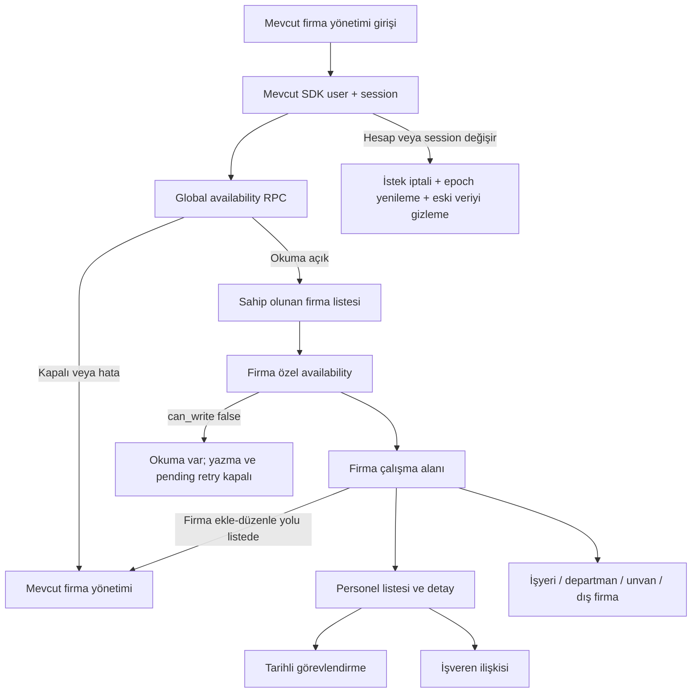

# P05 — gerçek firma yönetimi bağlantısı

Tarih: 13 Eylül 2026. Önceki checkpoint: `e4e8a4ee`. Bu paket P05'in yönetim girişini bağlar; bütün uygulamanın NOVA köküne geçişi veya canlı açılış değildir. Geliştirme topluca, test ve düzeltmeler paket sonunda yapıldı.

Makinece okunabilir kanıt: [P05_WORKSPACE_CONNECTION_2026-09-13.json](evidence/P05_WORKSPACE_CONNECTION_2026-09-13.json). Önceki paketin JSON'undaki yanlış `undefined/REPORT.json` yolu, mevcut gerçek rapor dosyası doğrulanarak düzeltildi; önceki test sonuçları değiştirilmedi.

## Teslim

- iOS Profil → Firmalarım ve Android mevcut firma yönetimi girişi, gerçek SDK oturumunu izleyen bir yönetim sahibine bağlandı. Analiz/rapor firma seçim ekranları değiştirilmedi.
- Sunucu availability yanıtı uygun değilse (rollout kapalı, endpoint yok, oturum/yetki hatası) eski firma yönetimi gösterilir. Erişim kontrol edilirken önceki NOVA verileri gizlenir.
- Global erişim doğrulamasından sonra mevcut CompanyService/CompanyRepository ile sahip olunan firmalar yüklenir. Firma seçilince o firma için ikinci, yetkili availability sorgusu yapılır.
- Firma → personeller / işyerleri / departmanlar / görev-unvanlar / dış firmalar bağlantısı eklendi. Eski firma oluşturma/düzenleme/arşiv yönetimine ayrıca dönülebilir; firma limiti ve paywall sistemi korunur.
- Personel detayından **Görevlendirme geçmişi** ve **İşveren ilişkisi** açılır. Geri düğmesi aynı personelin detayına döner. Basit personel formu hâlâ sadece ad soyad ister; departman isteğe bağlıdır, tarihler eklenmedi.
- Arşivlenmiş firma, süresi dolmuş ücretli erişim veya yazma rollout'u kapalıyken okuma korunur, oluşturma/düzenleme ve pending tekrar gönderimi kapanır. Pending kayıt silinmez. Client guard'a ek olarak her RPC sunucuda yetkiyi yeniden doğrular.
- Gri sayfa zemini, beyaz yuvarlak kartlar ve arka plan kutusu olmayan çizim ikonları kullanılır. Genel ana ekran/popup tasarımı bu paketle yeniden değiştirilmedi.

## Akış

`NovaWorkspaceController` ve `NovaWorkspaceViewModel`, ekran sunumunun oturum sahibidir. Alt form kendi Auth aboneliğini açmaz. Aynı user/session token yenilemesi gereksiz hesap reseti değildir; foreground erişim yenilemesi ve firma seçimi ise yeni epoch üretir. Başarısız/iptal edilmiş/eski availability isteği yeni ekranı değiştiremez. Scope: owner + session + company + epoch. Kullanıcı metadata'sı yetki kaynağı değildir.

## Sunucu değişikliği

`20260913084736_isg_workspace_availability.sql`, önceki iki P05 migration sonrasında uygulanır. Yeni tablo yok. Public `isg_workspace_availability_v1(p_company uuid)` INVOKER; private `workspace_availability` checked DEFINER, boş search_path, yalnız authenticated EXECUTE. Private checked giriş sayısı 6 oldu. Anon/service_role ve direkt tablo izinleri açılmadı.

Yanıt: schema_version, owner_id, company_id, company_name, is_archived, can_read, can_write. Global yanıtta firma alanları NULL ve can_write=false. Okuma kapalıysa seçilen firma bilgisi döndürülmez. Seçilen firmanın sahipliği her zaman sunucuda kontrol edilir.

Yazma erişimi mevcut `require_company(true)` ile belirlenir; abonelik kuralı kopyalanmaz. Beklenen ücretli erişim/rollout/arşiv engelinde `require_company(false)` okunabilirliği doğrular. İki eşzamanlı sorgunun SHARE→UPDATE yükseltme kilitlenmesini önlemek için yazma kontrolü önce yapılır. Bu endpoint yalnız sunum ipucudur; mutation authority değildir.

## Toplu doğrulama

| Kontrol | Sonuç / sınır |
|---|---|
| İzole gerçek GoTrue + PostgreSQL + PostgREST | 291 PASS kontrol kaydı; 290 tekil ID (önceden kalan bir tekrarlı ID). Yeni workspace 16/16. Run `a18aa274-e60d-4c7f-b665-354da82ebd04`; kaynak hash eşleşmesi doğrulandı |
| Workspace SQL/HTTP | Global ve firma scope, paid, rollout off/read-only, arşiv, abonelik süresi bitimi, yabancı firma, anon, ek yetki parametresi, logout, wrapper/grant kontrolleri |
| Supabase Advisor | İzole runner'ın bütün şema Advisor kapısı PASS; yeni incelenmemiş bulgu yok. Canlı proje taranmadı |
| Android | design 364, data 615, profile 11: **990 test PASS**, 0 fail/error/skip; ana Debug APK build PASS |
| Android yeni UI | Salt okunur pending engeli; alt işyeri geçmişine salt okunur aktarımı; aynı personelin iki geçmiş hedefi ve doğru scope |
| Swift capability | 14 kontrol PASS; yanlış owner/firma/sürüm/tip, eksik ad, global yanıtta firma sızıntısı ve tutarsız yazma yetkisi reddedilir |
| iOS Simulator | Yeni iki hosted UI testi 2/2 PASS: detay→iki geçmiş→geri ve salt okunur yazma engelleri. Sentetik repository kullanır; gerçek SDK→DB E2E değildir |
| iOS ana uygulama | Debug/no-signing build PASS. Son ortak ekran erişilebilirlik etiket değişikliği ayrıca hosted hedefte derlendi |
| Node / foundation / identity | 205/205 ve 162/162 PASS; bundle/package/auth callback/entitlement kaynak kontrolü PASS |

İlk Android derlemesi `NovaGlyph`'ın modül dışından erişilememesini yakaladı; ortak tasarım bileşeni public yapıldı ve bütün Android paketi yeniden geçti. iOS harness'e yeni gerçek Directory kaynakları eklenince kesin kaynak listesi testi güncellendi; yasak SDK/ağ ithalatı kontrolü genişletildi, kaldırılmadı. Uzak CI çalıştırıldığı iddia edilmiyor.

## Açık kapanış kapıları

1. Tam legacy schema restore kopyasına migration upgrade/backfill; bu paketin DB kanıtı sentetik baseline üzerindedir.
2. Gerçek cihaz/simülatör Keychain ve Android Keystore journal primitive + uygulama kapanma/açılma testleri.
3. Gerçek native yönetim sahibi ve SDK ile izole sunucuya UI→DB E2E; hesap değişimi, foreground yetki kaybı ve bağlantı kopması dahil. Mevcut host reducer testleri ve ayrı SQL/UI testleri bunun yerine geçmez.
4. D05'in bütün tarihli/hiyerarşik varyasyonlarının ekran kabulü, event/outbox consumer ve fazın kalan domain gereksinimleri.
5. Tüm uygulama ana kökü ve diğer plan fazları. **P05 tamamlandı denmedi.**

Canlı Supabase migration uygulanmadı; rollout açılmadı; mağazaya sürüm gönderilmedi. Bundle/package, fiyatlar ve rollback etiketi değişmedi. Kullanıcı verileri ve Keychain okunmadı. Önceki yedeklere dokunulmadı.
