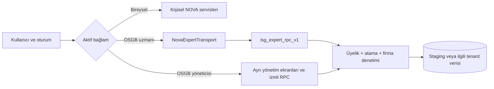

# RiskDetected / İSGADA OSGB — proje bağlamı ve devir notu

**Durum tarihi:** 23 Eylül 2026  
**Çalışma dalı:** `codex/isg-transition-foundation`  
**Amaç:** Yeni bir oturumda ürünün, teknik sınırların ve en son pilot durumunun tek yerden anlaşılması. Bu belge kod, tarihli durum raporları ve bu oturumdaki son cihaz/staging işlemlerinin birleşimidir. Tarihli raporlardaki eski build ve test sonuçları bugünkü otomatik kabul sonucu sayılmaz.

## 1. Kısa durum

| Alan | 23 Eylül itibarıyla durum |
| --- | --- |
| Canlı bireysel RiskDetected | Ayrı mevcut ürün ve production Supabase bağlantısı var. Son OSGB eğitim çalışmasında canlıya migration, deploy veya veri yazımı yapılmadı. |
| iOS OSGB pilot | Ayrı `com.riskdetected.app.osgbpilot` uygulaması; staging Supabase'e bağlı. Son çalışmada `2.0.3 (168)` fiziksel iPhone'a derlenip kuruldu ve açıldı. Kurulum/açılış, tüm ekranlarda elle uçtan uca kabul anlamına gelmez. |
| Android OSGB pilot | `osgbPilot` build türü staging için mevcut; Compose NOVA paritesi geliştiriliyor. Son Android analiz değişiklikleri çalışma ağacında, fiziksel Android cihaz kabulü yok. |
| Sunucu | Production `ppcrzemgiztzcgddbins`; izole OSGB pilot staging `qlymhrrlhklcudveknih`. Son üç eğitim SQL adayı yalnız staging'de uygulandı; production rollout hâlâ ayrı kapı. |
| Şu anki odak | OSGB eğitim ekleme deneyimi ve kaydetme yetkisi: yedi adımlı form, çoklu firma/aynı tehlike sınıfı, otomatik saat; cihazda gerçek kayıt oluşturup geri okuma henüz doğrulanmalı. Eş zamanlı iOS görünüm/analiz ve Android parite çalışmaları çalışma ağacında. |
| Git durumu | Çalışma ağacı temiz değil: iOS ve Android dosyaları, migration/SQL adayları değişmiş veya izlenmemiş. Bu belge bunları otomatik olarak tamamlandı/deploy edildi saymaz. |

### Ortam sınırı

```text
RiskDetected bireysel production  →  ppcrzemgiztzcgddbins
İSGADA iOS .osgbpilot (DEBUG + NOVA_PILOT_BUILD)  →  qlymhrrlhklcudveknih
Android osgbPilot (debug türevi)  →  staging yapılandırması
Android release / normal iOS production  →  production yapılandırması
```

`İSGADA` cihazdaki pilot ürün adıdır; depodaki iOS proje/target adı `RiskDetected` kalır. iOS proje dosyasındaki varsayılan `CURRENT_PROJECT_VERSION = 91` son cihaza verilen pilot build `168` ile aynı değildir: pilot paket sürümü build sırasında ayrıca verilmiştir. Yalnız proje dosyasına bakarak telefondaki sürüm çıkarılmamalıdır. Android'in eski operasyon belgesinde `riskdetected-android-staging` adı da geçer; OSGB pilotun seçtiği gerçek proje ID'sini ilgili build konfigürasyonundan doğrulayın.

## 2. Ürün ve mimari

RiskDetected, iş güvenliği fotoğraf analizinden bulgu, risk puanı, düzeltici faaliyet ve rapor üretir. İSGADA/NOVA katmanı firmalar, işyerleri, personel, eğitim, risk değerlendirmesi, periyodik kontrol, uygunsuzluk, kontrol listeleri, acil durum, KKD, atama, dosya ve süreç takibini bir araya getirir.

**OSGB mantığı:** Bir kullanıcı birden fazla OSGB çalışma alanına üye olabilir. Firma OSGB çalışma alanına aittir. Yönetici yetkili olduğu portföyü, uzman yalnız aktif atandığı firmaları görür. Her istekte oturum, çalışma alanı, üyelik/yetki sürümü ve firma ataması yeniden denetlenir. Firma/personel/analiz/dosya kapsamı yalnız ekranda filtrelenmez; RPC ve veri katmanında da doğrulanır. Kişisel kayıtlar OSGB'ye kendiliğinden taşınmaz. OSGB uzmanının operasyon ekranı bireysel uzmanın **aynı NOVA uzman panelidir**; farklılık `NovaExpertAccess` ve `NovaExpertTransport` içindeki erişim/taşıma katmanındadır. OSGB yönetici/sahip ekranları ayrıdır.



OSGB isteği başarısız olursa kişisel RPC'ye geri düşülmez. İstek başındaki oturum/çalışma alanı bileti ile dönüşteki bağlam karşılaştırılır; eski bağlamdan geç gelen yanıt ekrana işlenmez. Analiz fotoğrafı ve sonuç, eğitim katılımcısı, export ve imzalı dosya erişimi aynı kapsam ilkesine tabidir.

### Temel kullanıcı akışları

1. **Giriş ve bağlam:** Supabase Auth oturumu → profil/onboarding/legal → bireysel veya OSGB çalışma alanı seçimi → aktif rol/atama okuması → ilgili uzman ya da yönetici kökü.
2. **Firma ve personel:** Yönetici firma/işyeri oluşturur, rol ve uzman atar. Uzman atanmış firmayı açar; işyeri, departman, personel ve operasyon kayıtlarını yönetir. Firma kartının ilerleme verisi kayıtlı modüllerden gelir; logo varsa firma görseli yüklenir.
3. **Fotoğraf analizi:** Fotoğraf seç/çek → görünür kanıt analizi sunucu işine gönder → bulgu/sonuç → isteğe göre düzeltme, firmaya işleme ve PDF/XLSX. Analiz listesinde yalnız 10 satır gösterilmesi toplam istatistiği 10 kayıtla sınırlamamalıdır; bunun için SQL/istemci değişikliği çalışma ağacında, son dağıtım ve sayı doğrulaması ayrıca gerekir.
4. **Eğitim:** Firma ve işyerlerini seç → ortak tehlike sınıfını doğrula → eğitim türü ve müfredat → konu/dakika düzenle → gün ve başlama saatini seç, bitişi hesapla → eğitici → katılımcı → önizle/kaydet → yetkili listeden geri oku. Ayrıntı aşağıda.
5. **Diğer operasyonlar:** Risk değerlendirmesinde taslak/sürüm/kesinleştirme; periyodik kontrolde ekipman/katalog/kontrol geçmişi; uygunsuzluk ve kontrol listelerinde aksiyon takibi; dosyalarda yükleme, inceleme, yetkili indirme ve arşivleme.
6. **Ödeme/kota:** Bireysel RevenueCat satın alma durumu sunucu abonelik hakkıyla eşlenir. OSGB seat/wallet/ledger/billing zincirinin altyapısı staging'de sınanmış olsa da gerçek mağaza sandbox ve production kararı bekler.

## 3. Teknolojiler ve depo haritası

| Katman | Teknoloji | Ana konum |
| --- | --- | --- |
| iOS | Swift 5, SwiftUI, iOS 16+; Supabase Swift, RevenueCat/RevenueCatUI, Google Sign-In, Apple oturumu, APNs, Meta; PDF/XLSX | [`RiskDetected.xcodeproj`](../../RiskDetected.xcodeproj), [`App/`](../../App) |
| iOS NOVA/OSGB | Ortak uzman kabuğu, yönlendirme, modül ekranları; workspace bileti ve tipli RPC transportu | [`App/DesignSystem/ISG/`](../../App/DesignSystem/ISG), [`App/Services/Company/`](../../App/Services/Company), [`NovaPilotMainGate.swift`](../../App/Views/Components/NovaPilotMainGate.swift) |
| Android | Kotlin 2.4.10, AGP 9.3.1, Java 17; Compose/Material 3, Hilt, Coroutines/Flow, Navigation, Supabase Kotlin/Ktor, RevenueCat, CameraX, Coil, WorkManager, Firebase/FCM/Crashlytics | [`android/`](../../android), [`libs.versions.toml`](../../android/gradle/libs.versions.toml) |
| Backend | Supabase PostgreSQL + RLS/Auth/Storage/Edge Functions (TypeScript/Deno), RPC, cron/queue, audit ve idempotent kayıtlar | [`supabase/migrations/`](../../supabase/migrations), [`supabase/functions/`](../../supabase/functions), [`supabase/pilot-release/`](../../supabase/pilot-release) |
| Analiz | Sunucudaki `analyze`/workspace analiz işleri; Gemini/Groq yönlendirmesi ve sağlayıcı anahtarları sunucuda | [`PROJECT_ARCHITECTURE.md`](../../PROJECT_ARCHITECTURE.md) §7, [`supabase/functions/analyze/`](../../supabase/functions/analyze) |
| Operasyon/belgeler | Node/SQL betikleri, aday manifesti, staging kabul kayıtları ve yayın kapıları | [`scripts/isg/`](../../scripts/isg), [`docs/isg/`](.) |

Klasik bireysel RiskDetected mobil kodu ile NOVA pilot kodu aynı depoda bulunur. `PROJECT_HANDOFF.md` ve `PROJECT_ARCHITECTURE.md` geniş ürün geçmişi/mimarisini verir; bu belge 23 Eylül OSGB durumu için daha güncel devir özetidir. Mimari belgesindeki sürüm, migration sayısı ve şema ölçüleri 12 Eylül anlık görüntüsüdür.

## 4. Ortamlar, anahtarlar ve yapılandırma yerleri

**Bu dosyada anahtar değeri, parola, token, özel sertifika veya test hesabı şifresi yoktur.** Aşağıdakiler yalnız yer/isim bilgisidir.

| Tür | Nerede bulunur / nasıl kullanılır |
| --- | --- |
| iOS Supabase URL ve istemciye açık publishable/anon key | [`App/Services/RDConfig.swift`](../../App/Services/RDConfig.swift); `RDSupabaseURL`, `RDSupabasePublishableKey` Info.plist ve `RISKDETECTED_SUPABASE_*` ortam override'ları. OSGB pilot için bundle + derleme koşulu staging'i sabit seçer. Bunlar sunucu `service_role` anahtarı değildir. |
| iOS RevenueCat istemci anahtarı/offering | Aynı `RDConfig.swift` içindeki public SDK yapılandırması veya `RDRevenueCatAPIKey`/`RDRevenueCatOfferingIdentifier` override'ı. |
| Android staging/production public değerleri | Git'e alınmayan `android/local.properties` veya CI environment; `RD_STAGING_*`, `RD_PRODUCTION_*`. Tanım ve build gate: [`android/app/build.gradle.kts`](../../android/app/build.gradle.kts); kullanım: [`RdEnvironmentConfig.kt`](../../android/core/common/src/main/kotlin/com/riskdetectedan/core/common/RdEnvironmentConfig.kt). `debug/qa/osgbPilot` ve `release` ayrımı build zamanındadır. |
| Android imzalama | `ANDROID_UPLOAD_STORE_FILE`, `ANDROID_UPLOAD_STORE_PASSWORD`, `ANDROID_UPLOAD_KEY_ALIAS`, `ANDROID_UPLOAD_KEY_PASSWORD`, `ANDROID_UPLOAD_CERT_SHA256`; yerel/CI ortamı. `.jks`/`.keystore` Git dışında. |
| Firebase mobil konfigürasyonu | iOS `App/GoogleService-Info.plist` Git dışında; Android production `android/app/google-services.json`, debug/qa varyant dosyaları ve yerel/CI yapılandırması. Debug/QA'da production FCM token'ı üretilmemesi için build ayrımı var. Dosyaların varlığını ve proje ID'sini release öncesi doğrula. |
| Supabase yönetim erişimi ve DB parolası | macOS Keychain servis adları `riskdetected_supabase_access_token`, `riskdetected_supabase_db_password`; sarmalayıcı [`scripts/rd_ops_env.mjs`](../../scripts/rd_ops_env.mjs) process ortamına geçici aktarır. `node scripts/rd_ops_env.mjs status` yalnız varlık kontrolüdür. |
| RevenueCat sunucu REST anahtarı | Keychain servisi `riskdetected_revenuecat_rest_api_key`, yine `rd_ops_env.mjs` üzerinden. |
| Edge Function/server secret'ları | İlgili Supabase projesinin secret/Vault yönetiminde: örneğin AI sağlayıcı havuzları, `FCM_SERVICE_ACCOUNT_JSON`, `RESEND_API_KEY`, RevenueCat webhook doğrulaması, worker/job secret'ları. İstemciye `service_role`, `sb_secret_*` veya sağlayıcı özel anahtarı konmaz. İsim ve operasyon rehberi: [`ANDROID_STAGING_OPERATIONS.md`](../android/ANDROID_STAGING_OPERATIONS.md). |
| Yerel özel dosyalar | `.env.local`, `.secrets/`, `android/local.properties`, sertifika ve private key dosyaları `.gitignore` kapsamında. Değerleri belgeye, commit'e veya ekran görüntüsüne kopyalamayın. |

Apple oturum açma/APNs özel `.p8` anahtarları ve Android upload imzalama dosyası da depoya alınmaz; sağlayıcı/CI kasası veya yetkili yerel anahtar deposundan yönetilir. Bu depoda kesin bir özel anahtar dosya yolu taahhüt edilmez. İstemci yapılandırması ile sunucu/dağıtım gizlilerini aynı şey saymayın.

**Bağlantı kontrolü:** `RDConfig.swift` yalnız `DEBUG && NOVA_PILOT_BUILD` ve `.osgbpilot` bundle birleşince OSGB staging URL'sini kullanır. Android `osgbPilot` debug türevidir ve staging BuildConfig alanlarını devralır; Android normal `release` production alanları yoksa build gate'de kapanır. Production Supabase ID `ppcrzemgiztzcgddbins`, OSGB staging ID `qlymhrrlhklcudveknih` şeklinde kod ve durum raporlarında geçer. Giriş bilgileri iki proje arasında değiştirilebilir varsayılmamalıdır.

## 5. iOS durumu ve son yapılan işler

### Tamamlanmış veya uygulanmış olanlar

- OSGB workspace/üyelik/firma-atama transportu, ortak uzman ekranı ve ayrı yönetici yüzeyi kuruldu. Analiz, eğitim, risk ve periyodik kontrol başta olmak üzere operasyon modülleri staging'de servis/RPC'ye bağlandı. Tarihli kabul özeti [`OSGB_IMPLEMENTATION_STATUS_2026-09-17.md`](OSGB_IMPLEMENTATION_STATUS_2026-09-17.md) ve [`shared-expert-panel-status.md`](shared-expert-panel-status.md) içindedir.
- 18 Eylül parite çalışmasında staging'de eğitim, risk ve periyodik kontrol senaryoları; simülatör ve build kontrolleri yapıldı. Oradaki `1002/1002` regresyon ve iPhone build `122` o güne ait kanıttır; son form revizyonunu otomatik kapsamaz.
- Son kullanıcı iterasyonlarında ana ekran karşılama alanı, özet/yeni kayıt kartları, son analizlerin fotoğraf hikâyesi görünümü, firma kartı ilerleme dilimleri/logosu, alt menü cam seçimi ve analiz liste/istatistik davranışı elden geçirildi. İlgili iOS değişiklikleri şu anda çalışma ağacındadır; son görsel cihaz onayı ve tüm sunucu sorgularının hedef ortamda doğrulanması ayrıca gerekir.
- “Eğitim Ekle”nin telefonda tepki vermemesi üzerine yönlendirme ve pilot yazma izni incelendi; form daha anlaşılır aşamalı yapıya taşındı. Son pilot `.osgbpilot` build `168` fiziksel iPhone'a kuruldu/açıldı. Bu, eğitim kaydının cihazdan tamamlanıp sunucudan tekrar okunduğu anlamına gelmez.

### Eğitim ekleme akışının son hâli

1. **Firmalar ve işyerleri:** Birden fazla firma seçilebilir; her firmada işyeri gerekir. İlk seçimin tehlike sınıfı diğerlerini sınırlar. Farklı tehlike sınıfları aynı eğitim dosyasına alınmaz; istemci ve staging sunucu tarafı bu kuralı denetler.
2. **Eğitim ve düzenleyici:** Eğitim türü/müfredat seçilir. Başlık gerçek seçim olmadan doldurulmuş kabul edilmez. Notlar isteğe bağlıdır.
3. **Konular ve dakikalar:** Seçilen tür ve tehlike sınıfına göre katalog konuları ve süreleri gelir; kullanıcı uygun alanları düzenleyebilir. Aynı kaydın bütün firma kapsamları aynı müfredat ve takvimi paylaşır.
4. **Tarih, saat ve yer:** Kullanıcı eğitim gününü ve başlangıç saatini seçer; ders, ara ve toplam süreye göre bitiş hesaplanır. Gerçekleşmiş eğitim kaydı olduğu için gelecek tarih seçimi sınırlanır; aşama hatası kullanıcıya açık gösterilir. Yer/online bağlantı isteğe bağlıdır.
5. **Eğiticiler**, **katılımcılar**, ardından **kontrol ve kaydet** gelir. Katılımcılar seçili firma/personel kapsamındadır. Kaydetme tek kayıt ve bağlı katılım verisini yetkili RPC üzerinden yapmalıdır.

Temel kod: [`NovaEducationEditor.swift`](../../App/DesignSystem/ISG/NovaEducationEditor.swift), [`NovaEducationScopeEditor.swift`](../../App/DesignSystem/ISG/NovaEducationScopeEditor.swift), [`NovaEducationModels.swift`](../../App/Services/Company/NovaEducationModels.swift), [`NovaEducationService.swift`](../../App/Services/Company/NovaEducationService.swift). Staging'de uygulanan son adaylar: [`20260923113000_osgb_training_pilot_write.sql`](../../supabase/pilot-release/candidates/20260923113000_osgb_training_pilot_write.sql), [`20260923123000_osgb_training_single_hazard.sql`](../../supabase/pilot-release/candidates/20260923123000_osgb_training_single_hazard.sql), [`20260923124000_osgb_training_legacy_single_hazard.sql`](../../supabase/pilot-release/candidates/20260923124000_osgb_training_legacy_single_hazard.sql). İlk aday aktif pilot yazıcıya atanmış firmada eğitim yazma yolunu açarken genel ücretli kapıyı korur; diğerleri v3 ve eski v2 kayıt yolunda ortak tehlike sınıfını zorunlu kılar.

**Mevcut staging verisi:** Son kontrolde eğitim yazma erişimi olan 3 firma, yalnız 1 işyeri ve 6 müfredat ön ayarı görüldü. Dolayısıyla mevcut diğer iki firma işyeri oluşturulmadan çoklu firma eğitim denemesinde seçilemez. Bu bir form hatası gibi yorumlanmamalı; veri ön koşuludur. Bu sayılar anlık görüntüdür.

## 6. Android durumu

Android uygulaması çok modüllü Gradle projedir. Mevcut üretim uygulaması `com.riskdetectedan.app`, `versionName 2.0.2`, `versionCode 14`; OSGB pilot `osgbPilot` debug türevi şu an `com.riskdetectedan.app.debug` paketini kullanır. Bağımsız `.osgbpilot` Android paketi/Firebase istemcisi henüz tamamlanmış kabul edilmez.

[`ANDROID_NOVA_PARITY_PLAN_2026-09-22.md`](../android/ANDROID_NOVA_PARITY_PLAN_2026-09-22.md) çalışma sırasını ve 22 Eylül envanterini tutar. O tarihten sonra Android OSGB yönetici, firma, personel ve kayıt komutları commit edildi (`6a2d00ab`, `c2652998`, `a429070d`, `98b01c09`); bu nedenle planın “kalanlar” tablosu bütünüyle bugünkü durumu yansıtmaz. NOVA analiz ekranı ve veri katmanı üzerinde ayrıca **izlenmemiş/değişmiş yerel dosyalar** var; bunları tamamlandı veya cihazda doğrulandı diye saymayın. Fiziksel Android OSGB kabulü, gerçek staging oturumuyla uçtan uca deneme ve iOS ile ekran/iş kuralı paritesi hâlâ açık.

Android'in kişisel RiskDetected analiz akışı ile OSGB NOVA analizi ayrı bağlamlardır. OSGB Android implementasyonu iOS'taki tek uzman paneli sözleşmesini, `isg_expert_rpc_v1` zarfını, çalışma alanı bileti kontrolünü ve kişisel servise düşmeme kuralını korumalıdır.

## 7. Tamamlananlar, açık işler ve yayın kapıları

| Durum | İş / kanıt sınırı |
| --- | --- |
| Tamamlanan staging temeli | Workspace, üyelik, firma ataması, tenant yetki kontrolleri, ana operasyon RPC'leri, staging gerçek object/AI/export zinciri ve iOS OSGB pilot kurulumu tarihli kabul raporlarında kayıtlı. |
| Bu haftanın yerel/staging işi | iOS eğitim sihirbazı ve üç staging eğitim SQL adayı; ana ekran/analiz/firma görselleri ile analiz toplamı SQL adayı; Android NOVA paritesi. Çalışma ağacındaki her dosya henüz commit/deploy kanıtı değildir. |
| İlk fonksiyonel kabul | Fiziksel iPhone'da staging hesabıyla **Eğitim Ekle → firma/işyeri → tür → konular → takvim → eğitici → katılımcı → kaydet → listeden tekrar aç**. Aynı tehlike sınıfında çoklu firma olumlu, farklı sınıfta olumsuz senaryo. Boş not ile kayıt; gelecek/geçmiş tarih uyarıları; hata ve başarılı geri bildirim. Sahte QA kaydı kullanılır, gerçek müşteri verisi kullanılmaz. |
| Analiz/görsel kabul | Analiz listesi 10 satırla sınırlıyken üst toplam/ kritik/bulgu sayılarının tüm yetkili kayıtları kapsaması; fotoğraf küçük dairede kırpma/kenarlık; firma ilerleme renkleri ve logo; alt menü cam seçimi fiziksel ekranda kontrol edilir. |
| Android kabul | `osgbPilot` derleme, emulator ve sonra fiziksel cihazda staging login, workspace geçişi, firma/personel/analiz/eğitim uçtan uca denemeleri; Firebase/paket ayrımı. |
| Production öncesi kapılar | Migration history/hash reconcile; eski kişisel istemci regresyonu; gerçek store/RevenueCat sandbox; admin frontend/UI kit; tenant izolasyonu ve yük/restore; metrik/incident/rollback sahibi; ürün/billing/retention kararları; açık yayın onayı. [`OSGB_RELEASE_SAFETY_PLAN.md`](OSGB_RELEASE_SAFETY_PLAN.md) G4–G6. |

**Canlı sınırı:** Son OSGB eğitim ve pilot arayüz işi staging ve yerel istemci üzerindedir. iPhone'a kurulum App Store/TestFlight production yayını değildir. Production veritabanına bu son eğitim çalışması kapsamında yazılmadı; daha eski sistemin production geçmişi hakkında “hiç değişmedi” gibi kapsam dışı bir iddia yapılmaz. Production'a geçiş, staging kabulü ve ayrı yayın kararı gerektirir.

## 8. Devam ederken ilk bakılacak yerler

1. `git status --short` ile temiz olmayan çalışma ağacını ve dosya sahipliğini kontrol et; mevcut iOS/Android değişikliklerini ezme. Son görülen HEAD `98b01c09` (`feat(android): add the OSGB personnel screen`).
2. iOS pilotta eğitim kaydını gerçek staging hesabı/QA verisiyle telefondan tamamla; kayıt geri okuma ve sunucunun farklı tehlike sınıfı reddini doğrula. Son kurulum yalnız açılış düzeyinde doğrulandı.
3. Staging migration geçmişi ile yerel `supabase/migrations`/`pilot-release/candidates` dosyalarını karşılaştır. Tarihli [`shared-expert-panel-status.md`](shared-expert-panel-status.md) uzaktaki bazı migration sürümlerinin araç tarafından yeniden numaralandırıldığını belirtiyor; kör `db push` yapma.
4. Android planını son commit'lerle güncelle; çalışma ağacındaki analiz dosyalarını ve OSGB yönetici/personel ekranlarını gözden geçir. Fiziksel Android kabulünü ayrı kaydet.
5. Production rollout için [`OSGB_IMPLEMENTATION_STATUS_2026-09-17.md`](OSGB_IMPLEMENTATION_STATUS_2026-09-17.md), [`OSGB_RELEASE_SAFETY_PLAN.md`](OSGB_RELEASE_SAFETY_PLAN.md) ve [`OSGB_PERSONAL_PILOT_PARITY_REVIEW_2026-09-18.md`](OSGB_PERSONAL_PILOT_PARITY_REVIEW_2026-09-18.md) tarihlerini/kanıtlarını yeniden doğrula; eski raporun “tamam” sözcüğünü bugünkü mağaza/canlı kabulü olarak okuma.

### Kaynak önceliği

Kod ve gerçek hedef ortamdaki read-only kontrol, tarihli dokümandan üstündür. Bu dosyanın 23 Eylül notları son kullanıcı akışının ve son cihaz kurulumunun bağlamıdır; üretim dağıtımı veya yeni uçtan uca test kanıtı değildir. Yeni bir kabul tamamlandığında bu tabloya **tarih, ortam, bundle/build, senaryo ve sonuç** eklenmelidir.

## 9. Çalışma İzni modülü için yeni ürün kararı

23 Eylül'deki kullanıcı isteğiyle Çalışma İzni ekranı kayıt oluşturma akışından **salt okunur örnek form kütüphanesine** dönüştürüldü. Kaynak paket `ISGADA_Calisma_Izni_WORD_56_2026-09` içindeki `PTW-001`–`PTW-056` Word dosyaları ve katalogdur. Dosyalar kaynak SHA-256 manifestiyle doğrulanarak `App/WorkPermitAssets/work_permits/` altına alındı; iOS ve Android aynı katalog ve dosyaları uygulama paketi içinde taşır. Kullanıcı sektör, iş grubu ve kelimeyle arayıp Word dosyasını cihazına kaydedebilir. Modül artık kullanıcıdan çalışma izni girişi veya firma seçimi istemez; onay/kayıt üretmez. Eski sunucu kayıtları ve RPC'ler geçmiş veri uyumluluğu için silinmedi, fakat güncel Çalışma İzni ekranından yeni kayıt yolu açılmıyor.

Yerel doğrulama: 56 katalog kaydı, 56 dosya ve 56 SHA-256 eşleşmesi; iOS simülatör build'i ve Android `assembleOsgbPilot` başarılı, her iki paket de 56 Word dosyası ile kataloğu içeriyor. Gerçek kullanıcı oturumunda arama/filtreleme ve iOS Dosyalar'a veya Android belge seçicisine kaydetme cihaz kabulü ayrıca yapılmalıdır. Uygulama paketli dağıtım seçildiği için ileride form değiştirmek yeni mobil sürüm gerektirir; bu iş kapsamında uzak depoya yükleme veya production dağıtımı yapılmadı.

## 10. KKD zimmet modülü için yeni ürün kararı

Aynı gün verilen sonraki kullanıcı isteğiyle KKD zimmet ekranı da kayıt girişinden örnek dosya indirmeye dönüştürüldü. `ISGADA_KKD_Zimmet_ve_Teslim_Formu_Duzenlenebilir.docx` dosyası değiştirilmeden `App/PPEFormAssets/ppe_forms/` altında paketlendi; kaynak ve kopyanın SHA-256 değeri `14067b94caa1d5fe9bcd7b4b80ee7b2df7f503dbe722092bec901bdda300c89c`. Kişisel ve OSGB menüleri, firma sayfaları ve takip bağlantıları tek örnek Word ekranını açar. Kullanıcı dosyayı cihazına kaydeder, Word içinde düzenler ve kendi sürecinde kullanır. Ekran firma seçimi, zimmet/teslim/iade kaydı veya onay istemez; eski sunucu kayıtları geriye uyumluluk için silinmedi. Firma ilerleme puanı KKD örnek formunu yükümlülük gibi saymaz. Cihaz üzerinde kaydetme kabulü ve production yayın bu yerel değişiklik kapsamında yapılmadı.
