# İSG Adası — Revize Ürün Kapsamı ve Entegre Geliştirme Master Planı

**Sürüm:** 5.0 — revize davet ödülleri, bir dönemlik mağaza indirimleri ve Geri Dönüş kampanyası  
**Tarih:** 12 Eylül 2026  
**Hedef okuyucu:** Ürün sahibi, Codex, iOS/Android geliştiricileri, backend geliştiricisi, test ve mevzuat içerik sorumlusu  
**Mevcut uygulama:** RiskDetected / SafeScope AI  
**Muhtemel yeni marka:** İSG Adası; son marka kararı henüz verilmedi.  
**Durum:** Uygulama planı ve tasarım önerisi. Kaynak kodu, üretim veritabanı, mağaza kayıtları veya çalışan servisler bu belge hazırlanırken değiştirilmedi.

> **Ana karar:** Mevcut native uygulamalar, Auth kullanıcıları, abonelik kimlikleri ve fotoğraf analizi korunarak firma merkezli İSG platformu geliştirilir. Güncel uygulamaya geçen aktif eski Plus/Pro aboneleri bütün yayımlanan ana modüllere erişir. Yeni satış için öneri: özellikler ortak, kapasite farklı Plus/Pro; aylık/yıllık ve uygun Plus hesabında 7 günlük deneme. Sağlık takibi kapsam dışı, gönüllü kullanım ve yasal zorunluluk ayrı, ATT gerektiren takip kapalıdır. Görsel tasarımlar kullanıcıdan gelecektir. Üretim değişikliği ayrıca onaylanır.

## Belgenin dayanağı ve kullanım şekli

**[A0] Teknik başlangıç kaynağı:** Kullanıcının `PROJECT_ARCHITECTURE.md` dosyası; 12 Eylül 2026 tarihli kod/şema anlık görüntüsü, 4.068 satır. SHA-256: `5881633cc8c404f8b89ab131236e27d546260e8626dc094d0ffe8d0ddcb7565a`.

Bu belgede **mevcut** olarak belirtilen yapılar [A0]'dan gelir. **Önerilen** tablo, servis, ekran ve kurallar henüz uygulanmış kabul edilmez. **Kullanıcı kararı** son mesajdaki kapsam değişikliklerini ifade eder. **Mevzuat verisi** kaynak referansı ile gösterilir; uygulamaya alınmadan önce yürürlük, kapsam ve istisna kontrolünden geçirilir. Tasarım tercihi, mevzuat hükmü gibi sunulmaz.

Bu dosya, sağlanan `ISG_ADASI_MASTER_INTEGRATION_PLAN_V4.md` dosyasının **konsolide V5 revizyonudur**; bir ek belge değildir. Girdi V4 SHA-256: `e4d00d8c78f8c9bee240557a528e490c2901a16fc3e075c02a6436c392676424`. Önceki İSG domain kapsamı korunmuş; eski davet ödülleri ana metin, veri modeli, görev ve testlerden çıkarılmış; mağaza teklifleri ve Geri Dönüş entegre edilmiştir. Codex bu dosya ile [A0]'ı birlikte kullanır; V2/V3/V4 artık uygulama talimatı değildir. Gerçek depo farklıysa önce fark raporu oluşturulur.

**V4’ten korunan temel kararlar:** Son kullanıcı aktör yalnız uzmandır; firma yetkilisi/çalışan/taşeron hesabı, onay ekranı veya portalı yoktur. Kişisel notlar şirketlerden ve iş modüllerinden veri/iş akışı düzeyinde bağımsızdır. Yeni e-posta kaydı doğrudan şifre alır, sonra e-posta koduyla doğrulanır. Parola alt sınırı 8 karakter + büyük/küçük harf + rakamdır. Google/Apple sonrası şifre ekleme atlanabilirdir. Bildirim onboarding'i tek sade seçimdir; kategori ayarları profildedir. Dosya kabulü Word, eski/yeni Excel ve mobil fotoğraf formatlarını kapsar. Plus/Pro korunur; çalışan/eğitim adedine ilk yayında ticari kilit önerilmez. Ayrıntılı mevcut→yeni eşleme §§39,42.5; **tek güncel Codex görev emri §44.5**’tedir. **V5 kesin ek kararları:** Free davetçiye ve yeni davetliye 7 günlük Plus; aktif ücretli Plus/Pro aylık davetçiye bir aylık dönemlik %20 indirim. Sona ermiş ücretli Plus/Pro aylık aboneliğe bir kerelik %20 Geri Dönüş. İndirim mağaza teklifi kabulü gerektirir; hediye erişimi mağaza denemesi değildir.

**Kanıt ayrımı:** [A0] mevcut sistemin sağlanan anlık görüntüsü, V4 önceki ürün planıdır. [L], [N01–N38] ve [R01–R12] önceki araştırmalardan korunmuş; [S01–S19] bu V5 revizyonunda incelenmiş dış kaynaklardır. Bu çalışmada gerçek repo, üretim DB, mağaza konsolları veya admin paneli okunup değiştirilmemiştir; uygulamanın kendi dönüşüm/maliyet ham verisi verilmemiştir. Önceki mevzuat kataloğu bu sınırlı revizyonda yeniden hukuk denetiminden geçirilmiş sayılmaz. Kaynak/provenans §38, yeni araştırma §38.8’dedir.

### İçindekiler

1. Yönetici özeti ve bağlayıcı kapsam değişiklikleri
2. Mevcut sistemden korunacaklar ve entegrasyon engelleri
3. Hedef ürün ve gezinme
4. Modül kullanımı, zorunluluk ve skor ayrımı
5. Firma, işyeri, departman, görev ve çalışan modeli
6. Eğitim sistemi ve 2026 mevzuat profili
7. Risk değerlendirmesi sürümleme ve tarih yönetimi
8. Çalışma izni formları — başlangıç kapsamı
9. Taşeron / alt yüklenici — başlangıç kapsamı
10. Diğer İSG modülleri ve ilişkileri
11. Hedef teknik mimari
12. Önerilen veri modeli ve güvenlik sınırları
13. API, RPC ve olay sözleşmeleri
14. Mevzuat, yükümlülük ve süre motoru
15. Evrak, arşiv, PDF/XLSX ve şablonlar
16. İçeri aktarma ve eşleme
17. Bildirimler ve otomasyonlar
18. Firma skoru ve istatistikler
19. Gizlilik, yetkilendirme ve veri yaşam döngüsü
20. iOS / Android entegrasyonu ve çevrimdışı davranış
21. Yeniden markalama ve abonelik sürekliliği
22. Canlı kullanıcıları koruyan geçiş planı
23. Fazlar, bağımlılıklar ve Codex iş paketleri
24. Kabul testleri ve yayın kapıları
25. Riskler, kararlar ve ilk uygulanacak işler
26. Hesap sürekliliği, kullanıcı adı ve şifreli giriş
27. Abonelik stratejisi ve mevcut abonelerin yeni sisteme geçişi
28. Analiz, rapor, dosya ve promosyon kotaları
29. ATT gerektirmeyen ürün analitiği ve edinim ölçümü
30. Uçtan uca hata görünürlüğü ve mevcut admin paneli
31. Güvenli dosya kabulü, tarama ve yayınlama
32. Yönetilebilir bildirim ve otomasyon platformu
33. Arkadaşını davet et ve ödül ledger
34. Kişisel not defteri ve anımsatıcılar
35. Kullanıcının sağlayacağı tasarımların entegrasyonu
36. Güncel veri modeli, servis ve uygulama sözleşmeleri
37. Birleşik iş paketleri, testler ve güncel Codex talimatı
38. Kaynaklar ve araştırma sınırları
39. İlk mimari belgeyle birebir entegrasyon ve değişiklik haritası
40. V4’ten korunan kabul testleri ve güncel plana yönlendirme
41. Geri Dönüş kampanyası — sona ermiş aylık aboneliğe bir kez %20
42. Mağaza teklifleri, hak defteri ve mevcut mimariye entegrasyon
43. Kampanya optimizasyonu, ölçüm ve admin yönetimi
44. V5 uygulama paketleri, kabul testleri ve tek güncel Codex talimatı

---

## 1. Yönetici özeti ve bağlayıcı kapsam değişiklikleri

### 1.1. Ürünün tanımı

İSG Adası; iş güvenliği uzmanının 15–30 firmaya ilişkin çalışanları, eğitimleri, risk değerlendirmelerini, uygunsuzlukları, planları, toplantıları, atamaları, ekipman kontrollerini ve evraklarını tek merkezden yönetmesini sağlayan bir **iş güvenliği süreç yönetim uygulaması** olacaktır. Mevcut fotoğraf analiz motoru bu yapının bir modülü olarak devam eder.

Ürün, işyeri hekimi yazılımı veya bütün mevzuat yükümlülüklerini otomatik yerine getiren bir sistem değildir. Dosya yüklemek, form oluşturmak, bir bildirimin gönderilmesi veya bir puanın yüksek olması tek başına hukuki uygunluk kanıtı sayılmaz. Uygulama; kayıt, planlama, kanıt bağlantısı, takip ve uzman kararını destekler.

### 1.2. Önceki kapsam revizyonundan korunan kesin kararlar

| Konu | Revize karar | Tasarıma yansıması |
|---|---|---|
| Çalışan sağlık verisi | Tamamen kapsam dışı | Muayene, tetkik, teşhis, aşı, sağlık uygunluğu, hekim takvimi ve bunların son tarihleri için tablo/ekran/import/skor oluşturulmaz. |
| Çalışma izinleri | Form hazırlama ve arşivleme | İnteraktif izin verme, açma-kapama, çoklu onay, canlı saha kilidi veya çalışmaya otomatik izin yok. |
| Taşeron / alt yüklenici | Temel kayıt ve evrak takibi | İletişim, iş kapsamı, sözleşme tarihleri, personel bağlantıları, eğitim/evrak referansları ve form ilişkisi. |
| İsteğe bağlı modül kullanımı | Firma bazında serbest | Zorunlu olmayan kurul/toplantı vb. açılabilir; kayıt eklenebilir; ana skora otomatik girmez. |
| Temel İSG eğitimi | Mevzuat kataloğu hazır gelir | Resmî konu eşlemeleri, süreler, tekrar ve yöntem kuralları sürümlü katalogda tutulur. |
| Özel eğitim | Uzman tanımlayabilir | Başlık, amaç, hedef grup, süre, geçerlilik, tekrar, belge/başarı şartları kullanıcı tarafından belirlenir. |
| İşyerine özgü risk eğitimi | Sabit üst başlık, firmaya özel alt başlıklar | Üst başlığın mevzuat kısıtları korunur; alt içerik işyeri/departman/göreve göre uzman tarafından düzenlenir. |
| Risk değerlendirmesi güncelleme | Yeni sürüm ve tarih etkisi | Altı ay sonra da yeni dosya yüklenir; güncelleme türüne göre ilgili takvimler yeniden hesaplanır. |
| Çalışanın görevi ve departmanı | Birinci sınıf ilişkisel kayıt | Serbest metin tekrarları yerine firma kapsamlı ana kayıtlar ve tarihçeli görevlendirmeler. |

### 1.2.1. V5 revizyon özeti ve uygulamadaki karşılığı

| Karar | Bağlayıcı sonuç / öneri | Ayrıntı |
|---|---|---|
| Sadece uzman kullanacak | Firma yetkilisi, çalışan, eğitici ve taşeron rapor kişisidir; uygulama hesabı/rolü/onay görevi verilmez. | §§5, 10, 12, 19, 39 |
| Mevcut aboneler | Aktif eski Plus/Pro, bütün yeni ana İSG modüllerini alır; daha yüksek eski hak korunur. | §§21, 27 |
| Yeni e-posta kaydı | E-posta + şifre → e-posta kodu → doğrulama → mevcut bootstrap. Kod alternatif girişi korunur. | §26 |
| Apple/Google | Aynı hesapta isteğe bağlı, atlanabilir şifre oluşturma; sağlayıcı parolası sorulmaz. | §26 |
| Parola | En az 8 karakter, bir büyük harf, bir küçük harf ve bir rakam; istemci ve sunucuda aynı kural. | §26.7 |
| Not defteri | Sadece kişisel not/hatırlatıcı; firma, çalışan, risk, eğitim ve iş takvimi bağlantısı yok. | §34 |
| Onboarding bildirimi | Tek sade onay; kategoriler profilde. Kampanya metni görünür açık kabul içerir; yalnız OS izni pazarlama rızası sayılmaz. | §32 |
| İzin tekrar hatırlatması | Onboarding'i atlayan/izin vermeyen kullanıcıda anlamlı işlem sonrası, sıklık sınırlı; iOS reddi sonrası Ayarlar yolu. | §32.3 |
| Dosyalar | PDF, JPG/JPEG, PNG, HEIC/HEIF, WebP/AVIF, DOC/DOCX, XLS/XLSX ve CSV için kontrollü kabul. | §§16, 31 |
| Plus/Pro | Bütün ana modüller ortak; başlangıç önerisi 3/30 firma, 5/50 GiB ve mevcut AI kapasiteleri. Personel/eğitim kotası ilk yayında yok. | §§27–28 |
| Davet | Free davetçi: Plus7; ücretli aylık Plus/Pro davetçi: kendi bir aylık dönemine %20; yeni davetli: Plus7. Doğrulanmış hesap ve anlamlı kullanım şart. | §§33,42 |
| Geri Dönüş | Gerçek ücretli aylık abonelik sona erip yenilenmeyince bir aylık dönem %20; bir kez, kanallar izin kontrollü. | §§41–44 |
| ATT/ölçüm/admin | ATT gerektiren tracking kapalı; birinci taraf olay ve hata takibi; mevcut admin genişletilir. | §§29–30 |
| Görsel tasarım | Logo, ekran, ikon ve mağaza görsellerini kullanıcı sağlar; UI bu teslimlere göre güncellenir. | §35 |

**Kesin ve aday ayrımı:** Yalnız uzman, bağımsız notlar, 8 karakterlik parola ve önceki kapsam kararları korunur. Güncel davet Plus7/%20 miktarları ve aylık Geri Dönüş %20 kullanıcı kararıdır. 3/30 firma, 5/50 GiB, referral tekrar/qualification/aktivasyon pencereleri, yıllık davetçi politikası, winback zamanlaması, bildirim aralıkları ve teknik dosya limitleri öneridir; üretimde sessiz etkinleştirme yetkisi değildir.

### 1.3. Sağlık takibini kaldırmanın sınırı

**Kaldırılacak:** Sağlık muayeneleri, sağlık raporları, işe uygunluk kararları, tahliller, kişiye bağlı hastalık/engel/gebelik bilgileri, hekim randevuları, bunların geçerlilik ve bildirim takibi. “Sadece muayene tarihi tutalım” veya “yalnız sağlık raporu var/yok alanı olsun” gibi dolaylı geri eklemeler de kapsam dışıdır.

**Korunacak:** Temel İSG eğitiminin sağlıkla ilgili öğretim konuları; ilk yardım eğitimi ve dış sertifika takibi. Bunlar çalışanın sağlık durumunu izlemekten farklıdır. Ek-1 konu gruplarından biri sağlık konularıdır; sağlık takip modülü kaldırılıyor diye eğitim müfredatından silinmez. [L3]

Risk değerlendirmesi veya eğitim belgesinde mevzuatın gerektirdiği bir eğitici/ekip üyesinin adı, unvanı ve imza alanı bulunabilir. Bu kişinin hekim unvanına sahip olması hekim iş akışı geliştirildiği anlamına gelmez. Çalışanlara ait klinik kayıt toplanmaz.

### 1.4. Ürün yaklaşımı

Önce ortak firma–çalışan–belge–yükümlülük temeli kurulacaktır. Modüller bu ortak kayıtları kullanacaktır. Aynı çalışan her eğitimde, atamada veya KKD formunda yeniden oluşturulmayacak; aynı belgenin farklı kopyalarıyla birbirinden kopuk tarihler üretilmeyecektir.

Esneklik, doğruluğu silmek anlamına gelmez: kullanıcı bir modülü görünmez yapabilir veya gönüllü kullanabilir; fakat gerçekten uygulanabilir bir mevzuat yükümlülüğü sessizce yok sayılmaz. Kullanıcı tanımlı şartlar da kendiliğinden “kanuni şart” etiketine dönüşmez.

---

## 2. Mevcut sistemden korunacaklar ve entegrasyon engelleri

### 2.1. Değiştirilmeyecek teknik kimlikler

[A0] §§2–5, 8, 15 ve 18 esas alınır.

| Mevcut unsur | Karar |
|---|---|
| iOS `com.riskdetected.app` | Üretimde aynen korunur. |
| Android production `applicationId` | Dosyada tam değeri verilmemiştir. Codex gerçek Gradle yapılandırmasından tespit edip sabitler; iOS ile aynı olduğu varsayılmaz. |
| SwiftUI ve Kotlin/Compose | Korunur; Flutter/React Native geçişi yapılmaz. |
| Supabase Auth kullanıcı UUID'leri ve üretim projesi | Korunur. Marka değişimi için yeni kullanıcı havuzuna taşınmaz. |
| RevenueCat App User ID | Mevcut küçük harfli Supabase UUID eşlemesi korunur. |
| RevenueCat ürünleri ve mevcut entitlement sözleşmesi | `riskdetected_plus_*` ve `riskdetected_pro_*` kimlikleri kozmetik marka değişimi için değiştirilmez. |
| Mevcut analizler, bulgular, fotoğraflar ve raporlar | ID, sahiplik, dosya yolu ve tarihçeler korunur. |
| Backend abonelik otoritesi | `user_subscriptions` mevcut erişimin otoritesi olmaya devam eder; istemci satın alma ekranı yetki kaynağı değildir. |
| Fotoğraftan analiz API'si | Mevcut sözleşme, idempotency, kota, completed koruması ve motor yönlendirmeleri korunur. |
| Operasyon ve sır yönetimi | `scripts/rd_ops_env.mjs` ve mevcut CI/Keychain yaklaşımı kullanılır; client'a gizli anahtar konmaz. |

### 2.2. “Mevcut tabloya birkaç alan ekleyelim” yaklaşımının kırılacağı yerler

**1. Firma modeli personel modeli değildir.** `companies.department` yalnız metin alanıdır. Yeni `departments` ve `job_roles` tablolarını bu alana JSON/metin listesi sıkıştırarak taklit etmeyin. Eski alan eski ekranlar için korunur. `hazard_class` mevcut kodları `low/medium/high` olarak saklar; ekran etiketleriyle veri kodları karıştırılmaz. [A0, Ek A/B/F]

**2. Firma kapasitesi sadece arayüz sınırı değildir.** Şemada firma yazımı planla kontrol edilen policy ve `private.enforce_company_write_rules` tetikleyicisi bulunur. Aktif firma adı için kullanıcı kapsamında normalize edilmiş benzersizlik de vardır. 30 firma hedefi; plan yetenekleri, trigger, API ve testler birlikte ele alınmadan mevcut bütün hesaplara açılmış kabul edilemez. [A0, Ek B/C/D/E/F]

**3. Mevcut rapor tablosu genel evrak deposu değildir.** `reports.analysis_id` ve `reports.method` zorunludur; `content_scope` değerleri analiz raporu türleriyle sınırlıdır. Eğitim belgesi veya çalışma izin formu üretmek için sahte `analyses` satırı oluşturulmaz. Yeni genel belge modeli ayrı kurulacaktır. [A0, §10, Ek A/B]

**4. Mevcut uygunsuzluk benzeri alanlar tam görev modeli değildir.** `findings.responsible` ve `findings.deadline` metindir. Firma çalışanına/görevliye atama ve takvim için ayrı, tarih tipleri kullanan `nonconformities` ve `tasks` gerekir. Kaynak bulguya açık bağlantı kurulur; mevcut alanların semantiği değiştirilmez. [A0, §9, Ek A]

**5. Bildirim kuyruğu genel süre motoru değildir.** `private.notification_jobs` mevcut `kind`, `destination` ve rule/campaign sahiplik CHECK'leriyle sınırlandırılmıştır. Yeni son tarih bildirimleri bu değerlere yanlış anlam yüklenerek gönderilmez. Yeni işlem kuyruğu ve mevcut gönderim taşıyıcılarına uyum katmanı kullanılır. [A0, §11, Ek B]

**6. Sahiplik modeli genişletilmez.** `analyses_enforce_company_owner` ve `reports_enforce_company_owner` korumaları aynen korunur. Firma yetkilisine veya diğer uzmana erişim açan üyelik/grant politikası eklenmez. Yeni domainler `companies.user_id = auth.uid()` sahipliğini izler; alt FK’ler ayrıca aynı firmaya bağlanır. [A0, Ek C/E]

**7. Kullanıcı puanı firma puanı değildir.** `professional_progress_*` kişisel kullanım/ilerleme sistemidir. Firma süreç puanı yeni ve farklı anlamda bir modeldir; rapor üretmek firmanın yükümlülüğünü otomatik tamamlamaz. [A0, §13]

**8. Silme zincirleri genişletilir.** Mevcut kullanıcı/analiz ilişkilerinde `ON DELETE CASCADE` vardır. Tek sahip uzman olsa da yeni belge nesneleri, notlar, hatırlatıcılar, alias ve ödüller silme worker kapsamına alınır. Yasal saklama istisnası ayrı değerlendirilir; planlanmamış cascade veya yeni FK nedeniyle hesap silmenin kilitlenmesi önlenir. [A0, §15, Ek B]

**9. Yeni Auth yöntemi yeni hesap değildir.** Kullanıcı adı mevcut `full_name` alanı değildir; parola ve alias eklenirken Auth UUID/RevenueCat sahipliği korunur. Ayrıntı §26.

**10. ATT’siz ölçüm için mevcut veri çıkışları denetlenir.** Meta/attribution SDK ve sunucu gönderimleri [A0]'da vardır. Sadece yeni analitik kurmak veya ATT penceresini gizlemek yeterli değildir. Ayrıntı §29.

**11. Admin paneli kaynak yolları bilinmiyor.** [A0] admin tablo/rol/resource sınırlarını gösterir; yeni ekranların hangi framework ve dosyalarda geliştirileceği gerçek depodan çıkarılır. Ayrıntı §30.

### 2.3. Başlangıç sağlık kontrolü: uygulamanın teknik sağlığı

Buradaki kontrol çalışan sağlığı değil, mevcut ürünün teknik doğrulamasıdır. [A0] son gözleminde izin/picker/JPEG/submit öncesi ölçüm açığı ve güncel build'lerde fiziksel E2E kanıtı ihtiyacı vardır. Yeni modül geliştirmesi başlamadan mevcut Free/Plus/Pro akışlarının iki platformda baz çizgisi alınır. Dönüşüm, çözümlenmemiş mevcut üretim arızalarının üzerini örtmek için kullanılmaz.

---

## 3. Hedef ürün ve gezinme

### 3.1. Ana gezinme önerisi

Mobilde onlarca modülü alt sekmeye yığmak yerine beş ana bölüm önerilir:

| Ana bölüm | İçerik |
|---|---|
| Bugün | Portföy özeti, geciken/yaklaşan işler, son aktiviteler, hızlı fotoğraf analizi. |
| Firmalar | Firma seçici, favoriler, firma/işyeri bilgileri, modül ayarları, çalışanlar. |
| Takvim ve İşler | Firma yükümlülükleri, uygunsuzluk aksiyonları, eğitim/toplantı tarihleri. Kişisel not defteri ve kişisel anımsatıcılar burada birleştirilmez. |
| Belgeler | Rapor merkezi, form oluşturma, içeri aktarma, sürümler ve arşiv. |
| Daha Fazla | Modül kataloğu, şablonlar, istatistikler, rehberlik, hesap/abonelik ve ayarlar. |

Firma detayında: **Genel Bakış / Çalışanlar / Eğitim / Riskler ve Uygunsuzluklar / Planlar ve Kontroller / Toplantı ve Atamalar / Belgeler**. Dar ekranlarda tamamı aynı anda sekme halinde gösterilmek zorunda değildir; gruplu menü kullanılabilir.

### 3.2. Firma bağlamı

Firma süreçlerine ait her yazma ekranında firma ve gerekiyorsa işyeri açıkça görünür. Bağımsız Not Defteri, hesap ve abonelik ekranlarında firma bağlamı bulunmaz. “Tüm firmalar” portföy görünümüdür; burada belge oluşturma, çalışan ekleme veya atama yapmadan önce hedef firma seçilir. Firma değiştirildiğinde eski isteğin geç gelen yanıtı yeni ekranın verisini değiştiremez. Cache anahtarı en az `user_id + company_id + workplace_id + query` içermelidir.

Son kullanılan firma, favoriler ve departman/görev filtreleri eklenir. Arama yalnız yetkili firmalarda çalışır. On binlerce çalışanın tamamı uygulama açılışında indirilmez; sayfalama, sunucu filtresi ve toplu seçim kullanılır.

### 3.3. Fotoğraf analizi marka kararı

İki desteklenen seçenek vardır:

- **Alt marka korunur:** `İSG Adası > RiskDetected > Fotoğraftan Analiz`.
- **Alt marka görünmez:** `İSG Adası > Risk Değerlendirmeleri > Fotoğraftan Risk Tespiti`.

İç teknik anahtarın `photo_analysis` gibi nötr kalması önerilir. RiskDetected kelimesini kodda, ürün ID'lerinde ve geçmiş belgelerde toplu arama-değiştirme ile silmeyin. Menü etiketi ve görsel kaynaklar marka yapılandırmasına ayrılır. Karar, temel veri modelini veya analiz API'sini değiştirmemelidir.

**V4 gezinme eki:** Hesap > Giriş ve Güvenlik; Plan ve Kullanım; Davet Et; kişisel Notlar ve Anımsatıcılar; Bildirim Tercihleri eklenir. Global portföy/firma bağlamı karışmaz. Son yerleşim ve görsel tasarım kullanıcı dosyalarına göre §35'te kesinleşir.

---

## 4. Modül kullanımı, zorunluluk ve skor ayrımı

### 4.1. Birbirinden bağımsız dört katman

```text
A. Erişim: Kullanıcının rolü ve planı bu özelliği kullanmasına izin veriyor mu?
B. Kullanım: Firma bu modülü kullanmak istiyor mu?
C. Uygulanabilirlik: Bu firmada/işyerinde ilgili yükümlülük gerçekten uygulanıyor mu?
D. Değerlendirme: Bu kayıt hangi skor veya operasyon görünümüne dahil olacak?
```

`module_enabled=true` hiçbir zaman `legally_required=true` anlamına gelmez. Tersi de geçerli: bir modülü menüde gizlemek mevcut bir yükümlülüğü silmez.

### 4.2. Önerilen durumlar

| Katman | Önerilen alanlar | Yazma otoritesi |
|---|---|---|
| Kullanım tercihi | `enabled`, `usage_mode=guided/voluntary/on_demand`, `reminder_enabled` | Firmanın sahibi uzman. |
| Mevzuat değerlendirmesi | `required/not_required/needs_review`, `rule_version_id`, `basis_snapshot`, `evaluated_at` | Kural motoru; gerekçeli insan incelemesi ayrı kayıt. |
| Firma içi şart | `internal_requirement`, `target_group`, `operational_due_on` | Yetkili kullanıcı; “firma içi” etiketi zorunlu. |
| Skor sınıfı | `tracked_statutory/operational_only/excluded` | Onaylı skor politikası. |
| İstisna/itiraz | `reason`, `evidence_document_version_id`, `reviewer`, `valid_until` | Yetkili inceleyen; audit zorunlu. |

Mevzuat değerlendirmesini istemcinin gönderdiği `is_required=false` değeriyle değiştirmeyin. İstisna talebi ile onaylanmış uygulanabilirlik sonucu farklıdır. Belirsizlik, “zorunlu değil” olarak kaydedilmez.

### 4.3. Kullanıcının kurul toplantısı örneği

Kurul yükümlülüğünün genel eşiği ve asıl/alt işveren ilişkileri ayrıca değerlendirilir; yalnız personel sayısına bakıp her duruma aynı sonuç verilmez. Bakanlığın açıklaması bu ayrımı içerir. [L4]

Örneğin yükümlülüğü olmadığı değerlendirilmiş bir işyerinde uzman **“Toplantılar > İsteğe bağlı kullan”** seçer. Toplantı, gündem, katılımcılar, kararlar ve PDF tutanak oluşturabilir; eski tutanakları yükleyebilir. Kendi seçtiği tekrar takvimi açılabilir.

Bu kullanımın sonuçları:

- Kanuni kurul yükümlülüğü varmış gibi gösterilmez.
- Toplantı yapmaması ana puanı düşürmez; yapması da ana puanı yükseltmez.
- İsteğe bağlı hatırlatma gecikirse “Planladığınız toplantı gecikti” denir; “Mevzuat ihlali” denmez.
- Toplantı kararından doğan gerçek bir düzeltici faaliyet, kendi gerekçesiyle uygunsuzluk takibine girebilir. Kaynak toplantının gönüllü olması gerçek uygunsuzluğu önemsiz yapmaz.

### 4.4. Aynı esneklik diğer modüllerde

Gönüllü kontrol listesi, ilave eğitim, ek tatbikat, şirket içi atama veya kullanıcı tanımlı evrak takibi aynı mantıkla çalışır. Uygulanabilir olmayan bir konunun gönüllü kaydı diğer mevzuat kayıtlarına otomatik eşdeğer sayılmaz.

Firma tehlike sınıfı, çalışan sayısı, işin süresi veya asıl/alt işveren ilişkisi değişirse uygulanabilirlik yeniden değerlendirilir. Gönüllü modül sonradan zorunlu hale gelebilir; mevcut kayıtlar silinmez. Yalnız kapsamı, tarihi ve kanıtı yeterli kayıtlar yeni yükümlülüğü karşılayan kanıt olarak uzman onayıyla kullanılabilir.

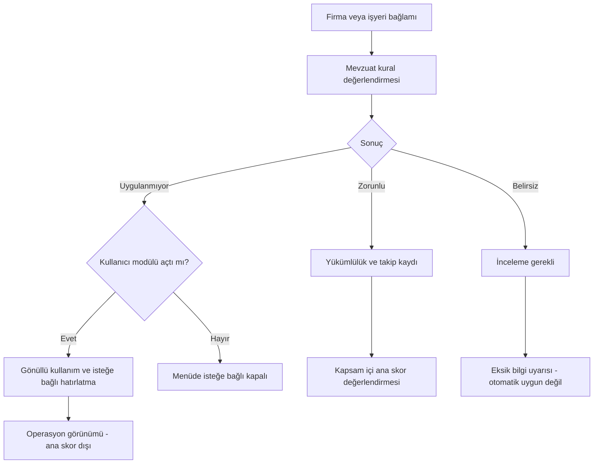

---

## 5. Firma, işyeri, departman, görev ve çalışan modeli

### 5.1. Temel hiyerarşi

```text
Uzman — tek son kullanıcı aktör
  → Firma (company: erişim ve ticari müşteri kapsamı)
    → İşyeri / tesis (workplace: faaliyet, SGK sicili ve mevzuat bağlamı)
      → Departman / birim
        → Çalışan görevlendirmesi
          → İş görevi / unvan / rol
```

`company_id` güvenlik kapsamıdır. `workplace_id` mevzuat ve faaliyet bağlamıdır. Bir şirketin farklı tehlike sınıfındaki birden fazla işyeri olabileceği ihtimalini şimdiden modelleyin. İlk sürümde tek işyeri kullanan firma için otomatik varsayılan işyeri oluşturulabilir. Eski `companies.hazard_class` geriye uyumlu varsayılan alan olarak kalır; yeni işyeri düzeyindeki geçerli kayıtlar için açık çözümleme kuralı gerekir.

Aktif firmanın adı aynı kullanıcı altında benzersiz olduğu mevcut kısıtla uyumlu kalın. Aynı şirketin iki tesisi için ad hilesiyle iki firma açmak yerine `workplaces` kullanılması önerilir. Gerçek ticari olarak aynı adlı ayrı firmalar gerekiyorsa mevcut benzersizlik kısıtı ayrı migration/ürün kararıyla ele alınır.

### 5.2. Çalışan ana kaydı

Asgari alanlar: `id`, `company_id`, `employee_code`, ad-soyad, çalışma ilişkisi türü, işe giriş/ayrılış tarihleri, aktiflik, gerekliyse iletişim. T.C. kimlik numarası bütün işlemler için zorunlu anahtar yapılmaz; yalnız doğrulanmış belge ihtiyacı varsa ayrı sınırlı erişimli alan olarak değerlendirilir. Mobil liste/telemetri/arama çıktılarında açık kimlik numarası gösterilmez.

İşyeri, departman ve görev `employee_assignments` üzerinden bağlanır. Tek aktif ana görevlendirme varsayılandır; yardımcı görev gerekiyorsa açık tip ve zaman aralığıyla tutulur. İzin verilen çoklu görevlendirme kuralı belirlenmeden keyfî çakışan kayıt kabul edilmez.

### 5.3. Departman ve görev kayıtları

**Departman:** firma, işyeri, kod, ad, üst departman, aktiflik, isteğe bağlı sorumlu.  
**İş görevi:** firma, kod, ad/unvan, görev açıklaması, ilgili eğitim gereksinimleri ve ekipman/KKD öneri bağlantıları.  
**Görevlendirme:** çalışan, işyeri, departman, görev, başlangıç, bitiş, değişiklik nedeni için kişisel sağlık bilgisi içermeyen kısa açıklama.

Departman/görev silinmez; kullanılmışsa pasife alınır. Referanslı geçmiş eğitimlerde ve zimmetlerde o tarihteki unvan snapshot'ı kalır. Çalışanın bugünkü departmanı geçmiş sertifikaları değiştirmez.

### 5.4. Otomasyonlar

Görev değişikliği yeni eğitim ihtiyacı önerisi oluşturabilir; otomatik sertifika vermez. İşe giriş seçilen şirkette onboarding görev listesi oluşturur. İşten ayrılma ileri tarihli eğitim davetleri ve personel atamalarının gözden geçirilmesini önerir; geçmiş kanıtı silmez.

İçe aktarmada bilinmeyen departman/görev için “mevcut kayıtla eşle / yeni kayıt oluştur / satırı beklet” seçenekleri vardır. Benzer adları otomatik birleştirmeyin. Bir firmanın “Bakım” kaydı diğer firmanın “Bakım” kaydıyla aynı veri nesnesi değildir.

---
## 6. Eğitim sistemi ve 2026 mevzuat profili

### 6.1. Güncel mevzuat başlangıcı

2 Nisan 2026 tarihli ve 33212 sayılı Resmî Gazete'de yayımlanan yeni eğitim yönetmeliği, bu revizyondaki başlangıç mevzuat profilidir. Yayım bilgisi Türkiye Belediyeler Birliğinin resmî duyurusuyla da doğrulanmıştır. Eski yönetmeliğe göre verilmiş eğitimlerin geçiş durumu ayrı değerlendirilir; bütün tarihî kayıtlar yeni sürümle geriye dönük değiştirilmez. [L1, L2]

**İki ayrı yapı kurulacaktır:**

1. **Mevzuat eğitim kataloğu:** Sistem tarafından yayımlanan, sürümlenen, firma kullanıcısının asgari şartlarını düşüremediği katalog.
2. **Uzman eğitim kataloğu:** Kullanıcının kendi başlıklarını, alt konularını, hedef grubunu ve koşullarını tanımlayabildiği katalog.

Her iki katalog aynı oturum, katılımcı, belge ve takip altyapısını kullanır; hukuki kaynak ve yetki iddiası aynı değildir.

### 6.2. Temel eğitim süre profili

Bakanlığın güncel SSS bölümündeki eğitim tablosu ile yönetmeliğin 12–14. maddeleri birlikte kontrol edilmiştir. Aşağıdaki süreler **ders saati** birimindedir. Dördüncü konu grubunun süresi toplamın içindedir; toplamın üzerine otomatik eklenmez. [L2, L4]

| İşyerinin tehlike sınıfı | İlk temel eğitim en az | Düzenli tekrar eğitimi en az | Düzenli tekrar aralığı | Dördüncü konu grubu en az |
|---|---:|---:|---|---:|
| Az tehlikeli | 8 | 8 | 3 yılda bir | 2 |
| Tehlikeli | 12 | 8 | 2 yılda bir | 3 |
| Çok tehlikeli | 16 | 8 | Yılda bir | 4 |

**Kritik uygulama ayrımı:** İlk eğitim ve düzenli tekrar farklı `training_cycle_kind` değerleridir. Tekrar eğitimine kör biçimde ilk eğitimin 12/16 saat eşiği uygulanmaz. Dördüncü grubun alt sınırı ise tekrarda da korunur. Tehlikeli ve çok tehlikeli işyerlerinde bu grup yüz yüze; az tehlikelide izin verilen yöntemler kapsamındaki seçimle planlanır. [L2]

Uygulama varsayılanı ilk eğitim için 6+2, 9+3 ve 12+4 dağılımlı taslak olabilir. Bu bir planlama şablonudur; tek tek konu başlıklarına kanunda olmayan sabit dakika değerleri uydurulmaz. Uzman, işyerinin ihtiyacına göre daha fazla süre ayırabilir. Ek süre eklemek, diğer zorunlu konuları kaldırma hakkı vermez. Katalog incelemesinde Bakanlık açıklamasındaki grup dağılımı da değerlendirilir. [L4]

### 6.3. Konu kataloğu: resmî eşleme + ürün etiketleri

Ek-1 dört ana gruptan oluşur. İlk üç gruptaki her madde için ayrı `topic_code` açılır. Aşağıdaki kısa etiketler **arayüz tasarımı için özetlenmiştir; mevzuatın birebir aktarımı değildir**. Yayımlanacak katalogdaki `legal_label`, kaynak Ek-1'deki karşılıkla uzman kontrolünde doldurulur. Belge renderer'ı kısa etiketi değil onaylı resmî etiketi kullanır. [L3]

| Kod | Ürün etiketi | Kaynak eşlemesi |
|---|---|---|
| G1-A | Çalışma hukukuna giriş | Ek-1 / 1-a |
| G1-B | Çalışan hakları ve yükümlülükleri | Ek-1 / 1-b |
| G1-C | Temiz ve düzenli çalışma alanı | Ek-1 / 1-c |
| G1-D | İş kazası ve meslek hastalığının hukuki boyutu | Ek-1 / 1-ç |
| G2-A | Meslek hastalığına yol açan etkenler | Ek-1 / 2-a |
| G2-B | Hastalıkları önleyici yaklaşımlar | Ek-1 / 2-b |
| G2-C | Biyolojik ve psikososyal tehlikeler | Ek-1 / 2-c |
| G2-D | İlk yardım bilgisi | Ek-1 / 2-ç |
| G2-E | Madde ve teknoloji bağımlılığına karşı farkındalık | Ek-1 / 2-d |
| G3-A | Kimyasal, fiziksel ve ergonomik tehlikeler | Ek-1 / 3-a |
| G3-B | Yükleri elle taşıma güvenliği | Ek-1 / 3-b |
| G3-C | Parlama/patlama tehlikeleri | Ek-1 / 3-c |
| G3-D | Yangını önleyici tedbirler | Ek-1 / 3-ç |
| G3-E | Ekipmanla güvenli çalışma | Ek-1 / 3-d |
| G3-F | Ekran başında çalışma güvenliği | Ek-1 / 3-e |
| G3-G | Elektrik kaynaklı tehlikeleri önleme | Ek-1 / 3-f |
| G3-H | İş kazalarının nedenleri ve önleme yöntemleri | Ek-1 / 3-g |
| G3-I | İSG işaretlerini tanıma | Ek-1 / 3-ğ |
| G3-J | KKD'yi doğru kullanma | Ek-1 / 3-h |
| G3-K | Güvenli çalışma kültürü ve temel kurallar | Ek-1 / 3-ı |
| G3-L | Acil durumda tahliye/kurtarma | Ek-1 / 3-i |
| G4 | İşyerine Özgü Riskler | Ek-1 / 4; sınıfa göre resmî başlık varyantı |

Dördüncü grup için tehlikeli/çok tehlikeli sınıfta iş ve işyeri risklerine, az tehlikeli sınıfta faaliyetin genel tehlike/risklerine ilişkin ayrı resmî etiket vardır. UI'da ortak kısa isim kullanılabilir; çıktıdaki doğru varyant tehlike sınıfı snapshot'ından seçilir. [L3]

### 6.4. Firma bazlı dördüncü grup müfredatı

**Önerilen kayıt:** `company_training_curriculum_versions`.

Alanlar: firma/işyeri, katalog sürümü, üst konu kodu, durum, onaylayan, yürürlük tarihi, alt konu listesi, hedef departman/görev, süre dağılımı, kaynak risk değerlendirmesi sürümü, kaynak acil durum planı sürümü ve isteğe bağlı diğer dayanaklar.

Uzman şu işlemleri yapabilir: alt başlık ekle, adını/açıklamasını değiştir, sıra ver, dakika/oturum ata, ilgili departman ve görevleri seç, kaynak risk maddesiyle bağla, taslağı kopyala ve yeni sürüm yayımla. Başka firmadaki müfredat başlangıç şablonu olarak kopyalanabilir; otomatik olarak bütün firmalar için geçerli sayılmaz.

**Tasarım örnekleri — mevzuatın her işyerine zorunlu tuttuğu alt başlık listesi değildir:**

- Depoda: forklift-yaya etkileşimi, yükleme alanı, raf düzeni.
- Metal üretiminde: pres çevresi, hareketli aksam, kaynak alanı.
- Ofiste: yerleşime özgü tahliye yolları, elektrik bağlantıları, ekranlı çalışma düzeni.

Örneğin tehlikeli işyerinde üç ders saatlik G4 planı oluşturulurken süreler alt başlıklara dağıtılır. Kullanıcı ek konu ekleyip G4'ü dört saate yükseltebilir; diğer grupların gerekli kapsamı korunur ve toplam süre uygun biçimde artırılır.

Risk değerlendirmesi değiştiğinde sistem **“Bu eğitim içeriğini gözden geçirin”** görevi üretir. Yayımlanmış eski müfredat, gerçekleşmiş eğitimler veya imzalı belgeler otomatik değiştirilmez. Henüz başlamamış oturum için yeni müfredat sürümü seçmek ayrıca onay gerektirir.

### 6.5. Özel eğitim oluşturma

Ekran: **Eğitimler > Eğitim Türleri > Özel Eğitim Ekle**.

| Alan grubu | Kullanıcı tanımlayabilir |
|---|---|
| Kimlik | Başlık, açıklama, kategori, kısa kod. |
| Hedef kitle | Firma/işyeri, departman, görev, belirli çalışanlar, taşeron personeli. |
| İçerik | Alt konular, hedefler, ilgili dokümanlar. |
| Süre | Ders saati / saat / dakika ayrımı, asgari süre, oturum yapısı. |
| Yöntem | Yüz yüze, dış uzaktan eğitim, karma; gerekli uygulama kaydı. |
| Takvim | Tek sefer, belirli aralık, sabit son tarih, olay bazlı veya geçerlilik süresi yok. |
| Tamamlama | Katılım, sınav, uygulama değerlendirmesi veya dış belge kontrolü şartı. |
| Belge | İç katılım belgesi, dış kurum sertifikası, yeterlilik belgesi; düzenleyen ve doğrulama durumu. |
| Ön şart | Seçilen başka eğitim veya yeterlilik kaydının mevcut/geçerli olması. |
| Kaynak | Kullanıcı/firma şartı veya ayrıca doğrulanmış mevzuat kuralı. |
| Hatırlatma | Ön uyarı günleri, bildirim kanalları ve sorumlular. |

Sistem başlık benzedi diye özel eğitimi otomatik temel İSG eğitimine eşlemez. Bir özel eğitimin konusu temel eğitime sayılacaksa konu, süre, eğitici, tarih, yöntem ve kanıt eşdeğerliği açık kural ve insan incelemesi gerektirir.

**MYK ayrımı:** “MYK hazırlık eğitimi”, “mesleki eğitim katılımı” ve “MYK Mesleki Yeterlilik Belgesi” ayrı türlerdir. MYK yeterlilik belgesi, uygulamanın kendi katılım PDF'siyle üretilebilecek bir resmî yeterlilik gibi sunulmaz; yetkili belgelendirme ve yeterlilik bazlı süreç söz konusudur. Uygulama dış belgenin kodunu, düzenleyenini, tarihini, geçerliliğini ve kanıtını takip eder. [L7]

İlk yardım ve diğer dış sertifikalı eğitimlerde de aynı ayrım kullanılır. Bu planda hepsine tek bir saat veya tek bir yenileme süresi tanımlanmamıştır. Kullanıcının girdiği şart, doğrulanmış kaynak yoksa **“kullanıcı tanımı”** olarak görünür.

### 6.6. Eğitim kayıt akışı

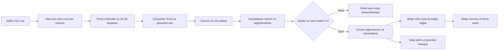

### 6.7. Süre hesabı ve doğrulama modeli

Ders saati, öğretim süresi ve ara dinlenmesi ayrı planlanmalıdır. Bakanlık ders saati tanımında 45 dakika öğretim ile 15 dakika arayı birlikte açıklamaktadır. [L4]

**Önerilen uygulama alanları:** `instruction_minutes`, `break_minutes`, `scheduled_minutes`, `duration_unit`, `credited_lesson_units`, `attendance_intervals`.

Kullanıcı “8” girdiğinde birimin ne olduğu sorulur. Tam gün takvim süresi eğitim anlatımına eşit sayılmaz. Aynı çalışanın çakışan oturumlardaki süresi iki kez yazılmaz. Bütün grupların ve alt konu kapsamasının tamamlanması ile yalnız toplam sürenin dolması farklı kontrol sonuçlarıdır.

**Doğrulama sonucu örnekleri:** `insufficient_duration`, `missing_topic`, `missing_attendance`, `wrong_delivery_method`, `assessment_pending`, `external_evidence_unverified`, `completed_verified`.

Yetersiz kayıt sistemde saklanabilir; fakat uygun tamamlanmış eğitim/sertifika olarak işaretlenmez. Yetkili manuel düzeltme önce/sonra snapshot'ı, gerekçe ve aktör kaydıyla yapılır. Başarı puanı ve sınav denemeleri katalog sürümüne bağlanır; 2026 temel eğitiminde 60/100 eşiği ve ilk sınavdan sonra en fazla iki ek deneme kayda alınmalıdır. [L2]

### 6.8. İşe başlama, tekrar ve iş değişikliği

İşe başlama eğitimi temel eğitimden ayrı türdür; fiilen işe başlamadan önceki kayıt ve en az iki saatlik yüz yüze/uygulamalı yaklaşım ayrı takip edilir. Temel eğitimin en geç üç ayda tamamlanması kuralı bu başlangıç eğitimini erteleme izni olarak sunulmaz. [L5]

Ürün uygulaması olarak ilk eğitim, düzenli tekrar, görev/ekipman değişikliği nedeniyle ek eğitim ve uzun süreli ara sonrası bilgi yenileme ayrı olay türleridir. Sağlık nedeni tutulmadan `return_after_gap` gibi nötr kayıt kullanılabilir. Hastalık/rapor teşhisi veya nedeni toplanmaz.

Geçerli eski eğitim başka işyerinden getirildiğinde “yeniden yükleme tarihi” başlangıç sayılmaz. Belge incelemesi, yeni işyeri bağlamı ve gerekli işe/işyerine özgü eğitim ayrı kaydedilir. Eski ve yeni tarih hesaplarını karıştırmamak için `original_completion_date` değişmez tutulur. 2026 öncesi kayıtların geçerlilik incelemesi, o eğitimin dayandığı düzenleme ve geçiş kuralıyla yapılır. [L5]

### 6.9. Eğitim belgeleri ve yıllık plan

Yıllık eğitim planında hedef gruplar, eğitim türleri, dönem/tarih, yer, içerik, süre ve sorumlu bulunur. Planlanan eğitim ile gerçekleşen eğitim ayrı kayıttır. Gerçekleşmeyen plan maddesi katılım veya sertifika üretmez.

**Belge tipleri ayrı tutulur:** yıllık plan, eğitim katılım tutanağı, değerlendirme/sınav evrakı ve temel eğitim belgesi. Temel eğitim belgesi için Ek-2'ye uygun şablon onayı gerekir; bunları tek bir “her şey dahil sertifika” halinde birleştirmeyin. [L3, L4]

Bu sürüm bir eğitim kayıt ve planlama sistemidir; interaktif uzaktan eğitim/LMS değildir. Dış uzaktan eğitimler için kanıt yüklenebilir. Bir video bağlantısı eklemek veya “izledi” kutusunu seçmek yasal uzaktan eğitim altyapısının sağlandığı iddiasını doğurmaz.

---

## 7. Risk değerlendirmesi sürümleme ve tarih yönetimi

### 7.1. Ürün kararı

Kullanıcı risk değerlendirmesini dışarıda hazırlayıp yükleyebilir, uygulamadaki kayıtlarla ilişkilendirebilir ve altı ay sonra yenisini yükleyebilir. Eski sürümler arşivde kalır. Güncel sürüm, geçerlilik durumu, sonraki gözden geçirme/yenileme tarihi ve değişiklik açıklaması birlikte gösterilir.

Bu süreç, mevcut bir fotoğraf analizinin `completed` durumunu geriye alıp yeniden analiz yaptırmak değildir. `analyses` fotoğraf analiz motorunun iş kaydıdır; yeni `risk_assessments` ise işyeri risk değerlendirmesi dokümanının yaşam döngüsüdür.

### 7.2. Dört farklı işlem

| İşlem | Yeni dosya sürümü | Risk değerlendirmesi içerik sürümü | Tarih etkisi |
|---|---|---|---|
| Aynı belgenin daha iyi taraması | Evet | Aynı içerik sürümüne yeni dosya varyantı | Yüklenme zamanı değişir; değerlendirme/yenileme tarihi değişmez. |
| Yazım/metadata düzeltmesi | Gerekirse | Düzeltme revizyonu | Gerçek tarih değişmedikçe takip takvimi aynı kalır. |
| Belirli bölüm/riske ilişkin kısmi güncelleme | Evet | Yeni kısmi revizyon | İlgili bölüm ve aksiyonlar yeniden değerlendirilir; bütün belgenin süre başlangıcı otomatik sıfırlanmaz. |
| Yeni tam değerlendirme / tam yenileme | Evet | Yeni esas sürüm | Uzman doğrulamasıyla gerçek değerlendirme tarihi üzerinden uygun takip tarihleri yeniden hesaplanır. |

Risk değerlendirmesi yönetmeliği süre bazlı yenilemenin yanında, işyerini tamamen veya kısmen etkileyen değişikliklerde kısmi/tam yenilemeyi de düzenler. Genel periyotlar çok tehlikeli/tehlikeli/az tehlikeli için sırasıyla en geç 2/4/6 yıldır. Bunlar değişikliklerin ara dönemde ele alınmasını engellemez. [L6]

**Tasarım tercihi:** Kısmi revizyonun bütün işyeri periyodunu otomatik ileri taşımasına izin vermemek, yanlış tarih ertelemesini önleyen korumadır. Kapsama özgü farklı bir hesap gerekirse uygulanabilir kural, gerekçe ve uzman onayıyla kaydedilir; kullanıcıya bunun basit bir “dosya güncelleme” olmadığı açıklanır.

### 7.3. Alanlar

`risk_assessments`: firma/işyeri, başlık, kapsam, güncel sürüm, durum.  
`risk_assessment_versions`: sıra, önceki sürüm, işlem türü, gerçek değerlendirme tarihi, yürürlük tarihi, uzman inceleme zamanı, değişiklik nedeni, etkilenen bölümler, onay/kanıt durumu, belge sürümü, kural ve tehlike sınıfı snapshot'ı.

Ayrı tarihler:

```text
uploaded_at                    Teknik yüklenme zamanı; sunucu üretir.
assessment_performed_on        Fiilî değerlendirme tarihi; dayanakla doğrulanır.
effective_on                   İçeriğin hangi tarihten itibaren esas alındığı.
reviewed_at                    Uygulama içindeki incelemenin zamanı.
last_full_renewal_on            Tam yenilemenin dayanak tarihi.
statutory_due_on               Uygulanabilir kurala göre takip edilen azami tarih.
operational_review_on          Uzmanın daha erken seçtiği gözden geçirme tarihi.
```

Dosya tarihi, dosya adı veya EXIF'ten mevzuat tarihi kesinmiş gibi çıkarılmaz. Geri tarihli belge girilebilir; gerçek olay tarihi ile sisteme girilme tarihi ayrı ve değişiklik denetimine tabidir.

### 7.4. Altı ay sonra güncelleme örneği

**Ürün davranışı örneği:** 15.01.2027 tarihli, tehlikeli sınıf işyeri değerlendirmesi 15.07.2027'de güncellenip yükleniyor.

- Yalnız yeni taramaysa: asıl değerlendirme tarihi 15.01.2027 olarak kalır.
- Yeni bir hattı ilgilendiren kısmi güncellemeyse: revizyon tarihi 15.07.2027 olur; o kapsamın risk/aksiyon/eğitim gözden geçirmesi başlatılır. Tüm işyerinin genel süre hesabı otomatik uzatılmaz.
- İşyerinin tamamını kapsayan gerçek tam yenilemeyse: uzman bunu doğrular; ilgili kurallar değişmediyse tam yenileme hesabının yeni dayanağı 15.07.2027 olur. Olay tetikleyicileri yine izlenir.

Bu örnekte amaç bir mevzuat garantisi vermek değil, **“güncelleme tarihi değişsin”** talebini yanlışlıkla **“her yüklemede tüm süreler sıfırlansın”** davranışına dönüştürmemektir.

### 7.5. Yayınlama işlemi atomik olmalı

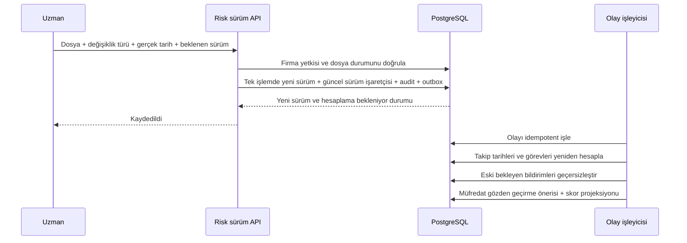

İki cihaz aynı eski sürümü yenilemeye çalışırsa ikinci istek `409 VERSION_CONFLICT` alır. İki aktif güncel sürüm oluşmaz. Zaman hesaplayıcısı başarısızsa kayıt “tarih hesaplanıyor/hata” olarak görünür; eski tarih yeni tarihmiş gibi sessizce bırakılmaz. Eski belge ve ona dayanılarak hazırlanmış raporlar değişmez.

### 7.6. Fotoğraf analizinden aktarım

Mevcut bulgu, uzman seçimiyle risk değerlendirmesi taslağına veya uygunsuzluğa aktarılır. Bağlantıda `analysis_id`, `finding_id`, `finding_version`, içerik snapshot'ı ve aktaran kişi saklanır. AI bulgusu otomatik onaylanmış işyeri risk değerlendirmesi olmaz. Eski bulgu sonradan değişirse ilgili taslağa gözden geçirme önerisi gelir; yayımlanmış belge sessizce değişmez.

---

## 8. Çalışma izni formları — başlangıç kapsamı

### 8.1. Dahil olanlar

Ekran: **Belgeler > Çalışma İzni Formları** veya ilgili firma modülü.

Uzman hazır şablondan form açabilir, firma/işyeri/çalışma yeri, iş tanımı, planlanan tarih-saat, ilgili firma/taşeron, sorumlu kişiler, seçilen çalışanlar, risk/önlem referansları ve imza alanlarını doldurabilir. PDF oluşturulur; istenirse form alanları XLSX tablosu olarak dışa aktarılır. Dışarıda imzalanmış nüsha ayrıca yüklenip aynı belgeye bağlanabilir.

Başlangıç şablon adayları: genel çalışma izni, sıcak iş, yüksekte çalışma, kapalı alan ve elektrik işi formu. Her şablonun saha kullanımı, içeriği ve uygulanabilirliği ayrıca yetkin kişi tarafından gözden geçirilmelidir. Bunlar bu belgede güvenli iş yapma talimatı veya her iş için yeterli kontrol listesi olarak tanımlanmamıştır.

### 8.2. Dahil olmayanlar

Canlı izin talep/onay zinciri, otomatik işe başlatma, süre dolunca fiziksel erişim kesme, sensör/ölçüm doğrulama, mobil imza ile otomatik resmî onay, saha giriş sistemi, vardiya devri ve canlı kapatma senaryoları bu sürüme alınmaz.

Belge durumu `draft → rendered → archived` olabilir. `signed_copy_attached` yalnız dış nüshanın varlığını belirtir; onay yetkisinin ve gerçek çalışma güvenliğinin doğrulandığı anlamına gelmez. **“Form oluşturuldu” ile “Çalışmaya izin verildi” aynı durum değildir.**

Şablonlarda çalışan sağlık uygunluğu, muayene tarihi veya teşhis alanı oluşturulmaz. Dış mevzuat/işletme süreçlerinde ayrıca gereken kontrolleri uygulamanın yaptığı izlenimi verilmez. PDF'de belgenin hazırlama aracı olduğu ve yetkili saha sürecinin yerine geçmediği uygun ifadeyle belirtilir.

### 8.3. Teknik tasarım

Yeni ve karmaşık permit workflow motoru yerine `document_templates`, `documents`, `document_versions`, `document_exports` ortak yapısı kullanılır. `permit_forms` yalnız formun iş bağlamı ve aranabilir metadata'sını tutar. Çalışan ve taşeron bilgileri ana kayıtlardan seçilir; nihai çıktıdaki ad/unvan/tarih snapshot'ı dondurulur.

---

## 9. Taşeron / alt yüklenici — başlangıç kapsamı

### 9.1. Dahil olanlar

Firma altında ilişkili dış firma kayıtları: ticari ad, gerekliyse vergi/işyeri tanımlayıcıları, yetkili iletişimi, yapılan iş, sözleşme/iş başlangıç-bitiş tarihleri, çalışılan işyerleri, temel belge listesi ve notlar. İlişki türü `subcontractor/contractor/supplier/other` olarak beyan edilir; her tedarikçi otomatik hukuki alt işveren sayılmaz.

Personel seçimi mevcut çalışan ana kaydından, açık işveren/ilişki bilgisiyle yapılır. Bir taşeron çalışanı eğitime, saha bilgilendirmesine, uygunsuzluk aksiyonuna veya izin formuna bağlanabilir. Aynı kişi her modülde yeni personel olarak yaratılmaz.

Belge kontrol ekranı, eğitim/yeterlilik kanıtlarını ve uzman tarafından seçilmiş kontrol maddelerini gösterebilir. Eksik belge listesinin oluşması, çalışanın işe uygun olduğuna ilişkin otomatik karar değildir. Sağlık evrakı bu listede bulunmaz.

### 9.2. Sorumluluk ve sayı hesabı

Asıl/alt işveren ilişkisinde eğitim ve koordinasyon sorumlulukları bulunduğundan, belgenin hangi işverenin çalışanına ait olduğu kaybolmamalıdır. [L2, L4]

**Önerilen model:** `contractor_organizations` + `contractor_engagements` + çalışan ana kaydındaki işveren ilişkisi. Çalışanın sahada bulunması ile ana firmanın kendi çalışanı olması farklıdır. Kurul ve diğer yükümlülüklerde hangi çalışanların sayılacağı kural motorunda bağlama göre çözülür; taşeron sayısı ana firma sayısına kör biçimde eklenmez.

Aynı dış firmanın iki müşteride kaydı bulunabilir. İlk sürümde tenant'lar arası küresel ticari/kişisel veri havuzu ve otomatik birleştirme yoktur. Bu planın hiçbir fazında ortak portal veya alt yüklenici girişi yoktur.

### 9.3. Kapsam dışı ileri özellikler

Hakediş, bordro, finans, alt yüklenici performans sözleşmeleri, kapı erişimi, turnike, gerçek zamanlı saha yetkilendirmesi, tüm yasal yeterlilikleri otomatik sertifikalandırma ve alt işveren portalı kapsam dışıdır; hiçbir fazda geliştirilmez.

---
## 10. Diğer İSG modülleri ve ilişkileri

Aşağıdaki kapsam korunur. Modüllerin hepsi aynı firma, işyeri, çalışan, belge, görev ve uygulanabilirlik altyapısını kullanmalıdır. Buradaki alanlar ürün tasarımıdır; mevzuatta geçen her periyot için ayrı doğrulanmış katalog kaydı gerekir.

| Modül | İlk kullanılabilir sürüm | Bağlantılar ve sınırlar |
|---|---|---|
| Risk değerlendirmeleri | Dış belge, sürümler, ekip/imza alanları, risk kayıtları, yöntem, gözden geçirme ve yenileme | Fotoğraf analizi kaynak olabilir; tek başına tam değerlendirme sayılmaz. |
| Uygunsuzluk ve düzeltici faaliyet | Manuel/fotoğraftan tespit, kategori, önem, sorumlu, termin, açıklama, önce/sonra kanıtı, kapanış doğrulaması | Kaynak bulgu ve kontrol listesi; uzmanın iş listesi; raporda sorumlu kişinin adı/unvanı. Karşı tarafa uygulama görevi atanmaz. |
| Kontrol listeleri | Sistem/firma şablonu, sürüm, uygulanabilir soru, kontrol kaydı, not ve kanıt | Olumsuz yanıt öneri olarak uygunsuzluğa çevrilir; otomatik nihai hukuki hüküm olmaz. |
| Acil durum planları | Dış dosya veya şablonla hazırlık, ekip/iletişim, sürüm ve gözden geçirme | Atamalar, işyeri, yıllık plan ve tatbikat kayıtları. |
| Tatbikat takibi | Plan, gerçekleşme tarihi, katılım/kanıt, bulgular ve aksiyon | Mevzuat/işyeri bağlamına göre dönem; ek gönüllü tatbikat açılabilir. |
| Periyodik ekipman kontrolleri | Ekipman envanteri, seri/kod, yer, kontrol raporu, kontrolü yapan, tarih, sonuç ve sonraki kontrol | Her ekipmana tek tip yıllık süre atanmaz; ilgili kaynak ve rapor tarihi ayrılır. İnsan sağlık kontrolü değildir. |
| İSG-KATİP sözleşmeleri | Sözleşme belgesi, uzman/işyeri, başlangıç-bitiş, durum, beyan edilen hizmet süresi ve hatırlatma | Resmî sistemde işlem yapılmış olduğu iddia edilmez; şifre toplama veya izinsiz ekran kazıma yok. |
| Yıllık çalışma planı | Yıllık hedefler, faaliyetler, sorumlu ve planlanan tarih, gerçekleşme bağlantısı | Eğitim, kontrol, toplantı ve ziyaretlerle ilişki; planlandığı için tamamlandı sayılmaz. |
| Yıllık eğitim planı | Eğitim türü, hedef personel/görev, içerik, dönem, süre ve gerçekleşme | Bölüm 6'daki program/oturum/katılım zinciri. |
| Toplantı / kurul | Gündem, katılımcılar, toplantı türü, tutanak, kararlar ve takip | Yasal kurul veya gönüllü toplantı ayrımı; kararlar görev üretir. |
| Destek elemanı / çalışan temsilcisi | Kişi seçimi, görev kapsamı, başlangıç-bitiş, seçim/atama dayanağı, atama yazısı | Çalışan ana kaydı ve gerekli eğitim/yeterlilik bağlantısı; yasal şartlar doğrulanmadan otomatik yeterli etiketi yok. |
| KKD zimmetleri | KKD tür/kod, miktar, teslim/iade, çalışan, tarih ve form | Depo/muhasebe ürünü değil; zimmet ve takip odaklı. |
| Onaylı defter arşivi | Defter kimliği, sayfa/tarih, tarama, tespit/öneri bağlantısı | Dijital kopya takibi; sırf uygulamada metin yazılması resmî onaylı defter işlemi olarak sunulmaz. |
| Evrak ve dosya yönetimi | Klasör/etiket, belge türü, firma/çalışan ilişkisi, sürüm, arama ve arşiv | Tek ortak belge motoru; tıbbi evrak türleri yok. |
| Rapor merkezi | Eski analiz raporları + yeni süreç raporlarının birleşik görünümü | Yetkili kapsamda PDF/XLSX; eski rapor sözleşmesi değiştirilmez. |
| İstatistikler | Yaklaşan süre, eğitim kapsaması, açık/kapanmış uygunsuzluk, belge durumu, firmalar arası özet | Veri kapsamı ve güncelleme zamanı görünür; sağlık göstergesi yok. |
| Kullanıcı rehberliği | İlk firma kurulumu, bağlama uygun açıklama, örnek veri, ürün içi kısa eğitim | Ürün kullanımı eğitimi ile çalışan temel İSG eğitimi ayrı tutulur. |
| Saha ziyaretleri ve güvenli olmayan durum gözlemleri | Ziyaret kaydı, gözlem, kanıt, aksiyon | Klinik/yaralanma dosyası geliştirilmez; bu sınırı aşan olay yönetimi ayrı ürün kararıdır. |

### 10.1. Uygunsuzluk durumu

Önerilen akış: `draft → open → assigned → in_progress → pending_verification → closed`, gerektiğinde `reopened` ve gerekçeli `cancelled`. Bütün durum değişikliklerini uzman yapar. `assigned` yalnız raporun sorumlu adı girildi demektir; dış hesaba görev/onay göndermez. Uzman dışarıdan aldığı bilgi ve kanıtı kendisi değerlendirerek kapanışı kaydeder. Son tarih değişikliği gerekçe ve audit gerektirir; ilk termin ayrıca saklanır.

Fotoğraf analizindeki `is_resolved` ile süreçteki `closed` otomatik çift yönlü bağlanmaz. Senkronizasyon istenirse tek otorite ve dönüşüm kuralı ADR ile belirlenir; mevcut analiz raporu snapshot'ı değişmez.

### 10.2. Diğer mevzuat konularının yayın ilkesi

Acil durum planları, tatbikat, kurul sıklığı, temsilci/destek elemanı sayıları, ekipman kontrolleri ve uzman hizmet süreleri için üretim kural kataloğu ayrıca hazırlanmalıdır. Bu revizyon özellikle eğitim ve risk sürümleme değişikliklerini doğrulamıştır; listelenen bütün alanların bütün sektör istisnalarının denetlendiği iddia edilmez.

İlgili kural doğrulanmamışsa modül kayıt tutmaya açık olabilir; sistem tarih önerisini “uzman tarafından belirlenen” olarak gösterir. Kaynaksız süreyi “mevzuat gereği” etiketiyle üretmez. Mevzuatla doğrulanmış otomatik takip vaat edilen bir modül, o kural seti onaylanmadan yayına hazır kabul edilmez.

---

## 11. Hedef teknik mimari

### 11.1. Modüler tek backend, mevcut mobil uygulamalar

İlk tercih; Supabase üzerinde domain sınırları olan **modüler tek backend**, mevcut SwiftUI ve Compose istemcileridir. Her modül için ayrı mikroservis, ayrı veritabanı veya ayrı kullanıcı havuzu açılmaz. Ağır dosya işleme gerekirse kuyruğa bağlı izole worker kullanılır.

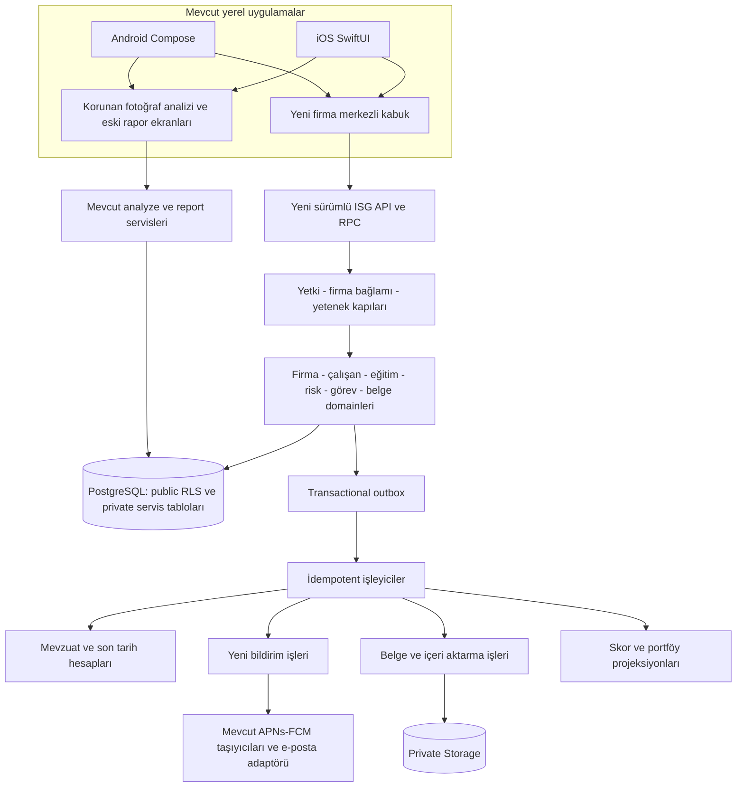

### 11.2. Ortak servis sözleşmeleri

`CompanyContext`, `EmployeeDirectory`, `DocumentService`, `RequirementEvaluator`, `TaskService`, `TrainingService`, `RiskAssessmentService`, `NotificationDispatcher`, `ImportService` ve `ScoreProjectionService` mantıksal sınırlar olarak tanımlanır. Bunların her biri ayrı deploy edilen servis olmak zorunda değildir.

Modül A'nın ekranı, modül B'nin tablosuna kontrolsüz yazmaz. Örneğin eğitim tamamlamak; eğitim mutasyon API'sinde doğrulanır, ardından olay üretir. Bildirim/skor/son tarih tüketicileri kendi projeksiyonlarını günceller. Finansal entitlement ve hukuki uygulanabilirlik ayrı servis kararlarıdır.

### 11.3. Sözleşme paylaşımı

Repo içinde önerilen yeni klasör: `contracts/isg/v1/`. JSON Schema veya eşdeğer sürümlü DTO tanımları, örnek istek/yanıtlar, hata kodları, tarih ve sayfalama kuralları burada tutulur. Swift/Kotlin modelleri bu sözleşmeye karşı test edilir. “İki platform aynı iş kuralını ayrı ayrı tahmin etsin” yaklaşımı yoktur.

Önerilen domain kodları nötr İngilizce, kullanıcı metinleri yerelleştirilmiş Türkçe/İngilizcedir. Yeni modüllerin Türkiye mevzuatına bağlı olması, mevcut uluslararası fotoğraf analizi profilini Türkiye'ye zorla değiştirmez. `work_jurisdiction` mevcut anlamıyla korunur; Türkiye dışı firmalarda doğrulanmamış kurallar uygulanmaz.

---

## 12. Önerilen veri modeli ve güvenlik sınırları

### 12.1. Genel kurallar

Aşağıdaki isimler **öneridir**; gerçek depoda çakışma taraması yapılmadan migration üretmeyin. Çoğu son kullanıcı tablosu `public` altında RLS ile; iş kuyruğu, audit, idempotency ve yönetilen kural yürütmesi `private` altında bulunur. Şema adı tek başına koruma değildir; API görünürlüğü, GRANT, policy ve function EXECUTE izinleri birlikte denetlenir. [T1]

Firma kapsamlı tablolarda ortak alanlar: `id`, `company_id`, gerekiyorsa `workplace_id`, `created_at`, `updated_at`, `created_by`, `updated_by`, `version`, `archived_at`. Nihai belge/gerçekleşmiş olay verileri yerinde değiştirilmek yerine yeni sürümle düzeltilir.

`company_id` yalnız istemci filtresi değildir. İlişkilerde `UNIQUE(company_id,id)` ve uygun bileşik FK ile başka firmanın çalışanı, departmanı, belge sürümü veya görevi bağlanamaz. Tek kolonlu UUID'nin tahmin edilememesi yetkilendirme sayılmaz.

### 12.2. Firma ve insan kaydı tabloları

| Önerilen tablo | Ana alanlar / ilişki | Önemli kural |
|---|---|---|
| `company_operational_settings` | `company_id` PK/FK; saat dilimi, varsayılan işyeri, süreç tercihleri | `companies` yerine ikinci firma listesi değildir. |
| `workplaces` | firma, kod, ad, adres, SGK sicili için isteğe bağlı alan, aktiflik | Firma içi kod benzersiz; mevzuat bağlamının taşıyıcısı. |
| `workplace_classification_history` | işyeri, tehlike sınıfı, NACE/katalog referansı, başlangıç-bitiş, kanıt | Çakışmayan geçerlilik aralıkları; eski sınıf korunur. |
| `departments` | firma, işyeri, kod, ad, parent_id | Parent aynı firma/işyeri; döngü yasak. |
| `job_roles` | firma, kod, ad, açıklama, aktiflik | Aynı isim farklı firmalarda farklı kimlik. |
| `employees` | firma, personel kodu, ad-soyad, işveren ilişkisi, aktiflik | Aktif personel kodu firma içinde benzersiz. |
| `employee_assignments` | çalışan, işyeri, departman, görev, başlangıç-bitiş, ana/ek görev | Aynı çalışanın ana görevlendirmesi çakışmaz. |
| `company_contacts` | firma/taşeron ilişkisi, ad, unvan; yalnız belge için gereken isteğe bağlı iletişim | **Hiçbir kayıt giriş yapan kullanıcı değildir**; `auth_user_id`, davet/rol/onay durumu yok. Mevcut `companies.contact_person` ilk varsayılan olarak korunur. |
| `contractor_organizations` | bağlı firma, dış firma bilgileri ve ilişki türü | Tenant dışına kendiliğinden paylaşılmaz. |
| `contractor_engagements` | dış firma, işyeri, iş kapsamı, sözleşme/tarih ve belge | Çalışanın yasal işveren ilişkisi ile saha görevini ayırır. |

### 12.3. Eğitim tabloları

| Önerilen tablo | Ana alanlar / ilişki | Önemli kural |
|---|---|---|
| `training_types` | sistem veya firma kapsamı, kod, başlık, kategori | Sistem türü firma kullanıcısı tarafından değiştirilemez. |
| `training_type_versions` | tür, mevzuat kaynağı veya kullanıcı şartı, süre/başarı/tekrar tanımı | Yayımlanan sürüm değişmez. |
| `training_topic_versions` | tür sürümü, üst konu, kaynak madde, kısa/resmî etiket | G1–G3 madde eşlemeleri ve G4 sabit kimliği. |
| `company_training_curriculum_versions` | firma/işyeri, tür sürümü, kaynak risk/plan sürümü, durum | G4 alt konuları ve süreleri bu bağlamda sürümlenir. |
| `company_training_curriculum_topics` | müfredat sürümü, üst konu, alt başlık, hedef görev/departman, süre | Başka firmanın alt konusu FK ile bağlanamaz. |
| `training_plans` / `training_plan_items` | yıl, plan türü, eğitim, hedef grup, öngörülen tarih | Planlama ile gerçekleşme ayrıdır. |
| `training_sessions` / `training_session_segments` | eğitim tür/sürüm, müfredat, dönem türü, yer, eğitici, yöntem, gerçek süre | Bir oturum yalnız bir firma kapsamında; çok firma için ayrı kanıt kapsamları gerekir. |
| `training_enrollments` | oturum, çalışan, görevlendirme snapshot'ı | `UNIQUE(session_id, employee_id)`; katılımı henüz kanıtlamaz. |
| `training_attendance` | katılımcı, segment, süre, kanıt ve kayıt kaynağı | Aynı segment katılımı tekrar import edilince çoğalmaz. |
| `training_assessments` | katılımcı, deneme no, puan, sonuç, kanıt | Sınavı uygulama içinde yapma zorunluluğu yok; gerçek değerlendirme kaydı. |
| `training_completions` | çalışan, eğitim sürümü, dayanak oturumlar, asıl tamamlanma tarihi, doğrulama | Şartları sunucu değerlendirir; geçmiş sürüm dondurulur. |
| `employee_credentials` | çalışan, belge türü, yeterlilik kodu, dış düzenleyen, tarihler, dosya, doğrulama | MYK/dış belgeyi iç eğitim katılımından ayırır. |

### 12.4. Süreç tabloları

| Önerilen tablo grubu | İçerik ve ana bağlantı |
|---|---|
| `risk_assessments`, `risk_assessment_versions`, `risk_register_items` | Firma/işyeri değerlendirmesi, içerik sürümü ve yapılandırılmış risk maddeleri. |
| `risk_assessment_source_links` | Mevcut `analysis_id/finding_id/version` ile açık aktarım ve kaynak snapshot'ı. |
| `nonconformities`, `nonconformity_evidence` | Kaynak türü, önem, sorumlu ilişkisi, kapanış ve kanıt. |
| `tasks`, `task_events` | Atama, gerçek tarih alanları, ilk/son termin, doğrulama ve değişiklik izi. |
| `checklist_templates`, `checklist_template_versions`, `inspection_runs`, `inspection_answers` | Şablon/gerçek kontrol ayrımı. |
| `emergency_plans`, `emergency_plan_versions`, `drill_records` | Plan, ekip/yer bağlantıları, tatbikat ve kanıt. |
| `equipment_assets`, `equipment_inspections` | Ekipman kimliği, rapor, kontrolcü ve tarih dayanakları. |
| `meetings`, `meeting_participants`, `meeting_decisions` | Kurul veya gönüllü tür, tutanak ve aksiyon. |
| `person_appointments`, `appointment_people` | Atama türü, çalışan, süre, dayanak ve belge. |
| `ppe_items`, `ppe_assignments`, `ppe_assignment_lines` | KKD tanımı ve teslim/iade formu. |
| `service_contracts` | İSG-KATİP belgesi/referansı ve uzman hizmet takibi; resmî API varsayımı yok. |
| `approved_notebook_entries` | Defter/sayfa/tarih ve tarama; mevcut AI notebook önerilerinden farklı kayıt. |
| `permit_forms` | Ortak belge motoruna bağlı form metadata'sı. |
| `site_visits` | Firma/işyeri ziyaret kaydı, gözlem ve görev bağlantıları. |

Bu tablo grupları tek migration'da oluşturulmayacaktır. Her domain kendi fazında, uçtan uca senaryosu ve testleriyle eklenir. Zorunlu FK taşıyan alanlar JSON'a gömülmez. JSON yalnız sürümlü kurallar, şablon alanları, değişmez snapshot veya sınırlandırılmış esnek içerikte kullanılır.

### 12.5. Ortak altyapı tabloları

| Önerilen tablo grubu | Amaç |
|---|---|
| `documents`, `document_versions`, `document_exports`, tür bazlı belge bağlantıları | Tek belge kimliği, değişmez dosya sürümleri ve çıktılar. |
| `document_templates`, `document_template_versions` | Sistem ve firma şablonları; onaylı sürüm ve renderer sözleşmesi. |
| `company_module_settings` | Modül kullanımı ve operasyon tercihleri; hukuki sonucu yazmaz. |
| `private.regulatory_rule_versions` | Kaynak, yürürlük, kapsam, formül ve inceleme kayıtları. |
| `requirement_evaluations`, `requirement_instances` | Uygulanabilirlik sonucu, bağlam snapshot'ı, dayanak ve son tarih. |
| `private.requirement_review_events` | Gerekçeli istisna/yeniden değerlendirme tarihi ve aktörü. |
| `private.domain_outbox`, `private.processed_domain_events` | İşlemsel olay ve tüketici bazlı idempotency. |
| `private.isg_notification_jobs`, `notification_inbox_items` | Son tarih/işlem bildirimleri ve uygulama içi kalıcı kutu. |
| `private.import_jobs`, `private.import_rows` | Önizleme, eşleme, hata ve import checkpoint'leri. |
| `private.document_jobs`, `private.idempotency_keys` | Üretim işleri, kota rezervasyonu, mükerrer istek koruması. |
| `private.company_audit_events` | Firma domaini değişiklik izi; hassas alanları sınırlı snapshot. |
| `company_score_snapshots`, `company_score_components` | Politikası ve paydası açıklanabilir tarihli puan. |
| `private.document_share_events` | Yalnız uzmanın dosyayı indirme/paylaşım menüsüne gönderme izi; alıcıya hesap veya onay hakkı üretmez. Mevcut report activity event sözleşmesiyle uyumlu genişletilir. |

### 12.6. İlişki şeması

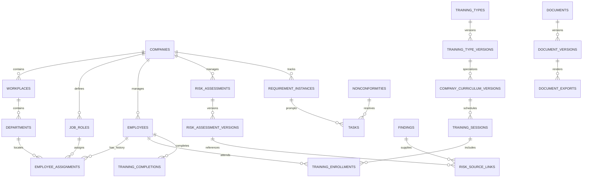

ERD kavramsal ana ilişkileri gösterir; her tablo grubu çizilmemiştir. Belge ile domain kaydı bağlantısında yüksek bütünlük gerektiren ilişkiler için somut FK taşıyan bağlantı tabloları tercih edilir. Denetlenmeyen `entity_type/entity_id` ikilisiyle başka firmaya bağlantı kurulmasına izin verilmez.

### 12.7. Index ve sorgu ilkeleri

Başlangıç index adayları: `(company_id, archived_at, id)`, `(company_id, workplace_id, status, due_on, id)`, `(company_id, employee_id, completed_on DESC)`, `(company_id, document_type, created_at DESC)`, outbox için işlenmemiş kayıt partial index'i. Bunlar ölçümden sonra kesinleştirilir; bütün kolonlara index eklenmez.

Portföy kartları ayrı toplulaştırılmış projeksiyondan okunur; her açılışta 30 firmanın bütün eğitim/evrak tablolarına N+1 sorgu yapılmaz. RLS performans planları hem küçük hem büyük firma fixture'larında ölçülür. Cursor pagination kullanılır; istemci sayfalama boyunca yetki değişimini de dikkate alır.

### 12.8. Tek sahip, rapor kişileri ve hesap silme

Üretimde `companies.user_id` tek veri sahibidir. Müşteri/işveren/çalışan/taşeron hesabı, firma üyeliği, dış görev erişimi ve rol daveti geliştirilmeyecektir. Bir başka uzman kendi hesabıyla kaydolursa ilk uzmanın firmalarını ad/e-posta eşleşmesi üzerinden devralamaz.

Rapor kişisi; `contact_person`, gerektiğinde `company_contacts` ve çıktıdaki `report_people_snapshot` verisidir. Ad, unvan, belge rol etiketi ve gerekiyorsa çalışan referansı bulunabilir; Auth FK, giriş bilgisi, OTP, `accepted_at`, alıcı inbox/push token veya dış onay endpoint’i bulunmaz. Düzenleyen/onaylayan/imzalayan isimlerinin çıktıda yer alması kişinin uygulama içinde onay verdiği anlamına gelmez.

Yeni domain verisi açılmadan önce `request-account-deletion`, `process-account-deletion-queue`, `account-deletion-complete` ve `retention-cleanup` yeni kapsamla test edilir. Var olmayan paylaşım modelini kaldırmak için üretimde rastgele DROP yapılmaz. Depoda daha önce uygulanmış bir dış erişim yolu bulunursa önce kullanım/izin envanteri, kapatma ve veri koruma planı hazırlanır; [A0] böyle bir yolun varlığını kanıtlamıyor.

### 12.9. Güncel yatay modeller

Auth alias, plan/legacy/bonus/kota, analitik/hata, güvenli dosya, otomasyon kuralı, referral ve kişisel not/hatırlatıcı aileleri §36'da bu modele eklenir. Kişisel owner erişimi firma domaininden bağımsızdır; aynı domain için ikinci bir source-of-truth kurulmaz.

---
## 13. API, RPC ve olay sözleşmeleri

### 13.1. Önerilen uçlar

Aşağıdakiler yeni sözleşme adlarıdır; henüz mevcut fonksiyonlar değildir. Aynı alanın basit okuma işlemleri uygun RLS ile PostgREST'ten yapılabilir; kritik çoklu mutasyonlar kontrollü RPC/Edge üzerinden yürür.

| İşlem | Önerilen API / RPC | Başlıca kontrol |
|---|---|---|
| Firma bağlamlarını listele | `isg-company-contexts` | Kullanıcının yetkili firmaları, plan ve modül erişimi. |
| Firma modül tercihini değiştir | `isg-set-module-preference` | Tercih değişir; mevzuat sonucu doğrudan yazılmaz. |
| Çalışan ve görevlendirme kaydet | `isg-save-employee` / `isg-change-assignment` | Firma, departman, görev FK; zaman çakışması ve optimistic version. |
| Özel eğitim tanımla | `isg-save-training-type` | Sistem kataloğuna yazamaz; kaynak etiketi zorunlu. |
| Firma müfredatını yayımla | `isg-publish-curriculum` | Üst konu, alt içerik, kaynak sürümleri ve değişmez yayın. |
| Eğitim oturumu kaydet | `isg-save-training-session` | Aynı firma katılımcıları ve dondurulmuş program sürümü. |
| Eğitimi tamamla | `isg-finalize-training` | Süre, konu, yöntem, katılım, sınav ve kanıt kontrolü. |
| Risk sürümü yayımla | `isg-publish-risk-version` | Dosya temizliği, güncelleme türü, gerçek tarihler ve mevcut sürüm. |
| Uygunsuzluk mutasyonu | `isg-mutate-nonconformity` | Durum geçişi, atama ve kapanış yetkisi. |
| Yükümlülük incelemesi | `isg-review-requirement` | Gerekçe/kanıt; keyfî hukuki muafiyet yazımı yok. |
| İçe aktarmayı incele/uygula | `isg-preview-import` / `isg-commit-import` | Eşleme, hedef sürüm, hata politikası, idempotency. |
| Belge üret | `isg-request-document-export` | Belge türü, yetki, snapshot, format ve kota. |
| Belgeyi kesinleştir | `isg-finalize-document` | Storage nesnesi, hash/size/MIME, işlem durumu ve kayıt. |
| Belge paylaş | `isg-create-share-grant` | Alıcı/kapsam, süre, yetki ve veri minimizasyonu. |
| Süre/portföy özeti | `isg-dashboard-summary` | Yetki + skor sürümü + son hesaplama zamanı. |

### 13.2. Ortak mutasyon zarfı

```json
{
  "contract_version": 1,
  "company_id": "uuid",
  "workplace_id": "uuid-or-null",
  "client_mutation_id": "uuid",
  "expected_version": 3,
  "client_platform": "ios",
  "client_build": "release-build",
  "payload": {}
}
```

`user_id`, `actor`, entitlement, rol ve kesin mevzuat sonucu istemciden güvenilir kabul edilmez; doğrulanmış oturum ve sunucu verisinden çıkarılır. Aynı `client_mutation_id` farklı body hash'iyle tekrar kullanılırsa hata verilir. Aynı içerikle tekrarlanırsa önceki güvenli sonuç döndürülür.

Hata ailesi: `AUTH_REQUIRED`, `COMPANY_ACCESS_DENIED`, `CAPABILITY_DISABLED`, `CROSS_COMPANY_REFERENCE`, `VERSION_CONFLICT`, `VALIDATION_FAILED`, `RULE_REVIEW_REQUIRED`, `DOCUMENT_NOT_READY`, `QUOTA_EXCEEDED`, `JOB_PENDING`, `RETRYABLE_FAILURE`. Yetkisiz kullanıcıya nesnenin varlığı veya başka firma bilgisi sızdırılmayacak hata ayrıntısı verilir.

### 13.3. Olay sözleşmesi

```json
{
  "event_id": "uuid",
  "event_type": "risk_assessment.version_published",
  "schema_version": 1,
  "company_id": "uuid",
  "aggregate_type": "risk_assessment",
  "aggregate_id": "uuid",
  "aggregate_version": 4,
  "occurred_at": "2027-07-15T08:30:00Z",
  "actor_user_id": "uuid",
  "payload": {
    "revision_kind": "full_renewal",
    "risk_version_id": "uuid"
  }
}
```

Kayıt ve outbox olayı **aynı DB transaction'ında** oluşturulur. Tüketim en az bir kez olabilir; tüketici `event_id + consumer_name` benzersizliğiyle tekrar etkisini önler. “Exactly once” ağ garantisi vaat edilmez. Kuyruk mesajı silme, sonuç persist etme ve hata durumları mevcut analiz worker'ındaki sağlamlık yaklaşımıyla test edilir.

Ağ yanıtı kaybolduğunda kullanıcıya ikinci eğitim/iki belge/iki ücret üretmeyin. İş durumu sorgulanabilir olmalı; bilinmeyen ağ sonucunda aynı idempotency anahtarıyla tekrar denenmelidir.

### 13.4. V4 sözleşme genişlemesi

§36.3 yeni Auth/plan/ölçüm/dosya/otomasyon/referral/kişisel iş uçlarını tanımlar. Ortak idempotency zarfı korunur; Auth parolası ve recovery token'ı genel olay veya audit gövdesine kopyalanmaz.

---

## 14. Mevzuat, yükümlülük ve süre motoru

### 14.1. Kural kaydı

Her yayımlanan kural şu bilgileri taşımalıdır:

```text
rule_code, version, jurisdiction, subject_type
source_title, official_url, article_reference, retrieved_at, source_checksum
published_on, effective_from, effective_to, verified_by, verified_at
applicability_expression, required_input_fields
calculation_expression, date_basis, interval_unit, interval_value
exceptions, transition_policy, confidence_status, publication_status
```

Kural ifadeleri sınırlı bir DSL/şema ile doğrulanır; kullanıcı veya uzaktan içerik arbitrary SQL/JavaScript çalıştıramaz. `draft → reviewed → published → superseded/withdrawn` akışı vardır. Başlık ve tarih aynı göründü diye eski kural yerinde değiştirilmez.

İlgili AI/standart kataloğunda mevcut `private.standards_registry` kullanılabilecek kaynak metadata'sı taşımaktadır. Ancak fotoğraf motorundaki standard uygulanabilirliği ile işyerinin hukukî yükümlülük motoru aynı semantik değildir. Yeni kural kaydı eski registry'ye kaynak referansı verebilir; aynı tablonun anlamı sessizce değiştirilmez. [A0, Ek A]

### 14.2. Tarih türleri

**Yasal takip tarihi** `statutory_due_on`; **uzmanın erken hedefi** `operational_target_on`; **belgenin üzerinde yazan tarih** `document_declared_expiry_on`; **takvim hatırlatma zamanı** `notify_at` ayrı alanlardır.

Kullanıcı daha erken hedef koyabilir. Daha geç kendi hedefi belirlemesi yasal tarihi silmez; aradaki fark görünür. Kaynak doğrulanmamış tarih “beyan edilen tarih” etiketi taşır. Bir belgenin düzenlenme, imzalanma ve yüklenme tarihinden hangisinin kuralın başlangıcı olduğu açıkça tanımlanır.

Yıl/ay hesabı, `365 * yıl` veya `30 * ay` ile yapılmaz. Tarih bazlı kurallar takvim aritmetiğiyle, bildirim zamanları `Europe/Istanbul` veya firma saat dilimi üzerinden hesaplanır. Ay sonu ve artık gün davranışı rule testlerinde sabitlenir.

### 14.3. Hesaplama akışı

1. İşyeri bağlamını ve etkin sınıflandırma kaydını al.
2. İlgili tarihteki yayımlanmış kural sürümünü seç.
3. Gerekli bilgiler eksikse `needs_review` üret; varsayılan uygunluk verme.
4. Uygulanabilirlik ve kabul edilen kanıtı belirle.
5. Kaynak olay tarihini seç; ilgili son tarih ve operasyon hedefini hesapla.
6. Sonucu kaynak veri sürümleriyle kaydet; benzersiz dönem anahtarıyla görev üret.
7. Önceki hesaba bağlı bekleyen bildirimleri iptal/güncelle.
8. Skor ve takvim projeksiyonlarını yenile.

Bir günlük cron doğrulama turu kaçmış olayları yakalar; ana mekanizma olayla tetiklenen güncellemedir. Görev üretimi `(requirement_id, period_key, action_kind)` için benzersiz olmalıdır.

### 14.4. Mevzuat değişikliği ve kullanıcı önerileri

Mevzuat takip ekranında yeni kaynak/etkilenen modüller/değişiklik özeti/yürürlük tarihi görüntülenir. Kaynak değişikliklerinin otomatik bulunması gelecekte ayrı iş olabilir; yeni hüküm uzman incelemesi olmadan bütün firmalara yayımlanmaz.

Yayımlanan değişiklik için etki simülasyonu yapılır: kaç firma, çalışan ve görev etkilenecek? Yeni tarih eskiye göre ne kadar farklı? Geriye dönük hangi belgeler korunacak? Önce shadow hesap, sonra onaylı yayın yapılır.

Öneriler ilk aşamada kurala dayalıdır: eksik firma bilgisi, bitmek üzere belge, göreve yeni gelen çalışanın eğitim ihtiyacı, risk sürümü sonrası müfredat incelemesi. AI metin özeti isteğe bağlı geliştirilebilir; kaynak göstermeyen mevzuat iddiası veya otomatik resmî karar üretmez.

---

## 15. Evrak, arşiv, PDF/XLSX ve şablonlar

### 15.1. İki rapor dünyasını bozmadan birleştirme

Eski analiz raporları mevcut `reports` ve `register-report` akışında kalır. Yeni eğitim/atama/izin/kurul/plan belgeleri `documents` ailesinde tutulur. Rapor merkezi bunları yetki kontrolünden sonra birleştiren okuma modeli kullanır. Eski tabloya `analysis_id=NULL` açıp bütün eski istemcileri etkileyen genelleştirme ilk yaklaşım değildir.

### 15.2. Belge kimliği ve sürümü

Bir mantıksal belgenin kalıcı `document_id`'si bulunur. İçerik ve dosya sürümleri farklı ID taşır. Taslak, dışarıdan yüklenen nüsha, hazırlanmış çıktı, imzalı nüsha ve eski sürüm birbirinden ayrılır. Belgenin kullanıcı tarafından “güncel” seçilmesiyle gerçek mevzuat geçerliliği aynı alan değildir.

Nihai çıktı snapshot'ında firma adı/logo dosya sürümü, adres, işyeri/sınıf, çalışan adı ve o tarihteki unvanı, içerik, şablon sürümü, kural sürümü, düzenleme tarihi ve belge numarası saklanır. Logoyu sonradan değiştirmek eski PDF'leri değiştirmez.

Numara önerisi: firma/işyeri + belge türü + yıl + sıra. Sayaç transaction güvenli olmalı; yeni numara formatı eski analiz raporu numaralarını yeniden yazmamalıdır.

### 15.3. Dosya güvenliği

V4'te yeni dosyalar için **ayrı private `isg-quarantine` ve kontrollü final `isg-documents` hattı** esas alınır; import ve logo amacı upload intent'te ayrıca sınırlanır. §31; MIME/parser/antivirüs, boyut, erişim, hash, sandbox, signed original ve cleanup sözleşmesinin tek ayrıntılı kaynağıdır. Eski `{user_id}/...` Storage yolları ve bucket policy'leri topluca değiştirilmez.

Yeni yol adını bilmek erişim sağlamaz; şirket yetkisi ve belge/asset FK'si doğrulanır. Taranmamış/scan arızalı dosya paylaşılmaz veya import edilmez. Yeni nihai dosya aynı path üzerinde upsert edilmez. Önceki V2 bucket adları yalnız adaydı; aynı işlev için paralel, farklı güvenlik seviyesinde ikinci depo oluşturulmaz.

### 15.4. Üretim akışı

```mermaid
flowchart LR
    A[Belge türü ve kaynak kayıt] --> B[Yetki ve şablon sürümü]
    B --> C[Değişmez içerik snapshot'ı]
    C --> D[Çıktı işi ve kota rezervasyonu]
    D --> E[PDF veya XLSX renderer]
    E --> F[Private karantina / kontrollü çıktı]
    F --> G[Hash - boyut - güvenlik taraması ve doğrulama]
    G --> H[Belge çıktısını kesinleştir]
    H --> I[İndirme - paylaşım - bildirim]
```

Küçük mevcut analiz PDF üretimi yerel cihazda korunur. Yeni çok sayfalı/toplu firma belgeleri için ortak sunucu snapshot'ı ve şablon sözleşmesi kullanılmalıdır. Ağır render/import işleri Edge Function isteği içinde sınırsız çalıştırılmaz; Supabase çalışma sınırları doğrulanarak kuyruğa bağlı uygun worker ayrılır. [T3]

PDF/XLSX üreticisi iki platformda aynı kayıt, sıra, tarih, yuvarlama ve içerik sürümünü kullanır. Türkçe karakter, uzun firma adı, çok satırlı eğitim başlığı, sayfa taşması, farklı logo oranları ve imza boşlukları görsel testlere alınır.

### 15.5. “Tüm çıktılar PDF ve Excel” kapsamı

Yapılandırılmış listeler, eğitim kayıtları, risk maddeleri, kontrol sonuçları, atamalar, toplantı kararları, zimmetler ve form verileri hem PDF hem XLSX olarak verilebilir. XLSX'te gerekiyorsa özet, ayrıntı, katılımcılar ve kaynak/sürüm sayfaları olur.

Dışarıdan yüklenen taranmış imzalı PDF'nin Excel karşılığı **metadata ve ilişkili alan tablosudur**; imzanın, belge özgünlüğünün veya bütün görüntünün düzenlenebilir Excel'e dönüştürüldüğü iddia edilmez. Bir eğitim belgesi XLSX'e aktarılınca resmî belge türü değişmez.

### 15.6. İmza, arşiv ve dışarıya dosya paylaşımı

Uygulamadaki kayıt, çizilmiş imza görseli ve güvenli elektronik imza aynı değildir. İlgili eğitim düzenlemesinin belge/imza şartları kaynak üzerinden incelenir; bu plan dışarıda imzalanmış nüshanın uzman tarafından yüklenmesiyle çalışır. Firma yetkilisine uygulama içi imza/onay isteği gönderilmez. [L5]

Uzman PDF/XLSX veya taranmış güvenli asıl dosyayı kendi yetkisiyle indirir ve işletim sistemi paylaşım menüsüyle e-posta/WhatsApp’a aktarır. Alıcı raporda isim olarak görünür; uygulamaya kayıt olması, kod girmesi veya cevap vermesi istenmez. Özel rapor görüntüleme portalı, alıcı doğrulama linki veya dış kullanıcı hesabı bu planda yoktur. İstemcinin kendi dosyasını indirmesi için kısa ömürlü signed URL kullanılabilir; bu bir alıcı portalı değildir.

`share_sheet_opened` yalnız paylaşım ekranının açıldığını kanıtlar. “Yetkili okudu/onayladı/imzaladı” olayı üretilmez. Uzman dışarıdan gelen imzalı nüshayı ayrıca kaydeder. Gönderilmiş dosya geri alınamaz; kullanıcıya gönderim öncesi dosya/isim/firma önizlemesi sunulur. Otomatik WhatsApp Business veya karşı tarafa uygulama bildirimi bu sürüme eklenmez.

## 16. İçeri aktarma ve eşleme

### 16.1. İlk desteklenecek veri türleri

Çalışanlar, departman/görev listeleri, geçmiş eğitimler, dış sertifikalar, ekipman envanteri/kontrol kayıtları ve seçilmiş belge metadata'sı. XLS, XLSX ve CSV ilk yapılandırılmış import formatlarıdır; şablonlar sürümlenir. DOC/DOCX/PDF/fotoğraf yükleme ve arşivleme desteklenir fakat bunlardan otomatik personel/eğitim çıkarımı bu format desteğinin kendiliğinden parçası değildir. Sağlık verisi kolonları ve sağlık belgesi türleri import sözleşmesinde yer almaz.

### 16.2. Dört adımlı kullanıcı akışı

**Yükle ve güvenlik taramasını tamamla → Kolonları eşle → Önizleme/hataları düzelt → Onaylayarak uygula.**

İlk adım §31’in karantina hattıdır. Güvenlik amaçlı sandbox parser çalışabilir; tarama bitmeden iş verisine dönüşüm/import ve kullanıcı önizlemesi çalışmaz.

İlk adımda dosyanın hangi firmaya ve işyerine ait olduğu seçilir. Dosyanın içindeki bir `company_id` değeri kullanıcı yetkisini veya seçilen hedefi değiştiremez. Firma kodu ile çoklu import ileri özellikse her hedef için ayrı yetki doğrulaması gerekir.

Önizleme, yeni kayıt/güncelleme/atlanacak/hatalı satır sayısını açıkça gösterir. Aynı ad-soyada göre otomatik çalışan birleştirme yapılmaz; firma personel kodu veya kullanıcı onaylı eşleme kullanılır. Dış dosyada bilinmeyen eğitim türü için kullanıcı özel eğitim yaratabilir veya mevcut türle eşleyebilir.

### 16.3. Eğitim import kuralları

Eğitim tarihi, oturum türü, süre birimi, eğitici, katılım/başarı, belge düzenleyen ve dayanak dosya birbirinden ayrılır. Bir Excel satırında “tamamlandı” yazması bütün yasal koşulların doğrulandığı anlamına gelmez. Yeterli kanıt yoksa kayıt geçmiş veri olarak alınır; doğrulama bekleyen statüde tutulur.

Özel eğitim koşulları dosyayla geliyorsa mevcut sistem kataloğuna yazılmaz; uzman kataloğunda yeni sürüm açılır. Geçmiş temel eğitimler kayıt tarihine uygun katalog/transition incelemesine bağlanır. Bugünkü tehlike sınıfı geçmiş belgeyi geriye dönük yeniden üretmez.

### 16.4. Teknik güvenlik ve hata davranışı

Formül çalıştırılmaz, makro açılmaz, haricî bağlantı izlenmez. ZIP bombası/sıkıştırılmış XLSX boyutu, satır/kolon sayısı ve hücre uzunluğu sınırlandırılır. XLSX/CSV dışa aktarmasında formül enjeksiyonuna yol açabilecek kullanıcı metinleri güvenli metin olarak yazılır.

Tarih için Türkçe/gün-ay-yıl biçimi, Excel seri tarihi, saat dilimi ve ondalık ayırıcı açıkça ayrıştırılır. “01/02/2027” gibi belirsiz içerik sessizce yorumlanmaz. Sağlık alanı tespit edilen desteklenmeyen sütunlar uyarıyla reddedilir; keyfî JSON alanına saklanmaz. Herhangi bir serbest dosyada sağlık verisi bulunmadığını yalnız kolon filtresiyle garanti etmek mümkün değildir; yükleme yönergesi, tür kısıtı ve şikâyet/silme süreci de gerekir.

İş anahtarı firma + dosya hash'i + eşleme sürümü + kullanıcı işlem ID'sidir. Büyük dosya parça parça işlense bile her satırın sonucu ve checkpoint'i tutulur. Varsayılan doğrulama yaklaşımı hatalı satırları önizlemede düzeltmektir; kısmi uygulama seçeneği açık kullanıcı onayıyla ve hata XLSX'iyle yapılır.

İçe aktarma geri alma; yalnız ilgili job'ın oluşturduğu ve sonradan başka işlemle değiştirilmemiş kayıtlar için güvenli telafi işlemidir. Sonraki kullanıcı değişikliklerinin üstüne eski snapshot yazan kör rollback kullanılmaz.

---

## 17. Bildirimler ve otomasyonlar

### 17.1. Yeni bildirimlerin mevcut sistemle ilişkisi

Mevcut APNs/FCM token, tercih, locale ve gönderim bileşenleri korunur. Yeni `private.isg_notification_jobs` son tarih/görev olayları için kullanılır. Mevcut reminder/campaign CHECK'lerini aşmak amacıyla eğitim hatırlatması `first_analysis_reminder` diye etiketlenmez. [A0, §11 ve Ek B]

Yeni uygulama içi kutu iş olaylarının okunma/ertelenme durumunu saklar. Push yalnız kullanıcıyı ilgili kayda götürür; kaydın kendisinin tek kanıtı push değildir. Push gösterimi veya teslimi garanti edilemez; takvim ve uygulama içi görev listesi esas görünüm olarak kalır.

### 17.2. Önerilen bildirim kategorileri

Takip tarihleri, kullanıcı planları, eğitim/sertifika süreleri, uygunsuzluk sorumlu adı/kapanış takibi, belge hazır ve import sonucu operasyonel kategorilerdir. Ürün rehberliği, yeni özellik ve uygulamaya geri dönüş mesajları niteliğine göre etkileşim/pazarlama olabilir; otomatik operasyonel sayılmaz. Ayrıntılı izin/kategori/yayın sözleşmesi §32'dedir. Tercihler kullanıcı/firma/kategori/kanal düzeyinde tasarlanır; örneğin bir firma için haftalık özet, diğerinde ayrıntılı uyarı seçilebilir.

Başlangıç ön uyarı adayları 30/14/7/1 gün olabilir; bunlar mevzuat hükmü değil ürün varsayılanıdır. Uzman değiştirebilir. Sessiz saatler, saat dilimi, özet tercihleri ve bildirim yoğunluğu sınırı vardır.

### 17.3. Gönüllü kullanım davranışı

Gönüllü modül için hatırlatma kapalı başlayabilir. Açılırsa başlıkta kullanıcı planı olduğu belirtilir. Gönüllü toplantı yapıldı/yapılmadı olayları ana skor motoruna yükümlülük tamamlama olayı olarak gönderilmez. Ancak kullanıcının oluşturduğu gerçek görevler operasyon listesinde bulunabilir.

### 17.4. Tekrarlı gönderim ve tarih değişikliği

Dedupe anahtarı önerisi: `recipient + requirement_instance + schedule_version + channel + offset`. Gönderimden hemen önce kullanıcının yetkisi, görev durumu, geçerli tarih sürümü, tercih ve token tekrar kontrol edilir. Sadece kuyruğa eklenme anında kontrol yeterli değildir.

Risk değerlendirmesi veya eğitim geçerlilik tarihi değiştiğinde önceki `schedule_version` iptal edilir. Eski kuyruk mesajı daha sonra çalışsa bile gönderici güncel sürüm kontrolüyle durdurur. Ağ belirsizliğinde sağlayıcıya aynı bildirimi sınırsız tekrarlama yok; retry, backoff ve dead-letter stratejisi uygulanır.

### 17.5. Derin bağlantılar

Yeni bağlantı sözleşmesi firma ve kaynak kimliğini taşıyabilir; doğrudan erişim yine sunucuda doğrulanır. Eski istemci yeni rota tipini bilmeyebilir. Bu nedenle minimum destekleyen build'e göre yeni rota gönderilir; eski sürümde yalnız mevcut güvenli genel ekran kullanılır veya mesaj atlanır; dış belge portalı açılmaz. Bağlantı payload'ında çalışan sağlık/kimlik bilgisi veya açık belge içeriği taşınmaz.

### 17.6. V4 otomasyon genişlemesi

Admin rule DSL, simulate/shadow/canary, bütün uygun hesaplara yayın, legacy üretici devri, kanal tercihleri ve yoğunluk sınırları §32'de; kullanıcının kişisel not/hatırlatıcıları §34'te tanımlıdır. Eski kullanıcının kapalı tercihi açılmaz, eski binary'de bulunmayan rota uzaktan icat edilmez.

---
## 18. Firma skoru ve istatistikler

### 18.1. Skorun adı ve iddiası

Önerilen ad: **“Takip Edilen İSG Süreçleri Puanı”**. “İşyeriniz %100 mevzuata uygundur” veya “Tüm İSG yükümlülükleri tamam” ifadeleri kullanılmaz. Sağlık gözetimi ürün dışında olduğu için puan zaten bütün İSG alanlarını kapsamaz. Kullanıcının takip etmediği diğer zorunlulukları da otomatik karşıladığı varsayılmaz.

Her skor kartı kapsamı, kullanılan politika sürümünü, değerlendirilen tarihi, eksik bilgi sayısını ve hariç tutulan modülleri gösterir.

### 18.2. Önerilen hesap

Önce her süreç alanında doğrulanmış tamamlanma oranı hesaplanır. Böylece yüzlerce çalışan eğitimi, diğer bütün firma yükümlülüklerini sayısal olarak ezmez.

```text
A = uygulanabilirliği doğrulanmış, ürünün takip kapsamındaki zorunlu süreç alanları
r_d = d alanında geçerli kanıtla tamamlanmış gereklilikler / değerlendirilecek gereklilikler
w_d = yayımlanmış politika sürümündeki d alanı ağırlığı

Puan = 100 × Σ(w_d × r_d) / Σ(w_d), d ∈ A
```

Örnek ağırlık taslağı: risk değerlendirmesi 25; eğitim 25; acil durum 15; ekipman kontrolleri 15; atama/temsil 10; uygulanabilir kurul ve yıllık süreçler 10. Bu sayılar **ürün önerisidir**, mevzuat puanı değildir. Yayın öncesi saha senaryolarıyla dengelenir.

Gerekli olduğu bilinen fakat belgesi/verisi eksik bir yükümlülük paydadan çıkarılmaz; tamamlanma katkısı sıfır olur. Doğrulanmış uygulanmama, gerekçesiyle paydadan çıkarılır. Uygulanabilirlik için zorunlu veriler eksikse kesin puan yerine “Değerlendirme bekliyor” veya açıkça geçici puan gösterilir. Payda sıfırsa `— / değerlendirilecek kayıt yok` gösterilir; 100 verilmez.

Belge varlığı, süresi dolmamış olması, gerekli kapsamı taşıması ve uzman incelemesi ayrı kontrollerdir. Sırf dosya yüklenmesi, rapor çıktısı alınması veya eğitim planlanması tamamlama sayılmaz. Kritik açıklar, ortalama puan yüksek olsa bile bağımsız görünür uyarı olarak kalır.

### 18.3. Gönüllü kullanım etkisi

Gönüllü kurul/toplantı, özel olarak isteğe bağlı eğitim veya ek kontrol listesi ana skorun pay ve paydasına girmez. Bunları kullanmak puanı artırmaz; kullanmamak düşürmez. İstenirse **“Firma İçi Plan Tamamlama”** adlı ikinci ve açıkça özel politika puanı geliştirilebilir; ana puanla karıştırılmaz.

Bir özel eğitim belirli görev için gerçekten zorunluysa, kullanıcı eğitime isim vermiş diye değil doğrulanmış uygulanabilirlik/eşleme nedeniyle ana takip kapsamına alınabilir. Kullanıcının yalnız firma içi şartı olması halinde operasyon puanında kalır.

### 18.4. Tarihçe ve karşılaştırma

`score_policy_version`, `calculated_at`, girdi kayıt/sürüm referansları, alan ağırlıkları, uygulanan/uygulanmayan/belirsiz maddeler ve kaynak veri sayıları saklanır. Politika değişince eski puanlar yerinde güncellenmez. Grafiklerde politika veya kapsam değişikliği işaretlenir.

Firma karşılaştırmalarında farklı tehlike sınıfı/çalışan yapısı olan firmaların ham puanını tek başarı sırası diye pazarlamayın. Kapsam ve veri güvenilirliği görünür olmalıdır. “Yeni modül açınca 20 puan düştü” durumunun gerçek değişiklik mi, yeni veri kapsamı mı olduğu açıklanır.

### 18.5. İşlevsel istatistikler

Yaklaşan son tarihler, geçerli eğitim kapsaması, doğrulama bekleyen belgeler, görev bazlı eksikler, termininde kapanan uygunsuzluklar, yaşlandırma analizi, firmaya göre iş yükü ve dışa aktarma faaliyetleri gösterilir. Sağlık istatistiği, muayene kapsaması veya klinik risk skoru eklenmez.

---

## 19. Gizlilik, yetkilendirme ve veri yaşam döngüsü

### 19.1. Sağlık kapsamı negatif kabul şartı

Bu sürümde aşağıdakiler bulunmayacak: `medical_examinations`, `health_records`, `fitness_for_work`, sağlık raporu geçerliliği, tanı alanları veya bu anlamı taşıyan farklı isimli tablolar; hekim menüsü; muayene import şablonu; sağlık bildirim kuralı; sağlık puan bileşeni.

Serbest not ve dosya yükleme alanında da kullanıcıya sağlık/klinik veri yüklememesi gerektiği açıklanır. Destek kaydı/log/AI prompt'una klinik belge gönderilmemesi için içerik türü ve veri minimizasyonu politikası uygulanır. Yalnız alanları kaldırmak, serbest dosyalarla böyle veri hiç gelmeyeceğini garanti etmez; hatalı yükleme için silme ve inceleme prosedürü gerekir.

### 19.2. Diğer kişisel veriler devam eder

Çalışan adı, iletişim, görev, eğitim geçmişi, imza ve kimlik bilgileri kişisel veri doğurur. Veri sorumlusu/veri işleyen rolleri, amaç ve erişim sınırları sözleşmeyle belirlenmelidir. Türkiye dışındaki bulut/AI/e-posta/analitik servislerine veri akışı ayrıca incelenir; sağlık takibini kaldırmak KVKK değerlendirmesini ortadan kaldırmaz. Yurt dışına aktarım mekanizması yalnız genel bir onay kutusuna indirgenmez. [L8]

Bu yayında ATT gerektiren çapraz şirket reklam takibi yapılmaz. Meta/attribution client ve server yolları denetlenip tracking gönderimleri kapatılır. Birinci taraf olayları içerik minimizasyonuyla tasarlanır; pseudonymous kullanıcı ID'si içeren analitiğin tamamen kişisel verisiz olduğu iddia edilmez. Çalışan/firma belgeleri, parola ve token'lar analitik payload'a girmez. Ayrıntı §§29–30. [A0, §§3, 12, 15]

### 19.3. Yalnız uzman erişim modeli

| Aktör | Yetki |
|---|---|
| Uzman — uygulama hesabının sahibi | Kendi firmaları ve süreçleri; kendi bağımsız not/hatırlatıcıları; kendi abonelik ve analizleri. |
| Firma yetkilisi / çalışan / eğitici / taşeron | **Uygulama aktörü değildir.** Sadece uzmanın girdiği belge/ana veri kişisidir; giriş, görev alma, onay veya erişim yok. |
| Mevcut platform admin/destek personeli | Firma tarafı değildir. Mevcut scope/MFA/audit ile sınırlı platform işletimi; varsayılan içerik erişimi yok. |
| Sistem worker’ı | Doğrulanmış iş kapsamı ve hizmet yetkisi; uygulama kullanıcısı/kurum yetkilisi değildir. |

Davet kampanyası yalnız yeni **uzman hesabı** kazandırır; firma paylaşmaz. Çalışan temsilcisi veya sorumlu kişi seçmek Auth kullanıcısı davet etmez. Kişisel notların hiçbir iş verisiyle FK’si veya otomatik içerik aktarımı yoktur.

### 19.4. RLS ve ayrıcalıklı fonksiyon kontrol listesi

RLS tüm yeni istemciye açık tablolarda etkin olmalı. SELECT ve mutasyon yetkileri ayrılır. UPDATE için hem mevcut satır erişimi hem yeni değer kontrolü gerekir. Rol/grant kararında kullanıcının değiştirebildiği metadata kullanılmaz. Hesap silme/devre dışı bırakma ve firma sahipliği önemli işlemlerde taze sunucu verisinden doğrulanır. [T1]

Gereken `SECURITY DEFINER` fonksiyonlarında dar yetki, açık actor kontrolü, sabit/güvenli `search_path`, tam nitelikli tablo adları ve PUBLIC EXECUTE iptali uygulanır. İstemciye açık view'lar RLS'yi dolanmamalı; desteklenen PostgreSQL sürümünde `security_invoker` veya eşdeğer kapalı erişim yaklaşımı seçilir. Service-role istemcide bulunmaz. [T1]

Storage policy, belge satırı ve company scope uyumlu olmalı. Başka uzmanın veya erişimi sonlandırılmış hesabın yeni signed URL alamadığı test edilir. Daha önce verilmiş URL'nin TTL boyunca erişim davranışı açıkça hesaba katılır.

### 19.5. Arşiv, hesap silme ve saklama

Aktif iş kaydı, arşivlenmiş belge, imzalı nüsha, teknik log ve staging import dosyası için farklı saklama politikası gerekir. Bütün İSG belgeleri için tek sabit yıl sayısı uydurulmaz. Kural ve sözleşme bazlı saklama matrisi, üretime çıkış öncesi onaylanır.

Mevcut `request-account-deletion` ve worker zinciri yeni veri alanlarını içerecek şekilde genişletilir. Kullanıcının kimliğini silmek ile firmanın hukuken saklaması gereken evrakın kaderi ayrı değerlendirilir. Gereken veri aktarımı/kimliksizleştirme/silme kullanıcıya açıklanır; otomatik hesap silme işlevi sessizce devre dışı bırakılmaz.

Retention işi canlı süreç belgesini eski fotoğraf/raw AI politikasıyla yanlışlıkla temizlememelidir. Her temizleme işi önce aday raporu/dry-run üretir; referanslı ve saklama kapsamında olan nesnelere dokunmaz. Silme olayları minimum gerekli audit ile kaydedilir.

### 19.6. Yedek ve felaket kurtarma

DB yedeği, Storage dosyalarını otomatik olarak içermez; Supabase bunu ayrıca belirtmektedir. Bu nedenle DB, belge nesneleri ve gerekli şablon/konfigürasyon sürümleri birlikte geri yüklenebilir olmalıdır. [T5]

RPO/RTO değerleri ürün sahibi ve operasyon kapasitesiyle kararlaştırılır. Henüz ölçülmemiş kurtarma süresi garanti olarak yazılmaz. En az bir geri yükleme provası ve belge hash doğrulaması olmadan yeni evrak sistemi üretime hazır kabul edilmez.

---

## 20. iOS / Android entegrasyonu ve çevrimdışı davranış

### 20.1. iOS

[A0]'daki `RiskDetectedApp`, `RootView`, `AppState` ve mevcut servisler korunur. `AppState` içine tüm yeni domain mantığı yığılmaz. Önerilen yeni alanlar `App/Features/Company`, `Employees`, `Training`, `RiskAssessments`, `Documents`, `Tasks` gibi feature klasörleri veya mevcut repo kuralına uyumlu eşdeğerlerdir.

`CompanyContextStore` aktif firma/işyerini; domain servisleri API sözleşmesini; feature view-model/state katmanı ekran durumunu taşır. Büyük `AnalysisResultHubView` ve `PDFReportService` üzerinde kapsam dışı refactor yapılmaz. Yeni belge servisi ile eski analiz PDF servisi açık adapter üzerinden ayrılır.

### 20.2. Android

Mevcut `core/data` ve `feature/*` ayrımı sürdürülür. Yeni `feature/company`, `employees`, `training`, `tasks`, `documents`, `riskassessment` benzeri modüller repo bağımlılık kurallarına göre eklenir. Ortak DTO ve erişim/saat/dosya modelleri uygun `core` katmanında bulunur.

Typed route'lara company/workplace context eklenir; UI yalnız ViewModel/Repository üzerinden erişir. `WorkManager` dosya aktarımının devamı için kullanılabilir; sunucuda verilmiş işin tamamlanma otoritesi olmaz. Push token/engagement/release gate mevcut akışları korunur.

### 20.3. Parite

Bir modülün ilk sürümü iki platformda aynı temel işlemleri desteklemeden yayın kapısından geçmez: listele/ekle/düzenle/versiyonla/filtrele/çıktı al/hata gör. Özel platform farkları tasarımda açıklanır; yalnız bir platformda veri kaybettiren eksik işlem kabul edilmez.

Uzun eğitim konu listeleri, Türkçe karakterler, büyük yazı, ekran okuyucu, küçük telefonlar, boş/hata/yükleniyor durumları ve karanlık tema test edilir. Firma değiştirme ve yanlış firmada form hazırlamayı engelleyen bağlam görünürlüğü özellikle test edilir.

### 20.4. Çevrimdışı ilk sürüm sınırı

İlk sürümde son açılan kayıtların sınırlı okunması ve taslak form/not hazırlama desteklenebilir. Hukuki tamamlama, yeni güncel risk sürümü yayımlama, paylaşım yetkisi açma, belge kesinleştirme ve puan değiştirme işlemleri sunucu doğrulaması olmadan tamamlanmış gösterilmez.

Yerel taslaklar kullanıcı+firma kapsamında şifreli/sınırlı saklanır. Oturum değişiminde temizlenir veya yeni kullanıcıya erişim verilmez. Senkronizasyonda `expected_version` kullanılır; çakışma “son yazan kazanır” ile imzalı/güncel kaydın üstüne yazılmaz. Kapsam dışında kalan tam çevrimdışı ortak düzenleme ileri faz kararıdır.

### 20.5. V4 native parite

Aynı hesapta parola/alias/recovery (§26), plan/legacy görünümü (§27), hata zarfı (§30), scan durumları (§31), notification route/preference (§32), referral (§33) ve kişisel not/hatırlatıcı (§34) iki platformda aynı backend sözleşmesini kullanır. Yerel bildirim/izin ve UI davranışları platform sınırlarına uyar; native Auth listener ve güvenli session deposu değiştirilmez. Kullanıcı tasarım dosyaları §35'teki teslim kapısıyla uygulanır.

---

## 21. Yeniden markalama ve abonelik sürekliliği

### 21.1. Marka katmanı

`BrandConfiguration` önerisi: görünen ad, kısa ad, logo/ikon asset anahtarları, renk/tipografi token'ları, destek adı, yeni kullanıcı karşılama metni, alt modül etiketleri ve belge footer'ı. Ürün ID, DB tablo adı, OAuth kimliği, bundle/package, deep-link şeması bu nesneden değiştirilmez.

**İSG Adası** ismi kesinleşmeden veri modeline marka bağımlı anahtarlar yayılmaz. Marka/alan adı/mağaza adı uygunluğu ve ticari hak kontrolü ayrı iş paketidir; bu belge isim hakkı müsaitliği araştırması yapmış değildir.

### 21.2. Görünen isim ile teknik kimliğin ayrımı

Apple uygulama kaydı/bundle kimliği ve Android application ID sürekliliği korunarak görünen marka unsurları güncellenir. Platform belgeleri kimlik ve mağaza bilgilerini ayrı ele almaktadır. [T6, T7]

Ancak **tek bir remote flag bütün cihazlardaki ikon ve launcher adını aynı anda değiştiremez**. Mağaza metadatası, dağıtılan binary ve uygulama içi ekran yapılandırması farklı katmanlardır. iOS ve Android mağaza onayları da eşzamanlı garanti edilemez. Eski ve yeni sürümlerin bir süre birlikte çalışması tasarıma dahildir.

### 21.3. Kontrol matrisi

| Alan | Korunacak | Değişebilecek / kontrol |
|---|---|---|
| iOS | Bundle ID, store uygulama kaydı, signing/team ilişkileri, keychain grupları | Görünen ad, ikon, mağaza açıklama/görselleri ve uygulama içi marka. |
| Android | Production applicationId, mağaza kaydı, imzalama sürekliliği, gerekli provider authority'leri | `app_name`, launcher/adaptive icon, açıklama ve görseller. |
| Auth | Supabase proje ve kullanıcıları, Apple/Google provider bağlantıları | Kullanıcıya görünen marka, e-posta şablonu; redirect testleri şart. |
| Bağlantılar | Eski URL scheme/universal/app links desteği | Yeni domain eklenebilir; eskisi erken kaldırılmaz. |
| Push | APNs topic/application kimliği, FCM uygulama bağlantısı, token ilişkileri | Görünen mesaj metni; yeni route yalnız destekleyen build'e. |
| RevenueCat | App User ID, mevcut ürün/entitlement kimlikleri ve restore | Görünen paket açıklamaları ve ayrıca onaylanan yeni yetenekler. |
| Raporlar | Eski belge numarası, dosya ve içerik snapshot'ı | Yeni belgelerin marka şablonu; firma logosu baskın kurumsal bağlam. |
| Legal/destek | Eski kabul kayıtları ve erişilebilir destek kanalı | Yeni kapsamın aydınlatma/koşulları, sürümlü kabul ve güncelleme bildirimi. |
| Analitik | Geçmiş ölçümün doğru anlamı ve kanıt/provenans | Yeni birinci taraf event'ler; ATT gerektiren eski gönderimler sürdürülmez; §29. |

### 21.4. Abonelik ve kapasite kararı — V4

**Kesin kullanıcı kararı:** Aktif mevcut Plus/Pro aboneleri uygulamayı güncellediklerinde bütün yayımlanan ana İSG modüllerine erişir. Yeniden kayıt/satın alma veya ürün değiştirme gerekmez; hesap/veri/RevenueCat kimlikleri korunur. Daha yüksek eski kapasite veya geçerli kullanım yeni 3/30 aday sınırıyla azaltılmaz.

**Araştırma sonucunda önerilen başlangıç:** Plus ve Pro korunur; onaylı defter, atama yazıları, kontrol listeleri dahil bütün modüller her ikisinde açıktır. Yeni satışlarda fark Plus 3/Pro 30 aktif firma, mevcut farklı AI kotaları ve onaylanacak depolama kapasitesidir. Aylık/yıllık devam, haftalık yok; uygun Plus ürününde 7 günlük deneme. Mevcut fiyat/ürün ID/analiz kotaları ilk yayında korunur. Ayrıntılı sözleşme, legacy floor, store uygunluğu ve deney planı **§27**; quota settlement **§28**.

### 21.5. Tasarım sahibinin belirlenmesi

Logo, UI, screenshot, ikon ve marka varlıkları kullanıcıdan gelir. Bu dosyalar gelmeden Codex nihai marka tasarımı üretmez. Domain/backend işi sürebilir; final görsel yayın kullanıcı teslimi ve §35 onayına bağlıdır.

---

## 22. Canlı kullanıcıları koruyan geçiş planı

### 22.1. Geliştirme sırasında üretim sınırı

**Varsayılan kural:** Yeni domain geliştirmesi local ve ayrı staging ortamında yapılır. Üretime migration, feature flag, cron, marka veya plan değişikliği geliştirme kolaylığı için uygulanmaz. Üretimde zorunlu bir eski ürün arızası düzeltmesi gerekiyorsa bu genişleme projesinden ayrı küçük hotfix olarak onaylanır.

Supabase ortam ve migration akışı ayrı ortamları destekler; mevcut 463 migration'ın geçmişi korunur. Staging kurulurken eski migration zinciri temiz ortamda uygulanabiliyor mu kontrol edilir. Gerekirse incelenmiş şema başlangıcı hazırlanır; üretim migration geçmişi resetlenmez. [A0, §2; T2]

Staging gerçek kullanıcı verisi yerine sentetik/anonimleştirilmiş fixture kullanır. Üretim e-posta, push, RevenueCat veya hesap silme worker'ları staging'den çalıştırılamaz. Sandbox ve production ortam anahtarları/endpoint'leri CI seviyesinde allowlist ile ayrılır.

### 22.2. Build stratejisi

Production bundle/package aynı kalır. Test için aynı kimlikli TestFlight/Play test dağıtımı ve ayrılmış test cihazları kullanılabilir. Aynı kimlikli test yüklemesinin cihazdaki üretim kurulumunu etkileyebileceği hesaba katılır. Yan yana geliştirme için ayrı QA kimliği ancak **yalnız test konfigürasyonunda ve açık onayla** kullanılabilir; üretim kimliği değişmez.

Mağazaya yeni markalı build, yeni kapsam tamamlanmadan sırf hazırlık için yayımlanmaz. İnceleme hesaplarında özellikler şeffaf şekilde gösterilir; inceleme sürecini yanıltan gizli açılış tasarlanmaz.

### 22.3. Aşamalı teknik geçiş

**Expand:** Yeni tablolar, yeni API/RPC ve yeni indeksler eklenir. Eski alanlar/sözleşmeler kaldırılmaz. Yeni servisler varsayılan kapalıdır. Bu adım dahi yalnız yayın hazırlığı onayı sonrasında üretimde uygulanır.

**Migrate:** Gerekli firma başlangıç ayarları ve varsayılan işyeri verileri küçük, tekrar çalıştırılabilir backfill partileriyle oluşturulur. Eski analizler otomatik “tam risk değerlendirmesi” yapılmaz. Eski raporlar yeniden render edilmez. Sonradan oluşan legacy firma kayıtları için lazy initialization veya kaçırılmış kayıtları yakalayan güvenli senkron gerekir; bir defalık backfill yeterli kabul edilmez.

**Activate:** İki mobil platform hazır, kurallar onaylı ve test kapıları geçmişse önce iç test hesapları ve onaylı pilotlar açılır. Yeni kabuk kullanıcı/account bazında; firma modülleri company bazında ve build desteğiyle kontrollüdür. Geliştirme bitmeden gerçek kullanıcılara pilot yükümlülük verilmez.

**Contract:** Eski alan/API kaldırılması bu ana yayın kapsamı değildir. Eski istemci kullanım verileri ve ayrı onay olmadan kaldırma yapılmaz. Eski mobil sürümlerin okunabilir/yazılabilir sözleşmeleri desteklenir.

### 22.4. Feature flag ilkeleri

Önerilen anahtarlar: `isg_shell_v1`, `isg_company_core_v1`, `isg_training_v1`, `isg_risk_versioning_v1`, `isg_documents_v1`, `isg_optional_modules_v1`, `isg_score_v1`, `isg_notifications_v1`, `isg_brand_v1`.

Flag'ler yalnız UI gizleme değildir; yeni API de yetenek ve rollout kontrolü yapar. Eksik/okunamayan yeni flag yeni özelliği açmaz. Buna karşılık yeni flag hatası eski fotoğraf analizi/abonelik akışını kapatmamalıdır. Flag yapılandırması erişim yetkisinin yerini tutmaz.

İç hesap → gönüllü pilot → sunucu cohort genişlemesi önerilir. Örneğin %1/%5/%25/%100 sunucu açılışı kullanılabilir; bu oranlar mağazanın kendi phased/staged dağıtım özellikleriyle aynı şey değildir. Platform ve firma tutarlılığı için deterministik atama yapılır.

### 22.5. Migration operasyon güvenliği

Her migration'ın beklenen lock süresi, geri dönüş/telafi planı, etkilenen tablo büyüklüğü ve eski istemci etkisi yazılır. Büyük tablo yeniden yazımı, bloklayan indeks ve uzun transaction üretim saatinde rastgele çalıştırılmaz.

`CREATE INDEX CONCURRENTLY` yazmaları klasik indeks oluşturma gibi engellememe avantajı sağlar; fakat transaction bloğu içinde çalıştırılamaz ve başarısızlıkta geçersiz indeks bırakabilir. Kullanılacak migration runner ile uyumu ve sonrasında indeks geçerliliği kontrol edilir. [T4]

`lock_timeout` ve `statement_timeout`, batch büyüklüğü ve tekrar deneme sınırları hazırlanır. FK/check doğrulamaları tablo büyüklüğüne göre kademelendirilir. `NOT VALID` oluşturmanın bütün kontrol türlerinde aynı davranışı olduğu varsayılmaz. Üretimde `db reset`, rastgele `DROP`, geçmiş migration düzenleme veya otomatik schema repair yasaktır.

### 22.6. Eski sürüm desteği

Yeni istemci yeni endpoint'leri kullanır; eski istemci mevcut analiz/rapor uçlarını kullanmaya devam eder. Eski read decoder'larının yeni nullable alanlara ve enum değerlerine davranışı test edilir. Legacy enum'a yeni değer eklemek bile eski mobil decoder'ı kırabilir; yeni domain enum'ları ayrı tutulur.

Geliştirme sırasında minimum sürüm artırılıp kullanıcı zorla yükseltilmez. Daha sonra gerçek güvenlik veya destek gerekçesi varsa ayrı kullanıcı iletişimi ve onaylı emeklilik planı gerekir. Eski ürünü çalıştırmak için yeni firma onboarding'ini zorunlu hale getirmeyin.

### 22.7. Hata halinde geri dönüş

Yeni job üretimini durdur, yeni modül yazmalarını daralt, yeni kabuk/özellik açılışını duraklat ve sorunlu deploy'u önceki uyumlu sürüme al. Ancak yeni sistemde oluşmuş kayıtların görüntülenmesini kaybettirmeyin: minimum yeni belge/takip okuyucusu veya güvenli salt okunur bakım görünümü korunmalıdır.

Şema değişikliklerinde varsayılan geri dönüş **roll-forward düzeltme** ve özellik kapama yaklaşımıdır. Kod hatası için üretim DB'sini eski yedeğe dönmek arada oluşan eski/yeni kullanıcı verisini kaybettirir; rutin rollback yöntemi değildir. Gerçek felaket kurtarma ayrı onaylı süreçtir.

Mağazada yayımlanmış binary'yi bütün cihazlardan anında geri alamazsınız. Bu yüzden sunucu kill-switch, uyumlu endpoint ve yeni veri için salt okunur kurtarma yolu yayın öncesi test edilmelidir.

### 22.8. Gözlem ve durdurma kriterleri

Üretim baseline'ına karşı: auth başarı oranı, analiz tamamlama/latency, PDF/XLSX başarısı, purchase/restore, RLS hataları, DB lock/CPU, kuyruk yaşı ve mobil crash-free kullanım izlenir. Yeni metrikler eski ürün metriklerini gölgelememeli.

Firma dışı veri erişimi, yanlış kişiye belge, veri kaybı, yanlış ücretlendirme veya yanlış hukuki tarih gösterimi **derhal durdurma** sebebidir. Performans eşikleri pilot öncesi ölçüme göre sayısallaştırılır; bu belgede ölçülmemiş SLA garanti edilmez. Düşük pilot hacminde yalnız yüzde metrikleriyle başarı ilan edilmez; senaryo kanıtı da gerekir.

### 22.9. V4 yayın sırası ek kapısı

Auth ek yolları, legacy hak mapping, tracking denetimi, güvenli dosya ve admin teşhis önce staging'de birlikte doğrulanır. Genel yeni sürüm yayını başladığında aktif eski aboneler keyfi deney cohort'u nedeniyle ana modüllerden dışlanmaz. İç pilot/canary önce tamamlanır; operasyonel güvenlik kill-switch'i ayrı kalır. Ayrıntılı runbook §37.4'tedir.

---
## 23. Fazlar, bağımlılıklar ve Codex iş paketleri

### 23.1. Faz akışı

Bütün aşağıdaki geliştirme fazları, aksi ayrıca onaylanmadıkça **local/staging** üzerinde yürür. Faz bitmesi üretime deploy yetkisi vermez. Takvim tahmini; gerçek repo, ekip kapasitesi ve kapsam belirlendikten sonra çıkarılmalıdır. Codex'in kod yazma hızı, mevzuat onayı ve fiziksel cihaz testinin yerine geçmez.

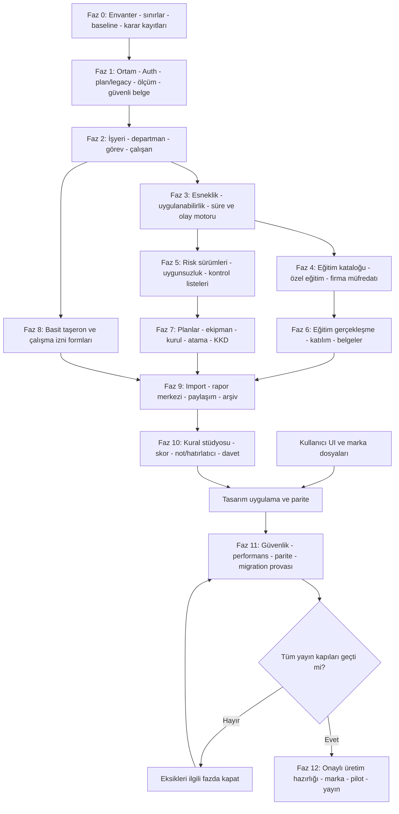

V4 yatay iş paketleri WP-15–WP-23, §37.1'de bu fazlara bağlıdır; Auth/ölçüm/güvenli dosya sona ertelenmez. Şemadaki paralellik, aynı ortak dosyaları eşzamanlı kontrolsüz düzenlemek anlamına gelmez. Eğitim ve risk ekipleri aynı olay/DB sözleşmesi üzerinden çalışır; ortak contract değişikliğinin tek sahibi belirlenir.

### 23.2. Faz teslim matrisi

| Faz | Somut teslim | Giriş koşulu | Çıkış kapısı |
|---|---|---|---|
| 0 | Mimari/admin/Auth farkı, gerçek plan/mağaza limitleri, tracking çıkışları, negatif sağlık kapsamı, kimlik manifesti ve baseline | Repo ve [A0] erişimi | Gerçek mevcut dosyalar/şema doğrulandı; kapsam uyuşmazlıkları kaydedildi. |
| 1 | Ayrı staging, v1 DTO, Auth ek yolları, plan/legacy resolver, analitik/hata temeli, belge metadata ve güvenli tarama hattı | Faz 0 onayı | Prod hedefleyen yanlış komut CI'da duruyor; RLS negatif testleri geçiyor. |
| 2 | Firma/işyeri/departman/görev/çalışan CRUD ve tarihçe, iki mobil ekranda seçim | Firma erişim modeli hazır | 30 firma fixture'ında doğru scope; geçmiş unvan değişmiyor. |
| 3 | Modül tercihi, üç durumlu uygulanabilirlik, kullanıcı şartı, görev/son tarih/outbox motoru | Ana kayıtlar | Gönüllü kurul örneği ana skordan bağımsız; tekrar işlem mükerrer görev üretmiyor. |
| 4 | Sistem/özel eğitim türleri, 2026 kural seed taslağı, Ek-1 eşleme, G4 firma müfredatı | Kural sürümleme | Süre/konu/yöntem kontrolleri ve firma izolasyonu testli; içerik uzman onayı kayıtlı. |
| 5 | Risk dokümanı sürümleme, AI kaynak bağlantısı, uygunsuzluk ve checklist | Güvenli belge/scan, erişim ve süre temeli | Tarama/kısmi/tam yenileme ayrımı; 409 eşzamanlılık ve tarih testleri geçiyor. |
| 6 | Eğitim plan/oturum/katılım/sınav kaydı/tamamlama, dış sertifika, PDF/XLSX | Faz 4 | İlk/tekrar ve özel eğitim E2E; uygun olmayan kayıt otomatik sertifika olmuyor. |
| 7 | Acil durum, tatbikat, ekipman, yıllık plan, toplantı, atama, KKD, sözleşme, defter | Görev/evrak motoru | Ortak çalışan-belge bağlantıları; her yayınlanan yasal kural için kaynak onayı. |
| 8 | Taşeron kayıt/iş bağlantısı; izin formu oluşturma, PDF ve imzalı nüsha arşivi | Çalışan ve güvenli belge/scan temeli | İnteraktif izin/sağlık kontrolü yok; aynı çalışan tekrar yaratılmıyor. |
| 9 | Güvenli import, birleşik rapor merkezi, arşiv, firma logolu şablonlar, paylaşım | Domain E2E'leri | Mükerrer import yok; firma bazlı çıktı doğru; yetkisiz link erişimi yok. |
| 10 | Admin bildirim stüdyosu, kutu, not/hatırlatıcı, referral, skor; kullanıcı tasarımının uygulanması | Domain/kota olayları güvenilir; final UI için tasarım teslimi | İzin/dedupe, reward, kişisel RLS ve OS paritesi testli; gönüllü kullanım skoru etkilemiyor. |
| 11 | Fiziksel iki platform, Auth/ödeme ve ATT’siz ağ testi, güvenli upload, admin, deletion/backup ve migration provası | Tüm hedef kapsam staging'de tamam | Kritik hata yok; eski sürüm regresyonu ve geri dönüş provası geçti. |
| 12 | Onaylı additive hazırlık, legacy hak eşlemesi, iki mağaza build/metadata; iç pilot sonrası tüm güncelleyen aktif eski abonelere açılış | İnsan yayın onayı | Eski kullanıcı metrikleri korunuyor; yeni kayıt bütünlüğü doğrulanmış; destek runbook'u hazır. |

### 23.3. Repo düzeyinde çalışma paketleri

| Paket | İlk dosya/katman hedefi | Üretilecek kanıt |
|---|---|---|
| WP-00 | `docs/isg/BASELINE_DIFF.md`, mevcut [A0] yolları | Gerçek repo ile kaynak doküman farkı. |
| WP-01 | `docs/isg/adr/` | Sahiplik, belge modeli, esneklik, skor kapsamı, marka kararı ADR'leri. |
| WP-02 | `contracts/isg/v1/`, örnek fixture'lar | Swift/Kotlin/Edge sözleşme uyumu. |
| WP-03 | `supabase/migrations/`, `supabase/tests/` | Firma/departman/görev/çalışan migration ve cross-tenant pgTAP testleri. |
| WP-04 | Yeni `_shared/isg-*` ve ilgili RPC'ler | Auth/capability/version/idempotency ortak testleri. |
| WP-05 | Eğitim katalog seed kaynağı, `docs/isg/legal/` | Kaynak checksum, sürüm, inceleyen ve örnek alt konu planı. |
| WP-06 | Eğitim domaini ve iki platform feature'ı | Temel/özel eğitim yaratma → tamamlama → çıktı E2E. |
| WP-07 | Risk domaini, mevcut analiz aktarım adapter'ı | Eski analiz değişmeden yeni sürüm/tarih hesapları. |
| WP-08 | Document renderer/worker, template fixtures | Aynı snapshot'tan iki format, doğru firma logosu ve taşma testleri. |
| WP-09 | Import parser/preview/commit worker | Hatalı/mükerrer/sağlık kolonlu/cross-company dosyalarla test. |
| WP-10 | Yeni notification dispatcher adapter ve mobil routes | Tercih, dedupe, eski build fallback ve tarih iptali. |
| WP-11 | Score projection ve dashboard | Denominator/ağırlık/uygulanmama/belirsizlik fixture'ları. |
| WP-12 | `request-account-deletion`, ilgili worker ve retention testleri | Eski ve yeni veri kapsamının kayıpsız/kurallı yaşam döngüsü. |
| WP-13 | `RootView` / `RdNavHost` / shell ve kullanıcıdan gelen brand assets | Eski-yeni kabuk regresyonu; kimlik değişmezlik ve kullanıcı tasarım eşlemesi. |
| WP-14 | `docs/isg/runbooks/`, release manifest | Migration, pilot, rollback/roll-forward ve restore provası. |

Yollar önerilen yeniler için örnektir. Depoda bulunmayan dosyalar “zaten var” kabul edilmez. Mevcut code style, test komutları ve modül adları keşif sonrasında kullanılır.

### 23.4. Codex çalışma protokolü

Her iş paketi için sırasıyla **oku → etki analizi → küçük uygulama → test → kanıt → inceleme** uygulanır. Büyük feature dalında bütün sistemi bir defada değiştirmek yerine korumalı ana dal ve kısa ömürlü PR'lar kullanılır. Ana dala merge olmak üretime otomatik DB deploy anlamına gelmemelidir.

Önce kurulu CLI ve `--help` doğrulanır; yeni migration `supabase migration new <name>` ile oluşturulur ve repo prosedürüne göre hazırlanır; isim örnekleri `isg_company_core_expand`, `isg_training_catalog_v1`, `isg_risk_versioning_expand` olabilir. Oluşan timestamp çakışmaları ve migration sırası CI'da denetlenir. Mevcut geçmiş migration değiştirilmez.

Tek PR için önerilen kapsam: bir domain dilimi, onun migration/API/iki mobil akış adaptasyonu, testleri ve flag'i. Bütün domainleri tek PR'a koymayın. Altyapı paketleri tamamlanmadan yarım UI'yı gerçek kullanıcılara açmayın.

**Her PR açıklamasında:** değişen sözleşme, veri etkisi, eski istemci etkisi, feature flag, migration lock tahmini, test sonucu, bilinen sınır ve geri dönüş adımları bulunur. Test çalıştırılamadıysa “geçti” yazılmaz; ortam eksikliği açıklanır.

### 23.5. Definition of Done

Bir iş paketinin tamamlanması için veri modeli ve izinleri, başarılı/hatalı API senaryoları, iOS/Android temel paritesi, yükleniyor/boş/hata durumları, erişilebilirlik, audit, idempotency, belge/süre etkisi ve ilgili regresyon testleri bitmiş olmalıdır. Mevzuat içeriği olan paketlerde kaynak ve insan içerik onayı ek kapıdır.

“Codex kodu yazdı”, “build alındı” veya “ekran açılıyor” tek başına Done değildir. Üretime dokunan her adım ayrıca insan onayı ister.

---

## 24. Kabul testleri ve yayın kapıları

### 24.1. Son kullanıcı revizyonlarının zorunlu senaryoları

| Test | Senaryo | Beklenen sonuç |
|---|---|---|
| REV-01 | Çalışan profili aç | Departman/görev var; sağlık muayenesi/uygunluk alanı yok. |
| REV-02 | Eğitim kataloğunda sağlık konu grubu | Müfredat kapsamındaki konu grubu var; kişisel sağlık durumu sorulmuyor. |
| REV-03 | Zorunlu olmadığı doğrulanmış firmada kurul modülünü aç | Gündem/tutanak/PDF kullanılabiliyor; mevzuat zorunluluğu değişmiyor. |
| REV-04 | Gönüllü toplantı ekle, ertele, sil/pasife al | Ana puanın pay/paydasında hiçbir değişiklik yok. |
| REV-05 | Gerçekte zorunlu modülü gizle | Yükümlülük kaydı ve uyarısı silinmiyor. |
| REV-06 | Uygulanabilirlik bilgisi eksik | “Zorunlu değil” veya kesin 100 puan verilmez. |
| REV-07 | Özel eğitim oluştur | Başlık, hedef personel/görev, süre, geçerlilik ve şartlar kaydedilebilir. |
| REV-08 | Özel eğitime “Temel İSG” adı ver | Mevzuat şablonunu aşmaz; otomatik hukuki eşdeğerlik yok. |
| REV-09 | MYK hazırlık eğitimi tamamla | MYK yeterlilik belgesi üretildi denmez; dış belge ayrı kayıt. |
| REV-10 | İki firmada farklı G4 alt konuları | Firma içerikleri birbirine karışmaz; üst grup ve min süre korunur. |
| REV-11 | İlk eğitim: az/tehlikeli/çok tehlikeli | 8/12/16 ders saati eşiği doğru. |
| REV-12 | Düzenli tekrar: üç sınıf | 8 ders saati tabanı; G4 2/3/4 alt sınırı doğru. |
| REV-13 | G4 süresini toplam eğitimin üzerine iki kez saydır | Sistem çift sayımı engeller. |
| REV-14 | Tehlikeli sınıfta G4'ü yalnız uzaktan işaretle | Doğrulama hatası; uygun tamamlanmış statüsü verilmez. |
| REV-15 | Aynı çalışan için çakışan eğitim segmentleri | Süreler iki kez krediye dönüşmez. |
| REV-16 | Eski, 2026 öncesi eğitim belgesi içeri aktar | Mevcut katalogla sessizce yeniden yazılmaz; eski kaynak/inceleme durumu korunur. |
| REV-17 | Risk belgesini altı ay sonra tam yenileme olarak doğrulayarak yükle | Yeni esas sürüm; gerçek tarih bazında uygun takip hesapları yenilenir. |
| REV-18 | Aynı risk belgesini daha iyi tarama olarak yükle | Dosya varyantı değişir; genel yenileme tarihi sıfırlanmaz. |
| REV-19 | Riskte kısmi revizyon | Etkilenen kapsam/aksiyon/müfredat incelemesi güncellenir; eski tarihçe korunur. |
| REV-20 | Eski sürüm bildirimi kuyruktayken risk tarihini değiştir | Eski schedule_version gönderimi engellenir. |
| REV-21 | Çalışanı departman/görev değiştir | Yeni ihtiyaç önerilir; eski sertifikadaki unvan değişmez. |
| REV-22 | İzin formu üret | PDF/form arşivi var; “çalışma otomatik onaylandı” statüsü yok. |
| REV-23 | Taşeron çalışanını eğitim ve izin formuna ekle | Tek ana personel kaydı kullanılır; gerçek işveren ilişkisi görünür. |
| REV-24 | Sağlık alanı içeren import şablonu kullan | Desteklenmeyen alanlar kaydedilmez; kullanıcıya açık hata/uyarı verilir. |

### 24.2. Veri, güvenlik ve operasyon testleri

| Test | Senaryo | Beklenen sonuç |
|---|---|---|
| SEC-01 | A firmasına yazarken B firmasının employee/document ID'sini gönder | RLS/API/FK ile reddedilir. |
| SEC-02 | Başka firmanın dosya yolunu tahmin ederek indir | Nesne varlığı/içeriği açılmaz. |
| SEC-03 | Erişimi iptal edilmiş alıcı yeni belge URL'si istesin | Yeni erişim reddedilir; eski URL TTL davranışı belgelenir. |
| SEC-04 | Rol veya şirket ID'sini client metadata'da değiştir | Yetki yükseltmesi olmaz. |
| SEC-05 | Yetkisiz çağıran privileged RPC'yi invoke etsin | İzin yok; service-role sızıntısı yok. |
| DAT-01 | Aynı eğitim finalize isteğini ağ kesintisinden sonra tekrarla | Tek completion ve tek takip dönemi. |
| DAT-02 | Aynı risk sürümünü iki cihaz güncellesin | Tek kazanan, diğerine sürüm çakışması. |
| DAT-03 | Worker olayı üç kez işlesin | Tek görev/tek mantıksal bildirim; sonuç aynı. |
| DAT-04 | Backfill durdur/yeniden başlat | Kayıt kaybı veya mükerrer varsayılan işyeri yok. |
| DAT-05 | Backfill sonrası legacy uygulama yeni firma oluştursun | Yeni modülde güvenli lazy başlangıç; firma kaybolmaz. |
| IMP-01 | Aynı dosyayı tekrar import et | Mükerrer çalışan/eğitim üretmez. |
| IMP-02 | Formüllü/bozuk/aşırı büyük XLSX | Formül çalışmaz; sınırlı ve açıklanabilir hata. |
| IMP-03 | Eşlenen kayıt preview sonrası değişsin | Commit sürüm çakışmasını fark eder. |
| DOC-01 | Firma logosunu ve adresini değiştir | Eski belge aynı kalır; yeni belge yeni snapshot alır. |
| DOC-02 | Dosya yüklensin fakat finalization başarısız olsun | Hazır belge sayılmaz; cleanup/retry güvenli. |
| DOC-03 | Yeni atama PDF'si üret | Mevcut `reports` için sahte analiz yaratılmaz. |
| DOC-04 | Türkçe/uzun başlık/1000 satır liste | PDF taşması ve XLSX bozulması yok; büyük işler kuyrukta. |
| SCO-01 | Hiç veri yok | “Veri yok/inceleme bekliyor”; 100 puan yok. |
| SCO-02 | Zorunlu olduğu bilinen veri eksik | Paydadan düşmez; eksik olarak kalır. |
| SCO-03 | Onaylı uygulanmama ve gönüllü kullanım | Ana puanda aynı sonuç; hariç tutma gerekçesi görünür. |
| DEL-01 | Eski kullanıcı hesabını sil | Eski silme davranışı beklenen şekilde devam eder. |
| DEL-02 | Yeni evraklı kullanıcı hesabını sil | Yeni domain/Storage/saklama planı uygulanır; FK nedeniyle sonsuz retry yok. |
| OPS-01 | DB yedeği ve dosya yedeğinden test ortamına restore | Referanslar, hash'ler ve belge erişimi tutarlı. |
| OPS-02 | Yeni sistem kapalıyken eski build ile E2E | Auth, analiz, rapor, abonelik, push ve silme çalışır. |
| OPS-03 | Yeni flag servisi ulaşılamaz | Yeni özellik fail-closed; eski ürün bağımsız çalışır. |
| OPS-04 | Yeni modülü yayın sonrası durdur | Yeni veri okunabilir kalır; eski ürün bozulmaz. |
| OPS-05 | 30 firma, büyük çalışan havuzu, çoklu cihaz | Yetki izolasyonu ve sorgu performansı kabul sınırında. |

### 24.3. Yayın kapıları

**G0 — Kaynak ve kapsam:** Sağlık takibi dışarıda; eğitimdeki sağlık konuları içeride; izin/taşeron başlangıç sınırı ve gönüllü kullanım net.

**G1 — Mimari:** Eski API, sahiplik, ürün kimlikleri ve plan akışları korunmuş; yeni tablo/worker çatışmaları incelenmiş.

**G2 — Mevzuat:** Yayımlanacak otomatik kurallar kaynak, yürürlük, istisna, test ve insan incelemesiyle onaylı. Doğrulanmamış otomatik uygunluk yok.

**G3 — Güvenlik:** Firma dışı erişim testleri, dosya erişimi, import ve paylaşım kontrolleri geçiyor. Açık kritik/yüksek etkili veri güvenliği hatası yok.

**G4 — İşlev/parite:** Kullanıcının revizyon senaryoları fiziksel iOS/Android cihazlarında kanıtlı. Önceki sürüm uyumluluk matrisi tamam.

**G5 — Operasyon:** Migration ve backfill provası, iş iptali, geri dönüş, deletion ve DB+Storage kurtarma kanıtı var.

**G6 — Yayın:** Marka, fiyatlandırma/geçiş, legal metin, mağaza varlıkları, destek runbook'u ve yetkili insan yayın onayı tamam.

### 24.5. V4 ek yayın kapıları

§37.3; aynı UUID Auth/recovery, legacy bütün-modül erişimi, trial/restore, tek quota tüketimi, ATT’siz network, admin scope, malware/quarantine, notification rule/dedupe, referral abuse ve kişisel note/reminder senaryolarını ekler. Bu testler iki platformda geçmeden ilgili yeni yol genel yayına alınmaz.

---

## 25. Riskler, kararlar ve ilk uygulanacak işler

### 25.1. Risk kaydı

| Risk | Etki | Önlem / yayın engeli |
|---|---|---|
| Eğitim için eski yönetmeliğin esas alınması | Yanlış süre, içerik ve belge | 2026 sürümlü kaynak; eski eğitimler için ayrı geçiş. |
| Sağlık kapsamının başka adla geri eklenmesi | Ürün sınırı ve veri riski | Negatif şema/API/import/UI testleri. |
| Gönüllü kullanımın hukuki yükümlülük sanılması | Yanlış bildirim ve puan | Bölüm 4'teki bağımsız katmanlar. |
| Her yüklemede risk yenileme tarihinin sıfırlanması | Hatalı takip ve gecikme gizleme | Tarama/kısmi/tam yenileme ayrımı ve kanıt. |
| Firma/çalışan kayıtlarının modül bazında kopyalanması | Tutarsız personel ve yanlış evrak | Tek master kayıt, bileşik FK, snapshot sınırı. |
| Eski `reports` modelinin zorla genelleştirilmesi | Canlı PDF/XLSX akışı bozulur | Yeni belge domaini ve birleşik okuma merkezi. |
| Yeni işler için eski notification enum'larının yanlış kullanımı | Hatalı mesaj/route | Ayrı job türü; taşıyıcı adapter'ı. |
| Firma kapasitesini yalnız UI'da artırmak | Sunucu redleri ve plan tutarsızlığı | Trigger/policy/capability beraber doğrulama. |
| Paylaşılan veri ile eski owner cascade çakışması | Firma evrakı kaybı | İlk yayında ortak sahiplik yok; silme zinciri revizyonu. |
| Stage'in gerçek müşteriye push/mail atması | Kullanıcı etkisi ve veri sızıntısı | Farklı secret/project, outbound allowlist, worker varsayılan kapalı. |
| Marka değişikliğini uzaktan tam atomik varsaymak | Eski/yeni sürüm uyumsuzluğu | Store/binary/in-app ayrımı ve birlikte çalışma testi. |
| Yedeklerin yalnız DB'yi kapsaması | Dosyasız arşiv | Storage yedeği ve restore/hash provası. |
| Otomatik kural yayını | Çok sayıda yanlış son tarih | İnsan incelemesi, etki simülasyonu ve shadow hesap. |
| Kapsamın LMS/izin sistemi/OSGB ERP'ye büyümesi | Bitmeyen yayın ve teknik yük | İlk sürüm negatif kapsamı; yeni talep ayrı ADR/faz. |

### 25.2. Karara bağlanmış olanlar

Sağlık takibi yok. Temel eğitim müfredatı ve kullanıcı eğitimleri birlikte var. Firma özgü G4 alt başlıkları var. İş görevleri/departmanlar tarihçeli. İsteğe bağlı kullanım skordan ayrılmış. Risk değerlendirmesi sürümlü. Çalışma izni form seviyesi. Taşeron temel seviye. Production bundle/package değişmez. Mevcut kullanıcılar geliştirme için zorunlu geçişe tabi tutulmaz.

### 25.3. Yayın öncesi ayrıca kararlaştırılacaklar

| Karar | Önerilen varsayılan | Ne zaman kesinleşir? |
|---|---|---|
| Son marka ve RiskDetected alt adı | Teknik tasarımda nötr modül; iki görünüm seçeneği | Marka/mağaza hazırlığından önce. |
| Planlara yeni modül/firma kapasitesi | Tüm ana modüller Plus/Pro; aday 3/30 firma; legacy floor; §27 | Yeni satış metni/katalog onayı ve production capability yayını öncesi. |
| İlk pilot kitlesi | Gönüllü, kontrollü, gerçek kullanım çeşitliliği olan küçük grup | Bütün staging kapsamı ve testler bitince. |
| Mevzuat içerik sahibi | İSG alanında yetkin insan inceleyen | Katalog ilk yayını öncesi. |
| Belgelerin saklama süreleri | Belge türü, amaç ve dayanağa göre matris | İlk gerçek evrak kaydı öncesi. |
| Skor ağırlıkları | Bölüm 18 taslağı; açık kapsam etiketi | Pilot öncesi test senaryolarıyla. |
| Firma tarafı giriş/onay/portal | Kapsam dışı; hiçbir fazda uygulanmaz | Rapor kişisi sadece metin/ana veri kaydıdır. |
| Ortak OSGB/ekip sahipliği | Ana yayın kapsamı dışında; ayrı ADR | Yeni sahiplik/devir tasarımı tamamlanınca. |
| İnteraktif LMS / gelişmiş izin yönetimi | Şimdilik yok | Ayrı ürün talebi ve ayrı geliştirme fazı. |
| Ağır belge/scan worker ortamı ve kapasite | Kuyruklu, sınırlandırılmış renderer + izole tarama | Güvenlik/yük/çıktı testinden sonra. |
| UI, logo, icon, screenshot | Kullanıcı tasarım teslimi ve manifest'i esas; §35 | Final görsel uygulama/yayın öncesi. |
| V4 sayı/izin/retention/referral kararları | §37.5'teki açık adaylar | İlgili feature'ın production açılışından önce. |

### 25.4. Codex başlangıcı — domain keşif kontrol listesi

**Güncel tam başlangıç talimatı §44.5’tedir.** Aşağıdaki blok onun korunmuş domain keşif kontrol listesidir; tek başına güncel Auth/abonelik/ölçüm/güvenlik/kampanya kapsamını tamamlamaz:

```text
Önce ISG_ADASI_MASTER_INTEGRATION_PLAN_V4.md ve PROJECT_ARCHITECTURE.md dosyalarını oku.
Bu domain kontrol listesini V5 bölüm 44.5 ile birlikte uygula.
Bu işte varsayılan çalışma ortamı local/staging'dir. Production deploy, migration,
feature flag, cron, mağaza veya RevenueCat yazma işlemi yapma.

İlk görev yalnız Faz 0 keşif ve Faz 1 tasarım hazırlığıdır:
1) Gerçek repo dosyalarını ve mevcut test/operasyon komutlarını tespit et.
2) iOS production bundle ile Android production applicationId, signing bağlantıları,
   auth callback, push ve RevenueCat kimliklerini değerleri gizleyerek manifestle.
3) companies, analyses, findings, reports, notification_jobs, deletion ve retention
   yapılarını kaynak dokümanla karşılaştır; kolon/constraint/policy/trigger farkını yaz.
4) Yeni belgeler için sahte analiz kullanmayan, eski reports modelini bozmayan ADR hazırla.
5) Sağlık takibinin tamamen kapsam dışı olduğunu negatif kapsam dosyasına işle.
   Mevzuatın eğitimdeki sağlık konularını bu kapsam dışı kararla silme.
6) Kullanım tercihi, hukuki uygulanabilirlik, firma içi şart ve skoru ayrı modelle.
7) Departman/görev/çalışan tarihçesinin ve G4 firma müfredatının v1 sözleşmesini çıkar.
8) Risk dosyası tarama/kısmi/tam yenileme ayrımını ve tarih etkilerini sözleşmeye yaz.
9) 2026 eğitim kaynağını yeniden doğrula; onaysız katalog üretime yayımlama.
10) Küçük iş paketleri, testler ve bağımlılıkları raporla. Sonraki uygulama paketinin
    kapsamını ve veri etkisini açıkla; insan onayı olmadan üretime ilerleme.

Mevcut ürünün fotoğraf analizini, abonelik/restore akışını, ürün ID'lerini, geçmiş
verisini ve API anlamlarını değiştirme. Eksik veya farklı bilgi bulursan uydurma;
BASELINE_DIFF.md ve karar kaydına yaz. Çalıştırılmayan testleri geçti diye raporlama.
```

### 25.5. Korunan altı domain çıktısı

1. `BASELINE_DIFF.md`: Belge ile gerçek kod/şema farkları.
2. `SCOPE_AND_NON_GOALS.md`: Bu revizyonun dahil/hariç sınırları.
3. `ADR-001-COMPANY-ACCESS.md` ve `ADR-002-DOCUMENT-VERSIONING.md`.
4. `ADR-003-OPTIONAL-MODULES-AND-SCORING.md`.
5. `contracts/isg/v1/` altında firma, çalışan, eğitim ve risk sürümü örnek sözleşmeleri.
6. Staging kurulum planı, test matrisi ve üretime erişimi engelleyen çalışma güvenliği kontrolü.

V4 Auth, abonelik, izleme, dosya ve admin keşif çıktıları ayrıca §37.7'dedir.

**Başarı tanımı:** Uzman kendi firmalarını, çalışanlarını, eğitimlerini, belgelerini ve güvenlik süreçlerini birbiriyle bağlantılı biçimde yönetir; gönüllü süreçler zorunluluk/puan yanılgısı yaratmaz; sağlık takibi ürüne sızmaz; mevcut RiskDetected kullanıcılarının verisi, satın alınmış hakları ve çalışan akışları korunur.

### 25.6. V4 risk kaydı eki

| Risk | Önlem / yayın kapısı |
|---|---|
| Parola eklerken ikinci hesap veya receipt transferi | Aynı UUID testi, provider linking kanıtı, otomatik hesap merge yok. |
| Yeni 3/30 sınırının eski hakkı azaltması | Gerçek sözleşme + mevcut kullanım dry-run; server legacy floor. |
| ATT diyaloğu yokken Meta/CAPI verisi çıkması | SDK/manual/server ağ denetimi ve gönderim engeli; §29. |
| Taranmamış dosya veya tarama sonrası değişim | Karantina SELECT kapalı, immutable hash/promote; §31. |
| Admin kuralından mesaj fırtınası / eski tercih ihlali | DSL, simülasyon, onay, canary, dedupe/yoğunluk ve send-time tercih. |
| Sahte referral hesabı sınırsız AI maliyeti yaratır | Sunucu qualification, fraud bekleme, kampanya ve bonus tavanı. |
| Kişisel not başka uzmana sızar | Owner RLS; firma FK’si veya iş modülü bağlantısı bulunmaz. |
| Yerel alarm her cihazda kesin çalışıyor sanılır | OS izin/availability testi; dürüst teslim durumu ve fallback. |
| Kullanıcı tasarımı gelmeden final UI/mağaza yayını | Tasarım manifest'i ve ayrı final görsel onay kapısı. |


---

## 26. Sade kayıt, aynı hesapta şifre ve mevcut Auth ile uyum

### 26.1. Bağlayıcı karar ve mevcut başlangıç

Yeni e-posta kaydının ana yolu **e-posta + belirlenen şifre → e-posta doğrulama kodu → doğrulanmış aynı hesap → ana sayfa** olur. Şifreyi kayıttan sonra ikinci kez oluşturma zorunluluğu yoktur. Mevcut OTP/magic-link, Apple ve Google girişleri alternatif olarak korunur. Geçerli oturumda refresh/bootstrap çalışır; uygulamanın her açılışı yeni giriş değildir.

[A0] §§3, 6, 8, 18; Supabase Auth/PKCE, Apple/Google, oturum yenileme, mevcut AuthService/AuthRepository ve UUID tabanlı RevenueCat kimliğini doğrular. **[A0] mevcut parola ekranı, kullanıcı adı resolver’ı veya bu yeni kayıt ekranının hazır olduğunu söylemez.** Bunlar aynı servislerin kontrollü genişletmesidir; yeni Auth sağlayıcısına geçilmez.

Değişmez kimlik zinciri: `auth.users.id = profiles.id = lowercase RevenueCat App User ID`. E-posta, kullanıcı adı veya giriş yöntemi değiştiğinde firmaların ve aboneliğin sahipliği değişmez. `profiles.full_name` görünen addır; giriş kullanıcı adı değildir.

### 26.2. E-posta ile yeni kayıt — uygulama akışı

Kayıt formu: **E-posta**, **Şifre**, göster/gizle, kısa canlı şifre kontrolü; mevcut kullanım/aydınlatma akışı. Kullanıcı adı kayıt için zorunlu değildir; doğrulama sonrasında isteğe bağlı seçilebilir. Şifre tekrar alanı yerine görünürlük düğmesi/parola yöneticisi kullanılabilir; son tasarım kullanıcıdan gelir.

1. İstemci e-posta biçimini ve §26.7’deki şifre politikasını denetler.
2. Aynı Supabase Auth projesinde e-posta ve şifreyle `signUp` yapılır; e-posta doğrulama açık kalır. Parola uygulama veritabanına kaydedilmez.
3. **Confirm signup** şablonu/`auth-send-email-hook` uygun tek kullanımlık kodu gönderir. Supabase e-posta şablonunda `{{ .Token }}` doğrulama bağlantısı yerine kod göstermek için desteklenir. Kendi OTP üreteci veya doğrulama tablosu kurulmaz. [R01][R02]
4. Kullanıcı kodu girer. Auth’un desteklediği doğrulama API’siyle, yeni kayıt amacına uygun türde doğrulanır. Swift/Kotlin sürümünde `email` doğrulama türü ve mevcut wrapper imzası gerçek SDK’dan teyit edilir; login/recovery kodları birbirine karıştırılmaz.
5. Başarıda gelen session **mevcut** Auth listener, güvenli token saklama ve `AppState.bootstrap()` / Android registrar yoluna verilir. Oluşturulmuş şifre yeniden sorulmaz; parola ekleme popup’ı gösterilmez.
6. Profil ensure, legal kabul, RevenueCat identify/snapshot, mevcut onboarding/welcome idempotency aynı sırayı korur. Deneme kendi store işlemi doğrulanmadan başlamaz.

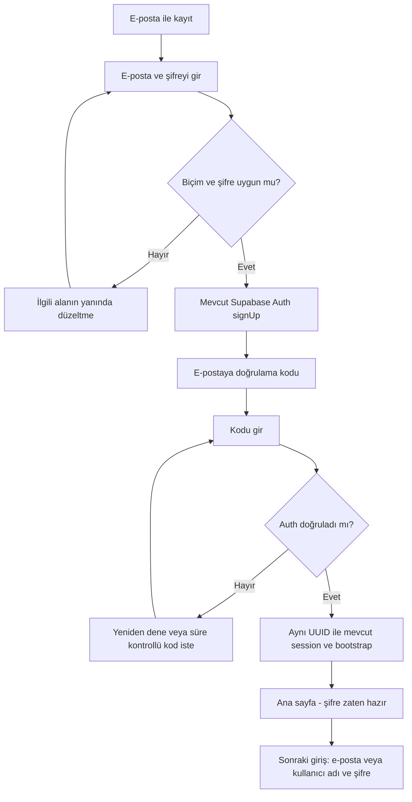

**Önemli geçiş sınırı:** Confirm-signup şablonu ile mevcut magic-link/OTP şablonu farklı amaçlar olarak korunur. Yeni kayıt ekranı uğruna eski mobil sürümün kod veya callback işlemesi bozulmaz. Auth hook’taki `email_action_type`, event hash/idempotency, retry, locale ve sender davranışı ayrı test edilir. SMTP sağlayıcısının farklı işlem e-postalarına hazır olduğu yalnız kod var diye varsayılmaz. [A0; R02]

### 26.3. Kayıt hataları ve yanlış e-posta

| Durum | Davranış |
|---|---|
| Boş/bozuk e-posta | “Geçerli bir e-posta adresi girin.” Sunucu isteği gereksiz yapılmaz. |
| Muhtemel alan adı yazım hatası | Düzeltme önerisi göster; kullanıcının adresini sessizce değiştirme. |
| Kurumsal adres, `+` karakteri, Apple relay | Geçerli biçimi sırf alışılmadık diye reddetme. |
| Kod yanlış/süresi dolmuş | Anlamlı hata; sunucunun retry/resend sınırı; doğru adresi düzenleme yolu. |
| Gönderim başarısız | “Kod gönderilemedi” ve güvenli destek kodu; “adres yok” gibi kanıtsız iddia yok. |
| E-posta düzenlendi | Önceki bekleyen kayıt/kod bağlamını terk et; yeni adresi doğrula. Doğrulanmış başka hesap değiştirilmez. |
| Aynı adresle mevcut OAuth/OTP hesabı | Yeni hesabın açıldığını veya yeni şifrenin kaydedildiğini varsayma; “Zaten hesabınız varsa giriş yapın veya kodla devam edin” alternatifini her zaman sun. |
| Ağ cevabı kayboldu | Kör tekrar kayıt/çoklu e-posta göndermek yerine bekleyen işlem/kod akışına güvenli dönüş. |
| Uygulama doğrulama öncesi kapandı | Şifreyi kalıcı taslakta saklama; kod akışına geri dönüş veya alternatif OTP girişi sun. |

Kayıtlı adres olup olmadığını dışarıya listeleyen ön-kontrol endpoint’i yoktur. Supabase mevcut OAuth hesabıyla aynı adresin yeniden kaydında gizlenmiş yanıt verebilir; `signUp` yanıtı tek başına yeni hesap/parola kanıtı sayılmaz. [R03] Doğrulanmamış hesapların temizliği ayrıca sınırlı ve güvenli planlanır; mevcut gerçek hesaplara uygulanmaz.

### 26.4. Apple ve Google sonrası isteğe bağlı şifre

Önerilen deneyim: OAuth başarıyla biter → aynı UUID ile ana sayfa tamamen açılır → diğer zorunlu ekranlar bittikten sonra **bir defalık, kapatılabilir alt pencere** gösterilir.

**Başlık:** “Bir giriş şifresi de belirlemek ister misiniz?”  
**Açıklama:** “Apple/Google ile giriş yapmaya devam edebilirsiniz. Şifre eklerseniz e-posta veya kullanıcı adınızla da giriş yapabilirsiniz.”  
**Düğmeler:** “Şifre oluştur” / “Şimdi değil”.

“Şimdi değil” seçimi ana ekran kullanımını kısıtlamaz. Aynı oturumda yeniden gösterilmez. Sonra küçük kapatılabilir ana ekran kartı veya Profil > Giriş ve Güvenlik yolu bulunur. Her girişte popup yoktur. Parola zaten varsa veya hesap yöntem durumu güvenilir biçimde belirlenemiyorsa otomatik parola popup’ı gösterilmez; kullanıcı ayarlardan kendisi açabilir.

Supabase, OAuth hesabına `updateUser({password: ...})` ile uygulama parolası ekleme yolu sunar; Google/Apple şifresi istenmez veya değiştirilmez. İşlem yeni `signUp` değildir. Oturum tazeliği/MFA/secure password change seçenekleri korunur. [R03][R04]

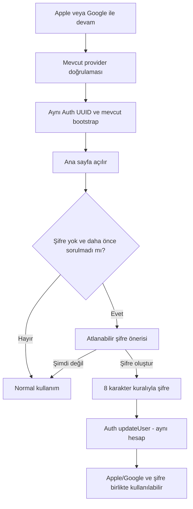

**Popup koordinasyonu:** Legal kabul, aktif satın alma ekranı, şifre önerisi ve bildirim izni üst üste açılmaz. Mevcut root/shell’e küçük bir `PresentationCoordinator` eklenir. Öncelik: zorunlu hesap/legal → kullanıcının başlattığı işlem → onboarding’deki bildirim adımı → uygun sonraki anda şifre önerisi. Onboarding bildirimi bu oturumda sorulduysa şifre önerisi ana sayfada kart olarak kalabilir. Koordinatör iş akışını yeniden yazmaz.

Apple relay adresi normal bir Auth adresidir. Şifreyi kullanıcı adıyla kullanmak relay adresini ezberleme ihtiyacını azaltır; gerçek e-posta verme zorunluluğu yoktur. Kurtarma için mevcut Apple relay gönderici/DNS ayarları test edilir. Apple ile tekrar giriş yolu her durumda korunur. [N12]

### 26.5. Mevcut OTP hesabına şifre ekleme ve recovery

Mevcut OTP kullanıcısı kodla giriş yapar; aynı atlanabilir öneri veya Profil > Giriş ve Güvenlik üzerinden şifre ekler. Geçerli session’a yeni method eklenir; eski analiz/firma/abonelik taşınmaz.

Şifremi unuttum: kullanıcı e-posta veya alias girer → genel yanıt → Auth recovery e-postası/kodu → doğrulanmış recovery akışı → yeni parola → aynı hesap. Kurtarma kodu süresi, tek kullanım, callback allowlist ve PKCE doğrulanır. Recovery ekranı açıldı diye taze kimlik doğrulama varsayılmaz; `PASSWORD_RECOVERY`/mevcut Auth event yönlendirmesi gerçek SDK’ya göre test edilir. Normal şifre girişinde ayrıca e-posta kodu yoktur; kullanıcının etkin TOTP/MFA’sı atlanmaz. [R01]

Taze oturum gerektiren değişiklikte gerektiğinde yeniden doğrulama yapılır. “Mevcut şifre zorunlu” ayarı şifresiz OAuth hesabının ilk parola eklemesini veya doğrulanmış recovery’yi kilitlememelidir. `has_password` benzeri bayrak yalnız UX durumudur; şifre doğrulama veya yetki kanıtı değildir. Auth tarafından kabul edilmiş sonuçla uzlaştırılır; istemciden gelen bayrakla işlem açılmaz.

### 26.6. Kullanıcı adı — mevcut kimlik üstüne dar katman

Kullanıcı adı isteğe bağlıdır. Öneri: 3–30 karakter, `a-z`, `0-9`, `_`, `.`; `@` yok; ayrılmış sistem adları; büyük/küçük harf normalizasyonu. `full_name` ve Türkçe görünen ad ayrı kalır. Unique alias `private.login_aliases` altında tutulur; e-posta kopyası ana veri yapılmaz.

Supabase standart parola girişi e-posta/telefon temellidir. Alias girişi için dar `auth-login-alias` gateway, kullanıcı adını sunucuda çözüp **normal Auth parola doğrulamasını** kullanır. Yanıtta doğrulanmış session gelir; e-posta resolver olarak dışarı açılmaz. Bilinmeyen alias/yanlış parola aynı genel hataya eşlenir; enumeration, timing ve rate-limit testleri gerekir. [R01; N38]

Parola yalnız TLS ve geçici bellek üzerinden iletilir. Body logging, APM payload, proxy debug ve exception dump kapalıdır; parola/OTP/recovery token ne hash olarak ne açık biçimde analitik, `profiles`, audit veya admin paneline kaydedilir. Per-request Auth client kullanılır; paylaşılan global session deposu yoktur. E-posta/Apple/Google girişi alias gateway’e bağımlı yapılmaz. Başarılı session native SDK’nın mevcut saklama mekanizmasına verilir.

Kimlik bağlama gerekirse gerçek doğrulanmış provider ilişkisi kullanılır. Aynı ad, benzer e-posta, `+`/nokta silme veya IP üzerinden hesap birleştirme yapılmaz. Farklı Apple relay ve Google e-postası kendiliğinden aynı UUID olmaz; yeni şifre eklemek de iki ayrı hesabı birleştirmez. [R03]

### 26.7. Kesin şifre politikası — sekiz karakter

**Uygulanacak kullanıcı kararı:** en az **8 karakter**, en az bir **büyük harf**, bir **küçük harf**, bir **rakam**. Özel karakter zorunlu değildir; kullanılmasına izin verilir. Uzun parola ve parola yöneticisi desteklenir, 8 tam uzunluk tavanı değildir.

Varsayılan sunucu sınıflarıyla uyumlu ilk sözleşme: gerekli büyük/küçük/rakam kümeleri `A–Z`, `a–z`, `0–9`; Türkçe ve diğer Unicode karakterler ek olarak kabul edilir fakat bu üç gerekli sınıfın yerine sayılıp sayılmadığı istemcilerde **aynı test fixture’larıyla** belirlenir. Sunucunun hazır politikasından farklı Unicode kuralı sırf UI regex’iyle vaat edilmez. İstemci parola içeriğini kırpmaz, büyük/küçük dönüştürmez veya sessizce normalize etmez.

UI metni: “En az 8 karakter; büyük harf, küçük harf ve rakam içermeli.” Formda dört kontrol göstergesi vardır. Boş/parola kurala uymuyor/genel yanlış giriş ayrılır. Yapıştırma, autofill ve göster/gizle serbesttir. Maksimum karakter/UTF-8 byte sınırı gerçek Supabase Auth/SDK ile doğrulanır; sunucunun keserek kabul ettiği uzun parolaya izin verilmez.

Supabase Auth minimum uzunluk ve gerekli karakter sınıflarını sunucuda yapılandırabilir. Kurallar yalnız ekranda değil doğrudan Auth isteğinde de uygulanmalıdır. Sızmış parola korumasının kullanılabilirliği Supabase hizmet planına bağlıdır; ürünümüzün Plus/Pro’suyla karıştırılmaz. [R04]

Sekiz karakter seçimi tek başına tam güvenlik garantisi değildir; önceki 15 karakter önerisi bu ürün için uygulanmayacaktır. Rate limit, gerektiğinde CAPTCHA, yaygın/sızmış parola kontrolü, güvenlik e-postaları ve mevcut MFA ile desteklenir. CAPTCHA veya servis planı özelliği şu anda etkinmiş gibi yazılmaz. Mevcut hesaplara zorla oturum kapatma/yeniden kayıt yoktur.

### 26.8. Uygulama sırası ve uyumluluk kapısı

Önce staging’de Auth ayarları/şablonları ve provider senaryoları; sonra mevcut `AuthService` / `AuthRepository`ye metotlar; sonra yeni kayıt ekranı; sonra OTP/Apple/Google sonrası method ekleme; en son alias/recovery/popup koordinasyonu uygulanır. Yeni SDK sürümü gerekiyorsa minimum gerekli yükseltme ayrı PR’dır.

Legacy iOS/Android OTP, yeni şifre kaydı, e-posta kodu resend, Apple relay, Google, ilk parola ekleme, parola değiştirme, recovery ve MFA; aynı UUID/RevenueCat restore ile gerçek cihazlarda geçmelidir. Auth ayarları proje geneline etkileyebilir: feature flag tek başına şablon/SMTP etkisini izole etmez. Genel Auth değişikliği eski istemci testi geçmeden üretime alınmaz. Rollback UI flag’i kapatabilir; oluşturulmuş gerçek parolaları veya kimlikleri silmez.

---

## 27. Abonelik stratejisi ve mevcut abonelerin yeni sisteme geçişi

### 27.1. Karar ve Pro'nun değer önerisi

**Plus ve Pro korunur; aylık/yıllık devam eder. Bütün ana İSG modülleri iki planda da açıktır.** İlk yayında fark; aktif firma portföyü, mevcut standart/detaylı AI kapasitesi ve yeni dosya depolamasıdır. Haftalık abonelik, yeni personel başı ücret veya eğitim oluşturma sayacı eklenmez. Uygun Plus mağaza ürününde 7 günlük deneme korunur.

Bu son tercih kullanıcının “personel/eğitim de sınırlanabilir veya başka Pro avantajı kurulabilir” sorusuna **önerimizdir**; kullanıcıya ait dönüşüm/dağılım/maliyet verisi olmadığı için bilimsel olarak en yüksek dönüşüm sağlayan model diye sunulmaz. Eğitim ve personel ana kayıtlarını kota için eksik tutmaya itmeyen; gerçek portföy ve kaynak ihtiyacında yükseltme sunan başlangıç tercihidir.

Önerilen anlatım: **Plus — az firmalı uzman için eksiksiz süreç yönetimi. Pro — yoğun portföy, daha fazla analiz ve daha geniş arşiv.** Pro'nun cazibesi onaylı defter veya atama yazısını kullanamama baskısına dayanmaz. Güvenlik, sağlık kapsam dışılığı, kişisel notlar, veri geri alma ve mevcut abone erişimi ticari ayrım yapılacak alanlar değildir.

### 27.2. Araştırma bulgusu ve yorum sınırı

RevenueCat 2026 raporu 115 binden fazla uygulama ve 16 milyar doları aşan gelir üzerinden toplulaştırılmış benchmark sunar. Rapor, 5–9 günlük denemelerde medyan denemeden ödemeye dönüşümü %37,4; dört gün ve altındakilerde %25,5 olarak bildirir. Rapordaki 2023–2024 kohortu karşılaştırmasının daha yeni kohortu için bir yıllık elde tutma medyanları yıllık %28, aylık %8, haftalık %1,2 olarak verilir. Bu retention metrikleri abonelik düzeyindedir; kullanıcı geri dönüşü değildir. Bunlar farklı uygulama/kohortların gözlemsel verileridir; deneme süresi veya paket adedi değişikliğinin nedensel etkisini kanıtlamaz. [N01]

**Bu ürüne yorumumuz:** Sürekli firma/evrak/termin takibi haftalık “bir iş yapıp çıkma” satın almasından çok devamlı kullanım gerektirir. Yedi gün başlangıç için makuldür; belge yükleyip ilk firmayı aktive etme süresi ayrıca ölçülmelidir. Haftalık seçenek ilk yayın karmaşıklığını artırır. “İki plan yaygındır” türü benchmark ifadeleri de sıklıkla aylık/yıllık teklif adedidir; Plus/Pro katmanlarının tek paketten üstünlüğüne delil sayılmaz.

### 27.3. Seçeneklerin karşılaştırılması

| Model | Avantaj | Risk | Karar |
|---|---|---|---|
| Plus temel modüller, Pro defter/atama/checklist vb. | Çok görünür özellik farkı | Uzman işini tamamlamak için yükseltmeye zorlanır; eğitim → atama → evrak zinciri bölünür; “tüm modüller” vaadi bozulur. | İlk yayın için önerilmez. |
| Plus/Pro tüm modüller; kapasite farklı | Basit değer önerisi; az firmalı kullanıcı da tam iş akışı görür; portföy büyüyünce doğal yükseltme | Firma sınırı yanlış seçilirse erken sürtünme veya Pro'ya geçiş zayıflığı | **Önerilen başlangıç.** |
| Tek Plus; aylık/yıllık | En basit seçim; paket kararsızlığı azalabilir | 1 firma ile 30 firmanın maliyet/değer farkı aynı fiyata sıkışır; mevcut Pro geçişi karmaşıklaşır | Yeterli veri sonrası kontrollü seçenek. |
| Üçten fazla katman / haftalık / eklenti kalabalığı | İnce segmentleme | İlk genişlemede anlaşılması, mağaza ve destek yönetimi güç | İlk yayında yok. |

Güvenlik düzeyi, veriye erişim hakkı, destek talebi açma, mevcut dosyaları indirme ve temel hata açıklaması hiçbir planda daha güvensiz/daha kapalı yapılmaz. Kullanıcının kendi verisini geri alması yükseltme baskısı aracı değildir.

### 27.4. Önerilen yeni satış matrisi

**Aşağıdaki sayılar fiyat/maliyet testiyle onaylanacak ürün varsayılanlarıdır; mevcut sistemde zaten uygulandıkları iddia edilmez.** AI ve eski analiz raporu değerleri ise [A0] §8'den korunmaktadır. Eski abonenin daha yüksek mevcut hakkı varsa Bölüm 27.5 koruması geçerlidir.

| Yetki / kapasite | Free / denemesiz | Plus | Pro | Plus 7 günlük deneme |
|---|---|---|---|---|
| Mevcut fotoğraf analizi | Mevcut Free hakkı | Açık | Açık | Plus erişimi |
| Tüm yeni İSG modülleri | Örnek veriyle tanıtım; mevcut kendi verisini okuma/geri alma | **Tamamı açık** | **Tamamı açık** | **Tamamı açık** |
| Onaylı defter, atama yazıları, kontrol listeleri | Önizleme | Dahil | Dahil | Dahil |
| Eğitim, risk sürümleri, planlar, KKD, izin formu, taşeron | Önizleme | Dahil | Dahil | Dahil |
| Aktif sahip olunan firma | Yeni gerçek firma açma yok; mevcut Free sözleşmesi korunur | **3** | **30** | **3** |
| İşyerleri / departmanlar / çalışanlar | Mevcut kayıtlar okunur | Firma içinde normal kullanımda ticari kişi adedi kilidi yok | Aynı işlevler | Plus ile aynı |
| Günlük Standard analiz | 1 | 10 | 40 | 10 |
| Günlük Detailed analiz | Yok | 2 | 10 | 2 |
| Mevcut analiz raporu kotası | Standard PDF mevcut sınırsız hakkı | 150/ay | 750/ay | 150/ay havuzundan; günlük güvenlik limitleri korunur |
| Yeni süreç PDF/XLSX çıktıları | Kendi mevcut verisinin geri alınması | Belge adediyle ticari kilit yok; işlem/depolama sınırları var | Aynı; yüksek portföy kapasitesi | Aynı işlevler |
| Yeni süreç evrak depolaması | Yeni şirket evrakı yükleme yok | Başlangıç adayı 5 GiB | Başlangıç adayı 50 GiB | 5 GiB üst sınır; saldırı/hız kontrolü |
| Firma içi hatırlatma / otomasyon / skor | Mevcut kayıtların takibi ve önceki tercihler korunur | Dahil | Dahil | Dahil |
| Kişisel not / kullanıcı hatırlatıcısı | Temel özellik açık | Açık | Açık | Açık |
| Davet programı | Uygun hesaplara açık | Açık | Açık | Açık |
| iOS / Android kullanımı | Aynı hesap | Aynı hesap/ortak kapasite | Aynı hesap/ortak kapasite | Aynı süre; iki deneme değil |

**“Tüm özellikler” sınırsız kaynak demek değildir.** Deneme Plus'ın bütün özelliklerini ve Plus kapasitesini gösterir. Pro ayrıca gizli bir modül açmadığı için kullanıcı Pro'nun sunduğu işlevleri de deneyimlemiş olur; 30 gerçek firmayı yedi günde yükleyip sonunda 3'e düşürmek zorunda kalmaz. Büyük portföy demo verisi ayrı, üretim sayımlarına dahil olmayan tanıtım alanında sunulabilir.

Pro için “sınırsız firma” yerine 30 aktif firma önerilir; kullanıcının 15–30 firma hedefini karşılar ve maliyet sınırını açık tutar. Daha fazlası için ileride portföy paketi/kurumsal görüşme değerlendirilebilir. Uygulanmayan bir eklenti mağazada satılmaz. Pro'nun 30 sınırının doğru değeri ücretli kullanımdaki firma dağılımıyla test edilir.

**Firma sayımı:** Bir sahip olunan ticari müşteri şirketi bir firmadır; şirketin işyerleri/departmanları ayrı müşteriler gibi faturalandırılmaz. Belgede adı geçen kişi veya çalışan bir kullanıcı/koltuk değildir; firma slotu veya kullanıcı lisansı tüketmez. Arşivlenmiş firma salt okunur kalır ve yeni iş yapmanın gizli sınırsız-firma geçidi olmaz. Ayrı müşteri şirketlerini sahte işyeri olarak eklemek ürün modeliyle desteklenmez; isim/vergino heuristiği tek başına hak kaybı yaratmaz.


### 27.4.1. Personel/eğitim kotası ve ilave Pro avantajları

| Olası ayrım | Değerlendirme | V4 başlangıç kararı |
|---|---|---|
| Toplam aktif personel tavanı | Ölçek göstergesidir; fakat çalışanları sisteme eksik kaydetmeye, eğitim kapsamasını yanlış göstermeye veya sık plan engeline neden olabilir. | İlk yayında hard-limit yok. Yalnız anonimleştirilmiş dağılım/maliyet ölçümü; sonra ayrı karar. |
| Ayda belirli sayıda eğitim | Aynı çalışan için düzenli/özel eğitim ve geçmiş import’u zorlaştırır; kanıt tutmayı ekonomik cezaya dönüştürür. | Yok. Eğitim adedi/katılım/sertifika sayısı ticari sayaç değildir. |
| Kullanıcı koltuğu | Ürün yalnız uzman için; firma yetkilisi/çalışan hesabı yok. | Yok; hayalî koltuk özelliği satılmaz. |
| Dosya depolaması | Ölçülebilir değişken kaynak maliyetine bağlıdır. | 5/50 GiB önerisi; eski daha yüksek hak korunur. |
| AI standard/detailed kapasitesi | Çalışan mevcut ayrım ve gerçek maliyet vardır. | [A0] 10+2 / 40+10 günlük hak korunur. |
| Firma sayısı | Uzmanın yönettiği ticari portföy değerini temsil eder. | Yeni satış için 3/30 önerisi. |
| Toplu rapor/import/işlem rahatlığı | Yoğun portföye değer sağlar; ana modül yerine ölçek kolaylığı olabilir. | İlk sürümde bütün ana işlevler iki planda. Sonra ölçümlü kapasite farkı denenebilir; eski aboneden özellik geri alınmaz. |
| Pro’ya hızlı destek/öncelikli render | İşletim kapasitesi gerektirir; gerçek SLA yoksa vaat riskli. | Ölçüm/onay olmadan paket vaadi yapılmaz; analiz sonucu güvenilirliği hiçbir planda azaltılmaz. |

**Teknik sınır ≠ ücretli personel kotası.** Örneğin 10.000 satır/job parser sınırı iki planda da kaynak güvenliğidir; kullanıcı açık parçalara bölerek içeri alabilir. Çoklu işte eşzamanlılık sınırlaması güvenlik/performance bilgisi olarak gösterilir, “daha çok çalışana eğitim vermek için Pro alın” mesajına dönüştürülmez.

Sunucu kataloğunda ileriye dönük `employees_limit_mode=unmetered`, `training_records_limit_mode=unmetered` gibi tipli alan bulunabilir; şu an gizli rakamsal tavan uygulanmaz. İleride personel limiti denenirse önce yalnız shadow ölçüm; çakışan görevlendirmeler/personel kodu/taşeron sayımı tanımlanır. Kullanılmış eğitimler, eski raporlar veya çalışanlar hiçbir zaman otomatik silinmez. Henüz var olmayan limit paywall’da gösterilmez.

**Pro ikna kartı:** “30 aktif firma · günde 40 standart ve 10 detaylı analiz · 50 GiB süreç arşivi · tüm İSG modülleri.” Sayılar ancak ticari onaydan sonra kullanılır. Plus ve Pro aynı kalite/güvenlik kurallarını kullanır. Verilen kapasite ürünün hâlihazırda doğrulanmış abonelik hakkıyla çatışırsa legacy üst hak geçerlidir.

### 27.5. Mevcut aboneye geçiş garantisi

**Kullanıcı tarafından bağlanan ürün kararı:** Yeni sürümü yükleyen, sunucuda geçerli Plus veya Pro hakkı bulunan mevcut abone tüm yeni modüllere kendi hesabıyla erişir. Yeni kayıt, yeni abonelik satın alma, abonelik iptali veya başka ürüne geçme zorunluluğu yoktur.

`launch_cutover_at` onaylı yayın anıdır; bu belge tarihi otomatik cutoff değildir. Cutoff'ta abonelik geçmişi ve geçerli sahiplikten idempotent bir `legacy_access_migrations` kaydı hazırlanır. Uygulamayı güncelleme zamanı veya client'ın `is_legacy=true` beyanı hak yaratmaz. Geç güncelleyen eski abone de kapsama girer.

Koruma kuralları:

1. Geçerli Plus → bütün modüller + Plus kapasitesi; geçerli Pro → bütün modüller + Pro kapasitesi.
2. Firma/analiz/rapor kapasitesi için **doğrulanmış eski sözleşme, yeni paket kapasitesi ve mevcut geçerli kullanım** karşılaştırılır; kazanılmış daha yüksek hak düşürülmez. Eski firma limitinin sayısı [A0]'da yoktur; `private.company_limit_for_user` gövdesi ve geçmiş teklif belgeleri okunmadan 3/30'a zorlanmaz.
3. Eski sözleşme gerçek sınırsız kapasite sağlıyorsa bunun özel gösterimi korunur; `NULL`/sentinel yanlışlıkla sıfır veya 30 yapılmaz. Salt bugün kullanılan sayı, satın alınmış kapasitenin tamamı yerine geçmez.
4. Aktif abonenin bu geçişte fiyatı/yenileme tarihi kendiliğinden değiştirilmez. Store ürünleri ve eski ürün kimlikleri korunur.
5. İptal edilmiş ama dönem sonuna kadar geçerli abonelik, süresi boyunca açık kalır. Doğrulanmış deneme/grace hakkı kendi zaman sınırlarıyla değerlendirilir. `will_renew=false` anında erişim kesme değildir. [N05]
6. Sahiplik kontrolü başarısız restore, `pending` ödeme veya süresi bitmiş geçmiş abonelik otomatik ücretli erişim üretmez. “Mevcut kayıtlı kullanıcı” ile “mevcut geçerli abone” ayrıdır.
7. Mevcut Free kullanıcıya istemsiz 7 günlük yenilenen abonelik başlatılmaz. Denemeyi kullanıcı mağaza ekranında açıkça başlatır.

**Önerilen ticari sınır:** Legacy kapasite koruması kesintisiz yenilenen mevcut abonelik ve izin verilen grace/restore düzeltmeleri boyunca sürer. Kullanıcının isteyerek daha düşük plana geçmesi veya abonelik sona erdikten sonra yeni sözleşmeyle yeniden başlaması yeni koşullara tabi olabilir; buna rağmen mevcut veri silinmez. Bu şart satış metni ve müşteri iletişiminde açıkça onaylanmadan uygulanmaz. Mevcut Pro hakkını kaybettiren otomatik “tek Plus'a geçiş” yoktur.

### 27.6. Abonelik, erişim hibesi ve kota birbirinden ayrı

`user_subscriptions` **mağazadan alınmış aboneliğin** doğrulanmış backend otoritesi olarak kalır. Satın alınmış `billing_tier` ile promosyonun verdiği `effective_access` ayrı alanlardır. UI'da “Pro abonesisiniz” demek için gerçek abonelik gerekir; ücretsiz süreli erişim “Davet ödülü: Plus erişimi, ... tarihine kadar” diye gösterilir. Mağaza fiyat indirimi bu erişim alanını değiştirmez; ayrı benefit/offer durumudur.

```text
paid_snapshot       = mevcut doğrulanmış RevenueCat / mağaza aboneliği
plan_policy         = yayımlanmış Plus/Pro sürümü ve ürün eşlemesi
legacy_floor        = geçerli eski sözleşmenin korunan alt sınırı
access_grants       = varsa doğrulanmış, süreli ve sponsor bütçeli promosyon erişimi
quota_grants        = yalnız miktar veren ayrıca doğrulanmış bonus bakiye
owner_access        = hesap/kaynak sahipliği; firma tarafı rol/grant yok
rollout_contract    = yayımlanan backend ve desteklenen mobil sözleşme

Erişim: (paid modüller UNION geçerli sponsor modüller) INTERSECT sahiplik INTERSECT rollout
Kapasite: geçerli plan/sponsor kapasitesinin yükseği ve geçerli legacy tabanı
AI bütçesi: tek iş için bir funding kaynağından reservation/settlement; çift sayım yok
```

Davet ödülü `profiles.tier` veya `user_subscriptions` içine sahte satın alma yazmaz. Güncel kampanyadaki **7 günlük Plus**, `grant_kind=access_period` ve §§28,33’teki sunucu kontrolleriyle sağlanır. Genel kota bonusu altyapısı kalabilir, ancak V5 davet ödülü analiz paketi değildir. %20 mağaza indirimi §§41–42’deki ayrı ticari hak ve işlem eşlemesidir; tier/AI kotası vermez. Free anahtar havuzu kendi kendine paid havuza düşmez; sponsorlu iş ancak açık sponsor yetkisi/maliyet kaynağıyla yürür.

Snapshot alanları: `billing_tier`, `subscription_state`, `effective_access_tier`, `access_source`, `grant_id`, `effective_policy_version`, `modules`, `limits`, `legacy_protection`, `as_of`, `valid_until`, `support_id`. İstemci flag’i veya referral kodu bu alanların otoritesi değildir. Ödül yokken bütün mevcut abonelik değerlendirmesi eski sonuçla birebir aynı olmalıdır.

### 27.7. Mağaza, RevenueCat ve 7 günlük deneme

**Davet ayrımı:** Buradaki mağaza denemesi §33’teki 7 günlük Plus hediyesi değildir. Birinin süresi diğerinin faturasına eklenmez. Davet ve Geri Dönüş %20 teklifleri mevcut introductory offer’ı bozmayacak ayrı offer eşlemeleriyle kurulur (§42).

Mevcut `riskdetected_plus_monthly/yearly` ve `riskdetected_pro_monthly/yearly` ailesi korunur. Gerçek App Store subscription group, entitlement IDs, Google Play subscription/base plan/offer IDs ve test hesapları Faz 0'da envantere alınır. Yeni teknik kimlik yaratmak, marka değişikliği için şart değildir. Denemenin şu anda hangi ürünlerde tanımlı olduğu dosyadan kesin çıkarılamaz; örneğin [A0] trial index'i özellikle `riskdetected_plus_yearly` ürününe bağlıdır. Aylık deneme desteği varmış kabul edilmez.

**Hedef:** Uygun yeni kullanıcı Plus aylık veya yıllık seçtiğinde 7 günlük denemeyi görebilsin; her iki teklif için mağaza yapılandırması ayrıca doğrulanır. Başlangıç/bitiş, ödeme tutarı, dönem, otomatik yenileme ve iptal yolu açıkça gösterilir. Yıllık pakette aylık eşdeğer yardımcı bilgidir; gerçek tahsil edilen yıllık toplam gizlenmez.

Apple'da introductory offer uygunluğu abonelik grubu geçmişiyle ilişkilidir; Android'de offer/base plan seçimi ayrıca yapılır. RevenueCat iOS uygunluk kontrolü ile Android teklif seçimi aynı API sonucu gibi ele alınmaz; son satın alma koşulunu mağaza ekranı belirler. Her kullanıcıya koşulsuz “7 gün ücretsiz” etiketi verilmez. [N03]

Deneme mağaza tarafından doğrulandığında başlar, ilk uygulama açılışında değil. Kullanıcı denemede iptal ederse geçerli deneme sonuna kadar erişim sürer. Yeni cihaz, parola ekleme, yeni e-posta, iOS↔Android geçişi veya reinstall denemeyi yeniden başlatmaz. Mağazanın ayrı hesap/uygunluk mekanizmasını uygulama kendi başına garanti edemez; hesap düzeyindeki promosyon tekrarları ayrıca sınırlandırılır.

Deneme süresince 1. firma → çalışan/import → bir süreç kaydı → ilk firma belgesi → ilk hatırlatıcı akışı öne çıkarılır. Kullanıcının seçmediği demo kayıtları gerçek firma puanına veya yasal takvime girmez. Pro'nun yüksek kapasitesi gösterilir, fakat yedi gün bitince sürpriz portföy kilidi yaratılmaz.

### 27.8. Webhook, upgrade, downgrade ve sona erme

Mevcut webhook doğrulama/idempotency kodu korunup genişletilir. RevenueCat tekrar teslim yapabilir; olay ID'si benzersizliğine ve geçerli abonelik snapshot'ına dayalı işlem gerekir. Handler önce olayı kalıcı biçimde kabul eder, ağır işlemi kuyruğa aktarır. Sağlayıcının dokümante ettiği authorization mekanizması kullanılır; doğrulanmamış HMAC başlığı veya “imza var” iddiası uydurulmaz. [N04]

Olayların alınma sırası tek gerçek zaman çizgisi değildir. Geç gelen `CANCELLATION` yeni renewal'ı geriye çeviremez. Restore, transfer, refund/revocation, billing issue, grace, trial, expiration ve ürün değişikliği ayrı test edilir; gerekirse sağlayıcıdan güncel durum tekrar doğrulanır. Eski snapshot korunurken `verification_pending` işaretlenir. [N05]

Upgrade/downgrade zamanlamasında mağazanın `effective_at` sonucu esas alınır; uygulama kendi tarihini uydurmaz. Dönem sonu düşüşünden önce hangi kapasitenin değişeceği gösterilir. 7 firmadan Plus'a dönen kişide bütün kayıtlar kalır; kullanıcı aktif çalışacağı firmaları seçer. Fazla firmalar salt okunur olur; otomatik silinmez, yanlışlıkla “uygun” veya “tamamlandı” olmaz.

Abonelik sona erince kayıtlı belgelere erişim, önceki çıktıları indirme ve temel veri export'u sürer. Ücretli yeni üretim/analiz/yükleme sınırlandırılabilir. Kullanıcının önceden oluşturduğu kişisel hatırlatıcılar ve tercih ettiği mevcut takip uyarıları, ilan edilmiş saklama/servis politikası içinde sürer. Aboneliğin bitmesi mevzuat tarihini veya firma puanının paydasını değiştirmez.

**Geri Dönüş bağlantısı:** Gerçek ücretli aylık expiry, kampanya aday olayı üretebilir; `will_renew=false` tek başına üretmez. Tüm mağaza geçmişi, önceki kullanım, kanal tercihleri ve billing recovery ayrımı §41’deki uygunluktan geçer. Mağaza indirimi kullanımı eski faturalama akışına dar adapter’dır (§42); yeni ödeme sistemi değildir.

### 27.9. Fiyat ve tek pakete geçme seçeneği

İlk genişleme yayınına eşzamanlı fiyat zammı, yeni ürün ID'leri, haftalık dönem ve radikal kota düşüşü eklemeyin. Önce mevcut fiyatları ve müşteri sözleşmelerini envanterleyin. Yeni satış fiyatı değişecekse yalnız ayrı onaylı mağaza/teklif çalışmasıyla ilerleyin; mevcut abonenin fiyat koruması korunmalıdır.

**Test adayı, piyasa sonucu değildir:** Yeni satışlarda Pro fiyatının Plus'ın yaklaşık 2,5–3 katı olması ve yıllık toplamın 10 aylık tutar civarında konumlanması araştırılabilir. Bu oranlar üretime otomatik seed edilmez; mevcut fiyat, satın alma gücü, mağaza gelirleri, AI/depolama maliyeti ve firma dağılımı olmadan TL fiyatı uydurulmaz. Store para birimi ve formatı SDK'dan alınır.

Tek Plus modeli daha sonra değerlendirilecekse önce yeni kullanıcılarda **aynı koşullarla tek paketi öne çıkaran sunum** testi yapılabilir. Bu sunum testi, gerçek tek ürün/kota/fiyat modelinin tamamını test etmiş sayılmaz. Gerçek tek paket seçilirse eski Pro aboneleri mevcut ürünleriyle grandfathered kalır; ürünlerini iptal ederek yeniden satın almaları istenmez. Tek paketin kapasitesi ve maliyeti ayrıca çözülmeden “herkes sınırsız” yapılmaz.

### 27.10. Dönüşüm araştırmasını uygulamanın kendi verisiyle doğrulama

Birincil hedef yalnız trial-start veya paywall tıklaması değildir: **yeni kayıt başına 60/90 günlük net katkı**, 30/60 günlük ödeme dönüşümü, ilk ücretli yenileme, aktif firma kullanımı, iade ve destek yükü birlikte değerlendirilir. Vergi/mağaza komisyonu/sağlayıcı bedeli gerçek kaynaktan alınır; sabit oran varsayılmaz.

Tanımlar:

```text
D30 ödeyene dönüşüm = ilk kayıt kohortunda 30 gün içinde doğrulanmış ödeme yapan tekil hesap / uygun yeni hesap
Denemeden ödemeye   = sona erme penceresi tamamlanmış denemeler içinde ücretli dönüşen hesap / aynı olgun deneme kohortu
İlk yenileme       = ilk ücretli yenilemesine hak kazanacak kadar süresi geçmiş aboneler içinde yenileyen / aynı risk kümesi
D90 nakit katkısı  = vergi hariç brüt tahsilat - iadeler - mağaza/RC ücretleri - değişken AI/dosya/mesaj maliyeti
Firma aktivasyonu  = örnek olmayan firma + en az bir gerçek süreç kaydı + sonraki ayrı kullanım
```

Tahsilat verisi zaten komisyon/iade düşülmüş net tutarsa aynı kesinti ikinci kez yapılmaz. Yıllık peşin tahsilat D90 nakit katkısını yapısal olarak büyütebilir; ayrıca hizmet dönemine yayılmış gelir, gelecek hizmet maliyeti ve uzun vadeli yenileme raporlanır. Nakit metriği tek başına yıllık modelin üstünlüğü değildir.

Denemenin 7. gününde hâlâ aktif olanları “başarısız dönüşüm” saymayın. Yıllık satın alanı aylık yenilemiş gibi karşılaştırmayın. Hacim küçükken örneğin 3/5 ile 4/5 farkından kazanan ilan etmeyin. MDE, baz dönüşüm, güç/örneklem ve minimum olgunlaşma penceresi test öncesi belirlenir; tarih doldu diye istatistik oluşmuş sayılmaz.

Önerilen sıra: önce yeni sistemin hatasız aktivasyonu → aylık/yıllık sunum → 3 firma sınırındaki gerçek sürtünme → Plus/Pro anlatımı → yeterli veri varsa tek paket veya alternatif deneme testi. Aynı anda fiyat, süre, kapasite ve onboarding'i değiştirmeyin. Atama hesap bazında sabit ve platformlar arası tutarlı olmalıdır; eski aboneler hak düşüren deneylere alınmaz. [A0] mevcut paywall event şeması hazır olsa da deterministik runtime A/B atamasının henüz olmadığına dikkat edin.

---

## 28. Analiz, rapor, dosya ve promosyon kotalarının birleşik yönetimi

### 28.1. İlk yayın kararı: çalışan analiz kotalarını bozma

[A0]'daki Free 1 Standard/gün; Plus 10 Standard + 2 Detailed/gün; Pro 40 Standard + 10 Detailed/gün başlangıçta korunur. Plus/Pro eski analiz raporu 150/750 aylık sınırları ile Free Standard PDF hakkı da korunur. Yeni süreç modüllerini kullanmak AI analiz kotasından tüketmez.

Risk dosyası yüklemek, eğitim girmek, atama yazısı üretmek veya toplantı kaydetmek `analyze` çağrısı değildir. Mevcut rapor kotasını bütün yeni eğitim/KKD belgelerine bağlamak, özellikle toplu belge üretiminde ürünün işlevini keser; bu nedenle **eski analiz raporu tüketimi** ile **yeni süreç belgesi üretimi** ayrı metriklerdir.

Fotoğraf adedi ayrı yetenektir. [A0]'da çoklu fotoğraf remote flag'i varsayılan kapalıdır; paid üç fotoğraf kapasitesi bulunması çoklu akışın üretimde açık olduğu anlamına gelmez. Üç fotoğrafın maliyeti/sınırları iki platform test ve rollout kapısını geçmeden açılmaz. Firma sayısı arttı diye AI sağlayıcı havuzları otomatik değişmez.

### 28.2. Yetenek ve kota boyutları

| Boyut | Kapsam | Sayaç / kontrol |
|---|---|---|
| Standard / Detailed analiz | Hesap; iki cihaz ortak | Plan ve geçerli gün penceresi; bonus ayrı. |
| Aynı anda analiz | Hesap / sistem | Kuyruk ve transient backpressure; ticari hak sayacı değildir. |
| Fotoğraf sayısı/boyutu | Tek analiz | Payload ve engine capability; provider maliyet koruması. |
| Eski analiz raporu | Hesap / mevcut ay tanımı | Mevcut kota semantiği korunur; gerçek reset timezone'u depodan doğrulanır. |
| Aktif firma | Sahip hesap | Mevcut policy + trigger + yeni resolver tutarlı. |
| Süreç dosya kapasitesi | Sahip hesap; firma kullanım dökümü | Commit edilmiş + rezervasyonlu byte toplamı; eski kazanılmış kullanım korunur. |
| Yeni PDF/XLSX işleri | Hesap/firma ve sistem | Açık teknik boyut/batch/eşzamanlılık sınırları; yeni ticari belge kotası yok. |
| Dosya tarama/import | Hesap / job | Dosya, açılmış içerik, satır ve CPU/bellek sınırları. |
| Bildirim | Kullanıcı/kategori/kanal | Gürültü, rıza, hizmet ve sağlayıcı maliyet sınırı. |
| Davet / kampanya | Hesap + benefit | Plus7 erişimi ayrı grant; %20 ayrı store offer/settlement. İndirim AI kotası değildir; sadece onaylı bir aylık tahsilat dönemine etki eder. |

UI “kullanılabilir hak”, “işleniyor”, “günlük sınır”, “geçici yoğunluk” ve “teknik boyut sınırı”nı birbirinden ayırmalıdır. Kullanıcının kalan hakkı görünür; admin hangi politika/sayaç nedeniyle red olduğunu görebilir.

### 28.3. Tek tüketim otoritesi ve atomik rezervasyon

Yeni `quota_reservations` / `quota_ledger` tasarlanırken mevcut `usage_events` ve sayaç akışı araştırılır. İlk adım shadow karşılaştırmadır; eski sayaç ve yeni ledger aynı isteği ayrı ayrı eksiltmez. Gerçek tüketim için **tek otorite** ADR'si zorunludur. Legacy tüketim bu aşamada otoriteyse yeni ledger yalnız onun olayından projeksiyon üretir.

```text
İstek kabulü → hak/limit kontrolü + rezervasyon (atomik)
             → worker/providera dispatch
             → kullanılabilir sonuç güvenli persist → consume
             → kesin teknik başarısızlık → release/refund
             → belirsiz yanıt → durumu uzlaştır; hemen iade ederek çift harcama açma
```

Unique anahtar: hesap + feature + kaynak işlem ID'si + dönem. `client_submission_id`, export intent ve server job kimliği aynı mantıksal tüketimi bağlar. Çoklu cihaz aynı son hakkı yarışarak iki kez kullanamaz. Provider retry/fallback ve ağ yanıtı kaybı kullanıcıdan yeni hak düşmez. Yeni bilinçli analiz başlatmak ise ayrı tüketimdir.

**Önerilen ücretlendirme davranışı:** Kullanılabilir sonuç persist edilmeden kesin teknik hata ile kapanan iş kullanıcının hakkını tüketmez; provider maliyeti ayrı iç maliyet olarak kaydedilir. İptal, kısmi sonuç veya kötüye kullanım senaryosunun gerçek mevcut sözleşmesi kontrol edilir; koşullar sessizce değiştirilmez. Yarım işin ardından sistemik iade döngüsüyle sınırsız provider çağrısı oluşturulamaz.

### 28.4. Depolama ve belge kotası ayrıntısı

Dosya rezervasyonu upload intent ile başlar. Kullanıcının aynı anda on farklı upload açarak depolama tavanını aşması transaction içinde engellenir. TTL dolan/yüklenmeyen intent rezervasyonu serbest bırakılır. Güvenlik karantinası için ayrı sınırlı kapasite ve hızlı temizlik vardır; reddedilmiş dosya kalıcı kullanıcı kotasında tutulmaz, fakat saldırı maliyet sayacında izlenir.

İmzalı/güncel belge aynı nesne üstüne yazılmaz; sürüm gerçek byte tüketir. Çıktı önbelleği aynı snapshot + renderer + format için tekrar üretimi azaltabilir. Hazır dosyayı yeniden indirmek yeni üretim/AI kotası tüketmez. Depolama dolması geçmiş belgeleri silmez; yeni yükleme reddinde çözüm ve kullanım dökümü gösterilir.

Süreç belgesi için başlangıç teknik adayları: hesap başına 2 eşzamanlı render, iş başına 500 bireysel belge veya onaylı satır sınırı, daha büyük toplu işte parçalama ve ilerleme. Bunlar performans testinde onaylanır; kullanıcının 30 firmalık olağan işini engelleyen örtülü satış sınırı yapılmaz. Sistem maliyet bütçesi aşılırsa sessiz kalite düşürme değil geçici kuyruk/kapasite uyarısı verilir.

### 28.5. İleride aylık analiz havuzuna geçiş

Aylık havuz sahadaki düzensiz iş yükünü daha iyi karşılayabilir; ancak günlük hakların aylığa çevrilmesi ilk büyük yayın için gereksiz ikinci risk yaratır. İlk sürümde **aylık AI havuzuna geçilmeyecek**, kullanım ve maliyet ölçülecektir.

İleride ayrı fiyatlandırma kararıyla `monthly_standard`, `monthly_detailed` ve günlük teknik burst sınırı uygulanabilir. Aylık ve yıllık faturalanan kullanıcıların tüketim penceresi aynı biçimde aylık olabilir; yıllık ödeme “bir yıllık bütün AI hakkını ilk gün tüketme” hakkı olarak varsayılmaz. Takvim ayı veya abonelik yıldönümü ayı bir kez seçilip UI'da gösterilir. Eski abonelerin daha yüksek hakkı azaltılmaz; hak bakiyesi, iade, rollover ve geçiş tarihleri test edilir.

Bütçe hesabı gerçek veriyle yapılır: p50/p95 analiz maliyeti, fotoğraf adedi, detailed payı, retry maliyeti, aktif kullanıcı başına kullanım ve depolama/egress. Ortalama maliyet tek başına sınırsız paket için yeterli kanıt değildir.

---
## 29. ATT gerektirmeyen birinci taraf ürün analitiği ve edinim ölçümü

### 29.1. Ölçümün sınırı ve bağlayıcı gizlilik kararı

**Kullanıcı kararı:** Bu yayında ATT izni gerektiren çapraz şirket reklam takibi kurulmayacak. ATT diyaloğunu göstermemek tek başına yeterli değildir; bu izni gerektiren veri akışları da bulunmamalıdır. Apple, başka şirketlerin verileriyle reklam/hedefleme veya reklam ölçümü için kullanıcı verisini ilişkilendirmeyi takip kapsamında değerlendirir; e-posta hash'i veya farklı bir cihaz tanımlayıcısı kullanmak bu sınırı kendiliğinden ortadan kaldırmaz. [N15]

**Ürün hedefi:** Kullanıcının uygulama içindeki ekranları, anlamlı işlemleri, takıldığı adımları ve destek hatalarını mümkün olan ölçüde kendi hizmetimizin verileriyle anlamak. “Her kullanıcının geldiği her reklamı ve siteyi kesin biliyoruz” hedefi yerine **kaynak türü + kanıt seviyesi + bilinmeyen oranı** gösterilir. Gizlilik tercihleri, çevrimdışı olay kaybı ve platform sınırlamaları nedeniyle yüzde yüz görünürlük vaat edilmez.

Başlangıç yayınında IDFA/Android reklam kimliği toplanmaz; cihaz parmak izi çıkarılmaz; reklam ağlarına kullanıcı e-postası/hash'i, telefon, Supabase UUID, çalışan/firma verisi, ekran geçmişi veya satın alma olayları gönderilmez. Yeniden hedefleme, kişi bazlı reklam kitleleri ve sunucu üzerinden aynı takibi yeniden kuran dönüşüm API'leri devre dışıdır. Kendi hizmetimizi sağlamak için kullandığımız işlemciler ayrıca amaç, sözleşme, saklama ve aktarım değerlendirmesine tabidir; “birinci taraf” etiketi tek başına hukuki dayanak değildir.

### 29.2. Mevcut Meta/attribution akışlarında yapılacak kontrol

[A0]'da iki platformda Meta/Facebook SDK, App Events, RevenueCat attribution ve Meta ledger bileşenleri vardır. Bu nedenle sıfırdan bir analitik SDK eklemekten önce **ağ çıkışı denetimi** gerekir.

Codex, SDK initialization, otomatik uygulama aktivasyonu/satın alma event'leri, manuel `logEvent` çağrıları, advertiser-ID toplama, RevenueCat entegrasyonları, sunucu dönüşüm gönderimleri ve bekleyen retry kuyruklarını envanterleyecek. Otomatik logging'i kapatmak manuel gönderimleri durdurmaz; resmi SDK'nın davranışı da bu ayrımı içerir. [N20] Yapılandırmayı kapatmak yeterli değilse ilgili tracking adapter'ı derlemeden/çalışma yolundan çıkarılacak; Auth, Crashlytics, ödeme veya mevcut analiz akışı bununla birlikte kaldırılmayacaktır.

**Yayın kapısı:** Temiz kurulum, giriş öncesi/sonrası, analiz, satın alma, geri yükleme ve arka plan geçişlerinde gerçek cihaz ağ testi. Yasaklı hedefe tracking payload çıkışı olmamalı. Önceki kullanıcıların kuyruğa alınmış reklam event'leri yeni policy altında yeniden değerlendirilmeden gönderilmemeli. App Privacy/Data Safety bildirimleri gerçek uygulamayla uyumlu olmalı; kullanıcıya bağlı birinci taraf analitik varken “hiç veri toplamıyoruz” beyanı yapılamaz. [N21]

### 29.3. Edinim kaynağı doğruluk matrisi

| Kaynak | Elde edilebilecek kanıt | Sınır / ürün davranışı |
|---|---|---|
| Kendi sitemizdeki kampanya linki | İzin verilen UTM alanları, kendi landing oturumu, uygulama açılırsa deep-link kampanya kodu | Sadece kendi hizmet zincirimiz; üçüncü tarafların tarama geçmişi toplanmaz. Kurulum sonrası eşleşme ayrıca kanıt gerektirir. |
| Kullanıcının açıkça girdiği kampanya/davet kodu | Hesaba bağlı, doğrulanabilir kod kullanımı | Kullanıcı beyanı/kod kanıtı; reklam görüntülenmesi kanıtı değildir. |
| Android Google Play Install Referrer | Play tarafından sağlanan referrer ve ilgili kurulum bilgileri | Her reklam gösterimini veya bütün dış siteleri açıklamaz; alanlar allowlist ve boyut sınırıyla alınır. [N18] |
| Apple Ads / AdServices | Desteklenen durumda Apple Ads'e ilişkin attribution cevabı | ATT yetkisi olmadan standart cevap yolu bulunur; bu tüm reklam ağları için kişi bazlı çözüm değildir. [N17] |
| Apple AdAttributionKit | Gizlilik korumalı kampanya/postback ölçümü | Toplulaştırılmış rapor olarak ayrı tutulur; kullanıcı tablosuyla zorla eşleştirilmez. [N16] |
| Uygulama kurulu değilken başka siteden App Store'a geçiş | Çoğu durumda kampanya toplamı veya kullanıcının daha sonra girdiği kod | Universal link'in tek başına kurulum sonrasında kullanıcıyı kesin tanıdığı varsayılmaz; fingerprinting ile boşluk doldurulmaz. |
| “Bizi nereden duydunuz?” | Kullanıcı beyanı | `self_reported` olarak ayrı gösterilir; doğrulanmış platform attribution'ı yerine yazılmaz. |
| Kaynak yok / çelişkili | `unknown`, `unattributed`, `conflicting` | Organik veya belirli reklam ağı diye tahmin edilmez. |

UTM/referrer kaydında tam URL sorgusu, e-posta, erişim token'ı, arama metni ve rastgele üçüncü taraf click-ID tutulmaz. Gerekli olmayan parametreler cihazda veya ingress'te atılır. Kendi kampanya kodu kullanıcıyı reklam ağı verisiyle birleştiren gizli tanımlayıcıya dönüştürülmez. İlk temas ve son uygun temas ayrı kayıtlar; attribution penceresi ve model sürümü ayrı alanlardır. Kampanya adı sonradan değiştirilirse geçmiş ölçümün özgün kodu kaybolmaz.

Firebase Dynamic Links yeni çözüm olarak eklenmeyecek; hizmetin kapanış tarihi 25 Ağustos 2025'tir. Kendi HTTPS linkleri, Universal Links/App Links ve açık kod girişi tercih edilir. [N19]

### 29.4. Ortak olay sözleşmesi

Mevcut `client_flow_events`, `paywall_events`, `usage_events` ve sunucu iş olayları korunur. Bunların CHECK kısıtlarını rastgele genişletmek yerine yeni ekran/işlem analitiği için versiyonlu olay kataloğu ve kontrollü ingest tasarlanır. İş başarısının otoritesi istemcinin “başarılı” event'i değil, ilgili sunucu transaction'ıdır.

```json
{
  "event_id": "uuid",
  "schema_version": 1,
  "event_name": "training_session_created",
  "occurred_at": "2026-09-12T10:20:00Z",
  "app_session_id": "uuid",
  "screen_key": "training.session.editor",
  "module_key": "training",
  "platform": "ios",
  "app_build": "release-build",
  "source": "server_confirmed",
  "properties": {"entry_point": "company_detail", "participant_count_bucket": "11_50"}
}
```

Kimlik/erişim kapsamı ingest katmanında doğrulanır; istemcinin gönderdiği keyfi `user_id` kabul edilmez. Analitik amaçlı kullanıcı eşlemesi ayrı, amaç sınırlı ve erişim kontrollü tutulur. Rastgele/pseudonymous ID kullanmak veriyi otomatik anonim yapmaz. Firma adı, çalışan kimliği, not gövdesi, form içeriği, belge adı, parola, OTP, fotoğraf, serbest arama ve ham hata response'u event property olamaz.

**İlk olay grupları:** `screen_viewed`, `screen_left`, `primary_action_tapped`; kayıt/giriş doğrulama adımları; ilk firma/çalışan; import eşleme/doğrulama/tamamlama; risk sürümü; eğitim planı/oturumu; uygunsuzluk açma/kanıt/doğrulama; belge üretimi; paywall/deneme/satın alma; bildirim açma; not/hatırlatıcı; davet kodu kullanma. Sağlık takibi event'i eklenmez.

Ekran adları rota parametrelerinden değil sabit `screen_key` kataloğundan gelir. Oturum tanımı için başlangıç adayı 30 dakika hareketsizliktir; raporda tanım gösterilir. App foreground olmak, sahada gerçekten iş yapmakla aynı metrik değildir. Anlamlı firma aktivitesi yalnız yetkili insanın gerçek iş değişikliği/inceleme onayı gibi tanımlı olayları sayar; cron, otomatik rapor render veya pasif liste açma firma takip görevini kendiliğinden kapatmaz.

### 29.5. Veri kalitesi, izinler ve analitik raporlar

İsteğe bağlı ürün analitiği, gerekli güvenlik/hata teşhisi, faturalama kayıtları ve iş süreçlerinin zorunlu audit izi farklı amaç sınıflarıdır. Hangi sınıf için hangi hukuki dayanağın kullanılacağı KVKK değerlendirmesinde belirlenir. İsteğe bağlı analitik/marketing kabulü hizmetin veya davet ödülünün koşulu yapılmaz. [N34]

İstemci olayları bounded offline queue, tekrar gönderimde aynı `event_id`, şema doğrulama ve byte sınırı kullanır. İstemci saati ile `received_at` farkı işaretlenir. Ölçüm uç noktasının başarısızlığı eğitim kaydetmeyi veya analiz başlatmayı durdurmaz. Dashboard her funnel için kaynak, event sürümü, örnekleme, gecikme, izin nedeniyle görünmeyen kitle ve attribution bilinmeyen oranını gösterir.

Öncelikli raporlar: kayıt → ilk değer → deneme → ilk tahsilat → ilk yenileme; şirket portföyü büyüklüğüne göre modül kullanımı; hata nedeniyle terk; kampanya bazında **kanıtı olan** dönüşüm; bilinmeyen kaynak payı; Plus sınırına ulaşma ve Pro yükseltme. Aggregate reklam raporuyla kişi düzeyindeki ürün analitiği aynı granüler veriymiş gibi join edilmez.

---

## 30. Uçtan uca hata görünürlüğü ve mevcut admin panelinin genişletilmesi

### 30.1. Bütün işlevler için hata standardı

Her kullanıcı akışında `operation_id`, `request_id`, gerektiğinde `trace_id` ve kullanıcıya gösterilen kısa `support_id` bulunur. Analiz, dosya yükleme, import, PDF/XLSX, çalışan kaydı, eğitim, izin formu, şifre kurtarma, ödeme, bildirim ve hatırlatıcı bu sözleşmeye uyar. Kullanıcı “ne yaparken, hangi aşamada, hangi sürümde, hangi hata koduyla” takıldı sorusuna erişim yetkisi dahilinde cevap verilir.

```json
{
  "error": {
    "code": "DOCUMENT_SCAN_PENDING",
    "message_key": "documents.scan.pending",
    "retryable": true,
    "operation_id": "uuid",
    "support_id": "safe-short-code",
    "next_action": "wait_for_scan"
  }
}
```

Sunucu logunda ayrıca modül, işlem/aşama, anonimleştirilmiş güvenli bağlam, build, platform, endpoint/RPC, job attempt, süre, outcome, HTTP sınıfı ve hata grubu bulunur. İş alanındaki kullanıcı/firma referansları gerekiyorsa kısıtlı destek veri kümesinde tutulur; reklam analitiğine aktarılmaz. Kimlik doğrulama sırları, parolalar, OTP'ler, recovery linkleri, auth token'ları, signed URL'ler, fotoğraflar, yüklenen dosya içerikleri veya serbest notlar loglanmaz. Log injection/CRLF ve aşırı büyük payload filtreleri uygulanır. [N23]

| Hata sınıfı | Örnek | Admin görünümü / kullanıcı davranışı |
|---|---|---|
| Beklenen doğrulama | Yanlış e-posta biçimi, eksik zorunlu alan | Toplam/adım düzeyinde izlenir; üretim arızası gibi alarm üretmez. |
| Kullanıcının vazgeçmesi | Picker kapatma, satın almayı iptal etme | `cancelled`; provider veya ödeme hatası diye sayılmaz. |
| Hak/limit | Firma limiti, süresi biten deneme | Ayrı ürün outcome; teknik 500 hatasına dönüştürülmez. |
| Güvenlik | Yetkisiz firma, şüpheli dosya | Sınırlı güvenlik kuyruğu; hassas ayrıntı kullanıcıya açılmaz. |
| Geçici altyapı | Timeout, 429, provider 503 | Bounded retry, kullanıcıya durum, tekrar sayısı ve nihai sonuç. |
| Kalıcılık/iş bütünlüğü | Sonuç var ama kayıt yok, belge register başarısız | Yüksek öncelikli alarm; quota reconcile ve orphan kontrolü. |
| İstemci çökmesi | Native crash veya ANR | Sembolize stack, build, ilgili işlem ID'si; içerik ve parola yok. |

“Bütün hataları izlemek” bütün OS sonlandırmalarını veya çevrimdışında kaybolan her olayı yakalamayı garanti etmek değildir. Kapsama oranı ve örnekleme açık gösterilir. Başarı yalnız istemci ekranından değil DB/worker final durumu ile doğrulanır.

### 30.2. Dağıtık iz ve hata gruplama

İz akışı `screen action → client validation → upload intent → upload/scan → Edge/RPC → queue → provider → persist → export → notification` boyunca aynı operasyon bağlantısını taşır. Retry yeni denemedir, yeni kullanıcı işlemi değildir. HTTP isteği kabul edildikten sonra transport kesilirse `ambiguous` durumu reconciliation ile kapatılır; ikinci kez ödeme/kota/iş oluşturulmaz.

`error_issues` normalleştirilmiş hata parmak izi üzerinden gruplanır; bu **cihaz fingerprinting'i değil**, kod yolu + hata kodu + sanitize stack grubudur. `error_occurrences` tekil gözlemler, etkilenen sürümler, ilk/son görülme ve çözüm sürümünü tutar. Kişisel verili exception mesajı grouping key olamaz. Alarm eşiği toplam adet yanında etkilenen kullanıcı oranı ve operasyon başına hata oranını da kullanır.

Android Crashlytics mevcut mimaride vardır. iOS için aynı tür crash toplama altyapısı [A0]'da kesin olarak belgelenmemiştir; Codex gerçek depoyu inceleyip eksikse ayrı ADR ile ekleyecektir. Crashlytics seçilirse collection/opt-in ayarları, custom log/keys ve nonfatal raporlama işlevleri resmi sözleşmeye göre uygulanır; reklam veya Google Analytics entegrasyonu zorunluymuş gibi kurulmaz. [N22] Native dSYM ve Android mapping/symbol dosyaları release build ile eşleştirilir.

### 30.3. Mevcut admin paneline eklenecek çalışma alanları

Yeni bir admin uygulaması varsayılmaz. Kullanıcı mevcut panelin var olduğunu belirtmiştir; [A0] admin tablolarını açıklar fakat panelin frontend framework'ünü ve dosya yollarını vermez. **Codex paneli gerçek depoda bulacak, mevcut auth/MFA/RBAC ve tasarımını genişletecektir.**

| Panel | İçerik | Kritik ayrım |
|---|---|---|
| Kullanıcı 360 | Hesap yöntemleri, sürüm/platform, izin verilen ekran/işlem zaman çizgisi, plan/capacity, support ID | Parola/OTP, firma belgesinin gövdesi veya çalışanın kişisel verisi genel kullanıcı ekranında gösterilmez. |
| Abonelikler | Store durumu, trial, ilk ücret/yenileme, grace, legacy floor, katalog sürümü, kapasite | `profiles.tier` tek başına hak kanıtı değildir. |
| Funnel ve kaynaklar | Ekran terkleri, ilk değer, attribution kanıtı, kampanya toplamları | Bilinmeyenler saklanmaz; aggregate ve kişi bazlı veri karıştırılmaz. |
| Hata merkezi | Issue grupları, etkilenen sürümler, işlem izi, retry/reconcile, çözüm sürümü | Destek personeli gizli provider payload'larına sınırsız erişemez. |
| Dosya güvenliği | Scan durumu, reddetme gerekçesi, job sağlığı, orphan/TTL | Şüpheli dosyaya genel admin önizlemesi verilmez. |
| Bildirim stüdyosu | Kural taslağı, simülasyon, versiyon, rollout, gönderim/izin/dedupe | Serbest SQL/JavaScript çalıştıran bir kural editörü yapılmaz. |
| Davet/ödül | Claim, qualification, fraud inceleme, ledger, expiry | Ödül kayıtları elle tier değiştirerek verilmez. |
| Operasyon | Queue gecikmeleri, kota tutarlılığı, maliyet, backfill ve release gates | Teşhis ekranından yanlışlıkla production mutasyonu başlatılamaz. |

Mevcut `admin_users.allowed_scopes` yaklaşımı yeni scope'larla genişletilebilir. Ancak mevcut role/resource CHECK listeleri yeni değerleri kendiliğinden kabul etmez. `admin_exports` kaynak enum/CHECK'i, audit eylem kataloğu ve ilgili RLS/RPC'ler kontrollü migration gerektirir. Finans ekranı finans rolüne, güvenlik detayları sınırlı role; firma içeriği için gerekçeli, süreli ve denetlenebilir destek erişimi tanımlanır. Genel kullanıcı davranışı dökümü herkese açık admin yetkisi olmamalıdır.

### 30.4. Saklama, maliyet ve operasyon önerisi

Başlangıç teknik saklama adayları: ham isteğe bağlı ürün olayları 30 gün, sanitize hata occurrence'ları 90 gün, toplulaştırılmış ürün trendleri 13 ay. Bunlar mevzuat saklama süresi iddiası değil maliyet/amaç önerileridir; hukuki ve ürün onayı gerekir. Güvenlik olayları, ticari kayıtlar ve şirket belgeleri ayrı saklama politikasına tabidir. Gereksiz kullanıcı eşlemesi anonim aggregate'de tutulmaz.

Telemetry ingest başına rate/byte sınırı, hata fırtınasında örnekleme ve ayrı disk/DB bütçesi uygulanır. Faturalama, ödül, üyelik ve güvenlik audit kayıtları rastgele örneklenmez. Hesap silme, analitik kimlik eşlemesi, olay detayı, hata kişisel bağlamı, referral ve üçüncü taraf işlemciler için ayrı cleanup/restriction adımları içerir; “logdur, hiç silinmez” kuralı konmaz.

---

## 31. Geniş dosya kabulü, güvenli arşiv ve format paritesi

### 31.1. Bağlayıcı kapsam: yükleme yalnız PDF/Excel değildir

Uzman PDF, Word, eski/yeni Excel ve telefon fotoğraflarını ekleyebilmelidir. **Dosya kabulü**, **güvenli önizleme**, **yapılandırılmış import** ve **AI fotoğraf analizi** ayrı yeteneklerdir. Word yükleyebilmek Word editörü geliştirmek; fotoğraf yüklemek OCR’la personel kaydı üretmek demek değildir.

[A0] fotoğraf hazırlama/JPEG/EXIF, private Storage, kullanıcıya ait paths ve mevcut rapor upload/register mekanizmasını doğrular. Genel Word/Excel/görsel evrak kabulü, antivirüs/sandbox veya HEIC arşiv hattının mevcut olduğu [A0]'dan çıkarılamaz. Bunlar yeni iş paketleridir; eski fotoğraf analizini yeniden yazma gerekçesi değildir.

### 31.2. İlk genel yayında desteklenecek dosya matrisi

| Tür | Uzantılar | Kullanıcıya sunulan yetenek | Güvenli işleme kararı |
|---|---|---|---|
| PDF | `.pdf` | Evrak/asıl nüsha, güvenli önizleme, dış paylaşım | Aktif içerik/ekler/şifreleme ve parser sınırları; imzalı asıl değişmez. |
| Yaygın fotoğraf | `.jpg`, `.jpeg`, `.png` | Evrak/kanıt yükleme, önizleme, gerektiğinde fotoğraf analizine açık seçim | Bounded decode; orientation; güvenli raster türev; paylaşım türevinden EXIF/GPS temizliği. |
| iPhone/HEIF fotoğraf | `.heic`, `.heif` | Kullanıcının elle JPEG dönüştürmesi gerekmeden kabul/önizleme | Orijinal destekli dosya olarak saklanır; kontrollü JPEG/PNG önizleme türevi. |
| Android/modern raster | `.webp`, `.avif` | Aynı yükleme/kanıt yeteneği | Eski OS’de native decoder yoksa sunucuda güvenli normalize edilmiş türev. |
| Word | `.doc`, `.docx` | Orijinali arşivle, güvenli PDF önizleme üret, paylaş | DOC OLE/compound; DOCX paket kontrolü; makro/DDE/aktif OLE dış yürütme kapalı. |
| Excel | `.xls`, `.xlsx` | Orijinal arşiv; tablo önizlemesi; uygun şablonda veri import | XLS binary parser / XLSX paket parser; formül-makro çalıştırılmaz. |
| Tablo metni | `.csv` | Kolon eşleme ve yapılandırılmış import | Encoding/ayraç/uzunluk sınırı; formula-injection önlemi. |

Apple HEIF fotoğraf ve JPEG uyumluluk ayrımını açıklar; Android desteklenen görüntü biçimleri/OS sürümleri farklıdır. Bu nedenle “iki platformda destek” her telefonda her formatı native decode etme zorunluluğu değil, aynı dosyanın güvenli sunucu hattıyla kullanılabilmesi demektir. [R09][R10]

TIFF, DNG/ProRAW, GIF, video, ses, PPT/ODT/ZIP/RAR bu çekirdek listede desteklenmiş sayılmaz: ayrı format isteği/decoder profili gerekir. İlk ilan edilen kapsam yukarıdaki **13 uzantıdır**. Live Photo seçimi durağan görüntü bileşenini alır; MOV kısmı video desteği gibi vaat edilmez. Özel RAW seçilirse açık, dönüşüm/format desteği mesajı verilir; dosya adı `.jpg` yapılarak gerçek tür gizlenmez.

**Yükleme amaçları:** `company_document`, `evidence`, `structured_import`, `company_logo`. Kişisel not modülünde ek dosya ilk kapsamda yoktur; bağımsızlığın ortak belge domainiyle bulanıklaşması önlenir. Logo için Word/Excel kabul edilmez; izinli raster girdiler güvenli logo türevine dönüştürülür. Genel evrakta desteklenen Word/XLS, `analyze` endpoint’ine doğrudan gönderilmez.

### 31.3. Karantina → tarama → değişmez asıl → türev

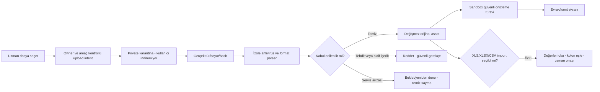

`isg-quarantine` ayrı private bucket; client SELECT/download/signed-read kapalı. İstemci yalnız yetkili intent path’ine upload yapar. Final `isg-documents` yazımı kontrollü promote işinin yetkisindedir; nihai dosyada istemci upsert yoktur. Path ve metadata için owner/kaynak eşleşmesi server’da kontrol edilir; `company_id` bilmek yetki değildir.

Tekil immutable object key, scan edilen bytes/hash ve promote öncesi hash uzlaştırması kullanılır. Kötü dosyanın temiz taramadan sonra aynı path üzerinde değiştirilmesi önlenir. Upload intent, quota reservation, resume token expiry ve tek kullanımlılık ayrı kontrol edilir. Storage upload tamamlandı diye belge veya import tamamlandı sayılmaz. [R08; N25–N27]

### 31.4. Format bazlı güvenlik profilleri

**Word/Excel:** Sadece uzantı ve MIME doğrulaması yeterli değildir. Eski DOC/XLS içinde de VBA/makro ve gömülü içerik bulunabilir; makro taşıyan örnek reddedilir veya ancak ayrı onaylı arındırma politikasıyla güvenli türev olarak alınır. İlk sürümde aktif makro içeren asılın indirilmesine izin verilmez. DOCM/XLSM/EXE/script desteklenmez. Normal makrosuz DOC/XLS mutlaka pozitif test fixture’ıdır; “eski format” diye bütünüyle reddedilmez.

DOCX/XLSX paketinde sıkıştırılmış/açılmış byte, entry sayısı, recursion, path traversal, XML entity/XXE ve dış ilişki kontrolü uygulanır. Office dönüştürücü ağsız sandbox’ta çalışır; DDE, makro, dış şablon/URL fetch ve gömülü program yürütmesi kapalıdır. Normal web bağlantıları önizlemede inert hale getirilebilir; mevzuat kaynağı bağlantısı bulunması tek başına malware kararı değildir. Keyfi MIME–extension çelişkisi aynı hata kategorisine yığılmaz; içeriğe göre güvenli “desteklenmeyen/bozuk/şüpheli” ayrımı yapılır.

XLS/XLSX import formül çalıştırmaz. Hesaplanmış cache değeri kullanılıyorsa bunun kaynakta cache olduğu önizlemede belirtilir; cache yoksa hesaplayıp uydurmaz, satır/hücre doğrulama ister. Orijinal veri tipi, baştaki sıfırlar, tarih sistemi ve Türkçe ayraçlar korunur. Dış linkler açılmaz. PDF/fotoğraftan OCR veya Word’den otomatik eğitim çıkarımı ayrı kapsamdır.

**Görseller:** Dosya byte limiti yanında decoded piksel/bellek ve frame limiti uygulanır. Çok büyük telefon görseli ölçekli decode ile işlenir; app belleğine sınırsız açılmaz. Çok kareli HEIF/WebP’de durağan hedef belirlenir. GPS/EXIF asılda kalacaksa gerekli amaç/erişim kısıtı açık olmalıdır; varsayılan kullanıcıya sunulan/paylaşılan türev kişisel metadata’dan arındırılır. Mevcut AI fotoğraf yolunun daha sıkı EXIF/blur politikası korunur.

**PDF/imzalı asıl:** İmzalı aslı tekrar render etmek özgün byte’ları değiştirebilir. Asıl ve güvenli önizleme ayrı asset/kimliklerdir; türev “imzalı orijinal” diye sunulmaz. Tarama hukuki imza doğrulaması değildir. Şifreli/bozuk/taranamayan dosya otomatik temiz sayılmaz; kilitsiz güvenli kopya istenir.

Bu güvenlik profilleri çok katmanlı uygulama tasarımıdır; hiçbir antivirüs “tüm kötü niyetli dosyalar kesin engellendi” garantisi vermez. [R08]

### 31.5. Teknik limit adayları ve parser arızaları

Başlangıç test adayları: tek evrak 50 MiB; structured import 10 MiB, 10.000 satır ve 200 sütun; decode için işlem bütçesi, page/frame/container başına ayrıca sınır. Bunlar mevcut [A0] sınırları veya ücretli hak değildir. Güncel telefon fotoğrafları, büyük gerçek Word ve taranmış PDF fixture’larıyla ölçülüp onaylanır; belgede vaat edilen formatı bu sınırları doğrulamadan hazır saymayın.

Kullanıcıya `uploading`, `scanning`, `preview_processing`, `ready`, `unsupported_content`, `rejected_security`, `processing_failed` durumları gösterilir. Converter arızası, taramanın temiz bulduğu orijinali kötü amaçlıymış gibi etiketlemez. Orijinal güvenlik kontrolleri tamam ise önizleme hazırlanamadığı açıkça belirtilerek güvenli asıl indirme desteklenebilir; tarama arızasında asıl da açılmaz.

Bütün parse/convert işleri Edge request içinde değil ayrı sınırlı worker’da yapılır. Worker ağ çıkışı kapalı, CPU/bellek/süre kısıtlı, güncel ve izole bağımlılıklarla çalışır. Kamuya açık malware servislerine şirket dosyası gönderilmez. Admin yalnız gerekli scan metadata/issue/sürümünü görür; belge içeriği debug log’a akmaz.

### 31.6. iOS / Android ve canlı geçiş

SwiftUI’de mevcut fotoğraf yolu korunur; dosya picker UTType listesi ve Files/iCloud seçimi genişletilir. Security-scoped erişim, dosyanın buluttan alınması ve geçici kopya yaşam döngüsü test edilir. Android’de mevcut Photo Picker/CameraX korunur; dokümanlar Storage Access Framework/content URI ile seçilir. URI’den fiziksel dosya yolu tahmin edilmez; stream erişimi, izin ömrü ve WorkManager resume kontrollüdür. Kullanıcı dosyanın kopyalanıp kopyalanmadığını ve işlem durumunu görür.

Mevcut `photos`, `reports`, `logos` yolları/policy’leri topluca taşınmaz. Yeni upload hattı izole flag ile açılır. Legacy dosyalar taranmış sayılmaz; gerekiyorsa `legacy_unscanned` envanteri ve kaynak sınırlı tarama tasarlanır. Eski analiz sırasında zorunlu yeni tarayıcı bekleme süresi eklenmez; böyle bir değişiklik ayrı performance/E2E kapısı gerektirir.

DOC, DOCX, XLS, XLSX, HEIC, HEIF, JPEG, PNG, WebP ve AVIF’in iki platformda gerçek dosyayla olumlu testleri; malware/makro/şifreli dosya/bozuk paket olumsuz testleri geçmeden genel geniş-format yayını yapılmaz. Destekli formatlar runtime’da server capability ile ilan edilir; converter kapalıyken hazırmış gibi dosya kabul edilmez.

---

## 32. Sade izin deneyimi ve yönetilebilir bildirim otomasyonu

### 32.1. Onboarding: bir ekran, tek seçim, ayrıntılar profilde

**Kullanıcı kararı:** Onboarding'de kategori listesi veya çok sayıda anahtar gösterilmez. Tek sade bildirim ekranı ve ardından gerektiğinde platformun sistem izni vardır. Uygulama içi kısa açıklama, OS diyaloğunun yerine geçmez.

**Örnek açıklama:** “Süre takibi, işlem sonuçları, kişisel hatırlatmalar ve ürün/kampanya bildirimleri alın. Tercihlerinizi Profil > Bildirimler'den değiştirebilirsiniz.”

**Seçimler:** `Tüm bildirimleri aç` ve `Şimdi değil`. İlki, gösterilmiş açıklamadaki kategorilere yönelik açık kullanıcı eylemidir; altta gizli sözleşme veya önceden işaretli pazarlama kutusu değildir. Bu metin nihai tasarım/hukuk onayına girer. Pazarlama/kampanya ifadesini kaldırıp yalnız “Bildirimlere izin ver” yazılırsa, aynı eylem pazarlama kategorisini açmak için yeterli kabul edilmeyecektir. Apple promosyon push'ı için uygulama arayüzünde açık kabul ve uygulama içi vazgeçme imkânı arar. [R05]

Kullanıcı uygulamadaki açık seçimi yaptıktan ve cihaz izni verildikten sonra, **ilk kez tercih oluşturan hesapta** açıklanan bütün bildirim kategorileri açılır. Detaylar yalnız `Profil > Bildirimler` ekranındadır. Bu eylem e-posta/SMS/WhatsApp pazarlamasını veya ATT iznini açmaz; bu revizyonda başka kanallara toplu rıza alınmaz. Bildirim izni, kayıt/giriş, şirket ekleme veya analiz yapmanın ön koşulu değildir. [R05][N35]

**Önemli fark:** OS'nin `authorized` dönmesi teknik teslim yetkisidir; pazarlama tercihi değildir. Uygulamadaki açık eylem ve gösterilen metin sürümü ayrıca kaydedilir. Onboarding dışı bir yoldan OS ayarlarında izin açılması da hesabın kapatılmış kategorilerini yeniden açmaz.

### 32.2. Tercih, rıza ve cihaz durumunu ayrı tutma

Mevcut `notification_preferences` ile `push_device_tokens` / `user_engagement_state` yeniden kullanılır. [A0]'da `enabled=false`, `marketing=false`, birçok işlev kategorisi `true` varsayılandır. Bunlar migration'ın topluca `true` yapacağı değerler değildir.

| Durum | Hesap tercihi | Cihaz/gönderim davranışı |
|---|---|---|
| Yeni kullanıcı, tek açık kabul + OS izin | İlk kabul kapsamındaki tüm kategoriler açık; rıza sürümü kaydedilir | İzinli cihazda uygun olaylar gönderilebilir |
| Kullanıcı `Şimdi değil` seçti / onboarding atladı | Otomatik pazarlama veya push açılmaz | Native prompt çağrılmaz; daha sonra bağlamsal teklif yapılabilir |
| Uygulamada kabul etti, OS reddetti | Açık seçimin kaydı korunur; ilk kurulumu `pending_device_permission` olarak izle | O cihaza push gönderilmez; sırf CTA nedeniyle master push aktif sayılmaz |
| Mevcut kullanıcının bazı kategorileri kapalı | Açık kapalı seçimleri aynen korunur | Yeni sürüm, yeni cihaz veya onboarding tekrarı kapalı tercihleri geri açmaz |
| Mevcut kullanıcı OS izni açık, pazarlama kabul kanıtı yok | İşlevsel tercihler korunur, marketing kapalı | Kısa toplu kabul ancak kullanıcı açıkça yeniden seçerse pazarlama açılabilir |
| Kullanıcı profilinden belirli kategoriyi kapattı | Kategori false ve tercih sürümü artar | Bekleyen işler gönderim öncesi tekrar kontrol edilir |
| Kullanıcı yalnız bir cihazın OS iznini kapattı | Hesap çapında diğer cihaz tercihleri değiştirilmez | O cihazın delivery durur; izinli diğer cihazlar kendi stratejisine göre çalışır |

İlk kabul kurulumu tek transaction/idempotency anahtarıyla gerçekleşir. `preference_initialized_at`, `preference_version` ve izin kaydının varlığı ikinci cihazın varsayılanları tekrar uygulamasını engeller. Global `enabled` gerçek hesap isteğini; cihaz tablosu OS iznini taşır. Profilde “Bu cihazda sistem bildirimi kapalı” bilgisi ayrıca gösterilir. Kullanıcı ayarları çevrimdışı değişirse güvenli outbox ve sürüm kontrolüyle senkronlanır; eski ayar yeni tercihi ezmez.

Önerilen `private.notification_consent_events`: `user_id`, `event_id`, `action`, `scope`, `copy_version`, `copy_checksum`, `occurred_at`, `source`, `client_platform`, `client_build`; açık kabul/geri çekme audit'i, bildirim içeriği veya başka kişinin bilgisi değil. Prompt davranışı için `notification_prompt_state`: kullanıcı/kurulum, son sorulma, erteleme sayısı, sürüm, yeniden-sormama tercihi. Auth öncesi yerel seçim varsa hesaba yalnız doğru oturumla bir kez bağlanır; önceki cihaz sahibinin tercihi yeni hesaba aktarılmaz.

### 32.3. Onboarding'i atlayan kullanıcıya doğru anda yeniden teklif

Tekrar teklifi uygulama içi açıklama ekranıdır; **reddedilmiş sistem diyaloğunu zorla yeniden açmak değildir**. iOS'ta ilk sistem izninden sonraki çağrılar kullanıcıya aynı native diyaloğu tekrar göstermez; durum okunur ve reddedilmişse Ayarlar'a yönlendirilir. Android'de OS/target sürümü, izin ve rationale durumu kontrol edilir; iOS davranışı kopyalanmaz. Android 13 öncesi cihazlarda aynı runtime izni yoktur, yükseltmelerde de farklı önizin durumları olabilir. [R06][R07]

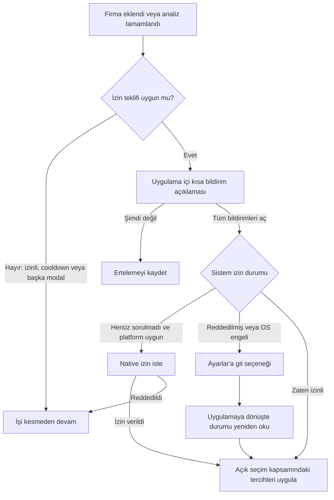

Diyagramdaki `H`, ilk kullanıcıda ilk kurulumdur; eski hesapta toplu reset değildir. Kullanıcının “hepsini aç” eylemi mevcut özel tercihleri değiştirecekse bu işlem profil ekranında açık toplu seçim olarak yapılır; bağlamsal hatırlatma gizlice resetlemez. Ayarlar'dan dönüşte hâlâ reddedilmişse `H` üzerinden gönderim etkinleştirilmez.

**Sıklık önerisi:** İlk tamamlanan anlamlı firma/analiz işleminden sonra en fazla bir teklif; erteleme/ret sonrasında en az 14 gün bekleme, en fazla 90 günde iki kendiliğinden hatırlatma. Bunlar ürün ayarıdır, platform garantisi değildir. Kullanıcının profilinden veya kendi anımsatıcısından bilerek “Bildirimleri aç” seçmesi ayrı kullanıcı başlatmalı akıştır. Her analizde/firma eklemede popup gösterilmez. Kayıt, yasal kabul, ödeme sonucu, recovery veya dosya hatası üstüne modal bindirilmez; ortak `PresentationCoordinator` uygun sırayı belirler. “Şimdi değil” uygulamanın normal kullanımını engellemez.

### 32.4. Mesaj kategorileri ve kapsam

| Kategori | Örnek | Temel sınır |
|---|---|---|
| İşlem sonuçları | Analiz/rapor/import sonucu | Yalnız uzmanın kendi işlemi; teknik retry başına yeni mesaj yok |
| İSG süre ve firma takibi | Eğitim/ekipman/belge tarihi, gönüllü firma inceleme hedefi | Gerçek obligation/tercih; alıcı yalnız uzman |
| Kişisel anımsatıcı | Not defterindeki kendi saatli hatırlatıcısı | Şirket olaylarından bağımsız kişisel occurrence |
| Hesap ve abonelik bilgisi | Şifre değişikliği, gerçek deneme bitişi/ödeme sorunu | Faturalama gerçeği; servis e-postası ile promosyon ayrı |
| Kullanım ve ürün/kampanya | Hareketsizlik, yeni özellik, yükseltme fırsatı | Açık kabul + kolay opt-out + sıklık sınırı |
| Davet ödülü bilgisi | Doğrulanmış Plus7 veya aylık %20 hakkı hazır | Erişim ve indirim ayrı anlatılır; ödeme değiştiren teklif kullanıcı kabulü ister. Promosyon içeriğinde kampanya izinleri geçerlidir. |

Kritik kurtarma e-postasını kapatmakla push kategorisini kapatmak aynı işlem değildir. “Bütün bildirimler açık” ifadesi yalnız açıklanan push kategorilerini ve uygulama içi gösterim tercihlerini kapsar; garanti teslim, acil alarm yetkisi veya bütün dış kanallardan ileti anlamına gelmez.

### 32.5. Admin kural stüdyosu ve güvenli yayın

Var olan APNs/FCM göndericileri, locale/token kontrolleri ve mevcut admin yetkileri korunur. [A0]'daki `private.notification_jobs` CHECK'leri yeni İSG/personal türlerini doğrudan kabul etmez; ayrı yeni job/inbox modeli kullanılır, transport adapter'ı yeniden kullanılır. Kural yaratmak yeni istemci fonksiyonu icat etmek değildir.

Kural editörü serbest SQL/JavaScript, dış endpoint veya ham kullanıcı verisini dışarı çıkaran şablon çalıştırmaz. İzinli fact/operator kullanan şemalı DSL: `key`, sürüm, kategori, trigger, owner-scope, predicate, bilinmeyen fact davranışı, locale/template, minimum client contract, fallback, TTL, cooldown, sessiz saat, dedupe, bütçe, canary, başlangıç/bitiş. Şirket kapsamlı kuralın alıcısı **`companies.user_id` uzmanıdır**. `contact_person`, çalışan, eğitici veya taşeron alıcı olmaz.

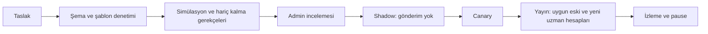

Yeni kural mevcut tercih kategorisini kullanır; kullanıcıdan yeni rıza almadan yeni pazarlama amacı açamaz. Gerekli facts bulunmayan veya eski binary'de hedef ekranı olmayan kullanıcı güvenli fallback/skip alır. Eski ve yeni hesaplar uygun koşulları sağladıklarında değerlendirilebilir; “tüm kullanıcılara aynı anda gönder” anlamına gelmez. Yeni sürümün yayınlanması eski bütün olayları tekrar oynatmaz: `effective_from`, bounded catch-up, episode anahtarı ve sürümler arası dedupe korunur. Pause bekleyen üretimi/gönderimi durdurur; OS'ye teslim edilen geçmiş mesajı geri almış sayılmaz.

### 32.6. İlk kural kataloğu

| Kural | Tetikleyici | Uygulama |
|---|---|---|
| İlk değer hatırlatması | Kayıt sonrası anlamlı işlem yok | İzinli kullanım mesajı; ilk işlemde iptal |
| Firma kurulumu yarım | Uzmanın başlattığı firma kaydı eksik | İn-app eksik alan kartı; push tercihe tabi |
| Yaklaşan eğitim/belge/kontrol | Doğrulanmış son tarihten önce aday 30/14/7 gün | Toplu özet; aynı konu için mükerrer yok |
| Geciken uygunsuzluk | Açık aksiyonun termin aşımı | Yalnız uzmana; adı raporda geçen kişiye otomatik gönderim yok |
| Kanıtı eksik kayıt | Uzmanın tamamlandı dediği süreçte zorunlu kanıt eksik | Uzman incelemesine aç; dış taraf onayı bekleme |
| Firma uzun süredir incelenmemiş | Uzmanın tanımladığı inceleme hedefi | Hatırlatma; otomatik hukuki ihlal/puan cezası yok |
| Haftalık portföy özeti | Yaklaşan/geciken işler | Otuz firma için otuz push yerine tek özet |
| Import/rapor hatası | Kullanıcı işi kesin başarısız/bekliyor | Güvenli support ID; dosya içeriği push'ta yok |
| Hareketsiz uzman | Aday 7/21/45 gün anlamlı kullanım yok | Kampanya/kullanım tercihi ve toplam tavan |
| Deneme/ödeme bilgisi | Store doğrulanmış trial/grace/billing olayı | Yenileme/iptal gerçeğine uygun, yanıltıcı tahsilat sözü yok |
| Davet avantajı | Sunucu hak kaydı oluştu | Plus7 bitişi veya %20 offer durumu; hediye fatura uzatmaz, indirim mağaza kabulü ister. |
| Geri Dönüş | Ücretli aylık erişim gerçekten sona erdi; §41 uygunluğu tamam | Push/email/in-app, pazarlama izinleri ve tekrar kontrolü; aynı episode için tek üretici. |
| Kişisel anımsatıcı | Kullanıcının kendi occurrence saati | Firma facts kullanma; §34 tek-cihaz/teslim stratejisi |

Katalogdaki günler ürün önerisidir, mevzuat periyodu değildir. Arşivli firma, silme talebindeki hesap ve tamamlanmış/iptal iş aktif operasyonel uyarıdan çıkarılır. Uygulama dışında iş yapılmış olabilir; “giriş yapmadı” bilgisi işyerinin ihlal kanıtı değildir.

### 32.7. Son gönderim kapıları, dedupe ve eski üreticiler

Gönderim anında yeniden doğrula: `active_rule ∧ active_user ∧ valid_owner ∧ category_opt_in ∧ consent_scope_ok ∧ device_permission ∧ current_entity_version ∧ client_capability ∧ time_window ∧ budget ∧ not_duplicate`. Hediye/abonelik hakkı yalnız ilgili işlev buna bağlıysa kontrol edilir; kişisel not hatırlatıcısı ücretli plana zorlanmaz. Operasyonel iş listesi notification gönderilemediğinde de erişilebilir kalır.

Önerilen sınırlar: operasyonel özetler günde en fazla iki, kullanım/kampanya toplamı haftada bir, sessiz saat 21.00–08.00. Kullanıcının bilerek saat kurduğu kişisel anımsatıcı farklı sınıftır; yine OS izinleri/gecikmeleri geçerlidir. Acil durum/Critical Alerts yetkisi varsayılmaz. Kuyruk geciktiğinde çok eski hatırlatmayı göndermek yerine TTL ve missed occurrence politikası uygulanır.

`notification_ownership_registry` hangi ailenin legacy veya yeni worker tarafından üretildiğini belirler. `send-trial-reminder-notifications`, eski inactivity/progress ve yeni kural motoru aynı olayı iki kez üretmez. Önce shadow, sonra tek üreticiye geçiş. [A0]'daki yıllık Plus odaklı reminder filtreleri ve `trial_reminder_*` alanları kontrol edilir; yeni aylık trial otomatik hazır sayılmaz.

`queued`, `provider_accepted`, `failed`, `opened`, `acted` ayrı kayıttır. APNs/FCM kabulü kullanıcı gördü/onayladı değildir. Tercih kapatılınca bekleyen job'lar yeniden değerlendirilir. Dedupe anahtarı `expert_user + subject + episode + channel`, kişisel occurrence için ayrıca `schedule_version` içerir. Bildirim içeriğinde çalışan adı, açık belge yolu veya hassas not metni varsayılan olarak taşınmaz.

---

## 33. Arkadaşını davet et — 7 günlük Plus ve tek aylık %20 indirim

### 33.1. Kesinleşen ödül matrisi

**Kullanıcının V5 kararı:** Önceki yüksek süreli Pro/Plus deneyimleri ve analiz paketi ödülleri bu kampanyadan çıkarılmıştır. Davet edilen, yeni bir **uzman hesabıdır**; firma yetkilisine, çalışana veya taşerona giriş hakkı verilmez.

| Davet edenin doğrulanmış durumu | Davet edene verilecek hak | Davet edilene verilecek hak |
|---|---|---|
| Free; gerçek ücretli aboneliği yok | **7 gün Plus hediye erişimi** | **7 gün Plus hediye erişimi** |
| Aktif ücretli Plus aylık | Kendi Plus aylık aboneliğinin **bir sonraki uygun aylık döneminde bir kez %20 indirim**; mağaza teklifini kabul etmesi gerekir | **7 gün Plus hediye erişimi** |
| Aktif ücretli Pro aylık | Kendi Pro aylık aboneliğinin **bir sonraki uygun aylık döneminde bir kez %20 indirim**; mağaza teklifini kabul etmesi gerekir | **7 gün Plus hediye erişimi** |
| Aktif Plus/Pro yıllık | Kazanılan avantaj **bir aylık dönemlik %20 indirim** olarak saklanabilir; yıllık faturaya uygulanması bu kararın kapsamı değildir | **7 gün Plus hediye erişimi** |

**İki ayrı ürün türü vardır:** Hediye erişimi uygulama içinde süreli hak verir; fiyat indirimi ise Apple/Google mağaza teklifidir. İndirim kazanmak mevcut aboneliği uzatmaz, iptal etmez veya kendi başına bir fatura tutarını değiştirmez. Mağazada kabul edilmiş indirim geçerli olduğunda kullanıcı gerçekten indirimli öder. Miktar ve süreler kullanıcı kararıdır; teknik yayın/store onayı yerine geçmez. [S01–S06]

**Yıllık aboneler için açık sınır:** “Sonraki ödemen %20 indirimli” metni yıllık kullanıcıya gösterilmez. Güvenli öneri, hakkı `awaiting_monthly_eligibility` olarak korumak ve kullanıcı ileride kendi isteğiyle aylığa geçerse bir aylık dönemde kullanabilmesini sağlamaktır. Sırf ödül için yıllığı iptal ettirme, kalan yıllık erişimi kaybettirme veya yıllık toplamı %20 düşürme yoktur. Yıllık kullanıcılara yönelik farklı ödül ayrıca ürün kararıdır; bu kararla otomatik türetilmez. Bu istisna davet paylaşılmadan önce açıkça gösterilir.

**Plan sınıflandırması:** Ödül türü qualification anında sunucunun doğruladığı gerçek satın alma durumuna göre sabitlenir. `profiles.tier`, hediye erişiminin görünür Plus etiketi veya istemci beyanı esas alınmaz. Ücretli ödeme geçmişi bulunmayan store denemesi/hediye hesabını Free kolunda değerlendirmek başlangıç önerisidir; mevcut deneme/hediye ile çakışma §33.2'ye tabidir. Grace/ödeme incelemesi veya bilinmeyen store durumunda karar bekletilir; okuma hatası kullanıcıyı yanlışlıkla Free sayıp ödül üretmez. Qualification sonrasında plan değişirse kazanılmış tür sessizce değiştirilmez; kullanım uygunluğu yeniden değerlendirilir.

### 33.2. Yedi günlük erişimin kullanımı ve mağaza denemesinden ayrılması

Önerilen uygulama: Koşullar tamamlanınca hak kazanılır; kullanıcı **“7 günlük Plus hakkımı başlat”** ile aktive eder. Başlangıç sunucu zamanıdır; süre `7 × 24 saat` olarak hesaplanır ve gerçek bitiş kullanıcı saat diliminde gösterilir. Aktivasyon için 30 günlük pencere bir **öneridir**, yayınlanmadan koşullara yazılır. Aktif store denemesi veya başka hediye varsa hak hemen tüketilmez; çakışma açıklanır, aktivasyon uygun zamana bırakılır. Ücretli satın alma gerçekleşirse hediye ödemeyi durdurmaz; aynı anda iki hak için kullanım sayacı iki kez açılmaz.

Bu hak **ödeme yöntemi gerektirmeyen, kendiliğinden ücretli yenilenmeyen uygulama içi Plus erişimidir**. Mağazadaki 7 günlük introductory trial devam eder; ancak hediyeyle birleştirilip “otomatik 14 günlük mağaza denemesi” diye sunulmaz. Store denemesi yalnız kullanıcının ayrı satın alma onayı ve mağaza uygunluğuyla başlar. [S07][R11]

Yedi gün boyunca bütün yayımlanmış ana Plus modülleri ve onaylı Plus kapasitesi kullanılabilir. Günlük analiz sayaçları ve gerçek mevcut kullanım korunur; aktivasyon, çıkış-giriş veya platform değişimi sayaçları sıfırlamaz. Yeni sahte `user_subscriptions` satırı, test override'ı veya ödeme işlemi oluşturulmaz. `billing_tier=free`, `effective_access_tier=plus`, `access_source=referral_gift` ayrımı gösterilir. Hediye bitince firma, personel ve belgeler silinmez; önceki veri erişim/geri alma ilkeleri geçerlidir.

**Mevcut mimariyle uyum:** `company_limit_for_user`, şirket yazma trigger/policy'leri, `analyze`, Result Hub ve rapor paid helper'ları aynı sponsor erişimini tanımadan kampanya açılmaz. Sponsor bütçeli AI yetkisi açık maliyet kaynağıyla çalışır; teknik hata anında Free havuzunu paid havuza düşüren fallback oluşturulmaz. `private.promotional_grants` erişim kaydı kullanılır; yeni paralel abonelik motoru kurulmaz. [A0] §§5,7–10; Ek B/C/E.

### 33.3. İndirim hakkı ile uygulanmış indirim farklı durumlardır

Ücretli davet eden için akış:

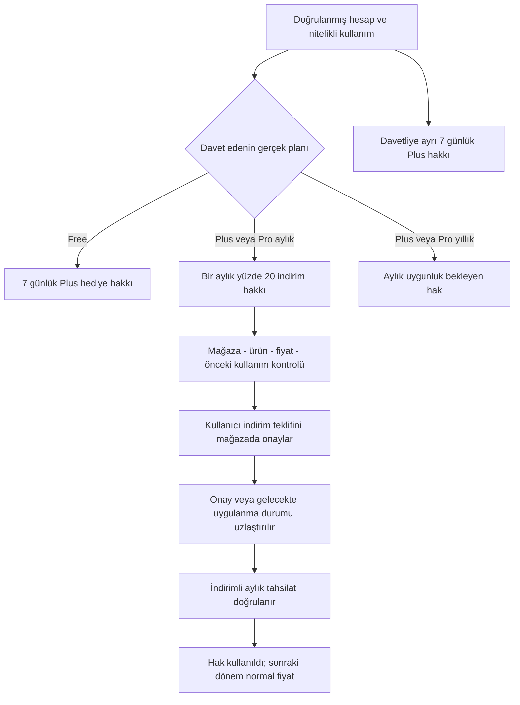

UI durumları en az `Kazanıldı`, `Kullanılabilir`, `Mağaza onayı bekleniyor`, `Yenilemeye planlandı`, `Kullanıldı`, `Süresi doldu` olarak ayrılır. Ödül bildirimindeki **“İndirimini etkinleştir”** düğmesi ödeme teklifine gider; “otomatik uyguladık” denmez. Kullanıcı mağaza penceresini kapatırsa hak kullanılmış sayılmaz. Aynı planı zaten satın almış olması, özel teklif kabulünü genel “zaten abonesiniz” kontrolünde engellememelidir; sadece backend tarafından yetkilendirilmiş offer yolu için dar istisna açılır. Standart ikinci abonelik/sahiplik korumaları kaldırılmaz.

**Apple:** Aynı aylık üründe bir aylık promotional offer önerilir. **Google:** Aynı aylık base plan altında developer-determined, tek indirimli aylık ödeme fazı önerilir. Mağaza ekranından onay alınır; Google'da aynı abonelikte sonraki faturalama tarihini koruyan `WITHOUT_PRORATION` davranışı ilgili katalog ve mevcut SDK ile test edilir. Genel `DEFERRED` kopyalanmaz. [S01–S06] Ayrıntılar, fiyat doğruluğu ve eski sürüm güvenliği §42'dedir.

### 33.4. Doğrulanmış hesap ve aktiflik şartları

**Kesin:** Link tıklaması, kurulmuş uygulama, boş kayıt veya istemciden gelen `reward_earned=true` yeterli değildir. **Başlangıç eşiği önerisi:** Davetli yeni ve doğrulanmış Auth hesabına sahip olacak, tek geçerli davet kodunu/linkini ilişkilendirecek; 30 günlük qualification penceresinde iki ayrı günde sunucuda kanıtlanabilen anlamlı kullanım gösterecek ve en az bir başarılı gerçek iş işlemi tamamlayacak.

Free kullanıcının erişebildiği başarılı fotoğraf analizi ve sonraki ayrı günde aynı rapor/sonuçla doğrulanmış etkileşim uygun örnektir. Salt analitik `screen_view`, uygulamayı açma, not yazma veya push izni alma yeterli kabul edilmez. İlk hediye için ücretli firma oluşturma/ödeme şartı konularak çıkmaz yaratılmaz. Ödül açmak için gerçek çalışan bilgisi veya gereksiz hassas belge girmesi istenmez. Tekrarlı iş olayları source ID üzerinden bir kez sayılır; gün hesabı claim'de sabitlenen saat dilimiyle yapılır.

Aktifliğin otomasyonla taklit edilmesi tümüyle engellenmiş sayılmaz. Hesap geçmişi, yinelenen claim, ilişkili kötüye kullanım ve hız sinyalleriyle risk değerlendirilir; şüpheli işlem incelemeye alınabilir. Aynı işyeri IP'si veya cihaz tek başına ret nedeni değildir. Apple relay e-postası otomatik şüpheli sayılmaz. Kullanıcıya itiraz/inceleme yolu sağlanır; mesaj karşı tarafa ait e-posta veya faaliyet ayrıntısını açıklamaz.

### 33.5. Bir kerelik kullanım, tekrar ödül ve kampanya çakışması

**Kesin:** %20 indirim yalnız **bir aylık ücretlendirme dönemine** uygulanır; devamlı indirim değildir. Geri dönüş kampanyasıyla aynı tahsilatta birleştirilmez. İki indirim %40 olmaz; ardışık çarpımla %36 da olmaz.

**Onaya açık güvenli başlangıç sınırı:** Davet eden hesap başına program genelinde bir referrer ödülü; davetli hesap başına bir invitee hediyesi. Bu sınır Free→Plus→Pro geçişi, yeni cihaz veya kampanya sürümüyle sıfırlanmaz. Daha sonra her nitelikli davet için yeni ödül verilecekse ayrıca ticari karar ve bütçe gerekir; bu sürüm sınırsız %20 indirim kuyruğu oluşturmaz. “Bir aylık indirim süresi” ile “kaç davette yeniden kazanılabilir” farklı ayarlardır.

Aynı kişi önce davetli olarak, sonra gerçek başka bir uzmanı davet ederek iki farklı rolün hakkını kazanabilir; her rol için yedi gün ayrı kazanımdır. Aynı anda aktive edilip boşa gitmesi engellenir; otomatik bir mağaza denemesi toplamına çevrilmez. Bu iki-rol sınırı kampanya metninde ve maliyet rezervinde açık tutulur.

Yıllık kullanıcıdaki saklı aylık hak dışında, aylık indirim kabul süresi için **bir sonraki uygun yenilemeyi kapsayan pencere** kullanılır. Mağaza yenileme tahsilatını önceden işleyebileceği için son saatlerde o ayın indirimi garanti edilmez; backend kesinleşen tahsilatı ve bir sonraki uygun faturalama olayını doğrular. [S09] Hakkı bilerek geç gösterip kullanılamaz hale getirmek yoktur. Başlamış teknik sorun nedeniyle hak kaybında audit'li telafi/son tarih uzatma yapılabilir; sessiz tam fiyat satın alma fallback'i yoktur.

### 33.6. Hak kayıtları ve güvenlik

`private.referral_claims` ilişki/qualification otoritesidir. Her hak `private.campaign_benefits` içinde alıcı, kaynak claim, rol, sabit ekonomik kural ve durumla izlenir (§42.7). `fulfillment_kind=access_grant` yedi günlük Plus'ı mevcut önerilen `promotional_grants` üzerinden sağlar; `fulfillment_kind=store_discount` ise mağaza offer sürecine gider. Fiyat indirimi analiz kredisi veya erişim hibesi olarak kaydedilmez.

Unique kontroller: yeni davetli için program kapsamlı tek claim; `(claim_id, recipient_id, recipient_role)` tek benefit; `(program_family, recipient_id, recipient_role)` onaylı ödül tavanı; store tarafında ayrıca tek ödeme/offer tüketim kaydı. Provider/alias değişimi ayrı kişi veya yeni indirim değildir. Cross-platform hesap aynı Supabase UUID/RevenueCat App User ID ile sürer. Ödeme Apple'daysa Android'den Google'da ikinci abonelik başlatılıp o fatura indirimli sayılmaz; kullanıcı doğru satın alma kanalına yönlendirilir.

İmzalı davet/teklif linki bir kimlik doğrulama yöntemi veya başkasına aktarılabilir indirim cüzdanı değildir. GET, link önizleme, e-posta güvenlik tarayıcısı veya paylaş menüsü hak tüketmez. Kod elle de girilebilir; link kurulumda kayboldu diye fingerprint yapılmaz. Önceden hukuken kazanılmış gerçek bir V4 kampanya hakkı bulunursa V5'e geçişte silinmez; bu dosyalar yalnız plan olduğundan böyle üretim kayıtlarının varlığı varsayılmaz.

### 33.7. Kısa kullanıcı metinleri

| Durum | Önerilen metin |
|---|---|
| Free davet ekranı | “Arkadaşın hesabını doğrulayıp kullanım koşullarını tamamladığında ikiniz de 7 günlük Plus hakkı kazanın.” |
| Aylık Plus/Pro davet ekranı | “Arkadaşın 7 günlük Plus hakkı kazansın. Sen de bir sonraki uygun aylık dönem için tek seferlik %20 indirim kazan. İndirim mağaza onayından sonra uygulanır.” |
| Hediye hazır | “7 günlük Plus hakkın hazır. Başlattığında tüm Plus özelliklerini kullanabilirsin. Bu hediye kendiliğinden ücretli yenilenmez.” |
| İndirim hazır | “Davet ödülün hazır: bir aylık dönem için %20 indirim. Ayrıntıları incele ve mağazada etkinleştir.” |
| Mağaza planlama kanıtı yok | “Teklif işleminin sonucu doğrulanıyor. İndirim henüz yenilemene uygulanmış olarak gösterilmiyor.” |
| Yıllık abone | “Ödülün bir aylık abonelik döneminde kullanılabilir; mevcut yıllık ödemen ve yenileme koşulların değişmez.” |

### 33.8. Yayın sınırı

Ödül miktarları kullanıcı tarafından kararlaştırılmıştır. Tekrarlı kazanım tavanı, qualification penceresi, yıllık hak bekletme ve kampanya temas zamanları **öneri** olarak karar kaydına alınır. Store haritaları, maliyet rezervi, kötüye kullanım testleri ve iki gerçek cihazdaki ödeme kanıtları tamamlanmadan kampanya duyurulmaz. Admin'in bildirim kuralı yayınlaması tek başına mağaza indirimini oluşturmaz. Ana ücretli modüllerin yayını kampanya incelemesiyle gereksiz biçimde engellenmez; hazır olmayan kampanya da hazırmış gibi tanıtılmaz.

---

## 34. Bağımsız kişisel not defteri ve anımsatıcılar

### 34.1. Kesin ürün sınırı

Bu alan uygulama içindeki **bağımsız kişisel defterdir**. Firma, işyeri, çalışan, eğitim, risk, uygunsuzluk, rapor veya mevzuat yükümlülüğü ile bağlantı kurulmaz. Firma seçici, “firma görevine dönüştür”, iş takvimine otomatik ekleme ve şirket skoru etkisi yoktur. Kullanıcı kendi yazısında firma adını anabilir; uygulama bunu parse edip kayıt bağlantısına çeviremez.

Auth, depolama/senkron altyapısı, güvenli hata zarfı ve bildirim teslim adaptörü teknik olarak yeniden kullanılabilir. Bu yeniden kullanım veri/iş akışı bağlantısı anlamına gelmez. Notlar firma analitiği/iş takviminde görünmez; ayrı menüde **Not Defteri > Notlar / Yapılacaklar / Anımsatıcılar** olarak yer alır. Son görsel tasarım kullanıcıdan gelir.

### 34.2. İlk kapsam

Hızlı başlık/metin, kontrol maddeleri, kişisel etiket, sabitleme, arama, arşiv/çöp kutusu; isteğe bağlı tarih-saat, tekrar, erteleme, tamamlandı ve bildirim anahtarı. Dosya ekleri, zengin doküman editörü, paylaşım, şirket/çalışan mention ve AI içerik yorumu ilk sürümde yoktur. Metin/kişisel liste çıktısı gerekiyorsa owner kapsamlı export ayrı kullanıcı işlemi olabilir; firma Rapor Merkezi’ne karışmaz.

Free/Plus/Pro kullanıcısı kendi notlarına ve kurduğu hatırlatıcılara erişir; aboneliğin bitmesi bunları silmez veya sırf yükseltme için kapatmaz. Bildirim işaretlenmediyse tarih kaydı push/local alarm yaratmaz. İşaretlendiyse §32’deki işletim sistemi ve kategori izinleri değerlendirilir.

### 34.3. Veri modeli — şirket alanı eklenmez

| Tablo | Temel alanlar |
|---|---|
| `personal_notes` | `id`, `owner_user_id`, `title`, `body`, `version`, `pinned_at`, `archived_at`, `deleted_at`, timestamps |
| `personal_note_items` | `id`, `owner_user_id`, `note_id`, metin, sıralama, tamamlanma |
| `personal_note_tags`, `personal_note_tag_links` | Owner kapsamlı etiketler ve somut not FK’si |
| `user_reminders` | `id`, `owner_user_id`, isteğe bağlı `note_id`, başlık, `scheduled_at`, `timezone`, tekrar kuralı, `notify_enabled`, `schedule_version`, durum |
| `reminder_occurrences` | owner, reminder, occurrence anahtarı, planlanan an, tamamlanma/erteleme ve durum |
| `reminder_device_deliveries` | owner, occurrence, cihaz/installation, local/push sahibi, planlama/gönderim durumu |

Bu tablolarda `company_id`, `workplace_id`, `employee_id`, `task_id`, `entity_type/entity_id` alanı **bulunmaz**. Genel metadata içine gizli şirket ilişki anahtarı konmaz. Not→reminder FK’si owner ile birlikte kontrol edilir; başka uzman aynı UUID’yi payload’a yazarak bağlayamaz. RLS `auth.uid() = owner_user_id` tabanlıdır. Admin varsayılan olarak not metnini okuyamaz; hata olaylarına başlık/metin konmaz.

### 34.4. Cihaz, çevrimdışı ve bildirim davranışı

Yerel taslak korunan depoda; senkron `client_mutation_id` ve optimistic version ile yapılır. Eşzamanlı düzenlemede sessiz veri ezme yerine çatışma/kopya koruma uygulanır. Firma değiştirmek, firma silmek/arsivlemek veya risk güncellemek notları ve kişisel alarmı değiştirmez.

Tek occurrence için **tek teslim sahibi** belirlenir: seçilen cihazda local veya sunucu push. Aynı saatte ikisini de körlemesine çalıştırmak mükerrer bildirime yol açabilir. Anahtar: owner + reminder + occurrence + schedule_version + target_installation. Başka cihazda düzenleme, silme ve erteleme eski schedule’ı uzlaştırır; offline cihaz güncelleme alana kadar eski local bildirimi engellemenin kesin garantisi verilmez. Uygulama dönüşü/reboot/izin değişikliği uzlaştırması test edilir.

OS local schedule limitleri, Android alarm izinleri/WorkManager ve iOS bildirim kuralları mevcut §32 ve platform kaynaklarına göre uygulanır; “her koşulda tam saatinde alarm” taahhüdü yoktur. İlk sürüm olağan kişisel bildirimdir; Critical Alerts/AlarmKit/özel tam ekran alarm yetkileri bu taleple otomatik açılmaz. [N30–N34]

Hatırlatıcı bildirim anahtarı kapatılırsa bekleyen local kayıtlar iptal edilir ve push job gönderim öncesi yeniden kontrol eder. Kategori profilden kapatılırsa var olan local occurrence’lar da uzlaştırılır; yalnız server tercihini değiştirmek yetmez.

### 34.5. Yaşam döngüsü ve izlenebilirlik

Firma operasyonlarından tamamen ayrı audit/olay ailesi kullanılır; genel telemetri yalnız `note_created`, `reminder_scheduled`, hata kodu ve anonimleştirilmiş sayımlar gibi içeriksiz veridir. Bu olaylar firma skorunu, firma faaliyetsizlik tarihini veya referral’ın anlamlı iş kullanımı ölçüsünü değiştirmez.

Hesap silme bütün not/occurrence/cihaz schedule kayıtlarını ve yerel session cache’ini kapsar. Çevrimdışı cihazda anında temizleme garantisi yerine bir sonraki bağlantıda revocation/tombstone uzlaştırması vardır. Referanslı not silinince ilişkili kişisel hatırlatıcının silineceği/korunacağı kullanıcıya açık seçimle belirtilir; varsayılan silinen notun gelecekteki bildirimi iptal edilir.

---

## 35. Kullanıcının sağlayacağı tasarım ve marka dosyalarının entegrasyonu

**Bağlayıcı kullanıcı kararı:** Logo, ikonlar, mağaza screenshot'ları ve ayrıntılı UI tasarımları kullanıcı tarafından ayrıca sağlanacaktır. Codex bu dosyalar gelmeden yeni marka görsel kimliği tasarlamayacak, görselleri yeniden yorumlayarak onaylı tasarım yerine koymayacak ve hazır olmayan ekranları mağaza görseli gibi üretmeyecektir.

### 35.1. Tasarım teslim sözleşmesi

Her tasarım teslimi için sürüm/tarih, kaynak dosya veya erişim, ekran/route eşlemesi, bileşenler, renk ve tipografi token'ları, spacing, light/dark davranış, iOS/Android farkları, ikon/logo varyantları ve lokalizasyon notları kaydedilir. Asset manifest'i checksum ve kullanım yerini tutar. Font/ikon lisansı ve dosyaların dağıtım hakkı kullanıcı tesliminden doğrulanır; erişilmeyen özel fontlar uydurulmaz veya izinsiz paylaşılmaz.

Backend, domain, Auth, entitlement ve test geliştirmeleri görselleri beklemeden ilerleyebilir. Bu sırada mevcut tasarım sisteminden yararlanan işlevsel ekranlar kullanılabilir; bunlar nihai UI onayı sayılmaz. Görsel finalizasyon fazı için kullanıcı tasarım dosyalarının teslimi gerçek bağımlılıktır.

### 35.2. Tasarımlarda bulunması gereken durumlar

Mutlu yol dışında loading/empty/error/offline, firma seçimi, 30 firmalık portföy, readonly/arşiv, kota doldu, deneme eligibility yok, doğrulama bekliyor, şifre ekleme, Apple gizli e-posta, şifremi unuttum, dosya taranıyor/reddedildi, import hata satırları, bildirim izni reddi, kişisel hatırlatıcı ve çok cihaz çatışması tasarımla eşleştirilir. Eksik durumlar ürün sahibi için açık tasarım listesine yazılır; mevcut akışın güvenli native fallback'i korunur.

İki platform aynı iş sözleşmesini uygular; kullanıcı etkileşimi native erişilebilirlik/keyboard/back davranışına uyar. Dynamic Type/font scale, ekran okuyucu, kontrast, odak sırası, büyük metinde form hataları ve TR/EN metin genişlemesi test edilir. Tasarım doğrulaması ekran görüntüsü karşılaştırması ve gerçek cihaz senaryosuyla yapılır; yalnız layout dosyasının varlığı tamamlanma değildir.

### 35.3. Marka ve mağaza yayını

Yeni görsel isim/ikon/screenshot paketi ana ürün hazır olduğunda release train'e alınır. Bundle ID, Android applicationId, auth kullanıcı UUID'si, RevenueCat App User ID, ürün kimlikleri, push topic/application kimliği ve mevcut deep-link uyumluluğu tasarım değişikliği gerekçesiyle yeniden oluşturulmaz. Teknik kimlikleri toplu metin değiştirerek yeniden adlandırmak yasaktır.

Uzaktan config ekran içi metin/brand varyantını kontrol edebilir; kurulu binary'nin launcher ikonunu ve mağaza adını her platformda istenen anda değiştiren evrensel bir anahtar değildir. Mağaza metadata'sı, kullanıcı tarafından hazırlanmış görseller ve binary kontrollü yayın takvimiyle eşleştirilir. Mağaza screenshot'larında gösterilen paket, deneme ve özellik gerçekten ilgili sürümde bulunmalı; demo kişisel veriler gerçek müşteri verisi içermemelidir.

---
## 36. Güncel veri modeli, servis sınırları ve uygulama sözleşmeleri

Bu bölüm §§12–13’ün devamıdır; oradaki domain tablolarını başka isimlerle tekrar üretmez. Aşağıdaki adlar öneridir; aynı sorumluluğu mevcut depoda taşıyan doğrulanmış bir yapı varsa ADR ile yeniden kullanılır. **Yalnız ad benzerliği semantik uyum sayılmaz.** Mevcut analysis/paywall/notification enum ve CHECK listeleri önce okunur.

### 36.1. Yeni / genişletilecek tablo aileleri

| Aile | Önerilen kayıtlar ve başlıca alanlar | Yetki ve bütünlük |
|---|---|---|
| Giriş takma adı | `private.login_aliases(user_id, normalized_username, status, changed_at)` | Unique aktif alias; kullanıcı kimliği Auth FK; parola/e-posta kopyası yok; açık resolver SELECT yok. |
| Plan kataloğu | `private.isg_plan_versions(plan_code, version, effective_from, capability_json, limits_json, approval)`; `private.isg_product_mappings(store, product_id, base_plan_id, plan_version_id)` | Server yönetimi, immutable yayın; eski ürün kimlikleri silinmez. |
| Geçiş hakları | `private.legacy_access_migrations(user_id, cutoff_id, original_plan, contract_snapshot, usage_snapshot, floor_json, status)` | `(user_id, cutoff_id)` unique; quota floor istemciden yazılamaz; limitsiz değer açık tiplenir. |
| Ek haklar | `private.promotional_grants(id,user_id,grant_kind,target_tier,feature,amount,remaining,activation_deadline,starts_at,expires_at,campaign_id,funding_source,policy_version,status)` | `access_period` ile `quota_credit` typed CHECK; store aboneliğine yazmaz; tüketim/aktivasyon audit’i, bakiye/erişim server transaction’ında. |
| Kota | `private.quota_reservations`, `private.quota_ledger`, uygun tüketim projeksiyonu | Hesap + boyut + dönem + işlem benzersizliği; rezervasyon/finalizasyon; eski sayaçla çift tüketim yok. |
| Analitik | `private.product_event_catalog`, `private.product_events`, `private.acquisition_touchpoints`, erişimi dar kimlik eşleme tablosu | Ingest schema allowlist; event ID unique; hukuki amaç/izin ve saklama sınıfı. |
| Hata teşhisi | `private.error_issues`, `private.error_occurrences`, `private.operation_traces` | Redacted veri; scope bazlı admin erişimi; operation/request/support ID index'i. |
| Güvenli dosya | `private.upload_intents`, `private.file_scan_jobs`, `private.file_scan_results`; domain için güvenli `file_assets` metadata | Final hash/scan/purpose bağları; temiz olmayan nesneye kullanıcı read yok; belge sürümü somut asset FK ile. |
| Otomasyon | `private.isg_notification_rules`, `private.isg_notification_rule_versions`, `private.notification_ownership_registry` | İnceleme/yayın/audit; arbitrary code yok; kural sürümü değişmez. |
| Bildirim yürütme | Bu plandaki domain önerileri `private.isg_notification_jobs`, `notification_inbox_items`; channel/recipient preferences | Job sunucuya, inbox kullanıcıya; aynı amaç için ikinci paralel kuyruk ailesi açılmaz. |
| Tercih ve açık kabul | Mevcut `notification_preferences` + `private.notification_consent_events` + `notification_prompt_state` | Copy/scope/version audit; account seçimi ile kurulum/OS izin durumu ayrı; ilk kurulum idempotent, eski seçimleri sıfırlamaz. |
| Davet | `private.referral_campaigns`, `private.referral_codes`, `private.referral_claims`, `private.referral_events` | Invitee tekil claim. Plus7 aynı `promotional_grants` erişim hattına; %20 ayrı ekonomik offer/settlement hattına gider. |
| Kampanya ekonomisi | §42.7 `growth_campaign_versions`, `campaign_benefits`, `store_offer_mappings`, `campaign_offer_attempts`, `campaign_offer_settlements` | Fatura indirimi quota credit değildir; mağaza işlemiyle tek kullanım uzlaştırılır. |
| Geri Dönüş yaşam döngüsü | §42.7 `subscription_lifecycle_facts`, `winback_episodes` | Mevcut subscription_events’ten doğrulanmış projection; ikinci paid entitlement otoritesi yok. |
| Bağımsız kişisel alan | `personal_notes`, `personal_note_items`, `personal_note_tags`, `user_reminders`, `reminder_occurrences`, `reminder_device_deliveries` | Owner RLS; firma/çalışan/görev FK’si yok; yalnız expert owner RLS ve schedule_version idempotency. |
| Deney | `private.product_experiment_versions`, `private.product_experiment_assignments`, exposure kayıtları | Server deterministic atama; deney kişi bazında platformlar arası sabit; ödeme hakkını client belirlemez. |
| Admin | Mevcut admin audit/export/scope yapıları + yeni resource mapping | Mevcut CHECK ve rol listeleri migration'la uyumlandırılır; MFA ve audit korunur. |

`capability_json`/`limits_json` şemasız key-value çöplüğü değildir: JSON Schema veya eşdeğer tipli validator, bilinmeyen alan reddi ve katalog sürümüne bağlı DTO gerekir. `unlimited` için gizli `-1` hilesi yerine açık `limit_mode` kullanılır. Yeni domain yazımları için ilgili plan, uzman sahipliği, şirket limiti ve kaynak scope'u aynı sunucu işleminde değerlendirilir.

### 36.2. Otorite matrisi

| Soru | Tek otorite | Yardımcı / otorite olmayan |
|---|---|---|
| Kullanıcı kim? | Supabase Auth doğrulaması ve oturum | `profiles.full_name`, kullanıcı adı veya cihaz kimliği değil. |
| Ücretli abonelik aktif mi? | Doğrulanmış `user_subscriptions` snapshot'ı | Client purchase callback veya profil tier cache'i değil. |
| Etkin erişim hangi kapasiteyi verir? | Gerçek plan + onaylı legacy floor + varsa geçerli sponsor erişim grant’ı çözümleyicisi | Mobil sabit sayılar, kota-only bonus veya rastgele admin JSON’u değil. |
| Bonus bakiye / hediye erişimi var mı? | Türlenmiş `promotional_grants` + quota ledger / aktivasyon kaydı | Referrer link tıklaması değil; satın alınan plan ve hediye farklı kaynak. |
| İş tamam mı? | İlgili domain transaction/final durumu | Ürün analitiği veya push açık olayı değil. |
| Dosya kullanılabilir mi? | Kontrollü scan/promote + değişmez asset kaydı | Dosya uzantısı veya istemci beyanı değil. |
| Mevzuat yükümlülüğü var mı? | Onaylı kaynak sürümüyle requirement değerlendirmesi | Menü tercihi, ödeme planı veya firma puanı değil. |
| Bildirim gönderilebilir mi? | Güncel kural + kapsam + tercih + delivery politikası | Kuyruğa girdiği andaki eski snapshot tek başına değil. |
| Kişisel anımsatıcı ne zaman? | Reminder + occurrence + schedule version | Aynı görev için iki bağımsız tarih tablosu değil. |

**V5 ticari otorite:** Plus7 erişim grant’ı capability’yi etkiler; %20 benefit yalnız doğrulanmış mağaza teklifine izin verir. Client, `profiles.tier` veya admin metin düzenlemesi tahsilat tutarı değiştiremez (§42).

### 36.3. Yeni API / RPC / worker sözleşmeleri

| Önerilen ad | İşlev | Temel guard |
|---|---|---|
| `auth-login-alias` | Kullanıcı adıyla normal Auth oturumu açma | Parola loglama yok, enumeration/rate limit, secure session handoff. |
| `isg-set-login-alias` | Oturum açıkken kullanıcı adı seç/değiştir | Taze auth, unique alias, audit. |
| `auth-request-recovery` | E-posta/alias için sağlayıcı kurtarma akışını başlat | Hesap varlığını ifşa etmeyen yanıt; bot/rate koruması, adres dışarı dönmez. |
| `isg-capability-snapshot` | Plan/sürüm/legacy/limit/bonus/rollout görünümü | Server hesaplar; bilinmeyen abonelik kesin Free sonucu diye sunulmaz. |
| `isg-reserve-quota` / `isg-settle-quota` | İç işlem kota rezervasyonu/finalizasyonu | Public çağıran kendine hak yaratamaz; asıl domain işlemi kontrol eder. |
| `ingest-product-events` | Tipli birinci taraf istemci olayları | İzin/purpose, schema, payload sınırı, actor doğrulama. |
| `ingest-client-error` | Redacted hata ve trace bağlantısı | Secret/PII filtreleri, flood kontrolü, ayrılmış veri erişimi. |
| `isg-create-upload-intent` | Yetkili dosya amacı/yolu/boyutu belirle | Kullanıcı/firma/storage reservation; tür allowlist. |
| `isg-complete-upload` | Yüklemeyi gözleyip scan job'a al | Gerçek nesne, hash/size, intent sahipliği; istemciden clean kabul etmez. |
| `process-isg-file-scans` | Tarama/promotion orchestration | Ağır scan ayrı sandbox worker; service scope, lease ve retry. |
| `admin-isg-notification-rule` | Taslak/validate/simulate/publish/pause | Scope+MFA+onay+version; keyfi SQL yok. |
| `process-isg-notification-rules` | Event/periyodik eligibility hesapla | Fact sürümü, bounded batch, shadow/rollout, dedupe. |
| `process-isg-notification-jobs` | Gönderim öncesi kontrol ve adapter | Güncel tercih/entity/schedule; legacy üretici çakışması yok. |
| `isg-claim-referral` | Davet kodunu hesapla ilişkilendir | Tek claim, yeni hesap, self/cycle/rate kontrolü. |
| `process-isg-referral-qualification` | Sunucu iş kanıtlarını değerlendir | Idempotent eligibility/pending review; client event’i ödül vermez; store tier değişmez. |
| `isg-activate-referral-reward` | Kullanıcının kazanılmış hediyesini aktive et | Aynı grant için tek aktivasyon, deadline/policy/funding, erişim snapshot’ını yenile; store işlemine dokunma. |
| `isg-set-notification-preferences` | Tek kabul veya profilden kategori ayarı | Scope/copy/version/actor doğrulaması; eski tercihlerde kör reset yok. |
| `isg-notification-prompt-decision` | Popup uygunluk ve erteleme durumu | Kullanıcı/kurulum ve cooldown; OS durumu native katmanda okunur. |
| `isg-save-personal-note` | Kişisel not mutasyonu | Owner RLS, optimistic version, offline idempotency. |
| `isg-save-reminder` / `isg-complete-reminder-occurrence` | Schedule ve tek occurrence yönetimi | Owner, timezone, eski schedule iptali, repeated series ayrımı. |
| `isg-register-reminder-delivery` | Cihaz local-plan teyidi | Sahiplik/device doğrulama; keyfi başka cihaza plan yazamaz. |
| Mevcut deletion/retention worker | Yeni aileleri kapsayan yaşam döngüsü | Dry-run, storage referansı, audit, saklama/kullanıcı hakkı ayrımı. |

İsimler mantıksal uçları gösterir; her işlevin ayrı fiziksel Edge Function olması zorunlu değildir. Basit kontrollü mutasyonlar RPC, büyük işleri kuyruk, native Auth işleri resmi SDK yolu olabilir. Router/modüler monolit korunur; onlarca kontrolsüz mikroservis açılmaz. İstemciye service-role/secret verilmez.

**V5 adapter ekleri:** `isg-list-benefits`, `isg-prepare-store-offer`, Geri Dönüş episode worker’ı ve store settlement reconcile §42.8’de tanımlanır. Mevcut purchase/restore, email/push sender ve notification planı tekrar yapılmaz. Gift activation endpoint’i sadece erişim grant’ını aktive eder; mağaza indirimi kendiliğinden etkinleşmez.

### 36.4. Index, erişim ve migration kuralları

Gerekli aday index'ler: alias normalize unique; `(user_id, quota_dimension, window_start)`; `(operation_id, event_kind)`; `(user_id, occurred_at DESC, id)`; `(issue_id, received_at DESC)`; scan/notification için bekleyen iş partial index'i; `(owner_user_id, next_occurrence_at)`; `(campaign_id, invitee_user_id)`; `(user_id, cutoff_id)`.

Gereksiz bütün kolon index'leri veya ölçümsüz partition yapısı eklenmez. Event/hata hacmi için retention ve ingestion bütçesi ölçülür. Yeni tablolarda RLS **ve** açık GRANT/revoke kontrolü birlikte yapılır; bir şemanın adı `private` diye internetten erişilemez olduğu varsayılmaz. Supabase Data API exposure/varsayılan privilege davranışı gerçek proje ve güncel belgelerle kontrol edilir. [N36]

`SECURITY DEFINER` yalnız dar gerekçe ve kontrollü izinlerle; PUBLIC execute iptali, sabit search_path ve actor/role kontrolü şarttır. Anonymous alias-login gateway halka açık bir giriş endpoint'idir ama kullanıcı/alias tabloları açık değildir. Admin ve worker endpoint'leri için ayrı auth doğrulaması vardır; “JWT verification kapalı” konfigürasyonu kendi handler doğrulamasını ortadan kaldırmaz.

### 36.5. Olay adları ve bütünlük testleri

Yeni domain olayları: `account.password_method_added`, `account.login_alias_changed`, `subscription.capabilities_resolved`, `legacy_access.mapped`, `quota.reserved|settled|released`, `file.scan_completed|rejected`, `notification.rule_published|job_skipped`, `referral.qualified|rewarded`, `personal_note.updated`, `reminder.schedule_changed|occurrence_completed`.

Güvenlik olayları, iş audit'i ve isteğe bağlı analitik aynı kanal değildir. `account.password_method_added` analitik event'i şifre/token içermez; gerçek güvenlik değişiminin ayrı audit'i vardır. E-posta adresi ve kullanıcı adı dahi gerekmedikçe genel event property olmaz. Domain event'lerinin dışarıdan taklit edilmesi ödeme/ödül/puan yaratamaz. Idempotency kayıtları hesap ve işlemin yetki kapsamıyla eşleştirilir; başka hesabın request ID'si önceki sonucu döndüremez.

---

## 37. Birleşik uygulama sırası, kabul senaryoları ve Codex görev emri

### 37.1. V4'ün temel kararı: yeni yatay katmanlar sona bırakılmaz

§23'teki F0–F12 İSG domain fazları korunur; aşağıdaki WP-15–WP-23 paketleri **o fazların içine** eklenir. Auth, hak geçişi, hata ölçümü ve güvenli dosya kabulü ürün tamamlandıktan sonra eklenecek süs değildir. Özellikle tarama hattı olmadan gerçek evrak, entitlement eşlemesi olmadan yeni modül ve izin/dedupe olmadan yeni bildirim açılmaz.

| Paket | Faz / bağımlılık | Teslim ve çıkış şartı |
|---|---|---|
| WP-15 — Auth ek yolları | F0 envanter → F1 uygulama; F2'den bağımsız ilerleyebilir | E-posta+şifre→OTP; eski OTP/Apple/Google ve aynı UUID; 8 karakter politikası, atlanabilir popup, alias/relay recovery testleri. |
| WP-16 — Plan ve legacy hakları | F0 gerçek limit/mağaza envanteri → F1 katalog; F12 geçiş | Bütün aktif eski Plus/Pro için tüm yeni modüller; hak azaltmayan dry-run; fiyat/ürün kimliği değişmez. |
| WP-17 — Kota ve maliyet | WP-16 + mevcut sayaç sözleşmesi | Legacy quota shadow karşılaştırması, yeni doc/storage reservation, bonus için tek settlement; çift tüketim yok. |
| WP-18 — Analitik/hata/admin | F0 network/SDK denetimi → F1 temel; her domain PR'ında event'ler | ATT-triggering veri çıkışı yok; ortak trace ve mevcut panelde teşhis; admin yetki testleri. |
| WP-19 — Dosya güvenliği | F1 belge metadata + sandbox → F5/F6/F8/F9 ön koşulu | PDF/Word/eski-yeni Excel/mobil fotoğraf pozitif fixture’ları; karantina, tarama, hash/promotion, signed original ve parser testleri. |
| WP-20 — Bildirim stüdyosu | F3 olay/süre altyapısı → F10 yayın | Tek onboarding seçimi + profil ayarları + ret sonrası doğru platform yolu; DSL/simülasyon/canary, izin/dedupe, legacy görev devri. |
| WP-21 — Davet | WP-16/17/18 + gerçek iş event'leri → F10 | Qualification + süreli erişim/bonus ledger + sponsor maliyeti; bütün backend paid kontrolleri; mağaza/politika kapısı, release flag kapalı. |
| WP-22 — Not/hatırlatıcı | F1 Auth/owner RLS + ortak teknik schedule → F10; firma domainine bağımlı değil | Offline not, local/server tek teslim stratejisi, tekrarlayan occurrence, iki platform izin testleri. |
| WP-23 — Kullanıcı tasarımı | Tasarım teslimi + mevcut/yenilenmiş ekran sözleşmeleri → F10/F11 | Kullanıcı asset manifest'i, ekran eşlemeleri, erişilebilirlik/snapshot; bundle ve ürün ID değişmez. |

Davet için mağaza/güvenlik onayı gecikirse ücretli kullanıcılara vaat edilen ana iş modülleri bundan dolayı kapatılmaz. Ancak kamuya açık mağaza görselleri veya satış metinleri “davet yayında” demez. Hangi özelliklerin ilk genel yayın kapsamına alındığı ürün sahibinin release manifest'inde tek tek belirtilir; tamamlanmamış ana kapsam “tüm sistem hazır” diye etiketlenmez.

### 37.2. Entegre bağımlılık şeması

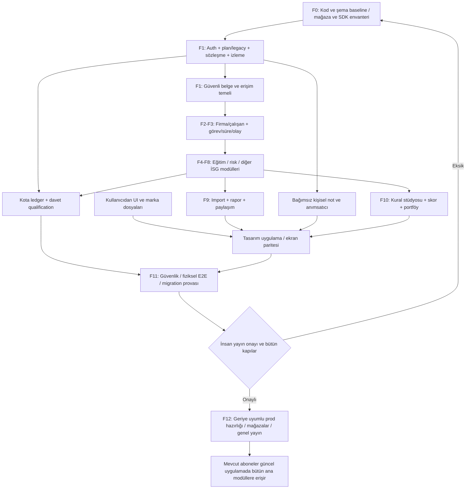

Şemada hata sonrası F0'a dönüş bütün sistemi yeniden yapmak anlamında değildir; eksik kanıtın ilgili iş paketine geri atanmasını temsil eder. Her domain PR'ı kendi gözlemlenebilirliğini ve iki mobil adaptasyonunu taşır.

### 37.3. İlave kabul testleri

Aşağıdaki testler §24'teki mevcut İSG/domain testlerinin **yerine değil yanına** eklenir. API testleri, pgTAP/RLS, mock provider, store sandbox ve gerçek cihazın her biri farklı kanıt üretir.

| ID | Senaryo | Beklenen sonuç |
|---|---|---|
| AUTH-01 | Eski OTP hesabına parola ekleme | UUID, şirketler, analizler, RevenueCat kimliği aynı; OTP devam. |
| AUTH-02 | Google hesabına parola ekleme | Google parolası sorulmaz; uygulama parolasıyla aynı hesap açılır. |
| AUTH-03 | Apple relay + kullanıcı adı | Gerçek adres vermeden alias/parola ve Apple girişi; recovery relay testi. |
| AUTH-04 | Hiç parola yokken güvenli parola ayarları | “Eski şifreyi gir” döngüsü yok; uygun yeniden doğrulama var. |
| AUTH-05 | Bilinmeyen alias, yanlış parola, recovery | Hesap/e-posta ifşası yok; oran/süre/yanıt kontrolleri. |
| AUTH-06 | Unicode ve uzun parola | Byte/karakter sınırı açık; sessiz kesme yok; yapıştırma/autofill çalışır. |
| AUTH-07 | Süresi geçmiş/cold-start recovery link | Güvenli hata/yenileme; rastgele yönlendirme veya oturum atlama yok. |
| AUTH-08 | Apple relay ile farklı Google adresini bağlama | Aynı isimden otomatik veri/abonelik birleştirme yok. |
| BILL-01 | Aktif eski Plus ve Pro yeni uygulamayı açar | Defter, atama, checklist dahil bütün yeni ana modüller açık; tekrar satın alma yok. |
| BILL-02 | Mevcut firmanın sayısı yeni Plus/Pro aday limitinden yüksek | Onaylı floor korunur; şirket arşivlenmez/silinmez; dry-run uyarısı. |
| BILL-03 | Eski hak gerçekten limitsiz | Sonradan sessiz 3/30 sınırı uygulanmaz; explicit sınırsız floor. |
| BILL-04 | İptal edilmiş ama dönemi bitmemiş abonelik | Dönem sonuna kadar geçerli erişim; iptali expiry sayma yok. |
| BILL-05 | Eski/tekrarlı webhook + client restore yarışı | Son geçerli durum korunur; ikinci grant veya yanlış downgrade yok. |
| BILL-06 | iOS/Android aynı hesap | Tek hak/kota; başka hesabın receipt'i paid unlock üretmez. |
| BILL-07 | Plus trial eligible / ineligible | Gerçek store sonucu; yalnız uyguna 7 gün; iki platformda tutarlı UI. |
| BILL-08 | Pro → Plus veya trial expiry, fazla firma | Veriler okunabilir; yeni aktif kapasite seçimi; silme veya veri rehin alma yok. |
| QUOTA-01 | Aynı idempotency key ile tekrar | Tek rezervasyon ve tek tüketim. |
| QUOTA-02 | Provider cevapladı, transport kesildi | Durum reconcile; iki analiz veya iki kota düşümü yok. |
| QUOTA-03 | Teknik hata, kullanılabilir sonuç yok | Politika uyarınca rezervasyon iadesi; maliyet audit'i ayrı. |
| QUOTA-04 | 20 eşzamanlı şirket/dosya işlemi | Atomik kapasite/storage sınırı; UI yarışı ile aşma yok. |
| PRIV-01 | ATT'siz temiz kurulum → satın alma | IDFA/Meta/CAPI/reklam ağına kullanıcı tracking çıkışı yok. |
| PRIV-02 | İsteğe bağlı analitik reddi | Uygulama temel işlevleri/abonelik çalışır; gerekli audit ayrı sınıfta. |
| PRIV-03 | Edinim bilgisi yok veya aggregate | Unknown görünür; uydurma kullanıcı-reklam eşleşmesi yok. |
| OBS-01 | Analiz dışı her modülde enjekte hata | Support ID ile ekran→API→job izi; hassas içerik log yok. |
| OBS-02 | Telemetry sunucusu erişilemiyor | Domain işlemi devam; bounded queue; uygulama çökmez. |
| OBS-03 | Yetkisiz admin scope | Firma belgesi, kişisel not veya güvenlik detayı görünmez. |
| FILE-01 | Uzantısı değiştirilmiş zararlı/izin dışı dosya | Quarantine/reject; signed read ve share yok. |
| FILE-02 | ZIP bomb/XXE/makro/formula ve aşırı piksel | Parser sandbox ve sınırlar; dış network/çalıştırma yok. |
| FILE-03 | Scan servisi down | `scan_failed/pending`; temiz kabul veya import yok. |
| FILE-04 | Tarama sonrası aynı yola overwrite denemesi | Hash/immutable nesne koruması; TOCTOU açığı yok. |
| FILE-05 | İmzalı PDF önizleme | Orijinal hash korunur; türev orijinal diye sunulmaz. |
| FILE-06 | Eski analiz fotoğrafı/raporu | Legacy erişim/üretim çalışır; yeni bucket policy eskisini açmaz veya kapatmaz. |
| NOTIF-01 | Admin taslak→simülasyon→yayın | Sadece yayınlanmış sürüm + uygun kullanıcı; audit ve pause çalışır. |
| NOTIF-02 | Kullanıcı son anda tercih kapatır | Gönderim anında tekrar kontrol; yeni message yok. |
| NOTIF-03 | Risk/eğitim tarihi değişir | Önceki schedule job'u gönderilmez; yeni tarih görünür. |
| NOTIF-04 | 30 firmada aynı anda gecikme | Dedupe ve özet sınırı; 30 ayrı pazarlama push'ı yok. |
| NOTIF-05 | Legacy worker ve yeni rule aynı amaçta | Tek üretici/tek episode; trial mesajı iki kez gitmez. |
| NOTIF-06 | Eski binary yeni route'u bilmiyor | Güvenli fallback veya skip; erişemeyeceği ekran vaat edilmez. |
| REF-01 | Link tıklama / sahte client qualification | Ödül yok; server doğrulanmış gerçek kullanım aranır. |
| REF-02 | Self/cycle/tekrarlı claim/worker retry | Unique claim ve tek ledger grant. |
| REF-03 | Erişim ve indirim hakkı ayrımı | Plus7 sponsor-funded capability verir; %20 indirim paid tier/kota değiştirmez, ayrı mağaza kanıtı gerektirir. |
| NOTE-01 | Başka uzman kişisel notu sorgular veya company_id ile not kaydeder | Owner dışına veri yok; şirket alanı şemada/API’de yok ve bilinmeyen alan reddedilir. |
| NOTE-02 | İki cihaz aynı notu offline düzenler | Konflikt/korunmuş taslak; sessiz içerik kaybı yok. |
| REM-01 | Erteleme/tamamlama/tekrar | Doğru occurrence; bütün seri yanlışlıkla kapanmaz. |
| REM-02 | İzin yok/Android exact access yok/iOS Focus | Dürüst durum ve fallback; kesin alarm vaadi yok. |
| REM-03 | Local + server + iki cihaz | Teslim sahibi/dedupe; bilinen offline sınırlamaları test edilir. |
| UX-01 | Kullanıcıdan gelen son asset manifest'i | İki platform tasarımla eşleşir; teknik kimlikler aynı. |
| DEL-01 | Hesap silme ve saklama istisnası | Alias, analytics, notes, referral, scan/temp ve schedule kapsamı; kanıt/audit. |

Güvenlik testlerinde benign EICAR test dosyası, kurumsal güvenlik ekibinin izin verdiği sandbox fixture'ı veya güvenli sentetik saldırı örnekleri kullanılabilir; gerçek müşteri dosyasına zararlı içerik konulmaz. Production'da kullanıcı verisiyle kontrolsüz yük/fraud denemesi yapılmaz.

### 37.4. Genel yayına geçiş runbook'u

1. **Keşif ve dondurma:** Gerçek eski haklar, ürünler, sürümler, kimlikler, legacy notification üreticileri ve tracking çıkışları envanterlenir. Satın alınmış hakların yeni katalogdan düşük kaldığı bütün durumlar raporlanır; kanıt yoksa sınır düşürülmez.
2. **Staging bütünleştirme:** Domain + Auth + abonelik/kota + dosya/izleme + admin + mobil akışlar sentetik/uygun anonimleştirilmiş verilerle doğrulanır. Gerçek müşteriye bildirim veya gerçek store tahsilatı yapılmaz.
3. **Migration provası:** Additive değişiklik, backfill snapshot/hash, eski API uyumu, mevcut şirket yazma trigger'ı, account deletion ve Storage erişimi test edilir. Backup kapsamı ve restore kanıtı alınır.
4. **Onaylı production hazırlığı:** Yeni kod yolları genel kullanıma kapalı; gerekliyse dar internal canary. Şema ve kapasite etkisi ölçülür. Bu adım ayrı insan onayı olmadan çalışmaz.
5. **Legacy hak eşlemesi:** Plan sürümü ve grandfather floor idempotent uygulanır. Eski analiz/rapor hakları korunur. Bütün güncelleyecek aktif eski Plus/Pro abonelerin yeni modül snapshot'ı test edilir.
6. **Mağaza ve tasarım:** Kullanıcının nihai tasarımı/screenshot'ları; iki platform binary, fiyat/deneme metinleri ve privacy beyanları doğrulanır. Reviewer'ın inceleyeceği özellikler gizli, değerlendirilmemiş post-review içerik olarak sonradan açılmaz; sürüm notu ve test erişimi tam verilir.
7. **Genel yayın:** İlgili platformdaki onaylı yeni sürümü alan aktif eski aboneler bütün yayımlanan ana modüllere erişir. “Güncelledi ama yeni modüller keyfi yüzde 10 cohort'una kapalı” kalıcı davranışı uygulanmaz. İç canary genel satış vaadinden önce tamamlanır.
8. **Sürekli kontrol:** Satın alma/restore, eski analizler, firma limiti, exception, quota, queue, scan ve bildirim opt-out ölçümleri izlenir. Platform güncellemeleri farklı zamanda onaylanabilir; eski mobil istemci zorunlu kırılmaya uğratılmaz.

Rollback önce yeni modül/job/rule üretimini güvenli biçimde kapatır; kullanıcı verisini silen down migration uygulanmaz. Auth'un yeni alias endpoint'i kapatılması eski Apple/Google/OTP ve doğrudan e-posta/parola yolunu bozmaz. Abonelik kataloğu geri alınırken kullanıcının satın aldığı hakların kaybolması önlenir. Mobil binary geri alınamazsa server compatibility ve sonradan düzeltme sürümü kullanılır. RLS/temiz dosya güvenliği “rollback kolay olsun” diye fail-open olmaz.

**Dur/incele kapıları:** Cross-tenant erişim, eski abonenin hak kaybı, parola/token loglanması, tracking politikası ihlali, taranmamış yeni belgenin okunması, yinelenen tahsilat/ödül/kota veya kontrolsüz bildirim fırtınası. Bu sınıflarda sayısal hata eşiği beklenmez; ilgili yeni yol hemen durdurulur. Genel performans eşikleri F0 baseline ve F11 yük testiyle ölçülebilir biçimde onaylanır; bu belge ölçülmemiş SLO uydurmaz.

### 37.5. Karar kaydı: kesin olanlar ve onaya açık öneriler

**Kullanıcı tarafından kesinleştirilen:** Yalnız uzman aktör, şirketten bağımsız notlar, e-posta+şifre ardından kod kaydı, 8 karakter+büyük/küçük harf+rakam politikası, atlanabilir OAuth şifre teklifi, sade bildirim onboarding’i ve geniş dosya formatları. Eski aboneler bütün yeni ana modülleri alacak; mevcut Auth yolları sürecek, parola/alias/recovery eklenecek; UI/marka varlıkları kullanıcıdan gelecek; ATT gerektiren tracking yok; mevcut admin genişleyecek; güvenli upload, otomasyon kural yönetimi, referral, kişisel not/hatırlatıcı ve iki platform entegrasyonu olacak. Önceki sağlık/esneklik/eğitim/risk revizyon kararları aynen korunur. V5’te Free davetçi/yeni davetli Plus7, ücretli aylık davetçi bir aylık %20 ve ücretli aylık expiry sonrası tek %20 Geri Dönüş kesinleşmiştir.

**Bu planın araştırmaya dayalı önerisi:** Plus/Pro korunur, özellikler ortak olur; yeni satışlarda Plus 3/Pro 30 aktif firma; aylık/yıllık; uygun Plus ürününde 7 gün; ilk yayında mevcut AI ve analiz raporu kotası/fiyatı korunur; haftalık eklenmez. Bu paketleme bir dönüşüm garantisi değildir. Yeni kapasite/fiyat koşulları kullanıcı/mağaza metnine işlenmeden yürürlüğe konmaz.

**Onay ve ölçüm gerektiren:** Yeni belgeler için 5/50 GiB depolama, gerçek birim maliyet, legacy hak devam/sona erme koşulları, yeni denemenin store ürün eşlemesi, davet tekrar/qualification/aktivasyon pencereleri ve yıllık davetçi politikası; winback 72 saat/14 gün aday takvimi, gerçek Auth byte sınırı, kanal bazlı tercihler/hukuki dayanak, scan worker hizmeti, retention, exact alarm/AlarmKit ileri kapsamı, fiyat oranı ve deney örneklemi. “Varsayılan aday” verilmesi production'da kendiliğinden uygulanması için yetki değildir.

### 37.6. Tek güncel Codex başlangıç talimatı

**Bağlayıcı görev emri §44.5’tedir.** §25.4 yalnız İSG domain keşif alt listesidir. V2/V3/V4 prompt’ları uygulanmaz. Bütün mevcut özellikler için kanıt→koru/genişlet/yeni ayrımı §39’da zorunludur; bu bir yeniden-yazım projesi değildir.

### 37.7. İlk V4 teslim dosyaları ve Done

`BASELINE_DIFF.md`, `IMMUTABLE_IDENTIFIERS.md`, `V4_DECISION_REGISTER.md`, `LEGACY_ENTITLEMENT_DRY_RUN.md`, `TRACKING_DATAFLOW_AUDIT.md`, `AUTH_THREAT_MODEL.md`, `UPLOAD_SECURITY_PROFILE.md`, `ADMIN_EXTENSION_MAP.md`, `NOTIFICATION_RULE_CATALOG.md` ve `CROSS_PLATFORM_ACCEPTANCE_MATRIX.md` ilk keşif/tasarım çıktılarıdır. Plan önerisindeki yollar depo standardına uyarlanır; içlerinde sır, gerçek parola, ham auth token'ı veya müşteri evrakı bulunmaz.

Done; küçük paket için çalışan kod + doğru schema/RLS + güvenli hata/izin/limit davranışı + native parite + ilgili test kanıtı + gözlemlenebilirlik + gerekçeli kaynak/ürün onayı demektir. Bütün sistemin Done olması ayrıca tasarım teslimi, eski kullanıcı haklarının doğrulanması, mağaza koşulları, recovery/backup provası ve genel yayın kapılarına bağlıdır. Yalnız Markdown planının hazırlanması bu geliştirmelerin uygulanmış olduğunu göstermez.

---
## 38. Kaynaklar ve araştırma sınırları

### 38.1. V2 kaynaklarından korunan doğrulama notu

Aşağıdaki paragraf ve L/T kaynakları sağlanan V2 planının araştırma kaydıdır; V3 sırasında bu mevzuat incelemesinin baştan yapıldığı iddia edilmez. **V2'de kaydedilen doğrulama:** Web araştırması 12 Eylül 2026 tarihli erişim görünümüne dayanır. Yönetmelik yayım bilgisi resmî TBB duyurusu; eğitim uygulaması Bakanlığın güncel SSS içeriği; hüküm metni ve ekleri yayımlanan metnin erişilebilir nüshaları üzerinden kontrol edilmiştir. Ek-1 ve Ek-2 PDF sayfaları görüntülenerek incelenmiştir.

Resmî Gazete'nin ilgili özgün HTML adresi V2 araştırmasında doğrudan okunamadı. Bu nedenle bağlantısı aşağıda **uygulama öncesi resmî doğrulama hedefi** olarak ayrıca verilir; okunmuş bir kaynak gibi sunulmaz. Erişilebilir metin kopyası ile resmî Bakanlık açıklaması arasındaki bir farklılık üretim kuralına dönüştürülmeden içerik sorumlusunca çözülmelidir. Bir web sitesinin “son güncelleme” tarihi mevzuat değişiklik/yürürlük tarihi değildir.

Bu plan hukuki mütalaa değildir. Teknik kural motorunun doğru çalışması kadar, işyerine uygulanabilir kaynak ve uzman doğrulaması da gereklidir. Eğitim/risk revizyonu dışındaki bütün sektör kurallarının eksiksiz denetlendiği iddia edilmez.

### 38.2. Kullanıcı tarafından sağlanan teknik kaynak

**A0 — `PROJECT_ARCHITECTURE.md`.** Özellikle §§2–5, 7–11, 13–19 ve Ek A–H; mevcut tablolar, kısıtlar, trigger/policy/index ve dosya yolları. Dosya hash'i belgenin başındadır. Depo ve üretim durumu deploy öncesi yeniden doğrulanmalıdır.

### 38.3. Mevzuat ve resmî açıklamalar

**L1 — Türkiye Belediyeler Birliği: eğitim yönetmeliği yayım duyurusu.** 02.04.2026 / 33212 bilgisi.

[L1]: https://www.tbb.gov.tr/tr/mevzuat-duyurulari/calisanlarin-sagligi-ve-guvenligi-egitimlerinin-usul-ve-esaslari-hakkinda-yonetmelik

**L2 — Çalışanların İş Sağlığı ve Güvenliği Eğitimlerinin Usul ve Esasları Hakkında Yönetmelik, 02.04.2026/33212.** LEXPERA üzerinde yayımlanan hüküm metni; özellikle m.9, 12–14, 16, 22, 27 ve geçiş hükmü. İkincil ev sahibi üzerinde birincil mevzuat metni nüshasıdır.

[L2]: https://www.lexpera.com.tr/resmi-gazete/metin/calisanlarin-is-sagligi-ve-guvenligi-egitimlerinin-usul-ve-esaslari-hakkinda-yonetmelik-33212

**L3 — Aynı yönetmeliğin Ek-1 ve Ek-2 PDF nüshası.** 1. sayfa eğitim konu tablosu; 2. sayfa temel eğitim belgesi. Katalog ve şablon eşlemeleri için görsel kontrol yapılmıştır.

[L3]: https://www.lexpera.com.tr/Appendix/PUBLICATION_TR/RG801Y2026N33212S1_188_1.pdf

**L4 — Çalışma ve Sosyal Güvenlik Bakanlığı / İSGGM Sıkça Sorulan Sorular.** Kurul/asıl-alt işveren açıklamaları ve özellikle eğitimle ilgili Soru 126–143; süre, yöntem ve belge ayrımları. Resmî idari açıklamadır; norm metniyle birlikte değerlendirilir.

[L4]: https://www.csgb.gov.tr/tr/sikca-sorulan-sorular/is-sagligi-ve-guvenligi-genel-mudurlugu/

**L5 — 02.04.2026 tarihli eğitim yönetmeliğinin erişilebilir tam metin yayını.** Tax & Audit üzerindeki mevzuat metni; işe başlama, işyeri değişimi, elektronik arşiv ve geçiş hükümlerini okumak için kullanılmıştır. Hukuki yorum yazısı yerine yayımlanan madde metinleri esas alınmıştır.

[L5]: https://www.taxandaudit.com.tr/2026/04/02/calisanlarin-is-sagligi-ve-guvenligi-egitimlerinin-usul-ve-esaslari-hakkinda-yonetmelik/

**L6 — İş Sağlığı ve Güvenliği Risk Değerlendirmesi Yönetmeliği, m.12.** Konsolide metin nüshası; süre ve kısmi/tam yenileme ayrımı. Eskişehir Teknik Üniversitesinin resmî İSGB uygulama sayfası aynı genel süreleri ayrıca doğrulamaktadır; üniversite iç usulleri bütün işyerlerine genellenmemiştir.

[L6]: https://www.lexpera.com.tr/mevzuat/yonetmelikler/is-sagligi-ve-guvenligi-risk-degerlendirmesi-yonetmeligi

Destekleyici resmî kurum kaynağı: <https://isgb.eskisehir.edu.tr/tr/Icerik/Detay/risk-degerlendirme-usul-ve-esaslari>.

**L7 — Mesleki Yeterlilik Kurumu: belge zorunluluğu ve belgelendirme açıklamaları.** Eğitim katılımı ile yetkili sınav/belgelendirme ayrımı. Ayrıca Bakanlığın mesleki eğitim belgesi duyurusu kontrol edilmiştir.

[L7]: https://www.myk.gov.tr/tr/haberler/yeterlilik/belge-zorunluluuna-ilikin-skca-sorulan-sorular

Destekleyici Bakanlık duyurusu: <https://www.csgb.gov.tr/duyurular/02-01-2025/>.

**L8 — Kişisel Verileri Koruma Kurumu: yurt dışına aktarım açıklamaları.** Bulut ve hizmet sağlayıcı aktarım tasarımında güncel mekanizmanın incelenmesi için.

[L8]: https://www.kvkk.gov.tr/Icerik/2053/Yurtdisina-Aktarim

Resmî doğrulama hedefi — V2 araştırmasında özgün sayfa doğrudan okunamadı: <https://www.resmigazete.gov.tr/eskiler/2026/04/20260402-2.htm>.

### 38.4. Platformların birincil teknik belgeleri

**T1 — Supabase / Row Level Security.** Policy, yetki ve view güvenliği.

[T1]: https://supabase.com/docs/guides/database/postgres/row-level-security

**T2 — Supabase / Managing Environments.** Ayrı ortamlar ve migration akışı.

[T2]: https://supabase.com/docs/guides/deployment/managing-environments

**T3 — Supabase / Edge Function Limits.** Ağır belge ve import işlerinin çalışma sınırları.

[T3]: https://supabase.com/docs/guides/functions/limits

**T4 — PostgreSQL / CREATE INDEX.** Concurrent index ve transaction kısıtları. Dokümanın erişim anındaki “current” sürümü üretim PostgreSQL sürümü varsayımı değildir; uygulamada gerçek server sürümü kontrol edilir.

[T4]: https://www.postgresql.org/docs/current/sql-createindex.html

**T5 — Supabase / Database Backups.** Veritabanı yedeği ile Storage dosyası kapsamı ayrımı.

[T5]: https://supabase.com/docs/guides/platform/backups

**T6 — Apple / App Information.** Uygulama kimliği ve mağaza bilgi alanları.

[T6]: https://developer.apple.com/help/app-store-connect/reference/app-information/app-information

**T7 — Android Developers / Configure the App Module.** Application ID ve uygulama modülü kimliği.

[T7]: https://developer.android.com/build/configure-app-module

### 38.5. V3 dış araştırması: abonelik, Auth, gizlilik ve güvenlik

Aşağıdaki kaynaklar V3'ün yeni alanları için 12 Eylül 2026 araştırma oturumunda incelenen resmi ürün belgeleri, standartlar ve birincil araştırmadır. Sürüm/deployment davranışı gerçek depoda yeniden doğrulanmalıdır. Özellikle N01 bir gözlemsel benchmark'tır; uygulamamızın kohort verisi değildir. “Current/master” belge veya kod sürümü, production sürümünün aynı olduğunu kanıtlamaz. Teknik limit/paket/puan/ödül önerileri kaynaklardan alınmış zorunlu değerler değildir.

**N01 — RevenueCat, State of Subscription Apps 2026.** Toplulaştırılmış uygulama verisi; deneme süresi ve abonelik dönemi karşılaştırması. Ana metrik dönemi 2025; bazı yenileme/retention hesaplarında eski kohortlar kullanılır. Plus/Pro katman sayısının optimumluğunu doğrudan test etmez.

[N01]: https://www.revenuecat.com/state-of-subscription-apps

**N02 — RevenueCat, Subscription app trends and benchmarks 2026.** Aynı araştırmaya ilişkin sağlayıcının açıklaması; bağımsız ikinci veri kümesi olarak sayılmamıştır. Ek okuma.

[N02]: https://www.revenuecat.com/blog/growth/subscription-app-trends-benchmarks-2026

**N03 — RevenueCat, Subscription Offers.** Platforma özgü intro/trial uygunluğu ve teklif davranışları.

[N03]: https://www.revenuecat.com/docs/subscription-guidance/subscription-offers

**N04 — RevenueCat, Webhooks.** Event teslimi, authorization ve tekrar işlemi tasarımı.

[N04]: https://www.revenuecat.com/docs/integrations/webhooks

**N05 — RevenueCat, Webhook Event Flows.** Abonelik yaşam döngüsü, iptal/sona erme ve olay örüntüleri.

[N05]: https://www.revenuecat.com/docs/integrations/webhooks/event-flows

**N06 — Supabase, Password-based Auth.** E-posta/telefon tabanlı parola kimlik doğrulaması; kullanıcı adı çözümleyicisi uygulama önerisidir.

[N06]: https://supabase.com/docs/guides/auth/passwords

**N07 — Supabase, Identity Linking.** OAuth hesabına parola ekleme ve kimlik bağlama sınırları.

[N07]: https://supabase.com/docs/guides/auth/auth-identity-linking

**N08 — Supabase, Password Security.** Parola güvenlik ayarları, sızmış parola denetimi ve yeniden doğrulama.

[N08]: https://supabase.com/docs/guides/auth/password-security

**N09 — NIST SP 800-63B-4.** Parola uzunluğu, kompozisyon ve doğrulayıcı ilkeleri; ürünün sertifikalandığı anlamına gelmez.

[N09]: https://pages.nist.gov/800-63-4/sp800-63b.html

**N10 — OWASP, Forgot Password Cheat Sheet.** Hesap ifşasına karşı kurtarma ve reset akışı güvenliği.

[N10]: https://cheatsheetseries.owasp.org/cheatsheets/Forgot_Password_Cheat_Sheet.html

**N11 — Supabase, Auth Rate Limits.** Sunucu proxy'si arkasındaki giriş hız sınırları ve güvenilir IP iletimi.

[N11]: https://supabase.com/docs/guides/auth/rate-limits

**N12 — Apple, Configure Private Email Relay Service.** Apple gizli e-posta için gönderici yapılandırması.

[N12]: https://developer.apple.com/help/account/capabilities/configure-private-email-relay-service

**N13 — Supabase Swift, Update a User.** Native kullanıcı güncelleme sözleşmesi; kurulu SDK sürümüyle karşılaştırılacak.

[N13]: https://supabase.com/docs/reference/swift/auth-updateuser

**N14 — Supabase Kotlin, Sign in with Password.** Native parola giriş sözleşmesi; kurulu SDK sürümüyle karşılaştırılacak.

[N14]: https://supabase.com/docs/reference/kotlin/auth-signinwithpassword

**N15 — Apple, User Privacy and Data Use.** Tracking/ATT sınırı ve alternatif tanımlayıcılarla izinsiz takibin çözülememesi.

[N15]: https://developer.apple.com/app-store/user-privacy-and-data-use/

**N16 — Apple, Ad Attribution.** Gizlilik korumalı reklam attribution yaklaşımı ve AdAttributionKit.

[N16]: https://developer.apple.com/app-store/ad-attribution/

**N17 — Apple AdServices, Attribution Token.** Apple Ads attribution token'ı ve standart/ayrıntılı cevap ayrımı.

[N17]: https://developer.apple.com/documentation/AdServices/AAAttribution/attributionToken%28%29

**N18 — Android Developers, Google Play Install Referrer.** Desteklenen kurulum referrer mekanizması.

[N18]: https://developer.android.com/google/play/installreferrer

**N19 — Firebase, Dynamic Links FAQ.** Kapanış bilgisi ve yeni uygulamada kullanılmama gerekçesi.

[N19]: https://firebase.google.com/support/dynamic-links-faq

**N20 — Meta'nın resmi Facebook iOS SDK kaynak kodu, FBSDKAppEvents.h.** Otomatik ve manuel event yollarının ayrımı için; Android ve sunucu yolları gerçek depoda ayrıca denetlenir.

[N20]: https://github.com/facebook/facebook-ios-sdk/blob/main/FBSDKCoreKit/FBSDKCoreKit/include/FBSDKAppEvents.h

**N21 — Apple, App Privacy Details.** Toplanan verilerin kullanım/bağlantı niteliğiyle doğru beyanı.

[N21]: https://developer.apple.com/app-store/app-privacy-details/

**N22 — Firebase, Customize Crash Reports.** Crash/nonfatal veri toplama ve kontrol seçenekleri; reklam analitiği eklemek zorunlu varsayılmamıştır.

[N22]: https://firebase.google.com/docs/crashlytics/customize-crash-reports

**N23 — OWASP, Logging Cheat Sheet.** Hassas alanların dışlanması ve log güvenliği.

[N23]: https://cheatsheetseries.owasp.org/cheatsheets/Logging_Cheat_Sheet.html

**N24 — OWASP, File Upload Cheat Sheet.** Çok katmanlı güvenli dosya kabulü.

[N24]: https://cheatsheetseries.owasp.org/cheatsheets/File_Upload_Cheat_Sheet.html

**N25 — Supabase, Storage Access Control.** Nesne ve policy erişim sınırları.

[N25]: https://supabase.com/docs/guides/storage/security/access-control

**N26 — Supabase, File Limits.** Proje/bucket yükleme sınırları; bu plandaki aday limitler production gerçeği değildir.

[N26]: https://supabase.com/docs/guides/storage/uploads/file-limits

**N27 — Supabase, Resumable Uploads.** Kesintiye dayanıklı upload ve imzalı upload mekanizması.

[N27]: https://supabase.com/docs/guides/storage/uploads/resumable-uploads

**N28 — Apple, App Review Guidelines.** Dijital ürün/IAP, teşvik ve bildirim kuralları; özellikle 3.1.1, 3.2.2 ve 4.5.4 ilgili bağlamda kontrol edilir. Her referral kurgusu için ön onay sayılmaz.

[N28]: https://developer.apple.com/app-store/review/guidelines/

**N29 — Apple Developer Program License Agreement.** Promosyon ve uygulama kullanımını teşvik eden APNs/yerel bildirimlerin izin değerlendirmesi.

[N29]: https://developer.apple.com/support/terms/apple-developer-program-license-agreement/

**N30 — Android Developers, Schedule Alarms.** Kesin zamanlı alarm izinleri ve yaklaşık planlama ayrımı.

[N30]: https://developer.android.com/develop/background-work/services/alarms

**N31 — Android Developers, Notification Permission.** Bildirim runtime izni ve kullanıcı tercihi.

[N31]: https://developer.android.com/develop/ui/compose/notifications/notification-permission

**N32 — Apple, Scheduling a Notification Locally from Your App.** UserNotifications yerel planlama API'si. Gerçek sürüm/izin/teslim sınırları fiziksel cihaz testine tabidir.

[N32]: https://developer.apple.com/documentation/usernotifications/scheduling-a-notification-locally-from-your-app

**N33 — Apple, Scheduling an Alarm with AlarmKit.** İleri alarm özelliği ve izin/uygunluk kontrolü; ilk yayının zorunlu bağımlılığı değildir.

[N33]: https://developer.apple.com/documentation/AlarmKit/scheduling-an-alarm-with-alarmkit

**N34 — KVKK, 2024/1361 karar özeti.** Amaç/izin ve hizmet koşulu değerlendirmesine ilişkin resmi kaynak; bütün işleme amaçlarının aynı dayanakla yürütülebileceği sonucu çıkarılmamıştır.

[N34]: https://www.kvkk.gov.tr/Icerik/8884/2024-1361

**N35 — Ticaret Bakanlığı, İleti Yönetim Sistemi.** Dış ticari ileti kanalları için değerlendirme kaynağı; işlem mesajı, alıcı türü ve kanal ayrımları ayrıca incelenecektir.

[N35]: https://ticaret.gov.tr/ic-ticaret/ticari-elektronik-iletiler/ileti-yonetim-sistemi-iys

**N36 — Supabase Changelog.** Güncel platform davranışını tekrar doğrulama kaynağı; Data API/GRANT/exposure değişiklikleri gerçek proje sürümüyle karşılaştırılır.

[N36]: https://supabase.com/changelog

**N37 — Supabase Auth resmi kaynak kodu, internal/api/password.go.** Parola byte uzunluğu sınırına ilişkin kod kanıtı; `master` dalı üretim sürümü varsayımı değildir.

[N37]: https://github.com/supabase/auth/blob/master/internal/api/password.go

**N38 — OWASP, Authentication Cheat Sheet.** Genel giriş hatası, enumeration, parola yöneticisi ve kimlik doğrulama güvenlik yaklaşımı.

[N38]: https://cheatsheetseries.owasp.org/cheatsheets/Authentication_Cheat_Sheet.html

### 38.6. Araştırmanın cevaplamadığı noktalar

Uygulamanın kendi paket bazlı dönüşüm, gerçek firma dağılımı, ARPPU/LTV, trial kohortları, AI/depolama marjı, mevcut kesin şirket limitleri, fiyatları ve admin frontend'i verilmemiştir. Bu nedenle 3/30 kapasitenin veya iki katmanın tek katmandan kesin üstün olduğu kanıtlanmamıştır. Araştırma önerilen başlangıcı ve test tasarımını destekler; mevcut iş verisinin yerine geçmez.

Apple/Google mağaza eligibility'si, gerçek Supabase Auth sürümü/ayarları ve kullanıcıya verilen eski haklar kod/hesap incelemesinde tekrar doğrulanacaktır. Google Play Data Safety ve dijital promosyon/abonelik politika ayrıntıları da release öncesi ilgili resmi konsollarda ayrıca kontrol edilecek hedeflerdir; bu revizyonun bütün mağaza alt politikalarını eksiksiz denetlediği iddia edilmez.

Kullanıcının henüz vermediği tasarım dosyaları incelenmiş değildir. Production sistemine bağlanılmamış, gerçek kullanıcıya ileti gönderilmemiş, abonelik ürünü veya schema değiştirilmemiştir. Bu belge uygulama planıdır; başarılı build, çalıştırılmış uygulama testi veya mağaza onayı değildir.


---


### 38.7. V4 revizyonunda incelenen birincil kaynaklar

**Erişim tarihi: 12 Eylül 2026.** Aşağıdaki kaynaklar teknik/platform imkânı veya sınırını destekler. Sekiz karakterlik parola, tek onboarding tasarımı, 3/30 firma, 5/50 GiB ve hediye miktarları kullanıcı kararı/ürün önerisidir; bu kaynaklardan çıkan zorunlu ticari değerler değildir. Önceki N/L/T araştırma kayıtları bu revizyonun yeni bir hukuk veya performans denetimi olarak sunulmaz.

| Ref | Birincil kaynak | Bu revizyondaki kullanım |
|---|---|---|
| [R01] | Supabase — Password-based Auth | Mevcut Auth üstünde e-posta+parola kaydı/girişi, doğrulama ve recovery. |
| [R02] | Supabase — Email Templates | Signup/magic link/recovery amaçları, e-posta kodu template değişkeni. |
| [R03] | Supabase — Identity Linking | OAuth hesabına parola ekleme, aynı hesap ve mevcut adresle yeniden signup sınırları. |
| [R04] | Supabase — Password Security | Sunucu parola politikası, yeniden doğrulama ve hizmet planına bağlı güvenlik özellikleri. |
| [R05] | Apple — App Review Guidelines | 4.5.4 promosyon push açık kabul/opt-out; mağaza ürün/ödül inceleme sınırları. |
| [R06] | Apple — UNUserNotificationCenter requestAuthorization | Native izin diyaloğunun ilk izin isteği ve sonraki çağrı davranışı. |
| [R07] | Android Developers — Notification Permission | Android 13+, runtime izin ve OS/target durumlarına göre akış. |
| [R08] | OWASP — File Upload Cheat Sheet | Çok katmanlı dosya kabulü, parser/AV/CDR ve depolama güvenliği. |
| [R09] | Apple Support — Using HEIF or HEVC media | iPhone HEIF fotoğraf/uyumluluk bağlamı; HEIC’i elle dönüştürmeye zorlamayan tasarım. |
| [R10] | Android Developers — Supported Media Formats | JPEG/PNG/WebP/HEIF/AVIF decoder desteğinin platforma bağlılığı. |
| [R11] | RevenueCat — Active Entitlements / Granting Entitlements | Promosyon erişiminin store aboneliği/fatura dönemini değiştirmemesi. |
| [R12] | Supabase — Changelog | Uygulamaya geçmeden güncel Auth/API/Storage davranışını gerçek proje sürümüyle karşılaştırma. |

[R01]: https://supabase.com/docs/guides/auth/passwords
[R02]: https://supabase.com/docs/guides/auth/auth-email-templates
[R03]: https://supabase.com/docs/guides/auth/auth-identity-linking
[R04]: https://supabase.com/docs/guides/auth/password-security
[R05]: https://developer.apple.com/app-store/review/guidelines/
[R06]: https://developer.apple.com/documentation/usernotifications/unusernotificationcenter/requestauthorization(options:completionhandler:)
[R07]: https://developer.android.com/develop/ui/compose/notifications/notification-permission
[R08]: https://cheatsheetseries.owasp.org/cheatsheets/File_Upload_Cheat_Sheet.html
[R09]: https://support.apple.com/en-us/116944
[R10]: https://developer.android.com/media/platform/supported-formats
[R11]: https://www.revenuecat.com/docs/dashboard-and-metrics/customer-history/active-entitlements
[R12]: https://supabase.com/changelog

---

### 38.8. V5 indirim, davet ve Geri Dönüş araştırması — birincil kaynaklar

**Erişim / inceleme tarihi:** 12 Eylül 2026. [S01–S19] bu revizyonda incelenen dış kaynaklardır. Mağaza kuralları uygulama anında tekrar doğrulanır. [A0] mevcut sistem kanıtı; V4 önceki plan; [L], [N], [R] önceki revizyonlardan korunan referanslardır. Önceki mevzuat veya tüm paketleme benchmark'ları bu sınırlı V5 araştırmasında yeniden doğrulanmış sayılmaz.

**[S01] Apple — Set up promotional offers for auto-renewable subscriptions.** Mevcut ve önceki abonelere teklif kurulması, teklif türü ve mağaza ayarları için. URL: `https://developer.apple.com/help/app-store-connect/manage-subscriptions/set-up-promotional-offers-for-auto-renewable-subscriptions`

**[S02] Apple — Implementing promotional offers in your app.** Aynı abonelikte sonraki faturalama ve satın alma akışı için. URL: `https://developer.apple.com/documentation/storekit/implementing-promotional-offers-in-your-app`

**[S03] Apple — In-App Purchase and subscriptions pricing and availability.** Dönem/fiyat seçenekleri, gerçek mağaza fiyatı kullanımı için. URL: `https://developer.apple.com/help/app-store-connect/reference/pricing-and-availability/in-app-purchase-and-subscriptions-pricing-and-availability`

**[S04] Google — About subscriptions / subscription replacement.** Aynı auto-renewing base plan'a teklif geçişinde geçerli replacement seçenekleri ve yenileme davranışı için. URL: `https://developer.android.com/google/play/billing/subscriptions`

**[S05] RevenueCat — Google Play Offers.** Developer-determined uygunluk ve subscription option seçimi; subscription promo code ile ücret indiriminin ayrımı için. URL: `https://www.revenuecat.com/docs/subscription-guidance/subscription-offers/google-play-offers`

**[S06] Google Play Developer API — monetization.subscriptions.basePlans.offers.** Fiyat fazı ve `relativeDiscount` alanının ödenecek oran anlamı için. URL: `https://developers.google.com/android-publisher/api-ref/rest/v3/monetization.subscriptions.basePlans.offers`

**[S07] RevenueCat — Free Trials & Promo Offers.** Varsayılan Package/StoreProduct seçiminde teklifler ve `rc-ignore-offer` filtresi için. URL: `https://www.revenuecat.com/docs/subscription-guidance/subscription-offers`

**[S08] Apple — Set up win-back offers.** Yerleşik Win-Back uygunluk zaman aralıkları, mağaza dış görünürlük/tekrar ayarları için. Uygulamanın erken Geri Dönüş kampanyasıyla aynı mekanizma değildir. URL: `https://developer.apple.com/help/app-store-connect/manage-subscriptions/set-up-win-back-offers/`

**[S09] RevenueCat — Event types and fields.** Subscription olayları, expiry nedenleri, offer/işlem alanları ve null olabilen veriler için. URL: `https://www.revenuecat.com/docs/integrations/webhooks/event-types-and-fields`

**[S10] RevenueCat — Event flows.** Birbirini izleyen renewal/cancellation/expiration akışları ve uzlaştırma testleri için. URL: `https://www.revenuecat.com/docs/integrations/webhooks/event-flows`

**[S11] RevenueCat — iOS Subscription Offers.** Apple teklif türleri, uygulama/StoreKit etkileşimi ve sürüme bağlı entegrasyon için. URL: `https://www.revenuecat.com/docs/subscription-guidance/subscription-offers/ios-subscription-offers`

**[S12] Apple — App Review Guidelines.** Promosyon push için açık kabul/opt-out, doğru satın alma ve fiyat anlatımı için; ilgili 4.5.4 hükmü. URL: `https://developer.apple.com/app-store/review/guidelines/`

**[S13] T.C. Ticaret Bakanlığı — İleti Yönetim Sistemi.** Kampanya e-postasında ticari elektronik ileti/izin ve ret sürecinin ayrıca değerlendirilmesi için. Her alıcı/tacir istisnasına dair otomatik hukuki sonuç çıkarılmamıştır; dağıtım politikası hukuk/ürün kontrolünden geçer. URL: `https://ticaret.gov.tr/ic-ticaret/ticari-elektronik-iletiler/ileti-yonetim-sistemi-iys`

**[S14] RevenueCat / Hannah Parvaz — Win back customers: a how-to guide.** Yazarın kendi %20/%30 deneyi birinci el uygulama deneyimi olarak kullanıldı. Temsilî sektör ortalaması veya İSG Adası'nın nedensel dönüşüm kanıtı değildir. URL: `https://www.revenuecat.com/blog/growth/win-back-customers-how-to-guide`

**[S15] RevenueCat — Winback Campaigns (Web).** Web Purchase Link merkezli ayrı hazır ürünün bu mevcut native/aynı-mağaza tasarımına otomatik çözüm sayılmaması için. URL: `https://www.revenuecat.com/docs/web/winback-campaigns`

**[S16] Apple — Product.PurchaseOption promotionalOffer API reference.** Eski imza parametreli API'nin deprecated işareti ve güncel JWS yönlendirmesi nedeniyle gerçek SDK incelemesi gereğini destekler. URL: `https://developer.apple.com/documentation/storekit/product/purchaseoption/promotionaloffer%28offerid%3Akeyid%3Anonce%3Asignature%3Atimestamp%3A%29?changes=la_3`

**[S17] RevenueCat — Google Play promotional offers in Customer Center.** Mevcut aboneliğin aynı base plan'ında teklif uygulama örneği için. Customer Center'ın [A0]'da mevcut olduğu varsayılmamış, bu ürüne özgü tag/akış özel paywall'a kör kopyalanmamıştır. URL: `https://www.revenuecat.com/docs/tools/customer-center/customer-center-promo-offers-google`

**[S18] Supabase — Securing your API.** Yeni kampanya tablolarında API exposure, privilege ve RLS ayrımı için. URL: `https://supabase.com/docs/guides/api/securing-your-api`

**[S19] Google — Subscription lifecycle.** Geçerli access, grace/hold, cancellation/expiry ve doğrulanmış abonelik durumunu ayırmak için. URL: `https://developer.android.com/google/play/billing/lifecycle/subscriptions`

**Açık doğrulama borcu:** Gerçek ürün fiyatı ve price point, mevcut introductory offer eşlemeleri, RevenueCat Swift sürümü ve Android wrapper'ın replacement desteği, mağazadaki aktif offers, gerçek kullanıcıların önceki düşük fiyatları, webhook verisinin fiilî doluluk oranı ve e-posta kampanya altyapısı verilmedi. Bu alanlar belgede “hazır/çalışıyor” sayılmaz; V5-A ve V5-C keşif/test kapılarıdır. Bölümlerde önerilen süreler, limitler, mesaj metinleri, tablo adları ve deney tasarımları tasarım önerisidir; kaynağın zorunlu tuttuğu kurallar değildir.

---

## 39. İlk mimari belgeyle birebir entegrasyon ve değişiklik haritası

### 39.1. Keşif yöntemi ve kanıt sınırı

Bu eşleme [A0]'ın ana bölümleri ve Ek A–H'deki kolon/constraint/trigger/routine/policy/index envanterine dayanır. Mevcut olduğuna dair kanıt, yalnız dosyada gösterilen kapsamla sınırlıdır. Routine adının listelenmesi gövdesinin okunmuş olduğu veya bugünkü üretim konfigürasyonunun aynı olduğu anlamına gelmez. Codex gerçek kaynak yollarını doğrular ve `BASELINE_DIFF.md` ile aşağıdaki satırları günceller.

**Her çalışma paketinde zorunlu dörtlü:** `kanıt → korunacak davranış → yapılacak küçük genişleme/yeni domain → eski ve yeni akış testi`. Bir tablo adı mevcut diye yeni domain onun JSON alanına doldurulmaz; bir alan yok diye çalışan bütün servis yeniden yazılmaz.

### 39.2. Korunacak / genişletilecek / yeni yapılacak matrisi

| Alan | [A0]'daki somut kanıt | V4 uygulama kararı | Uyum kapısı |
|---|---|---|---|
| Teknik uygulama kimliği | §2 iOS `com.riskdetected.app`; Android sürümleri, fakat tam applicationId yok | **Koru.** Android ID’yi gerçek Gradle’dan tespit et; yeni marka görünen metin/asset katmanında | Signing, push, OAuth, store receipt ve yerel oturum kaybolmaz |
| Supabase Auth ve session | §§3,6; PKCE, OTP/magic link, Apple/Google, refresh/TOTP | **Genişlet.** Yeni email+password signup; doğrulama kodu; mevcut session listener’a dönüş | Eski OTP ve sosyal giriş, MFA, aynı UUID/restore |
| Auth e-posta iletimi | §7 function katalogu `auth-send-email-hook`; Ek A `private.auth_email_delivery_attempts`; Ek D claim/complete/release email routine’leri | **Yeniden kullan.** Signup, magic-link ve recovery ayrı amaç/template; kod teslimini mevcut hook’ta destekle | Legacy template/callback çalışır; idempotent resend/delivery, SMTP/relay gerçek cihaz |
| Profil/kullanıcı adı | `profiles.full_name/email` var; username çözümleyicisi gösterilmemiş | **Yeni dar ek.** Özel alias tablosu + login gateway; profile display name değişmez | E-posta enumerasyonu, UUID değişimi, hesap çoğalması yok |
| Root/bootstrap | §6 `AppState.bootstrap`, `RootView`; Android registrars, `RdNavHost` | **Küçük genişleme.** Popup koordinasyonu, atlanabilir sosyal şifre önerisi | Legal/ödeme/izin pencereleri çakışmaz; ana ekran şifreye kilitlenmez |
| Firma yetkilisi | Ek A `companies.contact_person`, `default_responsible` metin; `user_id` sahibi | **Koru ve sadeleştir.** Raporda isim/unvan snapshot’ı; isteğe bağlı company_contacts rapor ana verisi | Auth FK, davet, rol, dış onay/görev/portal yok |
| Firma erişimi | Ek C `analyses_enforce_company_owner`, `reports_enforce_company_owner`; Ek E owner policy’leri | **Koru.** Yalnız expert owner; yeni alt tablolar aynı firmayı bileşik FK ile doğrular | İki uzman/iki firma arasında ID değiştirme testleri |
| Firma kapasitesi | Ek D `private.company_limit_for_user`; Ek C `companies_enforce_write_rules`; Ek E `companies_insert_paid_own/update_paid_own` | **Dikkatle genişlet.** Aynı DB helper/trigger/policy yeni plan+legacy+onaylı hediye resolver’ına bağlanır | Yalnız UI limit değiştirmek yetmez; yarışmalı create/archive/reactivate testi |
| Firma sınıfı/tekillik | Ek B `hazard_class` low/medium/high; Ek F aktif ad unique `(user_id,lower(btrim(name)))` | **Koru.** Görünen Türkçe sınıf ile mevcut kodu eşle; tarihçeli işyeri sınıfını yan domain ekle | Eski decode/insert ve aynı adlı firma davranışı değişmez |
| Eğitim/çalışan/görev | §6 onboarding’de eğitim/sertifika cevabı var; çalışan ana domaini envanterde yok | **Yeni domain.** §§5–6,12’deki ilişkisel kayıtlar | Onboarding cevapları gerçekleşmiş çalışan eğitimi/sertifikası gibi backfill edilmez |
| AI bulguları | §§7,9 `analyses/findings`, `mutate-analysis-finding`, version guard | **Koru.** Fotoğraf motoru mevcut; risk değerlendirmesine kullanıcı başlatmalı kaynak aktarımı yeni | Completed guard/edit sürümü/quota/provider isolation gerilemez |
| Risk ve defter ayrımı | Ek A AI notebook/training-card tabloları öneri içerir | **Yeni domain.** Risk assessment version, resmî defter arşivi/eğitim gerçekleşmesi ayrı | AI önerisi doğrudan tamamlanmış eğitim/onaylı defter kaydı olamaz |
| Uygunsuzluk sorumlusu | `findings.responsible/deadline` metin | **Yeni süreç + adapter.** Gerçek date/state/audit ve rapor kişisi; bütün değişiklikleri uzman yapar | Belirsiz eski deadline metni otomatik hukuki tarih değil; dış user assignment yok |
| Mevcut abonelik | §8 `user_subscriptions`, webhook/sync ve lowercase UUID RevenueCat identify | **Koru.** Store billing otoritesi aynı; yeni capabilities yan katalog | Receipt başka hesabı açmaz, eski Plus/Pro ana modülleri alır |
| Hediye ve kampanya | [A0] müşteri referral/indirim kampanyası kanıtı yok; test override ayrı amaç | **Yeni adapter.** Plus7 grant; %20 store offer ve lifecycle/settlement (§42.5) | Hediye faturayı değiştirmez; kabul edilmiş offer yalnız doğrulanmış tek dönemi etkiler; eski paid/owner guard korunur |
| AI ve rapor sayacı | §8 Free1; Plus10+2; Pro40+10; eski rapor150/750; §10 sayaçlar | **Koru, tek otoriteyle genişlet.** Yeni belge AI kotası yemez, ledger önce shadow | Duplicate tüketim yok; bonus/plan geçişi daily reset yaratmaz |
| Eski raporlar | Ek A `reports.analysis_id` ve `method` NOT NULL; §10 register-report/snapshot | **Koru.** Yeni eğitim/izin/atama için ayrı documents/version/export ailesi | Sahte analiz yok; eski dosya ve belge numaraları açılır |
| Storage | §§3,7,10,15 photos/reports/logos/avatars ve user UUID yolları | **Yeni genel dosya hattı.** Ayrı quarantine/clean metadata; geniş biçim matrisi | Eski paths taşınmaz; yeni belgenin tarama atlayarak okunması yok |
| Bildirim tercih/token | §11, Ek A `notification_preferences`, `push_device_tokens`, `user_engagement_state` | **Genişlet.** Basit opt-in + provenance + profil detayları; cihaz durumu mevcut kayıtlarla uzlaştır | `marketing=false/enabled=false` eski kayıtlar topluca true olmaz |
| Otomasyon worker | §7,11; Ek B mevcut notification kind/destination/owner CHECK’leri | **Yeni uygun job/rule ailesi, aynı transport.** Dar DSL; expert alıcı; tek üretici geçişi | Eski worker çakışması, bilmediği route, popup/izin spam’i yok |
| Ölçüm/hata | §12 client_flow,usage,paywall,attribution; §19 picker/permission/JPEG ölçüm açığı | **Genişlet.** Yeni tipli product/error events; mevcut event CHECK’leri kontrol | Dosya/şifre/not içeriği loglanmaz; eksik aşama görünür; client event’i kota/grant yaratmaz |
| Reklam/veri çıkışı | §§3,8,12 Meta ve attribution bileşenleri | **Denetle/sınırla.** ATT gerektiren client ve server tracking kapalı, first-party ölçüm | Sadece ATT popup kaldırmak yetmez; network egress testi |
| Admin | Ek A admin_users/audit/exports/rules kayıtları, framework/dosya yolu verilmemiş | **Mevcut paneli genişlet.** Scope/MFA/audit ve yeni resource CHECK’leri | Framework uydurma, firma tarafına admin rolü verme |
| Kişisel notlar | [A0] bu genel kişisel notebook/reminder domainini göstermiyor | **Yeni bağımsız modül.** Yalnız user/installation kapsamı; Auth/sync/push teknik reuse | Şirket FK/bağlantı/score/iş event’i yok; firma silmek notu silmez |
| Silme/retention | §15 mevcut queue/complete/cleanup zinciri | **Genişlet.** Yeni domain/alias/grant/log/not/dosya türevleri ve local reminders | Hesap silme fixture’ı, saklama dayanağı, clean/quarantine/temp temizliği |
| Tasarım/yerelleştirme | §§3,6,18 native tasarım/onboarding/locale bileşenleri | **Koru ve tasarımla güncelle.** Kullanıcının teslim edeceği asset/layout manifest’i | Teknik kimlik/iş sözleşmeleri tasarım string replacement ile bozulmaz |

Bu tablonun “yeni” sütunu **[A0]'da kanıtlanmayan hedef işlevi** gösterir. Gerçek depoda mevcutsa iki kere yapılmaz; semantik/test kanıtı ile reuse kararı kaydedilir.

### 39.3. Repo düzeyinde küçük değişiklik sınırları

**iOS mevcut giriş noktaları:** `App/RiskDetectedApp.swift`, `App/RootView.swift`, `App/AppState.swift`; `App/Services/AuthService.swift`, `SubscriptionManager.swift`, `AnalysisService.swift`, `NotificationService.swift`, `PDFReportService.swift`. [A0, §18] Auth/popup/permission/capability değişiklikleri bu omurgada adapter ile yapılır. Yeni Not Defteri bağımsız feature olur; mevcut analiz/result ekranlarının içine şirket bağımlı not state’i eklenmez.

**Android mevcut giriş noktaları:** `android/app/src/main/.../MainActivity.kt`, `RiskDetectedApplication.kt`, `RdNavHost.kt`, `MainShell.kt`; `android/core/data/.../AuthRepository.kt`, `BillingRepository.kt`, `AnalysisRepository.kt`, `ReportsRepository.kt`. [A0] Üç noktalı yollar kaynak belgenin genel gösterimidir; gerçek paket dizini bulunmadan fiziksel dosya yolu tahmin edilmez. Yeni feature/state/repository’ler mevcut çok-modüllü/Hilt/Flow düzenine uyar.

**Backend:** `supabase/functions/auth-send-email-hook`, `analyze`, `revenuecat-webhook`, `sync-revenuecat-subscription`, `register-report`, `generate-excel-report`, mevcut push/notification ve deletion worker’ları. Mevcut endpoint ismini topluca değiştirme; yeni sözleşmeyi ayrı versiyon/adapter olarak ekle. Function klasörü adı bulunması tüm gerekli provider/secret ayarlarının hazır olduğu anlamına gelmez.

**Contract:** Ortak versioned JSON schema/test fixture’ları native modellerle eşlenir; native UI yeniden yazılmaz. Company işlemleri firmayı taşır; personal-notes kontratında company/workplace/employee/domain reference alanı **tanımlanmaz**. Bilinmeyen alan kabulü kapalı tutulur. Rapor kişisinin `name/title/role_label` verisi Auth role claim değildir.

**Admin:** Önce gerçek proje/framework/source route’ları bulunur. Ürün verisi analitiği, hata izi ve kural editörü mevcut panelin ilgili sayfalarına eklenir; yeni ayrı yönetim ürünü kurulmaz. [A0] admin kaynak yollarını göstermediğinden bu belgede hayalî `admin/src/...` yolu verilmez.

### 39.4. Kritik çapraz-katman sözleşmeler

**A — Parola:** UI kuralı = resmi Auth server kuralı = alias/recovery/update doğrulaması. Signup’ta parola hazırlanır, OTP sadece e-posta doğrular. Başka kimlik yaratılmaz. Auth hook/SMTP/template değişikliği uygulama feature flag’inden bağımsız etkili olabileceğinden staging ve eski build testleri zorunludur.

**B — Kapasite:** Store entitlement/legacy/sponsor resolver → şirket SQL helper/policy/trigger → analiz/rapor/Storage yetkisi → aynı mobil snapshot. Client `is_pro` veya yalnız `profiles.tier` bu zincirin yerine geçmez. Sponsor path açıkça sürümlenir; `ai_execution_route` gibi mevcut CHECK listesi desteklemiyorsa önce additive uyumluluk veya ayrı typed sidecar, sonra dar canary. Yasal şirket sahibi kontrolü hiçbir ticari kampanya nedeniyle gevşemez.

**C — Dosya:** Intent ve gerçek yüklenen hash → karantina → tarama → immutable asset → firma belge sürümü → güvenli preview/import. Dosya uzantısını izinli listede görmek içerik güvenliği sayılmaz. DOC/XLS için çalışan pozitif örnekler ve HEIC orientation/profile testleri olmadan “destekleniyor” yayınlanmaz. [R08–R10]

**D — Bildirim:** Uygulamadaki scope kabulü + güncel hesap tercihi + kurulumun OS durumu → kural eligibility → gönderim anı kontrolü → provider. Kuyruk veya reklam kampanyası kullanıcı tercihini değiştiremez. Not hatırlatıcısı sadece kişisel schedule kaynağı kullanır; şirket kuralları not verisini sorgulayamaz.

**E — V5 mağaza indirimi:** Mevcut satın alma sahipliği ve aynı-tier guard → backend campaign eligibility → uygun aynı ürün offer → kullanıcı kabulü → gerçek mağaza dönemi → settlement. Eski subscriber tüm modül erişimi değişmez. Legacy fiyata göre ödül kötüleştirmez; ekonomik harita §42.5’tedir.

### 39.5. Migration, sürüm ve geri dönüş

İlk çalışma local/staging’de yapılır. Mevcut `scripts/rd_ops_env.mjs` üretime erişebilen operasyon wrapper’ıdır; sırları çıktıya yazmama davranışı korunur, kullanıcı onayı olmadan üretim yazma komutu çalıştırılmaz. Kullanılan CLI/sürümde komutlar `--help` ile doğrulanır; migration dosyası `supabase migration new <anlamlı_ad>` gibi doğrulanmış üreticiyle açılır, aynı tarih/numarayı elle uydurarak 463 dosyalık envantere çakıştırılmaz. [A0, §§4,17; R12]

Yeni domain tabloları için additive migration, açık grants/revokes/RLS, negatif tenant testleri ve backfill dry-run esastır. Mevcut firma tablosuna yeni zorunlu alanı tek seferde dayatma yok; nullable/varsayılan → kontrollü backfill → validation → ihtiyaç varsa sonraki contract aşaması. Büyük index/constraint için lock süresi, statement timeout ve transaction desteği gerçek PostgreSQL/CLI’de doğrulanır; `CREATE INDEX CONCURRENTLY` transaction içine kör yerleştirilmez.

Eski şirket/rapor/analiz kayıtlarını yeni belgeler gibi yeniden üreten dual-write açılmaz. Gereken projeksiyon için outbox/idempotent backfill; kaynak snapshot/hash ve hatalı satır kuyruğu gerekir. Firma yetkilisi modelini plandan kaldırmak için production’da mevcut olmayan tabloyu DROP etmeye çalışmak yasaktır. Eski schema/enum/route tüketen mobil sürümler uyum penceresi boyunca çalışır.

Geri dönüş: yeni modülü/job üretimini kapat; eski Auth/AI/rapor/abonelik omurgasını çalışır bırak; oluşturulmuş gerçek şifreyi, yeni kullanıcı verisini veya kazanılmış hakkı silme. Kimlik veya doğrulanmış parola oluşturma işleminin geri dönüşü kullanıcıyı yeni hesap açmaya zorlamak değildir. Genel yayın öncesi store review, iç canary ve insan onayı tamamlanır; marka değişikliği çalışma sırasında mevcut müşterilere açılmaz.

---

## 40. V4’ten korunan kabul testleri ve güncel plana yönlendirme

### 40.1. Revizyonun kabul ölçütü

Bu bölüm §§24 ve37 testlerine ek V4 karar kapısıdır. Son kullanıcı aktör yalnız uzman; şifre kaydı basit; notlar bağımsız; bildirim izni anlaşılır ve geri alınabilir; destekli dosyalar iki platformda güvenli çalışır. Eski abonelerin aynı UUID/haklarla bütün yayımlanan ana modüllere erişmesi pazarlama cümlesi değil E2E kriteridir.

### 40.2. V4 özel test matrisi

| ID | Test | Geçiş ölçütü |
|---|---|---|
| V4-01 | Firma yetkilisi adını rapora girme | İsim çıktı snapshot’ında; Auth user/rol/OTP/push/acceptance yaratılmaz |
| V4-02 | Uygunsuzluk sorumlusunu seçme/değiştirme | Uzman kaydeder; karşı tarafa iş/giriş/onay daveti yok |
| V4-03 | İki uzman aynı firma adını kaydeder | Birbirlerinin şirket/personel/raporuna erişim yok |
| V4-04 | Paylaş menüsüyle PDF dışarı aktarılır | Dosya paylaşılır; alıcı hesabı/portal yok; “okundu/onaylandı” kanıtı uydurulmaz |
| V4-05 | Yeni email+password kaydı | Koddan sonra aynı Auth hesabı; parola hazır; yeniden şifre popup’ı yok |
| V4-06 | 7 karakter veya büyük/küçük/rakam eksiği | Native ve doğrudan Auth sunucusu aynı gerekçeyle reddeder |
| V4-07 | 8+ karakter, gerekli üç sınıf, özel karakter yok | Güçlü/sızmış parola kontrolleri ayrıca geçerse signup/update/recovery aynı politikayla kabul |
| V4-08 | Uzun/Unicode parola, autofill/yapıştırma | Sessiz kesme/normalizasyon yok; gösterilen char/byte sınırı sunucuyla tutarlı |
| V4-09 | Yanlış e-posta/kod, resend, uygulama kapanması | Alan düzeltme ve güvenli recovery; parola taslağı kalıcı log/cache’e yazılmaz |
| V4-10 | Mevcut OAuth e-postasıyla signup denenir | İkinci hesap/başarılı parola varsayımı yok; mevcut giriş/kurtarma korunur |
| V4-11 | Apple/Google sonrası “Şimdi değil” | Ana ekran normal; aynı oturum/sonraki her girişte zorlayıcı popup yok |
| V4-12 | OAuth hesabına parola ekleme | Apple/Google provider ve UUID/RevenueCat kimliği değişmez |
| V4-13 | Apple relay+alias+recovery | Gerçek e-posta zorunlu değil; relay delivery ve Apple fallback testli |
| V4-14 | Legal/ödeme/bildirim/parola teklifleri aynı anda uygun | Tek presentation coordinator; modal çakışması/sonsuz bekleme yok |
| V4-15 | Yeni kullanıcı toplu açık kabul ve OS izin | Gösterilmiş kapsamın kategorileri bir kez açılır; copy/scope/version audit var |
| V4-16 | Sadece OS izin açık, kampanya kabulü yok | Pazarlama kendi kendine açılmaz |
| V4-17 | Mevcut kullanıcı marketing/eğitim uyarısını kapatmış | Güncelleme, ikinci cihaz ve onboarding tekrarı kapalı tercihleri korur |
| V4-18 | Onboarding atlandı | Push izni/marketing otomatik kabul edilmiş sayılmaz; uygun işlemde tek teklif |
| V4-19 | iOS sistem izni reddedilmiş | Native diyaloğu tekrar zorlamaz; uygulama içi açıklama + Ayarlar yolu |
| V4-20 | Android farklı OS/target/upgrade izin durumu | Gerçek izin/rationale/channel kontrolü; yanlış iOS varsayımı yok |
| V4-21 | Popup reddi/ertelemesi, çok sayıda analiz | Cooldown/tavan uygulanır; her işlemde taciz edici teklif yok |
| V4-22 | Bir cihazın bildirimi kapandı, diğeri açık | Sadece ilgili kurulum durur; hesap tercihleri yanlış resetlenmez |
| V4-23 | Admin yeni kural yayınlar | Uygun eski/yeni uzmanlar değerlendirilir; tercihsiz veya eski route’luya yanlış gönderim yok |
| V4-24 | Gönderim öncesi kullanıcı tercihi/iş tarihi değişir | Güncel kontrol; eski job/episode gönderilmez |
| V4-25 | Not oluştururken company_id/employee_id gönderilir | Sözleşme alanı yok; reddedilir, gizli bağlantı kaydedilmez |
| V4-26 | Şirket değiştirme/arşivleme/silme | Kişisel not ve hatırlatıcılar etkilenmez |
| V4-27 | Not ve reminder olayı | Firma skoru, şirket faaliyetsizliği, risk/eğitim veya davet qualification değişmez |
| V4-28 | İki cihaz offline not düzenlemesi | Version conflict güvenli çözülür; içerik kaybı yok |
| V4-29 | Yerel+sunucu kişisel alarm, saat dilimi/reboot | Tek teslim stratejisi; eski occurrence iptal; garanti teslim yalanı yok |
| V4-30 | PDF/JPG/JPEG/PNG/HEIC/HEIF/WebP/AVIF | İki platformda dosya seçimi/yükleme/güvenli preview; orientation/büyük resim sınırı |
| V4-31 | Normal DOC/DOCX/XLS/XLSX | Uzantı toptan reddedilmez; güvenli orijinal/preview; uygun Excel import’u |
| V4-32 | Makrolu/DDE/aktif OLE, polyglot, paket bombası | Yürütme/ağ erişimi yok; quarantine, açık hata; clean pointer oluşmaz |
| V4-33 | Sahte MIME/uzantı, scan kesintisi veya süresi dolması | Fail-closed; taranmamış dosya paylaşım/AI/import’a gitmez |
| V4-34 | İmzalı PDF aslı ve normalize preview | Asıl değişmez hash; türev ayrı; imza geçerliliği iddiası uydurulmaz |
| V4-35 | Fotoğraf evrak olarak yüklenir | Kendiliğinden AI çağrısı/kota/çalışan kaydı yok |
| V4-36 | Büyük çalışan listesi ve çok eğitim | Ticari employee/training hard-limit yok; açık teknik batch/parçalama çalışır |
| V4-37 | Eski Plus/Pro yüksek şirket kapasitesi | Legacy floor; bütün ana modüller; otomatik veri silme/arşiv yok |
| V4-38 | Aynı kalan firma/byte kotasına paralel istek | SQL/RPC/Storage reservation birlikte sınırlar; client yarışla aşamaz |
| V4-39 | Nitelikli Free davetçi ve yeni davetli Plus7 | İki ayrı server grant; paid helper/AI/firma/export sponsor kaynağı tutarlı |
| V4-40 | Aktif ücretli aylık Plus/Pro davet indirimi | Tek dönem %20; hediye/analiz paketi yerine store offer ve gerçek settlement |
| V4-41 | Davetlinin Plus7 hediyesi + store 7 gün denemesi | İki ayrı kaynak/açıklama; otomatik 14 gün mağaza denemesi yok |
| V4-42 | Aynı davet/retry/activation paralel işlenir | Tek claim ve tek grant/aktivasyon; self-referral/client event ile ödül yok |
| V4-43 | Hediye sona erdi, fazla firma/Storage var | Veri okunur/export edilir; yeni işlem kapasitesi açık; otomatik silme yok |
| V4-44 | Mevcut Plus aylıkta kazanılmış %20, yenileme geliyor | Aynı ürün teklifi kabulü gerekir; uygun dönem/ücret store kanıtıyla ayrı gösterilir |
| V4-45 | Yeni plan/hediye açılır/kapanır aynı gün | Günlük tüketim sıfırlanmaz; quota-only grant Pro modülü açmaz |
| V4-46 | Auth/file/notification/referral hatası | Admin’de support ID/trace, ham parola/kod/not/dosya veya signed URL yok |
| V4-47 | Yeni kapsam kapalı, eski mobil binary | Eski login/AI/result/report/purchase/restore/push/deletion akışları çalışır |
| V4-48 | Hesap silinir | Yeni not/alias/evrak/türev/hatırlatma/izin/grant lifecycle ve saklama dayanağı testli |

Bu tablo çalıştırılmış test sonucu değildir. Codex her satır için kanıt türünü (`unit`, `SQL/RLS`, `integration`, `native UI`, `physical device`, `store sandbox`), commit/build, tarih ve sonucu ayrı kaydeder. Çalıştırılmayan test “geçti” sayılmaz.

### 40.3. Yeni küçük çalışma paketleri ve bağımlılıklar

| Paket | Başlangıç | Çıkış |
|---|---|---|
| V4-A — Kanıt ve kapsam temizliği | [A0]+V4+gerçek repo | §39 doğrulanmış harita; dış kullanıcı/şirket bağlantılı not kodu varsa uygulamaya alınmayacak fark listesi |
| V4-B — Giriş iyileştirmesi | V4-A; izole Auth staging | Email+şifre→kod; aynı UUID; 8 kuralı; optional OAuth prompt; recovery/alias |
| V4-C — Bildirim onboarding ve profil | Mevcut push/tercih envanteri + presentation coordinator | Sade açık seçim, ilk kurulum idempotency, eski opt-out koruması, contextual retry/platform testleri |
| V4-D — Genel dosya kabulü | Belge metadata/Storage güvenlik temeli | Format matrisi, secure preview, legacy DOC/XLS pozitif test, saldırı fixture’ları |
| V4-E — Bağımsız Not Defteri | Auth/owner/senkron ve teknik notification adapter | Şirket bağımsız veri modeli, kişisel reminder, ayrı menü/cache/event |
| V4-F — Ticari kapasite ve hediye | Plan/legacy/gerçek maliyet; SQL helper/RLS envanteri | All-core Plus/Pro; personel/eğitim hard-limit yok; sponsor grant entegrasyon testi |
| V4-G — Davet kampanyası | V4-F + idempotent qualification olayları | Karar onaylı aday ödül, fraud/bütçe/store kapısı, dar canary; kazanılmış hak korunması |
| V4-H — Bütünleşik parite ve yayın | Domain fazları + A–G + kullanıcı tasarımı | V4-01..48 ve önceki kritik testler; fiziksel iOS/Android; ayrı insan yayın onayı |

Notlar, firma/eğitim domaininin tamamlanmasını bekleyen alt özellik değildir. Bildirim teknik adapter’ı ortak olabilir; personal occurrence yalnız kendi kaynağını kullanır. Referral’ın ticari incelemesi gecikirse bitmiş ana modüller kullanıcıya vaat edildiği biçimde yayınlanabilir; yayında olmayan referral mağaza görselinde varmış gibi gösterilmez.

### 40.4. Açık kararlar ve güvenli varsayılanlar

**Karar verilmiş:** Yalnız uzman; sağlık takibi yok; nota şirket bağlantısı yok; email signup’ta şifre; 8+üst/alt/rakam; sosyal girişten sonra atlanabilir ekleme; onboarding’de tek sade bildirim adımı; profile ayrıntı; geniş dosya kabulü; mevcut Auth/abonelik/native altyapı ve eski abonelerin ana modül erişimi korunur.

**Öneri olarak kalan:** 3/30 firma ve 5/50 GiB; çalışan/eğitim kotası koymama; yıllık davetçi politikası, referral sıklık sınırı ve Geri Dönüş zamanlaması; qualification/aktivasyon/cooldown günleri; dosya byte/satır sınırları ve tarama worker hizmeti. Maliyet/ürün onayı yoksa kampanya ve yeni satış kapasitesi genel üretimde açılmaz. “Her özellik açık” rapor çıktısı veya iş güvenliği kalitesini Plus’ta azaltma izni değildir.

**Platforma bağlı sınır:** Pazarlama için kısa açık kabul metnini tamamen saklama isteği uygulanmaz; tek ekranlı sade deneyim korunur. Reddedilmiş OS diyaloğu zorla tekrar açılamaz. Hediye erişimi mağaza faturasını uzatmaz. Geniş dosya kabulü makro/zararlı aktif kodu çalıştırma izni değildir. Bunlar gizli kısıt değil, ürün metninde açık gösterilecek sınırlardır. [R05][R06][R08][R11]

### 40.5. Önceki görev emrinin yerine geçen talimat

**Tek güncel Codex görev emri §44.5’tedir.** Önceki yüksek davet ödüllerini içeren V4 prompt’u bu dosyadan çıkarılmıştır. Bu bölümdeki korunmuş kabul testleri yeni §44.2 ile birlikte uygulanır. V5 mağaza/kampanya kararları önceki varsayımların yerine geçer; diğer İSG domain kapsamları korunur.

---

## 41. Geri Dönüş kampanyası — sona ermiş aylık aboneliğe bir kez %20

### 41.1. Kesin ürün kararı ve kapsam

**Kullanıcı kararı:** Gerçek ücretli **Plus aylık veya Pro aylık** aboneliği sona ermiş ve yenilenmemiş uzman, Geri Dönüş kampanyasıyla **bir aylık dönem için tek seferlik %20 indirim** alabilmelidir. Teklif uygun kanallarda push, e-posta ve uygulama içinden sunulur. İndirimden sonraki aylarda mağazada açıkça gösterilen normal ücret ve otomatik yenileme koşulları geçerlidir. Kendiliğinden ücretsiz abonelik veya kullanıcı onayı olmadan yeniden tahsilat başlatılmaz.

İlk uygulamada teklif, son uygun ücretli aylık planın aynı ürününe yönelir. İndirimden yararlanmak için Plus'tan Pro'ya yükseltme şartı yoktur. Kullanıcı başka plana geçmek isterse normal plan seçimi açık kalır; indirimli plan geçişi ayrı destek matrisiyle doğrulanmadan uygulanmaz. Yıllık aboneliğin bitmesi, yalnız ücretsiz denemenin bitmesi ve yalnız yedi günlük davet hediyesinin bitmesi bu kampanyanın başlangıç kitlesi değildir.

**Bir kerelik:** `winback_monthly20_once` kampanya ailesinde hesap başına yaşam boyu bir başarılı indirimli dönem. Plus/Pro, iOS/Android, reinstalasyon, Auth sağlayıcısı ve yeni kampanya sürümü bu hakkı sıfırlamaz. İlave güvenli öneri: aynı kişiye yalnız bir kampanya fırsatı/episode açmak; teklif süresi bittiğinde her yeni iptalde otomatik yeniden göndermemek. Tekrar teklif ve yeniden kullanım farklı sınırlardır; admin bir kampanya sürümü açarak tüketim geçmişini silemez.

### 41.2. Uygunluk değerlendirmesi

RevenueCat'te `CANCELLATION`, `BILLING_ISSUE` ve `EXPIRATION` farklı olaylardır; yeniden abonelik bazen `RENEWAL` olarak gelir. Sadece iptal veya son kullanım tarihini görmek yetmez. [S09][S10] Google yaşam döngüsünde grace, account hold ve pause da farklı anlam taşır. [S19]

| Durum | Geri Dönüş kararı |
|---|---|
| Yenileme kapatıldı ama ücretli süre devam ediyor | Uygun değil; erişim ve mevcut haklar sürer. İptal etmesine karşılık anında indirim verilmez. |
| Ücretli aylık dönem doğrulanmış biçimde bitti; başka aktif hak yok | Bekleme ve bir-kez kurallarından sonra aday. |
| Ödeme denemesi başarısız; grace/account hold/retry sürüyor | Geri Dönüş değil; ödeme düzeltme akışı. Kampanya tahsilat toparlanmasını bozmaz. |
| Ödeme sorunu sonunda kesin sona erme | Başlangıç önerisi ayrı segmentte tutmak; indirim yerine ödeme düzeltmeyi öncelemek. Otomatik dahil edilmesi ayrıca onaylanır. |
| Store denemesi/hediye bitti; hiç gerçek ücretli dönem yok | Uygun değil; yeni müşteri edinimiyle karıştırılmaz. |
| Yıllık dönem bitti, duraklatıldı, iade/revocation veya geliştirici iptali | Bu ilk kampanyaya otomatik dahil edilmez. |
| iOS sona erdi, aynı hesabın Android aboneliği hâlâ aktif | Uygun değil; ikinci mağaza aboneliği teşvik edilmez. |
| Başka aktif hediye/deneme var | Teklif ertelenir veya bastırılır; hediye bitişi yeni ücretli churn sayılmaz. |
| Yakın zamanda normal ücretle geri döndü | Aday/job iptal edilir; “sizi özledik” gönderilmez. |
| Sağlayıcı bilgisi eski/eksik veya sahiplik belirsiz | `verification_pending`; Free varsayımıyla indirim hakkı verilmez. |
| Aynı ailede indirim kullanıldı | Yeni teklif yok. Refund sonrasında otomatik yeni kupon açılmaz; gerektiğinde destek incelemesi. |

En az bir pozitif tutarlı, doğrulanmış ve iade edilmemiş aylık ödeme geçmişi başlangıç önerisidir. “Aylık” ürün kataloğu/base plan metadata'sından belirlenir; 28–31 günlük tarih farkı veya ürün adında `month` aranması otorite değildir. Ülke/para birimi/platform uygunluğu da sağlanmalıdır. Diğer ürünlerin ödeme durumu okunmadan `user_subscriptions` tek satırının boşalması “her yerde abonelik yok” anlamına gelmez; §42.7 yaşam döngüsü projeksiyonu gerekir.

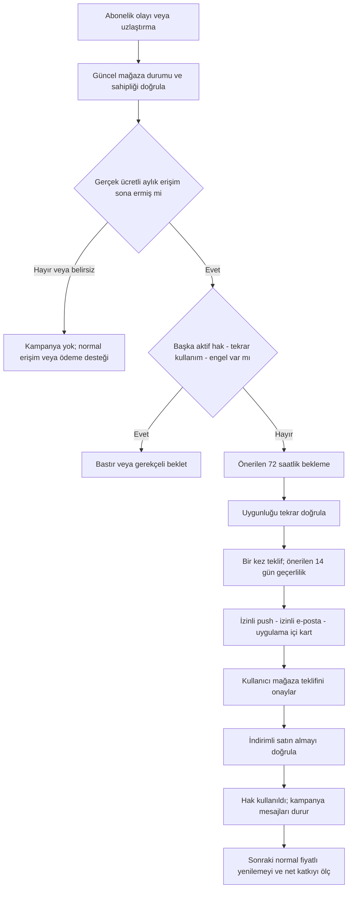

### 41.3. Zamanlama ve temas sayısı — optimizasyon için başlangıç önerisi

Aşağıdaki süreler resmi mağaza kuralı veya kanıtlanmış optimum değildir; test edilecek **ürün varsayılanlarıdır**. İndirim oranı ise %20 olarak kullanıcı kararıdır.

```text
T = mağaza ve backend ile doğrulanmış gerçek ücretli erişim bitişi
A = T + 72 saat; bu anda tekrar uygunluk kontrolü
Teklif kabul sonu = A + 14 gün
```

| An | Davranış |
|---|---|
| T | Kampanya adayı oluştur; hemen indirim vaadi/push gönderme. Normal abonelik bilgisi kampanyadan ayrıdır. |
| A | Hâlâ uygunsa teklif kullanılabilir. Push izni + kampanya tercihi varsa ilk push. |
| A sonrası ilk uygun uygulama açılışı | Kapatılabilir kampanya kartı; gerekirse yalnız bir kez açıklama ekranı. Auth, şifre oluşturma, izin veya hata penceresinin üzerine bindirilmez. |
| A + 7 gün | Kullanılmadıysa, uygunluk ve e-posta izni sürüyorsa bir e-posta. Push almış olsa da en az yedi günlük ortak gürültü aralığı korunur. |
| Teklif sonu | Kullanılmadıysa kapanır. Yeni girişte sayaç yeniden başlamaz, sahte son gün mesajı üretilmez. |
| Herhangi bir anda yeniden ödeme | Gönderilmemiş tüm kampanya işleri iptal edilir; başarı sonrası normal kullanım akışına dönülür. |

Böylece izinler uygunsa kullanıcı hem push hem e-posta alabilir; iki kanalın aynı anda aynı mesajı göndermesi zorunlu değildir. Başlangıçta kampanya başına en fazla **iki dış temas**, hesap genelinde §32'nin haftalık pazarlama sınırı korunur. Diğer kampanya gürültüsü varsa bu mesaj ertelenir veya atlanır; güvenlik/kişisel hatırlatıcılar pazarlama uğruna bastırılmaz. Kalıcı push hatasında e-posta yedeği kullanılabilir, fakat aynı gün başarılı iki dış temas oluşturulmaz.

Uygulama içi kartta **“Şimdi değil”** ve **“Bu kampanyayı bir daha gösterme”** bulunur. İlki modal'ı erteleyebilir, ikincisi bu kampanyanın hatırlatmalarını durdurur; profil pazarlama tercihlerini gizlice değiştirmez. Kullanıcı bildirimleri tamamen kapatmış olsa da hak şartları sağlanabilir; hakkı kazanma ile dış kanalda ulaşma farklıdır. Kullanıcı kendi isteğiyle Plan ve Kullanım > Avantajlar ekranından uygun teklifini görebilir.

### 41.4. Apple'ın Win-Back özelliği ile ürünün “Geri Dönüş” adı aynı şey değildir

**Doğrulanan önemli sınır:** Apple'ın yerleşik Win-Back yapılandırması, incelenen belgede son abonelikten sonra en az bir aylık aralık ve tekrar teklif bekleme kuralları içerir. Bu nedenle üç gün sonra başlayan uygulama kampanyasını bu mekanizmaya doğrudan bağlamak doğru değildir. Ayrıca uygulama dışı mağaza gösterimleri, uygulamanın global bir-kez kuralından bağımsız davranabilir. [S08][S11]

**Önerilen ilk uygulama:** iOS'ta eski abonelere de sunulabilen **promotional offer** ile uygulama kontrollü Geri Dönüş; Android'de geliştirici uygunluk kontrollü subscription offer. Kullanıcıya görünen kampanya adı iki platformda da “Geri Dönüş” olur. Apple'ın yerleşik Win-Back'ı daha ileri fazda, bir ay ve üzeri kayıp kitle için ayrıca değerlendirilebilir; aynı kullanıcıya ikinci indirim yaratmaması kanıtlanmadan açılmaz. [S01][S05]

RevenueCat'in ayrıca web satın alma bağlantısına yönlendiren bir Win-back campaigns ürünü vardır. Bu ürünün adı benzer diye mevcut mobil ödemeye otomatik eklenmez: incelenen beta dokümanının web checkout, hedefleme ve yerelleştirme sınırları bu Türkçe, uygulama-içi mağaza kurgusundan farklıdır. V5'te web tahsilat, Stripe veya yeni faturalama motoru açılmayacaktır. [S15]

### 41.5. Örnek metin ve fiyat açıklaması

**Push başlığı:** “Sizi özledik”

**Push metni:** “Geri Dönüş kampanyasıyla bir aylık Plus aboneliğinde tek seferlik %20 indirim hakkın hazır. Koşulları uygulamada incele.” Pro için plan adı değiştirilir. Bu metin yalnız doğru indirim mağazada doğrulanmışsa kullanılabilir.

**E-posta konusu:** “İSG Adası'na dönüşünüz için bir aylık %20 indirim”

**E-posta gövde iskeleti:** “Kaldığınız yerden devam edebilirsiniz. Uygun aylık planınızda bir dönemlik %20 Geri Dönüş indiriminiz bulunuyor. Teklif [son tarih] tarihine kadar kullanılabilir. İndirimli dönemden sonra aboneliğiniz mağazada gösterilen normal aylık fiyatla otomatik yenilenir; mağaza hesabınızdan yönetebilir ve iptal edebilirsiniz.” Gönderen kimliği, koşullar ve kampanya e-postasından çıkış bağlantısı görünür olur.

**Uygulama içi teklif kartı:**

```text
Geri Dönüş avantajınız
Bir aylık [Plus/Pro] için tek seferlik %20 indirim
Bu dönem: [mağazanın yerelleştirilmiş indirimli tutarı]
Sonraki dönemler: [normal aylık tutar] / ay; otomatik yenilenir
Son kullanım: [gerçek tarih]
[İndirimi kullan]  [Şimdi değil]
```

%20 yalnız ilk indirimli aylık döneme aittir. Örnek TL fiyatı üretim değeri gibi yazılmaz. Dönem `P1M` mağaza süresidir; yedi günlük hediyedeki gibi sabit saat hesabıyla değiştirilmez. Saklanan firmaların hâlâ erişilebilir olması doğrulanmadan “tüm verilerin burada” denmez; dosya silinme/saklama politikası ayrı kalır. Süresi geçmiş kullanıcıya korku veya yasal ceza tehdidiyle satış yapılmaz.

### 41.6. İzin, e-posta ve link güvenliği

Geri Dönüş indirimi **pazarlama kampanyasıdır**. Sadece hesabı var, OTP almış, aboneliği bitmiş veya işletim sistemi push izni vermiş diye e-posta/push kampanya izni varsayılmaz. Apple promosyon push için açık kabul ve vazgeçme imkânını şart koşar; Türkiye'de ticari e-posta izin/ret ve İYS süreçlerinin uygulanabilirliği ayrıca doğrulanır. [S12][S13] Eski kapalı tercihler ve ret listeleri korunur. Onboarding'in sade tek ekranı değişmez; mevcut onay metninin kanal kapsamı gerçekten e-postayı içermiyorsa backend e-posta izni uydurmaz.

Mevcut Auth mail hook'u yalnız giriş/doğrulama için kalır. Kampanya posta işleri ayrı amaç/kuyruk ve gönderim bütçesiyle, uygun mevcut e-posta taşıma altyapısı yeniden kullanılarak gönderilir. Toplu kampanya OTP, şifre sıfırlama veya welcome e-postasını geciktiremez. Bounce/complaint/unsubscribe anında bastırma kaydı oluşturur. Apple özel relay adresi için mevcut gönderici alanı sağlığı kontrol edilir; teslim hatası kullanıcının giriş adresini değiştirmez.

Link uygulamanın birinci taraf offer route'una gider; login sonrasında hesap ve güncel uygunluk tekrar kontrol edilir. Linki başka hesaba aktarmak indirim hakkını aktaramaz. GET/unfurl/e-posta taraması sadece güvenli önizlemedir; ne hak tüketir ne de alışveriş yapar. Link/offer nonce/parola/OTP loglanmaz. E-postadaki görsel izleme pikseli dönüşüm otoritesi değildir; ölçüm kendi offer ve doğrulanmış mağaza ödeme olaylarıyla yapılır. ATT gerektiren yeniden hedefleme veya reklam ağına kayıp abone kitlesi gönderimi eklenmez.

### 41.7. Çakışma önceliği ve hak tüketimi

Sıra: **geçerli ödeme/sahiplik ve müşteri güvenliği → kazanılmış davet indirimi → uygun Geri Dönüş teklifi → standart teklif**. Aktif/planlanmış bir davet indirimi varken Geri Dönüş ayrı bir indirimli tahsilat yaratmaz. Yeni kampanya adayı oluşturulsa bile teklif vermek ertelenebilir; kazanılmış hak sessizce silinmez.

Kullanıcı önce bir teklif, sonra diğerinin linkini açarsa aynı abonelik zinciri üzerinde tek checkout rezervasyonu vardır. Bir başarılı indirimli dönem yalnız bir campaign benefit'i tüketir. Uygulamanın gösterdiği kampanya ile mağazanın gerçekten uyguladığı offer farklıysa reconciliation incelemesi açılır; kullanıcıdan çekilmiş doğru mağaza işlemi gizlenmez veya ücretli erişimi ceza olarak kapatılmaz.

Ödeme başarısızlığı ve kullanıcının pencereyi kapatması kullanım değildir. Gerçek indirimli işlem doğrulanınca bir-kez ledger'ı kapanır. İade, chargeback veya kampanya suistimali ayrı denetim olayıdır; tekrar indirim döngüsü otomatik açılmaz. Teknik hatanın kullanıcıya maliyeti varsa destek yoluyla gerekçeli telafi kararı verilir; istemci kendi kendine hak iadesi yapamaz.

---

## 42. Mağaza teklifleri, hak defteri ve mevcut mimariye entegrasyon

### 42.1. Üç farklı mekanizma; tek abonelik otoritesi

| Mekanizma | Ne sağlar? | Nerede doğrulanır? |
|---|---|---|
| `referral_plus7_access` | Yedi günlük uygulama içi Plus erişimi | Kampanya qualification + erişim grant'ı + mevcut capability çözümleyicisi |
| `referral_monthly20_once` | Mevcut aylık abonelikte bir uygun dönemlik %20 indirim | Kazanılmış benefit + mağaza teklif onayı + gerçek indirimli dönem |
| `winback_monthly20_once` | Sona ermiş ücretli aylık aboneliğe dönüşte bir dönemlik %20 indirim | Yaşam döngüsü uygunluğu + mağaza satın alması + gerçek indirimli dönem |

**Tek faturalama otoritesi korunur:** Apple/Google tahsil eder, RevenueCat ve mevcut backend doğrular. Kampanya kayıtları “kim hangi avantajı neden kazanabilir/kullandı?” sorusunu yanıtlar; yeni ödeme sağlayıcısı veya ikinci `user_subscriptions` üretmez. Fiyat indirimi kazanımı `effective_access_tier` değerini yükseltmez. Yedi günlük erişim grant'ı ise faturaya değil capability çözümüne etki eder.

### 42.2. Apple entegrasyonu

**Birincil kaynak bulgusu:** Promotional offers mevcut ve eski abonelere verilebilir; daha önce introductory offer kullanmış olmak tek başına engel değildir. Aylık ürün için bir aylık indirimli dönem yapılandırılabilir. Aynı abonelikte teklif bir sonraki faturalama olayından itibaren uygulanır; plan değişikliklerinin etkisi farklı olabilir. [S01][S02][S03]

**Önerilen kurulum:** Mevcut `riskdetected_plus_monthly` ve `riskdetected_pro_monthly` ürün aileleri üzerinde referral ve winback için ayrı offer kimlikleri. Örnek mantıksal kodlar `ref-month20-v1` ve `back-month20-v1`; gerçek kimlik tekillik/uzunluk koşulları mağazada doğrulanır. Ürün ID'si, subscription group, bundle ID ve RevenueCat entitlement'ı değişmez. Bir aylık dönem bittiğinde normal yenileme kuralı mağaza teklifinde yer alır; indirimi kaldırmak için her kullanıcıya ayrı cron çalıştırılmaz.

İmzalı teklif kullanılır. Özel anahtar istemciye konmaz. Apple'ın güncel belgelerinde JWS tabanlı yol ve eski imza API'lerindeki deprecation notları bulunur; yeni kod eski örneği sürüm kontrolü olmadan kopyalamaz. [S16] Önce gerçek Xcode/iOS minimumu, RevenueCat Swift paket sürümü ve imzalı teklif adapter'ı depodan doğrulanır. Desteklenen RevenueCat akışı korunur; özel sunucu imzası gerekli olursa dar adapter ve ADR gerekir, tüm uygulamanın StoreKit/RevenueCat sahiplik mekanizması yeniden yazılmaz.

**Yetkilendirme testi zorunlu:** Backend benefit uygunluğu olmadan imza alınamamalıdır. RevenueCat SDK'nın imza üretebilmesi kendi başına bizim referral/tek-kullanım şartlarını uyguladığını kanıtlamaz. Geçerli hesap, seçili product/offer, hak rezervasyonu ve imza bağları incelenir. Uygulamayı değiştirerek veya RC public key ile başka yol deneyerek ekonomik uygunluk atlanabiliyorsa bu açık belgelenir; gerektiğinde kontrollü signer/adapter uygulanır. Private key rotation/nonce/TTL hatası ödeme bozmadan anlamlı destek kodu üretir.

Aktif abonedeki `mağaza teklifi kabul edildi` ile `indirimli tahsilat gerçekleşti` farklıdır. Sadece mevcut Plus entitlement'ının hâlâ aktif olması indirimin planlandığını ispatlamaz. Gelecek yenileme bilgisi veya uygun doğrulanmış mağaza sonucu yoksa durum `awaiting_store_confirmation` olur. Kullanıcıya kesinleşmiş tarih/tutar uydurulmaz.

Apple promotional offer için App Store Connect tarafında ülke/bölgeye dar availability seçimi yapılamaz; teklif ürünün sunulduğu mağazalara yayılır. [S01] Bölge bazlı yayın kapısı uygulamanın uygunluk/imza katmanında ve fiyat doğrulamasında tutulur; mağazada gerçekten kapatılmış gibi sunulmaz. İncelenmemiş storefront için özel teklif imzası/sunumu açılmaz.

Yerleşik Apple Win-Back ilk üç-günlük kampanyada kullanılmaz (§41.4). İleri fazda açılırsa App Store/Manage Subscriptions gibi uygulama dışı işlemler, eski cihazlar ve farklı store hesabı ayrıca işlenir. Uygulamanın bir-kez defteri ile mağazanın yeniden uygunluk kuralları aynı şey değildir; sadece uygulama UI'sını gizleyerek global tek kullanım garanti edilmez. [S08][S11]

### 42.3. Google Play entegrasyonu

**Birincil kaynak bulgusu:** Aynı abonelikte auto-renewing plan/offer değişiminde `WITHOUT_PRORATION` ve `CHARGE_FULL_PRICE` geçerli seçeneklerdir; ilki yeni fiyatı sonraki yenilemede uygular, ikincisi hemen tahsilat doğurabilir. Dolayısıyla aynı-plan indirimine genel `DEFERRED` uygulamak doğru değildir. [S04]

**Önerilen kurulum:** Mevcut Plus/Pro aylık base planlarının her birinde referral ve winback için ayrı developer-determined offer. Tek indirimli **aylık ödeme fazı**, sonrasında mevcut base plan'ın normal tekrar eden fiyatı. Google API'deki `relativeDiscount` ödenen oranı ifade eder; %20 indirim için mantıksal karşılığı `0.8`'dir, `0.2` değildir. Minimum fiyat/yuvarlama ve bölge kontrolleri gerekir. [S06]

Aktif aylık kullanıcı referral avantajını kabul ederken aynı subscription/base plan için sonraki faturalama davranışı test edilir. Süresi tamamen bitmiş winback kullanıcısı yeni bir ücretli dönem satın alır; devam eden aktif plan varmış gibi eski purchase token'ına rastgele replacement uygulanmaz. RC `SubscriptionOption`/offer token, purchase context ve kullanılan Billing sürümünün gerçek API'si repo içinde doğrulanır; yeni dokümandaki method imzası çalışan wrapper'a körlemesine kopyalanmaz.

**Eski kullanıcıları doğrudan etkileyebilecek tuzak:** Developer-determined teklifler RevenueCat'in otomatik en iyi trial/intro seçiminde yer alabilir. Bu özel teklifler `rc-ignore-offer` ile genel otomatik seçimden çıkarılır; yalnız backend'in yetkilendirdiği özel `SubscriptionOption` açık seçilir. Hiçbir özel offer bulunamazsa tam fiyatla sessiz satın alma yapılmaz. Normal Plus 7 günlük trial ve standart satın alma yolu aynen çalışmalıdır. [S07]

Customer Center kullanılacaksa `rc-customer-center` etiketi ve bu merkeze özel davranış ayrıca değerlendirilir; özel uygulama kampanyasına gereksiz Customer Center entegrasyonu eklenmez. Mevcut A0 böyle bir merkezi kullandığını kanıtlamaz. [S17] Mağaza değişikliği bütün kullanıcılara yansıyabileceği için app flag'i kapalı olsa bile eski APK + yeni offer kataloğu senaryosu yayın öncesi test edilir.

**Kalan suistimal sınırı:** Google'ın developer-determined uygunluğu, uygulamanın ekonomik şartlarını mağazada kullanıcı bazlı imzalı bir kupon gibi zorunlu kılmaz. Token/gizli offer ID tek başına güvenlik sırrı değildir. Backend karar, tek-kullanım ledger'ı, makul bütünlük/hız kontrolleri ve reconciliation uygulanır; değiştirilmiş istemciyle sınırsız tekrarın imkânsız olduğu iddia edilmez. Desteklenebilen mağaza kısıtları da eklenir; kalan risk dar pilot/bütçe alarmıyla yönetilir. Mağazanın gerçekten sattığı geçerli aboneliği sırf kampanya UI kontrolü atlandı diye otomatik karşılıksız bırakmak doğru bir çözüm değildir.

### 42.4. %20 fiyat doğruluğu ve eski fiyat koruması

Aşağıdakiler **önerilen sözleşme/validasyon kurallarıdır**; mağaza fiyatını değiştiren formül değildir:

```text
baseline_price = o kullanıcı ve ürün için doğrulanmış ilgili normal aylık ücret
requested_discount_rate = 0.20
target_offer_price = baseline_price × 0.80
actual_offer_price = mağazanın gerçekten sunduğu yerel fiyat
actual_discount_rate = 1 - actual_offer_price / baseline_price
```

Apple fiyat noktaları ve Google bölgesel minimum/yuvarlama nedeniyle uygulamanın ekranda `×0.8` hesaplaması tahsilatı belirlemez. [S03][S06] Para birimi, baseline kaynağı, gerçek offer fiyatı, indirim süresi ve sonraki normal fiyat tek quote'ta doğrulanır. Desteklenmeyen para biriminde %20 vaadi gösterilmez. İstenen tam yüzde o fiyat noktasında yoksa canlıya geçmeden daha az olmayan uygun indirimli tutar için ürün/maliyet onayı alınır veya bölge devre dışı tutulur; %19 indirime %20 denmez. Kullanıcıya gerçek yerel tutar gösterilir.

**Aktif eski abone için kritik örnek — yalnız varsayımsal:** Korumalı aylık ücret 100 birim, yeni liste 150 birimse `150 × 0.8 = 120` kullanıcıya indirim değildir. Referrer avantajı onun mevcut yenileme ücretiyle karşılaştırılır. İndirim sonrası normal fiyatın istemeden yeni yüksek fiyat kohortuna geçmesi de test edilir. Daha yüksek yeni fiyatı kabul ettiren paket değişimi “sadakat indirimi” diye gizlenmez. Mağazada bu korumayı sağlama kanıtı yoksa hak bekletilir, açık alternatif kararı istenir; eski abonelik kendiliğinden değiştirilmez.

Sona ermiş kullanıcıdaki normal yeni satın alma fiyatı geçmiş son tahsilattan farklı olabilir; winback ekranı güncel yeni sözleşmenin indirimli ve sonrasındaki tam fiyatını açıklar. Kullanılmış legacy hakların nasıl geri geleceği §27.5 kararına bağlıdır; fiyat teklifinden gizli hak kaybı türetilmez. Fiyat/offer katalog sürümü değiştiğinde eski quote yeniden onaylanır; kullanıcı önce ucuz teklif görüp normal ücretle otomatik satın almaz.

Aylık dönem bir takvim-faturalama ayıdır. Bir kez indirimden sonra normal fiyatlı ilk yenileme de kabul testinin parçasıdır; sadece indirimli ilk makbuzu görmek yeterli değildir.

### 42.5. İlk proje belgesinden yeniden kullanılacak parçalar

| A0 kanıtı | V5'te işlem | Özellikle test edilecek uyum |
|---|---|---|
| §8 `RevenueCatSubscriptionManager`, Android `BillingRepository` | **Genişlet:** aynı plana özel offer kabul yolu; mevcut normal purchase/restore korunur | “Zaten abonesiniz” guard'ı yalnız yetkili offer için geçilir; farklı hesaba receipt açılmaz |
| `revenuecat-webhook` + `sync-revenuecat-subscription` | **Koru/genişlet:** ham doğrulanmış event → mevcut snapshot → kampanya outbox | Geç/tekrar/ters sıra event ile hak, indirim veya mesaj çift üretilmez |
| `user_subscriptions`: `product_id`, `store`, `base_plan_id`, `offer_id`, `period_type`, `will_renew`, `current_period_ends_at` | **Koru:** store snapshot otoritesi; alanların gerçek doluluk/semantiğini araştır | `offer_id` kolonu var diye yaklaşan teklif veya tüketim geçmişi hazır sayılmaz |
| `subscription_events`: `event_id`, `raw_event`, `processed_at` | **Yeniden kullan:** event kimliği, ödeme geçmişi, iptal/sona erme kanıtı | Bir `tier` satırı ile bütün geçmiş veya iki store aktifliği tahmin edilmez |
| `paywall_events` / conversion attribution | **Genişlet:** `purchase_context`, campaign/benefit/offer ve sonuç bağlantısı | CHECK listeleri uyumlu; exposure ödemeye eşit değil; eski event'ler kırılmaz |
| `plan_capability_rules`, private paid/limit helper'ları | **Yedi günlük Plus için genişlet** | İndirim belgesi tek başına erişimi yükseltmez; hediye bütün paid helper'larda tutarlı |
| `notification_preferences`, `push_device_tokens` | **Koru:** izin ve cihaz altyapısı | Eski kapalı ayarlar açılmaz; token/account/store karışmaz |
| `private.notification_*` + automation worker | **Taşıma ve yönetim parçalarını yeniden kullan**; V4'teki yeni domain rules/jobs ile campaign adapter | Eski `kind/destination/rule_type` CHECK'lerine yeni değer doğrudan yazılamaz |
| `send-trial-reminder-notifications` | **Koru:** mağaza trial hatırlatması kendi ailesinde kalır | Gift bitişi store trial veya winback bitişi gibi sayılmaz; eski yıllık filtreler kontrol edilir |
| `auth-send-email-hook`, `send-welcome-email`, destek e-posta altyapısı | **Taşıma bileşenini uygun yerde yeniden kullan** | Geri dönüş postası Auth mesajına çevrilmez; kampanya yükü OTP'yi kesmez |
| `admin_users`, `admin_audit_logs`, admin resource CHECK'leri | **Mevcut admin panelini genişlet** | Role/scope/MFA, dry-run, yayına alma ve bütçe onay izi |
| Release policy/flags/telemetry, deletion/retention worker'ları | **Yeni campaign kapsamını ekle** | Eski mobil, hesap silme, hak düzeltme, queue boşaltma ve geri dönüş testi |

A0 gerçek mağaza fiyatlarını, aktif offer yapılandırmalarını, tüm fonksiyon gövdelerini ve admin framework'ünü vermez. Yukarıdaki eşleme mimari belgedeki kanıttır; gerçek repo/dashboard ile doğrulama yapılmadan “hazır” veya “çalışıyor” denmez. Bu belge hazırlanırken canlı kaynaklara yazılmamıştır.

### 42.6. Mevcut satın alma korumasında dar revizyon

```text
purchase_context = standard | referral_discount | winback_discount

standard:
  mevcut owner / daha yüksek plan / receipt / duplicate satın alma korumaları
referral_discount:
  aynı gerçek hesap + kazanılmış kullanılmamış benefit
  aynı aktif aylık ürün + doğru store + doğrulanmış yüzde / süre
  yalnız aynı-plan teklif kabulü için izin; yeni paralel abonelik yok
winback_discount:
  aynı gerçek hesap + uygun sona ermiş aylık yaşam döngüsü
  başka aktif store aboneliği yok + kullanılmamış winback hakkı
  doğrulanmış tek dönemlik teklif ile yeniden satın alma
```

DTO'daki `purchase_context` tek başına izin değildir; backend o isteğin gerçekten uygun olduğunu doğrular. İstemci `discount_percent`, `reward_days`, `tier` veya arbitrary offer ID göndererek ekonomik kural belirleyemez. Offer ID yalnız onaylı mapping'den çözülür.

**İki sonuç ayrı döner:** `entitlement_sync_state` ve `offer_application_state`. Aktif Plus kullanıcısında eski Plus erişimi sürüyor diye referral teklifi başarılı sayılmaz. Teklif hatası mevcut paid erişimi düşürmez. Winback satın alması gerçekten gerçekleşip kampanya eşlemesi gecikirse doğrulanmış satın alma erişimi açılır; indirim audit'i ayrıca uzlaştırılır. Ağ belirsizliğinde aynı satın alma tekrar başlatılmaz.

### 42.7. Veri modeli — öneri, mevcut şema iddiası değil

Mevcut önerilen `referral_campaigns/claims/events` ve `promotional_grants` korunur. Ortak ekonomik kurallar için tek sürümlü campaign kataloğu kullanılır; bildirim kuralı yalnız iletim kararını yönetir, fiyat şartının ikinci kopyası değildir.

| Önerilen yapı | Ana alanlar / invariant |
|---|---|
| `private.growth_campaign_versions` | family, version, purpose, approved rule JSON schema, percent/duration, recipient policy, eligibility, published/paused, rollout, budget, created/approved actor. Referral root bu sürüme referans verir; aynı ekonomik kural iki yerde düzenlenmez. |
| `private.campaign_benefits` | id, owner `user_id`, campaign family/version, source claim/episode, recipient role, `fulfillment_kind`, target tier/product scope, status, earned/available/expiry, reason/evidence. Access ile discount alanları birbirini dışlayan CHECK. |
| `private.store_offer_mappings` | campaign version, environment, store, app identity, subscription group/product/base plan/offer, region, pricing policy, phase count, normal-price continuation, min supported client, approval/validation evidence. |
| `private.subscription_lifecycle_facts` | user, store, canonical subscription chain, product/base plan, period type, paid history, current verified state, expiry/recovery/cancellation facts, latest evidence/refreshed_at. `subscription_events` ve sağlayıcı doğrulamasından projeksiyon; ikinci entitlement otoritesi değildir. |
| `private.winback_episodes` | user, stable family, source paid chain/expiry event, previous paid tier, candidate/available/expiry, eligibility decision/reason, contact episode, suppression state. Bir-kez sınırı yeni config sürümüyle sıfırlanmaz. |
| `private.campaign_offer_attempts` | benefit_id, user/store/product, checkout intent, idempotency key, signed/issued time, quote reference, expected phase, acceptance/schedule/verification state, transaction linkage, lease. Ham secret ve OTP yok. |
| `private.campaign_offer_settlements` | benefit, verified store transaction/order, actual product/offer/currency/amount/period, applied/refunded/adjusted event. Aynı indirimli dönem bir kez tüketilir. |
| Ortak outbox / campaign audit | Mevcut veya yeni onaylı outbox içinde qualification, offer availability, store settlement, suppression. Değişmez olay, idempotent consumer. |
| Ortak notification log | Mevcut V4 domain delivery modeline campaign_id/benefit_id/episode/step/channel ekleri. Ayrı ikinci gönderici ve ikinci inbox kurulmaz. |

**Bir-kez ve yarış kontrolleri:**

- Invitee claim için kullanıcı/program kapsamlı tekillik; referrer ödül tavanı ayrıca atomik kontrol edilir.
- `campaign_benefits` source/recipient-role tekilliği; `winback_monthly20_once` için user/family tek tüketim. Kampanya version'ı tek-kullanım anahtarının yerine geçmez.
- Aynı kullanıcı ve store abonelik zincirinde bir etkin teklif rezervasyonu. Birkaç cihazdan iki farklı kampanyanın aynı anda onaylanması engellenir.
- Store ödeme tekilliği **kampanya aileleri arasında ortak** `(environment, store, transaction_or_order_id, billing_period_key)` doğrulanmış anahtarıyla sağlanır; `benefit_family` bu unique anahtara eklenmez. Aksi halde aynı dönem referral ve winback için iki kere tüketilebilir. Aboneliğin her yenilemesinde değişen gerçek işlem/dönem kimliği kullanılır; yalnız ilk purchase token yeterli değildir. Gerçek transaction eksikse placeholder ile tüketme yok; beklet/uzlaştır.
- Gift aktivasyonu ve günlük kota atomik yapılır; indirim defteri kota sayacından ayrı kalır.

Null-able `offer_id` veya `price` geldiğinde sıfır/boş varsayılıp başarı üretilmez. RC event alanları her durumda dolu olmayabilir. [S09] Ek mağaza doğrulaması yalnız dar sunucu yetkisiyle ve geçerli veri saklama politikasıyla yapılır. Purchase token/imza içeriği genel admin export veya hata loglarına girmez.

**RLS/erişim:** Kampanya iç tablolarını sırf `private` şemasında diye güvende varsayma; schema/table/function GRANT ve RLS birlikte doğrulanır. Client yalnız kendi safe benefit DTO'sunu okur; eligibility/amount/state değiştiremez. Yeni Data API erişimi açıkça tanımlanır. [S18] Admin yazımlarında mevcut scope/MFA/audit zinciri korunur. Fraud/tekrar önleme için kalan kimlik izleri hukuki amaç, saklama süresi ve erişim sınırıyla tasarlanır; hesap silmeyi engelleyen sınırsız profil arşivi oluşturulmaz.

### 42.8. Servis, worker ve olay sözleşmeleri

| Mantıksal işlem | İşlev | Korumalar |
|---|---|---|
| `isg-claim-referral` | V4 davet ilişkilendirmesi | Aynı hesabın tek claim'i, self-referral reddi |
| `process-isg-referral-qualification` | Kanıtla qualification + iki alıcının benefit'lerini oluştur | Tek transaction/outbox, ödül miktarı V5 policy'den |
| `isg-activate-referral-reward` | Yalnız yedi günlük Plus access grant'ını başlat | Discount için sahte aktivasyon yapmaz |
| `process-isg-winback-eligibility` | Expiry sonrası aday ve kullanılabilirlik | Güncel paid history/state, tek aile, başka aktif hak yok |
| `isg-list-benefits` | Hesabın güvenli hak/teklif görünümü | Hesap/store/build/locale; secret veya karşı taraf bilgisi yok |
| `isg-prepare-store-offer` | Hak revalidation + quote/offer eşleme + checkout rezervasyonu | Sahiplik, yüzde/ay, tek kullanım/çakışma, allowlist, bütçe |
| `process-isg-offer-reconciliation` | Mevcut webhook/mağaza kanıtından teklif sonucu ve tüketim | Tahsilat kanıtı olmadan `consumed` yok; duplicate işlem yok |
| `process-isg-campaign-notifications` | Ortak notification motoruna eligible olay/step üret | İzin ve yenileme yeniden kontrol edilir; auth mail işini kullanmaz |
| `admin-isg-campaign` | Taslak/doğrula/simüle/onayla/yayınla/durdur | Mevcut admin scope/MFA; arbitrary SQL/offer fiyatı değil |

İsimler tasarım önerisidir; her biri ayrı Edge Function açmak zorunlu değildir. Mevcut `_shared` modülleri ve native BillingRepository/manager korunarak, feature adapter'ları eklenir. Yeni `campaign.*`, `benefit.*`, `offer.*`, `winback.*` olayları için şema, CHECK listesi, güvenli payload ve retention testleri gerekir.

**Mevcut webhook zinciri:** Sağlayıcının gerçek authorization/verification mekanizması korunur → `subscription_events` idempotent kabul → normal subscription snapshot güncellemesi/uzlaştırması → transaction outbox → kampanya worker. Campaign değerlendirmesi webhook'u veya ödemeyi ağırlaştırmaz. Hızlı webhook yanıtı verip olayı kaybetmek yoktur; yalnız in-memory kuyruk kullanılmaz.

### 42.9. Durum makinesi ve kanıt sınırı

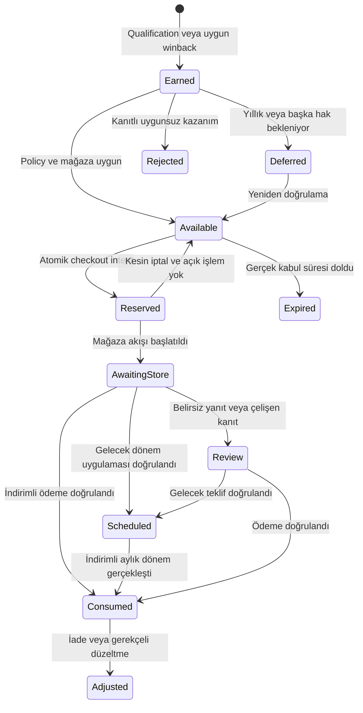

Store çağrısı ile PostgreSQL transaction'ı atomik değildir; idempotent intent + outbox + reconciliation gerekir. İstek zaman aşımında rezervasyonu hemen açarak iki imza/iki teklif oluşturma. Mağaza imzasının gerçek geçerlilik süresi, uygulama quote TTL'sinden farklı olabilir; yeni imza verilmesi ve rezervasyon serbest bırakılması önceki çağrının hâlâ kullanılabilir olup olmadığına göre yapılır. Store kabulünü uygulamanın kendi `reserved_at` zamanı yerine koyma.

`Scheduled` kanıtı alınamamış olsa da kullanıcı normal aboneliğini kullanır. Kampanya durdurulunca daha önce mağazada kabul edilmiş teklif geri alınmış varsayılmaz; settlement consumer çalışmaya devam eder. Bir ay indirim tamamlanınca normal fiyatlı yenileme takibi raporlanır; yeni bir indirim fazı oluşturulmaz.

### 42.10. Canlıya güvenli geçiş

1. Gerçek ürün/base plan/offer/fiyat/legacy kohort ve SDK envanteri; mevcut kayıtlarda uygunluk dry-run'ı. Müşteri verisinde veya mağazada yazma yapılmaz.
2. Local/staging'de additive tablolar, RLS/GRANT, private RPC, event fixture'ları. Ana Auth/AI/rapor testleri aynen çalışır.
3. Sandbox/lisans test kullanıcılarıyla Apple/Google aynı-plan indirim, sona ermiş abonelik, indirimli dönem ve onu izleyen tam fiyatlı yenileme kanıtı.
4. Eski üretim binary + önerilen yeni katalog uyumu: normal deneme bozulmuyor, özel Google teklifleri otomatik seçilmiyor, eski backend yeni sınıfları okumak zorunda kalmıyor.
5. Insan onaylı mağaza offer yayınlama; fiyat/bölge/phase doğrulama çıktıları kaydı. Gizli backend flag tek başına mağaza izolasyonu sağlamaz.
6. Backend family/qualification shadow → sınırlı allowlist → kontrollü canary. Gerçek bildirim/e-posta en son açılır; testteki müşterilere toplu mesaj çıkmaz.
7. Maliyet, wrong-price, duplicate benefit, unauthorized offer, paid-access kaybı, mail şikâyeti ve normal trial dönüşümü izlenir; uygunsuzlukta yeni kampanya üretimi durur.
8. Ödenmiş abonelikler, kazanılmış geçerli haklar ve gerçekleşmiş mağaza indirimleri korunarak roll-forward düzeltme yapılır. Production DB'yi eski yedeğe çevirip yeni kayıtları silmek kampanya rollback yöntemi değildir.

Ayrı kapılar: `referral_plus7_enabled`, `referral_monthly20_enabled`, `winback_monthly20_enabled`, `campaign_push_enabled`, `campaign_email_enabled`, `campaign_inapp_enabled`. Önceki önerilen Pro hediye/analiz ödülü yolları yeni campaign policy tarafından üretilemez. Kullanıcının gerçekten eski koşulda kazandığı kanıtlanmış bir grant varsa sözleşme/audit korunur; toplu silme yapılmaz.

---

## 43. Kampanya optimizasyonu, ölçüm ve admin yönetimi

### 43.1. Araştırmanın sonucu ve kanıt sınırı

**Karar:** Kullanıcının belirlediği %20 korunur. İlk yayında indirimi büyütmek yerine doğru uygunluk, kolay teklif kullanımı, gönderim zamanı ve sonraki normal fiyatlı yenileme optimize edilir. Uygulamanın ham dönüşüm, iptal nedeni, birim maliyet ve geçmiş kampanya verileri verilmediğinden “en iyi gün/saat” veya beklenen gelir artışı hesaplanmış değildir.

RevenueCat'te Hannah Parvaz'ın kendi uygulama deneyimine dayanan yazısı, %20 ve %30 indirim denemesinde benzer dönüşüm elde edildiğini ve daha küçük indirimin gelir açısından daha iyi kaldığını anlatır. Bu tek uygulama deneyimi, daha büyük indirimin her zaman gerekli olmadığını gösteren bir örnektir; İSG Adası için %20'nin evrensel optimum olduğunu kanıtlamaz. Buradaki 72 saat bekleme, 14 günlük kullanım penceresi ve mesaj takvimi **ürün hipotezidir**, araştırmada ispatlanmış sektör standardı değildir. [S14]

İlk satın almada fiyatın çok yüksek algılanması, kullanıcının az firma yönetmesi, onboarding'de takılması ve geçici ihtiyaçsızlık aynı sorun değildir. Ürün sahibi isteğe bağlı, atlanabilir bir ayrılma nedeni seçimi sunabilir; abonelik iptalini bu soruya bağlayamaz. Önceki teknik hatalar nedeniyle ayrılmış kullanıcıya önce hata çözümü gösterilir. İndirime rağmen temel işlev sorunu sürüyorsa kampanyayı büyütmek yerine problemi düzeltmek önceliklidir.

### 43.2. Başarı ölçümü: daha çok tıklama değil, daha sağlıklı geri dönüş

Ölçüm birimi `canonical_user_id + campaign_family` olur. Aynı uzmanın iOS/Android cihazı, e-posta ve push tıklamaları ayrı müşteri sayılmaz. Uygunluk tarihi, ilk gösterim, kanal gönderimi, teklif kabulü, gerçek indirimli dönem ve sonraki normal yenileme farklı olaylardır.

| Metrik | Kesin tanım / payda | Karara etkisi |
|---|---|---|
| Uygun kullanıcı sayısı | Aynı kural sürümüyle uygun bulunan tekil hesap; dışlanan nedenler ayrıca | Erişilebilir gerçek kitleyi gösterir. |
| Teklif görüntüleme oranı | Teklifi gerçekten gören / uygun hesap | Teslim ve görünürlük; e-posta açılmasını kesin kişi davranışı sayma. |
| İndirimli geri dönüş | Doğrulanmış indirimli aylık dönem başlayan / uygun hesap | Satın alma başarısı; CTA tıklaması yerine ödeme kanıtı. |
| Normal fiyata devam | Sonraki indirimsiz dönemi doğrulanan / takip penceresi olgunlaşmış indirimli geri dönen | Sadece ucuz ilk ay için gelip gitmeyi ayırır. |
| 60/90 günlük net katkı | Net mağaza geliri eksi iade, değişken AI/depolama/ileti maliyeti / olgunlaşmış uygun hesap | Önerilen ana ekonomik değerlendirme. |
| Davetten gerçek kullanıcı kazanımı | Nitelikli yeni uzman / kayıtlı geçerli davet claim'i | Tıklama/sahte hesap büyümesini başarı saymaz. |
| Hediye sonrası ücretli dönüşüm | Gerçek ücretli dönem başlayan / bitişi yeterince geçmiş hediye alan | Davet hediyesinin iş etkisi; mağaza denemesiyle karıştırma. |
| İstenmeyen etki | Bildirim/mailden çıkma, spam, destek şikâyeti, yeniden hızlı iptal, tekrar kullanım girişimi | Dönüşüm artsa da kampanyayı durdurabilecek güven göstergeleri. |
| Teklif uygulama hatası | Yanlış fiyat, tam fiyat fallback girişimi, yanlış dönem, yinelenen kullanım | Ticari hata ve kullanıcı zararı; otomatik alarm. |

Net tutar zaten indirimli tahsilatı içeriyorsa indirim ikinci kez maliyet olarak düşülmez. Ülke/para birimleri doğrudan toplanmaz; kur yöntemi ve işlem tarihi belirlenir. Sandbox, admin testleri, iade edilen işlemler ve henüz ikinci yenileme zamanı gelmemiş kohortlar ayrı tutulur. `revenue=null` sıfır gelir değildir; “henüz doğrulanmadı”dır. Mağaza finansal raporuyla operasyonel webhook toplamı uzlaştırılmadan kesin finansal bilanço ilan edilmez.

**Basit temsili kontrol:** Aynı 1.000 uygun kullanıcıda indirimsiz geri dönüş %5 ve aylık fiyat P olsun: ilk dönem brüt gelir 50P olur. %20 indirimle dönüşüm %6 olursa 60 × 0,8P = 48P olur. Dönüşüm göreli %20 artmış olsa da ilk dönem geliri azalmıştır. Ek maliyetler ve sonraki yenilemeler yok sayıldığında aynı ilk dönem gelirine ulaşmak için dönüşümün en az %6,25 olması gerekir. Bu yalnız matematik örneğidir, uygulamaya ait tahmin veya benchmark değildir. Uzun dönem karar 60/90 günlük katkı ve normal yenilemeyle alınır.

### 43.3. Deney planı ve indirim bağımlılığını önleme

1. **Önce teknik doğruluk:** Sadece internal/staging ve onaylı dar canary. İki mağazada doğru fiyat ve dönem, eski binary güvenliği, izinler ve idempotency kanıtlanmadan pazarlama deneyi başlatılmaz.
2. **Sonra zamanlama:** Sabit %20 ile 3 gün ve 7 gün gibi iki başlangıç zamanı denenebilir. Başlangıç hipotezindeki süreyi değiştirmek kampanya sürümü gerektirir. Yetersiz kitlede çoklu varyant açılmaz; kullanıcıya vaat edilmiş son tarih kısaltılmaz.
3. **Ardından anlatım:** Aynı ekonomik teklif ve aynı uygunlukta kısa değer hatırlatması ile yalın fiyat anlatımı karşılaştırılabilir. Kişinin gerçek verisinden “17 riskin açık” gibi hassas detay dış bildirimde kullanılmaz.
4. **Kanal etkisi:** Consent'i uygun aynı kitlede push veya e-posta zamanlaması test edilebilir; opt-out olmuş kitleye mesaj göndererek örneklem tamamlanmaz. Aynı kullanıcı aynı gün üç kez hedeflenmez.

Deney ataması hesaba bağlı ve kararlı olmalıdır. İlk [A0] şema A/B olaylarını taşıyabilse de runtime deterministik atama olmadığı belirtilmiştir; bu özellik zaten var sayılmaz. `experiment_key`, `variant`, `eligibility_at`, `assigned_at`, exposure ve analiz penceresi kalıcı tutulur. Mağaza, Plus/Pro ve geçmiş ücretli süre gibi önceden seçilmiş kırılımlar raporlanır; çok küçük grupların rastlantısal farkıyla karar verilmez. [A0]

**Kontrol grubu için yetki sınırı:** Kampanyasız kontrol veya geç gönderim yalnız ürün sahibinin önceden onayladığı deneyde ve henüz kişiye kampanya hakkı vaat edilmemişse yapılır. Kazanılmış davet ödülü deneye göre reddedilemez. Ürün sahibi tüm uygun kişilere aynı anda teklif istiyorsa A/B yalnız içerik/zamanlama katmanında yürütülür; kontrolsüz önce/sonra karşılaştırmasına “nedensel kampanya etkisi” denmez.

Tek seferlik kullanım hesabın tüm mağaza geçmişine bağlıdır. Hesabı yeniden açmak, planı değiştirmek veya yeni kampanya sürümü aynı indirimi tekrar üretmez. Buna rağmen kimliği farklılaştıran kararlı kötüye kullanıcının tamamen engelleneceği vaat edilmez; sınırlı ekonomik risk, bütçe, cihaz bütünlüğü sinyalleri ve itirazlı insan incelemesi kullanılır. Tek başına aynı IP/işyeri ağı sahte hesap kararı değildir. ATT gerektiren fingerprint/retargeting ve e-posta hash'i reklam ağı eşleştirmesi bu optimizasyonun parçası değildir.

### 43.4. Admin panelinde eklenecek alanlar

Mevcut panel genişletilir; gerçek framework ve admin scope'ları [A0]/depo keşfinden belirlenir. Kampanya operatörü müşteri adına satın alma yapamaz veya `user_subscriptions` satırını elle paid yaparak indirim uygulayamaz.

| Admin alanı | İşlev | Güvenlik / yayın kapısı |
|---|---|---|
| Kampanya tanımı | Davet Plus7, davet monthly20, Geri Dönüş monthly20; metin, başlangıç, pencere, sınır | Sabit amaç/ödül tipli şema; keyfi SQL/JS çalıştırma yok. |
| Uygunluk simülasyonu | Kaç hesap, neden uygun/dışlandı, kaç kanal izni var | Read-only ve içeriksiz örnek; canlı gönderim/grant yok. |
| Mağaza eşleme | Store, ürün, base plan, offer ID, bir dönem, yerel fiyat kanıtı, SDK/build desteği | Teklif varlığı/fiyat/legacy kontrolü onaylanmadan `published` yok. |
| Kullanıcı avantajları | Kazanılmış hediye, aktif hediye, indirim available/scheduled/consumed | Hediye erişimi ile tahsilat indirimi ayrı sütun. |
| Gönderim planı | Push, email, in-app; frekans, quiet hours, kanal izinleri | Aynı amaç tek üretici; global baskı bütçesi. |
| Faturalama uzlaştırma | Teklif kabulü, ilgili işlem, gerçek fiyat/dönem, iade | Null/uyuşmazlık ayrı kuyruk; otomatik kesin tüketim yok. |
| Ekonomik sonuç | Olgunlaşmış kohort, normal yenileme, katkı, iade, şikâyet | Ölçüm tanımı/filtreler görünür; unknown veri saklanmaz. |
| Acil durdurma | Yeni claim, yeni teklif sunumu veya yeni mesajı ayrı kapatma | Kazanılmış erişim ve mağazada kabul edilmiş işlem silinmez. |

Admin onay süreci `draft → simulated → reviewed → allowlist → published → paused/retired` biçimindedir. İçerik/kural değişimi yeni versiyon; eski uygunluk, ödül ve mesaj snapshot'ları değişmez. Fiyat/ödül oranı değişikliği yalnız metin düzenlemesi değildir; ayrı ekonomik onay gerekir. Mağaza kataloğuna yazma işlemi de ayrıca insan onaylıdır.

### 43.5. Birinci taraf olay sözlüğü ve veri kalitesi

Yeni kampanya olayları, mevcut ürüne uygun ayrı tipli olay katmanıyla mevcut admin/ölçüm yapısına bağlanır. [A0]'daki enum/CHECK listelerine var olmayan event isimleri körlemesine yazılmaz.

```text
referral_claim_created / referral_qualification_passed / referral_qualification_rejected
campaign_benefit_earned / campaign_benefit_activated / campaign_benefit_expired
winback_eligibility_evaluated / winback_episode_opened / winback_episode_suppressed
campaign_message_queued / campaign_message_suppressed / campaign_message_accepted
campaign_offer_viewed / campaign_offer_dismissed / campaign_offer_prepare_failed
store_offer_presented / store_offer_cancelled / store_offer_pending
store_offer_application_verified / discounted_period_settled
normal_price_renewal_after_offer / campaign_redemption_conflict / campaign_refund_adjusted
```

Ortak metadata: `event_id`, server/client occurrence ayrımı, `canonical_user_id`, `benefit_id`, `campaign_family`, `campaign_version_id`, `store`, `product_id`, `offer_mapping_id`, `platform`, `app_build`, `reason_code`, `support_id`. Para verisi yalnız server-doğrulanmış ekonomik kayıttan gelir. Fiyat, kampanya koşulu ve storefront snapshot'ları genel client analytics payload'ından değil kontrollü ticari tablodan okunur. Ham e-posta, parola, OTP, satın alma token'ı, teklif imzası/JWS veya kişisel not/çalışan içeriği loglanmaz.

Dedupe oranı, geç gelen webhooklar, eşlenemeyen teklif işlemleri ve lifecycle güncelliği admin görünümünde gösterilir. Push servisinin `accepted` cevabı telefonun bildirimi kesin gördüğünü kanıtlamaz. E-posta açılma ölçümünü artırmak için gizli izleme pikseli şart koşulmaz. Finansal başarı client “purchase_success” olayından üretilmez; mağaza/RevenueCat uzlaştırması esas alınır.

---

## 44. V5 uygulama paketleri, kabul testleri ve tek güncel Codex talimatı

### 44.1. Bağımlı uygulama sırası

Bu paketler önceki İSG domain fazlarını iptal etmez. §33 güncel davet kuralı, §41 Geri Dönüş, §42 ekonomik/mağaza sözleşmesi, §43 ölçüm tanımıdır. Aşağıdaki işler genel yayın tarihinden önce tamamlanır; henüz uygulanmamış kampanya ana uygulamanın çalışmasını engellemez.

| Paket | Giriş koşulu | Çıktı / çıkış kapısı |
|---|---|---|
| V5-A — Mevcut durum ve ticari karar | [A0], V4, gerçek repo read-only; sırlar loglanmaz | Mevcut ürün/base plan/offer/SDK/guard/cron/tercih envanteri; yıllık davetçi ve tekrar sıklığı kararı; fark raporu. |
| V5-B — Ekonomik hak ve lifecycle | A; owner/RLS ve event idempotency temeli | Gift vs discount ayrımı, canonical hesap, benefit/episode/settlement modeli; negatif erişim ve paralellik testleri. |
| V5-C — İki mağaza teklif provası | A–B; kontrollü katalog hazırlığı için insan onayı | Apple aynı aylık ürün sonraki dönem; Google aynı base plan doğru replacement; bir dönem %20 + normal yenileme kanıtı. |
| V5-D — Davet Plus7 ve monthly20 | B–C; gerçek server qualification | Free/paid dalları, invitee7, bankalama/çakışma politikası, sıfır tekrarlı ödül; mevcut quota/helper entegrasyonu. |
| V5-E — Geri Dönüş ve iletişim | B–C; lifecycle ve kanal izinleri | Gerçek expiry kitlesi, 72h/14gün aday takvim, pazarlama email/push/in-app, anında resubscribe suppression. |
| V5-F — Admin ve ölçüm | D–E | Dry-run, sürüm onayı, budget, halt, uzlaştırma, olgunlaşmış kohort, deney ataması; ekran tasarımı kullanıcıdan. |
| V5-G — Yayın güvenliği | A–F; aşağıdaki testler, eski binary testleri | İki fiziksel platform; store QA; satın alınmış/eski hak koruması; ayrıca insan yayın onayı. |

Mağaza C paketindeki ürün değişiklikleri feature flag kapalı diye risksiz sayılmaz. Eski katalogla yeni binary testi kadar **yeni katalogla eski binary testi** gerekir. Store sandbox/Play testlerinde takvim hızlandırılmış olabilir; gerçek ay uzunluğunu sabit 30 gün hesaplamayan kod ve operasyonel zamanlama ayrıca kontrol edilir. [S07][S04]

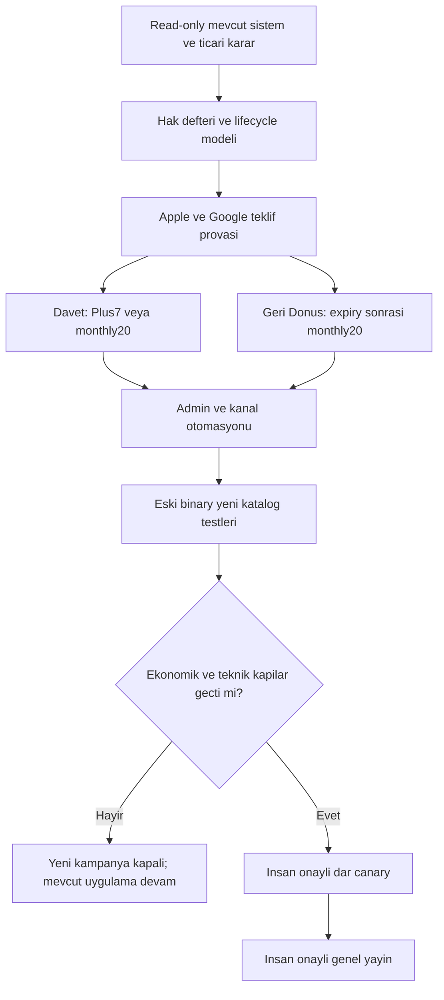

### 44.2. Ek kabul senaryoları

Bunlar **çalıştırılacak testlerdir**, bu Markdown revizyonuyla geçmiş sayılmaz. Önceki domain/Auth/upload/owner testleri korunur; aşağıdaki vakalar özel mağaza ortamlarında ve ilgili server fixture'larıyla kanıtlanır.

| ID | Senaryo | Beklenen sonuç |
|---|---|---|
| V5-01 | Free uzman nitelikli yeni uzman davet eder | İki kişiye ayrı 7 günlük Plus hakkı; Pro/analiz paketi yok. |
| V5-02 | Aktif ücretli Plus aylık davet eder | Davet edene bir Plus aylık dönem %20; davet edilene Plus7. |
| V5-03 | Aktif ücretli Pro aylık davet eder | Davet edene bir Pro aylık dönem %20; davet edilene Plus7. |
| V5-04 | Plus/Pro yıllık davet eder | Açıkça tanımlanmış aylık uygunluğu bekleyen hak; yıllık faturaya %20 veya zorunlu plan değişimi yok. |
| V5-05 | Yalnız link tıklaması / email doğrulaması / login | Qualification tamamlanmaz; ödül yok. |
| V5-06 | İki gerçek kullanım günü, geçerli başarı olayı | Tanımlı uygunluk sağlanır; en çok bir işlem grubu ödül üretir. |
| V5-07 | Free'nin firma oluşturamaması | Ücretsiz kullanılabilen analiz olayıyla qualification mümkün; ücretli özellik zorunlu değil. |
| V5-08 | Not defteri / otomatik heartbeat / başarısız analiz | Qualification kanıtı yerine geçmez. |
| V5-09 | Aynı claim için eşzamanlı worker | Unique ledger; iki hediye/indirim üretmez. |
| V5-10 | Kendi kendine davet, hesap sağlayıcısı değişimi, restore | Canonical hesap kontrolü; tekrar ödül yok. |
| V5-11 | Aynı OSGB ağı/IP kullanan iki gerçek uzman | Tek sinyal nedeniyle otomatik hak iptali yok; çoklu kanıt/itiraz. |
| V5-12 | Hediye aktivasyonu | 7×24 saat erişim; store tahsilatı/auto-renew oluşmaz. |
| V5-13 | Davet hediyesi ve store trial birlikte görünür | Ayrı süre/şart; mağaza denemesi otomatik uzamaz veya iki kez başlatılmaz. |
| V5-14 | Hediye bitince fazla firma/veri | Okuma/veri geri alma sürer; otomatik veri silme yok. |
| V5-15 | Abonelik sorgusu hata/null | Paid davetçi Free varsayılarak yanlış hediye alamaz; değerlendirme ertelenir. |
| V5-16 | Apple aktif aynı aylık ürün teklifi | Kullanıcı onayından sonra uygun sonraki döneme indirim; yanlış anlık ek tahsilat yok. |
| V5-17 | Apple teklifini kapatma/iptal | Hak consumed olmaz; tam fiyat satın alma başlatılmaz. |
| V5-18 | Apple lapsed aylık kullanıcı | Onaylı promotional offer ile bir indirimli ay; sonraki normal ücret açık. |
| V5-19 | Apple 3 günlük geri dönüşte native Win-Back seçimi | Yanlış mekanizma engellenir; erken kampanya promotional adapter'ı kullanır. |
| V5-20 | Google aktif aynı base plan teklifi | Testlenmiş WITHOUT_PRORATION; ilk uygun yenilemede indirim, istenmeyen plan değişimi yok. |
| V5-21 | Google API oranı | %20 indirimde ödenecek oran 0.8; 0.2 ile %80 indirim hatası engellenir. |
| V5-22 | Google süresi bitmiş abonelik | Aktif replacement akışı değil, uygun normal offer satın alması. |
| V5-23 | Yeni Google teklifleri + eski paywall | `rc-ignore-offer`/seçim guard'ı; herkese indirim veya trial bozulması yok. |
| V5-24 | Kampanya flag kapalı ama mağaza kataloğu yeni | Eski/yeni normal satın alma ve trial beklenen fiyatla çalışır. |
| V5-25 | Store offer eksik/uygunsuz/başka para birimi | CTA güvenli kapanır; tam fiyat fallback veya yanıltıcı %20 etiketi yok. |
| V5-26 | Grandfather düşük eski fiyat | Gerçek sonraki ödeme ve promo sonrası ücret kontrol edilir; daha pahalı teklif ödül sayılmaz. |
| V5-27 | Başka Store hesabının receipt'i / iki cihaz | Sahiplik guard'ı korunur; çift mağaza aboneliği teşvik edilmez. |
| V5-28 | Aynı tier satın alma guard'ı | Yalnız doğrulanmış kampanya continuation'a dar izin; sıradan mükerrer satın alma hâlâ engellenir. |
| V5-29 | Offer callback başarılı, tier hâlâ Plus | İndirim uygulandı kanıtı sayılmaz; ayrı settlement beklenir. |
| V5-30 | Timeout sonrası geçerli mağaza işlemi gelir | Reconcile aynı attempt'i tamamlar; ikinci indirim sunulmaz. |
| V5-31 | Yinelenmiş/geç/sırasız webhook | Tek settlement; eski olay yeni lifecycle'ı geri çeviremez. |
| V5-32 | `will_renew=false`, dönem bitmemiş | Geri Dönüş teklif/mesajı yok. |
| V5-33 | Billing issue, grace, account hold/pause | Winback yerine uygun ayrı recovery/suppression; yanlış %20 yok. |
| V5-34 | Gerçek ücretli aylık expiry, 72h sonrası | Onaylı aday kurala göre tek winback episode; diğer koşullar yeniden kontrol edilir. |
| V5-35 | Yalnız trial/gift expiry veya yıllık expiry | Bu winback ailesi açılmaz. |
| V5-36 | Refund/revocation ve şüpheli mağaza geçmişi | Otomatik indirimli dönüş ödülü yok; reason ayrı. |
| V5-37 | Başka mağazada aktif paid abonelik | Winback bastırılır; mevcut tek hesap erişimi korunur. |
| V5-38 | Kuyruk sonrası yenileme / tekrar satın alma | Gönderim anında recheck; email/push iptal, in-app teklif kapanır. |
| V5-39 | Push izni var, marketing veya email izni yok | İlgili izinsiz kampanya kanalı kapalı; OTP kabulü pazarlama rızası değildir. |
| V5-40 | Push ve email aynı kampanya | Önerilen aralık/global cap, no-double-send; gerekli süreç bildirimleri ayrı sınıf. |
| V5-41 | Email linkini bot/önizleme açar | GET'te ödül tüketimi/satın alma/otomatik login yok. |
| V5-42 | Eski binary kampanya route'unu bilmiyor | Güvenli update/fallback; gerçekleştiremeyeceği indirim vaat edilmez. |
| V5-43 | Tek dönem indirim tüketildi; ikinci normal yenileme | Normal fiyat kanıtlanır; kampanya yeniden tüketilemez. |
| V5-44 | Plan/platform/kampanya versiyonu değiştirme | Hesap başına once kuralı sıfırlanmaz. |
| V5-45 | Davet indirimi + winback aynı anda uygun | Öncelik ve tek rezervasyon; bir döneme iki indirim veya iki tüketim yok. |
| V5-46 | Kullanılmış indirimli ödeme iade edilir | İade/adjustment izi; otomatik yeniden kullanılabilir kupona dönüşmez. |
| V5-47 | Mağaza tarafından gerçekten ödenmiş fakat uygulama eşlemesi sorunlu | Geçerli paid erişim korunur; ekonomik inceleme ayrıca. |
| V5-48 | Budget/pause sırasında kazanılmış hak | Yeni kazanım/sunum durur; kazanılmış hediye ve onaylı mağaza işlemi sessiz iptal edilmez. |
| V5-49 | Admin yeni kural yayınlar | Dry-run/review/audit gerekir; eski opt-out/once geçmişi korunur. |
| V5-50 | Eski notification CHECK'ine yeni tür yazma | Migration/adaptör testi; eski worker'a geçersiz kind basılmaz. |
| V5-51 | Hediye erişimiyle firma/rapor/analiz | company helper/RLS/trigger/backend capability tutarlı; client-only unlock yok. |
| V5-52 | Store/test ortamı karışması | Sandbox işlem gerçek hesap avantajını veya finansal metriği tüketmez. |
| V5-53 | İlk/ikinci renewal henüz vadesiz kohort | Başarısız/0 diye sayılmaz; olgunlaşma penceresi doğru. |
| V5-54 | Güvenlik/telemetry denetimi | Token, imza, mail ve hassas içerik log yok; ATT gerektiren veri çıkışı yok. |
| V5-55 | Eski V4 ödül kaydı gerçek depoda bulunur | İnsan onaylı geçiş; verilmiş söz tutulur, global silme yok. |
| V5-56 | Bildirim reddi/analitik tercihi | Davet veya hediye kazanmak pazarlama rızasına zorlanmaz. |

### 44.3. Ticari ve platform risk kaydı

| Risk | Önlem | Yayın durdurma koşulu |
|---|---|---|
| “Sonraki faturaya otomatik” yanlış vaadi | Kullanıcı kabulü, fiyat/dönem önizlemesi; store kanıtı | Onaysız tahsilat veya farklı dönem/fiyat. |
| İndirim her eski kullanıcıya görünür | Google default-offer filtre, eski binary katalog testi; Apple kontrollü imza/uygunluk | Legacy satın alma fiyatı/denemesi bozulur. |
| Sahte referral / kupon tekrar kullanımı | Gerçek server activity, tekil claim, ekonomik ledger, budget, itiraz | Sınırsız tekrarlı hak veya hak başkasına geçer. |
| Store sunduğu ekonomik uygunluk app koşulundan daha geniş | Dar sunum/signing, mağaza koşulları, bütünlük sinyalleri; kalan riski kabul kaydı | Risk bütçesi aşılıyor veya per-user garanti yanlış sunuluyor. |
| Eski abonenin fiyat/hak kaybı | Grandfather fiyatı ve indirim sonrası ücret doğrulaması; ayrı floor | Ödül mevcut sözleşmeyi kötüleştirir. |
| Normal renewals indirime kayar | Gerçek expiry + bekleme + once + normal yenileme/katkı takibi | İptal/indirim bağımlılığı ve net katkı hedef dışı. |
| Kanal şikâyeti ve izin ihlali | Ayrı marketing/email dayanağı, opt-out, frekans ve send-time recheck | İzinsiz kampanya gönderimi. |
| Lifecycle yanlış | Doğrulanmış geçmiş, all-store aktif kontrolü, null/unknown erteleme | Aktif/grace kullanıcıya yanlış winback veya paid erişim kaybı. |

Parasal fiyatlar, gerçek Apple price point'leri, mağazadaki mevcut offers, minimum desteklenen uygulama sürümleri ve mevcut kodun offer-purchase desteği bu çalışma kapsamında üretimden doğrulanmadı. Bunlar V5-A/C'nin zorunlu keşif çıktılarıdır; planın yazılması iki mağazada canlı çalıştığı anlamına gelmez.

### 44.4. Kesin kararlar, onaya açık detaylar ve ilk dosyalar

**Kesin:** Free davetçiye Plus7; ücretli Plus/Pro aylık davetçiye bir aylık %20; nitelikli yeni davetliye Plus7. Sona ermiş ücretli Plus/Pro aylık aboneliğe bir kez %20 Geri Dönüş. Doğrulanmış hesap ve aktiflik; iki platform; mevcut altyapı ve kullanıcı hakları korunur. Eski yüksek ödül kampanyası yeni planın koşulu değildir.

**Onaya açık güvenli öneriler:** Davetçinin program boyunca en çok bir ödül alması; yıllık davetçinin hakkını aylık uygunluğa kadar tutma yöntemi; 2 ayrı aktif gün, qualification ve hediye aktivasyon pencereleri; 72 saat bekleme/14 gün offer penceresi; max2 dış mesaj ve global sıklık; tekrar teklif episode limiti; indirim sonrası normal ücrete devam metni; dar cohort/deney ve kampanya bütçesi. “Bir ödeme için indirim” ile “her davette yeni indirim” farklı kararlardır; ikinci davranış kendiliğinden uygulanmaz.

İlk çıktı dosyaları (depo standardına uyarlanabilir):

```text
BASELINE_DIFF.md
EXISTING_TO_V5_INTEGRATION_MAP.md
V5_DECISION_REGISTER.md
STORE_OFFER_FEASIBILITY_MATRIX.md
REFERRAL_QUALIFICATION_AND_BENEFITS.md
WINBACK_ELIGIBILITY_AND_SUPPRESSION.md
LEGACY_PRICE_AND_ENTITLEMENT_GUARDS.md
CAMPAIGN_CONSENT_AND_DELIVERY_MATRIX.md
STORE_SETTLEMENT_RECONCILIATION.md
V5_ACCEPTANCE_EVIDENCE.md
```

Her dosyada “belgede mevcut”, “depoda doğrulandı”, “öneri”, “test edilmedi” ayrımı korunur. Store fiyatı, secret, signing key, receipt veya gerçek kullanıcı belgesi bu dokümanlara kopyalanmaz. Önceki V4 kapsamından ayrı bir kırılma bulunursa scope büyütülmez; karar kaydına yazılır.

### 44.5. Codex’e verilecek tek güncel görev emri

```text
ISG_ADASI_MASTER_INTEGRATION_PLAN_V5.md ve PROJECT_ARCHITECTURE.md dosyalarını oku.
V5 tek güncel konsolide ürün/entegrasyon planıdır. V2/V3/V4 görev emirlerini ayrıca
uygulama. Eski dokümanlardan yüksek referral ödüllerini geri getirme.

Varsayılan çalışma read-only keşif, local ve staging'dir. Production DB/deploy/
cron/feature flag, App Store Connect, Google Play Console, RevenueCat katalog ve
fiyatları, gerçek müşteri verisi veya gerçek bildirim/email üzerinde ayrı açık
insan onayı olmadan değişiklik yapma. Mağaza teklifini sadece oluşturmak bile eski
binary'leri etkileyebilir; backend flag kapalı olması tek başına izolasyon değildir.

Önce §39 ve §42.5'e göre A0-gerçek repo farkını çıkar. Mevcut Auth, RevenueCat,
company_limit_for_user, companies trigger/RLS, analyze/report quota, push/email,
notification CHECK'leri, webhook/sync ve admin panelini yeniden yazma.
Ürün kimlikleri, lowercase Supabase UUID ve backend entitlement otoritesi korunur.

1. Önceki kapsam korunur: tek son kullanıcı uzman; sağlık kayıtları yok; dış şirket
   hesabı/portal/onayı yok. Firma yetkilisi sadece raporda metin ad/unvan olabilir.
   Not Defteri kişiseldir; şirket/çalışan/İSG task bağlantısı yok.
2. Mevcut Apple/Google/OTP oturum ve giriş yollarını koru. Email+şifre signup,
   ardından mail kodu doğrulaması; minimum8+büyük/küçük/rakam. Sosyal giriş
   sonrası şifre ekleme atlanabilir; ikinci hesap yaratma. Recovery/MFA korunur.
3. Bildirim onboarding'i tek sade açık seçim; detaylar profilde. Pazarlama kapsamı
   görünür, eski kapalı tercihler korunur. Push izni email pazarlama izni değildir.
   ATT gerektiren client/server tracking açma; hassas içerik loglama.
4. Plus/Pro aylık/yıllık ve eski kullanıcı hakları korunur; tüm ana modüller açık.
   3/30 firma,5/50GiB öneri; personel/eğitim ticari hard-limit yok. Mevcut AI
   Plus10+2/Pro40+10 günlük hakları ve rapor sözleşmelerini sessiz azaltma.
5. Güncel referral: Free davetçi ve yeni davetli ayrı ayrı7günPlus. Gerçek ücretli
   Plus/Pro aylık davetçi kendi aylık ürününde yalnız bir dönem%20 indirim kazanır;
   davetli yine7günPlus. Yıllık fatura indirimi veya zorunlu monthly geçişi yok;
   yıllık davetçi politikasını karar kaydında netleştir. Link/signup/heartbeat
   yeterli değil; server doğrulanmış gerçek kullanım ve tekil qualification şart.
6. Hediye7gün non-renewing uygulama erişimidir; store trial/fatura uzatmaz. Fiyat
   indirimi entitlement tier veya quota credit değildir. Ayrı campaign benefit,
   store mapping/attempt/settlement kaydı kur; mevcut user_subscriptions paid
   otoritesini kopyalama veya promo için elle düzenleme.
7. Apple: mevcut aynı aylık ürün promotional offer; kullanıcı kabulü ve uygun
   sonraki billing event. Google: uygun developer-determined subscription offer,
   tek indirimli P1M faz; aynı active base-plan için testlenmiş WITHOUT_PRORATION.
   relativeDiscount ödenecek oran ise0.8;0.2 değil. rc-ignore-offer ve explicit
   option seçimini eski/yeni gerçek SDK ile test et. Coupon/gift API fatura indirimi
   değildir. Teklif yoksa sessiz full-price purchase yok.
8. %20 gerçek storefront ve kullanıcının korunmuş fiyatına göre kanıtlanmalı.
   Promo sonrası normal ücret görünür. Mevcut aynı-tier/receipt owner guard'ını
   kaldırma; yalnız backend-approved offer continuation için dar istisna tasarla.
   Client başarı veya aynı Plus tier snapshot'ı indirimin uygulandığı kanıtı değildir.
9. Geri Dönüş: gerçek paid aylık expiry, yenilenmemiş, diğer store'da paid aktif
   değil, daha önce kampanya tüketilmemiş. Cancellation/trial/gift/yearly expiry
   veya billing recovery'yi aynı segment yapma. Başlangıç hipotezi expiry+72h,
   14gün teklif; kanallar push+email+in-app, izin ve global frekans kontrollü.
   Apple native Win-Back'in en erken1ay kuralıyla3gün kampanyasını karıştırma;
   erken dönüş Apple promotional offer/Google uygun offer üzerinden yürür.
10. Tek mağaza işlemiyle tek ekonomik avantaj. Referral/winback çakışmasını kilitli
    rezervasyon ve unique ledger ile çöz. Timeout, geç webhook, refund ve çift
    cihazı reconcile et; geçerli paid erişimi kampanya incelemesiyle cezalandırma.
    Mağaza satın alması DB transaction'ıyla atomik değildir; kanıt ve outbox gerekir.
11. Yeni tipleri legacy notification_jobs CHECK'lerine körlemesine yazma. V4 ortak
    domain queue ve mevcut APNs/FCM transport'unu kullan. Marketing email'ini Auth
    OTP kuyruğundan ayır. Gönderimden hemen önce renewal ve consent'i tekrar kontrol
    et. Link GET/unfurl hak tüketmez; auth sonrası aynı mağaza teklifine gider.
12. Admin dry-run/review/allowlist/publish/pause, fiyat kanıtı, bütçe, lifecycle ve
    settlement ekranlarını mevcut panelde genişlet. Başarıyı salt tıklama değil,
    gerçek discounted period, normal yenileme ve60/90gün net katkı ile ölç.
13. PDF/mobilfoto/Word/Excel güvenli upload, karantina-scan-promote ve önceki tüm
    İSG domain kapsamları korunur. Kullanıcı UI/logo/icon/screenshots sağlayacak.
14. §44 paket sırasını kullan. Additive migration, RLS/GRANT negatif testleri, aynı
    contract iki native uygulama, yeni katalogla eski binary ve56 V5 test kanıtı.
    Çalıştırılmayan test başarılı yazılmaz. Sonunda değişen dosya/migration/flag,
    regression etkisi, kalan risk ve insan onayı gerektiren işlemleri raporla.
```

**Belge sonu — V5.0 / 12 Eylül 2026.** Bu dosya uygulanabilir ürün/entegrasyon planıdır. Mağaza tekliflerinin gerçek hesapta kullanıldığı, kodun değiştirildiği veya kabul testlerinin çalıştırıldığı iddia edilmez. Önceki kaynak dosyalar korunmuş, bu konsolide Markdown revizyonu oluşturulmuştur.

